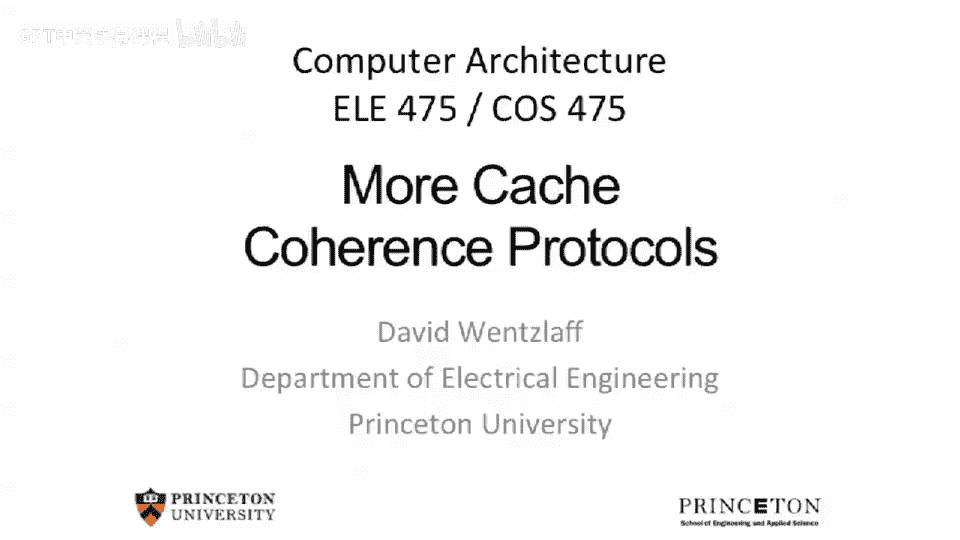
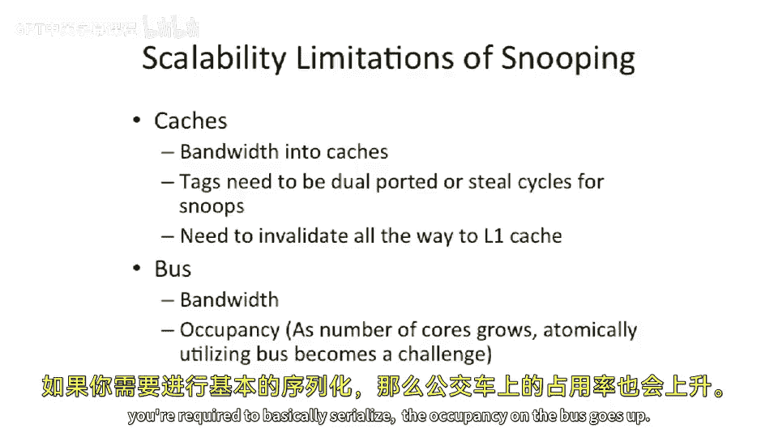
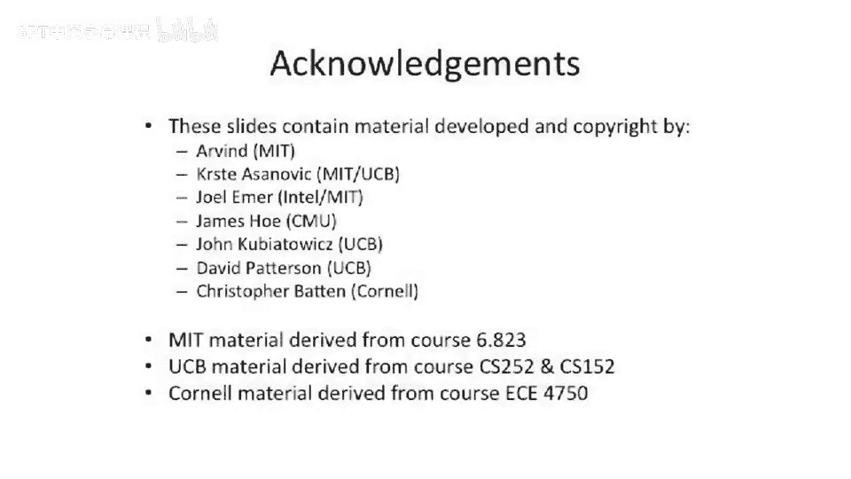

# 【计算机体系结构】普林斯顿—中英字幕 p94 93_02_more-cache-coherence-protocols -BV1ii421D7WR_p94-

So today we are going to continue our adventure in computer architecture and talk more about parallel computer architecture。

 Last time we talked about coherence and memory coherence and cache coherence systems and differentiated that from。

Memory consistency models。Which is a model of how memory is supposed to work versus the underlying algorithms that try to keep。

Memory。Consistent and try to implement the consistency models。We left off last time。 We were。

 we were talking about。Mesi or also known as the Illinois Protocol。

 And we walked through all of the different。Arcs through here。And if you recall。

 what we were talking about was we split this shared state。From the MSI protocol into two states。

 shared and exclusive。And the insight here is it's very common for programs to read a memory address。

 which will pull it into your cache and then go modify that memory address。 So， for instance。

 if you want to increment a number， you're going to do a load。

 It's gonna bring into your into your register set， but also into your cache。

 You're going to increment the number。 and then you do it write back to the exact same location。

 pretty common in imperative programming languages。

 declareative programming languages like scheme in such。They many times copy everything。

 but for excuse me， programming languages， it's pretty common to actually change state in place。

So because of that， you can bring it right into this exclusive state。

 And then when you have to go to modify it， you don't to go and broadcast in the bus。

 You don't have to talk to anybody and it removes。🤧嗯。Effectively。

 this intent to write message that you'd have to send otherwise across the bus and waiting for that address to be snooped on the bus or be seen by all the other entities on the bus。

Note， I， I say entities in the bus we've been talking primarily about。Processors the last day。

 but there could be other entities on the bus that want to snoop the bus。

So examples sometimes include coherent。Io devices。So。This isn't very popular right now。

 but I think this will become much more popular as soon as we start to have GPs。

Our graphics processing units or general purpose GPUs。

 which will be sitting effectively very close to our processor on the same bus and want to take part in the coherence traffic of the processor。

 So it's going want to basically read and write the same memory addresses that the processor is reading and writing and take part in the cache coherence protocol。

At a minimum， usually your i devices need to effectively tell the processor when it's doing a memory transaction that the processor should know about。

 So typically， when you're moving data from a Io device to main memory。

That's going to have to effectively go across the bus and everyone's going to have to invalidate their caches。

 You're going to have to snoop that traffic， or they're all going to have to snoop that memory traffic from the IO device。

So we talked about Meie as' an enhancement to MSI。Well， we left off last time。

 and we were gonna talk about two more enhancements that are pretty common。

 One is been used relatively widely in AMD optons。 I think they still use this in AMD。

 I think they use something similar to this still in A D is my understanding。

And the idea is you add an extra state here。Which is called。Ownership or the owned state。

 And effectively， what this is is it looks just like our Mei protocol from before。But now。

 instead of having data in the modified state。When you。

 let's say another processor needs to go access that data。

Instead of having to send all that data back to main memory and invalidate that line out to main memory and go fetch it back from main memory。

Instead， you can do a direct cash to cash transfer。 and this is basically an optimization here。

So you don't have to write back the data to main memory。 And in fact。

 you can allow main memory to be stale。And you can just transfer the data across the bus from the one cache to the cache。

 which needs it。 So in this example here， we're going to look at this edge here。

So another processor wants to read the data， so we see an intent to write to a particular cache line。

And our processor currently has it in the modified state。We see this other processor intent to write。

And。Eest as we intend to read， and we're actually going to provide the data out of our cache。

And not write it back to main memory。And transition the line in our cache。To this owned state。

The other processors can now take it in and take it in in a shared state。

So they will have it a read read only copy。Now。Note， this is only for， for read only。

 We'll talk about if another prosecutor wants to write to the state in a second。

So we have it in this own state。 And what we're trying to do here is this processor is tracking that that data needs to be written back to main memory at some point。

 That's the whole purpose of this state here is we've basically designated a processor which owns the data and owns the modified state。

 So the processors which take it read only。Get it into the shared state。

 And if they need to invalidate the line， they don't need to contact anybody because they had in a shared state。

 They had to read only copy。 They don't need to make any bus transactions。So if you think about it。

 if you actually were to effectively have one core。

 read the state for read this dirty state from the other core。And then at some point。

 it goes in just invalidates it in the， in the second core。 if that。Data is not up to date。

 as in it would be in main memory， you would lose the changes。

So by one processor keeping it in the own state here， it keeps track that at some point。

 if it ever gets invalidated out of that processor as cache。

 it needs to write that out to main memory。To keep it up to date。Now。

 there's a couple other arcs here。 You can transition from the own state back to the modified state if the processor。

 which has it in the own state， wants to go do a right。

It can't do that while it's in the own state because while it's in the own state。

 other processors may have shared copies of it。So。What it needs to do that。

 If it wants to do P1 wants to do it right here， it needs to re invalidate everyone else's copies across the bus。

 So it's gonna have to send an intent to write for that line and everyone else will snoop that traffic and transition to the invalid date。

And then this processor will be able to transition to the modified stage。

 And now it's able to actually modify the data。Okay， so we go。This arc here。

 which we've sort of already talked about， is that if you're in the own state。

 anyone else can get read only shared copies of it。🤧嗯。They can't。Go get an exclusive copy。

Because that would basically violate this notion， because then they would be able to upgrade a modified without telling anybody。

 And we don't want that。But they can get shared， read only copies of the data。

And then there's this arc here， from owned to invalid。

Is if some other processor wants to write the data。We're going processor 1， P1 here will say。

 we'll see the intent to write from another processor。 It'll snoop that traffic effectively。

 And at that point， it'll transition to this invalid state。嗯。Note here that this intent to write。

 we may need to provide。Information across the bus when we're in the own state because if the only。

 or we're the only owner of that data if were the only cash which has that data。

 and the other processor is basically going straight into this state here via Rightmiss。

 we're going to need to provide the data。Okay， so questions about Mowei。So far。

 but a basic extra optimization because we don't have to， we can basically transfer data around。

 and one cache can have a cache line in the own state and later or some other cache can have the exact same cache line in the own state and could basically bounce around without ever having to go out to main memory。

And this， this decreases our bandwidth out to the main memory system。Okay。

Then we're going to talk about MeziF or Mzzth。Which is actually used in the core I7 and the most up to date to Intel processors。

And it looks very similar to Mezzi。Except。We're going to see an extra。那么呃。

Letter in this one bubble here。Effectively。The what's going on here is we add an extra state called the forward state。

And this is similar to sort of the optimization we saw in Moesi， except。It can't keep the data。

Wriable。So what happens in this protocol is。Let's say the first cache。

 which does a readmiss on a line for widely shared data。

 is going to be elected and going to get the data in this forward state。

And then if other caches want to get read only and copies。Bring it in。

 shared instead of having to go out to main memory。

The cache that has it in the forward state is going to provide that data across the bus。

So this is going to effectively decrease our bandwidth to main memory。

By providing the data out of another caches。Cash effectively， or another processor's cash rather。

And then you won't have to， have to transition it。 Now， this is a little bit of a simplification。

 There is a question here of， if you're in this forward state。And you invalidate the data。Who has it。

 Does anyone provide the data。So there's sort of two choices here， one choice is。

No one has it in the forward state。 So when there's a new request for a line。

 it actually has just have to go out to main memory。 That's kind of the easy case。

 The other case is you could try to actually build a protocol where another cache when。

 when one cache invalidates the forward， it just chooses another cache。

 But probably the simplest thing to do is when the forward， the forwarding core。invalidvalates。

The data。For whatever reason， you just go back out to main memory because there's always a copy in main memory。

So effective leaders keep it reing copies。 Yeah， you're right。

 You're probably gonna enter into the exclusive state。 That's a good question。

So I read two different versions of this in different books。

AndI'm not quite sure Intel actually documents exactly what they do for this。Probably what's okay。

 So， so you probably will， you're probably right。 You probably want to enter straight into the exclusive state。

 if you have a read a link copy。What。yeah， so what's going to happen is when you transition from E to S here。

 you're going to transition from E to F。And then you're going to be able to make this。

 you'll end up in the F state。 So the first person who actually downgrades is going to always end up in the F state。

 But like I said， I I saw other references where people said there were other people implements。

 I mean， similar to this， where they some have have some election where they figure out who is the the forwarding。

Noode。But probably the easiest thing to do is to downgrade from E to F。So the rest of the course。

 we're gonna to look at how to scale beyond。These broadcast and these invalidate protocols that have to snoop on the bus。

So some of the problems of building these。Snooping systems is that you need it really affects how you design your processor。

 So first of all， you're gonna have to add more bandwidth into your cache。

Or at least more bandwidth into your tag array。So one choice is you can dual port your tags。

Another choice is you can steal cycles for snoops。So what I mean by steel cycles is if there is a bus transaction happening。

And you need to check this against your tags。 You actually block。

The main processor that is associated with that cache from accessing the cache that cycle。

 So you generate a stall signal to the cache。Or the main pipe。And one of the things here gets。

Little tricky is。And this really affects your design。 is that if you have a multi levelvel cache。

Usually， you want to put your sort of L2 tag ray on the bus and snoop against your L2 tag ray。

 But if it hits there and you figure out that you have to invalidate something。

You're gonna have to invalidate。Down the entire cache hierarchy all the way down to level 1 cache。

 So this can actually affect your throughput on your level 1 cache effectively。 And also。

 it's sort of。Is is annoying to do because it's gonna effectively have to reach down and touch your tag array of your L1 cache。

 And as I mentioned， I think last time briefly。If you're thinking about something like a exclusive cache。

So a cache where the tags in the L2 don't have the tags in the L1。

You're gonna have to check both tags for every snoop transaction。 And that could be pretty。

 pretty painful to do。Or you have to copy。The O1 tags。

 but that's effectively the same thing as just having。A inclusive cache。

 but maybe it's a little less data storage。Okay， so what limits our performance。

 Why can't we just build 1000 processors on a big bus， Well， it's the same idea。

 If you have 1000 people in this room and they are all trying to shout to each other at the same time。

At some point， you run out of both bandwidth。And more importantly。

 you need some way to coordinate them。But also， also， if you want to。

 if youre required to basically serialize。The occupancy on the bus goes up。

So if you have one bus with two people talking on the bus at a time， they each can， let's say。

 and they talk 10% of the time， then you have a 20% utilized bus。Well， all of a sudden。

 if you have 10 people on this bus， you have 100% utilize bus。And if you have 1000 people。

 you have oversubscribed bus。 So you have to worry about the。Bandth and the occupancy。

 because we do need to make these different bus transactions atomic。

 So it's not quite just a bandwidth problem。What I mean by balance is you can make the bus wider。

To increase the bandwidth。But it's not going to solve our problems。

Because there's an occupancy challenge here also that you need effectively atomic。

Transactions to happen across the bus， in order to keep。The cash clear protocol， correct？Okay。

 so before we move off this topic into our interconnection networks that we're gonna to be talking about today。

 I wanted to talk about one other challenge of that happens in simple cache coherence systems。

And that's false sharing。So cash is。Like to track information on a particular block size。

So we talked about caches， which have 64 B lines or 64 B block sizes。

 and they can be bigger and smaller than that。Now。One of the things that happens as pretty unpleasant in these coherence protocols is。

 let's say you take a piece of data。Which is shared and needs to be coherent between two different processors。

And it gets communicated relatively often。 And then you put some other piece of critical data right next to it on the same cache line。

All of a sudden， what's going happen is because they're packed into one cache line。

 and we only track that information on a per cache line basis。Whenever。That one piece of data。

 let's say it's a 4 B integer。 and there's another 4 B integer， which is not shared。嗯。

Whenever the first4 byte integer， which is let's say a lock or something like that。

 gets gets bounced around between caches， you're going bounce around the other data。

So it effectively can hurt your performance or common case performance for non shared data。

By having this true sharing of data happening。 And this is not something that typically happens in a normal cache because in a uni processor cache system。

 you're bring the data in and it's gonna bring everything in。 and you get spatial locality。

 and if you。Bump it out。 You know， you can， you can get conflicts。

 which is sort of equivalent to this。 But it's a little bit different idea here。

 It's never going be in the same line。But with false sharing， we do see this。嗯。Now。False sharing is。

Interesting because people have come with a whole bunch of techniques to avoid it。

So anyone have idea of one really good technique to avoid false sharing。What we can do。

 and this is pretty common， is the programmer or the compiler。Can detect text that this is happening。

And it'll actually pad the information out， So it'll waste memory for highly contented pieces of data and co locate it with nothing that is shared。

So one of the better examples of why you really have to care about this is something like your stack。

Sometimes if you， if you were to have， let's say a lock on your stack。

 there's a lot of data which you need to use often。

 and it's all local stacks between threads are all local。

But if you have like some sort of variable that you pass to someone else， which is astruct。

 and inside that structure， there's a lock or something like that。

All of a sudden you're basically going to be bouncing a line around， which is your stack。

And it other people are going to be invalidating your stack。

 So one way to solve this is when you put a lock and the compiler can sometimes recognize this because you can actually designate memory addresses as locks with special keywords sometimes depending on the language。

 And when you do that， it'll say， oh， don't put this with anything else。

 or maybe only collocate this data with things that are other locks。

Because that may have bad sharing performance anyway， for instance。

So and really what you want to do here is not have a false sharing case。

The analog of false sharing is actually true sharing。So there are， there are cases where you'll have。

Multiple pieces of data that are shared。Differently between different lines。

 but they're also widely shared。 So example， this is you have an array of locks。

And different processors want to be grabbing these lock randomly。嗯。

You can use similar technique in false sharing now。

You probably don't want all those locks to be on the same cache line。

Because the locks are basically going to be bouncing around。

 and everyone's going to be contending for that one cache line to get it modified in their cache or in the M state in their cache。

 So what you can think about doing is is actually just doing a similar technique and putting each of those locks on a separate cache line。

Okay， so let's。Switch gears here。

