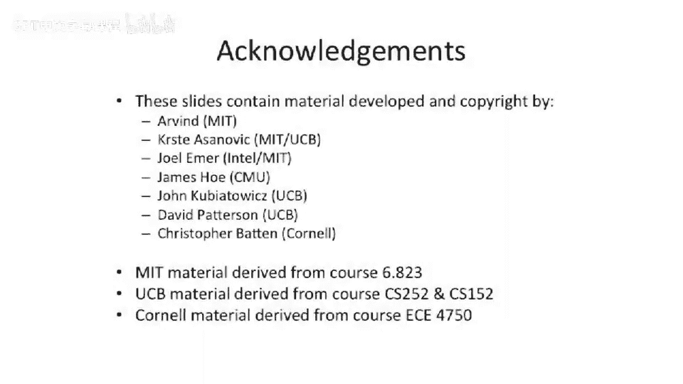

# 【计算机体系结构】普林斯顿—中英字幕 p95 94_03_introduction-to-interconnection-networks -BV1ii421D7WR_p95-

And I just wanted to say a quick note about interconnection networks。

If you guys are get interested in interconnection networks as we go along。

 I highly recommend this book。 I have not assigned anything from this book for this class。😊。

But this is Bill Daley's and Brian Towells's Interction Network book。 It's quite good。

 It's kind of the definitive。Guide on the subject matter，Interconnection networks， we。

We talked about buses， and we talked about memory protocols about buses。That's only。

One way to share information。Now， people may argue that's a intuitive way to share information because we had the ability to do loads and stores from our processor。

But there are other ways。To share information。 So in today's lecture。

 we're gonna talk about two main pieces of。Two main topics， one。How to share information？

In a different way， which commingingles the movement of data with a synchronization primitive。

 we're going to call that messaging。Which is in contrast to memory。

Or communicating via memory addresses。We're also going to talk about different ways to connect together processors which can either have better performance or better scalability。

 I。e。 have more nodes in the system。And okay， so let's compare and contrast buses。

Two other forms of network and see。Why we might want to change。 So this。

 this is going back to what we had just talked about。Let's say you have two cores on a bus。

And let's forget about how you want to communicate。

 It could either be via shared memory or it could be via messaging or it could be via some other protocol。

 ethernet， whatever， whatever you want to put here， which is basically a form of messaging。

We have one core and wants to communicate another core。NoI don't draw any caches here。

There may not be caches， There may be caches't kind of immaterial here。

And if one person wants to talk to another person。They can just yell at the other person。

It two people。 So theres， it's pretty easy to do。 We now there is some challenges。

 We can both talk at the same time。 We might not be able to understand each other。

 So there's some arbitration that needs to happen。But in general， that arbitration is pretty simple。

Only to cores or two entities on this bus。Okay， now we go to more cores。

So we have four people in a room trying to shout to each other。Well。

 or four people on a bus trying to shout to each other。 And as， as we just talked about。

 the bandwidth can be a challenge here。The arbitration for the bus can be a challenge。And。

Because we're talking about interconnection networks。

The wire delay and capacitance of the network can be worse。There it could be a challenge here。

So if we think about one core， it needs to drive。This shared multid bus。

There's a lot of capacitance on this bus。Much more so than this case。Becauseuse all of a sudden。

 we've doubled the length of the bus。 so the wires are longer。

And we've also put more loads on the bus。 So there's actually more capacitance on this bus。Okay。

 now we start to thinking about trying to build a bus that has a lot more cores。In this case， 12。

And if you do this core， you have you go shot to that core。

There's no pipelines around on this bus or anything。

 You go to shout and it has to propagate all the way down here。And， you know。

 we're talking about high rates of communication。 You actually have to wait for the time of flight of light from here to get down to there。

And because were， if we're using something， let's say， like a snoopy protocol or broadcast protocol。

 because that's all we have here。We have to wait for。

Any node here to communicate with every other node。

 So we have to wait for the worst case time for this node to communicate to that node。

 every clock cycle。Okay， and as I said， there's capacitance。

 So it's not quite a just a transmission line。 So it's not just a transmission line problem here。

 We also have to worry about。The capacitance in trying to do。Drive all of these different receivers。

And it's a multidirectional boss。 So we have to have effectively try states and the ability to drive or just receive。

Well， all of a sudden， we have 12 people。 and actually， we have 12 people in this room。

 So let's all try to pick a number between 1 and 10 and shout it real fast on the counter 3，1，2，3。5。

Okay， I do I shot at five。 I don't know what else said。So。That's。I。

 could everyone hear everyone else's because everyone know exactly what all other 10 people said at the same time or 12 people said at the same time。

Here's your nearest neighbor， okay？But did you know what Yan Chi said？Okay so。This is。

 this is a challenge。 And if we need to guarantee that only one person can yell on the bus at a time。

 we need some arbitration。 But the arbitration logic is slower now because we have lots of people communicating。

 So we have to run a wire from。This node down to this node and then having it come back。

 And the arbitration logic， let's say， over here needs to make some decision。

 And the decision is slower because it has more layers of logic。More combinational logic we'll say。

 to make an arbitration decision。Okay， now if we go to 1000 processors or 1000 cores on a bus。

You know， we， we couldn't even have 12 people in a room shot at the same time。

 You can't have 1000 people in the room shot at the same time。 And physically。

 the distance to the wiring between these thousand different nodes is going to decrease the speed of this bus significantly。

So this is something to think about。So this motivates us to take these same 12 cores。

And think about some other way to connect them。Now。

 what I'm going to show here is a what's known as a switched。Interconnect。

Or sometimes known as as a point to point。Link solution。 Now。

 point to point does not mean that this core can communicate directly with every other core。

That is a different name。 We'll talk about that later today。Instead。

 point to point just means each link。Only has one sender and one receiver。

 And then you use switches along the way to make decisions and to route。So if we look at this。

 we can actually have。Multiple nearest neighbor communication happening。 So all of a sudden。

 by adding this switching， we can both have connectivity between all the different nodes。

 but we can also have sort of sub conversationsver happening。😊。

But this still allows for this processor here to go communicate with the one that's at the far less extent。

 And we need to decide how to do that， whether it communicates sort of this way or this way or that way or some squiggly line。

We can also。Take the same point to point switch interconnect network。And like a bus。

 which we can increase the with the bus， which does not help us with the occupancy of the bus。

We can add more networks， or we can effectively add multiple concurrent switchish interconnection networks。

 or we can increase the bandwidth on these buses。 So it's similar sorts of ideas there and similar sorts of bandwidth tricks you can do to increase the bandwidth on buses you can play on your Sw interconnection networks。

Okay， so this is just a very broad overview。And I we to get into some。Some。Or specific ideas。

