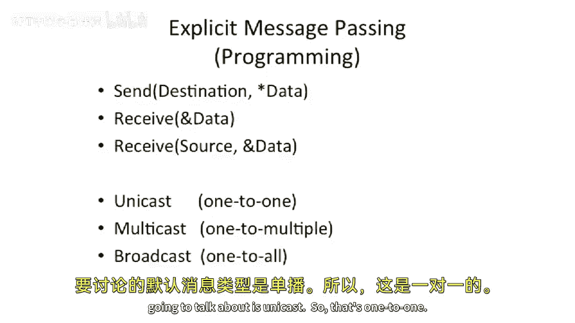
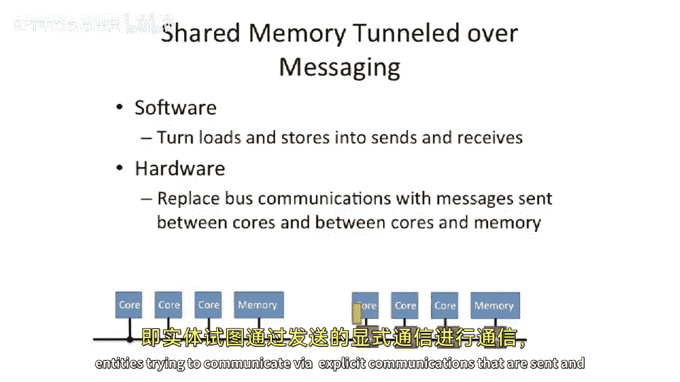

# 【计算机体系结构】普林斯顿—中英字幕 p96 95_04_message-passing -BV1ii421D7WR_p96-

But before， before we do that， wanted to talk。About programming。And a。

Competor to using shared memory for programming。So so far， we've looked at。A。

Shared memory architecture to communicate from one core to another core。

So what that means is one core does a store。To a sub memory address。 And sometime in the future。

 another core goes to read that memory address and gets the data。

What's interesting about that paradigm is the sender of the data， the， the。Core。

 which is writing the data or doing the store， does not need to know which core is going to read the data in the future。

Or。It's very possible that no one will go read that data in the future。

And in our shared memory architectures， that doesn't， that doesn't affect anything。

 we can actually have。1 core。Write some piece of data into memory， add some address。

And given this implicit name， we effectively have some associative match where you can look up。

Based on the address， the piece of data and go find the piece of data sometime in the future。Now。

 you probably need to use locking and to guaranteed causality between one processor writing the data and another processor reading the data in shared memory。

But you don't need to know the destination。In contrast。We're going to talk about。

Explicit message passing as a programming model。Now， there are lots of hardware implementations。

 You can go implement this。 But let's start off by talking about explicit messaging as a programming model to communicate between different。

Threads。Processes or core。And what we're gonna have here is we're gonna add。 we're gonna have an API。

Or a programming interface here。Of。Send。Where it names the destination and passes into it。

A pointer to some data。And in our messaging API， this is going to take this data。And somehow。

 get it to the receiver。Or the destination。On the receive side。

The most basic thing they can do is you can receive data。Note， this receive here does not。Deote。

Who is receiving data from。So a common thing you can do is just receive in order， receive the next。

Piece of data that it gets in。Now。That may not be super useful。

 So you might want to extend this to having the receive actually take a， a source also。

That's not required。 There are the reason I'm talking about this in this abstract fashion here is there's many different。

Explicit message passing programming interfaces， because it's just software that people have implemented over over the years。

But at the， at the fundamental level， there's ascend and receive。

And you could think about having the send。Or the send。Requires a destination。

 and the receive can just receive off of basically an input queue。

 or it could try to receive from a particular source。Or another way to do this。

 which is what they do in MPI， which is called the message Pass interface。

 which is a probably the most common programming interface for messaging。Is it won't take a source。

 but instead it'll take a tag。Which is effectively a number， which says。

What message type is the or what message type， Sorry， what， what traffic flow is it。

 So you can sort of name the flow。This is kind of tag is。

 is sort of more generalized form of in TC PI P， They have ports， for instance， right。

 and UDP is ports。Okay， so questions so far about this basic。

Program model and why is it different than loads in stores to shared addresses。Very different。

They are dues of each other。 I'm going tell you right now that you if you can implement one thing of shared memory。

 you can implement messaging and vice versa。 And there have been lots of fights over this。

 And at some point， the whole community realized that you can do either with either。

 You can do any program model。 you can do the one in the other。Okay。

 so the default message type we're going to talk about is called Unicast。 So that's one to one。

You do ascend to a destination。 The destination is one other node or one other process。

 or one other thread。 The reason I say process thread or node is depending on how this API is structured。

You might have。 you can use， a messaging。Explit message passing system on something like a un processor。

 We have different threads or different processes running。

And you're going to be messaging from one process to another process， even though it was one core。

But there's a pretty natural extension of that。 You can take those two processes and put them on different chords and have them communicate using the same interface。

You can also do between two threads， but that's less common。Okay， so that's so Unicast is one to one。

 Some messaging networks and some messaging primitives will actually Per models will have a couple of other choices here。

 We can have multicast。So this is communication from one node。

But instead of having a destination here， which denotes one other location。It can denote。

A set of other people to communicate with。This is still messaging。Except our destination。

 we've expanded our notion of a destination here。 so it can be a set and not just a single thing。嗯。

We can also have broadcast。Where you can have one node instead of having a destination here。

 you can have some magical flag， which says。Communicate this with every other node in the system。

 or every other。Processing the system or every other thread in the system。

 or every other process in a process group or thread group， there's。

There's ways to sort of say that in these software program models。Just for。A quick question here。

 is anyone here programmed an MPI？Okay， no one's done a lot of parallel programming。Good。So。

We're gonna talk briefly。 I'm gonna show a brief code example here of one。Process。

 communicating with another process via。A very common messaging library called the Me Pass interface or MPI for short。

So let's look at this piece of code。 It's C code。And what's happening here。Is。Okay。

 we start a program。 We have my I D。 So the， the program model of MPI is that it'll actually start。

The same process on multiple cores， or on multiple。Processes or multiple， not， not， it not threads。

 but multiple processes or multiple cores will。Start up the exact same program。

So this is sometimes called spmd or single program， multiple data。Program model。S PM D。

So the spinmd model here， what you're gonna to notice is we're actually going to execute this program twice。

One on the one core and one in the second core。Now you're going to say， well。

 if we're executing the exact same program。Are they going to do the exact same thing？Well。

 let's take a look。Okay， so we have this thing called my I D。This is what tells us。What core we are。

And then there's something here called。Noumb prox。Which is going to tell us how many processors there are in the computer。

And we fill these in。 So you see here。We start by calling MP a knit。

MPI knitt sets up the message passing system from a software perspective。

Then we call MPI communication size with some magic parameters。 And it's going to fill in this field。

 which tells us how many processors there are in this in this MPI program。

When you launch an MPI program， there's a special MPI start command that you have to run。

 which will actually is it takes a parameter of how many takes parameter of the program you're trying to run and multiple processors that you're trying to run or the number of processors you're trying to run it on。

So our program now can dynamically detect how many processors we're running on。 It can also detect。

What's called our rank。Which is our I D。So now we can actually detect if for're the first process。

Or the second process launched in a two process system。 Or which one we are and will fill in my I D。

With our rank。And is a library which will figure this out for us in this MPI implementation。Okay。

 so we assert now we say that number prox equals 2。

This is just to make sure that we're not running on three processors or 1 processors or something like that we want strictly two and not one。

 not。So thatll they'll failal if we get a problem there。 Okay， so now this is。

 this is where we can do different things。 So single program， multiple data。

The reason it's called this is we can actually make decisions based on our processor I D or my I D here。

 So we'll do something that says， is it。My ID zero， do this else。😡，Do this other piece of code。Okay。

 so does everyone want to wage your guess here what this program does so far？So the one。

 one processor is going be executing this。 The other processor is gonna be executing that。

The first processor executes aend。Let's look at this first line here and see what happens。

This is the data we're trying to send。 So we're sending X。Which is an integer。

 which we load with the number 4，75， which is our class our course number。And we send that。

With a particular。Tag。So MPI is structured around this notion of tags。

 which is how you can effectively。Connect up a sender and a receiver。🤧。Oh， sorry。

 that's I can connect up multiple pieces of traffic between centers and receivers。

 The other way that you figure out is by looking at， there's a。

A number of who you're sending and receiving to， so this is the core number。

So what this says here is send X。To rank number one with tag tag where we're gonna say tag is 4，75。

 also。 And this MPI rest of this stuff here， don't worry about。And this is， this is a length。

So this is going to say send one word of size integer to processor 1。With a particular tag。

And this MPI comm world basically is extra flags you can pass there which says。

 do I want to send to all other MPI subpro or you can make subgroup。

 There's this notion of groups MPI has， but it's kind of more complicated。O， so at the same time。

 this other program is executing here。The first thing it goes to do is it receives。

So if it gets here first， it's just going to block and wait in this receive。Conveniently， this。

First processor did ascend， and there's a matched receive here。So it's going to receive。With tag 4。

75， length 1 of MPI integer from 0 and returns to status code。

So it's going to fill in why with the data that got sent on this message。That's pretty fun。

 we just communicate information between two processes。Okay。

 so let's look through what's happening here。Process0 is going to do the send。

So it's gonna to send 4，75。processor  one。Prossor 1 could have gone here early at this receive。

 and Proor 1 does not execute any of this code。And it's a different draw space， Xs is Y。

 they're different。 We have no shared memory here。It gets here。😡，And it's going to do receive。

And at some point， the send shows up and the message shows up to the receiver。

It gets received and put into why。So it fills it in， which is why we pass the address of why。Now。

 we're going increment y by 105。 So we did some computation on this node。At， at the same time。

 while we're， we're doing this receive and we're doing this increment and we're doing this send。

Process 0 is basically just sitting here waiting， trying to receive。So， we're doing。

We having process zero。Send some data to process one。Process  one is going to do some math on it。

 It's going to increment the number， and it's going to send that number back。

So it does the send back here， which is why we have y again。

We're going to send y to process 0 of length 1。And when that message shows up。

 we're going to receive into process 0 and process 0 is going to print down a message。Okay， what。

 what does it say。Received number。5，80。 Yes， you should go take E 5，80 A。

 not 580 not 580 without an A because 580 without a is not the parallel programming class。

 That's the security class next term。 But 5，80 A， you should go take。

So it prints out the number so we can communicate from the one。

Process to the other process and back with messaging。

So one of the things we should note here is we are both moving。Data。

And we are synchronizing at the same time， in this message。

So it's doing two different operations here。So this is a great question。 So this is a。

Programming model right now。We're not going， you know。

 there's many different ways to implement MPI and people to implement MPI。The interface。

Of these MPI sends， MPI receives and the initialization here in many different ways， so。

People have implement this， implemented this over a message hardware message Pass network。

 which does not have to go into the O S。 for instance， you do ascend。 and actually。

 theres effectively hardware there， which implements MP I send and receive。

 sends it out over the network and receives it on the receive side and there's some interconnection network in the middle。

 That's one way。Another common way is that you actually running an MPI over a shared memory machine。

At which point。MPI send。 This is gonna sound kind of funny。 Basically takes the data。

 copies it into Ram somewhere。And then when the receiver goes to receive it。

 it looks it up in a hash table， finds the location in Ram and does it read from that pointer。That's。

 that's an option。 And actually， that is one of the more common ways that people run MI today is。

 and that doesn't have to go into the O because it's just a shared memory。On small machines。

 people run N that way。 And that actually has good。

That has typically has better performance than sort of the equivalent thing of writing the shared memory program。

And the reason for that is you've effectively explicitly made the communication or you've made the communication explicit。

 So the coherence protocol， you're basically gonna be able to optimize for a producer consumer。

 You're gonna go write to some location。 And then someone else is gonna to read it。

 You're not gonna have sort of random false sharing problems。

 You're not gonna have lots of other problems。 So that's pretty common。

 where M I has the biggest use today is in massively parallel computations。

 So this is sort of the supercomputers of the world。😊，Sort of the。

All of the supercomputers minus the vector supercomputers。Who typically don't use MPI。

 but the massively parallel computers。 So like the biggest computers in the world right now， the。

I don't know。 The roadrunner computer at Los Alamos， for instance。

 and the the similar sort of computers like that they。Willll have special network cards。

That implement MPI effectively。And they do it in user space。 Now。

 another way to do it is you can actually implement MPI over TCP I P going through the operating system。

 And that's pretty common when people just run small clusters of computers is。

MPI send and receive will trap into the operating system。 It'll go into the library first。

 and the library will actually read and write to sockets。 And at some point。

 that'll go out over the network card。 All of those are possible。

 and all of those have very optimized MP implementations because this is。

The most widely used parallel messaging library for high performance applications and has the largest bulk of code right now。

So people have optimize this quite a bit。Okay， so this brings us to the question of。

A lot of words in the slide， But I do want to talk about this of。

Mesure is passing versus shared memory。 So we have two different parallel programming models。

Message passing where you have to explicitly name your destinations。

And shared memory where you write to some random location at some point in the future。

 someone goes and reads from it。 And you don't know who the reader is。

 It could be any of thepostors in the system。 You could just read a random。 It could be random。

 It could be literally random。 Like you read some random number。

 And it tells you who's gonna to do reading of that location。But if you think about it。

 because you have。And， you can write to a location。 someone else can go read it and share memory。

 You effectively haven an。A one to all communication versus message passing allows your。

Microarchit and your system to be able to optimize around point point communication。Okay。

 so let's compare these two things。We have message passing here。In message passing。Typically。

Memory is private。Per node or per process， or per core。So the memory is not shared。Shared memory。

 by definition， memory is shared。Message passing of explicit， explicit sending receives。

In our software code。 So we're actually going to put a MPI sends and an MP receive。

 We're actually gonna have sends and receives。Conversely， share memory。

 we have these implicit communication via loads in stores。And the load in the store names an address。

 but does not name a core number or a process number or a thread number。Message passing。Moves data。

 We do asend， and we put some data in there。But also。

 by definition of receiving the message on the receive side， there's some synchronization there。

 There's a producer consumer relationship from the sender to the receiver。In shared memory。

 you have to explicitly have synchronization。Sorry， I should say explicit。

 You need to add explicit synchronization via fences， locks and flags。

So you need to add something in there to do synchronization。 And if you don't。You don't。

 if you don't have synchronization， you can have race conditions。 You can get the wrong data。

 You can pick up the incorrect data， which is a pretty common programming error in shared memory。

Programming。

So。You don't need to know the destination。 You need to know the destination up here。

From a program perspective， what they wanted to point out here is。

Message passing is very natural for producer consumer style computations。

 So if you have one node producing some value and another node reading the value， it's very。

 very natural。 You send up， you set up a you send you send from one node to the other node and receive what the other node and you have a channel between them and you communicate。

 and you just sort of send data in there。 It's all in order will say。

 and you can just send down the channel and stuff come about the other side。

Very natural for produce a consumer。Shared memory。You have to implement， produce a consumer。

Like we did in last lecture where you have like a PyO in memory and locks on that structure。

But what is easy on shared memory， which is harder to do in message passing。Is。If you have a large。

 shared data structure。Let's take， for example， you have a big table。And。

You're trying to process this table in parallel， and you have。I don't know。

A big you have lots of little files， and you give each of these files to a different processor。

The processor reads the file。 And what we're trying to do here is we're trying to build a histogram。

So it's going to read some number out of a file。 And based on that number。

 it's going to look in a shared data structure。And increment that location by one。Now。

 because it's shared memory， you want to make sure that two processes or two processor or two threads or two processor or two processors is not trying to incur the number at the same time。

 So you probably want to lock that。Location in the table。Or lock the whole table， Icrement it。

 and then unlock it。 So you don't have two people trying to increment it at the same time。

 But it's very natural to build a shared table in shared memory have locks in that shared table and have different people operating on a shared piece of data at the same time。

So the interesting thing here is that you can actually tunnel shared memory over messaging。

And you can tunnel messaging over shared memory。So let's look at the first example here of how to implement。

Shared memory on top of messaging。You can do this in software。And software， way。

 way we do this is effectively try and turn all of our loads in stores。

Into sends and receives maybe from。 And there's maybe like one centralized node。

 which has a big notion of memory。 That's one way to do this。 or you distribute it somehow。

 It's gonna be pretty painful to do。 But people have implemented systems like this。

Where you actually implement。Loads in stores， or your compiler will go and pick out loads in stores and turn them into messages。

A more common thing to have happen is to actually have hardware。

That automatically turns communications into messaging。 So we're gonna take this notion of a。

Programming model。 And instead， we're gonna turn into a broader notion of entities trying to communicate via explicit communications that are sent on some sort of interconnect。

And。This is actually the most common way these days that people go about implementing these large。

 shared memory machines。Is there actually the。Memory traffic will get packetized。

 and we'll talk about packetization in a second。And it'll get sent over a network and then received。

 And then some receiver will go do something with it。 So an example here。

 let's say we have this core here。And this core wants to do a load。And， the data is in main memory。

On our bus here， the Corrk could just shout， I need address 5。And the memory will shout back。 got it。

 Ad 5 has the value 6。If we have a switch interconect。We put switches in here。

We can have the core actually packetize the memory request。

 So it'll take this load and it'll make a message， send it over the network。

 and it'll show up at the memory。The memory will read the message。Make a response。

And it can send it back over the network， also。So effectively what we have here is we can actually tunnel shared memory over a messaging network。

 And this is actually for large cache coherent systems is the most common thing that happens。

 We'll be talking about this in greater depth in two classes when we talk about directory based protocols。

 which are effectively implementing shared memory over these switched interconnection networks。

You could also implement messaging over shared memory。

 And this is pretty common in small systems that have shared memory that have no other way to communicate。

And this is exactly what we talked about。Last lecture， we had a PIO。We added head and tail pointers。

Producer can effectively en queue onto this queue in my main memory。

 The consumer can go read from it， and you can implement messaging this way。

So I guess we'm trying to get here is messaging and shared memory are dues of each other。

They may be more natural for one thing or another， but you can implement any algorithm you can implement the one in the other。

 And that's been shown at this point。

