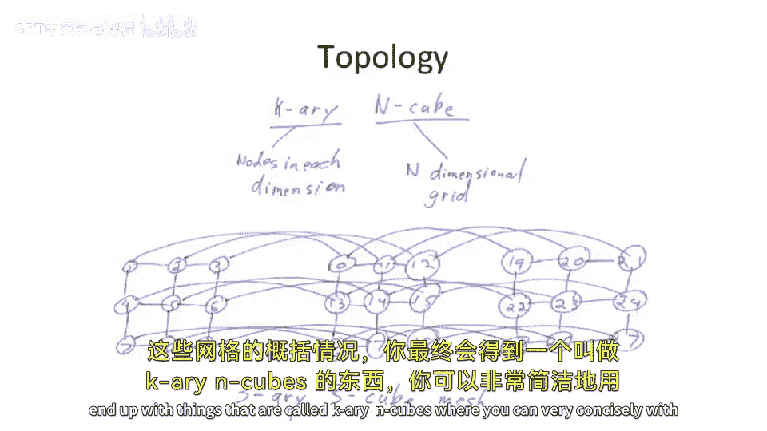

# 【计算机体系结构】普林斯顿—中英字幕 p97 96_05_interconnect-design -BV1ii421D7WR_p97-

Okay， so that's。High level programming models。Or our， our second high low protein model。

 which is not。Shared memory and the contrast with shared memory of messaging。Or message passing。

And today， we're going start talking a little bit about the gory details of how to build interesting interconnects。

And before you start， I want to introduce。Sort of the agenda that we' were talking about。

 We're not going to cover all of this today this is today's lecture and next lecture we'll be talking about。

Interconnect design。So a couple different things that you have to worry about in interconnect design。

First one is what's called switching。So when I say switching。

What I'm trying to say by that is there's different ways to organize the communication。

And you can think about this。Proably the best example is the old telephone system versus the modern day Internet。

So the old telephone system。They're switching。The way it worked is you tried to make a phone call。

 And the first thing you did is you picked up the， the。

 the receiver on the phone and you sort of turn the crank。And there is。Some switchboard operator。

In your local town， who would hear the bell ring and take a plug， plug。

 plug a wire in and pick up and say， hello， where who you trying to call。And you would say。

 I'm trying to call such and such in next town over。Well， the switchboard operator。Would say， okay。

 that's good。 I'm going to take a wire。From the wire that runs from your house to this location。

 plug one wire in there。 And then Google plug the other wire。

Into a wire which runs to the next town over。So then you'd be connected to the next town over and the switchboard operate the next town over and' say。

 oh， I'd like to talk to。The same person you're trying to talk to。 and they would say， okay。

 that's great。 I'm going to patch a wire from。My patchboard from the out of town wire to the destination location。

 And I'll turn the little crank to ring the， the ringer on the， on the destination phone。Okay。

 so that's one idea。And that is actually called。Circuit switch networks。

 because you're building a circuit。 You're building a wire all the way from one location。

 all the way to another location。Alternatively， we can do what we do in。The network Internet today。

In the Internet today。There is， we don't generate。 We don't have a wire directly from one location。

 Pat together。 the， you would actually patch wires from one place to another place。嗯。

In contrast in our switching systems， you will actually packetize the data。

And then we'll hands the packets from different locations。

 and people and resources can be used for other things。

 So it's much more akin to something like a mail system。So in a mail system。

 you take the data you want to send。 You fold it in half。 You put in an envelope。

 You put a stamp on it， and you， you set it going。The road that goes from your house to the post office is not reserved for that one piece of mail until it gets all the way to the destination。

 like in a circuit switched topology。 Instead， in a packet switched。

 you're going to send the message and you're to put a stamp on the physical envelope。

 and your postal carrier is gonna come pick it up。 They're gonna take that， take it someplace else。

 And then they're gonna take it someplace else。 They're gonna take it someplace else。

 But you can send another piece of mail on that same link or other people can be using the same roads to send other packets or other messages。

So switching is the type of network we have here and how we connect together the different。

Neworks and how do we do the switching。 There's a couple other things in the middle between circuit switched and。

Packets switched， networks。Okay， so the next thing we're talking about interconnect design is topology。

So this is how do we physically connect things together in our world。

How do we run wires between the different nodes in the system。

Run wires between every person in this classroom。 I run a wire between myself and every other person and everyone runs wire between everyone else。

 Or do we build a node in the middle that we run everything to。

 or do we only connect to our nearest neighbors， And then we have to send to them。

 and they have to send the next people。 So there's lots of different  topologies for a given size graph。

嗯。Routing。Routing is。Figuring out what path to take through the network to get from one point to another。

 So we can actually build a nearest neighbor network in this classroom where we run wires between all of our neighbors。

 but not， let's say， we all each each of us connects to three different people， but not to 4。

 And there's gonna to be multiple paths from any one point to another point。

So we need to come with a rounding decision to figure out how to get from that one point to another point。

 And that affects our interconnect design。And then finally， flow control。

 And there's two types of flow control。 There's local flow control， which is。

Communication from one node to a next， the next node over and making sure that you don't lose data。

On that local link。But it's also， how do you rate limit round trip throughout the entire network。

And we're going to study that next time in more depth。Okay。

 so let's move on to some fun pictures here。High quality pictures。

So first thing we're to look at here is the anatomy of a message。

A messages are fundamental primitive of some piece of data we want to send。And at the top here。

 we show a message which has， let's say， some number of bytes in it。

These delimiting points here do not delim a byte They delim some chunk of data。

And we're actually going to fragment this message。Into。Smaller pieces， which we're to call a packet。

Now， no， I want to make a big difference between a message and a packet。A packet is。

A piece of data we're gonna to be sending through the network and the network natively understands this packet。

 and the packet is routeable through the network。 So it has routing information。

So a good example of this is if you're trying to use MI。And you want to send。1 thousand words。

And let's say the maximum message you can or the maximum packet you can send on a network is 100 bytes。

Youre going to packetize the data， packetize the message into 100 individually routeable packets。

So let's look inside of one of these packets。Typically。Because the packet is ratutable。😡。

It needs to know where it's going。😡，It might need to know where it's coming from。😡。

So at the beginning of a package， you'll typically have something like a source。

You might have a destination。Or excuse me， you definitely need to have a destination。

 you might have a source。You might have a length。If your network allows for variable length packets。

And we call this the header。We call the rest of the packet， the payload。

And we're going to introduce an interesting term here。Fit。

Now this is a term actually that was coined by， I believe Bill Dley。

Is now a Stanford professor who did a lot of work in。

Message passing and other totes of parallel computers。A fl is a flow control digit。

It's kind of like a bitch， but it's the flow controlable unit。And。The reason we bring this up。

 sometimes a fl is actually equal to the whole packet。 Sometimes it's a smaller piece of that packet。

 depending on how you build your network。But a flow control digit is。

What you were flow controlling on from。One node to the next node。So this is what you track。

The flow control on。 So it's very possible that you're。You don't actually track。

Sort of sending receiving of messages on the byte level or on every single cycle。 But instead。

 you do it in bigger chunks。So a good example of this is you have a network which is one by wide。

The link is one byte wide。But the minimal thing you can send is a 32 bit word。And as the minimum。

Pce of data that is flow control。 And you always need to send， let's say，4 B。

The flow control will be on the order of。The F， which is the4 Bte unit。

But the link is narrower with that。So you don't actually。

 you can't actually stop in the middle of the message and say， oh， I only got。

 or you can't stop in the middle of a fl and say， stop。 you gave me3 Bs。

 and I can't take the fourth right now， no。It's not allowed。 It's， it's flow control based。

 So the flow control says。This is the minimal unit for flow control。 So if there's four4 B。

 that is what you are allowed to send。 and you need to send in chunks of basically four bys。

 And that's our fl size。Now we can split inside of a fl。And we actually， lets been called a fit。

Or a physical transfer digit。And a fit。Is what I was talking about with you had， if you had。

 for instance， four bys that you're trying to transmit and you flow control on those four bytes。

Each of those bytes is a fit。Or the physical transfer that you transfer in one clock cycle。

Many times the fit and the fl will be the same。If you， you have wide networks。

 but if you have very narrow networks， sometimes these will not be matched。Okay。

 so that's just the nomenclature so far。Our first topic we want to discuss is switching。

How to get from point A to point B。Oh， okay， it's not routing。

 it's rather the model of how to connect different locations together。

And we're going to talk mostly about three here。 We already talked about circuit switched。

Circucus switch is like the old telephone network。 You pick up the phone， and。Somehow。

 there's a wire patched all the way from where you pick up the phone to the destination location。

 and you reserve that location the whole time。Packet switch networks。

Or what called Storing For networks。Or probably more commonly call Stor and Forware networks。

Are things like the Internet where you'll actually generate a packet。Hand that to someone else。

 and they'll store it。And some point， when the link is free， they'll forward it on to the next hop。

 And when the next link is free， they'll store on to the next hop and it'll continue until it gets to the destination。

That's， in contrast to。Cut through networks。Which are sometimes called wormhole networks。

Cuthar networks still have packetization。But they'll actually。Worm through the network。

So instead of having to send the data from one location to the next top over and it waits for the entire message to receive before it sends it on to the next node。

A wormhole network。Will' actually allow or a cut through network will actually start to send the beginning portion of a message。

From one node to the next node along the hops before the tail has been received。Hence。

 it actually worms through the network。 And you can actually have a message sort of stringed through multiple different nodes。

This is what we have as cut through networks。 So I just want to introduce those。

 those three ideas and think about them as we go on to build networks。

 We'll talk a little bit more about。Cut through networks。 when we get to。Rowing。So before we。

Break for today。I wanted to just introduce a couple different topology and just flash a couple different toppologies where we'll pick up next time。

But in our networks， we talk about pluses。Multiple entities on one shared medium。

You can think about building a segment and bus。Where you actually have flip flops along the communication path here。

 And this would allow， for instance， this node， maybe to communicate with that node at the same time as 3 communicating with four。

Sometimes this is called a pipeline bus。You could have rings。Which are like this segmented bus。

But they connect the two ends together。You can even implement rings in a way that minimizes wire length。

 We'll talk about that next time。You can have crazier things like 2D meshes，2D toes。You could have。

Cubes and hyper cubes。You can have fully connected。Tpologies。

You can have things called mega networks。Which are multi stage networks。

Where you could basically communicate from any place to any other place in multiple stages in multiple clock cycles。

You can build trees。Or things called fat trees， where the length at the top of the tree get fatter or wider。

And we'll talk about this next time。 But the， the generalized case of these meshes。

 you end up with things that are called kie N cubes。

Where you can very concisely with two numbers describe and network topology。 Okay。

 let's stop here for today。

