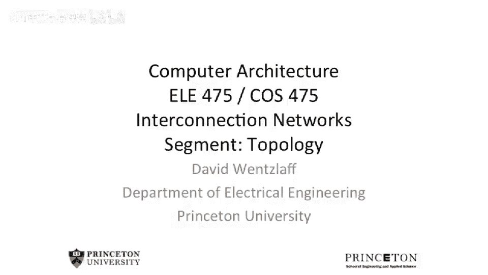
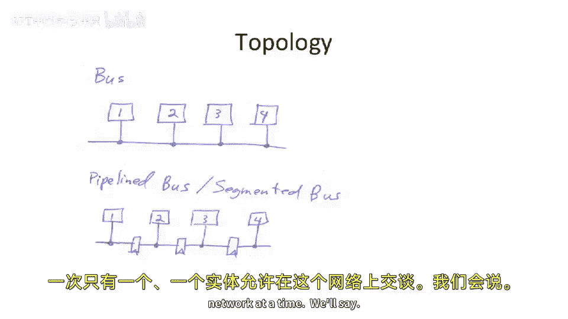
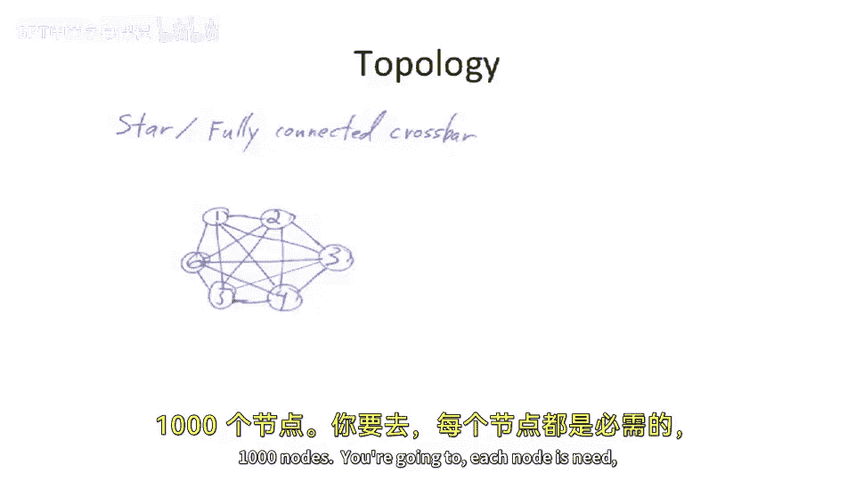
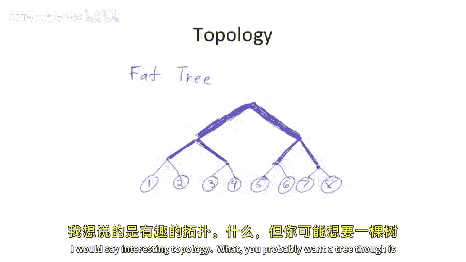

# 【计算机体系结构】普林斯顿—中英字幕 p99 98_03_topology -BV1ii421D7WR_p99-

So we started last time， this is where we left off。 was talking about topologies。

 And we went through this really fast。 but I wanted to go a little more detail here。So far。

 weve in this class， we've been talking about buses。

 and actually buses are a type of interconnection network。

So multi droprop bus where everyone just sort of screams is a broadcast network。

 and it is a type of interconnection network。But it may not have the best properties。

 It may not have the best bandwidth。And it might impact your clock frequency。

 so it might even impact your latency。Depending on how you go about implementing one of these things。

So sort of the next step away from something like a bus is actually something like a pipeline bus where you start to put。

Registers in along the way。And now you can have。Nearest neighbor communication。

 let's say one is talking to two and three is talking to four at the same time。

 but you couldn't do that when everyone was shouting to each other。

Becauses only one entity is allowed to talk on this bus at a time， we'll say。

So we start thinking about that， and we can actually make some more advanced versions of these。

 We can start to think about things like tos， where we will take the end here and connect it around。

And this is a one dimensional tous or。Many times is known as a ring。

One thing I wanted to point out about this is if you look at the naive ring implementation。

And if you think of these as wires。You would say， well。

 this is interesting if I have a thousand nodes in my ring。All。Let's think about that 1，2，3，4。 Yep。

 okay， if you have1000 nodes in my ring。999 of them are going to have very short links。

 And then one of the links is gonna to be super， super long。 Its to go from。

This end all the way to that end， like this is drawn。Well， that's， that's not super great。 Comally。

 people have actually thought of fancy ways to fold。Truss into the。

Let's say if this is a 1D Taus into a 1D space and minimize the wire lengths。

 So actually I drew a picture here to show this。If you renumb。

And stagger the way you connect the nodes here。 This is the exact same 1 Dt as we drew here。

 except now all the links。Are equal distance or equal length。

 except they're twice the length as they were before。So you can actually fold a taus into the same。

 for instance， what an n dimensional tous into an n dimensional space by doubling each of the length by doing this cool interleaving trick。

And this also applies for 2D， 3D， 4D tourists， et cetera。

 you can come up with some ordering and numbering which will actually interleave like that now having said that it may be challenging to build a four dimensional touristus。

In three space。 And unfortunately， I live in three dimensional space。

I'm hoping you guys do too。And if you're like me and you live in three dimensional space。

 it can be hard to go build five dimensional things in three dimensional space。

 we'll talk about that in a minute。But I just want to show this cool trick that you can actually。

Full day。One dimensional touristus into a one dimensional space and not have a super long link。Okay。

 so now we can start to think about。Actually， before we go into that，'。

 let's think about the limits of this。If we start to go to 1000。Long tourists or 1001D。

Ring or 1 detourrus。Unfortunately， this is not the， the amount of。

Sort of bandwidth that you cut through， let's say these two links here does not go up as we add node。

And a good property of a network or an interconnection network is that as you add more people communicating on the network or more entities communicating on the network。

 you probably want to be able to add more bandwidth。And。You can say， well。

 I can make the links wider。😡，But that only helps so much， I can make the links faster。

 but that only helps so much。So this makes us think about having different topologies。

 so we can start to go to higher dimensioned topologies。 so we can start to use 2D。诶。Tologies or 3D。

And you can see here here is we have， let's say， 16 nodes arranged in a two dimensional。Mesh。

Versus here we have a 2D tourus。And the difference between the 2D mesh and the 2D Taus is that there's what's called end around in the Taurus。

And that makes the routing from here to there。😡，Much。

 much faster and effectively we'll cut the average routing time or average roing。

 excuse me average hop count by a half because you can go either way now and go around the ends。

Sometimes these 2D tourists are called a 2D mesh with End around that means it's a Taus。

Just I just want to throw that nomenclature out there because sometimes you'll see。

 you'll see both a good example of a。Simple routing protocol is if you're at this node here。

And you want to。Communicate some data。 You can send the data in all directions。

 and then everyone else sends it in all directions。 Everyone else sends in all directions。

 And it'll just flood the network。 It'll get everywhere。

 And you guarantee that it's going to at least get to the receiver。

And you have some guarantee the when it gets the receiver。

 the receiver sees the packets and takes it off。Now， that may not be what you want to do。

That's probably not low power and it's probably going to cause a lot of congestion on your network。

 but you could think about a flooding protocol。Okay， so wherever there is 2D。

 we can start to go to 3D。So here we have a three dimensional cube。Sort of。Its best I could draw。

 It's hard to draw three dimensional things on two dimensional space。 And if we had 3D space。

 I could have drawn this much cooler。 So this is a。Hypercuubbe。Both these are actually hypercuubs。

So all the hyperce is it's saying that the number of dimensions you have。🤧嗯。

Is equal to the number or the degree or the outbound links of a node in here。

If you look at this node， we have a three dimensional hyper cube。 So it go can go this direction。

 that direction or that direction， every node。Has a out degree of three or a connectivity of three。

Here。We have a four dimensional cube。But this is， by definition， a hypercube。

Because if you look at any given point here。 So we're going to define a hyper cube as the out degree of the nodes is equal to the dimension of of the the links。

 And you can't go build。Here if you would add one more node to this system。Or some other。

 let's say you were to scale this out in some direction， you would actually be increasing the degree。

Of a node by adding more， more nodes， but not to everybody equally。 So not be a hyper cube。

 So if you're to build。I don know something like this node here。 is。

 this is not strictly a hypercue because the degree of， let's say。

 this node here is not equal to the degree of。Well， actually， you'll see think about that。

 degree is equal to the degree of the other places， but we've effectively。

Increase the diameter of one of the dimensions such that there's not the routing distance is longer now for this number of nodes。

 if you were to go to a higher dimensional design， you could actually reduce the latency for each one of these nodes in something that got three dimensional three year 3Q。

 which we'll talk about in a minute。But here。We have a four dimensional cube。

And what's nice about this is the number of hops to get from here。Anywhere。Else is quite low。

So let''， let's think we're the farthest point in this。Cube is going to be。 So it's going be。

Let's think， is it here？Or is it here？One， two， three。Nope， it's the other one， okay。

 so it's going to be one， two， three， four to get to there。It'll be the farthest number of houses。

So we can think about having these higher dimensional systems。Now。As maybe readily apparent。

 but I'll say it anyway。IfYou try to build a five dimensional hypercue in three dimensional space。

Some of the wires are going to get long。Because you can't fold five dimensional space into three dimensional space。

You might be able to。Bend， for instance， a four dimensional space into a three dimensional space。

 with not， not too bad。But there's kind of this good rule of thumb when you're building networks that you probably don't want to be building a。

And。You probably want to try to map that， say an ndial network into an n dimensional space。

 trying to map higher is painful， trying to map much， much higher is very painful。The benefits。

 though， is that you have to have fewer routing hops till it get to wherever you're going in the higher dimension cube。

Now。I want to throw this one up here because this is an interesting topology。

Just connect everything to everything。This seems great， we should all build these networks。Yeah。U。

Unfortunately， let's think about trying to put this network。In three space。

 if we have 1 thousand0 nodes。Well。What that means is if you have 1000 nodes。

 each node you're going to need to have 999 outbound connections and 999 inbound connections。

So when you go to build this， you might go to build this sort of outside of a sphere or sort of a big wiring mess on the inside。

That's pretty hard to do for， for large numbers of nodes。 for small numbers of nodes。

 something like a fully connected crossbar or what's also known as a star topology will probably work fine。

But。And in fact， if you cut it sort of across the middle network here。

 which we'll talk about in a second， has very good bandwidth。Okay。

 a few other things you guys should know about from a terminology perspective。嗯。

The networks works that I've drawn up to this point。Our work called direct networks。

Which means that the nodes。Have some type of router built into them。You could also。

 and plenty people build this is they build networks where the nodes。

Do not have the routers built into them， but there's a multis stage network or some sort of network in between the nodes。

So a good example of this actually is something like your internet， if you will。

There you have computer nodes and the computers are not doing the routing themselves。 instead。

 they send it out to a， we'll call ethernet switch。 And ethernet switch is。

 let's say one of these boxes here in the middle。And that makes a decision and then sends it on further or they could be an internet router could be in the middle here also。

And the analog in computer architecture of what we're building is you can think of these building these massively parallel machines。

 something like a massively parallel crane machine or something like that。

 They actually have multistage networks in the middle here and all the nodes kind of sit in the outside。

 Note the way I number this。 This is the same thing as that。

 I just'tan to draw the wires going around。 So here we're sort of drawing as if data is flowing strictly from left to right。

🤧嗯。And what we did here is we have 8 nodes。 And what youll see here is there's。Log 2。

Number of stages here。If you have。Two to one switches along the route here。And。

Something like an omega network。Actually has only one path between each point。

 So if you want to get from here。Let's say8。To three。You're going to have to go here， here。

They're there。You can't。 There's no other paths you can take。

 So let's say you routed straight at this first decision point and went here。You win up。

 you're never to build up to three。This is in contrast to some other multist networks。

 where people actually put in extra stages in the middle here。And this gives you some path diversity。

 So it'll allow you to route around maybe congestions or route around problem links。

 if you we were to add one more stage， it looks exactly the same as the rest of these stages because if you look here。

 all these stages have the same wiring。In middle。Youll， you'll note。嗯。If we had an extra stage。

 we'd actually be able to have multiple links or multiple paths between the endpoints。

 and sometimes that's good。Another type of network here that you can build is a tree。诶。

I would say interesting topology。You probably want to do if you a billion tree though， is。

If you want to be able to communicate， let's say， from this half to that half of your machine。

You're going to want to somehow make the links wider as they go higher up in the tree。

 And that's what we call fat tree。 So a fat tree doubles the links each level up in the hierarchy。

And then you have， let's say this node when cave that node。

There is enough bandwidth across this back plane here to support lots of nodes over here。

 Com lots of nodes over there。One other interesting thing about a factory is if you go and try to implement this across a 2D space。

 we'll say。And you try to map this into a 2D space。

It actually starts to look pretty similar to a mesh at some level。

 except it looks like a mesh that you've removed links from。

So think about that if you ever go to sit down and build a tree。Or our factory？

It actually looks just like a mesh， except when you go to do the mapping of this。

 you'll basically see that there's this node and this node are very close in the two dimensional layout。

So you can just run a local wire， a sneak path between these two。

 And then you also realize that this one and this one will be really close。

 So you just run a sneak path between them。So to some extent。

 some of these toppologies may not make as much sense in a certain packaging or a certain layout in physical space。

But if you， let's say， have multiple chips， some factory may make sense。

So I want to introduce a piece of nomenclature here that you'll see for mesh networks。

That you'll hear sometimes people talk about things as K N cubes。And this is using two numbers。

 we can completely describe a type of mesh network。And we're going to use two numbers here。

 the first one is k。So if you say。Fhi vary。What that means is this is the number of。

Nodes in any one dimension。

And。The n here in our n cube is the。Number of dimensions。

So this gives us a way to describe things that are not strictly hypercues。

 so we can describe sort of other shapes， but that are still some sort of cube。

So for an example here， we'll look at a three by3 by3。Cube。

So this is kind of like a rubik's cube or something like that。

 And each one of the blocks in the rubbi's cube corresponds to a node。That wants to communicate。

 And this is actually a three area。3 cube mesh with no end around。And。

We can see that the worst case path length in here。It's going to be from here。To hear。

So it's going to be。One， two， three， four。5。Six， is that right？Two， three， four， five， six。

That's how many links we need to traverse to get from here to the farthest away other point in the system。

