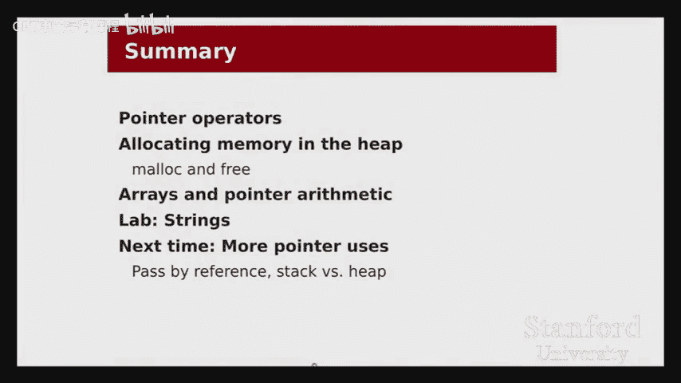
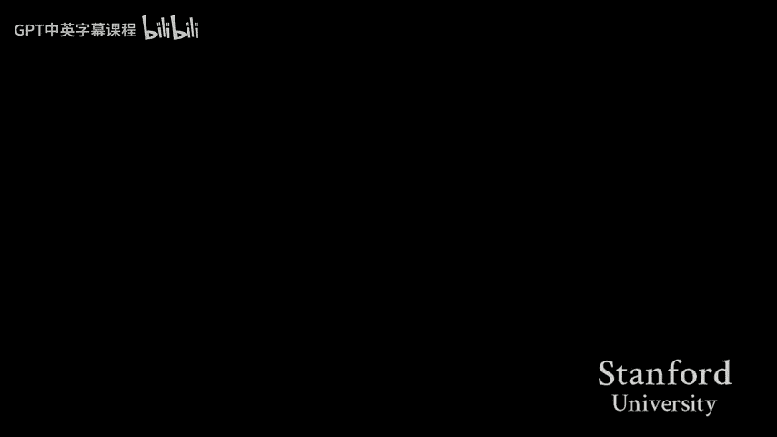

# 【计算机组织与系统 cs107 2016】斯坦福—中英字幕 p02 【Lecture 02】CS107, Computer Organization & Systems -2lI1Nvn5ad0- -BV1Nr421c7YB_p2-

Let's get started。Let's get started here。Good afternoon， everyone。Welcome back。

To another exciting day of CS107。Today， lecture number 3。

 we're going to continue our discussion of the C language。

By exploring one of the most important aspects of the language。

 which will be recurring all throughout the quarter， which is pointers。Before we get into it。

 a couple of quick announcements， hopefully you are all aware that assignment 0 is due tonight。

At 1159。A reminder that we are not taking any late submissions for this assignment。

 so please make sure you get your submission in by tonight at 1159 because to earn some early points for this class。

The other major announcement is that labs are starting up this week。In particular， labs。

 I think many students would say that labs are one of their favorite parts of this class。

 and especially for this week and for the next couple of labs。

 the labs will be really useful for your assignments。So in particular。

 this week's lab and today's lecture also will be really useful when working on assignment1。

So be sure to check that out。All right。Just like last time I want to start。

The day by giving you an overview of what our goals are for where we want to be by the end of today's lecture。

Today。There are three main goals， the first is that we will just start by giving a brief introduction into what pointers are and talk about the basic operations that we can do on pointers。

Then。We will talk about。Allocating memory in the heap。 So we will compare。

We will talk about a couple different ways we can get memory and what maybe discuss a little bit about what the trade offs are。

 It's okay if you at this moment don't know what the heap is。 that's part of the discussion。

And then lastly。We'll talk about arrays and this will probably be very new concept to most of you called pointer arithmetic。

 and we'll tie arrays back into the first two topics。😡，Today's lecture and most of and really this。

 this whole week of content is going to be vital throughout the quarter。 We're going to。

we're going to start by talking about pointers today， we're going to cover them for about a week。

 and then we're just going to keep coming back to pointers week after week in this class there's pretty much no end in sight to our discussion of pointers so it's going to be really important that we clear up any confusion any sort of misunderstandings。

😡，Right away， I expect that many of you will have lots of questions。 and that's， that's great。

 So please do ask them as we go along here。 It's a lot better for us to。😊，Clears stuff up now。

 rather than try to rush ahead and get through more content only to find out that。

 find out later that you。Missed something important and are having trouble kind of filling in the gaps。

All right。So let's just get into it。Before I。Show you some examples and some of the actual raw mechanics of pointers。

 I want to motivate them a little bit and tell you why we are covering pointers and why。

 in particular， so early。Now， you've already seen a few examples of how pointers are used。😡。

From your days in 106 B X。For example， you saw them used all over the place in some of the later data structures that you were implementing for linked lists。

 binary trees， graphs， if you worked on， if you saw the implementation there。

 they all counted on using pointers。Something that you also maybe saw a little bit of is that pointers are also really convenient for sharing。

For sharing objects， so for example， if I have a program that's keeping track of student enrollments and I have a student who's enrolled in two different classes。

 say CS107 and CS 109， rather than duplicating all of the students information，😡，When storing。

Their information 4 10，7 and then storing their information for 1，0，9。

 I can keep one copy of their information and just have pointers to。

Just have cleanerers to it from each class that they're in， just as just a little example。

 just stuff that you seen you've maybe seen a little bit of already。In sea。

We'll use pointers in those ways as well， but we're also going to see them just kind of show up everywhere。

 there's pretty much no way to program and see that doesn't inevitably involve pointers in some way。

😡，And， we'll see that even for cases like arrays and strings， some of these。

 these things that we thought were these kind of basic data types， pointers are going to show up。

There as well。The last point that I have there pass by reference is kind of an interesting example where C plus plus has some special syntax for passing。

Variables by reference。 Well， in C， we don't have those syntactic conveniences。

 So we kind of just have to。We kind of have to。Make it， make it up our own way。

 and the way we will end up doing that will be through pointers。

So hopefully that's just a little bit of motivation for why it is that we think pointers are so important that we cover them starting in lecture number three。

So here we go。 Let's just get into it and talk about。And talk about the pointer operations。

Now for all of today I will be I'll be staying pretty much on the slides because we'll need to be talking about the we'll need to be looking at I think covering pointers is most effective when we actually have a picture of what's going on in memory as we start as we execute each line of code so that's why I've got the code here on the left and I've got a picture of memory on the right now before I actually get into the specific example of this piece of code。

😡，I want to talk a little bit about what this diagram is so that we're all on the same page。

So here I've got。A picture of memory on。The left here， I've got the addresses。

Of I've got the addresses which are essentially numbers which represent a。

 which refer to a location in memory。 So the lowest address in memory I have written kind of near the bottom。

 starting at 0。 There's a bunch of stuff there。 And then I'm I'm mostly making up these addresses for our convenience。

 But you might imagine。Around here， we have address 9000 going up to， going up to whatever。

In in the boxes themselves， I'll be writing the the contents of memory。 So， for example。

 here we can see that the variable and I'll write the variable name sort of to the right of the box。

If there is a good name for that variable， just as a convenience to sort of keep track。So here。

 for example， I have the variable I， which is an int。 We can see that from the code。

 it stores the value 42， and we can see that。The， the box containing the 42 is located at address 9000。

We can see the same thing happening for J， and then also we'll get to P and Q in a second。Alright。

 now， a couple things to note about this diagram right away。 First of all。

 you'll notice that I'm not that the addresses aren't just counting up one after another， that。

 for example， here， this isn't 9001 and this isn't 9002。 I'm kind of skipping a few addresses。

 So what's up with that。Well， we'll talk a lot more about data representation in a couple of weeks。

 we'll talk about how to how we actually store ints and how we store addresses and how we store characters and floating point numbers and all that。

😡，But for now。I need to introduce you to。The terminology of a bitete。😡。

So a bite of memory is essentially just a small unit of memory。Where we can store something。

And when we talk about addresses， when we use the number like 9，000。

 this is the address of a particular byte in memory。😡，But the problem is。

 we can't store an entire int。In one bite of memory， and inch is bigger than that。In fact。

 on our machines。Ints are4 Bs。So what that means is that。

Even though I'll be using a sort of shorthand language like I is stored at address 9000。

What I actually mean since I is an int and ins take up 4 B is that I is stored at address。

 starts at address 9000， but will also occupy addresses 9001，90002 and 9003。And then。

So then starting at address 9004 will be the location will be the memory for J。

 and J will take up 904，5，6， and 7。Okay。And from the diagram， I'll， you know。

 I'll try to keep these diagrams to scale。 We can see that pointers just as a quick。

 This is somewhat of an aside。 Pointers take up twice the amount of space that。That ins take up。

 pointers take up  eight bytes， which is why I've got 9008 next to P。

 and then I skip 8 and 9000 and Q starts at address 9016。

Any questions about just the basics of the diagram。That's a good question。

 you're asking is it so is a pointer size always twice the type， no。

 actually a pointer size on our machine is always8 bytes， no matter what it points to。😡。

So if you have a reason to use an in corner because it wouldn' it be better to just pass it itself？

So you're asking， wouldn't it be better to pass the int by reference， But we're in C。

 We don't know what by reference means。In fact， it doesn't exist。We will have no choice， ultimately。

If there are reason， well， there will be lots of reasons to use pointers。 I mean， like fundamentally。

 well well just like so okay， yeah， you're looking at this example and you're saying， well。

 this example is kind of silly instead of using know P and Q， I could just using I andJ or whatever。

 we will certainly see lots of reasons that pointers will just naturally show up and then we kind of have no choice but but to accept the fact that they are twice the size of ints。

😡，Oh， well。そ。The integer I addresses 9000 9000 degrees if the point of points at say 9001 will it still be pointing at the integer？

Yeah， so if I have a pointer that points to。That points to 9001。

 It won't be pointing at I anymore because it'll be kind of pointing halfway between I and J。

Does that kind of make sense。Like so okay so I should introduce the pointer notation and the mechanics a little bit。

 but here I'm representing what a pointer variable is at its core is it is a variable which instead of storing a number itself like 107 or 42。

 it stores an address and so I'm using these arrows to show the pointer pointing to that location。😡。

And yeah， so if I had now I have there's a limitation in my diagram here。

 which is that the arrow is kind of pointing kind of randomly in at the box itself。

 you kind of have to think of like this arrow really pointing here at the very beginning at 9000。

 and then the system knows that by pointing to 9000 when I， when I want to read the in out。

 it knows to read this entire box。😡，So if I were to point at 9001， I won't read the entire box。

 I'll read kind of half of this box into this next box。That kind of make sense。Cool。

Meory say that again Ohs need for。 So it's actually4 bys in memory。 The specifics are are。

 we will certainly cover in a couple weeks。 The short answer is because one by wouldn't be big enough to write most interesting numbers。

 We need。And the same rule applies for pointers。 we just need more。

 we need to use more bytes because there is a limit to how many things to how much we can write in one byte of memory。

 and it was determined by some pretty smart people that one byte just isn't enough to write。😡。

Enough interesting integers。来。Anything else？So if you were to call like the value of 9001。

 what would it print out？You could， you could try it roughly speaking for now， it'll print out。

 I don't know because because we haven't talked about the actual representation of the bytes。

 So we would need to understand， well， so if I tell you that an in stored at address 9000 and it goes up to 9003。

 what is in each of those four bytes。😡，We don't know that yet。 For now。

 our sort of simple our simpler world is just to say that the int is stored at 9000。

 And then when you point to 9001， I don't really know。

But we will absolutely see that very shortly in probably a couple of weeks。Anything else。Okay。

So let me introduce the the， the syntax here。 some of you maybe jumped ahead a little bit to。

 to look at the， the code。 And that's， that's fine。 So here we've got， we're declaring two pointers。

 P and Q。 And I'm introducing what this this the syntax should look。😊。

II think you should have seen this in 10，6 B。 But， you know， just。

 just to make sure we are on the same， We are on the same page。

 we can say in star P to declare a variable。Whose type is Pter to integer？

And we assign it to be the value address of I。 So the ampersand is read address of。

 and what that does is it stores in P。 So here in this diagram。😡，Well。

 it stores where I is located in memory。 So we see that I is located at address 9000。

 So we store the 9000 inside of the box for Pete。Now， I mentioned this arrow。

 I've drawn these arrows as a kind of convenience to help us follow the pointers。

 I do want to just quickly mention that the arrows don't。Actually， exist in memory at all。

They're merely visual conveniences。 In memory， all there is is this 9000。

So there's nothing special about。You know， there isn't any kind of like what happens if the arrow point somewhere else。

 If the arrow point somewhere else it's a bug on my slide， So if the number is 9000， then we are。

 we interpret that as meaning that P points to this box。😡，ButO。So we do the same for Q。

And that is the first of our pointer operators。The second of them。So。Adding another line here。 Now。

 we're asking， let's say we have。 we've got P， and we'd like to print out。

The value that P is pointing to。😡，So here I'm using the star operator， which we read as dereference。

😡，And so when I dereence P， that means that I look in the box for P。 I see the number 9000。

 or I look at the arrow， and I follow that arrow or go to address 9000。

 and I read the contents of that box。 So here， this printf。Of star P will print out the number 42。

So like2。Yeah。In with the address are you， I that an name or are you refercing good question。

 You're asking about So this line is it It is not It is。In the case of declaring a variable。

 the star means this is a pointer。 So this line is declaring an int star， which I've named P。

 This line is declaring an int star， which I've named Q。 That is a different star。

 And I realize it's can get a little confusing。 That is a a slightly different use of the star than down here。

 which is actually a dear reference。😡，Does that difference thing sense。

So this is just declaring a variable。 This is not the de referenceence operator。 This is。So is that？

For all locations the same roughly Like does it have to go through everything up to that address Like you say like thing it9000 the first 9000 So you're essentially asking is what is the big O running time of memory access。

 It's certainly not linear。 that would be pretty awful。 especially on these like 64 bit machines。

 like the memory is huge you can like two to the 64 operations is is more than more than a lifetime in seconds more often it's not linear we can think of it for now as constant time access to any any location in memory。

 will realize like8 weeks down the line that that's not true。 But for the first eight weeks。

 we can go along with it。 It's constant time。😊，Any else？questionしいや。

If you try to dereference a non printerter good question。 So what if I say？What if I say like star I。

 for example， right， that's just a compiler error。It doesn't。 It doesn't mean anything。

Because it wasn't a pointer variable。 and the compilers didn't know what to make it that。

 So it'll just crash。 or sorry， it'll give you an error。 It'll give you a compiler error。

 One of the few。Questionep， difference in how a number 9000 would be stored as opposed to an address of 900。

 That's a really good question。 Is there， is there a difference between storing the number 9000 and the address 9000。

 The short answer is actually no， There is a again。

 there is a longer discussion about representing data about how do we represent addresses。

 How do we represent integers。And so on。 But the short answer is actually know that， that in memory。

 they're actually gonna end up looking kind of the same， except that the。

 the address version has twice the amount of space。

 so then it just gets filled with a bunch of zeros。Yeah。

 when we need to use parentheses around the like a D reference。

 I saw it in the textbook I can't remember exactly Oh yeah， I'll actually get to that way later。

 but essentially the star is a prefix operator。 So it's sort of like think of it like the exclamation point operator or like the minus sign any case where you're gonna do some expression。

 So if I weren't doing star P I was doing star of some complicated thing that I would need parentheses。

But we'll see some examples of that later。Anything else， these are great questions。系。O。So。

Now that we've got the， the basics of。The pointers， stars and ampersands down。

Here's a little exercise for you to just make sure we kind of。

Have a little bit of working understanding of howers， how pointers are working out。

So here I've got four different lines of code that I'm going to ask you to。

Puzzle through a little bit。1 of all， I should say each of these lines treat them as。

Executing completely separately。 So think of line number one happening to this diagram and then going back to the original code and then only doing line 2 and then going back to the original code。

 So don't think of them as happening one after another。

And what I'm going to have you do is sort of look at each of these lines and think about what is actually going to do to our memory。

 what is what's going to change。 And then there's sort of this slightly more subtle question of is that a reasonable thing to do。

And the way we're going to do this is we'll take maybe。

 I want you to take maybe 20 20 seconds or 30 seconds to just work it out。

 kind of work out each of these on your own a little bit。

 just kind of work through work through it a bit and then take。😡，Another。

 maybe 45 seconds to a minute to talk it out with your neighbor。 So let's just for now。

 take a few seconds to work it out on your own。I think through a couple of these。退色的。Okay。

 now if you have someone next to you or something， talk to them， see if you guys got the same answer。

 see if you disagree on anything。上。そです。We'll take maybe 15 more seconds。Finish up some。

Can they show up your thoughts， try to get a prediction for at least one of these？All right。

All right。Let's。Reregroup。Let's regroup here and。And talk about what you found out。Okay。

So we'll talk about each of these one at a time。😡，Let's start with。

 I got the slide indicator to make sure I'm on the right page， but let's talk about。Number one。

 P equals Q。Can anyone offer an idea of what this line is going to do。喂为。

I guess it will make P point to the same thing that Q is pointing to， which is J right。

 so how is that going to change our diagram？So few point to okay， and then what goes in this box？

9004，00。That makes sense？Everyone， so we don't have a star here on this line。

Which means we don't follow any arrows。 So all we do is we look at the value。

 the thing that's in Q's box， which is 9004， and we copy it over to P'as box。

 So now we've got 9004 in both places that also updates our arrow。😡。

And is we now say that just a quick intro introduction of terminology here。

 we say that P and Q are aliases because they point to the same thing。That oneO。

Why wouldn't he be 9016？呃。Oh。So the 9016 is where Q is located in memory。But the value that Q stores。

Is 904。 First of all， does that distinction kind of make sense Okay， So by saying P equals Q。

 if I just use the name of a pointer， just like if I use the name of a variable。

 that means go into that box and get the value out of that box。If I said P equals。

 now this would be maybe a weird type thing， but if I said P equals address of Q。

 if I put an ampersand Q there， then P would be 9016， does that make sense，😡。

Anything else about this one？Okay， let's go the next one。 Star P equals star Q。 Oh， by the way。

 for that first one like。That's a reasonable thing to do， right， I've got two pointers。

 They now point to the same variable。 Maybe I was going pass one of them。

 Maybe I'm going use one of them differently。 nothing。Egregious， nothing wrong with that。 Okay。

 star P equals star Q。 What is this gonna do。So I think he'll change the value of I to be 107。O。

Sounds good。 So we've got， So we've got the stars， meaning follow the arrows。

 We follow the arrow for Q first。 So we evaluate the right hand side first， followow the arrow。

 We pull the number out on my mouse。 Okay， we get the number 10 7。

 and then we follow the arrow for P。 and we put it into that box。😊，Yep。

 why doesn't it be reference P and say that you're trying to set whatever you be referenced to to Q？

Because we said star P equal star Q。So do we not do reference P because P and。

 we do do reference P in the sense that So here's P。 we will。

 So the star P means we have to follow the arrow and write the result of what we got。

 which is the 10，7 into the box at the end of the arrow。Does that make sense， star。

The type of star P is int。是。So're and the title will start to use alternate names， that's right。Yeah。

 did you see how this is， this is different than saying。 So in the previous case。

 we said P equals something。 and that changed the box up here。 That changed P's box。

 star P means follow the arrow and then write the answer into。Into the box at the end of the arrow。

So that's， that's the difference。嗯O。Anything about this one， other questions about this？

St P is equal to Q。 Would there be enough memory in。we'll get to that in a little right。

Anything else about two real quick just to make sure。If you de referenceference a pointer。

 do you lose a point or can you still access it？No， so we don't lose the point or anything。

 we still have P and Q， we can star P and then somewhere later star P again。

 there's nothing wrong with that。😡，It's just a variable。 store and address。

Can you look over on exactly what it means to be relevant？So dereencing a pointer。

 So when we say star P or say， so let's just do star Q first since it's on the right hand side。

 dereencing a pointer means okay， star Q。We go to the box where Q is， which we've assigned to Q。

 right， It's this box。It contains the， the value 9004。

And dereferencing means we're going to go to address 9004， or equivalently。

 we're going to follow the arrow that's coming out of that box。😡。

And then we're going to look inside the box that the arrow is pointing to。

 or we're going to look inside the box。That goes with 9004。And okay。And then dereencing P。

 the same idea inside the box P， there's 9000。 So we go to address 9000 or equivalently follow the arrow。

 And then we go into that box。 And here we would write the answer or the value that we're assigning into this box。

cing is just。8。I want to change。If I do reference it on the right， then I'm reading it out。 right。

 If I do reference on the left， then I'm changing it。Does that make sense， So like with P here。

 I said star P equals something， so I'm going to that box and I'm changing it。😡，If I say star to you。

 then I'm just reading it out。Okay。All right。So back to that other question。

 now we've got star P equals Q。What do we suppose is going to happen here？诶。This是 error。The sign。

SigningIt definitely seems kind of weird， doesn't it？Something weird's going to happen。

If we just had to sort of trudge forward and just make it work。

 what do you suppose the memory diagram would look like？😡，可ば。I would equal 900 work。Yeah。

 so would we would essentially try to take the value in Q this 9004。

 We just try to stuff it in this box。Now there was a question earlier about， well。

 would we even have enough space and the answer is， well no， the box is too small。 In this case。

 9004 would happen to fit probably but。😡，If the if the address were larger。

 then we would probably lose some stuff。Now， a note here。

 so we get a warning from this that tells us that we assigned， we took a pointer in this case。

 we took， or in some sense， we took an address is probably it would be a better。

 a more precise way of saying it。 We took the address 9004。

 and we tried to stick it into an integer variable。 That seems like not the right thing to do， but。😡。

Father's going to let us do it。With a warning。There's almost never what you want。

 So you want to be very careful。Very careful about that。Okay。Yeah。I have been a along。Hello。

Would do you still get the warning？Yeah， so if I were larger， if it were a long， have enough。

 which would actually in our system be the same size as a pointer。

 we would still get the warning because。😡，You still probably don't want to take a random address and stuff it into number。

 a variable that was supposed to be a number。 That still seems bad。Because now if I print out I。

 I'm just gonna get some obscure number。 I like remember that the user isn't seeing these addresses。

 The user doesn't know about address 9000 or 9004。 So pruning it out and suddenly seeing the 90004 would be pretty。

 pretty jarring。YepSo they like Q like Kel and grewlic a really big number。Okay。

And then you just did like star people's view with that overwrite。

 like what Jay was holding or what it just chunking Yeah so your question is about so like how would it handle overriding the big number？

It's not gonna overrite， It's not gonna overwrite any other memory except just in this box and it'll。

 it'll throw some stuff away。 We'll see exactly what it throws away in a couple weeks。

 A lot of these questions are are， are actually data representation questions， which is fine。 I mean。

 certainly， you know， they're certainly coming up now。

 And we're certainly seeing we're starting to see sort of why learning about how how everything is represented and how these operations behave is。

 is gonna be useful。 But short， to briefly answer your question。 It'll just throw some bits away。😊。

All right， let's see the last one。 P equals star Q。What are we suppose this is going to do。

So once again， this definitely seems kind of。Bad， it seems like it's kind of the opposite， right。

 but let's just trace through it a little so we got so we're going to do star Q。And star Q means。

 okay， we look inside the box queue， we follow the arrow。To this location， we've got the number 107。

 we take it out。And then we put it in the box where P is， no arrow following。😡，Right。C对代。

putut the 107 in here。 Notice the arrow。 I got rid of the arrow for P because 1，07 is no longer 900。

 So it's not pointing。At anything useful anymore。Here again， we get a warning。😡。

It's basically the analogous warning。But I would argue， this is kind of。

A little bit worse than the last example， because at least with the last example。

 you had a number that now has some random value in it。 And that's bad。

 But it's probably not going to like， crash or anything。Now we have a pointer。

And that pointer is storing a completely bogus address。

 I can tell you right now that 107 is definitely not a valid address。😡。

This line in itself will not crash， it wont cause it wont。😡，Immediately cause a problem。 However。

 if I then try to de referenceence P。Look inside the box for P。 I'll see the address 107。

 We'll try to go to 107 in memory and see if there's a number there。There won't be。

they're just  fault V。 And so that is when we will get our segmentation full。

Indicating that we had some pointer， we followed it， wasn't pointing anywhere good。😡，Now。

 the program cannot continue。拜。What do you mean get the address of？Keep你先 phone。啊。We do right。

 Look right here， you mean。Sorry， you're saying Amperser star。So， I mean， like。

 so here I'm using Am percent I， right， That's fine。It's saying， so the the address of I is。9000。

 right。Yeah。Yeah， anything else。If would have said it wasn Ever could the program pull whatever data isn' in there even if it's like restricted？

okay， I mean， is there's some weird like。If there， is there some protection issue， then yeah， I mean。

 like when I say valid， I usually mean memory that I can read and write to， so。Yeah。

 so it's like if 107 happened to be a place that some other part of my program was using。

 well guess what now I'm reading and writing to that place， oops。😡，And if it wasn't valid。

 if I wasn't allowed to read from it， if I wasn't allowed to write to it or whatever the case was that I was trying to do。

 then I would get the cycleful。Any요。How would type casting change the results at all？

Like you mentioned that that is the warning you get Yeah。

 so the warning says something about without a cast。

 it's kind of an unfortunate warning in a sense because you probably still don't want to cast either of these。

What we will basically see is that if we could basically force the compiler。😡。

To not give us the warning， but the effect of the memory diagram would be identical。

So we would still， in the case of number three， we would still get some random bogus value stored in this box。

 In the case of number four， we'd still get some bogus address stored in this box。

 Neither of them is good。But we would just get the compiler to shut up。 Is that any better？Narally。

So the broad conclusion here is that。The important thing to make very careful note of is the types on the left and the right hand side of our equal signs。

 especially with assignments， you'll notice that for the first two lines， the types match。

 so P and Q are both int stars， so this first line is assigning an intstar to an int star。😡。

If I take star P or star Q。Dereencing turns an int star into an int。So then line number two assigns。

😡，Assigns an int to an int。And both of those， both1 and 2 are totally reasonable。3 and 4。

 on the other hand， are not because I am assigning。An inch to an incht star， or vice versa。

And that is。Well， pretty much， I'll just go on to live and say， that's never what you want， so。

So watch for these warnings， like like we discussed on Friday。Be very vigilant to that。

 even though it says warning。Probably indicative of a deeper bug。

 and we certainly shouldn't try to hack our way around it。这就是。啊。

I do't want to just memorize what generates a warning and what generates an error。You。

Maybe start to establish some patterns for like these are the kinds of things that。

the kind of thing goes。Yeah， yeah， great， so what kinds of things will generate warnings。

 what kinds of things will generate errors。It's okay， it's a little tricky。

 Like a lot of it is gonna be kind of recognizing like at this early stage。

 it might be a little bit hard to fill in all of those gaps。

 I can give you the the rough rule of thumb， which is that if there is some interpretation of what you've asked the program to do。

 even if that interpretation seems wrong， the compiler will let it happen。 So in both three and 4。

 we could imagine what that would look like to the memory diagram。As a result， the compiler says。

Since I can imagine what that would look like， I'll let you do it。😡，That's why it's a warning。

just dereferencing the number 107 is not feasible。So do you- so if I just say lets star 107。

In the slot for PE。Oh， sure。 So I should be precise here that a Seg fault。

 this isn't happening at compile time。 This is when I run the program， and I get to that printf。认。

I'll follow that pointer and realize's， there's no memory there。

 So a Se fault is going to happen whenever Ive got。

 whenever I've try to follow a pointer that just isn't pointing to anything to any valid memory。

 Then the program will crash when I run it。That isnt that isn't a compiler issue。

So can we difference an int like if it has the same value of a negative？

So if we just say like star on an int variable。Pretty sure。 Well， no， well。

 the problem there is there are a few problems with that。 as it turns out， like， for example。

 the compiler wouldn't know what type to give you back， right， So I can't say。

So let's say I say star I。 Well， what does that mean， like even if I had a valid address。

What should I give you back， Should I give you back an inch？ Should I give you back a double。

 So the compiler doesn't know how to interpret that。 So you cannot dereence just a number。

 and that'll be a compiler error。Because there is no kind of。Good interpretation of what that means。

 because we don't know。We don't know what the box at the other end of the arrow looks like。Okay。是。

What would happen if you declared like let say you declared a pointer for an integer and then you declared a pointer for of sal？

And then you use pointer assignment and you point the energy character to yeah， great question。

Can you wait four slides？I'll get there， Okay， cool。Yeah， literally， yeah， okay。嗯。So。

So let me just give you a couple more little facts about pointers。

 We've explored a lot of these already。 but here I just want to make a quick note about uninitialized pointers。

 We've talked lots about uninitialized variables， and pointers are no different。

So if I have a variable， if here I have two variables， I've got I and I've got int I and intstar P。😡。

I have not initialized either of those variables。 And the issue that I'm sort of trying to work out here is。

 well， what would happen if I print out I， What happens if I print out star P。

 And we've already talked a little bit about this？ In fact， we saw the first one on Friday。

 What happens if I print out I， Well， it's。I'm going to get some unpredictable value。

 Whatever happened to be in that box。 I'm gonna get it。Maybe it's zero， maybe it's 4190000。

 maybe it's。1，0，7， whatever。Whatever's in the box， Here you go。 It's not going to crash。

 There's nothing wrong with like， I haven't accessed any memory that wasn't mine or anything。

 It's just。You， obviously can get some random of value。On the other hand。

 dereencing an uninitialized pointer。That's actually pretty bad。

Because just like when the pointer was storing the value 107 and 107 wasn't a valid address。If。

This pointer happens to be pointing at。An address that I'm allowed to read and write from。

Then I guess I get away with it， but only kind of， I mean， it is somebody else's memory。So。

 I'm just gonna get bitten later。 And if it's not a valid address in memory。

 then we'll get a psych ball。And briefly， this is part of the reason why memory errors。

Are so difficult to debug in general that it's possible that， you know。

 you have some uninitialized pointer here， and it happens to be pointing at a valid location。

 and then。And that might， you know， cause some change in some other part of the program that was using that location。

 And now， and so you look at that other part of the program， and you're like， that code is fine。

 I don't see what could be changing the memory behind the scenes， What's happening here。

 And as it turns out， your bug was somewhere completely different。

And so this is why tools like GDP and Valgrind， which we'll explore lots more of this week and next week。

Are really helpful for trying to work out some of these errors。哎。Okay。

Also want to make a super quick note about null pointers since you should have seen null in 106B。

 we can assign a pointer equal to the special word keyword null all caps that basically puts a0 in that box。

0 is never a valid address。😡，This means that if I dereference that pointer。

 that is a guaranteed sex fault。😡，However， Nll is still really useful。Because I can use it to check。

 because I can check whether or not P equals null with like in a statement like this。To know。

 for example， that I've reached the end of my linked list or that I haven't set P to point to anything else。

 So checking whether。You know， of a pointer equals a certain address or certain。Thing。

 even if that address is not valid， that， that's okay。 De you referencing it not so much。Yep。你看啊。

For zero to9000。 so like what you mean when you say valid then you address if like zero is defined。

So I put  zero down here just to show you that I'm starting down here。

 Like memory is just this big contiguous block from0 up to who knows how much and。

What we'll see is that most of memory isn't really ours to just mu with。

 We can't just go to the location0 and get something there。 We'll need to actually use some。😡。

Some functions will'll actually see them very shortly to actually ask for memory。 So even though。😊。

The whole space of memory starts at zero and then just goes all the way up to big number mostly if we just picked a random location。

 if we just picked a random address in the middle of that range and the de referenced it。

 there's probably not actually any memory。😡，There to write to do。 so the way we get is like， well。

That kind of makes sense essentially If I don't have a box， that means there's no memory there。

That we haven't allocated the for that yet。Alright， so back to that。

 that last question about what happens if I assign two different if I do pointer assignment with two types。

 So here I'm using star and double star， but same idea with character star， etca。

 If I just try to do an assignment here。YouDP equals IP。 I get a warning。😊。

Why is it a warning and not an error。 Well， it's a warning because。

We could imagine what that would do to the memory diagram。

 It just copies the address from one place into the other place。

 As I mentioned briefly at the beginning， pointers are all pointers are the same size。

 All pointers are 8 by。 So addresses are't。A eight foot long。 So every pointer。Is the same size。

 So the assignment would， in that sense， kind of。Makes sense， except that the。

Except that the types don't match。 So we get a warning， which is nice of the compiler。

 because that's probably not what you wanted。嗯。So yeah， just be aware of the types。

 We will explore type safety and all that later。 Like what happens if I de reference D P after I make this assignment。

 What happens if I。You know， are there reasons that I would actually want to do an assignment like this。

 And therefore， I would want to use something like a typecast to make this warning go away。

 It turns out there are。 and we'll explore those a little bit later。 But for now。

 as were just starting out， learning about planers。This is probably wrong。O。Quionep。What。

 what happens if。其他。You declare in stars here， but you've not said it to anything。

 so you don't decided to know you said it anything and then you try to like check。やぱこのて大こそ。Well。

 right。 So it'll equal whatever happened to be there。 So we actually saw that null is the value 0。

 So if there happened to be a0 in that box， then it would say great。 It's null。

 And if there wasn't a0， then it would say no， it's not。

Still shouldn't dereence it because it's still pointing at who knows where。But that's what you get。

 right。point D types take different amounts of disorder， so for example， if you have like。

Instar D in a long start。Yeah， you that like you。Then try to right so。You'll still get this warning。

 So it turns out doubles are a different size than int， double or actually take 8 bytes。

 You'll still get this warning。 dereencing it means you I mean。😡，You'll get it。

 there's kind of a bigger problem， which is that like just generally。

 what does it mean if I try to read memory that was of one type as another type， And for now。

 until we actually discuss data representation， the answer is I don't know what I'm going to get there。

😡，In two weeks， you'll know exactly what you're going to get there。😡，All right。

Anying else about the pointer stuff before we， just this， this piece before we switch。Switch gears。

A little bit。OK。So now I'm going to seemingly switch gears and just talk about。

Allocating memory a little。So far， we've been showing memory allocation on the stack。

 We've been looking entirely about， we've been talking entirely about memory that that was being set aside because we declared some local variables inside of a function。

😊，That memory comes from a location called the Sta。

And an important property of that location is that the memory is automatically clean up when the function returns。

 So in all of the examples， imagine that all of that code was running inside of a particular function。

And when that function returns， then all the memory kind of goes away and we don't have to deal with it。

But there are situations where we need to use a different way of allocating memory In 10 6 B。

 you saw this already。 when you allocated a linked list node， for example， you didn't just say。

 you know， node， node， my new node。 you said or you know， whatever， you said。Noode star。P， let's say。

 equals new node， so you use the keyword new to get memory for that linked list node。😡，嗯。And will。

And we will talk about the trade offs for why we want to use the stack versus the heap。Later。

 probably at the beginning of Friday's lecture。But so for now。

 just kind of accept that there is this other place for getting memory。

That where we can stay more in control over。How how long we get to use that memory？

So the equivalent to calling new on。Saying like， for example， new node is in C。

 we don't have objects， so we don't have something like the new keyword。We haveInstead。

 we have this function called malic。And rather than taking a type like new did， Malik takes a size。

 it takes a number of bytes。😡，And all it does is it just gives us back a pointer to that many bytes。

Okay， that's fine。 But how do I know how many bys things are， I mean。

 I told you that ins were 4 bys and pointers are 8 by and stuff， but。How would you like。

 that might vary from machine to machine。 How would you actually be able to。

To write code that that that uses that size information if you didn't know it。

Well that's where this size of operator comes in， so if I call size of on a type， so for example。

 size of int， I'll get back to the number of bytes that an inch would take up on this particular machine in particular with this particular compiler。

😡，So I can put the two of these together to allocate enough space for。Say an int or a double。Now。

 just like with operator new and C plus plus。We are now responsible for freeing the memory。

 when we're done。So in C plus plus， you had something like operator delete。

 So you said delete P to indicate that you were done with that memory Here。

 we have an analogous function called free。 and we say free， and we pass it a pointer， and it will。

Release the memory for that planer。So let me show you a quick example of this。Here we've got。

 I've got the， I've got the code。 and I'm showing how to combine the Malic and the size of this a very common idiom in C is to allocate。

 So here I'm gonna say instar P， which I've allocated here， or I've drawn here， is equal to Malic。

For the size of an int。😡，So this says， all right， I'm going to set aside enough space to store one inch。

😡，Now， you'll notice that I drew the space for that int at a completely different location。

 And actually， it's actually at a much lower address。 I just want to emphasize here that there is。

 there is a separation between the memory that we're getting for these local variables and the memory that Malik is giving us back。

 They're not in。In different， theyre， they're in different locations of memory。

Different kind of regions。And so once I've got。The Malik。

 I have a Malik returns the address 2000 in this case。I store that into P， and I can dereence it。

 and I can write a value like 17 there。Does this。Any questions about this piece。So what I'm done。

With that memory， let's say I did a bunch of more stuff in the in the middle here than I could call free of P。

 Not this is not free of star P or or ampersand P。 we pass free the pointer itself。 So in some sense。

 we're thinking we call free on the address 2000 in this case。And。

 and that will tell Malik to mark this location as no longer in use。

This brings up a few interesting questions。 First of all。

 what happens to the actual pointer after I call free？ So here I've bought free P。

 So then what happens after that， What happens to P。 Well， it turns out， nothing。

He is still pointing at 2000。 well， that's kind of weird。

 What happens then if I decide to dereence P or I decide to do any of these weird things。Well。

 it turns out。Not， nothing special。In the sense that。We've told。

We have told the system that we are no longer using the memory at address 2000。

That doesn't mean that the memory isn't there。 I mean， we set it aside once， and。

At least so the analogy that we I like to use here is to think about if you were like leasing an apartment。

 for example。 And so you go and you get an apartment lease and you get a key， you go in， you move in。

 you live there for a while。 And then when you're done， you say， okay， I want to move out now。

And you tell your landlord， hey， I'm moving out and they say， okay， great。

 And they probably ask you for your keyback。 But I mean， what if you like made a copy of that key。

 for example， And then after you moved out， you decide， oh， I'm just gonna see if I can get back in。

😊，I mean， so it's going to happen。 Well， other than the coughoff getting called probably， I mean。

For a while， you'll probably be able to just， you'll probably be able to get in。

 And until somebody else moves in， you'll even be able to leave your stuff there if you really wanted to。

But why shouldn't you？ Well， Because eventually somebody else is gonna move in there。

 And when they move in， you might just show up one day and therell be somebody else's stuff。

Or the stuff that you left there is just gone。So that's what happens here。We' have called free。

 That doesn't change。The contents of the pointer variable that doesn't change this box at all。

I no longer know what is in this box。 I no longer know what is that address 2000 because I said that I don't want it anymore。

I could try to read from it， I could try to write to it。

But these are not good ideas because eventually that's going to become somebody else's memory。

 And now I've really just messed with somebody else。😡，I should says when I say somebody else。

 I'm mostly thinking of another function in the same program on modern systems。

 different programs are completely separated so they can't mess with each other's memory。😡，But， so。

 but another function could have called Malik。 gotten address 2000， started writing stuff there。

 And whoops， we just overwrote it。Should also note that calling free on the same point or twice。

 also not okay。 You might think， gosh， I mean， it should be able to handle that， right。

 It's already marked as free。 Like what what's wrong with calling it， calling free again。 Well。

 it turns out C was written with performance in mind。 So there's just no check。

 If you call free on the same point or twice， you're in trouble。

It will probably crash or at the very least lead to some kind of corruption or bad times。

Any questions about。This heat stuff。So that。啊， hellello。It's like it's on a， basically at this point。

Because wasn。Yeah， if， if free happened to not change the memory， then sure it would print 17。

But do you know if it changed them every now， you don't。Sureoc。question like。

 why would you allocate memory first instead of initializing like an intertro first and then setting the pointers to the address of the inter？

So you're essentially asking why Hol meet as opposed to do it like we did before。 Yes。

 that is a bigger question。 I'm probably going to have to come back to it on Friday。

 But there are situations where I need。I'll need the memory。I need the memory， not。

In a local variable。 So in the case， in the example that we saw at the very beginning。

 when I said intstar P equals m percent I。I will go away when the function returns。

Does that make sense because it's the local variable for that function if I need。

That memory to stick around， so think of a linked list where I've got a bunch of nodes。

 and I want all the nodes to stick around even after a function returns。😡。

Then I need to use something like Malck。 But don't worry， we'll see that again。Anything else I slide。

So you repeat computer starts using。Yep，I then you do equal  certified5。啊。And then， like。

Will it run and then the computer goes back and。What's this number doing here Yeah。

 so you're going to write the 35 there？And then so like I said。

 most different programs will be completely separate back in the old days， yeah。

 you could have totally just wiped out some other program。😡，Like， maybe that was， I don't know。

 some really important part of like your text editor。

 And now your text editor crashes because you overrote it， its memory in modern systems。

 what will happen is。If some other part of your program was using that memory because it also called Mac size of int and got address 200。

 then yeah， it's going to print it out or it's going to look at it。 and what's the 35 doing here and。

😡，I don't know。 Your code probably wasn't ready to handle an unexpected 35 showing up。

 It shouldn't be， right， that this just shouldn't happen。 So， so then it will just respond as。

 as it would。Anything else。So if you try to de referenceence P after it's freed。

 we're gonna get some value that's there。 It's not gonna crash because it is still valid memory。

 at least as's drawn there。 I mean， right， at least it's drawn here， it's not gonna crash。

 But the problem is， I don't know what's in that box anymore。 So maybe it will print 17。

 if we happen to not change the contents of this box。 Maybe it'll print 0。 If we put it to 0。

 Maybe it'll print a billion。ItIt's now as good as an uninitialized variable。Let me看。

This box is now as good as。这。Could we reinitialize the after freeing it？To what。

 So like P equals something else。 Yeah So yeah， I can't chase the slide here， but yes。

 I could say after I called free P， I could say P equals。

 So I wouldn't say in star again because I've already declared the variable。

 I could say P equals malic something else， absolutely。Yeah。Okay。

Now maybe there's kind of a natural follow up question here， which is。

 so what happens if I just don't free。Right， like， oh man， calling free seems like so much work。

 right， Like， let's just not free our memory and just move on。嗯。

This isn't nearly as bad as freeing our memory and then doing something with it afterward。

This would be what's called a memory leak。😡，And， and so let's say my program just ended here。

 I said star P。 And then I， I said some stuff。 and then my program just ended。Well， that well。

 what's happening is Malik assumes that we're using this memory until we say we're done until we call free。

 So we just can't reclaim this memory anymore。 And especially if we lose a pointer to it。

 So let's say the variable P goes away because the function returned。Now， nobody has a pointer to。

The box down here， nobody's keeping track of this memory。

 and that memory is effectively lost forever。At least for the run of the program。 So we can't。

 we won't be able to reclaim that memory。 Malik won't be able to reuse it because it says， oh gosh。

 I can't use this blocks of memory。 You haven't called free on it yet。So that's a waste of memory。

 And it's， it's not good。 It's not as bad as those errors。But， still not good。Okay。

 one other little example with with Malik is if we see is here， if we do， so you might think， well。

 why in the world would I？Call3 P twice or something silly like that I would。

 I would never do that here。 But here's an example of how you could accidentally free the same point or twice if I have int star P and I have int star Q。

 and they're both pointing at the same。They're both pointing at the same block of memory。😡。

Then it's very important that I call free on that block once。 So from this diagram。

 what I'm saying is。I need to call free on the address 2000 exactly one time。

 whether I call free of P or free of Q。Doesn't matter because both of them point to 2000。

 but I should only make that free call one time。So then calling free of Q after this free P would cause an error。

Are you other questions about Malik and free before we switch topics pretty substantially。Okay。

So now I'm going to switch to something pretty different。Or seemingly pretty different。

 I want to talk about arrays。No， you might be like， wait， why， what hold on。 Like。

 we've been talking about pointers。 We've talking about the heap。 We've talking all this stuff。 Why。

 Why a race， Where did race come from。And as we'll find out。

 arrays are extremely related to everything that we've talked about so far。

We learned in 106 B and actually in 106， A， to some extent。

 that an array is just a contiguous block of memory。Where I can store。Where I just store。You know。

 a bunch of ints or a bunch of whatever。And you'll notice that when I called Malik here。

 I was just responsible for passing it some size。What happens if I pass Malik a different size than size of int。

Let's imagine if I pass Malik four times size of int。Well。

 Malik will dutifully go and allocate a block of size four times the number of bytes in an int is 4。

 they'll just give us a block of size 16。H， well， that's interesting。

 We've got this nice little contiguous block of memory now， right？

Wouldn't it be really cool if I could then just go in and like。😊。

Use a array notation in here or something and just start writing to。Bracket 0 and bracket 1。

 bracket 2， bracket 3。' that be really， that be really awesome。😊，Well， it turns out， yeah。

 you totally can。And that's just how arrays work。So as it turns out。

 arrays and pointers in CRs are pretty close to indistinguishable。😡。

This block of code does exactly what you'd expect in terms of does exactly what this diagram is showing you。

 It fills in the two， the four， the6， and the8。Now， from now on， I'm going to draw lines in between。

Each of those， each of these boxes to indicate elements of separate elements of the array。

 I'm also going to fill in the addresses to the left。

 but realize that both of these things are purely cosmetic。That。This and this are not at all。

 do not represent a different picture of memory。So。Well。

 we so here we're finding out that if I just mal the right amount of space。

 I can start using a array notation。And I can pretty much treat this thing like an array of 4"s。Yeah。

 so does that mean that when we write code and weizes it's doing that on the stack So you're asking about So it won't do it on the heap unless I call malic。

 So we'll see a little bit about stack arrays in a second， which is another way we can get a race。

 But I'm introducing it with the Malic for now， but yeah。Yep。然。No。

 so you you can't mix the match types in an array， just like in C++ Java。 say once you say， you know。

 into array or in this case， in star or always pointing to ins。啊。To access the values of the array。

 do we need and con this？So so far， no， so far， all we got to do is use array indexing。 Now。

 maybe what you're getting at is， but， what about all that am% of the star stuff that we saw already。

Right， how does that relate to this indexing？ Yeah， so we're going get to that。 But for now。

This syntax as written will work。 P bracket 0 will give me this two， P bracket 1， et cetera。😡。

So let's get back to that。 How exactly are we relating the two。

 I just told you that arrays and pointers are kind of the same。

 I just did this really wacky thing where I， I took some pointer that I was treating with ampersands and stars。

 And suddenly， I started using these bracket notations。 Where did this come from。Okay。

To explain that， I need to introduce。The idea of pointer arithmetic。Here's the new。

 I'm declaring a new pointer and Star Q。And I am assigning it to this really weird expression。

 P plus 2。What does P plus 2 do。You might guess if you just looked at P and you said， okay， well。

 plus2， does that point to 2002。Thatll be a reasonable guess。

 but there's a little bit of a problem with that， which is that 2002 is not any isn't exactly an integer。

 right， P 2002 is halfway into this box。Which means that an inch starting at 2002 would kind of overlap half of that box and half of this one。

Turns out C is smarter than that。 And C says， well， hey， I know that P is pointing to integers。

So when you say p+2， I won't just add two bytes。😡，I'll add two integer worth。😡。

So P plus 2 says start at the address 2000， because that's what P is。😡，Skip one integer。

 two integers。And point there。So Q now stores the address。The address， 2008。And it's just a pointer。

 just like any other thing。 Any other pointer that we've seen so far， it's pointing to this location。

So if I print F star Q， for example， I get the value 6。That okay。Can you also say， for example， in。

P plus two times size of meat。Does that work also So it would not work because size of int is 4。

 And so that would actually turn into p plus 8。 And I mean， okay， well。

 P plus 8 works in the sense that there is some interpretation。

 But then the compiler will also multiply again by 4。 and then I'll be off the end of the array。

Does that make sense， So be very careful that when working with pointers。Here。

 when working with point arithmetic here， we do not want to multiply this to by anything。

 We really just want to say P plus 2， and that will take us here。😡，What happens when you？Now。

Like the size of a double into its star。So I guess the short answer is nothing special。

 so if I've Malic。We just have to think about the the number。

 We have to figure out what the actual number is inside of this Malic。

 So if I say Malic size of double and double is 8。Then I'll just get an 8 B block of memory。

 So I assign it to an int star。 Then， hey， I guess you could put two ins in it。

 but you probably shouldn't write it like that。あ、ご援んね。Yes， but not through an instar。Right。

 if I have an intstar and I de reference it， then I wouldn't put a double there。

 I'd put an in there because putting， because dereencing an intstar gives me an int。呀。

Anything else so far？Yep if you to do P bracket5？So you're saying like if I just go off the end。So。

Maybe wellll， we'll see that a little bit more。 essentially going off the end of an array。

 just like it was on Friday， just like it was on， actually yeah。

 I don't think we did this too much on Friday。 But certainly the the first day。

 going off the end of the array， we get no bounces checking， We get no support。

 And we'll actually start to see why that is because all it's actually doing is this kind of arithmetic thing behind the scenes。

 So it's just gonna， just gonna walk you off。 And then there there's another there。😊。

And will you say fault， Will you read somebody else's memory， I don't know。Okay。Quep。

So once you've declared if you've allocated some memory for an array。

 is there a way to extend the size of that memory space or effectively do just need to allocate？

Another like block of memory。 size that you want。 And then just free the old。 Yeah。

 is there a way to extend memory？ Yes， we'll learn about it at the beginning of Friday。嗯。😊，Yeah。

 that's actually one of the advantages of using the heap is that we can extend， whereas if we used。

 we'll see stack arrays later， if we allocate the array on the stack， we cannot extend it。Okay。

So I keep on going with this point arithmetic thing。I've told you that P plus 2。

Gives me a pointer to this guy。To the6。 and that star Q will then oh sorry。 So P plus 2 gives me a。

 you know， gives me a pointer here。 So then star Q would then give me。The six。Well。

 you'll notice that6 is also P bracket 2。So here's our relationship between array notation and this arithmetic thing。

When I say P bracket 2， that is exactly and totally equivalent to saying P plus2 in Perez。

We do need the print here， and then dereence that。These are absolutely 100% equivalent。

And so now we can actually see even more of the relation， which is that。P bracket 0。

 I'm just kind of， you know， working this out。 P bracket 0， just filling it in is star P plus 0。

 So as it turns out， star P。Is actually the same as P bracket 0。So whatever we say。

 arrays and pointers and C are the same thing。This is what we're talking about。

 We can use both forms of notation。 Any time I wanted to say star P， I could say P bracket 0。Now。

 if P wasn't。😡，Pointing at an array， saying P bracket0 would just be really confusing。😡。

And if it was pointing at an array， using the star notation is kind of unnecessary。But。

 they are equivalent。A couple more things to show you here。 So then as a result。If we。

 we can apply the Ampersand operator to something like P bracket 2。 So Ampersand of。

P bracket 2 is equivalent to P plus 2。 This goes back to something where if I take Ampersand star of something。

 thats they basically the ampersand and star would cancel each other out。And so， so as it turns out。

 P is actually synonymous with。And percent P of zero。Questions about。Any of that。

We'll definitely see a lot of point arithmetic。Through in this week and and next。

 So there's definitely a lot of time for it to kind of all sink in。 but I expect this to be pretty。

Unfamiliar。Okay， there's a quick note here about sub arrays。 I'm mostly gonna， I'll skip over this。

 We'll see it in lab。 but essentially， once I have a pointer Q， I can treat Q like an array too。

 because all the syntax is the same。So I'll skip over this， I'll post the slides after lecture。

 and you'll see this in lab， you know， we'll maybe come back to this。

And then one last note is we talked a little bit about the we've been showing arrays as they were showing up on the heap。

 so using Malik here we can also create arrays on the stack using this syntax which we saw a little bit of before into ARR bracket 4。

 for example will allocate these four elements on the stack， the array syntax still works。

 the pointer syntax still works。😡，ARR is now a pointer to， that's a typo darn it。😡，Well。

 it got so close And so ARR is now。Effectively operates like the address of the， the zeroth index。

So it all kind of looks。 So the syntaxes pretty much are all the same。

 There are a couple of differences between stack arrays and heap arrays that youll， you'll see。

 we'll see on Friday。 But and next week's lab。 But that's， that's that's so far。 any， okay。

A couple more things before we get out。There's one more thing again。

 I can't really go over this too much， but don't worry， because this is all about lab。

 I'm all all about this week's lab。 This is a section on strings。

 What we're talking about here is we're going back to Friday。

 where we talked about where we saw Carestar。 and we said that Carestar was synonymous with strings。

 Now we know that Carestar means pointer to character。😡，And。

And now we also know that pointers and arrays are the same。 So is it pointing to one character。

 Is it pointing to many characters？ Well， it's actually pointing to。When we see Carstar。

 it's almost always pointing to a bunch of characters will understand what。

A string really is during lab。 We'll talk about what the backslash0 is。

 Here's a quick slide about that， but that's okay。And just a super quick summary。

 hopefully you got through the pointer ops and the arrays and the heap stuff。

 we'll revisit all the heap stuff again， We'll come back to the point arithmetic lab。

 all about strings。Otherwise， we'll see you next time。Yeah。

Quest about。

