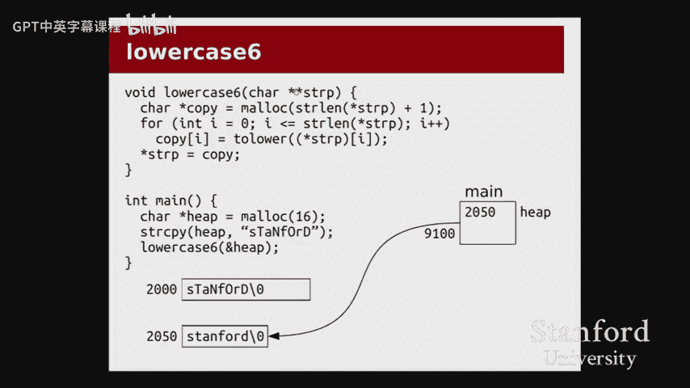
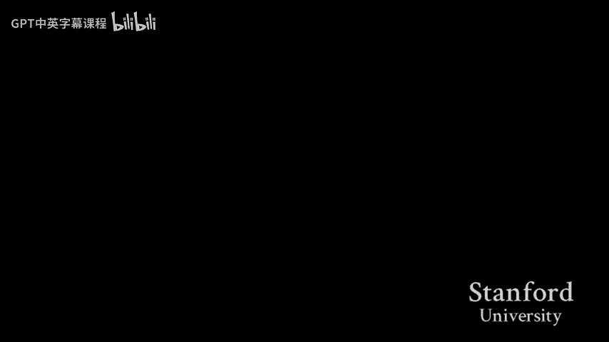

# 【计算机组织与系统 cs107 2016】斯坦福—中英字幕 p03 【Lecture 03】CS107, Computer Organization & Systems -uFGnTtairxw- -BV1Nr421c7YB_p3-

All right， let's get started。Welllcome back， everyone。To another exciting day of CS 107。

 end of week two here。Which is， I don't know if that's moving quickly or slowly for you。

 but whatever the case may be， hopefully it's all going。

A couple announcements before we get into lecture today。The first one。

 the first couple are things that have already happened。

The first being that labs hopefully all happened this week， hopefully you all enjoyed that。

That process of working through C strings， a little bit of GDP。

 just seeing generally how to work with C and work with pointers。

The other thing I just want to mention briefly is that assignment0 grades went out a couple of nights ago。

So we made a post about that with the medians。If you want to review your grades at any point throughout the quarter。

 you can go to the gradebook link on the course website that'll show you your assignment scores。

 but also your lab attendance note that the lab attendance will not show up。

Until the end of the week， we'll probably post it around Saturday。

 so don't worry if you just went to lab and you're like， oh gosh， it's not showing up。

 don't worry if the rule of thumb is if grade if there is no line for that assignment or lab in the gradebook。

 that means we haven't posted anything yet。So don't。

 don't panic if you don't see a recent assignment or lab。Big thing to note。

 of course coming up is that assignment one is due on Monday。

 this coming Monday that is the sort of normal deadline for that assignment please check out our late policy if you have any questions about how our deadlines and hard deadlines work we realize that the late policy is maybe a little different than what you might be used to from other。

C S classes， so just watch that and be aware of that。All right。Okay， let's get into it。

Here's the what we have on deck for today's lecture。

So last time we ended with a discussion about arrays。 We saw how to allocate arrays on the heap。

 We talked a little bit about how to allocate them on the stack。

 And then we saw lots more with arrays。 and in particular， with C strings。In lab this week。

So we're gonna pick up where we left off from that。 And we're gonna go back to this question。

 which has come up a few times in piazza and in office hours already， which is。

 when exactly do we use。The stack versus the heap， why should I prefer？

One form of memory allocation over the other。Then we'll look at somewhat briefly at another。

Common example of how pointers can be used， which is to pass variables by reference。

 so you may recall from C plus plus that there was some special syntax that allowed you to say that a variable was passed by reference in C。

 we don't have that syntax。 So what do we do instead。😡。

And then the main part of the class today is going to be working through some pointer code examples。

 will be mostly on the terminal， but then I'll switch back to the slides at the end to draw a couple more pointer diagrams。

 and the intention here is we worked through a bunch of stuff on Monday。

 we saw some good examples of how pointers work some of the operations work。

 we saw the pictures for that。😡，And now our goal is， well。

 how does this actually translate to the code that we're writing， How do we actually。

How does it man these？For example， how did memory errors and sort of the common issues that we were discussing last time show up in our code。

 whether that be in our output or。How do we debug it， How do we look at。

How do we use something like GDP or Valalgrind to make sense of。

Something that is going wrong in our memory。 So we'll sort of switch between code and slides as a way to。

To， to work some of that out。All right。Okay， so let's get into it with a。Somewhat。

Condensed discussion of stack versus heap。 we've certainly talked about this on， on Piazza。

 And there's some stuff in the assignment1 handout and advice page about it to look into it。

 But here's， here's the rundown。So we saw two different ways to allocate。An array。

 And I'll be focusing on arrays because those are the by far the most common cases where we need to think about using the stack or the heat。

 We saw two ways to allocate an array。 One of them was to say an array bracket 5。

 which declares the memory on the stack。 One of them was to say to declare an instar and have it。

Point to a meic。Right。With the stack， there's， there are some pretty compelling advantages。

 And by far， the biggest of them is that the memory is automatically cleaned up for us。

 We don't need to call free。 We don't need to remember to you know， clean anything up。

 once the function returns。 The memory associated with A R R is just。

 is just taken care of and program continues to run。 no memory leaks， no memory errors。 That's。

 that's really nice。😊，Another advantage that we started to talk a little bit about in assignment1 is that the stack is considered really efficient。

What this is saying is you might be thinking from when you think about efficiency from the perspective of C S 106。

 for example， and thinking of like big O runtime and asking， well， wait。

 are you saying that the heap runs in something that's not constant time。

 Like is the heap running in some crazy linear time。 What's the factor。 It's。

 it's not quite that the stack both allocating on the stack in the heap are largely constant time。

 but the constants are very， very different。So if we were to have， for instance， a mallic。

Inside of a loop that was running for 100，000， a million， 100 million iterations。

We'd start to notice that the program would slow down a little bit。

 whereas if we had been doing exactly the same loop with a stack array， way， way faster。

So in general， the rule of thumb is use the stack when you can。If， if there is。

A good like you don't need a good reason to use the stack that should sort of be your default go to。

But there are a couple reasons that you might need to use the heap we already saw a couple in throughout。

 which is that the big one， of course， being controlling。

 we need to control the run the lifetime of the variable that we allocate。 So for instance。

 for instance， in read F in the starter code for assignment1。We can read the， the fragment into。

Into memory。 But then we need the fragment to stick around until after we have reassembled everything。

 So it would be a huge problem if the memory were delocated。At the end of read f。Therefore。

 have to use the heap。Another advantage that we won't talk too much about in lecture is that the memory can be resized。

 So there is this function called realc。 I encourage you to take take a look at it。

 It should be in KN R。 you can look at the man pages， but essentially it lets me say。

 actually I know I asked for5 ins of worth of space。

 but I actually need 10 I actually need 20 and we can use that structure to build these kind of automatically expanding blocks of memory In contrast。

 if I say inch array bracket5， that's it。 you can't say， oh， just kidding I need five more。

 can't do it。 you won't be able to extend this array。给。Questions about stack versus heap。QuYep。

 so when do you have to stop。Is it possible to use a variable as AFCC it possible to is it possible to use a variable as the length of a stack A andC What do mean use a variable as the length So say I have like n to x equals like five and then I want to do H R ofM？

Oh， so you're asking whether it's possible to declare an array。 And instead of putting five in here。

 you want to put the name of variable in here。 Yes， this is a somewhat new。

 And when we say somewhat new and C we mean 1999， which is not at all somewhat new in some of them。

 but it was in addition to the language after after C happened。

 which is that we can declare an array with a variable length here。

 That doesn't mean we can resize it right， even if the variable changes， the array will not resize。

It'll be whatever size it was when you declared it。

 We'll actually see an example of of this showing up later in today's lecture。 so yes。

 that is possible。Anything else？O。Great， so let's get into the actual， actual coding part to do。

 to do the first part of this。 the code as last， as it was last time， is in the。😊。

Is in the class directory。 If you want to follow along， that's fine。

 If you want to just watch me do it， that's also fine。 I have my normal two terminal setup here。

So let me just get into it。We have two programs that we will be working on today。

 One of them is a pretty short program called Ref do C。

 which I'm going to use to show after my reference。

 and then the bulk of the lecture will be in this C C file。 So let's start off with ref do C。

I'll come over here。I'll pull it up in the editor and you can see。What's happening in this code。

 let me walk you through briefly what I'm trying to show here。We have a function called change。And。

What we'd like this function to do is that we would like it to take a parameter into x。

 and we would like it to change the value of x。So， that。When we come back to Maine。

 the value of in this case。You know， the value has been increased by 10。In this case。

 we start with the variable nu， which starts with a value 107。And we called change of numb。

 And we were。We are hoping that after calling change， the value of numb down here will be 1，17。

So that's what we'd like to have it。😡，You may get a sense from how I am presenting this so that is not what will actually happen。

So I've already made， as it turns out。 So I'll just go ahead and run it。 But， what。

 you can we make again just in case。 Okay， it tells us that it's up to date。

 which means that I did already make it。 So that's great。😊，And sure enough。

 we see that it didn't work。Not the way we want。 So inside of change， after we call。

 after we say x plus equals 10， we do not get we， we do get the updated value。

 But then once change returns， the value has gone back to 1，07。

You probably saw this scattered throughout。 There were definitely some piazza posts talking about pass by reference versus pass by value。

 And that's exactly what we're getting at here， which is that in C。

 just like in C plus plus and Java， at least by default。Variables are passed by value。

 What does it mean to pass a variable by value， It means that when I call change of numb down here。

The value of numb。107 is copied into X。So that changes to x will have no effect on the calling functions variable。

嗯。So what do we do？Well， like I said in C++ we have some special syntax for this。 yeah。

 no such luck can see。😊，We've got to do it with pointers。 So how does that look。

 And I'll just kind of show you what the changes are。 and we can kind of talk about。Why this。

 what this is what we're getting at。So I'll start with Maine。Rather than called change of nu。

 which will pass the actual value 1，0，7 to the change function。I want to give the change function。😡。

The address， I want to say， rather than here's the number， go do something with it。 I want to say。

 here is a location where one of my variables is。😡，You can read the number out of that location。

 or you can。Go to that location and change that value。And the way I'll do that is。Turrown 8% on it。

So change of address of numb。😡，We'll now give the change function。A point or two。

So this passes an address， which means that the parameter is of type int star。

 It's a pointer to the int。 I want to rename it to P to remind myself that this is not just some。

Variable， some integer variable anymore。 This really is a pointer。

And now I can use this pointer to read and write the value of the end。Now， in C++。

 that might have been it。 We just changed the prototype， and that was we were done。

Not quite anymore in C， we have to actually be explicit about the fact that we have changed。

With the fact that we have changed from taking in an integer to taking in an int star。😡。

Which means that everywhere in the code for change， I need to。D reference P。

In order to read or write the value。 So here， I would say star P plus equals 10。

 which means follow this pointer。 Go to the integer that's at the other end of that arrow and。

Change that number to be 10 larger。Likewise， when I print， same rule applies。Stp。Save。I'll make。

I'm only going to make ref， I guess doesn't matter。Yeah。

 I only make ref because I I don't want to build C right now。嗯。

I can run it and we see that it did work。So just an example of how we can use pointers to do something that C++ gave us syntax for。

 also just a good opportunity to review stars and ampersands。Any。Issues about this。

 Any questions about。These changes。ok。So this might come up in assignment1 in case you found yourself in a situation where you said。

 oh， you know， I'd really love to， I'd really love to have a function that say returns to different values。

 Maybe I want a function that returns an int， but also updates another， another variable。

 This is how you' gonna do。 You're gonna pass a pointer。😊，哎。够。In that case。

 let's move on to the bigger example for today。I'll pull up c stir。c。O。This是。Block of code is。

 there's quite a lot of code going on in here。😡，It's probably one of the biggest examples that we've。

 we've looked at。 So I'll go through a piece by piece。 I'll talk you through what the。

 what the core ideas are， and then we'll explore each of these functions in turn。So first。

 let me go over the main function。ちちちち。You can see here this。

 So we're gonna do a bunch of stuff with C strings。 Hopefully， you， you know。

 are feeling all right about sea strings from lab。 if you're not feeling totally。

On board with it yet that's okay， there's plenty of time to fill in those gaps today。

 but also we'll just spend some more time doing some stringing examples。

So here you can see I've declared three different strings， and I've declared them in different ways。

 I have one that is declared on the stack。Cleverly named stack。

 I have one that is declared with Malick on the heap， cleverly named heap。

 and I have one which I initialized down here to be a string constant or string literal。

 we're probably going to use them interchangeably。So this is呃 yeah。And our goal for this function。

Or for this program is that we would like to take each of these strings。

 which each have kind of wacky capitalization。And I would like to。

Explore different ways of converting the string to lowercase。

So I've got six different variants of lowercase that we can look at here。嗯。

And so what we're going to do is we're going to call a lowercase on each these each of these strings。

 and then we're going to print out the value to see how it goes。看。So let me go up to lowercase 1。😡。

At some point， I'm want to start。Scrolling and I left all the there are some good comments in here explaining what each of these functions does in case you want to look back at this code later。

 it'll talk you through some of the bugs and stuff， but we'll talk through it all together。Today。

So here's the first variant。This is lowercase 1。And what we're doing here。Is， well。

 here's the simplest way we could possibly convert a string to lowercase。 You got a carestar。 Okay。

 go through all the characters， change them all the lowercase。This is pretty nice。

 There's no memory allocation。 There's no copying。 There's no， you know。

 it's a super efficient process。And。You know， it has the。Up or downside。

 depending on what your situation is of changing the string in place。

So whatever the original string was。It will that stream will now be lowercase。O。😊。

Quest not the code is it necessary。Oh， good question。 Yeah。

 So so you're asking if it's necessary to return S TR here seeing as we didn't change it。 it is not。

 however， because all the some of the later ones do need to make a copy， that's。

 that's kind of why that's there。 There are a couple of， yeah。

 so there are a couple of places where the return is pretty much unimportant。

 But I'm just keeping the prototypes the same。 But's， that's a great point。 And in this case。

 the return value is totally pointless。哦。And they also want the code。

Just a quick thing to draw your attention to， we've got the four loop from I equals0 up to。

 but not including Stland， pretty standard string loop。Maybe there's some。Attle bit of yeah。Okay。

Alright， let's try it。 So I'm running this function on stack， on heaap and on constant。Right。

 that's what we had down there in Maine。 Let me just remind you of that。

 I won't keep jumping around too much， but。Stack， heap， constant， let's see how it goes。

 so I don't think I have to make。Because I think I've already done， great。I'm going to run C。Oh。

 bummer。Okay。We get a se fault。 Now what。 I mean， I wrote this hundred hundred line piece of code。

 Like， what do I do well。😊，Maybe your first reaction， which would be a pretty good one。

 if this was your first reaction， you should be proud of yourself。

 It's dropping to GDP and see if we can get GDP to tell us where exactly we se faulted。😊。

So here we are in GDP， I can run the program。No arguments。

 And we see that we se faulted inside of lowercase 1。 That seems， okay， sure on the string junior。

Now， if you can't remember。What the string junior was， whether that was stack heap or constant。

 we could use the so we're in lowercase1 if I do a back trace。We can see that。

Lowercase1 was called by Ma。 So if I want to go back and look at what line of main called lowercase1。

 I can use the up command。😡，To bring me up here， and here I see that the problem was in calling lowercase1 on constant。

So presumably we got through the stack one， we got through the heap one。

 and now we're stuck at this one。The reason being， string constants cannot be changed。

So we had Kestar constant equals junior， and that'll work and we can use。Constant。

 just like any other string， except we cannot change the characters inside of it。Okay。

And the reason for that is you might ask， well where is it stored， is it stored on the stack。

 is it stored on the heap， because I thought I could change both of those， Yeah。

 it's not stored in either room， It's stored somewhere else called read only data。

That just happens to be the place where you put string constants and that place happens to be read only because because you probably don't want to be changing these strings。

Ostensibly anyway， because that could actually have weird impacts on the rest of your program。So。

The operating system just says no， forget it。 Now， I maybe a quick note here about the Seg fault up until now。

 we've been talking about Seg fault as if it were this like， oh， you access memory that didn't exist。

 You de referenceenced null。 you de referenceenced garbage memory in uninitialized variable。

This seg fault is a slightly different one， which is that。

You'll notice that the string is totally valid。 The memory for STR is， is entirely there。

 and we can be reading from it。 The Seg faultult is happening actually because of the equal sign。

 because we're trying to assign back to it。 So a Seg fault need not just be invalid memory。

 It could also be the memory is not writeriable， but you tried to write to it。And no。

 you can't really tell the difference。Okay。Questions about this so far。All right。

 so I will comment out。I'll comment out result 3， so it does a take fault just so I can show you the rest of it。

I'll just say result  three equals quote quote just so I can have something to print out。

 just do empty string。我 make。There are a couple of warnings。

You'll notice these warnings are happening in lowercase 2 and 3。

 so I will get to those warnings in a moment。But I'll run C。

 and we can see that without the constant thing。 So I've done nothing for the constant。

 but without that one， the stack and the heap both work。

Very important thing to note from this this line， though。

 stack and heap themselves have both been changed。 so it's not just that the result is lowercase。

 but also the original strings as well。 This should not surprise you。

 We talked about this being our goal of modifying the strings in place。😡，Okay。

Questions about lowercase 1。Okay， let me switch to lowercase2。

 and I just have to remember to go all the way down and do this。Or I can use clever vim tricks。But。嘅。

我Sa。I'll go down to Yep， wouldnt we be able to like access characters in the constant string by doing like constant bracket1 or two。

 Like is it the same Yes， it is absolutely。 So you're asking。 So the question is。

 can we use By the way， I guess S P is asking me to repeat the question。

 So that's why I'm doing that not because of anything else。 you can absolutely down here。

 say constant bracket I。 It works exactly the same way as any other carestar。 In fact。

 looking at the declarations for heap and constant。 if you know。

 I wouldn't be able to tell the difference， right， They both work like carestar。

 they both have array indexing。 it's just that you cannot say constant bracket 1 equals some character and expect that to work。

😊，等你咁。All right， so here's the lowercase 2。I pretty much point out the bug even， okay， so we decide。

 all right， well that lowercase1， that was pretty nice， it worked for stack and it worked for heat。

 but I would kind of like it to work for constant。 I also maybe don't want to overwrite the original variable。

 I don't want to modify the string in place。So here is an example。

 Here is attempt number one at allocating a new string and writing our characters to it。

What's the problem what we see right there？We did not initialize that pointer。Now。

 we've gone over the initializing of theer the uninitialized pointer a couple of times already。

Maybe we can start to expect what's happening here。 but you know， I did a lot of it on the slides。

 I want to actually show you what that looks like in reality and and how we might drill down into this。

One thing I do want to note about lowercase 2 that is different about lowercase1 is notice the for loop。

😡，We're not going I less than Stirlin anymore。 We're going less than or equal。

Can anyone maybe explain why anyone have。Inside fur。Why now that we are copying the string out。

 we need to go less than or equal。0。 What that We need to copy0 as。 We need to copy the， Yeah。

 the null terminator， exactly。 So in it， So imagine I'm working with the string Leland。

 which has Stline of 6。 Then I would like to copy the L， E， A， L A N D。 And then there is this other。

The， the term， the null terminator in my string， the backslash 0。Which indicates that this that。

The string is， you that we've reached the end of the string。

 and we need to remember to copy that as well。So a very easy mistake to forget this kind of off by one Stline off by one errors in our for loop。

 or later you'll see in our allocations， watch for that。So in this case， lesson or equal。Okay。

So what's going happen。 Well， I won't， I won't I won't build supenense for too much longer since we did we have already seen this。

 I did change to lowercase 2。 So that's nice。Okay， we even get the warning。

 so now I'll point out the warning that， hey， copy is used uninitialized。You know。

 totally unequivocal message here that this is definitely not going to work out。We can run C。

We set fault。Not too surprising， right， uninitialized variable， garbage memory。You know， been there。

Typo。I can run it， and I can see that I'm kind of stuck in here in just trying to work with Leland。

And。I can print out I， and we can see that that we weren't even able to assign copy I equals to lower of stir I。

A quick note about working with GDP here。Is that you might think， oh， well。

 I wonder what copy is actually right now。 And you might try to print out copy。

 And you get this kind of annoying message that says that the value is optimized out。

That has to do with how we are compiling our programs this quarter。

The the general rule of thumb I can give you here is that if the compiler prints out a warning。

 especially that， hey， you're doing something wrong。

 then there's also kind of a good chance that that GDP might not be able to follow through on everything that you try to print out because once the compiler realizes that that variable is uninitialized。

 it kind of gets to do whatever it wants。😡，But let's say you you couldn't tell。

 Let's say you had no idea that the variable is unitialized。 You're still not seeing it。

 You have this big block of code。 And， you know， and now we're getting this optimized out message。

 What in the world we do， What do we do。Well， when it comes to memory issues。

 when it comes to something like a seg fault or just crazy random garbage being printed out or anything that suggests that it might be memory related。

Another really awesome tool that we can use is Valgrind。😡。

AndYou've already played with Val in assignment 0。 But now we're using it， looking at it on the。

 I can't type today on the， the developer side， on the programmer side。 So I'll run。Velgri。

Dot slash C。And here we get。The error that we expect。

 it actually Valgrind itself actually tells us that the program is going to se fault， but。

Here we get a very nice message， so I'll walk you through this report and we'll show a couple more just to make sure we're all kind of on the same page of how Val Gr reports are read。

Bground tells us that we have an invalid right of size 1。 So we tried to write On line 32。

 we tried to write something。Let me look at 32， real quick。On line 32。

 we tried to write to copy bracket I。Right。So we have an invalid right of size1。😡，Now。

 where what were we trying to write to， We were trying to write to address 0 x 0。

 You'll start to recognize 0， x 0 as being noll。Did it have to be no， No， of course not。

 It was uninitialized。 It could have been。It could have been any variable or any address。

But it happened to be 0 x0。And Valgrand conveniently tells us that， hey， guess what。

0 x0 isn't allocated anywhere。 So that's just not going to work out。 And therefore。

 the program would sful。Questions about。Program message， lowercase 2。So okay， I guess it's pretty。

Pretty obvious that， hey， I have an initialized variable。 We've done it a few times。

 We're just going keep harping on the same point that uninitialized variable bad。All right。

Let's got to lower case3。Yep， go for。Inized。If we didn't want you，What do you明白。For low case2。

 we've got copy， right， and our goal is to make a copy of the string， oops。poilers。

 I guess our goal is to make a copy of that string。 Unfortunately， here。

 we've only declared a pointer。 We haven't allocated any memory for the copy of that string so。

We're going to need to allocate memory somehow， either that's going to come on the stack or it's going to come on the heap。

😡，But。😡，Or I guess I could know or I could initialize this pointer to something else。

 but if my intention was to actually make a new copy of the string，😡。

Then that's going have to come from some kind of an allocation。

 I'm going to need to use a stack array。 I'm going to need to use a heap array。

 and we'll see both of those in the next couple examples。It's okay， question yep。

 briefly mentioned in the comment， but essentially what we are saying from pretty much from here on out is that we would like is that we are basically promising the color of our function that we will not be changing the characters in STR。

So by saying Kst Carestar， this is a pretty minor thing。

 we're not going to make a big deal out of it， but every so often you'll see a warning that tells you that you're discarding Kst。

 which basically means that if your function has no intention of changing the characters in STR。

 you should declare STR to be const Carestar to say， I will not change it， don't worry。😡，You can。

 can pass me a constant。That makes sense。 yep， cool， anything else。

It declare a con charge story but isn't that kind of redundant。

 like it there any the reason why you have to do that because it seems like it's already static right。

 you can't change it。ああ、 whatりにとてあれ。Oh you're thinking about the variable constant， So yeah。

 I should be clear that。I could， okay， so first of all， yes。

 for a string constant for an actual string constant。Putting con will help。

 will get the compiler to help us out。 I won't do it because it'll generate some warnings。

 but if I actually wrote Con in here， then it'll get the compiler's attention when I try to pass something like constant to lowerercase1。

 which actually does try to change the characters。 then rather than Se faulting。

 the compiler will say you passed me a constant carestar。 And you met to in this function。

 wants a carestar and wants to change it。😡，Happ does it just be a warning， but it's better enough。

The other aspect is that Kst applies not just to these string literals。

 It applies not just to junior。 So in this case， we are passing stack and heap also as Kt carestar。

 which is merely telling us as we write Ma that lowercase 2 will not change the characters in stack。

 and it will not change the characters in heap。So the constant is still relevant for just kind of almost the documentation purposes of saying that we won't change that。

有。Okay。😊，你では。出た。All right。Let's go to lot case 3。 And then by the way。

 I'm using control V for visual mode or rec， yeah。哎有。

Think think I must listen Why you take away the cons in front of care Oh， it wasn't there before。

 And I added it sort to make a point。 But I guess the problem is， okay， I could put it in。

 And maybe I will。 The problem is I haven't。 Oops。 Oh， no， I messed up。 sorry I。

If I put the constant， there are a couple of functions。

 There are a couple of lowercase functions that do want to change the characters。

And if I put the con there， then I'll start getting warnings that say， you have got a con there。

So I'm not gonna to put it in just so I don't get flooded with warnings。

 but you are welcome to try it just to see what the warnings look like。

 because I there's a really good chance you will run into them on at least one of your assignments。

 So just just a heads up about the con。😡，Yep。For lower case1。

 the return was redundant because for lowercase1， you'll notice that all we did was return STR。

And STR was just the thing that was passed in。 So we're returning exactly the same pointer as we as we took in。

 We saw when we ran it， and I guess I've changed it a little too much by now。

 but we saw when we ran it that stack and result one were both the lowercase string。

 that heap and result2 were both the lowercase string。 So in that case。

 we didn't really need to look at the return value since this function。

 lowercase1 was just going to change the characters directly inside of STR anyway。Right。

 but for lowercase2 and onward， it is no longer redundant。

 It now does matter because we are returning a copy。O。Everybody， everybody else good， anything else？

Cool， so let's go lowercase 3。Here， I have declared。

 So this is one of the few ways I could allocate memory for。My copy， so I realized， oh oh。

 an initialized pointer， bad news， Okay， sounds good。Well， Michael said whenever there was。

 whenever I could use the stack， I should use the stack。 So here we go。

 I'll declare this copy to be a variable on the stack， an array on the stack。

 I've allocated it to be Sterland plus one to have enough space。

And I've copied all the characters into it， all of that should be super legit。

But what happens when I return， what happens to this variable？ Well， the array goes。Goes away， quote。

 unquote。What does that mean？Let's let me， let me turn this into kind of an interactive thing。

 Let's take just maybe a minute。 I don't know， talk to the person next to you if you can。

 I guess you're all kind of spread out。 But not the person next to you。

 What do you think is gonna happen， If you are going along， don't run it， You know。

 just make a prediction first。 And then if you want to run it because you can't。

 you can't hold your defense for that long， that's fine。 But make a prediction first。

 What's gonna happen。什么？であし。です。You take 10 more seconds。Well， you guys stop yourself at 10 seconds。

 that's amazing， okay， let's regroup。That' was pretty awesome， actually。

 but most of you did actually stop yourself with 10 seconds ago。 That's good times。 any suggestions。

 what's going to happen。走完。Could itIs have actuallywritten theSo yous？

you're saying you think it's going to work just basically by Sherlock？Great， okay。

Ill show you this bottom。 Okay， there' somebody back there。Yeah。I'm good okay， anything else。

 any other predictions？You don't think it's more， what do you think it have？I don't。てなでた。Okay， okay。

 so you just don't think it's we're going to get lucky。 You think maybe it could have worked。

 but nope。But no deal。 Okay， anything else。是。Sorry， please me。あいや、あの。Yes。2。good， good。

 So so we're returning a care array， but you're saying were returning a care array。

 but we promise to return a care star arrays and pointers。Kind of worked the same way。

 And even though this array is on the stack， it actually still works like a pointer anyway。

 So we're actually， yeah， so that's a good question。

 We're actually not going to get any kind of warnings or or we're not going to get a type mismatch on that。

We can treat this care array as if it were a carestar。And therefore， he can return it that way。O。

first。And the时。The think it's kind of go them。Yes， we're returning a pointer to the first character of the string。

 but we always that's always what a string is， right。

 a carestar is always a pointer to the first character。And I mean。

 so I guess it was kind of printing that out before。 But okay， so， so。Yeah。

 so it's possible that something weird will happen when we try to assign the values。

 and then maybe we lose some characters or it just like we only manage to keep one of them。 But。

 but certainly in terms of the actual printing， we will print out the entire。

 we'll print out as many characters as we can read from that carestar because we are because that's what printf with percent S means is we're just gonna go go until we reach an nu terminator。

Any other predictions？So since our printing is being done in May， I'll function lower history。

If the gray was allocated in the stack， when the function ends， is't it going to die。

 like would that stack memory part just die and then resolve only？Will we print。

 I think it's going to print， whatever。Okay， so your comment is that you think that once the function returns。

 the memory is just kind of gone， So it will be pointing to some memory that's maybe not valid or something。

 But part of the question is what do you think is going be in that memory。

Are you saying like we have no idea， you just means garbage， okay。

 so you're thinking maybe it's going be garbage， okay， great？All right， let me just try it。

I didn't change it right， so we're all good， I'll go over here， I'll remember to make。No。

 we do get the warning。You need to draw your attention to the warning。

 I'm not fixing them deliberately in our examples， but we do get a warning that says， hey， gosh。

 you're returning to Anderserson a local variable。It seems kind of weird。

 I don't think that's going to work the way you want it to。好。This is pretty interesting， right？

So we've got。Result one is junior， result2 is junior， result three is junior。Ha， okay。

 time for some G， right？Let's run。 Okay， So now if I just run， of course。

 it's just going go all the way through。 There was no se fault。 There was no crash。

Didn't turn out to be garbage even。 So now I'm going to need to put a break point。

 And so where shall I put a break point。 Well， let me take a quick look at my code。

 I'll go ahead and put a break point on this line。Which are going to be 106。

Now just a quick note about GDP debugging something that maybe might catch you off guard when you see a line in GDP that says 106。

 blah， blah， blah， this line has not executed yet， so I cannot look at what is in result one。

 it has not been initialized。😡，Only after I go next。Will it run that particular line。O。

So let's just go ahead and try and print out resolve one。嗯。It worked， right， Oh， it seems fine。

Weland， yeah， okay， alright， cool。 let's go next。For that result too。H in order2， a nice。

So I don't know， was printf just freaking out？I never thought one again。And now we see the problem。

And here， in fact， so the way this output goes is that this number is the address。😡，Remember。

 result one， result two and result 3 are all care stars。 So they're pointers to characters。

 This is the address that's actually you know from the diagram in the box of the pointer。

 Not they are exactly the same。So。I think you were all on the right track when looking at that stack memory and saying。

 hey， it's gonna to be delocated。 I won't go all the way through because you can predict what's going to happen with the next one。

 But where already saw what's going to happen。 You were。

All pretty much on the right track with this idea that this memory。

 the memory for copy will be delocated at the end of this function。😡，Or I'm sorry。

 it won't be technically our memory anymore。😡，But what does that mean for the actual memory。

 Does it get zeroed out， No， does it magically turn into garbage， No。

 are we getting lucky that it's still kind of containing stuff， I mean kind of。Like certainly。

 if we did add more stuff to this program， we might not even be able to get the Leland and the Stanford after a couple more calls。

The issue is that， so imagine， you know， I maybe gonna just kind of gesture about this。

 So imagine we've got this function， you know， lowercase 3。 and it's got some space for the array。

 And we call it with Leland。 And it says， okay， I'll fill that array with the。

 with this with the lowercase string Leland then。😊，Function goes away。 Lowercase returns。 We say。

 great， you don't need this memory anymore。Now we call lowercase 3 with Stanford。

 You start up lowercase 3 and it says， hey， I need some memory。

 or do you think it's going to get the memory， probably from the same place because that old memory wasn't being used anymore because it's。

Not valid memory anymore。 So here， have that memory again。Right。

 but now we still kept a pointer in main， namely result1 was pointing2。That copy。

And the contents of that copy has now changed。Yep。So。It sounds like if we'd run it once。

 it would have worked。Like if we had just run it one time that memory， like you said。

 it would have been not safe， but the stuff would still be there。喂イ。If we ran a different function。

 Would it go back to that memory and rewrite that or depending on where you are in the code。

 would it go to different， Yeah， So you're saying， okay， so if I ran this thing on only one variable。

 and let's say on only stack， it'll work。You're right。

But then if we did something between calling lowerercase 3 and the printf。

We called some other function that also had an array， then it is very much possible and in fact。

 extremely likely that that other function will use exactly that same space that we are using for copy。

 And so then when you go and print out the copy or when you go and print out result one。

 it'll still not work。😡，So yes， we are extremely fragile here。

 the fact that we're getting any result at all that is useful is extremely dependent on the particular order of calls。

Yeahep， so is it a coincidence that is using the same address for all three of them。

 Is it a coincidence， We'll find out in five weeks that the answer is absolutely not。

 It is because this， this function happens to know exactly how much memory it wants to allocate and it will always allocate that same amount of memory And and since all of all three calls are happening in main。

 just that the whole call sequence looks so similar that。They， they just。Inevitably line up。But。

So I mean， it's not's not， I guess it's not coincidental in the sense that it's absolutely possible that with a couple of different calls from a couple of。

 you know， for example， of how we're using，😡，Sorry， I， I lost。So for this set of calls。

 for this kind of method， we're not getting lucky that the machine happened to lay it out in that way。

 We can actually look at the code and see it being laid out over each other。Sorry。

 does that make sense， yeah。Totally got lost。 I'm sorry， anything else。O。So， all right。

This is a classic case of not being able to use the stack。 right。

 We see that we cannot return a pointer to our stack allocated memory。And in particular。

 the key point from the slide at the beginning for why we need to use the heap is that we need to control when this memory is allocated and delocd。

😡，Or specifically ded。So guess we got to use the heap， all right， fine， here's our Carstar coffee。

 we'll mallic it， we'll copy stuff in， we'll return it。A little bug here。We forgot the plus one。

On the St lens， very， very common bug。 Notice up here， we got Stlin plus one。

 when we allocated the array on the stack down here， we do not。We do not say Stline plus one。So。

 okay， another minute， make a prediction。 what's going happen。

And then we'll throw in something else with that， which is， all right，'s gonna。

 What is it actually gonna print out And then you know， is are we like， yeah。

 So if you think it works or if you think it doesn't work。

 like are how are we going to find this error。D。 Naor， take a minute。I'll come back to this code， Dr。

 Sch go ahead down real quick and change these。て。Right right。まで。什ま。そ。な言な。てこ。All right。

 85 more seconds， ten0 more seconds。是。Allrighty。Allrighty。Let's come back here。Okay。

 what do we think？What is going to happen when we do this？能。ねて。Okay。

 so you're thinking in terms of Val grind。Yeah， that Valgar maybe starts looking at an invalid right。

 okay， what do you think the program's actually going to do？So。Thanks， so you're thinking maybe。

I messed up somewhere with it over。When I try to write that yep。

Sure an element of unpredictability here， any other guesses？还问那边。

It'll like writing into the copy array you't get like overlap theirs。

 But when you get to the printf functions。 It'll try to read them，ll do the first。

ll read the characters that you allocated correctly。

 But then since there's no null termminator go beyond that。 and it'll try to read random memory。

 Okay yeah， that's neat。 So' like you' saying okay， it's gonna print out the characters。

 those are fine because the memory was allocated for those correctly。

 But then maybe somethings gonna happen to that null terminator。 And if we lose the nu terminator。

 then print will just keep going and itll printed out garbage。 neat anything else。

Do want to guess that it's just going to work？And ran it and it。Yeah。

I think because the for loop actually goes until。than equalYep。

 I think it's just going to go over one array off of copy and copy the but then。

Because results the the。Once you return it， the pointer that receives copies is not going to know how many cells copy was supposed to be anyway。

 so it's just going to read until the nu permininator and you're fine。

So you're thinking so you're saying well， it's going to copy the null Terinator and so when we return result。

 I mean printnt app is just going to keep reading with an null termminator。

 we sure did copy one there and you think it's going to work。

 I mean does it bother you that you one off the end so you could have like deleted something critical。

But if we didn't， then we got lucky so you're saying。

 oh it's possible that that zero was like some super important piece of memory that we just over wrotete。

 if it wasn't， then maybe we get away with it。😡，Cool， great， let's try it。

I will actually get out of where am I， oh， I will get out of GDP。

Because I don't think I need it here we make。Okay， and we'll run it。Works。Were great。Meat。😡，Okay。

 we're done， it's fine， Ro out one off the end who cares？Now， let's not do that。Alright。

 so we are not seeing the symptom。 We're not seeing any issue， any bug here。

 We know that theres some memory issue going on there and we're not seeing it。 And exactly， we。

 we wrote we did write the null Terinator it like。We are absolutely writing。

That null terminator to one off the end of this allocated array。And the right went through。

 There is certainly a chance that the right won't go through that there wasn't actually any memory at that point。

 and therefore we would se fault or something。 That's just not。

 That's pretty rare that going one off the end will really cause that problem。

 But sometimes it'll happen。 you do this a few thousand times with a few different strings。

 a few thousand different strings。 Itll you'll definitely hit it once。 But in this case。

 we got lucky rotd null terminator to， I hope you didn't need that memory。

 And now're we're able to get away with it on the terminal。 Let's see what Valalgri has to say。

In response to us just trampling over random memory in the heave。Sure enough。

 we've got lots of errors。 We also get leaks。 I' back to the leaks。 Of course。

 the errors are a lot more important than memory leaks when we look at Valelgrand So， you know。

 certainly， if you see these errors， don't think， oh， well， I also have leaks， fix leaks first。 No。

 no， let's look at these errors and try to understand them first。 And sure enough， we see。

'll go all the way to the top。😊，And sure enough， we do see this invalid right of size1。 Where is it。

 it's in lowercase。 C， you can bet that's the copy bracket eye line。Here's the part that is。Actually。

 super， super useful that Valgra can give us that even something like GDP will not。

Valgrnd is telling us you made an invalid right of size1。Which means one character。

Where did you try to write to， You tried to write to this address。

 I don't know what that address means， but that address is 0 bys after a block of size 6 allocated。

This bottom section is telling us where that memory was allocated。

 So it's saying the memory was allocated by a call to Malic， which happened in lowercase  form。

So how do we interpret this whole thing。We tried to write to some memory。The memory。

There was a block of memory that was allocated in lowercase 4， using Malik to be size 6。

 That makes sense。 That's L E A， N D or L， E， L， A， N D。And you wrote zero bytes after it。

 meaning immediately after it。😡，So we get this memory error。 It tells us and。

 and Valgra will let us get away with it， which is really， really darn nice because。

Now we can fix this issue， we can make sure that our code runs cleanly。

 and we will not accidentally trip that random seg vault in a few thousand cases。Yep， what。

tes that the null that's a good question Yeah， the zero bytes does not mean the null terminator What we're saying is this is how far after the block of6 so if I have a block of6 and then I've got and let's say I you know so after the block of6 I skip for and I write over here。

😡，Then it'll say you went four bys after the blocklanco 6。Does that make sense。

 but I wrote immediately after the block of 6， So I'm  zero bytes after this block。

Because we count from 0， I guess。 Yeah， there's not a good。 Yeah， maybe you do let I think， hey。

 it feels like this is a by after。 Yeah， you'll just have to maybe get used to the。

 the way the numbering kind of works out that0 by after means immediately after。😊，But that's great。

 Great question。Anyth else。can that be over So that part of it that the rest is there It's possible as you get more and more。

 So so the question is， is it， can it be erased or like can something weird happen where like part of the memory still there And part of it's not。

 Yeah， like， absolutely anything can happen when you write out of bounds， right， if， for example。

 I called Malik again after I， you know， kept doing these rights 1 or two or three Bs after。

 And I just kept calling Malik and then writing out of bounds。

 I'm probably gonna crash Malic eventually。Eventually， Ill。

 I'll stomp over something that Malick was using。 And I'll be like， yeah， yeah， you。

 buck stops here like you're gonna fault。 Youre gonna get some crazy error message。 So， yes。

 all variety of things can happen with these array out of bounds， which is why Valgra is so helpful。

 because you might run your program。 And you might see either no output or you might see some complete garbage like so that example of the or so the the suggestion of the printf with garbage。

😊，Coming out after the the string， that's also possible。 And how would you even debug that。

 What do you do when you see Leeland right， Like， what does this even mean， Well， Valgrind。

 Valgri to tell you。呃，哎对，这个点这个。then what would happen with the program to that So you're saying it's the strings happens to Terinator？

Yes， so in that example， where the null terminator gets overwritten by something else。

 then well all string functions， including printf right， are just gonna， I mean。

 they don't know how long the string is otherwise， they're just going to keep reading characters and printing them out until they hit a null。

 which or a null terminator。 So they're just going keep going until they see a back slash0。

 Where are we gonna to see a back slash0。 Well， we sure hope there is one in memory somewhere to stop us eventually。

And there probably is。Backstlash 0 happens to be the integer 0。 and we'll see that later。

 So there are  zero is all over the memory。So we'll stop eventually。申荐一个。But she。We， the thing is。

 we did put a back slash 0 in the for loop。 So the for loop did go from I less than or equal to Sterlin。

So this very last iteration of the loop， where I， in the case of Leland， where I equals equals 6。😡。

We're copying STR bracket I。 So STR bracket 6， when the STR is Leland is going be the backslash 0。

 calling too lower on backslash 0 gives us back slash 0。 so we will write the backslash 0 to copy。

It's just that were writing it out of bounds， and it's happening not to get overwritten。

continue reading。あそ。That's correct。Yeah， I mean， print doesn't know the end。

 right Like this code doesn't know the end。 We can't just look at this code like from this line and see that we went out of bounds。

 right， Neither can print。 It's just gonna keep reading from your pointer because that's what you told it to do。

Since we have a fast zero in this case， we you ever crash， do you keep running it？

The risk for the crash， the question is will it ever crash。

 The risk for the crash is if a copy bracket6 happened to not have any memory associated with it。

 we haven't hit the very， very end of our heap。Then it might crash。In the right。

 but the print will never crash。😡，Assuming that the right work。Yep size of care is that just because？

Good question。 Oh you're asking why for Malik， are we not using size of care when all the other Mal I was using size of something。

 care in C is defined to always have size1。 S of care will always， always always be the value1。

 Therefore， it's largely redundant to write time， size of care here。

 And so we're just gonna to leave it off。 when allocating character arrays。

 but not for any other array。第二。You already ran this and so it wrote the null Terminator at that point in memory Now if you quit this program and you run it again without the form like if you change the for loop to make it just less damn so it doesn't write the null Terminator。

We were just talking like oh， well， it can just keep reading。 Yeah。

 but if you've already run the program and put on those like oh can remember that。

 So the question is， will the state of memory be kind of preserved across runs。

 the answer is no Every time I rerun the program， like the memory gets initialized from scratch again。

Anything else。O。嗯。There are memory leaks here。 so I could fix this。

 but I'd rather actually I could fix the the plus one here。 you'll see that in lowercase 5。

 I want to， but I want to do something a little bit different。 So I'll leave that。

 I'll leave that as a bit of an exercise。 I mean， add the plus one。

 There are also leaks here for freeing the result variables。 Again。

 these aren't super like mission critical to fix。 but they certainly would be good to fix。

So I will also leave that as something for you to try out。

 maybe I'll make a separate commit to the lecture code showing you how to free all the memory if I get a chance。

But I want to switch gears a little bit。And talk about a different way that we could do this。

 a different way we could do this。 And I w to do， Im want to do that in slides。O。So let me。

 let me talk you through。 Actually， I should show you the code。 Sorry， let me。

 I should show you the code for what I'm gonna try to do in slides。 And then I'm gonna。

And then I'm going to move away from code for a second。 So here's lowercase 5。

 You can see that we did fix the plus one here。And everything else about this code is fine。

 except I'm going to focus on this line for the next like 15 minutes， which is that。

What in addition to making this copy of memory in the heap and writing it and returning it。

 So this function will totally work to that extent， it will。If we got rid of this line。

 like the function will behave as expected， it will give us the result values that have the lowercase and they will be correctly allocated。

 We won't have any memory errors。 We will still have some leaks that we should clean up。

But I want to focus on this， which is。Maybe what we actually want to do is go back and set STR the parameter that we received。

To actually point to the copy as well。So that， for example， when we go back into main。

 our variable heap and our variable constant。Are actually also pointing at the new lowercase string。

Okay。So。啊。I guess。I'll spoil it for you now， but you can run it on your own if you'd like。

 it's not going to work that way。And I'd like to actually draw out why it won't work that way。

The first thing I need to do is skip a bunch of slides， because I have an example in here。

 a worked example of lowercase 1。 I was using it as comparison， but seeing as， you know。

 so feel free to go back to the slides。 again， I will post these。

 I'll try to remember to post these right after lecture。😊。

Ive I haveve a worked example of how lowercase one updates memory， but Ill。

 I'll jump straight to the lowercase 5。So here we have the code。 I。

 I'm not having this function return the carestar in this situation because I don't care about that part。

 I am more interested in this update line。 I'm more interested in trying to make stir equals copy。

And I would like to have。So here you can see the memory diagram。 Hopefully the。

 the pattern looks somewhat familiar from Monday here。 this is the， the local variable for main。

 I'm only doing heap because it's just gonna keep things simpler。

 And what I would actually like to do is I'd like when this call to lowercase 5 returns that。

Heap will not be pointing at this Stanford string， but will be pointing at a lowercase version of that。

😡，That makes sense。Question about diagraming things。I just kind of jumped into here。Okay。

So we'll walk through it。 The line in blue is the line that I'm currently talking about。

 whether it's， I'm not super consistent about whether it's happening before or after， but。Anyway。

 so here I've started to enter the lowercase 5 function。And inside lowercase 5。

 we take the parameter STR。And in Maine， we pass heap。So what does that mean， Well。

 it means we look inside the box for heap and we copy it down to the variable STR。

So we've got both STR and heap pointing at the same block of memory here。啊。Okay。

 so then I allocate this copy of variable。I have a couple slides to do this Okay。

 so then I've allocated this copy variable with a malik。 here's the memory for that。

The the copying of the for loop should be okay， right， We go through and we start filling it oops。

We start filling it。Everybody， okay up to this point。 So we've。

 we've gone through the entire floor loop。 We have this copy variable that is pointing at this new block of memory。

 which now stores the lowercase of value。Everybody okay up this point。Questions。

I feelel like I'm going a little fast， but okay。Now we get to stir equals copy。What does this do。

Well， there's no dereence。 This is exactly like the exercises we were doing on Monday。

 Stir equals copy means that we look at stir。 look at， sorry， we started a copy。 we look at copy。

 We say what's in the box，2050。 Okay， take the 2050， stick it in that box。All right。

So now stir and copy are both pointing at this new string。But oh， shoot， what happens when we return？

A gun。And heap did not change。So， this is not。A successful way to cut to。Update the pointer heap。😡。

Questions about lowercase5。Good question。 So So will there be an error will anything go wrong because we didn't free the memory。

 You can clearly see it right there。 Oh my gosh， it's not freed。 That's a memory leak。 So， yes。

 Valgriin will tell us that there is a leak。That's。That's a bummer。

 it's especially a bummer because we didn't even use this memory， but it's not going to crash。

 it's not going to be a memory error。She just kind of doctor just be like， hey， hey， by the way。

 didn't find the memory。By the way。Other questions。确。One more time。

there is a variable name team sorry。

Yeah， sorry， so。

Here， let me go back to， to do here。 I'm gonna start from just kind of around here。 So okay。

So I've got this variable。😊，Called heap。 Yeah， yeah， Okay， sorry about that。 So I got this。

 So this is a local variable。 Heap is a local variable in main， which is pointing at。

This heap copy of。Let's string Stanford。Right， and then now I've got these two variables。

In lowercase 5， S TR and copy。And here I have STR pointing to the same block of memory that this variable up here is pointing to。

😡，And copy is pointing to this new one。哎。So the filling in of the for loop shouldn't not be super surprising how。

 how that goes down。 We， you know， go into STR bracket I。

 So that means follow this pointer from STR into this block。 And then we start。

 we go too lower and we copy it down here。And then when I get to STR equals copy。

We're really only looking at these two variables down here where I make STR point to where copy is point to where copy is。

 is pointing。 so they go down there。But then that has no effect。 Once I've returned。

 this local variable is he called heap is still pointing at the original string。诶。All right。

Let me show you how to fix this。We already talked about the case of passing。

An int by reference by adding a star。 And you might think， well， hey， this is already a carestar。

 I already have my stars。 I shouldn't need to add any more stars。 I shouldn't need to， you。

 do anything special now。 Can't I just pass by reference。

 And that's part of the reason that I have the the diagram for lowercase1 as a comparison to this this next one。

 So， so check that out if you get a chance。But here。I'm gonna go to lowercase 6。 This is in the。

 in the code。 And， and like I said， the slides are up， but。

What we need to do in order to make this work。Is we need to pass a pointer two。

 What we want to have happen is we want this box to be changed。 right。

 What we wanted was we wanted this box to point to 2050。2。So in order to change this box。

 in order to change this variable， we need to pass the address of this variable。😡。

Which is why down here， in lowercase6， we pass the address of the heat variable。

So what does that look like？Up here， we enter lowercase 6。

 I have a slightly different name for it because I want to remind myself that this is a care double star and not a carestar。

It's stir P and what stir P is going to do is it's going to be assigned to value ampers sand。😡。

Of heap。So what is the address that this box is located at， Well， it is 9100。哎。

So we'll stick 9100 in this box and draw the arrow。Now do you see the care double star？

We've got we start in this box， we can follow the arrow up to here to get to our carestar。

 and then we can follow another arrow coming out of that。😡，To get to our actual characters。Okay。😊。

Questions。All right， so now I do the copy part。 that's all the same。I， I fill in Stanford。

 You'll notice that I have to remember to keep dereencing stir P throughout my entire block of code。

 So just watch that because now I can't just use St P as a pointer to some characters。 It's not。

 This thing is not pointing this。I have to follow that arrow at least once。

 and then I can use the bracket notation to read stuff out of this array。😡，Okay， so now what happens。

 now I've got star stir p equals。Cpy。And so what we do is， okay。

 let's walk through this just like we did for on Monday。The right hand side is copy。 What is copy。

 It's the value 2050。Okay。It's pointing at this thing。 So I take this 2050。

Don't follow any arrows because there's no star on the right hand side。 I take this 2050。

 And where do I put it。Well， I put it in star St Pete， okay？So I started at Sturpe。

I follow the arrow one time because there is a D reference， and I put the 2050 here。So now。That。

This local variable in mainine points to。The new memory。

 So when this stuff goes away after the function returns， we have successfully updated。The variable。

Questions。第一页就。What do you mean by aliasing P？No， so you're asking if we can put。

 you cannot put an ampersand up here in a parameter line。 That's only C plus plus。

We need to use CarstarSt。😡，Anything else？SPR equal star。Itは。

In lowercase5， if I say， a good question， if I say in lowercase5。

 star STR equals I won't go back to this slide， I'm sorry， but star STR equals star copy。

 we want to be very careful what the two types are。😡。

Star copy， here you can see at least that copy is a carestar。 So star copy is a single character。

Right。S TR in lowercase 5 was also a carestar。 So star ST TR is also a single character。

 So star S TR equals star copy。We'll only copy one character。😡，Okay， a couple of things before we go。

 let me get your attention for just a little bit longer。😡，This。

Function will largely work up until this point。 There is a problem。

 which is that we did not free this memory。There is a bigger problem， which I will。

 I will put in the repo， which is that you cannot。Do this line。

 Ampersand of a variable on a stack array。 Just maybe write this down or something that we'll come back to it in lab。

 You cannot take ampersand of a stack array。Ampersand stack does not give us a carestar star。😡。

So there is no way to get lowercase6 to work with stack。😡。

We can only get it to work with he and with constant。😡，So general conclusion。

 there is no good lowercase function that will solve all of our problems。

 Lowcase1 almost totally worked。😡，A variant of lowercase four or five kind of between there would have sort of worked for making a new copy。

 lowercase 6 might make sense if we know exactly where our memory is coming from and we know that we can take ampersand of it and that we know that we want to change the pointer。

😡，But， but that's sort of， you know， that's kind of the nature of it in C。

Hopefully you got some experience with GDP， you got some stuff with more planers。

 we'll come back to all of this stuff next week and again in lab until then we'll see you on Monday。

