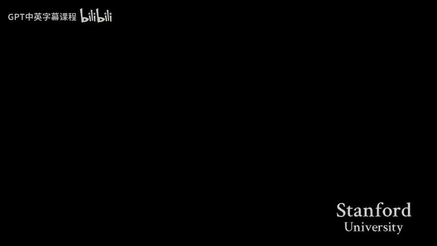
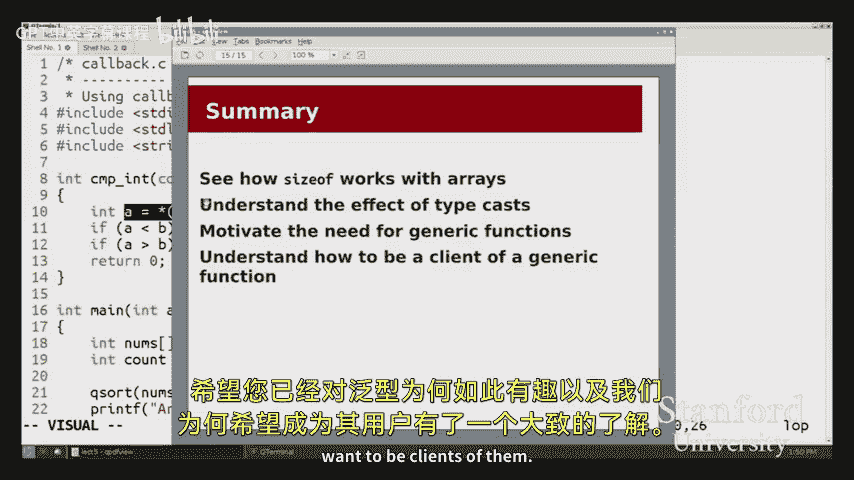

# 【计算机组织与系统 cs107 2016】斯坦福—中英字幕 p04 【Lecture 04】CS107, Computer Organization & Systems -7hNhJj1zUyM- -BV1Nr421c7YB_p4-

B。

Here we go。Okay， good afternoon everyone， welcome back。

It's week three I don't know if that's good or bad really I've lost track of most sense of time at this point。

 but that's fine so hopefully you're all excited to be back in week three of CS107 we've gotten into a bit of a pattern now in terms of our assignments and labs or just going kind of keep on going so I decided to cut out the announcement slide because it's really just going be the same issue thing for the next week or two we've got assignment one coming in tonight hopefully you're all making good progress on that if if not done yet we have assignment two going out either probably tomorrow is what we're shooting for just putting some finishing touches on that。

And we have labs as usual running through this week。

 as reviews of this week's lab being review of the pointer material that we've talked about last week。

 as well as some of the stuff that we're going to talk about this week。If my mic isn't on。

 should I be louder or should they turn up the amp？Okay。

 I guess I'm just going to be louder unless the amplification kicks in。 like not on。

 isn't just for the back， right。Okay， so I hope， all right， well， anyway， I'll be louder。

 but hopefully that yeah， anyway， okay， well， okay， that's why now I have to nu louded。

 this is going to be very complicated Okay， All right， so let's get into it today。😊。

So here are the goals for today， the first couple of goals are。

Relatively shorter little things that I just kind of wanted， mostly to wrap up with from。

Our previous discussion last week about pointers and memory。

 I want to wrap up a bit of discussion on the size of operation and show kind of one。

Sp case of size of that you will definitely see in lecture today and also in lab。

And then I want to talk a little bit about type casting。

 We've alluded to various type issues in the past， especially when we talked about pointers。

 and I want to。Really I want to focus on that aspect and just kind of。

And talk through some some interesting cases from that。

 And then the book of today's lecture is going to be talking about generic functions。

 I'll tell you what they are， why they're interesting， and most importantly。

 I think how we can actually use them as so we won't talk today about how to write these generic functions。

 that'll probably be Friday's topic。 we probably won't get there today。 and that's fine。

 We'll spend all of today talking about how we can use them as a client。😊，All right。

So let me get into it。 Let me just dive right in with some code examples。 As usual。

 code is in the same place it always is。 Feel free to follow along。We've got a。

 we've got a handful of programs today。 I'll start with types do C。

 And then I And then the other two are related to generics。 So let me pull up types do C。

In my editor。 So the first thing I want to talk about today。

 the first couple of things are about size of and typecasts。

 And both of them are going to show up in this file。

 I've got a couple of little functions to just kind of demonstrate some points。

 So let's start off with， with size of。Here， you can see I've declared a few variables。

 I've declared an int， a double an it star， a care star， and I'm calling size of on。

On each of those variables now we've already seen size of used。

 especially in the context of maliking memory when we needed to say malik， some number of bytes。

 we had to use something like size of int or maybe we saw a couple other size of type name in order to know how much memory we needed to allocate for an array of five ins or an array of three doubles we can also call size of though on an actual variable name and just like size of with a type。

 this is going to tell us the number of bytes that this variable in this case。

 I will take up in memory。Another quick note is that our print app format。

 this is a different format specifier， like I certainly don't expect you to memorize all the format specifiers。

 mostly we'll just show you the ones that matter when they come up， but they're not a huge priority。

 It turns out percent ZU is the way we print out what is called a size T。So you。

 you may have seen size T。 if you looked at the man pages for some of the string library functions。

 Well turns out size of also returns a size T。 And this is。

 and that's the format for printing that out。 Like I said， not a really important detail， but just。

Don't want you to get confused by it。Okay。So let me run this program and just sort of show you what some of this output is。

Now， so I've already made， I can make again just to make sure。 but now I'm going to run types。

 The program doesn't take any arguments， and we're not actually going to be rerunning it a ton of times。

 at least for the size of discussion。Oops， sorry，Yeah。I need to。Yeah， go。

 the command line to get the copy of the lecture files Oh， so it's a， it's an H G clone。

 I believe it's on the。So the， the path is in the syllabus。 It's an A F S I R class。

 go to the syllabus page and copy that， that， that thing。 And that's lecture number 5。

 And then you're gonna do an H G clone of that， just like you would for your assignment。Yeah。Okay。

 so。Yeah， so I can run the Ty program and we get some of these size of。

 don't worry about the bottom part yet。But， O， it's going to be a little annoying。

 This is a pretty quick aside。 It's going to be a little annoying for me to have to switch between the code and the output of the program every time。

 especially since we are just focusing on。The code for today。

 we're not actually interested in running the program in a bunch of different ways and seeing the different outputs。

 So I'm going to do this cute little vim trick， which is I'm going to dump the output of the program at the bottom of my of my screen。

This pretty much o。 I can't think of a situation where this would ever otherwise be useful except in this one。

 So， yeah。Anyway。So what we have at the bottom here is down here now。

 we have the output of the program。 and then up here is the code。Okay。

So we can see from these first four lines that the size of for the different types， the int star。

 the int， the int star， the double and the the string are。Some are pretty much as we described。

 and as I drew in the diagrams。In in the past week。 So we see that ins or that I， which is an int。

 takes up  four bys in memory。 A double takes up 8 by。And versions of both pointers。

 whether they be intstar or carestar， and if we tried this for any other pointer。

 we'd see the same result， all pointers take up eight bytes of memory。That part okay。

 Any questions about those sizes。Yeah yeah， so this is gonna be。

 So the the whole format specifier here is percent Z U。

 They go together and percent Z is what we use to print out here。 I'll write a comment。

 percent Z U is size T。 So we can use。 So percent Z lets us print out a value of type size T。

 which happens to be what the size of。Function returns。Not an int。

 So if I put percent D here or percent I， They're the same thing， right。

 then I would get a warning that says， hey， you pass me a size T， But I think。

 but you asked me to print an in。 I'm not really sure what you're trying to do。

 And so I figure I'll be， I'll be good about it。 I'll make sure that I don't just let those warnings stay。

 and I'll use a percent E。 size。Size tea。You for pretty much everything we're going to do in this class。

 size T is is pretty interchangeable。 What it is is it's an unsigned type that is guaranteed to be large enough to store。

A any like array length or any number of bytes。 For example， Sterlin would return a size tea。

 and it's guaranteed to be large enough to store pretty much any string length you could possibly want to have to store。

 But it's totally fine to take a size of and assign it to an in variable。

 We'll actually see that a little bit later。 We're just gonna。

 it's totally fine to just to use an in variable in this case because we're not worried about getting up to that those large numbers for now。

But these are good questions， Anything else。Okay， so this part is somewhat review。The part that is。

 is different that I want to talk about is。Firstst of all。

 I need to introduce this syntax a little bit。 This is some syntax that you'll see。

later in lecture and also probably in lab。It's。What we're gonna try it。

 What we're doing is we are initializing an array of ins on the stack。

 and we could do that by saying into A R bracket 3 and then setting each of the values or each of the the values of array bracket 0。

 bracket1 and bracket 2。 This is just a shorthand for doing that。

 So I don't have to put the number inside the square brackets here because the compiler can look at this part here and say。

 oh， well， clearly， you want three ins。 And so it will automatically allocate those three ins and fill in。

TheThe three indices。ok。And so then the follow on question is， what happens if I call size of。

On this array。 Now， oh， I guess I gave it away。 Well make it hide now。 Well， well。

 you might have expected this to be like you might we might we were talking about arrays and pointers as though they're basically always the same thing。

 So you might have expected this to tell you the size of a pointer As it turns out。

 it doesn't do that。 It tells us that size of A is 12。

 I want to also make that line go away because okay。😊，It tells us the size of ARR is 12。😡。

Where did 12 come from。Well， let's look at the array， so we've got three integers。

And how big isteger， each integer takes off four bytes because size of inches is floor。

And so this 12 is actually telling us。Totally correctly。

 how many bytes the entire array ARR takes up in memory。哎。So that's really nice。

 But what that actually means is that。this this is a bit of a contradiction from what I had told you previously。

Previously， I told you that arrays in C don't know their own length。 And therefore， we can't。You。

 we can't use an array without also having some int， for example。

 associated with it to tell us the length。😡，In this situation， that's not true。

Since size of ARR is 12。And the size of each element in ARR。Is 4。 If I divide the two。

Then I will get the actual count of elements in my array。So I will get that count equals 3。Is okay。

 questions about。So this is an exception to the rule。That most of the time。

 arrays don't know their length in this one exception。

And we'll see just how deep that exception goes。We can use this line to get。

The light to get the number of elements in R。Yep。关键是。That's correct。 So if I， yeah， so if I use A RR。

As if I were using a pointer， then it would point to the first integer in the array。

 It would point to the 10。 That's right。Cool， anything else？So if you have some。

Leing your knowledge points in memory， though you just had terminating characters in a string array。

 would that return the size of the entire way out or this？Yeah。

 so we'll see that so this only works for stack arrays。 So if I say care something。

 you know bracket with some number， then it will tell me the size of the entire allocated array。

 So this is not Sterlin。Right， so if I say， for example， care of。C array， Yeah。

 this isn't gonna to be great of 10。 And then I assign the characters， A， B。And then a backslash0。

Right， then Sternland will tell me， too。Because it'll see character A， character B。

 and then back slash 0。But size of will tell me 10 because I allocated 10 spaces。Does makes sense。

Okay， I want to get rid that because。Okay。So you might think， oh， well， you know， okay。

 now now like my trust in this this statement that arrays don't know their length is a little shaken。

 What if， you know maybe arrays really do know their length and you're just trying to make my life hard。

 So what if I have this function。Which is declared out there。 It's called size parameterss。

 And I pass the array to that function。 So let me go up。Two sides per ra。

 so I passed ARR to this function and I passed it in two different ways I'm using one with int ARR square bracket square bracket bracket and one using it star PTR。

 So we said that arrays and pointers pretty much can be treated in the same way and that these two ways of these are two different ways we could pass arrays slash pointers to a function。

😡，So what happens if I call size of on AR or on PTR， will either of these give me a 12？

The answer is no。Once we get into another function。Size of no longer gives us。

The total amount of memory that was allocated to that array。

 We no longer have the ability inside of this function to recover the length of the array。

Directly from the array。 So we would have to pass another int parameter with。

 with a number of elements。So just want to just recap。 this is one the one special case。

 If there is a local variable in the same function。

That is declared on the stack where you can call size of and do this fancy math thing。

In pretty much no other situation is size of on an array going to give me。

Give me the number of elements。Yep， why does size up could you two different values or why is it different when you were passing it up？

So the question is why is it different， The reason is that inside of this function。So the， the。

 there's， there's a little more detail here， which is that size of is handled by the compiler。

 and inside of this function， inside of test size of the compiler just set aside space for this array。

And so it knows how much face it set aside because it just did it。

Whereas up here in this other function。😡，When。This function， when size parameters takes。

These arrays as parameters， it really is being past pointers。

 the diagrams that I was drawing of you know passing of passing a pointer and copying the address that was sorted like these functions really are taking are taking pointers and since the compiler for this function didn't。

😡，Alloccate the space for the array， it has no way of figuring out how much space was set aside for it。

反，这情况不。Eight， yeah， great question， how did it get8，8 is the size of a pointer？

It's the size of an int star。 It's also the size of a care star。

 It's also going to be the size of an inray because inray and P int star are the same when passed as a parameter。

So all it's giving me now is is the size of a pointer， which may be deceptive because you。

 if it turned out your array had two elements， you might think that it was working， but it wasn't。

YHow can I get the 12 from another function？So you're asking so how could we get the 12 like inside of this function。

 for example， we can't。It is actually impossible。😡。

Once you're outside of the function where the array was declared。

 it is not possible to recover that original that 12。 We have to pass an int， for example， int N。

 which would tell me the number of elements in the array。Quest， can you just remind the different。

So when you're passing， something like。With the arena tape。Yes。Yes。

 the main differences in how we use them。 So， what is the difference between passing int ARR bracket bracket and instar PR。

 There are literally no differences whatsoever。You will explore this more in lab。

 but there are actually no differences。Once I'm passing these parameters， there are no differences。

You can use array indexing or pointer arithmetic on either one， you can dereence them。

 they are basically pointers。They're both pointers。Oh my。

So if you just pass a single like element of the array。 So like array bracket 2。

 then you'd pass an in， not an int star。 right And then you'd just give it one int。 And that's fine。

 But you wouldn't be passing the whole array。Right。Okay。All right。

So I'll close this this section now。 We're done with the size of stuff。

 So anything else about size of。If the pointer points to a block of memory that is allocated。

 what would size of？So size of for anything that's not a stack array will just tell you the size。

 So let's say I have an int star right here。 Let's say I have int star P equals Malic or something。

 This will just be size of int star。😡，So if I call size of P。

 I'm just going to get the size of an int star， which is  eight。So the size of。

 the special size of case only works for stacker array。 Everything else is just。

If I had an array slash pointer， because now they're really out the same thing again。

 I'll just get size of pointer。好来。All right， so now I want to talk a little bit about。Type casting。

 mostly the reason I want to talk about type casting now is that this is maybe not a super involved discussion。

 but it's involved enough that I don't want to find ourselves halfway through talking about some other topic and then realize that we you know。

 and then have to sort of take a digression to explain what it means to what happens when we treat a variable as a different type or something like that。

 So lets， let's just kind of get this out of the way now。

 I realize it's not super motivated in the context of everything that we've we've done so far。

 But but bear with me for， for this fun little discussion into how to mess with the C compiler。😊，O。

So we've already seen typecasts before。 We saw one in the average function， for example。

 back in lecture number two， where we had to cast an int to a double in order to get division to produce a fractional result。

So here in this cast vowel function。I have two ins。 sorry， I have an int and a float。

 So float is like double。 It stores fractional values， but it's just smaller。 instead of 8 by。

 It's 4 by。 Don't worry about this big difference now， but it's basically just， you know。

 it' still stores fractions。 And I'm interested in finding out what happens if I cast。😊。

Iye is afloat。And what happens if I cast。F as an int。Right。So here。

 I will actually run run it in a separate terminal because I will be making changes。

 And then I'll need to keep updating that， that thing。

 The problem with the little vim thing at the bottom was it wouldn't update， so。Okay。

 so here we can see that， recall that I originally had the number 107 and that F originally had the number 3。

14159。Here we can see that if I cast I as a float， we get pretty much what we expect 107。0。😡。

And when we cast F as an int， we also get hopefully what we more or less expect。 we can't。

 We could not represent 3。14159 as an int or， know， in an integer。 So we have to just trunccate it。

 We'll just cut off the decimal and give back a three。Right。So the compiler is doing a good job here。

 And the key to this。Example is that the compiler is actually converting the values of I and of F to the type that we've asked it to。

 So we don't know how we currently do not know how ints and floats are stored in memory， but。

I'll just say for now that they are stored in very different ways。 And the compiler is when it will。

 when we say float cast of I， we'll look at the memory。 Well look at I and actually convert its。

Convert sort of the bytes that are being stored for I into bytes that are sort of compatible with how 107。

0 would be stored。😡，And so it actually has to do some work。😡，To make。To make this line work。

 to make this line come out as expected。😡，All right。Now let's add a little bit more complexity。😡。

I'll comment this cast pointer function。So here I'm doing something that might look really similar。

But。Let's walk through it。So instead of taking eye and merely casting it to a float。I'm taking I。

 I'm asking for its address。So now I have a pointer to an int。 right， I've got an int star。

And if I were to dereence it， I would get back my original integer， but I'm not going to do that yet。

 I'm going to tell the compiler， No， no， you don't have an int star。 You actually have a float star。

All right， this seems like it's getting kind of into this realm of like rather sketchy things to be telling the compiler。

 I've got this hint star and I'm just totally going to insist that there's actually that this pointer is actually pointing to a float and then I'm asking the compiler or the compiler slash the system So what do I get when I read a float from this memory。

😊，And then I'm doing the same thing for。The for F。But with an itstar。So if I run it。

Very different result。What happened wasnn't the compiler like really cool with us and it was like totally willing to help us out and give us that conversion。

 Well it was when we were sort of letting it do its job when we said we have an int and please make it into a float so that I can use it as a float。

But we weren't doing that。 We were trying to play some games behind the compilers back here。

 We're saying。This instar， this pointer that you thought was pointing to an integer。

 is actually pointing to a float。😡，So you don't need to do any conversions。

 You don't need to do any kind of algorithm to figure out what's。You know。

 to figure out how to represent the float， just go to that memory location and tell me what you find as a float。

So we will discuss in a week to a week and a half what exactly。Why exactly this came out to be 0。

 as it turns out， it's not exactly 0。 If I printed it with more precision。

 I would see that it's not exactly 0。 We will also be able to understand why doing the same thing with F gave us this big。

 crazy number。We'll know what that crazy number means and where it came from。 For now。

 suffice it to say， let this be a warning that notice that we didn't get any information from the compiler When we throw in this typecast。

 suddenly。You know， the compiler assumes that we know what we're talking about。

 That's what typecasts are there for。 Okay， you know what this pointer is pointing to better than I do。

 It apparently go for it。You might ask， why the heck would we ever do this？Well。

 there are going to be some cases， there are some cases where we really do need to type cast our pointers。

 probably not from int stars to float stars， but we will see you a case later today。Or we' need to。

Questions about this。I won't go over the last casting example， the cast cares。

 That's just kind of another wacky example I could interpret address of I and address of F as if they were pointing to carestar and then just ask printf to just print out some characters there kind of a fun little experiment to just look at just another example of what can go wrong when we start introducing typecasts。

 we better be pretty darn sure we know what we expect to get we know what that pointer is pointing to or else that typecast is not going to work out。

And what are you trying to get？the same if we were using doubles instead of floats because doubles have twice as much memory。

 So the question is， if we were using doubles instead of floats， sort of like， how would that。

 you know， would it kind of work out the same way， roughlyoughly speaking， yes。

 but because doubles use up twice as much memory。So imagine if instead of floatat F， we had double D。

 then。Casting casting an in sorry， let me focus on this one first。

 casting a double star to an int star， we'd only end up reading out half of the double。😡。

We'd be reading it out as an int， which so we still wouldn't be able to make sense of it。

 but we'd only be reading half of it。 And then this one would be even more problematic because we'd have an int star。

 It's only pointing to four bytes of memory， and we're asking to read out8 bys of memory。 So if。

 for example，😡，On the stack， I'm not sure that Valgrind could give you a lot of info from that。

 but if we had a pointer pointing to the heap and we allocated size of int，And we de referenced it。

As a double star， maybe I got a little too deep here。 Then Val would give me an error。

 But essentially， yeah， if， if the， if the sizes don't match。

 then you're just gonna read whatever amount of memory the size says to read。

 And if there's no memory there， then or if there's some garbage memory there。

 then that's what you get。Anything else about Ts？Okay。So let me talk to you about。

The main topic for the， for the day， then。Which is gonna be generics。So I need to， again。

 I do need to tell you what a generic function is。 Before I do that。

 I'm just gonna motivate it with a couple of examples。 and then I'll Ill go to the slides for。

 for a summary of， of the concept before coming back to the code to see how it works。

So here is just kind of a bunch of code， but it's not。Like， kind of。

Deep code what we've got here is so we're going to declare a few different arrays。

 we're going to declare an array of integers， which I'm calling scores。

 we're going to declare an array of floats， which I'm calling prices。

 and then we're going to declare you want to think of this not as a C string even though it's going to work out that way。

 but think of this as an array of characters think of each of these characters as a separate letter。

嗯。And we're using that size of trick。Except for here。

 we can't use size of because this was not declared on the stack。啊。So but otherwise。

 we're using the size of trick to figure out how many elements are in each array。And then。

Our goal is to， is we've got a set of functions， which I'm going call the count functions。

And what we would like to be able to do is we'd like to count up the number of times， for example。

 that 92 shows up in this array of scores。And you'd see that it actually shows up three times I won one。

 two。We'd like to count the number of times that 3。5 shows up in this array。

 sure that it shows up zero times。😡，And we'd like to count the number of times the letter O shows up in this string。

 and it turns out it shows up twice。你看。So I want to show you that first I just want to show you that this program does work。

So I'll run generic。And we can see that it doesn't detail me that 92 shows up three times in the scores array。

 3。5 shows of 0 times in the prices array， and the O shows up twice in the string。O。

Let me show you the code for these count functions。

 You'll notice I'm calling three different count functions， count int， count floatat， count care。

So let me show you the code for count end。Kind of standard。Poiner array for loop here。

 not even really using anything with pointers。Count int takes a key。

 meaning which is the thing that we want to count the number of instances of。

 It takes an array of ints。Chris， it also has to take the number of elements in that array。

 and it's just going to through the walk through the array one element at a time。

 asking if that element is equal， equal to our key。 And if it is， then we increment the count。喂。O一。

Why was that one strain not declared on this path？Because I wanted to use a string constant because using the stack array notation with characters was kind of a pain。

I don't have a good sort of underlying reason for that。 But sorry， are you asking like。

 how did we know that it wasn't declared on the stack or why did they choose， sorry， Okay， okay。

 we can see that。 So this is declared Carestar。Chaairstar letters equals。Stream constant。

 So this you'd notice is very similar to， I think it was， Yeah。

 I think it was last time where we said carestar constant equals。Quote stuff。There's no brackets。

 there's no specification of how many elements， so with no brackets。

 we're definitely not on the stack。Does that make sense， Yeah， sorry， Thanks for that。

 because that I totally answered the wrong question。Anything else。O。So here's our count int。😡，呃。

And now we can look at count floatat。 and you'll notice， gosh， sure does look the same， doesn't it。

Takes a float key， takes an array of floats， We've got this four loop， array， bracket I。

 double equals key。This block of code， this body is literally the same。Right。

 and the only difference is this prototype where now， instead of taking an ink key。

 we gotta take a float key instead of taking an inch array。 We gotta take a float array。

Couldn't count care。Okay， it's actually the same thing。It takes a character key。

 takes a character array。Character array called array。Same block of code， right？

And wouldn' it be really nice if we could unify all of these pieces of code。

 Wouldn't it be really nice if I could just write one version of count that。😊。

That handles all of these types。Instead of having to copy。

 paste the code and remember to have to update it every time I want to change anything and get a really bad style grade because I mean come on。

Kd of copy pasting is this。 Okay， that's what we're going to try to get at。Before I get into that。

 one other point that I want to show just another way we could do this counting。Which is。

Here's an attempt to count strings。So let me get both count。

Stir and at least one other count function on the same screen。

You can see that here I'm going to count。😡，I'm going， I'm going to loop over an array of care stars。

 So an array of strings。And I to count I want to count the number of occurrences of Carestar key。

Okay。But you'll notice that I'm using doublebel equals。Just like I did in all the other functions。

So what does that do， You should have learned about the string library function over the course of the last week。

 especially in lab and while working on assignment1， you may have run into the stir comp function。

 which I can use to pass two strings， and it will tell me the number of characters。

 It will tell me whether the two the。The two carestar are。

 are have this are pointing at the same sort of block of characters， the same sequence of characters。

 right， We're not using Stcomp here。 We're using。Double equals。So what's going to happen？To see that。

 the code for this is not super interesting。 but essentially， so I've got this。

I can invoke this program with more than one with， with arguments。 And if I run the program， okay。

 I guess I will show the code。up。If I run the program with more。With at least one argument。

 So ay greater than one， then we're going to try to call count strings。

And what are we going to try to count， Well， we're going to try to count。

The number of times the first argument。Shows up in。All of the program's arguments。So hands。

 So I've got this。You can think of this as an array。Of care stars。

 But I have to declare care double star。And it's pointing。 It's pointing at。Arg V。

 but skipping the program's name。There are R and C-1 words that we're looking through。

 And the key that I'm looking for is the。First word。So let me just run this。On ABC， DEF。

 and as it turns out。Ops。I ran it on the wrong program。 That's amusing。 Ho， let's not do that。

唔 not批俾我 today。看。And it seems to kind of be working， right。

 I say that it tells me that ABC shows up once in this list of words， ABC， DF。没啊。

But what if I say ABC， D F and I add another ABC at the end？我 never doesn诉 work。

Or at least it doesn't work the way we kind of think it should。

 which is that we we were hoping that maybe we were hoping that it would coalesce these two copies of ABC and realize that oh yeah。

 ABC shows up twice in my list of words， right。So why is this？Let me show you。嗯。

Let me show you why this is。So here just sort of a quickish pointer diagram just you know。

 because we can't go a lecture without a pointer diagram， just that wouldn't be cool。

So here we've got our array of words。0， bracket，0， bracket1 and bracket 2。 And they're pointing to3。

Distinct strings。 where did these strings get allocated。 Well。

 they get allocated by whoever called Ma， right， the strings got when I call ABC， D E， F， ABC。

 the program that the the function that calls Ma allocated these strings and gave me this array。

R V of pointers to those strings。ok。And then we said word key。Eals。Word bracket word bracket 0。

 let me see if I can get that on the same screen。Word key equals words bracket0。So，O。

Word key is we copy word bracket0 into this box。For word key and both word key and word bracket0。

Are pointing to the same。Pty of the same location。So for so good questions。还是参叫什。Where is。Oh。

 because I made up a number。I I drew them。 Yeah， I drew them non contiguously to emphasize that there's no inherent reason that they should be one right after another。

But then I decided to pick numbers that were very good， I guess。But yeah。

 do not imagine that these strings need to necessarily be laid out one right after another。

 You're right that each of these blocks would only need four bys of memoryory。Okay。

 so what happens now when I go into count stir and I ask whether words bracket I or array bracket I。

 according to count Stir is equal equal to the word key。😡，Well。There'sNo de reference。

 there's no checking of characters， so we're just going to compare this box to each of these boxes。

Right，So is 9000 equal equal to 9000。 Yes， it is。But is it equal equal to 9010， no。

 despite the fact that both 9000 and 9010 are pointing to the same set of sequence of characters。😡。

Or the same three characters， right。So what we've actually done with comp stir is that we or count stir is that we've。

We're essentially counting the number of times the pointer。😡，Word key shows up in the array words。😡。

えと。For this example， that's not a very compelling thing to want to do。But。

 there are definitely some cases where it is useful to know if my array is storing duplicate pointers。

 For example， Ex me， if I wanted to。No， if I wanted to go through and free this array。

 then I might care a lot that there weren't any duplicate pointers because then I wouldn't be able to call free on able I wouldn't want to free them twice。

 for example。😡，So。You kind of just have to。Bear with me on the。

 on the fact that this may be something we want to do。 I want to use count stir as。

 as part of our example of generics。 But let's kind of。You know， N Q， that。

 this sort of idea that like。Count St might not be doing what we want。

 And maybe we do want it to call St comp。 Is there some way that we can do all this nice unification stuff that we're about to talk about。

 but also be able to。Specify the stirir comp。Let's kind of leave that as a pending question for now。

And assume that the pointer comparison is what we want。Okay， any questions so far。Alright。

 so let me go， let me go all in all in on slides for for a moment。So。Big takeaway here。

 we saw four different variants of the count functions。 We saw count int， floatat， care。

 and this w U STR version。And we really want to unify them。

 We do not want to have to write one one function for every type。

 It would especially suck if the count functions were in some somebody else's code。

 and then we come along and have a different type that their code doesn't support。 Well。

 now what do we do。You know， do we have to ask them to， to implement the。Yeah， oops， oh， oops。

There you go。So you know， do we have to ask them to implement their own version of it just for。

 for us。Well。Ideally not。So we're going to introduce the concept of a generic function。

 Now I'll actually tell you what what it is I'm actually getting at here。😊。

A generic function is what will is the term we'll use to talk about a function which can operate on a variety of types。

 We've actually seen lots of examples of this， this idea from the 106 days。

 If you think about all of your AD Ts like vectors and maps and sets。

 and I don't even remember all the other ATs。😊，You could， you could say， oh。

 I would like a vector of integers。 I would like a vector of strings。

 I'd like a map from strings to vectors of sets of maps of whatever， and you could just get them。

 And as you might imagine， we definitely like it was not the case that each type you needed a vector for had its own copy like its own copy pasted implementation to support that type that would be absolutely crazy。

So C plus+ had this really cool thing called templates， which allowed us to just say hi。

 I'd like this function to be able to take an argument of more or less any type and an array of pretty much any type of the same type。

 and then do the equals equals thing。 We don't have templates in C if you don't know templates in C plus+ don't worry about it because we don't have them so they just won't come up。

😊，But we still want to be able to。Have generic functions。 We still want to be able to unify our code。

 We want to be able to optimize our code one time for every different type。

 We want to be able to take this code， stick it in a library， and。😊。

Allow all sorts of people to call it from you using all different types。

 How are we going to get there。Well， it turns out the answer to just about every question of how are we going to do X in C is pointers。

 it's always been pointers， it's always going to be pointers。😡。

But we haven't seen a type of pointer that's going to let us do that yet。Up until now。

 everything I've shown you has been。In stars， double star， a car star， float star。

 We've had pointers that are pointing to。Elements of a specific type。And， and how。

 so what good is that， What good is that for getting us for using。

 for declaring a function that takes multiple types。We need another kind of pointer。

This is called the void star。You may have seen it if you were using。

 if you looked at a couple of man pages now， we'll explain what it means。

 So if you look at the man page for Malik， for example， you'll see that it returns a void star。

 What the heck is a void star well。A void star is。You can think of it as kind of a special pointer type that says。

This pointer points to anything。😡，It just points， period。😡，Please do not read this as Per to avoid。😡。

It's not pointing to avoid， void is not a type， so please don't read this as， oh yeah， you know。

 I've got a pointer or's pointing to void。😡，Vooid star is able to point to any。

Is able to be assigned to and from any other pointer。 So if I have an instar and I say， and I。

 I can assign it to an avoid star without a cast and， and that'll just， that'll just happen。

And the void start pointing to that， that location， if I have an。

And if I have a void star and I would like to and and I claim this is where we're going to start seeing the some of that discussion we had during our Tcast example。

 if I have a void star and I claim that it's pointing to an int。

 the compiler is going to be totally cool with that and say， sure， sounds good， points to an int。

Because the compiler has no way of knowing。 the compiler will look at any void star and say， yep。

 that points to a thing。 And you get to tell me what that thing is when you're good and ready。Okay。

So what good is。What good is， is using Vo star， What， What good is Vo star。

 How is that going to help us implement。A generic count function。

 So I'm going to call the generic count function G count G for generic。

 This is going be the function that can take an array of any type。

 a key of any of the same type and count the number of occurrences of that key in the array。Well。

 if we compare the three prototypes of count int float and stir。

 I left off count care because it's the same same idea。

We can see that all three of these functions take an array of a certain type， int array。

 bracket bracket， float array， bracket bracket。Cararastar array， right it， right。

And we know that arrays and pointers can be passed the same way。

 So using square brackets and using star。W't adding an extra star。 So I'm saying in star array。

 float star array won't make。We't actually change how the parameter is interpreted。

So this seems like a good opportunity to use our new friend， the Vod Star。

Instead of saying intstar A R R or float star A R R， we can just say point star A R R。

Knowing that ARR now points to some array。😡，And I don't need to care about the type。哎。That's nice。

But then the issue is， what do I do about this key？If I follow the pattern。Where I've got。You know。

 an array of ints， then the key is an ins， an array of floats， Then the key is of float。

 if I have an array of。Things， then the key needs to be some general thing。What does that mean？

If you followed the pattern， you might think maybe I could put void here。

 but we already said void is not a type。😡，So I can't just pass you。

 I can't pass this G count function。 I can't just pass it a thing。

 I can't pass it to some element and expect it to know。You know。

 how to I can't just pass it some generic element， no matter what type that element is。

So what do we do， Well， I just said that whenever we're not really sure what to do about something you can see。

 we probably as a pointer。So what we actually do。Is instead of passing。The actual element。

 instead of passing an int。As the key， instead of passing a float， instead of passing a string。

 we pass a pointer to that key。We'll see an example of this， but I'll say it once now。

 and then we'll see the example later if I were to use G count for ins， for example。

Then I would pass an ink star as the key。And so this point。Is very important。 I'll come back to it。

Over and over throughout this lecture and we'll see it again in lab and on Friday。

Genetic functions cannot operate on the actual elements。

I one thing I I probably I will actually add to the slide before before we before I post them is we're not ever able to dereference a void star。

So we can't operate on the actual elements。😡，Inside of our array themselves。

 we have to do everything in terms of pointers to those， to those elements。

So this applies to passing parameters， this applies to return values。O。All right。

 so we're almost there。We've introduced this thing called the void star。

 and we're almost to the point that we can use it to define this generic count function。 And so far。

 you know， we so we we fixed this key issue and maybe you think， okay， like maybe we're。

 maybe we're just， you know， are we set。 Are you ready to go。It's one other issue。

And to understand that issue， we're going to have to go back to point arithmetic。So here。

 imagine if I have an int star， which I've called I P。Which points to this array of four integers。

 so it's pointing at the very beginning of this array of four integers。If I say IP plus2。

Which recall is equivalent to so point arithmetic is these two lines are equivalent。

Asking for IP plus 2 is equivalent to asking for the address of the second element of the array counting from zero。

😡，So IP plus 2 or8% IP bracket 2 will point to。This six。你说该。

But now imagine if I've got a double pointer， So I've got a DP that's pointing to this array of three doubles。

Notice that， so here we're again using DP plus 2。😡，And we're doing some point arithmetic。

And we point to the second counting from zero。看も。Right。The same logic。But there's a problem here。

Or there's kind of an issue that's going to come up。As we go through more and more types。Notice that。

IP plus2 is 8 away from。IP， its。You know，8 bites up。Whereas。DP plus 2 is 16 B up from。DP。

Because doubles are twice the size of ins。Right。But now what about Vo star？

What if I have void star VP， now， what is void star mean all means pointed at anything。

 so we've got this big block of memory that presumably void star is pointing to。😡。

What does it mean to take VP plus 2？Where in this big block of memory is the second element。Ohello。

An idea。If this block of memory were were if it contained characters。

 then it would be like right here， right， because there would be， you know， it would be1 B per。

per element。 And so VP plus2 would be 2202， though ins， then it would be kind of here。

 there were doubles， it would be like way out of here。Okay。

So the problem is that we cannot do pointer arithmetic on void star。There are。

Essentialially two things that we can't。 yes， there are essentially two things that we cannot do to void star that we can do to regular pointers。

 and those are pointer arithmetic like here。😡，And dereencing a void star。

 which was the one we saw before。Cannot do these things other， other things that， you know， we。

 we might do with pointers just sort of passing them around and， and whatnot。 we can， you know。

 otherwise， it acts like a pointer。 But well， okay， we， we can't do these two things。

 And then you might think， well， hey， those are the only two things I know how to do with pointers。

 Yeah， we'll have to work around that。来。一。From like instar to voice star back。

 so can just do size of whatever that' something。Oh， size of what？That if he。Yeah。

 so so this is tricky right， the thing is okay， so we're mostly focusing on。

Calling these generic functions rather than writing them。Take a moment。

 just sort of put yourself in the shoes of the person writing G count。

 So if I'm writing a function that's supposed to be able to count the number of occurrences of a thing inside of an array of things。

So I take void star array。And I want to know how big the things are in that array。What do I cast to。

Do I treat this void star as an int star， do I treat it as a double star？I have no。

 I have no way of knowing because it could have。 it could have been either， right。

 The one call may have been。Passing me。An array of integers and asking me to count scores。

 Another call may have passed me array of doubles and asked me to count prices。

So as the implementer of G count， there is not going to be a way for me to just get。😡。

For me to use something like size of or to cast to something to do point arithmetic。

 because I don't know what types to cast to。😡，So the conclusion that we need is oops。O oh， O。

So the conclusion is， and I'll actually yeah， right。

 So that was what I was doing was I was showing you， I was going show you the code for the G count。

 What we actually need to do is we need to add a fourth parameter。😊，In addition to giving you。

In addition to giving G count the array and the key， which is actually a pointer。😡，To the key。

 not the actual key itself， because generic functions can't operate on elements themselves。

And in addition to giving， G count the number of elements in my array。

I also need to tell it how big each element is。So you were actually very much on the right track with。

 can't we use size of， Yes， we can。 But the question is， who uses the size of。Who said。

 who knows what size the elements are in the array？ It's not going to be G count。 It's going to be。

Us as clients， calling G count。Let me， let me just show you this in an example。 And then I， you know。

 I expect this is going to be a little， little confusing。 So let me。

Let me do it well off through an example with this count int。Function， so I've got。 So currently。

 I'm calling count int。Which is a specific version of the count function that only operates on an inter。

I want to change it to a call to G count。So， okay， I can call this generic count function。

And what do I need to pass it， Well， I can pass it the array just like I did before。

I can pass it the number of scores， just like I did before。Now I need to give it。

 I need to make two changes first。I need to pass。Not the score key itself， which is an int。😡。

But actually， I need to pass a pointer two。The key。So I add the M percent there。

The other thing I need to do is now I have to tell G count how big the elements in my array are。😡。

So as this fourth parameter L size。I can pass it the size of。I could put size of int here。

 but I'm also， I'm actually just gonna to say size of。Scores bracket 0， because that way。

 if I change the type of scores， the the size of will just continue to work。

 So what I've done is I've passed G count。The size。Of an individual element in my array。

 And so I'm saying every4 B， you will find another element。

And so now G count using the magic of G count that we will talk about。On on Friday。

We'll be able to go through my array element by element。

 it knows where the separations are now because it knows that each element is only four bytes wide。😡。

And it can keep comparing。Using some form of something that looks kind of like double equals。

 each element to。The， the key， we can also， it also knows how big the key is， by the way。

Because the key should be the same type as the array elements。

 so that the key is also point it knows that this pointer ampersandov score key is also pointing to a  four byte thing。

😡，And so now we're actually going to be able to。G be able to do this。

 I want to run it to show you that it works。 And then。Qu。

And we see that that actually continues to work。Okay， I think I just did a bunch of stuff。

To get here， so questions。He got the code on。So I， okay。

 I can give you the prototype my so I wasn't gonna。

 I'm not to show you the the definition because we'll do that on Friday， but here's the prototype。ok。

뭐。Yes， you're asking。Are we able really avoiding like how do we not dereence the key when we compare。

 We are。 there is a function， just a， I guess a super quick spoiler for Friday。

 There's a function called Mem comp， which allows me to compare raw memory。And Mem comp is。

 And so we're able to call Memcomp without actually dereencing key。

You can see the code inside of G count if you want in the， in the lecture slide， in the lecture code。

 But yeah， I'll focus on the implementation details on on Friday。QuestionYep。

 so you're passing the size of the elements in the array Yes in order to do the pointer or yes。Yes。

 well， it's vote for both actually， right， It's， so why does G count need to know the size of elements。

 Well， the one of the reasons I gave you was that if I've got this array of three things。

 I need to know where the next thing is as I move through the array。

 The other reason is I also need to know how many bytes to look at when I'm comparing the key to the actual element in the array。

 right。I also need to know that， well， if I， if I were counting up， doubles， for example。

 then I would want。I would want to be comparing all the entire double to the key。😡。

So we actually need it for two different reasons。But the1 I gave you was the pointritic one。Okay。

So let me let me do one。Let me I'll leave the float and the character ones for you to try at home。

 it's the same general premise。 I want to do this string one just to make just to hit a point。Here。

 so I'm going to convert this call to count St to G count as well。😡。

The code' is going to look pretty similar， right， I can call size of words bracket 0。

And now the question is， okay， so what do I do about this key parameter up there？Oops， did I lose it。

 Okay， up， up here for the inch1。Oh， I lost them。there we go。 sorry， Okay， of here， I had。You know。

 I had to pass the a pointer to the element。Here again， we want to be very careful to work out。

 and I'll show you why in just a second， we want to be very careful to work out。😡。

This logic every time， we don't want to get into the pattern of just saying， oh。

 I think we can draw fat in ampersand and it's going to work great。😡，So， let's walk through it。

 We have an array of carestar， an array of strings。So each element is a carestar。Therefore。

If word key is a carestar。😡，That is the element itself。Then， I need to pass。

I do need to pass an ampersand of word key here。So for now， yes， like it looks like， oh。

 I could just add the Ampersand， but there are going to be situations and you'll see a couple in lab where you won't just be able to add the Ampersand and you'll need to walk through those steps。

 What is the type of an individual element in my array in this case， Carestar。😡，Okay。

 what is the type of pointer to that element？😡，Care doublestar。So carestar star。

 So this key argument needs to be carestar star。 And we can see that that's what we have because ampersand of a carestar。

It's a care serviceor。So this works too。At least works in the the same way that we said it worked before。

Which is that it's it's not considering the duplicate， but it's still counting。

 but it it's doing what it was doing。 It's doing what count St was doing before。Now。

 why did I make such a big deal about not just guessing whether or not there is an ampersand here？

Let me show you what happens if I don't put the ampers sand。So。

 so sometimes it can be a little tempting to look at a function。

 look at the function prototype and say， aha， Well， G count takes a void star。

 here I have a carestar。 Michael told me that void star can point to anything。

So that means that I can pass a carestar here， too， right。You can。You absolutely can。

 You get no warnings。 You get no compiler information at all。But now， if I run it。

 I'm gonna use theelarrow。上龙位。With no diagnostic information， no easy way to debug this。

 no compiler support。Because when we go into the realm of void stars， we no longer have the ability。

 the compiler no longer has the ability to check our types， it no longer can say。

 you know when looking at our call to G count， oh hey， I think your key and your array types。

 you know don't line up in a way that the program will work。😡。

We have to take personal responsibility for every pointer we pass to any generic function。

 We have to be very careful that every pointer that everything we pass is a pointer to the element。

Yep， so looks here you're actually comparing。The values of pointers to characters。

 but it seems though like when you actually run it。

 it seems like it's comparing the strings of the characters and the strings themselves。

Like if you're doing the size of word 0， right， that's the size of a pointer。 Yes， that's correct。

 right， So we're not actually looking at like the values of the strings。 No。

're we're not looking at the characters。 No， okay， So when you ran the program。

 So when I ran it with ABC， D F， and then another copy of ABC。

 it did not count the second occurrence of ABC。And that's because it was comparing the pointer values。

Yeah。I。So we can get lots of practice with this。 This is just kind of a warm up of this piece。

 I want to show you something else before we we wrap up。 So don't worry if this。

 this part of void star is maybe kind of。Seem to kind of happen。 And， you know， we'll。

 we'll get lots of practice。 We'll see how G count is written。

 And I think that will clear up some of the， some of the aspects of well。

 how the heck does this work and。And what not， as well。O。你确。So one last thing。

 sort of one last big point that's going to be really important for lab。 I'll leave the。

 I'll leave the slides the slide for now。Is one other way that we were using。

One other way that we said kind of on that example slide that I kind of glossed over a little bit was with generics。

 what generic functions were also able to give us in addition to those ADTs。

Is that we were also able to get。These algorithmic functions。

 we are also able to get these algorithmic functions like sorting and searching。

 which you certainly know how to write， but wouldn't it be kind of crappy if you had to rewrite them every single time。

 just because， oh， now I've got to sort an array of integers Time to rewrite Q sort or you know。

 quick sort okay， I've got to sort， you know， now I've got to sort and you know， an array of strings。

 So guess I got to rewrite that entire function again。😊，Yeah， so that would be。

 that would be kind of a bummer。 And it would reduce a lot of the opportunities for us to kind of optimize and。

😊，And kind of。And just generally have these nice library functions。

So what we can do instead is there is a function。Called。Q sort， there's a function called B search。

These are just in。The standard C library， and they will implement these sorting and searching routines that we all know in love from 106B。

And they use VoSt as they have to in order to support multiple types。

But there's one other thing that they need in order to be successful that we haven't seen yet we already saw the when it comes to keys passing the pointer。

 we already saw the element size， there's one other thing。

 which is imagine that you are sorting an array。😡，And you didn't have。

A good way of looking into the array to know this is actually kind of going back to the count stir example。

😡，We didn't really have a good way of knowing if we don't really have a good way of knowing what's inside。

The array， then we also don't really have a way of comparing。

Two elements inside of the array to know which one should come first in the sorted order。Right。

So let's say I'm sorting an array of numbers。 I need to know。I need to know， oh okay。

 how do I compare these two numbers if I were sorting an array of strings and I actually wanted to sort them character by character。

 then I would probably need to use something like Stircomp to actually compare those two characters to sort them in alphabetical order。

😡，Well， this generic sorting function isn't able to know what's in my array。

 so what does it do instead？😡，Okay， what it does。Is。Brief aside here， I guess， with not really。

 but let's take it from a different approach， imagine。If。That sorting function。

 So I'm going to call it Q sort from now on， because that's the name of the function in the library。

 Imagine if Q sort。Had some function that it could call。And that function。Here。

 I've written the function specifically for ints。And I have this function that takes two ins。And。

Returns a negative or which basically returns a value。

Based on whether or not a is less than equal to or greater than B。So it's just going to。

It's just going， you know， give us some， give us some indication about which element comes before the other one。

In the sorted order。If Qsort had that function。Then it could do the sorting。😡。

Because it could keep calling that function over and over for different pairs of elements and saying。

 which one do you want me to put first， And you say that one， Okay。

 which one do you want me to put first， All right， I want you put this one。 Okay。

 and it can keep calling our function repeatedly。So here's the prototype for QesO。

 and I'm going a little quickly， there's going to be lots more where that came from in lab。

Here's a prototype for Qor。 The first three arguments will look。

This very similar to the arguments you saw in G count。 It takes an array as a void star。

 It takes the number of elements。 It takes the size of each element in bytes。

 And then it takes this really scary looking thing。And what this is。Is it takes this is a pointer。😡。

To a function。So it turns out you can have pointers to variables。

 you can also have pointers to functions。This is a pointer。

 so this where you could think of it as just passing Q sort。Exactly this function。 And this function。

 which is called a callback function， is a function that we， as the people when when we call Q sort。

 we will write one of these functions and well write one for each type that we want。😊。

For each type that we want to be able to sort。We know the type of array that we're trying to sort。

 We know that we just called Q sort on an array of integers or an array of doubles。

 so we can write this comparison function。And。make use of that knowledge。 We can say。

 I want to sort an array of strings。 Therefore， I need to call stcom。

 I want to sort an array of integers。 Therefore， I can use less than sign with。

With two ink variables。And Q sort will call this function whenever it needs to know which elements come first as it does the sorting。

 and then the rest of the algorithm， it can take care of all of the partitioning and the recursion。

 its can take care of all of that。😡，两。You could handle this by defining like an inline pool I that ever an option C So you're saying you in C+。

 you could define like an inline pool， Did you pass it。

 Would you pass it to the function or did it just kind of use it。Yeah。

 so in C+ plus there's this wacky thing called operator overloading。

 which basically means that you can just start defining less than operators for all sorts of different types。

 We can't do that in C。 So the only option that we have for talking about for helping a function like Qsort to know which what order things go in is to define the separate function separately。

Yep。Our callback function is only intended to work for ins。So could you make the signature just be？

Taking in like avoid good question So you're saying。 So the problem is that， so you're asking。

 can I make the prototype specific to， say， for example， its or to whatever type I'm sorting。

 The answer is no， because the prototype must match the Q sort expected prototype exactly。

compileSo if I pass it a function。 And so here's the code， you'll see it in lab。

 But let me just emphasize this that this is the name of the function。 and that's gonna pass this。

 that's gonna pass Q sort this function。 And if this。

 the prototype for that function comp did not match the prototype that Q sort was expecting exactly then yes。

 you'll get a compiler warning or error。Depending on how badly it mismattched。so嗯。Yeah， okay。

 so let me let me talk through this example in a couple of minutes and then refer you to Lab for the follow up。

We can call two sort on this array of integers， I guess any else before。Go to the example， Actually。

 Yeah， will that function also work for。Strings。Well， which function？The唐风扇no。And so let me。

 let me get to that。 Let me talk about the comp function。

 Let me just introduce the quick sort thing real quick。

 So I passed the same same kind of three arguments that we're used to。 And then I pass it。

So here I know that I'm sorting an array of integers。😡。

And if I know that I'm sorting an array of integers， then I can write a comparison function， which。

It has to take into void stars because Q sort insists that my function prototype match it exactly。

 so it has to take two constant void stars。But now inside of this function。I。

 as the writer of this comparison function and as the person who called Q sort。

 know that what it is that I'm sorting are an array of integers。😡。

So now I can use this typecast to say Cuessort didn't know what type of element it was giving me。

 but I do。😡，Because I called it， and I made that array。 and I know that these pointers。

 which are pointers to elements inside my array， I know that these are pointing to integers。😡。

So I can cast these two pointers as int stars。😡，And then。

Do you reference them to compare the actual integer values？Yes。😊。

Q sort in such a way that all of the search functions are contained in it。

 and that just passing a string indicated。So say that again Oh so you're saying。

 would it makes sense to the write Q sort or something in a way that these comparison functions are just kind of inside of it？

interesting， so you're suggesting that well maybe Q sort could just kind of know like all the different types it will and I can just say I would like to compare integers now。

 please， I would like to compare strings now。😡，That seems reasonable。

 except what if you make your own type。So we'll see a couple of examples。

 you know you've maybe learned a little bit about classes in C plus plus in C you'll see an assignment too that you'll be declaring a couple of things calledstructuts。

 which are which are actually your own type， like for example。

 I could make a struct with a couple of different incident and how does Q sort know to compare those What if I want So what's really cool about this comparison function is I can do something pretty clever like what if I want to sort my integers in reverse order。

 Qsort doesn't have a function for please sort and reverse order。

 but by tweaking how I write this comparison function， I can sort whatever what I want。Yeah。

 so that's why writing the compare function provides this kind of general purpose thing。

 So real quick， the question about how can we not use this function。

 Can we use this function for strings。 The answer is not really， right。

 because we are absolutely interpreting the pointers that we're getting as pointers to ins。

We could pass this function in when sorting strings。

 I You should try that in your lab and see actually what it does。 It's pretty interesting。

 You'll get no compiler help， but it will' sort the way you want it to。Okay。

So I realized that last bit went kind of quickly， don't worry there's plenty of practice with callback functions and with void stars this week and actually next week in lab as well as on Friday。

 hopefully you got just a brief overview of why generics are so interesting and why we want to be clients of them okay。

than呃 yeah。我是。