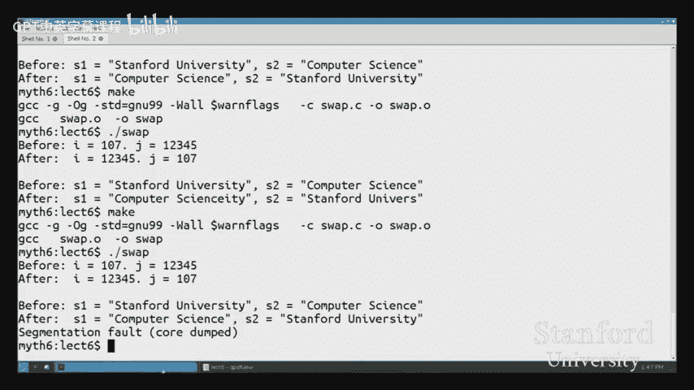
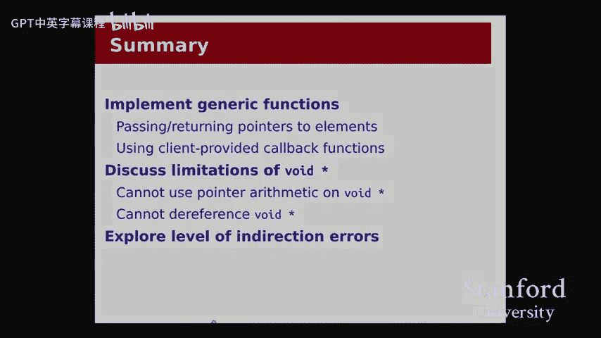
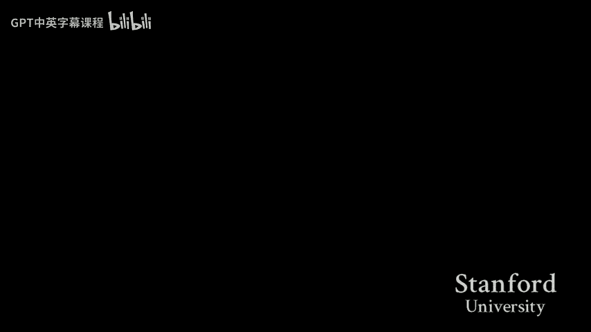

# 【计算机组织与系统 cs107 2016】斯坦福—中英字幕 p05 【Lecture 05】CS107, Computer Organization & Systems -EdnEBjmOHmY- -BV1Nr421c7YB_p5-

啊， better。Hope that's okay for you guys because。Otherwise， it's really brown。Okay， let's get started。

All right。Good afternoon， everyone。 Welcome back。To CS107。

 let's get started here we are at the end of week three。

 which is very exciting and very scary at the same time， but it is what it is。

 we are steadily moving forward。A couple of reminders that are kind of the usual things。

 we've got assignment one came in。Throughout the course of this past week and the TAs are all hard at work grading those。

 our goal is to get feedback to you over the weekend so that you will have it in time to respond for future assignments。

 starting as early as assignment I， hopefully。OhWe got assignment two coming in。

Do on Monday with the usual kind of hard deadline policy as assignment one。And then the same kind of。

Everything else is kind of the usual today is the add drop deadline。

 so something to be aware of maybe you know check your schedule。

 make sure you're enrolled for the right number of units and all that。

So that there are no surprises at 501 because the registrar is as unsympathetic as our Sub script as I understand it。

Okay， so let's get into it。Today， we're going to continue our discussion of void stars Last time we saw we introduced the void star and talked about how to use it from the client's perspective。

 and then in lab we saw a little bit more of an example of how to use void stars and comparison functions to sort and search through arrays Today we're going to focus primarily on the implementation side。

From we're going to talk about how to actually write a function that operates on void star and how we can。

You know how we can implement an algorithm like a cu sort or a B search。

 We won't be implementing those because there are already library functions for that。

 So we sure don't need to write our own， but we'll see a couple examples of that。

As part of that discussion， we'll be looking at some of the limitations of Vod star。

 We talked about a couple of them already。 We talked a little bit about them already， but we will。

Both review that and also see a few more things。 But specifically。

 we'll see how to work around these limitations。 What does it mean that we cannot do point arithmetic on a void star。

 Well， gosh， what do I do instead。And then last， I want to make sure we spend a fair amount of time looking at a few examples of some errors that can come up when working with void stars。

 these aret called level of indirection errors。And these are super important both for pretty much the rest of the class。

 they're going to be important for we're going we'll see these errors come up all over the place in assignments and labs and pretty much guarantee there's going gonna be an exam question on it。

 looking at what can go wrong with VoSt and how to identify these errors how to fix these errors and how to make sure they don't happen to you。

😡，All right。So let's get into it。I've got two main code examples and I'll be driving the lecture primarily from the perspective of trying to implement these two code examples。

 and there will be occasions where I'll need to switch back to the slides to explain some concept。

 but our primary goal should be focused on getting these examples to work。😡。

So let me switch over to my terminal usual setup。And let me pull up the callback。 C file， which is。

Here。So our goal is to our first goal is going to be that we want。

 we have this function called Find Max。 And let me start by telling you what it does。

Findbackax at the moment takes an array of integers。And the number of elements。

And it will go through the array。And figure out which element has the maximum value。

 and it will return that element。😡，So the logic here is kind of your standard4 loop over an array。

 we start by assuming we're going to assume that the array has at least one element in it。😡。

And we'll start by setting our maximum value to the first element of the array。

Then we'll check every other element。To see whether or not that element is greater than the max that we've seen so far。

 If it is， then we'll update our max。 And then by the end， we can return。

It can return the value we got。你。So our goal is that we would like this function works。

 It does work on an array of integers。 I can show you that really quickly。You want。

Some form of verification， I can call callback。 We can see that in our array of numbers。

It tells us that the max is 99。And so I did call Find Maxax here。

 I'll show you the call later that's not。Our focus right now。

 So the code works for now on an array of integers。

 but it feels really limiting to only operate on an array of integers。

It'd be much better if we could。Opererate a on any kind of array。Right。

 this algorithm feels like it's one of those things that I might want to be able to do on an array of strings。

 For example， I want to find the alphabetically last string or an array of doubles or some such some other kind of array。

 So we'd like to be able to convert this function。😊，2。Work on an arbitrary type of array。

And as part of doing that。I've listed four questions that we're going to need to answer。

And every time we answer a question， we will be able to make a change to the code here。

 And by the time we've answered all four of these questions。

 we'll hopefully have arrived at the generic implementation of Findmax。All right。So let's start。

 let's just start with question number one， here's a bit of a warm up question。

 what type should the parameter ARR be？😡，Right now， it is an int star。

 meaning it's pointing to one or more integers。But now we don't know what type。

Of array we are looking at。So we can't use a typed pointer。

 We can't use int star or carestar or care double star or anything like that。

The only option we have is VoSt。Meaning ARR is a pointer to something thing or more than one thing。

 and I do not know what type it is pointing to。😡，O。😊，So far so good。

 so the answer to question number one。😊，ARR should be a void star。All right。Next question。Number two。

 what should this function return now。Before with the int case。

 we had find Max returning the actual value， we had it returning the number 99 in the case of the big array of integers。

 we had it we initialized the max value to the first or the zero width element of the array。

 and then we keep setting max to array bracket I。😡。

We can't do that anymore because we can't declare a variable that。😡。

Represents a whole a thing of arbitrary type。To return that value。So what do we do？Well。

 we talked about this a little on Monday， and you almost certainly saw it in lab when doing the strings example。

That when we have generic functions， they're not going to hand back。The elements themselves。

 and they're not going to pass in elements themselves。They're going to return， in this case。

 a pointer to the element in the array。So what we need to do is we need this function。

 find max to return a pointer to。And that's very important， you'll put underscore around it。

A pointer to the maximum element。呀。So how does that look？Well。

 instead of returning an integer or instead of returning a thing。

 I want to return a pointer to a thing。😡，So I'll return a void star。

And instead of declaring int Maxax。I'll have void Star Max。

And now I need max to point to the zero with element of array。😡，Well。

 since arrays and pointers are the same thing， A R R。When we say it points to the array。

 we are actually saying that ARR points to the beginning of the array。

 It points to the zeroth element。😡，So if I just assign void star max equals ARR。Now， this points to。

0 S L M of AR。有。这个。You ready。Does' it hold。The eraal holds like these mysterious objects。

 we don't know how big they are， but you just called it。Yes， yes。 So to clarify， that's。

 that's a good question to clarify， we're not saying that the array has pointers in it。

 We're saying that the array has stuff in it。 So we want to be able to call findbacks on an array of ints。

 We want to be able to call it on an array of characters。And but we're going to use the type。😡。

Void star to mean I don't know what type of array I'm looking at。😡。

And so the only type I can use is voidSt。Other questions？Okay。So we got through one and two。

We now have， you know， so I haven't updated the for loop yet to be consistent with that。

 though that's part of the next two questions。But I guess actually， yeah。

 that's probably the next two question。 but I've changed the prototype。And I've updated my max label。

So here's the most involved question of them all。Which is how exactly do we get？To the I element of。

ARR。Here you see that I'm using ARR bracket I from the int world。😡，Is that going to work and if not。

 what do we have to do instead？So for that， I'm actually going to go to the slides。 Let's see。

And I'm going to for one more time， review point arithmetic。We saw this example。

Pretty much on Monday， but I made a couple changes to the diagram for extra clarity and so that I can explain this piece a little differently。

 So here we've got， we've declared。Two pointers， instar， IP and double star DP。And。I的。

Allocated the memory for the。Aray of integers here and for an array of doubles here。

So I've written it out horizontally， but it's the same idea。

 we're starting from here and we're going to the end。And so I've drawn in these。

These solid black lines to indicate where the elements are separated。

But I've also drawn in and I hope that's coming out， okay。

 I've also drawn in some of these kind of lighter gray lines。Which indicate。

 and what this is saying is recall that we talked about size of int being 4 and size of double being 8。

 The units for that were bys。 So an int is 4 Bs of memory。

So what I'm depicting here is that each of these little boxes represents one bite。

So between each of these solid line separators。😡，We have four little boxes， four bytes for this int。

😡，And four bys for this int。And for this one， and for this one。

We have eight bytes for this double and eight for this other double。😡，Okay。

And we talked about point arithmetic already。 We said that we， when we take I plus1。

We are we are skipping to the next。Solid box， we're skip to the next int in this array。

 which means that we have moved forward four bytes。And likewise， for an array of doubles。

We move forward 8 bys to the next blackboarded box。So what about Vo star？We said that。

Here is how we can think about a void star。 We've got the same amount of memory。😡。

Allocated to our void star VP， however。We don't know where those。Black borders are anymore。

 We don't know what these solid line separations are between the elements of the array。

Assuming that there is an array in here， right？So we don't know when I say Vp plus1。

 we don't know how far to go in because we're looking for the next。Blackboarded box。

And there isn't one。哎。We talked about a bit of a solution already。

Which is that we could have an alum size。So。In addition to passing you the void star and saying here's a point or two an array of things。

 I can tell you， by the way， each of those elements in your in my array happens to be 2 B wide。

And so here I've drawn that in。With dashed liness。So every two bytes is separated with a dashed line。

Why is it a dash line and not a solid line because？Only we know that。

 We only know that through1 size。The compiler doesn't know that。

 We can't use these dashed lines to do the pointer arithmetic。Because when we say。

 if I just look at VP。Without looking at L size， I don't know where the dashed line separators are。

 You can think of them as kind of being in our head。 Like。

 we know that here's where the next element starts， but the computer doesn't。

Because it doesn't have the solid lines filled in。没有。

So we don't have these like blackboarded lines't have and we can't use the dashed lines。😡，But， hey。

 I mean， we do have these little gray lines。So maybe we could use that instead。

So this is a limitation of void star that we cannot do point arithmetic。 Now we want to talk about。

 what is the work around， How do we， How do we do arithmetic。

 Because we really do want a pointer that points to this element。

An a pointer that points to this element。Well， let me show you one other type of pointer。

Here's a carestar。And we talked a little bit about carestar， the size of a carestar， or I'm sorry。

 the size of a character。 Oh， I forgot to update the number。 Okay， sorry， this should be 2300。

You were I was going to make a bug on a slide one day。That was， yeah， okay。

 so we talked about the size of a character being one by。So I've， so I've got this array。

 It's the same size。 I've got this memory。 It's the same size as the other ones。

But now the gray lines and the solid black lines totally overlap with each other because every。

Little box， every bite is a separate character。That makes sense。And then we realized， hey。These。

Lines happen to overlap exactly with the gray lines down here。So maybe we can take advantage of that。

And so here's how we would actually do that。Imagine if we treated。VP。

Not as a void star where we couldn't do point arithmetic， but we treated as a care star。We say。

 just for now， imagine that VP is pointing to characters。😡。

Keeping in mind that VP is not actually pointing to characters。But imagine if it were。

I also have a typo on that number。O。Then if I take？VP， and I add two。

Then I skip two characters forward。😡，Which means I am sure enough now pointing here that number should be 2202。

O。😊，So by treating the void star as a carestar for the purposes of doing point arithmetic。

 I was able to move along these sort of gray lined sections。😊，And I can get to the next element。

Notice that to get to the next element of this array， I needed to add not one。😡。

Like I did with the int star or with the double star， I needed to add two。

 which happens to be the L M size。Questions about this。Question， yep。Yes， I'm sorry。

 I can't change these slides now， but this should be 2202， and this should say 2300。

And I will make sure that it's updated when I post these this afternoon。 Apologies for that。

But the picture is correct。Anything else？So now we can answer question number three。

How do we get to the I element of the array？Well， I'll write the code first。

 and then I'll answer the question at the top。I can declare a pointer。😡。

To point to the I element of the array， that way， I can sort of split out this line of pointer math is going to look a little scary。

And I could say， all right， Well， I want to do arithmetic on ARR。 I want to do A R plus something。

I can't do arithmetic on a void star， so I have to cast ARR。As a carestar。

And it's important that I use Carstar here Carstar， because characters are one by wide。

Because in the diagram， the solid。Black lines for the for C P matched exactly with the gray lines down here。

 So it's important that I use Carestar， not any other type。And now so I cast ARR2 a carestar。

And then I add。Well， how do I get to the I element？Of an array。

 well I guess I need an L size parameter， don't I， so let's go and add that in。

How do I get to the I element of an array where each element takes up a length size bites？Well。

 if 11 sides were say4， and I wanted to get to say the。Brackt 3 element。

 Then I would need to move three times 4 Bs。 So I move I times one size。

So this is our point arithmetic。 So we will do we， So the answer to number3。

 we cast A R R as care star at I times L size。好。Yep， question。

 you gonna have to cast it back to a void star So the question is。

 do we have to cast it back to a void star at the end， The answer is no。

 because void star is compatible with any type。 So here you're right。

 that the right hand side looks kind of like a carestar。 But then we're gonna take it。

 We're gonna assign it into this void star。 And the compiler says， well， okay。

 void star can point to anything。 So I'll take it。And by the way。

 it is important that we did declare I as a void star here。

 We wouldn't want to declare I as a carestar because it's not pointing to characters。

We're using Carestar solely for the purpose of the point arithmetic。😡。

So we want both A R R and I to be void stars。 That is the correct type。

 They are pointers to some generic thing。But just for this line， got to treat it like a carestar。Yep。

 oh， okay here and then back。Yes， so this means that client will always have to provide a size。

 right That is correct。 So we， so that the client will always have to know what type of things are in their。

 There's no way to do this with That's correct。 So the question is。

 does the client always have to know a lens size， absolutelys， When I call find Max as the client。

 I need to know， I would like to find the max of an array of integers or the max of an array of strings。

I mean， otherwise， what was I expecting to get out of the array anyway， right。

 that you know I wouldn't know I wouldn't even know how to read elements out of the array myself if I didn't。

 So yes， it's got to be the array has to contain all elements of the same type and the client needs to know what type that is and therefore tell us how big they are。

Great， what else？For。For the parametermeter of a size。

 we're assuming benefit fit's given in bikes and not fits。

So yeah we're talking about everything in terms of bites right now。

 so the question is is it bites or bits or like what exactly is the unit Yeah so the gray boxes that I've drawn in。

A in our separators of bites， but this happens to line up with。

Cas being 1 by wide so that the point arithmetic just kind of works。 Yeah。

 so that is gonna be the conventional。 It also happens to light up with malik。 You know。

 Malik takes a number of bytes when we call Malik and pass it a number， lines up with size of。 So。

 yes， a size works the same way as size of works the same way as those things。还有3次。

What elseす thinkます。そうあん。I不 course行。So like we're L sizes of type size T。

But then like we multipied by the encounter I， which is an int。 like。

 how does all of that type conversion stuff work。 Yeah。

 So the question is about the size T versus the int， this isn't really a big deal。

 There's not a lot of conversion that needs to happen。

 Size T is just is basically an int is like a number that will never be negative because sizes don't arent negative。

 And int， this int， we know it actually also won't be negative。

Wheres it because we start at one and we go up。 We could have made this a size T。

 but it's pretty conventional to use int。 So it's okay。 like the multiplication is gonna to work out。

 And you know， nothing crazy is gonna happen because both numbers are positive。 So it'll be fine。

 I suppose it would be a disaster if I were negative or maybe it won't I't。

 but we'll talk about well I're talking about the different conversions between integer types later。

 But you can kind of if you really have to think about size T as just basically an integer type。

 you'll be fine and there's nothing else really deep going on there。我们的是。

Would it also where have we casted ARR as an instar and added in one half instead of two great。

 so the question is would it also work if I test AR as an instar？And then I。I times a size。 Well。

 in this case， you know， in the slide， we were saying am size is2， right， But in this case。

 we don't know what a size is。 So you could say， well。

 what if we cast to an it star And then at I times a size divided by size of it。Right。

 we did the division， and that would work as long as the lens size was divisible by size of end。

But what if a size， so imagine if a size were two， just like in this slide。

And imagine if we used instar， so you say you want to add one half。Of the size of an inch。

 But how do I get here， I want to add A plus a half。K't at a fraction。Right。So in that case。You know。

 you're on the。 you're thinking along the right line that， yes。

 we could have cast this to a different type and then done a slightly modified pointer arithmetic to get there。

 But this is the most general way we can do that。 No matter what type a size is。

 I can cast A to carestar。 I know that characters are one byte。

 and it is safe for me to add this amount。 And I'll get to a whole address with no rounding in fractions or any of that。

So that's why we cast a carestar。Any녕よす。Okay。So we're almost there。We've got。

 we've updated almost all of our of our code。 There's this one line left。

 I'll make this one change as part of getting to the IF element， which is that when I update the max。

 I want the max to now point to。 Hello， I'd like to be able to type I now want the max to point to the IF element。

 assuming that this condition is true。So max equals is now pointing to the if element。

 The problem is， what do we do about this condition。Right， so that is our question number four。

 how do we compare？The element， the elements inside ARR to the max that we're looking at。😡。

We can't use。Greater than sign， less than sign， because。We don't know what's in the array。

 What if we were sorting an array of strings and we wanted to sort them alphabetically。

 then maybe we would want to use something like stir comp。

What if we were sorting an array of doubles， then maybe the less than and greater than it will work differently for doubles than for ints。

So just like with something like Q sort or Efin that you saw in lab。

We need to accept a client callback function。Pass clients。Ped callback function。

The client knows because the client knows what is in the array。

 It knows the client will know what the element， what types the elements are， how big they are。

 The client will then also know how to compare those elements。Presumably。

 or how they want our elements to be sorted。So we can ask the client， okay？When you call F Max。

 please also tell me。Please also give me a function that I can use to compare elements。

 and I'll write out the。Proto for the function。 You'll see this defined kind of nicely in C vector dot H。

 So don't worry about exactly， you know， getting this syntax down。 like， oh my gosh。

 Are you going to be required to memorize this syntax。 No， no， It's just something that。You know。

 this is just kind of the syntactic way of things。 What we're going to do。

 just like with Q sort and Epe is we're going to accept a pointer to a function。

This function takes two void stars， declaring the constant void star to be consistent with。

The comparison functions you've written so far。 It's a pointer。 It takes two。

Poters two elements and returns positive， negative or0， according to which one's bigger。

And that is this in for accepting that callback function。能。So now how do we call it？

So instead of saying， is ARR bracket I greater than max， that's not？That's not what we want anymore。

 We want to ask this callback function。So we can just call the function just like any other function。

 We just say comp fun， which happens to be the name of this thing， this parameter。And we pass it。

 say the I element and the max that we've seen so far。😡，And what do we want this to return， Well， if。

The I element。Is greater than the max we've seen so far？Then we want to update Max。

So if the first argument is bigger than the second argument。

Our comparison function will return a positive number。So we call compff。

 and if it returns a positive number， that means I is greater than max。Therefore。

 we update max equal to I。Qusestsions。一ep。If we want to read the third element from。ちいアらいや。

So I will be so。We add three into two just six to the baseside address。So read so the question is。

 imagine if we were reading， we wanted to read the third element of A。

 So maybe I'll switch this quick diagram here。 So imagine if we wanted to read 1，20， This is one。

 This is two。 and then we're going to start reading from here。

 So then we'll get a point So we'll add three times 2， assuming a size is 2。 So we'll add 6。

 and we'll be pointing we'll be pointing here。 All I is is it a pointer to this location。Okay。

 and all we're doing is pointing here。 We haven't read anything yet。

The function that's going to do the reading is the comparison function。

When we call compff and we pass it a pointer to this location， we say do the comparison。

 and now it's up to the client， you the person' calling find Max to know how many bytes to read。

 presumably if the client had this array and knew that the L size was two。

 then the client would know that their comparison function needed to read these two bytes and only these two bytes。

😡，So that is the job of the client。 It is not our responsibility to worry about that。

 but that is a great question because that is something we will have to see that how does the comparison function stay consistent with that。

😡，啊。Great。Anything else。QuestionY， why do we have to pass the pointer of the function instead of the function So the question is。

 why do we have to pass a pointer to the function， That's just sort of a language thing。

 We can't pass a function itself， because。You know， the function is just this big block of code。

 And so we can't pass a big block of code。 And so our solution in C is just， hey。

 I can pass you a pointer to this thing and you can go call the function。

So just kind of a syntactctic thing。There was another question。よそが最す。给我。诶听。So yes， function planer。

 just syntax。 But notice we don't need to do anything special when we call it you know， C just knows。

That's correct。诶诶这个。Why is the star in the point on the left side the right side。 Why is the star。

And it seemed like actually be neurological。啊。Maybe， but I mean。

 if you think about like pointer to inch， it was int star。 So here this is。

 So the reason we need this parentheses is that we're saying。Yeah。

 so the way we're reading this is compff is a pointer2， And then we read the pieces around it。

 a function that takes two void stars and returns an in。That's just that's just how we read it。

A pointer2， and then we work out。All right。Great， so we have implemented F Maxax。

And now we can look at calling。Fineax。I guess yeah。

 I will need to update the call before I can test it because I just made a bunch of changes。

 I changed the prototype a lot， so here let me move down to our first test case where I've got an array of integers you saw this array being printed out before。

And I would like to， so I print out the array of numbers。And I would like to find the max。

Of those numbers。So before we just called find Max of Nuns comm account。

 and it returns the actual int max。But here now we have to update this call to work with a generic version。

Recall the prototype。 Maybe I should notice scroll past it。

 Let's recall the prototype and remind ourselves what we need to do。 So we've got the array。

 we've got the count like before， the number of elements like before。 We also need to pass it the。

 this new function， the L M size， the size of each element。

 and then a pointer to a comparison function that find a max can use。So， let's do that。

We'll say int Maxax and keep the compare function on screen。So I'll say intax equals find max， well。

 or we'll call fine max。We'll need to add the L size pointer， which is the size of。

 we can take the zero with element of the array as a good indication for size of we could use size of int here。

 These two mean the same thing。Since nus of 0 is an int。

And then we can pass it to comparison function， we'll pass it comp。And you can see comp in up here。

 you've seen this function already in lab， essentially it's given to pointers to elements and compares them as if they were pointers to integers。

 so we do reference and then do the last then， I'll give back actually to the Comp function。Yeah。Now。

 there was one other thing that we kind of did as part of sort of question number two。

 we said what should find Max return， and we concluded that instead of returning the actual maximum element because we couldn't do that because generic functions can't operate on elements themselves。

😡，We have to return a pointer to the element。So rather than returning an actual integer。

 Fine Maxax is going to return an int star。If I want the integer out。😡，Of this instar。

 then I need to dereference it。😡，And I need to cast the return value to an int star here。

 because if I didn't cast it， then I wouldn't be able to dereence the return value。

 The return value is that type void star。 So here we're telling the compiler， okay。

 find Maxax returned me a pointer。😡，This is a pointer to an element。😡。

I happen to know that my elements are of typey instar。Therefore。

 I know that find Max returns in its star。😡，Effectively， Ntstar。

 So I will treat it like an Nt star so that I can de referenceence it。To get the integer back out。

Alright， alright， real quick。To， hopefully。See if I did anything wrong， Oh my gosh， it compiled。そ。

And oh my gosh， she worked， oh my god。H。Live coding is always a little bit of a anyway。

Questions about this change。 So this is the client side again。

 but we should definitely make sure we understand it。

We added the two parameters and probably the most important part for today is we cast this。

The return value as instar indeed reference to。Yep。

 so generally if we have a pointed to a function in our name space and we use that name compile so you're saying like Comp so your question is if I have like the name if I have a function declared somewhere and I name it then the compiler will find it the same it's sort of。

The same rules apply as for function calls， like as for printf， for example。

 so comp int needs to be declared above here。😡，Or else， I'll get an implicit declaration warning。

Or I'll get actually something worse because it won't be able to find the variable。

 and it will be controlled。 So actually sorry，Normally with， with a function call。

 we'd get a warning。 If I used comp int， but I put comp int this function below。Test ins。

 Then I'll get an error。But generally speaking， if you put your comparison function above where you use it。

 you'll be fine。Yeah。So。There's not one call that you could make that would compare strings and its and all other types。

 right You gonna have to write the different comparison functions。 or is there a way to do that。

 Yeah， so the question is， is it， it， is it ever possible to have one single call to find Max that will just work on ins and strings and anything else。

 And answer is no， We you are absolutely right， We need to write each comparison function。

 We need to pass the appropriate sizes， and we need to make sure we cast the return value to the right type。

All three of those things need to change for each call to find Max。😡，Depending on the type。Yep we're。

That。Yeah， so here， so the question is count here is an int。 whereas the parameter type is of size t。

 the conversion is fine。 can， you can pass an int as a size T， and the compiler is okay with that。

 And it says， okay， sure， whatever you just want me to make sure that the int isn't negative。

 And if it is， then I get to do whatever I want。 And sure enough， thet isn't negative so。😊，So that's。

 that's okay。 You could declare this variable as a type size T if you wanted。

 It's pretty standard to use ints for like counts like this。 So that's why we used it。

 but not a big deal。Yeah， it'll it'll just kind of， it'll go with it。Sure， don回。ダか。

And the function header for fine max， the calline function is of type。Po or two function， right。

 That's correct， But in your function here what come in iss just， I just claim the function。

So the question is， like， for example， why don't I need an ampersand here？

 And then it's the same reason that I don't need like to dereference the pointer when I called it up there。

 The compiler just kind of knows it knows that if I pass the name of a function。

 it knows that it can't pass functions themselves。 That's just not allowed in C。

 So it knows that when I say comp， I actually want to pass a pointer。

 Just like up there when I called comp Fun。 It knows that I actually want to dereference the pointer to the function and call the function itself。

So just the syntactic simplification just prevents us from having to throw in more ampers sands and more stars。

 It says， all right， I know what you want。 and I'll just do it。

What else theres something we in the middle。Question。In the signature for fine Max， live is there。

When you have you write down the part with the compare function。

 why do you not have to include parameter names where the constant voice stars are Because So the question is。

 why don't we have to include parameter names because it's just because this whole thing is just about the type of function。

 you're allowed to name the parameters， whatever you want。So like we can't restrict that。

 So all we're saying is the function takes two void stars and returns an int。

Notice that when we call the function， we pass the actual arguments。So it's not that we actually get。

 if I put you know VA in here or something， it's not that I actually get to refer to that as if it were a parameter。

 So yeah， it's just think of it as a type。😡，Just think of it as the sort of the name of a type。

 a function which takes two voice stars and returns an int， is a type。ほラ。ok。😊。

Let's see another example。Let's look at an example， with strings。I'll uncom it。 Oh， I see my mouse。

 Oh， Oh， I see。I got that then scroll past end。 Okay， so I've got。

 I want to unvent this test strings function。 I had to comment out the call to find max because before it didn't work before it was only on integers。

 So， so that was my motivation for writing to find Mac。 So here I got an array of strings。😊。

And I want to find the max。Over these strings。And where here I'm defining the max in terms of alphabetical order。

😡，So let's update this code， I'll get rid the comment because I don't like having two do's in my code。

ok。And so， we can update。Findine Max， the two parameters are， as you'd expect from before。

 size of stirs of0。And then we'll call compster as our way of comparing two strings。

But now the question here。Which is very much related to the question over here is what type does find max return。

唔是。All right。A little slide to summarize。Yes。All generic functions cannot operate on the elements themselves。

 I've been saying this repeatedly。 They have to operate on pointer2 elements。

 This means that find X returns a pointer2 element。

This means that the comparison function takes a pointer to an element。😡。

This first line is what we saw before。 My elements， The elements in my numbs array were ints。

Therefore， Find Max returned in its star。And the comparison functions。Cast the two pointers。

It got as in stars。Here are a couple other examples。But the one that's important is this one。

If I have an array of carestar。Which is what I have with stirs。 right， I have an array of care stars。

Then find Mac is going to return a car double star， a pointer to a carestar。😡。

So F Maxax returns a care Dev star， and then the comparison function。Takes a care double star。

Which is why we need to dereference。The care devilil star， before I can call stir a comp。So， here。

I need to cast the return value， find Max to Care Do star。And then， dereference it。

Just like we did with the int case to get the carestar back out， which I can now print。跨身。

Let's run it just to make sure that I didn't do anything silly。O呀。The max is pair。

 which is correct alphabetically。Alphatically last。Questions about that change？

Very important to understand why this is a carev star。The array had carestar in it。

So a pointer to one of those carestar is a care double star。And that's what fineax returns。

Everybody hear with us。Okay看。save so that I can make sure I have this to show you later。

And we'll go back。But sidess。All right， so where are we？

We've gone through one major example for the day， and I've highlighted in blue the things that we've gotten through that we got to see。

 We saw that we cannot do pointer arithmetic on a void star。 and we saw a workaround for that。

 which was that we could cast void stars to care stars。😊，And that allowed us to。

Do arithmetic on their actual bytes。And then we saw how to implement the find max function。

 which let us look at passing and returning。Poiners to elements。

 And we got to see how to use a client supplied callback function。And so for the rest of the lecture。

 we're going to try to solve。The other， the remaining points。喂。Fling good。Residual issues from。

The stuff。Okay。So let's go on to the next example。 Again， this is gonna be a code driven example。

 So I I'll show you the code。 I'll tell you what I'm trying to do。 And then I will。

 And then as part of answering questions。From the code， I will come back to the slides as needed。

So here I will pull up swap。c。And I want show you two examples of。Specific swap functions。

So here I have a function to swap so swap as in， I've got， let's say I have two integers。

 maybe I'll show you the calls so that you understand what we're trying to achieve。

 let's go down here。😡，So here you can see I have two integers， I and J。😡。

And what I want to happen is I can actually just run this and show you。

What I want to happen is that before I had the value 107 and J had the value 1，2，3，45。

 I would like that after I call swap。I has 1，2，345。 J is 10，7。 And likewise。

 I would like to be able to do that with strings。 So here I have the string Stanford University and the stringing Computer Science。

 and I like the S the2。还。So， currently， I'm using。Functions with specific types。 I have swap int。

Which takes two pointers， two integers。 in other words， it takes two integers by reference。

 if you will， by costing them as pointers。 And then it does the kind of usual swap through a temporary variable。

😡，Likewise， we have the the swap string function。 It takes two care stars by reference。

 We're changing the pointers。 So you need to pass the pointers by reference。

 You saw this in lab with chop to back。So we take Care double star， Car double star。

 and we use exactly the same code。To swap 없어 to요。Except for the change to temp。

So now we'd like to implement the generic swap function， which I've called GSamp。 It takes。

 I've already had it set up to take two void stars because I don't know what type they're pointing to。

And I'm already taking the element size， I'm calling it just size for now because I don't know that there are even arrays。

 so I'm not really thinking about single elements， so I'm giving it I've got two pointers to the things I want to swap and I've got and I know how many bitetes I want to swap。

😡，So the two issues that we have to solve。R。How exactly do we allocate memory for temp。

In the examples before， I allocated temp as an int or as a carestar。

So how exactly do I allocate memory for？Thing， some generic thing。

 And then how do I actually do the copying， How do I do the swapping this， this， you know。

 a star A equals star B line。How do I do that？So I can answer both of those questions at the same time with a sequence of slides。

So here we have an example of。An int。Of an instar and a double star。

 I'm just going to stick with them。And。So here you can see what I've done here is instead of depicting an array of。

Ins or an array of doubles。 I， I'm just noting that I P points to at least one int。

And then the rest of this memory， I don't know。 you know， it kind of just goes off off the end there。

You know， to somebody else's memory。And likewise， this double points to this。This eight byte block。

And。And then who knows what's after it。行。So when I say。Ival equals star of IP。What happens？Well。

 I follow I。 I follow the arrow。Over here。And then I read some number of bytes。😡，To copy into here。

How do I know how many bytes to copy into there？ Well， I know that IPp is pointing to integers。

 So I know that the int is actually that wide。😡，So I will copy these four blue highlighted bytes over in here。

And I know that eyevalal has that amount of space because I've allocated eyeval as an int。

The same is true for the double when I dereence DP。😡，I know to read that many bytes。

Because I know that DP is pointing to a double， so I copy those eight bytes and put them in here。呀。

はい。Now we have Vo Star。Oh， but I didn't ride Vo Star。Wow。

 this is a record for the number of errors on my slide， I'm sorry。That should say White star。嗯。So。

Did I ever fixed it， no， I didn't。Okay， that should say voice sir， I will update these slides。

 I apologize again。So here I've got。Let's call that BPP， it's pointing to this block of memory。😡。

I don't know where the division is because it's a void star。

And then so now I've got the same two problems that I had with the swap function。If I say star VP。

How do I know how much to copy from this region。And。What exactly do I call this Vveel。

 What do I put in this blank。Well， it turns out we can solve part of that problem with a size。😡。

So here I know， as I'm still calling it alarm size。

 but here I know that I'm saying that the size is actually 7 bytes，1，2，3，4。

 Did I know if you what you're writing in。嗯。So， if we know。

That the thing that VP is pointing to is 7 B。Then。You know， how did that help us？

 How can we use that information。To answer both of these questions， How do I。

 how do I copy and then how do I allocate。Right。Well， let's try something。Rather different。

Instead of allocating V Val as a single thing。I'm going to allocate it as an array。😡，And。

We already saw the use of care。To mean one by things。And I can do the same thing here。

I've got if I allocate an array of characters with size a7 in this case。

Then I have exactly enough space to copy。The value that VP is pointing to。All right。

 so that's solve the first question。 I can allocate the space。

To hold the temporary value by using an array of characters。

But now I have to answer the other question， which is， how do I de referenceence V P。So up here。

 we had the solid black line to know where so that the compiler knew where to stop。Down here。

 we don't。 So what do we do instead。Well， so I know that I do actually want to copy these seven bytes。

But how do I tell that to the compiler， Like Star VP still isn't going to do it。

So we're going to have to do it。Sort of more manually。There's a function called Mem copy。

Its prototype is up here。 It takes two void stars。 It takes a， a， a destination source and a size。

And this function does exactly what its name suggests in exactly the manual way that you come to expect from C。

If we pass it a size and we say copy from source to destination。So in this case。

 if we call Nem copypy。Of。From VP。 So we're passing two pointers。 Take note。 So we're passing。

The pointer VP， and。The array as a pointer Vvalal， we're saying copy1 size bytes from here over here。

And that will fill in that array。I shall notです。Was ever during a Boy start or a cheert？

M does Mem copy Mem copy returns。If the return value of Mem copypy is actually irrelevant。

 Mecopy always returns whatever you pass it as its first argument。😡。

So like if you already know the first argument， that doesn't matter。😡。

So it's pretty common that we're just going to ignore what Memco returns because it's always just this。

😡，And it just return to white star，Yeah I'm just confused name。Sorry， yes。

 So the variable name that I messed up， this should save White star VP。

And it should say that for the entire entire time。Is Carstar intended to be used in this way， Like。

 was it designed like that this developers see or is it kind of a happy Yeah， So the question is。

 is Carestar really designed this way， Like， did the developers go in thinking， yes。

 we can use Carstar this way， Yes， actually。😊，Care was set aside as the only type in C。

 which we can guarantee its size to be one。😡，And as a result， as part of that。

 the decision was if we need to do point arithmetic in terms of bites。

 if we need to allocate a certain number of bites， we can use care for this purpose。Qu。

 so if boys start reporting to a double， like how would it make sense to write a double off？Yeah。

 so the question is if VP happened to be pointing to a double？😡，Then like。

 are you copying a double onto an array of characters。 And what does that even mean。

 You're right that if we then went to take and print out。This array of characters。

 we'd see as a string， we'd see garbage。But we're not using this array of characters as an array of characters。

 We are just trying to make some space。To write。8 by in the case of a double。And so。

We've got 8 bytes here。 or in this case，7， but know。

 we've got some number of bytes allocated here and some number of bytes that we want to copy here。

They're just bytes。 They're just ones and zeros behind the scenes。

 And we'll see all that later you know， next week。 But， you know， they're all just ones and zeros。

 and we just copy them over。And as long as we don't try to interpret them incorrectly。

 like as long as we don't try to print them out as characters， sure we'll copy them。😡。

And then when we go and copy them back out in the case of swap， then that'll work out。😡。

so element size here is absolute size， it's not like。If you have an array of doubles。

 you're not counting。Your array youre calcium that。Yes， so in this case。

 I'm not looking at this as or an array， I'm just thinking about a single de reference。

 so we can think of this as yeah， the size of a thing， size for example， it's the swap function。

 it's the number of bitetes we want to swap。Yes， so it would be the number of bytes of a double or the number of bytes of an int if we were swaping doubles or ins。

你は。Oh we're talking about key valuation， right？We're talking about heat allocation for I mean。

 with this。SoYeah， so here is allocateator on the stack。

And that's why I need to use this Karen thing。 An alternative would have been to write it to use a heatap allocation。

 We could have said， void star V value equals malic or something。

 but I don't want to use heatap allocation when I don't have to。 We do。 know。

 the stack is really convenient。 We got all those advantages we talked about last week。

 So if I could use the stack I want to。 And in this case， I can， I can just。You know。

 create an array on the stack。Called car Ray， but。We know what we're storing。一。

You needed to make the buffer so that like it blocked off that memory。

 like you couldn't have just done this with a pointer right because it would just only point to the first value and if you wrote over that。

It just wouldn't be preserved or what you're saying if I made this just like carestar？

Or like void star Vve like here。So if this were a pointer， then that wouldn't be。That useful。

 because I need to actually copy the。 I want。 my goal was to copy these bytes into into this location。

 So in the case of swap， my goal is to， right， So I needed a temporary variable to hold the the one of the values so that I can。

Do the swap with the other ones， right， I needed a attempt。If I made this appointment pointer， yeah。

 I could I could make it point to the beginning， but then。Yeah。

 I'm not actually allocating any new memory。 So if I were to copy something over it。

 then I wouldn't have the I wouldn't。 if I were to copy something over this can area。

 then I wouldn't have the can data anymore。So that's why we needed to make a big block of space to copy out all of these can bytes over so that now I can go overwrite these。

And I'll still have a copy。Yeah。Oh。Okay， so for let's go back to G swap and we can answer these questions and I'll try not to mess more off。

Okay。就。What do we say to do to allocate a temporary to allocate temporary space。

 to store one of those values， to allocate something like this tempth？😡，We can make temp。

An array of characters。And how many bytes do we need， We need size bytes to store one of these。

 to store one of the elements that we're swapping。😡，And then how do I actually do the copying？Like。

 can you use me copy。And so every time， every one of these equal sign operators up here is going to be a separate MeM copy line。

😡，So instead of dereencing the void star， because I can't dereence void stars because I don't know how many bytes to copy。

 I'm going to ask Mem copy to do it for me。 I want to say copy into temp from a。Size。

 I'm gonna mem copy into a from B size。 So right， here's where if I made the。

 if I made temp a pointer， then this line copying B。

 copying the stuff that B points to over the stuff that A points to。

 that I would have lost the stuff that A was 22。 right， So that's why I needed to make that space。

And then the last mem copy。Of be in the temp。Size。和身子。Questions about this。

Should we free temp as well， So the question is， should we free temp， Well。

 T is allocate on the stack， So we're all good。 That's why we don't like to use Malick。

 because then we got to go free it。Yep， does this work on screen as well？Or。

So you're asking me does this work on like if I were to swap Carestar， yes。

 and we will see that in a moment。But that's，'s a good，'s a good question。 It's like， okay， you know。

 weve， weve generalized this function。 Like， are we sure that this is going to work on on every type？

 And yes， absolutely， we， we want to get there。We want to make sure that we understand how this works on every time。

Yeah。Anything else？Okay。So let us update our calls too。 So down here， I have swap in。 I。

 I was directly calling swap int and swap stir。 I would like to update these calls。To use GS。

So here's my integer， I and J。So instead of calling swap in， I can call G swap， it's actually。

The perfect's pretty simple。 right， It's the same as it was， you know。

 I still pass in pointer to the first thing， a pointer to the second thing。

 And now I just have to pass this additional parameter。Size of bookss， I off by a lot。Hey on。Size of。

I guess I could say size of int。 That's fine。So this should work。Okay， so that part worked， right。

 so the into part that's the only one I've changed so far， the swapwab continued to work。行。Now。

 I want to do swap strings。 This is exactly the question that you had here， right。

 How can we do this on strings And here， So just so I guess a quick recaper。

 Now we're going go on to， we're finishing up this part about。😊，Implementing these。

Geneneric functions。 And now we're going to look at what can go wrong when we call。

We try to do this GSLp thing。I hope I have no more errors on my。On my slide， okay。Yes。

 everything seems consistent， everybody check for okay。So here I've allocated two strings， S1 and S2。

 I start duped them， that donst worry buy I duped them it's just it's going to be easier to work with。

 oh， I messed that up now dang it。😡，That's what I get for updating slides of two in the morning。

 I'm sorry。 Ok， anyway， these are the actual strings。

 The actual strings are Stanford University and computeruter science。😊，All right， so。

 so don't worry about the lines， but I did start dupe them。 I will free them at the end。

And my question is。Here are two different calls to。2 G swap。And my question is。

 which one of them is correct。 I assure you that one of them is correct。And。For the one that's wrong。

What does it do。So take a minute with the person next to you or something and work it out。

 which one of these is correct and for the one that isn't right， what does it do？😡，ちで。まそさ。这的机会。

こういうわる。す。さや。はきます。对对对。ありそう。た。さ的。这干。は外。认。あ。すね。れさ。like。そ。あ美味し。やか。あです。还在。あは？No， right。これやってる。よこ。いや、可。系玩啊。

やして。この。All right， let's take another few seconds。听下。发。さは。しい。が。最い。All right。Sorry， okay。

Let's get- all right。Thanks everybody， Juan， second， I can't even handle how bad that。

Arr is on that slide， so I'm just going to update it。Now， here's the fun part。

 Will it actually just auto update。Oh， okay， I gotta reload。H right now lets。Let's do that again。

 Let's do that again。う。Where are we here。Do you referencing stuff。Were good now。Did I do it？Okay。O。O。

All right， so here we go' got。We've got our two calls to s swap， hopefully I fixed it if I haven't。

 then at least it's a little bit closer。아。So， rather than so hopefully you've all noted down your predictions and and what's going to happen。

 I will walk through both of them because they're both pretty important。

So let's start with number one。So we've got， we're going to swap and percent S1 and percent S2。

An amount equal to sides of carestar。So here we look inside。So what is this going to do， Well。

 I'm not going to walk through the full mechanics of how GSp works。

 but I am going to I'm just going assume it works and sort of tell you where its what is kind of happening at a high level and then hopefully you can trace through the mechanics of what it's actually doing。

 And if you have questions about that， then you should bring them up with NA but So we're passing the address of S1。

 the address of S2。 So we're passing the 9000 and the 9008。😡。

So what happens is we swap the things in these two boxes。How big are each， how much do we swap。

 We swap size of carestar。So we look inside this box？There's a carstar in this giant box here。

 There's a carestar in this box here。 We swap them。So that works。啊。Yeah。

 so carstar is eight but the size of in the boxes is that also eight the size of the thing in the box assume that the box holds eight things and maybe I don't have to write out the whole address。

 but its there's probably eight things in the year somewhere。Yeah， so sorry it'。

 it's double the size， right， It's like，'， it's down。 So it's4 on this line，4 on that line。

 If you want to think about that way。Okay， so this works。Now， you's the interesting question。

If I say， what if I just said， So So the first one is correct， this line does， in fact。

 do the swap that I expect。And here's this。 But what about this one， What if I do swap。

 What if I ask to swap S1 and S2 with size of carestar。Now I'm passing the 2000 and the 2050。

So I'll follow this pointer。I'll follow this pointer。And I'll swap。These two。

So before you follow the pointers， yes。How people thought like thatll just give an error。

you're a different of thing yes， that's great， so it's like what is so？The， the thing is。

 who's watching us。Who's， who's checking our types， right， So Gsp takes two void stars。

Meaning it can take pointers to anything。 It can take pointers to integers。

 it can take pointers to characters， it can take pointers to carestar。

 It can take as many stars as you possibly want to pass it。

And they're all going to look the same to the compiler。

So if you accepted that this didn't work and you think， oh， well， it doesn't work。 But， you know。

 maybe there's going to be some check because size of carestar isn't in line with the types that I passed it here。

Right， the realm of compiler checking is， is gone。This code will compile。

 It will compile with no warnings。And it will compile with no errors， and it will just do something。

😡，And rather than， I have it in the slide。 But rather than do that， I will show you。

I'd rather actually show it to you， oops。Do this，ops do this， and then I want to slide back as well。

 So we'll come back here。So here I'll call G swap。So hopefully you believe me that the first one works。

 I won't do it。But if I do S1， S2， size of care star。Right， so now I'll make。Swap。

And there you have it。So you swapped the first so Y 8， Y 8 because。Size of characterstar is 8。

 so what does it do， it says， okay， follow the pointers here， let me slide this up。

Follow the pointers。S'1 and S2。Go there and swap the eight bys here and the eight bytes here。

 where characters are one by each。So we now up to two。Again， no warnings。No errors， no， hey。

 by the way， maybe that wasn't such a great idea， no incompatible pointers。

We have to be very vigilant about。Working with void stars， this same chart applies here。

If I have an array or if I have if my element。The things that I wanted to swap were carestar。

So the things that I need to pass to GS。A care double stars？And if I pass carestars。

 then I'm asking it to actually swap the characters。

But now if I switch it over and I pass the Care double stars， then that does work。

Any questions about this？what happens if you try Gpl like you use a large？Yeah。Yeah。

 so do you want to do with the application。Okay， you want to do no I sand？

Glad you asked because I was just going to get there， Do no ups how much do you want to pass？

这个 number嗯。Sure， okay， so what happens if we swap you know some big number of bitetes here。

 I don't know， maybe I swap like Sterling S1， right， I would just do that right？😡，Sure。

 plus one like that。 or now okay， let me see which one， which one's longer。Okay。

 I'll just stir out of this two thing。So basically。

 it's going to do exactly what you what we tell it to do。 We've got points。

 So we're gonna to swap characters because we passed carestar。

And it's just going to swap that many characters。Still the warnings？

And you now we just do get this weird thing。And you can see how we actually just lost a few characters in some anyway。

Now， here's the fun one。 Now， maybe you think， oh， well， actually， I don't want to swap the pointers。

 I want to swap the characters themselves， so I'll use Sterlin。Of S1， maybe。

 but then you get this one wrong， and you decide to go ampers sand。Okay。All right。 All right。

 you know， all Michael said， watch out pointers to elements。 That means put am sand in everywhere。

 Here we go。😊，す。What's really interesting is it almost works。But then， we thank fault。So。

Big takeaway。From all of this discussion。

It's very important that we watch our types。 It's very important that we pay attention to the level of indirection。

 When I use the phrase level of indirection， I'm talking about， do I put an ampersand， do I not。

 Am I passing a care star， Am I passing a care double star。

 What am I passing and what am I passing a point or two。

It's very important that we pay very close attention to this because the compiler cannot and will not do so。

So every time you're thinking， should I put an ampersand， should I not。

 should I pass size of Carestar， should I pass Sterling？Stop， take a moment and say。

 what level of interaction am I at， Maybe you should draw a picture。

And then you'll be good to go for the rest of the quarter。 All right， so next week。

 we'll come back and do something completely different。😊，系你啊。

