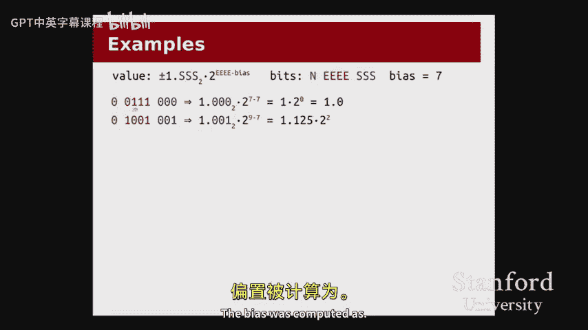
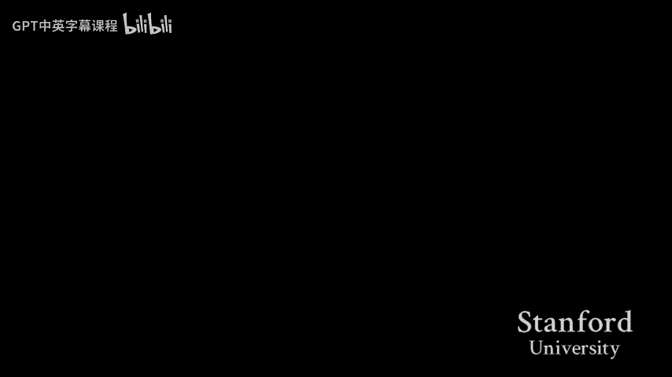

# 【计算机组织与系统 cs107 2016】斯坦福—中英字幕 p07 【Lecture 07】CS107, Computer Organization & Systems -3Om5pkvGLHo- -BV1Nr421c7YB_p7-

Let's get started。い。Welcome back， everyone。To another exciting day here。

 a couple announcements before we get started。First of all， hopefully assignment 2。

 so assignment 2 came in。 this past Wednesday was the hard deadline。 Hopefully that went。 All right。

 We've got， we've got that in the pipeline for grading。 We will not。

Be able to get the graded feedback for assignments to back to you quite in the same heroic time frame that we saw for assignment 1。

 We wanted to make sure that you had。😊，A reasonable amount of time to get your assignment one feedback before turning in assignment two。

 but we'll try to get the feedback to you by early next week。Reasonable amount of time， but not。

Not this kind of heroic Ts pulling all nightder is a kind of timeframe。

And then the other kind of main announcement for today。

 I think now is kind of a good point in the quarter to remind you that every lecture has textbook readings。

We're starting to reach a sort of point with the content where there's a lot of。

Sor of sort of conceptual understanding。 There's a lot of places where maybe there's a lot of math or a lot of of where pictures can make make a big difference。

 It's not just about kind of。The code so much anymore。

 And so I think this is where something like the Bryant and Olleran textbook can really kind of shine and。

Explain some of these some of those ideas。 So do check out the textbook readings if there's anything that is confusing about lectures or labs or whatnot。

 see if that is explained in the textbook because it probably is and probably in a lot more detail than we were able to cover。

So hopefully that kind of is able to clear up a certain number of those。Of those of those issues。

So let's get into it for today。For today， the first thing I want to do。

 So we finished up last time with talking about signed and unsigned integers。 and you spent a。

All of your lab this week working through bits and ints。

There are a couple of things that you may have seen in lab or maybe didn't quite have time to get to that I just want to review here。

 like kind of recap here， and then I want to spend the majority of our time today talking about how we're going to represent。

Real numbers。 How do we represent stuff that isn't an integer。

And we'll see that there are a number of challenges that come with that。

 a couple of different representations we'll be seeing。Right。So let me go over to the code。

 Here's kind of a summary of what we're going to try to get from the code。 I leave it in the slides。

 just so that。You know， if you go back to the slides， you'll have a point of reference。

 hopefully that this is what you should be getting from the code。 but I'll pull it up。

I want to start with the ins。C file here。So。A handful of kind of key points that。

So we ended last time talking about the difference between signed and unsigned。

 And I had this one slide that was just like， hey， there are some differences。

 So I want to actually show you the differences rather than just tell you about them。

 because I think they're a lot clearer in。When we actually look at them in code。

 also because that's where they're going to come up when you start on assignment 4。

 which is going out next week， you'll be working with bits and ints and you may be running into some of these issues。

That's where it's going to matter I'll mostly be walking through the code in GDP。

 but just to give you a sense of what the code looks like at a high level。

 we've got the variable names so for this piece of code are going to tell you what the types are。

 So SCH is assigned care。UCH is an unsigned care。 Let me just drop into GDP and just start walking through it。

So the first thing I want to talk about today is what happens when we start mixing and matching signed and unsigned。

 So this has to do with kind of the last thing that we did last time where we said some stuff about comparisons being different between signed and unsigned。

 I have that example coming up。 But first， I just want to。Stay on something a little bit。

Kind of more。First， the first example I want to show you is just if I have an unsigned。Care。

 and I assign it to a value， like 250。And I， and I copy that value from the unsigned back into the signed care。

What will happen。So now that we've executed this line。I can print out the byte。

 so a car to call one byte8 bits， I can print out the bits for the unsigned care I'll use you saw the examine command in GDPB during lab this week hopefully。

 so I'll use that to examine the Bte at UCH。😡，And we can see that is those are the bits for the number 250。

Youll print out UCH， and you'd see that that so 250 corresponding to those eight bits。Okay。

And if I do this assignment now， so I say SCH equals UCH， what's going to happen？Well。

 as the comments say there。We're going to basically copy those bits into SCH。

 So if I go back up and I examine the bits for SCH。You'll see that it's exactly the same di pattern。

And you might say， sure， O， fine， great， That's cool。 What's the big deal。😊，But。

Whereas with the unsigned case， we were representing， we， we had every bit kind of。

 we didn't have any special bit in the signed case。

 this most significant one is now representing a negative。 So despite assigning the number 250。

To assign number。If we interpret what SCH is， we actually get a negative。

The point that I want to make with this example is that when I do an assignment from unsigned to signed or vice versa。

 there's no conversion。 There's no kind of special cases there to say。

 I think what you're doing is going to cause the value to change or to flip signs or anything like that。

 We're just going to copy bit patterns from one place to another。That all okay。

 any questions about that？嗯。Okay。Okay， now this is something I showed。

 I just sort of mentioned as a one liner of the slide last time was that the right shift operator is a little different。

 This is something that actually came up on piazza a little while ago， I think。

 which is when I talked about。The bit shift operators， I said that when we shift a value right。

 we fill it in。 We fill in the bits。You know， the kind of new， the bits on the left with zeroes。

 So a reminder of what the value of。UCH was。So we have this， if we shift it right by one。😡。

We can see that we filled that slot with a zero。And the zero on the right fell off。来。

And something that maybe you saw a little bit in lab。

 which is that if UCH was previously the number 250。Right。That now it's actually the value 125。

 So right shifting by one is actually equivalent to dividing by two。

 kind of a neat property of the way sort of the binary polynomial works。

 If you think about this in terms of decimal。 If I write a decimal number。

 and I drop off the last digit， that's sort of like dividing by 10。With a little bit of rounding。

So same here， if I right shift by one， I'm dividing by two。 I left shift by one。

 that's a multiply by two。But now let's say I do that for the signed case。

So recall what the value of SCH is。Same bit pattern as it was before for UCH。

 But if I do the right shift by one here。I did not fill it with zeros。

I ended up filling the leftmost slot with a one。What's up with that？

If I follow the rule that I was sort of， if I followed the kind of convention that I was trying to establish here before that。

If that that right shifting by one is like dividing by2。If S， C， H was previously a negative number。

 I would not want right shifting to turn the negative number into a positive number。

 That would be kind of annoying。So instead。😡，We'， keep it negative。By。

The rule here is that if I write shift， so we are able to in fact， get。Division by two。

 with a right shift。And the reason we're able to do that is that and this only applies to the right shift operator。

 everything。 all the other bitwise operators work the same way。

But when I do a right shift operator on a signed number。At least on our system。

The new kind of gaps that are created。Are filled on the left。

 are filled in with copies of the sign bit。 They're not always filled in with ones。

 I should be clear about that。They're filled in。 you fill it in with a one。

 If the number was previously negative， you fill it in with a zero。

 if the number was previously positive， that way we can preserve the s of the number。

So the number was negative before you do a right shift。 It's going stay negative。

 If the number was positive before you do a right shift。 It's going to stay positive。こsは that。Okay。

And then the last thing that I had in this function is something that we already saw。

 but just with a couple different examples， this is asking whether or not I to if I compare assigned。

And an unsigned number that the result may surprise you。 In this case。

 negative one is being treated as a very large。A positive number， not as a negative number。

 because unsigned would dominate the comparison， and therefore we get that negative one is not in fact。

 less than two。So。Just some stuff to watch out for as we this is。 So generally speaking。

 we use a unsigned when we need to work with bits。 And so they can have some kind of and when we actually need that kind of right shifting behavior。

 but。It's maybe not such a great idea to just always throw around unsigned when we think that a number isn't going to be negative because we can run into issues like this where mixing and matching sign and unsigned types is not always the greatest thing。

😡，So。So generally， we're going to be pretty conservative about using unsigned。

 except here where we actually need to work with the bits， then it actually makes sense to do that。有。

Yeahep。我律选。 the division will be preserved。Yeah， so you for the side case，Yeah， so。

 so for the unsigned case， if I shift right by one， that's dividing by 2， if I shift right again。

 that's dividing by 2 again， for the sign case， it will continue to do that。

And that's part of the reason that what's sort of this copying the sign bit is a good idea is that we are able to continue basically dividing by 2 every time I shift right。

 there's obviously some rounding there。 So if I take we actually do this。 So if I take let' see SH。😊。

And I can print out what is SC H right shifted by one。 I hope this。 Who， maybe I shouldn't do this。

 Maybe I shouldn't just make up a thing。 Oh good it worked。 Okay。

 that we see that it's sort of divided by two except that， you know， there's an issue with rounding。

 Like do you want one or do you want two， You're gonna to get 1。

5 so but it will mostly keep div by two every time I。😊。

What if you said a signed in to an unsigned in that's out of？

What if you set a signed int to an unsigned int that's out of range？

 So do you mean the case with the 250 up here like so here I think that's what I was doing up here and correct me if I'm not answering your question。

 which is that up here I had an unsigned care， which same thing right int care。

 this is just one byte that is 250， which is outside of the range of a signed care。

So when I just do the assignment， then what I get back is I just get。Negative 6。

 I get it doesn't stay 2，50。 It looks negative now。Does that make sense？Yeah。

And if I go the other way， if I take a negative number and I stick it in an unsigned。

 then I get a big positive number because it's just going to interpret the bits。 However。

 it's going to interpret the bits。Does comparison with size to which the same as unsigned in？

Size T happens to be。 So the question is， does comparison with size T look the same as work the same as comparison with unsigned int。

 Size T is an alias。 It's it's a synonym for unsigned long。

 So it will work the same way as an unsigned long。 happens to be a long because we're on 64 B machines。

 And so we want some of our sizes might exceed the limit of an int。 But， yes。

 it will work like comparison to an unsigned type because that's what it is。Yeah， good。Yep。

 can you repeat why negative one is？So the question is， why does negative one less than 2 not work。

 The reason is that。Here， let's see， I've got a skip it now。So I've got the signed into negative one。

And I've got the unsigned int  too。And here， I'm comparing。The signed int to the unsigned int。

So in this case， it's not。In this case， we could have represented the two in using assigned signed int。

 right， And that would have worked out。 So if I had made U I assigned int， which had the value to。

 then the comparison would have worked。 However， in C。

 if I'm comparing a signed in an unsigned of the same type。The unsigned comparison will dominate。

も白ろう。Yeah， no matter what the numbers are， because it doesn't。

 It can't look at the numbers directly and say， oh， well。

 I guess I could have represented the number two using a signed in。 And maybe that's what you wanted。

 It's not that smart。 It just says signed versus unsigned。 Okay， I'm converting a both to unsigned。

 and you're gonna get that comparison。So mostly just a caveat to watch out for as much as。

 more than it is like， hey， here's a great reason for why we do this。Because there's a really one。

 anything else？Okay。So。The next kind of piece that I want to mention。

 this is something that you actually pretty much saw in lab。 So I'm not going to go。

 I'm going go over it a little more quickly， but essentially that we can generalize so everything I did in lecture up until now was in terms of cares except for that one weird example。

 that everything was in terms of these8 bit1 byte values， we can generalize that。

We can generalize to。Shorts and ints and longs。 the same idea with twos complement and the binary polynomial and everything we learned last time continue to apply here。

 So just as an example， here is the number circle。 Again。 hopefully recall this from last time。

 But now I'm doing it for。😊，Int， which are 32 Bs， so I can't write all the bits out anymore。

 and I just use lots of dots。But the same idea continues to apply。 this would be for s int。

 Ne one is still to the left of 0 and1 and 2 or still to the right of 0。 And then down here。

 we've got the， the biggest sort of positive number。 And then the biggest magnitude negative number。

 I'm also showing here， you know， the constants int max and int min。😊。

Which are because we really don't want to remember what。These numbers are。

 that's not that interesting exactly what the values are。

 so if you had to know that an int can represent roughly 2 billion numbers that's probably pretty useful。

 just as a thing you'd want to know because if you go past 2 billion you're going to overflow。Right。

But to know that the value is exactly 2147483647， not nearly as interesting。开。So I've got more code。

 but this is basically going to be from what we saw in。In lab。

 the idea is that if I mix and match variables of different sizes that the。That when I。

 if I trunccate， we're just gonna copy the， we're just gonna copy the bits。

Maybe I'll show one example of this， which is。I go next。嗯。So truncation here I've kind of。

I kind of walked through it。Here， I'll just。I'll just do it so here I've got a short。

Writing in Hex for a convenience。 And if I examine， if I look at the hex。

 So I've taken this short and I've assigned it to CAs。

And the point that I want to make here is that if I look at them。That all I've done is copy the bits。

So I've copied the last two hex digits。 so remember that two hex digits represents a whole byte。

So I've copied the least significant byte over。This does mean that the signed that。

 despite our original number being positive。Our new care is now negative。So the sign can flip。

And then。Maybe the more interesting example is if I take。 So we， So basically， okay， I'll just。

 I'll summarize this。 It's the same as we saw with the。The shift operator shifting right。

 which is if I take a number like a short and I assign it to a bigger number。

 like an int or a bigger type， like an int。The question is， what do I fill with right？

 So before I had two bys， my short had two bys， and now I go up to four bys。

 What do I fill those extra two bys with？ Well， the answer is going to be that with an unsigned。😡。

I'll fill with zeroes。 But with assigned signed， I will fill with a if the source type。

 if I assigned from an unsigned。Short。To an int。Then I'll fill with zeros。Oh。

So I filled out with zeros in this case。But if I assign a signed type to an int。

 then I'll fill it with copies of a signed bit。 So this is the same thing that we saw。 Oh。

 I didn't put this code in the。One of seven directories， sorry。But you see that we fill again。

 with copies of the sign bit。Which is consistent with the intention to preserve。The value。

 the intention is that we want to keep if it， if the number was negative。

 if I put it into a bigger type。I probably want to keep it negative。 Now， you might say， well。

 what if I put it into an unsigned type， Well， it doesn't matter。 C had to pick something。

 And in this case。If the source was。Negative and signed。 then well copy the sign bit into the。

Into this part。O啊。So here。Any。Issues about that。I realize that last piece was a little quick。

 I will put the code example in the directory。 You also have an example from lab and you'll be seeing this kind of throughout so but I don't want to dwell on int too long Is there anything any kind of。

😊，Last things on ins before we move on。Okay。All right， I want to spend the most。

 most of our time today talking about real numbers。 This is gonna be a bit of an involved discussion。

 mostly in， mostly on the slides。 And then I'll have。

 I want to save some time at the end for a nice code example for how the heck we actually use any of this stuff。

 but。😊，So yeah， let's just get into that。Okay， so I want to generalize。

 So we had this really cool idea， just a reminder of sort of how we got to the in representation last time。

 we had this cool idea about place value。 And we ended up talking about this binary polynomial。

 We said， hey， you know， if I have。😊，If I have a decimal number， like 567， then I've got， you know。

 a one's place， a1s place and a hundreds place。 I can rank those as powers of 10。

But then we might realize that， well， hey， if I have decimals。Like a 0。89 here。

 I can continue the place value trend。Pass the decimal point。

 And I can say that the8 is in the 10th place。 And I can say that the 9 is in the hundredth place。

And I could represent those， know，1 over 10 or one over 100 as negative powers of two。行。

So we can do the same thing。For binary。 So here I have kind of the a part of the sort of binary polynomial again。

 where I'm using。The powers of2 from3 down to 0。 I've written out what those values are。

 So2 to the third is 8，2 to the second is 4 to the first is 2， and 2 to0 is 1。

 So we can see that this this bit pattern， right，0，1，0，1， is representing 4 plus 1， which is 5。Yeah。

And now I could say， hey， well， I want to represent some fractions。

 so I'm going to stick a point here， this is not a decimal point now it's kind of a binary point。

 but same idea。😡，And now off on this side， I can have negative powers of two， one， half， one fourth。

 one/8th and 1/16th， corresponding negative powers of two。Right。

 and if I have a one in this position and a one in this position。

Then I can say that this one represents one half。This one represents one fourth。

And so now our total number。Is。4 plus one plus a half plus a fourth， which is 5 and 3 quarters or 5。

75。Quions about this？So we're just going to generalize。The polynomial to。Negative powers of two。

And that leads us in to a。Sort of a first attempt at representing real numbers。

 This one is called fixed point。And so we could do something like this。 We could say， well。

 I've got 8 B。 So I'm only going to do this for 1 by numbers。 I've got 8 B。

 and I'm not going to worry about negatives。So I could use four bits for the whole part。😡。

Of the number， and I could use four for the fractional part。

And just like we saw on the previous slide。I could represent a number from。

So the whole part with four bits， I can represent numbers from 0 to 15。😡。

And then with the fractional part， I could represent。1，16th intervals。

 I can go all the way down to 1，16th， right， so I can。You know， represent any。Fraction of 16。

And so here the number line。 you know， here's how kind of what the number line would look like。

 I've got 0 out here not worrying about negatives。 And then I've got these kind of evenly spaced。

You know， I've got numbers faced evenly along my number line at one 16th intervals until I get out to 15 and 1516。

 let me go through one more example of how we could convert。You know how we could do a fixed point。

 so here， you know， I've got this bit pattern。0，0，1，0 point1，0，0，0。 Now。

 I should say I'm writing in the binary point for our own kind of convenience， but I could take。

 you know， I could take these bits and just put them into a bitete。 There's no point。

 and then just kind of know that the first four， the most significant four。

 You think about your upper and lower upper and lower end from from lab， right， like your upper。😊。

4 would be the whole number part and your lower four would be fractional part。

So we can see that this。This bit pattern represents 2。

5 right because I've got a one on in the two position and I've got a one on in the one half position。

啊。And so just as kind of a proof of concept。This system is actually pretty convenient for doing a lot of math。

So if I just want to do addition， for example， this is actually pretty nice。

Here I kind of just walk through the addition。But you know so here I've got the 5。

75 and I've got the 2。5 and recall from grade school adding up decimals。

Do the 7 plus5 and get I do the carry across the decimal point。Here we've got。

 we're going to do it with the binary。Yeah。So lots more carrying I can still carry across the binary point。

And then we can convert the value back。So now I've got this answer， I've got this answer， 100，0。01。

To realize that this one represents the。The8。Or two to the third。

 And this one over here represents one fourth。 And so sure enough， I get8 and a quarter。啊。that。

 any issues about this。We' moving a little quickly through this。Yeah， so I just。

 I throw a point in and then kind of everything else looks the same。Yeah， so generally。

 is the point always placed halfway。 Yeah Yeah， you're asking a good question。 So's the question is。

 is the point going to be placed halfway， And we're going to realize that we， well。

 I picked that arbitrarily at this point， right。And that's going to lead into what some of the problems are。

 So I guess the answer to your question is， generally， nobody uses this。 And the reason。

 and we'll see why that is if， but this is actually used in some particular applications in which case you just kind of have to pick where you're gonna to put the point。

 You just have to say， here's the limit of， here's the range of whole numbers that I'm willing to represent。

 And here's the range of fractional parts that I'm willing to represent。

But we will see that there are some pretty big downsides to using this representation。But for now。

 I just want to warm you up to the idea of representing fractions in this kind of。

Direct translation or direct generalization of what we've seen so far with ins。

 I can use negative powers of two， represent 1， half，1， fourths， 1， A，1，16th。As we as we have。So。

Anything about that part that's kind of。Unclear。Okay。Okay， so we've got this representation。

And so now that we have a representation， I think it's easier to discuss kind of what the limitations are Before I gave you a representation。

 I could have said， oh， well， here， let me just jump right into showing you what we actually do。

 But the problem is that then if I say， oh， well， we're trying to solve this problem， you're like。

 I'll see a problem， so。So now that we have our representation。

 we can maybe discuss a little bit about what kind of。Some of the problems may， may be。

There are actually a couple of problems that are going to be fundamental to just representing any real number system。

So kind of big picture here， right， So kind of back up a little。 We are trying to represent。

An infinite number line in a finite space。 This was true of integers， too， right。

 We could have arbitrarily many， you know， we had infinitely many integers。

 We were trying to pack them into us like4 bys or however many bytes。

But the real number of case is a little harder than that， because now not only do we have。

 does the number get infinitely large。Which is something that we just kind of got over like， oh。

 for it， Oh， well， we're just gonna stop at some point。 We're just gonna not。

Allow you to go over 2 billion or something。But now， between any two real numbers， any two。

 distinct real numbers。There are actually， infinitely many。Real numbers between them。As well。

 So between one and 2， there are infinitely many。Real numbers between。Point5 and 。4。

 there are infinitely many real numbers。And so now， we've got this。

And so we've really got this very limited number space。

And we have to start thinking very carefully about how。

so theres just going to be tons of numbers that we can't represent。And。

And we want to start thinking about what exactly those numbers are。

 What exactly is it that I can or can't represent。So here's an example from decimal。The number one。

 third。Cannot be represented exactly as a decimal。Right， I could， if I， finitely anyway。

 if I start writing 0。33333， at some point， I want to stop writing。 when run out of paper。

 my hands's gonna get tired and I be like， well， that's it。 It's an approximation。

 That's the closest I'm gonna to get。So there are going to be some numbers like one third that just cannot be represented。

 no matter how。How much I try。 I cannot。 like no finite representation will support representing one third in in decimal。

 at least。What is maybe a little surprising is that。

The same numbers that can be exactly represented in decimal aren't always exactly representable in binary。

So here I have the number 04，41s， nice， compact decimal representation。You know， I write 0。4。

 and that's an exact number。Turns out you can't represent that exactly using negative powers of  two。

 I can keep trying to cut out powers of 2。 I can say， well， point4， you know， okay。

 let's take out a fourth。 And then I'm left with that and let's take out an eighth。

 and I'm left with that and let's take out a 64th， and I'm left with that。

 And I'm just gonna end up keep。 I'm just gonna keep going。 There is。

 I'll end up repeating at some point。But there is no terminating binary representation of the number 0。

4。And no matter what system we come up with， we will eventually come up with a better system for other reasons。

 but we will not be able to solve this problem。 We will never be able to exactly represent 0。

4 using a binary representation。 It is just not going to happen。Yep。In very。はそな。So the question is。

 does that mean something like pi could be represented。 The answer is going to be no。

 The reason is it's irrational。 And like so， the reason that so the things that are going to be exactly representable by our system are are。

Combinations of powers of two， right？ So we've been doing， you know， one， half， one， fourth，1。

 eighth。 If you think about the decimal system， we had 1，10th of 1，100s，1，100th， right。So， I mean。

 I guess if you had a base of pi， but I don't know what that would look like then sort of。

 but because pi is irrational， like there's no， the whole point is that there was no fractional representation of that value。

 So no， like no meaningful base gonna represent it。 but that's that's a good， it's a good question。

 So there are some numbers like the irrational numbers。

 pi E you can think of some fun fun irrational numbers that aren't representable exactly using any sort of fractional representation。

And then。人 then there are these。一。Like how do navigation systems or things that require accurate？

that， so the question is， like， how do things that really need accuracy， right？ Like， I can't like。

Yeah， how do， how do systems that require accuracy overcome this。

 That's pretty much the entire discussion of like all of this。

 the rest of the lecture and all of next week lab and most of the assignment is。The reality is。

 we're not going get precise mathematical accuracy If you're a mathematician and you're like， oh。

 well， I want to exactly represent four tents。 Maybe the best you can do is a fraction， but like。

You know， we're not going to get。True mathematical accuracy。

 as it turns out for something like a GPS system or something like even if you think about systems that are going into space are doing。

 you know， kind of all variety of things that you think need to be super， super accurate。

 there is a limit to how accurate they have to be， right， If I'm estimating the distance between。

 you know， stars and stuff。 If I miss by a mile and probably fine。Right。

 so there is going be some limit to the accuracy that you require。

 And it is very important that you understand what that limit is。 Oh， I， you know。

 I'm okay as long as I can get kind of within。1， you know， nanometer。

 everything' is gonna be al right。 then okay。We can go on with that。嗯。没有。Okay。

So these are limitations of the action just kind of any real number system that we come up with where I represent。

 you know， as a finite sort of。Deimal or finite kind of fraction or representation。

But there are actually a couple of limitations of the system。

 of the fixed point system I just talked to you about where I've got the four。

 the four whole number bits and the four fractional bits。

The limitation is that the range feels super narrow， right， It's like， what。

 I can't represent numbers bigger than 15。 How am I supposed to use this thing。And so it's like。

The thing is， all right， I've got。2 to the 8 B patterns， right， If I have 1 by。

 I'm allowed 256 B patterns。 That's not that many。So I probably want to be really。

 really careful about how I'm assigning one bit pattern， like how I'm allocating those bit patterns。

 Do I really need a bit pattern for this number， Do I really need one for this number。

 Because if the answer is no， then I should probably take that bit pattern and assign it to some other number that could make more use of it。

So， let's think。You know， the system， the fixed point system is able to represent a number like。15。

9375， which is 1516。 But do I really care？About that extra 1，16th is 15。9375。

 Really that interesting as of a difference compared to 15。875。

That I really want to reserve a whole bit pattern out of my 256 possible。

Patterns just to represent that difference of 116th。And， you know。

 what about 1316s and 126s and 1116s， Once I'm getting out kind of out around here。

 maybe I don't care that much about distinguishing between。Every one，16th。

 maybe what I really want to do is just represent more numbers。

 Maybe I want to represent 16 and 17 and 18。Instead。哎。Well。

 it turns out we have a system for that in decimal。 So this is going motivate。 Okay。

 so that is the fixed number， fixed point representation。 It is used in some cases。

 but we're actually going to see something。Kind of completely different。For。

How we're actually going to represent real numbers。And the motivation for that。

Comes from something that we actually have in decimal。

So here are a variety of numbers that I might want to represent。

And you'll notice they all have something kind of in common。

 which is that they all have this like sort of the value of these numbers is all 3。

5 or 35 of something。Scaed to various magnitudes。And if you recall from your natural sciences。

 you may recall learning about significant figures。

 And you'd realize that all five of these numbers have the same number of significant figures。

 They have two。The three and the five。But they're at different， different magnitudes。

 And so here's what I mean when I'm talking about， you know， do I really care about representing。

All the， all the different sort of granularities。 If I'm at， what is this number，33。5 trillion。

 I think it is， yeah。If I'm at like 3。5 trillion， do I really care about being able to represent 3。

5 trillion plus。00001。Probably not。What's a lot more interesting to me is。You know， if I go from 3。

5 trillion to 3。6 trillion， what's more interesting to me is or， or even， you know，3。

51 trillion representing。Different numbers， kind of closer to this。

Closer to in magnitude to this number。So we have a solution for this in decimal。

And that solution is scientific notation。So here is the scientific notation for each of these numbers。

3。5 times 10 to the something。And what's kind of neat about。That you。

 you might notice about the scientific notation， is that。

I'm not really defining what space means here， but roughly speaking。

 all five of these numbers take up the same amount of space。Right， they are like 3。

5 times 10 to the something for some relatively small exponent。Between negative9 and positive 12。

And this just feels so much more efficient than writing out all the zeros in this case or in this case。

 And it feels like it's kind of getting us a lot closer to the kind of numbers we want to represent。

 we could represent a really， really large number in the same space by just taking this exponent and using the same number of digits。

 Just if I change that 12 to a 90。😊，Now， I have a much larger magnitude number。

 If I change this negative 9 to a negative 50。 Now I have a much smaller number。

 much a number that's a lot closer to 0。And given the kind of applications that we might want to use real numbers for。

 you know， think in terms of the sciences or in terms of graphics， kind of any。

 any case where I would probably care about。Real numbers。

 I probably have some general sense of the magnitude of the numbers。

 And then what I really care about is。Representing kind of the significant figures within that magnitude。

So the insight from scientific notation， which is something that we're going to carry into the。

 into the float space or into into the the binary space。 And I let the word float slip。

 But you've already seen floats。 So is that scientific notation is able to split our number。

Into two pieces， instead of writing， instead of using all these zeros to represent the magnitude。

 I'm just going to represent the magnitude of the number separately。I've got two distinct pieces。

 one is kind of the exponent， the power of 10 that I'm looking at。😡。

And then the other piece is the actual significant figures， the actual kind of value。

That I'm interested in representing。 And by splitting them up， I'm able to represent this nice。

 wide range。打得开。So here's what we actually do。 now I should say。Like I kind of alluded to earlier。

 fixedpoint is used in certain situations where you happen to know a very specific range of numbers that you might want to represent in the operating systems classes actually where where I first thought it was which is that it turns out in that case。

 using this sort of scientific notations actually a little more complicated。

 You'll see that it is more complicated。 So in some cases， yeah。

 fixedpoint was the right thing to do。 additions really easy。

 binary polynomial know pretty straightforward to convert from sort of deim multi binary and things like that。

 So there are reasons to want to use fixed point。 But they're pretty specific。

 They're pretty customized。 if we want to design the designers of C and the designers of computer hardware wanted to make a system that worked for everyone。

 wanted a system that would allow for the you know。

 the astrophysicists to represent distances in between galaxies wanted to allow a system that could represent。

The sortrt of， you know， a chemist to do kind of these， you know， minute。

 these really tiny sort of masses of particles and atoms and stuff。

 And so for that more general system。Scientific notation， all these ideas are， are the way to go。

The system is called floating point。 So that's where the word float comes from。

Here's just a kind of quick intro into， into float。

 I will talk more about this different C floating point types later。 But if I have a 32 B number。

Then I would split it into a sign bit。 a few bits。 in this case，8 for an exponent。

 and then a few bits for the significant figures。 That's also called the significant hand。

Which probably the word I'll be using a lot， you'll also hear Manisa。

But they all kind of mean the same thing。And so you know the exponent' is going to represent the power of two that we're looking at。

 so here's kind of the rough equation for what you know the sort of the conversion of a floating point number two decimal instead of using a power of 10 since we're in a binary system。

 oops yeah， since we're in a binary system，😡，The exponent is going to be a power of two。

 The significant end is represented over here。 Now， you might recall from scientific notation that。

In order to write a number in scientific notation， you needed the number before the decimal point to be between 1 and 9。

In decimal。Well， now we're in binary， we don't get two through9。

 so the number in front of the binary point is always going to be a one。

And so this gives us just a quick sense of what the numbers look like for what we're able to do。

This gives us a range from negative 2 to the 126 to positive2 to the 127。😡，That's a huge range。If we。

 convert that to decimal， we're talking about 10 to the negative 38。 So that's 0。

380s and a1 or 370s and a1 all the way out to one followed by 38 zeros。

An amazing range that we can represent in 32 B。Now， at this point， you might say， wait， hang on。

 H on， hang on。I know 32 B representations。 That was the same number of bits we had for ints。

 And for ins， I could only represent numbers from 0 to about 2 billion。

So how come you can say that we can represent numbers from this small up to this large that。

 you know， you can't create bit patterns out of thin air， right， We only had four Bs。

 You only have this many bit patterns。And what you'll start to realize is that the kind of。

Sort of what， we're actually giving up。A lot of different values。 There are actually going to be。

 And we'll come back to this next week。 There are going to be some ints that we just can't represent using this float。

So。What the number line four float looks kind of more like this。

Recall from the fixed point number line where we had the tick marks spaced evenly apart。

What we actually get is something that looks more kind of like。Concentrated near 0。 So we've got。

 So down whenever I， when I have a number really close to 0。I'm able to represent more。

I essentially have more bit patterns to represent kind of the fractions around zero。😡。

But then when I get out to this 10 to the 38， we'll start to see that out there。

We're skipping lots and lots of numbers。Lots of hole numbers。 Now， don't even worry about fractions。

 We're just skipping。Sizable chunks of whole numbers in order to get this representation to work。

 but we figured that that's kind of okay because sort of the analogy is， well。

 if Bill Gates earns an extra dollar， probably not going to make a big difference to his net worth。😡。

Once you're out kind of in these huge numbers in10 to the 15， 10 to the 20。

 every little change of 1 or 0。1 is not that interesting。

And so we'll just choose not to represent them。It's okay。O。So。Allright， now I could。

Do the rest of this lecture in terms of the 32 B float， But that's not。

 that would not be good because I don't want to write out 32 B every freaking time。

 I want to do any interesting float comparison conversions。

 So what I'm gonna do is I'm going introduce。 And this is consistent with the textbook。

 So don't worry that this is， this isn't totally coming out of thin air。 that your textbook has。

 has this as well， which is that。Im want to introduce something I'm going to call a mini float。

 This is not a real type in C。 Do not try to declare a mini float。 It will not exist。But。

It's just going to be a simpler type。 It's an 8 bit type that will allow us to represent。

 that will allow us to just kind of get get some examples of how these floating point numbers work。

 The mini float is going to have one sign bit， just like the。The regular float。

 because you don't really need more than one。 It's gonna have four exponent bits。

 It's gonna have three significant bits。Okay， so still kind of looks like that。But fewer bits down。

All right。So let me tell you how each of these parts of the mini float actually works。😡。

The signed bit。Is very simple。 In fact， it's way simpler than science。All the sign does is， okay。

 if the sine bit is one， it's a negative。 If the sine bit is 0， it's a positive or I guess it's or 0。

And。The sign flips independently of。The other bits of the number we're not using tos complement。

 If you remember the， our brief discussion of sign and magnitude last time where we said， okay。

 we've got the rest of the bits to represent， you know， our number。 and then we've got the sign。

 you know， on or off for positive negative。 That's what we're doing。Now。

 you might remember from last time that we said signine and magnitude had this kind of annoying thing where it had a double 0。

 You could represent a negative0 by having the sign bit on and then the rest being 0。 Yeah。

 that's gonna come up again。 Well， we have a negative， We have a negative 0。It。

 it's the cost of doing business here， right， We just。

 this representation turns out is's just gonna be easier。 So we just have to。

 the hardware just has to deal with the negative 0。ok。Now， the exponent。

We want to be able to represent。Kind of a variety of negative and positive exponents。

 So I could make the exponent go from 0 to 15。 I remember I have 4 bits for the exponent。So4 bits。

 I could go from 0 to 15， but that means I can't represent many fractions。

 I can't represent kind of these smaller， these smaller exponent numbers。

 So I'm gonna have it go from kind of。Negative x to positive x。 So we'll kind of split it halfway。

But so here's， here's a number circle。 It's the same number circle that we。

 we knew from from twos from two's complement， but with four bits。

 But I want to show you kind of the the way we're going end up representing this exponent is a little wacky。

So you might think， oh， okay， I could just put zero here， put negative one here。

 put positive one here， and just kind of do the normal thing， that's not what we do。😡。

I won't explain why there is a really compelling reason for it， but it's hard to get into。

 but I will tell you what we do do， which is。First， we reserve the exponent。All zeros and all ones。

 We'll just cut those out and say， we're not going to use them right now。

 We're going to use them for something else。So for now， don't worry about either of these two。

And then what we want to actually do is we want to put the negative。

 the sort of the smallest exponent around here。😡，And we want to put the largest expplanator over here。

So this is called a biased exponent。 And here's how we actually fill in the number circle。So0。

 an exponent of 0 shows up actually down here at 0，1，1，1 at where our maximum positive。Int was。

Then if I keep going clockwise， I get one，2 and all the way up to positive7。

 if I go counterclockwise， I go through the negative exponents。Down to negative 6。 there's。

 there's a little bit of asymmetry。 I can't quite get to negative 7 because I had to reserve。

 you know， there's， there's， there's an asymmetry from， from the 0， fine。That's what we have。Okay。

 so we've got the  zero down here， and then positive。Going around clockwise， just like before。

 going counterclockwise， just like before goes negative。

 But we're just picking a different place for 0。Yeah。

So I can give you a formula for how to figure out。 So the way this is going work。诶。Let me actually。

Do this。 So the way this is going to work is， so this is called the bias。 So if you think about。

 So if I take。This bit pattern， right， It represents the number。 The integer 7，0，1，1。

1 represents the integer 7。And if we want to actually figure out what the real exponent of the。

Of our float is going to be。Then I take the bit pattern。And I subtract a certain number。

And then the number that I subtract is called the bias。And in this case。

 we can kind of see that I subtract 7。Right so I start at 0，1，1，1。 And if I subtract 7， I get to 0。

 which is what this expplanent represents。 If I start at 1，0，0，0， and I subtract 7。

That I end up with。1， so 1，0，0，0 is 8。 subtract 7。 I get 1。 And that's what the bias。

So the bias of a mini float is 7。And that's how you calculate it。

 It's in terms of the number of bits in the exponent。行。We'll get lots of practice with this。

 I know I'm going through each of these parts somewhat kind of quickly。

 And I know there's a lot of little pieces。 I kind of just need to make sure we know what the pieces are before I can give sort of good examples of them。

嗯。So then now the last part， So we've got this exponent。 It has this weird bias thing。

 But roughly speaking， it represents， you know，2 to the negative 6 up to 2 to the positive 7。 Yeah。

 okay。And then I've got the significant， which， as we said before， was always one point something。

Because。In scientific notation， if I'm in binary， I don't want a0 out in front before the binary point。

 just like in scientific notation， didn't want the0 out in front with decimal。

 So the sort of sig figs are always going to be one point。Some number。

And it turns out we can just choose not to represent the， We can write not to write down the one。

 Okay， so here is the formula to， to know。 Here's the one that you want to know。

 and the one that we're gonna keep using over and over again。Which is， if I have the number。

Positive or negative one point something。 Now， I've written this little two here。

 this little subscript 2 to indicate that this one point something is in binary。

So think of each of these Ss as a0 or a1。So if I've got the number。In binary scientific notation。

1 point something times 2 to the。Something。嗯。So I would want？So times， you know。

 so tu to to something then。This is how the bits get mapped。

So the colors and the letters should kind of correspond where we've got the sign bit in front。

 and then we've got the exponent。But after the bias was added back in。Up here。

And then we've got the significant end。 But notice we're not writing the one into the bits。

 So we're going to write down。These three bits。But we're not going to write down to one point because it's always one thing。

这他。他做。Okay， so let me give you an example。Let me give you an example because I realize I just kind of threw a whole bunch of facts at you。

 this is the formula that you want to know， I'll keep it on the top of the slide for pretty much the rest of the lecture。

😡，So let's just walk through a couple examples and see if we can kind of get a hang of this。😡，First。

 I want to take this bit pattern， and I want to convert it。Two， it sort of its decimal value。😡。

So how are we going to do that， Okay， so we've got。0，1，1，1， and then。It是 okay。So I will。

 I basically want to take these bits right based on the color and based on kind of their position。

 And I want to map them into this formula。So I can kind of do that just basically exactly following the color。

😡，I get 1。000。That's in binary times 2 to the。I interpret this。

 these exponent bits as an unsigned int。 We will not treat this bit as a signed bit。

 We are not doing that。 This is just an unsigned int。😡，So I read0，1，1，1 as7。

And so I fill in this formula， I didn't write the positive sign because it's positive。Which is 1。

0 or 1。000 times 2 to the。7 minus the bias。And if I work that out， that's  one times 2 to the 0。

 And this bit pattern。Is the mini float for 1。0。The two here right is indicating that I want to remind myself that this number is being represented in binary。

And we'll see that we don't see why that matters yet。😡，Because 1。0 is 1。0。

 no matter what base you're in。 But when I get to the next example， you'll see why that matters。

That kind of makes sense， anything else？Now would be a great time for a question。

 because I just kind of info dump't。对。Okay。Shouldll just work out another example then。All right。

 let's just do another example and then we'll have some time too。To kind of fill in。 Okay。

 so here's another example。 I'm representing0。 And then my exponent is。So I'm。

 I'm kind of just gonna do the binary to the like the int binary to decimal conversions sort of。

In my head， based on the fact that these are only four bits。 and maybe you have a hex chart。

 maybe you have something else。 But so this is the exponent here is 9 or sort of the biased exponent is 9。

 And then I have 0，0，1。 So how do we convert that to a decimal value well。Fill it in with the table。

 So here is why the， the base 2 matters that So I'm writing 1。001。But that's in binary。

 Do not think of this as one and one over 1000。This is in binary。Go back to that in a second。Times 2。

To the。So these four bits represent the number nine。-7。

So we can see that this is going to be2 to the two， right，9 -7 is 2。And then here， what is 1。001。

 Well， here we can kind of use what we learn from the binary polynomial。

The first bit here represents a half。The next bit here represents a fourth。

And this bit represents an eighth。So what we actually have here is。1 and one8。

 I've written it in in decimal， but you could write this as one and one8。Times  two to the two。

And if you work out what that is， then you get the value 4。5。Question。For the step where you have 1。

001 in base two。If you just move the just one。204。So you're saying move the decimal plate or you're saying like here。

 for example。Yeah， so you could do 100。1 and then， and then times 2 to the 0。

 and then just convert the 100 and convert the 。1。 Yes， you could do that， too。

There are many ways to convert floats。And， and that is absolutely a valid way to do it in this sort of small example that makes sense。

 I think if you start getting really， really big， if I had like 23 B after the decimal。

 maybe that's a little harder So， but， but in this case， you're absolutely right， you could do that。

 That's maybe how I would have done it。 if I were just sort of， if you just said， hey。

 go give me a float。 you know， give me the decimal。 Its probably I probably would have done that。

Anything else？ Yep， How do you represent a true。How do you represent zero， That's a great question。

 Let' get back to that。😊，10 minutes。Yeah， so can you explain what the bias is and why it determines the value。

 Yeah， so the the idea behind the bias。 So here you can see kind of in the formula。

 the way the bias is impacting it is if I take the four bits of the exponent， right。

 and I write them here。Right？m， I'm treating those four bits as an unsigned int。

And the bias is allowing me to get to。Negative powers of two and positive powers of two。So。

In this case， the four Bs were an unsigned int。Representing the four bits。

 the four red bits here are an unsigned in representing the number 9。嗯。

And what that allows me to do is it allows me to represent。But what's actually going to come out。

 what the value is actually going to be is two to the two。So there's kind of this。

And so like I said yeah， so that's how we kind of convert it is when you read these bits out of the binary。

Youve got， you have to， you read them as an unsigned it。

 and you subtract the bias to get the true exponent。Sort of out here。は。は。对二。真唔系岁。

Why isn't just a and used to represent so the question is why isn't a sign used to represent used in the exponent？

I want to give you a one sentence answer and then encourage you to look in the textbook because it's a little messy。

 which is that the problem is， if I used a signed int， then all the negative numbers kind of look。

Then all the negative numbers have kind of like a leading one。 And so in some ways。

 it kind of looks if， if I just compared the bits， it would look greater。

Then if there were a leading zero and we can actually do。

 and by using this kind of biased representation， we can represent。 we can。

 we can get a really nice sort of。We can get a nice set of bit patterns， basically。

 where comparison ends up being coming easier， but I can't really explain why that is unless I showed you the comparison。

 which I can't。But yeah， it turns out this makes some of the hardware easier。

 and it ends up resulting in a really clever， interesting property。Yeah。

So how do we compute the bias The bias was computed as。

This might take a little while to go back。

One second， okay， the bias was computed as two to the number of bits in the exponent， minus1。-1。

So roughly speaking， if you just had like just， you know， in your head， roughly what is the bias。

 it's basically halfway。Between all zeros and all ones， right， So all zero exponent， you know， if I。

 if I look at the all zeros as 0， and I think of4，1s， like 1，1，1，1 as the number 15。

 then the bias is basically halfway between the two。So here's the official formula for that。😡。

I'll show you the biases for some of the other float types later。Are all decimal types？

Assignment no unsigned float， there is no unsigned float， that is correct。

嗯。Okay， let me walk through。Let me walk through an example of going the other way。Where okay。

 so here I've got the number negative 5 point0 doing a negative for， for the heck of it。

And we can talk about how do we represent now， how do we go to the actual float bit pattern。

 So we're just going to go the other direction。First， I need to convert it。First。

 I'll convert it to binary。 that seems a little bit easier because I know how to convert its to binary。

So weve got negative 1，0，1， base 2。 I'm using the two here。 Just why myself it's always in binary。

And now I have to put it in scientific notation， right， So I've got to go。

 I've got to get to a position where I have one point， something。

 I've got to fit it into this formula。 And right now。

 it doesn't fit in the formula because I've got too many bits before the， there's no point， right。

 But if there were a point kind of at the end， I've got too many bits。

So I'll move the point from the end here back over。And I've got to get negative 1。

01 times 2 to the two。So from here to here， all I did was I had point I had kind of an imaginary point at the end here。

 and I moved it to spaces over。 This is just like the conversion of decimal numbers to scientific notation。

😡，And now。I know what the significant end is。Right， it's just 0，1。

 And then we'll put a 0 on the right。 because so this one now represents sort of one fourth， right。

And then I've got。 So now I have to add the bias back in。

 So if the exponent is actually two to the two， then。Following the formula。

 what we're gonna get is what the， the bits of the exponent are actually 9。So。

That's how we represent that。Is okay。Why is there always a one at the front again。

 Why is there always a one at the front。 The reason is that we， So in decimal scientific notation。

 right， there was whenever we do any put any number in scientific notation before the decimal point。

 there's always going to be。A digit from 1 to 9。Right， in binary， we don't have2 through 9。

 So all we got is we have to put a bit， a1 bit in front。 If we put a 0 bit in front。

 then it's not normalized， right， then because then if I put a 0 in front， then I would get。

I could potentially write， you know，0。0，0，0，0，00，0，1。

 at which point I should just move the binary point over and get a 1 point something。 So it's。

 that's our way of keeping the significant kind of normalized， keeping it sort of within a range。

 we're gonna keep it in the range from 1 to1 point， however big， like 1。9 or 2。Almost two。

Anything else？Ex explainplain why you need the decimal point to places to left So here from here to here。

 I want to get I always want to get down to one point something。Right， so I've got 1，0，1。

 And then imagine there's a binary point right at the end here， right。

 like because it's a whole number。 So I could just write this as， you know，1，0，1 point。

So I want to move the binary point over two spaces to the left so that I can get 1。01。😡。

And then because I moved it two spaces to the left， I need to multiply that back in。

Why is it that you're able to do that If you said that like we're making a distinction between binary numbers and like decimal So so the idea is that。

 yeah， So the question is we distinguishing between binary numbers and decimal numbers。

 The idea is that this is in binary when I， so this is also in binary。 So it would be problematic。

 if I took this。 And I said， oh， it's 5。 And I'll divide by 10 and get one fifth or something that would not be okay。

 But I'm staying in binary。 So I'm not you can So this dot is not really like a decimal point in the traditional sense。

 It's kind of it's a binary point。 So I can move I can move it around， just like I did。

 just like I do in decimal。 as long as instead of multiplying by a power of 10。

 I multiply by a power of 2。What need to to sub the exponent by the bias。 Sorry。

 what's the point subtracting the bias from the exp。

 The point of subtracting the bias from the exponent here， let me put this example up。

 But essentially， imagine if I want to represent a negative exponent。Then now。

 but I said that the bits inside of the the mini float。

 the exponent bits in the mini float are an unsigned int。 so I can't represent a negative。Exponent。

Right， so what I'll do is I'll use this bias to。Sort of allow me to represent both negative and positive exponents。

 So here I can represent 2 to the negative one。Using the bit pattern for six。😡。

Knowing that I could subtract the bias of 7 and get to a negative exponent。开。And then。

In the first line in the first example。You went from negative 1。01 to negative 1。010。

I was the thing you were able to like Adam don't know？啊。Yeah。

 so you're asking why can I add the binary digit here for the same reason that if I wanted to write。

 let's just say I don't know 1。23， I could write 1。

230000 I can write on the right hand side of my decimal point。

 I can write as many zeros to the right as I'd like。😡。

Just like on the left hand side of my decimbelal point， I can write as many zero as to the left。

So I'm allowed to write a0 to the right。To kind of fill it in。Anything else。Okay。All right。

 quick note here that。So I've got both of these numbers。

 but I just kind of want to point out that this bit， this one bit。

Represents a different value depending on the exponent。 So here is the number from the first example。

 Here is the number from the second example， and。You can kind of see from the original that。

This one actually represents one eighth。Whereas this one actually represents a whole。One。

 and so I guess so my the point that I just want to kind of make here。 and you know。

 we'll see this in lab。 So maybe I'll just kind of go a little bit more。

 but if it's but essentially that。Depending on the X phone in。

These three bits are actually interpreted differently。 So this is very different than fixed point。

 We're not saying that this bit always represents a half， and this bit always represents a fourth。

 It's going to depend on the exponent。是。But， alright， well， here's an exercise that you can look at。

 I'll post the slides and you can try to walk through it， but I'll。I'll move on。So。Okay。

 so let me show you。One issue。 And then I guess we'll have to。 Yeah。

 So let me just show you you show you a couple last issues with this representation。 And here。

 imagine if I'm trying to represent the number 8。5。

So I can convert that to directly to binary 8 converts as 10，00。 And then the 。5 is  one half。

 So that's the。Bit immediately after the binary point。But if I try to do something like this， where。

But if I try to see something like， I try to normalize it。 I try to fit it into this formula。

You'll notice that I run out of space。I only had space to put these three zeros。

 And then this last one didn't fit anymore。 I only had3 bits to write my significant。

So that one gets lost。And what we end up with is we are not able to represent 8。5。Using this system。

We're able to represent 8。0。Which is then what we end up with over here。

 But we're not able to represent 8。5。Because that's。That's a little too precise。

For sort of this exponent so。I'm introducing the idea of an epsilon， which is the sort of。

 we'll notice that the difference， sort of like the difference between 8 and the number。

 the next representable number after 8。Is actually bigger than 。5。 It's actually a whole number。

 And you can see you can work that this out。 that 9 is the next representable number。 And it's not。

 And so， so the， so the gap， right， So we're actually out here where it's sort of interesting， right。

 where before with the the fixed point notation， you know， we always just had gaps of 116th。

Just sort of constant spaced gaps across the entire number line。

 But now we have these kind of variable gaps where close to  one or close to 0。

 I can represent these little fractions like  one half and one fourth。

 We already saw a couple of those。 I could represent 0875。 But then when I get out to 8 or 9 or。

 you know， even bigger。 Now I can't even represent。Poin5。Yeah。When you say that。Sorry， I sorry， I。

 I hand waveve that quickly。 The epsilon of 8 is1。 Yeah。

 which is to say that the distance between 8 and the next number or the epsilon kind of on the right。

 I guess， to the next highest number is one， because that's how much the gap is。你看。All right。

 we'll skip that。Here's the generalization of floating point in C。 I have a code example。

 but I won't。 I won't be able to get to it today。 That's O。 But essentially， so now I was in。

I was in mini floatat。 I had 8 Bs。 Now， I'm in。C floats， actually。

 I have a little bit a little bit more time because I did start playinging。 So I， I have。

 So now we can generalize our floats to 32 B or 64 B。

 We don't have an 8 or a 16 number16 B float type。 Here's the。

 Here are the numbers that you just might want to know。I don't really， you know， like， you'll just。

 you'll get used to these numbers， sort of like the twos complement thing。 you know。

 so that's just gonna be what that is and。And yeah， there there's a code example。Let me see if I can。

呃。Let me see if I can do something quickly with the code example， if I want to。Right。

 let me just do one quick thing with the code example that I think is kind of， is gonna be useful。

 And then I'll pick up。With the rest of it。I just want to show you here this idea that I like the idea that we went back to before of。

Not being able to represent numbers like 02 and 04。😡，I just want to show that in GDP really quick。

 Like what actually happens in code。 So I was doing all the stuff in slides Now。

 just a little bit of stuff in code。 if I represent。 So if I say float F equals 0。2， you know。

 it looks totally legit， right， But if I print out the value of F。

We're not representing point2 exactly。And so in lab， we'll start to talk about some things like， hey。

 well， I can't represent 。2 exactly。 So what do we do。Right， can I ask if this is， equal to 02。

 that starts to get kind of， you know， we start to run into issues。 I could try to represent 0。01。

 and we can't represent that exactly either。And so can to revisit some of these issues？

On Monday and then in lab。

You know， how do we deal with these errors？ And we'll see there are other sources of errors that we're going also need to deal with。

But。We'll leave it at that for now， we'll pick this up again on Monday。

