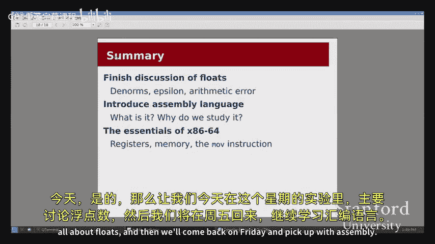

# 【计算机组织与系统 cs107 2016】斯坦福—中英字幕 p08 【Lecture 08】CS107, Computer Organization & Systems -tFSp53J0Fps- -BV1Nr421c7YB_p8-

Of our exciting time here。A couple things before I get started for today。

 just a couple of announcements we are so we're hopefully I suppose right in the middle of assignment three。

 we've got assignment three coming in on Tuesday tomorrow with the usual kind of late policy after that so just a quick kind of timeline for you for the next couple of weeks we have assignment four going out soon after。

And that will be coming in the following Tuesday， so that's Tuesday of week six。And then。

On the horizon is our midterm， which will be on May 6， that's going to be the the Friday of week 6。

 So a quick kind of， yeah， so so the deal with the midterm in terms of coverage。

 we will post a practice exam。At the end of the week。

 and so we'll give you kind of which will give you a sense of what the format for the exam is and all that。

The coverage for the exam will be everything up to and including floats。

 So that includes sort of the first half of this lecture or so， as well as this week's lab and。

Assignments through assignment 4， we'll be starting on assembly today。

 and that material will not be covered on the midterm。

 It is nevertheless discouraged that you zone out once we get past the float stuff because the assembly。

 there's quite a bit of material for assembly that we'll be talking about for the next couple of weeks。

 And certainly right after the midterm， will'll be jumping right in with， with with assembly， so。

Sort of keeping on top of that is going to be the way to go。Okay。And SCPD students。

 you should have received an email from us over the weekend with information about how your exam process is going to go down。

If you have not， make sure you get in touch with us。好。All right。So let's get into it for today。

The first part of today， I want to finish up our discussion of floating point。

And then we'll switch gears entirely and start talking about assembly language。Now。

 last time I spent the entire lecture pretty much going through lots and lots of details about floats。

 And we saw lots of examples and a lot of bit patterns。

 And maybe it was easy to get kind of lost in all the special cases and kind of the issues that came up when representing floats。

 today， there are a couple of details that I still need to make sure we we cover so that you're not mouse make sure we're not kind of lost when you get to lab and the assignment。

 But I want to spend most of our time kind of looking at floats a little bit bigger picture。

 thinking about how as programmers， we can use floats effectively and how to avoid some of the。😊。

Common pitfalls and issues that we've already started seeing， and I'll review those。

That will come up and so how do we work around that？Right。

So just a kind of a recap of what we talked about with floats last time。

We introduced this number system， the floating point number system。

 which where the key insight that we had was that rather than representing a number is as just a single kind of say。

 for example， as a decimal number， we split the number into two pieces。

One piece was kind of the the significant figures part， which we called the significant end。

 that would be this kind of one point such and such piece， which we were representing in binary。

 And then the other piece is the exponent， which was a power of 2。

 just like with scientific notation。 We had a power of 10。And so kind of。At a higher level。

 we can think about the separation here as you can think about this in terms of。

You can think about the exponent in terms of kind of working with different units of measure。

 So imagine if I were trying to measure。Some kind of distance。And I took some。

 took some measurements， and I say， okay， well， the distance I ended up with was 1。5。

 And that's all I told you。 Well you'd probably say， well， what does that mean，1。5， what。

 what unit are you measuring in， Because it kind of matters， right。

 whether I was measuring in nanometers or whether I was measuring in light years。

It's going to make a huge。 It's going to have a huge impact on the the magnitude of my number。

And so we can kind of think of the exponent as encoding the units that we're in this sort of。

 you know， But so this sort of power of two telling us， are we should we interpret the 1。5 as 1。

5 of something really， really small， or should we interpret it as something really large。

And we talked about the idea behind this representation。Is that。

When I'm talking about a really small unit， when I'm talking about， for example， nanometers。

 I want a certain amount of accuracy， and I also want a certain amount of accuracy when I'm talking about light years。

😡，The level of accuracy we might describe in some in kind of relative terms， like， oh。

 I would like my measurements to be 10% accurate。But realizing that， the， but realizing that the。

 that accuracy of， say，10% will actually have a different Ab will be different in absolute terms。

 depending on the units。 So say I was measuring something in nanom。 And I said， okay， I've got。

 you know，1。5 nm。 and I'm allowing kind of 10% accuracy。 So I'm kind of accepting a。Kd of。

 I'm allowed to be off by maybe plus or -01 nm。 and then say that somebody else was measuring something in light years and said。

 okay， well， I want 10% accuracy on light years。 And so I'm willing to be off by plus or。

1 light years。Well， there's a huge difference right， between 01 nanom and 0。1 light years。

And both of these people want that kind of 10% accuracy。😡。

So the idea behind our floating point representation is that when we're representing numbers close to 0。

We kind of need to allocate more of our bit patterns to these small numbers in order to achieve that 10% accuracy at the nanometer scale。

😡，And then when we're kind of outweigh in the light years range。😡，Again， we want the 10% accuracy。

 but in absolute terms。You know there's going to be a much bigger。

 absolute gap between the two numbers， but we'll still be able to get。😡，Our level of。

Sort of relative accuracy。好的。Alright， so， so a couple of details really quickly before I sort of kind of the main。

 the main points。 there was one thing I really kind of promised you， which was。

 how do we represent 0。 That was one thing that that came up。

 So you'll notice with the the formula that I have here for the value of a float。 It's 1。

 x times 2 to the y。 And you'll notice that there's no。

There's no values that you could substitute for X and Y to get 0。I can't say one。

 something times 2 to the something。 I can't get 0 from that equation。So we'll need to actually see。

How we'll need to see a kind of special case that will incidentally allow us to handle zero。

Just to recap on the details of the mini float， which is what I'm going to be focusing on for this。

 recall that the mini floatat was this made up 8 bit type。😡，That does not exist in C。

 It has one sign bit and four exponent bits，3 significant bits。没有。Okay。

 so let's see that special case for how to represent 0。

So here we had said when we first introduced the exponent and we first introduced Min floatat that we were going to reserve。

The all zeros exponent and the all ones exponent。 And we'll start to see what those are being used for now。

 when the exponent bits are all 0。We are in the case which we call denormalize numbers。

And with deormalized numbers， rather than the previous value we had of one point something times2 to the something。

 now we have zero point something， so we drop the leading one。😡，So we get 0 point。

 whatever times 2 to the that happens to be the value， I'll show you why that is correct in a moment。

 but notice with this representation that we can now represent0。

 if I fill in these three bits with 0， then I get 0。0 times doesn't matter， so I get 0。😡。

You'll also notice that with the because I have I'm using a sign bit in this kind of sign and magnitude sort of way that we we saw last time if I。

Set the sine bit to one。 And then I set the significant to zeros。

 Then I actually end up with negative 0。

And so that's。That's just something that is a consequence of this representation。

 given all the other tradeoffs that we're making， having to deal with two zeros is not the worst。

 And so we'll just kind of the the system will just kind of tolerate the negative 0。

 It knows that negative 0 will compare equal to 0 and everything just kind of gets handled correctly。

And now to show you kind of how the D norms fit into the rest of the floating point picture。

 Here's a picture that's largely based on the one from the book。

 And then the number line is also from the， from the book， just showing some of the。

Key points of the along the sort of float mini float。Number  line。We're focusing on positive。

 So you can see all the way up here， the sort of smallest。 So we're not gonna do negative。

 So the smallest number， smallest float we can represent is 0。 And then we can go up。

To the smallest normalized float that we could represent， which is1 over 64 or 8 out of 5， 12。

And then super quick note at the， at the bottom end here。 So the。This。

 the red section where all the exponent bits are one。This section is called the Except values。

 they're used to represent infinity and also Nan， which is not a number。You know， they're。

 they're not。 So they don't represent any like finite values。 So we just kind of。

We just needed a special。 We just needed a place to put the kind of the edge case。 though。

 though what do I do if I can't represent this number if it's。Sort of not a valid number。 You know。

 the square root of a negative number。 What do you get， Well， it's not a number。So that's all we get。

We're reserving that for that。Okay。对。here。没有一条。1 minus。Yes， so then。

 then the exponent becomes one minus bias。 That's correct。And you'll notice that that's， so。

 so that's， that's， that's an interesting kind of issue here。 which is the， the question was。

 if the exponent bits are all 0， then the exponent in the formula becomes one minus the bias。

And you might ask， well， why is that？But you'll notice that if we start at the。Smallest。

 normalized number right here。This 8 out of 5，12 then， and you can。

 you can verify some of these numbers for yourself， if you like。 But you'll notice that the。

The intention of the dennormalized numbers is that we've spaced them equally in increments of  one out of 5。

12 to get ourselves up to 8 out of 512。So if we had made the exponent anything else。

 if we had made it。If we had changed the ex allowed the expplanent to go to negative 7， for example。

 then we wouldn't get this really convenient spacing of。1，5。

12 intervals up to the smallest normalized number。Are there questions about genome norms。Yep。

I understand what's the point of using。So what's the point of using denized numbers？ So for one。

 we do need to represent 0。Right， so the question is， all right。

 do we make a special case for 0 and then nothing else or do we make a special case for 0。

 And then like， so， all right， So we kind of just need a special case for 0 anyway。Right。

 so we're going to make all bits 0 represent 0， because if I use the normalized。Numbers。

 I can't represent zero In normalized numbers， everything is one point something。Right。

 times 2 to the something。 And I can't get0 out of that。Neither two to the something nor 1。

 something will equals 0。So I need a special case to represent zero。

 and I'm going to put that at all zeros。😡，Now。I end up with these other 7 bit patterns， right。

50s and then 0，0，1 up to， you know，50s and then 1，1，1。 I've got those 7 bit patterns。

 How should I lay them out， I don't want to just let them just throw them away。

 That seems like a huge waste。 So I notice that the smallest number that kind of uses our normalized system is 8 out of 5。

12。 Well， it seems only logical to then put these 7 bit patterns equally spaced from 0 up to 8 out of 5。

12。And so starting with the special case of setting aside 0。

 now we're just gonna kind of fill in the other bit patterns to represent。Sur of something。Right。

 and that's kind of maybe the best we can do。Once you get into the D norms， you're。

 you're kind of hitting the lower end of what you're able to represent anyway。 So maybe we don't。

 you know， yeah。QuYep。Be something other than zero。Why are the expplan， what do you mean？

The exponent bits are all zero for deorized nod。Why is that Well， so。

 so why is the exponent thats all  zero for， for D norms？

 So we set aside the all zeros exponent for this special case。

In all the other cases where I had the exponent of not all zeros， then I used the other formula。

 the one point。X times 2 to the y。Right， so if the exp bits end up being anything other than zeros。

 we just use a different formula。 We basically think of d norms as just this big special case。

 when the exp bits are 0， we just have to handle it specially。

 And it gives us all these nice properties。Any else。

So the big thing to take away from this chart is just to try to to see that high level discussion that I was giving earlier about different units and the the sort of the relative accuracy at each unit。

 So you'll notice that when I'm down kind of at this sort of the lower end of。

 of the table where I'm representing。Numbers that are kind of fractions of 5，12。

 You'll notice that neighboring bit patterns are 1，5，12 apart。And。

You'll notice that out here at the kind of extreme end， where with the highest values。

 the neighboring。Floats， mini floats are a whole 16 apart。But notice that。

No matter where I am on the table， I can。I can describe the， the the gap between neighboring floats。

 the， the epsilon， if you will， as。18 times the exponent。 So here again。

 think of exponent as kind of like units down here。 I'm kind of in the what is that。

 like the sort of almost centimeter kind of scale， right， the almost like one in1 in 60。

1 in 64 that out here， I can represent gaps of one8 of a。Think of like almost a centimeter。

 whereas out here， I can represent one eighth of， you know， of a meter or of this exponent。

 of this unit。And so the， the relative error that we're seeing in this chart。

Is always one eighth of the exponent。Whereas although the absolute error。

Is actually going vary quite wildly from1 over 5，12 out to 16。Right。O。

So I won't go into the the details of how to do floating point arithmetic， but just kind of。

 just to give you a sense of how the math kind of works out。

 you can think of doing math with floating point as doing math in scientific notation。 So。

 for example， if I wanted to do multiplication， then I would add the two exponents together。

 because that's the those are the power laws that I learned about in， in high school。

 perhaps and then in addition。Then so you can think about。 So with the addition case。

 we might think about， all right， well， what do we do if I want to add a kilometer to a millimeter。

 How do I add those two， Well， I gotta convert them to the same unit at some point。

 So should I convert to kilometers or should I convert to millime。Well。

 the answer is going to come out to be some kind of kilometer， right， So if I've got 1。

1 km and add a millmeter， the answer is going to be 1。 something kilometers。

 So seems logical to convert them both to kilometers and add them up。

And so that's what that's what's going to happen when we do floating point Edition。

 We'll convert the sort of the smaller if the exponent differer。

 we'll convert to the larger exponent， and we'll add them。Yep。

 is that done withing I that done with bit shifting。 So， how do we do the conversion。

 roughlyough speaking， yes。I yeah。 So you can try to write a floating point adder and see it's gonna kind of suck。

 So the， it's done with hardware。 but the kind of conceptually， yes。

 you can think of shifting all the bits over to kind of line up the。

 the decimal points or the binary points， absolutely。But then if we do this edition。

 So think back to that example。 I got a kilometer， and I added a millimeter。

Is the millimeter going to make a difference to the final answer？😡，Well。

 that depends on how accurate I'm able to represent。My numbers。

 how accurately I can represent these so。I have an example to show you this。Here。

 I've defined a couple of， a couple of values。 I have a trillion， and I have 1000。

 and I'm gonna try to add up。 I'm gonna try to get to the same answer a couple different ways。 First。

 I take a trillion。And I add 1000， and then I subtract the trillion back out。

And then in the other case， I add the trillion， subtract the trillion back out immediately。

 and then add the thousand0。Now。If you're a pure mathematician， you say， hey。

 please two have the same result because I'm allowed to add and subtract numbers kind of in whatever order I want。

 I can kind of flip the orders around。 and everything is gonna kind。

 I should get to the same answer in the end。But does that happen with floats？

It turns out the answer is， no。And so what happened here， Let's walk through this first one。

Blus are just going to get added from left to right。 So what's going to happen is I had。

 I started with a trillion。Right， so think of that as， you know， atermeter or whatever。

 But started with a trillion。 And I added 1000。Is that going to make a dent in my trillion？

 Is that going to be enough of a dent。That I will notice。Sor of the relative change of the number。

 the answer for floats is no， it is not。So what we end up with when we take  a trillion plus 1000 is we just get a trillion again。

And then when I subtract back out a trillion， I am just left with zero。Right， in， in contrast。

 if I add ands subtract the trillion first， I'm left with 0 so then I can add  the thousand back in。

So again， the idea going back to what we just talked about with with relative error。

 that's going to come up not just in how we represent the numbers， but also when we do the math。

 if the relative change of this thousand isn't enough to make a meaningful dent in my trillion。😡。

That it's going to get lost。All right。And then one other oops， I keep forget to do that。 Let me just。

I kind of minimized window。 So here， and then one other example。

 I'll let you kind of work out the I I do a little bit bit flipping here。

 just a little bit trick here。 And what I'm trying to get at。

 So with the table that we saw last time， with the table that we saw on the slide。We saw that。

 The difference。We saw that the difference between。The， I guess it's not super readable。 That's fine。

 We saw that the difference between the。Larggest and the next largest floats was 16。

 And now we're not in mini floatat anymore。 right， We're in our， our standard C 32 B float。

 And so we might ask， well， what is the difference now between the maximum representable float。

So that's， that's not infinity， right， and it's neighbor。You know， is it， is it 16， Is it 1000。

 Is it  a billion。Let's， let's find out。 I didn't save。Alright， here we go。That's the difference。

Between the largest Reable float， Fat max and its nearest neighbor。That's a huge difference， right。

 That's like 10 to the 30。That's kind of。Kind of crazy。 So what's up with that。

 How are we making all these arguments about kind of， you know， error and stuff。

 like if my error is that much， like， who' is okay with an error of that much。 Well， it turns out。

Relatively speaking。This isn't actually so bad。We're already representing numbers with 38 zeros。

 or like 38 digits。😡，And so if we just look at the kind of relative change between。

This number float Max。And its neighbor。We're already getting quite a good。

 we're getting quite good accuracy。 We're getting something like what， you know point， I don't know。

5 zeros and a 1%。4 zero and one。That's pretty good。 right， Re speaking。

 this number is not that big compared to these numbers。Although in absolute terms。

 the difference is huge。And so we're gonna keep coming back to that over and over in lab in an assignment that it's not about the absolute differences between our numbers。

 It's really about the relative difference。 depending on we gotta ask ourselves。

 what unit are we working in， Oh， you're working in a unit that that's， you know，10 to the 38 m。

 Okay， then I guess you can tolerate a difference of 10 to the 30 M。Okay。

Any questions about this Yep， when I wanted to compare two doubles for quality。

 I kept getting this4 mile warning。Which makes sense。

 but is it a really bad style to just cast them both as like unsign into。

ASo the question is if I want to compare two floats for equality。

 we got a compiler error or a compiler warning， is it bad style to cast them and just compare bits The answer is generally yes。

 especially because casting to unsign into is actually you got to be very careful about how you cast it or else you might actually get the number converted that's something you'll look at in lab a little bit but。

The， the intention of the compiler warning that some of you may have already seen in assignment 2 is we can't really ask for exactly equals when it comes to floats。

 And this is maybe goes to our kind of the big picture summary here。

 We can't ask for things like our two floats exactly equal because issues like how we represented。

You know， the representation error， we can't exactly represent 0。01。 We can't exactly represent 0。2。

 So what does it really mean for two floats to be equal， Is that generally speaking。

You don't really want to compare for absolute equality。

 And we'll see what some of the alternatives are instead。 that's gonna to be part of your assignment。

 actually， so。Sor of beyond the stylistic thing， usually comparing floats for equality can lead to some pretty wacky behaviors。

 and so that's what the compiler is trying to to draw your attention to。

 and so what you want to do is you want to do something instead and we'll explore that。

Of how do I compare two floats to see if they are close enough to see if this relative error is within my acceptable kind of accuracy？

😡，And that's so that's what we should be thinking about doing instead of asking for double equals。

Other questions。Alright， so hopefully that kind of gives you just sort of a big picture summary of floats。

 I know that we kind of mixed the big picture and the details。 And so in lab。

 you'll see kind both of those。 You'll see how do we you know， reason about floats as programmers。

 how do we think about know， dealing with relative and absolute error and issues with how we represent numbers and then we'll also see a little bit of the bit pattern stuff as a way of kind of precisely quantifying that error。

 I think it's really tempting for programmers who don't learn about floats to just think， oh， yeah。

 well， I learned that floats aren't exactly representable。 So whenever I run into some issue。

 I'm just gonna add a few zeros and everything will hopefully work out。 Maybe I just go to double。

 maybe I do some other do some other like random trick that hopefully will deal with the error。

 But what we're hoping to kind of get at here is that we can precisely identify what that error is。

 how much will the two values differ and you know， what are the things that we can do to account for that。

 For example， reordering are arithmetic。😊，I something that we could do that will。

 at least in the case that I showed you there， totally handle totally solve that one particular problem。

 So we can， we can think about， we can reason about the error and we can reason about the problems very precisely。

 And， and that's why we spend our time looking at the details and looking at the bit patterns。OK。😊。

All right。So now I'm going to switch gears entirely and talk about。Something so totally different。

 We've talked for the last week and a half about how to represent data。

 We saw how we're gonna represent integers， how to represent floats。

 I gave you this kind of one slide about representing characters。

There's one more thing that we might be interested in representing。 Basically， everything。

 all forms of data you think about like pointers andstructs and all that。

 They all kind of fit into that category representing some combination of integers and characters and floats。

 some kind of number and。But there's one other thing that we want to be able to represent。

 and that is our code。😡，So what does it mean to， you know。

 what does it mean when I type make and I am handed a， you know， I get this binary， You know。

 I'll show it in over here a little bit。 What does it mean when I have this。

Floats binary that I can run， this program that I can run that executes and does this stuff。

And maybe by accident， you may have opened up one of these executables。In an editor。 and then like。

 oh， I guess that's what it means。 coolol。 Allright， I'm done。 I don't。

 I don't want to deal with this anymore。 But what's kind of interesting if we kind of go down a little。

 you can see some， some remnants of data， right， We can see that we've got some characters in here and you know。

 scattered throughout。 We've got all these wacky bits and things and all there there's bunch of junk somewhere in here is our code。

😊，And it is our code and code it written in a way that the machine can understand。😡。

So that it can execute it and it can kind of。It can， yeah。

 and sort of carry out the operations that we wanted。

And what we're interested in is how exactly that process works。Qu。So the key here。

 the first key takeaway point here is that when I type make and when make runs a compiler。

Our C code is turned into a is ultimately turned into a machineable or sorry。

 a representation which we call machine code， which our hardware。

 our physical computers can actually read and execute。😡，The C code itself is not executed。😡，And。

 in fact。There is。Kind of a fair distance between the instructions， the， the lines of C code and。The。

 and the actual individual machine instructions that are executed。

 C is about as close as we're gonna get。 if we use something like C plus plus。

The distance would be even larger between the code that we wrote and the code that runs on the machine。

 C is convenient in the sense that the， the connections will be fairly obvious as we go on。

And so what we want to do is we want to study。What it means to go from C to this machine code。 Now。

 as it turns out， reading the binary machine code is rough and is just not gonna to happen。

 No one does that。 So what we'll do is we'll spend our time one level above that。

 one level before that。 looking at what is called assembly language。

 So here we will have individual instructions that are being executed on the machine。

But they will not look like lines of C code。 They'll be， you know， they'll be very explicitly。

Do this， you know， telling the machine， do this， and then do this。 And then， you。

 here's the next step。 And then。You know， go to this location in code and start running this code。

But it will be a little bit more readable than reading Office zeros and ones， which nobody does。Okay。

And you might say， all right。 So sure， fine。 But why， right。

 Why are we studying assembly language now。If your aspiration is to become the most awesome compiler writer in the world。

 you don't need a justification。 If you want to be the person。

 or participating in that group of people who are translating C to the machine， the machine code。

 then of course you need to learn how that translation happens and you need to learn about assembly。

😡，But most of us aren't that， Most of us are happy that somebody else did that work so we don't have to。

So what's the point。Chances are， you won't find yourself having to hand generate assembly。

 That's not really a thing。 Sometimes it is， though， there are， especially as devices get smaller。

 there are a lot of instances of custom， very customized hardware or really， really。

Sort of limited environments。 these are usually called embedded systems。

 You can think about like the code that runs inside of a car or inside of inside of like a wireless router or these kind of little devices that are trying to do like that have software running in them。

😡，Sometimes we can write them in C， Hopefully we can。

 but there are cases where we would need to write some assembly so that could come up。But mostly。

 our focus in this class is going to be on reading assembly。

 and it's going to be on thinking about how we can translate from C to assembly and back again。

And what we get from that。Is for one， we can kind of understand what the compiler is doing。

 which is sort of just just kind of， you know， a really useful thing to know。

 what is the compiler doing to my code， Is it generating the code exactly as I wrote it。

 And we will find out in a few weeks。 The answer is no， not at all。 There are things that， you know。

 we write out that the compiler says， oh no， I don't have to do that。

 I can do it a different way that will be more efficient。😡，Whereas there are also things that。

 but then there are also things that the compiler can't recognize。

 And some of you may have run into this already with assignment 1， where， you know。

 on the efficiency advice， we said， by the way， if you have a call to Stland inside of your loop。

It help might help your program run a lot faster if you pull that sterlin out of the loop。😡。

That's something that you might think， well， couldn't the compiler figure that out if we know that that's faster。

 and it turns out that for various reasons， the compiler cannot。

And so by studying how to read assembly， we will be able to。Kind of reason about that。

 We'll be able to say， aha， I notice here that the compiler was not able to perform this optimization。

 And when I do that optimization myself， my program is going to run away faster。

Or we'll be able to say， oh， okay， here's a place where the compiler did do an optimization。

 So I was worried that， you know， maybe I should， I was worried that I。

 I didn't want to use all these magic numbers in these bit these bit operations because I was worried that my program would run slower。

 But as it turns out， the compiler was way ahead of me on that。

 and that I can write my code in a purely， you know， very readable way。

 and I can still get all the performance benefits。So we can kind of have those discussions about what is the compiler doing。

 what is it that we can do and when is it that making a change in C will actually have an impact on the code that will run on the machine。

你看。Alright， so the first， now， so before I can get into exactly learning about the assembly language that。

We are using， I need to introduce a terminology just kind a little bit of EE， I guess。😡。

And I need to tell you about what an ISA is。So what we're going to do is we're going to learn about a very specific。

😡，Set of assembly instructions， a very particular， a very specific machine。

 And that is the machine that our myth machines are， that has the。

 the architecture that our myth machines are and that most desktops， laptops and servers run on。

And the technical term for one of these。Archiectures， one of these families of machines is an ISA。

ISA standing for instruction set architecture。And what， what happens here is you can think about。

Kind of what has to happen to make。To make the entire sort of stack work， to make from this C code。

 you know， right， compiled down into assembly that compiled to that gets turned into machine code that runs on our hardware。

 What needs to happen。Well， a lot of people need to be in agreement on。

How the machine is going to work。And that agreement comes in the form of this big document。

 The ISA is essentially just a huge document。That you can think of this as sort of the contract between。

The people designing the hardware。 So in this case， you know。

 Intel or AMD and the compiler writer and also a little bit of the programmer。

And what the ISA is going to tell us is what are the things that this hardware。

 this particular machine， this particular chip is able to do。😡，It'll say， okay， well， you know。

 here's how it can access memory。 And here are the arithmetic operations it can do。

 And here are the ways that it can move around your code， the kind of control flow。

These operations are going to be much more limited than operations you might be used to in C。

 You're gonna get a little bit of addition。 You get a little bit of maybe some multiplication。

 Sometimes you you'll get division if you're lucky。

 Some I Ss provide division and some don't Maybe you'll get bitwise operations。

 but it's definitely nothing even advanced as， you know， any of those C expressions。

 It's just mostly kind of one operation at a time。 Add these two numbers， subtract these two numbers。

 multiply these two numbers。And in terms of the sort of control flow， we're not getting。If then else。

 we're not getting four loops。 We're kind of getting。After you do that。

 jump over to this piece of code and start running that。 Okay。

 now jump back to this piece of code and start running that。

The other thing that the I SA gives us is it sort of gives us some。

 just tells us a little bit about how。Different pieces of our program， different functions。

Different programs should interact。 So it'll tell us things like。When you make a function call。

 here's where you need to put。 So， you know， we don't get a call this function with five arguments。

 and here they are instruction。 We'll get make a function call。 as just one instruction。

 And then the I SA will tell us， All right， Well， when I make that function call。

 where do the parameters have to go， Where is the return value have to go， When I set up memory。

 When I lay out my memory on the stack， How is that look， What， what is you know， what are we gonna。

 what goes where， This is all information that is dictated by the I SA。RightNow。

 there are going be some real costs to changing the ISA。

And that is that every time we rewrite this document， every time we make any change to。

 to this contract。That has a very physical imp implication on the hardware that's getting manufactured。

 right， So Intel can't just say， oh， yeah， you know， here， let me add this instruction。

 And now suddenly， everybody's machine has that instruction。If Intel wanted to add an instruction。

They would need to create new processors。 They'd need to spend， you know。

 millions of dollars manufacturing the new chips。 And then we'd have to spend millions of dollars buying these new chips。

 And then everybody with the old ones are out of luck。 They won't have that instruction。

There's a fundamental limitation of hardware， right？😡，And sort of， as a consequence of that。

 generally speaking， I Sas don't get smaller。So it's one thing to add an instruction and say， hey。

 everybody， check this out。 Our new generation of processor has this sweet new instruction。

 and you should all buy it。😊，But it would be a pretty big problem if Intel said， hey， everybody。

 our new generation of processor。 We threw out these 10 instructions。 I hope you weren't using them。

Because now any program that was written before that was using them will't work on the new processor anymore。

And。So generally speaking， the ISA， we're never going to remove stuff。

 We're never going to change something that was already written into that contract。

 and we're not taking anything out。And so as these sort of architectures evolve over time。

 they often get a little more and more and more complicated and given that the original。

 so the processors that we are working on are called X 8664， and given that the original sort of 86。

 8086 started in 1978，Yeah， so there's been 38 years for stuff to get added and nothing to get removed。

And so we're going to be left with a fairly complicated。 What is it like，3000，4000 page document。

As at this point， for the X 86，64 IA。The good news is that you're not expected to learn 4000 page documents。

 We actually don't need that much to understand what we're hoping to get out of。😊，Of。

 of the translation from C to assembly， we only need a few， a few of the pieces。 But。

 but just realizing that， you know， the full instruction set is huge。

 We're talking a few thousand instructions。Because we just kept adding。

 and then there are going to be places where I'll introduce something and you'll look at it and say。

 wow， that's a really wacky name for that。 Or that's a really wacky way of describing that。

 Like the the instruction is very， is really bizarre。 Why， why is that。And。At this point。

 they're you know， more often than not。 I won't be able to give you a good answer to that。

 I'll just say， well， it's like that because in 1985， it made sense of the time。Like 1985， yeah。

 that was reasonable， that was something you did， and now that the system has evolved so much over the last 30 years。

😡，We don't， you know， the the the names or the idea there isn't quite as relevant。

 but now we just kind of have to live with。With what it was。Okay。

 so we' we're gonna do a lot more kind of like here's what it is。

 There's not gonna be a lot of memorization。 We have a sort of a onep sheet of all the kind of things that you need to know about X 8664 on the website so don't worry about having to memorize all these wacky names and all these weird things but just realize that a lot of them aren't there for kind of legacy reasons just because that's how it was。

Back then， and then we just kind of had to inherit it now。Okay。So let me introduce。

Some of the basic components of X 8664。 and I'll focus on one particular instruction today。

 and then we'll kind of broaden our our scope for next time。

The first thing I need to tell you is that。😡，The model that I was presenting about how your C code executes is actually kind of a lie。

So when we talked about executing。When we talked about executing C code。

 Imagine I was talking about executing the， the a simple line。 Imagine I， you know。

 a couple of a couple of integer variables。 they say they were in or whatever type doesn't matter what type。

 And imagine I was executing the line X equals Y plus 5。Our， sort of， our， so our model of。

 of the way C programs execute is we have x somewhere in memory， and we have y somewhere in memory。

 you know， on the stack， for example。 And so we read the value of y。 we add 5 to it。

 and then we put the value into x。Okay。But that's not actually how it's going to be executed on the hardware。

The hardware does have a notion of memory。But it can't really do operations directly on memory quite as easily。

😡，So in addition to memory， we are going to have。These in X8664。

 we have 16 of these they're called registers。😡，And so each register is going to be just an8 by an8 by。

 just like the 8 by boxes that I was drawing in， you know， in stack diagrams and pointer diagrams。

 but they are not in memory。They do not have addresses。

 they just exist right next to the processor itself。😡，And that's where。Our numbers or our。

 our values have to go in order for us to do math on them。

Or to do kind of pretty much anything else on them。So in the example of trying to execute。

X equals y plus 5。What probably actually happens in the hardware？

Is that the first thing we need to do is we need to read why。From memory。

 And we need to put it in one of these registers。 And so percent R X is the name of one of these registers。

 You're starting to see kind of the wacky name already。 like what， or is it R X。 Okay。

 back to that a second。 So we're gonna read why from memory into one of these registers。

Then we can add five to it because we can do math on our registers。😡，And then we move that register。

 the value of that register back out to X。And so we kind of have this multi step process just to execute a line of C code like this。

Yeah。Now I should just a quick note that some of you may have already run into this while looking in GDP at the first couple of assignments。

Occasionally， the compiler can take a little bit of a shortcut。

So the model was that all local variables are stored on the stack in memory。

 Sometimes the compiler realizes that it doesn't need to store the local variables in。

 on the in memory at all。 And it will decide that it just wants to put the variable directly in a register and not。

And not， and not use memory at all。 And you might have run into this in G if you tried to say。

 print out the address of some local variable and you got some really weird message Like。

 I can't take the address of that thing。 It's in a register。 And you， at the time， probably thought。

 what's a register And why can't you take the address。 That doesn't make sense。

 Isn't everything in memory。You know， so the compiler is gonna take a few shortcuts， but this is the。

 the general model that we're thinking of。 And then we'll learn about those shortcuts later。我嘅。Okay。

So here's a warmup of here's a list of the registers that we have。

 There are 16 of them again not required to memorize these。 They are on the website。

 so you don't even have to copy them down。 there's a CS107 guide to X 8664 that has all these registers and kind of how they're split up。

 So don't worry about frantically copying all the names down you can see the names are a little wacky that you kind of have these historical meanings that I'm just not even going go to。

And so we there are， there are。7 more that I'm not showing here， but they look kind of like R 8。

 So R 9 through R 15 kind of work that way。Some of these registers have special meanings。

 So we'll see， we'll talk about RP way later in a couple of lectures。 But for example， we'll。

 we'll see a couple of these meetingss today。 So R A X has a has a fairly specific meaning。

 That's where our return value is gonna go。 I'll get back to that。

 I'll I'll show you that in when I actually get into the assembly。 And then。😊。

So some of these are used for parameters， some of these are used for local variables and so on。

So each register is a 64 bit box， it's an eight byte。You know， box where I can put stuff in。

So it's big enough for a long。 It's big enough for a pointer。

But sometimes I don't want to store long。 Sometimes I don't want to store a pointer。

 I just want to store an int， which is 32 B。So what do I do。Well。

 it turns out there are these sub registers rather than having 16 completely separate registers for the 32 bit pieces。

😡，We have these other names， which mostly start with E， except down there。

Which allow us to refer to the。Lower4 B of。They're corresponding are register。

 so EAX is the lower  four bytes or 32 Bs of RAX。😡，And then we actually have even more。

 We've got A X， which is the lower two Btes of RA X， and we've got A L。

 which is the least significant byte of RAX。 And this these subres will allow us to represent。

You know， will allow us to refer to one by things， two byte things， four by things。

 and eight by things。So now we can kind of。You know。

 we can kind of use the sort of size of register that corresponds with the math we're doing。

 We're doing math on math on ints。 Then we probably use some of these， you know， E registers。

 And if we're use doing math on cares， then maybe we use these A L and so on。Okay。Okay。All right。

So now， let me introduce the move instruction。So the first instruction。

 which is the instruction that we're going to use for kind of the basis for a lot of our discussion today。

 is the move instruction。 And we already saw that。When I showed you the example of x equals y plus 5。

 we saw that two of the three things that we needed to do were to move something from memory into a register and then move something from a register into memory。

And so the move instruction is going to come up a lot。A syntactic note。

 the order is different than what you might expect from something like a mem copy。Or an assignment。

 It's move source destination。 And what it's going to do is it's gonna copy the source value to the destination。

 It's not doing an actual move。The source is kind of left there。

 but we we we're copying It allows us to take one value from source and then put it into destination。

OK。So let me actually just show you some code。The way we're gonna do this。

 there's this really awesome tool called GCC Explorer。 You can follow along if you want， if you want。

 it's on the syllabus page， go down to this this lecture。 and there's a link to GCC Explorer。

 and you can use that to sort of try out some of the stuff if you're。

 if you're interested in following along with me， but。😊，So what I can do is essentially。

 I can write C code on the left here， and then I will get the assembly on the right。

 And I'll use that to be able to kind of demonstrate in real time some of the。

 some of the things that we're， we're talking about。OK。So， let's get into it。

I'm going to mostly do a lot of our operations on longs today because longs are 8 bys。

 They use up the full kind of8，8 by register。 and， and we'll talk about what it means to you know。

 do some of the smaller moves in a second。So the first 1 I want to show you is。

What happens if I have a function that just returns negative  one。So here on this side。

 you can see the assembly for this。 A couple of things to note。 So here's the name of the function。

 There is this R at the end here， which indicates that we are returning from the function。

But notice that R， unlike in C， doesn't take an argument。 We don't say， hey， return this value。

 That's not how RE works。The I SA says if your function returns of value。Then before you call RET。

 you need to put that value in the register RAX。So here we can see。

That one of the first kind of purposes of one of these registers， R A X is going to。

 at the end of the function， store the value that we return。

So here we're going to try to move negative 1 into RAX。😡，Now all registers start with a percent sign。

 so that's the indication for we were talking about a register。The dollar sign here。

Means that we are moving a constant value。This is also called an immediate。😡，Value。

 so that's all the dollar sign means。 is I'm moving the actual value negative one， not an address。

 not， you know， some offset from a register。 I'm moving the actual value negative one into R A X。

And then this Q here。Is a suffix on move。 So maybe， yeah。

 I I'll annotate this for the the code that I'm gonna post on the， on the website。

 I'll annotate this a little bit more with comments explaining each piece。 But。

 so we've got so the base instruction。 The， the main instruction is move。

 We want to move one thing from one thing to another thing。 And this queue says。

 I want to move 64 Bs。😊，So there is a list of suffixes that we'll get to in a second， mostly for now。

 since I'm doing all moves in terms of 64 bits， moveve Q means move 64 bits。😡。

From where well from the constant value negative one into the register RAX。把声做大。O。So then。我关。

Rent means return。Yeah， but it's not return like return and C。 It means， okay。

 I'm gonna return to this function。 We will go into all the details about how call return works later。

 But you'll just see that at the end of every function。 we will call Re， which means return。O。

Anything else。Okay。So now let's see a few other variants of move。

 So there are lots of different ways that we're gonna be able to use the move instruction。

 And so we'll see a few another variant now。 And this one I'll call Re。

 I'll have this one actually take a this function。 take a parameter。

 and I'll have it return the parameter itself。😊，So all this function does takes parameter。

 returns it。😡，Both are of type long。 And here you can see what we do here。

 There's still a move queue， so we're still moving 64 bits。We're still moving it into EAX， or sorry。

 RAX。😡，For our return value。But we are moving from the register RDI now。😡，So what does this tell us。

 it tells us that RDI is the location， is the register where our first parameter is going to go。😡。

So this instruction， if we had to think about what it meant at a high level， it says move。

The first parameter value。Into the return value。So we're moving from RDI into RAX。

 which means we take the first parameter and we set that as our return value。😡，And then we call red。

Okay。第二。I noticed that if you have a second parameter and you return that instead。

 it from R S I instead。 but since it's only like like 16 different processor spots。 Yeah。

 it to like a 17。 Yeah Yeah， So So the question is， in terms of adding more parameter。

 So if we add another parameter， then there's another register for that， which happens to be R S I。

 I'll show you that a second。 But so the question is， well， what happens if we run out of registers。

 right， what happens if I write this crazy wacky function that I decide that it's a great idea to just have it take like 12 arguments。

 at some point they're gonna start going into memory。

 we're not gonna have registers for that anymore， they'll get written out somewhere else。

 they'll get written onto the stack。😊，Yes。How does a function like F scanf with a variable number of arguments look So the question is。

 how does a function like F scanf， if it has a variable number of arguments。

 you'll notice with something like F scanf or， you know。

 printf or anything like that that we that we， the first argument is always this format string。

 or I guess the second argument in some cases， is always this format string and。

The behavior of those functions depends on how many of those format specifiers I put。

 the percent Ds and the percent Ss。What's going to happen is that when I call the function。

 I'm just going to fill however many registers there were arguments then。😡，The， the function。

 like printf or something。 will just look at that format string and knows where the format string is。

 And it'll look at that and figure out where to read its arguments based on how many format specifiers there are。

We'll come back to function call and return in a second。 So if that didn't make sense。

 don't worry about it。 But roughly speaking， there's actually kind of no special handling。

 We're just gonna fail some registers。 And the function just has to know to read from that register。

 I should say the compiler， when it compiles the function print app just has to know to read from those registers。

Anything else？Okay。So let's see a couple other moves。So those are， those are nice and simple。

 I can move of， of a constant value and immediate。 I can move a I can move， a register。

What if I have a pointer now， I'll call it indirect。And so what if I have a long star PTR。

And I returned star PTR。So here you can see the indirect， still a move Q still being moved into R X。

 but。Now， notice the difference。 It's a very subtle difference， but it's very， very important。

That I put the parentheses around RDI。😡，And the parentheses in assembly means de referenceence。😡。

It's a bummer that it's not a star so that it would go like it would align with C。

 but it's not when I see parentheses in assembly， that means。

Treat RDI in this case as the address of some location in memory。😡。

Go to that location and read 8 bys because I have a move queue。And right into RA X。

So most important set of parentheses you're ever going see in your life。系。That is a D reference。

And this is called an indirect address because we're going through a pointer。

 There is a level of indirect， oops。Did it actually let me， wow。

 did I actually get that wrong in both places interesting？

So we have that level of indirection represented with parentheses in assembly。Another example。

So now imagine if I have an array。And I want to return ARR of2。So here we see the same idea。

 We're still dereencing RDI。 But the way to read this is that before dereencing RDI。

 we're going to add 16 to it。So this number out in front。Is going to be added。2。RDI。

 the value that's in RdiI。And then we will dereference that location and we'll read that value。Now。

 why is it 16？Well， my array is of type long。Each long has8 bys， takes up 8 bys of memory。

 So to calculate the address of array bracket 2， I need to start at array and add。16 bys。In C。

 we had the automatic scaling。 We just wrote two， and the compiler knew that that was two longs。

In assembly， we do not get automatic scaling。 We have to do the math ourselves。😡，So here we can。

 we get 16 of。We add 16， that okay。If I change this to a  three， we add 24。 if I change this to a。

 you know， whoops。嗯。Oh， I I lost。 that's okay。I noted it。 Oh， wow， it indented like crazy。 Yeah。

 so I that。Right， so now we're at。No already。Oh， now we're 24， because I added a letter 83。一。

24 inside with the R I。 that mean anything So the question is。

 can you put the the number inside the parentheses， No， that doesn't mean anything。 This is just。

 this is all just like a lot of syntax。 here， I want to I want to show to array1。

 I want to show you something。 But yeah， there's just a lot of syntax。

 And it turns out this is the syntax for how to do RD I plus a number。And then D。

Let me show you something another way I could use。The displacement。So at the top there。

 I have I've defined of， ofstruct called fraction。Has a numerator and a denominator。And。

Imagine if I wanted to return the denominator。Of thatstruct。 So through astruct pointer。

 So I take a struct pointer。Fraction star F。 and I want to return F arrow denominator。

Notice that the way we get to that， the way we get to Farrow denominator。

Is still using this displacement。Because the way the struct is gonna be laid out， it's too long。

 So we've got an8， we got 8 by for the numerator。 We got 8 by for the denominator。

 The way we get to the denominator is we start at the beginning of the struct， and we go 8 B in。

That happens to be exactly the same way we get to the first element。

 bracket one of an array of lungs。And in assembly， we cannot tell the difference。So right away。

 we're starting to get a sense that。Assembmbling doesn't really have types。

There's the concept of sizes like you know RAX is an eight byte thing。

But there is no good notion of C types。 So you thought it was hard doing math on Vo star， right。

 where you had some void star。 you had to cast a characterstar and you had to do the math yourself。

Now it's even worse。 Now， we don't even know。Half the time， what。

 what type we're looking at is R A X along， is it， you know， some other type we and you know。

 is the parameter of type fraction star， Is it long star， Are we， Are we doing array indexing。

 Are we doingstruct fields， We don't get any of that information。Because it's just， it's just bytes。

 We're just moving around in memory。 All right，8 bytes here and 12 bytes there。

 And that's how we get around。Okay。Questions。😊，你。对。Allright。Alright， one more addressing mode。

 So these， these different variants of how we can access memory are called addressing modes。

 So one of these is the， the indirect address where we， where we use the parentheses。

 And this one was in a displacement with an an indirect with displacement The last one。

 which is gonna look super scary。😊，妈妈。Is a scaled index。

And so what we're going to do there is we're going to take an array。And'm gonna take it。An index。

Call it I。 And let's say I want to return array bracket。I。I'm just gonna do that， for now。

Aray bracket eye。Okay。So， this line。You know， just kind of threw everything in there。First thing。

 R SI is the location of the second parameter。So RDI or sorry。

 RsI is the value of the second parameter。 So RDI is the array。😡，Is A， R SI is I。

You have a call it index。So RSI is index。And what this line does is it says， okay， starting from RDI。

 so starting from ARR， we're going to add index。😡，Times8。Just the syntactic thing。

 You're just gonna have to， it' like I said， all of these you'll see these on the on the website。

 So don't worry about really kind of memorizing every little piece of it。 But there are some kind of。

 you know， some basic mechanics that we do need to get down here。

 So this is saying RDI plus R S I times 8。Yep was like a size T or would the register still be RSI or would it be ESSI？

If。🤢，If， let's see， sorry， if I D X were not a long， if it were an int。 So by the way。

 size T is a along。 just heads up。 Yeah， and then if， if I D X were an int， is it gonna use E， S I。

 I guess we can try it。 And maybe I'm gonna to walk myself into something very bad。Actually， here。

 let's do this。 I'm going to use unsigned。Yeah， no， it's， okay， it's actually going to take。

That's weird。Right， so it's， it is actually gonna still end up using R SI because that's just kind of how you address stuff。

But it's， it does a wacky thing kind of。That。Yeah。Don't worry about it。But essentially， so， so the。

 the registers in here so the registers in our， in all of these different addressing modes。

 the registers in parentheses， they're pretty much always gonna be our registers because we are talking in terms of。

We are always talking in terms of eight lit addresses。

 so we pretty much want these always to be  eight by registers。行。Now， one little。

 one extra little detail。 Let's imagine that I said I wanted to go to array index my array of index -1。

 This is the absolute most complicated that you're gonna to get of an addressing mode。

 So we have this RD I， R S I 8， but we can also throw this negative 8 in front。

Or we can throw any number in front， just like the displacement。

And that's the most complicated addressing mode。 We have a displacement。A， we have a displacement。

 So we have kind of this constant offset。 We have a base register。 We have an index register。

 and we have a scale。And that's going to be base plus the offset。

 which might be negative in this case， plus index time scale。 So RDI-8 plus R SI times 8。So。

 the index is out of bound is like if it's negative one， for example。 so what if the indexes out。

Well， you see the instruction there， It's just gonna do it。 right， So if R S I is a negative。

 it turns out， you know， we'll do the normal inte arithmetic RD I plus R S I。

 that's gonna go negative。 And now we're gonna go before the array。😊，Hope there was something there。

 or your're site faulting。RightAnd now we can kind of see why there is no bounce checking。

 like part of the reason that's we're not going to get any kind of helpful bounce checking。

 this is actually what's happening in the machine is we're doing we're just doing some math。😡。

Take a number。 multi'll apply by 8， Add it to the other number， go。

Would a permission fault like that's in a different program or something。 Yeah。

 so if we end up So the question is would what kind of what would happen if it were in a different the address we ended up in it was in a different program。

 then， you know， yeah， we probably we generally different each program has its own kind of notion of memory。

 they're actually very separated。 But if that memory wasn't map at all。

 or if it were like read only and we tried to write to it。 Then yeah。

 we'd get various kinds of se faults。 But whatever every every kind of se fault is a sad Se fault。

 So we don't really want to go there。Yeah， so yes， there would be various ways that we could kind of get tripped up if the memory wasn't there。

But to be clear， this is exactly what was happening when you did this in C， right。

 This is there's not like， this isn't like another layer。 right。

 Like what happened was your C code would get translated to this。 It gets run on the machine。

 And whenever you saw a psch fault before， Well， that。

 this is the instruction that causes p cycle fault。哎。Great。So let's see。Now。

Let me show you so we could change kind of both sides。 I've been。

 I've been focusing on the source opera。 So keep in mind， right， the move。

 the we've been changing the source。 You can see the， the first argument is changing。

 That is where we're moving from。And so， let me show you a quick thing about。Moving to a destination。

And so here， imagine if I want to do ARR of IX equals ARR of IX plus y。

So let's say we're trying to shift one element down in an array。ok。

I mentioned this very briefly on the slide， probably， you know。But the issue is， you might think， oh。

 can we take you know， this piece and then this piece and kind of throw them together into one big move。

And the answer is going be no。 We can't have both arguments to move the。

One of these addressing modes， it cannot be from memory。So what we need to do。

 this actually mimics exactly what I was saying from the， from the slide of the example。

 I could probably even do like a quick。 wellow， So where what we do is if I want to do this assignment。

 I first read the value from memory。 I first read array of I plus1 from memory into R A X。

And then now that the value is in RA X， I can take the value in R X。

 and I can put it out to array of index。Yeah。We're very good to this。Okay。All right。Good question。

 So the question is， isn't RA X reserved for return values？ And the answer is。

 reserved is not the correct term for that。 R X happens to be used for the return value when the function is done。

But at any other point throughout the function， it's just another register。

 We could have used any other register here。 We could have used R C， X。 It could have used R D， X。

Right？But。R A X is a pretty common register to use as just kind of like， heres some scratch space。

 so。In this case， it， you know， our function is returning void。

 So it doesn't matter that we're using RA X because whoever called us isn't expecting a return value。

Right， so， so the， the key here is like all these registers are just boxes。

 And so you get to put kind of whatever you want in each box。

 as long as you kind of follow the convention。You get to put whatever you want in each of these boxes as long as you follow the convention at the end。

So I just want to see this so I can get back to it。Okay。Here's another。Alright。

 so we've done addressing modes。 I'm gonna clear this or else we're gonna get a bunch of。

 a bunch of stuff。 So I'm gonna do something。 I'm gonna sort of switch。

 switch gears a little bit here and do show you kind of what。😊，What all happens。

 And this is going to go back to。 So we already started talking about assembly having no real notion of types。

So let me show you that now。 So let's do suffixes。 I'll call this function suffixes。

 and it will take， Oh， yeah， and it'll take。 I'll start with a long star PTR。

And I want to assign star PTR to0。This code should look as kind of the usual。 So I move Q。

The constant or the immediate0。 So that's dollar sign 0 into de referenceence R D I。Right， so I。

 I treat R DI as a pointer。 followll it， right zero there。O。😊。

But now let's imagine that PTR wasn't a long star， but it was actually an intstar。Notice the change。

 very small change here。We're not using a move Q anymore。 Now we're using a move L。😡。

So the suffix on move tells us what。Type we're looking at。Q is 64 bits。L is 32 bits。

And we can keep changing this to a short which just two mites。 And now you can see it's a move W。

W is 16 B。 This is all in the， the one pager as well。 And then the last one， which go。Right， okay。So。

 depending on the。The suffix to our move instruction， we get。The different。We get the different。

 we get a different amount of moving。 We either move1 by or 2 B or4 B or 8 by。

And that's the only thing that changes across that。あ然。是。

So the question is does that put us in the right subre at this point。

 we're not talking about subregs because we are moving from a constant to to an address。

 This is actually a really important a really important point here。😡，RDI is not the value。

That we're moving into。 We are moving to。 we are dereencing a pointer。

 The size of a care star is 8 B。So we actually want to use the entire RDI register。😡，As the address。

It is a full eight byte address because pointers are eight bytes。In contrast， if I have。If I have。

Suffix 2。That takes a， let's say I do a an int star， PTR and an inval。And I say star PTR equals v。

Now we can see that I have this move L。😡，But and I'm moving to RDI dereference RDI because RDI is still a pointer to some location it's still an 8 byte address。

 but now we are moving from one of those subregisters。 We're moving from ESI， not RSI。

 because we're moving 4 bytes。😡，好O。So just one quick note here。

 one final thing I want to show you just to reiterate our idea of， of。Of types。 So let me。

Do this quickly。 whoops， kind of lost it。 So if I've got。Long types takes long parameter Ram。

 and I have the function return the parameter。 So this was just what we saw before。Oops，太。

You compile， there we go。 Good， compiled。 So here we've got the move queue。And。You might say， okay。

 so so far， I said， hey， assembly doesn't have types。 It has sizes。 And you might say， yeah， well。

 whatever。 I mean， I can see， you know， that's R D I to R A X。 It's an8te thing。 It must be a long。

Really。😮，What if it were a long star。Oops。Turns out the code's the same。Right。

What if it were an instar？What if I cast it？Turns out the codes the same。Right，In assemblyly。

 we don't have types。We don't have this notion of， you know， oh。

 this is an instar versus a long star。 Hey， what does the cast mean， Were just moving by around。

 We've got this 8 by value in R D I。 We've got this 8 by value that we want to write in R A X。

 And we're just gonna move it。And so。You know， we will not be able to tell just from looking at the assembly whether this was a long star and instar。

 whether we had to typecast， whether we didn't。 all that information is gone。

Once the C gets compiled down to assembly。So that's something we will revisit。Again。Today， yeah。

 so let's let me wrap up here today in this weekend in lab is gonna be all about floats。

 And then we'll come back on Friday and pick up with assembly。

 I will post the finished GCC Explorr stuff with annotations in the syllabus。😊。

