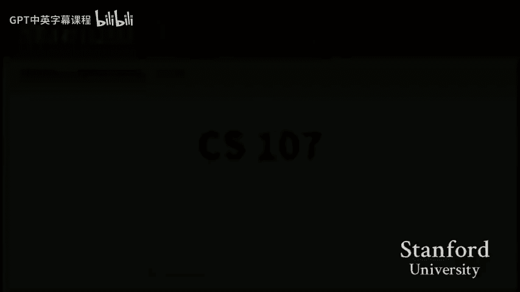

# 【计算机组织与系统 cs107 2016】斯坦福—中英字幕 p10 【Lecture 10】CS107, Computer Organization & Systems -YPC-P9lphqs- -BV1Nr421c7YB_p10-

Welcome back， everyone。To another exciting day of 107 today。

 a couple announcements before we get into things。 first， since we last saw each other in lecture。

 we released the midterm grades。 Hopefully you all got emails from gradecope and were able to access your midterm grades。

😊，The website， the course website has the exam solutions as well as some information about know how the midterm was graded and any and instructions for submitting re grade requests things like that。

 So if any of that。Applies to you。 Please make sure you check out the website for the full details。

Of what that looks like。Assignment5 is well on its way。

 hopefully many of you are seeing that seeing that through and kind of getting getting kind of near the final stages of that。

 Hopefully you enjoyed the brief excursion into just something a little different from just constant C code writing assignments six will go out over the weekend。

😊，And we'll be kind of， you know， seeing this， seeing we kind of in the home stretch of things here。

Allright。The， the plan for today。 So we've finished our discussion of assembly on Monday。

 So we're not really， so we've talked through all the mechanics of you know， what the。

 the kind of translation between C and assembly looks like。

 And so now we're gonna kind of zoom out a little bit more。And。So the next kind of。

Pretty much the kind of rounding out the lectures。 we're going to be looking at kind of just more。

Sort of systems concepts。 And it's not that the assembly in the sea that we've been working so hard on throughout the last7 weeks is not going to be relevant。

 We'll see， in fact， today， where our knowledge of assembly will make a pretty big difference in terms of understanding what。

What's happening？But we're going to just try to focus on what some kind of higher level。

Higher level concepts。 And for today， what we're going to do。

Is we want to talk through what it means to build a program。So for seven weeks now。

 we've all probably gotten used to just going into directory and typing make。

And then just having a program build， I'll go ahead and make clean， just to kind of。

They completed that。 So， you know， we see a few output lines and more often than maybe sometimes we even should we'll ignore the output lines and just say。

 yeah， sureryl， I type make and my program is built。 and that's great。😊。

Our goal today is going to be to understand what exactly is happening。

 So we want to know what exactly each of these lines do and what the kind of intermediate steps are。

 There are even some steps that are not being shown by make here that are。That are， you know。

 that are contributing to taking a C program that you wrote and turning it into a an executable program that you can run。

Okay， and。The one of the main reasons that we're interested in doing this， right， is that we want。

Ultimately， if there're， you know， you've seen， I'm sure you've run into a variety of build errors like you've。

 you know compiled and you've gotten some syntax errors or you've gotten some undeclared variables or missing。

 missing prototypes and things like that。 And our goal is going to be to understand。

Where those errors came from as a kind of stepping stone to how exactly do we fix them。

 and we'll start seeing a couple of places today where the type of error and you know which step of the process generates that error will give us a lot of information about how we as a programmer can respond to that error。

😡，And that certain errors require a very different fix than others and so that knowing。😡。

know how to categorize these errors more broadly will allow us to figure out where to focus our attention when developing。

O。😊，So rather than go through a bunch of slides because I'll be kind of moving through a lot of stuff。

 And I think it's really important to kind of see the big picture。

 like kind or see like kind in real time as we build these programs and things。

 I've got this little notes file that I'm going to be updating as we go through the lecture today。😊。

And so I've got a little section kind of overviewing the steps of the build process。

 and then I've got a couple of pieces of information down here。

 and so I'll walk through this file kind of one step at a time。

 so don't worry about trying to catch catch it all now。看。All right， so let's get into it the first。

Peace that I do want to talk about。 and I won't spend a huge amount of time on it。

 But I just want to， you know， make， make sure that we're。

 we realize that it's there is to understand what exactly make。Does。

 so there have been a couple of vacations already in lab where you were told to go into the make file and make some changes。

 You change how make was compiling your program， maybe with optimizations or maybe for assignment 3。

 you wanted to add an extra test program。 So then you had to go into the make file。And so， you know。

 I just kind of w to give a sort of nod to what exactly the make file is doing for us and why and how that works。

So when I type make。What。Makeake does is it looks at our make file here。And it uses。

It uses the make file as kind of a recipe to know how to build programs， so。

I won't go into like every detail， but I'll point out a couple things that makes make some points。

 So for example， here， you can see this rule， there are some comments。

 These comments have been in the make files kind of throughout the class。

 but I'll just kind of draw your attention to this line in particular for this rule says that if I have a dot C programs。

 so you can read the percent as kind of a just something to be filled in。 So if I have you know。

 hello dot C。 and I want to create hello dot o。 This line gives a recipe to make that says here is how you would actually create hello dot o using hello dot C。

And then if we go down a little further， we have a line that says， okay。

 from a particular do0 file like hello。0， here is how I would create the program hello。😡，Yeah。

 and so we can set， you know， some variables， and we can set certain compiler flags and things like that for specifying how this works。

But then if I type， and so， I pointed out two rules。 And now， if I type， make hello。Okay。

 so that one actually， it looks like it's Spped a。All right， so that's going to skip a thing。

 let me make clean real quick。But if I do make here。

 then you can kind of see both of those steps happening here。 So let's take the pre dot C program。

Right， Ca so here you can see the， I have pre dot C， And I'm turning it into pre dot O， right。

 I'm skip over a lot of flags here because they kind of mostly don't matter。

 And then in the next step， using a different recipe， I'm taking a pre dot O file。

 and I'm turning it into the executable。😊，Pree。Yeah。あ。So。

 so make is pretty convenient for this kind of thing。

 It means that we don't have to type all of these lines over and over again。

 Its make is not reserved just for working with C programs。 We could technically， you know。

 you could， you could anything that can be kind of scripted。

 anything where a file should be generated from a collection of other files。

 can be handled with make files。 And there are lots of interesting examples where you can use make to kind of just。

Autommate certain simple tasks。 You know， this is the kind of thing that that you you do in a command by environment。

 if you just， you know， you don't have like a convenient。

Sort of like automation tool that lets you just kind of。You know。

 do a bunch of mouse clicks if I just need， if I just need to execute a sequence of commands to generate。

Various outputs from various inputs make is a viable tool for that with the one limitation being that it's very hard to read make files。

's that's a thing。 but other than that， you know it's a pretty deive standard for building programs at least。

So。That's kind of the， the， you know， that's the extent to which I really want to talk about make files。

 Nobody ever really writes a make fileile from scratch。

 That's you often hopeless just because there are so many weird syn tactic。Qurks about it。

 So if you ever find yourself needing to modify a make file or， you know。

 needing a make file for your own project， you could probably just use the one from 10。

7 and kind of make some modifications to it。 So yeah。

But what I really want to focus on is I want to focus on these calls to GCC。😡。

And so we've seen over and over again throughout the class， every time we type make。

 we see something about GCC。And it's finally time we figure out what exactly is going on in there。

Right。So we have up till now， pretty much been calling GCC the compiler。 We said， oh， yeah， you know。

 Gcc is a compiler。 it builds a program。But what GCC actually is。

 like the command GCC is actually the compiler driver。And by compiler driver。

 what I mean is that there are several steps to building a program。

And GCC is in charge of running each of those steps。😡。

And so the way we can actually see this happen is if I just click the screen here。

 I tell you if I use the command GCC minus V here， V stands for verbose。

And I asked to compile Hello do C。This is going to ask GCC to compile the program。

 but also include a whole bunch of information about what it's doing behind the scenes。

And so there we see just a ton of output， right， It's going to be pretty infeasible for us to really go through it。

 but I can highlight a couple of aspects here where here you can see a call to a program called collect2。

😊，And if I go up even more， here you can see a call to a program called AS。

And I will try to really pinpoint each of those。But。Scattered within this verbose output of Gcc。

Or calls to each of these four steps。So here's a quick kind of overview of what the steps are。

 And so what happens is I call Gcc on Hello dot C， and it will。Run each of these steps， and。

If I don't specify。Any flags。 So I didn't use any of the flags listed on this page for preprocessor。

 compiler asr。 Then what that tells GCC is I want to build the entire program。

 So run the entire process from start to finish and give me an executable at the end。

And so what we'll be seeing today is how we can stop GCC at various steps and say。

 I only want you to run the preprocessor， and I want you to tell me what that results in。

 or I only want you to run the preprocessor and the compiler and see what that results in。😡，对。

So we're just gonna to go down each of these steps one by one。

 And we're gonna to talk about what the input of that step takes， right。

 So the input of the first step， the preprocessor， for example， takes the dot C file。

 the actual source code that we wrote。 We're gonna talk about what it outputs。

 and we're going to talk about what it does。And I'll fill in the purposes， as we go。So first second。

Okay。So let's just get into the first step。We'll pull up pre doty to talk about what the preproces does。

Okay， so the first step of every of of a call to。To Gcc is。

 is that we will run the preprocessor and what that step does。

Is that the preprocessor is in charge of filling in or kind of resolving， in a sense。

 kind of handling pound includes pound defines， Basically， anything that starts with a pound。

The pre processorcessor will deal with it。は。然后。Sick。Okay， so here we've got a couple of examples of。

Poundefs。 And you've used some of these throughout， throughout the quarter， right， You've。

 you've seen poundef as a way of defining constants。 We can use them in kind of more complex ways。

 We can define， you know。Something like one left should 4 into a， into a define。

 They're not restricted to numbers。 We can used them as strings and， and what not as well。

And I can show you an example use of a couple of these where I can say inome equals that expression。

 I can say in array equals the number and so on。😊，There's one other thing the preprocessor can do。

 which we haven't been talking about because it's a little bit。Unsafe as it were。

 And you'll for in lab what what that means exactly for preprocesor macros to be unsafe。

 but we can also define a。A sort of it。Well，So what this is called a macro。

 And what it does is it it actually takes an argument。 And so here we define abs of X。

 which will be filled in with。 And so instead of and it will actually essentially do this。

Block of code。😡，The key to understand about what the preprocessor is doing。

Is that the preprocessor does not know C code。It does not know the language。

 And so all it can really do is it can go through your code and find and replace every use of these poundfins。

With。Whatever shows up after the name。 So let me actually show you that， right。

 So I want to switch over to another terminal。And。I'm going to build pre dot C。

 but I'm going to stop after the preprocessor。So I'll say is Gcc minus capital E。

 which is the flag that we use to say after you're done preprocessing， don't do anything else。

On predt C。And so here there's a bunch of stuff at the top that I'm going to skip。

 but here you can see our function for main， and you can see that where we said int nu equals expression。

The preprocessor essentially did a fine replace on expression， and filled that in。And where we said。

 you know， into array bracket number。It fine and replaced number with 42。

And even for the absolute value one。It。Filled in X with whatever we put inside the Pars for abs。

 and then just find your place again on this line。😡，Okay？And that's all it does。

It also handles pan includess。 I'll show you pan includess in a second。But as a result of this。

 kind of very。Brrute force， find and replace processing。

We can really get ourselves into trouble with the preprocessor。So at the beginning。

 I showed you something like I said when I first talked about countefin， like in you know。

 lecture number two or something， I said， hey， watch out。

 poundefin does not get an equal sign or a semicolon。

So now we can actually talk about what happens if I go up here and I say pound to find number equals 42 semicolon。

What's going go wrong is the preprocessor going to say， no， that's the wrong syntax。

 Is it gonna you know， help us really figure out what went wrong， Well， let me save。

And switch over here and do a Gcc minus capital E again on pre dot C。

And we can see what happened there。Right， find in replace。 It says， okay。

 everything that shows up on the right hand side of number。Right。

 so here number is this thing equals 42 semicolon。 We will take that。

We'll search for the word number。 And anywhere you say number， we're gonna to put that。So right here。

 words is going to write。That in。Now。Of course， this is going to be a syntax error。😡，Right。

But the preprocessor。Is not going to， is not going to notice that。 We didn't。 I。

 I stopped compilation after the prepro step， and I didn't see。Any errors。Now， if I try to make pre。

I will get a syntax error。😡，which says， hey， by the way。That's going to be a problem。

But that error is not coming from the preprocessor。

And one of the big things we want to take away from today's lecture is how do we know。

 How do we know which step produced the error， Well， in this case。

 I know that the preprocessor didn't produce this error because when I only ran the preprocessor。

It didn't say anything。Okay， question so far。So Im maybe fill this in really quickly here。Handles。

 pound include。 I'll show you the pound include in second。 pound defines。And then。

I guess I'll make it。 I'll put it in a different section where the preprocessor， so far。

 we haven't seen it handle any errors， but it's not。Going to handle。Will not。Right。Handle。

Syntax errors in condefin， right， So I made an error。In the， you can see， hey， well。

 the error was in this pound defined， right， I shouldn't have written this equals 42 semicolon on the poundef。

 preprocessor didn't catch that。Okay。So now the other thing， and then。Yeah。And then I guess now。

 just a super quick note that you'll actually notice that the assert also got replaced。With a。

With kind of this， this expansion， which actually tells us that some of the things that we've been using pretty much asserts the main one that we've been using so far and kind of thought of as functions are actually preprocessor macros。

 And so they're actually getting handled at this stage， right， The preprocessor expand turn assert。

You know， a array bracket at 0， double equals whatever into。Into whatever it expanded to。

 and that was inside of a certain onage。So， let me actually。

I'll probably fix this bug so that we don't get ourselves into a。A bit of a wine there os guess。はい。

Okay。So the other 1， I want to talk about， oh， and then。Yeah， so I'll do it。 I'll do that here。

 The other one， the other thing I want to talk about the preprocessor doing is that it fixes。

poundund includes。So here I've got。Include。Dot C。And there's actually a header file include dot H。

Right， which just has a type def。 It has a function prototype also。

 But so here's our include dot H file。 right， It defines a fraction structure。

 So think about something like C vector dot H just having the， you know， the type def or C vector。

And here， we've got。s here we've got。A， a pound include of。Of that。 So what's gonna， So。

 what does the pre processorcessor do here。Let me just run the prepro on this。 Okay， so Gcc minus E。

On include dot C。And we can actually see pretty much what it exactly what it does。 First of all。

 a super quick note。 Not that there was a comment at the top of the file and the preprocessor got to that。

 too。 It says， yeah， these comments， right， they're really useful for a human reader。

 but they are not useful for the machine。 So we're just going strip those away right away。😊。

And then you'll notice that the contents of ink dot H， right。

 the prototype and the type F struck were just copy pasted right into our file。And then， you know。

 the rest of our file continues from here。 Yep， does it that matter what order you you do include Does it the question is。

 does it matter what order， in what sense in the sense that one refers to another were they structure。

 Yeah， good question。 So the question is， like， does the order of pound includes matter， for example。

 if  one include or if you know， one。Yeah， if one header file needed a different header file generally speaking。

 it kind of does right So for example， so the example I'll show you here is like what happens if I pound include something twice。

😡，Like， is the preprocessor going to do anything special here。And the answer is going to be。 well。

 here。 Let's So I added two includess of ink dot H。

 and we can actually see that it didn't do anything special that the preprocessor really is going to just do this kind of。

😊，You know， this kind of blind copy paste here， right， Like， oh， you want to include ink dot H。

 All right， I'll do it。 Oh， you want to include dot H again。 Okay， I'll do it。

And so what this means is that generally the convention that we want to follow with our header files。

Is that if the header file depends on some other header。😡，So let's say that。You know。

 something in ink。th。Needed。S TD I O or something。 Then we should put that include inside of the header file。

We don't really want the order of includes to matter。😡，But if we program。

 if we write our header file sloppily， then it can。Okay。Other questions。So now he can say， all right。

 So again， the preprocessor had no problem with this。 It just did the include twice。

But now we can say， well， is anybody else going to have a problem with it？Right。

 like we kind of see that。😊，And in fact， the answer is yes。So a later step。

I'll mention what step in a moment。 But a later step did not like the fact that we declared that we defined this structure twice。

But the preprocesor didn't care。Right， the preprocessor is。At this point。

 pretty much happy to make errors for everybody else to solve。😡，Right， like， oh。

 you called the pound include。 You did it wrong。 You have a pound to fine that's wrong。 Like。

 I'm not gonna be the one who's going to look for it。

 I'm just gonna do what you said and then pass on the output。

 this output to the next step and let the next step figure out。So I'll just show somewhat。You know。

 maybe a little quickly what exactly what the solution is to solve a problem of double including because sometimes it happens。

 right， It's not that， you know， you might say， well， why， why would we ever include a file twice。

 but sometimes it happens as part of just you know， file A includes file B includes file C。

 And then maybe we also include file C。 and， you know， And so the the strategy to solve this problem。

 is to use this other preprocessor directive that we haven't seen so far called if and death。

 And so what we're gonna do， I'll just write it out。And so what is actually going to do？

Is the way to read this。Is if。Ink dot H has not been included yet。

Then go ahead and include all the stuff。But then also set a flag， right， So pound define。Ink dot H。

 so that。We don't accidentally include it again。So now if I save this。

And I still have my double include。And I do Gcc minus capital E on ink。 C。

Then we can actually see that I've actually only included the type de once。Because of， yeah。

 do you have to use an underscore So the question， so why do I have to use an underscore in the if D Because you're not allowed to define stuff with dots in them。

Yeah， so this is sort of a convention。 You， you can give this whatever name you want。 You could say。

 you know， ink H included or whatever， right， as long as they too，'s both of the match。

 then you're okay， but it's pretty conventional to just see something like this。

And so this is called an include guard。😡，And it protects against multiple includes。你看。是吧。All right。

CoolAnd so I should say， you know， so what does the pre processorcessor handle， right， What。

 What kind of errors does it check for。There's pretty much。 there's one really kind of main one。

 which is that if I include something that doesn't exist。Like a bogus do age。I can run。

The preprocessor， remember， I always want to keep only running the preprocessor so that I can see what errors it specifically captures。

😡，If I run Gcc minus capital E to only run the preprocessor。

 then the preprocessor outputs this fatal error that says， I can't include this。

So we can conclude that the preprocessor will not catch errors like syntax errors and things like that。

 But what it will probably catch is， you know， so I actually just to get rid this。

 and we're just going to say， you know， not that， but it's going to catch nonexent。Make。Dot H file。

 right。Also， nonexistent town include， yeah。嗯，好。Gool。

So now that the preprocessor has executed any questions about the。是塞。

So now that the preprocesor is executed。We get out。 I'm calling a dot I file。 So actually， I should。

Maybe just show this quickly， which is that if I make hello in here。

That we've actually sent a special flag where。The intermediate steps of。

Of the hellello process are being generated。 so you could go in and look at these files if you wanted to。

 So you could see that So hello dot I would be the output of the preprocessor。And hello， and so on。

All right， yeah。せグれ。はい。Sorry， two H files， like winky and binky and they like included each other with like if you didn't have that。

 would they just keep？Oh yeah。 So the question is， if you have two dot H files that like keep including each other。

 if you don't have that， would something pretty crazy happen， probably。

 I guess it depends on how it's processing it。 But yeah。

 that the guard will definitely protect against that。

Right and that's going to be one of the big reasons。For having it。Okay， yep the。嗯。Yeah， yeah。

 so if I call something like pound include bogus。 age， right？Like， what do I do， you know。

 So the file doesn't exist， right， There is no bogus on age。So then who's gonna notice that。 Well。

 the preprocessor， when it goes in and says， okay， I'm supposed to copy and paste bogus do age into this file。

 It says， I can't do that。And so then we see that the preprocessor actually produced the error for that。

 Right， So here we tried to run just the preprocessor。Right。

We tried to run just the preprocessor and it said， I can't continue。就问下。So it did handle that， yes。

你看。2。So now， what we've got。然。So now only God is this。It still looked like C code， right。

 Like the preprocessor didn't change our code very much。 It just， it still left it as kind of C code。

 but just got rid of some pound includess， got rid of the pound to find， filled some stuff in。

 did some fine and replacing。And so now we've got this kind of。Pre processsed C code。

 And now we go to the next step， which is the compiler。

So here you can see kind of the flag that we'd run to stop at the compiler。

Which is G C minus capital S。 And what the compiler is going to be responsible for is it's going to translate。

C to assembly。 So this is where pretty much all the heavy lifting is done。Okay， so if I look at。

So if I look at something like hello dot C。啊，那么呢。And I'm want to get rid of this。

Include so it doesn't break。 And if I look at Hello dot C， which is kind of your standard。Priinntf。

You know， hello。Percent S， whatever。So here's your kind of normal program。

 We're gonna pre processces this， right， So maybe I can even look at the pre processed output。

Hello dot I， right here you can see all the junk that came out。

Here you can kind of see all the junk that came out from pound， including S TD， I O dot H。

 We can kind of see what's in there is we've got all this old man who even knows。

 But I'm gonna skip it all。 And we're gonna to come down and we still see our C code， right。

 So this is the output。 So this is hello dot I。😊，Which is the output of our preprocessor。

This all goes into the compiler。😡，And what the compiler is going to generate is the file hellello dot S。

And that looks like this。So， here。Right， this looks pretty familiar to things like that we were looking at before with Gcc Explorer and whatnot。

Now we have assembly， right， We got the， we got， you know， our main。

 We've got our subs and our comps and。All the usual kind of things。

There's a call to printf down here somewhere。哎。AndSo you can kind figure this is where a lot of the work has to happen。

 right， That translation from taking， you know， printf Per， hello Per set S to turning into this。

 the move and the jump and the call and the whatnot。 That's where all the。

 all the all the magic of the sea language happens。😊，And。In particular， so in fact， so therefore。

 pretty much all of the， a lot of the errors that are going to come out of the build process。

 So things like， hey， you call the， you know， you。You know， you。

 you use a variable that doesn't exist or you have the wrong C syntax。

 These are all things that the compiler is going to handle。So if they come down here， you know。

 we've got syntax， errors， undefined or'll say undeclared variables。And， in fact。

All of the type checking。Is also going to happen here。

 So we have to keep in mind that from as we go from one step to the next。

Each step is only looking at its particular input file and producing its one output file。

 So it is not the case that， so after we get to this point， after we are here at the assembly level。

We don't have any type information anymore。 This is a theme that we， you know。

 kept coming up when we talked about assembly。 We don't have any type information here。 so we don't。

Just from looking at the assembly， we would not know。Whether。You know， what type。Got stored in EDI。😡。

Or what type got stored in ESI？Right。And so as a result， if anybody is gonna do the type checking。

 if anybody is gonna tell us， hey， I think you passed a carestar when you should have passed an int or。

 you know， or you should have， you know， the incompatible conversion of a pointer to an integer or vice versa that's all has to get handled by the compiler because no step from here on out will have any type information whatsoever。

Because now we're at the assembly and that's it。😡，No type information。Okay。20。

Questions about the compiler。 This is obviously where all the hard work happens。

 But it also means that we're not， you know， like this is where this is what you learn about。

 if you take compilers is like how to build one of these things， how to do those translations。

 that's not a detail that those aren't details that we're really that interested in for this class。

 We're more interested in kind of the the steps around it to understand how we take that assembly and and get to a。

😊，A final product。Okay。So now we've got this dot S file。Right， we've got。

A file that we can still open up in our text editor。Right， we can still look at it。 I can still。

 you know， there are still characters in here， right， I can technically， you know。

 delete the O and move L。 That would be a bad idea。 This wouldn't be a valid， you know。

 this wouldn't be a valid assembly instruction anymore， but it's still text。Right。

Now when I go to the next step。Actually， messed up something。

 So the next step is going to be to make， oh， is it there。Oh， stacking。If I go to the next step。

 the next step is the assembly。And what the assembler is going to do is it's going to take the output is it's going to take this thing。

This assembly， and it's going to turn it into hello。 O。I' try to open up hello dot0。But now。

 now we have no success。So from here on， the， the primary role of the asmbler is going be to take our。

So you， so you actually， you know， so for assignment 4， you did a disassemble component， right。

 where you took some bytes， some the， the encoding of some of these instructions and you printed out the push。

 right， and what that corresponded to。The asseembller is going to go the other way。

 It's going to take all of these text instructions， and it's going to turn them into a binary file。

And so now that we have a binary file， we're not really going to be able to。

Look at it in a text editor and get anything useful out of it。😡，So we need some other strategies。

Okay。So， let's。Let's do that。First， let me just briefly kind of mention what exactly is a dot O file。

 What， what is this sort of contained in this binary file。

AndThis is something that will come up for assignment 6 as we kind of get into that。

 that space of things。 So dot o file is an example of what we call an L file。 And so I can use tools。

 so I can't use the text editor anymore to look at these dot o files。 I can use tools like this one。

 read E。inus H to look inside this dot O file。 And it tells us a couple things about it。

 It says that this is a 64。 This is an X 86，64。呃。This has X 86，64 code in it。

 It tells us that it uses twos complement。 It's little Indian。

 These are things that we've kind of run into。😊，And this the Dotto file is called a relocatable。😡。

So this is just kind of a quick overview of what's in the dot O file。

But here's another way that we can look at what's in。The dot O file， we can use a command。Opion。

Which。You've probably already used。For binary bomb， right， So we can look inside hello dot O。

And we can actually see the assembly instructions that are coming out， but。

Don't be deceived by the output over here。 the moves and stuff。

 We do not have an M O V character stored inside the dot O file。

 What's actually in the dot O is this。These bites。arere stored there。

 and what ODump is doing is it is doing exactly what you did in assignment for。

 it is disassembling these bytes to tell us what the text equivalents are。😡，Okay。

So one thing to notice right away here about dot o files that's going to come up is。That。

 for example， this call， which we understood to be a call to printf。

 did not get filled in correctly or has not been filled in yet。And。The problem is。At this point。 So。

 okay， first of all， quick kind of high level on what the assembler does。

 Let me come back to that point。So it's going to， I want to actually use the word transliterate here。

 And what I mean here is that assembly to machine instructions。

And what I mean here is that you'll notice just at a high level。

 every instruction that you see in this dot S file。Shows up in the dot O file，1 for one。Right。

 theres not。This is not kind of this very fancy work that the compiler was doing。

 kind of moving stuff around and lightingning up， you know， you know。

 generating the right assembly for each line of C and so on。

 This is really just kind of a one to one。 Every one of these lines gets turned into a certain number of bytes。

And that's it。RightSo each of those lines， you'll see kind of maps over here。But。One thing that is。

That we haven't been able to do so far。Is that up until now all of these？Three steps。Right。

 have been operating on one file at a time。So this one takes binki dot C and turns into binki dot I。

 This one takes binki dot I and turns it into binki dot S。

 This one takes binki dot S and turns it into binki dot O。

In no consideration whatsoever to any other files that may exist that may be you know。

 part of the same program。And so。In our hello dot C， we call print。But we didn't write printf。

Somebody else wrote prints。And so what？So what the assembbller is going to do is it's going to leave a placeholder。

It's going to say。Hello dot O contains inside of it， a call。To printf。

And you can actually see that using a command N M。 And I N M will come up more throughout。

 But here we can actually see。 So N M is going tell us。What things are defined inside of。

The hello program and what things are are undefined。

 So here we can see that Hello dot O contains a definition for。Nin。

And the T means that it's a function。But it has a call to printf。

And that U means that we didn't define printf， we didn't write it。😡。

And so hello dot O is going to depend on。Printf， wherever that's located。

And so it was not the asmber's job to， to solve that。

 So it's gonna leave a placeholder that says eventually this call needs to get filled in with the call to printf。

 but。那上班者。开。So I will say briefly what errors does the asmbler catch， well it turns out none。Right。

 the assembary isn't going really report any errors as long as compiler。Genenerated good assembly。

 right， So the assembr， the the compiler put out that dot S file。And that dotdess file has， you know。

 those assembly instructions。 If I went into that dotts file and I， you know。

 rewrote move L to you know， M V or something like that。 Well， yeah。

 then the asmbler would complain and say that's not a valid instruction。

But if we're just following the steps one by one， the compiler is always going to generate good assembly because that's its job。

 right， And so then the asmbler doing this very one to one， you know。

 one assembly line to one machine instruction kind of translation is not going to notice anything else。

All right。好，申请。Okay。So here， I'm actually going to do。

I want to pull up a different example than I think is a little bit more， more eluating here。

 especially let me do this one instead。 So here， I just have this dot C file called U dot C。

 We've got a couple of functions in it。 We've got。😊，A call to， you know， Malik。

 There's a function called Malic Meet。 And there's a call to。And there's a call to。

 there's a function Dnky。😊，And there's a little max function that we're calling。Right。

And so if I look at， so I'll go over here。And。Okay， so now what we need to do。

 let me point out a couple more things。About。About the dot O file。 So the first thing you'll notice。

 So a couple of other things you'll notice about this dot O file。 So we don't see， you know。

 So we do see a call to， to Max filled in。 But， you know， as we saw with。As we saw with Hello dot O。

 right， we didn't see any。 We didn't see the call to printf。 So here there should be a call to Malik。

 and there should be a call to meet。 And we don't see either of those。Because they're。

 they're undefined， right， The other thing that's really kind of noteworthy about。

This dot O file is that if you recall the addresses that you were seeing when you did object minus D on bomb。

😡，These addresses are much smaller。And you'll notice that if I come all the way up here。

 the addresses start at 0。And so the problem is that。

One program could be made up of a whole bunch of different files， right。

 It could be made up of a bunch of different dot C files， including things like libraries。

 And also just So you think about like C vector and C map werere in separate dot C files。And so what？

What we have in a dot O file。 And this this goes back to calling it a relocatable object is that we've just got a bunch of machine instructions。

And then the last step of the process， the lur。Is going to take。 So if I make clean。

 and I'll show you。I'll show you this line here。 This is the linker line。

 If I don't put any flags to GCC， I get。I automatically。

Invoke the linker and here you can see that I'm passing it two different dotdo files。😡。

And it will produce the one main executable。Okay。And the linker is the only step that is working with multiple files。

😡，So what the linker needs to do is it's going to， I'll tell you what both of these things mean in a moment。

 resolve symbols。And then， it will set。呃。The address。Lay out。

And so what I mean by this is so the Idato file has small addresses。Underfined。Symbols， right。

 So we saw the small addresses when we did the。The object jump。

 we saw the undefined symbol when I did the N M。So here， if I do an N M on U dot O， for example。

 we see that there's an undefined reference to Malik。2。Mick。

 there's an undefined reference to meat and also print。

And so it's the linker's job to do both to do two things。 First， it's going to。

Fill in these undefined symbols。 So if I do an object minus D。

 this is gonna be pretty hard to dig through。 But of the main executable program。

 So no extension means that we have an executable。嗯。Right， so it's a mess。

Because it brought in all the library stuff。But what's going to be important in here。If I。

 if I dig through it far enough here it is。 actually。

 I found it I that you can see that there was a result。 There was now there are now calls to malec。

 and there are now calls to mesite。And so it filled those in， right。

 It filled in those undefined symbols。😡，The other thing that it did is it just picked an address where our code will ultimately。

Live when we run the program， so。It turned all those little tiny addresses that started with 0 into these kind of addresses that look more familiar to us from our work with Boum。

 you know， starting at 40000。 And as it turns out， the linker gets to just pick them， right。

 It could have started。You know， it could have put our program at 500。

000 or at a million or whatever。 it just gets to pick a number。Okay。So for second questions。Okay。

So then kind of the。You know， sort of the follow on here is， okay， so now what。

What is the linker actually？What does the linker actually do？AndSo， so， so what we've got the。

 what does the link actually do。 And so what， where can this go wrong， right。

 Why would this ever create a problem。嗯。Let me， so let's， let's just， we're basically gonna， for the。

 this part， we're just going kind of go over a couple of different examples and just。

There are some very specific errors that the linker will generate。So what can go wrong， right if I。

Try to resolve if I'm resolving symbols and setting the addresses。 Well， the addresses。

 it's gonna be fine。 I can always pick them。 So what can go wrong when I resolve symbols， Okay。

 let me。没对的。So I'm going to open up main dot C。And you not see。So let's imagine。If I've got。

What do I want to do first here， Let's imagine if I。If I。So down here， you can see here。

 let's go to main。 And down here you can see a call。To dinkki。Right， of 107。And over here。

 you can see， I don't define。Dinki anywhere。Right， I have a prototype for it， but that's it。

So what happens And so dinkki is defined over here in U dot C， right。What happens if I just don't。

我的犯罪是。Come with this entire thing out。So let's try that。And then we call it over there。Okay。

 so here we can see the the。The the error， let me actually do something different。

 let me go all the way through。And so here we can see where the problem is。

 Notice that up until the linker step， right， So each of these lines is a compile and assemble line。

 right， this takes main dot C and turns it into main dot O。

 This takes u dot C and turns it into U dot O。 Neither of these will individually have a problem。

 If I'm just looking at U dot C， There's nothing wrong， right， I've got this function。 I you know。

 I didn't define Dnky， but nobody called it。 So who cares。

If I just look at name got C and I don't look。Anywhere else。 So we， let's just look at。 So in here。

 everything's fine， right， No calls to Dinki。 You didn't define it。 Who cares。Over here。

I have a call to Dingy。So why didn't the compiler notice well。We gave the compiler a prototype。

The prototype， we gave the compiler， a prototype for Dnkki。

 which basically is almost a promise to the compiler that this function will exist。😡，Later on。But。

 it did。Right， we never actually gave。 We never actually have the code for Dnkki anywhere。

So that when the linker comes along and says， okay， time for me to resolve that reference， right。

 So if I do a。An N M on main dot O。There's an undefined。

 you know there's a reference to dennkki here。😡，And if I look inside U dot O。

I don't see anything about dinky in here。So what am I supposed to do， there's， you know。

 this reference will stay undefined， and that's gonna be a problem。

 And so we get this error message from the linker that says that dinkki was undefined。

 that there's an undefined reference， which is exactly what this is。An undefined reference to Dnkki。

你看。But this kind of walks us down a really interesting path。That。

The prototype didn't do anything for us。Right？we didn't get any value out of。

Like the fact that we had this prototype， this is only information。To the compiler， to check types。

Remember that once we get past the compilation step， we have no more type information。

So that can lead us into this interesting。Situation where right here。

 I've got a prototype for dinkki with one argument。 and I call Dnky of 10，7。

What happens if over here？Thank you for that。I ought to find Dy， no problem here， have that function。

😡，But I want to define it to take two arguments。And I'll go ahead and change this to a max of n and N2。

 whatever， right。So now who's going to notice。Well' try let's try to make a prediction here。I'm in。

U tell dot C。Does anything look wrong in here。Right， so I've got my found includes。

 I've got a couple functions。 I have a function called dinky， which takes two arguments。

Is there anything wrong with that？No， seems fine， right， seems legit。请次证。Over here。

 we're going to look specifically in main dot C。Because every other step besides the linker。😡。

It only looks at one file at a time， so we're going to look at this file and we say okay。

 we've got a prototype for Dingki。😡，Takes one argument。1 int。 we've got。We've got a call to Dki。

 takes one argument。 That's all consistent。乐斯君 looks斯君 right。😊。

So our last hope for finding this error is the linker。Right， neither file individually looks wrong。

So our only hope is if the linker would notice it。And it doesn't。Why not。Well， I mean。

The linker is operating on machine instructions。At the machine instruction level。

We don't know about types。 If I do the N， M again。Main dot O。

We can see this undefined reference to Dinki。If I doing N M on U dot O。Hey， look。Dinky is defined。

It's a function， it's right there， cool。アス。Liiners is happy。Program builds completely。

So what's going happen now。Right， so I， I， so now I'm going to run it so I can run this thing， right。

And。You know， that's the wrong answer， right， So Dinki was supposed to print out the max of its two arguments。

I only gave it one argument。😡，啊。And， well， where' did the other one come from， I mean。

 we know what the assembly looks like。 We could even look， right。And we could disassemble。

We could disassemble Dnky really quickly， oops。Oh I'm like， oops， ha。Right， and we can just see。

 right， oh， I've got a call to。To printf， and it's just going to pull its arguments kind of where you'd expect。

 right？Or here's the， here's the call to match。 Right， Oh， well， okay。

 it doesn't show the there's a pass through。 But we're going call Max Max has two arguments。

 We we're just gonna pass them through。I mean， the assembly is is what's there， right。

 and the assembly is just going to execute on whatever two registers right， E S I EDI， E S I， right。

😡，happened to be built in， and that's it。こ。And so one of them happened to have the value 2 billion。

 whatever。But， oh， well。So， we don't get。We don't get prototype checks。We did no type checking。

So yeah， sure。 The linker is going to notice。Undefined reference to symbols。But， not。

Will not detect prototype。Yes。Right， and we can actually go。 We can get this。 This can go。

Even deeper。 And so any， any questions about that so far， so。Yeah。

 so does that mean that for any executable on your computer or if they can even run you can actually kind of disasseble it and see the code that was doing dis。

 Oh， yeah， so the question is for any executable， can I actually just go into the executable and disasseble it？

 Yeah， you can。So you can see how like Xcode or like whatever。 Oh， sure。 Oh sure， yeah。 So yeah。

 it's going to have hundreds of thousands of lines of assembly。

 It'll take you forever to find anything， but it's there。Right。

Some executables won't have the function names in them at which point it's going to be very hard for you to disassemble。

😡，Right， if I didn't know， if I didn't know to disassemble dinky or mainine or Max or whatever。

 then I'm， it's gonna be pretty hard。 right， If I just give you a pile of 10 assembly instructions that go。

 right， but it's possible， absolutely。If you， you know。

 if you find the executable and you fire up GDP and， or you， you know。

 So if you find some executable and you run N M on it， right， it's gonna tell you， hey。

 here are the functions that are in the executable。 And if you can use that。 So like， for example。

If I do N M on main， right， I see a ton of stuff。 and I could go into GDP and just like。

Disassemble any of these things， right that are functions。And off we go。So Maine， Malic， whatever。

Okay。So then there's kind of this follow on question， which is， so what happens if I。

 So here you can see that， you know， you might say， okay， well。

 this one kind of went through because we had a prototype。 I'm gonna comment out they called a Dy No。

 because I don't want to fix it really， We had the prototype。 What if we don't have a prototype。

 So what if we call a function like Q sort。But I don't pound include anything。Okay， so up here。

 I don't have。A pound include to STD Li， which is where Qword is。Right。

 so what if I make a call to Q sort， and I don't know， I pass some complete garbage。Like that， right。

 Like this is just awful， wrong。 Like， this makes no sense。What's going to happen？

Who's going to stop us？Who's got to notice going to make clean。

I want to clear because I'm starting to get a little bit and I want to make。

So we get a little bit of help。This is the compiler step， compiler and asser together。

 but the assembr never produces errors。 So we can just look at this as the compiler saying， hey。

 you made a call to a function and you didn't give me a prototype。So I will make one up。 Oh。

 you pass a pointer and an int。 All right， sounds good。 I believe you。 Qor takes a pointer and an in。

 Got it。你看。And that's it。 And that's all the compiler has to say about that。

And then we go to the linker。Now recall， the linker has no type information。

So it's not going to know what Q source arguments are， all it says is。😡，Inside main dot O。

 there is an undefined reference to Qsort。😡，Is Q sort defined anywhere？😡，Well， by default。

 the linker will always bring in everything in the standard C library。

 So that includes things like printf， Malik， the string dot H stuff。😡，Efin， Q sortt， and all that。

So that alt comes in and it says， yep， there sure is a function called Q sortt。

 and I sure can link your call to that function。So nobody actually stopped me from building this program。

😡，I got a warning from the compiler， that's it。😡，Now when I run， of course， it's going to send fault。

Because he called it Q sort on a null。Didn't pass it kind of anything sensible。八。You know。

 very little， very little support from that。Right。So we can say here that， like the compiler。

 you know， can。Prototype。Problems， warning， if no prototype。

But the linkers is not going to do any of that。Okay看。Let's see what else we don't want to do。So。Yeah。

 so let me take a actually so kind of。2 last points that I wanna talk about a little bit here。

 So I'm gonna rid of this call as well，cause it's， you， I'll comment them out。 So you know。

 you can have them if you wanna。Watch your program of psych faultult because you haven't gotten enoughsych faultults。

 but anyway。Two things I want to so one other thing I want to talk about with the Lier is as it relates to static。

 So there were so back with C vector and C map， we told you to that it's a good practice to make your your functions。

 your helper function static。 So what does that mean。 So you'll notice and this， you know。

 both main dot C and you dot C define a function called Max。😊，And you might think， hey。

 isn't that not good， right， like why is that okay？

And the reason that's O is that what static does is it。

It means that this function is like the linker will not look for this function。😡。

Or will not see this function from outside of this file。 So in some sense， sort of the。

Function static is， I don't know。 I'm just gonna put it here or whatever function symbol only visible inside you tilt that C。

Right， so this means that it's okay to have a static function。

With the same name defined in two different files， if I didn't use the word static。Right。

 and then I made。Now I get a linker error。That says you defined Max multiple times。

 the first one was in there， which is super not helpful， but O well。

 it doesn't tell you the line number because it doesn't actually know it， but it basically says hey。

 yeah， you know you defining Max again， you already defined it once in May nuts。😡。

But because it static because it was static， then I was allowed to do that to define it。

Ones in each file。你看。So we can kind of add to this list of errors。Multiple non static。

And I should say symbol。 So when I say symbol， I'm referring to things like functions。

 mostly functions， but also things like global variables。

 I'm not showing too many global variables here because the assembly for global variables is gross。

But。Otherwise， that's how that goes。Okay， so the， the big thing I want you to take away from the linker as we get into things is it's not gonna to detect prototype stuff。

And so then， and it's not gonna， you know， it's not doing any of the type checking。Right。

So then as a result of that， though。One of the。Key points of pound include was to bring in。

Prototypes。Right， if I pound include S TD， I O， I get a prototype for。You know， printf and whatnot。

So then if I then， so let's say I go down here and I make a call。 I say float F equals pu。Of three。

And I don't know R C or something， right， And I know， well。Let's just return it as an int。

 let me cast this。We just do this as an int and then it'll return it as an int。Just so I can。

 if I don't use it， I think the compiler is going to get annoyed and' like oh。

 you didn't use your variable I'm like， yeah， yeah。Okay。All right， so here I want to call Pow。

And I want to save。 come over here。 I want to make clean。 General。

 when we're playing with the compiler a lot， you'll notice I'm doing a lot of make cleans because it forces the compiler to。

 it forces the entire build process to go through again。

 So that way we can actually see every step and make sure we understand what each step is doing。

 Okay， so。😊，Here we can see that。We get the warning。

From the compiler that says that your call to palwell is。

I'm implying a prototype for PAO because you didn't show me one。😡，嗯。And we also see this。Err。

 which Im going to give back to in just a second。So you might say， all right。 Well。

 we've got this implicit declaration warning。 no big deal， right。

 I can just pull up the man page for that。And the man page says， include math on H。 great。

 that's gonna fix all my problems。But remember what including a dot H file really does for your program。

 It's going to bring in prototypes。 If you think about what was in C vector dot H or Cm do H。

 you didn't have the actual code for C vector and Cmap。

 You just had the list of functions and what arguments they took。😡。

So that's going to help the compiler out a lot。Because the compiler will look at those prototypes。😡。

But the linker doesn't。So the compiler is happy now， no warnings， no errors from that。

But this is not going to help the linker。Because the linker doesn't look at your poundefs。Right。

 the linker does not look at type anything that has anything to do with types whatsoever。

 And that includes the prototypes for your functions。

So this undefined reference to PA has nothing to do with the fact that I forgot to pound include Ma dot H before。

😡，This is because the code。For the power function。For how to actually do。The power computation。

Is not anywhere。The linker was expecting it to be。Now， that's a little startling。

 So where is it exactly， Well we can pull up the man page again。

And we can see that there's actually this extra line。Liinnk with minus LM。

And so what we actually have to do is we have to go into so what we actually need is we need a line。

 I' actually just write it， but the correct way to do it would be to modify the make file is that in addition to these。

😡，Right in addition to linking these two， I also need to link。LM。

 this is an exception to the general rule that the standard C library is linked by default。

 The math library is a separate based entirely and for historical reasons and only historical reasons the math library doesn't get linked by default。

 So if you ever use a one of the math on each functions like P or log2 or something like that。

 you need to change the linker line and pound， including math do H。

 is not going help you solve this linker error。😡，Right， but now if I do it like this。

Then that will work， and I can use math， but it's not you' going to see it the output。God had this。

Right。快式到单。Question。is specifically just within that one。Yes， so， so the question is。

 is dash L specifically to link with math。 Yes， so this， yeah。

 so this the dash L means add also link with this particular library。

 The math library is called Lib M。 So for example， if I had a program that needed to call C vector。

 I don't have one readily available。 if I had a program that needed to call C vector。

 Then I would need to put that here as well。 I need to link with C vector dot O or Lib Cve map dot A。

 right So if you go back to your assignment 2 and your assignment 3 code。 And you do a make know。

 you do a make clean and then you make again。 You'll see Lib C know， minus L Cve map。😊。

Which says link with the vector and map library。😡，Yeah， yeah。

 so when you make it say like a really big library。 Yes， only take the pieces that it needs。

 What does it take the whole library and include it in the executive good question。

 So the question is， if if I， if I link with a library。

 does it take only the pieces it needs General know generally， it'll take the whole。

 It'll take everything that was in that library。 there are a couple ways you can kind of get around that。

 But I mean， yeah， like there are certain ways to be really smart about it and there are other ways to just like also it doesn't matter。

 So， you know， there's， there's there are two ways of linking， actually。

 that I'm not gonna talk about static versus dynamic linking and and those often have something to do with whether you necessarily have to take all the parts and stuff。

😊，But you can think of it as basically taking the entire thing and stuffing it in。

And that'll be a good enough model。ok。So the whole point for really kind of emphasizing this。

 you know， like you， you might think of it as just kind of this， you know。

 really annoying detail that the math library is linked separately， but。Realizing that I can。

 by looking at this line versus this line and by looking at the way this error is structured。

 I was able to。Understand what the fix was。 I was able to understand， okay， the。

 we're missing a a symbol for。For。For p， and that's not going to be something that the pound includes going to fix。

Right， and so every quarter， we get people asking， hey， so I tried to pound include math do H。

 and I still get a linker error。 But of course， they don't call it a linker error。 And it's like。

 yes， well， pound include wasn't gonna fix that because the prototype information is。😊。

Is not available after the compiler is done。And so once you get to the assembly。

 all you see are names， I want to call P， I want to call printf。😡。

I want to call Stir comp and all the prototype and the all that checking should have happened earlier。

And if you get it wrong from there， you're kind of on your own。

And so this is where the prototype can actually help， right， if I do。

 So now if I do include something like Studlibb dot H， and I make a call to Q sort。

 then the compiler is going to notice that。For example。

 I guess I should just go back real quick and kind of mention this。 So here， if I do。Q sort。

 And I'm gonna。Let's just comment at this out now。Now， I have given the compiler a prototype。

I added the pound include of Studlib。Dot H。So then when I go and make this thing again。

 the compiler can really stop me and say， whoa， whoa。The prototype is just not correct， right。

 that that call is just not correct。 And the only way the compiler is able to do this is that we gave it the prototype。

 So the patent include has a very direct impact on what the compiler is able to check。

 but it will not have an impact on what the linker is able to resolve。Question， yes。

Theres every data that's automatic。So so no， so everything the linker can link with。

By default is what we call Lib C。 And so。Pretty much if you open up the， you know， C。

 S 17 guide to the standard C library， every function in there is linked by default。

 except for math on age。Stuff and that。 So if you're not sure you can pretty much the。

 the way to figure this out is you could pull up like a man of Q sort， for example。

 And you don't see any mention of， you know， link with blah， blah， blah。 And if you don't see that。

 then it's a link by default。Okay。Yep。And entire。Yeah， so with the pound include， right。

 So with the pound include here。嗯。The compiler can now tell because what's going to be in that pound include。

 you can actually see exactly what was in the pound include for the compiler to know it was this。😡。

Right， so here it says， hey， S TD lived on H contains this line that says Q sort takes a void star。

 a size T， a size T， and then something that didn't fit on the line。 That's。

 that cause definitely wrong。And so。Inside the dot H file。

 we have this line that's going to help the compiler figure that information out。Questionep。

 let a dot out。 So that Oh， so the question is about the a dot out file。

 So if you just type GCC and you don't use the minus O option for like， if I just say GCC main dot O。

 U till dot O。 And I don't specify what I want to name the output program。 oops， I gotta。

Oh I had have a link with LM or something， but if I。

 if I don't specify the name of the output program。

Gcc defaults to outputting a program called Adot Out。

So it's just whatever the most recent call to GCC basically did。Yeah， but generally。

 that's why we generally type make because it kind of names our files nicely。Any else？

So I should say， you know what's the correct fix for linking with minus LM。

 you saw that I did it kind of by hand。 The correct fix would be to go into the make file and then add it here。

 we have a sort of there's a dedicated line here for LD Libs and this is where you would put the minus LM to say。

 okay now we're going to link with。The math library。 And if you wanted to link with C V map do A。

 then you could actually add， you know， minus L C V。Mat。Thanks， later。And so you you。

 you might go back and look through your， you know， previous assignment， see the commands。

 and you should be able to see these kind of。Liner lines executing。Yeah， so hopefully。

 that gives you a quick sense of what the build process is like and what it， you know。

 means to have that understanding， right， So now that we know what the steps are。

 we can kind of figure out， like， oh， what steps should I， you know， stop the compilation at。 So。

 for example， knowing that the preprocessor is doing this find and replace。

 Sometimes it's actually really useful to just stop the process at the preprocessor and say。

 did it mess with my code in a way I didn't expect。Or I could look at a dot O file and say。

 did it give me you know it does it have the definitions or the undefined references that I expect。

 or whenever we see an error that's coming out from a link line， we can say， oh。

 I'm missing a particular library versus if I see an error coming out from the compiler。😡。

And I'd say， oh， I'm missing a pound include or something。So you'll see more of this in lab。

 You'll see some of it in assignment 6。 You'll see a couple different ways that we can use our knowledge of the build process to actually do some really fancy things to programs when we build them and when we run them and。

😊，Yeah， so then when we come back， we'll kind of switch gears again and talk about the heap。

