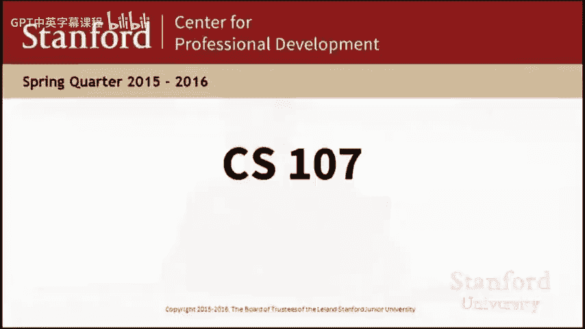
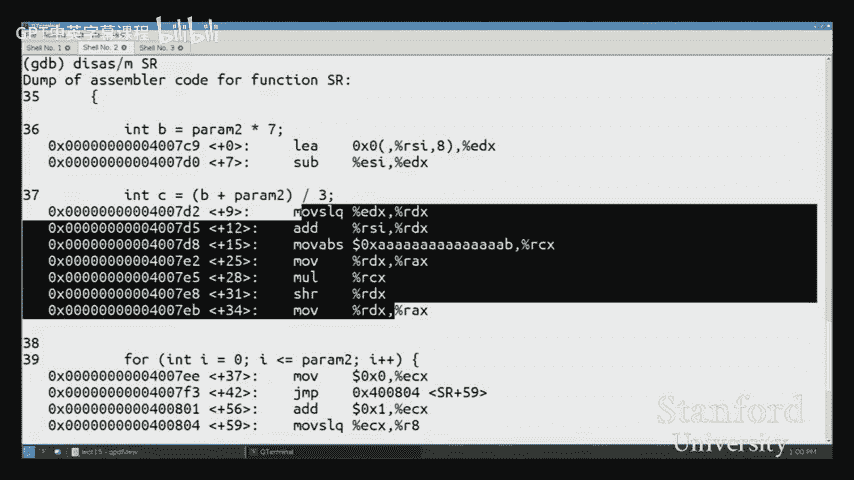
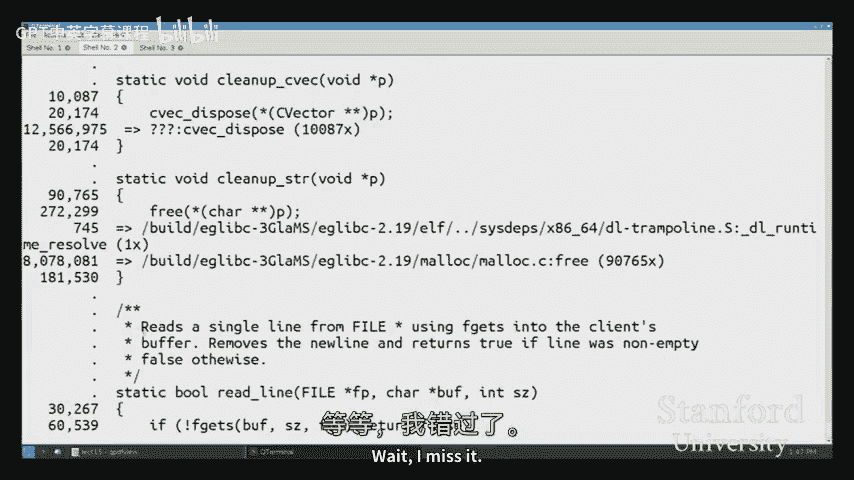

# 【计算机组织与系统 cs107 2016】斯坦福—中英字幕 p11 【Lecture 11】CS107, Computer Organization & Systems -IMDIJALdf7I- -BV1Nr421c7YB_p11-

So。It's the end of week eight here， we're rounding out the sort of。Last last few lectures here。

 got a couple of assignments and the final leftover。

 So I gave you the overview of what the roadmap for that looks like last Monday， but just kind of a。

Quick recap at that， we've got assignment six coming in over the weekend。

 and then we'll have assignment seven going out。Pretty much right after that we're trying to give you a few extra days for assignment7 since that is kind of just a little bigger project and also an opportunity for you to kind of experiment a little more。

 sort of try different different techniques so just trying to give you a good amount of time for that。

 that'll come in the last day of classes so the Wednesday， the first。Right。

And then our final is on the last day of final week， So that's Wednesday， the 8th。Okay。

So let's just get into the material today。So last time I talked to you about managing the he。

 I talked to you about just sort of the。Sort of the high level sort of design ideas behind。

Writing Malik， realic， and free today is。Going to be a completely different topic。

 but still very related， which is。😡，How for any program and that will include certainly heat allocator。

 how do we at how do we make the program run faster？So we'll be looking at the term of course。

 is optimizations， we've referred to this。Throughout the quarter already is you know in a couple of different ways and now we're going to at now we're going to look at it formally so here so here are the three kind of big picture goals for today。

 The first of them is we have to have some idea of how exactly we are we're going to quantify performance to begin with。

 and so we've certainly referred at times to optimization， we've referred to performance。 we' said。

 oh your program has to run within two or 3 x the time the solution takes has to use you know memory efficiency and so on。

But really， what does it mean to write an efficient program。

 what are the ways that we can actually measure that so that we can look at something that we've done and say。

 yes， our program got faster or no， this didn't actually help。😡。

And so then the based having gotten that understanding。

 we're going to look at kind of two broad categories of optimizations here。

 the first is what can the compiler do for us so there's a nice。😡。

Pretty broad set of things that GCC is just going to be able to help us with that we don't have to and in a lot of ways shouldn't really worry about if it's something that the compiler can get right。

 then maybe we shouldn't twist our code into some bizarre state just so that we hypothetically get that。

😡，Get the optimization from it。And then， but there is going to be a category of things that the compiler is not going to be able to help us with。

 And I want to make sure we spend a lot of time， first of all， understanding， you know， how do we。

Recognize those kinds of issues。 and then how do we find， how do we like find them in our code。

 So given just a big program， how do we know where the compiler is giving us help and where it's not。

😡，你看。So let me get into it and start talking about measuring performance。😡，So far。

 we haven't talked about performance at all really throughout 107。

 so most likely your exposure to talking about efficiency or runtime efficiency and performance of programs has been in terms of big O notation。

😡，So from 106 B X， you talked about BigO as a really convenient way to look at an algorithm。😡。

And say， sort of how。How efficient that algorithm is in terms of。How。

The performance will change as the size of the input to that algorithm grows so we're so big O is really thinking about the kind of asymptotic growth of your input like if I pass my function an array that's twice the size。

 is it going to become twice as slow or is it going to be four times slower。

 is it going to be you know。😡，Something much worse， right。

 something like exponentially slower and so on。Big O is a really nice is a nice technique because it's machine and language independent。

 so I can you know even just write some little piece of pseudocode and say， all right。

 tell me what the big O running time of program this function is going be and you don't have to ask me things like。

 well gosh what compiler are you using and what assembly language is this going to be compiled to and what are the how many registers does the machine have。

 none of those questions ever came into the picture when talking about Big O。

 which means that when we look at something like two different algorithms we're trying to compare merge sort and selection sort or insertion sort。

 well we can say， clearly merge sort is going to run faster。

 asymptonically than selection sort because。😡，Of these， you know， this sort of runtime。

 And I don't have to worry about， well what if your machine had twice as many registers。

 would it still run faster， the big O you know， the theory folks can say， yes。

 it will still run faster。 Don't worry， the big O is is is you， clearly different。And so， we can。

And so that's still going to be important， right？You know we'll see a couple of examples today with algorithms and the algorithmic efficiency of your program。

 What is the big O running time， Are you doing something in quadratic time that could be done in linear time。

 that's still going to be very， very important， but that's not the only thing That's not the only way we can talk about performance。

😡，And so the limitations of Big O。😡，That well， now we do have an understanding of what our machine is doing。

 We do know about our assembly language and。When talking about performance at this level。

 at kind of the systems level。😡，We want to be able to say。😡。

AhThis block of assembly is faster than this other block of assembly。

 even if the C code was the same。😡，And and so big is talking to be able to help us with that。

Moreover。You know， with big O， it made sense to throw away constant factors。 it made sense to say。

 yeah，2 n squared，3 n squared。 Who cares。 It's all kind of quadratic time。

 What matters is the growth。 And that's true， except。100 n squared is a lot worse than one n squared。

It really is。😊，InAnd in the case where we're looking at。

When we're thinking about optimizations at this level of like how should I change my code or how should I change？

😡，Or how should I change the assembly？We do need to start taking those constant factors into consideration。

 And when we write substantial programs， you know that need to run within milliseconds。

 if you think about like a Google search engine kind of program that really does have to complete in a very small amount of。

😡，Real time。They can't just say， oh， it's， it's， you know， it's O of N。 that's good enough。

 That's not really going to work。So what are the alternatives？Right right， so。

Let's you know so here are a couple alternatives I'll sort of talk through them one a sort of obvious alternative is just to take out our stopwatch and just kind of go right like I push start when I hit enter on my keyboard and then when the program stops。

 I look at the time and I use that。😡，In a lot of ways。

 that's often what we actually want to get at right So if we think about response times for something like a web page or a server。

😡，Often what we're eventually trying to get at is wall clock time。

 If I have to wait 10 seconds for a web page to load as a user， I'm not going to。

 I'm going to go to a different web page and so。😡，To that extent。

L clock time may be the right metric for that kind of thing， but。

The problem with just using our stopwatch is that。It's， is that。Clock time is going to be pretty。

 pretty high variance。 In particular， it'll depend on things like。

Whether other people are using the same machine， so if 10 people are using this one machine and that machine only has one core。

 then everybody's program is going to get 10 times slower。

 but that shouldn't count against the program， we shouldn't take that。

 We don't want to take that into consideration when thinking about whether our program is whether we're doing well or not with the optimization。

😡，So maybe we might say， okay， well here's an alternative we now know about assembly and we know that assembly instructions are what's actually executing on the machine。

 so let's consider just measuring the number of instructions that execute for our program right so every time I execute another line of assembly。

 I'll just count that as one and then when my program finishes。

 I'll say yeah the program ran a million instructions， this other program ran 100。

000 instructions so we can say that program B was 10 times faster than program A。😡。

The problem with that and we'll start to see an example of this is that even though up until now。

 we've kind of pretended that every instruction takes the same amount of time。

 that's actually not true。😡，So what we're actually going to do， I'm just kind trying。

 I want to introduce this metric as one that we'll be using throughout today。😡，Well。

 we're actually going to one really nice strategy that we can use is。

That so all of our processors have the notion of a cycle。

And so we can think of this cycle as sort of the smallest unit of。😡。

The smallest unit that can be executed on the processor in one step we can think of。 So if you。

 if you， you know， were to go out and buy a computer and。You know， somebody told you， oh yeah。

 this computer is really great because it has a three gigahHtz processor。

 what we're actually saying there is that in one second that computer could execute 3 billion cycles。

Now， that's not to say that it could execute 3 billion instructions。

 but if the instructions were really simple， like for example， a could execute probably in one cycle。

 like just adding a register a number to a register， then。😡，You know， then then that's then then yes。

 it would be able to execute 3 billion of those， but then other instructions that would be more expensive。

 it will not be able to。 So this but this unit will allow us to kind of specify。

A metric for understanding the performance。Of our our program that is that it is dependent on our machine right so we couldn't say that well my computer has a  three gigHtz processor。

 therefore it's going to be three times faster than my phone which has a1 gigHtz processor。

 that is not an accurate comparison。😡，Oops， but。When呢。

But when actually thinking about the when trying to think about looking at assembly。

 when trying to look at a particular program， we we can use the number of cycles as a metric for。

As as as one of the metrics。And I'll show you all of these when we get into it。

 I just want to introduce some terms to you ideas of what a cycle is and so on。Alright。

So let me actually just switch over。 I'm going to do a lot of stuff in code today。

 but so let me just switch over right now and just kind of。Start talking through a couple of。

A couple of pieces of code。 and how。And what our general methodology is going to be like our process for the day。

So I'll pull up demo do see and so the plan is that I've got a couple of different at least for the first part of the lecture。

 I've got a few different sort of small code snippets for showing different kinds of optimizations。

 different kinds of things that maybe the compiler can and sometimes cannot do。😡，And I will。

I want to run each of these optimization， each of these programs。

 And then I want to ask the processors。 So in terms of actually using these performance metrics。

 right， So wall clock time， Okay， I could just pull out a stopwatch and just watch the time。

 But so what do we actually do， How do we know how many cycles were executed for a particular。

function。 Well， we kind of have to ask the processor that， right， Only really。

 the processor knows like， oh， yeah， I spent 100 cycles on this or 300 on that。 And so fortunately。

 there's a nice little set of functions that we can use to。😊，To do that， to do that measurement。

 So our plan is going to be to run one of these functions。 We have to run it a few times。

 I'll just show you the， the broad kind of loop really quickly here。But the general structure。

 I'll just pick one of these doesn't matter。 The general structure is， will we need to run this。

 you know， just to decrease the variance， we'll run。This function a few times。

 and then we'll ask the processor how many cycles that total run took。😡。

That's kind of with these starting count get counter。

 and then we'll try to kind of average out and say， all right。

 for one of the trials for one run of this function， how many cycles was that？Okay。

So let me get into some of these optimizations。😡，So the first part of the lecture is going to be about what the compiler is able to do。

 so we're going。We're going to start this conversation with。

 you optimizations actually that we've already seen kind of throughout the quarter so for。

Throughout the quarter we've been running。We've been running the all of our compilations with a flag minus O G。

 Maybe I'll pull up the slide for the the list of flags here。

 So here's a list of the compiler optimization flags that we could use So 00。

 which we've been avoiding because it generates a lot of messy assembly is actually telling the compiler。

 know， don't do anything， don't do any optimizations。

 But because that ends up with kind of messy assembly。 we skip that level and。

For this entire quarter we've been running at OG and what OG says is let's go ahead and let the compiler do some stuff and we'll see the extent to which it will really do stuff。

 to the extent to which it will optimize。😡，But don't mess with our debugging too much。😡。

So what this means is it's not just going to like throw out our function entirely in the interest of optimizations。

 so。So we can still kind of use GDP。 We can still kind of look at local variables and stuff like that。

 but get a little bit of cleaner assembly and。Just sort of better performance out of that。

 And then there are levels kind of beyond that for like， no， no， I really want you to just go all in。

 right， Like， give me everything， every kind of performance optimization you could come up with。

 which。I should note。They don't always help right like are all these optimizations are going to be based on heuristics and one of the first things we want to look at is going to be what can the compiler do and what can it figure out from our code。

😡，And like， what is it allowed。To do。😡，So a lot of the kind of playing with flags is going to be trying different levels and seeing how well it works out。

😡，So let me just jump into the first example here。 So the first set of things are actually going to be optimizations that we've already the compilers already been doing for us。

 So let me show you this first block of code right here we've got a block of code that's based on a parameter。

😡，But you'll notice that the vast majority of the code in this function is just a constant， right。

 So a is a constant。 A times size of A RR is also a constant。

The square root of  two is actually also a constant。😡，Yes， it's calling the square root function。

 but the compiler knows what square root does， it's part of the math library。😡。

And so the only thing in this function that really depends on the parameter is this piece。😡，Right。

Everything else about this function is a constant。So what can the compiler do to this？To this code。

And so。Rather than run it， actually， I'm I'm just going to show you the disassembly because I think that's more。

Meaningful， so I'll just go into G， and I'll disassemble this function。

And we can actually see so this is at OG， so I should say I have not actually turned on any additional optimization flags。

 I'm just using the flags that we have been using throughout the quarter， and even at that level。

 the compilers already said look I got constantsons， Cons are fine。😡，And so what did it do， Well。

 it does the one piece that does depend on the parameter。

 This is a slightly awkward kind of three argument version of multiply。 But nevertheless， it says。

 all right， the one piece that depended on the parameter。

Was taking parameterm and multiplying it by a， which had already kind of filled in with the 107。

0 x 107。 And then it took all of this other stuff。Ander said， yeah， that is equal to this， I'm done。

😡，Meat。So this is an optimization called constant folding。😊。

And that's what idea is we have a bunch of constants and it will just kind of combine them all together and do this all at compile time so that now our assembly。

 right？😊，Is pretty much。It's just going to execute these three instructions。

 I could show you how well it。Performs， if you want， I could run demo。 and I'll just pass it Cf。

 And we can see that。You knowOkay， it's like 11 cycles， there's a little bit of this。11 cycles。

 This is already suggesting that maybe， you know， one of these instructions might not be as cheap as some of the other ones。

 So maybe the eye mole is taking up a few more cycles than than we might have otherwise wanted。

 but that so that's。Something to keep in mind， but。But in general。

 that's certainly going to be a lot faster than if I actually had to call Stirland and do the division and so on。

小是谁。QuestionYep how does the compiler。to call Sterland。

If that's a library function and we haven't double awake。Oh， that's a great question。

 So how come So the compiler。 So I called Sterline here and you're basically saying， well。

 how does it know what that's that that's okay， right？

 So this is kind of getting into that question of like， okay。

 so what is the compiler really allowed to do， Is it really allowed to us like。😊。

Why is it allowed to make the Stlin disappear， despite the fact that we haven't linked with Lib C you're absolutely right。

 like StL has not come in yet。😡，And the same really applies to square root， in fact。

 there's kind of something really weird going on which is that square root isn't even linked by default right so really does it actually get to kind of do this？

😡，And。So as it turns out， there's。The rule with the C language。Sort of is that。

Like the C language specified all of these library functions。 Its specified square root。

 It specified Sterlin。And so。And so the compiler gets to assume that Sterlin does exactly what it thinks it does。

😡，And it gets to assume that square root does exactly what it thinks it does。 and so in this case。

 it's basically preempting the library entirely， it's preempting just even before before linking right before anything happens with the library。

 it's just the compiler is just going to say， I know what Sterlin does because it's a library function that we all agree does this one thing which is take the length of a string。

😡，So if you ask me to take Stlin of the string hello。

 I know that any rational Stlin implementation is going to return five。😡，Right。

So it gets to make that assumption if we called some other function。

Then it wouldn't be able to quite do that。Question， so about kind of compound before linking。

 does that mean like in this example， wouldn't necessarily have to link with like L M。 Yeah。

 so so the question So question is， in this case， does that mean we don't actually have to link with L M。

 Yeah， I actually can't。 I think I turned it on anyway。 But I can't actually remember。

 we can look at the N M to see if it comes out。 I don't think it will。

 So let's run N M on demo dot O。And yeah， we can actually see that there's no screw root in there。

Right， so sure enough， we would not have to link。 I could just build it， right， And now demo do， oh。

 so I'm just gonna try to link this thing。Yeah oh。Oh， right， right。 Sorry。

 I got a link with the left like。There we go。 Yeah， so I do not need to put L M。 You're right。

Because it just made it go away。Yep。Just like clarify what a cycle represented like。

What that length of time is determined by So the question is， what exactly does the cycle represent。

Every processor is sort of， I guess like at the hardware level。

 the processor has this kind of like a clock that's going to。😡。

Like the processor can do a certain amount of work in one step。And the processors kind of。😡，know。

 kind of like the running of the processor is regulated by a clock。

 which is why we say that my processor， let's say has a you know。

 two gigahertz processor so that we're saying that the clock kind of ticks you know 2 billion times every second。

😡，And so within that one。Cycle， right， within that one tick of of time。

 there's a certain amount that the processor can do。

 and the amount depends on from one processor to another。

But we can think of it as for a given machine， it's sort of the smallest amount of work that machine can do in one in one1 step。

 And so when I， so we're mostly going use it kind of as a relative metric， right。

 Like we're not gonna go and say， oh， this thing right in 11 cycles。 And that means that， you know。

 like in some absolute sense that this is good or bad。 But when comparing。

Programs on the same machine。 We can use this as kind of a relative metric for how much processor or time we used up。

Anything else。Cool。So another example of this is an example of the kind of optimization that the compiler just gets to do based on the compiler knows the language。

 the compiler knows constant values and knows how to do math。😡，In some kind of broad sense。

 you might say， yeah okay， this seems reasonable right。

 like I wrote some code out that you know maybe I wrote it like this because I thought it was easier to read than just putting some big constant in there。

😡，But the compiler was able to say， yeah， well， this if I just。

Compute all of these values ahead of time。😡，Then I will produce an equivalent piece of code。😡，Right。

 and so hopefully this kind of encourages you in a sense that， well。

 it's okay to write code that might look inefficient or might look like it's going to require a lot of computation。

 You might look at this block of code and say， gosh。

 that seems like it's going to take a long time to run。

 So maybe I should do the math ahead of time and。😡，You know， not write it into my code。😡。

We don't have to worry about that if this was， for some reason。

 the most logical way to write your program， then you should just write it that way because the compiler will get it right。

 The compiler will clean it up for you。😡，Right。So yeah here's another example of that where。

So this is called common sub expressionion elimination。 The idea is， you'll notice that we've got。

This value， this parameter 2 plus 107， is going to be used kind of all over the place in our code。😡。

And so。There's nothing about the language that says that the compiler really needs to recalculate this every time。

 what benefit is there to recalculating this if the value is never going to change。

 nothing changes per Ram2 it's a local variable， so why would it ever change。😡。

So it would be reasonable for the compiler to just not recalculate。 So we can look at the assembator。

Here。And sure enough， it calculates。Or it does the 107 plus per Ram2 right there。

And then it never uses the value 1 of 7 ever again。 It's just going to keep recycling that。

 It also actually， in fact， noticed that we don't even use PRm 2 after that。

 so it can just reuse that register。 So even more fancy。Right。So where's the good。Okay。

 one last kind of。Little， well， okay， so let me actually do， oops， I think some of these are。嗯。Yeah。

So one。Let me switch over。 So here's here's some stuff。 So here's another。

Another kind of optimization。😡，That， you know， we can kind of look at as so this is going to be where。

 So we were talking about what I said sort that some instructions don't actually。

AAre not the same not all instructions are the same cost， right that。

 And I alluded to multiply and by extension， divide are actually both fairly expensive instructions。

 So let me kind of show you。Let me show you this function。

 I going to use dis assemble with the C code to kind of show you what this looks like。😡。

So I can kind of scroll up a little bit。And so we can kind of see here。

 so I'm trying to do a multiply by7， and we can see that the compiler really didn't want to do that。

😡，It said， no， I don't really want to use an imMMole because imMMo is more expensive。😡。

And so as long as I can produce the same result， I'm just going to make a change。

 so here's what I'm going to do I to do I'm going to multiply the number by8 instead using this fancy LEA thing。

😡，And then I'm going to subtract。One copy from it。 And so that's the equivalent to multiplying by 7。

Right。And then this one is even more interesting when I do this divide。You'd think， okay， well。

 surely like some amount of， you know just calling a divide wouldn't be a big deal， right。

 but divide is actually going to be one of our the most expensive instructions。 and so it。

I'm not actually going to go into exactly how this got calculated。

 but what it basically did is it multiplied by the reciprocal instead。

 So it's doing this really fancy thing where it's going to say， well， actually。

 what I can do is I can。😊，Sort of do this binary multiply by one third。😡。

And that's going to be as good as dividing by three。😊。

And despite the fact that there are clearly way more instructions here than if I just call div。

This is apparently going to be faster。😡。

Right。So that's， so these are some examples of the things that the compiler will just do。 And it's。

 and as far as we're concerned， given that we're always running at O G。

 these are things that the compiler is just doing unconditionally。 Like， yeah， I'm gonna。

 I'm gonna generate， you know， I'm gonna generate this multiply by one third instead of this divide by three because。

I know that it's faster， I know that the three is a constant， and I'm good with that。😡。

How exactly does the compiler do like divide and multip is now just breaking it down into those steps that we're seeing here。

 like does it have like a separate process for like dividing and multiplying？

Like wouldn't it still just be able to add and subtract things and make things？

So there there are two， there are two。 keep in mind that what we're seeing here is the assembly that the compiler generated。

 This is the code that will be run when I， you know， run the program。

 There is kind of another step right， where the compiler。

WhereDuring the compilation where the compiler is just looking at our code and trying to figure out kind of what it does。

 and during that step， that step is all written in C。😡，So in that case。

 anything that the compiler could do up front。😡，You know。

 could kind of get offloaded into into the compilation step where that C code is just kind of gonna do it and how does the C code do it well。

 I mean， that C code itself got compiled to assembly and that will run too but but you know。

 it can use kind of the normal， I can just it can do multi and divides and shift and whole， right。😡。

Yeah， so when a program finished bug and it's like kind of ready for say like open use something and would you always want to use the maximum level of optimization to make sure everyone。

Yeah， so the question is so once the program is， you know once we're happy with it。

 wouldn't we want to use just a really high level of optimization generally yes。

 and then that's so but the question is like so and we'll start seeing maybe we'll see an example of this today not exactly I don't know if I can get quite one to work。

 but as we go the problem is as you go up higher and higher levels of optimization。

 optimization is not kind of a like flip a switch and everything works kind of process and especially like so O2 for example。

 which is sort of the standard level of optimization that our compiler can use that。

That's pretty safe and it's probably going to help。

But if you start just like oh I'm going to go 03 or 04， see what happens。

 there's actually a risk that the higher levels of optimization because the compiler is really just kind of basing everything on heuristics at the end of the day it doesn't really know what your program is doing so it can't say with certainty that doing one thing versus another will absolutely make your program run faster in all cases so as we go up higher and higher levels of optimization。

 we're starting to get into more experimental areas where the optimization might actually hurt you。😡。

Which is why， I mean， yes， like if our goal were to have our program run run as fast as it can。

 which seems like a reasonable goal， that we would want to start kind of playing with different optimization levels and different techniques to see if we can kind of get there。

 but it's not going to be as simple as just you know set the flag and walk away。😡，哎。Anything else。So。

Here， I kind of wanted to just show you with this block of assembly， and it is kind of reordering it。

 I think， but that's okay。😡，I want to show you that with this block of assembly here down here。

 the C code here， and we've got a four loop that's going through and calculating i times 107 and whatnot。

😡，inside this loop， in this case， the compiler decided it did not want to mess with our loop。😡。

And so。You know， for better or worse， right this is not， this is probably because。😡。

When we asked it to optimize， but to keep kind of our debugging。Ability intact。

 one of the really useful pieces of， you know that we would care about when debugging is that we kind of want our four loops to stay for loops。

 We kind of want to be able to look at the value of I。😡，For example， we kind of want to， you know。

So if the compiler got a little too aggressive here。

 it could you know kind of start just making this all。😡。

It could make our lives as for debugging a little bit harder。So let me show you。

 let me actually just， let me run that one and show you what kind of happens here。

 So I'm going to run this on。 So this is the so strength reduction。 There's a comment in the。

The text， but strength reduction refers to choosing instructions that are faster than others so here。

We've got， you know so we see that if I run the code that I was showing you up here。

 we're taking 65 cycles。I've got another version of the code。😡，Which I've compiled O2。

So this version has been compiled with a more aggressive optimization。

 Let's see how long it takes to run the same function。 Well look at that。😊，Right， so we get。

 we get a 8 x speed up just like that。 right， Hey， cool， right， only we're always that easy。

Let's see what it actually decided to do to our code。😡，So it's disassemble。Sar。

And so we can kind of see， I guess I can try that the slash M thing。 Actually。

 I haven't even know this。 Let's see how the slash M comes out because so now， O。

 so you can kind of see where the。😊，All right， so that return is okay。It's。You know。

 maybe up front kind of like I will So as we get kind of deeper and deeper into like more and more optimizations。

 we're gonna start getting kind of really wacky some slightly potentially weird distractions like。

 wow， okay， yeah， that kind of kind of。That sort of picked up pretty quickly there。

 the one thing to notice about the disassembly here， there's no multiply。

 despite the fact that the compiler has claimed that these five lines somehow correspond with this line。

Right， so you can see that kind of， you know， our ability to debug this code kind of went down。

 went downhill a little bit。 We can't really look at I and understand like what exactly it's doing。

 I can tell you that what this code is actually doing is instead of tracking I what the compiler got to do is it basically says。

 all right。 Well， you're going from I equals 0 less than or equal to。To PR2。

 So what I'm actually going to do is I'm just going to make another variable。

 and that variable is just going to count up by 107 every time。😡。

So instead of taking 0 x 107 times I， I'm just going to take this other variable and I'm just going to keep adding 0x 107 to it。

 adss are easy， multiplies are hard， so as long as I add once every time I go through this loop，😡。

Thats it's going to work。And you know this is maybe where we start kind of getting into this space of thinking wow。

 really is the compiler allowed to do that， like it's allowed to just introduce some new local variables and it's allowed to like just kind of you know structure our code around a little and the reality is。

😡，Who's noticing？And this is kind of going to be a pretty big systems principle。

 if you continue in like 110 and 140 and things like that。

 we're just going to see this come back over and over again。😡，If no one can tell what's going on。

If no one's looking and sort of debuggs don't count in this sense， if no one's looking at our code。

 our code gets to do kind of whatever it wants。😡，And so。

The compiler does not have to worry about us going in in GDP and like poking around at values for I and things like that。

 it gets to just say， yeah， this is going to be faster。

 no one should be looking at what's happening inside this function as long as the function produces the same result。

😡，We're all cool。I'm allowed to do this。😡，Let me show you an even more extreme example of that。😡。

Actually， it doesn't look like it's going to fit totally， so let me pull up the code over here。

Over here， I have。Examples of。You know， so so。Here， for example， this if statement。

 right if PRm1 is less than PRm2 and it's greater than PRm2 and one is greater than PRm2。

 clearly that's never going to happen。😡，Right， and then here I've got this weird for loop here where you know。

 maybe I thought， oh， I just want to sit here and spin for a little while。 You know。

 like let me just kind of just。Burn up some time and whatever。And here you know， okay， well。

 you'll notice， what is this if else really doing？😡，In both cases。

 the result is going to be the same， it's just going to incr per1。😡。

And then here's the last one where I've got， if the PR1 is equal to 0， I can return 0。

 if it's not equal to0， I'll return PR 1。And so these are all cases where you might think， well。

 okay， I wrote the code this way。What could the compiler really do。

 and we saw at OG that it really wanted to keep our control structures the same。😡。

I will show you the one for O G for for this function， but。Nowhere in the contract with the compiler。

 does it say that it needs to keep all of our control structures。

 it doesn't say that when I write an ifF statement。

 it has to generate a ifF statement and when I write a for loop， it has to generate a for loop。😡。

So let's look at the disassembly。4 DCC。All look at that。That's it， there's no loop。

 there's no if statement， there's no compare， there's nothing。😡，So what did we lose， Well， okay。

 I can do， I could try that disassemble slash M。 I doubt this is gonna come out very well。

 So here we can already see like， you know， debugging is kind of a mess， right。

 It basically looks like it skipped this entire block， which it did。嗯。And so。You know。

 it the compiler gets to just say， oh， like this block of code never going to happen。

 If I know it's never going to happen。😡，I get to assume that you're not in a debugger and you're not staring at the assembly and kind of trying to follow the code as I'm going through it。

😡，I get to just say， yeah， this is never going to happen， so I'm just going to get rid of it。

 I'm just not going to do it。This for loop that doesn't do anything。

 That has no effect on the observable output， right， So if we kind of just back up and go sort of。😡。

The first step of really thinking about optimization is what exactly does this function do。

 What output does it create？ Well， this print isn't going to happen， So that's not happening。

 This doesn't have an effect on the output。😡，This line will increment the ultimate return value by one。

😡，But in the end。This function really does just return parameter 1 plus1， right？😡，And so， hey。

 I'm just going to do that。And that， yeah， that's a weird thing。啊。It's doing so。

So there you have it right and sometimes it can be pretty surprising that it's even allowed to do that。

Right。考试7 far。Yeah questionYeahep。If we were using this code to like。

Power a device or something where delays actually do matter。Like， how would that work， Yeah。

 So the question is like， well， hey， like what if I actually had a situation where delay mattered right So like if I actually cared about looping around for a while。

 then this is a case where maybe I would have to not comp with optimizations。

Or I would have to find some other function that allowed me to delay my program in a more useful way than。

Like so so you could sort of mark this function as please don't touch this function。

 I really do care about timing。 This actually does come up in sort of security contexts。

 So there are situations where depending on how quickly your program runs a hacker might be able to figure out what code path it took and things like that so in cases where timing matters。

 Yeah， like we do actually need to get the optimizer to stop screwing with our code and let us actually you know write let it and force it to actually generate code that does exactly the sequence of operations that we need in the absolute worst case。

 we could write the assembly ourselves there's probably a better way like turning off optimizations for that file。

But yeah， those are absolutely considerations we need to make here。Okay， other questions。Okay。

So last example in the way of sort of compiler related optimizations。😡。

That I I want to do is so here I'm actually just I'm not going to do the assembly I'm going just going to run demo and what we're going to do here is it's going to just be what we're doing is it's your standard factorial let me you know so this is your standard factorial I have it written in two different ways I've got it written recursively and I've got it written iteratively。

😡，Right， and so， I think you already saw this example in lab。

 but let's kind of now we can really talk about sort of the optimizations that are happening behind the scenes here。

So run Im want to call it the non optimized one， but we already saw that it is kind of optimizing。😡。

And we can see that there's actually a pretty substantial difference between the recursive version and the iterative one。

That the recursion is taking substantially longer， it's taking about 3 x longer than the iterative version。

And overall， both are， both are taking a good amount。 I think I did factorial of like。

A few thousand or something， something really large， right。

So what could the optimizer really do here？😡，You know， like， what can I do to our recursion？

Well it turns out it can do a lot to our recursion。

 And what we end up with is not only did it just make this thing run an order of magnitude faster。

But it actually was also able to take our recursion and get rid of the overhead of the recursion。

Spoilers， it did that by just。Getting rid of the recursion。

Right so really to just turn and like you can look at the assembly。

 I think we already had this as a lab exercise， but you could go and disassemble this if you'd like。

 but really，😡，Even things like function calls。Right。

 the contract with the compiler does not say that it has to call the function because I wrote the function recursively。

 And if the compiler is able to see a way to make this thing happen in a。

In a kind of just a purely iterative manner， it'll do that。And。And so。Sort of realizing。

 you taking a step back when your code kind of suddenly changes in substantial ways and saying， okay。

 like why was the optimizer able to do that， What impact you did writing the code recursively versus iteratively have on the functionality of my program。

 what impact did it have on the output， well， if the answer is kind of nothing if it didn't if it doesn't change the output。

 the compiler gets to just make those changes and does not have to adhere to your control structures to your function calls to any of that。

😡，Okay。😊，Cautionions about。Re peace。入唔食啊。So maybe at this point， you're thinking， oh， sweet。

 like compiler just did everything， right， It just gave me like a 20 x speed up on this like really simple factorial function。

 Like who even knows what it did there。 It doesn't matter。 I can just turn on the O O2 flag。

 And my codes just gonna run faster。😊，And that's。You know， maybe a takeaway is hey。

 don't reinvent the wheel right if theres if somebody already wrote a really sweet optimization。

 then yeah you should write your code in the most sort of straightforward way if factorial makes sense recursively。

 you know if you're going to write quick sort or whatever binary search in a recursive recursive structure because that just is cleaner。

 then you can do that and you can trust the compiler to get to get the code to run quickly。😡。

You know， kind of for you。But there are going to be a couple things。

 certainly that we need to know about。That we can do that our compiler。

I not going to be able to help us with。So let me show you a couple of examples of that。

For the first example here you can see the kind of So this is sort of a stir to lower kind of function。

 right， So maybe something you would have needed in assignment ， where here one version。

 you can see I， I've got the usual for indi equals 0 less than St length I plus plus thing。

 And then down here， I've got another version where I've got the length just pulled out right。

 So I've computed the length ahead of time。 and I'm I'm just gonna run the four loop run the for loop through。

😊，呀。So we might say， you know， well， let's see if the compiler can help us out here。

So I'm going to use， I'm going to run demo2。 I'm going to run it on St lower。And we can see that。

 okay， well there。There was a huge difference right between calculating the St lens ahead of time in this case。

 and having the St lens calculated every time through the loop。😡，And like， you know。

 that difference kind of makes sense， right， So how does Stlin work， Well。

 Stlin needs to walk down the string and find the backlash 0。 So if I've got。

 if I'm going to do that every iteration through my loop。

Then I've actually turned what looks like an O of n loop into actually an O of n squared loop。

 because this operation in itself is O of N。😡，And so maybe we might think， oh， well。

 wouldn't it be nice if the optimizer could just get that right？😡，So that we don't have to do this。

Well， it suddenly helped。In terms of just cutting down all of the kind just a little excess overhead。

 but it was not actually able to do this。😡，And so why not？Well， the problem is， I mean。

 so it's going to depend a lot on you know， the kind of。

Different assumptions that the compiler gets to make and whatnot， but in this case。

 the compiler was not certain。That too lower wouldn't accidentally put a null terminator in our string somewhere。

 Now， we happen to know just looking at the code。 you know，  clearly。

 it's not converting a character to lowercase is not suddenly going to turn it into a null terminator。

 That would be problematic， but。The compiler didn't know that。And so this is a case where we could。

 as a programmer， could just say， all right， well。😡，You know。

 my code is running maybe a little slower。 This， This function looks like it's running。You know。

 n squared versus n， I could maybe figure that out as a potential bottleneck。

 some of you might have run this for assignment1 right and a very simple operation like this。嗯。

Is actually a very simple operation like this would actually just make your code run run way faster and probably and in this case。

 not really compromise sort of the clarity of our code。And I should say that， you know we could。

Imagine trying to get rid of this Sterlin call as well， but that's not going to help。

 And so I'd encourage you to try that right you could try getting rid of this Sterline and rewriting this in a way that doesn't call Sterlin at all。

 but at this point we're basically looking at an ON operation anyway。

 and I assure you the difference the difference there is pretty minimal。

 So it's not to say you should write， you know it's not to say that you should be really worried about this right one of the big。

😡，One of the big temptations when it comes to optimization is to get really like。

Prematurely worried about this kind of problem and say， oh， well， anytime I call Stline。

 I better just cache it in a variable， I better pass it as a parameter。😡。

That's not really the right strategy here。😡，Right， we want to。

Perform optimizations with a good understanding of what they're actually going to do for us。

And the truth is the compiler is going to be pretty good for a lot of different things。

And so we should pretty much always start by writing something in the most straightforward way possible。

 And then if it comes down to something that。You know。

 that that the compiler didn't catch and our program is slowing down for that。

 And I'll show you how to measure that in a moment。 Then we can。

 then we can start talking about these optimizations。你看。Questions。

N squared when you have Sterling in the。Why exactly would that be n squared。

't it just calculate like wouldn't it just do like2 n？So this is 2N， right you see down here。

 this one would be 2N。In a sense that I'm calculating the length ahead of time。 So that's an ON。

and then this one is just going to run through in OV。😡，The problem is。

 if we recalculate the St end every time I go through the loop。Then that recalculation itself。

 that calculation itself is linear。😡，So then you can think of every time I go through one iteration of this loop。

 I'm doing another O of n thing to calculate the length of the string。😡，And thus I end up squared。

Anying else。So。So I guess another example I want to show you is。

This is an example actually of the opposite thing， which is。😡，That， as it turns out。

There are cases when writing the code the obvious straightforward way is actually going to help you。

So here are two different functions。 These may very well be functions that I don't know。

 might show up in something like a heat allocator kind of design， but who knows。

And you can see that one strategy that you might think is， well gosh， I need to optimize my code。

 I need to make sure that， you know and the way I'm going to optimize my code is I don't know。

 like Michael told me division was expensive right so I don't want to do that here。

 I'm just gonna I'm going to write it out as this big block of if statements。😡。

And I'm just going to hard code all these numbers and we're not even to worry about the fact that like I hope I got all the numbers right。

 who even， yeah， whatever， but and I'm just going to write that out。

 And that' and that's gonna to be faster， right。And then you know。

 and then so then here's the other version， right， which would and both of these things do kind of the same。

 the same thing。嗯。And so all right， let me run this。啊。Let's do， I think I can't what call it song。

So here we can see， OK， well in the unopimized version， there's a pretty big difference。😡。

So the if statements。😊，They're slower， right， Okay， so you might think， all right。 well， well。

 they're slower。 shoot。 Well， whatever。 it's okay。 It was， I didn't mind copy pasting 10 times。

 whatever。 Maybe the compiler is just gonna get it right。 So hopefully。

's let's count on the compiler。 like， well， it didn't。😊，And so。Kind of takeaway lesson here。

Is really that。You know， sort of。We don't want to。We don't want to sort it like for one thing， you。

 maybe sort of the kind of mechanical takeaway is that if statements are actually pretty expensive，😡。

And so compared to， I mean， even this divide， I assure you the compiler was able to turn that into a rightshift。

 right， no problem there。 But if payments are actually pretty expensive。 And so for one thing。

 if you can write your function more compactly， not only is this easier to read and easier to understand。

 it's also a lot faster and this speed up is not something that the compiler is going give is going to be able to just give you with optimization。

哎。So。Maybe you think that this piece doesn't， you know， oh。

 well maybe maybe the if statements just don't matter or maybe you thought this was actually going to be faster。

 but one way or another， it actually is much worse。 It's about an order of magnitude slower。

 And if that order of magnitude is happening a million times， then that's。😡，You know。

10 million cycles instead of a million。 And that's kind of a bit of a problem or whatever， right。哎。

So kind of broadly kind of speaking， right， high level points。

 the compiler isn't really going to be able to optimize away things that it can't quite。😡。

That it's not quite able to reason about all the way through。

 So in the case of something like the Stlin， it wasn't able to really be confident that the Sterlin wasn't changing from iteration iteration。

 And so it couldn't really， so it couldn't optimize that。 And then in this case。

 there's just kind of too much going on there。 right， General。

 the compiler is going to be much better at optimizing small compact functions， you know。

 kind of cleanly written normal looking things than it is going to be able to optimize these really。

😡，You know， hard coded kind of messy things， even if there is actually a good pattern。

 it's not going to be very good at just straight up deducing a pattern out of， for example。

 a block of those statements。Okay。And then the other thing， the sort of。

Last thing I want to show you here， the other thing the compiler is not going to be able to do。

 and maybe this is kind of just a flashback to our discussion of Big O。

 the compiler is not going to be able to solve our algorithmic problems。😡。

So if I write a selection sort。😡，Algorithm。Versus the compilers are to be able to look at that and be like。

 you know， actually， I think you just wanted to sort the array。 So how would I call Q sort for you。😡。

站起来。So I can run sorts。And we can see that so between calling Q sort and calling selection sort。😊。

Right， so we can kind of see， it's kind of neat。 right you can actually see the n squared and n log N differential here。

 right， This one is not really increasing by。So that's about a 2X jump right so it's a little bit over a little bit more than linear。

 whereas over here we're seeing a very clear quadratic jump。嗯。

And the optimizer is going to do nothing， basically。In fact， it actually it looks like it got slower。

 which is a little interesting。 That's partly maybe a little bit in the noise。

 maybe a little bit just kind of。Varance but also potentially just kind of。

The extra instructions is right， this didn't help。You'll notice that。

QuickSot didn't actually get any faster。 Why not， right， You might say think， oh。

 well shouldn't O2 be able to help quick sort。Well， this was actually a call to Quick sort， right。

 Quickss in a library function in a library， and the library is already optimized。😊，So。

So you don't have to worry about， you know， so for example， if you're deciding between， hey。

 should I call the C library or should I just write my own for loop？😡。

Right calling the library gives you not only the benefit of not having to worry whether your code is correct。

 but also it means that you're just getting the optimizations pretty much for free because the library is always going to be written and compiled with optimizations and so we're already getting all those benefits from QuickSot。

 even when we didn't optimize our own code。😡，In this case。Yeah。

So that's the kind of big picture thing I want to show you with the just like the different kinds of optimizations and the ways to reason about them during La。

 I'll show you few， know， you'll see a few other things that the optimizer can can do and what it can do for the remainder of the time。

 I want to show you how we can actually。Rea how we can measure performance in a you know so obviously all of these examples have been constructed in this way that allow me to show you the number of cycles for this particular function and that's really nice for just showing you whether optimizations are working and what changes are happening but you can imagine like walking into if you have a big piece of code and someone hands it to you and says optimize it which which happens。

 what do you do what is your strategy what is like do you start throwing cycle counts everywhere and seeing what the numbers come out to Well there's an easier way than that。

😡，And so。I want to show you that。 I'm actually gonna to use a。They' everywhere here。ok。

And so I'll show it to you on the Sos program first。

 and then I'll show you a bigger example just to kind of see how it all comes together。😡。

What we can do is we can use Valalgriide， but we're not going to use Valalgrind for memory checking。

 We're going to use Valelgri。 We're going to use the special tool called a different tool for Valgri called callgrind。

And so what we're going to do is。😡，And this is generally the idea with optimization， right。

 We do not want to just guess。 We do not want to look at our code and be like。

 I wonder if I should move that Sterlin out of the loop。 Oh， I wonder if I should turn this。

 you know， this if statement into this arithmetic。 That's you're gonna to go down。

 You can just go forever and ever just trying to make changes。 And I assure you。

 most of them will just do nothing。 You will see almost no impact on a vast majority of the changes that you make because it's all kind of in the noise。

 What we really want to be doing is we want to be thinking about like what parts of our code are actually taking up a significant amount of time。

Like that you know， we want that information so that we can concentrate our attention on that。

 and so a program like Callgriind is going to allow us to do this。😡。

So I want to run call grind on sorts。 I'm not even run it on the optimized version。

 It doesn't really matter。 And I'll run it。 I'll constrain it a little bit to how much it runs because it does take a little bit longer if I don't。

So I'm going to run this tool called Calgrind on sorts of 1000。

 And then now I'm going to use this command， callgri annotate。 This will all be in docs and stuff。

 So don't worry about rapidly stripribbling down these commands。 But and so actually here。

 let me show you what the output was。 So what happens was what this tool does is it's called a profiler。

 And what it's going to do is it's going to run our program in kind of a simulated environment。

 and it's going to write down kind of every instruction that it got executed。

 And it's going to store the result into this。File， and the number at the end will change every time。

So then I can run Calg annotate。Pass this flag auto equals yes， on that file。

 I'll pass it through the more command so it doesn't scroll off the end of my screen。

And so we can start to see a couple things。 when we skip the first header here。 Oh， it's yeah。

 it's gonna。All right， well， it'll be okay。And so we can。The lines got are a little long。

 which is unfortunate。 But we can see。 So let me just tell you how to kind of read。

Each of these pieces here。So at the top here， we have a summary of the so this is actually measuring a number of instructions。

 It isn't really taking number of cycles into consideration， but as long as but you know。

 we now feel that GCC was hopefully able to be pretty good about making our multiplies turn into ads and things like that。

 So maybe we're not so worried about cycles now。 And here's kind of a summary of the。

Of the functions that are taking the most amount of time in our program。

 And we can see that the selection sort function。In sorts。c。

It was taking up the vast majority of the instructions in our program， 4。0 out of 4。

5 million of the instructions were going into selection sort。😡，Yeah。And then if we keep going down。

We actually get a nice little breakdown。Of all the instructions that are are happening here。 So here。

 let me。Enter， I think here let's just keep going down a little bit more。

And we can actually see kind of- so we can kind of see for each line of code。You know， which。

 which is the expensive line。 And so we can look here and we can say， okay， well。😡。

So remember now here in this case， we're sorting an array of 1，000 elements。😡。

So here we can see that this for loop， roughly speaking。

 looks like it took up three instructions per。😡，You know， per element of the array。And。Likewise。

 so this call to swap， for example， is taking up 5000 instructions。 So the way to read this is。嗯。

Is that this so this is the line that's actually the swap function。

 this is the overhead for calling swap。😡，Right， so here we can see that the swap function took up 5000 instructions。

And it took an end。Sp was called a thousand times。Okay。And so for example， if we were thinking， oh。

 well， I wonder if my selection sort is really slow because of the swap function。😡，Well。

 we can see from this that the answer is nope， that's not true at all。 Sop took up， you know， a very。

 very little time。 What was taking up a ton of time were。Was this kind of interfo loop？

And that's sort of consistent with what we expect， right， that the n squared part of our algorithm。

 these two lines are going to be executed n squared times。

 And those are what's going to take up the majority of。Majority of our runtime。Incidentally。

So what's really neat about this is we can actually start kind of lining up these instructions。

 So here we can see here that the swap function took up 5000 instructions。And we can say， well。

 why did it take up 5000 instructions， So I'll do it on swap because swap is the easiest to understand。

 but we could conceivably want to do this for a function that's taking up much more time so。😡，Let's。

So let's break down those 5000 instructions， right， and we can see the breakdown up here。

 We have 1000 instructions that went into this line， 2000 that went here and 200 that went here。

 You add them up， you get 5000。Cool。In fact， we can even go back to the assembly over here。😡。

And I can disassemble。😡，While showing the C code。Swap。And we see exactly that。😡。

We see that the first line has this one instruction associated with it。😡。

This next line has these two instructions associated with it。

 and the last line is being attributed also to the return。😡，嗯。

The return statement is counting towards the last line。

 but you know we've got another two instructions there。 So we see the  one，2，2。

And if we go over here， we see the1，2， and 2。But in this case。

 times 100 because we call this function 1 thousand times。Any cautionutions。

So this is the kind of thing that we want to be able to do。

This is the kind of thing that we want to be able to start to sort of analyze right And so in this case we can see that okay swap doesn't matter。

 the big problem is this for loop， I mean， really the big problem is we call selection sort and not Q sort。

 but hey like if we for some reason really had to write this n squared algorithm。

 then we can actually see that this if statement， for example。

 is taking up a fair amount of time in this case， we can't do anything about this right selection sort just has to be how it is。

😡，But。You know， in certain cases and I'll show you one in a moment， we could say， oh。

 I didn't expect that to be taking up that much time。 Maybe I can。Try and change stuff around。Yeah。嗯。

😊，Okay， so I want to show you a bigger example of how we can use CalGin and so this is going to just sort of you know show us that idea of like what do I do if I have a big program and I don't know where the time constraints are and I just want to see what's going on。

😡，I'm actually going， I forgot to do this at time。 I'm actually going to sort of simulate this a little bit。

 which is I going up。 So here's the program。😊，Theaurus I took。

 so this is the program from assignment2 or from assignment 3。

 the test program that we gave you for reading in a thesaurus and just kind of printing out synonyms。

 I got rid of the synonym printing part because whatever like that wasn't actually the interesting part so what I kept what I left in was the reading of the thesaurus。

All， so we're basically going to read into the source and we're going to throw it away， but oh。😡。

And so we might say， hey， well， and so I'm going to leave everything kind of as is I used a smaller thesaurus。

 by the way， because otherwise it's gonna take forever， but I'm gonna change in this。

But I changed two things。 I changed the estimates on how large。嗯。

I changed the estimates for my C vector and my C map。

 right so the C map was storing each word was getting an entry in the C map so and we were estimating before that it was at like 35000 or something right now I have like 1000 words in this thing。

😡，So we could say， I'm changing that estimate to something really small。

 and I'm changing the estimate for C vector， also like the number of synonyms for each entry。

 also to something really small。😡，You know， maybe because we just， I don't know。

 I don't know what the estimates are， right， But now I want to know like。

Are either of these having an impact， and if so， which one？How do I actually know， yes。

 that change was going to cause a problem or that change sort had no impact。😡，So let me do that。

So I sure up to make again。Right， so what do we do， Well we can just run grind。

 We can run call grind， right， tool is call grind。And I can run theaurus。

So this is going to take a little bit longer， but hopefully's。

And so just kind of give you a sense of what the plan is from here since it's。

 it's gonna take a little bit of time， but not too much。 Our plan is we're gonna run this thing。

 and then we're gonna look at the annotation。 and we're gonna try to find where the hotspots are。

 Now， like， so， so I'm gonna use this， this term that I just。

Slippped and used we use the term hots spot to refer to a part of our program that is。

 So in this case， temperature referring to sort of the amount of times you you。

 you execute that line。 So a a hot region of code is a region that is executed a lot。 And therefore。

 that would be a block of code that's going get that that would benefit the most from。

Some kind of optimization。 right， So the program is done。 I want to run auto equals。 Yes。

 I'll do call grind log。 the output。 So the number that the output is is it's this number， right。

 So it's21。 And I just have complete。So here we get our nice little program summary。

 we see that there's you know a lot of instructions there right 2 billion total instructions that we had to execute here。

 and we can see that， well gosh， 1 billion of those are coming from okay。

 there's something from Lib C， but that's not going to be that useful。

 the one that we're really going to look at here， we can see that fine cell is the thing that's taking up a lot of our time。

😊，Incidentally， you can see that actually the vector  one right is actually way down here。

 that vector insert is not even on the radar。😡，Right。

 so let me come down and show you how we can actually。Look at this straight out of our code。😡。

It's worth always keeping mind like， these are absolute instruction numbers， right。

 So maybe you look at the 12 million and you say， wow， that's a big number， but。

Keep in mind what the total number of instructions was， it was like 2 billion。😡，Right。

 I won't go up and get it for you。 Wells。 keep in mind， you know， it was， it was up here， right。

 So12 million， Yeah， that's nothing。Right so we'll keep going until we find the spot that was taking up。

 you know kind of all of our time here and we already kind of start suspecting it is going to be right around。

Alright， so here's our CM app create。 The C app creates fine。 Okay， this is。All good。 And then。

 and then here we go。嗯。So， yep， oops。Alright， so then we've got our， this is all。

Here's the And then so here you can see that's it， right？That it's not that。 So the call。

 So this line， this number， this 40000 is saying that the number of。

This is telling me the overhead of actually calling CMATput， Well。

 it wasn't the overhead of calling CMATP， it was that while sitting in CMATput。

 we just like blew 2 billion instructions。😡，And that seems consistent with the idea that I only gave you one bucket to hash into。

😊，And then incidentally， you know， so we can actually start seeing that。

 So like 73 million are actually coming from this from， from the sturge here， right， or from the。

 yeah。Or the scan F。 And then we got the 20。 Yeah we got the 20。

The 20 million to 20 million from the sturge here。 So these are kind of two things that you know we probably can't do a heck of a lot about。

Right， so now we kind of just have to like back up a little bit。

 So we're always going to find a place that is taking up a lot of。You know， instructions， right。

 like some piece is gonna， well unless everything just kind of is even。 but that's pretty unlikely。

 And so what we have to do now is back up and say， is that necessary Was that like。

 was it really necessary to spend 2 billion instructions on CAT P。 Well， if it's a hash table。

 the answer is no， right Like you should not need to spend some this amount of time doing a put into a hash table。

Because that's what Hahing was supposed to give me。In contrast。

 do I really need to spend 73 million in strong Russian working through Scanf？Probably， right。

 I do have to really just read through that the， the thesaurus。 So let's。

 so we can see that this is something we can change。We can go to the 10，000 over here。

And then I'm going to quit。 I'm going to remake。And now we can actually look and just say， all right。

 you know， for example， So now what can we this first one all，' going make be way faster。Right。

 so that was obviously， you know， just much faster in general。 And now we can say， all right， well。

Let's do2，3，Oops，3。And so now we're kind of in this position where， first of all， much better， right。

164。 And now we can say， well， so you'll notice that I also， for example。

 I still kept the C vector size small， but that's still really not。

Really not the thing that's going to。That's still not really gonna。 That's not the problem， right。

 So we can see the scanf is is now the dominant factor。 Yeah。

 the C vector insert was taking up 7 million， but that's not a problem。That's not our problem at all。

 And so right， so the male， like， let me get down to that little section here。Oops。Thank you， going。

 They miss it。W，大没。

Okay， sorry。呃。If these are received the very first。Prioritize peopleIs it okay？没事， going do that。

Yeah， so。So we can see that， yeah， so that is。Something like the scanf。

 we're not going to do a lot about that， but the malic， right is actually。

 we can kind of think about that's like out of the program， that's 12% of our time。 right。

 If you just just do 20 million into 164 million，12% of our time was actually just spent。

Figuring out， like doing this mallic。 And then。And then what's that And that one's more that's the other free or so。

 right is going be 11 million of that。 So that's like half of that is going into malequin free。

 So we can kind of go back now to this idea that like we kept saying， oh yeah， the stack is cheap。

 use the stack， don't use the heat for large things that you don't need this is something that is going come up in assignment6 don't use the heatap for something that is just like overly allocated because the heat is expensive。

 Well now we can start seeing that that's something that is actually having a pretty substantial impact。

 In this case， you know， maybe we can't do a lot about that we can probably conclude that it's going to be pretty hard for us to optimize this program any further unless we you have better ideas of the sizes of our strings and maybe we could use the stack for certain things do we need to keep the thesaurus around but。

😊，In other programs， we can start kind of looking at these numbers and thinking， okay， like。

 do I really need to call Malic this much。 Do I really need to call free this much。 Do。

 do I need to scan F。 And so this is the kind of tool that you're gonna want。

 when you approach your optimization tasks is definitely beat a lot of trial and error。 I think you。

 fine， you could you could have just guessed that， yeah， okay， hash map bad times。

 if you give it too few buckets。 But maybe you don't know if Cmap is gonna rehash or not。

 whether that number is gonna make a difference And so this is how you would approach the process of looking at a program and saying。

 okay， this this is what was taking in my time。 This is not。 And this is something I can fix。

 This is something I can't fix and kind of。You know。

 re analyzing every time we run our program is going to be part of it， right。

 like that the hot spots are kind can be kind of moving around。And yeah。

 so hopefully that gives you a sense for like what he allocator is going to kind of look like。

 like what the strategy is walking into assignment 7。

 you're going to probably using call grind quite a lot here to say all right。

 the where are the parts of my program that are actually taking up a lot of time。

 don't just guess you won't find it。So use the tools that are at your disposal and you'll be able to kind of narrow down pretty well there。

😊，All right， when we come back， we'll talk about。A different way of optimizing， I guess。

 memory optimization。 So we'll see you then。