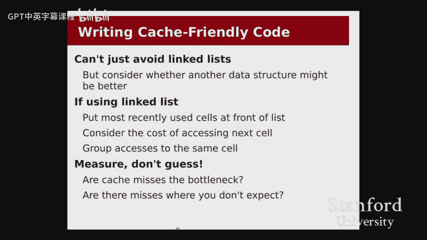

# 【计算机组织与系统 cs107 2016】斯坦福—中英字幕 p12 【Lecture 12】CS107, Computer Organization & Systems -ZmBJRMIzW_E- -BV1Nr421c7YB_p12-

Awesome， they fix this thing， too。All right。All right， hey everyone， welcome back， it's week nine。

 this is the last week of lectures for this class since we meet Monday， Friday。

 that means that next week， Memorial Day， Monday means that this Friday is our last lecture also this week。

 so a couple just general announcements， this is the last lab is this week。

And then we're kind of into the final stretch of assignments here now with assignment 6。

 having its deadline was last Saturday。 you still have until tonight at midnight。

 if you are working up until the hard deadline and we just released assignment 7。

The He allator assignment that's coming in on Wednesday。 And if you。

Would like to kind of stretch that out。 We're giving you out until Saturday。

 But do be aware that Friday and Saturday are part of final exams。 So hope， you know， I think the。

And especially given that we will absolutely not take any submissions past Saturday night。

 please make sure you get， you know， please make sure you make some submits early。

 You can submit multiple times。 Just make sure you get something。

 something to us and don't cut it too close。 And especially if you have an exam on the Friday or the Saturday。

 We highly recommend that you。😊，You make the deadline。On Wednesday so that no。

 we don't start running into any of your exam exam prep。Okay。

 and a reminder that our final is on the last day of finals week。 That's going to be the Wednesday。

 June 8th。So keep that all in mind。As we get into things， all right。For today。

 we're going to last time we talked about a little bit about optimization。

 we saw a few different techniques that the compiler could use and then some techniques that we could use to optimize our code。

 Today， we're going to sort of take a different approach to optimization。

 We're going to talk about Ultimately， this thing called the memory hierarchy。

And we're going to see some more examples of how to measure the performance of our code。

 some more examples of things that we can do to make our code run more efficiently to run faster。😡。

But before I define the memory hierarchy and before I motivate sort of why this is even a thing and that that we need to discuss at all。

 I want to just start right off with with a code example to kind of help us。😡。

Get set the scene for our， for our discussion， okay。So here I've got my。My， my code here。

 and I have inside of this array dot C file， Im showing a variety of different ways that we could sum up an array。

So here you can see this version is just going to the normal， pretty straightforward code we've got。

 we're going to go from。0ero up to n and sum up the elements of this array。

We have a version that will go backwards， so starting up at n minus-1 and then coming back down。😡。

We've got a couple other variants out。I actually， I'll talk about the unrolling one in a moment。

 We've got a version that it looks a little odd， but you know go with me on this where we're summing up all of the even elements before we sum up all the odd elements。

So you can see that this loop starts at i equals 1。 this one starts at i equals 0。And then lastly。

 we have a version that sums up the array in a random order。

 So here you can think of indexes as a random permutation of the numbers from one to N。

 So this will add up every element of the array， assuming indexes is correctly set up。

 but it will add them up in a random order。Okay。😊，And what I want to know is when I run these five variants。

What， what is the performance， What does the performance look like， How well will these variants do。

 We see the code， the code's basically the same just in， you know。

 running the loop in different directions and with a， you know， but。

They're all ultimately going to look at every element of the array。

 So maybe we'd expect there shouldn't be that much of a difference。And so。

We can kind of see what's happening here。 So we see that。Forward and backwards， they kind of look。

Roughly the same。 We might explain the differences between these in terms of just a little bit of variance。

 So I'm using the same kind of cycle counting metrics that we talked about on Friday。

 So we're counting。We're actually asking the processor how many sort of。

How many cycles it took to execute our code，😡，Basically proportional to the amount of time it took for our particular processor。

 but it'll factor out things likell， It'll try to factor out things like other users and stuff like that。

Okay， we can see that this this unrolled version was a little bit faster。

 So I kind of want to know what's going on there。 That that seems interesting。

And then we see that so even an odd one， okay， that's a little bit slower。 You know。

 maybe we can try to find a way to explain that。And then。

 but this random one is the one that's really kind of dragging us down here。

 That one's coming up six times slower than just adding up the elements。From in forward order。

 But hey， I mean， come on， we're just we're adding up the same elements。 So what's the problem。Well。

 we can ask， just like from last time we could ask callgrid。 So I'll come over here。

 I'll close the code because callgriin will show us the code anyway。

And so I'm going to run Val al grind。Tool is call grind。On do sray。And so then I'm gonna。

 so I made a little script to handle our annotations。 So it's。

 I'm basically running callg annotate just like I did before。

 But this is just gonna make things easier in case I forget to type something。And so， we can see。

First of all， we can see that the number of instructions is。Pretty similar throughout here， right。

 And it doesn't really。 So let me just go right into the code and just so just show you each of these variants here。

 I'm gonna。I'm just going to come down。 So for the sum forward and the sum backwards。

 you can see that the numbers are。Basically the same。 the number of instructions for the for loop。

 So it looks like this iteration， the the for loop code itself took up three instructions per iteration。

 and it looks like the sum plus equals a bracket I took up two instructions per iteration。

Since we have a million element array。Right， and then we've got the backwards one。

 the code looks the same。The unrolled one is kind of interesting。

 So the idea behind this version of the code， what we're trying to do with loop unrolling。

 So this kind of is related to our discussion of just code optimizations from last time。

 Here's another way that we could try to optimize our code， which is that。

If we don't want to spend 3 million instructions running through this full loop。

We could imagine instead having our for loop sum up our elements in groups of four。😡。

So here I've got the， I've got this， this loop running at multiples of of four。

 So I'm going so I should running down。 but so I bias equals 4， which means that in total。

 I'm only running a fourth as many instructions for the loop。

Control itself for just the for loop itself。 I'm doing the same number of instructions to actually sum up the array。

 though， because now I have to add up all four elements in this， in this group。Right。

 and so the benefit of loop unrolling here is that。I'm actually running half as many instructions。

Right， a total of 2。75 million instructions here， as opposed to， oops。Shouldn have drag。Well。

 what happened？All right， let's try that again。Apparently， dragging is not happy about this。

 I did not expect that。Good to know。So we've got 2。75 million instructions。

 but it's not like it ran that much faster， it did not run twice as fast。😡，Coming over here。

 we can see that it ran a little bit faster， but really not that much。

In comparison to something forward and something backwards。

So this could help with a certain amount of overhead。

 but it's obviously not totally solving our problem。😡，If I come down to the even an odd one， recall。

 this took one and a half times。What summing forward and somethingm backwards did。Alright， so 3。

 roughly 3 million versus 4。5 million。But the number of instructions， if I add them all up。

 is the same。1。5 million plus 1。5 million is 3 million。 million plus1 million is 2 million。

 So we're still going get our 3 and our 2。And whatever the heck is going on to explain。

I can come down to random， there's 1 million extra instructions here because we have to look up the indexes array。

😡，But。This is still 6 million versus 5 million instructions for the other one。 That is。

 that is not explaining the six time slowdown。哎。So whatever is going on here for our program to be running this much slower。

😡，These numbers aren't going to do it。These numbers aren't telling us what the problem is。

And the reason for that is that we now have to undo a pretty substantial assumption that we've been making all quarter。

So far， we've。So far， we've been assuming that every access to memory。

 So every time we say array bracket I， we assume that that took the same amount of time。Right。

 accessing array bracket0， accessing array bracket N。

 we assume that every iteration took the same amount of time。

 And now we're going to find out that that's actually just false。

So I'm gonna come to the slides for the。For most of our， our discussion today。

 But I will come back to this once we have a good understanding of。

How。

The memory actually works。 I'm going to come back to these examples。

 and I'm going to review them again to just try to understand what happened。So。

Let me introduce this idea now of what the memory hierarchy is and why。

This is and why our assumption is actually false。😡，So at this point， we've talked about RA。Right。

 and we think about。 And so we talked about， so I'm going to use memory and Ram interchangeably pretty much today。

And we can think about as we try to set up。As we try to kind of create one of these systems。

That we have three main goals。😡，One of the goals is that we want the memory to be high capacity。😡。

So we could imagine having something like four or eight gigs of RA。😡。

And you there's a lot of space there。 So we want to be able to store some。😡。

Some multiple gigabytes of memory。But we also want it to be really fast to access。 Ily。

 we would like to be able to say。You know moving something from RAM。

 we would ideally like that to take one cycle。Right， we'd like that。

 We'd like a memory access to be as fast as adding two registers together or something like that。

And a third kind of ideal goal would be that we also kind of want it to be cheap， like monetarily。

 right， we don't want to say， oh， hey， I can give you this really awesome piece of Ram that has。

 you know， that has is like this huge capacity and is also really fast。

 but it's going to cost you a billion dollars that's not really going to work for us。Well。

 it turns out。That we're kind of stuck， we can't actually have all three of these goals。😡，In。

 in one piece of memory。And so。So give you a couple of examples of so the pieces that we've talked about so far with our processor have actually been on two different sides of the spectrum or two ends of the spectrum on this。

 mostly we'll be comparing capacity with speed we're kind of holding the price fixed because if the computer costs a million dollars。

 you wouldn't buy it。 So we're basically assuming the price is kind of you know。

 within a normal computer budget。 And we're just gonna call it call that kind of constant。

But so let's compare for a moment， registers with memory。All right， so with RAM。The registers。

On one end， were really， really small。 We only had 16 of them。And each one's only 8 B。

But as a result， they're really fast。 How fast are they。 Well， I could say I have。

 I could have an instruction like add R A X to R D X and。

We can think about whenever we talk about a cycle， we can think of one cycle as being one of those ad instructions。

 right， adding two registers together。 So think of ad R A X， R D X。

 we can access those two registers。Just very quickly in one cycle。On the other end of the spectrum。

 we've got memory， we've got RAM。And this is rather large， right。

 we're talking about a few gigabytes here。😡，But as a result， it's actually going to be really slow。

 So the truth is these memory accesses that we kept thinking of as just one instruction， oh。

 that's not a big deal。 you're going to read it from memory。😡。

If we actually had to read them from RA。They would be pretty slow。Right。😊。

There's actually another problem that， you know， so we're not a hardware class， but it's。

 we're kind of getting into that space of talking a little bit about hardware issues。

 So I'll mention this problem as kind of just something that as systems programmers， we。

 we do want to know， which is that the performance of。

Our processors has consistently been increasing very quickly。 So you think about。

 So you may have heard something like more about Moore's law。

 And the idea behind Moore's law was that。Every 18 months or so， we could。

P double the number of transistors。 So the actual definition is that every 18 months。

 we can put double the number of transistors onto a chip。

 that actually what that has consistently been translating to over the past 40 or 50 years has been that every 18 months。

 we can kind of feel like our computers are getting twice as fast。😡。

There have been various hurdles throughout that， so up until maybe the '90s。

 the way we were increasing performance was we just made our computers run faster。

 we increased the number of， you know we increased the frequency。

 we went from a 1 gigahHtz to a 2 gigahHtz to three gigahHtz processors。😡。

Now we're now in the space where we're doing a lot of multi corere stuff。

 so it's not that I give you a six gigahHtz processor， it's that I give you two。

 three gigHtz processors， and we pretend like that's twice as fast， even though it's kind of not。But。

 you know， it， it's still a really impressive performance game。 We're still seeing really great。😊。

Performance gains， you know， easily exponential time， exponential gains， year after year after year。

Now， memory， so the performance of Ram is also。Kind of exponential。 We're， I think we've seen。

 I think it's roughly like 5% per year or so in terms of just improvements to RamM。 And you know。

 what of our our E E professors here who teaches E E 1，80 would often say， well。

 for any other field than C， S and E E。Saying that you could get a 5% per year improvement on your technology is actually really good。

 right So if we think about something like， I don't know， know。

 structural engineering or like mechanical or something， like being able to say， oh， yeah。

 my material is just like 10% faster than it was like a year ago。 It's like， well， really。

 that's pretty stellar。 right Theres That's not something that a lot of other fields can really count on。

😊，But in comparison to the performance of our processors。This is kind of not going to work。

 memory is falling behind。😡，So the gap between the registers and the memory。

 the gap between what is fast like processor fast and slow。

 like memory slow is gradually increasing as our processors get faster and our RAM is unable to keep up。

😡，So what do we do？Well， it turns out。There's this the solution is what we call caching。

What we're going to do is we're going to。Is we're going to。And this kind of seems a little weird。

 We're gonna to make a compromise。 And we're going to say， all right， Well。

 in addition to the registers and the Ram， we're gonna give you this other。Location。

Which is going to be。Kind of fast。But also， pretty small。Now， on one hand。

 you might hear that and say， well， gosh， that doesn't sound like it's actually solving our problem。

 right， we want something really fast and really large， and I say， well guess what。

 you can't have either of them here， have something that's kind of slow and kind of small and like you're going to actually be able to solve or're going to solve our problem that way。

😡，But somehow， this is actually going to help。And so our goal for today is to explore exactly how exactly this helps。

One note about。The idea of caching is that caches are managed entirely by the hardware。

 So the reason we haven't had to learn about them so far is that they're not exposed to us in the assembly language。

 So remember， the IA was the contract between software and hardware。

 The I SA doesn't say anything about caching。 It just says， yes， there's this big block of memory。

 You go ahead and go access the memory。 And the hardware will take care of。

Of all this caching stuff for us。So we won't actually see it in the assembly instructions。

 but we will feel it in our program's performance。😡，To better understand exactly how caching works。

 let me give you an analogy to something that， you know。

 is sort of maybe is a little bit more kind of real world for you。

 So imagine if you were in the situation where you were writing an essay。And so you were writing。

An essay for some class and being a， you know， writing a good kind of proper argument。

 you need to refer to various sources as part of your research。 Now。

 this analogies may may become slowly outdated as the prevalence of online materials kind of increases。

 But bear with me， assume that you actually do need to go and get some books from the library or something okay。

And so we can kind of think of。So here's kind of how the analogy starts out。

In the sort of small and fast space， we have what's on your desk。 So on your desk is maybe， you know。

 the， the paper that you're working on， whether that be on your laptop or just actually writing some stuff down。

 and maybe like a book that you're working with at the moment。

And accessing stuff on your desk is pretty fast。 You can just kind of reach over and grab it now。

We might ask， well， hey， if our desk and this question kind of came up when we talked about registers。

 well， hey， if registers are super fast and they're really nice。

 why don't we just have thousands of registers？😡，Well。

 you can imagine what would happen if I just made your desk like， hey， well。

 can I just give you like a 100 foot long desk with that help， Well， not really。

 Because once you know， papers and books start， you know， aren't in arm reach anymore。

 the benefits of having a really long desk aren't really gonna help aren't really helping it are are being pretty。

 are diminishing quite heavily。So， okay， we can't keep everything we want on our desk。

 So what do we do， Well， there's green library。 Green library is nice。 It's huge。

 It's got plenty of storage。 It's got every book we could possibly want， right。

So imagine the situation where we， you know， all right， so we're writing our essay and we realize。

 okay， I need a book from the library， so I hop my bike and bike down to green library。And。As of now。

 the way we were presenting memory access， the way we were thinking about。Accesses is we， we。

 we thought of it like this。 We bike to Green Library。 We'll find the book on the shelf。

 We open it to the page that we need。We copy down the passage that we want。

And then we leave the look there and bike back。😡，And then， you know， maybe an hour from now。

 we realize， oh， shoot， I need another passage from the same book。 but hop off my bike。

 go back to Green Library。Plying the same book again， look up the passage， copy down， fight back。😡。

Oh， I need another passage bike over， look up another book。😡，This is pretty inefficient。 right。

 This sounds pretty silly。 Why would I want to like having to bike down to green every time I need to look up a sentence from this book。

Seems like a huge waste of time。So let's introduce the concept of a bookshelf。

So the bookshelf in our room。Is a compromise between。It's not quite between speed。

 It's not quite in arm's reach， but it's still pretty close to us。

 We can just kind of walk over and grab a book。And it's not quite as large as Green Library， but hey。

 I can still put a few， a few books there。 So what I'll do now is instead when I find out that I need a book from green。

 I'll bike down to green， get get the book， check it out。You know， get the passage that I need。

 leave it on my shelf。With the thought that maybe I'm going to use this thing later。😡，You know。

 maybe somewhere else in my essay， I want to cite something else from that book。And so then。

And overall， like the amount of biking time is decreasing pretty substantially， right。

And as it turns out， we actually realized that we can keep extending this。

 so the truth is green Library is itself。😡，Like a cache。

 because Stanford has way more books than fit in green。

So what we actually have is we have this auxiliary library out in Livermore and what happens is every day there's a truck that drives back and forth between Livermore and green that just drops off books back and forth。

 and so it turns out if there's a book that's not at green， we actually could just say， hey。

 I want this book and the library will say，  oh， well that's out in Livermore。

 wait until tomorrow and then come pick it up。😡，And obviously。

 it would be pretty infeasible for us to just leave everything in livermore and have to wait a day just to get any book that we want。

 So we're going to use， you know， Green Library is kind of our， our place for just kind of the。😡。

More frequently used， like the books that are probably more relevant to people。

 and then if you actually need something that's kind of older or a little bit more obscure or something。

 then we can go and get it from there。😡，Cool。So。Maybe this kind of gives you a sense for， you know。

 why does this even work？😡，Right， why should we even think that this strategy works。

 Let me give you a situation when writing an essay where this wouldn't work。

 And I sure told this isn't how you write essays。 right， Imagine if the way you wrote your essay。

Went like this。😡，When you needed a quote， what you do is you bike down a green library。

You pick a random shelf in the entire library。On that shelf， you pick a random book。

You open the book to a random page and you just copy down a sentence。

If that were our model for accessing books， right， completely uniformly random。😡，Well， first of all。

 we have the problem that your essay would suck。 That's。

 that's an issue I'm not gonna to help you solve。 But there's another problem。

 The problem that we are interested in， which is that our bookshelf wouldn't help us in that situation。

If every time we wanted to look something up in a book， it was in a completely random book。😡。

Then what good is keeping the books on our bookshelf。We're never going to find anything that way。

So the reason that caches work。 So going back to the kind of memory situation now。

 the reason that caches work is because of a key assumption that we are making。

 Were assuming that memory accesses are not random。

 We are not just pulling a completely random place in memory every single time we try to access something。

This idea is called locality of reference。Localality of reference basically says that we can kind of predict。

Memory accesses in one of two different ways。One version of locality is called temporal locality。

 and the idea for temporal locality is that if I access a piece of data right now。

 I'm probably going to access it again very soon。😡，So think about your local variables。

 think about when we were summing the array our sum variable。

 we kept saying sum plus equals array of I。😡，We're using that sum variable a lot over and over and over again。

😡，That's going to be something we want to keep in our registers。

 That's going to be something we want to keep very close to us because we are accessing it repeatedly。

😡，The other kind of locality that we're counting on is spatial locality。

The spatial locality says that if I'm going access。

And a piece of data that I'm probably going to access the data that's kind of nearby。

And this example kind of goes with array accesses。😡。

So we know that arrays are laid out contiguously in memory。😡，So if I access a array sub I。

 a race sub i plus 1 will be right next to it。😡，And so。

One of the most common idioms is going to be to loop over an array from0 up to n， or maybe backwards。

😡，And those are going to be。A are very good for spatial locality。

 we access array I then array I plus1， then I plus 2 I plus 3 and so on， or backwards， I I minus1。

 I minus2 and so on。😡，Right。So we're counting on this。If we did not have locality of reference。

We would caches would not work。We would not be able to solve this problem。

 and we would just be stuck having to go out to memory every single time。But fortunately。

 these patterns are， pretty common。So first good，也 is。So let me give you a few terms。

 I need to introduce a few terms before I can actually talk sort of concretely about how caches work。

 Most of the discussion here is going to be pretty high level。

 I'm going to give you some numbers that are very specific to our machines。

 but I'm going to try to keep the discussion kind of high level because we're not actually building any caches if you're interested in the hardware that goes on behind the scenes。

 There's a class E180 that will go into all the details about how to make a cache and what the tradeoffs are at the hardware level。

 but we want to think about what caching means for us as programmers。

 so we're trying to keep the discussion more on the software side。

So but I do need to introduce a few terms。 These are the terms that you would run into in E180。

 but just so that， you know we can actually talk about how we're doing and talk about our performance。

 the first two terms， kind of the most important two terms are a hit and amiss。

So when we talk about caches， so we think about our cash as being kind of a small little space where we're going to store some of the most frequently used things。

 right？😡，A hit means that if we were looking up some piece of data。We found it in the cache。

 So using the book analogy， right， I realized， oh， I need to use a passage from a book。

 and I look over on my bookshelf and say， oh， yes， it's on the bookshelf。 perfectfect。

 I don't have to bike over to green。 No problem。 That's a hit。A myth， on the other hand。

 is I look over on a bookshelf and I say it's out there， shoot， okay， time to go to the library。😡。

Or a miss in the library would be I look in green， I can't find the book and they say，" yeah， sorry。

 you cant to wait until tomorrow。😡，Right。And so what happens when we miss？Right。

 maybe on the on the essay writing front， you might think， well。

 if I can't find the book and it's 3 AM。 And I got to turn that essay in tomorrow。

 I'm just gonna not put the quo in because that's all I got。 You can't do that on our programs right。

 with our， with our programs， if I ask to access if we。

 if we have an instruction that's trying to access a piece of memory and it's not in the cache。

 we don't have a choice。 We've got to go and get it We've got to get it from Ram or maybe， you know。

 sometimes it might not even be in Ram。 It might be on our hard drive or something。ve。

 we've got to go find that memory somehow。😊，So generally。

 this means if I'm in a cache and I miss the cache。

 then I should go to Ram to get it if it's not in RA， maybe it's on disk， something like that。😡，Okay。

A few other terms to introduce to the miss rate generally these are in terms of so the miss rate is generally for a particular program。

 we say that the miss rate for that program generally expressed as a percentage。😡。

Is the fraction of accesses？😡，That missed the cache。 So you want to keep this number down， right。嗯。

So we might say， oh， you know， the program has a 1% miss rate。

 That means that in every1 hundred0 accesses， one of them will miss our cash。

And then we've got two timing numbers， we've got the hit time and the miss penalty。

 you can think of these as analogous for hits and misses， the hit time is if we hit the cache。

 if we find something in the cache， how long does it take for us to get it out？😡。

Because we still have to potentially wait。 It's not going to be as fast as it is for a register。

And then the mis penaltyal is if we miss the cache。

 how long do we have to wait to go out to memory or something to get it？😡。

So how much are we penalized for not finding it in our cash？Okay。

 so both of these might be expressed in terms of cycles in certain situations。

 We might express them in seconds or something， but。系。All right。

Let me give you a few numbers to just help ground our discussion right you're not expected to memorize these numbers。

 but it'll help us put things into perspective a little bit as we continue our discussion。😡。

And so I'm gonna basically give you the capacity of our， of， of each of these and then the。

 the hit time。 So for the registers， we already know that the registers have。 there are 16 of them。

 and each one can hold 8 bys。And we know that we can read and write。2 registers or so。

 roughly per instruction， right， maybe three， in some cases， like with an L E A。

 we can actually read three registers， or we can read and write three registers。

 So this is very fast。 you know， so the registers aren't really a cache。

 So we don't really talk about hit time for them， but you can think of access time to registers being easily less than a cycle。

The simplest instructions are all operating on registers。😡。

Our myth machines actually have two layers of cache that are sort of trying to optimize for different things。

 We have a smaller cache called the L1， and we have a larger cache called the L2。😡。

The L1 cache is 32 K。 It's 32， yeah，32 k。And it generally takes one to 2， maybe a little bit。

 just a little more than that，1 to two cycles of for a hit time， of hit time。

 So within one to two cycles， we can pull something from this。This cash。

And the goal of the L1 is that we really want the hits to be fast。😡。

So we're not that worried that the L1 is really small。 We're more worried that we can keep。

The hit time really low， so we we'll take a smaller smaller cache if that means that we can service requests very quickly。

 Remember， our assumption is going to be， you know， spatial and temporal locality all the way here。

 and like if I'm only using 32K of data in my entire program， I want that program to run really。

 really fast。😡，Then there's the L2 cache。So this is noticeably larger。

 It's kind of like three orders of magnitude or it's like two and a half orders of magnitude larger。

 right So it's between four to 6 megabytes on some machines it 4 and some machines at6。And what。

 and what this gives us is。So it's a little bit slower。

 You'll notice it's about an order of magnitude slower。

 And so you'll generally see as we go down this list that every next level is about an order of magnitude slower than the previous level。

 but also a couple order orders of magnitude larger than the previous level。

 And that's going to be the general pattern。 right。

 slower but larger and I could even put disk down here。 and disc is well in the terabytes。

 but is actually like six orders of magnitude slower than than Ram。So the L2 cache。

 it's about it's around here。 It's northern magnitude slower。

 And our goal with the L2 cache now is we kind of want this thing to be as big as we can make it。

You know， without。So so there's also a limit in terms of how expensive we can it is to make these caches。

 General caches are pretty expensive。 So we kind of want this but we kind of want the L2 to be as large as we can make it because if we miss in the L2。

 we got to go all the way out to memory and going out to memory is going to take between 50 and 200 cycles。

 that's gonna kind of suck。 So we want to avoid this level as much as we can。Also。

 I think on the myth machines is actually 8 gigs of Ram。 but whatever 4 gigs，8 gigs， you will notice。

So first so again。Just a quick nod to modern processors。

 So our myth machines are actually rather old。 Theyre kind of like 282008，2009。Era。呃。Now。

 with the gap between CPU performance and memory performance increasing more and more。

We're actually getting to the point that Intel， as of maybe 2010， I think。

 decided that they actually needed a level 3 cash。 So they actually inserted something between right here。

 That's around 100 k or like 200 k that kind of handles。That's like kind of between the two axises。

 I don't actually know exactly what the hit times are then。Very， very recently。 So like this year。

 the processors that are some of the high end processors from Intel that are coming out this year actually have an L 4 cache。

 And the L4 cache is between here and here， which is like about 128 megs， It just like。😊。

Kind of like a little stick of Ram that's sitting on the processor that's trying to absorb even more of the mis penalty。

 because the miss penaltyal is， again， gradually increasing as the time to access Ram is。

Increasing relative to the performance of our processors。

So we're trying to absorb more and more of the mis penaltyalty by throwing more and more levels of cash into it。

Okay。So now why is caching so important？😡，Right， so on one hand， you could think of， okay。

 we talked about like。Yeah， orders of magnitude， Sure， whatever。 What is 100 cycles really， right。

 Do we， do we really care。So here's just a little bit of math to help you get a perspective for。What。

What the effect of cash misses really are on our system。So in this scenario， imagine if。

A hit in our cash。We took one cycle。 So if we found the data。

 then it's one cycle to get the data back。But if we don't。

 then we pay a mis penaltyalty of 100 cycles。 So this might be something like， all right。

 I couldn't find it into in my cache。 I go out to Ram。

 It's going to take 100 cycles to get the data from Ram。Okay。Now。

 imagine if we have a miss rate of 1%。😡，So that means that one in every00 accesses will miss the cache。

 99 out of every hundred0 will hit。We can compute this number called the average memory access time。

And the way we figure this out is we're basically asking， on average。

 how long is a memory access going to take in cycles？So here's how we calculate that。

 We say that while 99 of our accesses out of 100 hit。And those hits took one cycle。

And then one of the access is missed and that mist took 100 cycles。

So if I add them up and divide by the total number of accesses to get an average。

 I find out that the average access time was 1。99。Cyclees。Per access。Right。And my question is。

 what if we were to increase the miss rate。To 3%。So just a 2% increase。 How bad is that really。

Is it noticeable？Well， let's work through it。Now，97 of our accesses will hit。For one cycle， hit time。

And three of our accesses will miss。And each incurs a 100 cycle missed penaltyal。😡，So in total。

We end up with an average memory access time of 3。97 cycles。So。By increasing our miss rate。By 2%。

 our program ran two times。 will basically run two times slower。 or our memory accesses will。

 on average， be two times slower。 And if the， you know， if the number of instructions were the same。

 then this is going to have an impact of， you know， easily1 to 2 x， right， slowdown of 1。

5 to 2 x slowdown of our program。Yep， do you rate is good question。 The So the question is。

 how do I know what the miss rate is， So I told you the hit time in the mis penalty， right。

 Those are based on， those are based on the hardware。 It's like， oh， okay， well， you found it in L1。

 That's1 to two cycle hit time。 if I， if I missed the L 1， but I find it in L 2。

 then that missed penaltyal is like 20 cycles。 If I have to go out to Ram。

 the miss penal is like 200 cycles。The miss rate is going to depend on our program。

And how do we know what it actually comes down to， or we're going to actually have to measure it？😡。

And so we'll see that in a moment that we can actually ask callgrind， for example， to tell us， hey。

 what is our mis rate， how many of our memory accesses are actually missing and when we actually look at the numbers themselves。

 when we look at which ones are hits and which ones are misses。

 we can then kind of calculate it ourselves and know what that rate is。

But that number is actually is very program dependent。 so we can't just say， oh， well you。

 there's not going to be a one size fits all strategy for caching。

 We're going to need to look at our particular program to say。

 you know is this caching strategy helpful or not or we'd look at a collection of programs that we consider to be pretty standard to say。

 you know is this new caching design better or worse。😡，应该。Anything else。

So I want to say a little bit about how caches are designed。

 This is probably the part that I'm going to gloss over the most。

 but I just want to kind of give a nod to how exactly this works in hardware。 remember。

 none of this is exposed to us as programmers， at least in terms of the we can't write our code to say I want this in the cache or not。

 That's not something that's an option。 the processor the hardware is going to take care of all that for us。

😡，And so all we can do is write our code to be aware of the fact that there is this thing called caching and it is impacting the performance of our software。

😡，So how do caches actually work？We can generally think of a cache。

 like so a cache is just a big block of memory， right。

 Like let's say it's a4 megabyte block of memory。 We can think of it as being divided into a bunch of blocks。

And so the idea behind dividing a cache into blocks。 So recall back to the idea of locality。

 One of those was spatial locality。 So so if I access array bracket I。

I might expect that I will want to access array bracket i+ 1 later。

 and maybe bracket I+ 2 and i+ 3 and I+4。😡，So when I access a bracket I。😡，The hardware should figure。

 oh， well， while you're accessing a ray bracket。 I， I'm gonna go ahead and pull in I plus 1。

 I plus 2， I plus 3 and so on into my cache in preparation for。Your program to use them。

And the way it's going to do that is it's going to think of the cache as being divided into blocks。

 and whenever we see an access to one byte in that block， we're going to take the whole block in。😡。

2 sense。So if I've got a 64 byte block， which is pretty standard on our systems。

 then that means that if I access one of the four byte integers。😡，In our array。

 we're going to get 15 of its neighbors into our cash as well。😡，Okay。

And there's a tradeoff between how big should I make this block， you could think， well。

 maybe I just have my entire cache be you know one big block。

 so you read a race of I and I just take the whole array and I pull it all in。

 But the problem is that if the blocks get too large， then I stop being able to store other stuff。

 what if I'm accessing two different arrays。😡，Then if I have one big block and I pull in everything from one array。

😡，And then I have to pull something everything from another array。

 Then I don't have rub in my cash for that anymore。So I'm going to have to kick out the first thing。

Right， so generally， we need to kind of compromise between having too large of a block。

 in which case， you， we won't be able to fit everything that we want in our cash And also， you know。

 spatial locality only has a limit， right， Like， you're not gonna go to the library and pick up an entire shelf worth of books。

 Like， that's just not that useful。 After a while， you're gonna be like reading three of them。

 You're like yeah， I'm done。 I don't need anything else。 So there is a limit to spatial locality。

 right。And。So， right， So we generally set the block size。 You know。

 that's kind of a hardware decision。 It's maybe set around 64 by， just kind of。It's pretty standard。

And so you might ask， well okay， then now， how exactly do we find a block in our cache？

 So let's say we've got， let's say my cache has like 100 blocks in it。And so that I wanted， like。

 I'm searching for an element in that。In the cache。

 or like I'm looking up this address and I want to know is it in my cash or not？😡，Well。

 you could imagine doing a linear scan of every block and say， is it this one， Nope， is it this one。

 Nope， 100 times。 But remember， we want to keep hit time down。So we don't want to do that。

 That seems pretty slow。 We could also the alternative is we could just say， all right， Well。

 like for a given address， I will just know which block it's gonna to belong to。

 So for every memory address， I will make sure that there is exactly one block in my cache that the address could go into or not。

 And if it's not in there， then it's definitely not in my cache anywhere else。

But then the problem with that is that we can start getting getting in these kind of conflicts。

 right， It's like if I read array， you know， A subi and B subi。

 and they happen to map to the same block in my cache。

 then they'll keep kind of kicking each other out。行。

So these are trade offs that generally the hardware hardware people make， right？

I'll give you just kind of a quick example of one model that we could use for like how exactly the system could figure out whether an address that I'm looking at is in the cache so in this case I'm imagining that I have a 64 byte cache block and I have 128 entries in my cache。

So then， and we're gonna use the simplifying assumption that every address maps to a particular block。

 right？ Now， remember， we're compressing the memory here。

 So we took our like 8 GB Ram or 4 GB or 8 GB Ram。 And we're stuffing it into this， you know。

 like 1 k or I think it comes out to about about， Yeah， comes out to 1 K here or is that right。 No。

8 K。 anyway， whatever doesn't matter。 It comes out to like just a few kilo of， of cash。😊。

So multiple addresses in RA are definitely going to map to the same。😡，呃。Same block。

So some memory kind of out in the heap。😡，Is probably going to map to the same entry in my cache as。

 you know， some memory out in the stack。And so we can imagine like using a really simple heuristic。

 part of our goal is really going to be that we want to make sure the hardware can do this mapping really quickly。

 right， We said that if we have like a linear scan， that's way too expensive。

 So we need something that's going to be at least sort of a definitely constant time。

 And so here's a system that would work。So here you can think of this as being an entire address where down here we've got the least significant bits。

 and you can think of so the last six bits because why is it6 well because there are 64 byte？😡，Cashb。

We can think of the last six Bs， as mapping。As telling us where in the block our data is。😡。

So you could think of， so if I pull in a block。😡，I pull in 64 B。 And so these Zs will tell us。

You know， which byte I actually want to access。And then the whys here。

 So I could use the next most significant bits。 This is just an example of how we could do something like this。

 The next 7， say in this case， because there are 128 entries。

 Most significant bits are gonna be telling us which block to look in。

So let's say these were all zeros， then that says， I should look in entry 0， block0。😡。

If these were all ones， then I should look in entry 127。😡。

But how do I actually know if that block has the cache， this data that I want。

 how do I know that it's that the data in my cache。😡，Is actually。

Going with this address and not some other address that happens to have the same。Why bits？Well。

 then I all the other bits。 So that's what the dot dot dot means here。

 All of the other bits are gonna be used as what we call a tag。 And so we're gonna compare。

 So in this case， let's say I were to do a memory lookup， right。

 So I gonna I was gonna look up this address。 And I want to know if it's in my cache。 So first。

 I use these Y bits to look inside my cache at entry。 You know why。 and I say。😊，Okay， like。

 and now I say， all right， if。This address we in the cache， it has to be at that entry。So now。

 how do I know if it is， Well then all the other bits。 So this is like 64 minus。

 however many y and Z's there are，64 minus that。I compare those blue bits to like the blue bits that go with the entry in my cache。

 and if they're equal， then I know that that's a hit。😡，And they're not equal then I know it's miss。😡。

That kind of makes sense。So we can just kind of use this as a simple strategy。 So basically。

 we're doing mod。 mod is really easy， right in hardware， Mo by powers of two is really nice。

 so we can just kind of pull bits off to figure out if。😊，If the entries are hits or misses。Yeah。A。

Yes。Why exactly is the y part of the address 7 bys and then the Z only6 So the y here would be So the question is why is the Y 7 and the Z6。

 So in this case， I have a 64 by block cash block。 So that means that。

An offset into the block is going to be from  zero to 63。😡，So that's why this is 6 bits。 So 0 to 63。

 that makes sense。 And then now I have 128 entries。

So that means that the  seven y bits are going to be 0 to 127 to tell us which block we're looking in。

😡，And then the exps are the same are whatever's left over。For the comparison。Good question。

Anything else。So I can tell you that this isn't exactly what happens on on processors。

 What actually happens is there are much more complicated systems that are still fast enough that the hardware can do them。

 But， we're not gonna to talk about them。 they'll be covered in E E classes that are covered in some of the even the advanced ones will get even more fancy。

 They're like， oh， yeah， you know， everything we taught you in the E E class。 That was a lie too。

 Here's what we actually do。 and it kind of blow your mind so。You know， that's just kind of a。

Part of it。 But hopefully， this gives you a sense for what that at least that the hardware can do this。

 It can do this pretty quickly， and it can kind of。And because of locality。

 we're feeling pretty good about this helping us out。O。😊。

So that's all I want to show you from the slide angle。

 Let's actually go into the code and really talk about how we can make use of this right， So now。

 all right， fine， there was our， there was our nod to the E E folks that yeah， yeah。

 we talked about caching。 Don't worry。 And now let's actually talk about what it means as programmers。

😊，So over here， recall our situation from the beginning of the class， we had this array。

 we saw this performance that we forwards and backwards were taking the same amount of time。

 and then this random thing was taking a huge amount of time。

And we looked at our call grind report and the call grind report didn't tell us anything。

 It didn't tell us anything useful， It said。It， it did not suggest to us that the random should have been six times slower。

So let's see if we can get more information from Valgriide。😡。

I'm going to run call grind just like before， but I'm also going to add this flag。

 I'm going to say simulate。Cash equals yes。They're going to run a array。

So it's going to take a little bit longer because it has to do more simulation work， that's okay。

Incidentally， here we can see。 So let me just introduce some terms that callground uses。

 And then I'll actually explore this number in the annotation。 But for one， you'll notice that。

Call grind is calculating miss rates for us。 So the question， you know。

 how do we know what the miss rates are， We use a program like call grind with the simulate cash。

 and it'll tell us， here's your miss rate。 By the way， our miss rate is 20%。 That's kind of crazy。

 All right， we need to figure out where that happened。 right， So a 20% miss rate。

 We already said what the impact of a 3% miss rate is。 So missing。

Mising by 20% seems like a big deal。Another quick terminology thing to introduce。

 so D1 here is talking about the L1 cache for data。 So as it turns out。

 there's a split between in the L1 cache， there's a separate cache for。😡，Because。😡。

In addition to our array being in memory， we also have our instructions， right。

 The assembly instructions are in memory 2。So there's actually a separate cache for assembly instructions called the I1。

And then， there's a shared。Level 2 cache。 Valgra doesn't call it a level 2 cache。

 It calls it a last level cache。 But whenever you see L L， basically think2 level 2。

 whenever you see， we won' to talk about the I1 cache because it doesn't matter that much。

 So whenever you see D1， think L L1 cache。ok。😊，So I want to do annotation。

 I want to use my script and my script， I have this option called minus C。

 that's gonna actually show me the cache information。 We' gonna enter the right number here。

19 to whatever。😊，不。So first of all， we can talk about this top part a little bit more now。

So up here we get some information， so since we asked Valgnd to simulate our caches。😡。

Valgin now actually knows what。The cache sizes are。 And sure enough， we see a 32 K，64 B entry。

A levelvel one cache， we see a six megabyte。64 B entries，64 B blocks， less level cache or L2 cache。

你看。And now， in addition to the instruction reads。😡，We also have two other pieces of information。

 We have DR， which is data reads。 So this is accesses to， you could think array bracket I。

 for example， or any other piece of memory。 And then we have D1 MR， which stands for level 1 misses。

For reads。So a bigger number in this column means so every time we miss the L1 cache。

This number goes up by one。If we hit the L1 cache， then this number would go up by one anyway。

 So in either case， this DR is going go up by one， right， This is just the total number of reads。

 But only if we miss is this number gonna go up by one。Let me just show you that。

So I'm gonna page down。 I'm gonna come back up。So here。We can see our some are some forward code。

 We see the same number of instructions that we saw before。 that did not change。

 We still have three million instructions，3 million instructions there and two million instructions there。

We can see that this second line， the accesses to array bracket I represents a million data reads that makes sense。

 we have an array of a million elements。😡，So we need to read each element of that array。呀。

But we also have 62501 misses in the cache。Where did this number come from？Well， let's consider。

We have a， we have a 1 million。 let's think。 so we've got。4 by integers。 So our array is an interray。

 right， We have 4 byte integers。And our cash blocks were 64 bytes wide。

Which means that if we access array bracket 0。Then we're going to pull in also in addition to array bracket0。

 we're going to pull in array bracket， one，  two， three， and so on up to 15。😡。

So that means that the next 15。Aray accesses。Are going to hit。

But then when we go to array bracket 16， we're going to miss again。😡。

So if we consider that we have a total of a million elements and we divide that million by 16。😡。

What do you know， We get 625。And so。All of our misses are accounted for every 16 elements through the array。

 we miss。Then we hit for another 15。 Then we miss again。 we hit for another 15。 we miss again。歌声就谈。

By the way， kind of a neat effect here， maybe wondering why there's a one miss on this line with the closed brace。

 this is kind of neat。What happens when our function is done executing。

 What is the last instruction it executes， It executes a return。

How does return work when it goes on the stack？😡，And it's going to look for an address on the stack for。

We're going to return to When some forward is done， we're going to return back to main。

So it's going to go on the stack and it's going to try to read that address。😡，The stack is in memory。

 so if the stack is in memory。😡，We need to do a data rep。 We need to do a data read。And so。

Is that data read going be in the cache？ Well， in this case， the answer is no。

 because I filled the entire cache with this array already。And so I may have， you know。

 kicked it out or something。 And so now no more room。

 So then we actually miss on the return statement。 And it's kind of see cool that we can even see that。

So first a good。So now we can look at some array backwards。

 and we can see that the profile looks absolutely identical。And sure enough， we can say， hey it。

You know， we saw that the two numbers match， right， The some forward， some backwards。

 They're basically just about the same。 There's maybe a little bit of variance from just。Timing。

 but we can expect them to be about just about the thing。

So now we can go to this unrolled version where recall， we had。You know， half as many instructions。

 Basically， we had 2。2 million fewer instructions。But we still have 62，000 cash misses。

Because we still need to access a million element array。If we didn't have 62，000 cash misses。

 then we would probably see some pretty good benefit from the unrolling here。😡，But。

Because we do have those misses or bummer。 We， you know， it's just gonna be。

We're not going to get as much of a benefit as we'd like。 It looks like in this case， the。

 the accesses for the array are kind of dominating our runtime。Mics。Are those miss。

So the question is， are， are these misses inevitable In this case。 So the answer is pretty much yes。

 right， If you have a million element array and you really do need to walk through the array of a million elements。

 Yes， there's nothing you can do because they weren't in the cache before。Right。And so that。

 so there are a few different kinds of misses。 This is called a cold miss。

 A cold miss basically means this is the first time we access the memory。

 And if it's the first time we access the memory。Well， you don't have a choice。 Of course。

 it's not the cache because it's the first time we accessed it。

Let me show you some cache misses that aren't inevitable， though。😡，Down here。

 I've got the some odds and then some evens。😡，Again， the total number of instructions is the same。

 still 5 million。The total number of data reads is the same。

 It's a total of a million between the two of these。But each of these lines has 62，000 cash misses。

Because in this case。If I access array bracket 0。😡，I'm going to hit when I look at2，4，6，8， 10。

 12 and 14。😡，But I mean， I also pulled in 1，3，5，7，9，11，13，50， but I didn't use them。😡。

So every eight accesses now is going to be a miss。😡，This myth。Is not inevitable。

Or I should say these， really， right， Like the first first 6200， you can be like， yeah。

 that's of inevitable。 These are not。These second 62。

000 misses were because we summed the array in a kind of silly order。😡。

And if only we had actually taken more advantage of spatial locality， our program would run faster。

So嗯。Yeah呀。So here we can calculate the miss rate for， for， for these accesses。

 the miss rate on this line is now one out of 8。 So if you actually look at the total kind of miss rate for this block of instructions。

 if we just wanted to calculate it， it's gonna be a million excesses， but 1 hundred30000。Or 100。

 yeah，125000 misses。 So we would say that the miss rate is actually one in 8。 And then up there。

 the miss rate is one in one in 16。That' all make sense。Any questions。

And I guess I already kind of showed you the random one a little bit， but this is pretty substantial。

 right， Allright， so we've got 3 million extra instructions。

 or we got an extra million instructions for a total of 6 million。 that's not our problem。

 Our problem is that in 2 million accesses。 So we did increase the number of accesses by 2 million by a million。

😊，Because we also need to access indexes of I。But here's the thing， right。

 We access indexes of I in order from 0 to n。😡，How many misses is that Well it's 62500。

Because there are a million indexes。So he missed 62，500 times。

But we have a total out of the 2 million accesses。 We have a total about 1。05 million。Mies。62。

000 of those were from the indexes array。😡，Which means that 993。

000 of these misses were from the1 million attempts to access a ray bracket eye。😡。

So our miss rate on accessing array， on accessing a bracket I or a bracket index is I。

 our miss rate on accessing A is 99。3%。😡，Which is terrible， right， That's， that's not going to do。

 And that is how we can explain。The 6 x runtime increase。Now from the instructions。

 now from the number of data reads。From this。我是到 that。Let me show you another example。

Actually to make clean to get rid of the call grant reports。So I don't have to deal with them。

I'm going to run this other program called locality。 And what this program is going do。

 It's going to be pretty similar。 But what I'm gonna to do is it's going to sum up an array。

 It's going to go in order。 It's going go forward。 It's going to sum an array in this case。

 So that number is， is an order magnitude smaller。 It's 100000 elements。We're going to sum it up。

 and we're going to ask how long that takes overall。 In this case， it takes 222000 cycle。

And then we calculate that that's roughly two cycles per element。

 and maybe I show you the code real quick。Let me actually do it in the other window。So here。

 you know， we're going to do the normal thing。 We're going sum up an array。Right。

 but then we're also going to try for the same size of。Collection。

 we're going to try summing up a linked list。😡，Of 100000 elements。

So your usual link list will C not equal well let's not know， we're going keep going。Right。And。

You know， so， now we want to ask the question， so how much worse do we do。

By summing up a linked list。Versus summing up in array or you know so。

An array is probably the most cash friendly data structure we can， we can have here。 right。

 So our goal is to try to understand， like， how do we write code that's really gonna。

Play well with the cash。 We call that cash friendly。

And so an array is probably the most cache friendly thing you're ever going to have。

 Everything is laid out right next to each other and continuouslytiguous in memory。😡，A linked list。

 not so much。 We're jumping around， you know， the next pointer could point to some other place in memory。

 which could point back， which point over here， then point back。😡，So， in the end。

We figure that the linked list version。Is going to。s there going to be much less cash friendly？

Let's see how much less cash friendly。So I'm going to run minus L here to run the linked list version。

Oops， there we go。 So it looks like there， there is gonna be a lot of variance when we play with the caches。

 one of the big problems with caching is that the cache is actually being shared by every user on the machine。

 So when I said that these cycles were actually independent of other users， they're not totally。

 So if somebody else happens to be running a program at exactly the same time that I am。

 then the number is gonna spike。😊，But this is actually pretty close to what the average is when the machine is quiet。

So， so here you can see there's a difference of about 2 x， Yeah。

 So you can see there's a difference about 2 x right， or 10 X。 Sorry， So here， you know， it's， it's2。

2800 k， whereas up here it's 200 K， but basically per element。 this is we're looking at like 29。

 So like 10 to 15 x slower to some a linked list than to sum an array。And so as before。

 we want to understand why。So let's use call grind。I'll do the simulate cache equals yes thing。

And I'll run locality。Minus a。So I'll run the array one and the linked list one。

 and I'll put them both up next to each other。So first， let me show it to you without the caching。

Alright， so we've got。30，4，3，0。 So I'm gonna guess that the net last one was 3，0，4，65。

So I'm going to page down。So here， I'm just going to show it to you。 So this is just。

 this is without the cache information。 Let me pull up on the other side here。

When to do slash annotate。3，0， was it4。O下。So， you see。That if I switch between the two here。

 So this one is a total of 400000 instruction。 So this is so 100000 elements in my array or my linked list。

 so。😊，So 400，000 total instructions for the linked list version， I switch over here。

 they line up perfectly awesome， we've got 500，000 instructions for my array version。

That's not explaining it。 This actually would almost make me think that the array version was somehow slower。

😡，But it's definitely not。So let's run it with cache information。

 So I had already done the simulate cache。 but the way my script was set up。

 if I didn't add the minus C， it wasn't going to give me show me the cache information。

And I'll run this one。So now here， we can see。For the array 1， oops， that's the linkless one。

 Here is the array 1。So for the array 1， okay，6250 cash misses。

 That is exactly what we expect from last time when we did the sum array forward， right， we have。

 we have 10 X fewer elements。 So we have 10 X fewer misses。

 We're still missing one every 16 elements。Over here on the linked list case。First of all。

 notice we have an extra 100，000 data reads。😡，From reading cur equals core arrow next。

 So reading the next field。Right， but that wasn't our problem。 We didn't miss there。

Where we missed is right here。And we missed 99。1% of the time。It's pretty significant， right？

And that's going to， again， explain to us。Or show us that linked list code fundamentally is just going to be slower than a array code。

 especially if our he is kind of a mess and our linked list cells get allocated all over the place。😡。

So maybe this kind of starts to lead us into this question of so what do we do right is the answer just don't use linked lists ever。

 I mean， that's not a very good answer。 It's not a very satisfying answer。

 There are certain situations where maybe we could use an array in which case that's probably better。

 but linked lists are a really useful data structure。 we want them。 We like them。

 there's a reason we learned about them They solve a really useful problem。😡，But。

This starts to give us。😡，The impression that we can't think of linked list accesses。

As being as expensive as going to the next element of an array。

Another thing that we might notice from this code， this may become fairly relevant for He Allocator。

 for example， is that up here we have the access to cur arrow next and that is not missing in the cache。

 Why is that not missing in the cache。😡，Although， it's not missing。Because over here。

 we already accessed curarrow data。😡，So if we missed to pull cur arrow data into the cache。

 then the next pointer is going to be right next to it。😡。

In memory is going to be adjacent in memory so that these hundred000 data axises do not miss。

On the other hand， if we had something that was maybe a little more complicated。

 where let's say inside of this body， we had another for loop。

We could end up with a very unfortunate situation。Where this line started missing。

And if that happens， those misses we might figure are avoidable。😡。

So imagine if we ran our program and we looked at this line and we saw 99。

000 misses on this line as well。😡，For tu equals curarrow next， then we might suspect。

 maybe I should take。The next variable， maybe I should take the next value and put it into a local variable right at the beginning here。

So that I don't。 I don't see those misses。So this does inform our discussion a little bit。

 Let me show you another quick example， like one final example of。I think， kind of how we can。

Assess or like， kind of what the。What the real implications。Of locality R。

 So here I'm going run the linked list version， but I'm going run it on 200000 elements。

And we'll actually notice that it's a lot。 So here， let me do the one with 100000 again。Oops。Right。

 so the one with 100000。This machine is too busy。Well， it's gonna， it's it's at the lowest case。

 it's between like 20 and 30， right， And sometimes it's gonna be about 40。

 but sometimes the machine is really busy。 But you'll notice that 200000， it's not 2 x。

 Like you would think， oh， well， maybe the number of cycles is gonna be 2 x。But。

Once I divide by 200000 elements。You'd expect。You wouldn't expect a 10 X。Jump here。Right。

 well we can actually。Analyze that a little bit。P问者。Let's do that。So， let's do。

Wellel grind tool equals called grind。Sim。Oh， it doesn't like and't doing that。 hangang on。 Sorry。

 I want to type the whole thing correctly， because。The tab completion is really unhappy。

So we're going to do locality minus L 200000。And so here。

So I think over here I was doing the linked list one， is that right？都是。Yep， fantastic and over here。

We're going to do annotate minus C of call grind。2009。So。At this point。

 we're still not seeing the problem， right？ So yeah， okay， the number of。

 the number of data refs doubled， the number of cache misses doubled。

 but that's still not explaining。The 10 x slowdown。 When we see 10 X slowdown， though。

 we should think， order of magnitude。That kind of sounds like we went to another level of the cash。

 That kind of sounds like a mis penaltyal。Hm， interesting。

I'm going to change the way I've run this thing a little bit。

 I have another flag on my annotate script， which is that I'm actually going to show another column。

 It switch to capital C。😊，Let me do down both of these。

So what I'm actually showing in addition to the one before。

 I'm showing another column called D L MRR。 Remember that so L。

 we're gonna think of that as being2 always in this case。

 So DLMR is the number of times we miss the L 2 cache。 The L2 cache on our machine。

 Notice is 6 megaby。So here in the 100，000 case， we never miss。😡。

That dash means we never missed the L2 cache。 over here。 we missed it 18000。

And that is where we're gonna start seeing our order of magnitude slow down。

 So you can actually kind of do the math for why exactly this happened。

 I'll tell you that there's a little bit of extra。 I can tell you that basically every time we mallic a cell。

 we're actually setting aside 32 Bs。 So if you do them， if you work it out 32 times 200 k。

 we're actually looking at just over 6 megs。 And then when we're in contention with other stuff。

 you know， now we're out of out of space。So there you have it， right？

This is what the cash does for us。 So let me summarize to help you kind of。Big picture ideas here。

 What do we need to do to write cash cash friendly code， right？ So we can't just say。

Don't use linked lists， but I mean， we want to be smart about our data structure choices。😡。

If we are using a linked list， I already showed you kind of issues like， well。

 we should probably group accesses to the same cell together if we can， access the data field。

 access the next field， access the next field and the previous field together。😡，Right。

 like maybe it will help us。Also consider temporal locality。

 think about like if a piece of if a cell was just very recently used。

 then putting it at the beginning of my linked list so that I'll use it right away might be much better than putting it at the very end of my linked list where I'll have to traverse the whole list to find it。

 not to mention it's way easier encode。😡，And then， just conceptually。

We need to make sure we don't think about accesses to linked lists We need to not think about。

Memerory accesses as all being the same。😡，Right， and access of cell arrow next is going be a very different characteristic of memory access than array of I plus 1。

And the final point that I want to make as we get into He allocator。

 and as you start working on that。😡，Make measurements。 We have all these really cool tools。 Valgrind。

 callgri， all these， know callgrind with and without cache simulation to help us to understand our programs to understand misrate to understand whether caches are a problem。

 And we want to answer， We want to be able to answer these questions empirically。

 We do not want to just take a guess。 If we look at our code and say like I think caches are gonna be the problem。

 without having any data to back that up。 I assure you， you're gonna be going in circles。

 trying to figure out how you're gonna make your program more cache friendly。

 when maybe that just wasn't your problem。 Maybe your problem was you're just actually had an extra billion instructions that you didn't expect。

😊，Right， so make use of these tools。 We'll get lots of experience working with these tools in lab。

 and you'll hopefully see a lot of， have a lot of practice working with them on He allator。😊。

Hopefully you enjoy this lab。 I think it is going be pretty relevant for the final assignment。

 and we'll see you on Friday。😊。

