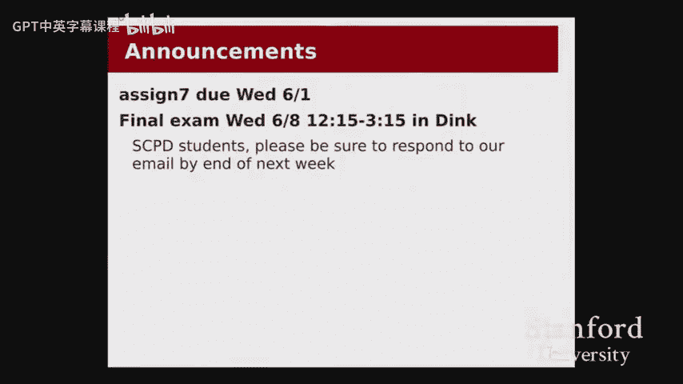
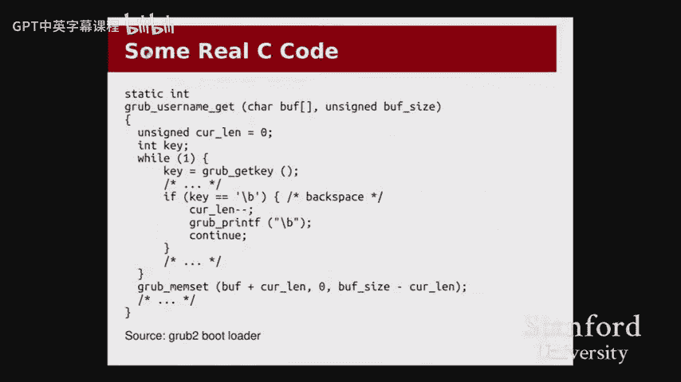

# 【计算机组织与系统 cs107 2016】斯坦福—中英字幕 p13 【Lecture 13】CS107, Computer Organization & Systems -13upiQTl4R8- -BV1Nr421c7YB_p13-

Let's get started。Ooh， this is thing working now no， it's still okay。All right。

 welcome back everyone to the final lecture of CS 107。He喂。😊，Okay。

 let's get into things real quick just a couple of announcements， mostly today。

 as I mentioned on the kind of on the website， mostly just kind of a little informal just a chat about where we ended up and we' kind of。

😊。

Exciting prospects are open to you now that you've worked you've worked so hard throughout this quarter and sort of where we can go from here。

A couple announcements to kind of round things out。We've got。

The two things that I'm sure are very much looming on your minds assignment 7 and the final exam。

 So we've got assignment 7。 that is just a reminder due this coming Wednesday。

 the first with the hard deadline of Saturday， the fourth。

 keeping in mind that that is in the middle of。Finally， Dan， so please plan accordingly。

 We highly encourage you to get。The submission in by the first。

 and a reminder that we will take absolutely no submissions after the hard deadline with no exceptions。

 We have to get these things graded。 and we have to get them graded pretty pretty quickly。

 so we can't really make any kind of。Any sort of exceptions like that。

 So please make sure to get on that and to get something in。You know， by the deadline or at worst。

 the hard deadline。We've got the final jam coming up。

 I guess that's about a week and a half from today。 So that's gonna be on the 8th。At 1215 to 3，15。

 that's like right at the end of the exam window。 So this should not run into any other class exams pretty much。

 We only have one exam room this time。 That's kind of nice。 So we'll all be in dink。

So please don't come here for that， you won't find anybody or if you do。

 they won't have anything to do with us so that could be bad。

And then just a quick note to our SPD students and also to anyone who has， for example。

 an OAE accommodation， please get in touch with us at the staff email list again。

 even if you've gotten in touch with us for the midterm， please make sure you。

 you specifically email us about the final so that we can make a new list of SPD remote students and OA E students and things like that。

😊，And then just a note about so the practice final。

 we will have a practice final that will be posted within the next two or three days。

 turns out the process of updating that to work with the new 64 bit and stuff is。

 is maybe a little bit longer than normal。 So we just need to make sure that it's correct and that there are no surprises。

Okay呃。Everyone okay with that any？The final logistic kind of stuff。狗狗。

So the language today is just kind of wrap up， sort of。You know。

 so I'm kind of bringing this up into two different pieces， which is sort of like， all right。

 you know， we've just spent。9ine is weeks working through a bunch of really challenging。

 really intense material So part of what I want to summarize for you today is just kind of why does that matter and hopefully I can get some of you to chip in on that you know what you thought was useful to get out of this class but also kind of I want to give you a little bit of a sense of where C shows up。

In， in the real world。Where people care about。Systems and the work that we've been doing this quarter。

 And then I want to give you an overview of kind of where to go from here。

 whether that be in later classes， whether that be with。Jobs， internships， research。

 kind of anything in and beyond。Computer science。So， yeah， mostly I want be kind of off sides。

 I'm just gonna sort of talk to stuff through， but I'll leave that there。

 I want to show you a couple little， little pieces。

 So I kind of just want to talk a little bit about， you know， where exactly we've ended up。

 And I want to just talk about like。How where 107 kind of fits in。In the。

Sort of grand scheme of computer science in the， in the big picture of the major。AndSo。

Maybe just a little story here for those who are interested in C， S and who。

Don't already know about them。 We have a course advisor who is a graduate student whose job it is to help。

C， S majors and prospective C， S majors and， and also grad students， undergrads A grad students。

 you know， to sort of。Know what the lay of the land is in terms of classes， requirements， jobs。

 research and， and all that。 They can just give you general advice。

 as well as sort of specific things like。Am I going to graduate， Do I need to， you know， should。

 how should I plan out my requirements and things like that。A couple of weeks ago。

 we were interviewing for。This course advisor position。

 and one of the questions that we asked the prospective course advisors was if a student came up to you and asked you and said that they only had time to take three C S classes。

 which classes would you recommend and why。And as I understand it。😊。

Pretty much everybody we interviewed said 1，0，7 as one of those three classes。

And I think that's somewhat telling as to sort of where 107 is positioned。

Sor of in the grand scheme of things。So。But so instead of， you， me sitting here。

 I'm sure I can make some kind of list about all the things like why 107 is。

Is would go on to these folks' lists and whatnot。 But maybe I'll， I'll open up to you a little bit。

You know， what kind of things do you feel Like， if there was one thing that your friend or something said。

 okay， you know I'm gonna to take one of 7 or I'm， I'm thinking about it。

From whatever background that you can。That that you're interested in taking on it， you know。

 what would be something that you thought was pretty useful。

 So something like kind of the most valuable thing you felt like you got from this class。

Anyone want to throw anything out there？Anything？I guess one to understanding the nitty gritty a couple of concepts that。

The crossed was brushed off I oh， you don't need to know oh worry got it。Yeah，Yeah。

 so I'm not sure how much the SPD are' getting the student responses。

 so the comment was looking at kind of the nitty gritty details that sometimes previous classes and I actually think to some extent future classes even right will totally brush off as like yeah yeah。

 that happens， that's system stuff right like well this is this stuff and no you hopefully you get a。

A feel for that kind of。Those kind of details now。And knowing how that works。来요。

Using a debugger like G。 All right， so using a debugger or G， yes。

 that is a very important aspect of。Of what we are trying to build up here， I can tell you that。

You know as you move on through the classes， for example， in if you were to continue， for example。

 110， that's how going to come back right and in fact。In 110。The TAs don't look at your code。系哋。

Are they are somewhat assuming that you are going to be able to walk into that class with a a good feeling of how to G your way through something。

 how to use Valelgrain to get information about memory management。Yeah， kind of that's basic。Okay요。

It's learning how to read assembly。Yeah， learning how to readasse you know。

 other that's certainly hurt to get to an area of like this could be really relevant to you I can tell you that there are a couple of1 of 17 in。

Downstream class， and they sure were reading a lot of the last couple of days。

 anyone attended my office hours。So working through that， like yeah。

 it turns out that does kind of come up。In。More ways than you might expect。

 assembly does kind of really ugly have， but just kind of having that working on。

Understanding what goes on behind the scenes。high level programming language。 Yeah。

 so understanding what's going on behind something like a higher level programming language， Right。

 So like now you're actually pretty equipped to understand how Java or jascript or Python or all other languages work in a longer quarter。

 you know， for fall winter， We spend a lecture to talking about Python and just kind of comparing and contrasting and saying。

 look， you know， we learn all these things about memory and pointers and addresses。 Hey， guess what。

 that's still there when we're in Java when we're in Python。 It's still exists。 It's just that。😊。

The language is trying to kind of hide that from you， in a sense。Great， anything else。

Something that wasn't fun， but having the focus not be on learning C。

 but on just getting the assignments done， increased my confidence and being able to just get place to try。

Yeah， so， so the comment is just sort of， you know。

 a feeling like you really have to kind of make those assignment deadlines like， you know。

 believe us。 we realize how。Sort of generally challenging this， this class is。

 how much the kind of workload is certainly in a spring quarter。

 when we also lose week 10 because of the Memorial Day holiday， it's， it's a pretty。😊。

It's a pretty kind of a， it can be kind of a rush， kind of a bit of a crunch sometimes。

 But we do hope that a certain part of that is kind of， right， as you say。

 kind of building up this confidence。 like， yeah， I can sit down in a week and just kind of work through some issues。

 I can work through what I'm being asked to do。 I can solve problems。

 I can get unstuck sometimes with help。 sometimes on my own。And I can just make deadlines。

 And that's gonna be really important， right， It's gonna be important kind of anywhere you go。

 doesn't have to just be restricted to classes。 But， you know， even in kind of job environments and。

 and research， things like that， right， there are always gonna be these， these deadlines。

 There's always gonna be this kind of all right。 You just got to make something happen。 Like。

 what's it gonna take。Digging through man pages and searching out。 Yeah， yeah， details。 Yeah。

 so so man pages， kind of the details， right， So there's kind of that， you know。

 so kind of coming back to this like knowing where to get help， right， in maybe you know，1 of6， A 10。

6 B。 you could you could kind of rely on the textbook。 You could rely on this。

 these nice little well， you know， totally written out handouts about here is every function。

 you're ever gonna need to know from this class or or maybe you have these nice little web based Java docs that you could just control up your way through the whole thing。

 And， and and that's seldom gonna be the reality。😊，Of。Much of of a lot of different aspects。

 So being able to kind of work through a man page， being able to work through some kind of an an interface。

 right being able to pull up a dot H file and say， what are。

 what does this function take and what does it return， What are the edge cases， These are all。

 these are all really useful skills。Great， yeah。Anything else？

Is there anything that maybe you're you know so。Supposing that you are interested in moving on to another CS class or something like that。

 anything you're excited to maybe leave behind。There。Anyone like， yeah。

 maybe I'm just not come back to sea for a little while。

This is mostly the just for me because I know it was really used of blind， but I hate using them。

Allright。 Well， yeah。 so text editors command mind text editors。 It's funny。 You know， I。

 when I took 10，7， I absolutely just used a graphic text editor。 I used， I used G editit on my。

 on my machine， but I was on Linux。 And then I think it was。😊，Sophomore year or junior year。

 I was doing something。 I was doing some research project。

 and my text editor just like broke because of some update or something。 And I was like， well。

 guess I just have to commit to learning them properly。 And I spent。I don't know。

 like three months learning them like daily。 I would spend maybe an hour or to each day before I went to work before I went to the office。

 just doing just like reading up on vim tricks and stuff。 And I sure' learn vim。

 and I actually Ive totally I've actually totally written essays in vim。

 it's actually gone to the point。 They' like， I'll take taking like a humanity science class。

 I'm like， okay， I need to draft my essay。 I could do this in word。 But gosh， you know。

 it's so nice to be able to like C W， Cha of words。 Yeah。

 Im just should write this in vim and I want to copy paste it over the editor to the word processor later。

😊，So。That can happen。 I don't know。 Do I recommend it， Probably not。Anything else that you're like。

 yeah， I'm going to be real excited to。Take a different approach。assemblyly was kind of torturous。

 Yeah， yeah， yeah。 So that's definitely kind of part of this like， hey。

 do I ever have to see assembly again， usually know even in downstream systems， right， So so that's。

 that's pretty nice in some sense。 Like I think， I think the general advice that that I would give for。

😊，Working at different levels of abstraction is just like， you know。

 if you're gonna work at abstraction level X， right。

 you kind of do have to know how x -1 and x plus1 both work。 You kind of need to be able to。

 So say you are programming like a web application。You know。

 you kind of do a little bit need to know how the Internet works。 It's pretty hard to。

Really write good web software without knowing what it's built on without knowing what the browser is doing behind your back and what assumptions it's making。

 I think actually， a lot of developers have kind of found this out over the course of the last。

 I would say， decade or 15 years， right， like， oh， well， could I just you know， write some Java。

 write some PP or whatever and just call it a day and never worry about efficiency。

 never worry about what the Web server is doing。 And a lot of these larger companies as they're scaling up and things are realizing。

 no， no， you do need to know a little bit about stack versus he you need to know about pointers versus memory。

 you know， pointers， memory addresses， all that stuff。And so there， so in some sense。

 there is maybe probably a smaller subset than the whole class at large who。

 who will need to know something about I S A as an assembly and， and。

 and that will sometimes come up。嗯。Let me give you a couple let me just switch over here a little bit and just give you a couple of examples of some some cool stuff that I I hope you can kind of feel like you got。

Out of the class。 And， and either just kind of。Somewhat picking up back on， on what we were。

 what we've talked about before。 But also like， so this first example。

 I kind of just want to point out sort of two key examples。 One is just。嗯。That now that。

You've gone through all that， those nitty gry details， all the， the C and the。

 even the assembly and all that on the first day of class。

 I told you some a little bit about this really fun security bug that was discovered last December that was lurking in。

😊，The code of a pretty commonly used bootloader since 2009。And here's the code。

 And I actually just want to put this up there。 You know， just as a， like， so I。

 I actually went into the， So this code is open source。 I went in and copied， copied the code。

 I think I deleted a few new lines， but I did not actually change the code in any formal way。

 for example， you know， you'll notice I use one set of true for various reasons， but。

You've got to see this code， right， and it should look really familiar。

 It should look really similar to the kind of C code that you've been writing you've been working through。

 Yeah， okay， that's not a function that， you know exists， right， What does get key do and whatever。

 But you can nevertheless， you know， you see a call to them set。

 Maybe that was a function that you've。You've used。Here and there and。Anyone see the bug？

Kind of a fun little blog， I guess I just isolated it。Right。

 so what happens if curl land is 0 and we subtract one from it。 So if we enter a backspace。

On the keyboard， we make Kland go to what value does it go to。HYou went Max， right。

 because it's unassigned。Right right， Okay， Does't actually matter here。 interestingly enough。

 because now we take the M set。 So we start with， with Buff， which is some pointer that the。

 the client has passed us， right， And we add K lens。 So when we do the addition。

 that's gonna wrap around。😊，There's actually a really interesting。Small data point here。

 which is that it's actually， this is running on 32 B。 So this actually ends up。

This would have a slightly different effect on 64。 but that's not super important。 Anyway。

 the point is， weve been set before the start of the array。 How exciting。 What did we get there。

 I don't know。 Maybe it was return address。 And maybe we just took over the machine，😊。

So this is a bug。 It was kind of neat。 And I guess， you know， okay。

 it's one thing to be able to just， you know， pick out these， these pieces of code。

 And I'm sure you'll find a lot of examples。 There was shell shock。 that was heart bleed。

 These are the kinds of things that came up in the last couple of years。

 Maybe you heard about them in the news。 Maybe you were like， yeah。

 whatever techie people doing techie things， whatever。 But but。😊，I， I hope that this。

 this is just a kind of a small little snippet to just give you a sense that you can kind of read very real sea code。

 One of the things that you could potentially do， probably after， you know， he allocateator。

 you can totally go。And like download Lib C。 And you can go read what Q sort does。

 You can read what St comp does。 You can see all the really cool bit tricks that Stirland uses to actually not run in quite a of end time。

 It actually runs in a slight， like。😊，8 x faster than your naive O of N。And。

 and you can really kind of start to work these things out， right？ And this is。

 this is real production code， right， This isn't just this。

 and this isn't just code that systems programmers need。

 This isn't just code that you have to know if you're actually writing these， you know。

 if you're calling them copy yourself。 but Liby， for example， is something that every。

 pretty much every。Program on your machine counts on。If not indirectly， the Python interpreter。

 the Java virtual machine， all of these things are gonna build on top of Li C， right， and。

 and so hopefully， you can feel that there's a certain amount of。Power。

 a certain amount of confidence， a certain amount of yeah。

 like I can go and pick this up and you know， someone can hand me a piece of C code and I can just you know。

 eat it up。 right， Here we go。And then just kind of maybe a little bit of a transition into。

 some of you might， you know， maybe thinking， okay， yeah， that's cool， but like。

I'm probably not gonna program and see again， right， Like， who cares， It。

 isn't C kind of this old fashioned。 Nobody really cares about this language。 So the Aee， the。

 a consortium of。engngineers and whatnot puts out does a survey based on things like Google search terms。

 Gitthub， repoos， which track language， things like that。

Job ads posted on like career  builder and places like that for sort of the top。

 they have a list of 48 languages that they check for。And so I got， I extracted the list from 2015。嗯。

And sorted it by。 And， and I used their filter for。The top。Languages that they saw in job postings。

Right， so of all the kind of job ads that they were running into， like， what are the top languages。

Maybe the list might surprise you a little bit。

So here at the top we see Java， maybe that's not super surprising， Java is just kind of everywhere。

But I mean， number two right there is C， right， And then you can kind of go down the list， Python。

 C sharp， C plus plus， all that good stuff。You know， maybe you've heard of some of these languages。

 shell is number 10。 And then if you're wondering good old number 48 with a rating of 0。0 is Ocal。

If you don't know what Ocal is， you're probably better off。😊，It's a good old time， anyway。

I don't actually know why I't know how they decided what's on the list。

 There is assembly on the list。 I didn't see where it was。 But， you know。

 I think so there's a link here。 I want to post the slides and you can try to go there。

 you can play with some filters。 You can actually like see， hey。

 what are the top languages that are on， on Github。 What are the top languages that are trending。

 Apparently C is trending。 I like I click the trending tab and see what's number one。

 I think second is like C plus plus I was like， I don't know what this means。

 So I'm not gonna put it in my slide because like， why is C trending in 2015。

 I'm not sure they call it rapidly growing and like， oh， Me cool， I don't know。 I believe you。

 I guess， but。😊，Certainly， there are lots of jobs out there that expect some amount of C knowledge。

 if not C plus plus， but probably actually， a lot of stuff is still being written in C。

 And that's not just because it's legacy。 That's not just because it's old fashioned and people don't。

 don't want to change， although sometimes there may be a little bit of that。

But it is because a lot of， a lot of technology does depend on performance。

 A lot of it depends on efficiency。 and， and then some aspects of it depend on being really close to the hardware and really feeling like you have control over the memory。

 have control over the pointers， the generated assembly。

 And that turns out to be really important in a lot of different fields。 so。Yeah。

 it still relevant it。系。

So we going give a bit of a。Oh， so I think one of the best lines of that article。

 So not on the linked article， but there was a related one。

 Someone posted a comment at the bottom of the article that said this So the article was posted in 2015。

 And the， the commenter said 20 years ago， I had a professor who told me that C would be dead in two years。

😊。

And and so so this person concludes clearly they were wrong。

 But I'm actually still having a lot of trouble figuring out what in the world that professor was thinking 20 years ago。

 like what was gonna take over C back in 1997。 I mean。

 it's one thing to say that that C is gonna go go away now。

 I think most people are pretty have pretty much come to the conclusion。

 if not reluctantly some people， perhaps that C is not going away。

 and it's not gonna go away in two years， It's not gonna go in5。 It's not gonna go away in 20。

 most likely。 I think that it's， it's at the point where it's just so kind of ingrained in。😊。

What a lot of systems is that it just really is kind of。

 it just really solves a lot of problems that a lot of other languages don't。嗯。H， everyone， everyone。

嗯。でそれは。A bit of a， I guess， kind of a slight caution， though。

 as we kind of walk away from this class。 So this kind of comes back a little bit to。The comments。

 one of actually the comments that Meredith our a student services administrator。In， in the C。

 S department kind of mentioned to me while doing these interviews for the course advisor。

 one of the， one of the candidates who mentioned 10 7 as one of the top three classes that they thought。

 you know， everybody should， every。I'm not sure exactly what the filter was。

 but that they would recommend to someone who wanted to take three C classes。

 One of their comments was。You know， after taking 1，0，7， like。

 I was surprised my computer can even turn on at all。And I think like。

I think it's easy to get into this a bit of a trap there， right。

 where we spent so long talking about integers and floating point and assembly。 And at some point。

 you kind of look back and you're like， wait。Like， you know， I type in one fourth one。

 The number comes out， too， like。Is something going on there？

 Is there some like binary magic here like， am I going to run into overflow if I take x plus Y。

On one hand， there's some real power in that。 There's some certainly some。You know。

 very relevant thought processes。 We've seen lots of different examples of overflow and floating point round off being real problems。

But I do want to kind of warn you against。Breaking abstractions and going kind of， you know。

 really kind of。Picking the right tool for the job。 right。

 So one thing that I think used to happen more as we， you know。

 as students came out of 107 and went into 1，10。 And I hope this is happening a lot less now。

 is that S would come out of 10，7 thinking， oh， man。

 I've got so much power over memory and pointers that I'm just gonna take it。 Like。

 when I don't need it， I'm just gonna take it。 And so， you know。

 did' get some assignment where they had to go through an array of ins。 And they would think， oh。

 gosh， I can't trust the compiler to do array bracket。 I， I need to cast this to a void star。

 and then store it。 And then I need to cast it to a carestar。 and then add I times size of int。

 except maybe I'm worried about the size of my int。 So maybe I should just hard code a number。

 I don't know。 And then of course， I can't just read an int out because what about overflow。

 So I'm gonna mem copy。😊，You know，And at some point， you kind of look at and you say， well。

There's a lot of。Really solid abstractions。That we've also。

 we've been really kind of learning about throughout this quarter。

 There are a lot of tools that can do a lot of things for us。 And one of the most important， I think。

 lessons from systems is knowing what tool is right for the job， knowing。You know。

 trusting the compiler， trusting the type system。Feeling confident that library functions will do the right thing in。

Most situations that we could possibly want， and then knowing when we should drop down to something like a void star。

 knowing when we should be using mem copy instead of a simple equal sign。😡，I think that's。

 I hope that's one of the things that。we don't lose sight of as we work through as we've come out of 107。

呃。One of our one of our professors， Steve Cooper， once told me that like。Systems is actually unusual。

 even as a field within computer science， for the amount of collaboration that needs to happen to just get anything done at all。

 I found this， this idea really interesting。 because I， I always kind of thought， well， you know。

 yeah， I mean， systems is cool， But like， if I understand the low level。 Well， couldn't I。

 I can kind of just do stuff， right， But but Steve reminded me that， no， of course not， right， Like。

 you can't build up。😊，A system， any reasonably sized system without depending on so many other people who came before you and so many other systems and so many other tools and abstractions。

 right， the operating system， the hardware。 So think about all the different levels of abstraction we've learned about so far。

 the abstraction of caches， the abstraction of the I SA when it comes to sort of what the assemblies is actually doing on the hardware。

 the the type system the comp compiler as， as an abstraction for kind of， you know。

 optimizing R C code， right， you know， and then moving up the chain as well into higher level languages。

We need to understand， we need to understand these abstractions， and we need to understand these。

 these lower levels sometimes， but we don't want to lose sight of them。

 And we don't want to discard them。 And sometimes you can just， you can just say X plus Y。 You know。

 sometimes you can just say a ray bracket eye and everything's gonna work out great。 so。

 so hopefully。When you， you know， were you to take pretty much any other class that you can kind of make those。

Make those balancing and those kind of judgment calls。You know， as needed， right。

 don't rewrite library functions。 And even like， hey， you know， we didn't。

 we never hand generated any assembly because， well， gosh。

 the compiler was gonna to do it and it was gonna to do it better。嗯。Okay。你朋我说呢。

So I want to spend the last。You know， I w to do sort of the last section here is kind of。

 where do we go from here， So， yeah， I haven't actually written anything up。

 But because I think it's all gonna kind of。Apply to many of you in very different ways。

 So I I don't think there's any one path that will work for， for more than really any one of us， so。

It's kind of so where do we go from here？😡，I think this can kind of be broken up into a few different。

Branches。E four people。One branch is the。The sort of the student who。

Went through this class and said， yeah， this is it。 I'm totally into this， right， Like。

 that's not to say it wasn't challenging。 I think it's challenging for。

Quite literally everyone in the class。But， you know， who felt like the systems was a pretty good fit。

And。I guess for that student， you know， the recommendation is pretty easy in a way。 It's just， hey。

 keep taking more systems。 right， It's gonna be great。1，10 and is the kind of later principles class。

 which is kind of in many ways， you can think of it as a bit of a breadth into what down you know So so that kind of student can think of 110 as kind of a breadth class into what downstream systems look like。

 So what does it look like to work on an operating system。

 What does it look like to work on a compiler or networking or like a router to write a web server or some kind of bigger application。

😊，And that， I hope， can kind of provide some guidance into what。Downstream classes look like。

So that could just， that could be it right， And， and if that， if that's you fantastic， right。

 go for it。😊，Keep taking more， more systems and off you go。I think there's another category of。

 you know， another group of students， probably a much larger group of students in a way。

 who got through 1 of 7 and said， you know， like I still kind of like C S。

 I still think this is a pretty cool idea。 I still like where we're going with this。

 But this just wasn't it This class。 This material wasn， wasn't it for me。

 I can tolerate a quarter of C programming。 I can deal with the assembly and the low level。

 But I really miss Java I really missed the higher level like just sort of garbage collected。

 I don't have to explicitly manage my memory。 So what should I do is C S gonna work for me And to。

 to you， I would say， yeah， absolutely， absolutely There is。😊，Abroad。

Spectrum of what computer science is and what we have shown you here this quarter is only a small subset of that。

For you， I would say， you know， if you were looking at declaring C， S。C， F 110 is is a core class。

 It is required。 It is， and it's， it is going be more systems， but。I wouldn't go into that thinking。

 oh， man， this is gonna be， you know more the same。 It's going be kind of rough。

 I would look at it as kind of just a。As as a bit of kind of an extension of today in a sense。

 as an extension of， so what did I really learn from 10，7。

 What can I do with the tools that Ive I've gained that I can actually start applying to these larger things that I'm going to write to these higher level applications so you think of one time as just kind of as a bread class for stuff that maybe you aren't gonna continue in。

 right， Maybe you just won't take the operating systems to the compilers class。

 but just kind of having a little bit of working knowledge of what's going on there。

Can help you to you know， get into that and then say， all right， Well， now， now what should I do。

 right， And with a combination of what certainly with 1，0，7。 And I think for some classes。

 maybe with 1，10， like。You're in a pretty good spot to go explore a variety of other。Really。

 just anything else in CSs。So we've got， there's the math side， there's sort of the the theory。

 the 103，109 kind of space， there's the AI kind of stuff which is super in right now right。

 And then there's there's a lot of different。It's kind of the， the graphics， the HCI。

 the data management。 There's a lot of， a lot of stuff that's very relevant that can， you know。

 make them do some pretty cool things。😊，That。I think is， is definitely， is definitely open to you。

And then I would say， maybe there's you know the the other there's another category of student who's just like。

 yeah， well， you know， maybe Im， maybe I'm not。Going into C， S， right， I think that's。You， you know。

 like this is maybe a bit of a more relevant message for 1 of 6 B。 But nevertheless， I。

 I think there's still a good group of people who are here， you know， or， you know， ins or M C S or。

Or some other engineering major， for example， or even just kind of something completely different。

 who's like， okay， well， what was the point， right， Like， I SAT through 9 weeks of this。

 Well am I gonna get anything out of 1，0，7。 And I think that a lot of that is gonna come down to that kind of the confidence and the tools and the the just sort of knowing。

Yes， this is how my computer works。 Yes， this is how I can get something done。

 This is how I can solve a problem。 even when this was just kind of not the space that I was。

 I was looking in。 And I think， you know， that that kind of skill is gonna still be really valuable for you to consider some。

😊，Some kind of applications， you know， even outside of the sort of mainstream C。

 S curriculum and and outside of a sort of a classic software engineering position or software developer position。

 the kind of self sufficiency the kind of problem solving just sort of， you know， putting on your。

 your hard hats and just kind of going at it。The sort of I think the term is sort of the kind of industriousness of what you've gotten from this class。

 I think is is also still really valuable。So hopefully you can feel that whatever group you're part of kind of。

Fits into that that you still feel that 107 fit into that。Into some kind of role for you。嗯。

So maybe I just， I'll just open it up to questions。 I guess I have a couple other， you。

 little things I could talk about。 I don't know， like。Specific classes， specific tracks。

 job opportunities， internships， research。Section leading。

 These are all exciting things that you could do。 So I'll just open it up to open it up to you。

 you know， what are your thoughts， Any， any comments about。

About the class or any questions about where to go from here or what you're thinking。

Well I have a question Sure what were some of your favorite classes at the Stan？

What were some of my favorite classes。 So I'll just be straight up。 Like I was really into systems。

 I got really into it like really quickly。 I think 107 was probably just actually one of if not the favorite class that I had。

 So I did actually really enjoy kind of working on the sort of the big project I really liked operating systems that C140 I had a really good team and we just we just did it。

 I think I told one or two people this story already that maybe had some pretty epic bugs and some pretty good stories that came out of that know。

 bugs that last days that you we all just sit in a room or like where's the bug where is it。

 what are we gonna do And like we're all GD being and maybe somebody。

 one of my team members is like no Im want to print my way through this And were like， don't do that。

 there was actually an amazing bug in 140 was one of the first bugs I ever encountered so I was working on some stuff。

 And then。😊，My partner was working on some stuff， and we were kind of going。

 And then I get some code that， you know， sort of works。 And he doesn't。 And he's like。

 I don't understand what's going on。 And like all the timings are off and everything。 And I said。

 well， you know。You know， didn't you implement it kind of， as we said。 And he's like， yeah， yeah。

 I have that。 And at some point， he was like， I was like， oh， well， what's this number。 He's like。

 well， I don't know right now， Like， I've got thousands of prints。 I don't know what's on。And I said。

Hey， is it possible that the printf is your problem。

 Is it possible that the printf is messing with your timing， Why don't you try deleting all of them。

 And he deleted all of them and his code worked。And he was like， what happened been like to dude。

 you can't do that， right， The printf will just mess with everything in the operating system。

 And so GDV， GDPDV is good。Another favorite class， actually。

 another really favorite class of mine was the senior project class， C， S 1，94。

 I took it actually pretty early。 I did not take it when I was a senior， but I， I really liked。

 I really， so maybe this says something about my work styles is something about kind of just the way I I like to work。

 And that's， you know。😊，Pretty specific to me。 But I really liked the autonomy of just being able to sit down。

 So I worked actually the same person because I didn't learn medicine。 No， but he was really good。

 He actually created some really awesome stuff。 And we， we SAT down and we were like。

 we're gonna make a project。 and it's gonna be huge。 We're gonna make this like， you know， massive。

 like， I don't know what we were doing。 with some huge。😊，was， we had this idea to make this huge。

 huge like game of some order of magnitude that we never achieved。And。

 and so we just SAT down and we said， we're gonna use this like crazy new fancy technology And。

 and we just did it。 And against the advice of our T A， who was like。

 I don't know if you should use that technology because none of us are gonna be able to help you We said now。

 now we're gonna do this isn't be great。 And， and we start working through it。

 And it was just kind of fun。 It was just really nice to be able to really design something kind of from the ground up to be able to say。

 yeah， like， hey， so， you know， to kind of set up these abstractions is something that I think is。

 is pretty uncommon in a lot of classes， even sort of downstream。😊，Right， for me to tell him。

 all right， So I'm gonna write a method。 I'm gonna to write a function that does this。

 And the output's gonna look like this。 And I'm assuming these parameters are like this。

 And for them to say， no， no， no， that's not gonna work。 right。

 I need the parameters like this so that whatever。 And and really kind of designing those interfaces。

 sometimes on the whiteboard， sometimes in in a header file， just really kind of scratching it out。

 We were actually working in two separate languages also So then you know。

 we couldn't really just sort of mismatash the code at all。

 So there needed to be this very clear separation。 And I totally appreciate just being able to。😊。

Do that kind of big picture software design kind of space。 So I don't know。

 Those were a couple of them。Could you talk a little bit about sexual Yeah。

 it is a good time to get involved and how you get involved in CS。So so section leading， yeah。

 so section leading is an awesome program。 The C， S 1，98。 So it's。

 it's generally referred to as C S1，98。 We've got a few grad students who are kind of coordinating all of that whove all。

 who've been section leaders and have， you know， really are， are doing a great job kind of training。

😊，Treating our section leaders and getting getting them into a good spot to help out with the 106s。

So every quarter there's in terms of how the mechanics of how to get involved， every quarter。

 there's an application process where you where you you apply。

 There's an interview process where you sort of demonstrate some of your your debugging skills。

 hint pointers always show up on the debugging interview's where you demonstrate some of your you teaching。

 And then， and it's an awesome community of people who are generally not only really excited about teaching and really excited about helping other students。

 but are also just really cool people， really smart people。

 There's always a lot of cool opportunities， tech talks free。

 all sorts of whatever and and sort of great opportunities。

 So I highly recommend that as a coming out of 107。

 you're all very equipped to to help out with the kind of know。

 any kind of 106 B pointer linked list kind of problems， things like that。

 so you shall all feel pretty good about being able to walk into that。😊，The downstream courses。

 So I should say the section the program applies to the the 106 is， 106， A。

 B and X downstream So here in 10，7， as well as in the other classes 103，1 or，9，1，10。

 we've got we work with grad student T As。 They're often coterms。

 Sore often almost always people who have taken the class。

 And so if that seems like something you'd maybe be interested in。

 if you maybe interested in the coterm or something like that。 And maybe keep that on your radar。

 And in which case section leading is a great kind of head start into that。

 and is a great way to just kind of。😊，You know， get a feel for what teaching is like。

 And I can tell you， when we start looking for T As，1 a 7，1，10。

 we're all pretty much in agreement that we， we first thing we look for is who's been a section leader right。

 Because that's， that will definitely be a sign of someone who is a。

 a solid candidate who we're gonna want on our side。So yeah， it's a fun program。

 I did it for a few quarters Before I got into1 of 7 T A。 It's just。

 it's really fun to see to meet all the， all the new students， right。

 It's really fun to just kind of I really like a， actually， I really like just， you know。

 all the new students are like， oh my gosh， this is so cool。 Like， I can make breakout。

 I can make all these things。 And， and then the community is just kind of an awesome little。😊，Yeah。

 as a little social social dynamic there。Anything else。诶。Anything that's not？

Specifically cost related， anything like。H，我见 job。Research。

What are the most exciting areas of systems research do？nextSure， sure。

 we go to areas of systems research， what do I think is the next big thing。

 man I feel pretty unqualified to answer this。 what we have during the fall winter。

 we have our department chair Professor Alex Aikekin come in and give a talk about his research topic。

 and it's one of the research one of the areas of research that he works on。

 and it's actually really cool。''s it's a。😊，How does this work again。

 It' it's a probabilistic optimizer。 So it'll like take your assembly code or maybe it takes I think it takes your assembly code And it just like and it it runs it through。

right， So way works it takes your， It takes some program And then it will like probabilistically like okay。

 so it'll generate， I don't know millions of test cases or something and just throw stuff at it。

 And then it will perter the program。 it will you change i plus1 to i plus2 and I plus1 I1 and ampersands and stars all over the place。

 And and after I don't know a few million iterations。ll get another program that works。

 and it might be just a little bit faster。 and it keeps doing this。

 and eventually it actually comes out with some pretty impressive assembly。

 So there's a lot of stuff going on in I mean， it kind of depends on the area。

 there's a lot of stuff going on in that kind of。😊，Compils， optimization， stuff like that。

 There's a lot of， I think one of the big things that is still pretty active is virtualization。

 So finding a good way to make use of we have a lot of hardware on our machines right now。

That is actually not being used pretty often。 And so being able to find a good way to make use of that。

 there's， of course， there's a lot of scalability and kind of high performance discussions。

 So like I think Google like five or six years ago。

 completely changed their data center infrastructure to use some stuff that actually came out of Stanford less than a decade ago called software Def networks。

 And they they just like they're like， yeah， this seems like cool， we're just going to do it。

 And that's still a very active area。😊，Of that。You know， so a lot of it， it's interesting， right。 So。

 so research is one of those interesting areas where it's not always clear how it connects to industry。

 but I've often actually been really surprised by， as I'm kind of。

You know talking to some people about systems research or reading about some some article。

 and then just hearing like， oh yeah， yeah， Google uses that。 like oh really。

 like that's kind of cool。 that was invented like five or six years ago。

 that was invented 10 years ago。 there's a surprising amount of tech transfer that happens between academia and industry there'ss a lot of R and D that happens in industry actually as well。

 And I think it's actually pretty exciting So you can see a lot of the AI research for example。

 is really kind self-dring cars that kind of thing're doing it。

 they're actually trying to build these things and make them happen。

 And and while it may a little bit harder to see that happen in systems。

 It may a little harder to say， oh well， I see that Windows did X or that mac did why you can see these things are actually happening actually one thing I can think of there was another research project that I think within the next last 15 years。

 And that was implemented in the most recent version。😊，Windows they're like， oh yeah。

 this seems like a good idea。 This would make data center performance。 like 50% faster。 when I do it。

 And then Mac O actually implemented a really sweet little security feature in Lcaptan that I ran into while trying to fix my mom's Mac。

 And I had to turn it off by going into the terminal and hacking the thing。

 because it broke the update。 But that's a different story。 But anyway。

 was that was the kind of thing。 And actually it was something that I had learned about in 140 I was taking an obvious systems class And they were saying oh yeah。

 bla blah， know， security blah， bla。 here's I did it。 And then I do a little bit of googling。

 and they're like， oh yeah， that's in L1。 And here's how it impacts the situation。 I oh so。😊。

It's all very relevant， I guess， is what I'm saying， it's all happening。Any else。So yeah， I mean。

 I guess maybe just a little bit of a mention about like。You know， internships and jobs and things。

 right， I think one of7， I think the， the standard。

The word on the street is that 107 is very much a a gateway into that kind of those kind of aspects as well。

 just because right there's there is like and and even even for companies that aren't gonna ever ask you to program and C。

 right， Again， it's it's the confidence。 It's the tools。 It's the abstractions。

 They just want to know that you've taken 107。 And then there are companies that do work in C。

 And they want to know that you can do some bit wise。 They want to know that you can do some。

They want to know that you can do some pointers and some memory and you can tell them that you probably know more about floats than most engineers because that's kind of how it is at this point and it's all so hopefully you feel like there's a。

There are some good opportunities there whatever space you're interested in。Any kind of。

Pinishing thoughtsts。Mi anything。Okay。I should say。

 did you talk about why we do code review and what were the last class of review？So， so the。

 the comment is sort of， is this is about sort of， So you may have noticed that throughout the assignments。

 you know， we've been doing some pretty intensive。Code reviews and sort of style feedback。 And。

 and the thing is， you know， you may have heard this when we talked about。

went in like maybe the 1 of6s may have mentioned this， idea that。We write code for people。

 not for computers。 And， and that on one hand， it is important to make sure that our code works。

 It's important to make sure that it it produces the right output。

 which is why we simultaneously move towards， you know， the output based kind of grading of。

 of your programs。 But a lot of it comes， But a lot of。

Industry and a lot of academia and a lot of just kind of downstream is really going to count on you writing code that other people can read。

 right， so。You know， when I talked about the classes that I really enjoyed。

 I enjoyed them because I got to work with friends of mine。

 and part of the reason I enjoyed being able to work with my friends was that I knew that they would write good code。

 right， I knew that whenever they would commit something into the version control that I could open it up And I wouldn't be like。

 what what does this do I don't understand And and it makes a huge difference。

 It makes a huge difference in terms of just being able to make progress in reading somebody else's code in terms of reading your own code。

 actually about a week ago， I went back and looked at my17 code。 And boy， it's it's the thing。

 sures the thing。 But you know， I actually kind of see myself I remember consciously thinking this trying to change up my style over the course of the quarter and thinking about should I how should I write these lines little things sometimes。

 But like whether I should use different forms of capitalization or how I should name my methods and things like that and I。

😊，I appreciateciate that because kind of by assignment 6 and 7， I look back and that yeah。

 that's actually now my coding style。Right， I do write code that does look very similar to the stuff that I was writing in assignment 6 and 7。

 and so。At this point。You know， hopefully you found that kind of feedback to be useful。

 Maybe you may have found it a little bit frustrating at times when hes thought， man， you know。

 I spent hours and hours and hours working through this， this stuff， but。

And and all my T A can say is bad variable names。 You know， come on。 I was like， you know。

 was I gonna do at 115， But but hopefully it gives you a sense for the kinds of things that does make for readable code。

 And as we kind of move on， there will be much thinner code reviews， even in something like 110。

 And then I think 1，40 does a pretty aggressive design review。

 But they're not looking over your code， partly because they kind of just can't they can't just pull up2 or 3000 lines of code and start commenting on your variable names commenting on your your method names。

 But in a lot of ways。😊，They kind of don't have to， because if your code was messy。

 you were probably punished for it already or trying to work through like a 3000 project with bad function names。

Yeah， so， so kind of hopefully you felt like that was that that gave you a sense for what that kind of looks like。

 But and from here， right， it's going to be all， it's going to be pretty much functionality based。

 but I hope that you don't。You know， give up on the endeavor to write clean and readable。

 maintainable code， especially if you work with somebody else。

 please don't do that if you work with somebody else。Oh。Right， which inevitably you will。

 because that's kind of what computer science is。Pretty much impossible to do anything on your own these days。

嗯。哎个 something。Okay。Alright， so hopefully you got it。 Okay good。 You know。

 hopefully this was a worthwhile class for you。 Hopefully you can finish it off strong with the heat allocator and then feel like you have something to be super proud of and something to。

 you know， feel like you can。😊，You can take with you for。Some amount of time to come。 So thanks。

 everybody。 It's been a fun class， and I hope I wish you best of luck， as we。😊。

