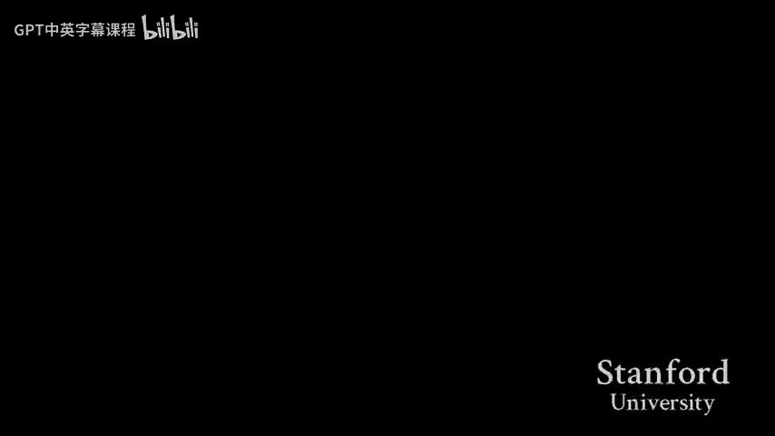

# 【计算机组织与系统 cs107 2016】斯坦福—中英字幕 p14 【Lecture 14】CS107, Computer Organization & Systems -DZezonum9cw- -BV1Nr421c7YB_p14-

Okay so I hope everyone is here for the CS161 final reviews。

 otherwise you've been to the wrong place Okay， so the plan today is I'm going to go through the materials after the midterm because these will be the focus of the finals and then I'll take questions and then we go through some practice problems okay sure so here here here on the materials that you have to care about well you should focus on these materials when studying for the finals so after the midterm we've been talking about graphs and so we talk about how to traverse the graphs how to find a shortest path on weighted and unweighted graphs how how to find a minimum spending tree we also talk about global mean cut and CAs algorithm or some the cut。

😊，Between some particular pair but this is S and we also talk about Maxflow。

 So those are on the topics about graph and other other than graph algorithms。

 we also talk about dynamic programming。 dynamic programming is essentially a way to you know to design algorithm and it has many applications of course。

 but yeah， so this are we also talk we also mentioned we also do some greedy algorithm in the in the class。

 Yeah， this will be the focus of the finals so。😊，I'm just going to go through some very brief details of this algorithm。

 So， so the first thing I'm going to talk about here is graph Traverse or algorithm。

 So there are two ways to traverse the graph net and breakfast。 So you know， yes and。😊。

So I'm not going to talk about how to do these algorithms unless anyone asks a question about them。

 but basically by using the graph， very simple graph travelverse so algorithms you can do the things like check whether the graph is connected or find on the connected component。

 you can do a topological sort and then with that first search you can find the strongly connected component and with breath you can also find the shortest and weighted path and the runtime of these two algorithms are both m and where M is a number of edges and n is a number of ver in the graph it's a little nontrivial to figure out why these algorithms run in a bigger of endless and but is essentially some emortized analysis that if you a bigger of M and runtime。

😊，I components with BFS to just like take longer you could still like check whether like all nodes are reasonable from all of the nodes by just running DFS from every node like it might take long I understand that DFS is faster。

couldnn't you still find strongly connected components。

 You just have to like run B F S from everything node。 I， at least I。

 I don't really see how you can find our strongly connected component with B F S。

 How can you do that。You can see if the graph is a strongly connected component itself。

if the graph is strongly connected one problems by running BFS twice。

 if your graph is so if your graph is is a strongly connected component or in other words it has only one strongly connected components and you can run BFS twice to determine whether that is the case but if it has more than one strongly connected components then then maybe you going to be able to find them with BFS to find all the connected components。

 So there's an algorithm so there's an algorithm mentioned in the textbook if if you are going to use that exam。

 you can just say that try to find on the strongly connected component with BFS yeah there are lot details on how to do its interesting I think there's another。

😊，No。Sure yeah so graphra travel show down next thing we talk about in graph was shortlist path and and we discussed three algorithms to find shortlist path here so Daictra and Belman Fort and Fl Walng so。

😊，So ditra is a facet one， but its also theest is also the weakest one among these three。

 so dishire helps you to find the single softest path only in the graphs where the edges cannot have negative weight Ballman thought essentially the same thing but it works with graph with negative weight edges and and flog goes on something it does something stronger so it finds the shortest path between on pairs of purchasetices and here the corresponding runtimes。

😊，so。Okay， so you should look at the lecture and the lecture note and you know。

 add a memorize this thing or write them into the cheat sheet in case you have to use。😊，O嗯。

So dynamic programming I'm not going to talk much about this because we will have some practice on dynamic programming because well it's really hard to say anything about dynamic programming because is it is only a paradigm to solve problems so when you see a problems。

😊，A problem with a lot of repeat repeating subproble then it's time to think of dynamic programming and if you want to design a dynamic programming algorithm。

 the first thing you have to do is figure out what to compute usually you can compute a table or maybe a 2D or 3D table define and then define which what is meant by each dimensions of the table and。

😊，Figure out what is the base case and also the recurrent stuff。

 So I believe everyone knows how to do this。 we have some practice on this later。 Oh， by the way。

 So dynamic programming is somewhat similar to divide and conquer because for So divine conquer is something we talk about before the midterm。

 So it's like you want to solve some problems， you break it into some sub problems and then computer resume and then。

 you know bring them up together it's very similar to Dp。

 if you think about the idea of solving sub problems。Okay。

 so next thing we we also talk about minimum spending tree and there are three algorithms to find this minimum spending tree。

 I I list them up here。 So Borovka and Csco and Prim。😊，so。Yeah， I do。 so。

So Brovka and Ksco algorithm are very similar in terms of idea because both of them try to keep track of set of these joint trees and while so Borovka so for Borovka algorithm each run of the algorithm you pick for each tree。

 you pick the smallest edge and then merge a corresponding trees together for Kco it's a little different because you go through on the edges and when in the increasing order of weight and whenever you see something that are not merge then you merge those two the runtime of Kco algorithm is actually very nontrivial to analyze so it has a factor it has a thing F to the minus one of n that is called the inverse ackerman function so yeah we don't expect you to notice but if you have to use Ksco algorithm in the finals then this is a runtime and you can just you can just use this result。

😊，Pmgo is very similar to that extra。 The only difference is that for that extra。

 you keep track of the weight of you keep track of the soft the distance from the socks node to each node in the graph。

 but for pre algorithm， you only keep track of the weight upload node of the edge that connects。

A note to the tree that you havent really built。Okay， so that's all about spending tree。

Then we and the next topic was global meanan cut and cargos algorithm。

 So global meanan cut is a problem where you are given a graph unweighted or weighted。

 that's both are fine。 And you are going you are to and you have to return a way to part the set of vers in the graph into two subset such that the weight of the edge the sum of the weight of the edges that go between those two subset is minimized。

 So and in case of。😊，Un weighted graph， you just think of each S has weight one。Yeah。

 so the algorithm so so global mean cut is in general is an NP problem。

 but we discuss an a randomized algorithm that give you reasonable performance and sorry。

 reasonable correctness and it's quite fast to do that is that is clus algorithm so for kgo cculus algorithm is based on an operation the edge contraction so whenever you pick so when you can pick an edge in the graph between two node and then you can just merge those two nodes into one node and then on the other edges connecting into those two node is now is now pointed into the new the new node that you produced and and we do that so if you have n node。

 you do that n minus two times so that you can get down to two nodes and then the number of edges between those two node would be your mean cut so。

😊，so the runtime of this is is easy because it's just because of n square because whenever you try to sorry。

 because contraction takes O n and you do have to do that n minus2 times。

 So it's n time n minus2 or n squared the correct the correctness of cculus algorithm is only given probabilistically。

 So。😊，If you want to get a correct cut， each time you pick an edge to contract。

 you have to pick an appropriate appropriate edgesh in the sense that that ash wants't go into the binan cut because if you pick something in a binan cut and you contract them then you will get a wrong cut and so the most important result here。

 I would say is that if you an if you have a graph of n veres。

 then the probability that you can pick that you can pick a good edge is always lower bounded by n minus2 over n and just from that can you can repeatly apply this result to say that the probability of correctness of kgos algorithm is is that product there and which reduces into one over n choose2。

😊，But so this is quite a small number， so in reality when people want to apply Kas algorithm。

 people will try to run it a couple of times and then pick a better zone and this is called the Monte Ca algorithm for that reason。

😊，Okay， any questions so far？Sure， okay， and we also talk about another kind of cut。

 So for clus algorithm， we talk about global mean cut。

 So you want to find a just any part that minimizes the number the cut the other kind of cut。

 we talk about is called S cut because S cut is very similar to mean cut to two global mean cut。

 but it's like you are given a vertex S and another vertex T and you have to find a way to partition the set of vertices into two subset and S must be in one of the subset and T has to be in the other subset and and then。

 of course， you want to minimize the cut the cut which is the number of edges run that run between the two subset that you find or a sum of their weight in case of weighted graph。

 and we also we also we also define a new concept called the S flow。 So now so you're given a graph。

 you are given S and T。😊，A flow on the graph is formally you formally。

 it means that you are assigning a number to each of the edge in the graph。

 So if you have an edge U V， then you have to assign a number F of U V and and。😊。

And then there are two conditions about F of UVV so first of all the first condition is F UV has to be non negative and has to be less than or equal to the weight of the edge given in the graph the second condition is quite more important that is the summer flow that goes into any note has to be equal to the summer flows that goes out of the note and that is just described by this scary sum but that's what it means。

😊，And there's a theorem that you are given a graph， weighted graph a node S and a node T。

 then the minimum cut between SD is always equal to the maximum flow that you can get from S to T。😊。

ok啊 hell。Now， this program is very nontribut to proof it's in the lecture note。Okay。

 so how to find them， so how to find a max flow we discuss for phonecursion algorithm So so actually for phonecursion is not an algorithm is just a method。

 So the idea of for phonecursion algorithm is is you define a thing called residual graph and then originally your residual your residual graph is just the original graph and you repeat this process until you cannot do it anymore。

 So the process is you find a path from S to T S is your source node t is a destination node and then and then on the path you find the edge with smallless weight yeah and and then and then and then the idea the intuition here is that you try to send the flow of size f from of size equal to F。

 which is the the smallest weight in the edge from S to T。😊。

And then and then you update your receipt to graph so by updatinging。

 I mean decrease you decrease the weight you decrease the capacity of your edges that you send the way through you send the flow through so after you do that for a while you want to be you won't be able to find any path anymore and that's when the algorithm ends so this is just a sketch of a method and in order to get the algorithm you have to specify how do you find the path from S to T there are many ways to do that so we discuss theest the shortest path and the fattest path so fast and thing and fact and in order to find so if you want to find the fattest path that is you have to find it's called the minim the minim path from S2 T you can do that with DFS with some trick。

😊，And on the other hand with shock this path， you just do BFS and both will lead you so both of these methods so BFS and BFS we know that they both run in m+ n so the runtime of any four functioncursion method is just o of M+ n times the number of paths that you have to find and run this algorithm on and there's a scary number on how to find there's a scary bound on the number of runs you can find it in electron notess I'm not going to write it here。

😊，And sure， so that's on the materials after the mid term。 So I'm ready to take questions now。😊。

Any question， Yes， so I mean regarding like Floyd Paulkerson， I mean， Ford Paulkerson。

 when you're when you keep like。Augcumenting along those paths and eventually you get to like a residual graph where like a flow from S5 T zero。

So how do you like reconstruct what the。Max like Fless in like the original ground。Like。

So one way to do that is when you run four phone case algorithm。

 whenever you decide to send some flow through some some path， then you just update then you just。

 let's say you have an HUV and you want to send a you send flow F through it。

 then just you know you just add FUV equal to FUV plus F。And then in your receipt to a graph。

 there will be some negative edges， sorry negative flow， some edgesh with some negative flows。

 so you ignore them and then the and then the edges with positive flows are the flows that you actually send through your graph。

😊，不。YesDoes Ed's carp work for even irrational ens worldwide？Ifence。嗯。Let's see。 Does it work for No。

 it doesn't。 So you only care about the cases where the flow isn' an in。Yeah， and that。Or rational。

 Yeah。 but， but but if it's rational， then you can， you can make them in by multiplying， yeah。😊。

And there's a fewor that if your flow is an inger， then you can。

 then each of the flow you stand through an edge can also be an integer。😊，Yeah。

So you said for the Fd and Marsll that they had a check mark in the negative cycles last second？

Does that just mean to tax on just like？Yeah。Okay。Yes。This might have been covered in lecture。

 but how do you apply Carters algorithm to get an ST is there a modification of carvers that we have to do to get in an ST cut？

I not a way of one。And not aware of any way to use caers to do that， maybe one way to do。No。

 I don't know。Normally computer meant a speaker card。So usually if you want to compute mean S D card。

 you just compute a maxflow。Yeah。Yeah。Yes， is it like a nice way。

 Like based on the max flow to see what that cut is。 Yeah， there is a way to do that and。

So you should look into the lecture to note to look at the proof that max flow and mean cuts are equal。

 and then there's a way to do it there yeah。😊，Yes， what we need to know about like Car Ste for the final Stein？

The one so I would say that the most important thing that you should remember about Kaer is the probability of picking the correct edge is n minus2 over n because there are many things you can do with that probability。

😊，So the probability of what picking what of picking the correct edgesh to contract。

Is n minus2 over n？For anyone。Well doesn't become plusYeah but then n is a number of vertices in the graph。

 So after you contract twos to some edges， you have fewer vertices， know n is a number of vertices。

Okay。Other questions？说嗯。Yeah， I can take photo questions later。

 Just ask any question whenever you have a question。 So so I think because there's no more questions。

 so let's go。To solve some problems。So。I have。 So here I have three problems。 So sorry。Okay。

 the first problem is on the is。So for each problem here I will let you guys think about it and then we will discuss how to solve it I'm also trying to give some hints on the screen here so this so the first problem is called the Stanly connected graph so it's very similar to one of the so in one of our homego problems you are given you are given a graph and and then you ask you are asked to determine whether。

😊，From any two nodes in the graph， you can go from U2 V and from V to U。

 but in this problem it's basically the same thing。

 but for any two node you determine whether you can go from U2 V or from V to U。

 it doesn't need to be both way。Yeah， if it's both then you can do it with this thing， but yeah。Ya。

 so， so， so that's a problem。 So and。So we should think about it for a few minutes， and then。

Just tell we， you have any ideas。So maybe yes， you can do a very similar thing to down the homework where you run DFS。

 see all the nodes that you can reach Sure and then you reverse all the edges and then run DFS again again and then see all the nodes that you can reach again and when you run DFS the second time that's basically with all the edges reversed you're going to find all the nodes that can reach that single node。

And then you can just say if you can reach it for the forward way or the backward way。

 then it's semi connected。Sure， so I think that。In the homework we I say it is both。

 but here you can just say if it。For every note。eitherither reach it on the forwardway or the reverse way。

Well you say first consider only directedcyclcycl graphs you want to do and then you can always do it unless one of the vertices has degrees zero。

For a directed a you always get between two vertices unless one of the vertices has degrees zero。嗯。

不好意思。For two like if you have two vertices。You have like。Oh， I'm right， actually。Yeah， so。

So for the algorithm you mentioned。That。I don't know if it's correct or not。😊。

So I think essentially for like I think what he was saying was like so we could maybe like have like just add two fields or something like so on the first time we traverse it it starting from the source and we do DFS。

 then we mark the first field for each vertex and then we do DFS from the source using the ins and then we mark a second field and then for each vertex。

 we just look to see if one of the fields was flagged。Yeah， yeah， so okay。

 I think I see the problem there， so if you want to determine whether you can go from any from any of those any of those two notes to any two notes to each other。

Yes， then then if both of your DFS is good， then you can say that for any UN andV you can reach the socks note。

 but so this one is only an R so yes。😊，You can do a topological sort and see it really like。😊。

During that wondering， you could reach either 6， 13 nodes in the order of。

 if either division edge between like UN andB or between B and U。Please forward。

you do a topological result。and see for like two notes that are like for like if you know you're ordering like BI and VI+1。

 so it there's an edge between BI and Vf+1 or VI+1 and BI。

There won't be an edge between BI+ one and BI， right and if you have look BI and V+ two。

There doesn't need to be an edge between VI and V plus2。

 there could be an edge through V plus one then+1 so top there is no different edge between VI and V plus one either。

So let's say if you have the。しい？清。So if you have a graph like this。 So then you， so okay， sorry， can。

 can everyone see this？ Yeah， so your topological sub would be a。Either ABC D or A B， sorry。ABD。

 yeah。And so me and C are two consecutive things in a topological or something there's no action between between them。

So your algorithm is you topologically sort it the graph。

 and then you go through it and check whether there's an edge connecting the to consecutive node。

That was what I was thinking I see why doesn't work。Yeah， but yeah， it， it is so。嗯。Yeah， so yeah。

 it strong that it doesn't really work yeah。😊，对嗯。Sure， so。Any other ideas？

So I would say topological is the first thing that you should to win this problem。Yes。

 may not be going down the right track， but you want an edge from one node to another node or an edge from the other node to this node。

 so if you have a topological order that means like A has to have an edge to B and to C and to D。呃。

是了。can you say that again yeah or in it。It has to have not an edge， right。

 but there can be an edge from D to a。 top forward。 That's true。 So， yeah。

 that is a very important idea of very important observation。 Yeah。

 so if you have a topological salt， then edges like this are not permitted。So yes。

 kind of like that problem we had there's an edge from A to C。

 if only if there's an edge from like like a to something before C to C or。

From something before see to see yeah so let kind of kind of like dynamically go through each one but I can't does that make sense like that makes sense yeah yeah yeah。

Okay so we are closer so let me summarize the ideas if we have graph so far so the first here that I mentioned was to consider directed as a a quick graph and in such graph you can do a topological solve so if you have an order of vertices in the graph topological order like this。

 then edges cannot come from anything that comes after in the list to anything that comes previously in the list if you have a topological sub like this it is guaranteed that there's no way you can go from D to C or from B to B or from B2 A and so the problem is asking for any pair veres whether you can go from B to B or from B to you in a topological order you know you cannot go backward so now the problem reduces given a topological solve determine whether you can always go forward because that is the only way you can go。

So。That's the ideas we have so far。It's very well sorry dont quite understand realistic what it like so you say like check if there's an edge from A to B。

 check if there's an N from B to C， check if there's an edge from C to B。Is， isnn't that right。

That's what use it right， why doesn't that？So okay， let's take this graph as an example。

 there's no H from B2 C and also no H from C to B， but you know from any node。

 so I can go from A to just any node。あ、ウ。So maybe I was understand the， I it's every node has。

Other is that not the problem？The problem is from so theoretical。

To know so you and so you have to be able to know from from you to B or from V to U。Yeah。

And you can't do that。Yes， in this case you can， you can do that patient B and C， yeah。行。

Would it help to like try to find one node where you couldn't go from like？Like one。

 like a paranoidose where you couldn't get from one like to the other and say in both directions。

By doing like a topological story on that graph， and then the。Tological story on。哦。Never actually。

So actually the problem as for a big out of am and algorithm you can so you can only do a fixed number of。

😊，Tri bothial。And yeah， we did one for our topological， what's next？Come on with hair close。

I'm still not understanding why the algorithm that they described earlier wouldn't work where you just checked the edges between。

The top， the light。Consecutive elements of the topological sort so like if it's I guess kind of like the homework problem where there's only a single topological sort because it's completely。

呃。I forget what the problem was， but like each one is like a consecutive connection。

 so if you check the topological sort。Every consecutive node should be connected to each other and I guess that follows what we're trying to do。

 but like。Yeah。Does that not work so is that what you means previously checking sorry so what you mean was checking as an from A to B and B C and C to。

 oh okay， sorry I think I'm mis through that so。Okay sure yeah， so。😊，So it works， I think。Okay。

 but we have to prove and it works so okay， so in this case。

 if theres an if there is always an a you like to say。Like this then。

So then answer then the answer is yes， you can go from any note to any other， you know。

 just take any note and then follow these edges。How about the river So how about the reverse acu。

 So if you do this check and then you see that， okay， there's an Ash。Sorry。Well， okay。

 if you see this， then you can conclude that you can go from any node to any other to well。

 if you see this and you conclude you can go。嗯。If， if you have a graph and you。I mean。The read。

There's no edge and there's no way to get between the。Yes， yeah that's true。

 Yeah so sos that's that is the missing part of the argument。 So yeah。

 so we also have to prove that if we have a graph that from any vertices。

 you can go to each other then then there must be an edge between any two consecutive vertices in a topological order So why is that the case that is the case because so you you have a topological order so just consider any two consecutive note。

U so you know that from the second node， you cannot go to this node where you can go to the first node。

And so if is if there is no edgesh between these two node。

 then there is also no way to go from this node to this node because if you can go from this node to this node indirectly。

 then your the actually must go somewhere else and then go back， something like that。

 doesn't exist in a topological order。Yeah， okay。 so we solve a problem for。诶 for。

Dected as a quick graph， so how about general graph because remember the problem as for general graph。

Yes。😊，If there's a cycle then like every day the cycle from each every parliament cycle。

 and if it's not a directed graph， then you can go both on the edges。嗯。so if we got a cycle2。

 we could like contract all the nodes there into like a super node， I guess it's diagon。

SureBut why does it have to be cycled？So。Okay。So you can have some this。So what you sorry。

 what you want is not a cycle， but a subset of vertices where you can go from any vertex to any a vertex。

 that's not a definition of a cycle， right？So。So if you have here a graph and then consider a set of vertices such that and from any two vertices in that subset。

 you can go to each other， what is it count？そ的。Yeah strongly connected component so if you have a directed graph you can run DFS to find on the strongly connected component just like I mentioned previously when I talk about DFS and then after that you can think of connected a strongly connected component as a supernote and then that will give you a directed assetQ graph and you can use the algorithm we discussed previously。

😊，Yeah， so can we just say that you can run DFS to find connected components plus we yes also in because of M plus N。

Okay。iss a problem clear？If you not briefly about how you do that。

 is it just the same thing that we were doing in the homework where you give a note。

 you just run it and then reverse reverse all the edges and then run about and then the strongest one is every wing that I can reach and can meet other？

So。So I say the idea is very similar to that， but it's not the same。Okay。

 is the difference meaningful？different' like like difference because if you just run to DFS and sorry you run one DFS and then you reverse on the edgehes and you run the other DFS then what you then just from the home group problem。

 you can determine where the out of the nose are connected， but how can you find on those structures？

When you run DFS ones and then from all the nodes that it can that it can reach。

 then run it again and then that would be if they all come back to that。

 then that's more stroke and then you just run onto it then you just go into any node that you haven't did。

Well， but it may happen that in your first DFS you can reach some note。

 but from that note you cannot push your So note。系。So let's say you run theFS。

 you start from let's say S and then after1 DFS， you can reach， let's say U。

 but you don't know whether you can reach you， you can also go to S。

 so you maybe come to a na strongly connected component。

And apparently so we them in the homework they didn't take care of this yet。

 but you have to do something else yeah， so for the record。

 we didn't cover how to find strongly connected components in the near time。

But there's a tri quadratic time algorithm you just run the from every node and then you can construct all the string connected components in quadratic time that manner。

 that's all you need to know you don't have to know how the linear dynamic works succeed。

You're concerned about fighting。YesI still understand how running a connected component is a set of vertices where any two can reach each other。

So you find on a strongly connected component。So let's say now you have a component one。

And you have a component two。Right so so your new graph is a graph of components。

 so let's say if theres a cycle so if there is a cycle in your new graph。This then。

There must be something like from something from C1 to C2 and let's say there's also a way to go back from C2 to C1 then then I say then I will say anything from C1 can reach anything from C2。

Right， following this and then also anything from C2 can reach anything from C1。

And so C1 and C2 will become the same strongly connected component。

 not distinct components that as we found previously。

 and that's why in the graph of strongly connected component， there can be no more cycles。So。

 you're saying。Find all this strongly connected， so you first find all this strongly connected。

And then you went top aological order，On the new brand those components and those components can of cycles because then they would there cannot be any cycles between them。

 and that's why theres a topological solve。Okay。D repeat， how do you run BF to find this form。

So Hayden just mentioned that we didn't cover any linear algorithm to doda。

 but there's one there are two algorithms I think in the textbook rightbook and the thing is if we want to explain to you how we do that。

 that's where to have a lecture so we can't do that。Rightだい。Okay， so okay， one problem。

 So let's do not a problem。 We， I think we have enough time for that。

 So this is a very common problem so。So in the lecture。

 we mentioned how you can find the longest common subequences。

By dynamic programming and so this problem is asking for some answer a subequence。

 but this time you are given a sequence of numbers and you find the longest increasing subequence。

Its finalal length of the longest increasing subence in the given sequence。So yes。

We have always increasing subsequent in the numbers。嗯。Could you explain what logus increasing type？

So the tax has some explanation on that。So let's say you're given a sequence like。Okay。

 so a sub is a sequence that you can take that you can get from this sequence by deleting some elements。

 So let's say so2，1，3 is a sub。Of this one because you can just text two and one and three and then remove the rest two and three。

 this is also a subsequent， but this will not be a subsequent because you can because you switch for and3。

 there's no way you can get this by something from this。Okay。Is that the same thing as the longest？

So this is a subequence yeah and then and then if your subence is increasing。

 so let's say in this case if you take the sequence of one。

 three small is increasing and then the problem as for the longest increasing subence。Yesす。

So I think it's just you can solve it dynamically okay。

 so you look at the thing in position I and it's a certain number and like you go back and check to see like the longest increasing subequence and you get some FJ。

That's like the longest audible， all of them were like were like the thing in position J is less than the thing in position I so that you can just tack it on and then you just you add it's plus one to that and then it's unsed because you're just。

That's true。 Yeah， I think that's a the correct algorithm room。 So I think I made a mistake here。

 So it should be a max， not a mean。😊，So this thing， it should be a maximum。Yeah。

 but that's the correct algorithm。So。So just to say again。

 so the problem can be solved using dynamic programming so you sort of thing that you are computing is F is equal to the length of the longest increasing subence ending acquisition I。

So and so now we can we can make a recurrence to do that so for each FiI you look at on the previous positions J such that AJ is less than AI and the hope is that you can take an longest increasing subence ending at J and then add theI thing after it。

So you take the maximum all of them and added by one， which is the current number。Yes。

I mean mean if we're labeling the positions zero through and the original sub sequenceence or the subence in the original sequence or in the subsequentequence of building in the original sequence。

Yes， do we have to take the maximum subsequence that ends in a number that's less than the current number？

Yeah， less than a tolerance number。对。Okay， so what what is the runtime of that algorithm？N square。

 Yeah， because at each position， you have to look at R previous one。

 So you have like one plus 2 plus 3 until N。 So it's bigger of n square。

 It turns out that you can do this a little better by。Yes。if you talk to them。

 then you can help to their numbers。So the the reason that we， yes， could we maybe like。I don't know。

 greed take like the smallest one out of each step。Like so， I don't know。诶明。That's， yeah。Okay。Yes。

 so maybe when you're comparing when you're looking at like position I。

 you like go halfway back and then based on that half， you can decide whether or not to go like。

And the。Which of the two subways to go to somehow？So。Like instead of going back like one by one。

You go back like half the distance and based on that computed value。

 you know whether to recurse on the right submarine and the left subine that's just an idea。No。

 that that is not a correct idea。 Yeah， can you sort。

 So in your short array of that's one some sequences， Can you sort the ones that you already。

A storing for expense so that when you go back like he said， be recur on all behalf have。

What every souls。But every time you。Yeah， you have to talk every time。 that's1 log。No。

 so sorting one is in。 And if you solve every single time， it's not in。So， yeah。Yeah。Yeah。然后呢。

endBut maybe instead of storing the length of longest， increasing sub sequenceequence， ending at eye。

 meaning including that element。You can store the length of the longest increasing sub sequenceequence up to that element。

 whether it includes it or not， and then you could。See that element is less。

 just look at the one behind it。And。Either add one， if it's less， no。It sorting on the right track。

No，Dived to house。But they it into two cups。And we。' so I don't have any idea of how to do that。

P increasing subsequentence of the website and if that ends at an element less than the long is increasing the smallest element and the longest increasing subsequent of the right side could join them together。

Yeah， I falling both sides。Well， the thing is you can have something shorter on one side。

 but n it's a smaller element and then add more things on the other side。

Yeah it's putting it into house on the right track no it's like binary search on the right track or is it also not binary search is on the right track yeah but well。

诶。No， it it。No， my is not on the right track。 Yeah， Okay， so well， we're over time。

 So let me try to give a hint on how to do this。 And then can think about it later。 Yeah。

 so the idea is when you， when so this is the the recurrence。😊，Yes。诶。Yeah。Okay。O嗯。So。

So if you can make a data structure where okay， so sorry。

 so first of all we because this only happens on the something for。😊。

So we are only looking at the position chair which is less than I。

 so essentially J less than I means that it is some F that you have computed so。

So if you can if you can make a data structure， something like。Sorry。Sure。

 so your data structure will map from the values of so each of BI is one AA of some AI or something。

So。HJ， this is AI or something。 But this essential， this maps to FJ。

 which is the element with maximum value。嗯。With with a maximum value of sorry。

With the value of actual your computer so far， and then whenever you have a new value。

 you can just add that into the queue into this data structure and that would work。So这就是 data消费的数次。

There's a they exist that kind of data infrastructure structure。 So but there' in the log and a time。

Yeah， so each time you add something into it or you query something into it it's log n。

 it's log n and you do that end time so it's n log n in the end。

Anyway'll try to so I'll include a solution in the slides when I post them on Piazza and yeah I can take questions after this。

Yeah， shallrry， what's a third question that you have。

The problem did you say there three questions or Piaz Piazza。O， sure。やしそう。我军。

