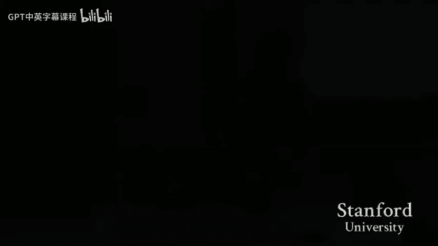

# 【计算机组织与系统 cs107 2016】斯坦福—中英字幕 p15 【Lecture 15】CS107, Computer Organization & Systems -nMLcqs3w2-E- -BV1Nr421c7YB_p15-

We better get started so I think a plan so today will be a 50 minutes review session for CS161 midterm so I think a format is going to be like this so first I'm going to talk I'm going to give you guys a review of all the topics in the graph so far and this is a compression of half a quarterter into like 20 minutes so if you didn't understand so if you didn't know about anything at all then you shouldn't expect that you can learn on those in the section but these are better like something to give you a refreshment on these things and so I'm planning to spend about 20 to 25 minutes on of these topics and then I will be answering questions and then after that if we still have time then I'm going to give you some practice problems and we can go through some practice problems to get on about good plans。

😊，Okay and can anybody hear me right Yeah okay sure so so these are the topics that you you will have a chance to see on the midterm some of these will be more likely to occur than others so I can say for very sure you will have a problems so you will have three problems in the midterm one of them will be like one of your homework exercises where you will be given a bunch of recurrences and just solve one of them。

😊，And then there will be two other problems， one shock problem and one longer longer problem so those that will be the format of the midterm and I think asympotic analysis is the first topic that we will have to cover because it's really important。

😊，So so here I' I'm giving you a refreshment of the notation of the O M O omega and theta notations。

 So I hope everyone is familiar with this one。 So if you have to function F and G and you say F。

 So if F is smaller than G。😊，Smaller in quotation in the sense that you are seeing on the screen then you say is's big O。

 if F is larger than G， then it's big Theta， sorry。

 then it big omega and then and then if F is both in big O and big omega of G， then you say is theta。

😊，Clear on this okay so in practice when you analyze the complexity of the algorithm。

 we will mostly ask for the big O notation because big O kind of give you the upper bound of the running time of the algorithm and we are basically more interested in that are there are some useful stuff that I'm some useful equations about about big O notations that I'm showing here so you should be able to prove on these thing formally by you know taking the existence of c1 c2 existence of n0 and stuff like that to derive on all of these equations but I think these equations at this point are obvious enough for anyone to just apply them as I'm showing here so if you have to so so big O notation of sum of two things you can just sum them over or you can just take the thing that is bigger。

😊，And big O of the products each so product of two big Os is just a bigarrow of the products。😊，Okay。

 so I'm going to give you an example on the big notation。 So on the screen I'm showing on the left。

 I'm showing the matrix multiplication algorithm and is it is a very naive approach。

 So and you are asked to analyze this algorithm So。😊，By using the summation of big O。

 you can break the programs into smaller chunks and then you can analyze each of these chunks individually and then sum them up。

 So in this case， the first part of the program is going to be the lines from line 3 to line 7 and so you see that there are two nested follow loops and whenever you see nested follow loop then it is a time that you can use the multiplication of big O notations so here you see that there are two follow loops one the outer follow loops the follow loop as line3 runs for m times and the nested follow loop in line4 runs for p times so let's give you an O times O which is OM as said before similarly in line a to 14 you see there are three nested follow loops and so the same argument applies and。

Overall， you can just sum those overall。 So lie 3 to8 and sorry 3 to 7 and then 8 to 14。

 those are separated so that you just sum them together。 you don't need to take a photo。

 I'm going to upload on the slides onto PL later。 Yeah， so and then you sum these thing over。

 And you know that MP will always dominate MP。 So the final is only just of MP。😊，Okay。

 so these are a very simple example of Minotations and when you have to in the midterm you will be asked I'm sure you will be asked to design some algorithm and then if you can phrase your algorithm in some forms of pseudo。

 then you can just use this kind of analysis。😊，Okay。

So the bigger notations that as I just showed they are good for solving linear programs。

 I mean linear programs are the programs that doesn't have any Kong to itself is not recurrence so you can just track them down and then use the adding other the multiplication room to analyze the complexity but there are cases where where you will have to to phrase complexity in terms of the recurrence and those are actually the bigger problems so well talk about recurrences so there will be three ways to solving recurrences the master theorem。

 the substitution method and recursion tree method so the easiest thing to do is master theorem so the scary thing here is Kongong master theorem。

 there are three cases you should either memorize these or write them into yachiit and I recommend writing them into yachihi because these are half to memorize and not very long to write down。

😊，So master theorum is easy in the sense that it only solves one kind of recurrence and that is the recurrence that I'm showing here so if there's only one con to the recurrence multiply by a product or something closer function then you can then depending on that function you can decide which case of master theorum you can use there's only one thing that I want to note about master theorum that is you should be careful in case1 and case3。

 make sure that there is an epsilon grade strictly greater than zero because yeah you need to have something strictly greater than zero otherwise you will just fall into the second case and in the third case the cony must be less than one so we have been seeing these kind of mistakes in the homework so this are something I just want to note now。

😊，So masterotherorem is the simplest way to solve recurrence if you see a situation like this and just use master theorem。

😊，ok。Second thing the second method seems to be a little more complicated， the substitution method。

 so substitution method， it is just a way to prove an upper bound， upper recurrence。

 it doesn't help you to find the upper bound。 So if you have a recurrence and you want to solve it using substitution method。

 The first thing you have to do is you have to guess the upper bound like what you are trying to prove and so。

😊，Ideally， we will want the upper bound that you guys to be tight。

 but if you cannot get the tightest bound that we are expecting。

 then you will still have the par credit provided at you rest correctly and so once you have an upper bound as shown here。

😊，You just buy it under definition of own notation to。

To prove the bio that you guessed so so I have been seeing these kind of questions in the office I also basically when if you want to say that TN is the function you are trying to analyze that is it is in big O of TN。

 then you want to find the n and the C such you know for on n greater than n than TN is less than or or less than or equal to C times TN so。

😊，Some people have been worrying about the basic case like what unknownn do you have to select and I would say don't worry about that the important part is you must get the function tree correct and the conancy answer correct and once you guess those two and and provide it that you can carry out the the inductive step then you just can just take a very mixed value of ann and that's it。

😊，O。So。I'm showing some example here， but I think we will go back to this later after I answer all the questions。

Okay， next thing is the next method to soft recurrence is kind of recursion3。

 so when you have a recurrence like TN is equal to the sum of a bunch of T。😊，And another function。

 Then this thing will basically create a recursion tree。

 and you can look at the recursion tree either at the。

 So so you look at the decision tree and you try to allocate the amount of work that you are doing at each note or at each level of the tree。

 And for this， just refer back to the lecture to see what we are doing。

 I don't have much to say about this。 It's more about computation。😊，诶。Okay， yeah。

 some misleous things about recurrence so don't care about floor or ceiling functions so floor and ceiling functions are in the formula so that are formal。

 but when you analyze these thing you can just ignore them and you can and when you ignore these things then you will have non-in numbers so don't care about so just assume that on the numbers are possible in the function T and even if you have some numbers smaller than one。

 which doesn't make sense because T of n should the n there should be the size of the problem。

 which should be integral， but even if you have some weird things like something less than1 or something nonin and just leave it there yeah。

 okay and then another another thing that we noted notice from the last two assignments so sometimes people have a recurrence like I'm showing here。

😊，And then the last term F and sometimes is like you can just write plus a1 or plus o of n to the fifth or anything。

 so and then people have been replaced for example。

 when they see the O1 there they tend to just replace the O1 by the number one and I want to point out that that is not correct So my definition O1 means that it's less than a constant C so you can replace o1 with a C Similarlyly。

 you can replace o of n cube by a constant C times n cube。

 but it's not okay to just drop in a constant C okay。😊，Yeah， and by the way。

 even if you put the constantancy there they wouldn't usually。

 they wouldn't affect your computation or analysis at all。😊，O。So the next topic is divide and Con。😊。

So before we go on， I want to answer the questions that you have on nothing synthetic analysis。😊。

Okay， yes。solving recurnceThere will definitely be a problem with a lot of recurrences。

Just like a whole work。 but they will be less scary than that。 Yes， so I just had a general question。

 we get like a cheat sheet。Oh。So according to our last TA meeting， I think you do have a cheat shirt。

 but if if that is wrong， then I will post a correction on PA I'm assuming that you do have one yeah。

😊，Okay。Other questions？Sure I'm going on so divine con I don't have much to say about this is's more about your skill so the idea is that you have a task。

 you p them into smaller path， you solve each of them and you somehow combine their results to get the re of tea and there are many examples of is like workshopshop Quickshop or many problems that you have solved in your homework and if you want more practice on this I'm going to post a link on Pr to some divine concurr problems but it's more about training your intuition and designing algorithms。

😊，Okay， and many divine and concur problems will lead to a recurrence when you analyze your runtime and that will form back to the things that we just talked about earlier。

So。Next topic is Soing。诶。So we covered two main sort well I think we cover a lot of sorting algorithms but I think the two important ones here are Mershark and QuickSo and then we also talk a little bit about theoretical amount of sorting algorithms so I'm going to give you a a refresh on these things。

 so Mersha it's just like this figure is from so it's like when you have to sort an interval。

You will break the interval into two half， and then you start each of the half interval recursively and then you merge them and the mesh operation。

 does anybody not know how to do the mech operation。😊，Sure， and so if if you don't know that。

 then you should then you should read the electro node。

 the idea to do that is you keep two pointers under two things that you merge and then you keep the sr。

 you take the smallerr one you put in the merge interval and then you advance it the corresponding pointers analysis is very simple is TN equals to listing on the screen and by master the you will get N log n and big O of n log n is a guaranteed complexity from merge shocked which is not the case for quickof the thing that we are going to see right now so。

😊，So the idea of quickof is also divide and conquer just like Microsoft。 but for mostof。

 you break the interval by the structure of the interval。 So if you your interval is from I and。

 you will break them at Iverse over to up to and are sealing something。

 But for quickof you have an interval if you have a bunch of numbers you need to solve the first thing you do if you select a pivot there are many ways to select a pivot。

 So So if you implement the algorithm incorrectly， you just you just take the first number as a pivot just take the middle number as a P or take a random number as a pivot many ways to do that。

 And then after you pick the pivot you divide the interval that you want to solve into two hs the smaller than the P and the greater than the pivot and then you solve and then you continue to solve those interval recursively。

 So the different things of quickof compared to is that first that is no。😊。

ching step in the me sharp algorithm after you solve the interval you have to mush them in Quickof。

 you don't mush them so quickof because we call it Quickof so in reality Quicksof is very fast is much faster than mergesh but theoretically Quickof have the worst case complexity bigger of n square。

😊，And this will happen if， for example， you always pick the biggest the largest number as your PVt。

 but this can rarely happen in reality， especially if you pick the PV as random and so when you pick the PVt as random。

 then the expected runtime of QuickSo is bigger of NL N and what do I mean by expected runtime you understand it more when I talk about the decision tree and lower amount of sorting。

😊，so。So decision tree is a model to represent the algorithm。

 so when you have an algorithm you basically represent the studies that you are going through in executing your algorithms into a tree and you start a root node。

 you follow the rooms throughout on the tree and then you will start when you reach a leaf and depending on so for every algorithm that you decide you will generate one decision tree and then the height of when you go down the decision tree。

 you will go down some path from the root to the leaf and then the length of that path will represent the complexity of your algorithm。

😊，I have posted a very detailed note on decision tree and if you read that note and in that note。

 I did explain what does it mean for quickof to have expected run of bigger of N log n so you should read that post because it's not very long and it gives you a very good understanding of decision tree in my opinion okay and also based on decision tree。

 people can prove result about sorting algorithms that okay so you have been seeing biggergo of analog log n bigger of analog log n upper bound running time sorting algorithms and with decision tree people have proof that okay that is actually the best complexity that you can get through when when you analyze things involve with sorting and decision tree then then you probably have to do with factorial so one。

😊，Useful thing to remember about factor is the sterling approximation。 So okay。

 I'm not going to write it down since I don't remember it myself。

 but you should have been able to see on this from the lecture note。

 And just if you have a cheat sheet， then just write it down。Okay。

 so any further questions on sorting。O，这个。So okay， a topic that is very related to sorting。

 but it is not actually sorting is other statistics so other statistics means that so you give given n numbers and you want to find the case smallless element So I'm giving a figure here which basically summarizes the algorithm that we will use to computer the K monoless element。

 So the idea is that you divide the numbers into groups of five elements andfi yfi elements or not another numbers you have done this in the homework。

 and then and then you find the medians of each of these five group this five number group and then you find the median of median。

 So the median of median will divide your numbers into this so the yellow cell here is the median of median。

😊，So half of the median will be less than the median of median and then only things that are less than those median will also be less than the median of median。

 Okay， there are too many median okay one thing to note here is that okay why am I drawing a figures like the number that you have which is is perfectly the visible by four by5 in fact。

 of course， you can have a small array， but you can just don't care about that because so if you want to5 the 10 smallest element in out of out of 994 numbers you can just add one very mixed numbers into the array and that wouldn't change the other staistic of anything you are trying to find。

 So this also little one more point about analyzing the algorithm that is okay see if you have and not the visible by5 just don't care about them And yes。

questionest about the picture。 So this is depicting the flow。Yes。

 okay yeah okay so so the numbers go from smaller number is above and then go down to bigger numbers Yeah I add I will edit the slide Thank you yeah。

Other questions？Okay， and this algorithm and only to the recurrence here。

And you have solve in a lecture， or you can just try to solve it again for practice and this algorithm will lead to the linear time complexity。

😊，ok。Any other question I'm selecting。O。So we have like four minutes so I'm going to cover very quickly these two topics so binary search and then I'm going to talk about hashing binary search so first of all is' a binary tree so each node peak can either have can either have left children left child and right child or only one of both two children or maybe node gel at on in a binary search you want everything in the left sub of a node to be less than the number in that node everything in the right is biggerer than the number at that node and so this is very important because it's not just the children of a node P has to have a number smaller than it but everything in that sub has to be smaller than than the number P and there are four basic operations on the three so they are search so search insert delete。

Protations so so for search because you so if you want to search for a number。

 then then you just go down the tree in the desired direction because you know if you are add a node and you know that the number is bigger than the node then the number has to be in the rise of tree。

😊，And so so you just go down the tree in that direction， insert if you want to insert an element。

 you search for you search for for the position of that element in a tree and if you found it then okay its there you are not going to insert it anymore if you don't find it then you then you end up as a new note and then you just put the elements there delete so you search you search for deletion。

 you have to search for the note， if it's not in the tree and there's nothing to remove if you find it in the tree and you remove it and then you check if the node has any children if it has a left children。

 then if it has only one children， you bring the children up if it has two children。

 you have to do some more complicated things you can look for these in the lectures the time complexity of on these is oh actually ahead of the tree Yes about theseities and that are approved lecture that's lecture without exam Yeah sure you can use everything that is group in the lecture in the exam。

You can also use everything that is proof in the homework in the exam with proper sighting to those。

Okay and the last operation on the binary tree on binary surgery tree which is a little more confusing is the rotation。

 so left and right rotation that are shown here， so I think the trick that I use to memorize these just that so if you do a left rotation。

 then the thing that you rotate will go up to the left， I mean in the clockwise direction。😊。

And if you do a write notation， then this thing will go in the counterclockwise direction and then on the children keeps their order。

So if you have a three subries， if you have three sub， so ABC。

 they will still be ABC after you rotate nothing changed， nothing changes about the subries。

 just these the only changes just go about this tool thing and if you so。I think okay。

 I'm going to show it again， right rotation， you rotate left you rotate。

 so it's very intuitive to rotate and then just keep the sub treeses。😊，Okay。诶。So， okay。

So red flag is basically a mess， so I highly recommend that you should write down the algorithms involved in red flag into your tissue sheet because for me is quite impossible to memorize this and I think if you are not a researcher doing research on redle then you are not going to memorize these anyway so just write them down and there is only one thing about redle that I want to note in this section so that is about the lips of red flag tree in some figures people are not showinging the the new notes there but the lift of red of red flag so first of all they have to be black and they are the new note。

 not not the actual note that you see in the tree for example just in this situation。

 the note of number 2。😊，When you draw a tree， you will not draw a new node here。

And you will see that 12 is the lift of the tree。 No， but 12 is not a note。

 Its not the leaf of a tree。诶。And so it basically means that every note in a ref must have two children。

😊，So like the number one here， it has only one real children， sorry， one real child。

 so you give it a new child。And then for for the the actual leave note that doesn't have any child。

 it actually means that they have two new children。😊，ok。

Yeah so I'm turning over time we're going to talk about hash table very quick so hash table you have a bunch of things you have a bunch of objects and you decide a hash function to hash these objects into into a keyet which we call the universe if your universe has only M elements that like so those are M possible keys to hash into then then this will lead to a hash table with with M entries so so hash table will support adding searching and probably beleting an element so when you give an element。

 the first thing the hashing the hash table is compute the hash value and then depending on what happens in the hash table things will happen it will do the desired action。

😊，So。So we talk about two approaches to improvement hash table in the class。

 so they are changinging and openhahing so I'm going to give a comparison here it's more intuitive to understand so if if you are given a new number so on the left it is changinging and on the right it open address so for changinging so you just when you are given a number you compute a hash value the hash value will tell you which way in the hash table to look at if you it says that you you have to look into this hash table so sorry this entry so in in the chaining approach each entry in the hash in the hash table is essentially a link list so if it's an empty entry then you just put the new entry here if there is some entry that are hash some objects that are hash into this entries then you will have to travels the link list to。

To put this part thing at a proper at a proper place in the link in the link list。

And similar for searching and deleting elements。😊，So in the in the chain， in the chaining approach。

 we usually we usually use a notation of alpha where alpha is equal to n over M。

 and it' n is the number of。Ojects in the table and M is the size of the table。

 So this basically says okay how am I saturating the table too much and then the the expected runtime of any operations in a chaining hash so insert delete shirt they are on bigger of one plus alpha so open address hashing is another approach to hashing it's actually just another approach to resolving collisions so so in changinging we start link list in open address hashing we just we are guaranteed that we will start at most one elements at each entry so the idea is that when when you are given a new key you use the hash function to compute the first position if that first position is empty okay you put the elements there if it's not empty then you follow the links that you build up。

In the hash table so I'm showing here so there's a link from this point from this cell to the cell after there and then from the cell after there to here so you have to travis on the link until you either find an empty cell or you saturated it and you say okay we cannot put this element into the hash table so there are two approaches so these links so they are not drawn。

 they are not stored in the memory and instead they are computed by some formula so they are they are two approaches that we discuss in the lecture so either linear probing so linear probing is whenever you want to you go to the next key by adding a constant。

😊，And the other one is double hashing where you have two hash functions and you use this formula here。

So open address hashing gives you a somewhat better runtime compared toing compared to changinging hashing。

 so with the same alpha that is satur the saturation rate of your hash table。

 then the expected runtime will be alpha over 1 minus alpha。Okay。

 so I think I'm brief on covering the theory。Yeah， so I just compress half a part into half an hour and so I'm going to answer questions that you have about on this topic I'm trying。

 so these are a list of topics。😊，And if you don't have any questions on this。

 then we will go to solve some example of problems。Okay。

Is it possible for the Co staff to give us some like practice questions for that？

Maybe last year's so we asked Virginiaemia about that。

 and I think she didn't want to release her last year's me。这原个。てす。

What will be the level of the complexity of the examine？

So at the beginning of this session I said that there will be three problems in the exam。

 one will be solving a lot of precurrences， and then there's another shock problem and another long problem。

 that is the complexity that you should expect for the exam and unfortunately we cannot give any practice like sample with her。

 but we can give practice problems。😊，Yeah。Yes， for probability distributions。

 like in most of the homeworkmarks we really only need to know bin noial。udeWhat we need to my？

So because this class assumes 109 as a prerequisites， so I think you're expected to know binomial。

What else， everything from 10 9， normal par。So basically on out those things。 Yeah。

 but you will not see all of them in the midterms， but of course。

 you are expected to know all of them。Any other questions？Okay， so let's do some practice。So， okay。

 so。So let's try to solve the followingcur recurrences。Let me see which one should we start from。

 Okay， let's try to solve something with the name。 So the the fee so。

 so we'll look at the fibonna recurrence， because it's quite。Interesting， in my opinion， to look at。

So。And it shows it actually shows a lot of intuition about the substitution method。

So you are asked yourself， okay， should I turn on your light？诶。I don't know how to turn on the light。

Anyway。That's fine。し。So can everyone see this？Okay， I really hope that I can turn another the light。

嗯。

No。Fine， okay， if nobody is going to help me to turn another light then we'll go with this。 Okay， so。

So this kind of recurrence shows you the thing that you see in fibonacci numbers so fibonacci number is just a sequence of numbers where each number is a sum of two previous numbers so so the first two numbers are one and then two35 a13 and so on so this called fibonacci numbers and this kind of recurrence this recurrence here shows the fibonacci recurrence so we'll see how can we solve it。

😊，So I want to emphasize that is a very nice recurrence solve because it will give you the intuition substitution method。

So I would say that I have no idea which number which which upper bound this thing will solve it will solve into and so I'm going to make a guess and the guess will be based on the numbers that I see so if you compute the Fibonacci numbers if you write out the sequence of Fibonacci numbers which adjusted did and write you write them down to I think 10 or 15 numbers you will see the numbers grow very quickly so the guess is that。

😊，So。Thegan is that TN will be。I put about it by some。Exponential function。

But we cannot guess we cannot guess what is the number， what is the concern that we put into the the。

The function here。 So， so how how can we find out this number C。

So we'll try to do substitution methods。 So this is our guess。 So we will， So first of all。

 we will not care about the n0， the base carrier in the induction。

 What you will do is just that you assume that。That T of N primem is less than or equal to Okay。

 I because I use a number C here under。 So I will use another letter， which is the。And pram。

Forong and bra， less than end。And then， but and then to use substitution method。

 you have to go from this one to n。 So in order to go from smaller numbers to the number n。

 then you have to， you have to use a recurrence。 So the recurrence here is T N so。So I have TN。

Equals to。T of n plus1 plus T of n I say minus1 and n plus t of n minus2。

 So so now I can use the the inductive hypothesis on on this and on this so I want so this will be less than we go to the terms。

See to the power of N1。So this this is where I'm using the hypothesis here。

 So in order for this methods for this thing to work， I have to。Make this。 Make this happen。Okay。

 so I have to make this thing less than or equal to d times C to the n。

To the power of n because this is what I want show I want to show that T n is less than D terms C to the n at the end of the day。

 so I will choose the values of B and of C in order to make this happen。So。So。This is， so。

I want this who happens right so number the number D here。

 I can see that the number the constant D here doesn't matter because whatever constant data I choose。

😊，In when I try to， to solve this inality， the the day will cancel。 So。

 so I can just don't care about the at all。 And I will say that this is。

Equivalent 2 c to the n minus 1 plus c to the n minus2， less than equal go to c to the n。Okay。

 and then。So how can I surface this will be So there is a C to the n C to N and C to the n here。

 So I'm just so if I divide everything by c to the n minus2， then I will have C。😊，Plus， one。

Less than or equal to C squared。And to get this， actually I divide it。

We'll sign by C to the n minus2。Okay。So so this is something that you solve in high school。

 which is called quadratic equations， so I can just select see。😊，Such that C plus。

 So I just need a less than or equal too。 So I'm just put an equal。

And then this will be equivalent to。C square minus c minus-1 equal to 0。 Okay。

 and then you solve this。 This will give you。It is this number one。不。Okay， so。

So this is this is the number C that you found by fing on these things to to make your induction works。

 So go back to the go back to the original point。Yeah。

 going back to the original points because we have gone through the induction so can so now we can set it up。

呃TN。I。Big O of okay。1 plus square of5 over2 to the l。

And I believe many people have seen this number that this is just this is kind of the golden ratio and this shows up in a lot of places yeah so so what I want to note from this example is that is is the way that you make a guess so I definitely cannot come up with this number from the universe or anything but I came up with this number by doing the map in order to make the induction that I will use in substitution method works。

😊，Okay， so any questions on this， yes。nce on the exam that has a more challenging algebra problem。

 is it sufficient to just pick some arbitrary value of C that satisfies c plus1 is less than or equal to C squared？

And。Yeah， I think that's fine yeah so I think if you have a if you have a so TN is Tm1 plus Tm2 plus Tn minus5 or something then and you try to solve you you have a fifth degree equation which is not possible to solve and then you can just you can just say that okay just take any number that makes that thing work。

ok。Any other questions on this example？Sure， so we have six minutes。

 so six minutes are enough to either go through a divide and conquer problems or I can go through a another recurrence problem。

 which one would you prefer to see？No a。Divide conquer。 Okay。

 so going I'm going to show to give a divide and conquer problems and then just one problem。

 and then try to solve it， okay。😊，So let's try to。Okay。

 so I'm going to give you a problems I have seen in one of my job interviews。😊。

So and so I give this problem because it involves another concept that we have covered so' like so is this problem so you are given。

😊，A minor tree。TSo so it it's only a binary tree。 It's not a binary search tree， right？

 So then the question is actually to determine。If。Teeth is a medical surgeryery。

So to determine whether something is a binary surgery。

 you have to verify if it complies on the property is a binary surgery。

 so out numbersumbers in the you know out numbersumb in the yeah。Yeah， that's fine。

So outnumbers in these subies will be less than this and outnumbered these sub will be greater than this and that should because if we host sub under acute descendants of this thing in the tree。

 so why is it so why do I say this is divine conquer problems？Because you know。

 so so because the essence of the problem has the divine conquer essence。

So if you add a note P in a tree。So if， so， okay， so。I don't know， okay， so if you start from okay。

So if you start。From somewhere I don't know in the tree and then you see in a sub tree and if you see that this sub violates the property of binary surgery。

 then then the whole tree will not be a binary surgery， so in other words。

 in order to confirm that the tree is a binary surgery。

 you have to make sure you have to go go through on the subence levels of it on the nose of it and make sure on those subries and binary surgery。

So if we look at that from a recurrence perspective， then you are so instead of saying that okay。

 I'm given a tree， I would say that okay， give me a note and that note will represent a subre。😊。

A sub of that node in tree and then originally you will just solve it at the original node。

 so if you are if you are at a note P you recursively check to see if P do left and P do right minor search。

😊，And so if these things are both binary surgeries， then you just check whether that combination。

 which is a sub here is also a binary surgery， and that's how it works。😊，So I think the。

 so one way to do this is， yeah， is to。So。So， also， so if you， if you have a， if you have a sub。

 if you have a node in a tree。ThenAnd you are sure that it is a binary surgeryery。

 then you can find the largest number in this sub very easily and you can also find the smallest number in this sub easily because you know those are binary searchries so then you just compare if the largest number here is smaller than P and then the smallest number here is larger than P and and that would be it that would be the ideas of the algorithm。

诶。So I unfortunately， I don't think I will have enough time to write out the algorithm so so I'll try to include it into the slides and then pass it onto PSI S and load to this。

😊，呃。Yeah， so I think that conclude the session。 And if anybody has any questions。

 I can stay you later for。To， to answer。O。

