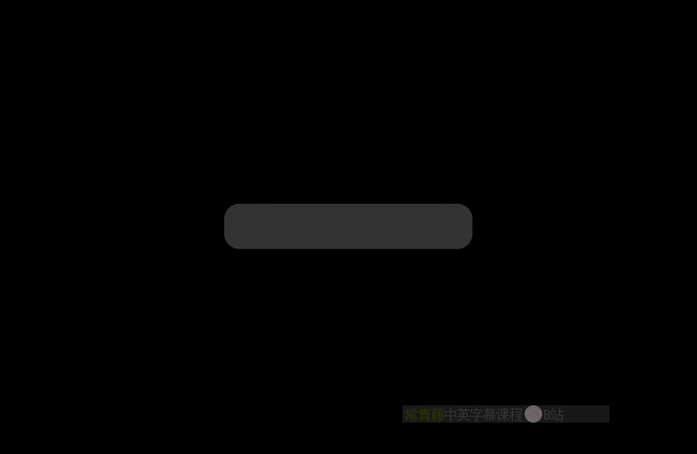
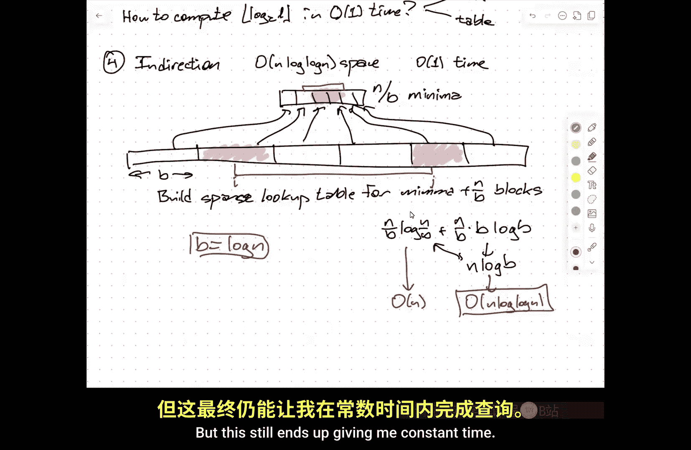
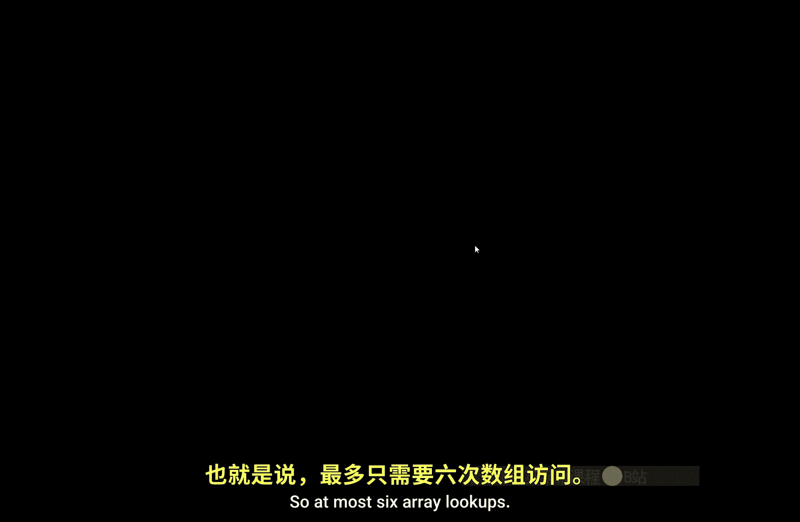
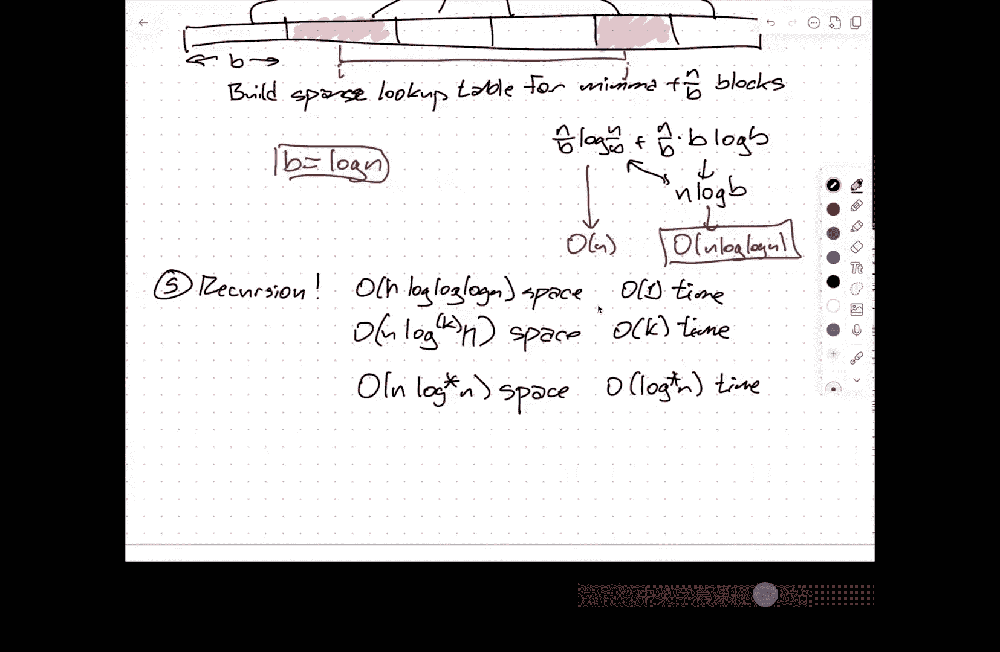

# 伊利诺伊大学【中英⚡高级数据结构｜CS598 Spring 2025, Advanced Data Structures】 p01 P1 课程概述，区间最小值查询 -BV14qZYBJEZy_p1-

So that we hi I'm Jeff， this is CS 598 JGE Adv Data structuress。

嗯。As a couple of you have already。啊。Heard because you asked me earlier today， yes， the class is full。

 the class has been full for at least a month。Normally when I teach a 598。

Steay state enrollment tends to hover around 25 students， so I asked for a room that holds 30。

I got a room that holds 40。The number of students registered is 40。

And that means also this is the first time in 27 years that Ive taught a 500 level class where there are no registered undergraduates。

Because no undergraduate was given permission to register before the class filled up with graduate students。

 so it's kind of uncharted territory here， is there's no way to make the class bigger first I need a bigger room and rooms are hard than I need a TA and Ts are hard but mostly the way the class is structured around a project at the end。

 I'm not really sure what I would do with the TA so expanding the class really isn't an option。嗯。啊。

So after talking with the department。Um， you are welcome to come to class as long as everyone who is actually registered has a chance to sit down。

Um， uh， otherwise， I may need to ask you to like， you know。

 at a minimum steal one of the chairs from outside or in a from a different classroom and put it back when the class is's done。

and u。People will drop， hopefully people who will decide fairly quickly that they want to drop and then as spaces opens up first come for serve。

There's some question and still you know， negotiating this with with the department。

 whether it even makes sense， given the number of people and they're not all undergraduates who still want to get in。

 whether it actually makes sense to open registration to undergraduates at all。

 given that there's no way to fairly admit every movie。

 or to pick and choose who gets in and who doesn't other than。

Whoever is the hungriestt at the feeding trough。So stay tuned。

 hopefully I'll have more of an update later in the week。So。

This is actually a different point of concern attached to this is this is a class that is designed for research graduate students。

 MS students and PhD students， we're going to be going quickly。

 I assume that everyone in the room has already taken a graduate level algorithms class。

Not necessarily because of any particular material。

 although I will assume you've seen some randomized algorithms before。

 especially when we start talking about hashing， I will assume that you understand the basics of graph algorithms and shortest paths and flows and things like that that we cover in 373 and 374 and 473。

 but mostly I'm expecting a certain level of maturity that's consistent with being a PhD student or being a research master's student。

And in particular， I'm assuming this is not。The first graduate level theory class that you've taken。

So homework zero。Is there to kind of gauge where you actually are？

The the zeroth question on homework zero is just to sanity check what graduate level theory classes have you taken。

 defined as what classes have you taken in theory or algorithms where a significant in fractionra of the students were graduate students。

 473 definitely qualifies。and provide some information for me so that if you took a class somewhere else。

 I have a reasonable way of judging whether I think this provides the necessary background if the only thing you've ever had is an undergraduate class called data structures and algorithms where you wrote a lot of code。

😡，Probably not。You're probably going to struggle a bit just to keep up。

If you took an undergraduate algorithms class， that was really heavy on the design analysis and proof aspects of algorithms and not on the implementation side。

 you might still be okay。This is a theory class， there will be no code。

 except you have the option of doing some code in the final project。

 but I'm not going to ask you to write specifically to write any code because that's not what this class is about this class is about that big O stuff。

😡，That you saw in your undergrad algorithms classes， hopefully。Lots of design things。

 lots of analysis things， lots of proof things。We're not as a general rule going to care about implementation details or really at some level we need to we're going to ignore some issues of practical efficiency and utility and just aim for the math。

So if you were expecting a class that's more like a programming class， more like CS225 here。

 that's not what this class is。嗯。The homework， the real questions are meant to be algorithms。

 questions or really questions about data structures。

 but they don't assume any prior specific knowledge， I don't assume you know how to spelled ditra。

't assume that you've seen Ford Fulcker said， I don't assume that you know what a Cartesian tree is。

 from a content standpoint。The only things that Home Ze really requires you to do is to build ability to reason about trees。

Systematically and cleanly and to express that reasoning cleanly。

 and one of the questions is a dynamic programming algorithm。

And hopefully dynamic programming is at this point bread and butter for most of you。

 but it's a dynamic programming about problem about trees。

 so this is really just judging your ability to deal with abstractions around trees and recursion and to say things cleanly informally。

嗯。I think。Um I won't flash this up on the screen， but I do want to say a couple of things about the homework。

So I'm going to ask you to do this each individually because I really do want a sense of how each individual one of you。

 what your background is like going in。This is mostly meant to the self assessment tool。

 but I am actually going to count it towards your final grade because otherwise I worry that people will go。

A， it doesn't matter， I won't put my best effort into it。

You're allowed to use any resource at your disposal， including each other。

 but you need to write the solutions yourself in your own words。

 that means not copy pasting from some other solution in some other algorithms course that might have been taken 10 years ago that you found on the web。

 which originally I wrote。Be surprised how often that happens。 Actually。

 maybe you wouldn't be surprised。 I'm always disappointed at how often that happens。

I can recognize my own writing that also means need to be very， very careful。With LLMs and Chaty PTT。

 I think is the most glaring example of this。I don't mind if you use chat GT but。Do not copy。

 paste anything that you get out of chatt EP T。 Use chatt E P to generate ideas just like you're using the person across the table from you to generate ideas。

 But ultimately， you need to write every word yourself。嗯。Yes。

 that means even if English is not your native language。

You're better off practicing your English by writing slightly suboptimal English than you are asking Chat GPT to write the English for you。

So， to， so to that end。If you use chat GBT。The rule is， that's fine。

 but you need to include a complete transcript at the end of the humt solution。

Partly because I'm curious， how on earth did you get a correct solution to this problem out of Chat ET。

 I tried， I failed。Okay， so if you can do it successfully。

 I want to learn how so I can get better at using Chat GptT。 But also， again。

 it's a sanity chat to make sure that you're actually using this correctly。

The other thing to remember about Cha EBT is you should really think of it as a loud mouth confident drunk at a bar。

They've heard people talk about algorithms， they have a really good memory。

 and so if you walk up to it and you say things that remind them of a conversation that they overheard Timothy and Sael talking about over at the table over there a few weeks ago。

 they'll gladly spit it back to you verbatim and it'll be correct。

 the moment you go beyond what is explicitly in the training data。It says something that sounds good。

But the details are probably just garbage。And so it becomes a really dangerous thing because get you can get distracted by Cha GT's con。

It's designed to be confident。And mistaking that for correctness。

So and sometimes the errors that it gives are buggy。

So maybe a better example is you should think of ChatGBT as a C student。They。

 they're really confident， but they're actually a little bit spongy。 And since again。

 this is really meant。To be kind of an introduction background into doing research in data structures。

Using Chaty P to generate research things is just really dangerous。

 I'm going to ask you to like cite your sources the way you cite them in a paper。

 Chaty PD will make up papers。 Yeah that paper written by David Epstein and Leo Gilbbs on fractional cascading and this is that yeah。

 these are all words that make sense and and even to an expert go yeah。

 I can imagine that Epstein and Gibbs wrote a paper about fractional cascading and then you go look it up and it doesn't exist。

Lawyers have lost their careers over this。PHD students have lost their stipends over this。

Papers have been rejected and withdrawn because of this。 I don't know of any instances yet。

Where professors have lost their tenure because of this， but it's only a matter of time。

Just be careful。嗯。That's all I want to say about homework Ze。

That's all I want to say about the sort of logistics。

Hopefully this will settle down into a reasonable equilibrium。

 I don't know whether there's going to be more written homeworks later in the semester。But u。

The intention is that most of the class。Grade is going to be based on projects。

 So before I go into the project thing， are there any questions about。My expectations。

 either in terms of what you submit with homework zero or just in general。And just like that。page。

Yeah， yeah， so in general， I mean， the instructions on homework zero spelled this out a little bit better。

Each numbered homework problem。The solution should fit in two or three types of pages。

ButThat doesn't include any necessary illustrations， any references， or any chatGT transcript。

So the bulk of it should fit in a couple of pages。And that also means if you find yourself tempted to write five or six pages。

 you're probably giving too many details and you need to。Back off a bit in terms of the details。

 So think writing breadth first， not depth first。嗯。I think there's one seat here。

I know it's uncomfortably close， and I apologize for that。Okay， projects。So in the end。

The final final outcome for the project is a team of that most three people produce， I don't know。

 a 15 page write up。15 page document。And give a 20 minute talk。And what the project is about。

Is pretty open ended。One possibility is that you find some kind of open data structure problem and try to make some partial progress on some special case of some variant of that problem。

 try to say something interesting now given that you're only going to be in this class for three months。

And really， realistically， you're probably only going to be starting to work in earnest on this project within the last month or so of the semester。

 expecting to be able to produce publishable research in that short amount of time is completely unreasonable。

 but that's where you should at least be aiming。嗯。Another possibility is that。You write a survey。

 there are several papers about one common type of data structure or type one data structure problem or technique。

Then we'll I'll expect the write up to be a bit longer because you're going to be delving more into the literature and you'll have more to say。

But then just writing it an explanation sort of in the same the idea is to generate lecture notes much in the same style that I and other people have done。

Another possibility is that you。Apply。Some of the data structure stuff that we've learned here or that you see in the literature to another problem where they haven't been applied in the past from your own research。

 so if you're using。You know， there might be some novel applications of hashing in network routing or they're in cache consistency for distributed computing or in you know。

 storing sparse matrices for scientific computing purposes or lots of different possibilities here。

And so making a match between these techniques over here from theoretical computer science and these other problems over there from other fields is a good productive way of again。

 producing novel research results。Yet another possibility is you implement。

Several different data structures that solve the same problem are applied within the same algorithm and do experiments。

to sort of practically judge which of the data structures is better or worse than the other。

 to find trade offs under what circumstances should I use data structure A versus B。U。

The bunch of possibilities here。嗯。But we won up to that about a month before the project is done。

I'm going to ask for a five page proposal。This is， hey。

 this is what I think I might want to do in the last month of the semester。

 Here's some ideas that I already have about how to proceed。

 Here are some papers that I've already read that gives me some background and explain why this is an interesting thing to do。

Um。And then one month before that。Do about one month from now。Is something I call the paper chase。

 so I'm going to provide you with a seed list of data structure papers that have been published within the last 48 months。

I'm going to filter it down from the 500 papers that have been published in the last 48 months to maybe 020 or 30。

 and the idea is that you'll pick one of these papers that looks interesting， write a short review。

 explaining what the papers about， what the major contributions are， what the major techniques are。

 and ultimately where you got stuck。And then you find another paper that helps you get unstuck。

 And you write a similar review of that until you get stuck。And then you find a third paper。

 and you write a similar review of that until you get stuck。

And so the whole five pages is going to be the review of these three papers and explaining I got stuck on paper one on this point。

 but paper two clarified it somewhat， but not completely， I was still stuck on this point。

 but I finally figured it out when I read paper three， but now I'm confused about this other thing。

Um and。It is really important when you're doing this。If you never get stuck， you chose a bad paper。

I really the intention of this is to get you used to getting outside your comfort zone and there are lots of papers where that are actually very easy to read and very simple。

That's not necessarily the best choice for paper number one。

But then starting with your seed paper you find which papers to look at next by doing the usual internet search thing。

 you go to Google Google Scholar and follow references backwards and forwards in time。

 you look at other things the authors have published。

 you look at other papers that are in the same publication venues and look on do a Google image search for one of the pictures in the paper whatever you need to do to figure out the right connections。

And so that， those three things are the bulk of the grade， yes。Get。For which？3。It。

Upper bound of three， lower bound of three。So。U。And not saying that you should expect to be completely unstuck by the end of paper three。

 that's fine， but as long as you can write down clearly， this is what I don't understand。

That's really the goal。Right， so part of this is mirroring the process that you would go through for reviewing a paper that's been submitted to a conference。

Explaining to an anexpert reader what the paper or a reader who just doesn't have enough time。

 what the paper is about。And part of this is about reading a paper that your advisor gives you to say。

 hey， let's work on this problem and then you come back to their office and say。

 I didn't understand this part。And then figure out how to get yourself unstuck。嗯。And again。

Which papers you choose for the paper chases are entirely up to you。

 I'm giving you the seed list just to generate ideas。

 not because you actually have to choose from that list。嗯。So questions about this。Again。

Don't do anything with chatTPT with any of this stuff。Just don't。It's a bad idea。O。So。

Everybody knows what a data structure is。I hope。But let me give you some idea of the kinds of things I'm going to talk about the semester。

 and then'll I'll I'll spend。Hopefully， the last 45 minutes。

 actually talking about a specific data structure problem。 So the idea behind。A data structure。

 as hopefully you already know。Is that I need to。Maintain。啊 some。Collection of data。Subject。

To certain operations。Which can roughly be split。Into。Querries and updates。

So a query is asking a question about the data。Oh， you have a bag of numbers。

 does it have the number seven in it？That's a question about your bag of numbers now the query may provide some additional information。

An update is， oh， put seven in your bag of numbers。Take 14 out of your bag of numbers。

Take these two bags of numbers and combine them into a single bag of numbers。

Take this bag of numbers and pull all the odd numbers out into this bag and all the even numbers out into that bag。

So those are different ways of combining， updating。

 manipulating the underlying structure that you need to maintain。

 and it's really important to remember that the structure is defined。

Not by your intuition about what you're doing or even the description of the way the data should intuitively be organized。

 but actually。What questions do you want to ask？So。So here's an example that's kind of stupid but。

You can maintain a set of numbers。I want to be able to answer insert queries and。

I want our insert operations I want to be able to update by adding new numbers to the set and my query is just what's the largest number in the set？

Gooding。What data structure should I use？Ideally， I want the memory used by the data structure to be small。

 and ideally I want the query to be answered and the operations to have algorithms that run as quickly as possible。

This is my complete set of operations。要。I would store the single number。

 notice it says maintain a set of numbers。It's like， give me you number 3。 Great， Give me number 7。

 okay。In the US， do you still have the three， It's like none of your jobdn business。

That wasn't one of the questions I signed the contract to be able to answer later。

It also in particular， if I don't have the max operation。嗯。

The correct data structure to handle only insertions is that。It's a null pointer。

 Thank you for the five。Right， and and this is this is something really important。 I mean。

 it's a stupid example， but it kind of illustrates a point that。

The picture you have in your head about， oh， I have a sorted set of numbers and I want to answer this kind of query about it does not necessarily mean that your data structure needs to maintain an explicit sorted set of numbers。

 it just needs to act as though it did。Okay， so these query updates， this is sometimes referred to。

As an API， if you're a programmer， it's sometimes referred to as an abstract data type。

 if you're more of a theoretician， but it's basically just a contract that says。

 this is what I want to do。With my data and you get to design whatever data structure you want。

So the goal typically is I want to use small space。I want fast operations。And probably。

As it you want more generally， I want to able to do I want to be able to build the data structure quickly。

系。Now， the kinds of things that you might want。洗发水。So。A fairly common one。

 and one hopefully that you've already seen or so called predecessor queries。

Where you're maintaining a set of numbers， you might have to do insertions and deletions。

 but later I give you a number X and I say what's the largest thing in your bag of data that's less than or equal to x？

So if x is in your data， you just say x， but if I only have the odd numbers one through 11 in my data and I say six。

What's the predecessor of six， you'll tell me five。Okay this。Is the domain of。

Balanced binary search trees and they' illlk。And I've sort of assumed that you've seen some versions of these already。

 but we'll talk about a couple of more。嗯。So that's insert。Decre。Ki。Extract men。

These are what are called priority queue operations。So every item has a priority attached to it。

I can insert new items and with their priorities。Later。

 I might say to pull the thing out of the data structure that has the smallest priority out of the data structure and hand it to me。

So this is both a query， what's the minimum priority， and an update， pull that out。

And then I might have to change reach in and change the priorities that are attached to items in the data structure for historical reasons。

 this is called decreased k this set of operations is。

This data structure that supports this operations is a key component of Dkester's shortest path algorithm。

 right so。This is called a priority queue。诶。And the data structures that implement priority cues。

Are usually referred to as heaps。The standard binary heap is one that you've seen。

 we'll see a couple of others that do things， other things surprisingly quickly。嗯。

Maps or dictionaries。You have a bunch of items that have keyies and values。Again。

 I might want to insert new things， I want to delete new things， but then I want to say， hey。

 I forget what was Joe's phone number。And so you look up the key Joe and and come back with the value 21。

7，5，5，5， etc cea。This is if you don't care about doing predecessor queries。

 you don't care how the data is ordered， this is the domain of hash tables。

Or what are increasingly being called hash maps。Those of you who've taken 3。

74 and 473 from me have already heard me rant about how hash tables are not magic。

It's fairly common in undergraduate， especially data structures courses， into programmingm courses。

 to say， yeah， yeah， yeah， hash tables， clean your space， come some time， don't worry about it。No。No。

 we're going to worry about it and so in 473 we went through a few specific examples of how to design both。

The table itself， so our mechanisms for resolving what are called collisions when two things hash the same slot in the table。

 What do you do， How do you do that in a way that guarantees good performance。And that it also means。

 well， what， what is the actual memory layout that I use to store the data。

 You can use open address hash tables， which are just arrays。

 but you could also use chain hash tables， which have。

Secondary data structures hanging off of the primary hash table buckets。U。And again。

 this is a theory class， so we actually care about making precise mathematical statements about how these things work in particular。

 this。I。Going to require understanding things about randomized algorithms。

Because there is no such thing as a good non randomized hash table。

The adversary looks over your table， oh， that's your data， okay。Here's your hash function。And then。

 oh， look， everything collided， who knew？And we're theoreticians， we aim for the worst case。

 so the worst case is an all powerful malicious adversary， wants to screw you over。

So we have to defend against that。The numberumb one。I think this is。

It falls into a slightly different language。But。The word dynamic。Is often used。

To indicate a structure that needs to be updated。So a dynamic graph is a graph that you where you can。

Add new edges。 You can take edges away。 Maybe you can add new vertices。

 Maybe you can do more complicated things。And now in the context of these dynamic graphs。

 you want to answer standard graph algorithm questions。Okay。

 so I'm going to tell you occasionally insert an edge here， delete that edge here， hey。

 here are two vertices。 Are they connected？😡，Hey， here are two vertices。

 What's the shortest path from one to the other。 Hey， here are two vertices。

 What's the maximum flow from one to the other。Um。What's the minimum span tree for this graph that I've been updating？

 So in particular， is this edge part of it， Yeah， question。好虑。对对。2的不。可。For。可能看。For example。

 the hurricane aid which might be a lot slower thanian array。So possibly。So in some respects， yes。So。

我咪我咪。Write down two things here。Okay， so there are two kinds of tricks that I hopefully I'll at least be able to talk about one of them。

 I don't promise we'll have time to talk about both。One is that。

Memory is traditionally in algorithms classes， memory is an infinitely large array and to access something you give to the index and there it is constant time。

 it's not how real memory works。Real memory has several layers and several hierarchy expanding larger and larger sets of address spaces。

And the larger the address is that you want to access。

 the slower that access is you've got registers， L1 L2 L3 cache。

 you've got disk which may not be a disk， it may be solid state， you've got tape。

 you've got the cloud and so it。Especially for large data sets。

It's really important to design your data structures to uptake those hierarchies into account。

So this is one reason why standard hash tables as they're normally presented。

 are bad because the standard hash table has you bouncing all over the array。

 so when you're looking things up every time you look at a new address。

 you're actually looking at a different has line at a different page。

And so you have to go out to potentially you have to go out to disk every time you want to look at one new address。

 What you want is when I load a page into memory， I'm going to use that entire page before I need to load the next page into memory。

This is the difference between accessing memory and accessing disk is like the difference between walking across the room to sharpen my pencil and flying to Los Angeles to sharpen my pencil。

That's roughly the time scales we're talking about。 So there are。

 there are data structures that take into account。These multiple levels of memory hierarchy。

 and in fact， there are data structures that automatically take this into account。

 even though you don't know the parameters of the memory hierarchy in advance。

You implement this and it's guaranteed to be asymptotically optimal， no matter how big your cache is。

 no matter how big your pages are。It will just work。嗯。So this is， you know。

Sometimes referred to as external memory data structures that work well in the external memory model are also called databases。

And data structures or database indexes。Uh the the the the。

Goal for most databases is that your data structure is nothing but a simple array。😡，Yeah。

That's not always。That's not always feasible。The other place where I want to take advantage of hardware not to think of it as a limitation is。

Most algorithms are designed to treat things that look like numbers as numbers。😡，You can add it。

 you can subtract it， you can multiply it， you can compare them。

But you never actually look at the internal structure of those numbers。

But real computers stored numbers as words as sequences of bits。

 which can be manipulated in using parallel hardware in constant time。

 so I can take these 64 bits and add them to these 64 bits in a single instruction。

But now that I know that those bits exist。Again， I don't have to think of that sequence of bits as a single number。

 I might be able to pack8，8 bit numbers into a single 64 bit word。

And now when I do an addition or a comparison， I'm actually doing eight comparisons all at the same time。

And so this kind of trick。If you're not careful， it willll let you solve anything in peace based in polynomial time。

If you're really not careful to let you solve undecidable things。

 but if you if you played the game carefully， for example， I can sort in。En log， log N time。

Provided the things that I'm sorting are integers that fit in words。Regardless， you know。

I need my word size to be at least log n so that I can store the integer n in a single word。

 but if the word size is bigger than that， it's like， okay， fine， that's only going to help me。

So whereas if I treat numbers as black boxes or data into more generally these black boxes that I'm only allowed to compare。

 there's an analog n lower bound for sorting。And this is not just like Radic sort or accounting sort that has a worse running time than this if you do the analysis carefully。

So I do want to talk about， you know， playing these games with bits， which is something that I think。

In the last decade of the 20th century， the 1990s， basically took everything we thought we knew about data structures and I thought we knew about algorithms。

 Oh， yeah， we know that's optimal。 We don't need to worry about that anymore and go， excuse me， no。

Right。So one last thing that I might be able to talk about。

But you'll notice that there are only 15 weeks in the semester and seven things means I'm only spending two weeks on each one。

 so I probably won't be able to get to everything lower bounds。

 how do you prove that a data structure is optimal？

How do you prove that you can't make anything that is both smaller and faster？

Or how do you prove if you want to get the speed， you need to use at least this much space。

 or if you want to only use this much space， you need at least this much time and。

This is sort of getting deep into。Um，Uh， you know， theoretical stuff， communication complexity。

 I want to think about like an agent sitting at the CPU and an agent sitting in memory and they have to exchange messages。

嗯。Oh。This stuff gets really， really hard and the number of things that where we actually know how to prove things is somewhat embarrassingly small。

In particular， there are lower bounds for data structures that rely on some conjectures similar in spirit to the P versus NP conjecture the one of them is know the the three sum conjecture。

 there's another one called the strong exponential time hypothesis。 there are a few others。

 so the three sum conjecture is。The following problem cannot be solved in end of the 1。

9999999999 time。Here is a bag of n integers， each between 0 and n cubed。

Do any two of them add up to a third one。Solving that problem in Nquad time is an undergraduate homework exercise。

 you should think about it for a little while， it helps to sort the array。

 but doing it in substantially less than n squared time， nobody knows how to do it。

 nobody knows if it's possible， but if you assume that it can't be done then you can infer that other problems are hard and some of those turn out to be the sort of query update time tradeoffs for data structure problems。

看。So。This is a very， very sketchy overview of the kinds of things that I want to talk about and as I said。

 I'm absolutely sure I won't be able to talk about all of these if there are particular ones that you are interested in。

We have an Ed discussion board， please feel free to post suggestions to that for things that you want to hear about。

Similarly， if there's like something that shows up。in a different context。

 you saw this at an internship and you can talk about it without violating your NDA。

 or you saw this in this problem in a different research context。And you want to talk about it。

 feel free to post at it as well。And then I'll。Sort of navigate within the limits of my expertise and interest and what other people want to hear about as best I can through the semester。

系。So that's the intellectual overview of the course。You'll notice。No Python。Any questions？All right。

So I'm going to start in the last half hour to go through， I think one of the。Nicet。呃。

Data structure results that I know。Um。There's nothing here that's terribly。

Difficult or complicated is when I think one of the things that makes it so nice。

 it's a problem that I think is relatively easy to understand。So this is。

It's called the range minimum query。Problem。So the idea is。I'm going to have an array。

Which contains items from some totally ordered universe。 Think of them as numbers。

 I think for purposes of illustration， it's a little easier if I， if I use。Letters。Which are。

Compared in topological order or sorry alphabetical order。Okay。

 so pack my box with five dozen liquor jugs。This is a sentence that typographers use because it contains every letter in the English alphabet at least once。

 I didn't put another O there because O's already in there。So arrange minimum query。

 you're given this array of data。😡，Now， a arranged minimum query is going to say， oh。

 here's an index I。That's probably not a good one， so let me say I'm given an index I and I'm given an index J。

And within that interval between index I and index J。😡，I want to find the smallest。valuealue。

So in alphabetical order。A A B and C are outside that interval， so the smallest letter is D。

LMQ of IJ returns。The minimum element。In the subarray between I and gene。嗯。

So this is a static data structure， I'm not going to update this array。

 I'm not going to change any of the values， I'm not going to insert or split or merge anything。

 just a complete and static array， but I don't know in advance what I andJ are going to be so I want to preprocess the array so that later for any INJ I can get this answer as quickly as possible。

诶y。So。And claim that there is a really simple。Solution。

That answers every query you can constant time。And you already know what it is。哦。What is it？Yes。

You build a big lookup table。Right so I I。So it's a lookup table。

 so I build an N by NRA and at you know row I column J， I stored the answer for LMQ of IJ。

So here in this example in what is it row8 and column， I don't know， 321， I would store a D。

 or I would store the index of that D。Computing this lookup table in n squared time is straightforward。

 I'll just let you think about that。So this uses。In sports space。And so if n is reasonably small。

 this is the answer。You're done， right if I don't care about space。

Then this answer is perfect because you just like， why don't I look up done？Now。

 eventually what I'm going to lead you to。Is a solution that gets the same constant lookup answer time。

 but the space that I'm going to use is only going to be order N。Now this is not going to be。

 this is something that's simple enough that it can in fact， be implemented and it is in fact。

 efficient in practice， the constant is no longer one。It's。Seven， I think。

But and it's going to take several stages to get there。你。So。But before we do that。

 let's just suppose。I'm going to impose the restriction on off to the top。

 I only want to use linear space。嗯。嗯。And。There's a way of doing this。Where the uses linear space。

Where the queries take logarithmic time。嗯。Anyone want to take a stab at this？So I'll give you a hint。

This is the data structures class。Now， once you get past all the linear stuff。

Listed stacks and queuees and so on。Most of the data structures you see have a common structure called a binary tree。

So chances are pretty good if I ask you， hey， how do you do this somewhere in there is going to be a binary injury yeah。

没有。喂驰卖啊。因我知的。你好。都不用因为他始这个。Okay， so there's another magic word， you're 99% of the way there。

So the suggestion was， let's let's。Break the problem down into arrangement in queries in the left half of the array and arrangement inqueries in the right half of the array。

And then I recurse。So what I'm actually going to build is a binary tree。

So let's just start with the first eight letters here， PA， A K， M， B O。

So these are going to be the leaves of my binary tree。And building my way up。At every level。

 I'm going to store the minimum of。All the descendants。Of that node in the binary tree。

 which is the same as saying it's the minimum of the minimum stored in my children。Okay。Now。

 if a clear interval contains the whole tree。I just look at the root。

 the minimum value in the entire array is stored at the root。This， by the way。

 this structure is sometimes called a tournament tree。嗯。It's one of the。

Standard ways of building a priority queue。It's fairly easy to update a tournament tree if I want to insert things or delete things using algorithms similar to doing insertions or relations in balanced binary search trees。

😡，But again， this is a static problem， so I don't necessarily want to think of it that way。

What I am going to do though。Is for each。Just to keep things simple for each node in the tree。

 Im also I'm going to store the range of indices that that node covers。

 So the root node here is covering indices 1 through8。 The left child is covering indices1 through 4。

 The right child is covering nodes 5 through 8 and so on。so every node in this tree。Stores。AV。

 which could just be one of the input values， or it could be the minimum among all its descendant leaves。

It store is pointer to its left child， a pointer to its right child。

 the minimum index value among its descendant leaves and the maximum index value among its descendant leaves。

And now when I want to do。A range minimum query。I pass in not just。The indices I and J。

 but I'll also pass in the vertex v in the tree that I want to do the query inside。诶。

And so there are a couple of cases。So if J is less than V dot。Min index。

Or I is bigger than the dot max index。嗯。Then your range is completely disjoint from this subray and I just return infinity。

 this infinity is just a signal that says the minimum isn't here。嗯。On the other hand。

 if I is less than or equal to the min index。And j is greater than or equal to V dot max index。Then。

Return V dotmanval。So this is the case where the interval， the range covers the entire tree。

 and then I just look at the root where I am。Onng。Otherwise。I return。The minimum of。

Arrange minimum inquiry。In the left subt。And arrangement and query。In the right sub。咁。Now。

If I've got a tree with， if I've got a tree with only eight leaves， then it doesn't matter what I do。

 I'm only going to look at at most 15 nodes because there are only 15 nodes in the tree。

 but if I have a much larger tree， it's not necessarily clear a priori that this algorithm is fast。

But what I want you to imagine。Is if I look at。TheThe look at any particular level。In this tree。

We the nodes in that level where I would recurse further down。

So the nodes in this level of the tree split up the array into chunks of size two to the depth。系。

And my。My query interval。Might go from， say here to there。系。

So if one of those chunks contains the index I。Then， yeah。

 I'm going to recurse on the children of that note。If one of the Trumps contains。Index J， then yeah。

 I'm going to recurse on the children of that node。

 but if neither I or J is inside the range associated with the particular node。

Then I'm not going to make a recursive call downwards。Either I and J are totally disjoint。

Or they completely overlap the range of the node。So what that means in particular is at any node。

 at any level of the tree， there are only two interesting nodes。Where I can recurse。

 which means at the next level below。There are only four nodes。That will ever be accessed。

The two children of each of the two places in the previous level recursed。Okay so this algorithm。

Only accesses。A constant number of nodes per level。In the tree， which means the algorithm runs。

In log end time。So one way to think about what's going on is your recursive bisection of the array splits the array into a bunch of canonical intervals。

 each of length some power of two to the， some power of two。

And when you're given a long query interval。It's split into a union of these canonical intervals。嗯。

But there are at most two canonical intervals of each size。

 and therefore the number of canonical intervals I get。Is only logout。

And then what I'm looking up in the tree is the minimum value associated with each one of these canonical intervals。

 and I just take the minimum of all log in。That gives me my log and running time。Right。So。

This idea of associating so each。Noode。Is associated with a canonical。interval。This。

Bes to a whole family of data structures for answering different kinds of questions about intervals given a one dimensional set of data that are collectively referred to as range trees。

And one of the things that I will want to talk about is how to use range trees to answer different questions and how to assemble range trees and combine range trees to answer questions about higher dimensional data。

I realized that now thinking about this， there was one other thing that I forgot to mention here。

Which is。Time travel。呃。You know， how does gett work？Gt is a data structure。

 but it's a data structure where you're not just asking questions about the current version of the data。

 You're allowed to ask questions about past versions of the data as well。

So there's a whole family of techniques that some of which I hope to talk about for building what are called persistent data structures。

 and that's one of the places where range trees organically show up again。Okay。

So everybody sort of clear about how to use this sort of range tree tournament tree structure to preprocess the data into the simple structure so that now you can answer range minimum queries in log n time。

 even though you're only using linear space。We good。Okay。Now。

Anything that relies on a recursive bisection of the data has a log n built into it。

It's really going to be difficult to take a range tree type data structure and by making small modifications to it。

U。Get something that's more efficient， but the basic idea of breaking the array into smaller pieces。

And answering queries in those smaller pieces recursively can be used in a different way。So。诶。

I think actually before I get to that different way。Look at the time。嗯。Yeah， okay。

 I need to I need to。Exit different a different feature here， sorry。

 so one of the key ideas here is that you're breaking up your query range。

 your query interval into a bunch of canonical intervals。😡。

And you'll notice that these canonical intervals are disjoint， they don't overlap。

But if they did overlap。The basic query strategy would still work。

If I can take my interval and instead of partitioning it into a bunch of disjoint canonical intervals。

 I could cover it with a small number。Of canonical intervals。And then somehow compute the。

The the minimum for each of those canonical intervals， again， I can combine to my minimum。

 the fact that they overlap doesn't actually hurt me。

Now it's not true for all kinds of queries if I are asking what's the sum of the numbers in this interval。

 then having things overlap would kill me， but because minimum is what's called item potent。

 the minimum of x and x is just x， having things overlap is not such a bad thing。

So I'm going to use this idea breaking into conable intervals in a different way to build what's called a sparse lookup table。

Instead of storing。The answer to every range minimum inquiry。I'm going to store。RMQ。

Of I2 to the K for or sorry I plus2 to the k minus1。

I'm going to store all the answers for queries of length。To to the something。

I to i plus2 the K minus1。For all I and K。Okay。😊，So I'm only going to store all the range minimum for ranges of length。

1，2，4，8，16，32， etc cetera。 Now when I get。A s that has。You here's 374 and here's 473。 Okay。

 so this is a query of length。100。I think that's right。Difference is 99， yeah。

So the way that I'm going to answer that。Is I'm going to say， well， I can cover。

This range of length 100 with two canonical ranges where canonical just means that length is a power of two。

 I can cover it with two ranges of length 64。And I've stored all of the answers for all ranges whose linked to 64。

 so I just look up those two values and then I take the smaller of those two。Now。

 if the smaller happens to be in the in the middle。

 then I'm going to take the minimum of that value in itself。 And that's fine。

 If it happens to be only one versus the other， then my two mini are going to be different， but。啊。

All， so this will be 64。This will be 64。So now what this means is I'm only using N log N space。

Because there are only log in different values of k。Before the intervals get too long。And。

I still am answering my queries。In constant time， but now my constant is two， look ups， not one。

Now there's one。Minor point。Of potential danger or discomfort。

 which is I need to be able to take the integer N and quickly find。Floor of the log of N。

Because that's the level in this log n， different levels in my table that I'm building。

 corresponding to login different lengths of canonical intervals。 How do I compute。But you know， how。

To compute。Floor of log base2 of L。In constant time。

Because log is not one of the things that we normally think that computers can do。

 it's not a standard instruction， certainly you don't want to call the Python log function in the math library because that's going to go off and do God knows what。

So there are a couple of things that one can do here。One is。It's just fine。

Most modern microprocessors have a single instruction that will tell you the index of the least significant one or the most significant one or how many trailing zeros there are。

 or how many leading zeros there are， because these are really useful functions for doing things like secure hashing and signal processing。

So chances are the machine that you're building on just has an instruction that can do this in constant time。

 even though it's not part of our standard theoretical vocabulary， but if that doesn't。

 if you don't like that or if you're built working on an Apple I from the 1970s。

 you can build a lookup table， just build a table of length N where the I position in that table store log based2 of I。

And again， using a recursive definition of log， this is easy to fill out this table in linear time and you need to spend linear time to do things anyway。

 so this is all okay。Okay， so all right。There's a little bit of a hiccup here， but no。

 it's not a problem at the end。All right。So。I'd still like to get that space down。So。

 I'm going to use。The other idea。About。Kind of splitting the ranges up into smaller pieces and solving this those smaller problems recursively。

 this is a trick called indirection and ultimately this is going to lead。To en log login space。

And again， constant time。And the idea is。That I'm going to take my big array。

And I'm going to split it up。Into chunks。Of size B for some parameter B that we'll figure out later。

And then I'll summarize those。By sending the minimum value of each chunk。Into a separate。Aray。

And now I'm going to process both。The array of trunk minima。

And I'm going to process the individual chunks。For range mineral inquiries using sparse tables。Okay。

 so here I have。U。And over be Minma。And then， I。Build a。Sorry， sparse。Lookup table。Or the Minma。

And for the N over B blocks。So each of the everything here as as n over B or B so the for the minima I'm going to need n over B log n over B space for each of the n over B blocks I'm going to need B log B space this becomes n log B so I need to choose。

My block size。So that I want the space to be as small as possible。

I need these two terms that come into my space to be roughly the same。Is that right？

IThink that's right。H on just a second。嗯。Oh you know what， actually， let's just do this simpler。

I'm just going to set V to be about log n。系。So if I set B a bit out there run。

This sempplifies down to order N。N over log n times log n， the logs cancel。And this part becomes。N。

 log， log n， so this part is going to dominate。The spacebound。

So I've built this data structure by doing this sort of one level of indirection。

 but instead of just splitting into into a left half and a right half。

I'm going to split it into N over B chunks of size B。And by setting B to B log n。

 that's going to reduce my space bound overall。But now how do I answer a query？Well。

 if I want to answer。The query here。What I'm going to need to do。Is use the sparse lookup table。

To search the block containing index I。For the minimum thing in that block。

 that's in the range of I toJ。That takes me constant time。

Then I need to search the block containing index J again。

 for all the elements in the minimum element in that block that' also has indexed between I and J。😡。

And then， finally。TheThese indices， you know project up in the summary data structure to。You know。

 a range of blocks。But for all of the blocks。Where the complete block fits in the range from I to J。

 I already have the minimum stored in this summary data structure。So in the end。

 I'm going to do three lookups。One in the summary data structure at the root。

 one in the block containing index I， one in the block containing index J。

And I put take the minimum of those three values。Now。

 each of those lookups is using the sparse lookup table。 So it's actually two array lookups。

 So altogether， I'm doing six array lookups and combining the results。 But this still ends up。

Giving me constant time。most。At most six。

Aray lookups。And so this n log log n is already significantly a significant improvement over N log n。

 even in practice， so if n is a million log n is about 20，Log login is about five。

So even there from a practical standpoint， you're saving a factor of four。

In space at the expense of a factor of about three。In time。

And so if space is really a premium more than time， this is practically a good idea。Now。Of course。

 at this point， we can invoke my best friend。Recursion ferry。

I can apply this exact same indirection idea again。😡，So each of those block data structures。

I could again break them into a logarithmic number of subblocks。And so。I can get N。Sorry。😔。

I can get n log， log， log N space。And again， still constant time。And in general。

 I can get N kfold logs。Space。Assuming that my queries。

Each time I add another layer I'm adding another constant onto my query time。

 so if I really only have room for n log， log， log， log， log， log， log， log， log， log end space。

 fine， I can answer that query in 20 array lookups。😡。

Okay and the sort of place where this makes the most sense。Where it kind of stops working。

Is the so called log star？Fangseng。So logg star is the number of times that I need to take a log。

Until the result is below too。系。So at some point the overhead of taking logs。

 the hidden constant factors that are in the Big O overwhelm the decrease when I add another log and that tradeoff point is right where that iterated log falls below a constant。

 so log star in space， log star end time。You might have seen log stars before in the context of disjoint set or so calledled union find data structures with path compression。

 this is a standard thing that people wave their hands at as it drives by in data structures courses and in the sort of union find world。

If you do the kinds of things that get you to log star again and again and again。

 you can turn that log star into an inverse acroman function。

 I'm not going to go down that road today， but I don't actually know if you can go down that road for these RMQs。

嗯。I'm going to take a completely different， seemingly unrelated road on Thursday to get rid of the log stars completely and get us down to just linear space Contantine。

That's all I have time to talk about today。 I am happy to answer questions。

 either about the material or about the class organization up front afterwards。😊，Right， thank you。好。

