# 伊利诺伊大学【中英⚡高级数据结构｜CS598 Spring 2025, Advanced Data Structures】 p02 P2 区间最小值查询（续） -BV14qZYBJEZy_p2-

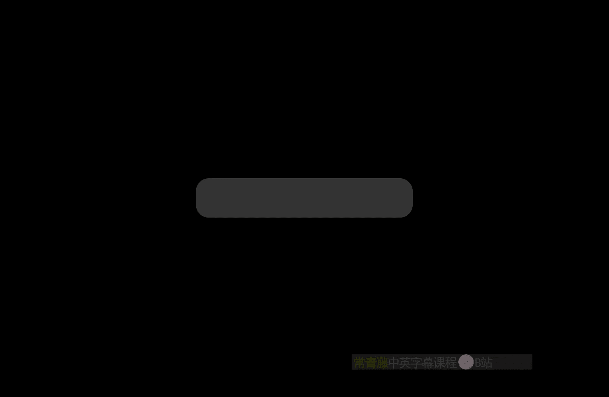

A couple quick administrative thing， I've gotten a little bit behind on。

Oping the webp page given the start of the semester I did correct the link to Ed discussion so instead of just the link to the discussion board it's actually the sign up link so you should be able to get in know if you can't please send me email to let me know。

I will be updating the webage over the course of the semester with。嗯。

copies of the scribbles that I'm you know the quote unquote board work that I'm doing during the lectures and links to video recordings of the lectures I'm recording on Zoom now and whenever I can type lecture notes that go into more details or set things out in hopefully clear。

I also will have by the end of the week set up the submission links on grade scope。For home。嗯。

And the last reminder is that I will be having。My weekly office hours on Friday afternoons at two o'clock just outside my office in Sebel。

 please come by then。If that time really doesn't work for a significant number of people I can its so some possibility get moving that around so again probably the best thing to do is to send me email or post on that discussion and if necessary i'll。

Run a poll next week to see if there's a better time。嗯。Any other logistical or administratives？

Questions。

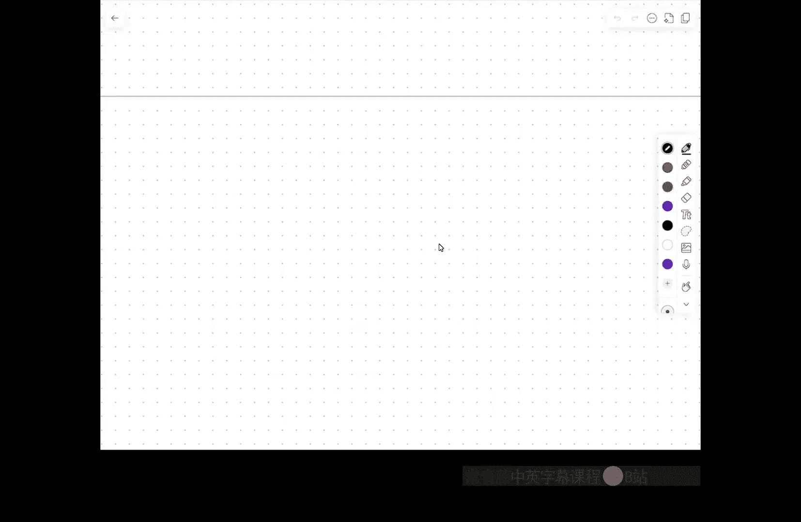

Okay， if not。Then。I will start back up。

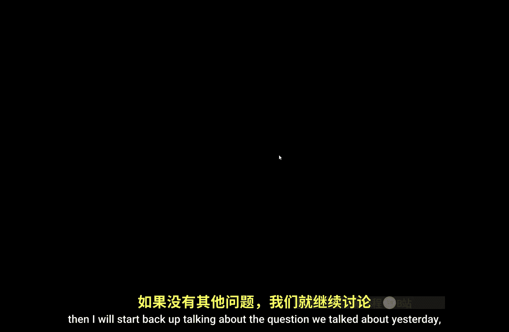

Talking about the question we talked about yesterday， which is the range minimum query problem。

So again， just to remind you， the original input is an array of values from some totally ordered universe so I can compare items。

 but I don't want to assume seen anything else about them。

And I want to preprocess this array so that later， given two indices I and J。

 I can quickly find the smallest element in the subray starting an index I ending get index j。

 or usually the way that is formalized is not that it returns the minimum value。

 but rather the index of the minimum value。哦。And there are a couple of obvious。

Relatively obvious ways to do this， one is just to build a lookup table of all possible answers。

 and another is to use a binary tree where each node。

 the leaves correspond to the values in the array and each node stores the minimum value among all leaves in that subt。

And with a little bit more accounting， that tree data structure allows you to store everything in a linear amount of space。

And use your queries and log in time。So we seem to have this this for the simplest solutions。

 this trade off between using more space。And having really fast query time and using less space having slightly slower query time and what we built up to last time was that we can。

嗯。Get down to a finer growing trade off where instead of an n squared term in the space。

 we get n log n and then by doing one level of so-called indirection。

 we get n log log n space and then by doing a second level of indirect。

 we get that down to end log log log n space， but still retaining con query time。

So every time we do another level of so called indirection。We。

Decrease the space by by taking a little log on this chain of logs。

 but we increase the query time by plus order one so with k levels of indirect you get。😡，Log， log。

 log K logs in the space bound in the the running time is older K and this balance is out at logg star。

But this is still not ideal。RightWhat we really want。What we want。Is linear space？

Because there's no hope of doing anything in less than linear ear space。

 we have to store the input array。And constant query time。

We obviously can't do any better than that either。So what I'm going to talk about today is how to actually do that。

U。And the， the solution that I'm going to talk about。It draws on a bunch of pieces。From。

Earlier papers。But this particular paper by Michael Bennder and Martin Tv Hton from I believe it's 2010 lays out the procedure in a fairly simple readable way。

 so most of my presentation is can be based on this paper。

 I will have a link to this paper on the course webage。嗯。U。But the。

Main trick behind this paper actually goes through a different seemingly completely unrelated problem which I'm going to talk about now this is。

The LCCA query problem。OkayLCA stands for lowest common ancestor so the input to the LCA problem is a rooted。

ree。Tea。😊，And the the， the query。Is given。Notdes。You and V。Find。The lowest。Or deepest。

Common ancestor。Of you and the， so for example， I might be given a tree that looks like this。

And if this is you and this is V。The lowest common ancestor is also the shallowest node。

On the unique path from UWV industry。Okay， but clear on what the problem is。Right。Now on the surface。

I will admit this looks absolutely nothing like。The range bedroom and query problem。But in fact。

 what I want to show you is that this is in a very real sense equivalent to the range of minimumcurry problem in the sense that there is both a reduction from RMQ to LCCA and there is a reduction from LCA to RMQ。

And so the linear space constant query time algorithm actually goes through both of these reductions on its way the final solution。

Without talking about you know， I'm not going to talk about how to solve LCCA queries in sort of native LCCA language because once I show you these reductions。

 then every RNQ data structure becomes an LCCA。哪儿童。So the first thing I want to talk about is。

How to reduce。啊。Raise minimum queries。To LCCA queries。And this uses the something called a。

Cartesian tree。Okay， so let me。Take as。My input array。

 these eight letters just to give a concrete example。So if you took 473。

Especially if you took it from me， you've seen Cartesian trees except they were called trees。😡。

If you haven't taken4 73 from me and you're wondering what a treat is。

 it's a Cartesian tree where the priorities are random。So a partissian tree。

Is a binary tree where the in order traversal of the nodes gives you back your original sequence。

So F is going to be the leftmost node and its going to be the rightmost node in this example。

 but it is simultaneously a mini deep。So the root is going to store the object。

 the item with minimum value。The right subtree is going to store all the things that occur before that minimum value in the array recursively and the left sorry the left less and the right subtree is going to restore everything to the right of the minimum value again recursively so the Cartesian tree here is going to look。

Like this。嗯。嗯呢。Oh。Z。W this is not a particularly nice looking binary tree。

 It's kind of balanced and sky， but。It， it。It gives us what we need weight， so I did that wrong。No。

 I did that right okay， so importantly， this is not。A binary search tree。

With respect to those letters。It's a binary search tree with respect to the indices into the array right so in order traversal。

Gives you the original sequence。But it's also a min heap。With respect to the actual values。喂。没有。

The key insight here is if I want to do a range minimum query， let's say。No。Come on， guys。

You got to correct me when I do this wrong。What's the minimum letter in this eight letter writing？

It's not E。I was distracted by the fact that that's my my。That's the first initial of my last name。

 so actually D goes at the roots。And then on the left， within the word five， E is the smallest thing。

 and then F。And then I and then V and on the right， I have N。And then， oh。And then Z。O。

So if I'm interested in the minimum。Elements in a particular range。

Well that was a particularly bad choice of query range so let me do some try to do something slightly more interesting okay's here's a query range。

Where that's going to show up in the tree。Is I look at。

The the node corresponding to index I and the node corresponding to index J now everything in between those is going to show up in between their occurrences and then in order traveral。

so the stuff that shows up in between might show up in the right ancestors of node I。

 but it might show up in the descendants， the left descendants of node J。

 but those are all going to be things that are bigger。Reserv standards。

Anything that's smaller is going to show up as an ancestor。ThanksSo。The least common ancestor。

 in fact。Is going to be the minimum element。没。So if I can pre process this carfuion tree for at least common ancestor queries。

That immediately gives me a data structure good answer arrangement。Right。哦，怎么。I don't want to try to。

Imrovise detail proof of this claim that the you know。

 the R MQ of I J is equal to the least common ancestor of。if I index the nodes exactly the same。

 but this is a relatively easy exercise in conduct basically over the structure by。可以。

So and it's clear that the tree I building has over and node。

 so the space bounds are going to be the same the pine bounds are going to be the same everything's going to be preserve。

And the LC problem isn't。Defined。To over only binary trees， but in this case， I get a special case。

But because the carceian trees all would fight。Maybe that will help with someday。

 I don't actually know how， but it is a special case of the LCA problem。On the other hand。

I want to do the reduction in the other direction。So I'm going to give an example。Of a tree。

 And I'm going to label the nodes。嗯。Just with lower case letters。

 these are not meant to be actual values because the LCA problem doesn't care about the values in the nodes。

It only cares about the structure of the tree。系。And so the key technique here。

Is something called an oiluler tour。Another other tour is the same as a is basically what all tree reversal algorithms already do。

But different tree traersal algorithms pre order post order in order。

They differ only in the choice of which one time。When I encounter a node。

 do I actually report that note？So the idea here is。

 I should imagine starting at the top of the tree and treating it like a maze。

 I stick my left hand on the wall。And every time my left hand touches a node， I write down that node。

 so the oiltures A， B， E， B， F， B， A， C， G，A， D， H， D。I and so on。Okay。

 so normally a preor reversal of the tree， the first time you write down a node， that's it。

 you've never write it down again。Post order traversal of the tree。

 you wait until over the last time youre nose and that's the only thing you put it in the output and in binary trees for in order traversal of the tree。

 you only write down the occurrence between everything in the left foot and everything in the right sub。

But more generally in the Or tour， every tree， every node that has D children。

It's going to show up D plus one times。Once coming after its parent and once after the last current of children。

嗯。嗯。Okay， so there's not necessarily an obvious relationship between the sequence of labels。

 but what I'm actually going to do is record。Not the sequence of just the sequence of pointers。

 but the sequence of depths。So zero， one，2， one。Two， one， zero， one，2，1， zero， one，2， one， two。

 etc ceter。Right， so I'm just going to write down the depths of the nodes。In my。In my sequences。Now。

 suppose that I want to find。The least common ancestor of two nodes。

 let's say I want to find the least common ancestor of C and E。大对。嗯。So what I'm going to do is。

In the Euler tour， I'm going to choose， it turns out it doesn't matter how'm going to choose any occurrence of the first node and any occurrence of the last node。

😡，Again， just like before it said the things that show up in the smallest。

 the shallowest thing that shows up in the in order traveral between this node and that is the LC。

 so that means。That what I'm looking for。Is。The minimum depth value。

In that range of the death sequence that I get from the Hollywoodwood。喂。So going， you know。

 sort of going backwards here。LCA of IJ is the same as RMQ。In this。Sequence of depths。

Of you know any occurrence of I。And any occurrence of。Now the oiluler tour has length。主办。

you actually2 n minus one so after you visit the route for the very first time。

Every other occurrence follows after traversing， every other symbol follows after traversing an edge。

 either up or down。They're exactly n minus1 edges and you traverse them once each edge once down and ones up。

Okay， so this has length。2 and minus1， but importantly， this is linear。系。

So I've reduced the tree of size N to range minimum in the query problem of size order n。

So the same space and query time bounds are going to hold possibly up to a constant factor of two。嗯。

No。Why why would I ever want to glue these things together。

 you'll notice that in the reduction from LCA to RNQ， just like the reduction from RNQ to LCCA。

 I went to a special case of LCA with attorneys binder。They's not all a problem set by nutrient。Also。

 the reduction from LC to RMQ goes to a special case of RMQ where numbers next to each other。

In the array that I'm preprocessing always differ by exactly one， either up or down。All。

 so this is sometimes referred to。As the。Plus minus1 RMQ problem。And。

Because of this additional structure in the data， the next trick that I'm about to apply。

Look on something。系。嗯。So。This gives me moral at least equivalences between these two problems so I can solve one problem。

 I can solve the other。😡，And this is probably the single most powerful tool that we have in the arsenal for designing algorithms and data structures is the more different ways that I can formulate exactly the same problem。

 more different kinds of intuition that I can apply the more powerful set of tools that we have to do this the evental solution that I'm going to describe actually doesn't ever use trees except as a temporary thing and preprocessing。

 so in the end it's just going to look like a bunch of tables， but in order to show that it works。

I am going to have to go through this correspondence between range minimumma and lowest common ancestors。

嗯。So。What we can then do。Is。If I want to pre process。An array A。I can build。A Cartesian tree。

It gives me something tea。And then I can use。An oiler tour。

And this gives me a new array zero to2 n minus two， I think that's correct。

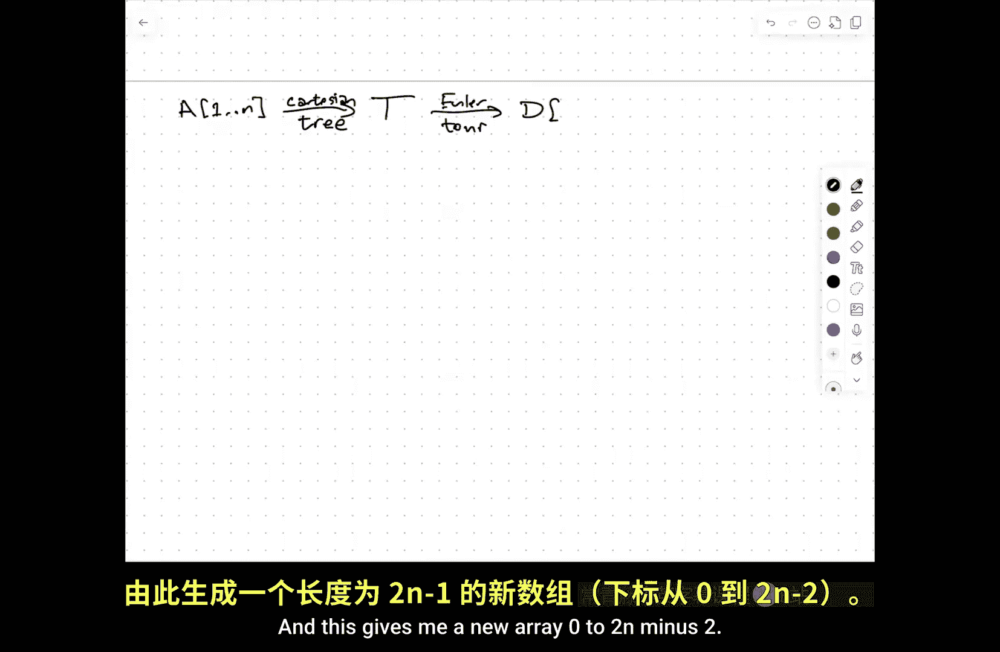

Sorry。😔，The cables are not。All that reliably。

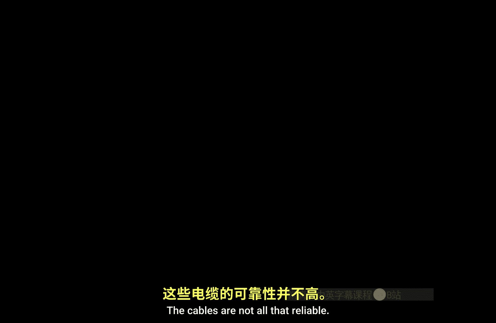

There we go。And so I've ended up reducing。The standard RNQ question for arbitrary numbers to the plus minus one RMQ problem。

嗯。In fact， with the first indigenous zero so the plus minus one thing means that in fact。

 I can encode this array just using a linear number of bits。

 not a linear number of integers or whatever values that I might want to have。Okay。

So this doesn't actually help me save any space yet。I still have you know。

 N log log in space and constant time to answer the plus91 or Q question， but I want to go back to。哦。

Back to indirect。And just to remind you how that worked。So my array， I break up。

Into blocks of length B。So they're N over B blockss。I create a summary data structure。That holds the。

Minimum element。In each of these blocks。So this is an array of length and ever B。I pre process。

Pp each block。Using sparse。Look up table。So to remind you。

 as farrs lookup table source and answer to every range minimum query where the range has length the power of two。

When range has length that's not a power of two I can cover it with two ranges that have length power of two and just take the minimum of those two so this block。

So this is going to be B log B。Space。For each of these blocks。

 and I'm also going to prep the block minima the same way。Spare lookup table。

 this is going to take space and over B log and over B and ultimately what I got the way that I got M log log in space is that set B to be logging。

Right and so the long overhead。In the top level table cancels out because there's a divide by log n and a multiply by log n that this becomes order N。

 and the log B overhead becomes log log n so the total space for all of the second level stuff is N log log n。

嗯。So。Now I'm going to do something that seems a bit strange。

 but make sense after a the thought it's very similar to the idea behind dynamic programming where you never want to compute the same thing more than once。

可。Now。If I imagine here。That。This is。And plus minus one RMQ structure。All right。

 so each of these blocks。Is a。Each of the numbers is either one more or one less than the number before it。

A reason us is how many different block data structures can you have？Yeah， it's only two to the B。

 right， It's only two to the B， right， Well， so I need to， I， I I。

You'll notice I don't actually care if you look at the second block that starts three，4， three， four。

 five，4。I don't actually care about the values three， four or five， et cetera。

I only care about which one is。Smallest。And so I could sort of imagine two blocks being equivalent if they have exactly the same pattern of ups and downs in the values。

so I can encode。In code。Blocks。Theia differences between。So zero， one，2， one。01。

2 becomes plus plus minus minus plus plus。OkayAnd there are only two to the b minus one possibilities for this。

The two blocks have exactly the same pattern of plus minuses。

Then the two data structures that I'm going to build for them are identical。😡，So don't do that。😡。

Just compute it once。So for each of the two to the b minus one possible patterns of b minus one ups and downs。

For each of these you know。Precompute。All possible。Block。Tables。So even if I use。

Nive two dimensional lookup tables。😡，The total amount of space that I need。To a。

Store all of these tables and the total amount of times that I need to construct all of these tables is2 to the b times b squared。

So， let's set B to B。I don't know， let's say one half login。Then the total space and time。

Is order squared of n。Log squared n， but notice that's a little low n。So previously。

 when I did the indirect， the top level data structure took a linear amount of space because the log in the denominator and the log in the multiplier canceled each other outside so had linear space with the top level of the tree and end the log log end space the second level of the tree。

But if I do this pre computationation of all possible second level structures。

Then the total amount of space to store all of them is only about servingative event。

And then so instead of having a pointer to a separate data structure for each of those blocks。

 I just have a pointer to the data structure that works for that block。And so the overall space。

Is order N？But within that second level structure， it's a lookup table。

 in fact it's a naive lookup table， I do one or right lookup。

So when I want to answer a query in this data structure。

 so I would say I want to here's index I and here's index J。

I will use the secondary data structure to get everything in that block that's to the right of eye。

 another secondary structure to get everything in that block that's to the left of J and then in the summary data structure I'll find the minimum among all of the minimum of blocks that are completely between9 and J using a query into the sparse look up table at the root which requires two array lookups so in the end。

At the time。Is。F array lookups。yeah well， okay， maybe maybe I should say plus one because I also need a point to the appropriate second level data structure。

 which is another array lookup。But it's an array lookup using， well。

 I need to identify what the second level data structure is。I can use this bit string。

Interpreted in binary as a number between0 and2 to the b， but2 to the B is only square root of n。

 so I'm doing an index into an array size squared of event So plus one to ID the correct。UB。

Structure。And so， but the punchline is。It's constant。Okay， so。First。大到有时咧。

Then I go the r and2 plus minus is one。Then for R andq plus1 is one， I build。

 I do this indirect trick I break things into blocks to blink about one half log n。

But I preprocess all possible blocks of length1 half or then。Rather than duplic， extra work。

Because I have more。More children of the root structure than I have possible blocks。

And then using the interpret I can answer anything and a constant number of the rhythms。

Okay so this is the vendor for our Colton data structure。Questions about this。O。So I want to show。

One variant of this structure。This is alluded to in other places in literature after Bennder and Far Colton。

And you can kind of argue about whether this is actually simpler or not。

 but at least it's different and again， want to emphasize that it's really useful in general to be able to look。

 design different data structures， look at things through different viewpoints when you're solving the problem because sometimes you want to combine things in the right way。

 I also want to emphasize here that once you have one solution。

 what you really have is an entry into a whole bunch of solutions。

That have different trade offs in terms of simplicity。

 practicality efficiency and potentially how you can extend them to more complicated problems so the argument is actually I don't need。

The RNQ to LCA。Two plus minus1 R andq reduction。I can do this。For Russians pre computationut already。

On the original data。It's just a little bit less clear how that works， so use indirect。

Now I'm going to set B2 B one third log based two of end。

 I need it to be strictly less than a half for reasons that it will come clear in second。

The question is now。I don't have just a pattern of b minus1 bits， I have a list of B numbers。😡。

In every block。And there are lots of listed be numbers。But。What I can say is that two blocks are。

Equivalent。If they if and only if they have。The same。Cartesian tree。 so if I say something like。

UmLet's say。Have my box。All right， so this has the Cartesian tree here。

Is going to look something like no。The first letter of the alphabet is not B。A and p goes here。

 then B， and then O goes here。And then C then left with。K。嗯。Why？But if I have a nu。啊。Block。

That has this exact same pattern。I'm just going to put in random letters here， R E F QS I， Z O。ER。QS。

I owe。F Z。A data structure， an R&Q data structure for that array of letters。

Its exactly the same as the article of the instructor to this other set of letters， yeah question。

So let's say the we on right。says we basically just assign like comparison based on your indexing in the words of。

那你看 in the block。I'm sorry do you repeat repeat the question so say yeah like I wish on number or my question time。

You什么 number what sir like it。哦你意 we看 like。我为什么 to make the that we大家你方 to a应选 number of blocks。

Oh right right， so I'm brushing under the rug a bunch of details about floors and ceilings。

 if the block size is not an exact divor of the array size。

These are kind of easy to deal with I mean you could just。

Pad with the appropriate number of infinities at the end and that's a little over of an extra space。

 or you could just do the arithmetic carefully。It details yes， if you actually want to implement it。

 but from a theoretical standpoint it's not interesting yeah is bigger than right for the second。

あ、ですです。Oh you're right， I didn't actually make this a I didn't actually make this a heap， did I okay。

 let's try that again。Yes。Sa that two blocks are equivalent if if you are sort them if you stored and then look at the inices。

 the R sort result are going to be the same almost so it is true that if the permutation that sorts this block and the permutation it sorts that block are the same。

Then。All pairwise comparisons will give you the same results and therefore the Cartesian tree of one will be equivalent to the Cartesian tree of the other。

But there's a more things can be equivalent， so it's possible that two different arrays would give you the same Cartesian trees。

 even though they have different sorting permutations。😡。

Because I don't care about order between some node in the left sub treee and some node in the right subre。

😡，Right。So let's try this again。啊。So let's say this is E， this is F。H， IQ。呃。A Z。So。In E I。Q， R Z。

 HM Now， if I've done this right， that is actually in in equal respect to this。反 what I know。Okay。

 so。The question is how many different cartedgesian trees are there？Right。

So the number of Cartesian trees。Really， this is just the number of binary trees。With。End nodes。

This is the nth Catal number。Which turns out to be2 to the n choose n divided by n plus1。

 this is about four to the n over square root of n。I'm probably missing a constant here。

 so I'll just put a theta here， but it's less than four to the end。

And I go through a complete derivation of the exact cattle and bound， but I don't need to。

Because I can already distinguish two cattleling trees by looking at the increases and decreases in their depth as I do an oilism。

So I know that I can encode。This Euler tour as a sequence of two M bits。

two euler two Cartesian trees gives me the same sequence of two M bits by doing an Oer tour or writing a one whenever the depth increases in writing the zero。

 whenever decreases， or equivalently writing an open for end every time the depth increases in writing the closed for end every time the depth decreases。

😡，It a more natural，inite more en of trees。Two trees that give you the same encoding。Are identical。

In terms of their shape。So even with the original RMQ stuff。

The number of different sub problemsble that I can get， the number of different Cartesian trees。

So the the number of。Cartesian。Trees。For。Blocks of length B。Is at most for to the B。

 which is four to the one third log base two of n， which is。呃。No， that right， yeah。Which is。

End of the two3s。So the the point is it's little of n if I'd use one half log n。

 this would have come out to be like exactly end and I。

There are logs and stuff in the preprocess that I don't want to worry about。

 so I deliberately pushed the constant down to that that's really。

 really sub linear so if I add an extra log that in the preprocessing， it's still going to be sub。So。

And in fact， I am going to eat some logs because for each of these lots of Liy and you can use be square states。

 that's only you trying to do a polylo。Right。So I can use。😡，Exactly the same indirect trick。

 but now without going through the plus minus fund reduction。And in particular。

 when I build the data structure。😡，For each block I need to construct this oiluler tour sequence for its Cartesian tree。

 but the actual data structure doesn't use the Cartesian tree。

 the actual data structure is just two dimensional lookup data。😡，So in the end。

 the data structure is。Sparse lookup tables at the right root and pointers to a collection of dense lookup tables to the blockss。

And we don't see trees anywhere。But I needed the trees in order to identify which second level data structure each entry in the summary structures should point to。

Again， in the end， I end up with。We still。Get。Order end space。And order one query time。Okay。

 so this diversion of LCs。Is it necessary at the level of。

Building the data structure or sorry of processing the queries。哦。You can argue， you know。

 you are still doing Cartesian trees and oiler tours。But instead of doing it the beginning。

To change the whole problem and building an any structure for the modified input。

You're doing sort of one level of indirection and then doing it to figure out how to connect the various sub problemsblem。

So it's still there。But。In particular， there's still a factor of two floating around because of the expansion。

 it's just floating around in a slightly different place。这。Any questions about this？O。So。

The last thing I want to show you。Is。呃。Another solution。That。Gets you order in space。

Order one query time。But actually supports updates。So the data structures that I've described so far。

Assume that you're given an input rate at the beginning of time and it will never change。

But a lot of applications and data structures really require you to take into account， hey。

 the data might change over time。So the specific update。That I want to support is just。

Change the value of this slot in the array to something new。RightNow if I attempted to do this。

For this indirect data structure。TheThe most significant thing that would happen would actually happen at the top level。

 I have this array of n over log n numbers when I change the value in the array。

 it might change the minimum element of some block and that means I have to figure out whether that happens in what the new minimum and element is then I have to bubble that up and in this structure size n over log n。

This array identified logging one of its values changes， which means。

Every range query that includes that value now has to potentially have a be valued。Essentially。

 I just have to rebuild that top of the data structure from scratch。

And so the update time for this data structure。Turns out just people right。

Right essentially I can't I can save some constant factors。

 but I can't save anything asymptotic so what this data structure of de Roche does is it allows me to。

Update one of the elements of the input array you log into。So like in squared dimension。Now。

It's sort of a natural question whether squared to is the right answer。

And the answer to that question is nobody knows。This is just the best result that is out there as far as I can tell。

But I want to point out a couple of。Observations， first of all。So one observation is。That if I use。

Raint。So this is the idea is I have a binary tree， every node。

 I think that the array elements and leaves and every node keeps a pointer to that remembers the minimum element。

 which shows below it。So this uses。Linear space。As a query time of log n。And。

If I use a balanced binary search tree。Actually no。

 I don't need a balance binary your search tree if I want to update something。In the array。

 what do I need to change in my rain tree？So' like， well， if I decide that。For example。

I want to change this A to an X。😡，Then that node changes its value and its parent node changes its value and its brain fact changes its value all the way through room。

So I need to change up to log n nodes in the tree， I obviously if I change the y it was Z I need to do anything else。

 but if I change the Y it was into a D I'm going have to bubble bubble up the little bit。

OkaySo changing one element requires me to potentially change。

The information stored at every ancestor of that element， and they're the most loggged ancestor。

So I can do updates in log end time， it provided that I relax and allow me allow queries to be answered in log end time。

8。The second observation is。Actually， a lower bound。Which is one of those two operations。

Has to take role。And the reason for that。Is that I can。Build RMQ sort。Of a。Okay。

 so the idea is that I'll preproces a for R and Q queries and then for I goes from1 to n J is the index of the minimum element in a in the range for one to n it's just the minimum element in the entire array and I'll set B of I to B j。

 and then I'll update，嗯。You know， a sub J to be infinity。Now。When I return B。B is just a sorted。😡。

So literally this is。Selections are。So from her the classical algorithmal selection sort。

 find the minimum element put in the beginning of the array， recursive。

 things like the rest of the array， that's exactly what this algorithm is doing。

So the overall running time of this。Is going to be the pre processing time for end things plus n times the query time for n things plus n times the update time for end things。

But on the other hand， that has to be bigger than N log N because everything I'm doing here is based on pairwise comparison。

The only thing I've assumed about the input is that this comes from some totally ordered universe so I can compare two items in across the time。

And any comparison based sorting algorithm needs to take en log in time。

 one way to see that is that there are n factorial different permutations that could sort the input array and every binary decision that you make。

gives you one bit of information and you need log of n factorial choices to narrow the space of permutations down to only one。

Blog of innefactor isem。嗯。So this implies that either。

The preproces time is in log n or the query time is log n or the update time is log n。

 at least these are all low events。So either prep is。人罗边。Or queryary？Is at least log in。Or update。

Is at least log n now this still leaves open the possibility that there's a really nice data structure in the back green it quickly just takes forever to build it。

But I think morally at least， I can rule that out。And the way that one way I would argue this is actually I'm not going to preproces the original array。

 I'm just going to process an array of n infinities。

And then I'm going to use a sequence of updates to fill in the real values。

And then I'm going to run this。So preproing an array of ininfinities。

The only information in that input is the integer N。What are you doing in a moment？

That's not by any means a formal proof， but I believe this lower bound proof can be formalized but the preprocessing time doesn't matter。

嗯。Oh yeah actually I could do it this way pre processcess some other array doesn't matter how long that takes now start the clock now do the N inserts and the the end updates to build the real values and then the end rate inquiries and then updates just to get the sorted out。

So the preprocesing plan doesn't actually contribute to sorting you can just do it all in advance。

So either the query takes a log in time or the update takes log in time。😡。

We have these lovely data structures that allow me to do queries in constant time。

The natural question is， if I require my queries to be answered in constant time。

 what's the best pick time I can achieve？😡，And the Dchet algorithm。

 which I'm about to explain to you， is the best solution that I am aware of。

Where the up time is going to be squared of n and it uses a different method。

To get rid of log logs in the space， it doesn't use for Russian pre computationut。

 uses something else。😡，Okay， so。The high level structure of Durochet's algorithm。Is。

It's a what I might refer to as a square of entry， so the idea is I'm going to take my array of length n。

 I'm going to break it。

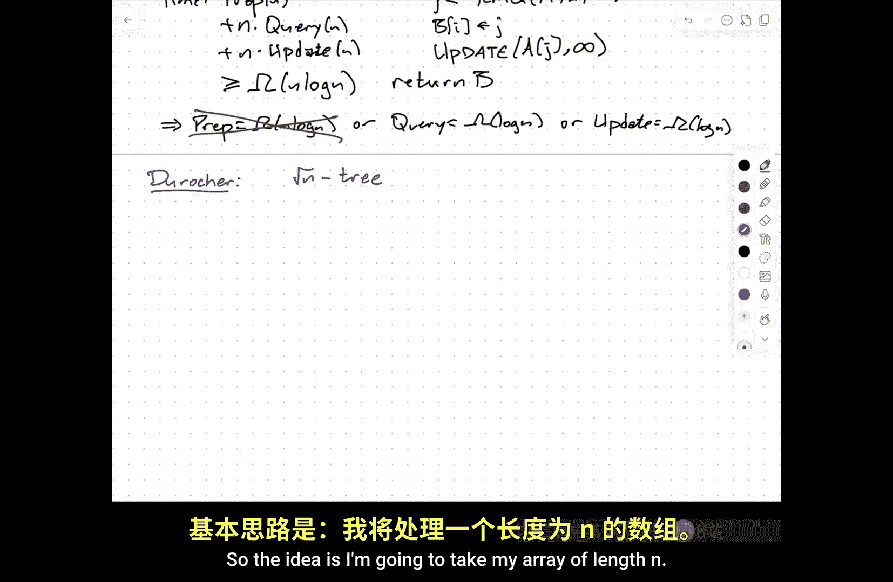

Into subs。Of length square root of n， I'm going to break those into subres of length into the one fourth and so on down until I get to individual dual elements of length of1。

No， sorry。嗯。

So every node。So I get a tree。With。Deepth。Log， log n。Every node。At depth。D。Corresponds。To a block。

Of length。N to the2 to the minus D。So when D is zero， this is n， when D is 1 is squared of n。

 when D is2， this is squared to squared of n and the one fourth。

Would use log log in that conduct a one。嗯。Now。I'm going to。Re processcess。Each lock。For。

Prefix and Suffix queries。Just using the lookup table。Okay。

 so the prefix query is the special case of arrangement query where the starting index is one。

There are only in such queries， depending on the ending index。

 I just write down the answers to all of them ass a simple。

The suffix query is a range minimum query where the ending index at the range is n， again。

 there are only a linear number of answers and I can write them all down using a simple backwards for loop。

可以。I'm also going to。You know， for each。Walk。Of link。B。

 I'm going to pre process the square root of B。Children， Minma。

So I'll compute the minimum element of each block and I'll pass it up to parent and then the parent is going to pre process these using a sparse lookup table。

😡，Okay， so that at least morally is the entire data structure。Now。When I want to answer a query。😡，Um。

A couple of possibilities of what could happen， So one is that the query is actually fairly long。

It covers more than one of the level one blockss。So what I'm going to do here is I'm going to do a suffix query here and I'm going to do a prefix query here and in the summary structure among these minima I'll do a minimal query here so this。

This type of query looks very much like the same strategy that we used for indirect。

 except where there we have n over log n blocks of linked log n here Im squared to then blocks squared to that。

The one thing that's different is if I have gray algorithm this short。

Then what would happen with a short query to just this green query range？

Is that at the top level I don't have enough information to answer the question or actually provide any information at all。

 so just get to re that one try。And continue recursing until the blocks are small enough。In fact。

 until the blocks are smaller than the length of the aquarium。Okay so the idea here is。Even。I and J。

I'm going to。Look。At。呃。Let me just say it this way。Let L be log， log。J minus i+1。Okay。

 counting up from the bottom， L is the shallowest level where the blocks fit inside the query edge。

 at least in principle。So I only need to do work at this level of the tree。at this level of the tree。

 my range minimum query still reduces to at most one prefix。Query plus at most one suffix query。Plus。

 at most one。Summary query in the next level up。Okay， so instead of recursing my way down。

I could just do an indexer within it， so I'm sort of assuming for simplicity that this is an integer。

So n equals2 to the two to the r for some integer R。

And then figuring out how to work personally way down just requires me to look at the binary representation of the index and do a sort of divide and conquer binary search within that index case。

So it's relatively simple， just doing arithmetic to say， oh。

 I want to go to the blockout level L that would contain the index I。Um。

 so just look at where I and Jay agree on their most significant bits and then a little bit more in could gives you them。

So identifying this level and the appropriate blocks to search。Takes constant time。

The prefix query takes constant time。The suffix query takes constant time。

 does it just single array lookups。And the summary query。

 I'm using as far as table so that's two array。Okay， so altogether together， this is going to be。

Constant time。Now the problem here is。As described。I've got log log N levels。

And each level is storing a linear amount of stuff。So it looks like naively。嗯。Niveively。

I have order n log， log N space， and this is exactly the same situation we were in before we did this for Russians。

We did one level of interaction and then that was it how boss。

 I think there's a log log in there because of the extra log in building Star table。

Deroche figures this out， you know reduces this in a different way the values。Stored。

In these various tables。Our array inds。Their indices into the original array， at least naively。

So to save space。I'm going to change that to。Instead of storing。For a given block。

The minimum actually directly tells you the index and the original array of the minimum element。

 it's just going to tell you the minimum index within the block。So in block of length B。

This is only going to contain。Log and bit。Integers。I don't need。L log Bad bit integers。

So to indexing the original array of Li N， the index I needs to have log Ed bits in order to specify it Google doing one and N。

 but for an array of length，Log， log in。So for an array of like square root then。

 I only need one half log of it。For an array of length of one/ fourth， we're into the one fourth。

 I mean one fourth log evidences。P rate length end the 116 I only be116th log end bits so what that means is。

Every index here。I need log n bits to record for every index here I need log n over two bits to record for every index here I need log n over four bits to record and so on I get a descending geometric series so the very first level of the tree I need n log n bits and then every level below that I use half as many bits as the level above。

系。😊，So。That means you know in total。I only need n log and bits and I'm working in a model of computation it's reasonable to assume that I'm working in a model of computation to random access machine。

With。At least login。😡，Bit。Words because if I can't。

Store the integers one through n each in a single word and simple things like for I equals one to n index。

 you know the end elements in the array， those things aren't just stable infection they take。

You know， I have to do more work。This means it's somewhat weird。

 but its actually fairly of the standard assumption。That formally。

The computer that you run your algorithms on。😡，Grameterrized about the size of the problem that you're trying to solve。

Larger problems， get solved on machines with bigger words。Which is actually reflective of reality。

When we had  eight bit computers we could only solve things that eras or you know maybe6 you know maybe use two vitegers to index into a big array a 60 size 64K we have 16 bit integers then 64 bit array you know 64K arrays were easy we had to do something weird for larger for 32 bit things now we can access 2 gigabytes for 64 bit things now we can start to access terabytes so as the problem sizes went up。

The word sizes in our machines also went up。So it's a little bit uncomfortable from a mathematical standpoint because what you'd like is to say it that's my machine it fixeds for all time now I'm going to have my problems run to it and now I have to weaken that and say well how big inputs do you want to process？

What is it？And then once you tell me what it is， then I'll build a bunch。But again。

 this is a fairly standard thing。嗯。But this means。That。I can store those N log n bits。

In only a linear number of words。And so Doche goes into the fine details of this。

 I'm going to skip over them， but the basic idea is at the root level， each index is a word。

At the second level you store two offset indices in each square at the third level or the next level down we store four。

Indices in each work so you're packing multiple integers into the same word and this complicates the arithmetic but not so much that it inflats the running time being able to do these weird offsets within the bits within a single word theyre typical machine instructions that that will allow you to do that in constant time。

Okay， so still。Order one。Very time。

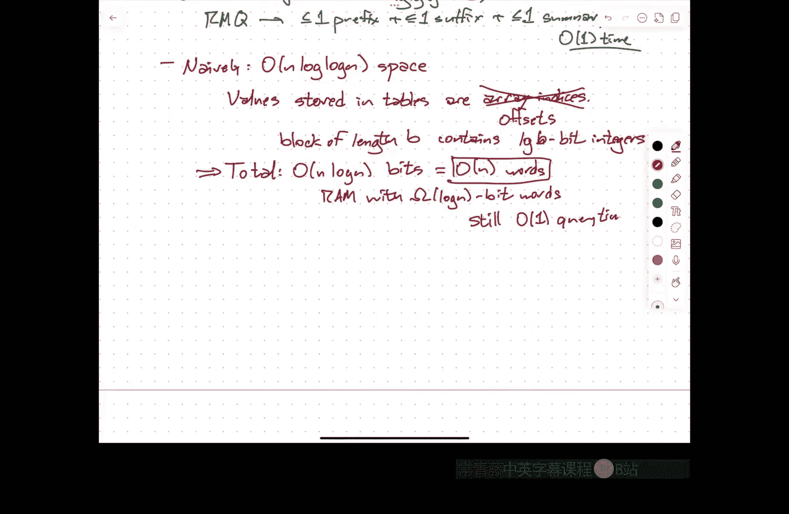

But now what do you do with updates？So before I go on， I've describe now。

Two completely different strategies for getting linear space and constant upon。

 one of them involving precomput， sometimes going through trees in some weird way。

 the other one involving a good packet。Doing stuff with with the four Russians and that kind of thing don't know how to make that dynamic。

 but this one we do。Because if to think about now， what happens when I decide that I want to change。

One of the elements of the array。I need to rebuild all of the prefix range query data structures that involve that element。

 I need to rebuild all of the septic。Range query data structures that involve that element。

 and I need to redo all of the summary data structures that involve that element。

 but that's only one structure at every level of the tree。喂。

And I don't actually build a prefix suffix thing for the top level。

 there's a little bit of extra work that I need to do to answer。

 if the overall range is a prefix of the input array， I still sort of go down to level one。😡。

It's still going to be only。It's so only going to be your customer worth。So to do an update。

 I need to rebuild。Every。Prefix。Suffix。And summary。Data structure。That contains。

The changed element A sub I。But this is going to be dominated。啊。

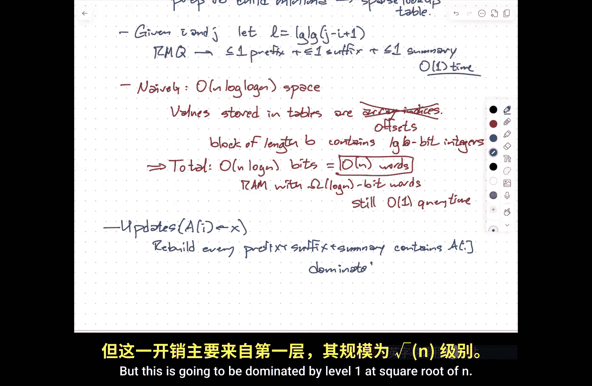

By level one。At square root of n。

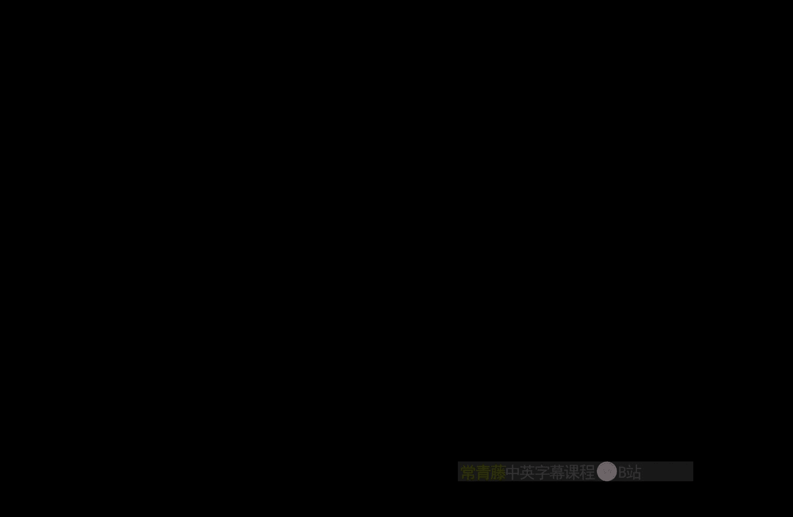

Okay， so almost all of the time we send rebuildings when you send the very top level or I've got blocks of length squared to n。

I need to pre process， rebuild one of those sort of end size blocks。For prefix and thought stuff。

And I need to rebuild its parent sub data structure with pestsi squared bay。

Now there's actually a trade off here， I could imagine dividing things into more blocks。

And that would speed up the preprocessing of prefixes and suffixes。

 but it would slow down the preprocessing of summary structure that have now more blocks to summarize。

Or I could use bigger blocks and that would speed up the preproces and some of things because there are fewer things to summarize but each of the blocks would be bigger。

 it would take longer。To pre process the prefixix and suffix inference。

So the square root of N is there to balance those two different kinds of updates。So I'm balancing。

The number of blocks。Versus the size。Of the blocks。At the top level。And so beating square root men。

Is going to require something else？😔，It's going to require having some other way of， for example。

 processing lead array for Crfis R queries in constant time that allows you to do updates not just naively by rebuilding。

Or that you can do somehow the summary structure， I don't know， prefer somehow， so that again。

 when you update something， you don't have to just rebook everything。This is an open problem。

Don't know how to do it， as far as I know I knows how to do it。

 the gap between squared end and log n。We don't know what to do。

And this is another feature data structure stuff。YouVery， very quickly run into the wall。

Of what we actually know how to do。We are out of time。

 I'm happy to answer questions afterwards but that's it for today， thanks。Remember。

 homework zero is due next Tuesday office hours tomorrow。

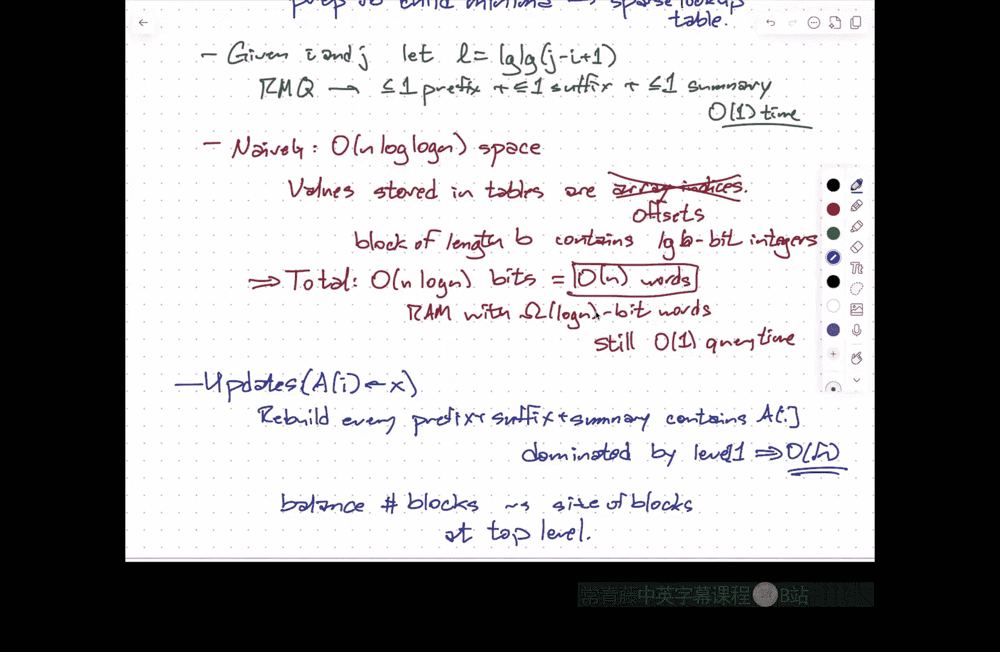

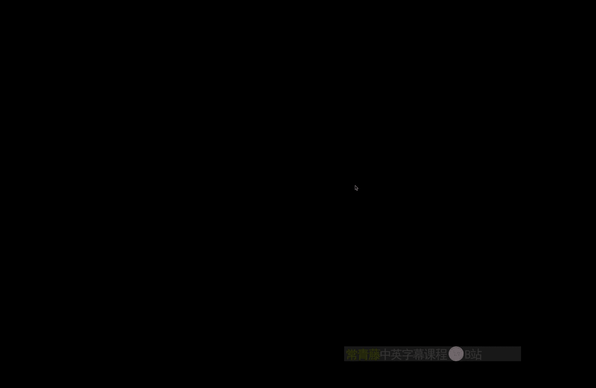

啊对。