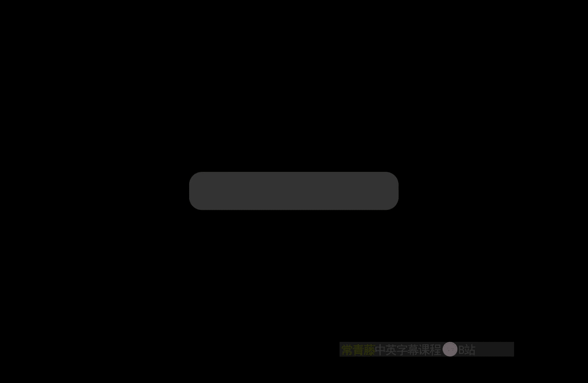
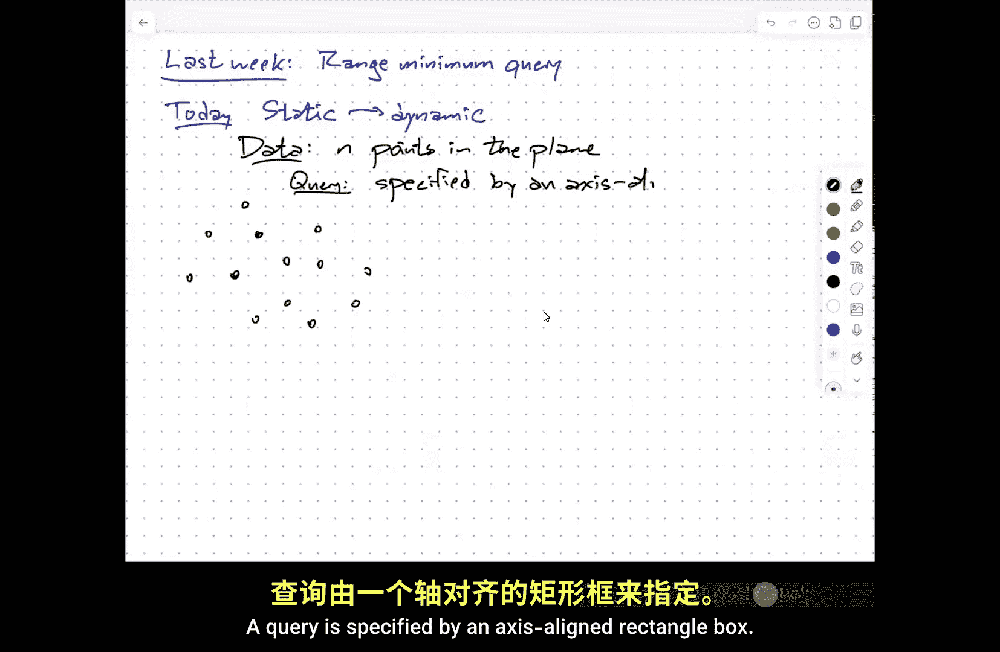
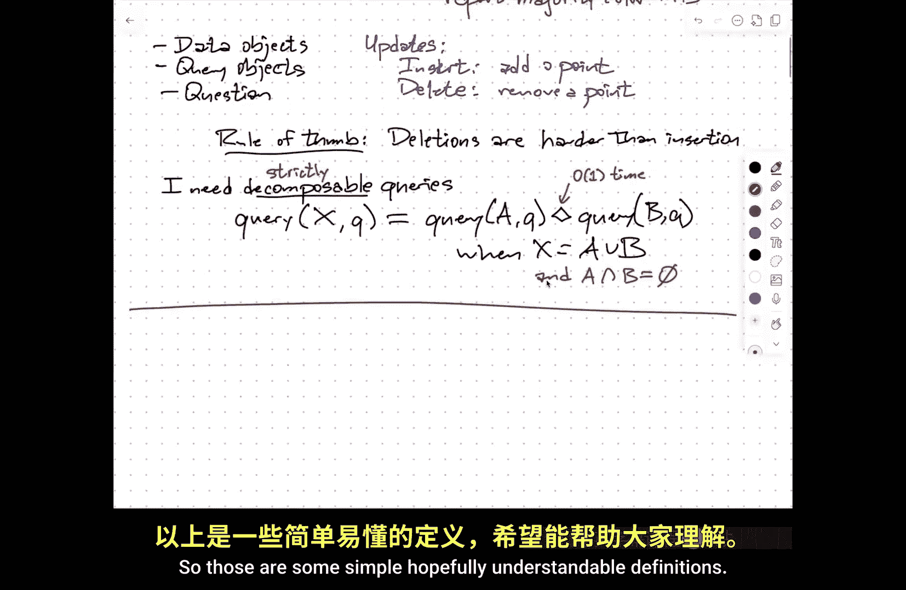
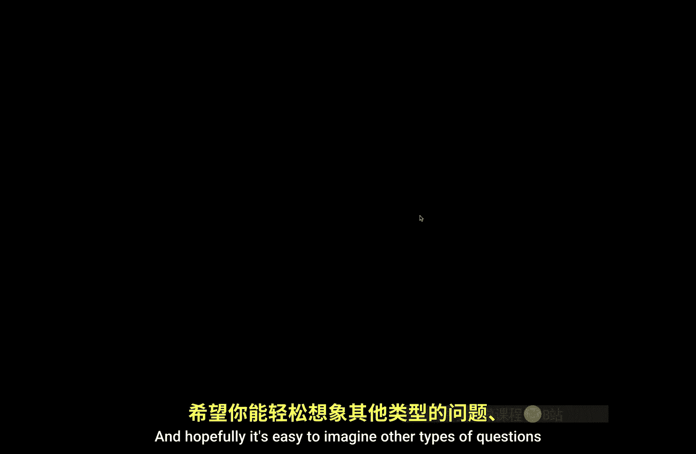
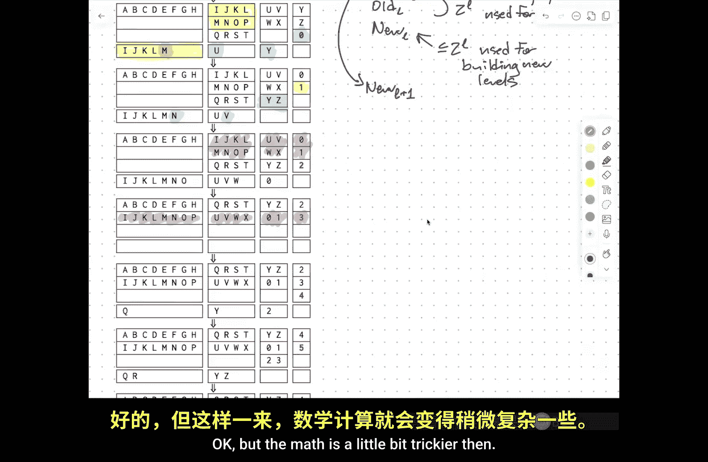
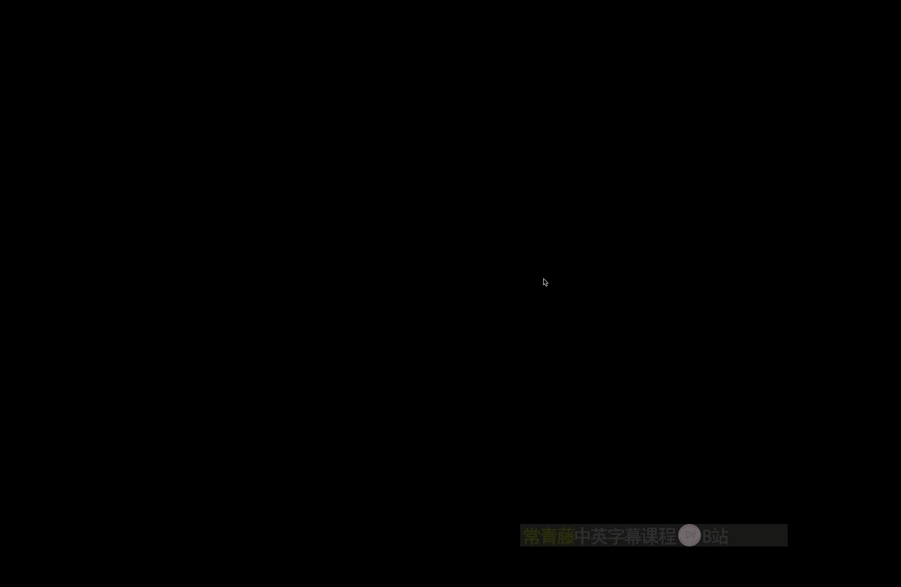
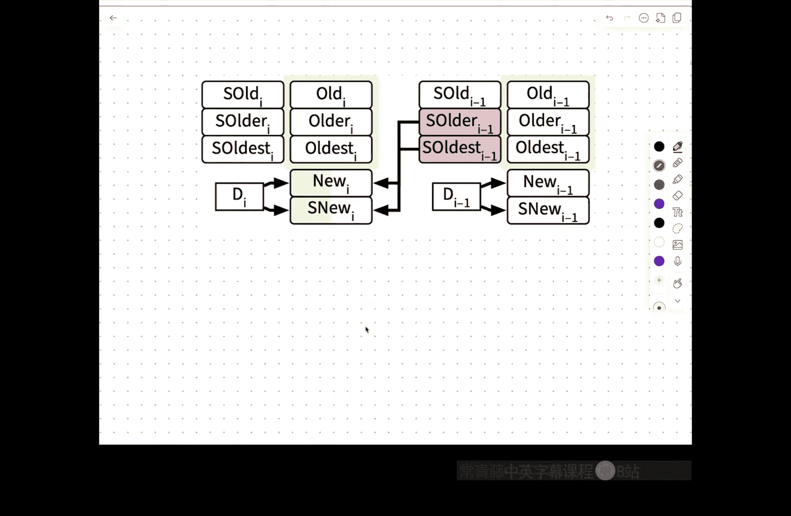

# 伊利诺伊大学【中英⚡高级数据结构｜CS598 Spring 2025, Advanced Data Structures】 p03 P3 静态到动态的转换 -BV14qZYBJEZy_p3-

。

Eventually people will come in from the nice weather outside， thank you all for coming。

I did notice that a few people have dropped and a few undergrads have been able to add。

If you're just joining the course now。Officially， homework 0 is due tonight at 9 PM。

 but grade scope is configured to accept。Late submissions。So if you started late。

 you've still got some time to work on homework zero。

 if you started at the beginning of the semester， again。

 it's configured to accept late submissions I'm not going to double check to see who registered when because。

That's kind of painful， but please don't delay submitting things。嗯。啊。Again。

 the homework zero is primarily meant as a sort of self assessment tool， the complete solutions。

 my complete solutions for homework zero run。About 12 pages， which violates my own， you know。

 try to keep everything under three pages per problem， mostly because。

The last problem can be improved in several different ways from the sort of baseline solution that you might see in 473。

 so I went for doing that you know， in my written solutions。

 developing those improvements incrementally rather than just showing the final。Algorim at once。Um。诶。

If you haven't started。Give time machine there's a lot of details。

 especially like problem one is not terribly difficult。

 but it's like a sort of 225 style data structure design problem it's easy to miss little details here and there so give yourself time to double check everything。

Um， okay。So。The last。Couple of lectures。😔，We talked about。One particular。Type。

Of a data structure problem。Called the range minimum query problem。

 where the input is an array of numbers or some items from some totally ordered universe。

You need to pre processcess it so that later I give you two indices INJ and I want the minimum value in the sub from index side index J。

 okay。This is kind of a prototypical data structure problem， you've got some data。

 you need to preproces it later you need to answer questions about it。

 and possibly you may need to update modify the underlying data and still later be able to answer questions about it。

And what we did the very end on Thursday。Is we talked about how you might modify the linear space constant query time data structure for just a static array to support insertions。

To support updates。So what I want to talk about today。Is sort of generic strategies？For transforming。

嗯。Static data structures where the underlying data set never changes。

To dynamic data structures where you may need to insert or delete items， insert items into the data。

 delete items out of the data， is not the only type of update that one can manage。But。

The sort of context that you should have in mind here。Is that。Again， just as a prototypical example。

嗯。I need to store endpoints in the plane。So I'm given if you like an array of Nx coordinates and an array of N coordinates。

So， are these。A。Da that might look something like this。A query。Is specified。

By an axis aligned rectangle。

Box。Um so。と慢。Here is my box。

And then the question varies。So different kinds of questions that you might ask， for example。

 an emptiness query。It's just any points。In the box。So count query。

Would be tell me the number of points。In the box。Another possibility might be a minimum query。

So imagine the points have weights。And I want the minimum weight。Point。In the box。

Or I could do something a little bit more， you know， obscure。

Every point are the points are either red or blue。And you want to。Report。The majority color。

In the box。So these are all， you know， again， sort of typical examples of what。

What is referred to as orthogonal range searching， so orthogonal because the sides of the box are orthogonal to each other。

 right angles to each other， this is a two dimensional orthogonal range searching problem。

But you can imagine similar kinds of questions。For different types of。Source data。

 different types of query， so called query ranges。And different types of questions， so for example。

 here is a tree， I want you to pre and the edges have weights。

 I want you to pre processcess this tree so that later I give you two vertices and you tell me the minimum weight edge along the path from one vertex to the other and that path is unique because it's a tree。

Okay， so generally speaking， I need to specify three things， you know what are the。You know。

 what are the data objects？What are the query objects？And what is the question？And now。

 when I talk about updates， I want you to imagine this example of orthogonal range query。Where。

Generally have two types of updates。Which are， you know， insert。And delete， which。

 as you might expect， mean， you know， at a point。And remove a point。These are exactly the。

The operations that you normally want to perform in like balanced binary search trees。

 so what binary balanced binary search trees can be seen with the right auxiliary data in the internal nodes as a data structure that answers one dimensional。

Orthgonal range search queries the points are just the data are just points on the line。

And you build a binary search tree over those X coordinates。

And if you want to answer an emptiness query， you just say is the predecessor of the left end of my query interval the same as the predecessor of the right end of my query interval。

 so it's one search through the tree counting just if you store at every internal node。

 how many nodes are in that subtree， it's easy to answer counting queries and log end time we saw in class last week how to answer minimum queries。

Voting queries are a little bit weirder and I haven't thought enough about how one would actually do that with the binary search tree。

But the reason why that's difficult， hopefully we show up will become clear in a second。系。

So this is the kind of data structure where I imagine that in advance， somebody else has built。

As static data structure for me。 They've built the subroutine that takes in the raw data and builds the data structure。

 They've built another subroutine that takes a query object and returns the result of whatever question we we want to answer。

 Okay， And the question is now， how can I modify that。 black box data structure。

To support insertions and deletions。So one sort of。Rule of thumb。

Which is not going to surprise anyone who remembers to 25。Deletions are harder than insertions。嗯。

And I'm going to。The techniques I'm going to talk about are going to be consistent with this rule of thumb in that I need to make more assumptions about the underlying static data structure in order to get deletions to work。

嗯。But even adding insertions is not necessarily straightforward I need。

One property of the queries that I'm going to ask。Which is that。I need。Decomposable queries。

And what that means is that if I ever want to ask。About， say， in some set X。

 given some query object Q， if I've got。Or rather， if I've got。AhSorry， me just say it this way。So。

I need to be able to take my data， split it up into a bunch of subsets。

And by answering queries in each of those subsets independently。

 and then combining them using some sort of efficient operator。

 think of that diamond there in the middle as meaning like plus or min。Or union。

 something where where。This is just an operator that takes two possible answers。

And I assume combines them in constant time。So if you can split your data up into subsets more or less arbitrarily。

And then still pre process each of those subsets， and then when you want to answer a query。

 you query each of those subsets。And combine the answers to those queries。If that all still works。

 then this is called a decomposable query， yes。对啊。X is the underlying data。

 little Q is the query object， so little Q is the rectangle in the example。系。So for example。

 if I am doing。Empptiness queries。Empptiness queries are decomposable。

 If I want to know whether any of these points lie in this box。I can first ask。

 are any of the red points inside the box and then second ask or any of the blue points inside that box and then take the four of those two results？

And moreover， this works， even if some points are both red and blue。So in this particular case。

 I don't even need these subsets AB to be disjoint。 if I'm doing counting queries， on the other hand。

 again， I can count the red points in the box and I can count the blue points in the box and add those two numbers together。

 but that only works。If the red and blue points are disjoint。Okay， so for purposes。Of this。Lecture。

I'm only going to consider what happens when I decompose things into disjoint subsets。

 sorry partition the set of items。So this might be， I don't know。

This is not a standard term in the literature， but you might think if with that restriction strictly decomposable。

 meaning you actually have to subdivide。Similarly， if I'm doing a min query。

 I can say what's the lightest red point in the box， what's the lightest blue point in the box。

 take the minimum of those two， and again that doesn't require red and blue to be destroyed。😡。

A majority query， a ro query， on the other hand。Doesn't work。

You can't say what's the most popular color in the north half of the rectangle and what's the most popular point in the south half of the rectangle and then figure out in any way from only that information what's the most popular color in the entire rectangle。

没と。U。Seeed the Electoral College。U so。The voting queries are not decomposable。

 and so none of the techniques I'm going to talk about would work for that。陈。嗯。All right。

 so those are those are some。Like simple。

Hopefully understandable definitions， and hopefully it's easy to imagine other types of questions and other types of query objects and other types of data that where it's easy enough to tell whether the query is decomposable or not。

Think about。Counting queries and emptiness queries and minimum queries as sort of canonical examples。

Okay。So。Suppose now I only want。To in add。Insertions。Because insertions are relatively easy。

Deletions， I'm going to require even more assumptions。

And this is a technique due to Bentley and sackchs。In 1980。

 and this is sometimes called the logarithmic method。And this will expose a little bit why。

I asked about these weird versions of binary in homework zero because there's actually a fairly strong connection between the methods I'm going to talk about and both standard and non-standard radix representations of integers。

Okay， so the idea is。There's this black box data structure over there。

 I want to modify to support insertions。What I'm going to do is not maintain one data structure。

 but I'm going to maintain up to a logarith number of data structures。Okay， so my I'm going to build。

Let's just say decompose。The data。Into。At most， log based two of N levels。L0。

 L1 up through L of log n， I'm going to be a little bit fast and loose with off by one errors。

 but that won't matter any。So each El sub I is either。The empty set or has size。Two to the eye。Okay。

 so if I have 15 points。I'm going to decompose that into a set containing one point。

 set containing two points， set containing four points and set containing eight points。In general。

 which sets LI are empty？And which ones are full are exactly going to mirror the ones and zeros and the binary expansion of n。

 a total number of points in the set。Okay， so。Mirring。The binary。Representation。Of N。

The number of points。听。So， I have。I'm going to mirroring the sort of normal binary notation。

 I'm going to put the smaller things on the right。ok。

So I've got this exponentially increasing sequence of data structures。Now， why do I want to do this。

 The idea is now。First， when I queryary。The overall data structure。

The way that I'm going to answer that query is I'm going to query each of these log n levels Now。

 if a level is empty， the query will come back and go empty。😡。

And I assume that diamond operator that's used to combine results knows that when it gets a null pointer or the empty set or some other signal that the set is empty。

 that it does the right thing， it treats that as a zero when you're adding。

 it treats it as an infinity when you're doing mins。So you get some sensible result。

but say if let me just throw down an example here n equals 25， that's 16 plus 8 plus one。

 so these sets are empty。So to query。I'll just use the black box query at every level。

And if the query time to answer the black box query in a data set of size n is Q of n。

Then the total time。Is going to be the sum over all of these of Q to the eye。Okay， this is crudely。

At most Q of n times log of n。So I am getting a penalty here if Q of N is。Small。

If you're a little bit more careful， if say Q is square root of n。

Then this summation turns into a geometric series that's dominated by the largest term and the log disappears from the overall time bound。

 I'm not going to keep saying that， but anytime you see a new log crop up。

 that's only there to accommodate the case where the query time is subponomial。

 maybe it's log n or log squared n or something like that。

 then you'll get an extra log by doing this decomposition into log with the number of levels。

 but if the query time is polynomial， that log vanishes into the Big O。Now。

 how do you do an insertion Well， the way that you want to do an insert。Is。You mirror。

Binary increment。Okay， so here is an example of。A data structure where I'm inserting the letters of the English alphabet in alphabetical order。

 and then I'm inserting the digits zero through six。

So initially you know 26 is 16 plus 8 plus2 so I have a data structure of size 16 a data structure of size8 and a data structure of size two then when I add zero I create a new data structure of size one。

But then the next time I add something。These two data structures that have total size three。

I already have a data structure of size1。So I merged that in the new thing into data structure of size two。

 but I already have a data structure of size two， so I merge those to the data structure of size4。

Okay， so remember the standard algorithm for incrementing a binary number。

Is you increment the least significant bit。If that becomes a  two， you change it to a 0 and you。

Increment the next more significant bid and so on until you don't carry anymore。U。So similarly。

 later on。When I'm inserting， I guess it's the 32nd element into this data structure。

I'm taking this data structure of size 16，8，4，2，1， and the new thing that I'm adding。

 and I'm combining them all。Into a single data structure of size 32。Okay。So。

The overall running time for this。Is。Basically， let's see。

 I think the right way to say this is the thumb。Over。

 I less than some value L of the pre processing time。No， sorry。Sorry， let me say it this way。

 It's the pre processing time of2 to the L where。L is the minimum index。Such that before I do。

The update， my data structure is empty。Okay， so in the step that I've marked here in blue， the first。

Level 0，1，2，3， and 4 are non empty， but level 5 is empty。 So I build a new data structure of size 5。

 and I throw throw the old data structures away Here。 P is the pre processingcess time。

To build one black box data structure， now this is horrible。

Because you'll notice when I did that 32 insertion， I literally rebuilt the entire data structure。

And if this is like a binary search tree or something based on a binary search tree。

 this is at least going to take linear time for a lot of data structures that might be en log n or N log squared n or end of the three hves are n cubed。

I don't know what P ofN is。But the thing to notice here。Is that the amortized。Insertion time。

Is small。Because large rebuilds。A。Infrequent。So。And just a reminder if you haven't seen amortized analysis before。

We're not really interested here in the time for a single operation。

The goal here is to minimize the total computation time over the entire lifetime of the data structure。

Yes。哦。那。Dater structure in a continuous like the piece of， let's say memory。

 but just update the pointers。So this is just these boxes are only meant to show the data that you would put into the data structure。

 the data structure itself is not necessarily in a array， it could be something very。

 very complicated like the LMQ stuff that we saw。Last week。So this would be like， oh。

 I'm taking those 32 things and I'm building this whole new。

 you know partissian tree for Russians based thing out of it。So no， in general， you can't just。

 you know， these if these were just strings， then sure， maybe you could do something like that。

 but they're not。Yeah it that's exactly right， so level L。L costs。P of2 to the L time。To rebuild。But。

Only after。Two to the L insertions。So the amortized time。To maintain level L。

Is P of 2 to the L divided by 2 to the L。Okay， so in other words， the amortized time。Insertion time。

Is some overall L from0 up to log n of P2 to the L divided by 2 to the L。Okay， so if。

The preproing time is linear， the term inside that summation is just one。

And so the amortized insertion time is log A。If P of n is n log n。

Then the term inside that summation just simplifies down to log n。Or rather rather。

 it simplifies down to log of2 to the L or just。L。And then the summation becomes log squared n。

So in general， the， again， this is a crude upper bound。But this is。Login times。P of N over N。

 So each of those assuming the pre processingces time is at least linear。

You're given a bag of data and you have to do something with it at least linear is reasonable because you have to look at all the data。

Then the largest term in here is less than the。PN over N。And there are log n terms。

 so I get this again this upper bound and again， if P of n over n is actually a polynomial。

 that log n factor vanishes because you get a geometric series。Now， again。

 just to remind you what this means is over the lifetime of the data structure。

The total time that I spend doing insertions is the sum of these amortized time balances。

I'm not claiming that each insertion takes this much。This is just an accounting trick。The idea is。

 every time I insert。I pay a little bit of extra time。

In advance to each level so that when it when I need to actually rebuild the level。

 I've sort of already paid for the time that I need to do the rebuildilt。

And so this is the amount of rebuild tax。That I'm putting into my rebuild bank account。

 Or if you like adding to my rebuild potential。So that later rebuilds will be paid for。嗯。嗯。

How many of you have seen and have not seen amortized time before？Okay。

This takes a little bit of time that certainly took me a little bit of time to wrap my head around。

 I'll make sure that when I post these， I'll also post。Notes that kind of do a gentle introduction。

 There are lots of different ways to do amortized analysis。

 The idea of taking some chunks of time and charging them to。You know。

 paying in advance for things that work I'm going to do later。

So charging some of this time to earlier operations is a fairly standard metaphor。嗯。But the yeah。

 the idea is the。呃。Total。Time。For N insertions。Um， this is going to be the sum overall L of n over two to the L of the time to do。

Inserions at level rebuild level L， this is another way of saying this。

If I'm building n things in every two of the L insertions， I'm going to have to rebuild level L。

 So this is the total time。 So the amortized time is that divided by N。

I'm averaging over the operations。 There's no randomness here。 I'm not doing an expected thing。

It could， but that it be a separate averaging， this is not averaging over parallel universes。

 this is averaging the time spent over the sequence of insertion operations。Okay。So that's great。

If we're really， a lot of contexts， we really are only interested in the amortized time。

For the operation， because this is the data structure is always being used in the service of some larger task。

 some larger algorithm， typically， and we really only care about the running time of the larger algorithm。

So one operation is not so necessary to be efficient。Usually， but sometimes。You actually do want。

You're running times to be worse case。 You really do want to guarantee do you have worst case complexity。

 So a good example of this。Is if you're communicating you know， with a robot on Mars。

You already have this incredible time delay talking to Mars， if you're going to say， no， no， no， no。

 no， move your wheels， you don't want to add more delay。

 otherwise the rover will fall over the cliff， maybe a more immediate example if you're doing stock trades。

And your bidding data structure， the one that you're using to predict when to buy and when to sell。

 has an amortized time of one microsecond per transaction。Every few days， it takes a minute。

You're screwed。Because in that one minute， the stock can do whatever it wants and suddenly you're out several billion dollars because。

You thought you bid when the price was X， but you actually bid when the price was 0。8 x。Um。

Robots are a good one because a lot of things like if I want a robot that balances something or a robot that is like doing surgery。

 the robot needs to be able to respond quickly to things in response to the inputs that it gets so real time is really important Ill remind you that self-driving cars are just robots。

So the question is。Can we get the same？Same performance。Same running time。In the worst。Case。

So the answer is， you know under the assumptions that we've used so far that you're only doing insertions and your queries are decomposable。

 the answer is yes。This is。Over Mars。And。Vun Lon。Mark Overmars was a master's student at the time。U。

So。The the strategy that that。Mark came up with。Is。Called lazy rebuilding。And the idea is。

Instead of for purposes of analysis， charging a certain amount of time to maintain every level at every insertion。

You actually spend that amount of time maintaining that level at every re inserterion。Okay。

 so one of the things that this means is that。You need to have a way of saying run that black box algorithm for so many cycles。

I know it's supposed to take one minute to finish， but I'm going to spread that out over 60 insertions。

 so run it for one second and then run it for one second and then run it for one second and then run it for one second。

There are standard mechanisms for being able to do this。

 see your favorite programming languages course， I'm not going to talk about those in detail here。Um。

 but so there are ways to like get your operating system to cooperate to do things like that。嗯。

But the other challenge is。While you are building。The larger levels in your data structure。

The data in the smaller levels of the data structure from which you are building the larger levels of the data structure is changing。

So you're building the airplane in the air， so to speak， as you're building the data structure。

 it looks like the data that you need to build the data structure out of is evolving over time。

 and so you need to add a certain amount of redundancy to the data structure to kind of make sure that the parts of the data that you're reading to rebuild this level。

Are not also being rebuilt somewhere else。系。So the idea now is。That every level。L has。four。

Structures。Which I will call oldest。Older。Old。And new。And the idea is that。

These are either full or empty。They have full meanings。

 they have size2 to the L and all of the data appears each item appears exactly once in exactly one old data structure at exactly one level of the overall conglomeration Okay so this is。

Used。For。Querries。And then new is as size most to the L， this is used for building。new。Levels。

And the new parts of each level contain an additional copy of some。

 not necessarily all of the items in the data。😡，Okay so I'm going to sort of jump in here again。

 with the same example that I started with， so that I showed you earlier with the Bentley Sack's sluarithmic method。

 I start with I've got 26 letters of the English alphabet that I've already inserted into the structure that leaves the day structure in this particular state。

And I'll explain how you can figure this out what that state is just from the number of items in a second。

But the idea here is。Oldest of three is full， older of three， and old of three are empty。Oldest。

 older and old level 2 are all full。Level one has two old data structures。

 levell zero has two old data structures。U so。What I'm going to do when I insert。A new item。

 so I'm inserting the zero。Is I'm going to spend。A fraction of the time that I need。

 half of the time I need to build this new data structure of size2。

I'm going to spend one fourth of the time I need to build this new data structure of size 4。

And I'm going to spend one eighth of the time that I need to build this new data structure of size 8。

Now， again， if。If the data structure really is just an array。

 this really means just copying one element in the other the way the picture is shown。Um。

 more subtly， I don't mean when I say that like。At the end of this first insertion。

 new of three contains I JK L and M。Even that's a little bit fuzzy。

 I don't mean that I've inserted five of the eight elements。 I mean。

 I've spent five8s of the overall time that I need to build the data structure containing。

In particular， containing these eight things。诶。So older and oldest at level L are the things that I'm going to try to combine。

To build new of L plus one。So it may be that I've got。I J， K， L and M。

 or it may be that I've got I J， half of K， a third of L， a fifth of M， the sixth of N。1。

12 of O and whatever is left for P。Right， and just， this is， again， just meant to be evocative。

 not not。Of a formal description in any sense。嗯。So the amount of time that I'm spending。

Is sort of represented by these blue splotches。It's exactly matching the amortized time that I spent before。

 Now， one thing that happens here， if you notice at the next insertion。When I answer one。

I have now completed the construction。Of this data structure of size 2。

So I pop it up from new to now old。And I remove the corresponding things from the old parts of level zero。

So old is just a collection of static， completely built data structures。

Right but then I also spend a little bit of time building this and a little bit of time building that。

And this is maybe， you know， a bit more apparent later on when when I insert。This item three。

 I've now completely finished。Building the level one data structure containing zero and one。

 I've completely finished building the level2 data structure containing UVvW and X。

 I've completely finished building the level23 data structure containing IJKL and MOP。

So in each of those levels。Once new is complete。I throw away old and older。Sorry。

 I throw away older and oldest in the next smaller level。

And then I promote the new up to being whatever the next available slot in the old hierarchy is。Yes。

So I need。2。To copy into the next thing。But then I need another one。So， that。

When I fill up new again， I have two ready to copy over to the next thing。

There's probably a way to do it with very， very careful accounting that uses fewer sets。

 but so part of this is I'm trying to do things as simply as I can。But it's sort of。

This is kind of a standard thing that happens when you like try to deamortize things。

 It's really helpful to have。Multiple pieces and multiple redundancy。So actually in particular。

 I think if I spend twice as much time。Doing the preproces at each level。

 then the what I'm describing here， then the old levels will always be empty。Okay。

 but the math is a little bit trickier then。

系。So。

engng。So for each。Insertion。For each。Level。Oh。I spend。P of2 to the L over to the L time。Building。A。

K of L。From。Older L minus1 and。Oldest。L minus1。And then I promote。A new L to old something L。

When it's done。系。So the running time of the insertion algorithm is immediate because it says right there。

 spend this much time doing something。so the overall insertion time。Is going to be。The again。

 just using the crude upper bound here， order log n times P of n over n， but now。This is worst case。

 There's no amortization going on at all。There is a small issue of how do I know that this actually works？

so in particular， I need to know that when I want to promote new into one of the old slots。

 that one of the old slots is empty。hy you asked why do I need three。

 my next question is why is three enough？Okay and the correctness。Is。

Follows from the observation that this mirrors。An algorithm for increment。

A non standard binary counter。Where。Each bit。Can be either two or three。

 except first the most significant non zero bit can be one or two or three。

Okay so in a normal binary number， every bit is either zero or one。So here I'm going to use， again。

 I'm going to represent my numbers as sums of powers of two。

But I'm going to insist that the number of powers of two that you need。

For the most significant power of two is either 1，2 or 3。And for every smaller power of two。

 you must use either two or three copies of that power of two。系。嗯。This this representation。

It always exists for every positive integer， and in fact， it's unique。Okay。

 this is a Gry induction proof。But really， I would invite you just to play around with it in particular。

 one of the things you'll notice is that if you translate the number 26 into this representation。

 you will get1， three， two， two。So the number of occupied old slots at level L is the value of the bit。

At position L in this weird one， two， three binary representation。

This idea of using non standard positional representations to kind of guide the evolution of data structures is actually fairly common。

The most extreme version of this I've seen is， I think they used a non standard binary counter where every bit。

Could be between three and eight。And there's something about the most significant bit and there's something about no two consecutive eighths or sevens and something about no consecutive I mean there's a bunch of restrictions on this。

 but the idea is you develop this weird nonstand representation。

That has the property that when you want to increment。There are local changes。

In the evolution of the representation that you can mirror by local changes in the behavior of the data structure。

So every time that I try to increment a three in this nonstandard representation。

It'll turn out that I also need to do a carry from a four to change that to a two and produce a carry to the next higher level。

So the timing just works out perfectly that when I'm just about to build my fourth complete data structure。

 I need to。Carry over to to the next level， yeah。好。all possibilities can represent as show that。

 you know， listen never break our daily structure， why is it necessary to pay that way？まそた。

It simplifies things you're right， uniqueness is not strictly necessary。

 but it really does simplify things to go， oh， you've got 79 things that means I know exactly the structure of the data is do the following things rather than having to。

You know， probe the data structure to figure out what the structure is。

 in addition to executing the updates。 It also is sort of a general rule that。

When you've got structures that can be kind of floppy and have lots of options。

It really can make your life easier to develop algorithms or to prove things about algorithms。

If you choose a canonical representative from this set of all possibilities that has some additional structure that's really helpful。

 So I don't just want any spanning tree of this graph。I actually want a shortest path tree。

And then I， I can use properties as short as past trees or actually want a minimum spanning tree that'll allow me to use。

Properties have minimum among spanning trees， even though in the abstract。

 maybe any spanning tree would do。So again， this is sort of a high level meta strategy， you know。呃。

There's a saying that artists use， creativityreativity thrives on constraints。Right。Here's Can。

 make something。It's a lot harder to do that than say， here's a canvas paint that tree。

Or here's a canvas only use charcoal paint to draw a picture of that tree or keep your eyes closed and only use your left hand and now draw a picture of that tree that it seems like it would limit your creativity。

 your ability to actually make progress， but in fact。

 those constraints free you from having to figure out which option to use。

And so it really is useful to have that。Those constraints。Okay。So this， oh insert in queries。

 by the way， I only query the old data structures， and that means that I have the same running time for insertions except maybe with an extra factor of three built in。

 so I might have to build query three data structures at every level， only the old。

 I don't query the news。😡，嗯。So in the end。My query time。Is。

At most log n times the black box query time and my insertion time。Is。Blogg in times。

The preproces time divided by n。And these are both worst case。That that's the punchline。Okay。

So this is relatively standard， relatively straightforward。

Most of the time I'm not going to care about making things worse case because it ends up being like kind of。

Griy and mechanical like this。And it's easy to get the details wrong。And so for the most part。

 I'm just going to say， yeah amortize time， this is good enough also because for some data structures like S trees。

 which is something we'll talk about probably next week。

 there really isn't the good way of deamortizing the performance of the data structure。

 We don't know of any data structure that has the same worst case。

Time guarantees that display treats have。So let's stick with amorts to keep things simpler。A。But now。

The next question is。What about deletions？And。Here I want to consider a couple of special cases。U。

The easier special case。Is a。When you have。The answer to your query basically comes from a group。

You have inverse operations。 You have subtraction， not just addition。 So in addition to having。

This operation that I that I'm denoting with a diamond that allows you to combine the answers to your queries to get the the answer to the Union。

 I'm also going to assume that。You have an inverse operation so that， for example。呃。You know。

 no matter， I'm not going to。It doesn't matter actually how you parentthesize this。嗯。

X diamond bar y is this is x minus y。ok。So the decomposition operator or the combining operator has an inverse operation。

 So this could be plus。 This could be union， but not men。Well this could be。Or。

So if I'm reporting a set。If I maintain my set in like union find data structures where I'm unioning things by just changing one pointer then great。

 I can do union in constantant time， if my answers are brilliantolelions and I want to know or。

Or even if I want to know like parodity exclusive four like even number of points in the box。

 these these are these are invertible if I want the number of points or the sum of the weights of the points that's invertible。

 but if I want the minimum weight among all the points， that's not invertible。I can't say。

Take the minimum of all the points in this box。Thank you now independently。

 ignore all the points in thatbox。And somehow combine the answers that that doesn't work。1。So。

In this case。If I want to take my black box data structure and build something that supports both insertions and deletions。

I'm going to literally build an anti data structure。Okay。

 so here I have the main data structure here I have a data structure that only supports insertions and here I have。

A data structure that only supports。Dligions。Now again， remember。

 I'm only going to be shooting here for amortized time to bear with me a little bit。In general。

 the way I answer a query。Is。I query I。And I。Query M。And then I subtract the results。Of querying D。

So M is my main data structure， and you should imagine that most of the points are in there。😡。

Hence M， the majority of the points。Are in the the main data structure。 But over time you when。

 when I asked you to insert points， you said， oh， I'm not going to put them in M。

 I'm going to put them in I。And this is an insertion only data structure using， for example。

 the logarith method。And similarly， D， when I say delete this point， I say， okay。

 I'm going to delete this point， I'm going to put it over here in the list of points that really I don't like。

And that's an insertion only data structure。For example， using the logarithmic method。

And then when I want the overall query。I will query the main data structure。

 but then I'll also query I to get at the new points that I've inserted since the last time I rebuilt everything。

 and I'll also query D to know that I should ignore points that I've deleted since the last time I rebuilt the main data structure。

😡，So let's for the moment， not worry about what I prime and D prime are。嗯。This seems fine。

 so the time to insert well you know I insert into I and the time to delete this is same as insert into D and provided we have something decomposable like we did just a minute ago。

 the insertion and deletion times，Meaning the insertion times are going to be reasonably efficient。

So we have a correct algorithm。It seems to work， but there's a problem。As a general rule。

We want the size of our data structure to be a function of the data that we actually want to store in the data structure。

But if I have a billion points and then I delete 9 million， million999 million of them。

Then I'm carrying around a data structure of size roughly 2 billion when in fact。

 I only want a million。Right， so if D gets too big。Then I'm wasting most of my space。

So to keep the space bound to keep。The space。Reasonable。嗯。When the size of the。

 the number of items that are deleted。Is bigger than the total number of items。Yeah。

 let's just pick a constant。When more than a constant fraction of the data that I'm storing are corpses。

I burn down the building and build a new one for only the living people。Okay， so rebuild。

A new main data structure and prime。 And then I prime gets empty。 D prime gets。Empty。

 and then I start over at that point。This is called a global rebuildilt。

when I meet some condition that requires， hey， things are getting wasteful。

 I just burn it to the ground and start over。Now， the time to do this。In the worst case。

 it's going to be the。Proportal to the total amount of data that is left。

After deleting D from my union。This is also going to because I restricted the size of D。

 this happens the moment D exceeds one/8 of the rest of the data。 This is also going to be。

 I could also take n to be the size of I plus the size of M plus the size of D。

 It doesn't really matter whether I include d or exclude D from the definition of n。

 This is only going to change things by a constant a constant factor。 sorry， I shouldn't say N here。

 I should say P of n。But。Only after。At least in over eight。Induls。In fact。

 only after at least N of eight deletions。So what I can do is I can charge。

That P of N time that I need to rebuild everything。To the preceding。And over eight deletions。

And this means that now the amortized cost。For delete。Is， well， whatever it costs to do an insertion。

In my insertion only data structure plus。P of n over it。Again， there's this all in togo。Okay。

 so now insertions cost whatever they cost in my insertion only data structure。

Deletions normally cost。Whatever insertions cost to my insertion only data structure。

 that every so often I have to rebuild if I amortize the cost of that rebuild across all the deletions that had to happen since the last global rebuild。

 that gives me an amortized time for delete， that is the insertion into the insertion only data structure I call D plus this fraction again。

Okay， so now even if insertions are worse case， deletions have this amortized efficient cost attached to them and now the space。

Is always big O of S of N where this is the space。Bound for。The insertion only data structure。

And in particular， if you're using the logarithmic method。This is Big O of the space for the static。

Data structure。So because I'm doing this global rebuild。engng。呃。Things are reasonable spacewides。

Now this is if I want。You know， amortized deletions。What if I want worst case deletions？Well。

 in the case， when I need worse case deletions。嗯。I need to notice that my graveyard is getting full。

And at some point， I need to explicitly start rebuilding the new main data structure， yeah。そ以。

YouNe to make the click your are smaller。As well， right or。Before we form the operation to rebuild。

Well， it's not clear whether we need to make it smaller， right。

When we rebuild the new deletion data structure at the end of the rebuild is empty。It has size zero。

I assume that insertions into that data structure will grow it as necessary。It's a black box。

 I don't have to control over its size， but I assume an empty data structure doesn't take any space and more point more data in the data structure takes up more space。

 but that's all I need to assume。嗯。呃。So the vague idea here。

And we're getting close to the end of time。 So I I， I'm going to skip over a lot of details。

These details are in the notes。But the idea is。When it looks like the deletion data structure is getting too big。

 maybe change that eight to a4 for like when I really want to be done rebuilding。

 and I start triggering a lazy rebuild of everything when the graveyard contains an eighth of the data。

So what I do is。I freeze。I am indeed。Okay。To get worst case input so to get。Worst。Case。Deions。嗯。

When the size of D is at least， oh， let's just say I union M over 16。

 the precise values of these constants。Don't really matter。啊。Freeze I and D。Start inserting。Into。

I prime。And deleting。By inserting into D prime。诶。These are initially empty data structures when I start this process。

So now when I want to answer a query， I need to query five things instead of only three。

Five is a constant， so big O， great， but then every time I do a deletion in the data structure when it's in this state when I'm rebuilding。

I do two things。 First， I insert that new item into D prime， and then I spend a small amount of time。

On the process of combining IM and D into M。So again。

 this is about taking the total running time that I would need to build this new main data structure and splitting it up into shards and every time that I delete something。

 I spend one of those shards of time。😡，And this spreads the amortized time out actually as worst case time。

 so。啊。Query。I， I prime， M D D prime。When I delete。I insert。Into the prime。 and then I spend。

I don't know， eight times p of n over n time。Turning IM and D into M prime。

And then when M prime is completely done。I now copy I prime to I or just rename throw out the old IM a D。

 rename I prime I， rename M prime M， rename D prime D， and I'm back to the normal state of affairs。

Now， I have to balance the constants to make sure that immediately after I rebuild。

 there's a certain number of operations that I know that I can form before the next time I have to rebuild。

 This is a question of balancing these constants 8 and 16。But if everything balances out correctly。

 this actually gets you to。诶。Worst case。Delete。Of。I of n plus P of n over n。And similarly。

 insertions are still worst case because I was starting with an insertion only data structure and whatever guarantees that it gave me。

 I'm going to inherit and worst case query time because I'm just querying five data structures and combining the results。

so。Provided that you're doing something like summation where you have your answers are in some kind of group or you have an inverse。

 you can basically build an antidata structure and support deletions in roughly the same amount of time as the logarithm method allows you to support insertions。

 The one nice thing is that for deletions you never gain this extra log factor you get sometimes with insertions and queries。

usingsing the logarithmic method， it's just plain P of n over N。

The downside is this only works if you can subtract query answers to sort of cancel out pointss that aren't really there。

If you don't have an invertible query， then。Then you have to do something else。

And I'll just refer to the notes at this point。I need to still make an assumption about the data structure。

 namely that I can do something called a weak deletion， or sometimes called tomb sing。

When I delete an item， what I can do is somehow reach into the data structure and say that's not here。

So in a binary search tree， this is easy If I'm using a binary search tree as a dictionary and I say delete five。

 okay。I don't actually have to do anything。And then later you say， hey， do you start five， I go？

There it is， no。Just lie。And you can't tell that I'm lying because you told me to delete it。

 and I pretended that I did， then you asked me if I delete it， and I say yes。

That's the only access you have。And again， the problem is that if the data structure gets full of tombstones。

 it's wasting space。 occasionally， you have to do a global rebuildt。嗱，我即系。Yeah， but again。

 even in that case， if you're using the right kind of balanced binary search tree。

 you can do it in a way that it's like it's the same query time。

Without without regardless whether the five it' actually there or not。嗯。Yeah， I mean， yes。

 so you're pointing out a subtlety that if I'm just doing membership queries。

 this is completely straightforward if I'm doing something more interesting like a predecessor query。

There's more work to be done。 It's still doable， but it's more difficult。U。

I will talk about a balanced binary search tree calledscapegoat trees that lives and dies by doing this kind of rebuilding stuff。

Bas， a scapegoat tree is the way you keep it balanced is when some part of the data structure is unbalanced。

 you rebuild it。When the data structure is full of corpses， you rebuild it。

I've just told you everything you need to know。Right， except， you know， obviously the。

 the details that matter。If you've got this sort of wheat deletion idea。

 you can turn it into a real deletion idea that takes care of the space bounds by combining some of the older。

 oldest stuff and combining this idea of like having a copy of the data structure that you're rebuilding from similar to what Overmars did with the logarithmic structure。

 again， I don't have time and to go through the details， but if you're curious there in the notes。

So this is。Any data structure that satisfies these axioms and a lot of data structures satisfy these axioms。

And unfortunately， for a lot of data structures， this is the only way we know how to make them dynamic。

嗯。So we'll hit this occasionally， but a lot of most of the data structures I'm going to talk about are going to be designed from the beginning to be dynamic and we won't have to go through dismiss。

Are there any other questions？All right， yeah guess does done general can we just design staticing data structures and not worry about we know？

So data structure design is very much。Feels very much to me like building things out of an erector set。

 if you've ever seen erector sets as strips of metal and you have bolts that you put them together or Legos or Lincoln logs or tinker toys。

There's lots of ways to put things together， but if you do it wrong， it falls over。

There's no general thing about all data structures that you can just design a static one。

 but if you satisfied the right axioms， then you can。

And the right axioms vary depending on precisely what you want to do。So。

For kind of geometric researching things where you're counting or reporting or finding the things furthest to the left。

 those kinds of things you can generally design static only and making things dynamic is either automatic or straightforward。

But for more complicated things or more weirder things。It's not going to be so easy。All right。

 I'm happy to take more questions up front， but we're out of time for now， so thanks everybody。

