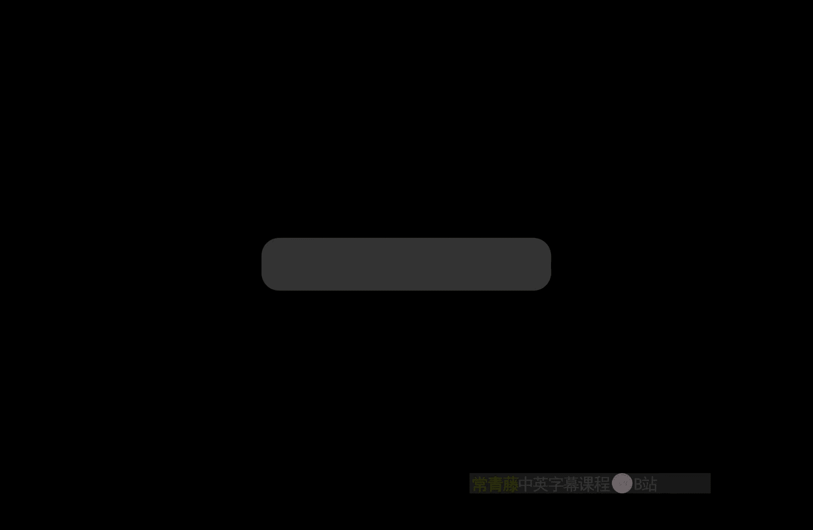
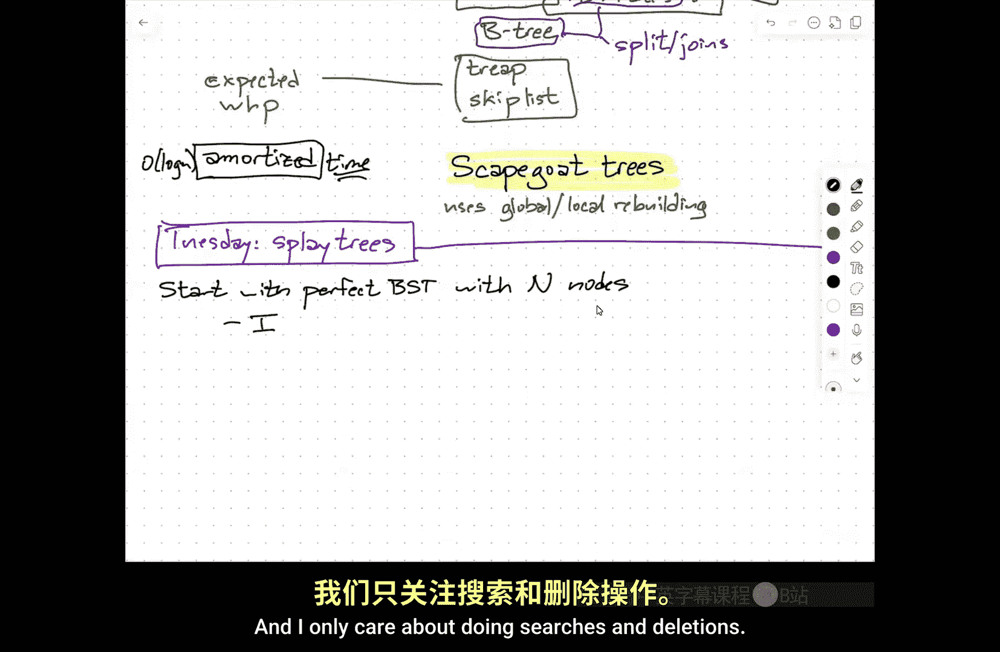
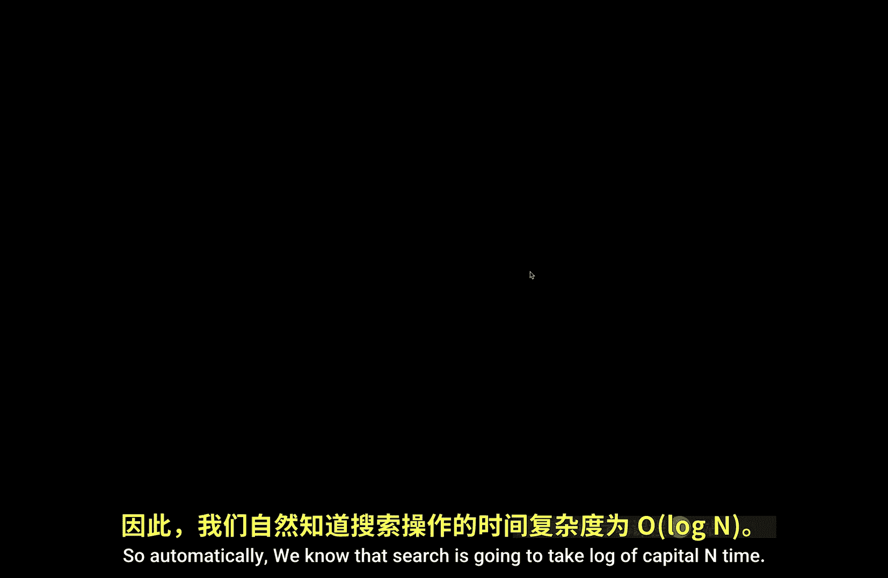
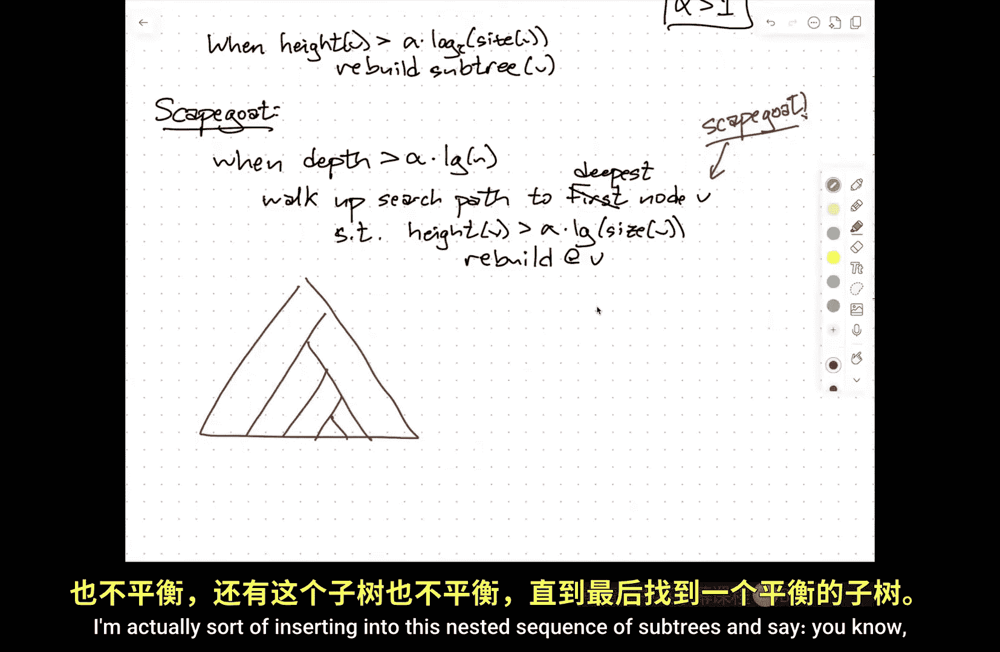
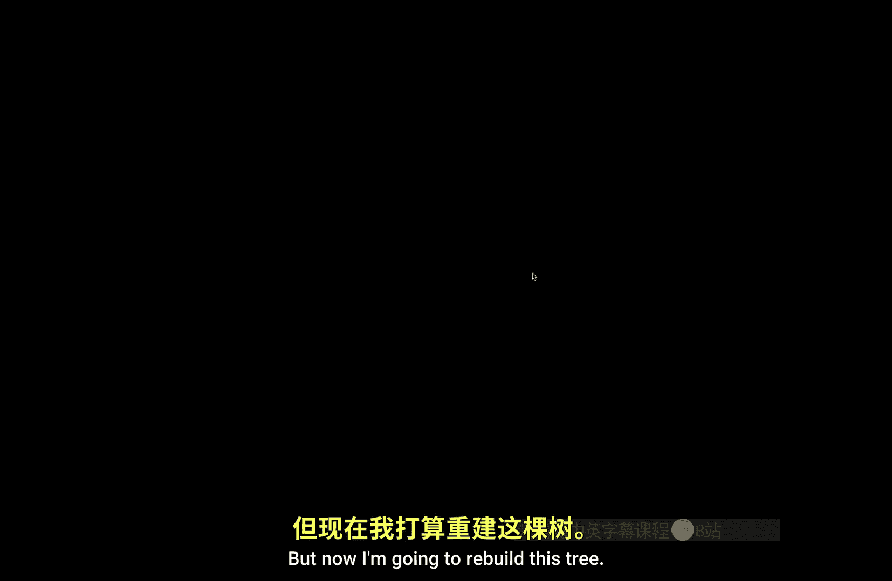
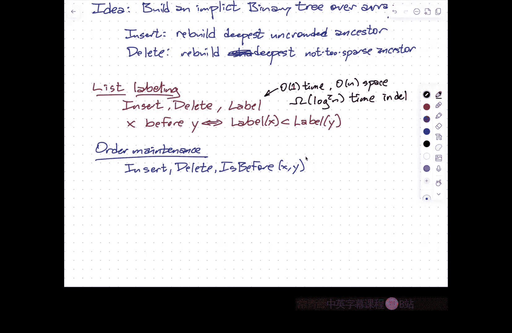
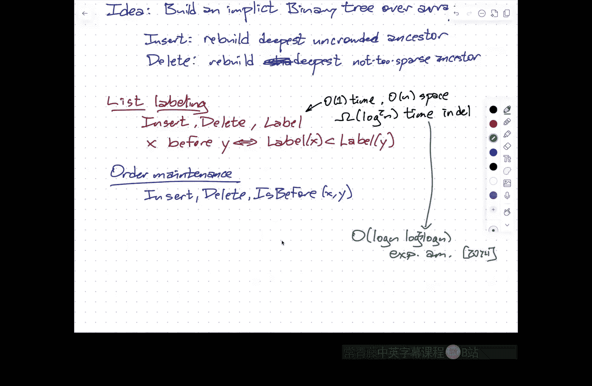

# 伊利诺伊大学【中英⚡高级数据结构｜CS598 Spring 2025, Advanced Data Structures】 p04 P4 替罪羊树 -BV14qZYBJEZy_p4-

Okay。

So。Thanks for coming out through the drizzle。Oh。What I want to talk about today。

And I'll continue talking about。At least for one more lecture。Possibly two。

Is something that most of you have probably seen。In one form or another already。

It's the idea of a balanced binary search tree， so we all know what binary search trees are。

 you have a collection of nodes， every node has a search key in it and is a pointer to a left subte and a right subtree。

And in order to be a binary search tree。Sorry， in order to be binary search tree。

 all the keys in the left subtre have to be smaller than the key at the root。

 which has to be smaller than all the keys in the right subre。

 and the subtes have to recursively be binary search trees。嗯。

So an in reversal gives you a sorted list。Balance typically means。That the depth。Of the tree is。

Loarithmic in the number of nodes in the tree。So this is automatic if you build a static binary tree from a static set of data and you do the obvious thing。

 putting the median at the root and then recursively build subtrees。But in general， what you want。

Is you want to support？Searchches。You also want to support。Inserions and deletions。嗯。

I'm going to be a little bit vague about what I actually mean by search。

Because subject to some mild constraints， it really doesn't matter whether I mean。

Is this item in the tree or find me the predecessor of this item in the tree or find me the number of items between these two values。

 find me the largest item between these two values。The different。

 lots of different searches all ultimately boil down to traversing。Either one or two。

Pads from the root down to some nodes in the tree。So as long as the depth。Is logarithmic？

The time to do a search will also be logarithmic。And so there， there are lots of。

Versions of balanced binary search trees。Our data structure class。

225 talks about what I think is really the first。Balanced binary search treat that was ever proposed。

By Adelson Velski and Landis in 1967 so called AVL trees， there。

An equivalent data structure that nobody talks about anymore called one two Brother trees。嗯。

Some other classes， data structures classes talk about red black trees。

Where every node is either red or black and you have rules about like I think it's something like a black node。

 a red node must have a black parent。嗯。And there are equivalent data structures， so two。

 three trees or two， three， four trees， depending on how you do the abstraction。

 there's also a version。That。Arnna Anderson。came up with which were based on what are called bounded balance trees。

 which are variants of these two， three， two， three， four trees。

 which turn out to be equivalent to what are sometimes called left leaning red black trees。嗯。

You may have also seen。Versions of bee trees。So this is a common data structure used in large scale databases where B here is the size of a memory block or a cache line or a page。

If I take bead to be a constant。These are not technically binary search trees。 for that matter。

 neither 2，3 or 2，3，4 trees。 those are actually examples of bee trees。

Where the degree of a node can vary within some range。

But you have an additional constraint that all the leaves are at the same depth。And so instead of。

These guys。Are usually。Handled by using rotations。Exactly the same operation that you saw in the homework。

嗯。The you know one， two trees， brother trees， bee trees， et cetera， the these are handled by。U。

Taking large nodes and splitting them into smaller nodes or taking pairs of small nodes and merging them to larger nodes。

All in order to maintain this logar earthic depth。开。There are。Dozens of other variants。The 1970s。

Computer science literature。Is sprawling with papers about balanced binary search trees。

 dozens and dozens and dozens of different variants。嗯。Generally， we stick to either AVL or red black。

Partly because the algorithms are simple， because they've gone through the ringer of being studied by dozens of people。

 they've been simplified and in the case of red blackt。

 because one of the authors of the red Black Te paper is an evangelist and so he got red black trees put into the C++ standard template library and then 10 years later he fixed it。

Because they got deletions wrong。呃。So but I'm I。There are others if you've taken。

473 for me or possibly you know， from other people， you've seen another。

Balanced binary search tree that uses randomization to stay balanced。

 So now I don't claim that the depth of the tree is always log n。

 It's just log n with high probability。And so I have high probability guarantees on search and update times rather than worst case guarantees。

 but high probability means the probability of failure， something like one over n cubed。

So if you're storing a million things in your data structure。

 the probability that your search time is going to be more than five log n is less than the probability that your computer is going to blow up。

So for all practical purposes， it's it's worst case there's another。

Data structure called a skip list。This is not technically a search tree at all because it's not a tree unless you look at it through the right tree colored glasses。

嗯。But also has the same。You know， either expected time bounds or with high probability time bounds。

That may be something you've already seen already。And some earlier data structures got skip lists。

Have a bunch of other advantages in that they're probably the simplest data structure to maintain in a shared memory environment where maybe you've got several processes modifying the data structure simultaneously。

 The analysis is really clean and really simple。 It just uses a lot of pointers。

I'm not going to talk about any of those。At least not now。What I am going to talk about。

Is data structures that？啊。Where the bounds on。The time。Our big Go log in。So。

I don't really care about the depth of the search tree being logarithm。

The reason that I cared about the depth of the search tree being logarithmic is that guarantees that my search and update operations are fast。

 what I really care about is that my search and update operations are fast。

So the depth of the tree is an intermediate step， it's a sufficient condition for those to beat fast。

 but it turns out not necessarily to be a necessary condition。

So what I really want to focus on for the next couple of lectures is just I just want the amortized time to be good。

 and it's also I'm in the regime where I don't care about the performance of individual operations so much as I care about the aggregate performance of the data structure over its whole lifetime。

 so hence the amortized thing。And so。Specifically what I want to talk about。Today。

Is a data structure called the scapegoat tree？Um。This was developed sometime in the mid-1990s。

It's a particularly simple data structure because it does not rely on rotations to the rebuilding。

 it relies on a black box that says， hey， here's some data。

 build me a perfectly balanced binary tree， and that's it。So in some ways， scapegoat trees。Use the。

You know。Users。Sort of either。Global or local。Rebuilding。

Similar to the Bentley sacks over Mars van Lon stuff that we saw yesterday。

 but specialized to binary search trees so we don't get an additional log factor。

But everything just is going to boil down to log Ed。And then the scapegoat trees， it turns out。

 actually will maintain a tree that has logarithmic depth。

And so the search time will actually be log in in the worst case。

It's just the insertions and deletions will be amortized because I'm not only doing a small amount of local stuff at every operation the way I do for AVL trees or bee trees。

Or skipists， but rather occasionally I am going to rebuild entire pieces of the data structure。诶。

Next time。So Tuesday。I'm going to talk about。Spplay trees。

Which is another data structure where I have no guarantees about the depth at all。

But I do have guarantees that the amortized time to do any operation I can think of is log N。

 and in fact， for some operations， you can prove tighter bounds than log N。In log n。

 in the worst case， there's a lower bound， sort of information theoretic， I've got end things。

 and if a search needs to choose one of them， I need to make end decisions。

But sometimes you know something about the query。Or you know something about the insertion of deletion that allows you to sort of bypass that information theoreticaloretic lower bound slightly and so splay trees have lots of magical properties that we're going to continue using later in the semester。

 but I want to start with something simpler。Skip gos。嗯。All right。So I'm going to start。

Somewhat counterintuitively。With a very basic scenario。Okay， so I'm going to start with。A。Perfect。

Binary search tree。With capital N nodes。And I'm only going to。

I only care about doing。嗯。Searchches。And。Delicions。Okay。😊，So if you。It's a perfectly balanced tree。

With a loose。开工。Connecting it to the screen， so automatically。

We know that search is going to take log of capital and time， this is a worst case timebound。

 the question is what to do with delete。Okay。😊，Now there's a couple of different ways to do deletions if you think back to your undergraduate data structures class or intro programming class。

 wherever you first saw binary trees。There's a standard algorithm for deleting a node in a binary tree that has a bunch of cases。

 so the sort of textbook algorithm。Says， well， if I want to delete a node V， if it is。You know。

 if it has no children。That's easy， I just delete it。

So I set the appropriate child pointer in the parent of V to Nil。If。It has。Only one child。

Say it doesn't matter which one。Then I'll just I'll redirect。D啊。

Pointer to V to now point to that child W instead。And3 W。啊。Sa this is the node that I'm deleting。

And then finally。If V has two children。I'll look for its successor。

Which is always going to be the rightmost node in the left subte。I'll。Swp。These two。

So now this is a W。This is a search tree that's a search tree and now V is sitting here now at this point it's no longer a binary search tree because the nodes V and W are out of order。

 but at this point I really don't care because I'm going to delete V。

And by moving V down to this position， I guarantee that V doesn't have a right child。

 and so it falls into one of these other two cases。Okay， so this is the textbook thing I can delete。

In time proportional to the depth of the tree。And so that means this is。Log of capital N。So great。

 we seem to be done。But there is a problem。Why aren't we done？Yeah。It's not a perfect Bible research。

I don't care。It's a black box。 It does some stop if I ask it questions。

 it gives me correct answers in this much time。Why would I care if it's perfectly balanced？

That's not the problem。不能是。I'm sorry， well， but that's fine， that's what we were told to do。

 we're told to only support in searches and deletions。Yeah。我上。Maybe it takes long could Well， I mean。

 so another way to do this for some kinds of if I'm only doing membership queries is I could just point at the node that I wanted to delete and say it's gone。

And that that and modified the search algorithm to when it reaches a tombstone is the target of its search to report false instead of true。

 right， Okay， so that will still take log in time for the searches and it will take log in time for the deletions because the deletion has to still find the node that you delete。

Hello。Okay。And again， that will work for membership queries， but it won't work， for example。

 for predecessor queries。But that starting to expose。

If I imagine I keep an anti data structure to where I support deletions。

 now I run into the same problem that I ran into before when I had an anti data structure。

The number of items that I'm storing is not capital N。

So the running times are not bounded by a function of the data size that I actually care about。

 They're bounded by the size of the data structure when the world began。

So if I've deleted almost all of the data， I still can only guarantee that depth of this tree is log of capital N。

But that could be linear in the number of items that are actually in the tree。

And's what I really want。But what we want。嘘。啊。What we want。Is。Log of little end。

Where this is the actual number of items。That we're storing。I want every operation to be fast。

Based on the data that I have now， not the size of the data at the beginning of time。

And so these deletions destroy the balanced structure of the tree。

 The depth is still log of capital N， but as a function of the number of nodes。

There's no bound at all。Okay。So we need to。Do something to fix that。

 And this is where all the bandwidth binary research tree stuff comes from， right。

So I'm not going to do rotations， I'm not going to do node splits。

 I'm going to use the following simple global rebuilding rule。Says after n over two deletions。

Rebuild the tree。And when I say rebuild the tree， I mean。

 rebuild it as a perfectly balanced tree containing only the nodes that are still there。

 or if I'm using tombstones， only the nodes that are real。Not the tombstone nuts。

Or if I'm using a data structure， and an anti data structure。

 only nodes that are in the real data structure and not in the anti data structure。诶。So。

What this guarantees now is now I can do the analysis in terms of capital N。

Where we say this is the size at， let's say just after。The last rebuild。The most。Recent。Rebuild。

And now these operations run in。You know， log capital end time。But， I know。That。

The number of items that are in my tree is at least half of capital at。

Its another way of saying that is I know that capital N is at most twice little N。

So log of Big N is also。Big O of。Log Little in， this is for search。嗯。So great。

 a restored worst case efficient search time。According to the value that I want log of the number of items in today's structure。

And in fact， I've restored it for most deletions as long as I don't need to do a global rebuild。

A deletion also takes log of little end and time。But every so often。

 I have to rebuild the entire tree。 Now， rebuilding the entire tree I can do in linear time。

One way to do that is just do it in order traversal。

 transcribe it into a sortrded array and then rebuild the tree from the sortded array。

 another way to do it is using a linear number of rotations so don't actually need to allocate any new memory like an array。

 this is one of the things that informs the rotation and swap question in the homework。So。

 but you know， worst case delete time。Is you know order end time ands that really is little n not big。

A big big O a little in big of a bigger under the same thing。But we only care about。嗯。

Amortized delete time， so。But only after。And deletions so。The moment when I trigger。A rebuild。

I've deleted exactly half of the nodes that were in the tree the last time I rebuilt。

So the number of deletions I've performed since the last pre build is at least the number of items that are still in the tree。

Okay so what I can do is。嗯。Charge。Order one time。4。Rebuilding。To each。Deletion deletete operators。俾。

And if I actually， I should make that theo of one。I charge some constant amount of time to each rebuild or sorry to each deletion。

 so when I delete whether or not I have to rebuild， I sort of bank a constant amount of time。😡。

And so this means that when I need to rebuild。I will have already paid for all of the time to actually execute that rebuild。

And this is the secret of amortization is that， remember。

 I'm really only interested in the total aggregate time。

 so I don't really care if I pay for that time when I actually spend it or I pay for that time in advance。

In this case， I'm paying for rebuilds in advance， so the amortized time for an operation is it sort of wall clock time plus whatever it's paying for from the future。

 minus whatever has already been paid for by the past。😡，All， so this now means。

That even when I need to do rebuilds。The time for a deletion is now log and amortized or actually a more precise way of saying this is。

Log in worst case time to find the node to delete plus order one amortize time to actually do the deletion。

😡，嗯。Great。So。Now。Searchches plus。Inserions。Now， in terms of writing code。

If you've played with these data structure things and balanced myvent trees at all。

 normally deletions are more complicated to get right。T insertions。

This makes deletions completely straightforward。 You just need that black box that says here's a binary search tree。

 give me an equivalent thing that's perfectly balanced。It's all you need。For skateboardat trees。

 this is flipped， so。And the reason this is flipped is I actually need a lot of deletions。

In order to make the tree unbalanced， in order to make the depth not be log of little N。

But I don't need as many insertions。To make the tree unbalanced。

 if I do square root of n insertions and each inserted item is bigger than everything that was in the tree before。

 suddenly the depth of my tree is square root of n if I do square root of n deletions。

That I haven't really affected， I can't have affected the depth。

 It's still log of n where n is the current number of items。

So insertions destroy balance more quickly。Time。So I want to think about strategies for doing local rebuilding。

I'm not I can't afford to rebuild the entire tree whenever it becomes unbalanced。

Because that would just be way too frequent right so what instead I'm going to do know the idea behind local rebuilding。

Is。When。A sub tree。Becomes。Sufficiently imbalanced。Rebuild that subre。はい。

Now that subre might be the whole tree。But the idea is。Small subtes far away from the root。

It takes a lot less work to make a small subte unbalanced。

 because unbalanced means the depth intuitively means the depth is bigger than some the log of the number of nodes。

If you only have three nodes， there's a balanced tree and there's an unbalanced tree it's really easy with one insertion to make that unbalanced。

 so small subrees are going to be rebuilt more frequently than large subtes。And this really。

 in some sense， comes down to a question of scheduling。Okay so small subties。Are rebuilt。More often。

But on the other hand。They're also rebuilt。More cheaply。So yeah。

 I'm going to rebuild subties of size five， every five insertions。

But it only takes me five steps to rebuild that subtertry。So on average。

 that subre is only going to cost me constant time per insertion。

 I'm going to rebuild this subtree with a million nodes in it， every1 million insertions。

That means on average， I'm spending constant time maintaining this subtery。

RightAnd so the intuition is that。Essentially， when I do an insertion。

I pay a constant tax for every node along the insertion path。

To pay for the future rebuilding of the subterary rooted at that debt。

And so the overall tax that I pay is only going to be logarithmic because the tree is guaranteed to have log in depth。

And so my amortized insertion time is log in that's the intuition， so maybe I'll write this down。

 so intuition。啊。The insert algorithm。Pays。A constant tax。At every node。V on the search path。

To pay for。Future。Rebuilds。Of the subre。Rooted at the。Okay。So one question is。

 how do I know when I need to rebuild what？Another question is， okay。

 now you told me how to rebuild what， how do I make sure that this intuitive taxation strategy actually does build up enough credit to pay for the rebuilds that I want to build？

Okay， so。嗯。The first。Version of this。嗯。This is something called weight balanced trees。Okay。

 so there's a condition that I want to trigger a rebuild。 Now， intuitively， again。

 what I want is I want to trigger the rebuild when the tree becomes too deep。

And eventually that's what we're going to do so basing your your rebuilding strategy on the depth of the height of the tree is called a height balanced tree AVL trees are height balanced red black trees are implicitly height balanced Be trees are height balanced I'm going to use weight balanced trees right so these are also sometimes。

Seen called in the literature， BB Alpha trees， Boed B is what BB stands for。

 and alpha is a parameter of the tree。They'll say that a node V is alpha balanced。If and only us。

The size of the left sub of the。Is at least alpha times the size V。

And the size of the right sub tree at the is at least alpha times the size V。

 So alpha is some constant less than one。In fact， less than， if， if alpha is a half。

 that means the tree is perfectly balanced。Umh， actually。

 we need some floors and ceilings here in order for that to be possible all the time。But typically。

 you want alpha to be something like a third or a fourth。Okay。

So the reason why this is interesting is that if I look at， say the longest path in my search tree。嗯。

This is at least n over four nodes the direction that I didn't take starting at the root。

Has at least end of the four nodes in it， which means that this subt that I'm in this case searching on the right。

Has at most three and over four nodes。And so the size of my subrees。

Decrease geometrically as I go down。Which means the depth of the tree is going to be。

The depth of the tree is going to be order log and where the base of the log is going to depend on alpha。

And it's not exactly going to be log alpha then because alpha is less than one。

 and this is not right so。I think it should be something like。啊。Log of one minus1 over alpha。

 and I think that's right。So every time I go from a parent to a child。

 the size of the subre decreases by at least a factor of1 minus1 over。

 I don't trust my arithmetic here， verify it but there's some simple expression。So if alpha is。U。Oh。

 sorry。There's a one over there。Yeah。Let me write it differently。Well， I'll just leave it alone。

 Okay， I think， I think this is correct。 If alpha is one half。

 then that expression reduce it down to just2。One over one minus a half， it's one over a half。

 it's two。 If alpha gets smaller， that expression gets bigger。

So the more imbalance that I allow in my tree， the deeper the tree gets。

 which is intuitively exactly what you would expect。So typically， I don't know， I want alpha to be。嗯。

I need to recharge my pencil for a bit， so I'll just talk。

 you want alpha to eat some some reasonably large concert like a fourth or a third。There are。Local。

Algorithms based on rotations。That can restore weight balance if it's destroyed。

But the simple heuristic that I'm going to use is after you've inserted an item。

I'm going to walk back up the tree and when I encounter a node that doesn't satisfy this condition。

 I'm going to rebuild that subre。That's my rebuilding trigger。And so why does that work？And so。

And I do an insertion。Inst a new node V。Walk。From。V to the root。呃。If we find。An unbalanced。Noode。You。

We call。Rebuild you。Now， the reason why I claim that this works as long as Alpha is not too close to a half。

Is。Think about the same charging strategy that we use for global rebuilds。

After we've rebuilt you or any of its ancestors。U is perfectly balanced。

 The size of the right sub of U and the size of the left subt of U are exactly equal。

Every time I do an insertion into the subt rooted at you。

Either the left sub tree or the right subtree goes up by one。

 and the total subree size goes up by one。But the ratio between the subre sizes and the whole size on one side goes up a little and on the other side goes down a little。

In order for the tree to be unbalanced， say the left subtree to be twice as big as the right subtre。

I had to do at least as many insertions into the left subte。As the size of the right sub。

But the size of the R sub tree is a third of the size of the whole tree。

So the number of insertions that I need to do in order to trigger or rebuild is proportional to the size of the tree that I'm rebuilding。

系。So。Let's just say math。I rebuild。Subre。Of size。Okay， only after。Some constant times k insertions。

Into。That。Subtract。And so that implies。嗯。That for every node on the search path。

I those are the roots of the subre。 When I insert something。

 I'm not just inserting it into the whole tree。I'm also inserting it， for example。

 into the right subt of the root and into the left subt of the right subt of the root。

 and every node on the search path down to the newly inserted node。

That's the root of the subt that the new node is going into。

Those are the nodes that will pay this constant amount of tax into， say a bank account for that node。

And that node will say， hey， I need to rebuild， oh， look。Thank you。

 everybody that's been inserted here， you've given me enough money that I can afford to rebuild everything below me。

So。That's basically it。啊。EveryThe insert pays a constant tax。

 rebuild tax and every node on the search path， the rebuilding strategy guarantees that at all times。

The depth is log N。 Now， if there's an unbalanced node。

 it's just barely unbalanced and it's about to be rebuilt。 So maybe it's order log n plus one。

That's the order're looking。Now， how do you detect when the thing is unbalanced？So。

The easiest thing to do is。Store。Size the。At the。So every node will keep track of in addition to its search key and its left and right children。

 it'll keep track of the number of nodes in its sub。When I do an insertion， I increment that counter。

 and then testing whether or no is balanced or not is just two comparisons。

 a little bit of arithmetic。Right。So a little bit more overhead in the space。

 a little bit more overhead in the time。But all small constants。系。

It turns out that it's actually not necessary to store the size。

But then you have to do something different。Um，Uh， which is where the word the the firstscape cut tree comes from。

 but before I go on that， let me just make sure that that everybody's on board。With how this works。

Okay。Great。So now height。Balanced trees。The death。OfOf。Well， actually， let me， let me。

Usually the way that actually this is written is the height of the subree rooted at V is at most again to some constant times log of the size。

Of that subt。So this is what it means for a node to be height balanced。

AVL trees guarantee this where that alpha log is actually log based golden ratio。

I think the alpha is like 1。44。诶。But as long as。Alpha is strictly larger than one。

The strategy that I'm going to show you will will work you'll get trade offs larger values of larger values of alpha means you're allowing the tree to be deeper and that's necessarily going to increase the search time。

 but it's going to decrease the update time。Smaller values of alpha will decrease the search time。

 but increase make updates more frequent。系。So the re strategy is。When。The height of V。

 when I notice that the height of v is larger than log base2 of the size of V。Rebud。UThe sub。

So this is one intuitive strategy that I could use。

And I could do this by storing the height of every node。In as a new field of that node。

 just like I stored the size。When I insert that might increase the height by one。

 but it's just doing the right accounting that's only going to take it， you know。

 it's either going to save the same or it's going to increase by one depending on how many steps you took to get from。

V down to the new node that you're inserting。 So again， this is。

 this is a constant amount of overhead。But this is not actually the。

the strategy that scapegoat trees use， right？Soscapego trees。

Just say when the depth is bigger than alpha times log n。There's a parameter alpha。

As soon as the whole tree is clearly unbalanced。嗯。Wal。U。The search path。To。The first node。V。

 this is the deepest node on the search path。Such that。heightight。

Of V is at least alpha times the log at the size of V。And rebuild。At V。This node here。

It's called thescapegoat。The tree， the whole tree is unbalanced。

But rather than like looking for all possible nodes that might be rebalanced and rebuilding them all。

 I'm going to walk up the tree until I find one node that's bad。And I'm going to rebuild that， yes。

Right， right， so you first insert using the textbook algorithm you do a search， it's unsuccessful。

 replace the last node pointer with the pointer to a new node containing the。嗯。

Be certain detail like。So I'm deliberately omitting some floors and ceilings in plus older ones。

So in fact， any subt that has only log n nodes in it。You can just leave it alone。

Because whatever you're doing in that sub size log N takes order log n time so whatever。

So you really only have to trigger this when the subries get big enough to actually matter。

 another way of saying that is just you ignore the bottom three levels or something like that。い。更包同的。

Ah， but this is the trick for scapegoat trees， you don't need to rebuild multiple nodes。

And why is one scapegoat enough？Well， right when I'm doing an insertion。

I'm actually sort of inserting into this nested。Sequence of subtes。Right， and say。You know。

 this subre is bad and this subree is bad and this subree is bad and then this subtree is good。

No。One， just before the insertion， everybody was good。By inserting that one node。

I made some of these subrees bad and I don't know， maybe even， this subre up here is bad，But now I'm。

 I'm。

Going to rebuild。This tree。And when I rebuild this tree， I'm going to decrease its height。

So that higher node that became bad when I inserted V。It became bad by just plus one。

And then I rebuilt some subt， and that makes the height smaller。

So rebuilding actually restores balance at all those higher nodes。It so。嗯。So。This is。Just barely。

Unbalanced。So。Rebuilding。Any。Proper subt。Any bad proper subtre rebalances it。So in fact。

 I only ever need to rebuild one tree。So this is the idea behind us a scapegoat is。

The the tradition is that at。I think this is something that the Vikings did， certain times of year。

 or they'd have festivals where they forgive everybody their sins or if somebody commits a crime rather than punishing them because they're a necessary member of society。

 they find a scapegoat， which was either a goat。Or a person that they pointed at and said。

 we're going to use you。And then they drive that goat into the desert or off a cliff or into the ocean。

 or at least out of the village forever。And that cleanses the community of the sin。

That was committed。 So you blame the scapegoat。Did the tree becoming unbalanced and you punish it by rebuilding。

系。And because， again， the same idea behind the scheduling that I did earlier based on weight。

Weight balancing again， applies here。You can argue that。呃。If。V is unbalanced。嗯。

We've seen omega of the size。Of the insertions。Sinceense。The last reboot。Okay。

This takes a few lines of algebra。 It'll be in the lecture notes。 but essentially。

 you argue that if the height is unbalanced， then， in fact， the weight is unbalanced as well。

And then you just reduce the weight argument， yeah。Very好。It4 heights。I'll get there。

 so I'm still approaching the actual final strategy。Okay。So。The final strategy。Is I use height。

To tell me， hey， I need to rebuild something， but I use weight to decide what to rebuild。Yeah， yeah。

 this is the last rebuild at the， the last rebuild of the sub rooted at V。And when I say insertions。

 I mean insertions into the sub rooted。This is all local information。嗯。So。

When we discover that the depth。Is bigger than alpha times the log of the size。We walk。Up the tree。

呃呃。First。Rebud。The first node。Such that。嗯。Well， the first note that is。That is。Wait。Balanced。

This is the actual Sgo tree。And the reason I know I can do this， first of all。

 I don't now no longer have to keep track of the depths， the heights。

I just keep a counter on when I'm doing the insertion and if it goes over the limit that I know I have to do a rebuild。

 then I could just use the sizes stored at the nodes。

 But the truth is I don't even have to store the size。I don't need to store the size of V。

And the reason is that if the tree is too deep。Then for the right value， I mean。

 there's parameters here， so there's I made a mistake by using alpha to mean two different things。

 but if the tree has depth more than alpha log n， then some node is beta unbalanced。

 or beta is a simple function of alpha。😡，Um。So。Their， their。Will。B。A scapegoat。All right， so。

When I enter a node and it makes the three too deep。

 there will be a node where the left subre is much， much smaller than the right subre。

And the same amortization will work to show that at a constant time， but now how do I find that node？

Well， the idea is， instead of。Storing the sizes， I'm just going to recompute the sizes when I need them。

So I started the new node V and I compute the， what's a leaf， so it size is one。Its that balance。

 Yeah，0 and 0。 It's fine。 Now I look at the parent of V， and I compute the size of that subre。

Is it balanced one right， Okay， then rebuild Otherwise。

 I look at the grandparent of E and I compute the size of that subt。

 and most of that I've already done， I just need to do the other half。And so。

 what I do is I walk my way up。At every node。I compute the size。

Of that subte by traversing that subte。And if I discover that the subte is balanced。

Then I rebuild it and I stop。So。We compute。Sizes。On the fly。But the total time， the total time。2。😔。

Compute。All sizes。Below the scapegoat。Is order of the size？Of the Sgo。

But I'm already going to spend time proportional to the size of the scapegoat sub to rebuild it。

So this is a general design design trick for all kinds of algorithms and data structure problems。

 If I already know that I'm going to be spending log end time on something doing anything else that takes me log end time is free。

If I already know that I'm going to be spending linear time on something。

 then anything else that takes on the linear time is free。

So I already know that I'm going to spend time proportional to the size of the scapegoat subt。

 rebuilding that subt。So the time that I spent finding the scapegoat tree。

The finding that scapegoat node is free。It's just， I just charge it to the rebuild plan。Yeah。totalさ。

Oh。Okay， so I literally am storing three integers in addition to a raw off the shelf textbook binary your search tree。

😡，I'm storing the size of the tree。 I'm storing the depth of the tree。 In fact。

 I'm not even sure I need to store the depth。嗯。Sorry， I need to check my notes what exactly they are。

嗯。The size of the tree， the height of the tree， and when we start doing deletions。

 I need to record the number of deletions。Okay。And I'm not even sure you need the height of the tree。

Because you compute the hide of the new node when you bridge it。

 so the magic of scapegoat trees is literally， it is a binary search tree。Plus two integers。

Only one of which we need now， which is the size。So no additional information at the notes。

Everything from a space perspective is free。And。So。I end up with。Log in， search。Worst case。

Login insertions。This is amortized。And it's the binary search tree plus order one space。Now。

 how do I do deletions and insertions？Well， I keep a deletion counter and when I've deleted half that it's in the tree。

 I rebuild it。And I don't care about anything else。I run the insertion algorithm the way I always do。

 and insertions will take care of rebuilds because of insertions。

 Deletions might make some sub trees unbalanced。But this is's particularly simple when I'm using tomb sing。

 the insertion algorithm just doesn't care about tombstones。

 and so the analysis is completely unaffected。The insertion algorithm doesn't know what insertions are。

 doesn't know what deletions are， doesn't know what tombstones are， it just does what it does。

 and the analysis works out。If you are actually doing deletions。

Doing the analysis is a little bit trickier， but not much。Essentially。

 the insertion algorithm can just ignore what happens because of deletions。

So everything all works again。Loaric worst case searches。Logramite amortized insertions or deletions。

Binary search tree plus a constant number of additional data。近。嗯。So。I want to give。

Another application of this。Local global rebuilding idea。It's not about binary search trees。

 but just to demonstrate that the same idea has multiple applications。Um and。

This is another really fundamental problem， but one that maybe as an undergraduate。

 most people aren't exposed to。This is sometimes called the ordered file maintenance problem。Or。

The solution is called a PAC memory array。嗯。So。The problem here is I have a sequence of items that have an order to them。

But the order is determined by the value。 The order is determined by the user who says。

 put this immediately after that。 So think lines of code。The user types a new line of code。

 It needs to go between existing lines of code。 So I need to maintain。A sequence。

Subject to the following operations。So insert after。X Y means put。

Y into the sequence immediately after x。诶。I need to。To deletete X， so given a pointer directly to X。

 remove it from the sequence。And now the interesting thing is scan forward。X comm a K。Scan。Backward。

X comma K， this means。Tell me the next K things after X。In the sequence。

Tell me the next K things before x。In the sequence。So if you want to think about these lines of code。

 you're going to be inserting and deleting lines of code and then I need to display something on the screen。

 the screen stores， I don't know， 80 lines， so I need the next 80 lines of code after the current cursor and the next previous 20 lines。

 and that's what willll fit on the window。可。So a packed memory array。Is。An array。Of size。Big O of N。

So it's a contiguous block of memory that is at most a constant factor larger than the number of items that I'm storing in my sequence。

And what I want to show you is that I can do。Inserions and deletions in log squared end time amortized。

And。Scans optimally。So in fact， the requirement that I'm going to maintain is any K contiguous items。

Live in a contiguous span of memory of size order K。So intuitively。

 what you're doing is you're saying， okay， I have this array where I want to maintain some stuff。

 but I'm going to leave some gaps。😡，UIn between my items。

 so that whenever I want to insert something， you know， immediately after this。

 there's some room where I can do that insertion。But then every so often。

 parts of the array are going to get too crowded， and I'm going to need to rebalance them。

By spreading the the things out in memory。 So maybe okay， now I insert another item here。

 now I insert another item here Oh， it's it's。ThereThere's too much to do。

 so I'm going to actually take these， I don't know， five items here。And spread them out。哎。

If you are as old as dirt。You grew up programming in basic。

Basic has this wonderful feature that lines of code have to be numbered the way that you write code is you give each line of code a number。

 you just type line 10 for equals1 to n line 20 print hello。Okay， oh wait， line 15。Print eye。Oh。

 wait， line 12， J equals I over 2， line 15， print J。And so you write the code。

But you write it one line at a time and when you want to insert a new line of code in between two others。

 you had to have left room in the sequence of integers that you're using to label your lines so traditional practice was you make all of the line numbers multiples of 10。

And that gives you some freedom to put a few lines of code in there。

 but inevitably you're going to decide， oh， actually I need to insert 15 lines in here and so you're going to have to renumber things but renumbering actually required just typing the line of code again with the new number so you wanted to do it as little as you could hope for。

嗯。嗯。So how am I going to do this？Actually， I think'm to I'm going to。

I'm going to skip over the details now and talk about them again on Tuesday because we only have a few minutes left。

But I want to at least mention。I think the basic idea of how this works。Is。嗯。Build。And implicit。

Binary tree。Over the array。Now I'm not actually building a binary tree I'm just saying in your head think of about the array is being split into a pair of subars and each of those is being split into pairs of smaller subars and so on。

 so I have this idea of a segment that corresponds to a node in this fictional binary tree。

 but I'm doing everything with index arithmetic not actually by building a tree。😡，Right。

 when you insert。You rebuild。The deepest。啊。Uncrowded。Ancestor。

Of the thing you just inserted when you delete。You rebuild。The shout sorry， the deepest。U。

Not too sparse， what's the right word you know？Well， I'll just say not too sparse。Ancestor。

And the idea is that I'll have thresholds where I say。

 for a particular interval at different levels of this emotionalional tree。

 I'll have an upper bound on the density that will trigger a rebuild because it's too dense and I'll have a lower threshold that will trigger a rebuildrs if the density is too small and rebuild in this case doesn't mean rebuilding a balanced binary tree。

 it literally just means taking all the items in that array and spreading them out evenly。嗯。

So I'll go through the details of the analysis on Tuesday。

 but I do want to mention a couple of related problems。 So there's something called。

Let's first do this。List。Labelling。So list labeling。

 the idea is that I don't necessarily have to keep my items in an actual physical array。

But I do need to assign every item that's in my sequence， an integer label。😡。

Right so I need to handle insert and delete。And then I need to be able to answer label queries so that x is before。

Y， in my sequence， if and only if label of x is less than label of y。

So the PAC memory array solves this problem by having the label of the item be its indexed in the PAC memory array。

 but that's not the only way to do it， another way to do it is to insert X and Y into a binary search tree and essentially use the sequence of bits on the search path as your label。

So one item is going to come before another in the inor traversal of this tree。

 if and only if at some point going to X I branch to the left zero and going to y。

 I branch right that's a1 so the interpret is integers X will have a smaller label than y。

And you can kind of interpret the p memory array as a solution to list labeling that uses escape scapegoatry。

The last problem I want to mention is the even。啊。Simimpr problem， order maintenance。

So I need to be able to handle insert。Insert， delete。And is before。So is before。

Is just I give you two items and I want to know which one is earlier than than the other one in the sequence Now list labeling solves that problem by I just compare the labels。

 but order maintenance， I don't actually need to store the labels I can do something else。

So it turns out。That if I want。This label thing to be a constant time。

 and I want the whole data structure to use a linear amount of space。I have to use log end time。

To handle inserts and delets， block squared in。If I use a little bit more space。Then I can speed up。

 or I allow a little bit more time。 I can speed up the insertion time。 but this is a lower bound。

 So what this means is that the packed memory array。

Solution that I've described here that gets log scored and amortized， this is optimal。

This cannot be improved at all， even though it's log squared n， which is weird。

 normally you would expect things to like log in as kind of a natural thing because I know I have to branch so many times。

 but no， the right answer here is log squared n。嗯。What's interesting， though。

 is that lower bound only applies to deterministic。Data structures。If you allow randomization。

Then there was a paper published。In 2024。It wasn't the first there was a breakthrough in like 2022 that got it down to log to the 1。

5 expected amortise time。In 2024， it's now。

呃。So。Biggo of log and log cubed log and expected amortize time。This is 2024。

 this will be one of the papers that I will put in the seed list for the paper Cha。

This is the case where randomization actually buys you something。

We'll see this order maintenance stuff later when we talk about persistent data structures。

But I just wanted to throw it out now。To put it in your brains。I'm happy to answer any questions。

 but we are slightly over， thanks for your patience。But we're done。Thanks。

