# 伊利诺伊大学【中英⚡高级数据结构｜CS598 Spring 2025, Advanced Data Structures】 p05 P5 紧凑内存数组，伸展树 -BV14qZYBJEZy_p5-

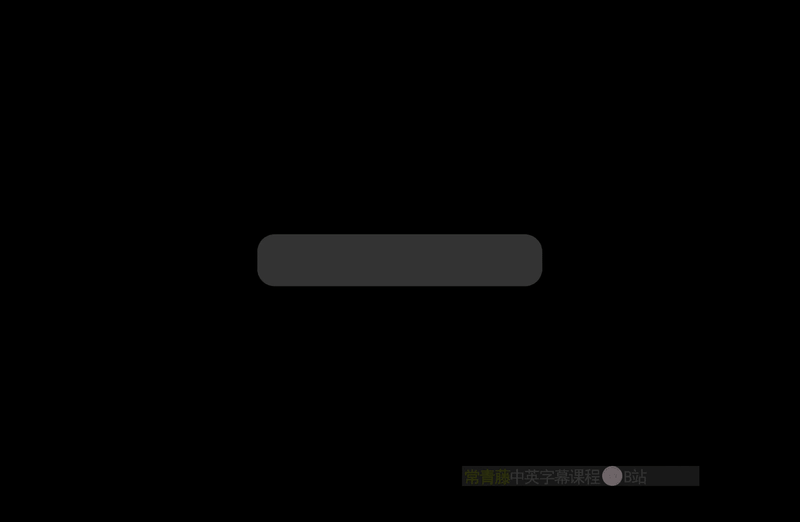

Just a couple of administrative things。U。People have still been trying to get into the class。嗯。

If you are still trying to get into the class and you haven't been able to register yet。

Please come talk to me after classes that I know who you are。I'm happy to。

Send an email to the academic office。Supporting a petition to add even though the a deadline was yesterday to add late。

Provided you turned in homework zero。So at this point， homework zero， the grade scope closes down。

Submissions for homework zero tonight at nine a week after the original deadline。

 if you've done homework zero， I'm happy to advocate for you being able to add the class late。Um。

But we should take care of that this week because as the semester gets going。

 this gets more and more uncomfortable for everybody。嗯。呃。I will。Post solutions。

Two homework zero tomorrow。So you can actually see what I was looking for。

 but I'm actually going to describe some results related to the。Rotation and swapping question。

Because over the weekend， I discovered a paper that implies an answer to the question that several people have asked me。

 is N logN the best you can do？And the answer is yes。And log n is the best you can do。

And the proof of that。Is by a happy coincidence， actually somewhat related to the topic of the lecture today。

 So I'm going to spend a little bit of time talking about it。

 I'm not going to go into complete detail， partly because。

There are some details of the proof that I don't completely understand myself yet， because this is。

I got really lucky finding the paper。And I haven't had a chance to completely internalize it yet。嗯。

So what I wanted to start with。

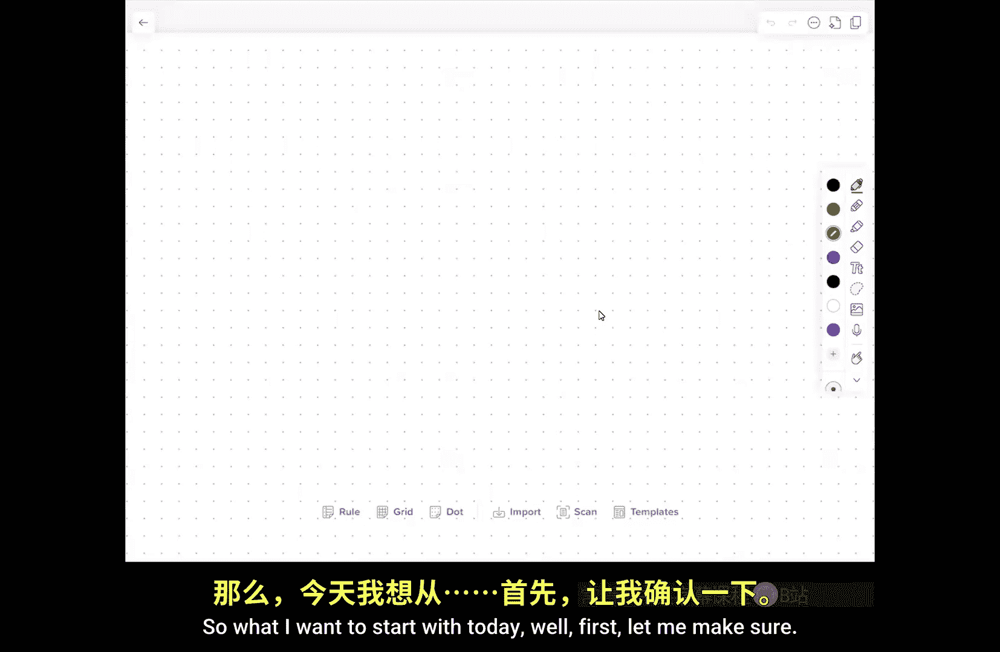

Today， well first， let me make sure people have any questions。

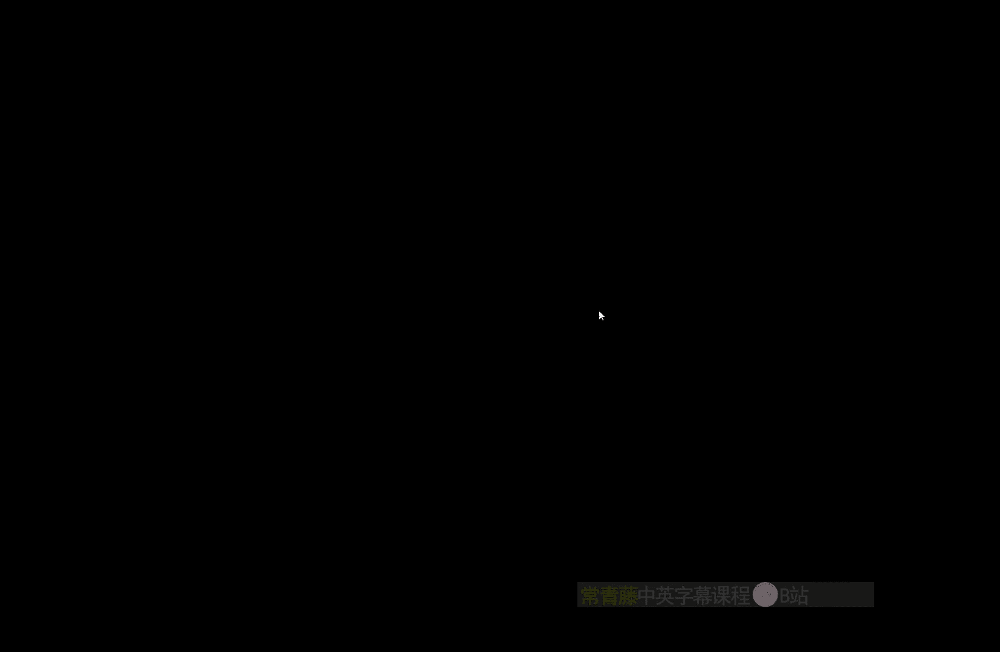

Okay。So what I want to start with is。Sort of the details that I didn't get to talk about。

Last time of the pe memory array problem。Okay， so。The idea is that I want to store。Sequ of n items。

In a contiguous block。Of size order N。So just。An arrayray。

And I want to be able to support the following operations I want。You know， insert after。

So insert after X Y puts。Y immediately after X。U。Delete X removes x from the sequence。嗯。

Let's say scan x K will scan the next k items following x if k is positive and the previous minus k items if k is negative and。

呃。I'll add one。To sort of remove one of the question to take care of one of the questions that someone asked me after class yesterday。

 So the idea is I want to be able to do these as as quickly as possible。 This one in particular。

 I want to be able to handle。In basically constant time per element reported， and in all of these。

 when I'm given an item in that's already in the sequence。

 I'm assuming I'm actually given a pointer directly to the record of that item in the sequence。

If you're uncomfortable with that assumption， you can imagine there's a hash table off to the side that remembers the address of every element in the array。

系。So somebody asked a quite reasonable question， why can't I do insert after and delete and scan all in constant time or constant time per output。

 just using a AA linked list， why do I need to use an array？

And my somewhat unsatisfactory answer was， well， this is done in the service of some other algorithm。

 some larger data structure， in particular it involves external memory。

 disc swapping and dynamic memory management in that context is really nasty and every time you follow a pointer you have to get a new page。

 but I think a cleaner answer is I want to be able to support this is before query。

And the way that I'm going to do that。Is。That you know every element in the data structure without loss of generality can record its own address in the array。

 and then when I want to know whether x is before y or not，I just say， well。

 is x's address in the array earlier than y is address in the array？

And that's not something I can do with a doubly linked list。

Because when I dynamically allocate memory， it comes from the sky。

 and I have no control over what sort of addresses I get。And in particular。

 when I start moving things around。Keeping track of everything just is just a nightmare。

I want to support these ordering queries quickly。And in particular， I'm just as a design decision。

 I'm going to implement those order in queries by comparing the addresses in my array of the two things that I'm comparing。

嗯。嗯。So。The basic idea is。That I want to keep。嗯。Constant sized。Gaps。Between。Elements。

And I want these gaps to both be not too large。Because the larger those gaps are the longer it's going to take me to scan through the array to actually pick up the data。

But also not too small because if things are small。

 then I'm going to have a hard time if I need to squeeze something into a small gap。

 it creates even smaller gaps。So very， very roughly things are going to be spread out。

Not necessarily， you know。Exactly evenly because of the various updates， but more or less evenly。

So think in your head， the distance between any two items in the array is， I don't know。

 somewhere in general， somewhere between 4 and 20。Right。

And so this means this literally is just a for loop。To do the scan。

 I just jump in and I scan for it until I've seen K things。系。Now。When I insert。I can get sort of。

Things that are locally too dense。And when I delete。I can get things that are。Lally to sparse。

So in each of these cases。I'm going to do a local rebuild。And rebuild in this sense。

Is quite a bit simpler than rebuild for a scapegoat tree。

 where I need to build a perfectly balanced tree。 What a rebuild means。

Is that I take some chunk of the array， and I just evenly spread out。The elements of that array。

So I just either。Close up very large gaps or ease up on very crowded hotspots。

 so this is the overall strategy。Getting this to work。Quickly is。

Is the challenge whether this is where the details come in？

So it's very clear about what the problem is and with the high level strategy。Ok。

So I'm going to define。Some。S called density thresholds。Okay， so。Um at。Sort of the top level。

I'm going to define。Let's call it low sub zero。Which is going to be positive。But less than high zero。

 which is less than or equal to one。This is the fraction of the entire array that is allowed to be occupied。

If the array ever has fewer than low zero times the size of the array elements in it。😡。

Then I'm going to rebuild a brand new data structure half as big。

If the data structure actually ever actually becomes。Has。

High zero times the size of the array things in it。Then， I'm going to double。

The size of the array and spread everything out。And and I'm kind of making an assumption here。

 it may be that I should really put a half here in between if I'm literally going to be having and doubling。

m just to make sure that when I take a full array and I double its size。

 now it's density is a half and that doesn't trigger another rebuild in the opposite direction。系嗯。

This is not really a critical that one half is it really critical。

 you can just use a different strategy for maintaining the array。

 don't grow by a factor  two grow by a factor of 1。1 instead。So these are things that you can tune。

I'm also going to。呃。Imagine。A recursive decomposition of the array。

Into what you might think of as a balanced binary tree。But this is。Not really the data structure。

 the data structure is just the array， I don't have explicit pointers with left the nodes with left children and right children。

 Everything can be done implicitly using index arithmetic。But so the idea is I will have， you know。

 here's a block of size n， which it's easiest for purposes of analysis just to assume that the array has a length that's a power of two。

This is going to be you know， level zero， but in at least for purposes of analysis， you can imagine。

The level zero block， which is the whole array is divided into two equal size level one blocks。

 and those are divided into level。Level  two blocks。And so on， so at level log n。You have individual。

Elements。对。Actually， though。To make the。It actually simplifies the analysis and it simplifies the data structure a bit if I don't recurse all the way down to blocks of size1。

Instead， I'm going to use a version of the indirect trick that you saw when we did range minimum queries。

 which is I'm going to divide space into blocks of size log n。

And I'm going to treat those as the leaves of my tree。So， instead of。Log in depth。

I'm going to have log of and over log n depth。It's a minus a log log doesn't really make that much difference。

U。But。At the bottom level。I'm going to stop when I have。Blocks of length login。

And this is going to happen at level， I'll just call this capital L log of n over log n。咁。

I'm being very fast and loose here， you should imagine putting floors and ceilings in there as necessary。

To make this all work out as integers。Okay。Now。The basic idea of how I want to schedule rebuilds is similar in spirit to what I wanted to do with scapegoat trees。

 small pieces of the data structure are cheaper to rebuild and so I want to trigger rebuilds more often。

 larger pieces of the data structure are more expensive to rebalance。

 and so I want to make sure that I rebalance those less often。

So what I'm actually going to do is I'm going to define even smaller。嗯。Narrower。Density thresholds。

Okay， so move zero。High，0。This is one， this is just about it away from zero。ok。So， there is a。

Narrower set of densities that I'm going to allow for the lowest level blocks。

 the smallest blocks of size and log n。Then I allow a wider range of densities that I allow at the root and more generally I'm going to define for every level k。

I'm going define this as let's see， low zero plus。K over L times。L L， I think this is right。

Minus live zero。This is a complicated way of saying that the lower density thresholds define an arithmetic sequence so the lower thresholds are evenly distributed between low zero。

 which is has the most freedom and low L， which the least freedom。

 and similarly high of k is high of0 minus。K over L。Times。High 0 minus。IL did to get this right？Well。

 I changed that plus into a minus and I reversed the sense of the minus。

 so I didn't need to do either of those things， but I did both so they cancel out。But again。

 the idea is。That the high density thresholds are also going to be evenly distributed across the levels。

系。All right， so what is the the， for example， the insertion algorithm？All， so I insert after。X Y。

 okay。I find。The leaf block。That。Contains。The new element Y。Meaning it's in the right range， yeah。

 me say x here we mean like a literal pointer to that yeah。

 x means there's a literal pointer to an item named x in the array。Yeah， finding X constant， right？

So it could be that。For example， x is in the middle of a leaf block。

 and then y is just going to go right there。 It could be that x is at the right end of the leaf block。

 and so y needs to go into the next leaf block。Okay， either of those circumstances is fine。

 So I'm finding the leaf block that contains why and then。There will be room to add why。

 because the the。As long as the density isn't isn't exactly one。 So maybe I should。

 I should insist that this is strictly less than one。 So I'm going to go ahead and insert why。Into。

That。Block。And I'll call this block V sub L。Okay。啊。Now at this point。

 it's possible that Beabbel is overcrowded。So Im I， I might need to retrigger or rebuild。

 but I want to make sure that I did that I。Do as much as I can while I'm rebuilding without violating my constraints。

 So I'll say here is。For K equals L。Down to。0。If。The density。Of block K is。Greater than I sub K。啊。

Well， actually。I think the right way to do it is like this。If this is small。Rebuild。

Beace sub K and return。Okay， so。In particular， if I insert into a leaf block and the leaf block is already reasonably sparse。

Fine， I spend log n time rebuilding this rebalancing this small block of size log n。Then I'm done。

Otherwise is this leaf block is over overcrowded， go up to the parent if that leaf block if that next block is overcrowded。

 go up to its parent， if that block is overcrowded。

 go up to its parent and so on eventually I find a block that is not overcrowded。And then， I rebuild。

Everything and if I get all the way to the top。Of course， I rebuild the entire data structure。

if every ancestor of that leaf block is overcrowded， then in particular。

 the whole data structure must be overcrowded， so I just rebuilt it。对。So。Cost to。Rebuild。And。

 in fact。This probably means。Double it in size。The cost to rebalance any block is proportional to the length of the block and because these density thresholds are fixed constant。

 that's also proportional to the number of items in the block。OkaySo the actual cost here。Is。诶。

N over two to the K。Okay， so the case level block。So I've numbered it from bottom up。

This is some power of two。Why did I say end there？嗯。The size of this block is some power of two。

 which is for the moment， lets call it two the R。So u。At the bottom。

 because I started to lose a power of two， and I recursively divided by， by half going down。Okay。

So then the question is， you know。I， I'd like to charge that time。2。Previous insertions。

Into that block， wherever that block level R is。Maybe I insert why here and the block that I decide that I need to rebuild is this one。

Then I need to。Pay a little bit extra whenever I insert into that red block to pay for the next rebuild of that red block。

Just like in scapegoat trees， every time I insert into a subtree below a node。

 I give that node a little bit of money to pay for eventually in the future rebuilding the subte hanging under that node。

You have a question。S this。So the idea is。If it's overcrowded， look at the parent。

 If that's overcrowded， look at the grandparent。I go up until I find something that's not overcrowded。

 And that's the thing I rebuildilt。Yes， every time you insert something。

 you are going to rebuild something most of the time we hope that's going to be one leaf node and that's only going to take log end time。

Okay， so I going to sort of set that log in aside， that's not the interesting part。

Heres play the storm summer。あいますそだま。Yes， so the easy way to do this is every block stores。

 how many things are in that block。The more interesting way to do this is I know I'm going to rebuild something。

 So I literally just scan to the left and right。Figuring out on the fly how big these parent blocks are。

And so the time that I need to count how many things are in the block is dominated by the time that I need to rebuild that block。

 so I don't actually need to store anything， but if you want to imagine that I'm storing things to keep things simple。

 that's great。It's exactly the same as escapecap。Yeah。Do you have a question？

When I'm rebuilding the entire data structure， I'm taking this array of size power of two and turning it into an array of size the next power of two。

And then evenly distributing all the data。When I'm rebuilding locally， I'm not changing any size。

 It's only the global rebuild that changes the size of theor。

So the interesting part of the analysis is what happens when I do local stuff。

 The global rebuilds are just like an analysis of dynamic array。Right。

 I need to insert end things into data structure before it gets。Once if it has size N。

 I need to insert in more things into it before it needs to double and that。

That's the complete analysis。It's the local stuff that's more interesting。Right。嗯。Okay， so if I have。

A block。Now。That I want to rebuild。Because it got too full or because the reason that I need to rebuild it is one of its children got too big Okay。

 so here is you know this is a block of size2 to the R one of its。Kids。Is too dense。Okay。

 so the child has size2 to the R minus1。That means that the number of items。In this block。

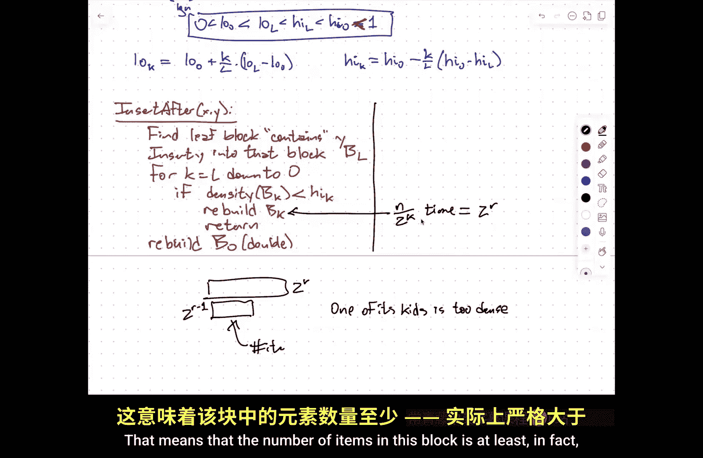

嗯。Is at least。

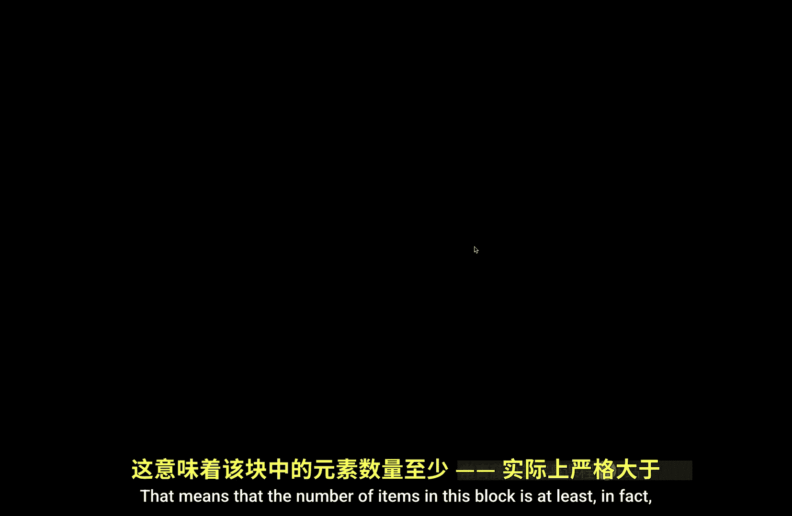

In fact， it's strictly greater。Then。Hi， sub。K plus1 times2 to the r minus1。Right， because this is。

Level K。This is。Level a plus one。嗯。But。Last time it was rebuilt。The last time it was rebuilt。

The number of items。Was。Less than。Hi times j times2 to the r minus1 for some。

J less than or equal to k。Now， the last time it was rebuilt， it could have either been。

 it was rebuilt directly。Or its parent was rebuilt or its grandparent was rebuilt。

 or its great grandparent was rebuilt all the way up， but maybe the whole structure was rebuilt。

Although actually， I think。I should say this， maybe that was actually the thing that was rebuilt。嗯。

So when I rebuild a block， it's because ignoring the global rebuild， when I rebuild a block。

 it's because at that point， I know that that block I rebuilding is not overcrowded。

 I just know one of its children is overcrowd。So when I spread everything out。Evenly。

That ensures that my that the children， grandchildren， great grandchildren all have the same density。

Which is less than this high threshold for the block that I'm rebuilding。嗯。嗯。And no， I think。Yeah。

 no that needs to be。Less than or equal to k， okay？嗯。So this is at most。Hi of k times2 to the R 1 so。

The number of insertions。Since the last rebuild。The number of insertions into this crowded block。

Is at least。Hi k plus1 minus high k times the size the bo。加油。But。So that means that。啊。

The amortized cost。The amortized cost。Of each insertion。Um is。Hi of k plus 1 minus high of k。All。

 because。Sorry， one over that。So if every insertion pays this reciprocal of the difference in the two adjacent densities。

Into a bank account for that block。Then after this many insertions。

There's enough money in the B's bank account to pay to rebalance the block。Yeah。百子。Yes。

 you're right there's some constant factors in here that I'm being a little careless with。Okay。嗯。

But now let's think about what that。That that that difference is。 So this is。

Hi of L minus high of0 divided by L。Because the difference between two adjacent density thresholds is always the same。

 I set up the density thresholds to be this nice arimetic sequence。

 so it's one elf of the difference between the top level density threshold and the bottom level density threshold。

嗯。It occurs to me that I probably got my indices a bit messed up。

I may need to say high of k minus high of k plus one。Um，Yes。Sorry。I need to do a little bit of。

Fixing off by one errors here。Because the density thresholds。Get。啊。

The trigger for rebuilding a small block。Is smaller than the trigger for rebuilding a large block。

But high zero and high L are constants。So this is。Order L。Which is。Order。login。

So every time I insert a new item。I have to pay an amortized cost of login to every block at every level that contains that new item。

Okay， so the。诶。Total。Amortized。Time。To insert。Is big O of log squared n。Right so this log n is just。

 I pick one block at some level in the hierarchy and I say every time I insert into this block anywhere below。

Anywhere inside。I need to spend login to pay for the eventual rebuild of this block。

But every time I insert， I'm inserting into a hierarchical path of log n different blocks。

And so the overall amortized time to do that insertion is log squared n。

 and there's a symmetric analysis。For deletion。so this is different than what we got with scapegoat trees with scapegoat trees。

 somehow we got away with saying， oh， here's this tree of size K。

 I need to do omega of K insertions before I rebuilt。Now it's， well。

 here's this block of size 2 to the R， I need to do at least2 to the R over log n insertions。

Before I rebuilt。And so we get this extra log factor in the amortized cost。

This is actually the best that one can hope for。嗯。Even if。

You don't have to do the scans if you only need to answer the before。

 if you only need to keep addresses and be able to compare the addresses to decide before after using。

 you know if you want to use a linear amount of space and you want to do insertions and deletions in constant time。

 provably you cannot beat log squaredd。So this relatively simple data structure is actually optimal。

Thanks。O。Often。Let me see if I can spell optimum a little bit more readably。All right。

So this is just， you know another another example， the sort of local global rebuild local rebalance idea there are other variants of this where maybe I'm allowed to have slightly more than linear space and so you're willing to trade off。

Do a little bit of trading off between the insertion and deletion time and the scanning time。

So if you give yourself a little bit more space， insertions and diletions get cheaper。

 but scanning gets more expensive。If all you care about is doing。Labeling， so I want to insert。

 delete and and is before， I can give myself something like end of the fifth space。

And then now I'm back basically to doing scapegoat trees exactly， and the analysis。

 the whole analysis completely mirrors the scapegoat tree analysis exactly。

But in order to do that with space， I really have to give myself。

A fairly significant polynomial overhead in space。And the scanning time goes up by。

One less factor of N than that that overhead。 So if I give myself end to the fifth space。

 then I'm going to need about end of the fourth time per item to scan。Just not great。

So I really don't want to do this if I'm scanning， but if I just care about labeling。

 this is reasonably efficient and in fact， arguably the right thing to do for labeling is not to build this data structure at all。

 but literally to build the scapegoat tree and just use the search path a bit of one for the left bit of zero for the right and let that path determine the label as a string of bits。

Or build some other binary research tree。Okay， so any questions about。Pact memory array。All right。So。

The next data structure I want to talk about。Is another balanced binary tree data structure that doesn't have any good guarantees on worst case time？

But has。Somewhat magically good。Guarantees in terms of amortize time。

 and that's the so called display tree。 So this was。嗯。I think sometime around 83。

This is Danny Slater's work as a PhD student， as when he's a student of Bob Tarjn。Um。

You might notice some of the same names coming up over and over again， in particular。

 you'll see chargeant's name a lot。嗯。呃。So。Almost all data structure work before Charjan was about binary search trees。

Tarent did everything else。it's fair to say Bob Tarrgn invented the late 20th centuryy data structure。

And he won a Tring award for it， so you'll see his name a lot。

 I hear another name tossed around more recently。Maybe a bit of an exaggeration still but。

We'll see some of his stuff when we start talking about hashing。

I guess I should say Bob Tarjn invented the late 20th century pointer based to data structure。嗯。Okay。

 so what's a s tree。 Well， the the the the idea that Slater and Taent had was。What's。

Imagine a binary tree that can fix itself whenever it discovers that something is too deep。

 it does some rotations in the tree to make it shallower。

 and they actually started by doing an analysis of something called the move to front heuristic。嗯。

For linked lists。So the idea here is whenever I search for something in the linked list。

I'm going to optimistically conjecture that things that I look for now。

 I'm more likely to be looking for in the future， and so what I'll do when I find something in the linked list is I'll bubble it up to the top of the linked list and put it there。

And this move to front heuristic actually works。Pretty well。It doesn't necessarily give you faster。

 amortized or worse case bound， but what it does do is it gets within a constant factor of the best you could hope for。

 even if you knew in advance all the things you were going to search for。

And you just had a model that says， the only thing you're allowed to do is move things around in the linked list。

so a self- adjustjusting linked list structure it says， oh， I'm going to look for three。

 then I'm going to look for one， then I'm going to look for three， four。

 and then I'm going to look for one， then I'm going to look for five then nine okay。

 so in advance when I look for three， I'm going to make sure that I put one at the top and then I look for one I make sure I put four at the top。

So move to front gets within a factor of two。Of the best clairvoyant。Self adjusting linkedlist。

So this is something called competitive analysis。Of。Analysis， you compare。The time。

For the online maintenance of the data structure。To the best。Offline。Algorithm。嗯。

So because data structures can't predict the future。

 I would never expect these two times to be the same。But the idea here is it's like， well。

 if I use move to front， I'm within a factor of two， the best I could hope。

 or even if I could see it in the future。so this was。

 you know a nice idea that they developed and so they tried to do the same thing with binary search trees。

 they said okay， great， let's look at a binary search tree and every time we find an item in the tree。

See here。I'm going to do rotations。To bring that。Item back up to the root。

That was the first thing they tried。 Unfortunately， this doesn't work。

Is actually turns out to be quite bad。 And the reason that it's bad is if you just look at an example。

Where the tree starts out as just。A linked list。And I always search。For this node on the far left。

So what happens after one？Move to front。Is I get a tree that looks like this。

And then after two moved to fronts。It look like this。And then after three moved to fronts。

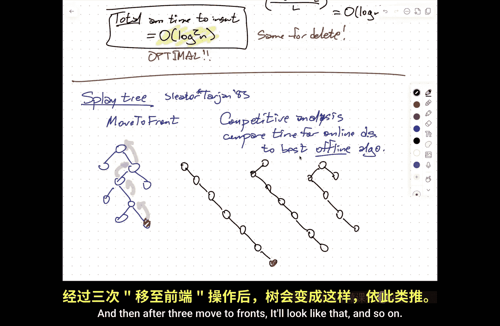

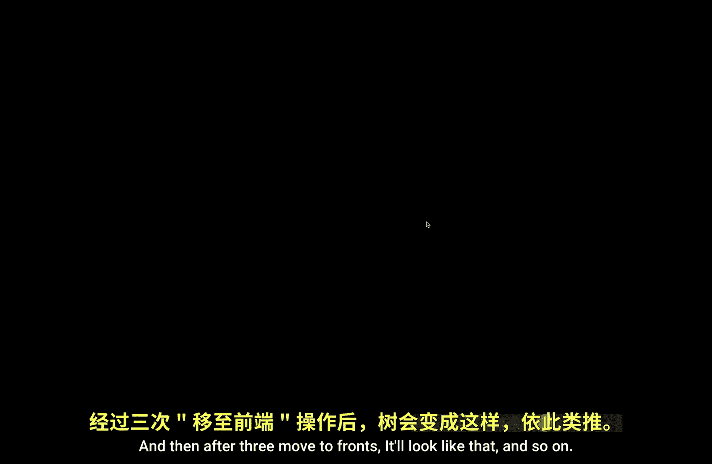

It'll look like that and so on。 So what what the。From a distance。

 what it looks like is happening is just the list is kind of rolling over。

So the tree is always a linked list。The route starts at position one。

 and then it kind of goes to one end of the list and it goes to the second thing。

 the right most thing in the list and the third right most thing in the list and the fourth right most thing in the list and so on。

So after I've looked， I've done N searches。The tree is back in exactly the form。

That it was at the beginning。And most of those searches， I need to scan most of the， the， the data。

Okay， so。Move to front。In a binary tree。You get a theta of n even amortized search time。

In the worst case。So this initial attempt。Like， okay， that didn't work。Can we do something else？

And the idea that they eventually hit on。WasI'm going to do two rotations at a time。Okay， so。

I'm gonna to。To。Break things down into two cases。Okay。

 so here's the node that I'm actually searching for。Again。

 I'm going to do local rearrangement of that node， its parent and now it's grandparent remember。

 a rotation just changes the local neighborhood of a node in its parent。UAnd。

It turns out that the right way to do this。Do this with two rotations。 First。

 I'll rotate that node up。And sees this right？No， that's not what I wanted。First。

 I'll rotate the node up， and then I'll rotate the same node up again。

Which seems like I'm arguing against what I just said， but hang on for the other case。Okay。

 then here's now the node that I just rotated up， I rotate it up again。OkayAnd after two rotations。

 I've kind of。Very， very locally rebalanced as part of the tree。So this is fine， this is okay。系。

The place where we get into trouble。Is when a node is kind of on the same side。Of its parent and。

It's grandparent。So in this case， I'm first going to rotate at the parent。

And that's going to reshape the tree like this。And then I will do a rotation at the node itself。Okay。

So this first case is called a。Zigzag。The slater intent called the second case is zig zig。

I prefer to call the roller coaster。Okay。So the idea then is instead of doing one rotation at a time to move a node up to the root。

I'll do a double rotations。Falling into one of these two cases。Until the node hits the root。 Now。

 if the node is one step away from the root， then I'll do a single rotation。嗯m。Now。

 why should I believe that this is going to be better？嗯。So it turns out。That at a very high level。

 what's going on is if I look at the search path。So display。Is。啊。Double rotations。Plus。

 at most one single rotation。To move。A node。To the root。If I have a。

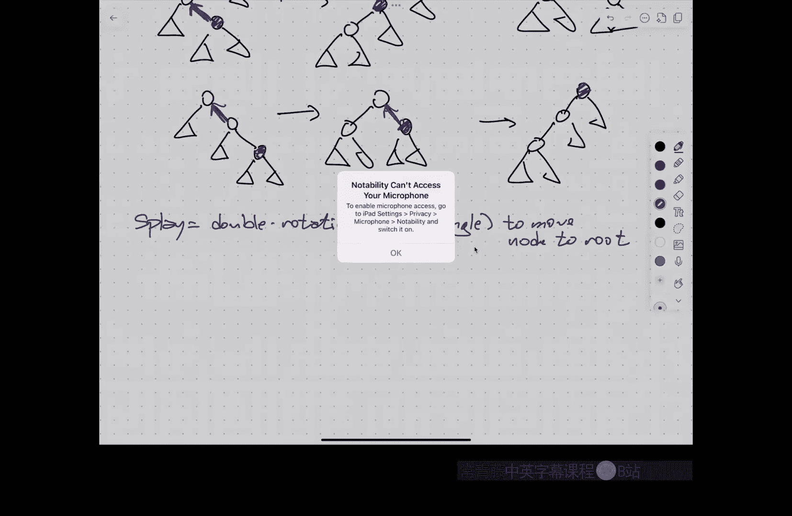

Sorry。Notability can't access my microphone。

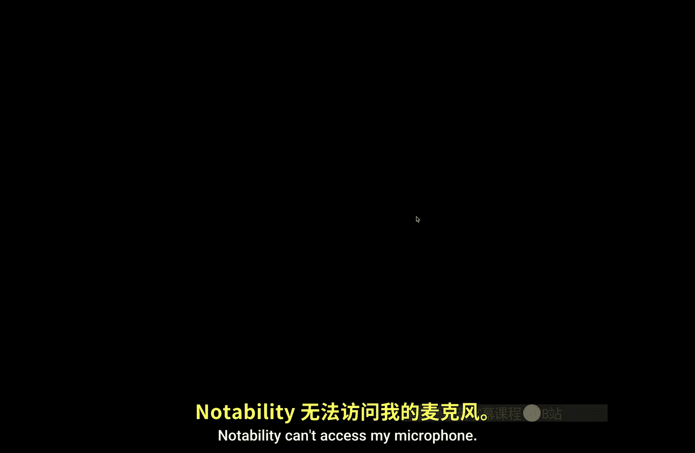

All right， sounds going to be a bit weird。So I'm going to unplug， I think this microphone is。嗯。

And hope that my laptop microphone picks up my voice so I think this is run out of charge。嗯。Okay。

So if I look at what happens when I rotate。A long list like this。

What the end result of slaying the bottom note of this list looks like。Is this。Okay， so。

The nodes on that list morally speaking， got compressed by factor of two。

Everything on the search path got half as far away is now half as farther away from the root as used to be maybe plus one or two。

Okay similarly， if I look at the other extreme case where I just have a zigzag back and forth。

Then after I display that to the root。I'm going to get。

The just the search path is going to be reconfigured like this， but again。

 this path of whatever length it is gets changed into two paths of half。So again。

 everything on the search path gets roughly its depth divided by two。Maybe plus one。

So there's this compression of the search path， so even if you start with something really unbalanced。

 searching for the deepest thing makes a lot of progress towards making nutrient shallow again。

All right， so。Nodes。On the search path。Have。There。对。And maybe plus plus or minus a small constant。

And moreover， all of the descendants of nodes on that search path also have theirducts go down。

Except for the few nodes that got slightly bigger， so some nodes will get deeper by one or two。

 but never more than that。😡，So if I start with something really deep， in fact。

 the entire tree in some sense is kind of being squashed and it grows a little。

Which is kind of the effect that you want in and then the amort size called data structure。

 you want really expensive operations to be cheap。But common data structures can make do a little bit of damage as long as I go do a lot of damage。

嗯。So the。嗯。Once I've got this intuitive idea， now implementing standard standard operations whenever I search。

Right whenever I search for X， I immediately， you know as soon as I find it。

 I display X if I didn't find X if it's an unsuccessful search。

Then I'll display whatever the last note I found was。

 which is either going to be the predecesor successor of that。

So I'm readjusting the data structure every single time I search。When I insert X， then again。

 I'm going to display it。When I want to a delete。Now things are more interesting because deletion is always harder than insertion。

 or at least usually， so I'm going to do deletion using two ss。Okay so the idea is。

Here's my tree and here's the item that I want to delete。

The first thing I'm going to do is split it up to the root。This is going to create。

It's going to put x at the root and then there'll be a subte on the left and a subree on the right at this point I can throw this note away。

Now I need to reconnect those two trees， and so what I'm going to do is find the predecessor of X。

 which is the rightmost node in the left subte。Before I deleted X。

 and then I'm going to display that node up to the root of the left subt。And when I've done that。

The left subt is now going to look like this。The I mean。

 W is the node with the largest key in that tree， but it's also the root。

So it doesn't have anything hanging off to the right。And meanwhile。

 this right subre is just sort of hanging there。And so the last step is to reconnect。系。😊，So。Um。

Spplay X。De we X。Splay。Prodecessor of X。Reconnect。And so the cost of doing any of these operations。

 any standard。Fary search operation is。Within a constant factor。

 the cost of walking down to some node and then slaying it back up to the root。

And the part where I'm walking down to the node， well that's the cost is proportional to the length of that path。

 the cost explaining the node is also proportional to the length of that path。

 so for purposes of analysis it suffices to just pay attention to displays。Okay。

 I just need to figure out what is the amortized cost to doing the single split。

And that will tell me they amortize the time to do search insertions and deletions。Okay。

 so the question is。What？Is the。Amortized。Number of rotations。For each。Splight it。

Now I'm deliberately defining time to be number of rotations。

Everything else is going to be within a constant factor of that。

So I'm just going to define rotation to take time one and other point of manipulations I need to't imagine a。

Um。So I mean， the worst case number of rotations is exactly the depth of node that I'm explaining。

But when I say amortized， I mean over a whole long sequence of slays。

Average the total number of rotations over the numbers of place。嗯。So。I hear rumors。

That there might be a kind of。Charging argument way to do this where I say oh yeah every time I do a rotation I need to charge to something else I've never been able to make the charging stuff work out so instead i'm going to sort of use the。

嗯。The atomic bomb of amortized analysis is something called the potential。So I want you to imagine。

 put yourself imagine for the moment I realize this is going to be uncomfortable。

 but imagine for the moment that you're a physicist。😔，Now。

There's this notion of conservation of energy， but if I put work into the lifting this chair。

 this chair is now here， I've done work to lift this chair， this chair is storing potential energy。

And it took work to lift it six feet off the ground， it takes no work at all。😡。

To make it go 60 towards script because I'm spending the potential energy that I built up in the chair when I lifted it up。

Okay， so the idea is the data structure。Deines。A potential。Gd， in you know。

 borrowing again from physics， I'll use this capital letter fee to represent the potential。

And then the amortized cost。The amortized。Time for an operation is the actual time。

But if the potential went down。That means I've spent kinetic energy that I saved up earlier。

 so it's minus。The decrease in the potential。Or said differently， plus the increase in the potential。

So this is plus。The potential after the operation minus the potential before the operation。Now。

 in order for this to work out， I need the potential to always be non negative。

 and ideally I would start with an empty data structure that has potential zero。

And then if I do a summation of all the amortized timess。Those differences would cancel out。

So the total amortized time。Ends up being the total。Actual time。Plus。The final potential。Minus。

The initial potential。嗯。And hopefully the final potential is actually。Positive。

 let's see how let me make sure that I've got this right。嗯。Because it's easy for me to get confused。

Yeah's。Plus after minus before。So。Total actual。equals。Total amortized minus。Final。Plus。In it。

If I've got the u。If I've got my inequalities correct。

 that should be less than so sum of all the advertise time balance。

Is going to be an upper bound on the total actual time。Yeah， good。

Final in general is going be large and it is generally going is usually going to be small。

 so I'm subtracting something off there so really all piece of the correct collection。O。

So I needed to define this this potential function。

 and so I'm going to do this in a couple of stages， so I'm going to first。

Define the size of a node to be the number of nodes in the subte。roototed at V。

 and I'm going to define the rank of a node to be log based two of the size。

An intuitive way of thinking about the ramp is if this node could make a wish about the shape of its subt。

 it would wish for the subt to be perfectly balanced and that would means death。嗯。And then finally。

 the potential for the tree is the sum over all nodes v of the rank of that node V。Now。

 a couple of things to check。If it's perfectly balanced。Then the potential is theta of n。And。

If it's perfectly unbalanced。Should the pass。Then the potential is theta of n log n。Okay。

 so the ven is always somewhere between these two extremes。

I'll let you verify these two calculations yourself but it's not a particularly difficult calculation。

Okay。So why do I care about this？啊。So slater andts analysis boils down to something they call the excess。

我吗。Which says。嗯。Slays are made up of single rotations and double rotations， so I need to。嗯。

Figure out the amortized cost。Of a single rotation and I need at the root and I need to figure out the amplace costs of a double rotation。

Okay， so。嗯。The amortized cost。Of a double。Rotation。At X。Is at most。One plus three times。The new rank。

Of x minus3 times the old rank of x。Okay， so。Rrank， Cl， this is after。And rank。

That just means before。And similarly， the amortized cost。Of a single。Rotation。At X。Is at most？Well。

 the same thing， but without the plus one。Thank。你好。I will confess。对。

Despite knowing about this data structure for a couple of decades。

And despite reading the original papers and reading follow up papers and lecturing about this stuff multiple times。

 I still have no idea。Where this central function came from？I know that it works。

I just don't have any intuition about why would you try this so other than Bob Carrgn is smarter than me。

😡，Which is true。But that's not a particularly satisfying answer so if you're looking for intuition about what why。

Why I should believe that this particular potential function works， I actually can't help you。

 I don't know。But the actual proof of the access dilemma is really just algebra。

It's really algebra with some careful pace analysis。

I don't want to walk through it because watching other people do algebra is boring。😡。

But the details are in the notes。I'm holding up a piece of paper， this top two thirds of the paper。

 this is the case of a zigzag， this is the case of a roller coaster。😡，Down here。

 there's a few lines on the previous page for single R。

So it's all completely elementary in the sense that you understand the definitions and you remember that the difference of logs as the log of a ratio and you remember that logs。

 the log function is concave and a few things like that， it's really straightforward。

 but again I really don't have any intuition why it works。But it does。And so what this implies。

Is that the amortized cost。Of displaying acts。Is at most。嗯。Oh， sorry。

It's the single rotation that gets the plus one。So it's one plus。

The three times the new rank of x after display - three times the rank of x。Before the。

All the other differences three minus the new rank minus three minus the old rank。

 those all cancel out。So the new rank after the first double rotation the same as the old rank before the second double petition。

 so the plus three rank and minus three rank canceled even this nice very simple simple form on the other hand。

 after you slay X the new rank。Is log of the new size。

 but the new size is n because x is literally at the root。😡。

so this is at most one plus three log n and less than or equal to。

 I don't know what the rank was before， but it was positive。

So just dropping it gives me a another amount。Okay， and so here we are， this is log in。嗯。

So in an at sense。This self adjusting binary search tree。Autoomatically gives you。

Loarithmic amortize time to do insertions， deletions and queries。But at no time。

Are you guaranteed that the trees balanced？That's level one metric。

Now we're going to get to level two magic。Which is actually。Now what I'm going do。

I'm going to assign for purposes of analysis， not in the actual data structure。😡。

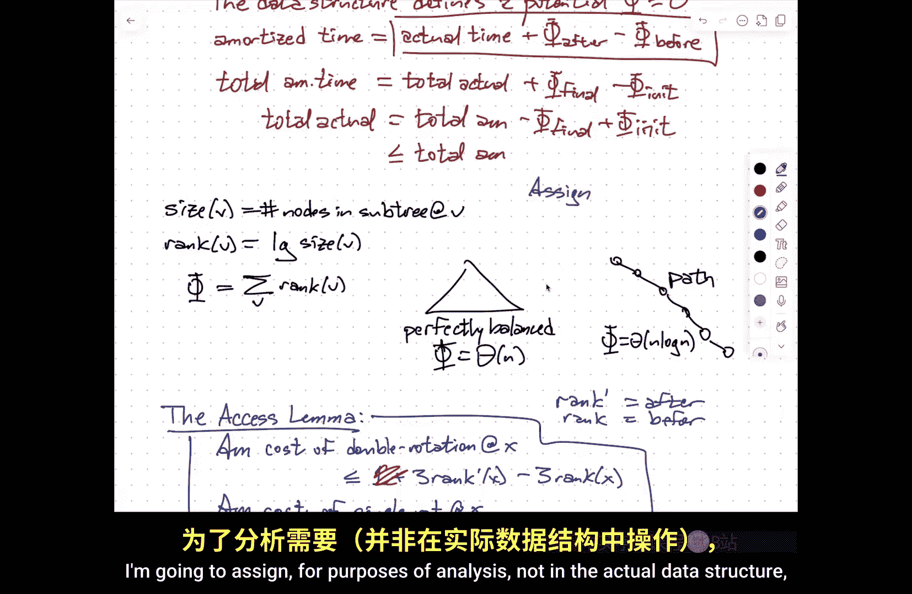

I'm going to assign a weight。2。Every node。

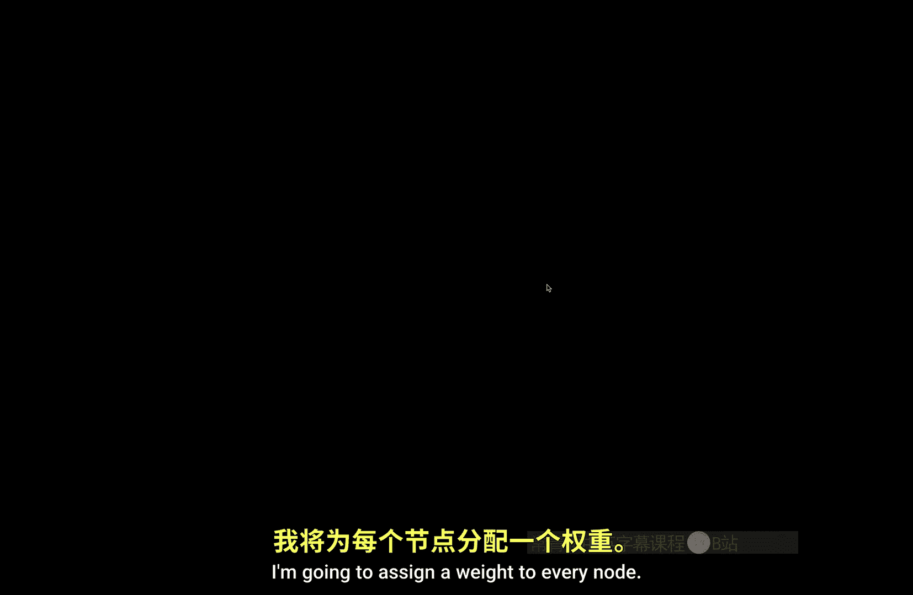

诶。And then I'm going to actually， you know， instead of the number of nodes。

I'm going to have the total weight。Of the sub rooted it be。Okay。

 so that note over there I really like for some reason so I'm just going to give it a weight of 100 these other nodes I don't really care the weight needs to be positive。

 but there's no other restrictions that I don't really like this note I'm going to give it a weight of one end。

This note， oh， I really like this， I'm going to get a weight of end。And every node gets a label。哎。

TheX slim吗。He's still true。The proof works with no modifications at all。

But now the conclusion is a bit different because now the conclusion is it's three times the sum of the weights of the vertices。

It's the total weight of everything in the tree and now。

I can start playing games with the weights to model different situations where I might want to use the tree in different ways if I want all if I set all the weights to be one。

 this is the setting where it's like ah。Every note's the same in my eyes。

I just want the worsting time to be as good as possible okay， amortize log。

But let me propose another scenario。Where。So this is called static Opity。Different nodes。

Have different frequencies that they're searched for。

So if I'm going to look for three much more often than I'm going to look for 89。

So intuitively in a static data structure， you want the node Storing three to be closer to the root。

And the other story in 89 to be further from the， you don't want the trait to be perfectly that。

You wanted the bias to put more common things near the root。Well。Under this。Circumstance。

What you can do is following so static optimality， the idea is suppose each。Noode。X is accessed。

Meaneting I do a search or an insertion or deletion on this with this note is the target T of x times。

Okay， so I'm going to set for purposes of analysis the weight of x to Vt of x。

And then what the accesslemma implies is that the amortized cost。Of accessing。

 which really means splaying X。Is big O of。Log of the sum of all is this the total number of accesses？

Minus the log of T of x。 And this is optimal。For any distribution of teas。😡。

So pick your favorite number of times you want to access this node and number of times you want to access that node and number of times you want to access that node。

 go back to 374 and do the dynamic programming algorithm that generates the best possible binary search tree for that set of frequencies of nodes。

😡，This will be the search time。It will be the difference。

 it would be basically log of the fraction of searches that go to that particular note。

So this is the best you can do information theoretically。

And this is what s trees give you now I want to emphasize here。

 I did not change the data structure at all。😡，This happened automatically。

So the search tree is automatically adjusting for different frequencies of searches while at the same time pretending to be perfectly balanced。

喂。There are a couple of others， for example， if I keep one finger on the data structure somewhere。

 it is static binaryary search tree， I could either search by walking down from the root or search by walking up and then down from my finger。

And if you do this correctly， the time for research。

Is proportional to the log of the distance from my finger to my target in rank space。

 so if I keep my finger on something that's close in rank。

To the target thing I'm looking for instead of paying log n。

 I'm only paying log with that small distanceta。Or do the trees organize correctly？

If I set the weight of a node to be one over the square of the distant difference in rank takes a little bit of magic here。

 you automatically get the right thing， you automatically get log of the distance to the finger。😡。

Again， I've not modified the data structure， I didn't need to specify the thing were in advance。

 I didn't in fact have to do the same analysis for different figures all at the same time。

 and it always worked。😡，So there are a bunch of theorems like this that basically say。Yeah。

 there are circumstances where you want to do something more interesting than just perfectly balanced to binary trade。

And most of those， we can prove that slave trees just do go automatically。

Now there is one thing that we can't do。It's still open and it goes back to the move to front tourististic。

The move to front Heuristic was in a factor of two of this is the best you could do。

 even if you could see in the future by rearranging the linked list。

So we'd love to be able to say display tree is within a constant factor， the total cost。

Of the best possible self adjusting by tree， even if it can seem in the future。

We don't know that that's called the dynamic optimality conjecture。

 it's probably the biggest open problem in data structures。

And what I want to talk about on Thursday is。What we know about this。So we do know some things。

There is a very real sense in which we are off by one and therefore know nothing。

But we're close in one sense and far away in another， subtle， it's much harder than it sounds。

But there's some really cool stuff here， so I'm going to talk about that on Thursday。

I'm happy to answer questions， but we are out of time， so thank you for your patience。

 I'll see you later。

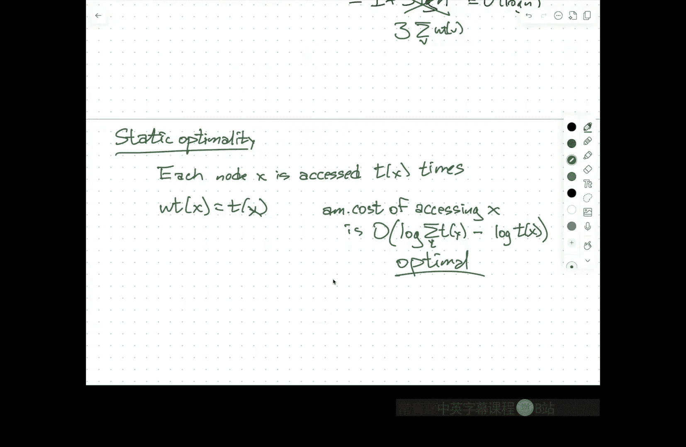