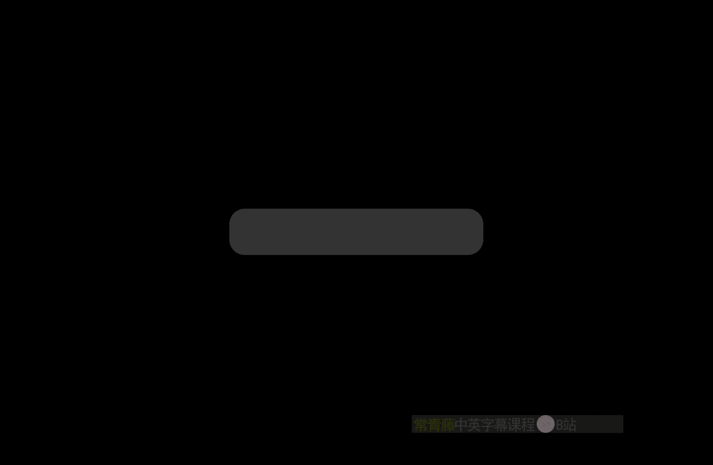
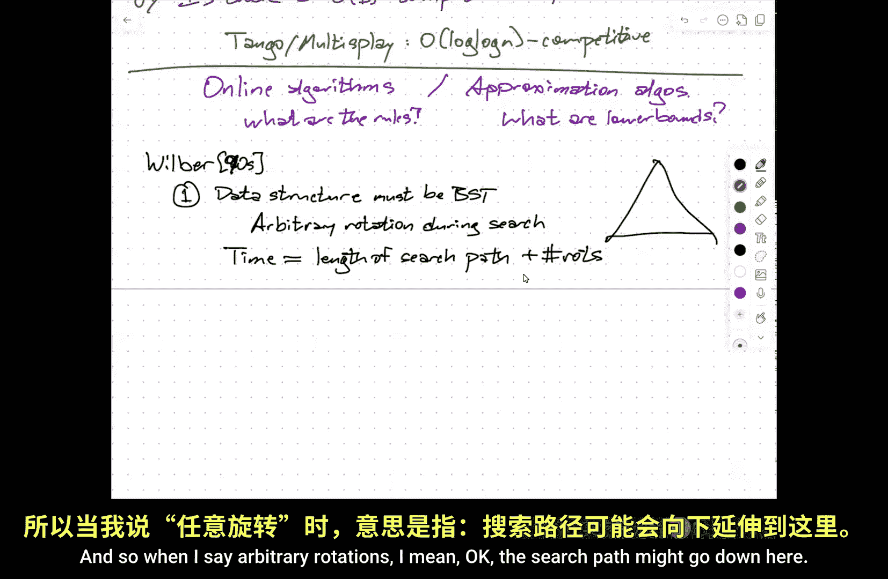
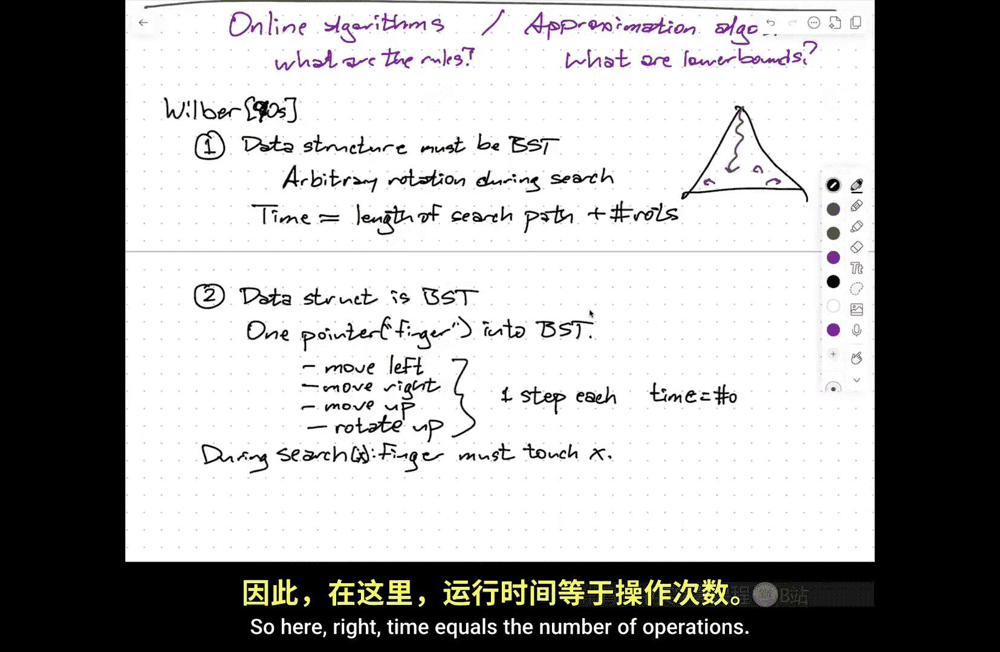
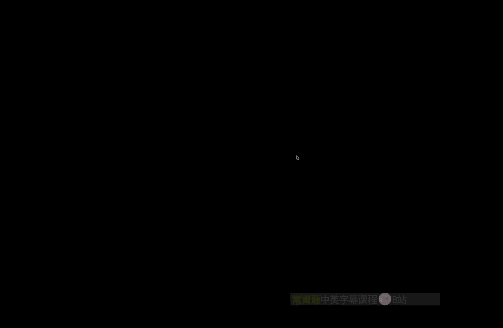
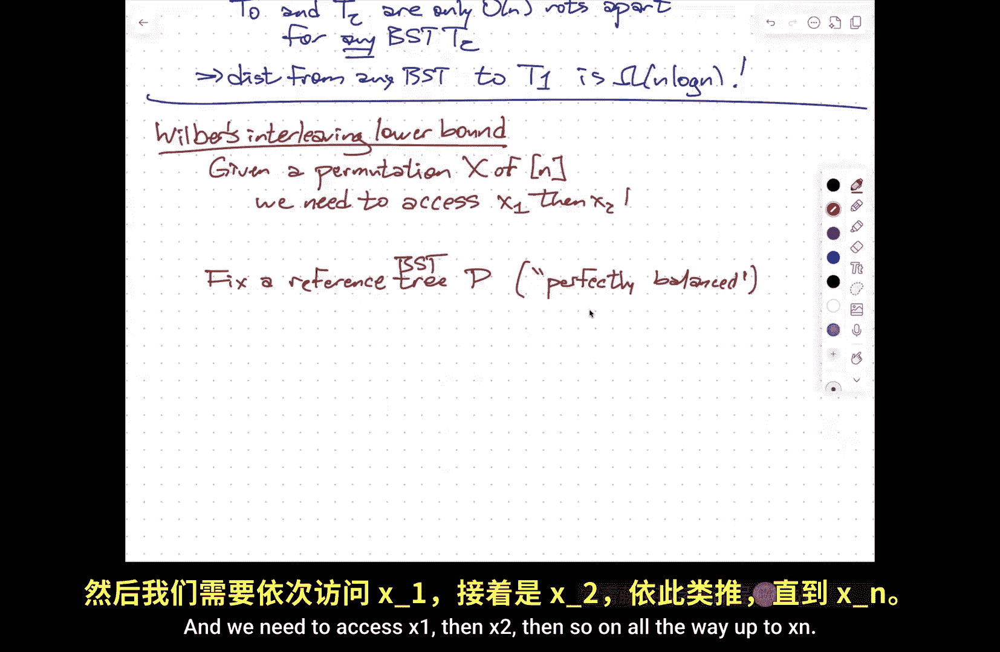
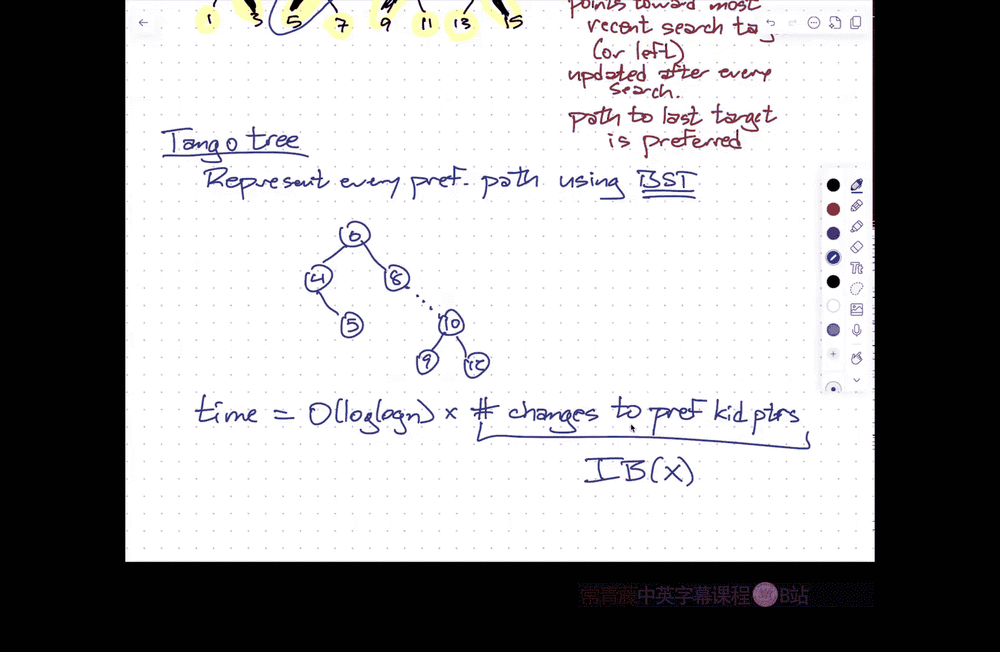

# 伊利诺伊大学【中英⚡高级数据结构｜CS598 Spring 2025, Advanced Data Structures】 p06 P6 动态最优性，探戈多重伸展树 -BV14qZYBJEZy_p6-

So first of all， thank you for your patience， sorry for making you wait。

Those extra minutes。To get started and thanks for coming despite the lovely weather outside。

Let's see， before we get started on the content， a couple of quick admin announcements。

 homework zero solutions are out。U。Whether or not there's ever going to be a homework one。

Depends a little bit on my ability to get homework zero graded quickly。I'd say there's probably if。

At best to 50， 50 chats if there being another homework。嗯。We'll see how it goes。

But one thing at the end of the semester。Previously during finals week。嗯。

That's when I had the project presentations scheduled。

 but it turns out that I am going to be out of the country for all of that week。And so right now。

 if you look at the schedule， it has the project presentations during the last three regular class meetings instead of afterwards。

嗯。That also means that I pushed back。The deadline for project proposals by a week。

So you still have the time that same amount of time roughly between proposal and presentations。

 I did not change the paper chase deadline。 and those you've been waiting。

 I' I'm expecting to put out the。The instructions and list of papers for the paper chase deadline over the weekend。

 so then you'll still have about three weeks before that will be due。Okay， so。Project presentations。

Those project talks。Our。A week earlier than。Originally planned the。

Project reports are formally due on the last day of instruction。

Now all of those things can be there's a little bit of flex in there。

 I'm not going to worry too much if the the。Project write up is a few days late。In principle。

 I don't even really care if the project。Proposal， the project write up is like three weeks late。

 but that will mean I'll have to give you an incomplete。And that only works if you're a grad student。

And change your grade later i'd prefer to do that as little as possible。

 you would also prefer that I do that as little as possible just to get the the。

Get things out of the way， but that deadline hasn't changed。

 it's just the presentations that have changed。Okay。Bm。Any he。Admin or logistical questions。Yeah。就是。

双方。Yes。So it used to be。Like in the first the。Project talks used to be like May 88 through 11。

Now they're in the preceding week。Proposal deadline used to be in the first week of April now it's at the end of March。

Okay， so。Last time。We started talking about displayplay trees and。This is sort of a。An example。

Of a self adjusting binary research tree。Rather than having sort of explicit rules that try to keep the tree balanced when you do insertions and deletions。

It actually adjusts the shape of the tree on the fly as you do searches。

And there are all sorts of lovely properties that these particular self adjusting binary search trees have。

 so one that we saw is you get log in amortized time for any operation， but you also get。

Static optimality。So that means that the running time is always something like。

Log of the total number of searches。Divided by the total number of searches。

For your particular target X。And this is information theoretically optimal。

There's something called the。Static finger bound。So if I maintain assume the search keys are the integers one through n。

 and I have in my mind， my favorite search key， the running time is always log of。

The absolute difference。Between X and F。So x is the target of the search， F is my static finger。

So this is the search target。And this is a。Static。Finger。

 just one of the items and the static finger is not something that the data structure notes。

This is just for purposes of analysis。Bm。There is a。嗯。Another thing called the。The working set bound。

This is。The order of the sorry。The running time is proportional to the log of the number of distinct。

Searches。Sinceense。The last。Search。For x。Right so if I do a search for X and then I do a bunch of searches。

 but they only involve seven different keys， and then I do another search for X。

 the amortized cost of that second search is log 7。so one of these is like。

This is kind of a spatial or temporal locality of reference。To sort of automatically。

 it's another way of saying the more often you search for things， the faster those searches are。

 but it's not counting the frequency， but it's actually counting like how far apart in time。

You search for things， you search for things close together in time。

 those searches are going to be faster。And there's even a dynamic finger conjecture。Which is。

 you know。The cost of the Ih search。Is。You know， proportional to its distance in rank space from the target of the previous search。

So this is like spatial locality of reference， if I'm looking。

 imagine that I'm thinking of my search base as a sortred array。

 if I search for things that are close together in the array。

 there the search time is going to be low。So I've got spatial locality and I've got temporal locality。

 And again， none of this is using any modifications to the data structure itself。嗯。

Then there's this conjecture。Called the。Dynamic optimality conjecture。Which says that the。

That says splay trees。are。Constant competitive。Against。Any。Let's say just call it dynamic。BST even。

If that other tree can see into the future。Okay， so what this means is for any sequence。

Xs of searches。The time。Using the tree。To search for x is big O of the time using the optimal binary search tree to search for x。

So X here is a sequence， so 31415 means search for three， search for one， search for four。

 search for one， search for five， and so on， and you're adding up the total costs。

Of all the searches。Using the tree。Which can't see into the future。

And you're comparing that to the running time of a hypothetical， optimal binary search tree。

Da structure that can do the same kinds of adjustments when it does searches to make future searches cheaper。

And it's given the entire sequence。In advance。Okay。嗯。This is。still。An open question。And in fact。

 it's an open question。Is there？A constant， competitive。Dynamic。Binary search tree。

It doesn't have to be spplay trees could be anything else。This is also open。So this is open。

This is also open。So one of the things I'm hoping to be able to show you。Is。Morally。

 this is really the same data structure， but it goes by two different names because。

One of the components get swapped out。This is。Log， log and competitive。Meaning。That。

For any search sequence。If you use a tango tree or a multiplay tree to search for that sequence。

 one thing at a time， not looking into the future， the total running time of that that those searches。

Is within a factor of log， log N。Of the optimal binary search tree。

 even if that optimal binary search tree is given the entire sequence in advance。Now。

We're wandering now into the realm of what could either。

 depending on you know which hat people are wearing。

 we're now either talking about online algorithms。This language of competitiveness comes from the world of online algorithms where。

A more traditional online algorithm is something like paging。

So when you bring a page of memory off disk。IntoInto Ram or a cache line out of your Ram into say your L1 cache。

You have to have a policy for which page or which cash line you're then going to eject because you have to make room。

嗯。And so what you'd like to be able to say is。I made the best possible choice。

 but you can't do that because the best possible choice is to eject the cash line that is going to be accessed further into the future。

You don't know the future。But what you can argue is that if you use some standard algorithms like least recently used or first in first out。

 that the number of cash misses that you need to process will be within a constant factor of this hypothetical optimum。

And so for purposes of analysis， you can pretend that it's optimum。

and then you can do more experiments to figure out which of those is actually better in practice。

 the answer is LRU。But this is all done and phrased in terms of a competition between the online algorithm which has to respond to updates and queries immediately versus an offline algorithm that gets all information in advance。

This is also。The realm of approximation algorithms。And here traditionally。

 you don't have this online offline distinction， but so the difficulty in achieving the optimal result is not that it is literally impossible because you don't have information about the future。

 but it is computationally intractable， I can approximate the solution to the traveling salesman problem。

In the metric sense， within a factor of four/ thirds。

 even though that problem is NP hard if I want a compute exactly。And in both of these， the trick to。

Defining。Proving an approximation bound or a competitive ratio is it's called。

Is I need to understand exactly what the rules are for what I'm comparing against。

And I need to understand the the cost model for that thing。

 This is sort of the the online algorithms framework。

 I have to decide what qualifies as an algorithm for purposes of。

It's optimal against any dynamic binary search tree， what is a dynamic binary search tree？

So I allowed just arbitrary turing machines or arbitrary？Ram algorithms。

 I have no hope of provinging anything。嗯。And on the other hand。

 if I think about this from the perspective of approximation algorithms。

 if I'm trying to prove for some minimization problem that I'm within， say a factor of three。

 because the thing that I'm comparing against， it's really hard to reason about。

 it's really hard to reason about the optimum when it's NP hard。

You don't actually try to prove a factor of three versus the optimum。

 You try to prove a factor of 3 that's something that is less than the optimum。

You have to find some way of lower bounding。Say the optimum is at least as bad as this。

But my algorithm is at most five times as bad as this。

 So my algorithm is at most five times as bad as optimal。So we need to figure out， you know。

 what are the rules？And。啊。What are useful lower bounds？系。So I'm going to start with。

 what are the rules？And this was。Work that was done by。As you really should know， his first name， Mr。

 Wilbur， Wilbur was a master student。He wrote like three papers about dynamic binary research trees that got collected into one journal paper。

 and then he vanished from academia forever。But these are really， really。

Landmark papers that sort of opened up。How we think about dynamic binary search trees led to a whole bunch of other stuff。

 so actually I think probably this is more likely the '90s seeings how S trees weren't published until '83。

So。Wilbur stood out and say， okay， look。We want to allow we want to consider only binary search trees。

 okay， so lets let's set up one set of rules， right？The data structure。呃。Must be。

A binary search tree Now this rules out some of more interesting data structures that we'll see later that if I know that my keys are integers。

 I can do， for example， predecessor searches in log， log and time。Instead of log end time。

 but I'm violating this model that is's binary your search tree。And。I can do arbitrary rotations。

During search。And then the time is defined to be the length。Of the search path。Plus。

 the number of rotations。And so when I mean， when I say arbitrary rotations， I mean， okay。

 the search path might go down here。 and then I'm going to do some rotations。

In other arbitrary places in the tree。It's complete magic。

Bei。But。What we're trying to get at is。In some sense， the hypothesis is。

The rotations are what take up all of the time。For purposes of defining the model。

 I'm going to assume everything else is completely free。Now。

 obviously everything else isn't completely free。 So the the time you're getting here isn't really the running time。

 It's just a lower bound。On the runningington。系咯。Now， the interesting thing here is。啊。

You know there's a second model that you can imagine， which is maybe a bit more realistic。

Is that okay， so the data structure。哦。Is a binary search tree？And now I have one。Pointer。

I'll call a finger。哦。Into the BST。And I'm allowed to do。One of four things。To that pointer。

So I can move that pointer left， meaning move it from the current node to its left child。

 I can move the pointer to its right child， I can move the pointer to its parent， or I can rotate。

Which always， when I say rotate at a node， I always mean rotate it up to replace its parent and rotate its parent down。

系。So I'm allowed to perform any sequence of these operations。U。Each of these by definition。

 takes well。Actually， I shouldn't say order one。Each of these you know is one step each so the the running time is the number of these operations and the the requirement is that。

During the search， the finger。Duringre the search for X， the finger must。Touch。X。Okay， so I have a。

 you know， this is modeling。Standard binary research truths。

So standard binary search tree with no rotations， I start with the finger at the root。

I walked down the search path to X and then I walked back up to the root。

 I touched x during that sequence of operation， so it's a successful search。

The number of operations I needed to perform was twice the depth of X。

 which is so it's within a constant factor of what you think of as the running time。

This also completely describes red black trees， AVL trees， troops， scapegoat trees。

 if you're really careful and s treat。Soplay trees， remember you start at the root。

 you walk down and then you perform these single and double rotations。

 but each single and double rotation involves a constant number of these operations and eventually you end with the finger once again at the root。

嗯。USo here。Right， time。Equals the number of operations。

And so one of the sort of remarkable things that Wilbur observed。

Is that time with respect to one model。And time with respect to the other model are within constant factors of each other for。

The asymptootic notation， remember， is something about limiting behavior。

So over any sequence of operations。If I have some magical algorithm that works in Model one。

These is a certain number of steps and rotations， then there is a corresponding algorithm in Model two whose running time is worse by most a constant factor。

So this magical， I can do remote rotations over there。

 doesn't really help me and the intuition behind this。Is that。We do remote。Rotations。Lly。

So I imagine when I'm executing something in model one。You're going to execute something in model 1。

 I'm going to simulate it using model2。 Okay， you walk down the search path。 So great。

 I walked down the search path， touched the node， walk back up。 Now you start performing rotations。

If those rotations touch the search path， then I'll go ahead and do them。😡。

If those rotations are somewhere off the search path， like those。I will say， oh yeah， yeah。

 I did that and over here that I should do that later。

So I'm performing rotations that touch the search path immediately。But rotations that are far away。

 I'm not going to touch， and if this is the last search。

 you don't know that I didn't do the rotations because the user of the data structure only has access to。

 hey， find seven， great， did you find seven， how long did that take that they actually can't actually tell what the internal state of the data structure is。

😡，嗯。So there's some details here。That basically whenever you touch a node。

And you want to say look at its right child， you need to know that its right child is correct。

 so any rotations that involve that node or its right child now need to be performed in chronological order and any rotations that depend that those depend on need to be performed in chronological order。

So what this means， actually。Is during the search。You're kind of reconfiguring a tree that includes the root。

And the search target。And you're doing that all using these local moves。嗯。

So there's a third equivalent model。Which is。During the search。I， I pick。A sub tree。S containing。

Both the root。And。And X。 And by subtree， I don't mean a node in all its descendants。

 I don't mean a rooted subre。 I just mean a connected part of the binary search tree。系。

And then I'm allowed to reconfigure。S。Arbitrarily。Meaning this subtree S is a binary search tree over the sum subset of the notes。

I can just replace that with any other binary search tree over the same set of keys and hang all the other stuff that's not in S off in the right places。

😡，And the time is proportional to the number of nodes in S。Right。So really what what。

What Wilb proved is that all three of these models are equivalent。

And different ways of looking at how your search trees behave。

It may be more natural to work inside one of these models than another for purposes of reasoning about what your algorithm is doing。

Two and three actually turn out to the kind of the most useful。But it's kind of。

A very strong result in that it also encompasses things in Model one。Okay。All right， so that's what。

A dynamic binary research tree is in what the running time means。

 I've got three different definitions， but they're all equivalent up to constant factors。

 So we at least now have a formal statement。Of the dynamic optimality conjecture。

Is that display trees？If you measure the running time of display tree， the way you normally would。

 which is really Model two or Model one or model three。m。

Then that's within a constant factor of the best possible binary search tree in these models。

 even if they can see into the future。why we shown that like number three。

 said number three is prevalent to the previousview like。

 how is the sign of forfront like the number of？So I've left out intentionally。

 I've left out a couple of technical details here， so it wouldn't be accurate to say we've shown this as Wil burursh this。

 but one of the things。あ。啊。That's not too hard to prove。

Is that you without loss of generality in any of these models。

 you can insist that at the end of the search。The search key that you just look for is at the root。

If you don't want it to be at the root， then the beginning of the next search。

 you just push X back down to where it used to be。If you make this assumption。Then in Model 2。

 your fingers is always starting at the root。And it's wandering down into the tree。

 touching a bunch of stuff and then coming back up。So the total amount of time you're spending there。

Ignoring rotations is proportional to the size of some sub。 You're just wandering around sub subre。

Now I can reconfigure any binary search tree with K nodes into any other binary search tree with the same k nodes using or at most 2 k rotations。

So whatever rotations were going on in Model 2， I completely ignore and just do the optimal number of rotations to reconfigure the tree。

So that shows that， you know。I'm waving my hands a little bit。

 but that's the basic idea between neo equivalentval of models two and three。

And then the equivalentence between models three and one is this， let's wait。

 don't actually do rotations that don't touch the part of the tree that we want to reconfigure that's connected to the root until we absolutely have to。

 and then that grows more of us。Good。No。Before I got one。Talking about binary search trees。

I want to take a detour。Very briefly。And talk about。The problem in homework zero。Okay， so I said。

 I'm going to I want to convince you。That n log n is the best that you can do。

 So there's this question， given a binary tree， that's not necessarily a binary search tree。

 but it has nodes with labels 1 through n。 I want to reconfigure it by either rotations or swaps into a binary search tree。

系。So this is an argument。Of Fredman。So this is。Homework 0。2 lower bound。Okay。So。

I want you to imagine a slightly more general model of dynamic binary trees。Where you know two prime。

I'm allowed。To。At every step。I can。Move left。Move。Right。Move。啊。Rotate up。Or。Swap。The children。Okay。

Um， now。I'm insisting on locality here。Okay， so。And let's suppose I have let X be some。Per mutation。

Of。The number1 through n。I'll jump just write as and in brackets if I need to again。

And the rules are for each eye。诶。You know。Walk。Through and change。The tree， so that。I is at。The root。

Okay， so。Forget the time that I need to figure out which left and right children to follow to get to the root。

Or to get to the search target eye。That's free。The only thing。

 so I want to wander down to node I magically doing the right thing and then do some rotations and swaps to reconfigure things so that I is at the root。

Okay， so this is pretty close to Model2 that we saw earlier。

 except now we're allowed to swap the kits。Now， notice。U。Essentially what I can do is。

Report root as another operation。 I can sort of when， when my search search target reaches the route。

 I can say， hey， I found I， I found。I found the the。I guess I should say x sub I。

 the I thing in the sequence， hey， I found the I search target。喂。

So if I look at the trace of this algorithm。To trace the algorithm。

 I'm writing down a sequence of symbols from a six character alphabet， left， right， up。Rotate。Swap。

 root。Okay。So the trace of the algorithm is a string。Over。Alphabet left， right， up。Rotate。Swamp。Root。

You make up whatever symbols you want。Corresponding to these six operations。Okay。Now notice that。

When I if I know the tree that I start with。I can execute this trace and that will recover。

The sequence X of items that I should be searching for。Okay， whenever I just。You give me the trace。

 I run the algorithm and whenever you say， hey， report the root。

 I write down whatever symbols of the root， and that will recover my permutation X。

 so this means that I'm encoding。😡，Per mutationation。Of N。Using。S symbol。Alphabet。や。天意。

He is our current tree。It's not necessarily a binary research tree。

It may never be a binary search tree， it might be a binary search tree。Okay。So the choice， again。

 assuming I start with some fixed tree。That I know in advance， the trace encodes this permutation。

Right just。Execute the algorithm and then every time I say， hey， I found something at the root。

 I just write down that symbol。 And then at the end， I've written down X。

But there are n factorial different permutations。So there must be a permutation， in fact。

 most permutations。This encoding must have length in omega of n log n。Okay， so therefore for most。X。

 the little length。Of this trace。Is at least and log N。

But the length of the trace is the same as the running time to， to actually access X。

Whatever whatever algorithm you're going to use， there is some sequence of accesses and no matter what algorithm you use it no matter what tree you start with。

There is some sequence of accesses， some permutations。

That's going to require n log N time in this model。嗯。On the other hand。嗯。For any X there。Is a。

 you know， so。诶呀。Starting tree。So let's say here， I should say for any initial。Tree。

There is a starting tree such that the running time of or sorry。

 I should say the optimal running time for x， starting with that tree is only order N。So。

 for example， if the bad permutation for your algorithm in your starting tree。Is one， two，3， four，5。

6， seven， eight9， et cetera。Then I will prepare a tree。

 which is just a linked list going down to the right， one， two， three， four， five。

And my access sequence is， hey you reported the root。Go to the right， rotate， report at the root。

 go to the right， rotate， report at the root， go to the right， rotate， report at the root。

If x is some other permutation， well， I'll just fill that permutation in on the right chain anyway。

 right so this is just。X1。Next to。X3 down to xn。ok。Now the magic step。Is。啊。The observation。

 the sort of generalization of。Of Willard's proof， you know model number one is I can search and rotate anywhere。

And。Samp。Anywhere。And this is， you can simulate an algorithm that works in this model where I can do rotates and swaps anywhere at all in this local model by delaying rotations and swaps until they actually touch the thing I want to search for。

Okay， so this means that if I start with my initial tree t0， there's another starting tree t1。

 so t0 and t1 are omega n log n rotations。And swaps。Apart。

I'm furiously waving my hands here about the details。

Um but and this is the part of the proof that I understand the least。

 but in light of Wilbur's arguments， I believe it。That。啊。

What this argument shows that in the sort of local move around model。

Getting from this tree to that tree would require analog log N operations。

And then the sort of simulation result where you delay remote things that aren't on the search path implies that that lower bound extends to just doing rotations and swaps anywhere at all。

And so this at least establishes that there are trees that are far apart。Okay。😊，嗯。

But now I get to choose T0。To be whatever I want。 So I'm going to choose T0 to be any binary search tree。

Now， all binary search trees， you can go from one to the other in only a linear number of moves。

In fact， I never need swaps， I only need a linear number of rotations。T0， which is a BST and T2。

 which is another BST。Are only。A linear number of rotations。Apart。For any BST。T2。

So all binary search trees are in a little ball of radius odor N。But there is something out there。

 distance N Logan。So in order to get out of this little ball and to get all the way over to T1。

 So that means the the distance from。Any。Binary search tree。To T1 is omega n log n。And so T1。

Is the worst case input？To the problem in the homework。So you can't beat done log it。

You can achieve N log N。There are two solutions in the solutions that I posted。

 Fredman describes a third one that's kind of similar to one of the ones I wrote。

 but not exactly the same。One way to think about it is。You can with a linear number of rotations。

 make the tree look like a right chain and then you can。

Drag the median up using rotations and swaps that's at the root and all smaller things are on the left and all bigger things are on the right and Riors。

I think。Frednant does a slightly differently， is first make it a balance binary research tree。

And now with a logarithite number of operations， I can move any node anywhere I want。

Do you get a bigger then？Okay。So。There's a big wide open gap in my description。

 and I acknowledge that， but are there any other questions？Okay。

 so there are in factorial permutations。If I'm writing strings over a six character alphabet and the strings have length L。

 the total number of strings I can get is only6 to the L。

So I need 6 to the L to be bigger than n factor。So I need L to be bigger than log base6 of n factorial。

That's a嘅。This is essentially the same argument that if you want to sort an array by doing pairwise comparisons。

You need analog comparisons in the worst case because。呃。有。The outcome of those comparisons in codes。

The sorting permutation。But each comparison only has two possible outcomes。

 so if your running time is L， you can only encode to to the L different permutations。

So2 to the L needs to be at least in factorial。有哦。So， of course all。

 the lower down sorting argument is similar to this because you can construct a language where the two。

Yes， that's right。Yeah。How do we go from like this kind of moving okay and this permutation argument to transforming 30 into31 like Okay so so this is this is the sort of the sort of magic step so what this says is you have some algorithm。

 I don't care about the rest of the details that works in this local model where you have a finger that can move up and down or right and left。

m and perform rotations and swaps where it is， and if it's at the root， says， hey。

 I found number five。Within that model， you must do N log N。Operations to get from。

To execute some access sequence no matter what you start with。On the other hand。

 for any access sequence， there is a tree that only requires order N operations。So in particular。

 I can't。Do rotations and swaps turn it into that tree and then only use that tree。

Because then I the transformation would need to take n log N because then the rest of the algorithm would only take linear time。

You still have a question。So like I'm just thinking about how far can make abstract with is because is like。

This plus like five trees， I guess， suppose like in the year 2040 some guy comes around like the data structure and meet plans like。

 you know， we can do sorting or we can arrange the data here to have some kind of as a well order in a event or you know。

 yeah， you know event。As long as there's like。A constant number of operations that that we restrict ourselves to would the same truth apply there as well。

Yes。Yes， so the key point of here is you have this。

Constant size vocabulary of operations that you're using to encode a permutation。Now。

 notice something though， again， about binary search trees。So if I fix a permutation。

 but I still allow varying the shape of binaryard search tree。

I can give from any binary search tree to any other using only a linear number of rotations。

And only about two n rotations。Well， I get the same kind of encoding thing in in you know Wilbur's local dynamic binary search tree model。

 I can recover the binary search tree by looking at the trace of an algorithm so I've。Encoded。

 in some sense， I can encode。Any binary search tree using a string over this five character or four or five character alphabet。

But the number of search trees is only the emphcaalin number， which is about four to the end。

So I only need。Lob base 4 of4 to the N。Symbols。To encode。My favorite binary search tree。

So for binary search trees， the same argument only gives you a lower bound event。

Which is good because I have an upper bound event。嗯。

What's really making this hard is that swaps allow you to reach arbitrary permutations。Okay。So。嗯。

Let me go back to like。Wilbur's results about。啊。Dynamic binary search trees。嗯。I'm gonna。Gove。

I want to sketch the results without going into the details。

 Some of the details are going to be in my notes。In particular the proof of the lower bound that I'm about to show you。

 I don't have actual time to go through the proofs because I went on this diversion but。

I want to at least be able to describe this tango tree slash multiplay tree data structure that is logloin competitive。

U。And。This is a lower bound that。Wilberurt derived for the number of operations required to execute。

嗯。An access sequence on any。Dynamic binary research trip。

So it this takes a couple of steps to set up。嗯。But you'll see some similarities with the thing that I just showed you。

 Okay， so I'm going to fix a reference。ree。Which I'll call for historical reasons， P。

 you should imagine that P stands for perfectly balanced。But that's just intuition。The reference。

 this is a binary search tree， this does not have to be perfectly balanced。

The argument goes through regardless of which binary research tree you start with。

I should say that I'm only。Sorry， let me actually do a little bit of setup here。

The task is that we're given。a。Per mutation。As of。The integers from1 to n。And we。We need。2。Access。X1。

Then x2。

Then someone all the way up to XN。And we're interested in the total cost of that sequence of event accesses。

In this model where I have a finger that moves around and when I'm done。

 I have to end up at the root with the right key。Com嘛。

So this reference binary search tree。Has the same labels one through？嗯。So I'll just。

Throw down an example here。You know， here's the potential reference tree for the numbers one through eight。

 Okay， so I'm going to define。For each。Item Y in。My set of keys， I'm going to define a left region。

L of y and a right。Region。R of y。This is the set that contains Y and all。Notdes。

In the left subtree in this reference tree of Y。So this。Is L of seven？

The definition of the left region depends on the choice of， the reference tree P。

And on the right region is the set of nodes。In the right subre。With respect to P of y。

 so this is R of7。几。U。Now， if I had 8，9，10 and someone hanging off 8， those would also be an R of 7。

 but if I had89， if I had9 in 10 down here and then 11 up at the root。

 that 11 would not be part of R of 7。Okay， so。I want to imagine。Now。

This perfectly balanced tree or this reference tree is kind of every node in this tree is monitoring the search sequence。

And as the numbers go by in x。Every so often he goes， hey， that belongs to my left region。 Hey。

 that belongs to my left region。 Hey， that belongs to my right region。 Hey。

 that belongs to my left region。 Okay， So the I'm going to let， you know。

Let's give this a name x superscript Y， this is the sub sequence。Of X。Containing the elements。

Of these two regions。So anything in the subre rooted at y， y is going to go， hey， that's one of mine。

And either they're going to raise their left hand or they're going to raise their right hand。

So the interleaving bound。For X with respect to y is the number of。Alterernnations。Between。啊啊。

The left and the right in this subsequent x to the y。Okay， so in this example。

 if my search sequence is three，1，5，4，8，62 seven。Noode7 goes， well， I don't care about three。

 I don't care about one。 Hey，5 is in my left subree。 I don't care about4。y，8 is in my right subte。

 Oh，6 is in my left subt。 I don't care about two。7 is me， but I'm gonna break ties to the left。

So in this case， the interlaving bound is two。Okay。I should really say here。In even bound of x7 is 2。

 this is x。And then finally， the overall interleaving bound for x is the sum overall y of the interleaving bound of x with respect to this key y。

And thelemma。Is that the optimum search sequence for x。

 the length is at least half of this interleaving bound。Mus n。

The minus n is actually an artifact of just floors and ceilings in case the number of keys is even odd。

嗯。The the real thing to nose here is the half and so the right way to say this is omega of IB of x。

And the intuition here， again， I'm not going to walk through the details is essentially every time node y in the reference tree switches from raising its left hand。

' its right hand， there's a particular node that had to be touched。

Either during the search for the left thing。For the search for the right thing or somewhere in the middle。

 there's a particular node we can identify that within that sequence of operations must be touched。

 and that node is different for every node Y。 So the， you。

 I'm actually counting distinct things that add up to this interlea， lower bound。 Again。

 this is as much as I actually want to say about the the， the details of the proof。But。

The reason the more important thing is I want to kind of set up the idea of this reference tree in left and right regions。

Because it's going to show up in the design of the A trees and multiplay trees。Okay。

 so is that even everyone kind of get？At least what the lower bound is saying。

You should not necessarily believe the lower bound。 I haven't really given you a proof。

 but do you understand what the lower bound says？O。So。T goat trees。And multiplay trees。

Are essentially the same data structure。Multiplay trees turn out to be slightly better in a couple of different ways。

嗯。Oh。Tano trees， on the other hand， actually give you worse case bounds instead have amortize bounds。

So， but morally they're equivalent。Okay， but okay， so again， I'm going to be doing。Accessses。

 searches。Only。Okay， so I'm not going to talk about insertions and deletions。In this proof。

 multiplay trees can work with insertions and deletions as well， and hopefully it'll be clear how。

Okay， so I have again， some fixed。Set of keys， which I'm going to imagine without loss of generality or just the integers went through it。

系。So。A tango tree is a tree based data structure。It is a binary search tree， it has nodes。

 nodes have pointers to left children， right children。

 you do normal binary search tree things with them。

But there is a second tree lurking in the background。So you actually have two trees。

 one is the data structure that the user has access to and can look at and go， yeah。

 that's a binary search tree。But there's another one in the background， Okay。

 so I'm going to fix a perfectly balanced。And this was not， you know。啊。

It has to be perfectly balanced。Reference tree P over these notess。Okay， so let's assume that。A。

And iss 15， then I can draw my perfectly balanced tree。This is P， it's fixed。

 it's never going to change。Now， inside P。I'm going to carry one additional piece of information at every node。

Which is a pointer to its favorite child。Now obviously， if it's a leaf。

 it doesn't have a favorite child， but because it doesn't have any children， but so each node。In P。

Points to its preferred。Child。Okay， so one of these children， I just like more than the other。Okay。

These preferred child pointers decompose P into a bunch of paths。Okay， so I'll just highlight。

This is a preferred path。This is a preferred path。 This is a preferred path。

 this 13 by itself this you know。So there are preferred paths。

 which vary in length from zero to log n。There is， in fact， one path。

One preferred path that goes all the way from the root down to its leaf。

 is just what followed the root's favorite child。 And then that node's favorite child。

 And eventually， I'll get down to a leaf。Now the semantics of this。Is that this always。Points。Toward。

The most。Recent。Search target。UOr left。Right so what this means is the last time I did a search in the subtre rooted at four。

😡，The target of my search was either five， six or seven。So my right child is favored， preferred。

 because the last time I needed to do any work， I needed to do it to access the right sub。

On the other hand， what 12 is saying， the last time anybody looked in the subsid rooted at 12。

 the search target was 9，10， 11 or 12。I like my left child because either the last time I did any work。

 I had to send something down to the left child or I was the search target。

see this is kind of exactly the same setup as Wilbur's lower bound。系。Now。

This is sitting in the background， anytime you do a search。

 you update these preferred child pointers。😡，so these are updated。After。Every。Search。Okay， so。

And moreover， the path。To the last。Search target。The most recent church target is preferred。

So I can look at this tree。And I can tell that seven was not the most recent search target because if it were。

 six would be pointing to seven， and I know that 13 was not the most recent search target because if it were eight would be pointing to 12 and 12 would be pointing to 14 and 14 would be pointing to 13。

😡，Okay。So what does the tango tree do？The idea here is I'm going to。Represent。Every preferred path。

Using。A binary search tree。Now， this is a strange thing。 So I'm going to have， for example。

 over this。Set of four nodes。I'm going to have some sort of binary search tree。

That represents that path。And then for the next set say 91091012。

 I'm going to have another binary search tree that represents。That。Path。

 and these are going to be connected together into one giant binary search tree。Now。

 why do I do this？The idea is。I I'm sorry， I am running out of time so I'm going to have to come back to this。

 but the basic idea is when you do a search in P and you change one of the preferred child pointers。

 what you're doing is you're splitting。A preferred path into two smaller preferred paths and balanced binary your search trees can handle splits。

Quickly。When you assign a new child pointer， you're gluing two preferred paths together。

 but balanced binary research trees can handle concatetnations quickly。

And so even if I'm whatever my path is， if it goes through K non preferred child pointers。

 it visits K preferred paths， that means I'm doing operations on K of these component binary search trees。

Each of which takes log of the number of nodes in that component binary your search tree。

But each of those component trees has its most log n nodes in it， so its height is log log n。So。

 the total amount of time。Did I need。To do a search。Is log。Log n times the number of changes。2。

Preferred。Child。Pointers。This。Is Wilbur's interle bound？

So the running time of my algorithm is within a log log factor of this thing that I know is less than the optimal binary search tree。

 so this is within a log log factor of the optimal dynamic binary search tree。😡。

Tango trees do this using red black trees for the components。

Multi spy trees do this using spy trees as the component and that's the only difference。All right。

 so I'll touch on this again in more detail on Tuesday， but we are now out of time。

 so I'm happy to answer a few questions， but I do need to get back to my office by five o'clock so please keep them short thank you。

Oh。

