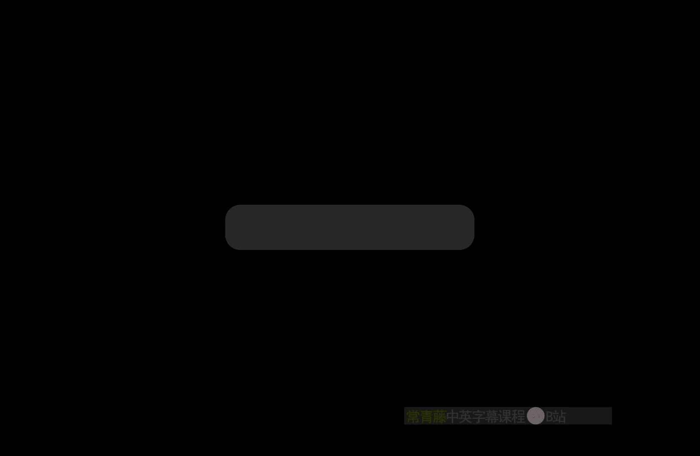
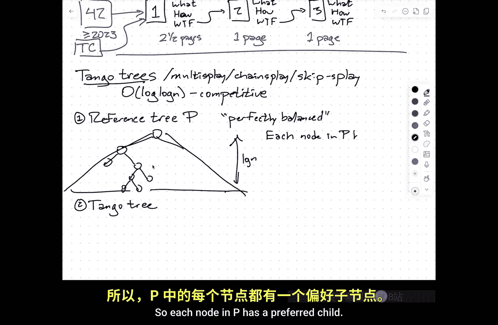
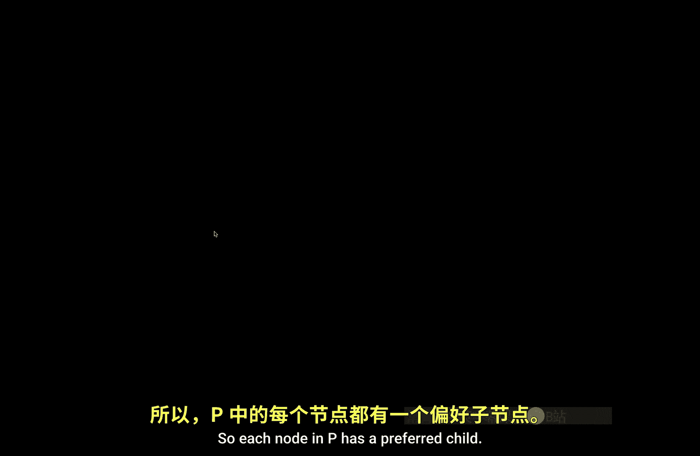
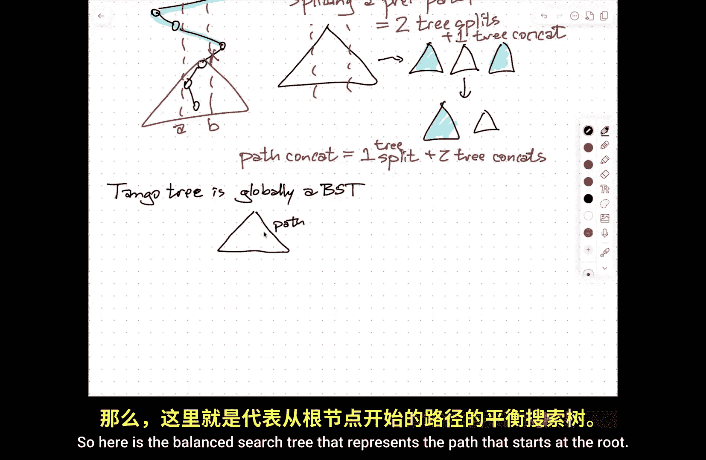
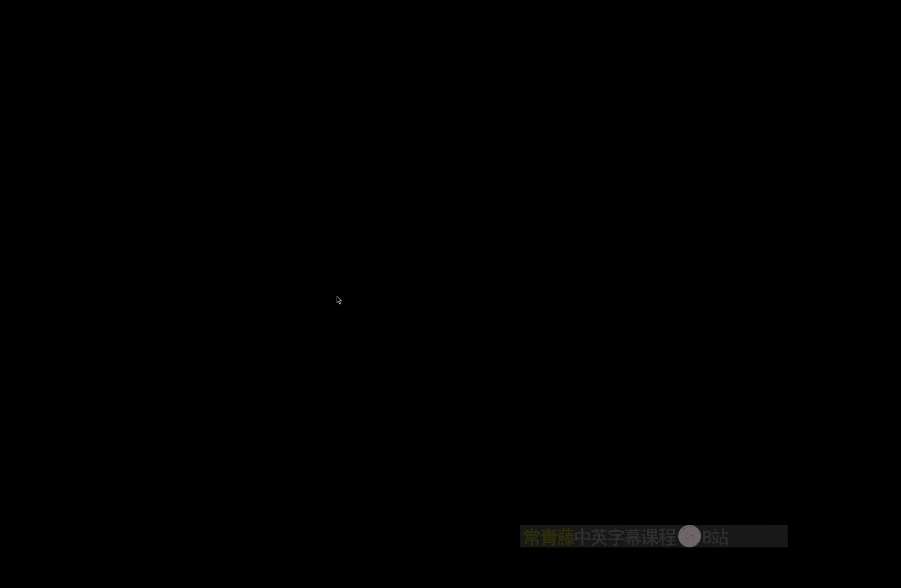
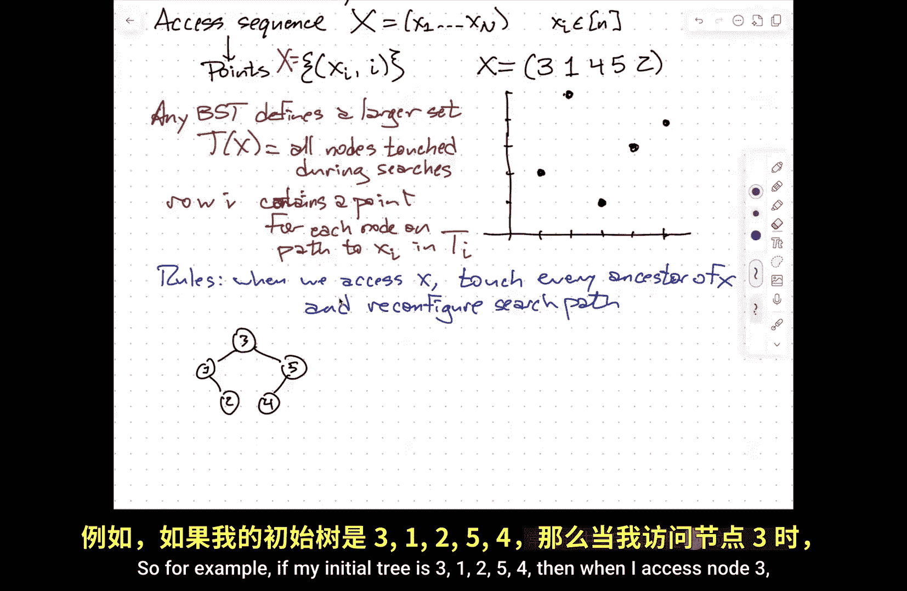
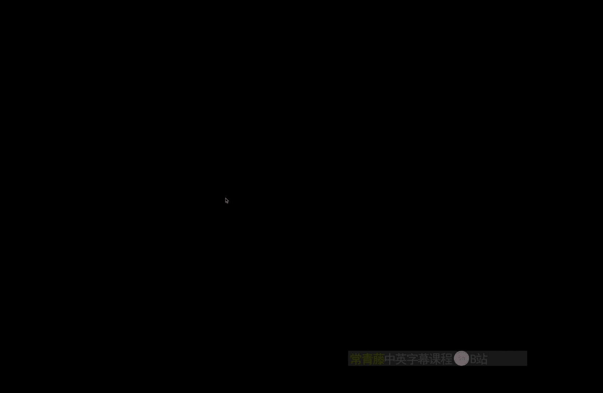
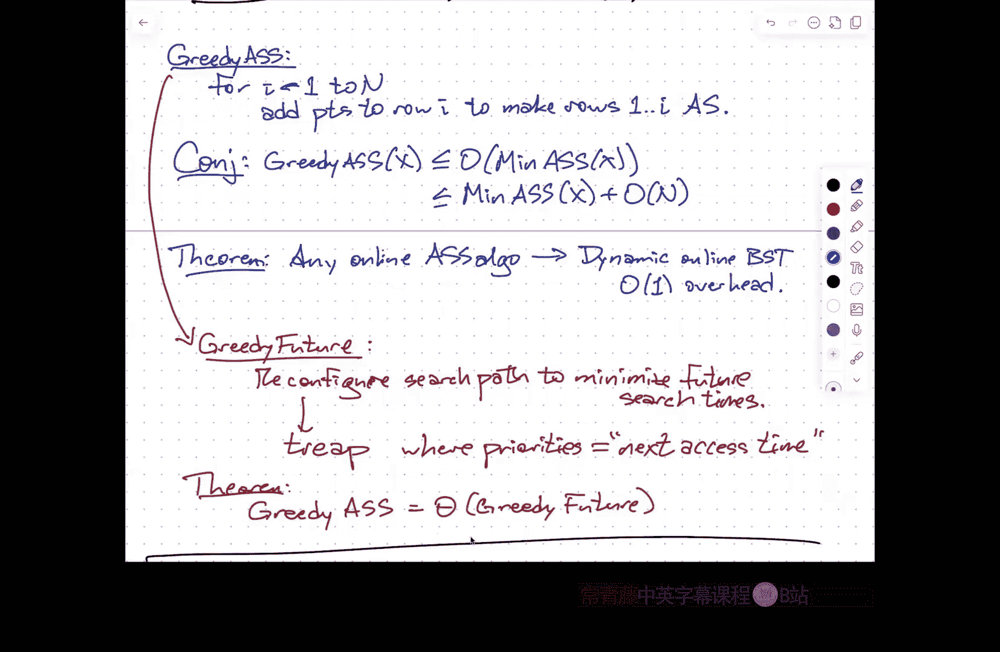

# 伊利诺伊大学【中英⚡高级数据结构｜CS598 Spring 2025, Advanced Data Structures】 p07 P7 探戈多重伸展树，二分搜索的几何结构 -BV14qZYBJEZy_p7-

Thanks everyone for。Coming out in the cold。And again， thanks for your patience while they get set up。

So first administrative。Announcements， some of you may have already noticed。

Paper chase assignment is out。Um so。Again， just to briefly remind you what this is about。

The idea is that I want to get you used to。Diging into the literature。

Reading actual research papers about data structures。Chasing references to help you get。

If you find something that's confusing help you get unconfused。

Um and to write coherently about those papers to an inexpert audience。

 like you were a reviewer for a conference。So。The the basic structure is。mYou'll， you know， find。

A paper。They'll call paper one， and you'll write a brief review that describes， first of all。

 what the paper is about， what， what the main。Contributions of the paper are。啊。啊。

What the main technical tools are， what techniques they use。To derive those results。UAnd。

Where did you get confused？If you'd never get confused。

 you chose the wrong paper one and you have to start over。Right。

 so and so this is a little bit of a balancing act because what'm I'm really asking you to do is find a paper that is。

Outside your comfort zone， but not so far outside the comfort zone that you can't tell anything about what the paper is about。

嗯。And then from there。You'll choose a second paper， which you'll find on your own。

 which helps you get unstuck， helps clarify whatever confusion you had with paper number one and again。

You know。What how。WTF and and in particular， when you're describing what。For paper2。

 you should explain， oh， this is how it relates to paper1 and what it clarified for me about paper1。

 and then if you're still confused， it may be that you're confused about something in paper2。

 it may be that paper two didn't completely clarify what was wrong with paper1。

 and so you'll do it again。What are the results and how do the results in paper three connect to one and two。

 how did they， you what tools did they bring to bear to prove those results and where did you get stuck？

嗯。In the assignment itself。On。I have a list。WchI really tried to keep short。

I managed to keep it down to 42 papers。These are 42 papers about data structures that were all published。

In 2023 or later。And I chose these out of a list of about 200。So。This is a very active。Research area。

m，And so it actually was kind of difficult to parret down even this much。Um u。

This is a suggested list of starting points， not a required list of starting points。

 so it may be that that you look at these papers and go I don't really see anything that appeals to me there's also a pointer。

To。A list of papers that Timothy advertised for his projects。His presentations。A year and a half ago。

Most of the papers in Timothy's wealth， first of all， Timothy's class was in。2003。

 so some of a lot of the papers that I that are in my list didn't exist at that point。

 but a lot of the papers in Timothy's list date back even further。

 he aimed for like landmark results regardless of old they are I optimized for recency。

So there's a long， long list of things to sort of start to play with。

 but then from there you can look at other papers in the same conferences。

 other papers written by the same authors， other papers that cite these papers。

 either to choose paper one or more likely to choose papers two and three。This whole mess。

Should be about five pages and really what I imagine。Is。it's。You know。

I realize this doesn't add up to five， but being fast and loosecir that most of the work。

 most of the writing will be about paper one。And then。

Because papers two and three are going to be related。

 they'll be less to say about what they did that's different from what paper one did， so for example。

 if paper one is about results related to one of the things I'm going to talk about today。

 which is the geometry binary search trees。😡，Paper one should say a little bit about what the geometry binary research trees is。

 but then if paper two is also about that， you don't need to reintroduce that topic。系い。嗯。Hopefully。

You should be more worried about keeping the text under five pages。Then to。To have。

 can I fill up five pages？The hard part here is not having enough to say the hard part here is organizing your thoughts。

So that you only need this， you know， a relatively brief document to summarize everything this is again。

 the five pages is not a hard and fast limit， it is a guideline。Um， but you know。

 once you get up about six or seven pages above that， it starts to get uncomfortable。嗯。

There is a rubric in the， in the。In the handout that describes you know how I'm going to score these things。

 basically for paper one， I'm going to score each of those three points， what。

 how and what the fuck separately。And then for papers two and three。

 I'm just going to take those as like whole units。 so in the end。

 the grading breaks this down into five parts。嗯。And this is all。Do。March 3d。This is not， again。

 like homework 0， This is not really a hard deadline。

When we get to the project proposal at the end of March， that will be a hard deadline。

Um then when I the deadline， I think it's March 31st。

I really do need the proposals in my hands on that day。Because the next day。

 I'm going to come in and present them all。U。To sort of walk through them and connect them and if I have anything intelligent to say about suggestions this looks great。

 but it's way too hard， this looks great but it's not all that hard you want to aim for somewhere in the middle This is great you should look at this paper that kind of thing all of your paper chase documents will eventually be in a password protected folder that everyone in who's registered for the class can see。

So you can use other people's paper chases to help you develop your project proposal。い。哦，行。马了。嗯。

Look on the front page。Just go to front page paper assignment right here。Oh。Okay， yeah I think。Yeah。

All right， sorry。The URL is messed up homework there。Sorry about that。嗯。So。

I apologize for people watching this on video that don't see anything。

So up on the screen in the classroom， I've got the rubric that's on page two of the document and here's the beginning a list of papers。

So like I said， 42。I tried hard。I literally added one this morning， paper 39。Because like oops。

 I really should not have left that out。IsToday's lecture related to paper 13？Yes。It is。嗯。Okay。So。

Any questions about the paper chase and I will fix that link immediately after class so you don't have to remember to put the HW in the URL。

Sorry about that。Okay。If you have questions later。This is a great thing to talk about in office hours if you're not sure like which of these things。

 you know， I definitely recommend trying to leverage。

Whatever past expertise you're coming into the class with。So there is。

There is an infocom paper in there so if you've done stuff with routing in the past that might be a good paper to choose there I think there's at least one paper related to databases in there if you have expertise in that area that's a great paper to choose but。

There are hopefully some papers that are going to be accessible to everybody。O。So。I want to start。

Today， by by。Repeating the last five minutes of Thursday's lecture。

 which will probably take me about 20 minutes。Because I want to go through the details a little bit more carefully for this data structure called a tango tree。

 there are a bunch of variants。So。They're sort of later things called multiplay trees。

 chain display trees。Skip s trees。That all have， they're all variants of tanggo trees that have the same asymptotic behavior。

 but have other kinds of advantages。And so the the main result here is that。嗯。

These tanggo trees and their descendants are all log， log and competitive。

Which means the amount of time that they spend。To access a sequence of nodes that are stored in the tree is within a factor of log log n of the time for the best possible self-adjusting binary research tree。

 even if that optimal binary research tree can see into the future。

So organize itself to make future searches cheaper because it knows what those future searches are。

 tango trees， obviously this is a real data structure it can't see into the future because that's not a thing。

Okay。So。The definition of tango trees。Actually uses two different trees。Okay。

 so there's a reference tree P， which。Is a mnemonic for。Perfectly balanced。

And then there's the actual tango tree。All right， and the data structure has to actually maintain both of these。

Although if you do your bookkeeping correctly， you don't really need to have an explicit data structure representing P。

 it's just easier to explain if I imagine that it is a separate explicit data structure。Right right。

 so this is。You know， perfectly balanced。All。Leaves are at you know close to the same depth。

Which is about log in。嗯。So I'm imagining here to simplify discussion， I have a fixed set of n values。

 which I'm just going to take to be the integers 1 through n。

 and I'm trying to populate a binary search tree with those keys so that later I'm going to answer a sequence of accesses。

 searches for those values one through n。可以。嗯。So each node。N P has。

A。Preferred。

Child。And so。Every node is going to。Point。To one of its children。And the semantics here。Our。left。If。

Last。Access。To the subt。Rooted at V was in left the left subt of V， or it was V itself。

And it's right。Otherwise。给。So these preferred child pointers decompose the vertices of the tree into preferred paths。

 each going from some node all the way down to a leaf。嗯。So this。Decomposeers。P。Into。Preferred。Ps。嗯。

All right， so。The semantics here are now， again， whenever I access a node。I make the path。

From the root。Of P to that node。Preferred。嗯。Right， so。If。Let's say。You know， before。

HereHere's another one of these preferred paths。And now， if I access this node。Right， when。We。Access。

Notode X。你 pass。From the root。To x。Becomes a preferred path。Which means in this particular case。

Now this edge stops being preferred， the left edge of the root stops being preferred and now the right edge is preferred because the search target is in the right sub of the root。

Similarly here， this edge going the going to the。goinging to the right stops being preferred and this edge going to the left is now preferred and if this has you know more descendants。

 this edge going to the left。Becomes preferred because when I access myself。

 I pretend to like my left child more。嗯。嗯。Okay， so everybody。Semi comfortable with the semantics of。

What my favorite child means， yeah。明白。I'm sorry， you said that again。能不讲。That's right。

 the preferred child pointers decompose P into into vertex disjoint。Pats。Right so these are。Vertex。

Djoint。UmAnd， you know， some of these preferred pads might only just be like one leaf all by itself。

All， so okay， that's a path of length zero still has one node in it。

But every node isn't exactly one of these preferred paths。It's a partition。Not not of the edges。

 but it's a partition of the vertices。嗯。So yeah， I should really say。

Just to keep with the alliteration。It partitions P into preferred paths。

Which is another reason why this is called P。Besides being perfectly balanced。

Now this isn't the real data structure。😡，The real data structure。

Represents each of those preferred paths using a balanced binary search tree。

So the real data structure is the tango tree。And so this is the real。BST。This represents。Each。

Preferred path。In P as a balanced。Binary search tree now。

The original tango tree paper used red black trees， multiplay trees use splay trees。

 the other options I listed above do something slightly more obscure。But。The balanced sper。

What you actually need for these balanced binary search trees is anything that can handle。Search。

 insert or delete。Split。Which means given a key， split this binary search tree into two trees。

 one containing all nodes less than x and one containing all nodes greater than x。😡，And canca。

 which means given two search trees A and B， where every key in A is smaller than every key in B。

 glmed them together into one big binary search tree。嗯。

We talked about how to do search insertion deletion in s trees， the insertion。

 the deletion algorithm actually executed a split。And a conca。

So you already know how to perform these operations in sp trees and these all need to happen in a log M amortized time where M is the size of the tree。

It's not going to be n anymore because there's lots of these trees floatinging around。Now， crucially。

This means。That。When I have a preferred path。This is going to be represented as a balanced binary search tree using the actual keys on the path。

As keys in the balanced binary your search tree。 So I don't know。 this is going to be 3，2，1。5。4our。

Something like this。系。😊，U。Now。The reason why we need to support splits and concatenations。Is。嗯。

Following， okay， so when we。Access。X sub I。We search。On。Well， okay， so sorry。

F out the right way to say this。We're going to perform in principle， we're going to perform a search。

In。The reference treeP。系。Now， as we walk down towards X。

We're going to walk down the preferred path starting at the root until we dont。

AtSome point we're going to fall off， okay， then we're going to jump to a new preferred path and walk down it until we fall off。

At the point where we jump off the preferred path from the root。

 we change that path to path edge to be preferred and whatever other edge used to be preferred at that node to not be preferred。

😡，So。If。If the search path。In P。Touches K。Preferred。As。What does that actually mean？Well， the the。

Let's imagine， for example， that I'm I don't know， I'm searching for pie。3。

14 or whatever in this preferred path， so the search path is going to go like this。

So now that edge from three to two needs to not be preferred anymore。

 so I need to basically split the preferred path。Into the prefix， 5143 and the suffix2。Okay。

 so we need to split。Eacheach。Preferred path。And then if there's something hanging off to the right of three in the preferred in the in the reference tree。

 then I'm gluing。The preferred path 5143 to the preferred path starting at the right child of three。

Right。So and we need to concatet。Preferred paths。So this is going to happen K times。

 and this is going to happen。I don't know， K plus or minus1 times。

But what does that mean in terms of the tree that is representing that path， So I somehow need。

 you know， when I'm removing this edge from my preferred path， that means I need to remove。

Two from that search tree。So the key observation here。Is whatever my path looks like。

Let me draw this more carefully。嗯。Whatever I'm splitting off。See I'm splitting this off here。This is。

Splitting off an interval。In the sordid order of those keys。

RightEverything that's below that edge I cut off is all adjacent in the sortded order of the keys along that path。

 So what that means is。Splitting。A preferred。Paath。Means that I take。My tree。

And I'm actually splitting it。Into three。Trees， and then I'm taking two of them。

 the ones that still make up the。The new preferred part of the path。And I glue them together。Okay。

 so。Splitting a preferred path。Is the same as two tree splits。Plus， one tree can cat。咁。

Symsymmetrically。When I'm。Concatetnating two paths。I just play this same movie backwards。

 this is one split， one tree split。Plus， two tree concats。ok。😊。

Because I'm storing these paths in balanced binary search trees that support。

Splits and concas in log size time。That means that each of these。Takes log， log N time。

And the reason it's log log n is， well， the length of any。Preferred pass。These are all have length。

At most， log in because the reference treeP is perfectly balanced。

So every preferred path has linked that most log in。 so every one of the component trees。

That we're representing。Has size log n， so doing a search in that tree， doing a split in that tree。

 doing a concat with two of those trees takes it most log log n， amortize time。や。可以。我全清岁。

Why do we know all the notes under the we need to connected together in the okay。

 so when the question is how do we know these these things are together right so let's just take a look at。

Let's say this node right here。We went to the right。

That means the search path is always going to be to the right of that node。

Then here we went to the left。 That means the search path is always going to be to the left of that node。

So at any given time， we've got an interval， whenever we branch to the right。

 the left side of that interval moves in。Whenever we bench to the left。

 the right side of that interval moves in。So think of it。

 remember that every binary search tree is also a recursion tree for Quick sort。Okay。

 so when you recurse， the left and right subties always represent。嗯。Smaller intervals。

So what I'm really saying is this entire subre here。Actually， fits between。It's parent。

And the nearest ancestor on the other side。And the rest of the path is confined within that sub。好的。

I didn't say they were connected in the binary search tree。 We used to store the path。

 What I said was， we can split。right， so I've got these two values。

 let's call this value A in this value B。So I'm going to split this tree at value A。

 and then I'm going to split the right tree at value B。 and that gives me three trees。

And then I'm going concatenate the left and right， and that's going to remove everything that has a key between A and B and do a separate thing。

And all the other things into another yeah。So one point represents P properly。

 the only takes a lot longer。啊，不好。How about like actually finding about game the tackle tree， Like。

 doesn't that still take， Don't we need to go through every single preferred class for that。

So it turns out that the whole tango tree is。Tano tree。Is globally。A binary search tree。So I take。

 you know， here is the balance search tree that represents the path that starts at the root。

And then any path that hangs off。In the preferred path to the come on。

To the right side of the preferred pass。

Has a key that's smaller than that node。In the preferred path。

 or sorry larger than that node in the preferred path， so that will actually hang off to the right。

Of some node in this tree。So the things that hang off the preferred path can be glued onto this path tree in exactly one way so that the whole thing is a binary search tree。

So what really is happening is I just walk through the tango tree using the normal binary search thing。

But sort of when I switch from one preferred path tree to another， I go， hey， I switch paths。

 I need to do some concatenations and splits。有。So like into the data structure。

Like the actual tree is nowhere it's just these like path trees so we have like im imaginary edges kind of going from one like edge to the other or like one tree to the other well they're not imaginary edges I mean it's again。

 so the the the path tree at the root might be something that looks like。This。

It's almost balanced and then there's going to be some pointer hanging off here。

That leads to another path tree。But。This edge。Will be marked as this is not part of any path tree。

 This is just connecting two different path trees。But the whole tree is a balanced binary search tree。

And so， do。Only the leaves in the path tree have such edges， yes。

 only the leaves in each path tree have these edges leading to other path trees。

So there's I'm spending within each path tree， I'm spending log again time。

Doing that part of the binary search。And then log log in time doing splits and concas to reorganize that path tree。

 and then I continue to the next one。得。So do we have any depthOkay， so wait， sorry。对。

That's not what I'm claiming right right so the overall claim。Is that the time？Is order K log， log n。

Where k is the number of。Let's say non preferred。Edges。On the search path。

You can think of this as in NP or NT， it doesn't really matter。系。Now。

Part of the reason why this is interesting。Is。That。This is Wilbur's。Inter leave。Lower bound。

So I won't go back over the definition of that， but the in detail。

 but the basic idea is the interlea bound is， okay， for every node in some reference tree。

 which I'll take to beP。When I'm accessing this sequence of values。

 how many times do I alternate between looking in the left subree of that node versus looking in the right subre of that node。

 that's exactly the same as how many times do I change that node's preferred child。Okay， so those ks。

Add up to exactly the Wilbur inner leaf lower bound。Which means that the time is order， log， log。

 and times opt。Because Wilbur is lower than opt and this is lower than Lo Lo Gentime's Wilbur。

So this is a log log in competitive binary search tree。Okay。Now， one of the。Untu。

Ways one of the unfortunate consequences of the way tanggo trees were initially defined。

 so tango trees originally used。Red black trees。And。That meant that the time for research was also。

Log n， log， log n。So it is possible。That every edge on the search path is at not a preferred edge。

In which case I'm going to for that one search。I'm going to do I'm going to visit login different path trees。

And if I use red black trees， I can actually force。Each of those things to。

 I actually have to search the whole thing and split the whole thing and spend log in time。

So for red black trees， the log log in also， you know。

 I get this factor of log in because that's how many trees I'm searching。And that analysis is tight。

For multiplay trees。So this uses。He used display trees。As the component。This actually。

Provvably he has time。login。Of course， this is amortized。

And the reason for this is boils down to the analysis of s trees in terms of this weird thing that I call the access level。

The accesslemma says the amortized time for a single display is proportional。

 is at most three times the change in the rank of the thing that you're accessing。

But if I've got a stack。Of splay trees。Now I'm not multiplay trees don't play the thing all the way to the root。

 actually， no， sorry， they do because。The search target ends up in the root preferred path。

 and therefore it's splay to the root of the root's preferred path tree。U。But the idea is。

When I'm going through this search path and I'm doing displayplays near the search path。嗯。These。

Spplays。All telescope。So in particular， when I'm using the axis lemma。

 I'm defining the weight of a node。To be one for the node itself。Plus。

 any immediate descendants that it has that are not part of thats nodes。Preferred path tree。

All right， so you get a telescoping sum。From。Splay tree access。问啊。嗯。With。The right。Waits。

And so you're looking at。The change in the rank in the bottom tree。

Plus the change in the rank in the next tree， plus the change in the rank in the next tree。

 plus's the change in the rank in the next tree。All those changes add up to the overall change in the rank。

 but the overall change in the rank can never be bigger than login。So it ends up just being lo in。

We're going to see this telescoping thing again， probably on Thursday。

 a different application of playre。So this gets within a factor of log， log and of optimal。

 and this is the best we know how to do。this is the closest thing we have to a constant competitive dynamic binary search tree like I said there does this does come in several variants and some of the claims that you can make about some of these variants are slightly stronger than others。

But I at least at a very。To first approximation， all of these variants give you this log log in competitiveness。

So。The thing I want to talk about next。Is。This thing I mentioned。The beginning。Earlier in class。

 the geometry of binary search trees。嗯。This is domain。Harmon。Icono。Oh no。

'm I'm forgetting somebody trashshku。Harman was a PhD student。Tsku was an undergraduate。

So Perasku Mihai Perasku one。One these CRA undergraduate research awards。

As when he's an undergraduate at MIT， John Icono told me what he wrote in his recommendation letter。

Um。It is a pleasure to write this letter strongly recommending Miha Ptrasku for promotion to the rank Asoc professor with tenure。

 unfortunately Miha is an undergraduate， so I reluctantly and compelled to nominate him instead for the CRA Undergraduate Research Award。

And he was not exaggerating Me I was a force of nature。I'm so kind of a jerk， but。嗯。2009 ish。嗯。

I think this paper came out in 2009。嗯。So。What they decided to look at and they were actually not the first people。

嗯。To look at this， there was another group at CMU that did something similar specifically for the purpose of driving new lower bounds for dynamic vis trees。

 but the nice thing about this particular paper is it also led to a proposal for other online。

Dynamic binary search tree that looks like it might be close to competitive。engg。Okay。

 so the idea here is have。ree。research tree with keys。One through n。I have an access sequence。X。是。嗯。

Where each u。Each access is to one of these items。So this is purely in the realm of searching。

 it doesn't include insertions and deletions although the later work does extend it to that setting。

And。This access sequence defines。A set of points。Where the X coordinate is the value being accessed。

And the Y coordinate is the time at which。The value is accessed。Okay。So if my access sequence is。

 for example， let's say， three， one， four， five， two。Then。嗯。The resulting set of points。Would be two。

 three， four， five， be three， then one。Then four。Then，5。Then two。Okay。😊，Now。

The question that they started with is。If I look at a self adjusting binary search tree。

When I'm doing searches for these values， those are not the only nodes in the tree that the search accesses。

 that the search touches。So。We want to like， you know。诶。Any。BST defines。A larger。Set。

Let's call that T of x mean I'm actually going to call this set of points all set x at the risk of confusing people T of x。

 this is all nodes。Touched。During。The searches， so in particular。Row I。Contains。A point。4。

All node or sorry。Let's write this again， K。Ts a point for each。Noode。On the path。

To X I in whatever the tree looks like at time on。Okay， so we're in self adjusting tree land。

 that means we started with an initial tree T1。We access node X1。We're allowed to reconfigure。

The nodes on the path to X1， however we like。Okay， so the rules。Are when。We access。X， we。Touch。

Every ancestor。Of x。And。Reconfigure。The search path。However we like。so this is again。

 capturing exactly the behavior of s trees where the reconfigure in that case is a。

 but it allows for other more complicated reconfigurations now this is slightly more restrictive than the model that Wilbur used for lower bounds because what Wilbur said is you're allowed to touch any connected piece of the tree that includes both the root and the search target and reconfigured that whole subre all at once。

This is explicitly restricting to only reconfiguring the search path。嗯。Okay。So， for example。

If my initial tree is。Three， one。To。5，4。Then when I access node3。

I don't need to do anything。When I access node one。I touch both node3 and node one。

 so this new point comes in to account for that touch。

And let's just imagine for the moment that we're not going to change the， the tree at all。 I mean。

 this is also completely allowed。Then for the static binary tree， when I touch four。

Then I have to when I access four， I have to touch three， five， and four。So for that。

 then these two things get touched。Then when I access five， I have to touch three and five。

 and then when I access two， I have to touch。Three and two。Okay， so the original black points here。

 these are the points that represent my access sequence and the black and red points together represent a larger set of points。

That record what nodes in the tree I touched。Okay， you'll notice。

There's a point in every row in column three that just reflects the fact that the root of the tree was always three。

But that's not always going to be true。How。Now。Okay， so they observed that。

This new larger set of points satisfies a property they called aboal satisfaction。

Is an arborally satisfied set。Now， an arbally satisfied set。Like I said， Miha was kind of a jerk。嗯。

So he just wanted to make people say ason。嗯。Okay， so what does arb burly satisfied mean。

 so if I look at any two points that are in different rows and columns， they define a rectangle。😡。

Okay， so。Any。Rectangle。Defined。By two points。And these could be black points or they could be red points。

 it doesn't matter。Has another point。Inside。Or on boundary。So if I look at this rectangle。

 if there are no other points in the interior of the rectangle and there are no other points on the boundary of the rectangle。

 then the set of points that I'm looking at is not aly satisfied。Now。

 if it does have a point in the interior。Then in order to be aorly satisfied。

 this set now also needs to have another point inside or on the boundary of that upper left smaller rectangle and another point in the lower right of that other smaller rectangle right so in fact。

It suffices just to say on the boundary。By induction。If there's a point in the interior。

 then there'll be points on the boundary of each of the smaller things， and in fact。

 there's a stronger statement。That says。嗯。There's at least one point。On the two edges。

That are adjacent to one of the points defining the rectangle。

And there is at least one point on the two edges defining the other corner of the recangle。Now。

 a point in one of the other corners of the big rectangle satisfies both of those conditions。

 so I may only need one extra point， but in fact，'s say at least one point on here。And。

At least one point on here。企。So if I look at this set of points that I generated by accessing the static binary search tree。

For example， if I look at this rectangle。You'll notice that it has。

Another point on the top boundary and another point on the bottom boundary。

If I look at this rectangle， it's got another point on the top。And another point on the right。

 if I look at this rectangle， it's got a point in the upper left。

 which actually satisfies both of those conditions。So in this example。

 you walk through it by brute force and see that it is， in fact， arrborly satisfied。系。嗯。Okay， so。

The second lemma。Is。Any arbbroialally satisfied set。Is。T of x for some。

I should say any arorrly satisfied superset of X。Is。Is the touch sequence。

 is the touch points for some self adjusting body research tree？Given that access sequence。

So there is an equivalence between these two。Okay， so。Theorem。嗯。The costs。The optimal。Cost for。

Any dynamic binary research tree for a given access sequence x。

 this is equal to the size of the smallest arly satisfied superet of the corresponding points at x。嗯。

嗯。The proof of this。The proofs of these lemmas are not。Terribly difficult， so。

I think I'm going to try to walk through at least one of them。

To give you an idea why this whole mess works。嗯。But one of the results that comes out of this paper is。

There is an obvious greedy algorithm for computing not necessarily minimum。

 but a reasonably small arrborarily satisfied superet of a given set X。The so called greedy this is。

The greedy ass algorithm。It says for I goes from one to however many Aes there are。

Add points to row I to make。Rs one through I are boly satisfied。

RightAnd if whatever you decide to access on row I at time I。Creates an unsatisfied rectangle。

 then you add a point in one corner of that rectangle to make it satisfied。嗯。啊。

So this is a fairly natural algorithm and the conjecture。Is。That。

This greedy arborally satisfied superet。Is within a constant factor in terms of the number of points。

Of the smallest one。 And， in fact， there's a stronger claim that our stronger conjecture that。

It should be within an additive linear term。系。Now。This is a lovely sort of geometric algorithm。

But it's a。And the theorem says that in an offline sense。

 if I look at the final result of this greedy algorithm。

 that is a transcript of what happens to some dynamic violence binary your research tree。

 but that the theorem only guarantees that there is a sort of clairvoyant。嗯。

Bary research tree with that exact behavior。系。U so。It's the second theorem。Is。嗯。That any。Online。

Are bur satisfied？Superet algorithm。Leads to。Dynamic。Online。BT。With a constant overhead。Okay。So。

Because the greedy algorithm for computing this arrborly satisfied superet is online。 I I。

 I don't get to see you into the future when I'm building。My points七。I can translate that。Into。

An online。Self adjusting binary search tree algorithm。And I don't do it exactly， the offline。

 given this arbbo satisfied superset， there is an offline thing that's one to one exact。

But I lose a constant amount of overhead。This is actually， you know。

 really surprising because if I look at what the online equivalent of this greedy algorithm is in binary search tree language。

😡，It's actually something。Called Green Future。And it's weird because in the geometric setting。

You're only looking in the past。But in the binary research tree setting。

Somehow magically through the， through the magic of this， this constant I overhead。

 So it's not going to get greedy future exactly。 It's just going to get within a constant factor of greedy future。

 But greedy future says reconfigure。😊，The search path。To minimize。Future。Search。Times。So I mean。

 it's a very high level， it's like there are lots of different ways that I can reconfigure the search path。

Which everyone brings future searches closer to the root in in particular the next search close to the root and then the next search after that as close to the root as possible subject to the earlier things and so on。

 so morally you reconfigure it using a tree，Where priorities。Are the next access times？

So for those of you who haven't seen troopss before。

 a tro is both a binary search tree for the given set of keys。

 but in addition every node has a priority and typically those priorities are random。

And the tree is organized so that those priorities form minheap。

So the root is always the node with the lowest priority and the right child is the node。

Among those nodes with keys larger than the root， the one with lowest priority and so on。Hey。

You remember Cartesian trees same thing only now we call them priorities now the priority is going to be the next time you're going to access this node。

This this is a little inaccurate because it's possible that the next thing you're going to access isn't actually on the search path。

 in which case you set the priority of its predecessor and successor on the search path so that it goes up。

😡，But at least morally， the idea is。嗯。i。Mally， I reconfigured the search tree in the best way possible。

To minimize the depths of nearby future searches and then。Beyond that。

 the next further in the future for research and so on。嗯。So。Theorem。啊。Greedy s is theta。3D future。

And that has as a corollary。That greedy future。Even though it looks like it's looking into the future。

But really， if I， if I take this。This other geometric greedy algorithm and I walk through the procedure of turning it into an online algorithm again it's not exactly going to be greeny future it's just going to be close。

 the analysis is exactly the same is going to be log log and competitive。And again。

 the conjecture was Read future is actually within a linear additive term of the optimal binary research tree。

Now， since then。Okay， I'm not going to get to the proofs today。Since then。

 there have been a couple of。More recent results。So u。The one that I added to the。啊。

To the paper chase at the very last minute。This is paper published。A year and a half ago。I， so。Right。

 the the conjecture was that breathe future is less than。Optt plus order。Well order N。

 the number of accesses。Unfortunately， this conjecture is false。

What they proved is that greeny future is within。Optt plus omega of n log， log n。

One way of interpreting this lower bound。Is that at least in the regime where we expect the optim to be the optimum sequence to only use a linear number of operations。

 degree features login competitive。It's not exactly right。

It's just saying if the constant in front of opt in your approximation theorem is one。

 then the additive term can't be linear。It's going to be bigger by a factor of log log n。

The other thing they showed is。啊。嗯。I think actually the right way to。Say this。Yeah。Minus big O。U。

If it is competitive？It's at least the competitive ratio is at least two。

So in the original paper by Domain Harmon Patrasku at all。

 they show an example where greedy futures within a factor of is a factor of four thirds off the optimal by going through by showing a geometric thing this paper increases that to two one of the things that's weird though about greedy future that this paper showed is that there are。

There are。Access sequences。X， such that the greedy future of x is at least twice。

 the cost of running greedy future on x is at least twice the cost of running greedy future on the reversal of x。

Which is really strange。It it's what you kind of expect。At least what I would kind of expect。Is that。

 well， actually， it's completely clear。 the optimal arbarly satisfied superet of a given set of points。

Is the same as the a the optimal arborarily satisfied set， if I reflect it。Vertically。

 or if I reflect it horizontally， or if I rotate it 90 degrees。So。

 negating all of the search keys should have no effect。😡。

Running the sequences backwards in time should have no effect。Swapping space and time。

 whatever God that means should have no effect。Paer 13 talks about that。嗯。But for greedy future。

 it does have an effect。 The effect is a power of two。

 The more even more interesting one is there are。There's a sequence。 an infinite number sequences x。

For each x， there is sub x prime。Such that the time to access x prime， the smaller sequence。

Using greedy future is at least twice the time to access the larger sequence。

So sometimes doing more searches makes greedy future faster。

 which is not something that should happen for optim。So this paper。

Kind of casts a little bit of doubt on the idea that greedy future might be close to optimum because it definitely displays behavior that the optimum algorithm should not have。

Now， this doesn't say anything at all about play trees。

which was sort of the start of going down this road we'd like to know something about how spplay trees behave if you actually look at the way this dynamic boundary search tree evolves。

 it doesn't actually look that much like spplay trees sort of the sum similarity at a very high level。

 but。The original Sp tree conjecture still stands。It it's still， you know。

 we believe it's within a factor within a constant term of order capital N of optimum John Iyaconno has told me he has proved that theorem at least 10 times。

And then each time， about a month later， he finds that he ignored a floor or ceiling somewhere。

And so the theorem falls apart。so it's this close is only like a plus one or a floor or ceiling off。

 but it's not there。Great。嗯。I probably won't have time to talk about these proofs。

 I want to move on to other things， but if people are curious。

 Eric Demain has a set of lectures in his data structure class that he offered now it's like 13 years ago。

 but that actually does walk through the proofs going back and forth between aly satisfied sets and self-adjusting binary trees and with this online aboly satisfied gives you an online binary search tree。

Those are very high level sketches， but then you can refer to the other paper and follow the papers if you want more details。

And I'll have pointers to these things on the course website。Okay。We're out of time。Thanks。

 everybody。

