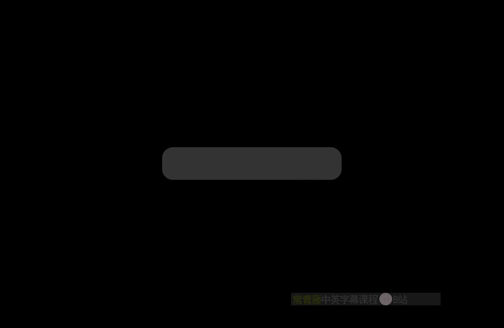
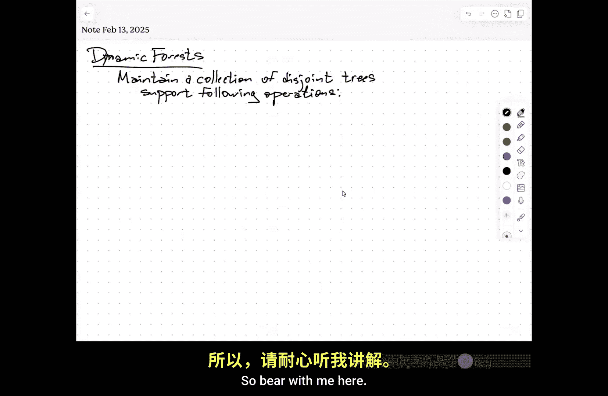
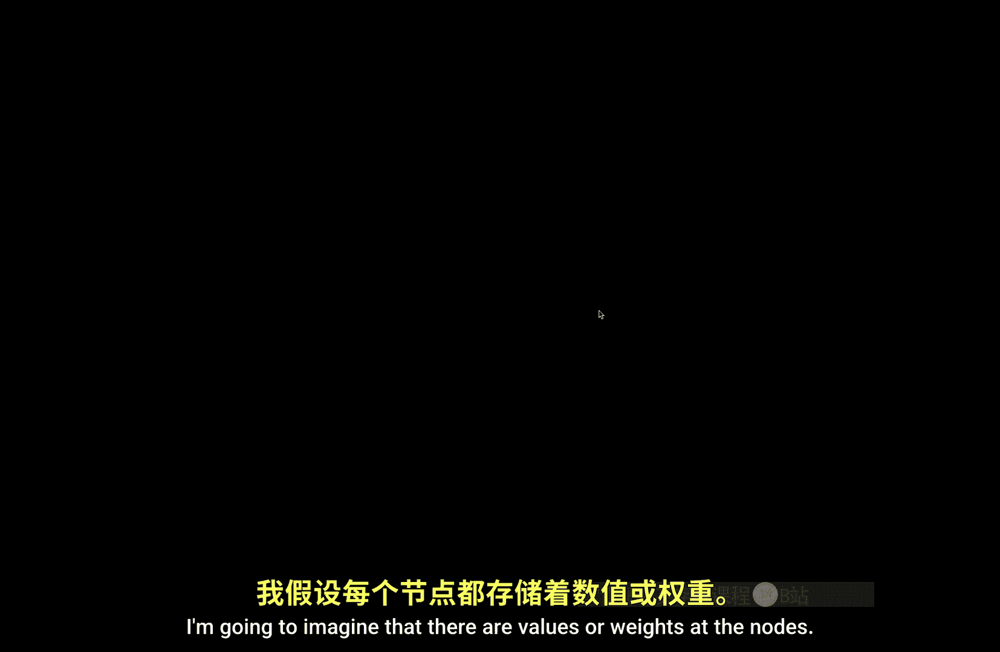
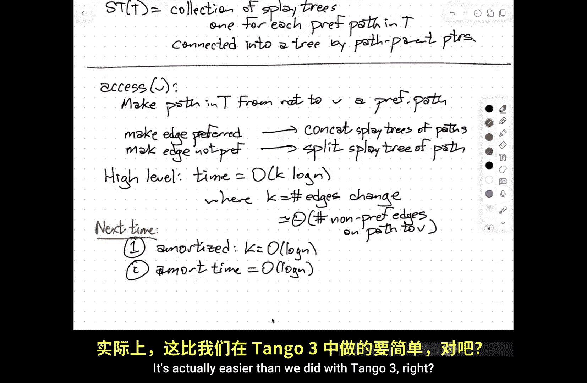

# 伊利诺伊大学【中英⚡高级数据结构｜CS598 Spring 2025, Advanced Data Structures】 p08 P8 欧拉游览树与ST树 -BV14qZYBJEZy_p8-

So what I want to talk about。

Today。嗯。Is about。An application of。B binary search trees， this is the sort of。Dynamic forest。

Dave structure。Okay， so the idea here is。That I'm going to。Maintain a collection of trees。

 if you like for simplicity， just imagine at least at the beginning that there's only one tree。

 but the idea right。I maintainin a。Collection。Of。This joint。Trees。And I want。To。😔，Support。

The following operations。Now， this is。Kind of a representative list of operations more than a definitive list。

They like most data structures， there are lots of minor variations， lots of extensions。

 so bear with me here。

咁。I'm going to imagine that。啊。There are values or。

Weais。At the nodes， so every vertex of these trees has some number associated with it。

Whose semantics we don't care about。there are variants of this where you actually want the weights to be on the edges instead of the nodes。

 again， minor variations。Okay， so what kinds of things do we want to be able to do Well。

 the the there are some structural operations。That we want。

So one is we want to be able to cut an edge。Okay， so UV is。An edge in。Some tree。

We also want to be able to add edges， but only when they link trees together。Okay， so link。

U V under the assumption that Uv is not。An edge。In any tree。

And these two operations are obviously in verses of each other。So if you want。

 you can imagine that I start with。A forest consisting of just end nodes， each in its own tree。

 there are no edges at all， and I can assemble my tree using link queries or link operations。

Or I start with a single tree and I want to reorganize it into a different tree。

 so I cut all the edges away and relink what I want。Um。

If these were the only operations that I need to perform。

I can perform them in constant time by saying， yes， or whatever。Because remember。

 you don't have access to the underlying。Stucture here so it's like cut this edge，'t know。

Think this said，You have to ask me questions about the tree in order to actually。

Turn this into a meaningful data structure problem so there are。啊。2。😔，Ways that you can imagine。嗯。

Asking questions about the tree and。Updating the values that are stored in the trees。

One of these is in the language of rooted trees that you you pointed a note and you asked questions about all of its descendants。

So these are our subre operations now in general。I'm not imagining that these trees are rooted。

So these are just。Connected acyclic。Graphs。Floating around。You know。

 I'm not assuming that they're binary， I'm not assuming that the degree is bounded。

 anything like that。So when I say a subt， the way that I specify that essentially by indicating an edge and one of the endpoints of that edge。

 or if you prefer I I，Give you two vertices that are connected by an edge。

 but the order that I give you those two vertices matters。So this is specifying this subte。

So I could ask， for example。Some subree。Well， let me。Let redo this。呃。Subre， sum of。Uv。Or。Subree Max。

Of U questions like this。That our。Decomposable in exactly the same sense that we talked about with the Bentley Sas thing。

So I need to be able to。Internally， my data structure is going to represent that subte as a collection of disjoint chunks of my data structure。

 I need to be able to answer these questions about each of those chunks and assemble the answers together。

Okay sos and Mac are reasonable proxies for this more general class of queries。But then I also need。

To be able to。Change the values。So for example， I could say set the values of everything in the subtree。

To be 5。Or I could say。Subree add。UV7， so add7 to the value of every node in the subre。

 multiply every value in the subre by negative3。Okay， so again。

 the precise vocabular is going to vary from one。One application to the next。

 but this is a reasonable proxy for the vocabulary that you might want to support。嗯。The third thing。

The third class of operations that I want to perform。Our path operations。

 and the in the context of rooted trees， you can think about this as pointing to a note and asking about its ancestors。

Not its descendants。So again， I'm going to be given two nodes。U andV， and I'm asking about。呃。

Assuming you and V are in the same tree。I'm asking about the unique path through that tree from U to V。

And then I can ask， you know， the same。The same kinds of questions。I want the sum of the weights。

On the path or I want the max of the weights on the path or I want to set all the weights on the path to some particular value or I want to add all you know。

Some number to all the weights on the path。Okay， again， these are just。Am。Representative。

Not exhaustive。And then。呃。There are onts where。These trees actually are rooted。Um。

 and I want to be able to point it a note and say， who's your root just kind of。

Along the same lines as the Union find problem that you might have seen in a data structures course。

 So you're maintaining a collection of sets。And you're allowed to ask what set does this item belong to and merge the two union。

 the two sets pointed to by these two nodes， there's a standard thing using up trees and linking making the smaller tree。

 a child of the larger tree and doing path compressions that leads to like inverse acrament bounds。

The difference between that problem and this one is it part， I'm allowed to point to an edge and say。

 this splits this set into two parts。😡，So it's union Fs， union find split。Probably。

 not just Union find。But I might want。To sort of add。Let's just call it。

 I'm going to call it find root。But。Really， I should think of this as which find the tree that in my collection that contains the snow。

Time。嗯。Um。And so this is the vocabulary of stuff。That I want to be able to support。

So does everybody kind of understand the universe that we're working in here？Yeah对。ささん。To reasons。

Is that just because we're treating what we're using that didn't turn which direction to go to some of the edges that's right so。

The way that I specify a subt， if the tree were rooted。

 I could point to a node and say all of its descendants。But I'm not assuming the tree has a root。

So in order to specify a sub treee。I pointed a route that I pointed an edge that splits the tree into two parts。

 but then I need to indicate which part I want to operate on。

So the order U to V just means I'm pretend to delete the EUV and then operate on the sub rooted to V。

And again， here， subtree does mean one component of what you get when you delete an edge from the tree。

 not an arbitrary connected subgraph。が。All right。So。I'm going to start。

By only thinking about subre operations。嗯。Because that is the sort of simpler subset of these to solve。

And then I'll。Show as we get there how to get to like cut and link operations as well。

 and then I'll probably only have time to sort of start describing the solution for path operations。

And then finally， finding a single data structure that supports both of these。

I'm going to wave my hands furiously， probably on Tuesday， there is a single data structure。Called a。

Self adjusting top tree。As the name might suggest under the hood。

 its bunch of s trees glued together。But that data structure status can answer all of these operations。

In log n amortize time where n is the total number of nodes in universe。Okay， so。

The eventual goal here。嗯。Is。Every operation。Yin。Log in。Amortized。Time。

All with a single data structure。系。I'm probably not going to be able to describe that single data structure that handles everything。

 I will describe a data structure that handles structural and sub stuff today and I'll start structural and path stuff。

So if you like， you can just have a single data structure that has a sub data structure on the left and a path data structure on the right。

 you maintain both。But there is a single data structure that actually just doesn't need two parts like that。

Okay。So this。Is what are called oil or tor trees。The one for path operations originally these were called link cut trees more recently they。

They're usually called ST trees after their discoverers， Denny Slater and Bob Targn。

Who you met before when we talked about Splay trees。嗯。So。U。Let's go ahead and get started。

 talking about。Um。Orer to trees。This is from。Heinger。And King。In。Sometime in mid late '80s。

Just say 88 dish。Good。So again， I want to make this clear。

 I'm making no assumptions at all about the shape of the underlying tree。

And so one of the things that all of these data structures have in common is I'm going to represent。

An arbitrary。Ci。T using a balanced。Bineary。Tree。Which I'll call ET of T for Ouler tour。And。

This makes the language that I use to talk about these things。Fairly confusing。

So I'm going to try very hard to always， when I talk about T。

 I'm always referring to the abstract tree that the user is operating on。

I'll call that there tree and when I want to talk about the data structure。

 I'll always explicitly refer to the Euler tree of tea， the Euler tour tree of T。

The representation of T。Okay。One of the interesting things about this data structure is。

I'm not actually storing。TheThe represented tree， explicitly anywhere as a standard graph data structure。

 if you want to keep track of that yourself， great。Knock yourself out。So when I say cut and link。

I am not taking into account。The time， for example。

 to locate an edge in the adjacency with data structure and delete it。

That's not part of the game here my goal is only to support those operations。

So if you want to do other stuff with the explicit representation of the represented treat T。

 that's your business。Okay。So。Give a very。Small。Example here。Okay， so here's a tree，' got nine nodes。

I'm going to， first of all。U。Toine an oiler tour of T。

 this is exactly the same as the Euler tours that we used when we were talking about range minimum inquiries。

Intuitively， you think of this tree as a maze， you start somewhere。

 it doesn't really matter where next to one of the nodes。You stick your left hand out。Touch the node。

 and then you walk around the tree， keeping your left hand on。The tree。

And then you write down every time you touch a node， you write that down。Okay， so this is A，A， B， A。

 D， I。Df。E cetera。Now， ultimately， this is a。It's a cycle。So I necessarily， well， not necessarily。

 but I am in fact， going to break that cycle somewhere。

So that I can just think of it as a simple sequence， but I always keep in the back of my head。

 actually， the next thing after the last element of the sequence is the first element of the sequence。

U now。One of the。Interesting properties of this。Is that subtes。Of tea become。Contiguous。Intervals。

In the oil tour。Okay， so for example， I've got this， if I look at this subt。That shows up。As。

This interval。So at some point， the euler tourre crosses over the edge that leads into the subt。

 it does an euler tour of that subt and then it goes out。Now， it's possible， for example。

 if I had cut the edge DF and I want the subre on the side with containing D， that interval might。

Overl the place where I cut the cycle in order to represent it as just a regular sequence。

 So in once I've cut it open， this interval might turn into two interval。Um， but that's okay。

 that that's a that's a kind of minor inconvenience。系。So the Ouler。Tour。ree。Is a balanced。Bineary。

Search。ree。😔，Storing the Euler tour。Of T in tour。Order。Okay。

 so I'm not using the values in the nodes to set up a search tree。

 I'm not using the names of the nodes to set up a search tree。

 I'm using the positions of the symbols in this sequence。😡，As my keys to set up a search tree。

so somewhere in this tree， there might be in the Euler tour tree。I might decide， okay。

 this is going to be one of my subtes， I'm going to root it at a and then over on the side。

 I don't know C， and then A， and then B， and then A， and then over on this side， I。Di。😔，F。电。はい。Okay。

So。If I do an in order traversal of the oil literatureture tree， I recover。The oiluler tour。

Of the representative tree。Starting at my arbitrary break point and ending at my arbitrary break point。

Right。Um。Does makes sense。か。So， great。So this， this sort of reveals how I might do these sort of structural operations。

 So if I want to cut。An edge between U and V。I'm isolating。

 I'm breaking tea the original representative tree into two subtes。

One containing U and the other one containing Z。So this is taking the Euler tour。Again， is a。

 is a cycle。And I look at。First and last occurrences of U and V， so somewhere in here。

 I'll visit U and then V and somewhere else， I'll visit V and then U。In the Oer tour。

And so I'm now splitting that。Into。Two Ouler tours。One containing U and the other containing V。

So this is going to be implemented as。You know。呃。Split the oiler tour。

But because I am linearizing this circular sequence， this may require me。

I cut out an interval in the middle of that linear I sequence。

 but then I have to reattach the ends together。To recover the o tour of the other component。

 so this is actually a actually let me。Be careful here， this is a BST split。

Actually two BST splits plus BST concate。Okay so remember。

 splitting a binary search tree means you get a particular key and you divide the binary search tree into one binary search tree containing all keys less than that and the other containing all search keys bigger than that。

😡，A concatetnation is you take two trees where the key in the left tree。

 every key in the left tree is smaller than every key in the right tree。

 and you concatenate them together into a single binary search tree。Now， this circularity。

Kind of messes a little bit。Because with this intuition， because there isn't actually a linear order。

 there's just the linear order that we've imposed by。

 you know you know binary searchery store sequences， so there's some sequence。

That I've obtained by cutting the oiluler tour。For convenience。

And so when I split my linear I sequence into three parts。

 I glued the first part and the last part together in the wrong order。

Because that's what I actually need to do to make the successor of the last element be the first element。

嗯。So the semantics are a little bit subtle。But if you just think of it as you would normally think of it for buying your search trees。

And do those operations it works。Okay。嗯。Similarly， if I want to link。Uv。This is joining。2。😔。

Toiler chores。And this becomes。呃。I think it's one。BST split。And to PST concas。

 you literally just run the cut algorithm backwards in time。喂。😊，So under the hood。

 I need to be able to represent。He's not just using a binary search tree。

But this balanced binary research tree needs to。Support fast。Split。And concate。

And we've been down this road before， we talked about tango trees。

Each of the path trees in a tango tree needed to be able to support efficient splits and concatetnations。

Again， tango trees did this with red black trees， the initial presentation of oiluler trees also used red black trees。

But the analysis is really much simpler if I just use。Spplay trees。He。

 because now you've already seen the analysis that the cost of splitting are concatenating。

In Sp trees is log in for each operation， and so cut and link。

Are each a constant number of displays in a constant number of display trees。

And so the overall amortized cost is only going to be well at。Okay。Yeah。对，文件你会。不。这是。Okay。

 this is a good question， suppose for this is not part of the standard vocabulary。

 but it's a reasonable question。I want to point to a node and ask where is this in the Eer tourre is this the 17th node in the Euler chore okay。

 first of all that question only makes sense if I establish where the oiler tree starts so from the user's point of view the question is what's the distance between this node and that node？

😡，And if the trees have those nodes have high degree。

 you have to specify which occurrence of those nodes you care about。So it makes sense。

 each node occurs in the oil tree multiple times。嗯。But then what you're asking is。U。Okay。

 I've got this。Balance binary search tree that's maintaining the sequence。

 I'm pointing to two elements in that sequence and asking how many things are in between here and there。

So if I maintain within the S tree， the size of every subt。

Then I could display this node and then display that node。

 and then all the nodes that are in between are collected into one sub and I look at its size。

So this is asking。Not a standard question。 It's actually getting pretty close to what we the kinds of things we want to do with the the weights and values。

 The idea is， I'm now using this representation。Spplay tree。

The same way I would to answer range queries。Given these two values。

What's the sum of the values between them？Given these two search keys。

 what's the maximum value between them， given these two search keys。

 what's the number of nodes in between them？And those are things that we kind of already know how to do。

Withhi plas。O。So。So let's see。Subree。Quries。Well， these， like I said， these turn into。

Interval queries。In the Euler tour。哎。😊，UAnd so I'm going to imagine for the moment that the oiluler T really is。

A perfectly balanced tree whenever I want to ask about an interval。

But the way that I would do this is exactly the same way as the binary tree solution to the range minimum query problem。

 every node in my Euler tour tree。Stores。The sum and min。Of。Nodes。In its。Subree。

And this is the subtree of the tree， the oiluler tour tree， not subtree of the represented tree。Okay。

 so this node V is going to store the sum of all values in that part of the slide tree。

And it's going to sort of the men of all values in that part of the sp tree。Okay。Now。

 when I need to do a。Interral query。One way to think about what's happening。

I think a good way of thinking about what's happening。

 regardless of what balance binary research tree you actually want to use is you break the query interval up。

Into。A collection of canonical intervals。If I use a perfectly balanced binary tree。

 I can do this in a way that each of those canonical intervals has length to the power of two。

And therere at most two roots of those canonical subtrees at each level of the tree that make up the answer to my query。

Okay， so if I only to use， you know， an。Arbitrary。Balance binary search tree。

 you can imagine decompose。The query。Interval。Into login。Canonical intervals。

Look at the values at those roots and combine them either if you're doing some， you add them。

 if you're doing min， you take them in。系。We did this， remember。

 way back at the beginning with range minimum queries where I had a perfectly balanced tree over the array and every node stored the minimum of the portion of the array that its subt covered and when I wanted to answer a query。

 this is exactly the strategy that I used。On the other hand， if I'm using splay trees。

There's an arguably easier way。Which is okay I find the tree here's one node U and one node v representing the endpoints of my interval。

 so here I would display U and then display V and then the tree would end up looking like。This。

Or possibly its mere image。And then I just look at this note here。Now。

I'm brushing under the rug in order for this to work。

 when I spray the values that I store in the nodes of the oiler t tree have to be maintained。

 but this is actually relatively easy when I do a rotation。so I have some value a here。

Some value be here and say， well， actually， let me。Let me be more explicit here。Some。Here。

 let's say sum is a min is B， some is C， min is D， some is E min is F。 So here this is going to be。

 you know sum is C plus E min is the minimum of D and F here， the sum is a plus C plus E here。

 the minimum is。The minimum of B， D and F。When I rotate。

The values attached to the roots of these three subtes are the same。

 they're not going to change at all。So now I need to recalculate。The some and men。啊。In。These。

Two nodes。But that only takes constant time。the sum is the sum of the two children and the men is the men of my two children if the node itself is storing a value。

 then the sum is the sum of my two children plus my value。

 the min is the minimum of my two children and my value。Whatever， it's still constantine。

 so rotations。When I'm using rotations to reshape the tree when I'm spraying。

I'm also as I rotate updating this summary information in the Oer。

So that guarantees when I'm done with display， the value at that node is in fact。The correct value。

Does that make sense？So again， a query， whether you're looking for some or min or some other combination of the weights。

That decomposes nicely。You're either turning it into login just lookups in a static tree。

 or you're doing splaying and using rotations to update the summary information。

 but then everything boils down to the cost of a constant number of displays。

same reasonExactly when I when I do a cut。Then I do displays and then I remove one of the links from a node to its child。

 well the node whose child I remove now its values are invalid and I have to recalculate。But again。

 constant time。When I join a node to another node as a new child， again。

 that parent values need to be updated， but that's easy to do in constantant time。Yeah。

Yeah that's right that's another way of imagining how these subque work。

Is I literally just cut subre off into a separate tree。

And then ask what is the min value that I store at the root of the euler to tree of that fragment。

 and then I do a join to reconnect the trees。This has a slight advantage of not needing quite so much point of arithmetic。

 but the differences is are minor。Okay。But。😡，So the punchline。嗯。Is I can do。Subre queries。Yin。Loin。

Amortize time。That becomes worst case time if I'm doing using red black trees instead of sp trees。

 but fine。Okay， now the more interesting question。Is now how do I do subary updates？Updates。嗯。😊，So。

I want to say， for example， add seven to every node in this subt of my representative tree T。😡，Again。

 this is going to turn。Into。Enroll updates。In the Oeratory tree of tea。Either one or two。

 depending on how the query subtut interacts with the artificial endpoint that I put on the Oer tour。

So the real question is how do I do interval updates in an oiler to a tree？

Now notice if I have a tree with n nodes in it， its Euler tree also has n nodes in it。

 and if I say just add five to everything in this tree， this is a valid subtree update。

This is asking me in display tree that I'm using to represent the tree T to add five to the value of every node。

And there are a linear number of nodes。And so if I really do this explicitly。

 I would have to take linear time。It's completely inescapable。

So the way I'm going to do it is I'm going to lie。Okay， the I'm going to use。Lazy updates。Okay， so。

In addition to。The actual sum and the actual men of the descendants。At every node。

 I'm going we do store。A summary of the updates that I was supposed to have already done to my subre。

Okay so if I imagine that I'm just doing ads。Right， each。Noode。Stores。Say V dot Delta。This is。What。

Should。Have。Already been added。To these descendants。If I want to do set all the values to something。

Then I would also store。You know and V dot value。This is， you know。

 this is the value that just overwrites。Let's see sub tree。Value。

This is the value that just overwrites everything in the sub if it has a value at all。Um and。

If I wanted to say multiply everything in this subte by a particular value。

 I would sort that multiplier in the node as well。Itpe。

So how do I add five to every node in a balanced binary tree， I write five at the root。

 and I walk away。Now， how do I now make sure that my later queries give the correct values？Okay， so。

Later。Whenever。We touch。V for any。Reason。We first。Clear。3。And so that means， for example。

If I start here， let's say deelta equals five some equals seven min equals three here。

 I'll just write you know sum is。4 yours。Some is three here min is three here， min is seven。Okay。

 and I don't know what's going on over there。What I will do is say， hey， I'm about to touch V。Quick。

 quick before mom comes， clean up the room。And so you take this mess delta that you've been hanging on and you brush it into the rug。

 you pass it down to your kids。Okay， so this now becomes here's V， but now sum is 12 and min is。8。

And down in my kids， I've added， oh， yeah， Delta is five。And the rest of the information is the same。

And now I can look at V。Yeah。Those is five not being applied for every single order。That's correct。

And the way that I add five to every single node in my subtre is I add five to myself。

 and then I tell my kids add five to everything in your subre， add five to everything in your subte。

 but being my kids， they're also lazy。方米。This is the thing when I walk down the tree for purposes of doing the。

 I'm cleaning up in front of me。So the semantics are as far as the query algorithm knows。

 I actually did update everything。Because the result of cleaning the node is put this node in the state。

 assuming all ancestors have already been cleaned， put this node in exactly the state it would be if I had actually done the explicit updates。

So as far as the query algorithms are concerned， yeah， I updated everything。Mom comes in。

 doesn't see any clothes on the bed。As long as she doesn't look under the bed， everything's great。

Okay。😊，And so this means that again， we can treat interval updates very much in the same way that we treated interval queries。

😡，If we're using a really balanced tree， we break the update interval into a logarithmic number of。

Of。Canonical intervals， this involves sort of searching down and clearing things from the root down to those root。

 down to those nodes， and then I attach a delta or update the delta on each of those log n nodes。

If I'm actually doing something with a tree。Then I splay， and as I s， I'm cleaning up。

So that display everything along the path from the root to U is clean。

 everything along the path from the root to V is clean。

 and so when I actually get U and V to the root， their values are correct。

So the time to do the update lazily。Is the same as the time to do a query。This means， yeah。

The update。Update algorithm。It's essentially the same as the query algorithm。诶。啊。Clean as we go。

 right， So this， again， takes log n。Amortized time。

Even though doing it explicitly would take linear time。嗯哼。😊，value。1。第一。

This seven plus delta timess the total number of trees in that no it's in that subre。I'm sorry。

 say that again。What you。sounded is 12， which you add five for every。No in that sub tree。Oh。

 you're right， you're right。Yes， the min goes up by five。

 but the sum should go up by five times the number of descendants。Right。

 so this is not going to be 12。 This is going to be。You know，7 plus five times the number of。

Descendants， so this means if I really want to do it this way。

 I also need to maintain the size of every node。The size of every subt， so this would now become。呃。

57。Yes， you're right。Thank you。So everything that I haven't written in red hasn't changed。Yes。单保。

Okay， so a set operation。You say， a now I need to define。The set value。

 the descendantss value at this node。That overrides Delta completely。

And then if later I do an ink add， I then set Delta on top of that。Then later I do a set。

 I reset the value in clear delta。And then when I actually do the push。

 I do the set first and then I do the deelta second。I mean， you could ask similar questions about。

 suppose I have both a multiplier and an adder。Attach to each node。

 just do the bookkeeping very carefully。All right， so there's a famous interview stupid interview question。

How do you invert binary retreat？And you say there's no such thing as inverting a binary tree， okay。

 what does that actually mean， how do you take a binary tree and negate all all of its keys so you want to reverse the in order traersal of the tree。

The answer is you set the inverted bit at the root and you walk away。And then later。

 whenever you need to touch any node for any reason you can go， wait， wait， wait， oh， the bit is set。

 okay， swap my children， clear my bit， togg on my children's bits， okay now you can touch the node。

And so whatever you could do with the binary tree before。

Still works as though you actually inverted the binary tree。But you inverted it in constant time。

That's the right answer to that stupid interview question。And that trick actually comes up。

In slater inence data structure。The actual actually gets used。So this is the Ouler tree。

So the key insights here are by recording。An oiler tour of the tree I can translate。

Sub trees into intervals， and I already know how to do integral stuff in binary trees。

So I build a binary balanced binary tree over that oiler tour。And then the second。The second insight。

Is that when I want to do updates， I can do them lazily just by recording a bit of extra information at each node in those balanced binary search trees and propagating it forward only went just before I actually need the information to be accurate。

All make sense。Yeah。什么是有？Almost like hower。s does almost like tree structure into wind of the yeah。

 yeah， that's right， that's right， we're linearizing the tree。Right。A。Unfortunately for path trees。

Or sorryrry， for path operations。啊。Pat stuff。St trees。This is。Slater， he was his PhD student， Tarjn。

83。So here things are a bit more complicated。Because。

It's really not reasonable to expect that I can linearize a tree in a way that an arbitrary path。

Would show up as a contiguous interval in that linearization。

 so that's not the strategy that we're going to use。What we're going to use instead。

Is the notion of preferred children？That decompose the represented tree into paths。

And then I'm going to store each of those pods in a balanced binary search tree。Okay， so。啊。Pick。Any。

It's convenience to pick a leaf。To be the root， we can change this later。Okay。

 so I'm going to imagine actually I don't need degree one， just pick any node to be the root。Okay。

So I'm going to have to draw a fairly。啊。Complicated example in order to show off what I want to do。

Again， I'm not assuming that these rooted trees are binary。

 They don't have necessarily have logarithmic depth。 There's nothing， no other。

No other constraints whatsoever on the tree。Um。So。Every node。Except the leaves。Has a。Preferred。Child。

But I should say。Every node of the tree。Can。Have。A preferred child。

So it has a pointer in the record for the node。😡，If you want to think of it that way。

 that could be null or could point to one of its children。And。And the semantics are。

If I look at a particular node V the。Preferred child of V is the。Child。Containing。sorryrry。The most。

Recently。Accessed。Noode。In the subre rooted at V。Now there's one corner case that I have to consider here if the last node that was accessed in the subre rooted V was V itself。

Then in that case， V does not have a preferred child。It's like， no， it's not that me。

 I don' I don't like any of my kids。Okay。UOr the itself。If V was。That node， you know。Sorry。

 the language is a bit awkward here， but hopefully the meaning is somewhat clear。

And so the preferred。Children。Define a decomposition。Of。

We try to make this again a little bit more interesting。A decomposition of the。The tree into。Ps。

 in fact， a partition of the vertices of the tree into paths。

OkayNow the word access here is a technical term， all of the other operations are going to be built on top of a subroutine called access where I point to a node and say access this。

や。后在pa。That means。That。呃。This node。Is the most recently accessed node out of these four nodes？

But this node。Is the most recently accessed out of these two？

So maybe I access this one and then later I access this one。And then later。

 still I accessed this one and this one， so that that's why there's no preferred edges going down into that sub yeah。

要可。Or you can start with the preferred children said arbitrarily。你家你后啲系冇我哋做得度。

They have a bunch of single same order。Yes， that's right。

 you could start with no preferred all the preferred pointers being null。

 then my partition into pads is my partition into n pads of length zero。Yeah。还就是。M play。

 there is more information。You have them such an all people， because I'm like you could。

I just like extract how many queries or like the query history just one's true。No， even， I mean。

 no matter how you start， you can't recover the query history from the tree because I can access this node then that one and this one then that one and this one then that one。

After the first two， you've lost your memory。 So if you want to maintain your history。

 just write it down。When we talk about persistent data structures， I'll come back to this。

So you can actually keep in in。Almost any pointer based data structure satisfying the few axioms。

You can overlay the point of manipulations。with some other structures so that it keeps track of that history in a way that allows you to access past versions of the data structure as if they were the current version of the data structure。

This is roughly speaking how Gi workss。嗯。Okay， so I've got this lovely partition into preferred paths now again。

This is not necessarily ever explicitly stored in memory。 This is just the design。

 the abstract design that the data structure is based around。 so it's probably a little bit。

Easier to imagine that this is an explicit data structure where every node has an explicit pointer。

But really， it's all going to be implicit in the ST treatment in the end。嗯。嗯。Then the actual ST tree。

Stores。Each。Preferred。Paath。In a balanced binary tree， but let's just simplify and say Sp tree。

In path。Order。Okay， so。If， for example， this is U， V， W and X。There is a splay tree somewhere。That。

Sttores those four nodes。In the left to right order。UVWX。

One way to think of this is that I'm using the depth of the node in the represented tree。

As my search key in this display tree。This is different from what we did with tango trees。

With tango trees。The nodes。The thing we were representing was， in fact， a binary search tree。

's a perfectly balanced binary search tree， and so it was it made sense to use the sortrdid order of the values stored in those nodes as the keys in the components play trees that were building the tango tree out of。

That's not what we're doing here。The represented tree is not a balanced binary。

 it's not a binary search tree， it doesn't have log in depth， it doesn't have keys at the notes。

 it has values， but we don't know what they mean。So instead。

 I'm ordering the nodes along that path and using that order。

To determine how those nodes are arranged。InIn my balanced binary tree， or in this case。

 explicitly display tree。嗯。No。嗯。Lets let me expand on this a little bit further。

I need to make these circles bigger so we can actually see inside them。Okay， so here。

 say I've got three nodes。R， S and T。So somewhere else。In my data structure。

There's going to be another sp tree storing that path。Again， as a balanced。Bineinary tree。

But now every one of these preferred pads has a root， it has a shallowest node。

And the parent edge coming out of that node， shallowest node is not a preferred edge。Of its parent。

So I am the shallowest node in my preferred path， precisely when I am not a preferred child。Okay。

 but there's still parent information that I need to represent in the S3 itself。

 And so this path RST is going to remember it。The parent of its root。

So that tree that stores RST is going to have a pointer。To the note you。From。The root of the tree。

Okay， so again， this is。One preferred path， this is another preferred path and there is a pointer。

Going from one path tree to the correct node in the other。

 But it's always coming from the root of the path tree， not from。

The node that is the root of the path。系。So let me write this down。嗯。Every path。ree。啊。Has。A。

Parent pointer。From。The root。Of the past tree。To the parent。Of the root。Of the path。In tea。嗯。Now。

 one of the things this means is that。You know， one。Noode。😔，In this slater charge tree for T can be。

Sorry。Can be a path。Parent。Of lots。Of path trees。So it's important to point out。

These pointers only go one way。😡，There is a path parent pointer from S to U。

 but U does not store any information about。The path trees of which it is the parent。

Because I could have a billion things all pointing to you。But I don't you doesn't care。

And so the part of the justification for why I can get away with this is ultimately when I'm accessing nodes in the slider chargeent tree。

 I'm going to start at the bottom and work my way up。

I never need to start at the root of the whole Euler to tree and work my way down。

So it's still a tree， it's still a rooted tree。But so in the end。S T of T is a。Collection。

Of display trees。one。For each。Preferred path。In tea。Connected。Into a global tree。

By these path parentt pointers。嗯。Now。嗯。Let me， I need to look at my notes to make， you know。

 you can look at the clock right there in front of you in the upper left corner of the screen and you can see that we have four minutes。

So I want to be a little bit careful here about what I actually。What can I actually talk about？Okay。

 so。Let me at least。Try to start here。So when we access a node。

The path from the root of T down to that node by our definitions needs to become a preferred path。

Every edge on that path needs to become preferred， any other edges hanging off that path that were preferred need to be not preferred。

Okay， so when I access anode V， I make。The entire path。In tea from。The root。To V a。Preferred path。

So this means that I need to be able to support two relatively simple operations。Make。An edge。

Referred。And make。An edge。Not preferred。OkaySo when I make an edge not preferred。

 I'm taking this sequence of nodes in the path。And I'm breaking it into two。Smaller paths。

So making an edge not preferred。This is a split。The display tree。Of some path。

Now I need to do some other pointer manipulation， whatever that edge that I removed， I need to like。

 oh， find the root of this thing down this lower subpath and make it point end to the lower end point of this upper subpath that can all be done by doing sp tree operations。

So symmetrically making an edge preferred， this is concat display trees。

Of the two paths now when I make an edge preferred I have to do that after I made when I when I say make the edge from U to V preferred。

 I can only do that if you doesn't already have a preferred child so typically these operations happen in pairs where first I I disown one of my children and then I adopt one of my children。

😡，So again， these operations boil down to splits and concatenations of splay trees。

 and so each one of these things takes amortized time logarithmic in the length of that path。系。

So one sort of high level analysis。嗯。The amortized time is k log n。Where。

K is the number of edges that I need to change。Which is within a factor of two。

Of the number of non preferred。Edges。On the path。To V。So what I will talk about on Tuesday is。

First of all， at least in an K can be arbitrarily large。

If my initial tree is just a path and none of my children prepared， and then I access the leaf。

I need to add n minus1 preferred child pointers， and so I need to do n minus1 spttry concatenations。

But in a sufficiently long sequence of updates。So one is in an amortized。Sense。K is only log n。

And two， in fact， the overall amortized time。Is only login。Okay。

 that's where we're going to start on Tuesday， but for now we're out of time。

So happy to answer questions up front afterwards， thank you。Well know。

 for first class is actually easier that we did with pengo tree right because like we're guaranteed that a one。

