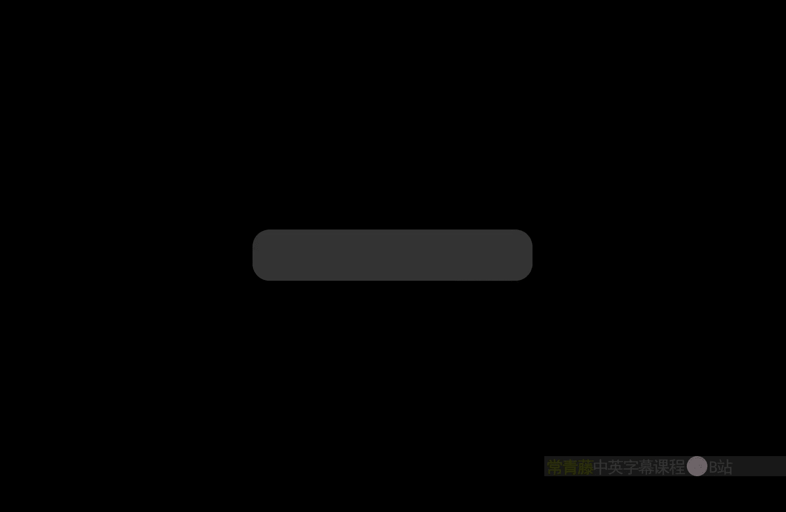
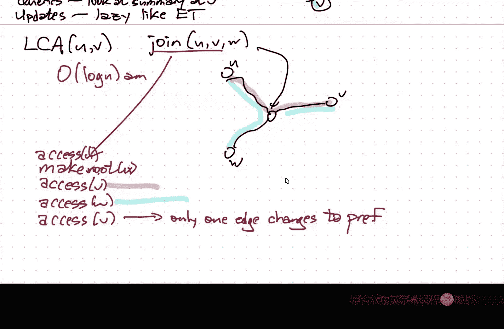

# 伊利诺伊大学【中英⚡高级数据结构｜CS598 Spring 2025, Advanced Data Structures】 p09 P9 ST树 -BV14qZYBJEZy_p9-

嗯。I'm going to try sharing my iPad wirelessly in the hopes that that will cut down in the number of times I have to。

Reconnect the cable。Because the video got cut off。Okay， so reminder。Um。Paper chase。

Is due in two weeks。I think， technically。The official deadline is two weeks from yesterday。

But I'm not going to be， it's kind of a softish deadline so。

tryry to get it in within two weeks if you can， but a few days of slack is not going to make that much difference。

嗯。I am traveling next week。So there that means。嗯。No class either Tuesday or Thursday and no office hours next Friday。

So if you want to。Talk to me in office hours about your。Paper chase。

This week is the week to do it because I won't be around next Friday and。You know。

 if things get really delayed and you get really stuck。Maybe， you know。

 you talk to me the Friday after that with the expectation that you'll finish it over the weekend。嗯。

But really。You should be。Whatever time you would normally be spending in lecture。

 you should be spending working on the paper chase。Because reading and。

Absorbing and summarizing reviewing these papers is not a trivial task。I should。

I've been doing this for a while， I would say typically it takes me。

Somewhere between two and three hours。To review a paper when I know this topic of the paper really。

 really well。And so this this is for me doing this assignment would take。You know。

 a couple hours a page。Um， so give yourself plenty of time to do it and in particular start this week。

 don't wait until the last minute。All right。Any questions about？TheThe assignment。

 the link on the course webpage is now correct， apologize for screwing that up。

So the list of papers is there。Should be visible， if it's not， please correct me。

 please raise your hand in the middle of class and say the link doesn't work if the link doesn't work。

嗯。Though everything should be ready to go。And I know at least a a couple of people have already actually started talking to me about things to look at。

 so that's good。All right。So。Last time I started talking about。Dynamic forest data structures。

And the idea is that I want to。Maintain。A。Collection。Of。Vertex disjoin trees。

And I want to be able to。Perform。Querries on the trees。

And I also want to be able to perform updates on the trees， so they're basically。啊。

Three types of operations。Cut link。This is historically called find root。

 but really what it just means is which tree am I on？Okay， so cut removes an edge from the forest。

 splitting one tree into two trees link adds an edge to the forest。

 connecting two trees into one find root， you give it a node and say which tree am I in。There are。

UmSubre operations， which could be things like， you know， find the sum， find the min， u。

 add something to， you know， where I imagine that every node in the forest has a value associated with it。

And so I want to specify a subtree， what I mean here by a subtre is when I cut an edge。

 it breaks a tree into two parts， each of those two parts is a subtree for purposes of discussion in the world of rooted trees。

 it's all descendants of note。And I want to find， say the sum of all values in one of these subtrees or the minimum of all values in one of these subtrees。

 I want to add a common value to all of the values in the subtre or I want to multiply or I just want to set the value to something or I don't know。

 maybe the values in the。In the subreaser booles and I want the and of all of them or the exclusives or of all of them。

 or I want to split all of the bits， right？But in general。

 this family of operations is consistent with what we'd earlier called a decomposable query。

 a decomposable search problem。Where I can break things up into subsets。

 compute the answer for those individual subsets， and then combine them。

And then exactly the same set of operations。For paths， so given two nodes。

 I want the minimum value of any node along that path。

 or I want the sum of the values along that path， or I want to add 75 to the values along that path。

And there are there are variants where sometimes you want the weights on the nodes。

 Sometimes you want the weights on the edges。Sometimes you want to think of the edges as being undirected。

Mostly the way I'm going to describe it。 Sometimes you want to think of the the graph as being directed and then edges between the same pair of nodes in opposite directions might have。

Weights that are one is the negation of the other， or they're completely unrelated。

There's lots of different variants。In general， I'm going to think about this as。Unrooted。Undirected。

U。Trees so just。Undirected graphs that have no cycles。嗯。And obviously， each component is connected。

And what we saw last time。Was this notion of an oiluler to a tree？Which does a。

Subre operations and structural operations。In log in amortize time。Hey， you。Imagine。

Doing an oiluler tour of the tree， stick your hand out and touch the tree with your right hand。

 walk around keeping your right hand on the tree， write down the sequence of nodes。

 or if you have values in the edges， these sequence of edges that your hand touches。

Take that sequence and store it in a binary search tree in sequence order。

And then links and cuts turn into splits and concatenations in these various euler tours and sub operations turn into interval operations。

And we started talking about。嗯。As tea trees， which are slater and T's original quote unquote。

 link cut trees。That these do path operations。And structural operations。Also in log end time。Okay。

Now。There's no global way of ordering things in a tree so that for any path。

 all those nodes along that path are adjacent， so there's a different organization。So first imagine。

Um。That we're going to assign every tree in my forest。ARoot。

 and I'll talk about in a minute how you would change the root。嗯。But for convenience。

 I just want to imagine that every tree has a root so I can talk about children and parents。嗯。And so。

Every node。Has。A。Preferred。Child。Pointer。Which could be null。

Or it could point to one of the notess children。Okay， and so every node V this。Points。Toward。

The last。Noode。啊。Accessed。In the the the。Subree。Read it at thee。系。嗯。

So I'm going to phrase everything in terms of this sort of abstract operation called access。

Where at a very high level， the only thing that access does。Is change which children are preferred？

Okay， so I start。Just to give a very。Small example here。U。If I， for example。

 decide I'm going to access this node。Then。That necessarily means that after access this path from the root to that node will be preferred。

 but none of the edges leaving from that node to its children will be preferred。Oh so。嗯。After。

Access V。All edges。On。The path。From the root。To the。Are preferred。And no edges。Touching that path。

Okay。So this is the sort of high level structure that an ST tree maintains。

Now all of the other operations， cut length， Pa queries and so on。

 they're all going to be done in terms of this access operation。He。

 now under the hood in the actual representation。Each。Preferred path。Is actually stored。

In a path tree。So this is a binary search tree of the path。Nodes。In depth order。Okay。

 so these three nodes， if this is U， V and W， then in the actual representation。

 there is some sort of binary tree。Storing those nodes in the order。

 so if you do an in order traveral of the binary tree。

 you retrieve the nodes in that path in increasing order of depth。And this happens for every。

Every preferred path。Then。If I have， say some other。Preferred path sitting over here。

And I don't know， we'll call the root of this preferred path Z。Then， yeah， there's。

There's some other path over here。And so Z is going to be the leftmost node in that path tree because it's the shallowest node on the path。

But this。Edge here that goes from the root of the path。To its parent。

 the shallowest node in the path， to its parent is going to be represented by。A path parent pointer。

And that goes from the root of the path tree。To the node representing the parents。

Of the top node of the path。So even though there's an edge from Z to U in the tree that I'm representing in the data structure。

 edge the path parent edge doesn't go out of Z goes out of the root of whatever。

Binary research tree contains C。Wait。And。In fact， you， these are actually， you know。啊。

In the usual presentation of these things， these binary search trees are play trees。

But that's not the only option that just makes the analysis simpler。系。So when I need to。Make。An edge。

Preferred。U。So this is an edge in the tree that I'm representing。

That means that if there is another preferred edge。Hanging off of that node。

 hanging off of the shallower node of the edge I want to make preferred。

 I have to make that preferred edge not be preferred anymore， which means I need to split。It's。

Path tree， I need to split that path into two smaller paths。

Which means I need to split the path tree into two smaller path trees。

So maybe the right way to say this is if I want to make an edge in tea， not。Preferred。

Then I need to split。That path tree。And if I want to make an edge。Preferred。I need to concatet。

Concatenate two Pa trees。Okay， split and conca because I'm using s trees。

 each of these things takes me u， you know， log in amortize time。Um。And so。

The overall time to access a node and therefore mark all of the edges。

Down to that node is preferred and all edges off that path is not preferred。Right。

 so very crudely the time。4。Access。A V。Is equal to。Let's see the number of non。Preferred edges。

On the path。2 v times big O login。And that's the number of non preferred edges before I did the access because after I do the access。

 every edge on that path is preferred by definition。Yes。嗯。Yes。

 so every tree in the forest that I'm representing。Is represented by。A collection of s trees。

Connected by path parent pointers。Now the same node might be the target of an arbitrary number of path parent pointers。

 so the representation， each ST tree is not a binary tree。There are no bounds on the degree at all。

 you should really just think of it as a collection of display trees that are connected by these dotted arrow path parent pointers。

but。When I am。Sort of accessing a node。The way I actually do that is I just start with my finger pointing directly at the node in the ST tree representing V。

And then I splay that up to the root， and then I find a path parent pointer。

 which I now need to convert into a real child pointer。And then I convert that。

 I connect these two sp trees， and then I continue spplaying upwards。

 and then I connect two spplay trees and then continueplaying upwards。So in the end。嗯。

The number of non preferred edges on the path is the thing that determines。At a very broad scale。

 the running time of the operation。诶。This is where we left off on Thursday。

 so before I go on from here I need to make sure that people have questions before I refine the analysis so eventually this is going to collapse down to just log in。

Through amortization tricks。Okay。So。The first thing。The first trick that I want to。啊。

The first trick that I want to do is argue that it's actually not the number of preferred child pointers times big O of log N。

And I'll just for。You know， sanity， I'll put big Os here。

I really want to claim that that times is a plus。Okay。And。So this is going to rely。

If you remember on there's this thing called the axis Limma。For splay trees。

 which says that the amortized cost， the amortized time for displaying。A node in display tree。

Is at most one plus。The new rank。Of the sorry minus the old rank。V where rank。

Is defined to be the log of the size。And size is defined to be the sum over all descendants of the weight associated with W Now this weight is not something that's actually stored in the data structure。

 this is something that's assigned purely for analysis。So I get to decide what my weight is。

Different assignments of weight are going to lead to different definitions of size and therefore different definitions of rank。

 and therefore by the axis limitmma， different amortized time bounds。

So this is one of the things that is sometimes difficult to remember about amortized analysis。

 there is no such thing as the amortized time， the way there is the worst case running time。

 different ways of distributing the work among different operations and time lead to different amortized time bounds。

And so these different amortized timeouts can all be true simultaneously。

 but different bounds basically just give you different ways of looking at the execution behavior of the data structure。

Okay。So I'm going to define。TheThe weight of W。To be。The number of descendants。Of W in the ST tree。

But not。In whatever path tree contains W。So in particular， in this example here。嗯。The weight of。see。

 I need to。Sorry， sorry。I've got this slightly wrong right so this is going to be。嗯。

Sort of the number of nodes。In all。啊。Poth trees。connectedect。To W by a。Path， parent。Pointer。

So if I look， for example， at this picture up here with these seven nodes。

 the weight of v is just one。There are no path parent pointers going into V。

So I'm just counting V itself。the weight of you， on the other hand， is5s。

One for you itself and then four for that green path tree that's pointing into you and if there were other things。

 say there were another path tree with its PowerPoer pointing into Z。

 that size of that other path tree would contribute to size of U。Or the weight of view。

so anything hanging off of a node where the last step to getting to that node as a path parent pointer counts towards the weight of that node。

Yes。Including itself。Yeah， including itself。Is play trees and。

I there anyion from your weight arbitrarily hammerOkay， so this is a good question。

 what prevents you from making the weights arbitrarily small？And therefore。

 making the amortized time arbitrarily small。So let's look carefully at。TheRemember。

 ranks are logs of size。So a difference in ranks is a difference in logs。

it's really the log of the ratio between the old size and the new size and the old size。

So if you scale everything， that ratio doesn't change。So there's no sort of global way to， oh。

 just make of the way it's all really small， that in the end doesn't have any effect。Because rather。

 it has the same effect on both the old and new rank and so the effect cancels out。嗯。Sorry。

 I also realized。There's a factor of three in here。Um。

The one restriction is the weight must be greater than zero。

Because otherwise you might define the rank as log of the size might be zero and then the rank's not really well defined。

 which is why I'm including the node itself in its own size calculation。ok。Well， if I do that， then。

Let's think about what happens in。Okay， so here is。三。Sorry。Here is some。Pass。That I want to。

Do an access on。And I want to access this node here。Okay so I've got。One， two， three。

 four preferred paths。On way that I need to traverse on the way to my target node V。

 so that means I need to make this edge preferred， I need to make this edge preferred。

 I need to make this edge preferred， I need to make that edge not preferred。😡。

And if there's some other edge hanging off here that used to be preferred。

 then those are no longer preferred。Okay， so I potentially need in this instance， I need to do。4。

Spplay tree splits。And three s tree joints。Now in the ST tree。Okay， there's some s tree leading。

 you know， the here's the root。Actually， I don't know that's the root。

 but it's going to go down to whatever this note is， it's called this you。And then there's some。

Poiner to another。Noode。And go down here to V。啊。And。Okay， so。Now U V， W， and let's call it the X。

Okay。So in the ST tree is I walk up from X。I follow a path from X to the root of its。Path tree。

 then cross a parent path pointer to a noW， then walk up to the root of Vitz Pa tree and so on until I get all the way up to the root of the Huest tree。

Now。Everything' really is going to be dominated by the cost of displaying X。

Connecting it to W as a new child， then displaying X again。

And then connecting it to V as a new child and thening X again。

And then connecting it to use a new child and thening X again。So。What I'm going to get is。These。

Spplay operations。But now here， this is going to cost me one plus。

 let's I'm going to say rank zero of x minus3 rank one of x。

 the subscript is how many displayplays have I already done so far yeah？要0哎呀。对 so3点。In the end。

 x is going to end up at the root of the whole thing。I accessed X。So I really want X right there。

At the root right， so I'm being a little bit fast and loose here because I'm saying that the overall time is going to be dominated by displaying X over and over and over again。

But you'll notice I had to do a cut on the path tree containing W before I did the join。

 So I'm really doing a sp at W。And then connecting X and doing display at X。But the。The overall。

 you know， up to some。Lower order terms。Sorry。The running time is going to be bounded by this telescoping sum。

And the reason why。Like I'm using the same symbol for rank one of x here and rank one of x there。

Is when I've defined the size and therefore the rank of a node。

In precisely the correct way that when I join X to W as a new child。The ranks don't change。

Where the sizes don't change。嗯。And so instead of saying， well， yeah。

 each of these four bounds is at most log n。But in fact。They， you know。

 most of the stuff cancels out。And so what I'm left with is just。This bunch of one pluses， right。

 So this is the the number of。Path three that I need to diverse。

And then there's three times the new rank of x， well， at the end of the operation， x is the root。

So its rank is。嗯。Just the size of the hole。Its upree。And well， this negative part I can remove。

So I end up with just this。ok。Now I'm wearing big O glasses when I'm doing this。

 so all of those things when I say it's dominated by that I mean up to constant factors。

 so I really should be putting a big O around here。

But this is what I claimed earlier that the crude analysis is for every pathway that I need to traverse。

 I' need to spend log in amortize time， and so I multiply those two terms。

 but because of the way the access limit works，U。啊。The I end up getting the telescoping sum。

 which means I actually only get one log in the end。Good。Okay。😊，じや。The brand final rank that。

It's很 people want。Okay， so the weight。Of a node is the number of nodes in the whole structure that are ultimately connected by a path parent pointer。

 the size of the top。Pas tree。Is the sum of all of those weights？

Which means it's the number of nodes in the whole cluster。The whole collection of Pa reads。

Because every path tree is going to be connected to some node in this top。

Path tree eventually where the last step is a path PowerPoer。So the size of x。

 when x is the root of the ST tree is exactly n。So the rank is exactly log in， now that's it。Okay。

 great。嗯。So。The second trick。Is that。Is to show that the amortized。Number of path trees。

That I need to tra is only constant。Now， it's possible in the worst case that doing a single access。

We'll have to actually touch。A linear number of path trees。 So， for example。

 if the tree that I'm representing。Is literally just a path， just a linked list。

And all of the preferred child pointers are no。And then I say， access the leaf。

Then I'm going to have to do a linear number of joint operations to connect all these things up and to sew them all up into a single path tree。

 so in the worst case I absolutely can't say this， but again I'm not really worried about the behavior。

Of one operation， I'm really worried about the overall running time。Of in particular。

 a long sequence。Of these operations。So。All right。So the way that I'm going to do this。嗯。

So I'm going to say， okay。The number of。Preferred。Poiner changes。

This is the thing that I want to analyze and ultimately what I want to do is analyze the total of this quantity summed over all operations that I need to perform。

系。嗯。Okay， so。呃。Forgiven。Yeah， so。I need to， yeah， so the claim。Is that the amortized。

Number of preferred child plans is changes is order one。嗯。So this analysis relies。On。

Something called a heavy light decomposition。Now。What I said at the beginning was I started talking about dynamic forest and saying the language is confusing because I have to be very careful to distinguish between the tree that I'm representing。

The abstract mathematical object that the user thinks they're manipulating and the tree data structure that I'm using to represent it。

😡，The same thing happens here。So the data structure is based on a partition of the nodes in the represented tree into paths。

The heavy light decomposition is a different decomposition of the nodes of the represented tree。

Into paths。It's not the one that's used to define preferred paths。 It's something else。 Okay。

 so I'm going to say that an edge。From。It's a parent you to child V in this represented tree。

Is heavy。If。The size of the subt。Rooted at V is at is actually strictly greater than half。

The size of the subt rooted at you。Now。Again， I'm overloading the word size here。

 this is size as the rooted subt of T， this is not size of some subt in the data structure。

 this is in the abstract tree。So it just means the number of descendants。Of the or U。In the tree。

Okay。And so just like I can say， I have a preferred child， every node has at most one heavy child。

If I have a million nodes in my subtre and that child over there has 700，000 nodes in its subre。

 then that is my heavy child and I can have it most one。Because I can't have two children。

 the sets of descendants are disjoint， they can't both be a majority。Every。Every node。Has。

At most one of the。Child。Now， why on earth do I want to do this？嗯。Ultimately。

 I'm going to treat heavy edges and light edges differently in the analysis。

And the reason that I can do this。I there's a simple， simple claim it's easy to solve， easy to prove。

Any。Root。To leaf。Paath。In T has at most log n light。Edges。Okay。U。Because。If if I think in my head。

 whenever， okay， I'm going to walk down this abstract treaty that I'm representing。

 starting at the root。And at all times， I imagine that the size of the sub rooted that node。

 the number of descendants is written on the node。So whenever I step from a node to one of its light children。

That number drops by at least a factor of two。But at the beginning， it's end。

And it's always a positive integer。So the number of times that I can start at in。

 number of times I can drop by a factory of two before I run out of integer is at most log n， right。

Proof。This is basically the definitions of light。And。冇gan。Okay。

 log ends the number of times I can divide starting to then divide by two until I get to some number less than one。

嗯。Okay。Now again， this is not the same decomposition as the preferred path decomposition that we're using to define the data structure。

 it's a different decomposition into paths。It's possible that there is not a single node in the entire tree。

That has a heavy child， so if the tree is perfectly balanced。Then， in fact。

 none of the edges are heavy。That's fine in that case。

 the number of edges on the root to leaf fat is log in because the tree is balanced。

Every edge being light， that's still consistent with this claim。

 but even if the trees really unbalanced。I'm only ever going to need to on any path。

 need to traverse log n light edges， and so it's the heavy edges that I really care about。Okay， so。

The number of。I'm going to write it as。The number of edges that become preferred。This is。

This is sort of the dominating term in the analysis。 So when I do an access。

There is one preferred child pointer at the very bottom that I set to null。

 And so that's that that's a case where。U。There might be a preferred edge before and there's not after。

So there's a kind of a plus one hiding in there， but every other time that I change an edge from being not preferred to preferred。

 it's because I'm jumping from one tree to the next。

so it's always everything's going to be dominated by the number of edges that I make preferred。

That weren't preferred before。Okay。Well。This is the number of light edges。That I make preferred。Plus。

The number of heavy edges。That I make preferred。Now every edge that I make preferred is on the access path。

 it's on the path from the root to the node that I access， and so I know this is at most login。

So the only thing I actually care about。Is the number of heavy edges that I make preferred。Now。

 as long as I don't do any linkss or cuts， again， I want to emphasize this as long as I don't change the structure of the tree。

Whether an edge is heavier light is fixed， accesses don't change whether an edge is heavier light。

Changes whether it's preferred or not preferred， so maybe I should now emphasize this edges。

Of tea can be either。Heavy。Or light。And independently。Either。Preferred。Or not。

So there are four types of edges。Okay， so I want to know really how many edges do I make。

 heavy edges do I make preferred？But now。If I look at the sum over all accesses。

Of the number of heavy edges。That I make preferred。This is， well， every edge。

 every edge that I make preferred。Almost all of those edges are later but going to become not preferred again。

Except for whatever edges are heavy heavy and preferred at the very end。

So I can write this as the sum over all accesses。Of the number of heavy edges that become not preferred。

Plus n minus1。Okay， so。There are n minus1 cases at most when a heavy edge becomes preferred and stays preferred until the end of time。

Because at the end of time， there are most n minus1 heavy preferred edges。

 because at the end of time， there are most n minus1 edges。

Every other time I make a heavy edge preferred， it's later going to be made not preferred again。系。So。

 really。This is the quantity。That I want to analyze。

RightSo this is where I'm doing the amortization trick is through the summation。 I'm saying。

 I want to amortize the number of heavy edges that become preferred。

And I'm going to do that basically by charging every one of those changes to。

future operation where it becomes not preferredver again。

And now I just need to know how many heavy edges become not preferred。嗯。But now。呃。Think about this。

How many heavy edges become not preferred？When I do an access。Okay， so the number of heavy。Not。

Preferred。Well。It's possible that the node that I'm accessing has a heavy preferred edge coming off of it。

Which then becomes a heavy not preferred edge coming off of it because the node I access at the end of the access doesn't have any preferred children。

Okay， so I need to add one for that possibility， the node I access had a heavy preferred child and now doesn't anymore because it doesn't have any preferred children at all。

Every other time that a heavy edge becomes not preferred。

 it's because that heavy edge is hanging off of the access path。It's not。

 it becomes not preferred because I notice it's not on the access path。

But then the edge that is on the access path。Becomes preferred and that edge is light。

So whenever a heavy edge becomes not preferred， either it's the very last heavy edge hanging off the end of the access path or some other light edge becomes preferred。

But I know there' at most。Login。Light edges。On the access path before I do the access。

So this is at most one plus login。Okay。No。Um。What about？Cut。Now。

 CAD is a little bit more complicated than an access。

Cut is a structural change to the tree that I'm representing now cut always when I cut an edge。

 I start by accessing the parent end of that edge and so I I'm already going to count that in the access part of that I've already analyzed。

 but then I'm going to remove this edge from my represented forest。Now。Nodes on that excess path。

When I remove this might change。From heavy to bite。ok。So。嗯。So， now。啊。No， sorry。Some。Edges。

On the access path。Change from heavy to light。Because they used to have more size and now they don't。

嗯。It's also possible that some edges off the access path。Change from light to heavy。

So I removed some stuff hanging off of my left arm。

Which means now it's possible that my right arm is holding most of my descendscentant。系。嗯。Okay。

 so let's think about what we're counting here。Is counting。Preferred edges that stopped being heavy。

Right， so this is， this is a change in。I should really think of this as。The number of。Edges。

That stop。Being。Both。Preferred。And heavy。It's not that the heavy edge became non preferred。

's that a preferred edge became light。It still goes into the analysis in essentially the same way。

And so but now it becomes a light edge on the access path and well I know therere only log n light edges on any path。

 so this is the most log n。And when I change things from light to heavy。

 that's not an edge that's ceasing to be heavy。So it actually doesn't count towards the analysis at all。

In other words， I've already paid for it somewhere else。In the analysis。U。And then finally。

 if I want to do a link。Then。Some edges。On the path， the access path。Go from light to heavy。

And some edges off the path。Go from heavy。To light。But neither of these。

Contributes to the number of edges that not being preferred and heavy。

 So the first thing things that are going from light to heavy。

 That's a preferred edge becoming heavy， not a preferred edge ceasing to be heavy。

And the other ones are non preferred edges， so I don't really care。

So these things actually contribute nothing to the amortized analysis。

 the extra amortized cost of a link is actually zero。So in access。By looking at。

The change in the number of heavy preferred edges。An access has amortized that number changes in an amortized sense by most log n。

For a cut， it changes by most log n and for a link， it doesn't change at all。Again。

 in an amortized sense。Okay， so this is all going to。嗯。You know， the summary is you know。

 this thing here， this term that I had in the amortized analysis。嗯。

This is the number of edges that changed from preferred to not preferred。For an access。

 and you could also add in edges that chain that are either inserted or deleted from T。

 but regardless of which operation you're performing。I said amortize BigO of one that was incorrect。

It's the right way to think of it because I already have a login sitting next to it。

 but it's actually amortized login。Okay， so in an amortized sense。

 the status of only log n changes the log n edges changes whenever I do any operation in one of these ST trees。

Yes。Ps。so people in。Yes， that's supposed to be login。Okay， so this is the， you know。

 the three kinds of operations that I want to perform。Access big of log， cut big O login link。Well。

 it are not counting the access that you need to do on each of those nodes before you linked them together。

 no additional cost， yeah。I but there should be something over。Yes， that is absolutely correct right。

 so this really should be operations not just accesses。

Acceses change which edges are preferred or not。Links and cuts change which edges are heavier light。

And I need to consider both of those in the summit。O。So。This is most of。The analysis of ST T trees。

There's still a couple of details that I need to fill in。In particular。

 I need to deal with the fact that。呃。When I talked originally about the kinds of operations that we want to perform。

I talked about just unrooted， unordered three trees。

But now I've phrased everything in terms of these rooted trees。系。

So I need to spend a little bit of time talking about how to deal with the roots。嗯。Okay， so。

You know so in。Generically。I'm going to have operations that look like this， I pass in two nodes。

That belonged to the same tree。And I want to do something。

 I want to get retrieve some information about the path between those two pets。Now， now let's just。

Let's say the abstract。reree。T is unrooted。But。The data structure assumes the tree is rooted。

 so I'm going to for the convenience of building the data structure， choose anode to be the root。

So the way that this path query is going to work is basically first。呃。I'm going to。Access。You。

And then I'm going to make you the root。And then I'm going to access V and then everything that at this point that I want to be。

You know， all the nodes that are on the path between U and V are going to be collected into one nice rooted sub inside。

The display tree at the top of the ST tree。And so I'll just need to look at the summary information at the root of that path tree。

And maybe do a constant more operations， but make roots。Is the。

The part that I still need to define here。And so let's。Imagine， okay， here here I've defined。

Before I did this operation， the route is somewhere else。嗯。Here's you。Here's V， and of course。

 there's all sorts of other stuff hanging off。Now， when I access you。After I've done that。

This entire path going from the root down to you is preferred。And in particular， that means。In。

The data structure。There is a s tree。That has。R as its leftmost node and U as its rightmost node。

 and I don't know， maybe this is node t， so somewhere else there's a T and。

There's another path tree here and maybe know somewhere down here as V。Right。But at the root。

This path tree。Represents this preferred path。嗯。In depth order。

 so this order from left to right is the same as that order from top down。

All of the other edges in the tree， let's just think of them as being pointed towards the root。呃。

Just not that it really matters， but but just to I need to。Sandra one way or the other。嗯。Actually。

 you know what？I'm sorry， I think it makes more sense to have them point downwards。

 so increasing depth。So this corresponds to the order along that path corresponds to the sortded order within that tree。

Now， if I want to make you the root。The way I do that。As。To make。You the root。I reverse。path。

From the existing route。To you。Okay， so I just say， oh， okay。

 I'm just going to reverse all these edges。And I guess I'll set the root pointer here。

Now it is still the case after I've done that one path reversal。

That all edges are pointed away from now the new root U。

 and even if I've got other stuff not not just hanging off of T。

 but but hanging off of U or hanging off of R， all those other edges are still pointed the right direction。

Away from the root。Okay， the only edges that have changed direction when I change what finger I point。

 you know， what node I put my finger on and say， this is the root node are the edges along that path。

Well， I've conveniently collected。All of the nodes along that path into a sp tree in order by depth。

And so now I want to reverse the order of that depth。So now finally。

 we get to the mythical interview question， how do you invert binary tree？

So this is set the reverse bit。In the top path tree。So this now goes reversed。

And then lazily update it。So。呃。If for any other reason。I need to。Touched the root node。

I will first say out is the reverse bit set and if it is。

 then I'll swap the left and right child pointers， toggle the bit at that node。

 toggle the bit at its right child， toggle the bit at its soft child。

And so as far as any other binary tree operations is concerned。I actually did reverse the tree。

So the actual work is only done at the very last minute when I need it。

so this is just lazy propagation exactly the way that I described for oiler to trees for the way you would say update this all the you know add five to all the nodes in the subte you would say。

 oh， right， so reverse this path。Reverse is just another operation that I do on pads lazily。

Because the path is represented in a tree。 so in particular。

 I might at some future point decide I need to split。That tree， when I do。

 I first need to walk up the path through the tree and then walk back down again。

Clearing all the reverse bits to make sure things are on the right sides before I splay back up and actually do the split。

But this extra up and down is only going to add a constant factor to the time。对。so。啊。You know。

 the accesses。These take log in amortize time。By our earlier analysis。When I make a new node。

 the root， I am changing which edges along that path。😡，Are heavy versus light。

Because now the notion of what a descended is has changed。

 so some edges off the path that used to be heavy might be light and vice versa。

 some edges on the path that used to be light might be heavy in vice versa。

 but essentially the same amortized analysis shows the number of edges that on the path that go from being heavy to light。

Is it most log n and that dominates the amortized cost of doing the reversal？

The cost of the actual worst case cost of updating the data structure is constant。

But because of the changes in heavy and light edges。

 the amortized cost of reversing that path is log n。So。

Welcome to the counterintuitive world of amortized Ana。

The data structure is literally said a bit done， but you have to pay log n in potentially when you do that to pay for changes in heavy light label intervention interventions。

Right so。Again， this is log in En time。Now when I want to do。This。啊。Okay。

 so that's making something a root。But now after I've done the know， make you the root。And then。

Access V。Then at the end of that。嗯觉得。Duplicate。Right at the end of that。Sorry， let me u。

Adjust my picture a little bit here。Okay， so。First。I make you the root。

Now all these edges are pointed this way。Then I access V。Accessing V is going to make。

All of these edges。Preferred。So now the path from U to V is stored in a。Stored in a path tree。

Where U is going to be the leftmost node in this tree， and V is going to be the rightmost node。

 but the last step of accessing the node is actually displaying that node to the root。Of。

It's path tree。So。So the root of the path3 is not necessarily the root of T。

It's just whatever happens to be the last thing it was played。U。But now。If， for example。

 I want to know the sum of the weights。Along this path。

 that's the same as asking for the sum of the weights in this path tree。

 and so as long as every node in the path tree keeps track of the sum of the weights of its descendants in its path tree。

Then I just look it up at V。Look up the answer at V。 If I want to do a path a。

 I want to add7 to every node along this path。Then I recorded every node a value that I want to add to all of my descendants。

 and I just write that value at V， and again I need to lazily update whenever I need to do anything in this path tree。

 first I need to clear all of the lazy operations that I haven't performed along whatever the new search path in that sp tree is。

Okay。So after doing this。Querries。You look。At the sort of summary information。Stored at V updates。

A sort of lazy。Just like。Oer for trees。And so that is all the， you know， add things along the path。

 find the maxle along the path， negate everything along the path。

 same the same lazy update strategy at the end result of doing that。啊。

Access finder access is that that entire path is now collected into a subte of the ST tree。

 It's not a subt hanging off the bottom， but rather it's a subt touching the root。有。I yeah sorry啊。

So sorry， yeah， each know。data structure is going to store the information about kind tree Yes。

 every every node is going to store information about its descendants in its path tree。

 not its descendants in the whole structure。大方。嗯。可。That's correct。

 so every node in a path tree corresponds to an interval in some preferred path。

But when we actually do the queries， we just arranged for that node to be the root of the path three so represents the entire path。

Byice play。I think there was another question over here。Or somebody was stretching。Okay。All right。Um。

The last thing I want to mention is。You can also do least common ancestor queries。So if tree。

 if the tree does have a root。What you're asking is given two nodes。

 what is the least common ancestor of those two nodes in T if you don't want。啊。

To think about rooted trees， the equivalent operation is doesn't necessarily have a have a。

A standard name， but I think join is a reasonable word what this means is。So I've got three nodes。

Sttored in my tree and。The unique path from U to V。

 the unique path from V to W and the unique path from W to U have exactly one node in common。

That's this note here。嗯。You can think of it as make W the root and then ask for the least common ancestor of U and B。

Um。This can also be done in。Log in amortize time。So I'll do join here。嗯。Access you， make root you。

UAccess V。Access。W。And then one more access the now why am I flopping back and forth like this？Okay。

 so when I make you the root， and I access V。Then at that point。This path is preferred。

Then when I access W。So this is after access V， after I access W， this path is preferred。

And so is most of this path。Because I only change the I do change one preferred pointer hanging off of the node that I'm looking for。

And so the next time I access V， exactly one edge will change from not preferred to preferred。

And the parent end of that edge is the node I'm looking for。The other way， actually。

 I could also say I don't care about the last XV， what I actually care about is what's the edge closest to you that changed from preferred to not preferred。

So it's not exactly a black box。But。嗯。So you do have to open the black box a little bit understand how the data structure works。

But it's a relatively mild。Absstruction。It's a abstraction violation。嗯。嗯。Okay。Next time。

I will start talking about applications of。These dynamic forest things where all of these operations that I talked about actually show up。

And we'll see where we go from there that's probably going to take me。A few more lectures。

 so the one I want to talk about tomorrow。I involves shortest paths and planar graphs。

So I'll need to spend a little bit of time talking about planar graphs and then after I get back from60 I'll talk about other。

Kinds of questions about dynamic graphs， not just dynamic trees。

But the way those data structures work is they maintain a spanning tree of the graph。

Using this data structure as a foundation。Right。Okay， I'm happy to answer questions briefly up front。

 but we're out of time， thank you。

