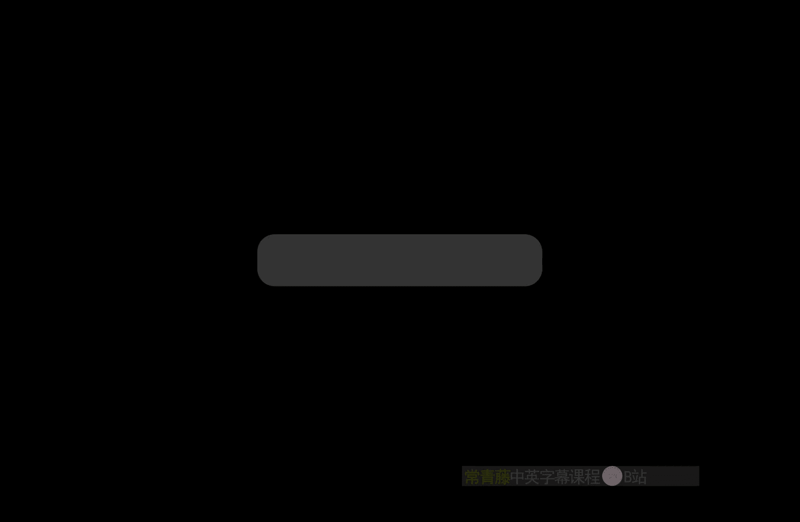
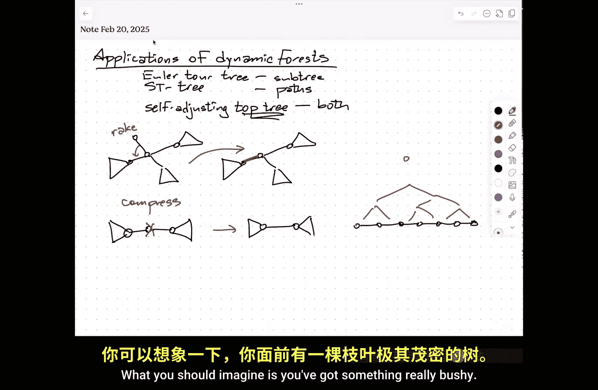
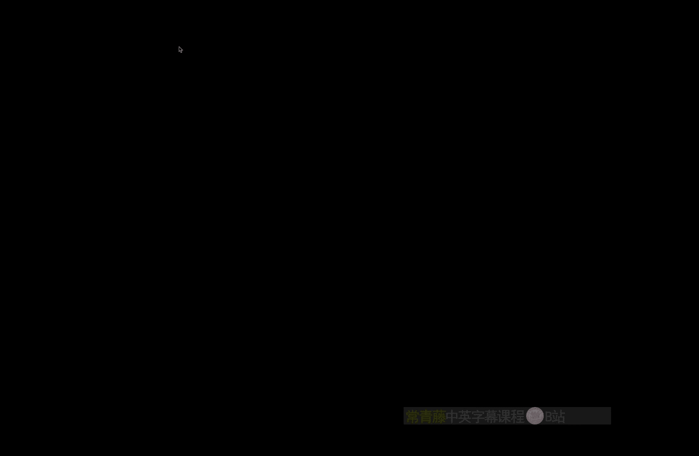
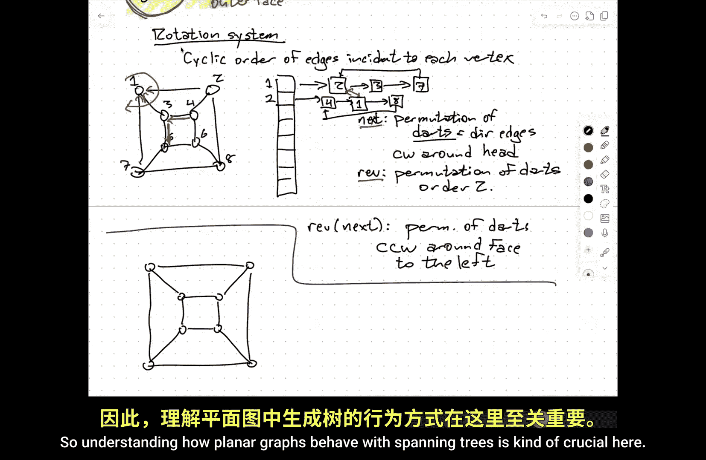
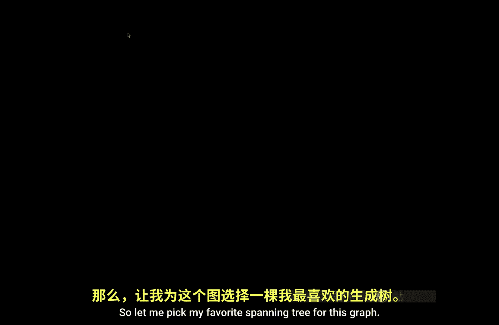
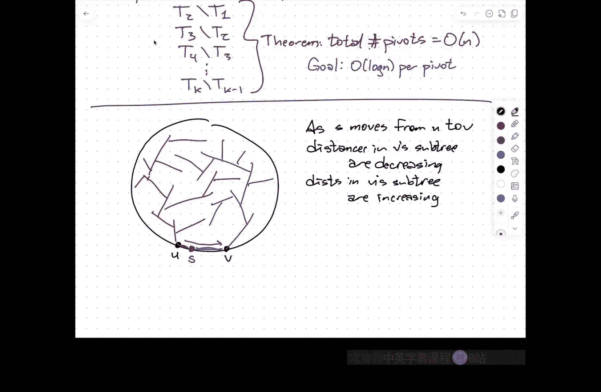
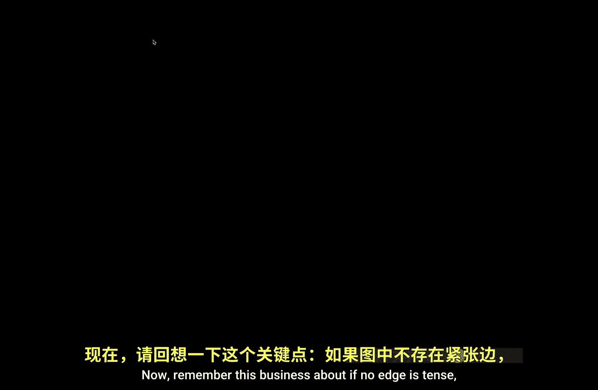
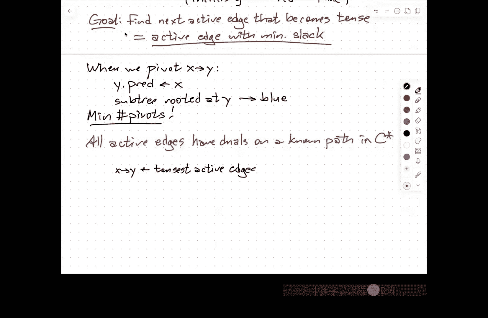
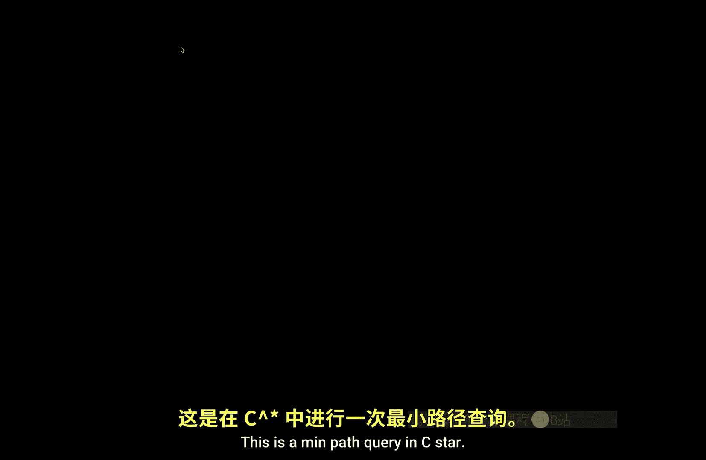
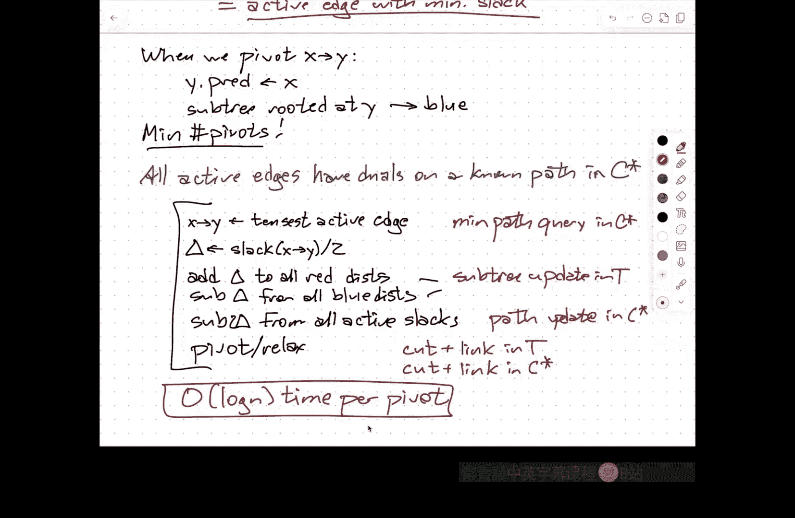

# 伊利诺伊大学【中英⚡高级数据结构｜CS598 Spring 2025, Advanced Data Structures】 p10 P10 多源最短路径 -BV14qZYBJEZy_p10-

Ang。Just want to remind everyone that there'll be no lectures next Tuesday or Thursday because I will be in Pittsburgh。

And also no office hours next Friday。So I am having office hours。This Friday。

 that would be a good time to come talk with me。If you have。Questions about the paper chase。

I have a little bit more time after class today than I do on Tuesday。

 so I can also stick around and answer questions after the lecture。U。Okay， so。What？We。

Talked about in the last couple of lectures。Is a couple of data structures to maintain dynamic forests？

So the idea is that I want my data structure to represent。Collection of vertex disin trees。

I want to be able to connect these trees with new edges。

 I want to be able to take edges out to break trees into smaller trees。

And I want to be able to ask questions about。And update information in。Subrees。

 if you imagine that every one of these trees has a root。Thenhen I might ask， you。

 point a node and say，how the maximum value among all the nodes in your better descendants。

Or about pads， I pointed an ode and asked， tell me the maximum value among all of your ancestors。嗯。

And so， we had。One data structure。Based on oiluler tours。That did sub stuff。We had another。嗯。呃。

Data structure， based on。Keeping a decomposition of each tree into vertex disjoint pads and representing each of those pads in a balanced binary search tree that could effectively deal with。

Path queries and path updates。Um the。I'm not going to talk about this in any detail。But sort of the。

State of the art。In dynamic forest data structures is something called a self adjusting top tree。

This can handle both。So it can handle both subt operations， either queries or updates。

 and it can handle path operations， either queries or updates。And。At a very， very， very high level。

The way self adjusting top trees are organized。Is。I。Simplified the tree。

 I imagine simplifying the tree by getting rid of vertices that have either degree one or degree two。

And I do this over and over and over again。 And this history of the way that I simplify my tree。

Is easy to encode in a tree data structure where different levels of the tree correspond to different levels of resolution for the the simplification of the tree so the two operations。

That。嗯。You can imagine。One is called。A rake。This is a ra operation is the way you get rid of leaves。

So the way that self-adjusting top trees are presented。

 you imagine that there's a cyclic order to the edges incident to each vertex。

 which is what you would normally get if you'd say drew the tree in the plane。

the coordinates of the vertices would naturally define a counterclockwise order at each of the vertices。

 so what a ra operation does。Is it merges。An edge leading to a degree one vertex。Into the vertex。

 the next edge andcyclic order。So the result of this rake operation。Would be。Everything that's not。系。

So this is R。So that edge kind of just got absorbed into here。The other operation is called compress。

And here is you're getting rid of。A degree two vertex。So I'm compressing。This vertex away。

And what the end result of that will be is I replace my path of length two with a path of length one。

So the idea is you choose an independent set of edges in your tree and that can either be raked or compressed and you perform those operations。

And this simplifies the tree， and you keep a record of all this simplification。

 you get this hierarchy of smaller and smaller trees eventually leading up to just a single edge。

The history of that simplification is called a top tree。Top here is short for topology。

But what it effectively means is， so I want you to imagine if I'm just the tree that I'm representing is just a long path of degree2 vertices。

What this would mean。Is you know， so any long path。You would essentially have a tree。

That sort of encodes these edges being merged together。

And this is exactly a balanced binary tree over the path in the same sense that S trees。

Represent paths by balanced binary research trees。An in order traversal of that binary tree is the same as a left to right traversal of the pad。

U。For rakes。What you should imagine is。You've got。Sorry。You've got something。Really bush shape me。

Now， I want this to be black。I want this to work。Um that。

You know， a high degree vertex。嗯。With lots of degree1 vertices。And again， when you。

 when you say the at the first level， I take these。

Edges and I ra them to their their neighbors is essentially merging these pairs of edges into a single edge and so again i'm representing。

The history of all of the rakes I can represent as。A binary search tree where again。

 the in order traversal of that binary tree is the same as the cyclic order of those leaves。

And so ultimately， what a top tree is。Is a collection of rake trees and compressed trees。

That are all glued together kind of all in an alternating fashion into a large rooted tree data structure。

 self adjusting thats that's a mnemonic for the fact that the way that you collapse these things either by raking or compressing。

You've got choices， and so which binary tree you use to represent a collection of rakes versus or a collection of compresses。

 you can change by doing rotations and then under the hood。

 it is actually composed out of a bunch of s trees。First which are self adjusting。

But there's structures internally that represent。The rake trees kind of help you take care of subtree things。

And the compressed trees help you take care of path things so it all gets glued together into a single data structure。

That's as much as I want to talk about top trees。The the paper is actually fairly approachable if you're sort of comfortable with。

If you're already comfortable with ST trees， then reading the， it's a very well written paper。

 I think， so it's worth looking at if you're curious about the details。U。But the point is。

All of the operations that I talked about over the last two lectures。

 this one data structure can handle in log n amortize time。Now。

 one of the unfortunate things about this is this is a fairly complicated data structure。

 all of these， na， oiler sure is not so bad。But all of these are fairly complicated things。And。

They really only actually start to make sense。When you have trees that have at least a few tens of thousands。

Of vertices。So there are experimental results that say， you know， in practice。

Just if you want to know what's in this tree， just traverse the tree。

 if you want to know what's on the path， just traverse the path。

And unless you're doing very large graphs。Very large trees。

Brte force linear time with a small constant in the O is going to beat these logarithmic things with fairly large constants in the amtd Big O。

But from a theoretical standpoint。This is what you want。系。

I'm going to take my fake practitioner hat off now and just be a theoretician。U so。

First application that I want to talk about， that's probably going to take me entire her lecture。Is。

D。😔，Multiple source。Shortest path problem。And this is specifically for planar graphs。Now。

 this is going to require。A little bit of a tangent。

Because I need to tell you a few things about planar graphs。

I'm also going to have to remind you a little bit about how shortest path algorithms work in the sort of generic sense。

嗯。But I think if you've had 374 or 473， especially if you've taken it from me。

ThisThis should just be reviewed， but the planar graph stuff people have seen in some detail。

 but not not necessarily things I need to show so let's just start with some basic definitions。Um so。

APar graph。Means that it's possible to represent the graph。By。

Having the vertices be distinct points in the plane。And the edges being line segments。

Connecting those points。And these are all。Interior disjoint。So for example， if I wanted to draw。

Graph of the cube。I could do it like this。Okay。I deliberately skewed it。Doesn't have to be skewed。

So this is a graph that has eight vertices and 12 edges。

 it's a planar graph because I can draw it in the plane without any of the edges crossing except edges that share endpoints obviously intersected those endpoints。

So interior dis joint just means they don't cross like this。

 I don't have a vertex in the middle of an edge anywhere， things like that。嗯。No。嗯。

I'm going to play a little bit fast and loose here by not really distinguishing between the planar graph and its embedding in the plane。

So technically， a planer graph is just something that has a planer drawing like this。Um。

But it turns out if the graph is sufficiently interconnected， if it's three connecteded。

 then the embedding is in a formal sense unique， so I'm not really going to distinguish between the drawing and the graph itself。

ForFor this lecture。Right， so。Um，Drawing。Divdes。The plane up into regions。That are。Called the faces。

Of the graph G。系。In particular， there is assuming I've really embedded this。

In the plane and not on the sphere， there is one faces。One face called the outer face。

That is unbounded， goes out to infinity。Every other face is the interior of a polygon。

The outer face is the exterior of a polygon。Topologically， it's a disc。Hey。Now。

Every planer embedding like this。You could define another graph called the dual graph。

Which is usually denoted G star。So it has vertices V star and edges e star。

These star are the dual vertices。Are the faces of the original graphs？And。Well。

 E star is actually the same as E， so what I mean is in the dual graph there is a vertex。

For each face。Including the outer face。And if two faces share an edge in G。

Then they are connected by an edge in G prime。So。Here are the edges。Of the。A。

The dual graph now I am not drawing these edges as as straight line segments。So there's a theorem。

 which I won't prove。That says， if you can draw a graph。A simple graph using in the plane。

 using curves as edges， then you can also draw it。Using straight line segments as such as。

 you just might need to move the vertices around。If you're used to thinking about ponic solids。

if G is the graph of the cube， then G star is the graph of a regular octahedron。

 so the duel of a six sided die is an eight sided dye。嗯。So this is another。Plain your graph。

 it also splits up the plane into regions， so the dual graph has faces and every one of those faces contains exactly one vertex。

Of the original graph G。So the dual faces。Are the vertices of my original graph。

And the duall of the duel of G。Is not necessarily the same drawing。

 but a topologically equivalent drawing of the original graph G duality is an in， It's like you know。

The original graph is normal Spock。The dual graph is evil Spock with a beard。嗯。

Most of you weren't alive when that happened， so there's probably some some next generation or deep space9 equivalent of parallel universes。

嗯。But these things go back and forth。And there's a very real sense that if you have an appropriate data structure for G。

 that can be interpreted as an appropriate data structure for G star。Okay。

 so just a little bit about。嗯。How these things are actually represented。

So the formal mathematical buzzword here is rotation system。

 the idea is that I keep the cyclic order。Of edges。Incident。To each。Vertex。嗯。

In terms of data structures， remember the textbook standard data structure for representing any graph is something called an adjacency list。

 you have an array with one entry per vertex that contains a pointer to a linked list of that vertices neighbors。

That vertex his neighbors。In a normal adjacency list， the ordering within the list doesn't matter。

If it does matter， you've given yourself a rotation system。

And so when you're representing the planar graph， you actually do care about the order that things show up around a vertex。

 So if again， I。Draw myself as。A simple planar graph。And I name a label these vertices。

For indexing purposes， then my rotation system。Or my adjacency list， so vertex1 would have a list。呃。

Traditionally this is done clockwise order two， two， and then three， and then seven。

And then this is a circular list， so I have a pointer back here。

And this is encoding the fact that 237， those are my neighbors in clockwise order around one。

And I record that information for every vertex Now the interesting thing is this is actually enough information for me to be able to trace out the edges and vertices around any face。

OkaySo the idea is。So suppose I start walking， you know， actually， again， traditionally。

 I want to walk counterclockwise around this face in the middle。嗯。

Then one way I can imagine doing this is to find the next edge in counterclockwise order around that face。

 I look at the next edge in clockwise order around three， the head。

But then I make sure that it points outward instead of inward。Okay， so。I'll define。

Really what I'm doing。Is each of these records in the incident。

 the adjac of data structure corresponds to an edge and a direction for that edge。

So I have some kind of。Permutation。That this is a。Per mutation。Of。The darts。

 which are just directed edges。Um， which is typically， I think the standard is clockwise around。

The head of the dark。So these things that this is a little bit backwards from the way data structures are normally described。

 but the math works out better， that the things that are in one's adjacency list，Represent the。

E just incident to vertex 1， but all directed into vertex1。Hey。So the cycles of this vertex。

 this dart permutation are the vertices， there's one cycle for each vertex。I also need to store。

Another permutation called Rev， this connects the record corresponding to the edge from A to B to the record for the directed edge going from B to A。

So somewhere in the adjacency list。For vertex2。And so this would point， for example， to。I don't know。

 four and then one。And then。8。Again， going clockwise， and then this is the cycle。

I would see I would have you know reversal pointers going back and forth between these two records sorry let me write this in a way that is actually slightly more readable one。

Right。Reersal is。Another permutation of the arts。But it has order too。

 so if I reverse reverse a dart， I get the original dart back always。

 and the reversal of a dart is never equal to the dart itself。A。

Then if you look at what happens when you compose these two permutations。

So if I look at the reversal applied to the next。Reersal of next of a dart。Again。

 this is a permutation of the darts。And this is counterclockwise around。The face。To the left。

Of the darts。This is formalizing what I said earlier。

So if you have this adjacency list where the order matters and you've got these。

Reersal pointers going back and forth。You can put a thin veneer of object oriented gobbledigu on top of it。

And get access to this permutation， which encodes another adjacency list for dual graph。

Instead of having explicit pointers， I now have to chase two pointers inside my next dual next method。

 but all the information is already there， I don't need any new data structure。

So whenever you have a planar graph。That's actually embedded in the plane where you know these permutations。

 you also have a data structure for its do。I don't need to keep those separate。Okay。

 so the rotation system is technically this pair permutations next in Rev。

 The rotation system for the duall is just rev next and Rev。All right。So。

Data structures for planar graphs。 It's the data structure you already know for graphs。

It's just that it has more interesting properties if you do it carefully。嗯。So。I think probably。

The most。Useful structural property。Of planar graphs。Has to do with spanning trees。Now， remember。

 the goal here is I'm going to be talking about shortest paths。

Something about shortest pads in planar graphs。If I fix a source vertex and I look at all the shortest pads going out to all of the other vertices。

 assuming the weights don't have any coincidences in them。

 those shortest pads are going to be organized into a spanning tree of the graph。

Okay so understanding how。Planar graphs behave with spanning trees is kind of。

It's kind of crucial here。 so let me pick my， you know， favorite。

Spanning tree for this graph。I don't really have my favorite spanning tree， but you know。

 this one looks。This one looks okay。So I've highlighted the edges of the spanning tree in blue。Okay。

 so。Let T be any。Spanning tree。Of my planer Gffji。Okay。Now。

Let's look at the edges that are not in that spanning tree。And remember。

 every edge and G for every edge and G， there's a corresponding edge。In the dualgraphy star。Okay。

 so I'm going to let C star be the dual edges。IMe meanan dual edges of G star。呃。Bz。

Corresponding edges。In G R。Not。In tea。Okay。So remember the dual graph has a vertex for every face。

And I put the vertex for the outer face here and the edges I'm interested in are the ones that are not。

Highlighted in blue， I'm not going to draw all of the edges in again。

 I'm only going to draw in the edges that I care about。Well， I've got an edge here。

 I've got an edge here， and I've got an edge here。And I've got an edge here。

And I've got an edge here。What is that？What is that green graph？It's a spanning tree。So it's a tree。

It only uses edges in the dual graph。And it connects every vertex in the dual graph。So C star。

This is a spanning tree。Of Google graph。So this partition of the edges into a primal spanning tree and a dual spanning tree is called a tree co tree。

Decomposition。U I'll write it as you know t comma C or sometimes C disin union t or you know。

 if I want to emphasize that this is a partition of the edges。

 but really I want to think of this as as。Just the two parts of the。Two subsets of edges。

One is a primal spending tree， the other is a dual spinning tree。This。

Prefix Co is a pretty standard thing to attach to something that indicates that it's in the duel。

So a co tree is a tree in the dual graph。A co cycle is a cycle in the dual graph。

 a co path is a path in the dual graph， a co flow is a flow in the dual graph。Um。So notice。

 I said you can pick any spanning tree you want。I could also say， because dualities and invol。

re the duall of the dues， the original graph， I could also start with any Spanish tray I want of the dual graph。

And the edges in the original graph that that spanning tree doesn't hit is a spanning tree the of the primal。

Um。呃。The proof that this always works。嗯。Is essentially this。

Lovely theorem in topology called the Jordan Curf Theorem。

which says that if I have a closed curve in the plane。

 that closed curve partitions the plane into a bounded part on the inside and an unbounded part on the outside。

Um， so。The reason that。C star， that green thing is connected is because the3 T doesn't have any cycles。

If T had any cycles， then by the Jordan curve theorem。

 there'd be some faces on the inside and some faces on the outside。

 and they wouldn't be connected in the dual subgraph。Conversely。

The dual subgraph is connected or sorry is acyclic because the original tree is connected。

If the original tree were disconnected， then there'd be a way of connecting a cycle of faces that separate one part of the original blue subgraph from the other。

嗯。So another way that this is sometimes。Phrased is that there's a classical theorem by Whitney。

That says。You know， cycles in G correspond by duality to minimal edge cuts。In G star。

Minimal by inclusion subsets of the edges， so if you delete those edges， the graph is disconnected。

An edge cut is any collection of edges whose deletion disconnects the graph。

I need minimal in there for technical reasons。系。So being acyclic in the primal is the same as being connected in the dual。

 being connected in the primal， the same as being acyclical in the dual。

So he gets this lovely symmetric thing。Now， ultimately， what I'm going to be doing。Is。

That blue spanning tree。Is going to be a shortest path tree？

But I'm going to be making changes to the weights of some edges。

And when I make changes to the weights of those edges。

 every so often I need to change the shortest path tree。

But I need to figure out where I need to change the shortest path tree。 And to do that。

 I'm going to use a data structure。That is built on top of that dual spanning tree。

And I'm also going to be using a dynamic forest data structure for， in fact， both of those trees。

 each of those trees is going to be stored in its own dynamic forest data structure。

Most of what's going to happen in the original spanning tree， the actual shortest path three。

Is going to be subree operations？Most of what's going to happen in the dual spanning tree is going to be path operations。

And again， there's， again， some nice symmetry here that at least in some intuitive sense goes back to this duality between connectivity in acyclity or cuts and cycles。

I don't have a good way of formalizing that， really。

It's probably something about mattris and dual mattros。

 but it's nice and symmetric and that's one of the reasons why。I like this particular application。

Okay。So。This isn't much fire hose as I want to point at you about planar graphs。

If' the only thing that you ever remember about planar graphs is this idea about tree co treaty compositions or what's sometimes called interdigitating trees。

I'll consider that a win。The stuff about the data structures。That's useful to know。

but is not really going to play as an important role in the application。

 the algorithm they're going to talk about as this decomposition。Other questions。Okay。So。

Quick reminder。Den。About how shortest path this works。And this is。Sort of a。

A sort of generic way of thinking about shortest past that was first formalized by Lester Ford in the 1950s。

Sard， you may know from。Belman Ford， that shortest path algorithm。

 or if you took 473 and you're seeing flows， Ford， Fkson， it's the same Ford。嗯。But the idea is。

There's a sort of generic way about thinking about shortest path algorithms， so in the input。

I'm going to imagine that I have a directed graph。know vertices and edges and every edge。Has。

A weight。Or yeah， maybe if you want to think of it as length。

That would be better because that's the right intuition to have in this context。Hey。

 every edge has a length。And the idea is。Among other things， my output。

OhAnd I need a particular starting vertex S。The output is。Just the。four。Every vertex v。

This is the link。Of the shortest path。From S to B。And then you to know this for every vert state。系。

I'm going to assume to keep things simple that these edge lengths are all positive because。

You can make things work with negative edges， but it gets more complicated so I don't want to go there。

Um。So。In the middle of the algorithm， in the middle of every shortest path algorithm。U。So during。

The algorithm。We we start， you know， D we're storing some value at。Each vertex。

 which is an overestimate。Of the true。Distance。From S to B。It might be bigger， might be equal。

 it can't be smaller。At the very beginning of the algorithm。

 I set S dot disk to be zero because I know that the shortest path in S2 itself。😡。

Does't traverse any edges and you sum up the weights of zero edges， I get zero。

The V dot disc any other vertex initially is set to be infinity。I don't know anything。

 but I know that this is an overestimate。 So this is what I'm going to go with。And then。

Will save that。 An edge。Is tense。Yes。The distance。At the。Is the sorry。Notation demons。

If the distance currently stored at V。Is bigger than the distance currently stored at you。Plus。

 the length of the edge from U toV。So the idea here is， okay， here's my vertex U， here's my vertex v。

 vertex U thinks right now its's overestimate of the distance is5。

 here is an edge that has I link three and V thinks itss overestimate of the distance is 15。

Clearly something is wrong。Right， because that five inside you， what that means is。

That there is a path。Of link5。Going from S to U。And that 15 means there is a path of length 15 going from S to V。

But that latter path of length 15。Can't be the shortest path to be。Because there's a shorter one。

Namely the one that goes through U and then crosses the edge from U to V。All right， so we relax。

U to V。This I set V dot disk to be equal to U dot disk。Plus the length from U to V。

 and usually you also store you know to be able to recover the structure of the tree。

 for every vertex remembers its predecessor in the shortest path from S。

So the predecessor of V used to be down here。This is the old predecessor of the。

And now to relax that edge， I set this to be eight。

 I remove this predecessor and put it here instead。

So now this edge joins the tree defined by the predecessor pointers and that edge leaves the tree defined by the predecessor pointers。

Okay， so in an sort of intermediate state。The predecessor pointers， if you follow them。

 all lead back to the source。And so assuming all the distance values are finite。

 so the predecessors are well defined， this means I have a graph。

Of directed edges leading back to the source that has one edge for every vertex except s。

 so it has exactly v minus1 edges。And because everything connects to us， it's a connected graph。

And a connecting graph with v minus1 edges is a tree。So the predecessor pointers。嗯。

The predecessor pointers define a tree。In fact， it's。Ignoring the business about infinities。You know。

 once I get to a finite state， these things define a tree and the main theorem is。When。Every。Edge。

 sorry。When I reach a state where no edge。Is tense。

Then the distance value stored at each node V is equal to the true distance。From S to V。

This is how Dyxster's algorithm works。I set S to be zero。

 I set just to every other vertex to be infinity， and then I look for tense edges by looking on the frontier。

I find a tense edge。 I relax it that that that new edge now becomes part of the growing tree。

 so Dykesters just scheduling， looking for tense edges in a careful way。 Belman Ford does this。

Belman Ford is literally， look at every edge if its ten to relax it。

 Keep doing that until it settles down。嗯。So every。EveryEvery shortest path algorithm looks like this。

So I'm going to exploit this structure in the algorithm that we're going to talk about。

 but I just need to remind you of this basic property of shortest paths， so any questions about this。

Hopefully this is radio。Okay。So。What is the MSSP problem， multiple source shortest path。

 this was defined by Philip Klein， I think it was 2005。So the idea is the following。

 I have a planar graph G。And I want to。Pre process。This。Planar graph。Gi。4。Distance queries。

So I wanted to， you know， find the distance from U to V where。You is on the outer face。

And V is anywhere。Now， one way to do this is to run Dykester's algorithm at every vertex on the outer face。

And well， now I've got all the distances in a table， I just look it up。So the naive algorithm。Is。

I'll run di extratra。At。Every。😔，Outer。Vertex。This will give you an overall running time of n square log n in Nor worst case diixtra Okay。

 so any planar graph that has a linear n vertices also has order n edges。

 so don't need to worry about keeping track of vertices and edges separately Dketra's algorithm runs in。

Edges log vertices time that's just n log n and I'm running this at every vertex of the outer face。

 but it could be all the vertices are on the outer face or could be a third of the vertices are on the outer face。

 so this is going to just end up being n log n times n。嗯。嗯。Klein's algorithm。啊。

Runs an analog in time。And at first， you should not believe that this is possible。

Because literally what I'm doing is I'm encoding what is potentially a quadratic number of distances。

In the Zoo data structure。So I potentially have a linear number of vertices on the outer face but so U。

 there's omega n possibilities and by definition V， there are n possibilities。

 so there are omega of n squared in the worst case， different distances that I might need to look up。

And somehow I am computing them all in in log N time。Each query takes。嗯m。Log in time。

As opposed to the other way， if I denied solution， I'd just build a big lookup table be it constant time。

That makes me feel when I first saw this， that made me feel a little bit better that it's not just an explicit encoding of all in square of those distances。

But it still feels a bit weird because I。It still feels like I need。

To do something to compute those n squared distances。So the way this algorithm works。

And I'm specifically describing a slight reformulation of this。嗯。

The took a while for the journal version to come out。嗯。So I'm going to imagine first。

 I'm going to pick some vertex s and I'm going to build。The shortest path tree。

Rooted at us to the rest of the graph。And。But now what I want you to imagine is。This is just S1。Now。

 later， I want to build。嗯。Shortest path three rooted at the next vertex on the outer face S2。

I don't necessarily need to build S2 from scratch。It's possible。

 especially if this is a really big dense graph and the edge between S1 and S2 is really short that when I move the source for texture from S1 to S2。

 most of the tree stays the same。And so what I'm actually interested in computing isn't。

The shortest path three rooted at S2 completely from scratch。

 one way that you could think about this is I want to maintain the shortest path three。

And do the necessary changes required to move the source vertex from S1 to S2。Or if you prefer。

 I want to know what the difference between those two trees are。Okay， so start。I， you know， compute。

呃。Let's call this T1 is the。Shortest path three。Rooted at S1。 And then I want to compute。T1 minus T2。

 t3， minus T2， t4 minus t3 up until whatever the very last。You know。

 have women eat their k vertices on the boundary， on the outer face。

So I'm not computing all of those shortest path trees。From scratch。Rather I'm computing。

 you can think of it as I'm computing a set of instructions that says， oh。

 you've already computed T1， great， here is how you would modify T1 to get T2。

And those modifications are all going to be of the form， change this predecessor。

Swap an edge into the tree， replacing an edge that used to be in the tree。

Take a tree take an edge out of the tree， put an edge back into the tree。Hey。

 what have we been talking about for the last two days。

 maintain a tree and do some information where I'm pulling edges in， taking edges out？

This is a tailor made for dynamic forest data infrastructure。系y。So。The reason why this works。Is。

You know， theorem。第啊。Total number of pivots。ThisThis idea of relaxing an edge。

 removing an edge from Spanish tree and replacing with a different edge。

 reconnecting those two trees， that's called a pivot。

There's a theorem that says the total number of pivots is on the linear。

And this is something specific about planar graphs。So this is not， not true for general。 I mean。

 you could define this whole multiple source shutters path problem for。

Any graph at all where you have any cycle that you want to drag the source for text around。

 But specifically when the graph is plainer and you're moving around the outer face。There's another。

 there's a proof using the Jordan Curf theorem that the total number of changes that you need to make to the tree is only order in。

I want to hold off on proving that。Because。I want to focus on the data structure side of this rather than on this particular feature of the analysis。

 but if there's time or if you're curious， I can show you why this is true in a bit。系。All right。So。

This means that now our goal。Is。Login。Per。对的。As I move the tree around and I discover， hey。

 here's an edge that should be in there that's not。The time to identify that edge。

 identify which edge it should replace and actually perform the necessary updates to my data structures。

Should all be loin。And then because there， I only need to invoke that operation a linear number of times。

 the overall running time will be at loggan。嗯。All right。So。Here's how。I'm going to formulate this。嗯。

I' going to pick two consecutive， I'm going to try to avoid subscripts here。

 I'm going to pick two consecutive vertices on the outer boundary。

 and I'm going to imagine that the source vertex S is moving continuously from U to V。Okay。

 now at all times， I want to maintain。The shortest path tree rooted at us。Now。

 I'm describing a continuous process。That if I were really to do it precisely the way I described。

Would mean some vertices have a distance value that is decreasing continuously。

 Other vertices have a distance value that's increasing continuously。

 And so if I were really doing this continuously， I have to constantly be changing those distance values。

So I'm not really going to do that， what I'm going to do instead is say at some point as I'm moving S from U to V。

I will need to make a change to the source path tree。That will be a pivot。

And then I'll update all of the data， all of the data stored in my data structures。

 to say as if I had done the continuous simulation up to exactly that pivot point。Bei。All right。

 so let me。I think this will start to become clear as I describe how this works。

So with leave'mitting a few boundary cases for the moment。

I'm imagining now my shortest path tree here is rooted at S， now S。

 because it's in the middle of that edge between U and V only has two outgoing edges。

 one going to U and one going to V， and so the shortest path tree is naturally going to divide into the part where the shortest paths go through U。

 the part where the shortest paths go through V。Now I'm going to color all of the part of。

The shortest path tree that goes through V。In blue。

And I'm going to color the part of including this edge here。

 and I'm going to color the part of the shortest path tree that goes through U red。

And the reason why I choose these colors。Is。That。嗯。As S moves。From。U to the。Distances。In these subre。

Are decreasing。And distances。In use subte。Or。Increase it。Now， this is。

Phenomenon this familiar to people who have done any study of astronomy called the cosmic Redshift。

 the universe is expanding， the way we know that the universe is expanding is because we have some idea of what the spectrum of stars should look like。

 but the star' spectrum is shifted to the red because those stars are moving away from us and so the wavelengths of light are being stretched。

And red is at the higher wavelength end of the visible spectrum， things that are moving towards us。

Have their light shifted to the blue end of the spectrum because moving towardtoise。

 the wavelengths are being compressed。So red is moving away from us， blue is moving towards us。

So all of the things that are happening in the blue， all the vertices in the blue subt。

Have their distances？Decreasing。And decreasing all at a constant rate。

 because the only thing that's changing in this picture is the position of S。

So all of the blue vertices have distances that're going down， but they're going down。

 let's say at unit speed。All of the vertices in the red subre， their distances are going up。

 but again， because the only thing that's changing is the length of this edge from U to S。

All of those distances are going up at unit speed。

No。Remember。This business about。

You know， if no edge is tense， then we've got the correct shortest path tree。

 but if we ever see a tense edge， we should pivot it into the tree。By relaxing that edge。

But now the slack of an edge， how much room the opposite of tension。 So let me define so define。

The slackck。Of an edge from x to Y。 this is。How much room it has to change before it becomes tense？

So you can write this as。W dot this？Minus。Exdoist。Minus length。From x to y， is that right？No。

 I've got this exactly backwards， sorry， plus plus minus。Okay。

How much longer is the path that takes the current shortest path to x and then the edge from x to Y。

 How much longer is that path than my current shortest path to Y？

As long as the slack is positive everywhere。The shortest path tree is correct。

But slackcks are changing because distances are changing。And in particular， if I look at。

An edge like this。It's called this X and this Y。Ex's distance is going up。

Let me make sure we've got this right。Sorry， I've swapped X and Y， excuse me。So let me fix this。

So here is x， x's distances going down。Why is distances going up？

So the slack of this edge from x to Y is going down。 It's positive。At the beginning。

 because that's an edge that doesn't want to be in any of the shortest batteries trees when I started。

 but over time it's getting closer and closer and closer to being tense because its slack is decreasing。

So。The slack。From x to y is decreasing。If X is red。And Y is blue？And symmetrically， it's increasing。

If。X is blue。And Y is red， but I don't really care about slacks increasing because nothing interesting happens there。

The problem is that if the Slack ever goes negative。That edge is now tense。

And so that edge wants to pivot into the tree。Okay， so。Let's call this。A。

You know an edge whose slack is decreasing， we'll call it active。

 it just means it's pointing from red to blue。Right and so now our goal。Is find。And notice。

 I should also say。Because distances in the blue tree are going up are going down at unit speed。

 and distances in the red tree are going up。crap， if I got into be red and blue backwards again。

Have I got the red blue correct or not？Confusing myself here。Red is going up， red is getting longer。

So no， I was right before， okay， I'm sorry。This is backwards， so this would be why。This should be X。

And I'm worried about this edge going like that。So at some point because the distances in the blue part are going down。

 at some point it's going to be cheaper to run up the blue path to X and cross the green edge。

Because that path is getting shorter than it is to run up the red path to why。Okay。

 so it's decreasing if x is blue。NY is red and increasing other ones。Okay。

All the blue distances are decreasing at unit speed。

All of the red distances are increasing at unit speed。😡，So all of the active slacks。

Are decreasing at speed two？😡，They're all decreasing at exactly the same rate。

So the goal here is to find the next。Active。Edge。that。Becomes。Tense。But that's the same as。

The active edge。With。Minimum。Slack。1。So if I can find the edge。From blue to red。

That has the smallest possible slack。That's the edge that is going to become tense first as I move S from U towards V。

So that is the edge that is the first one that's going to pivot in。

 so I will add Xy to the spanning tree， replacing whatever edge used to go into Y。

I'll recolor all of the parts of the search tree that are hanging off of Y。

 so again in the interest of making this picture slightly more interesting。

 you should imagine that you know there's more stuff over here hanging off of Y when I do that pivot。

All of that stuff hanging off of Y that's further away from the source。

Is going to switch colors from red to blue。Okay。So。When。We。Pivot。

And when we relax the ejectx to y all。The sorryrry。First of all， Y dot predecessor becomes X。

 but more interestingly， the sub tree。Rooted。At Y becomes blue。

It's now all of that stuff is starting to decrease。Oh， yeah， sorry。Now。

 one of the things that this means is as you pivot things in。

Parts of the tree that used to be red become blue。Which means once something pivots in， it's blue。

The only things that commit out are red。So you're actually going as long as you。

Process things in the right order。You're actually going to execute precisely the minimum number of pivots you need。

To get from the subree rooted at U to the subt rooted at V。

Is it' a monotone process of initially the tree startss out almost entirely red and over time it evolves to the tree being almost entirely blue。

 but it involves in this nice。Moitone way。 red becomes blue， never the other way around。

Only politics were that simple。嗯。Okay， so this means that you're actually executing the minimum number of pivots。

Because。嗯。Nothing ever backs up。None of these pivots are ever undone or redundant。Once you pivot。

 you've found an edge that's going to survive all the way till the root is V。Okay。So。

Originally I said hey， we want to do some things with treeco treatycompositions。

 why do treeo treaty compositions all up here and this is how do I find。

The active edge with minimum slack and the way to think about this is to ask。Well。

The active edges aren't in the shortest path tree， so they're in this complementary dual spanning tree。

 they're in the co tree。But where are they in the co tree？Well。嗯。

There's this nice little dotted line here。That you can draw and eventually actually going。

 going sort of through S and around the other side。

 that this nice closed loop that separates the blue subree from the red subree。But in particular。

 this path crosses over the edge UVV， I don't know， there's some dual vertex here， I'll call that a。

 some dual vertex here， I'll call that B。Look， I have a path。From A to B。

That's actually going to show up as a path in the dual spanning tree。

And it's the path connecting in the dual that's connecting the faces on either side of the edge UV that I'm dragging the source along。

 so it's a path where I know the endpoints。And so now when I'm the finding the next pivot。

 I'm asking， hey， here's this tree， the dual spanning tree。Here are two endpoints。

Find me the minimum slack of all edges along this path。Again。

 this is exactly what these dynamic forest data structures are built for。All。Active。Edges。啊。Have。Ds。

On a known。Paath。In the complementaryary dual spanning tree。So finding the tensest edge。

 finding the edge that will become tense first。Is doing a Minpath query in this dual spanning tree。

Okay so the whole process is going to look something like this。I'm going to say， okay， X。

 Y is the tensest。Active。Edge。This is。

A min path。

Query。In Cstar。Okay， so and and I look at the slack of XY。

 this is going to tell me how much I need to move， so because everything is changing at speed2。

 the amount that I actually need to change， the distance I need to move s is half of that。嗯。

So what information now do I need to update so I need to add。Delta to all blue。Oh sorry， again I。

Go this backwards to all red distances。This is a。Subre。Update。In T。

 I also need to subtract Delta from all blue distances。That's another subree update。

I need to subtract。Two times Dlta from all。Active。Slacks。This is a path。Update。

Then I need to actually do the pivot， so this is a cut and a link。In tea。

 and this is also a cut and a link。In C Star。Um， the the actual。

 the actual pivot is remove this edge from that I'm eliminating from the shortest path tree and glue in its replacement。

Remove that replacement edge from the dual spanning tree and glue in the edge I just kicked out。嗯。

And so this is the process of identifying the next pivot and executing it。All right。

 so I guess I should say here， you know， relax。So this is。

A path query and a path update in the complementaryary dual spanning tree and the structural changes in the complementaryary spanning tree。

 it's a subtree update and again structural changes in the primal spanning tree。And now at any time。

I could ask， hey， what's the distance stored at this node？

This is essentially like a path query where both ends of the path are the same or a subt query where both end the root of the subt doesn't have anything underneath it。

So by navigating through the dynamic forest data structure for T。

 at any time I can retrieve short path distances。So altogether， this pivot takes me log in time。

Right， so。Order， log in time。Per。Pivot。嗯。The only piece I haven't told you is。

Like if I already know in advance what all of the distance queries are going to be。

 I could just answer them as they show up， you know as my source vertex happens to lie on the correct starting point for the distance query。

 I just look up in the tree what the distance is， I'm looking it up in this dynamic forest structure so it still it takes me log in time。

If I don't know them all in advance。Then I have to record the history of the evolution of the shortest path tree。

 the history of all these pivots into a so- calledled persistent data structure。

 but it's possible to do that in a way that I can access any previous version。

And query that tree as if it were the current version。

I'll talk about persistent data structures later in the semester。We're out of time。

I'm happy to answer more questions。嗯。But that's what I got for pin graphs。Thank you。Yeah。

是。上我。