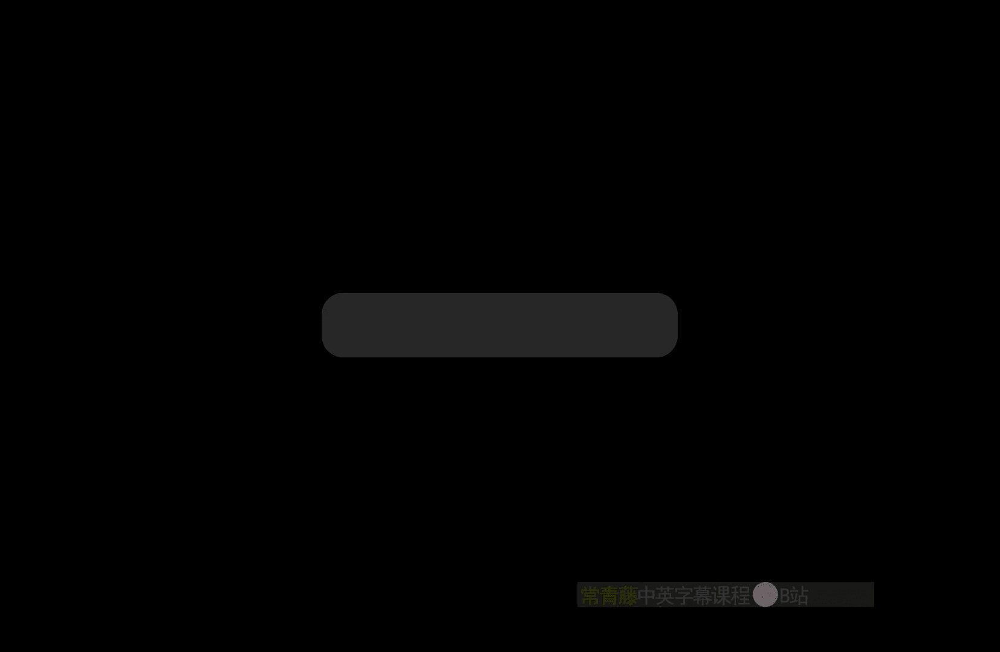
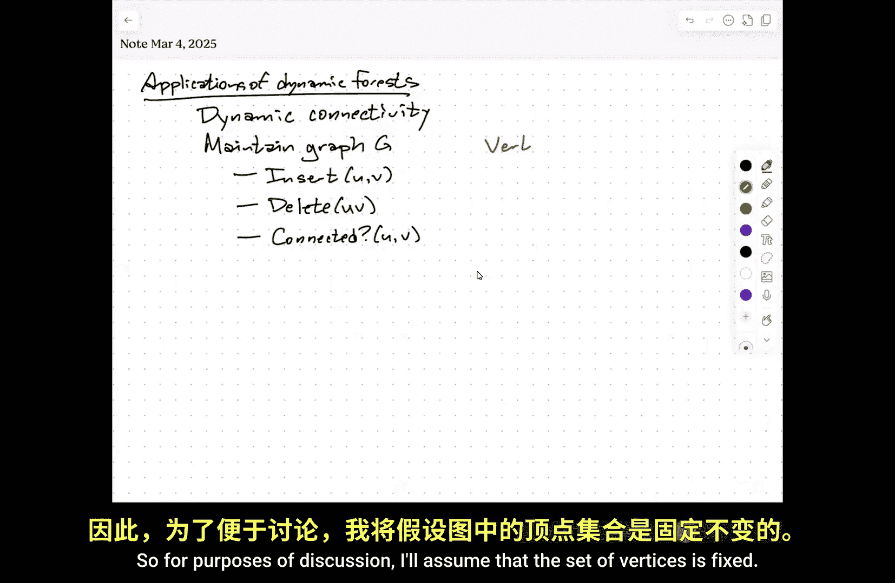
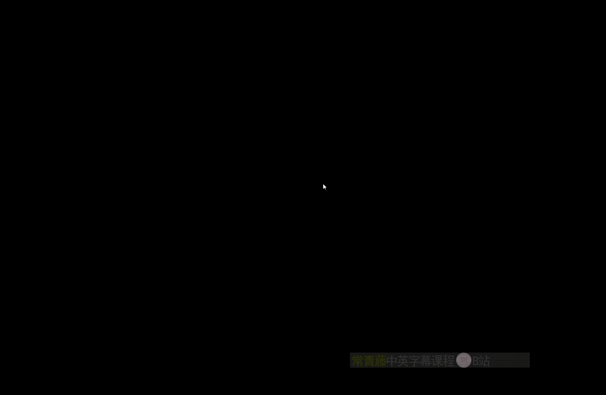
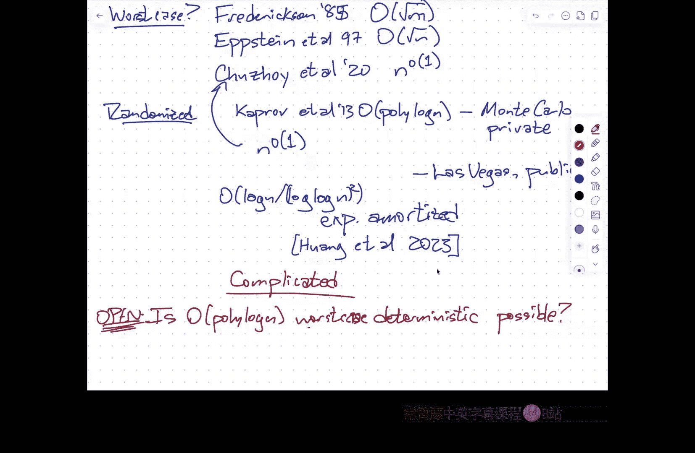

# 伊利诺伊大学【中英⚡高级数据结构｜CS598 Spring 2025, Advanced Data Structures】 p11 P11 动态连通性 -BV14qZYBJEZy_p11-

Thanks to everybody for。Coming， coming back。I hope the week I was gone was。Productive or relaxing。

 or at least you got some good news out of the time。嗯。So administrative things。

 officially the paper Cha assignment was due yesterday。Um，Reistically。

I am expecting to grade those assignments over spring break。

So if you haven't had a chance to submit the paper Cha assignment yet。

 or if you want a chance to revise it， you still have some time。

I think currently grade scopepe is set up to accept submissions through like Monday next week。

I'll reset that to like the end of next week。So don't wait too long because these things will start to fester。

 but there is still a bit of slack in there。嗯。I think that's the only administrative thing I am very。

 very slowly working my way through homework zero。This is the reason why there's not going to be a homework one。

Again， I'm expecting to make a bit more progress over that during spring break when I don't have other meetings。

Okay。So。Last time we met。We were talking about。Applications of dynamic forests。And。

The application that I talked about a week ago， Thursday。嗯。Well。

 days ago was a specific application in the context of planar graphs。

I'm going to talk about a somewhat older application。U。But where there's。

Been a lot more progress since the initial results。

 so I'm only going to talk about the the the sort of I'm going to plant my flag on one result。

And then I'll mention sort of pointers to more recent updates using more complicated techniques。

But specifically， this is the。Dynaomic。Connectivity problem。So the idea is。I want to maintain。

Some undirected graph G。Subject to the following operations。I want to be able to insert an edge。

Between two vertices， assuming there's not already an edge there。I want to delete an edge， of course。

 assuming that that actually is an edge in the current graph。And I want to know。If。Two vertices。

 U and V are in the same component of the graph， is there a path in the current graph from U to V？

Okay， that is my entire vocabulary。So for purposes of discussion。嗯。

I'll assume that the set of vertices is fixed， this is not really an onerous。

嗯。URequire if I want to be able to like insert an isolated vertex or insert a vertex。

With one edge 22 another existing vertex。Minor modifications the data structure will allow me to do that in similar amounts of time。

 So specifically what I'm going to get here。Is。嗯。These two operations are going to happen in log squared amortized time。

 and this operation will happen in log end time。Which in that log n could also be amortized depending on what balanced binary treated data structure I use under the hood。

So under the hood， this is going to be an assemblage of balanced binary trees because it's going to be using dynamic forests。

If those underlying balanced binary trees are splay trees， then that log n is also advertiseortized。

If they're red， black trees or something similar then it's not。Okay， so。嗯。And。This。诶。Particular。呃。

Structure is by Hol De Luxemburg and Thorpe in 2001。Home and Duuletenberg were masters students。

Nicel Thororpe was their advisor。Okay。So。The basic idea is that。I want to maintain a certificate。

That isn't just something like the entire graph。That is sufficient to determine whether two vertices are connected。

So I'm not actually going to build the data structure。Fundamentally around the entire graph， I mean。

 there'll be information about the graph in there， but really what I'm going to be doing is I'm going to maintain a spanning forest。

几。I'll call this F。So this is a maximal acyclic subgraph of the underlying graph G。

 And when I insert。An edge。嗯。Into my graph， if the two endpoints of that edge are in the same component of the maximum of the spanning forest。

 I don't need to do anything， I haven't changed any connectivity information。

 so I don't actually need to update any of the data structures。If I insert。

An edge between two trees in the spanning forest， that means I'm connecting two components of G。

 and I actually have to do something。Similarly， if I delete an edge that's not in this spanning forest。

 then I don't really have to update my data structure。At least not significantly， on the other hand。

 if I do delete an edge in the spanning forest。I might be disconnecting a component into two of G into two smaller components。

I might not。So the difficult case。Is。If we delete。An edge in F。

Then I need to look for replacement edge。In the actual graph sheet。い。Yeah， all this is undirected。

 there's a bunch of results about directed graphs as well， but they're more complicated because。

As you might be thinking， spanning trees are not going to be enough to determine strong conduct or directed connectivity。

嗯。So the original graph G does play a role here in the data structure in that when I delete a forest edge。

 I have to look through my graph G to find a potential edge to replace it。And this is， in fact。

 really the the the。The operation that drives the whole thing that makes the data structure complicated。

Is how do I find a replacement edge connecting these two components of the now no longer a spanning forest？

Without doing the brute force search over the entire graph。

And so I'm going to need some scaffolding in order to do this。Right， so。

The way that I'm going to do this scaffolding。To design my data structure。

Is I'm going to assign a level。To every edge。Which is。啊。In。Sorry。

The level of each edge is an integer， it could be zero。

 it could be log based2 of n somewhere in between。跟。Initially， all edges start off。With level login。

Over time。嗯啊呃呃。As long as the edge stays continuously in the graph， over time。

 its level might decrease， but it will never increase。系。嗯。Can decrease。Over time。

But initially all levels。Are equal to log n。 and again。

 as usual I'm being a bit fast and loose about floors and ceilings。

 Just imagine the number of vertices is a power of two。嗯。嗯。Now。

 this level assignment is an artifact of the data structure。

 it's something that data structure maintains， it's not something that's sort of intrinsic to the problem。

 but the in order to make this level assignment useful， I need to。哦。Satisfy a particular invariant。

 So let G sub I be the。Subgraph。Consisting of edges。With。levelvel at most I。

And the invariant is the number of vertices。In。In any component of GI。Sorry， each。To。

I'll just learn to write someday。Each component。Of G sub I has。At most， two to the eye or disease。

RightAnd then I'm going to define the spanning forest as at each of these levels as well。

Each level in the data structure。Has its own spanning forest。

That's defined by taking the global spanning forest and just restricting to edges with level at most I。

 Okay， so in particular， F of log n is just equal to F。And F of zero。

Is the empty forest that it has all the vertices， but it doesn't have any edges at all。

Each component in f0 has exactly vertex。So this。You can kind of think of this。As。诶。You know。

 hierarchical。A。Clustering。Of the spanning forest。That you imagine。

You can think of it top down as well， I've got this big spanning forest and then to get to level log n -1。

 I'm going to remove some constant number of edges。

 And now I've split my forest into a few few components that are smaller。

 might that each contain at most half of the vertices。And the next level down。

'll separate into smaller components， each of which has at most a quarter of the vertices and so on all the way down to the ground at F0 where there are no edges at all again。

 initially all edges have level log n， so initially F is F log n is just a spanning forest and all of the lower level forests are empty。

But over time， because of maintenance of the algorithm， I'm going to be。

Reducing the levels of edges and thereby growing these smaller forests。Okay。嗯。We to。Maintain。

Each component。Of。Each forest F I。In。An oiluler to tree。

So it's going to turn out that everything that I need to do。Is。Based on subre operations。

I'm not ever going to need to do path operations。It also turns out that if you happen to know that the graph is planar and you're doing insertions and deletions that are consistent with keeping it planar。

 you can use。Again， the sort of tree co tree idea to speed some of these operations up by using a pathbased dynamic forest data structure in the dual graph。

 but I'm not going to talk about that here just there is an oilerture tree for every component of the spanning forest at every level。

嗯。嗯。So one of the things that this is actually going to immediately imply。Is。

That the entire data structure uses a reasonable amount of space。

So I need some constant amount of information for every edge。 in particular。

 I need to know what level it is。And then， because。

A tree within vertices has at most n minus-1 edges。

 the total number of the total complexity of the spanning force is only order N。

And each edge that's in the spanning forest is represented in a most log n of these data structures。

 each of which has size linear in the number of edges that it's holding。Okay。

 so the overall space for this is。Pretty close to optimal。 It'd be nice to get rid of that login。

 but this is not where the the interesting part is。嗯。嗯。Now。There is。

One additional piece of information that I need。So now remember that the oiluler to trees。啊。嗯。

Each oiluler tor tree maintains。An unrooted， undirected tree。Subject to these three operations。U。

Link U and V where you enV you're in different trees to merge two trees into one。

 cut an edge UVve the separate a single tree into two trees and ask which tree is this vertex in？

So I don't remember whether we talked about the fine tree or fine root。Operation in much detail。

 but this is relatively simple， if you remember under the hood。

 an oiluler tour tree is a spplay tree over an euler tour of the tree that's being represented a pine tree。

Basically just walks up the tree to the root and reports the address of the route。So in particular。

 you can also think of this as。呃。Asking。Whether。Two vertices。Are connected in the forest。

So that connected because it's an oiler torch operation。

 that means connected in the the the spanning forest。 So I think maybe in the in the。嗯。

Interest of avoiding any sort of ambiguity， all that was called the same tree。

so given two vertices in my dynamic forest data structure。

 I can ask whether they belong to the same tree in that forest。Okay。When I'm running that same tree。

 I'm always going to be doing this with vertices at the same level。Right。

 so you should really imagine that。There's。One set of。Burular tour trees。Per level。

And I'm never going to ask。Whether vertex U at level 5 is in the same tree as vertex V at level 17。

I'm only going to do these queries within one level of the data。penm。U。

But the other thing that I need。Has to do with these level things and so。

I do want to talk a little bit about the structure of this spanning forest FI。Um。啊。是是。Right。So。

One thing to observe here。嗯。Is that？The force at level I。

Is actually the minimum spanning forest or a minimum spanning forest of the graph level I。

With respect to the levels。嗯。So。The the。Lower level edges are kind of present in the forest。Eagerly。

RightSo if I can connect things down at level I， then I will。嗯m。So。Yeah。

 so I need to make sure that in particular， this is a spanning forest。Of G sub I。

s another that's part of the invariance。That I want， so there's really two invaris。

OneOne is the structure that the forest actually still is spanning force the components。

 the second is that the components aren't too big。Right。

 and these the first invariant implies that F is a minimum spanning forest of G with respect to the levels。

 so within each component of the graph G sub I。The spanning tree of that component is the minimum spanning tree。

With respect to levels。 now， one of the ways that this manifests itself。Is if I look。At。Two trees。

In the Spning For F。Any edge。That connects those two trees has to have level strictly larger than I。

If it had level less than or equal to I。Then I would include it in my minimum spanning forest。

The components of FiI have to correspond to the components of FI。Sorry， of GI。

So any edge that goes between two components of F I has to have level greater than I。

On the other hand， edges that are inside any component could have any level at all。Now。

 if it's inside the component and that's an edge of GI， then。It because it's level of GI。

 it has level less than or equal to I。 So this red edge here， this is when I say this。

 this is an edge and G， the original graph。Right。嗯。So let me say this。For any edge。Uv N G。

If U and V are in different components。Of G sub I， then。Level of UV must be greater than I。

But I don't know this within a particular level。So but what's going to happen when I decide to remove an edge。

 say here's my picture of one of these trees。Right， and I decide I'm going to remove this edge。

It's possible that this component of GI is actually still connected。And so I need to find。You know。

 see if within that component， there's a replacement edge。

And because I'm maintaining these forests at multiple levels。I actually need to know。

If there's a replacement edge at the right level。Okay， so。There's another operation that I need。

So every。Vertex。In G sub I。Noose。Let's say the number of incident。Edges。at。Level I and in particular。

 the number of incident non tree edges at level I。Okay。

So when I'm looking for a replacement edge to reconnect a tree at level I。

 the way that I'm going to do that at a very high level。

Is I'm going to look at the smaller of the two components that I get when I remove that edge from the tree。

Within each of the within each。啊。For each vertex in that smaller component， I'm going to ask， hey。

 are you incident to an edge at level I。That goes to the other tree。And if it says， yes， great。

 I can reconnect。But that search is essentially going to be brute force。

But if I really made it brute for， as in I just look at the vertex and ask， hey。

 ask all your edges of their level I and connect to the other tree， that would just take too long。

 So I'm using the euler tour tree。I that I need to augment the oiler tour retreat to allow me。

 given that I know this information to quickly identify， hey， in this tree。Find the next。

Non treee edge。That's incident to the tree， and has level I。Right。So this means like。几。呃。

I can use the Euler tour tree。To。Enumerate。Oh。Non tree。Edges。嗯。With。Level I incident。To a component。

Of Fi。In。Klog end time。Where k is the number of these edges。Okay。All right。嗯。

I think this might require a little bit of explanation， but the idea so the idea is， if you remember。

 an oiluler tour tree is a balanced binary tree over an oiluler tour of this represented tree that I have highlighted here in green。

Um。Subtes of the Ouler to tree correspond to intervals。In。In that Oer tour。

And some of those intervals at least correspond to subtes of that represented tree。

So the way that this search works。Is essentially I'm going to do an in order traversal。Right， via。

In order traversal。Of the oiluler t tree。But every time I get to a node and I want to know， Joe。

 I need to continue the traversal further down into a node， I'll first ask， hey。

 are any of the nodes that are represented in this part of the Ooratory tree incident to level I edges？

Now， each individual vertex knows this， those individual vertices correspond to individual nodes in the euleratory tree。

 so I need to propagate that information up so you could just think of it as propagating， hey。

 if either of my children say， yes， I'm incident to an interesting edge。

 then I say my subtree has something interesting in it。嗯。And so if that interesting bit is set。

 then I will continue the traversal in that subte and if that interesting bit is not set。

 then I will not traverse that subte。And so this if we do this carefully。

 this keeps the time to find all of the interesting edges。At only log N per interesting edge。

 In fact， this is even conservative。 If the number of edges is like polynomial and N。

 you can get rid of the log factor。Rather than。Having to tra the entire earlier churchary。咁。

All right。嗯。But， skip。Borring。Subrees。Right。嗯。This is。

Probably the most technical part of the data structure。

 so I do want to make sure that this is reasonably clear。So if you have questions。

 now we'll be good time。O。So。Let's。Think about how this works。Okay， so if I want to say。Um。

Connected UV。The way I would implement this is。I would ask if this is in if U and V are in the same tree in the top level forest。

A， so this is one。Query to one Euler tree data structure， so this is only going to take log end time。

Amortized if under the hood， this is a sp tree， and I should also say that that K log n is amortized if under the hood a sp tree。

Okay， so that's。Sort of the easy part。嗯。Insert an edge between U and V。This is a link。You the again。

 in the top level a forest。嗯。And notice when I do this， I might need to。Update。Level。Edge。Counts。

In F logN as well。So this is what I'm referring it to here。levelvel。Edge。Counts。But again， you know。

 in the， if， if I just treat this insertion in isolation。啊。This also gives me。Log in time。But。

Remember that I said over time。Edges are going to reduce potentially drop in levels。

 I haven't described where that happens yet。But I'm going to， for purposes of amortization。

Pay for those changes in level now。So in particular， any time I change the。Level of an edge。

I need to update the level edge count stuff at the two endpoints of that edge if I'm reducing this level from I to I minus1。

 then in level I， these two endpoints now have one less level I edge incident to them and at level I minus1。

 these two vertices now have one more level I minus1 edge connected to them。

 So there's going to be some some operations on the underlying Ouler or trees to update update that information。

嗯。But。This extra work is going to happen at most log n times over the entire history of the data structure。

Okay。So。But if I。Pay for later。Level changes。In advance。This is going to give me log squared n。

Amortize time。Eber scanning for those things， well， actually we haven't gotten to the scanning stuff。

 but updating the level incident correct level counts。

eitherither incrementmenting or decrementing them， that's going to require doing。

 you know updating some of the summary information in the balanced binary trees that's going to take log in time。

嗯。So。Log square n amortize time。 But now that I've paid for that。In the deletion algorithm。

Decreasing the level of an edge is now free。嗯。Okay， so。This is them the。Delete U。

This is the interesting version of the more interesting operation。Right so。

If UV is not in the top level forest。Well， you're done。

You don't really need to do anything technically， yeah。

 you should probably there's some level count stuff when you delete but。UmThat's going to be cheap。

 it's going to only be log ribbon time。That's not the interesting part。系。So， otherwise。U。诶。

For all my。Greater than or equal to the level of UV。I'm going to cut UV out of the forest at level I。

可。😊，Again， this is going to require updating this other interesting information。

And now I need to look for a replacement edge。开以。U。So。Because。The top of a forest， and， in fact。

 every level of forest is a minimum spanning forest with respect to levels。

If there is an edge that reconnects。嗯。Two components of the top level force F log n。

The level of that edge must be at least I。So this replacement nudge。Which must。Have。Level。

At least I can't have level less than I。Because if it did。

 that lower level edge would have already been included in the spanning forest instead of the one we deleted。

 because that's how minimum spanning forest work。 Remember。

 the the defining property of minimum spanning， one of the defining properties of minimum spanning trees。

Is that if I look at any separation， any partition of the vertices。

 the minimum weight edge that crosses that partition must be in the minimums fanning tree。

So if there were a lower level edge crossing between the two components。

Of the forest that I just separated by deleting that edge。

That would have already been in the minimum spanning forest。可。嗯。So。

TheW that I'm going to look for these edges starting at level I and working my way up。嗯。So can。

F I goes from。Level of UV to log in。If I can find a replacement edge with level I。

 I won't continue the loop， I'll escape that。嗯。All right。So。Let me write。

I'm going to fight the notation demons here， let T and TV be the components。Of。

F sub I now that I've deleted this containing。U and V respectively。

Okay now this is a bit of an ambiguous notation because T is different on level9 than it is on level 10。

I should really write T sub I comma U， T sub I comma V。

 but these these you I think the extra notation is actually going to be more confusing。

 so stick with me the scope of that variable to U is only at level I。So。This is。This is important。

Okay， and without loss of generality， the number of vertices。

Of T is less than or equal to the number of vertices of TV。So if T U happens to have more vertices。

 just swap the names U and V。And swap the variable names this again。

 is an independent choice made at every level。啊。Okay。We need to scan。UmTo you。For。Incident。Edges。

With level equal to I。With the other end。Is in TV。So I'm going to look for a replacement edge exactly at this level。

Using the stuff that I said earlier。 so I will scan through all of the edges that have the right level。

Incidents to this tree T。That have， that have， and， and then check。

 do any of these have their other end in TV。嗯。嗯。If we find。1。嗯。I know let's。Yeah， let's。We find。

Let's call it X Y。Where x is in T， y is in Tv， and level of xy is equal to I。Then we link。X to Y。

In Forest Ie。Is that right？Actually。Also For I+ one all the way up to forest login。Okay。

So if we find a replacement edge at level I， that is also going to be a replacement edge in the next coarser forest F minus is FI+1。

 the next coarser forest F+2， all the way up to the very top， the global spanning For F。诶y。Now。嗯。

If we find。Bm。4。Every other interesting edge。X， Y。I'm now going to change the level of XY。

Two I minus-1。Okay， so the scan TU for incident edges at level。

 so maybe I should use my own rules here。And just say。嗯。For all。Edges。X， Y。

 where x is into to U and the level of。The level is equal to I。If Y is in TV。

 then I'm going to do this otherwise。Oh， and exit。Otherwise。

 set the level of that edge to i minus1 and continue the loop。Okay。

 so the moment I find an interesting edge that actually reconnects those two subtes。

I accepted it into my spanning forest。Like global spanning forest。

 But that means at all these other levels， if the edge。Doesn't have the right level。

Then I'm going to push its levels。Or sorryrry， it doesn't have the right other endpoint then I'm going to push this level down。

嗯。So。Notice one thing that happens here。Is。I need log N time for each of these edges X Y。😡。

That was this stuff that I wrote up here in green。嗯。But。One of two things happens。Either。

I need to do a bunch of link operations。 So those I have to pay for month explicitly。

 or I decrease the level of the edge。And decreasing the level of the edge has some has some overhead to it。

 but I've already paid for that overhead。In particular。

 decreasing the level of an edge cost me about log n time doing the various link country stuff to update those weird level counts so。

This is sort of。Free。Because I've already amored when I already charged the original insert operation for that edge Xy。

For all future level changes。And so in the amortized cost。

These link operations are the only thing that I still have to pay for。

Each of those link operations takes me log in time。There are at most log n of them。So。This is。

Log squared n amortize time。嗯。I think that actually， there was one step that I needed。To。嗯。

Add in here。Which is。Basically， for all。Edges。In T set the level of that edge to I minus-1。Now。

One thing to remember is that。There's an invariant that says lower level components have exponentially smaller sizes。

So any component at level， I has it most two to the I vertices。

That's actually important for bounding the number of levels in the hierarchy。

W why I only need log N levels， but you'll notice here this tree in level FI that I've split in a TU and TV。

 that is a spanning tree of one of the components of GI。

 and so that component has at most two to the I vertices。

 then I split that component into two subcomponents。

And I changed the level of the smaller of those two subcomponents。So TU has at most。2 to the I，-1。

Vertices。So this is I'm maintaining this invariant that the component sizes are bounded by twice sorry to the level right so this condition guarantees that the number of vertices。

In T is at most2 to the I minus1。And that is why I can afford to change the levels of all those edges。

 changing the levels of all those edges isn't going to create like more components。

Larger components at level I minus1， it's that that tree is now going to be one of the spanning trees at level I minus1。

嗯。Um， so。This choosing the smaller standing tree maintains my size andvari。

The size andvari guarantees that I guarantee that I only need to go down log n levels before I'm left with no edges at all。

Because I have only log n levels， the number of links that I need to do to glue in a replacement edge。

Is log N。And each of those links。Takes me。Actually， this isn't really even amortized。

 the takes speed log in time because I'm doing a constant number of operations in an oil tree。

The scanning the interesting edges that are hanging off of T you to see if they have the right level。

I spend log n time finding an interesting edge that doesn't connect to the right thing。

But then I immediately decreased the level of that edge。

 which I already paid for when I inserted that edge。Likewise。

 when I'm decreasing the levels of the edges in the tree T。That is from an amortized perspective。

 free because I've already paid for the links and cuts and so on that I need to do to do the level decrease。

嗯。So in the end。I can do。I need log squared and amortized time。Per insertion or deletion。

And I need log in time。U。Per connectivity query。可以。😊，Questions。No。This is。One of， you know。

 this is probably something I'm going to say multiple times haven't already said it multiple times。

Building data structures are theyre thinking about the way data structures are designed and analyzed。

Very much feels to me like a house of cards。Everything has to sort of。

 there's lots of different ways that you can put things together。

 but you have to be very careful about how you do it or the whole thing collapses。And it's really。

 really hard for me。At least to keep all of the details straight at the same time。

So there's a lot of different pieces happening here that are affecting each other。

 It's like the well， there's this invariant， but how do I I don't I know that's maintained that implies there are this many levels。

 I've amortized this over there because I did that to the data structure。

 but I had to add this extra information So there there's a lot of pieces floating around。And so。

 I would expect。If you're like me。It's going to take a bit of time， sort of。

Get a comfortable enough feeling with no， I can't hold all of the details in my head。But I kind of。

 if I glance pay attention to this， this component。

 this connection seems to work and this connection seems to work。

 and I sort of get a feel for I kind of see how it might possibly be plausible。

I'm not expecting it to go now go implement it， it's not like that。So again， please。

 if you do have questions。Please ask。In particular。

 if they're parts of the description that was like， I didn't get that， please point those out。Okay。嗯。

So this。As I said， was by。Hold Don Sberg and Thorpe in 2001。嗯。

The time bounds that we get for insertions and deletions are amortized。

 and so it's a fairly natural question to ask。What can you do if you're not allowed to use amortization。

 what if I really want to keep the cost of each individual operation small。

 if you walk through the algorithms and you try to figure out the worst case running time of a single operation。

 it could be as bad as linear in the number of edges in the graph。

It's maybe the number of vertices with the bookkeeping， but linear time in the worst case。

So if you're trying to do anything real time， this， this just sucks。Um， so。What if we want， you know？

What if we want worst case behavior？Okay， so there's actually an older data structure by Frederickson。

thinkIt's 87 ish。That gets squared of m time。Square root of the number of。嗯。Vertices， that was 85。呃。

That was the best known for about。10 years。And then David Epstein and his。

As a PhD student and his advisors came up with a way of so-called sparsifying the graph。

 so essentially they could put a layer over the data structure that says actually we can pretend that the graph is sparse。

 it has only a linear number of edges even if it doesn't。

And so there's one layer that kind of maintains a sparse spanning subgraph。

 and then you build Frederickson's data structure on top of that。

So that gets you down to square root to N and that was the best known for another 20 years。

 the current best。Is by Julia Cusoi and her students from 2020。呃。

I think actually the right way of saying this is。It's subponomial。

That is how they report the running to。It's less than end of the epsilon for any epsilon。

But it's probably super， super polyaugorithmic。嗯。There's a song that somebody published。

In Siggac news that was sung to the tune of the Mary Poin song， Super califragiclyic XB Leosius。

Which was super polynomial sub exponential functions。

This is a super polyloarithmic sub polynomial function。Don't know what it is。啊。

But this is the current best， worst cases， nowhere near log Square。系。Interestingly， if I allow。

Randomization。And I only care about expected worst case time。You can actually do better。

And now this gets really complicated。嗯。So。啊。Krov et al。Got something that is you。

 polyloariththmic update time。But with two。Two caveats。

One is that this is a Monte Carlo randomized algorithm。 What that means is it is always fast。

 but sometimes it gives you the wrong answer。So it's a sort of one sided error model。

 which means if the algorithm says， yes， these two vertices are connected， that is correct。

But if the algorithm says no these vertices aren't connected。

 there is some chance that is a false negative。That chance is exponent is is n to the minus C where C is one of the constants inside the big O。

 so you can tune the failure probability be whatever you like， but you'll never actually know what。

There's no way to completely guarantee that you have the correct answer。The other thing is。

That the user is not allowed to know what standing tree you're maintaining。

So this is what's sometimes called the private model， sometimes called the oblivious adversary model。

 the person calling the data structure saying insert this edge， delete this edge， insert this edge。

 insert this edge， delete this edge。Has no access whatsoever to the data。

Except through the answers to the connectivityivity queries。The data structure that I just described。

Handles arbitrary insertions and deletions， which means even if the adversary can peer into your data structure and go ah so that's how your forest and how your levels are organized。

 I'm going to choose this edge just to screw with you it still you still get the same amortized time balances。

Um。This is a serious balancing act here， there's actually a vague description of this algorithm in Wikipedia of all places。

ThatThis is 2013。And。Then let's see。Wlf Nielsen。In also。

 I think this was 2013 got this something that was。Long squared n over log log n where this was。

Las Vegas。And public。嗯。No。Sorry。There was。A different algorithm that ran in time into the little of one。

That was Las Vegas in public， and Chisoi derandomized that algorithm。

So I'm not going to even attempt to explain Chizo's algorithm because it's based on removing randomization from an already complicated randomized algorithm。

Based on spectral expanders and God knows what？嗯。嗯。If you allow randomization。And amortization。

 you can get the running time down to。呃。Log n over log log n squared， this is expected amortized。

UAnd。This is by。AHong et all。2023。This is a nice 56 page paper。

ItIt actually includes a fairly thorough survey of the past results。

 unfortunately I did not find this paper in time to put it into the paper Cha document because it's based on a couple of different conference papers that are several years earlier and this particular journal happens to still be about three years old。

 so it's not really on my radar yet。U。But。Let's just say。对。You know， this is complicated。

There is really still a fairly significant open question here。Is。Right， so I can get that expert。

 you know， expected amortized。 I get log squared in worst case amortized。

 I can get subponomial worst case。Can you get polylogue？Worst case， no amortization。

 no randomization。This is an open problem and it's been open。

 arguably it's been open since at least 1985 when Frederickson published his algorithm。

 so this is now a 40 year old open problem。Right， is。Polylo。In worst case。deterterministic。

possiblesible。This is open。😔，This is not a。Problem that I propose anyone work on for their project。

It's been open for。呃。You know， 40 years。And just among the names that are written down on the slides。

😡，There are at least。A dozen people who were smarter than me。Epstein was my master's advisor。

 Frederickson was at Purdue for many years， Julia Chishoy is at the Toyo Institute of Chicago。

 I wrote there was an intermediate result by Christian Wolf Nielsen whose a brilliant graph algorithms person out of Copenhagen。

 I believe both Wolf Nielsen and Michael Thororpe are co-authors on this 2023 paper。呃。

If you want to work on this problem， you've got a lot of people ahead of you who haven't succeeded yet。

嗯。The last thing I want to say is a lot of the techniques that I've talked about here and that go into these other papers also go into other kinds of dynamic graph connectivity questions so you could reasonably ask。

 first of all， about directed graphs。So now the connectivity is asymmetric。

 you really want reachability。The the time bounds you get are nowhere near as nice as this。

 you can ask about。Minimum standing treats。So I've got a minimum spanning tree of a graph and I want to maintain it as I insert edges。

 delete edges， or change edges weights。And then。So you have to turn it into the appropriate query。

 so one of the features of minimum spanning trees is they contain a bottleneck path between any two vertices。

 meaning the maximum weight edge on the path is as small as possible among all paths between these two vertices。

So you can ask bottleneck path queries between two vertices as your data structure access to the minimum spanning tree。

 you can ask about two connectivity， three connectivity four connectivity， so are there two， three。

 four disjoint pads going from one vertex to the other。

 you can ask about how connected is this graph。So overall。

 a graph is three connected if between any two vertices， there are three vertex disjoint cos。

It's too edge connected if between any two vertices， there arere two edge disjoin pads。

 So you can ask about those kinds of queries as well。

 and these data structures all have applications and things like find the K best spanning trees of this graph。

So I know that like the k minimum spanning tree is at most one edge away from one of the earlier k minus one best spanning trees。

 so looking for that which edge to exchange and which of these things is very similar to the replacement strategy that I talked about here。

So， this is now huge。Huge body of literature out there going back to the 1980s。

 but really continuing pretty consistently up into the mid-2020s。嗯。That's all I want to talk about。

Did anybody have any questions about this stuff？Yeah。The biggest last。

Las Vegas means that the algorithm is always going to give you the correct answer。

 but the running time of the algorithm is a random variable。

So when I say log n over log log n squared， that's the expected running time similar to like using a tree for randomized quick sort。

第二。😡，Private means that。The updates and queries that you get do not depend in any way on the internal structure of the data structure。

So the data structure is going to pick a spanning forest。

But the user is not allowed to know what that spanning forest is。

 and so the updates can't depend in any way on the data structures's decisions。

Public means the user can peer into memory and go，ha ha。

 I should do this next because that will screw you up。😡。

So the data structure I talked about here was public。But you can actually simplify things。

If you allow them to be private in some circumstances。

F is public the public for climate day director is not just like an im family。

 would you ever like go into a problem with like， hey， I let it go？差不多で。So the。

The basic idea here is the Karov paper。They wanted of like， okay。

 we can't do everything we want and get logarithmic。Or polylo time。So let's relax our assumptions。

So one assumption that they relaxed is that they need to be correct all the time。

But another assumption that they relaxed is。This privateness。Right so。

It's kind of along the same lines as。When you're using a balanced binary search tree。You might。

 it might be easier to get something that guarantees logithic time。

If the user can't know what the structure of the tree is。

But if the user did know the structure of the trees， they'd always queried the deepest node。

So most nodes are at log end time and and like in an average sense， maybe like。

I'm struggling to come up with a concrete example here。え。好的。Oh。Prolong access。you know yeah， kind of。

 I mean， one of the things that subtle about the Kapro thing is that there are multiple sources。

 randomness is used in multiple different ways in the data structure and they have to be very careful about keeping those multiple uses of randomness independent from each other and somehow making the data structure public screws up that independence argument which screws up the analysis。

So it's not at all clear to me whether this privacy assumption is something that affects correctness。

 affects actual speed， or only affects the analysis。It。Complicated。Did you have another question。

Okay。All right， thanks everybody， we'll see you on Thursday。

