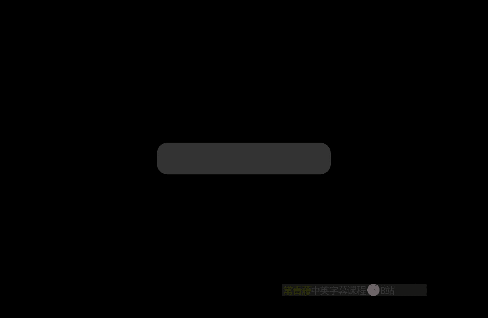
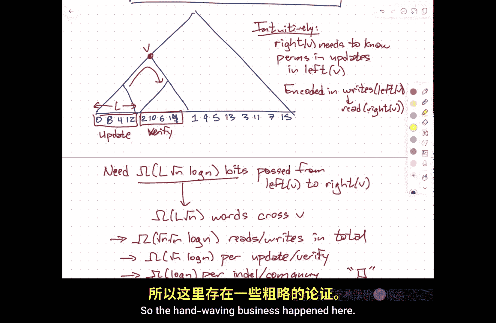
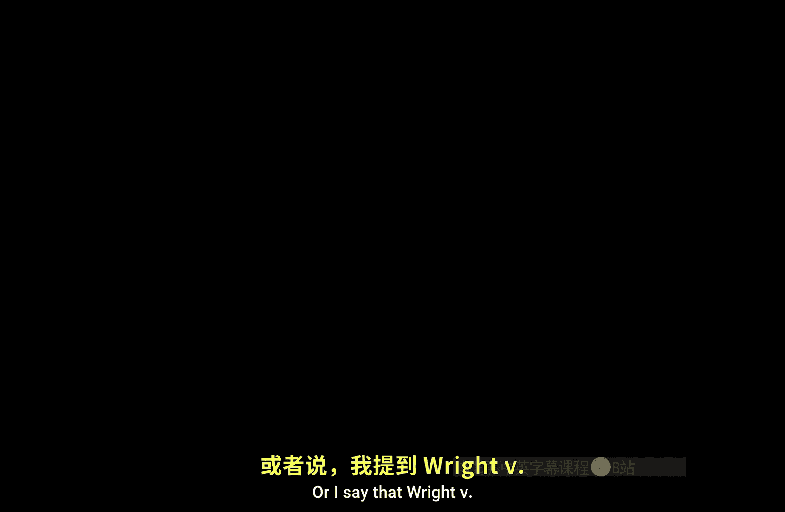
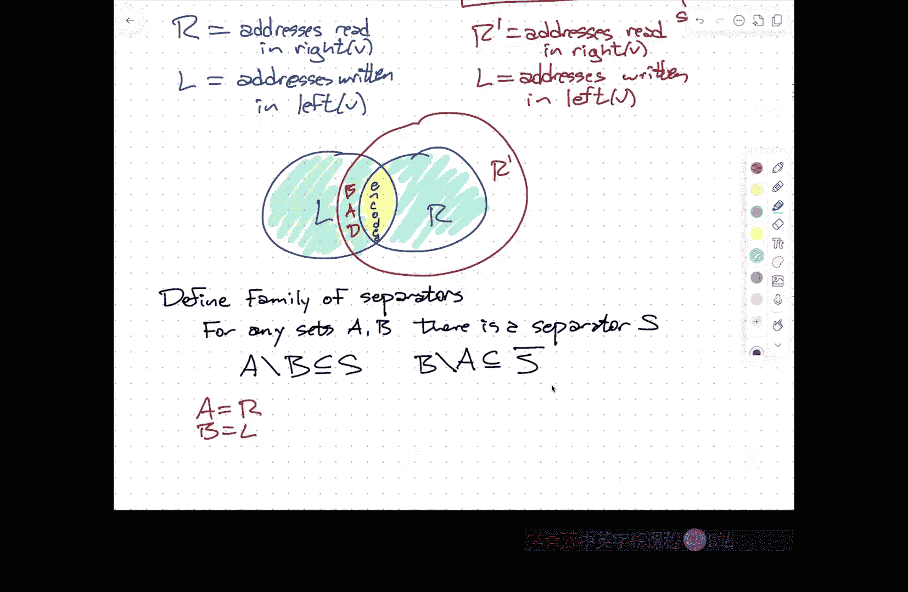

# 伊利诺伊大学【中英⚡高级数据结构｜CS598 Spring 2025, Advanced Data Structures】 p12 P12 动态连通性的下界 -BV14qZYBJEZy_p12-

Okay。嗯。So again， just a logistical reminder， you still have some time to get your paper case in。

 in particular， feel free to come to office hours tomorrow if you have any last lingering questions about how to structure the report。

Or suggestions on paper three， things like that。嗯。So。

What we've been talking about for the past several lectures is。

This idea of dynamic graph data structures， so we spend a fair amount of time talking about。

Data structures for dynamic trees or dynamic forests where you。

You're maintaining an acyclic undirected graph。And the operations you're allowed to perform structurally are at an edge between these two trees。

 merging them into one。Delete this edge from one of the trees， breaking it into two。

 ask whether two nodes are in the same tree and then possibly some other information involving aggregating information over subtes of these trees that you're maintaining。

Or aggregating information along paths。In the trees that you're maintaining。And then on Tuesday。

 I talked about an application of one of these data structures。

 specifically the Ouler t tree to more general problem， but dynamic graphs。So here。

You're maintaining you have a thick set of vertices and the operations you're allowed to perform are at an edge between these two vertices。

 delete an edge between some pair of vertices， and then ask whether two vertices are in the same connected component。

Of the resulting graph。Now， if somehow you could guarantee that the graph was always a cyclic。

 this is equivalent to what we did。For dynamic forests。 But more generally， it's not。

 And we ended up describing a data structure that used amortized。

Log squared end time for the updates and log N time for the queries。嗯m。

And then there were a bunch of other results floating around that gave。Either slightly better。

 the more advanced data structures that gave slightly better amortized time bounds。

Or other still different data structures that gave。Much worse。

Worst case time notes where you're not allowed to average over the operations in the sequence of the lifetime of the data structure。

 although you may still be allowed to average over random bits that the data structure uses。

So what I want to talk about。Today。Is sort of the other side of the coin。

So instead of thinking about。嗯。Building data structures and analyzing their running times。

They're going to turn the tables and ask。Are there fundamental limitations？

To how quickly these data structure operations can happen。And。

So I'm going to be working in the realm of lower bounds now a lot of lower bounds are ultimately information thetic。

So for example， if the query that you want to support is。嗯。啊。

Find me the case largest thing in this array of that items。嗯。There are impossible possible outputs。

Namely， you know， the K largest thing might be located at index1， index two。

 index3 up through index n。And so your。Query algorithm must be able to uniquely identify one of these integers from one to n。

😡，If the data structure operates by making binary decisions like comparisons。

Then it must make log n of those comparisons。Because each comparison is essentially generating a bit。

 this is zero if the comparison goes one way into one， if the comparison goes the other way。

 and I need to generate distinct a unique integer between one and n。Now。

 I'm not saying you necessarily have to generate that integer in the standard binary encoding。

 but if I do need an encoding that is capable of representing every possible output。

So there must be at least one of those numbers that takes at least log n bits to encode。系。嗯。

Similarly for sodom， if I'm sorting by doing comparisons， the output of a sorting algorithm。

 you can think of it as being the permutation that sorts the input array。

They're in factorial such permutations。 So if you make binary choices during like comparisons during your sorting algorithm。

You need to do enough of those binary choices to encode the unique permutation that sorts the input。

Again， not necessarily doesn't necessarily mean that you need exactly the same number of bits for every permutation。

 but the average permutation is going to need at least n log n bits。

Because log of event factorial is and log again。So this is， you know。ultimately。Information do at it。

Because this is to first approximation， the only tool we have。To prove that things are hard。But。

I don't want to make any assumptions about what the algorithm is doing。

 I don't want to assume a priori。😡，That the decisions made by my data structure。Are comparisons。

Because algorithms can do much more interesting things than comparisons。

 I can build large tables of things and use the value stored in the table over here the index into the table over there。

 that's not something that you can in constant time。

 but it's not something I can encode using a constant number of you know pairwise comparisons。

So I'm going to work。In a much more general model of computation。嗯。Called the cellll probe model。

And this was originally devised。By NDL。I believe is the only Turing award winner to graduate from the University of Illinois。

To answer， there's a beautiful paper that he wrote back in the 1970s called Should Tables Be sorted？

"，And basically trying to answer the question， we know that if we sort an array and use binary search。

Then we can locate any item in log n time by doing comparisons。

 this is a standard of stuff that you see in your freshman programming class。

And there's a natural question， is that actually optimal？

And there are some circumstances where the answer is no， because you can actually like if I。

 if I know， for example， that。Well， I mean， one easy out is under some circumstances I can use Haing。

So it's like， yeah， it's not entirely clear that the answer is no。

 it's sort of intuitively if I'm doing， it's certainly if I'm only doing comparisons。

 the answer is yes， that's the best you can do， but in in this more general model。

 not so clear and this is also， I think。Sort of one of the sources of。

The model of computation that people actually use in the 21st century to formalize what a computer is for purposes of thinking about algorithms called the Word RA model。

I'll talk about the word REM model a bit more after spring break。

But at least the one aspect of it that I want to socialize now is what memory means。Okay。

 so in the cell probe model。Each。Um。Memory address。Stors。W bit word。

W here is a parameter of the model。But the typical assumption and the one that I'm going to make for this lecture is that W is theta of log n。

So the idea here is。I need。Words to be long enough。That I can access。Inputs in constant time。

 so if I imagine the input is coming in as an array of length N。

 I need to be able to say A of I and have that index I stored in a single word。

And then I go out to memory and I grab A of I and that takes constant time if my memory address if my word size were too small。

 I might need to use multiple words just to encode that address I might need to use multiple words just to do something as simple as for I equals1 to n。

So I mean my word size to be at least the log of the number of input items。And on the other hand。

 if W gets too big， then there are sleazy tricks that you can pull that are not necessarily realistic。

If you let W be un arbitrarily large。An unbounded is a function of N。Then in principle。

 and I'll actually prove this， you can solve any problem in peace based and polynomial time。

It's really bad if you let W or let's say， really unrealistic。If you let W get too large。

 so theta log n is a reasonable assumption and the lower bound is necessary and upper bound is。

Fits with experience。系。But these words。啊。Could be beta。And or they could be other addresses。

Which means that memory。Has。2 to the W cells。Okay， so memory is finite。Now， again。

 what this does mean is that the parameter W actually。

Some sense depends on the amount of space that your algorithm is using and for algorithms that run in super polynomial time。

 this is actually an important subtlety for data structure world。

 all of our algorithms are going to run in something like polylu in time。

 our data structure is going to have something like linear space again。

 two to the W needs to be large enough that linear sized data structure can actually fit in memory。嗯。

But so that two to the W really just means polynomial and N。嗯。Time。Is the number of reads？Plus。

 the number of rights。To memory。So for purposes of proving lower bounds。

The only thing I care about is operations of the form， here's an address。

 go give me the content of that cell。And here's an address and a word。

Go write this word into the cell at this address。Any other computation， any arithmetic。

 any boolean operations， any comparisons， anything else at all， it's all free。Okay， so computation。

Is free。So this is not。A good model for purposes of analyzing algorithms。

Because algorithms need to compute things sometimes。But it is because it lenderunder counts。

The amount of work that an algorithm actually has to do， it's a good model for lower bounds。

It essentially if I can prove。Particular that a data structure for dynamic connectivity must access logarithmic number of cells in memory。

Then that implies that any algorithm that kind of fits within this paradigm must take at least log n time。

ok。This is in some ways similar to the whole comparison model for sorting。

 the comparison model for sorting doesn't take into account how long it takes to figure out which two things to compare。

And there are actually results， I think。This is sort of a side tangent about these sort of lower bound models。

There's this。呃。Problem called sorting x plus y。 So I give you a set X， and I give you a set Y。

 They're both represented by sorted arrays。 I want to。Build and sort it。

The set containing all sums of one element from x and one element from y。Okay， this can be done。In a。

N squared log n time by brute force。Right， I just。For all little x and x for all little y and y。

 right， little x plus little y into an array， sort that array。はい。U。On the other hand。

 if you're very careful。啊。You don't need that log。If all you are counting is how many times you were comparing。

Xi plus Yj to Xi prime plus Yj prime。Right， so the comparison model in that case is actually。

Legitimately under counting the complexity of the algorithm。Um。This comparison bound， by the way。

 is tight。And it is an open question whether that log is really there。

But you're not going to get an answer by only looking at comparisons。

So this kind of conservative model with lower bounds where you only count certain operations isn't going to give you tight bounds on anything because it's possible that the algorithm does other stuff that isn't accounted for in the model。

 but at least it will give you a lower bound。So the result that I want to talk to talk about。Do mean？

And。Frashku。Think this is around。2006， I exactly sure。嗯。Any dynamic connectivity data structure。

Requires。At least login。Time。Herer operation。Where n is the number of vertices in the underlying line graph。

 and this is even if you allow amortization， even if you allow randomization。

 and even if G is a bunch of dis paths。Okay。So。The randomization actually comes in because the lower bound argument is itself randomized。

The amortization comes in because in fact， what I'm going to describe is a random sequence of operations where I can lower bound the amount of time that that entire sequence takes。

And the additional paths is just going to come from the if you like adversary example that I'm going to construct。

When I say time here， I mean reads and writes。Not internal computation。So， again， this is。Really。

Capturing sort of any。Any kind of abstract， I think any kind of abstract model that even loosely resembles one of these actual computers。

嗯。All right。So。The idea here。Is。I'm going to construct。For purposes of proving the lower bound。

I'm going to imagine first that I have a sequence of capital and operations that I want to perform。

And are these operations come in chronological order。

 I'm going to build a big balanced binary tree over that sequence of operations。Okay， so I have。

UOpers， let's call them you know， a1， a2 up through a capital N。

 you'm going to build a big binary tree。Over those operations。Now this is for purposes of discussion。

 let me assume that this is you know perfectly balanced binary tree。

 I'm going to look at a particular node V。And I'm going to consider。The relationship。

 but how information in some sense， flows through this vertex V。

So each of these operations is going to read from some number of cells in memory and write to some number of cells in memory。

But the interesting thing that I care about。Our rights。That happened in the left subt。

It happened in whatever the sequence of operations is down over there to the left。

That are at the same addresses as reads。In the right sub。嗯。So if you。

 I think one thing is useful to a another。Is to imagine something called a chronaogram。So every。

Address。Remembers。When it was。Last。Written。So if I'm in the middle of executing one of these operations in the right subre。

 and I read and address memory。I kind of care。 I'm interested in that read if the last time that memory cell was written happened in the left subject。

嗯。So。Yes。In order answer to correctly execute the operations on the right。

I need to know what was written。Into those addresses on the left。OkaySo there's sort of information。

That flows。Through the is sort of reads。In the right。V。That were last。Written。In left of V。

And I have to know the values that were written over here in the past。When I'm in the past of V。

 when I'm executing operations in the future of V。系。嗯。And ultimately， the argument。

 the lower bound argument is going to say， okay。A certain amount of information is it needs to flow across this barrier from the left side of V to the right side of E in order for me to correctly answer the queries and perform the updates on the right side of V。

That's going to give me a lower bound on a subset of the operations。

The subsets of the reads and writetes。But now notice。For every read and write。There's， you know。

 if I they say well， I'm going to write that here and read that there。

 I'm going to charge this to the least common ancestor of where it was written and where it was read so anytime I read from a cell。

Say at time T， I say， when were you asked written before I go any further， you goes， oh。

 that was a time T prime。I'm going to charge that operation to the least common ancestor of T and T prime。

And so this ensures that none of the reads or rites are going to be counted more than once。no。

 there's it's possible that something is written and read within one of the operations and so that operation that read& W write won't be counted at all。

Fine， I can be again， liberal for purposes of proving a lower bound。 But then ultimately。

 the lower bound for the total number of reads and writes， which is going to be the sum。

Of the readw writeite pairs that cross through each node， summed over all the nodes。Okayy， so。

Ultimately。The time。Is going to be the sum overall nodes V of， let's call it the number of addresses。

 the number of reads that cross from the left side of V to the right side of it。

And so ultimately everything is going to boil down to this。

 you know exactly how much information needs to flow from the left to the right in order for the operations on the right。

To be executed correctly。嗯。So。呃。Also， I should mention that。

The operations that I'm going to describe are going to be randomized。

And that makes some people a little bit uncomfortable。

 but then really what I'm saying is ultimately the expected time over the entire sequence of operations is the sum of the expected。

Time spent charged to each vertex v， and then I can argue independently about each vertex v and apply linearity of expectation to get the overall expected value。

Because I'm just summing up， randomness doesn't cause me any additional problems。So。嗯。What are the？

Operations let me describe the concrete setup here。All right， so my set of vertices。

Is going to be a rootdent。By Ruin grid。And you should。Assume that root N is some power plus one。

The plus one， you'll see why in a second。So the。One， two， three， four， five， one。

My vertices are always going to be。This nice root end by root and grid。My injuries。Orre or。诶。Perfect。

Mins。嗯嗯。哦。So for example， I might have this and then。This， and then。This。And then。诶。This。系。But。

This is always what my graph is going to look like。But between operations。

 this is what my graph is going to look like。Let's see。呃。Polumm X。In codes a codemation。I sub x over。

嗯。The numbers went through squared of n。And in particular， the entire graph。

Encodedes a permutation by composing the permutations inside each column。So if I write one， two。

 three， four， five down the left。That's going to correspond to two， one， three， five， four。

 something like that on the far right。还。Now， I'm going to define what I'll call macro operations。

Each of these macro operations can be executed by performing square root of n。

Dynamic connectivity data structure operations so the micro operations remove an edge add an edge ask if the two things are connected。

 those are the things I'm ultimately trying to prove a lower bound on。

 the way I'm going to do that is I'm going to describe aggregates of those operations and prove a lower bound on that aggregation。

So I'm aggregating them into these so called macro operations one of them is。Update X high。

 so I'm going to point。To one of the columns and say， you know what。

 I don't like that permutation anymore。 Let's glue in a different one。Because I like this one better。

Okay。The secret macro operation， so this is。Change。The operation column X to。The given perut。Donong。

The other one is verify x。U。Now。Really， I should say verify X I。And that is check。If。Pi equals。

P pii at column x composed with pi column x minus1， all the way down， composed with pi 1。So I verify。

 I will point to this column of vertices。And say， okay。

 look at all of the wires coming from the far left up to this column of vertices。Does that， in fact。

 encode the following permutation of the integer's1 through five？系。😊，Update。

 hopefully it's clear that you can see that update can be executed by removing square root of n edges and adding square root of n edges。

😡，Similarly， verify。Hope it's clear that that can be executed by checking square root of n pairs of vertices to see if they're connected。

So each of these operations。This is squared of n。Dynamic connectivity。Operations。

So if I can show that these operations。Require square root of n log n time。

 mega of square root of n log n time。In the worst case。That means because of this decomposition。

 at least one of these dynamic connectivity operations must take log into。Can。So the barrel here。Is。

Bm。Update and verify。Require。Omega root n log n。Time。And that implies。Sorry， omega of。Loin。

For dynamic connectivity tipy。Okay。😊，Im sorry。Let now I need to describe a。

Sequence of these macro operations that I claim is going to be difficult。

This difficult sequence of macro operations is based on something called good reversal permutation。嗯。

Um， so。The idea here is， I'm going to。Take the integers 1 through square root of n Min or， sorry。

0 through square root of n -1。Maybe I want squared to n to be exactly a power of two。

 but I want to take some number that's a power of two integers。I want to write each one in binary。

And then I take the binary encoding， and I flip it upside down。 I write it in reverse order。

 So like for three bits。0，0，101，0，0，1，1。 This is the normal。嗯。Sequence of bits， now I reversed that。

So that's zero，4，2，613 sorry1537 that that's the bit reversal permutation for the integer 037。

Bit reversal permutations show up all over the place in particular。

 if you have seen fast Fourier transforms before。There's this there's this part of the the the testphoia transforms are often described is you take the even indexed things in your array and your odd indexed things in the array。

 separate them。Compute the fast Fourier transform of the evens and the odds and then do this kind of butterfly operation to combine them。

So at the very beginning， you're just permuting the order of bits。

 you're taking all the odd ones and moving them up and the even ones and moving them down if you compose all of those together。

 what you're doing is a bit reversal permutation。So at the fast Fourier transform。

 you could say first do a bit reversal permutation of the entire array， then combine pairs。

 then combine quads， then combine hot tuupples and so on。Good。Um， okay。嗯。So I'm going to write。呃。

Bit rev x to be the bit reversal permutation of some column index x。Um and。

So now here is my bad sequence of operations。Or I goes from zero to squared root to n。Went to。呃。

Let's see'。Update。Column bit reversal I。To a random permutation。Of size squared event。

 so I'm going to point to the next column in this bit reversal order and say。

 will an square rootd n factorial side to die that gives me a new permutation reroute everything within that column according to that permutation。

And then I verify。Bit revv of I。The correct。For mutation。Now， this is a bit weird because。嗯。

you might think， oh， how was the hour going to know？Well。

 what the algorithm is actually asking for here is。Execs the verify algorithm on this permutation。

 you're not just going to return a true I mean I could run this algorithm and just say per squared of n times and that seems like it's going to do the actual job。

 but what I actually want you to do is go through the motions of the verification and。😡，In so doing。

 prove。That this correct permutation is， in fact correct。Okay again。

 because I'm proving lower bounds， I'm allowed to do this kind of magic。

Where I can inject information into the algorithm that would not normally be available to an algorithm。

And say even if somehow I magically knew this what the algorithm was going to。

 you know what this information was， it wouldn't help me break the lower boundary。嗯。当。

So one thing to observe。Here。If I go back to this idea of looking at a tree over time。

And in this case， it's a tree over the iterations of this particular algorithm。

So let me just quickly write down。啊。The permutation for one level up。2，10，6，13。1，9，5。13，3，11，7。Sorry。

 that should be 14，15。P。If I look at any subt。I look at。I'm sort of specifically interested in。

Do you know， looking at the verifies on the left and the sorry the updates on the left and the verifies on the right。

Every update that I perform on the left。I kind of need to know what was passed to that update。

In order to execute the verifies on the right。 So in particular。

 the very last verify in this interval is going to have an index that is larger than any of the updates on the left。

And so the correct permutation that I want to pass to verify but I wanted to verify that it actually works。

 depends on the random permutations that were passed to the updates on the left。A so intuitively。U。

Intuitively。The right。Subree of V。Needs。To know。The permutations。In the updates。

In the left side of V。But the only way for information to pass。From the past。

 the left so tree into the future is by that information being written into cells in memory。

So those permutations， that happen in these updates。Have to be written in some form。Into memory。

And then read back out of memory in the right substrate。

And so those bits are being communicated between the right and the left。嗯。So。That's。嗯。Sorry me啊。

So this is encoded。Yin。😔，Rightites by the left subt。That or later， read。By the right subary。系。Um。

If the number of things in。The number of leads in the subre is L。

Then I somehow need to encode L permutations of size square root of n。To pass through this barrier。

 right， so I need。At least。啊。You know， L permutations。 So this is going to take me this many。Bits。呃。

Hast。From。Left to V2。Rightite of thing。Again， is at this point still just intuition。

Because I haven't really encoded what it means why exactly I need to know this it's just intuitively。

 it seems clear that I need to know this。Hey。嗯。But because I need this many bits。

That means that I need to write。This many words in the left that are later read in the right。Okay。😊。

Now， if I sum up。This quantity L root n over all nodes in my tree over time at the same level。

The L's are going to add up to the number of operations。

That I have strictly speaking the number divided by two。So this implies。That。嗯。

I need this many reads and writes。然秋笼。So every level I can count。

At least N sorry at least L or sorry， there shouldn't be an an L there that should be。

Actually another square root of n because this is the total number of operations。

 so the L's for all the nodes on a single level add up to square root to n over two。

And then the squared of ends that gives me a squared n factor。

 and then I have a log n factor because I have log n levels in my tree。诶。

So the total number of reads and writes that I need to perform。Is and log N。Okay。

 but now Ive performed squared event operations， so this means。Squared of n， log n。her。Update。

Or verify。And because each of those updates and verifies consists of square root of n。U。Insert。

 delete and connected operations。This means that I need。Login。Per。Indll or。Connectivity  queryries。

Right， and so。Again， this is。It's still just the main high level intuition。

But this gives you an idea of。Where the log n lower bound comes from。

The overall structure of the proof。Is the overall idea reasonably clear do people have any questions？

Okay。So。The hand waving business。

Happened here。Or I say that right V needs to know something。

呃。So let me try to be a bit more precise about what this means。And。In order to do this。

 I need to consider。Because the argument is a bit simpler。A small variation on this setup。

Where instead of verifying that the permutation up to a certain column is what I think it is。

 I'm just going to ask my data structure， hey， what is the permutation encoded by the first X columns？

Okay， so let's。呃。Do the sort of modified thing where again， I' say for I goes from zero to root n。

I'm going to update。At the column bit reversal of。Let's call that X a random permutation。

And then I'm going to ask for the sum。Of the permutations up to the column the bit reversal X。

This is going to return。P J I J minus1 impose up to pi one where j is。Bit rev of x。than。So。

This is clearly returning more information than the original sequence of operations because the original sequence of operations that I was talking about just returns true。

 true， true， true， true， true， true。 It's kind of an implicit proof going on in the background。

 This is actually saying， oh， It's this permutation the first time。

 then it's this permutation the second time。 It's actually returning a whole bunch more information。

 So it's kind of intuitive that this this process should be harder to execute。And therefore。

 easier to prove a lower bound for。Which is why why we're considering this。

 the lower bound for this is not going to imply a lower bound for the original dynamic connectivity thing。

But the techniques that go into proving this easier to prove lower bound。

 we're going to use this as the basis for that more difficult proof。And so。Again。We can focus。

On a single node V。And think about the information that has to pass from U to V。And。So are。

This is a very careful game。Of exactly what information am I going to be given。

 exactly what information I'm going to have access to。

In order to reconstruct some information about the permutations that were used on the left side of be okay。

 so I'm going to assume。We already know。Following。嗯。So everything。In memory。Before。

The subre at least beges， so remember this is one node in a whole tree over time。

 so I'm really interested in you these two minerals of operations I'll refer to as L and R when I say before V。

 I mean before the first operation in the left subtree beges。喂。

So I know absolutely everything that happened before V， in particular， I know all the permutations。

That were encoded in the graph。Before V。嗯。嗯。Oh do I know I also know。All。The permutations。

In the updates。In the right subre of V。Okay。And well， this is just fixed， right？

 So I'm imagining like the random choices that are made in the right sub of V。 those have been fixed。

 The random choices in in the left sub of V， I don't know those yet。By。And I know。

L intersect R where R。Is the set of。You know， addresses。Red。In the right sub of V。

And L are the addresses。Written。In the left subre of the。And when I say I know these。

 that means I know both the addresses。And I know the contents。 you know， at the point。

 the contents between。啊。The left and right subtes。 So at this point in the execution indicated by this dashed line。

The contents of these addresses。A are written down somehow。Okay。And now my name is。嗯。I can answer。

The sums。In the right。Subree correctly。If I'm given just this information。On the other hand。

 if I'm missing anything about L intersect R， then I can't。Okay， that make sense。All right。

So this ultimately is the information that I'm going to need to encode code。

Because every element of L intersect R。Represents an address that whose last right？

In the left subt and whose first read in the right subte cross over X。

And every read every readwrite that crosses through sorry through the node V。

 every readwrite pair that crosses the node V is going to be accounted for in this set。

So that's ultimately what I'm count here。All right。So。Well， I mean。

 answer is just you know run the algorithm。And let's think about what happens when I run the algorithm。

嗯。Whenever the algorithm needs to read a memory address。

There are three possibilities for when that memory address was last written。

One is it was last written in the deep past before anything， any operation in V at all。

 well we know the contents then because they were just given to us。

Another possibility is that was last written inside the Lepsubre。

But then because I'm given El intersect R， this is something that was read on the right and written on the left。

 I know the value and okay， I know what value should be in that memory address。

And the third cross of the little is that it was last written inside the right subte。

But by the inductive hypothesis， I know the correct value。

That because I wrote it during the right subre。Based on the correct computations based on earlier accesses。

 So so I know what the correct value is。 So I can I can run the sum algorithm And any time I need to access memory。

I know the correct value that I should retrieve for memory。嗯。嗯。呃。

And now this is what I really mean by， you， I need to know this。嗯。

So addresses and contents between left and right。That's the information that that I claim I need to pass so if I if I do this this is going to be this is going to require。

L intersect W or sorry， L intersect R login bits。Because for each of those addresses。

I guess there's a factor two here for each of those addresses。啊。Sorry， let me let me try that again。

I need。Two w times the size of L R。This is theta of log n times the size of L intersect star。

That's how many bits I need。The kind good thing can transfer this wire。

If any of those addresses is missing。Then then the first time I tried to access one of those missing addresses on the right。

 I don't know what the correct value is， and so the algorithm doesn't have enough information to correctly execute。

嗯。Okay， on the other hand， these bits are defined by the random permutations that happen over on the left。

And so again， the random。啊。Pmutations。In left。Of the。Require。So there are。Again。

 I'm going to overuse my notation here， let me call the number of leads capital L little L number of things that that that requires L times。

Omega root and login。Bits。And so if。I do all the computation correctly。

 the number of bits that need to cross through V is omega of little l times squared n。嗯。Again。

 if I sum up over all nodes V at the same level of the tree。This is going to add up to omega of n。嗯。

And if I then sum up over the levels， I'm going to get M loggged in。

And so the total model and this is。Notuning each memory access once。

 so the total number of memory access is to execute this sequence of updates and sums is going to be n log n。

So at least one of those updates or one of those sums must take time squared to then log in。

 so and that's as far as I can take it because I can't necessarily execute the sum using dynamic connectivity queries。

But this is the core of the lower bound argument。Right is。Given that the information。

 I need information that encodes。嗯。Reads on the left that are read on the right or sorry writes on the left that are read on the right。

Yeah。But that information needs to encode some permutations。All right， so the same idea。

Works in principle。For verify， the problem is now。That。

Just knowing the output to verify isn't really enough。😡。

So I know in particular I know the output that ver always going to be true and I need to do something a little bit more complicated to make the layer or a bound argument go through so what i'm going to do is I'm going to simulate some using。

Square root of n factorial verifies。Let me writeite this in upper caps。开。So up here where it says。

 hey， do a sum。And'm going to say， well。We can make the same information theoretic argument if I could somehow pull the actual sum of those permutations out of the execution of the algorithm。

 but all I've actually done in my actual real algorithm is going to verify inside that for loop。

So I'm going to cheat a little bit。Now this is。This part of the argument， I will freely admit that。

I'm not entirely solid on， so I'm going to give you the intuition about what I understand so far and then some technical details that I have not internalized yet。

Um， I will likely return back to on Tuesday once they're in my head。

so I do want to make it clear that there are two algorithms that we're thinking about here。

For I goes from zero to root n。Update。And verify。And this is the。The actual algorithm。

This is what we're trying to prove a lower bound on the running time of。But in order to do that。嗯。

I'm actually going to simulate。Running the some algorithm， but verify as a subroutine。Okay。

 so I wouldn ask， you know， is the sum of these permutations？This particular permutation。

 if I want to know what the sum of these permutations is。Think of it as just numbers。

 I want to know what the sum of these numbers is。 And I know the sum is between 1100。

 I could just ask， is the sum 0。 I it sum 1， I it sum 2， I this sum 3， all the way。 I this sum 99。

 I the some 100。 And at some point。The verification algorithm will say， yeah， yeah， that's the sum。

And then great， I know what the sum is， so that I've now answered the sum query。Right。

 so this part here。Is simulating。A single sum。Now。Over on the left。

I'm going to let R be the addresses。Red。In。You know， the right side of V。

 I'm going to let L be the addresses。Written。In the left side of V。In the simulation。Again。

 I really want to imagine that this weird process where I'm trying to verify all possible permutations is really only happening on the right side。

 on the left side， I only really care about the updates。So remember。

 I'm interested in the effect of the updates on the left。On the queries on the right。

So the fact that I'm doing this extra verification stuff is just yeah， I don't really care。

 I'm probably not going to do any writing during that verification anyway。

 so this is still the same set L。Addresses written。In the left。Side of V。 But now。

 I potentially have。A larger set of things that are red。Okay。

So the Venn diagram that you should imagine is here's L。Here's R。And there's this larger set。

Or prime。Now what the earlier argument said？Was if I somehow had an encoding of L intersect R prime。

Then I could faithfully execute all of these operations in the right subt。

Because any time that this algorithm here in red you become the memory address。Well。

 that definition is going to be reading from an address in R prime if the previous previous right was in the deep past。

 I already know it， if the previous right was on the left side。

 it's part of the encoding and if the previous access was somewhere else in the right subte。

 then by induction， I know the right value。The problem is the real algorithm。May not actually touch。

Everything in our prime， so the simulation that I'm trying to run here can run into a problem when I hit。

You know， these。These addresses here。It's like， this is。Bad。Right， so and something that that。呃。

Is read by this more complicated simulation， but is not in the part of memory that I'm passing over on my encoding。

嗯。Encod。嗯。Then I might run off the rails， so if I try to access an address in that's in R prime。

 but not R。And that address was last written in L， I don't know the value of that address。

I don't have access to it in the real algorithm。Um so。

The argument there are kind of subtle reasons falls apart。I don't want to encode L prime intersect R。

 because that's too big。I want to keep you input as small as I can。

 I'm lower abounding something that's bigger than what I actually care about。

 so it turns out the idea。Is。That I'm going to define。

A sort of abstract family of what are called separators。

 has nothing to do with separators and planar graphs。

 but it's just it's a purely combinatorial thing。A family of。Separators。Okay， so the idea is。

For any sets。A and B。There is a separator。S， such that a minus b is a subset of S and B minus a is a subset of the complement of S。

So the the。I want to separate。The bad addresses。FromIf I， if I， all right， so。

If I read from addressing R prime， I know because its address isn't encoded in R because I have complete access to the addresses in R because I'm running the algorithm。

阿咪。What I don't know is。Whether that address in our prime was last written in the deep past。

Or in the right subre or in L。So by using a separator。I can distinguish those differences。

 if I understand exactly how。So I think here I'm going to set a to be。R and B to be L。

So what I'm really asking for is， is there a way to distinguish between addresses in this green part？

And addresses in this blue part。没置。hads an oracle that would tell me given an address。

 whether it's blue or green。Then when I run this algorithm over there， I had kind of have a shortcut。

 if I noticed that the loop verify inside a loop accesses a bad address。

 an address that would not be executed by the real algorithm， I can immediately conclude， hey。

 you've got the wrong permutation just abort the verified return false。😡。

So they don't have to run the verification algorithm all the way to the end。

 I could just say you got the wrong permutation， cut it off。Which means that I can， in fact。

 make sure that the correct verify runs to completion over here。

Which means I can actually guarantee that this algorithm will run。

Then the rest of the proof comes down to say， well。

 a family of separators like this can't be too big。

So part of the information I need to encode is not only the addresses and contents of L inter are。

 but which separator in this family separates good addresses from bad addresses。

So I'm not going to write down that separator explicitly。

 rather I'm going to say this family of separators isn't too big。

 I'm just going to tell you the index of the set in that collection of separators。

That would be encoded in a small number of bits， small enough that it doesn't overwhelm the rest of the lower bound computation。

And that is， like I said， the sort of limit of my intuition about how this works。Ultimately。

 it is just about communicating through time about permutations。

But there are these weird technical details that I haven't got solid， so I apologize for that。

I'm happy to answer any questions， but we are technically out of time。Okay， so Tuesday。

 I will try to back up and walk through some of the this last piece of the argument in more detail and then we'll move on to other stuff。

All right， thanks。

