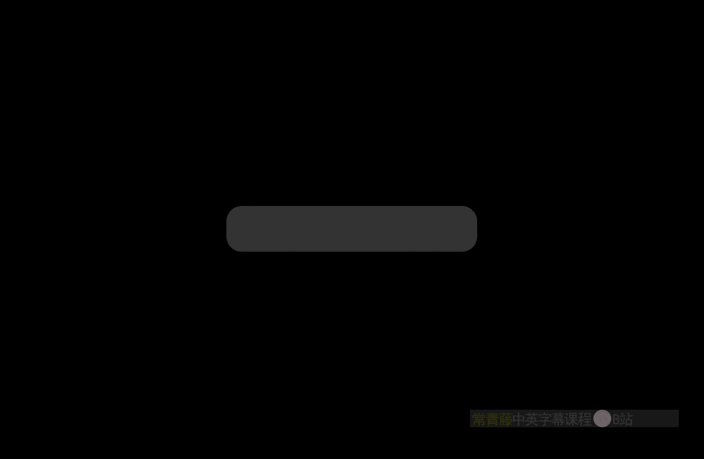
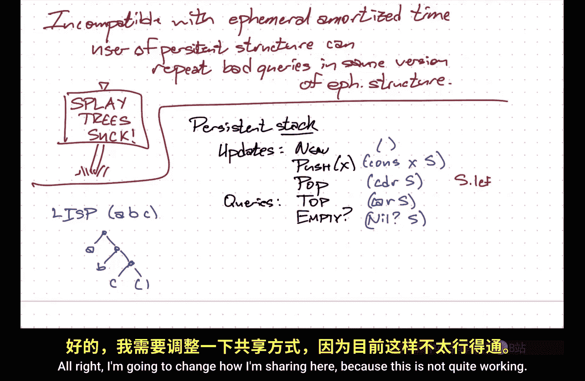
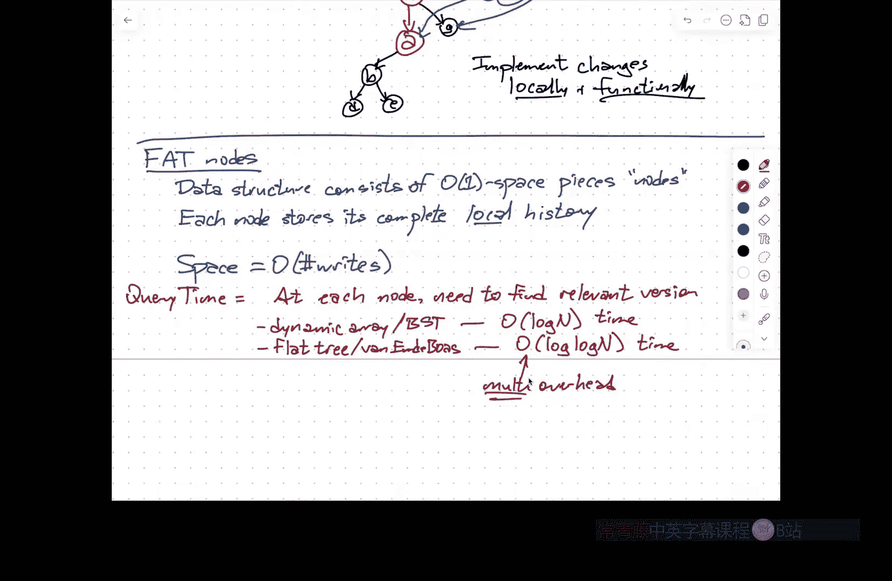

# 伊利诺伊大学【中英⚡高级数据结构｜CS598 Spring 2025, Advanced Data Structures】 p13 P13 持久化数据结构 -BV14qZYBJEZy_p13-

Administrative things。If you are an undergraduate。The drop deadline is this Friday。

A couple of you have already talked to me about not being completely sure about sticking with the class。

So u。Let me start by just。Laying out how I think the rest of the semester is going to go。

The paper chase is should basically already be done， I'll be grading those over spring break。

The next major hurdle is going to be the project proposal and then at the end of the semester。

 the project presentations and the final report。U。And I think it's worth sort of。

Calibrating where what I actually expect from the final projects and from the in particular from the project proposals。

So the stretch goal， the direction in which I hope you're going to be pointing your arrows before you shoot them。

 is eventually your project might lead to some publishable result。

But expecting that level of depth in a project where you've only been working on it for， you know。

Even Max one semester。m that's just not reasonable and I know that and I know that you know that and now you know that I know that you know that。

嗯。So what I'm really expecting from the final project report and the final presentation is much more along the lines of a progress report。

We tried these things， this was our goal。This was our you know lower order sub goal where we figured it would take some baby steps before we attacked the real problem。

 these are the things we tried， these were the small results that we were able to prove but we're still not entirely sure whether this is going to lead to the final result。

We did consider some special cases。 We did consider some simple variances。

 These are the next things that we would attack if we wanted to keep working on this。

We don't have an answer to the original question。That， to me。

 is an ideal project report at the end of the semester。We tried some stuff， we made some progress。

 we have some ideas where to go next， but we still don't know the answer to the problem。Um u。

And so this also， I think， should guide。Your picture of what I'm expecting from the project proposal。

Which is to come up with some kind of problem to aim for。

That hopefully has you some realistic chance of making some small amount of progress， but again。

 you're not proposing， I'm going to prove that people's NP in the next six weeks。

Or I'm going to prove dynamic optimality of spries in the next six weeks。It's more。

 here's this interesting open question that comes out of this paper。

 here's some background information about past related results。

 here are a couple of half baked ideas which probably won't work but I'll throw them out there anyway just as evidence that we're talking about as how we might take next steps。

That's the proposal。I'm also phrasing this all in terms of projects that are ultimately aimed at。

 you know。publishing ultimately in say algorithms and data structuress conference。

 but another possibility for what your project could be is， hey。

 I've been working on this geographic information system and buried inside there's this really what looks like a really brute force data structure to do this one particular task。

 I want to identify more theoretically efficient or develop more theoretically efficient data structures for this slightly non-standard application and try to get either a theoretical or practical understanding of how we can make that application more efficient。

It could be， here's a bunch of different data structures that all work on the same problem。

 for example， the range minimum query stuff we talked about at the very beginning of the semester。

Here is some context where that data structure is applied。

 let's implement several of these and do an experimental comparison to see what in practice actually works well。

Or I'm really interested in how different in comparing different approaches to let's say。

 maintaining balanced binaryering search trees。I learned about three or four of them in class。

 I found these other 25 of them doing a literature search， this is the proposal。

 I wanted to write a detailed survey of all of these data structures， that's the final project。系。

So there's a lot of room here to take advantage of your prior expertise。

 your prior research experience， if you have any or your prior internship to the extent that you can without violating NDs。

And matching to the kind of project that you want to do。So again， ultimately。

 the goal here is to make progress。Now， this is not， by any means an easy thing that I'm asking。

 I would expect that。The final project is， know， you're。

 you're probably looking at somewhere between。I don't know， 20 to 40 hours worth of work。

Spread out over the remaining weeks of the semester。

I am going to go through all of the proposals here in this room so that everybody will have access to all everybody will eventually have access to all of the paper chases。

 all of the written proposal documents。And you can pick and choose from those proposals or come up with something new。

In groups， the final also the final project， both the talk and the paper。

 you'll be in by defaulting groups of three， but if there's a strong argument for why you want to do something in a larger group。

 I'm happy to take that into account。嗯。啊。And again， everything here is meant to be。

To get you into the process of。Doing data structure ish research。

And it's more about the progress that you make in that direction than about some abstract final goal。

 so in terms of deciding whether or not you want to stay in the class or drop it's sort of a you know how much effort given the rest of your schedule do you want to put in。

 I really don't think you should be worrying too much about the grade in the end。嗯。As most， you know。

 it's unless you just don't turn anything in。Honestly。

 I'm expecting the lowest grade that I give in this class to be a B or a B plus。Um，Uh。

 I think most reasonable， I think the my default grade is kind of like， okay。

 you did something reasonable， that's an a minus。Really good a。It needs some work， B+。

There's not going to be like a percentage percentage point thing， it's really more based on vibes。

I'm happy to answer questions here， I'm happy to answer questions after class。

 I'm happy to answer questions at office hours on Friday if you have others。

I thought I set up great grade scopepe to be open through the end of the week。

I'll double check that after class， but yeah， you should still be able to submit in。Yeah。好再对。

You choose them。However you want。I'm not going to assign groups。UmOkay。

But I do want to remind you the project proposals do。Whatever that first Monday in April。

 that is a hard deadline because I want to be able to come in to this room on the first Tuesday in April and actually present all those proposals。

Okay。So。In terms of sort of new。Content。I want to talk a bit about persistent data structures。

 so the idea of a persistent data structure or another word for this is a multi version data structure。

Is I can make updates to the data structure， I can do queries to the data structure。

 but I also have access of some kind to past versions of the data structure。

So the simplest version of this。Is most file systems， including the one my。Laptop over here。

 use something called journaling。Where you can actually when you change files。

 it stores those changes in a way that at least within a certain time window。

 you can go back in time and retrieve， say， up to 48 hours， you can retrieve old versions of a file。

 it's more complicated than that， but essentially it means I can do queries on past versions of the data structure that my laptop calls its file system。

There are more complicated versions like Git。Where I can not only。Query the past。

I can also make branches and essentially modify the past， creating alternate timelines。

And I can even merge multiple past versions into new versions。 So this is usually。Done with the。嗯。

The following adjectives in front of the word persistent。

So partial is I can only update the most recent version， but I can query any past version。Okay so。

Update。Most recent。Query。Any past。Version pass， I'm using loosely。

It includes the most recent version。Full， I can either。Query or update。Any version？And confluent。

 I can do everything that I can do with fold， but I can also create new versions by combining old versions。

嗯。Come on。Green earring。So u。These three differ in what history looks like。

So for a partially persistent data structure。History is a sequence。So you can think of。

There being a list of versions。And when I perform an update at one end of that list。

 I create a new version on the end of that list。Okay， so I， I just make the list longer， full。哦。

I'm allowed to branch。So。嗯。History is actually a tree。And for confluent。History is actually a dag。

So I could do something。Like。This。You know， by combining， combining versions。

 get is closest to a confluent data structure。So today I'm going to pretty much exclusively talk about。

Partialial persistence。I'll mention other things in passing and then'll I'll talk in a bit more detail about about full persistence on Thursday。

 but one。one thing that I do want to point out almost immediately。Is that？

A sort of synonym for confluently persistent data structures is functional data structure。

So if you implement your data structure in a functional programming language。Lisp。

 if you're old racket， if you're not， then nothing ever goes away。

You're never functional purely functional programming languages， there's no such thing as state。

 you don't assign variables， you simply create new objects that represent mathematical structures。

 so as long as you can implement your data structure using a functional programming language。

Then as long as that data structure supports operations of the kind， merge or concatenate。

Then it automatically gives you something confluent， you just。

 you have a handle on the root of version7 of the data structure and then you wake up three days later and you still have a handle on version7 of the data structure and it looks exactly like version7 always did because it hasn't changed。

And。嗯。Generally speaking， most data structure research。We assume that state exists。

That you have things like arrays that you modify by just writing into the array that you have pointers that you could move around。

 functional programming doesn't let you do those things at least not directly， but if you can do it。

 then everything is automatically persistent。There is。A。啊。

Lovely book calledPurely Functional Data Structures by Chris Sokasaki that grew out of his PhD thesis in the late 1990s。

 I strongly recommend this book if you have any interest in data structures or any interest in functional programming。

 even if you have no interest in doing both of those at the same time。He， it's just really cool。Okay。

嗯。So。啊。Couple of warnings， though， abound。Infistant data structures。In terms of deficiency。

So ideally what I would like。Is so the goal。Is if I want to do a query。

Into a persistent data structure。What I like is as much as possible。

Query time to be the same as the query time in that particular version of the ephemeral data structure that I'm modified。

 so ephemeral is my version my adjective that means just one version， so if I say。

 oh I've got an AVL tree an AVL tree is an ephemeral data structure because when I'm modified it's different。

😡，the original data structure goes away getting exactly that time is not really reasonable。

 but maybe there's a small amount of overhead usually in。😡，The overhead is。

Characterized as the time to find the right version of the root of the data structure。

So i've got some say binary search tree over all possible versions I know the version number I just don't have the direct handle to it that extra step adds a little bit of overhead。

Additive if your ephemeral query time is already at least log in， that debt vanishes yeah。

isSo N I'm going to imagine for purposes of analysis here。

 I'm going to play kind of the same game that I play with amortized analysis。

 I assume you're starting with an empty data structure and then you do capital n。dates。

So Capital N is an upper bound on the number of things that could be in the data structure because you've done insertions。

嗯。So here。N equals number of。Updates or if you prefer the number of different versions of the data structure。

The other。Thing similarly， the update time。Should also be。You know。

 as close as possible to the ephemeral update time。Plus a bit of overhead。And finally， the space。

Ideally should be proportional to the number of times through the history。

 the data structure that I needed to write into memory。So you could， as a sort of crude upper bound。

 aim for any constant amount of time I spend on updates can generate a constant amount of space。

And some ways of dealing with persistence will achieve that bound。

 but a tighter bound here is the space should be the total number of rights to memory。

Or if you want to say differently， the number of times some piece of the data structure needed changed。

Through history。So this is upper bounded by the sum of the update times。嗯。Okay， this is ideal。Now。

When we've been talking about。Um。A lot of the data structures I've been talking about recently。For。

To keep the explanations simple。I've said， we don't care about worst case query time。

 we don't care about worst case update time， we only care about these times in an amortized sense。

That no longer works。And so the reason， you know， this is sort of incompatible。With。U。Ephemeral。

Amortize time。And the reason is pretty simple， let's take Sp trees as a particularly bad example。

 so spplay trees guarantee to have log n time per access to any node that's a search and insert search or deletion that's amortized time but spplay trees have no guarantees at all on the worst case time to do a search。

And in fact， it's possible to engineer a sequence of ss that makes the depth of the tree linear。

So let's imagine an adversary who creates a linear depth display tree。

And let's call that version7 of the Sp tree， and now the adversary goes， okay， query， query， query。

 query， query， hey， go back to version7 and query that really deep node。Okay，lah， la， la，h， he。

 go back to the Dorsion 7 and change that really deep node from a7 to a6。Okay，y。

 go back to version 7 inquiry， that really deep node。

And so the user of the persistent data structure can repeatedly perform the bad query in that version of the ephemeral data structure。

And so the overall， even in an amortized sense。Query time in the persistent data structure now becomes equal to the worst case query time in the ephemeral structure。

Okay， so the user。Of the persistent structure。Can repeat。Daad。Querries。In。The same。Version。

Of the ephemeral data structure。Okay， so。When I talk， for example about。Multiple source short paths。

I said， oh， hey here's this， we're going to be using these dynamic forest data structures。

 we're going to be imagining how the shortest path tree changes as we move the source vertex around the boundary of the outer face。

We don't know what distances the user is going to want to ask about。

 but it's fine we just make that data structure persistent。And then later， if if data。

 if the user wants to know， hey， what's the shortest path distance from this node on the boundary to this other node。

 it goes back to the version of the shortest path tree where this node on the boundary was the root。

 and it does a query for the distance at that other interior node。 That's great。

 except when we described all of the dynamic forest data structures。For simplicity。

 I just built them out of Sp treess。So。In order to make that data structure persistent。

And still efficient in in that persistent setting。I can't use s trees。

 I have to use an underlying balanced binary search tree that has worst case logarithmic update insertion deletion query times。

😡，系。Um， so then I have to go back and go， okay， there are weighted versions of red black trees。

 there are weighted versions of AVL trees， there are weighted versions of bee trees that I can use here。

But I actually have to do that in order for persistence to work。

 no matter how I implement persistence。Because I could always just get unlucky and go back to that old defemeral version that had some node at linear depth and that's the one I want to query over and over again。

嗯。There's a second problem with s trees。Which is this whole architecture is sort of built around the idea that the ephemeral data structures in past versions are read only。

But s trees， when you ever you query them， you are also doing an update。So that's fine if you know。

 you want to do。Full persistence， because then every query into the past is branching off a new version。

But if I only want to implement partial persistence。

I can't do it with S trees anyway because the ephemeral data structure changes whenever I do a query。

And I'm not allowed to change the past。喺。So short version here is。

As lovely as play trees are for other things。In terms of persistence。Spplayre suck。He。

 we have to use something else。呃。And I might mention in passing when it comes to that。

What alternatives we can use？嗯。So I want to think about one more really simple example to kind of make sure that everybody's on the same page for how this works。

And that's the idea of just a。Psistent stock。Okay， so a stack is a data structure that maintains a sequence of things。

You can add something to the beginning of that sequence that's called the push。

 you can remove something from the beginning of that sequence， that's called the pop。

 you can ask hey， what's at the beginning of the sequence that's a top so the kind of updates you can do or give me a new stack。

Push。Some new element off。 pop some new element。Pushing a new element on， pop an element off。

And the queries that you can perform。You can ask what's on top of the stack？

And you can ask whether the stock is empty。Good。So there's a really， really easy。

 really simple way of implementing stacks。Persistently。And ultimately。

 this is your first introduction to Lisp if you've never seen LiISspP before。So。

LiISspP is designed around the idea of manipulating lists。

Sequence finite sequences of das usually surrounded by parentheses， but under the hood。

These lists are actually represented by binary trees。Now they're really skewed binary trees。

Lisp generate， you know represents the list， you know ABC by a node that has an A on the left。

 the node on the right has B on the left node that has C on the right and then a null pointer so the listsp internal representation of the list ABC is this skewed binary tree going down to the right。

Where the left child always represents the first element in the list and the right child represents the rest of the。

的。打工。How thatOkay， so for now， let me assume that you actually have a pointer directly to the head of the version that you want to query。

I mean， later what you would do is if you're doing at least partial persistence。

You would just keep a record， an array， a buying your search tree of all versions over time where I could use。

Do binary research， for example， given the timestamp that I want。

 it will return it will I can find the pointer to the head of the data structure at that time。在来比较审。

水排对。Yeah， so one of the fundamental assumptions I need to make in order for this to work。

Is they're not necessarily all pointer based data structures。

Some of the techniques actually will require this， but you access the data structure from a constant number of addresses。

So if it's an array， you've got a pointer to the beginning of the array。If it's a tree。

 you've got a pointer to the root。If it's a forest。

 you a set of pointers that goes to all of the roots。嗯。And。

So you've got one way into the data structure or order one different ways into the data structure。嗯。

So that's what I'm referring to as the head of the data structure。

 the more general term Id guess is access pointer。But here， ultimately。

 what I'm going to do is I'm going to represent my stack as a list。Okay。And Lisp defines。

Commands for initializing lists， combining， creating lists， extending them。

 And I'll just write down the definitions。 So new， I'll just return the empty list。

It's just a mill pointer internally。Push X。I use cons operation。

 so this means give construct a binary tree whose left child points to the new item X and whose right child points to the old stack。

系。嗯。Park is。Hey， just give me a pointer to the right child。Top is， hey。

 just give me a copy of the left child。And is empty is。You know， nil S。If I want to write these。

 not in list。呃。I can say this is S sta left。This is return S dot right。This is， you know， S equals。

No。And push is creating a。New node。 Why is it not mirroring。Interesting。嗯。

All right， I'm going to change how I'm sharing here because this is not quite working。

Right， so push is it creates a new node with an explicit left pointer to x and an explicit right pointer to s。

And now when I'm doing this， what I get back out is a pointer to the head of the new stack。

And I just put that pointer in my pocket。 And then later， I say， hey。

 remember what the stack look like at Three，12 PM。 Oh， oh yeah。 I have that right here in my pocket。

 There it is。And I could execute these commands and still do pushes pops and tops。

And test empty and so on Okay so this is sort of one of the ways that you know doing things in a functional programming language actually helps when you define a new data structure。

 you create objects， but you never actually change the objects themselves。

You just create new objects with pointers into old objects。And so over time， the persistent stack is。

Going to have a bunch of pointers flying around。 So if I decided to take this stack and pop off the a。

 then I would get a pointer to to， to this note here。 And then if I decided to push on an X。

 I'd get a new pointer。That。Points to。An X left child and its right child would point to the snerd。

And so you end up with this weird conglomeration of ultimately， it'll still be a forest。

UUh but it'll be just a forest where different versions will point to different nodes in the forest and go。

 well， from here down，um I just have a regular binaryary tree that represents a list。嗯。Okay。So。

That's sort of the basic idea。Of what persistence is。 any questions so far。Okay。So。嗯。Let me。

Talk about one method for doing this。And you know I'm talking about these methods for making data structures persistent in a fairly generic way。

 I'm not making a lot of restrictions on what a data structure is。Path copying for this method。

 I actually do need to make one sort of restricted assumption that。

The the data structure consists of。A rooted forest。So it's a。Poiner based。Structure。

I have a constant number of。Root pointers。And for every。Noode。Has a unique。Pass。From。A unique。Right。

So the only way to access a node。In one of these data structures is to somehow know the root of the tree that contains that node。

Start at that address and walk my way down to the note。Okay， so this is not all that restrictive。

 almost any binaryary tree has this property， any linked list has this property。

 larger tree data structures have this property， forest data structures have this property as long as the number of trees never exceeds a constant。

Even the number of access pointers， the number of root pointers being a constant is not that stringent a requirement because you can build another catalog data structure on top that organizes the root pointers into a tree。

嗯。But in particular， I can't allow things like。Arays， so I can't make a hash table persistent。

Using this path copying method。Okay， so。The idea is actually relatively simple。So here is。

You going to say a binary tree， and suppose I want to make some sort of modification at this node my binary tree。

Then what I will do。Is。Copy。Everything on the path from the root。To that new node。

So I'll make another copy， another copy， another copy。

And whenever I have a pointer from a node on the path that goes off the path。

I'll keep the value the same as。What it was in the original data structure。Okay， now notice here。

One one example to keep in mind is the tournament trees that we used as one of the ways of solving the minimum range query problem at the beginning of the semester。

 so you imagine a perfectly balanced tree that has values at the root and then every internal node stores the minimum of the values of its children and then if I want to do a minimum range query。

 I can do it by accessing logarith number of these nodes。

So if I'm changing a value at one of the leaves in this tree， that propagates up。

 but in the ephemeral data structure， it doesn't necessarily propagate all the way up to the root。

But in the persistent data structure， I have to propagate the copying all the way to the root。

 even if the only data that's changing is in that one node。系m。

So now this would be like this is version one and after that update， this is version two。

Buts being now is parent， so the version three has point version to them right？Right。

 so if I didn't update the parent， then in particular I wouldn't update the root。

Now I want to query version two。How do I get to that new note？By following pointers from Ro one。

Now this is one way to do that is just to say， okay， I mixed every time I have an update。

 I'm going to create a new route with that the version pointer points to。

 and I could just chase the pointers normally from there， this gives you the path copyping thing。

 this is not the only thing that one could do。But we'll talk about other methods。In a few minutes。系。

So。啊。Quries。Is to sort of just。Like。The ephemeral structure。

So if I now want to do a search in version two of this binary tree。

I just treat version that pointer that node that version  two is pointing to as the root。

 and I do exactly what I would normally do in the epheral data structure。

Every node still has a pointer to most two children， if this is a binary search tree。

 then every node has larger keys on the right and smaller keys on the left。

If this is a tournament tree， the values at the nodes are still the minimum of the values at their children。

So I just。Only see the new version effectively okay。Updates。Well。

The amount of time to do the updates is for the update to one node。Is the length of that path。So。

This is。嗯。Let's say。啊。Path length。Per node。Update。And this is both。Time and additional space。喂。

So exactly what that is it's going to be data structure dependent。

 but for example if this is a balanced binary search tree。

 that pathlink is always going to be lo n and if applied naively it's per node update now if you happen to know that during an update。

 the only nodes that are going to change all happen to lie on that one path then you could just copy that one path。

If you happen to know that there's some top subte that contains all of the changed nodes。

 you could just copy that top subte。 but， but sort of naively， if I think of it as， well。

 I don't want to think about how the data structure is organized just whenever you write into that node。

 I need to create a path a copy of the path leading to that node。

Then your overhead per right is proportional to the depth of the data structure。系。So this is for。

 say， binary search trees。Um， you could you can bite by。啊。The space。Is the sum of the。嗯。

Ephemeral update times。Because each update to a binary search tree， you walk down the path。

And then you insert the new node。And then you have to copy that path。Or you delete an node。

 or you change the value at an node。You have to update that path going up。No。

This is for an off the shelf binary search tree。嗯。For most balanced binary circuitries。

 updates are a little bit more interesting because they involve rotations。

And one of the things that if you're implementing rotations that makes them easier is if you have explicit pointers from each node to its parent。

But if your data structures has pointers， from nodes to their parents。

 the assemblage of pointers is no longer a tree。There's a pointer from a node to its left child。

 which has a pointer back to its parent， that's a cycle。Okay。

 so implementing this in its current form， this is really， you know， no parent。Pointers。

Because I'm not allowed to follow pointers upwards。

 I'm only allowed because that would violate the constraint that there's only one way to get from a root node to any particular node。

佢。So one of the things that one might need to do。If figure out a way of taking。

A more interesting data structure， a binary search tree that has parent pointers。

 or you know without wanting to do this， you can do rotations。

 the necessary rotations for red black trees or for AVL trees。For example。

 by just being very careful with how you manipulate stack frames so you recurse your way down and you pop your way back up and essentially you're storing your own local copy of that entire path going down。

So you have access to the parent pointer because it's sort of just a local variable in that particular stack frame。

 but there are lots of data structures where。Yeah maybe you don't want to do this。So there's a way。

Of。Encoding。嗯。Binary search trees。That。Allows you to， in some sense。

 use parent pointers without violating this constraint。And the idea is that。

The data structure called a zipper。This represents a tree plus a pointer。To an arbitrary node。

And that pointer is usually called the finger。嗯。On。

And this is going to be subject to operations that are local to the finger。😡，You can。

 if you don't want to manipulate the structure， you can， you know。

 go from the root and walk your way down， but actually you're going to need to go from the finger and walk your way out。

 but。啊。It also allows you， for example， to move the finger and that will change the zipper data structure that represents it and so using this zipper data structure。

 it's a little bit easier to implement things like walking down up path in a binary tree and then walking back up。

So the idea。Is let's。Take， I'll just pick a。A binary tree here？A， E， C， D， E， F。GHI。

 and let's say that I my finger is here。The intuition。Is that I reverse？The root， the path。From。

The root。To the finger。So again， thinking about this in terms of paths。Now。

 all of these edges I'm imagining are in the abstraction pointers going down。

But I'm going to play the same game that I played when I talked about。

Reversing a path when we were doing like path decompositions of trees and I wanted to assign a new path a new node to be the root。

 I said， oh it just here's my preferred path， it' stored in some binary tree I just reversed the order in that binary tree。

 that's the same as reversing the order of the nodes in that path。

This is exactly the same game that we're playing here。

 so then the representing the zipper data structure that have a node F which has left child H and right child I。

 but has parent child。C。Parent the node C has right child G， and it also has parent child A。

Parent child A also has a。Right left child。第。一。In addition。

Each of these nodes on the path that whose parent is below them。Records a bit that says， hey。

 in fact， I'm either the left child or the right child of that node that I'm pointing to。

 so F knows that it's a left child， C knows that it's a right child。

 A isn't a child of anything so that doesn't make any sense。Okay。

 so the tree based representation of tree+ pointer。

Is this slightly inverted tree where now the root might have three children？

All every other node in the tree might have w only have2， but of three possible species。

 So a node can have a left child。 It can have a right child or can have a parent child。

And if it has a parent child， it also has a bit to say。

 I am the left in the tree that I'm representing， I'm the left child with my parent。

Or I'm the right child of my parent。Now say if I want to move my finger up。From F to C。

 that means that I need to reverse this edge from C to F when I do that in my persistent data structure。

嗯。The way that I will do that is。C is now the new route。Its new left child is F。

The children of F will be。The left child will be。H， the right child will be I。

The right child of C will be G and the parent child of C will be A。So whenever I move the finger。

I only need to swap the order of two nodes， which means I only need to update I don't know。

 most six pointers。And create a constant amount of space。So if I implement， say。

 red black trees using a zipper。Then and in fact， I can do this in a way there are Python packages that you can say。

 oh， you've got a nice little pointer base tree， just put a wrapper around it to represent it as a zipper and in fact。

 a persistent zipper。When I walk down， I just move my finger down to the node that I want to add。

 insert the new child， walk my way back up， move the finger around and do rotations by assigning pointers。

 walk my way back up。And so the necessary modifications happen automatically。

 but all broken down into these operations of moving the finger and possibly changing one component of one node。

嗯。And so this avoids some of the issues with path copying， but in particular。

 it allows you to implement。嗯。Red black trees， AVL trees， if you really wanted to sp trees。

Functionally。As functional data structures we like Okay。

 so the user just thinks this is the data structure。

So the user's queries and updates are all in terms of this data structure。

Those update subroutines involve moving the finger around。And so internally。

 it's using the zipper data structure。To do those queries。

 but at the beginning of an operation on this data structure here on the left。

The finger starts at the root。And if I'm doing the binary search， for example。

 if I need to update something， I would walk the finger down and then walk it back up and that walking creates new versions。

Right， so I also， when I need to update something。In the data structure， say。

 I need to update my left child。The thing I'm updating is either the finger or one of its children。

And so the path copying stuff is only copying the path to the root of the zipper。

Which is only a constant amount of stuff。Not copying the path all the way to the root。 Now。

 in the end， I am， in fact， still doing work proportional to the length of that whole path。

But it's all done sort of locally， and even though it's locally path copying。

 all of the internal paths that I'm copying just have constantly。Okay。Great。嗯。So among other things。

 this means that I can now by just implementing a red black tree as a zipper。

 I can now turn it into something functional， and now I immediately have fully persistent red black trees。

 and in fact， if I push further to say， you know allow concatetnation of red black trees or splitting of red black trees。

That concatenation allows me to do confluent persistence as well， yeah， there's a question back here。

所以这个。The zipper is the data structure。The user thinks this binary on the left is the data structure。

But under the hood， the actual arrangement of data and memory is the zip。Yes。

 I'm just maintaining the zipper。And I mean， it is， as an ephemeral data structure。

 the zipper is a binary tree， except maybe the root has three children。

And there's some different semantics on what the two pointers coming out of the other nodes might be。

 yeah。好的。I'm sorry。So where do we point the finger to， So the what I'm imagining is。

In binary tree world， you have an update subroutine that has a local variable in it that you use to walk down the tree。

 perform some rotations， walk up the tree， perform some rotations。

 walk back up the tree that local variable in your ephemeral update structure for the binary tree is the finger。

找到你试一下。You write a date you say oh， I have an AVL tree。

 Here's the here's the algorithm for inserting something into an AVL tree。 Let me look at the code。

 Oh， there's a local variable。Pointing new a note。That's my finger。

YouYou choose the finger by basically characterizing how your ephemeral updates work。In terms of。

A single address。Would you move around the tree？Like you remember how s trees work？You to do a query。

 you walk down from the root to the target node and then you split your way back up。

This thing that I'm pointing to， you walk your way down to the root that you're moving the finger down the tree to the target node。

 then you move the finger up two levels and then do some local adjustment。

 then move the finger up two levels and do some local adjustments。

And eventually get back to the root。So it's just a very。

 very general way of describing how a lot of data structure updates work。

It's not like I'm designing a new update algorithm。

 I'm trying to exploit existing update algorithms in this functional way。In in structural one。

Right now，Okay， so over here on the left， if I wanted to do a rotation at F。 Okay。

 so the way one way I would do that is to say， okay， first， I'm actually going to move。

The finger to A。Because a is going to have a different child after the rotation then。You know。

 for example。Finger dot right is equal now is assigned to finger dot right dot left。

Figure out right got left。Thought right goes to figure out right。

So you can do once you have appointed A， and you know which of the children and grandchildren you're doing the rotation at。

You can write the rotation。Carefully by doing a bunch of local。Pooner Jason。高比A是简单。

 any node that has anything changed about it？I would make a copy。So I think in this case。

 the only nodes that would have anything change are AC and F。A has a new child。

F becomes a child of A， C becomes a child of F。C no longer has F as one of its children。

 so those three nodes are changing。Right， because we have no powerpointers。Okay。嗯。So can。Implement。呃。

Changes。Locally。And functionally。All right。So that's path copying。嗯。There is a。You know there。

You don't want to say anything else about about half copyping， no， I don't think so。

I want to talk about the other。Sort of baseline implementation of persistence。

Something called fat nodes。嗯。This means something else in。Systems land。This just means big。So here。

 the only thing that I am assuming about my data structure。诶。Consists。Of。Order one space。U he says。

Which I'll call nodes。嗯。But this doesn't necessarily have to be a pointer based data structure。

 one of these pieces could be， for example， a cell in a two dimensional array。😡。

Or I might have you know multiple arrays with pointers between them flying around。

 so just that I need in the ephemeral data structure to be able to logically block off this chunk of the data structure of constant size is a node。

系。And then the idea is really simple each node。Stores。It's complete。Logo。History。Okay， so。Well again。

 I have a balanced binary tree。I I just watch this node V and the code says change V dot left。

 It's like， okay， new version V dot left。Okay， change V dot right， Okay， new version， V dot right。

 change these parent， Okay， V parent new version， change the search key the okay。

 great new V dot key is's a new version。Every time you write some new information into the node。

 you create essentially a new copy of that node。And you just store that new copy now from the point of view of practicality you wouldn't actually create a complete copy of the new node。

 you would just store， hey， the left pointer changed from U to W， hey。

 the key value changed from7 to 12。But since the nodes all have a constant amount of space anyway。

 for big O bounds， you might as well imagine copying everything。听。嗯。So。

This is great in terms of space。So every time you write， you allocate。

A constant you use a constant amount more space in your local history。

 and so the total amount of space across the entire persistent data structure is equal to the total number of rights。

In used to create all versions of the data structure。Just is the best you could possibly hope for。系。

The main issue， though， is time。So。And in particular， the time to query past versions。He so。

Query time at。Each node。We need to。Find。Relevant。Version of that node。Okay。

 so what we imagine happening is if we're doing， just say partial persistence where history is just a list。

I define time to be the number of updates。😡，And so when I want to query a version。

 I pass in the timestamp。Says I want to know what to do with this node in version 17 to the data structure。

So I need to find the latest time before 17 where this node was modified。

 and then that will tell me the correct values in that node at time 17。咁。Now。

 exactly how you would do this depends on the data structure that you're using to store your history。

 so if you're using something like。I mean， history is always for partial persistence。

 history isn't growing， it's just a sequence， so you could use a dynamic array。

That's sorted by time or you could use some sort of balanced binary search tree， then in that case。

 finding the predecessor in your local history of the timestamp takes log end time using binary search if you're using an array。

 the balance binary search trees， it takes log N time to do the search。Okay。On the other hand。

We do know that the timestamps。Or by definition， integers between one and capital n。

And so it turns out that if you know that your search space is a set of integers between one to n or some subset of that set of integers。

Then you can use a data structure called a flat tree or a。Van M de Bois tree。

To do those predecessor query in log log end time。All right so it's not log n， it's log log n。😡。

Roughly speaking。The way a flat tree works when you're doing predecessor queries is you look at the first half。

The binary representation of the。Of the time stamp you're looking for。

And one of two things must be true。 either there is a timestamp that has that same in in my history。

 that has that same first half。In which case， my predecessor。

 I can find by recursively looking for the second half。Or。

The correct predecessor is the top half of the predecessor is actually determined by the predecessor of just the top half。

So it's essentially a divide and conquer algorithm over the binary representation of the timetamp。

 not over the space of possible keys。I'll talk about this in more detail sometime after break。

 but it lets you reduce the log to a log log。Now， this is the time to access a single node in any version of the ephemeral data structure。

 so the time to do a query is going to be whatever the epharial query time is。Times this overhead。

Not plus， but times。Okay， so this is multiplicative。Overhead。Log log N is for all practical purposes。

 five。So from a theoretical standpoint， well， from a practical standpoint。

 from a theoretical standpoint， from a practical theoretical standpoint， this is probably done。

 but what I'll start with on Thursday is a way to actually bring that multiplicative overhead down to an additive overhead。

Um u。Essentially， one way to think about what's going on is you're sharing information between the different predecessor searches at different levels of the data structure。

嗯。Instead of having to redo the predecessor church from scratch at every node。

And I'll also talk a bit about some。This will require a little bit more work to actually make this work in the case of full persistence instead of just partial persistence。

So that's as much time as we have right now， sorry for going over。

But I'm happy to answer any questions。

