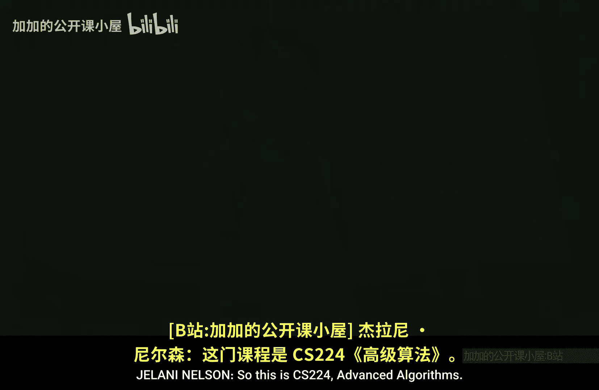
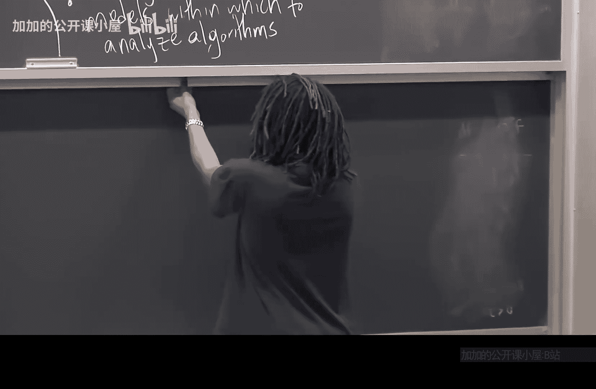

# 哈佛大学【中英⚡高级算法｜Fall2014 COMPSCI224 Advanced Algorithms】 p01 P1 -BV1zNSCBkEgW_p1-

So this is CS224 Advance algorithms。My name is Glai Nelson。呃。And we have a Tf who's in the back。

Jeffrey with his hand up。嗯。If you want to contact us？You should email CS224 F14 staff。At sea。harvard。

edu。Also， there's a yellow sheet of paper that's going around。Fill it out。

Let's see what else should I say and there's a course website。

So I won't bother writing the UL of the course I was on the board。

 just Google the course or Google my name， and it's on link from my website。

One thing I will say about the course website is。We have a mailing list。

So please go to the website and sign up， put yourself on the mailing list。

Before I get started with things， I guess I'll tell you some logistical things about the course。

 and I'll tell you what the course， what the goals of the course are。

 and then I'll start on something okay。So logistics。Oh I completely did it backwards。So。

There are three components of this course in terms of grading， one is  scriibing。

And this is 10% of your grade。Basically， you just do it and you get the 10%。

 so there's no textbook for this course。Students will take turns。

Taking notes on what I say in lecture and the course is recorded so you can go back over the lecture。

And see anything you missed and then basically write up some lecture notes。

In LaX describing the lecture， and there's a template on the website， a LteX template to use。

Two is PSetsets。That's 60% of your grade。Okay， and the third one is a final project。

Which is the remaining 30%。And that's just written okay。

 so there are details on the website about the final project， you do it。

 the last day of reading period you submit your project。And。I read it， okay。

 so let's see final project， so there's a proposal for your final project。Do。

 I think it's on the website， but I think it's October 30th。And then。Project。Do。

Last day of reading period。Okay。So yeah， I'll read through the proposals and make sure I like the idea of the project and give you feedback。

Regarding it， and then you spend the last six weeks working on the project， roughly six weeks。

Let's see what else。PEets， all PSsets should be lawteed。And you submit them by email。

 and also PSs have page limits， meaning。Your PS should not be longer than the specified page limit it。

Okay。呃。To avoid people just typing mindlessly if they don't know the answer to it a problem。

 actually， brief solutions are appreciated。There's one part of the course。That。

So we'll see how many people actually stay in this class right now it looks like a lot。

 but you know it's shopping period。Depending on the final size of the class。

 or actually this will most likely happen。Students will also take turns being graders。

 you probably only have to do it once during the semester。

 but a team of maybe three to four or some number of students together with the TF will meet once a week or once per PSet and do and grade that PSet okay so that's a required part of the class。

嗯。Students。Have to。Be graders。At least once。Okay， and these things are first come first serve。

And have to describe at least once， possibly twice if the class gets very small。

 these things are first come first serve。If there's a date that you really want。

 you know you'll be available to scribe， for example， then sign up right away before it gets taken。

 also scribe notes are due the following day， so you have a little more than 24 hours toscribe your lecture notes。

 they're due 9 pm on the following day。And。Is there something I wanted to say about that？Yeah。

 I mean， I know it's a short amount of time so just do the best job you can and then。

I might make a passover to myself and make some edits。Okay。Good。So。

I think that's all I want to say about logistics， any questions about that？对啊。

Thanks to notes in some' sort of get repository。OhO。Like just putting the。I put them in okay。

 I maybe talk to me afterward because I。Anything else？

Only a subset of students will be describingibing each。嗯。

know one person will be the scribe for that lecture， actually yeah， I need a scribe for today。

 so who thinks that they're going to be in this class for sure and whos willing to describe today's lecture。

Okay。Good。Any other questions？Okay。呃。Okay so this is advanced algorithms。

W who has taken CS124 or some form of algorithms course before this？Okay。A lot of most people。

 I guess。So。I guess the main difference between CS 124 and CS 224。 Well， well first of all。

 I guess algorithms is very broad。 So even though 124 was a whole semester of algorithms。

 we didn't see。All there is to know about algorithms even in terms of topics。So in 224。

 we'll see some models。For analyzing efficiency or some measures of efficiency or models of algorithms that we didn't see in 124。

Also， I guess it will be more。Theory focus， there won't be any programming assignments。

 although for the final project， you can do an implementation project that's described on the website。

 but the PSets will be purely just written PSEs， okay no programming。U。What else do I want to say？

So I guess the goals of this course。I guess they're what you would expect。呃。Increased ability。To。

Analyze。And create algorithms。We're going to see lots of different techniques in this class for analyzing algorithms。

Many of which were not in 124。And also modeling。You know， creating。Looking at different models。

Or seeing， know inspiration from models looking at different models within which。

To analyze algorithms。So in 124， we usually just looked at， say running time。And running time。

 we didn't， I guess， really ever define it， it was just the number of steps of the algorithm。

 and we also looked at memory， minimizing the amount of memory used by the algorithm。

 but here there will be other parameters that we'll look at as well。Okay。嗯。So。

I think I'm just going to get started。And I use the drawing board first。

So speaking of models。嗯。So who here has seen sorting？Okay， good， that's what I expected。

Who here knows that you can't sort n numbers faster than N log N？Okay。嗯。So。

That's actually it's a lie to you。 you can sort I as fast and and log in Okay。

 so today and the next lecture。We're going to see some。

