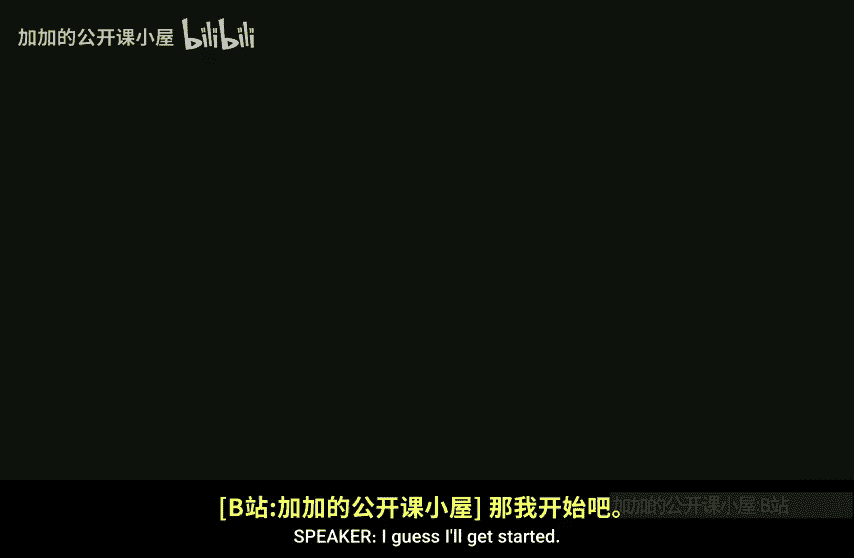

# 哈佛大学【中英⚡高级算法｜Fall2014 COMPSCI224 Advanced Algorithms】 p02 P2 -BV1zNSCBkEgW_p2-

I guess I'll get started。

So today we're going to do fusion trees。 but before I do fusion trees。

 I just wanted to say one thing about。Vom de Boaz trees， which we did last time。

 So somewhere in there。 So we did venom de Boaz trees。 and then we did whyas trees。

 and they got the same bound。The argument， so for venom Du Bos trees。

 I mentioned instead of using a arrays， use hash tables。

And then you'll get O of N space instead of O of U space。Okay。It turns out that there is something。

 So it turns out that there's even an exercise in CLRS。Exercise 20-1 part F。

 which says exactly that prove that if you use hash tables instead of arrays， you get linear space。

And what I told you is actually their intended solution， but it turns out that there's an error。

 There's a very subtle error so the argument that we discussed in class that gets O of N space is not really O of space。

 It's slightly worse。 and it's not just the argument。 It actually doesn't get O of space。

 So that's going to be a Pet problem。 I'll tell you exactly which sentence I said that was wrong。

 And you have to tell me why and fix it。 Okay so。But you can get O in space and you'll see that on the Pet。

Okay so。And why fast trees， as I described， actually do again event space with this indirection。Okay。

 any other questions before I start？Yes， okay。Now we'll do fusion trees， so fusion trees。Remember。

 we're solving the predecessor problem？This is due to Fredman and Willard。And I guess 93。嗯。Right。

 and we're going to look at the static predecessor problem。 later after their paper。

 it was made dynamic， So there was a paper by Anderson and Thororp。

So here we have Anderson Thororrop。And they got。嗯。An update time of。

Log base W of N plus log log U or log log n， sorry， updates。And it's deterministic。And then later。

 Ramen。Oh and are you scribing today， okay。Got。Log based W of M。Updates。And this is expected。

Expected running time， So it's a randomized algorithm。ok。in all cases， the query time。

The query time is O of log based WU。And then okay。嗯。I'm going to show you just the static version。

 not these two that gets query log based W of N。 And there's going to be some。

Polynomial time amount of pre processing。 It actually won't be that bad， but it'll be。

More than sorting time。To actually create the data structure。

 given the static points in the data structure。So that's why you can't use it for sorting。

 it's something。We talked about last time。But you could use the dynamic versions for sorting。Okay。

So the basic idea of fusion trees。Are to have instead of binary search trees to have。

K are research trees where K is。Bigger than two， okay。

 so we're going to have so a fusion tree looks something like this。Okay， so。Actually。

 just a show of hands， who here has seen or heard of either two， three， four trees or bee trees。Okay。

 so a large number of people， but not everyone。Okay。

 so the basic ideas give me this Paul is let me actually write it a different way。

Every node is not going to have one key， but it's going to have， say roughly k keys。Okay。So。

 we might have。5，15，27，32 and 48。 These are sorted。Okay and。

Hanging off this is going to be a subte of everything that has a key less than five。

Hanging here is going to be another tree of everything between 5 and 15。

 everything between 15 and 27， etcter。And then there's a node here。

 there's another big fat node here， et cetera。And then each one of these branches in many directions as well。

Okay， so that's， that's the basic idea behind。These know。

 having larger air trees than just binary search trees。Yeah。So these are sorted。

So everything hanging off here is less than five。Everything hanging off down here is between5 and 15。

Right， so right in a binary tree， there's just a single key in the node and to the left is bigger to right to the left is smaller to the right is bigger。

Okay， so。So we're going to have。This basic structure。With K。Being theta of W to the 1 fifth。Heese。

P node。Okay。So。You know what is the height of this tree？If you have， in general， in terms of K。

 what's the height of this tree。Yeah， log based K of N， right， And that's， you know， so we're having。

So。That implies the height。Is。Well， it's O of log base W to the fifth。Of N。Right。

But if you just remember what your base， your log arithmetic， this is the same thing as。

Log n over one fifth log W。Right， which is just the。L based W of N。 So this is where。

This is why we're hoping to get log based W ofN。有谁？But there's of course， a problem here， which is。

Our time is not just the depth of the tree。 You know。

 we have to also take into account how much time we spend at each node of the tree， right， so。

Kind of naively， what you might think to do is start to the left and then go see where I am and then go down。

Okay， that will take you k time per node so you get k times log base K of n。

 which is always worse than log base2 of n。You can do a binary search。

Then you would get log K times log base K of n， and the log K is canceled and you just get log n again。

Okay， so really， I mean， to make this work really， we can only spend a constant amount of time per node。

Okay。嗯。Now。Does anyone see something that's like blatantly。

Something I just simply can't work about that。Right。

How are we going to spend contents So there are w to the 15 keys in here。Okay。

How much space does each key take？Not， not log W， but W。 A key， A key fits in a word， right。

 So the amount of space to represent a node is w to the6 fifths。

We can't even fit it in a single machine word。 So how can we process it in constant time，嗯。

So we're going to have to develop some techniques to get around that。The basic。Issue。Is。How。Do we。

Search。A single。Fusion tree node。In constant time。So with thenim Boaz trees， you know。

 using the word RA model， we exploited the fact that keys were themselves also kind of memory addresses。

 and that's how we were able to beat this。Comparison based lower bound。Here。

 we're going to go way more overboard with using the power of the word Re model。 Okay。

 so you're going to see a lot of bit。