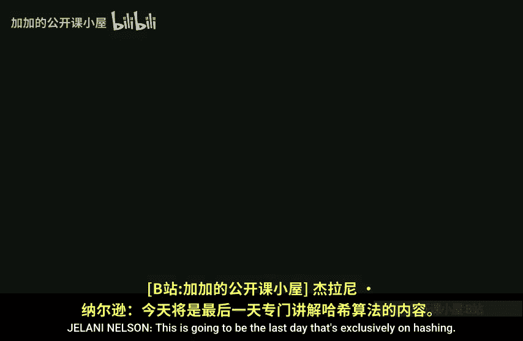

# 哈佛大学【中英⚡高级算法｜Fall2014 COMPSCI224 Advanced Algorithms】 p04 P4 -BV1zNSCBkEgW_p4-

Is going to be the last。

Day that's exclusively on hashing。I just want to correct dilemma。

That I stated I guess the end of class or at some point in class last time。

It was related to cuckoo hashing。Well before I do that only today。

What are we going to talk about today？So we're going to finish linear probing。

And I'm going to show you how you would argue about it with fiveY independence。

 it's almost the same proof as sevenYs。One trick that you have to observe。

I'm going to talk about approximate membership。So this is bloom filters。

I'm going to talk about cuckoo hashing。Blueie filters。

Which solve a different problem than moon filters， well generalization。I'll about。

 I'll say a little bit about like。The power of two choices。And6 is， well。

 I might say some other stuff， okay so。嗯。Okay， so before we start with the five Ys， I just want to。

Very quickly recap the seven Y and tell you what thelemma was that I should have said。

 So the dilemma that I should have said。 So let's recap。This is for linear probing。Okay。And。

We have an array， so we hash。To an array。Of size M。And I think I assumed that M was。You know。

 like at least let's say2N。Okay。And。We said L。So let's say I。Eyes and interval。Of。Aray locations。

And then I saidL。Is the number of J in the set s S is the set of things that live in。

 the keys that live in our data structure。Such that H of J。Is an eye。'sThe size of that set。Okay。

And I gave a definition。I said that I is full。Okay。If L of I is at least the size of I。

So then I stated some lemma about the number of probes relating the number of probes that we do in inserting X to full intervals。

Here's ama that I should have stated， which I sent by email。 By the way。

 is everyone here on the class mailing list， Is there any， please raise your hand if。

 if you did not receive an email about。Well， about class related things， raise your hand。So。

 I guess everybody's on it Okay， so if someone's too shy to raise their hand。

 you can go to the class website and there's a link to sign yourself up。Okay。

 so the lemma that I should have said is。If。Inserting。X takes。K probes。Then。H of x。Is contained。

And at least。K full intervals。Each。Of length。At least K。Okay。And the proof of that。

It is you draw the array。H of x goes somewhere。Okay。And some window about this is taken。

Is occupied by items while I'm using。It's just。Some window is taken up by items。

 and then there's a free spot and then also going backwards， some window is taken up by items。Okay。

And the point is that。And this is empty。And the point is that。This interval here， this interval here。

诶。It lands somewhere， so H of x will eventually go there。This interval here。

 including the item X itself， is a full interval。Okay。So if you just take。

 so any prefix interval is also full。So if you just take the K。

The K different prefix intervals that start with here。 So like this one， take that one。

 take that one， et cetera。 Those are all full intervals， yeah。Maybe。Well。

 the thing is you know that this。This here。Has length of K because we're making K probes。

 So what you can do is。Start here and go K to the right。I means， well， start。You don't need' need。

Oh doesn't oh yeah， sorry， sorry， this interval doesn't have to be size exactly K。

It can be sized larger than k。So start from the beginning and just go all the way to H of X and then more if you need to to make it length K。

 Do you have a question。你的谂文。嗯。Why is it false？can everything have has the H of x。

Everything hashes here。No， but then this interval this interval would be full。Oh。

 I see what you mean。 Oh， yeah， okay， fine。 Okay， yeah， okay， good。 So man。

 So this lemma is really causing me a lot of problems。😊，Okay， Is see。Okay。And， okay。

 so what was the purpose of this lemma， The purpose of this lemma was we wanted to say that the number of probes。

To insert。X is at most the number of full intervals。Containing X。系。

So this inequality was the whole point of that lemma。And the reason this is true is， in particular。

 like the K different interval intervals that appear in this lemma。嗯。

Are a subset of all the full intervals containing。Containing H of X。O。

And then we carried on from there。And then we said this thing here is at most。The sum of are all k。

Well， it's equal to the sum overall k from 1 to infinity， the sum over intervals of size k。

 such that H of x is in I。Of the probability that I is full。And this is at most the sum over K。

 the sum over the same kind of I。H of x。Contained an eye of the probability that。

L of I minus the expectation of L of I。Is at least the expectation of L of I？

Because the expectation of L of I is the size of I over2。Whereas if it's full。

 we know that at least I things landed there。 So it's at least I ever too bigger than its expectation。

And then we use the moment method。We can raise both sides to some power。

 reraise it to the sixth power。Yeah。エ部様緒ョ？My name。I'm sorry I say it again。Yeah something。

I'm counting all intervals， K is a parameter。I'm counting all intervals。And then this thing。

This thing is at most sum over K。There are k intervals of length K that contain H of x。

 So k times1 over。 So this is I over 2。So this is k over two。

To the six times the expectation of this thing。LI minus expectation of L。T6。Okay。So。

I don't want to say much about。How to bound this thing。I mean， well， I want to say something。

 but I'm not going to actually do the computation。But。I'll give you， I guess。

 a useful trick that lets you easily compute those things。

And then I'll leave it to you to execute the trick if you really want to see the final value。

