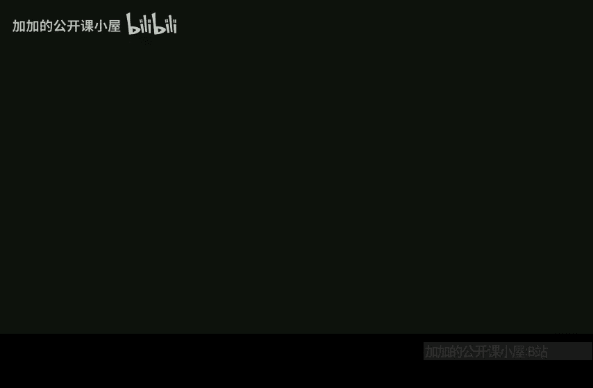
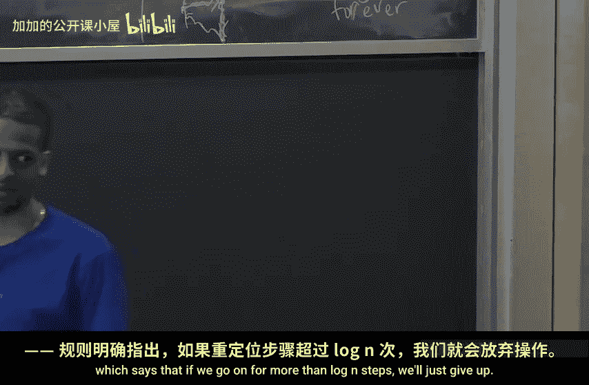

# 哈佛大学【中英⚡高级算法｜Fall2014 COMPSCI224 Advanced Algorithms】 p05 P5 -BV1zNSCBkEgW_p5-

Okay， so I think I'll just get started。嗯。I realized today that I meant to put a final fake problem at the end of the Pet。

 which is just like how many hours did you spend on the PSet because I wanted to monitor that information so I might just set up a piazza poll for that and from PSet to onward。

 it'll be there。嗯。So Albert Wu， who's Albert Wu， you， okay， so you're  scibing。嗯。Good。

 so today the plan is。Finish the proof of cuckoo hashing。

 I'll tell you one more thing about load balancing， and then we'll move into Fibonacci Heaps。

 which is another topic。 so we're going to be done no more hashing。Okay， after today。

 after midway today。Okay， so cuckoo hashing。 Remember， that's something we talked about last time。

 I kind of stated。How it works， we used it to construct Bre filters for the for retrieval problems。

But we didn't actually analyze cuckoo hashing。Okay。Remember， we have an array。

Our hash table of a of size， linear and n。And we have two random hash functions， GNH。From。

And what we do is when we get an item X that we want to insert。We。

Try to insert it in the GXith position。And if it's free， we put it there， if it's not free。

 we still put it there， but then we kick out whoever was there and move them to their other hash location。

Okay， so whoever was there？Was there either because of G or H？So if they were there because of G。

 we'll kick them out and put them in their H location， and if they were there because of H。

 we'll kick them out and put them in their G location。

And then when we put them in their new location， this might continue because that might also be non empty。

Okay。Very good。嗯。And。If this goes on。If the sequence of item moves。goeses on。For at least。

Some big constant C times log n steps。C is something that will come out of the analysis。

 but think of C as 10 or something。S log n steps。We give up。And。We give up， we pick。New G and H。

And we rebuild。The entire data structure。We allocate a brand new array A。

 we reinsert everything from scratch。And if any of these inserts again。

 takes more than C log n during that rebuilding phase， we again。

Destroy everything and rebuild it again from scratch until it finally works。Okay。

 so the point will be that。This rebuilding will succeed with good probability。

 so in expectation we won't have to rebuild that often。O。Good。So now for the analysis of the claim。

Is that。The， the expectation of the time to insert。I of a constant。Okay。Okay。

So let me draw a couple pictures for what might happen。When we try to insert things into。

The hash table。 First， I want to remind ourselves what this cuckoo graph is。

 It's something I defined last time。 So cuckoo graph。So。We're going to first draw a picture。

 Fooo graph。This graph has M vertices。1 per。So。Of a。Okay。And it also has N edges。For each X。

We connect。G of x to H of x。And as someone pointed out last time， this graph could have。Multi edges。

 it could have self loops。Okay， so， so what， what happens when you try to do an insert。

Let's say we try to insert some。X。It could happen。That。So this value x comes in。That's G of x。

And an item ready lives there。And then we have to kick it out。And something already lives there。

 and we have to kick it out。And something almost there， we me to kick it out。And then we're dead。

So that's one possibility， the cases。So this looks like this is a path。Right。

Another thing could happen， which is that we have a cycle。So here。You draw a picture。X comes in。

It kickeds someone out。Kick someone out。Kick someone out。And then。We have a single cycle。

 maybe now it。It goes like this。Okay， so now。X7 wants to go back into where X4 moved。

 just so that we're all on the same page with how the algorithm works。What will happen now？

X4 will go back exactly。 So now x4 will go back。And then that's going where x3 was。

 So x3 now has to go back。And X2 now has to go back。Okay， and then now what happens？Soorrry。Yeah。

 so now we try so that was G of x。 So now we now we push x into H of x。 So now。X tries to go here。

That might kick someone out。Ex8。And then maybe now we're dead。So in this case。

Let me draw some boundaries here。So this case here is we have a single cycle。

Let me give myself some more room for the next one。Okay。

And then there's one more case that I want to draw。Which looks a lot like this case。

 but more problematic。 So now， so this is an O case， right。

 just because there's a cycle in this graph doesn't mean we're in trouble。

But now suppose this happens， x comes in。It goes somewhere， it goes somewhere， cycles around。

Comes back。Exco somewhere。Go around。Go somewhere。And then now cycles back again。Okay。

Now this is actually a problem。This would go on forever。So。嗯。Two cycles。This would go on forever。

Justine Harrisez。Of course， we'll catch this。 I mean， we won't。 We won't。

 might We're not paying attention to whether or not we have cycles。

 but we're not going to go on forever just because we have this。We have this here。

 which says that if we go on for more than login steps， we'll just give up。

That could happen because of a long path， but it could also happen if we end up in this kind of infinite loop。

Okay。So we could write。嗯。