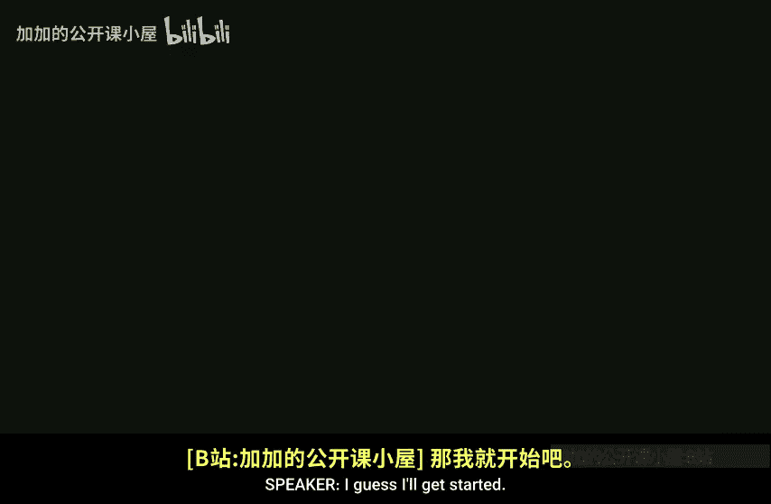

# 哈佛大学【中英⚡高级算法｜Fall2014 COMPSCI224 Advanced Algorithms】 p06 P6 -BV1zNSCBkEgW_p6-

I guess I'll get started。Just a couple things， one is I just put a poll on piazza。

 I meant to put this in PS at one itself， please let me know how much time you spent on piece at one I want to monitor how much time things are taking。

嗯。Another thing is we did have a scribe for September 30th， which is a week from Tuesday。

 we no longer do， so please someone take that slot if you have a later slot and want to switch and be earlier。

 that's also very good。Another thing is our videographer has asked if anyone wants the board shot differently or anything in the videos。

 please yeah let us know。Okay， so。Oh， and also I fixed the。To。

Bugs off by one in cuckoo hashing and the lumni didn't actually prove for power of two choices is fixing the notes so you can go read it if you want。

Okay， so。We're going to start a different topic today。嗯。We're not going to。

Uating Word RAM anymore at least for now， we're going to look at amortized analysis。Okay。

 and we're going to start off with data structures。

And the two we're going to look at are Fibonacci heaps。Well， we'll look at。

We'll look at something else right before Fibonacci heaps another heap。

 and we'll also look at Sp trees。Okay。嗯。Okay。So I think people people who took 124 here。

 like people who were undergrads here， I guess you've seen some amount of amort analysis。

 well at least。One bit of it when we did Union find。Okay，We're going to say a little more。

 so what's the idea behind amortize analysis？So amortization。Or amortized bounds。

We'll say like suppose。Our data structure。O。Supports。Some number of operations。Operations， you know。

 ABC。Then。We say。Amortized cost。Aortise costs。Of these operations。A。Let's say T sub A， a time for A。

 T sub B and T sub C。If。Any sequence。Of。NA operations。And NBB operations， et cetera。

 and NCC operations。Takes time。At most。呃。And a T plus NBTV。Plus， NCTC。So the idea is。

 so usually we talk about worst case running times for say data structures。

 so a balanced binary search tree， a red black tree takes login time to do a search。Okay。

If we say that it takes login， amortize time to do a search。It means that。

If we do n searches in a row or some number some k searches in a row on on a data structure of n items。

 then it should take us at most K times login steps total。

 So some of these operations can be expensive， some of them can even take linear time that as long as the sum of all the time we spent is at most。

As fall as this， then we say that that's our amortized complexity。Okay。And we're going to see。

Some examples。嗯。Okay。And a common way of。Giving proving amortized bounds is what's known as the potential function method。

And we'll see this with s trees。 Sometimes this can get a little。

Sometimes it can be weirder than other times， but so a common way to prove amortize bounds。

I via the potential function method。So what is that？So。We define a potential function。

Let's call it capital。 Call it fee。It maps。States。State space。Of our data structure。Okay。

Into non negative reels， let's say。はい始ま。I don't know if that's the usual notation。

 somehow I feel like it should be at subscription。Okay， and also。Phi of like an empty data structure。

Is0。Okay。And。So let's say。Let's say that。We perform。K operations。With。嗯。Costs， actual running times。

T1。TK， so here I mean， I don't mean we support K different types of operations。 I mean。

 suppose we actually have a sequence of operations on our data structure。 for example。

 K insertions or K searches or something。And the actual running time of each operation of the IF operation is TI。

Okay。And。The states of the data structure。Or。S0 one before we start any operation， S1 up to SK。

So SI is the state of the data structure after the IF operation， S0 is before we do anything at all。

Okay。So。Our amortized cost。Okay。Our amortized cost。Of an operation。Is we define it to be。

Defined to be。The actual time plus the potential difference。Okay。And why does this make sense？So。

 the total。Emortized cost。Oh， sorry， this is not the deficit。 This is not。

This is not what I wanted to say。 I guess what I wanted to say。

 so this is what I define the amortized cost of a sequence to be。So I'm going to。

So I want to say we'll show that this is the case is going to be is bounded by， let's say。

The amortise cost of one given operation is bounded by this。 And why is that the case well。

Let's sum this over all operations， so the total amortized cost。呃。Is。We're bounding it by。

The sum over TI plus the difference in potential。But this is a telescoping sum。

 and all we're left with is the sum of the actual costs。Plus， the final potential。

Minus the original potential which was zero。If we started with an empty data structure at zero。

Which is certainly at least the actual。 remember that Phi maps into positive numbers。

 So this is at least the actual cost。