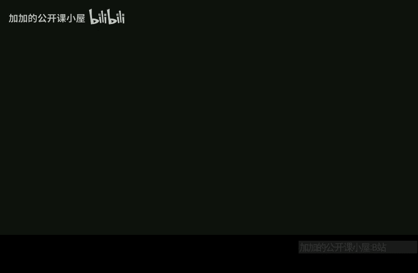

# 哈佛大学【中英⚡高级算法｜Fall2014 COMPSCI224 Advanced Algorithms】 p07 P7 -BV1zNSCBkEgW_p7-

Describe it。

Okay， so I think I'm going to get started。Today we're going to talk about display trees。

This's going to be another example of amortized analysis again for a data structure。So display trees。

And I think I asked this before， but I can't remember how many people have seen playts before。Okay。

 some number， okay， so split train。These were due to slater andt。I think。85。Okay。嗯。And this problem。

We have- so it's comparison based data structure。And we support two operations， we support insert。

Okay， so insert a keyK。As well as find。So let's say， I mean。Inert insertst an item。

 which is a key together with a value and find。With a key。诶。Returns。Associated value。

And you can also imagine delete。So it deletes。Deletes item。With key K。And this。Inserts a new item。

With KiK。And value V。So if we weren' in a comparison based data structure。

 how would we solve this problem？Yeah， this is a dictionary problem， so we can use hash tables。

But here we're giving。嗯。A comparison based solution to the problem。

Which could also be used to solve things like predecessor， for example。Okay。And。

You might be wondering you know in this class， we see some pretty hefty data structures like fusion trees。

 Does anyone actually care in real life， right， So this data structure。For this stage。

 there's this award called the Paris Conalocs Theory and Practice Award。And。

Splay trees wanted in '99。For creating one of the most widely used data structures invented in the last 20 years。

 So the authors wanted for the Sp tree。Apparently， this is something that is not just。In theory land。

呃。Okay， so what are display trees？People have seen， I hope， some form of balanced binary search tree。

 like maybe a red black tree， AVL tree， something like that。So a spplay tree is， again。

 binary search tree。So s trees。Are binary search trees？Okay。But after every operation。

 we do some amount of rebalancing。So， after。Each operation。呃。The tree。Adjust itself。

No it's some rebalancing。Okay。Actually， I think the title of this paper is selflf adjustjusting something rather。

Okay good。 So what do I mean by。Adjusting itself， so this data structure operates in a model called the BST model。

So BST stands for binary Search treee。How does the BST model work？At the beginning。Of each operation。

We have a pointer。To the root of the tree。And what can you do step at each step。

 you can either walk to some child？Okay， or we'll walk to a child or to a parent， okay。

 or do a rotation。 I'll say what that means。At each step。We can。Follow。A child。Or parent pointer。

Or do a rotation。 rotations are used。to rebalance the data structure。 Okay， so what's the rotation。

So we have this big tree。So rotation。I'll just say describe what it is by a picture。

So somewhere in this tree we have a node X。We have a node Y， which is its parent。

So this is going to be rotate X。X might have some subtes hanging off it。Why also。

 this could be the empty tree。 A， B and C could be empty trees， but this is， you know， in general。

 what the picture looks like。 And if we do a rotate on X。

The rest of the tree stays looking how it was， but。This picture。Turns into x now being the root。

Y is now a right child of X。And then B and C and I live here。And as here。

So that's what I mean by rotation。While X could be the right child of Y， in which case you do。

 there is a symmetric looking picture。 Okay so the point is that X now becomes the parent of its parent。

对。And then these trees go wherever they need to go to keep the。Binary source reordering valid。Okay。

So。I'll get right to it and tell you。How playt work？So。To do a find。How do you implement find？Search。

4 x as you would。In a BST， I mean， s tree is a BST， right。

 So you start at the root and you just keep going down the correct child to get to where x is。Then。

After。Reaching X。Spplay X， so display is a subroutine。That I will describe。Soon， okay。

 it's going to do some number of rotations to bring X to the root of the tree。

So whenever you search for x， after all the rebalancing is done， x is the new root。

It's not just going to be rotate X over and over again until it's the root。

 It's going to be something just slightly。More involved in that， but not much more。And insert X。So。

Insert。As in any EBST， so you find where it should go and put it there。Then display X。Okay。

 and delete。🤧。嗯。There are several ways you can do delete one way is。Spplay X。Then remove X from tree。

Okay， well， when you display a node and it's the root and now you remove it。

If it had things in both its subtes， now you have like two different trees and you want to make sure that you have one tree at the end of the day。

 right， one balance， one binary search tree。 So what do you do？嗯。X had two children。Spplay。

The largest。Element。In the left subt。And make it the new route。Okay。

 so what does that mean just to draw a little picture？呃。

