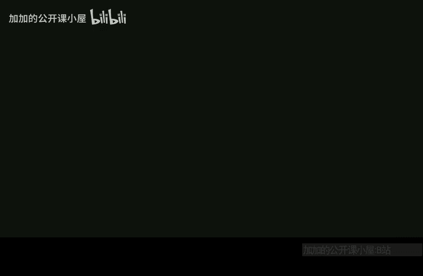

# 哈佛大学【中英⚡高级算法｜Fall2014 COMPSCI224 Advanced Algorithms】 p15 P15 -BV1zNSCBkEgW_p15-

Oh， okay， how many get started？呃。Let me wait so that the cameras not。Yeah。Yeah。Okay， good last time。

So okay， so today。こ say today。We're going to finish simplex。And then。

And then I'm going to say things about strong duality。And complementary slackness。

 you'll see what that means。呃。I'm going to sort of tell- so the simplex algorithm， unfortunately。

 there are no known polynomial time implementations of it， they all take exponential time。嗯。

So the first polynomial time algorithm for linear programming is the ellipside algorithm。

But I don't want to get into。I think to properly cover all details of ellipsoid would take me maybe a lecture and I don't really want to spend too much time on ellipsoid。

 I think it's not used that much in practice anyway because it's kind of slow。Okay， but I'll just。

 you know。Say some words， I guess， about it。Roughly what it does。And then in the notes。

 I'll add a link to。something that says more， if you really want to know about it。And then。

Either at the end of this lecture or next lecture。We'll start interior point。

 so path following interior point methods。Okay， so。

This is also a polynomial time algorithm for solving linear programs。And it's more。

It's faster in practice than ellipsoid。I mean， it's already fast and in practice it's even faster than what people prove about it。

Even with pathon interior point。I won't cover every single detail because there are many details to make it cover all cases。

 but I think I'll tell you enough that you'll understand what's going on。Yeah。So my understanding is。

They use。Both simplex and interior point are used in real life。And I think ellipoid is not used。

Really。好。I think it's not just about ease of implementation， I mean， it is easy to implement。

 but I think also it's just these pathological cases that these cases that make you take a lot of time are pathological。

So in practice， you know， you run it for some number of iterations， and it finds opt。Yeah。But yeah。

 I don't take my word for practical things， but that's at least what I hear。对。Okay。

 so let's finish up with simplex， so simplex。Remember the basic idea was。🤧嗯。Vertices， okay。

We saw that Well， we gave one definition of vertex， and we saw it was equivalent to another one。

 So we want to minimize。C transpose X。Such that Ax is equal to B and x is at least zero。

 coordinate wise。Okay。And we can define this polytope P， which is the set of all points。

 x that are feasible， so x such that。AX is equal to B and x is bigger than equal to 0。嗯。Right。

We said that。A vertex。X and P。Okay。Is a point。Such that。AX。The subma AX， I'll say what this meansX。

Has full column rank， so it has linearly independent columns。And we said that AX。Is a。

Is sub matrix of a。Specified。By the indices。J， such that xj is not zero， it's strictly positive。Okay。

And remember that we're in the situation where。A is M by N。And CB are n dimensional vectors。Okay。

 so this already tells us that， and let me call this thing here， let me define this to be B sub x。

 the basis for x， that's what we called it last time。This implies that B sub x。Has size at most M。

Right。Because。Column rank equals row rank， and the row rank is definitely at most M。Okay。

The basic idea of simplex was then。嗯。So， for each。Vertex X。Assign。A basis。B of x。

Which is a subset of1 to n。So that the size of BX is exactly n。Okay。

Maybe I let me call this B prime of x to distinguish。

So this is the set of indices that are strictly positive， and then I'm going to extend it。

 possibly extend it to a set that has size exactly M because it might be the case that the set has size at most M。

Okay。Such that。Let me call it a sub Bx， the columns are indexed by B of x。Has rank。Exactly M。

So the point is that if B prime X had size less than m。

That means I can augment it by adding more columns to make it have full rank。Okay。

 I'm assuming that A has full row rank。Because there's no point in having redundant rows in A。

 this would be redundant constraints。And you can filter that out in preprocess it。

Either redundity constraints or obvious infeasibility。Okay， so。Good。Other questions at this point。

 so AB is a square m by M matrix， it's invertible。二园。And what we said last time was。So now。Will。

 always。We start。At some vertex。Let's call it x0 is the initial point。

 I mentioned how to get an initial point to start with simplex last lecture by basically running simplex on another LP。

Okay， so we started some initial vertex x 0。And。Greedily。Move。To subsequent vertices。

Until some halting condition。Which I said last time and already it again。So。At any time。We represent。

Our current vertex。By some basis。And we also defined N to be。The set went to end without B。

 the the compliment。So with simplex， at every step， we write our LP。We say， look。

 so C transpose is the same thing。 So this is our LP here， right， this is our LP。

 I'm going to rewrite it as。Minimize C transpose。嗯。X， B plus C， N transpose X。

 N subject to the constraints that A， B， X B。Is equal to。Plus A and XN。Is equal to B。And Xb。

Xn are bigger than equal to0。When I put a set as a subscript。

 I just mean projected to those coordinates。