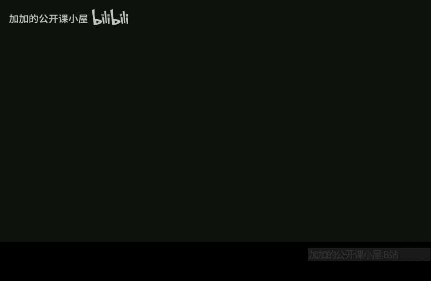

# 哈佛大学【中英⚡高级算法｜Fall2014 COMPSCI224 Advanced Algorithms】 p22 P22 -BV1zNSCBkEgW_p22-

So let's get started。Yeah， so first， sorry about all the bug fixes on PS at7 so yeah。

Maybe not not a surprise。 a lot of your homework problems， I basically make you prove。

Various alemmas and results from old papers。As it turns out， one of these papers I drewmma from。

Wrote some stuff that was not quite right， and I sort of trusted them and then when I looked into it。

 I was like there's some mistakes here。And I emailed them and yeah。

 so it seems that there were some small errors in their writing。

 but yeah like factors of M missing from places， etctera。And problem two， okay。

 so I'll have to keep that in mind for the future。嗯。So today。What are we going to do。

 so let me move this out of the weight？We're going to finish。Ling cutries， well。

 I'm just going to give you the analysis。In class， I'm going to show you log squared n amortized per operation。

And on PS set 8， which is out， there is a problem that asks you to improve this to log in。Okay。

Also notice on PSet 8。 I skimmed the PSet7。 you know。

 how much time did you spend on this Pet and the numbers seemed kind of high。

 So right before I released PSet 8， I thought。Maybe I should turn this down a little。

You can do one of problems 2 and3。 You don't have to do both。Finish and cut analysis。So yeah。

 so getting the log n is on the Pet I'm going to show you log square in。And actually。

 we're using splay trees， if you remember， in the auxiliary trees that we're using to store preferred paths。

We used s trees， so to get log squared n， you don't really need to use displayplay trees。

 any kind of balanced BST is fine。But。When you try to get log in， it's easiest to do it with s trees。

 basically by using。The S access alema we approved in lecture seven。

If you remember we had a specific potential function for s trees。

 and we showed a certain lu about its performance。Do people remember this？

We defined a weight function on the vertices and based on various weight functions。

 you can prove different properties。So if you define the right weight function for Sp trees。

And then pop that into the PSet， you'll get a login advertise analysis， so we'll show this in class。

 login on the PSet。嗯。And then we'll。Say some things about Min cost max flow。

And there's a problem on the Pet related to this as well。

And then today is going to be the last day when we do flow。

 there are only I think three lectures left after this， so I'll tell you about some other things。这。

So if you remember。嗯。Last time。The way we implemented access， we had this subrtine called Access。

Which was performed under a vertex。Basically， this thing it makes。The root。Vtex。Of the root。

Tree of a trees trees。And it did this by repeatedly displaying V and then connecting it to its preferred。

To its path parent。And then now sping again to make it the root of that。

 and it just kept sping it upward right if people remember this。And then。

We had a couple other operations。We had， let me just write， cut and link again。 So cut。

It first did access。So now what's the picture here？V is in。嗯。Vi is here。If you remember。

 when you're accessed， you have no preferred child。

 because if you are the last vertex touched in your subree， then you have no preferred child。

This is V， so it has no right children here， it just has some。Maybe V is the path。

I a path parent to maybe some people， but in its ox tree， it doesn't have any right children。

 and then it had some left children。And then we cut this。Right， so。So at the end of a cut operation。

 V is in its own ox tree and a singleton a tree。Right。VDt left up parent is none。

And then Vdot left is none。And then let me write the last one link。

 I'm not going to write all the other ones。We'll just focus on these for the analysis。Link B to W。

So V is the root of its represented tree， and W is in a different represented tree。

And now W is is the parent of V。 We draw an edge from V up to W。 That's what link does。

So the way we implemented this was we did access。V access W。Now。

 both of them are the roots of their respective。Ox treeree of ox trees。And then now we need to just。

Slice in V as a left child。So。V dot left。Eals W。And W。 parentent is V。嗯。

Remember that the ox trees are keyed by depth。So the fact that W is my parent in the representativeatory means that its depth is one less than me。

So he's on my left subre。Okay， so。What we said last time is that。The runtime of access。

Is proportional to。Maybe something like one plus the number of。Preferred。Child。Changes。

Let call this PCCC。Okay。Because we keep spplaying V upwards in this tree of ox trees。

 and how many times do we have to do that？嗯。umbNot the runtime of access。

 but the number of iterations。Of let's say， ss。Performed。During access。Is something like that。Right。

Every time we every time we have a preferred child change。We haveplay the upward， we merge with that。

Would that new parent in the preferred path？And then we keep sping upward until V is finally at the root O tree。

So。What we have is。The rununtime。Of M operations。Is at most？The cost of displays。

The worst case cost of。Times m plus the total number of preferred child changes across all M operations。

And this is we know this is definitely at most login。I mean。Wait， what's your question。

 Why is there an M there， So I just summed over all operations。 So this one became an M。就。

Let's say preferred child changes。嗯。In this。Access。And this access call。

Whereas this is the total number of preferred child changes across the entire sequence of in operations。

So what if you do that PSet problem， you'll see that。This is really the。

This is really kind of wasteful to say the worst case cost of display times the number of preferred child changes。

You're going to see that kind of the total。