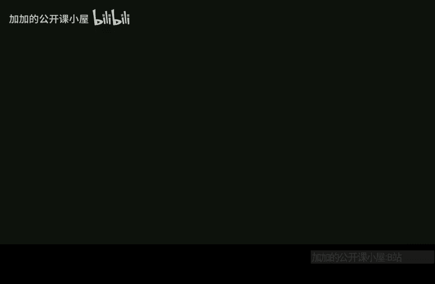

# 哈佛大学【中英⚡高级算法｜Fall2014 COMPSCI224 Advanced Algorithms】 p25 P25 -BV1zNSCBkEgW_p25-

No it thanks。Okay， so I think I'll just this is on， I'm going to get started。So today。Well。

 the last day。We're just going to。现在是。Streaming。And I'll。I'll just call today。

The power of random signs。So， we're going to see。L2 norm estimation。We're going to see。

Fast regression。Point query。Mality reduction。So。It might seem like。Many things。Some of the things I。

 well， actually。All these topics covered in depth。I do cover in depth in algorithms for big datata as CS229 R。

 so I'm not going to provide all proofs here。But I wanted to give you a taste of。Some of this stuff。

Okay。So remember last time。Last time。We had a vector x， which was an RN。And it's huge。

And we wanted to compute functions of x。Well， x is updated in a stream without actually remembering the entire vector x。

So。Receive。Updates。Xi goes to Xi plus B。In a string。Then we must answer。Querries。2 F of x。

So last time I said that V was always one。And it starts off， I should say， x starts as a zero vector。

So last time I said v is always one， let's say the query we want to answer is the support size of x。

That was the distinct elements problem。 I showed you that there's some non trivialvi algorithm if you assume some idealized hash function。

O。So。嗯。Good， so what's a different。 but there are other functions that you might want to compute other types of queries so。

Another F。Is F of x？Equals say。The L2 norm squared of x， or just say the L norm， L2 norm。

If you can compute this up to some one plus epsilon error。

 you can compute the altoon norm up to some1 plus roughly epsilon error just by taking the square root at the end。

诶。And the argument I'm going to show you is due toone my and second。Okay， so。Just like with。

Support size。You can't get little low of space。Unless。

You settle for both randomization and approximation。 So you're not going to output the true answer。

 You're going to output the answer up to one plus epsilon。 let's say up to 1% error。

 and it's going to be a randomized algorithm that fails with probability，1% or something。

Unless you allow for both。Randomization。On approximation。

And the AMSS algorithm introduces an idea that gets used all over the place in streaming algorithms。

And it's particularly important when V can be not only positive， but also negative。ok。So。

If you think about the algorithm we saw last time where V was always one， in other words。

 V was always positive。You couldn't support deletions in the stream， right。

 so the number of distinct elements is support size。

If I later wanted to delete an element that I saw， well。

 I'm only storing the minimum hash value I ever saw。

So if the item corresponding to that minimum hash value gets deleted， then。You know。

 my minimum hash value I'm storing is irrelevant now。

 and I don't know the second minimum because I didn't store that。 So what can my algorithm do。

So linear sketching， what I'm going to show you， allows you to design streaming algorithms that support deletions。

 so linear sketching。Okay， so it lets you。Support deletions。And in fact。嗯。

If you have to support deletions。It's known that essentially any algorithm can be converted into a linear sketch with at most a small blow up in space complexity。

 like a log n blow up in space。For anyFor any query。There a minor space blow。

If you want to see the details of that。That's due to。Lgun。Wre。ううん。Okay， so let's go back to。

That's the problem I stated。Back to。F of x being the Ln norm squared。So， so what is a linear sketch。

 I didn't actually oh can can maybe I'll tell you now what the idea is。 So the idea is you pick。

Some matrix。It's called it pie。Which is M by N。And you store。Y equals pi X。In memory。Okay so。

Initially。Let's say y is0。RightBecause pi is 0，0。 And if pi looks like this， so pi is some。Thatat。

Short matrix， let's say the columns are pi1。Up to pi N。And let's say M dimensional has M rows。

If I see an update。Where I add V to X I， what does that imply？

 I have to do for my streaming algorithm。 that implies that y。Should be incremented as follows。

 should become。呃。呃。Y plus。V times pi I。对。So I can support arbitrary updates in the stream just by updating my linear sketch like this。

And this holds whether or not， whether I have deletions or insertions。

So what's the linear sketch going to be？