# 威廉玛丽学院【中英⚡高级计算机体系结构｜CSCI654 Spring 2025, Advanced Computer Architecture】 p01 P1 芯片是如何制造的 -BV1evfwBVEUG_p1-

Okay， I think we can get started。 So this is a new semester。

 And we're going to teach advanced computer architecture。

 It's also my first time teaching this course。 So there are many things will go on as I prepare。

 as I prepare this course as I prepare the assignment and probably make update in the schedule。

 by the way， there will be a course website If you are familiar with my teaching style。

 I typically use notion as a course website。 Now will'll send you the website link right after this。

This today's lecture， then I think you are all on blackboard， right， You should all be there。

 So should I when I make an announcement， you should be able to receive。Announcement there。

 basically， I will not use， I will not extensive use Blackboard。 It will only be some very important。

Announcement， but other other things， I will just go with email。 Okay。

 then before we start this course。 then they say what we are expecting from this course。

 this course will be basically a full lecturebased courses。

 Just consider undergraduate style or master style courses。 This is not a seminar style course。

 So we'll cover a wide range of topics。 just look at this number of topics it's probably one week one topic about this this level。

 And if you look at this topics from logic combination logic sequential logic。

 those are typically digital design， undergraduate digital design topics。

 So basically go through these topics really fast。 then go to architecture side talking about architect simulation risk5 I CPU core architecture。

Starting from CPU core architecture is more and more architecture based topics。 basically。

 every topic there can be。Fu PhD or can be a whole career of a researcher。

The full lifetime research topic。 when so I'm not going to talk very deep in very every topic。

 You can see that we're square checking the surface of many different topics。

 So basically one lecture， one topic or one week， one topic。 then all the way。

 we talk about everything about how we build a computer all the way to GP architectures。 Okay。

 so the goal is definitely。pave the way for you to do computer architecture related research then to understand the basic topics then so that you can get started with not really the research method。

 but the fundamental knowledge about computer architecture research。

 and the evaluation method will include assignment quizzes and final exam。

 We're going to have a final exam and quizzes will be basically Google form multichoice questions at the right beginning of the courses。

 very very simple ones， but strictly related to the the content of the lecture。 assignment。

 this is something cannot make sure at this moment yet。

 because this is the first time I'm preparing this course。

 So I'm going to prepare prepare assignment as I go。

 I hope I can prepare almost weekly assignment but not too much。

 so like you can keep on track with the whole project。 the whole process。 Then the whole course。哦。

And I try to make all the assignment on a series on its own so that you can build on your previous experience with the assignment。

My goal at the end of the semester is for you to be able to write a very simple simulator for a risk 5 CPU that can run some programs。

Okay， that's my goal。 the simulation is definitely a core topic。

 This is very different from other computer architecture courses。 We're emphasizing simulations。

 because I teach something in the course in the lecture。

 then you prepare you practice it do the exercise by implementing simulator。

 once you need to implement every detail， you need to think everything again。

 Just imagine if you're a developer if you're a computer architecture designer。

 how would you decide a detail。 a piece of detail in the architecture design。

 So sometimes computer architecture is you can either do this way either do that way。

 this may have some advantages， now may have some other advantages。

 then you balance the disadvantage and advantages and then you select one decision。

 and this process is basically helping you to try to build your own architecture。Okay。

 then generative AI is strongly encouraged。 Hope all of you start to use it。 Then assignment。

 you can always use generative AI。 I don't limit any form of generative I。

 The only limitation is no generative inquis and final exams， okay。There no need to buy the book。

 I put a textbook on the course website。 I don't expect you to buy the textbook。

 We're going to cover the content from many different books So there's no single book that can cover all the topics。

 So I basically try to use the whole lecture， the lecture。

 the the slides as a lecture notes so that you can understand everything。OK。아你 question去去。So， then。

 I。I think you all can start read the。Syllabus after I posted after this lecture。

 so I'm not going to waste the time going through the syllabus。

 but I'm going directly going to talk about the topic。

 what is computer architecture and how we can understand it。So talking about computer architecture。

 we start from how people solve problems right you see these two blocks you probably know what I'm going to say in between。

 but they start from the beginning， so we use physics to solve applications right So if we have a demand we find something that we leverage something that is already there in the nature to help us solve the problems for example。

 we have these levels or compass those are those are physics phenomenons like the bubble will flow to the top right then the pointer will point to the north or the south So those are physics phenomenons and we leverage those phenomenons to solve or particular needs to find the level or find the north direction but these are particular examples that are super simple that can directly connect physics with applications but if the thing gets overcomp we add intermediate layers the more。

yers we add， the more complex a problem is， the more layers we add so that some people can work on some layers。

 some other people can work on some other layers。

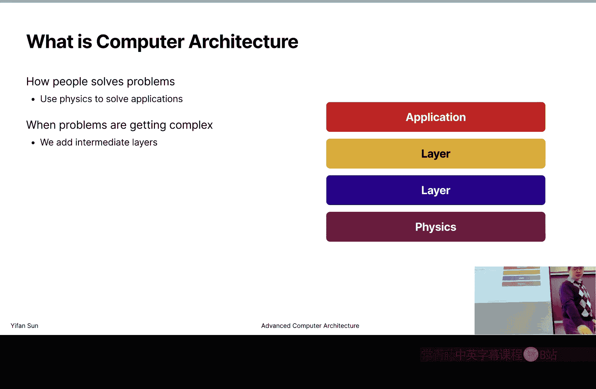

So what are the layers that we can add here。 So for the computing technology stack。

 there's basically no common understanding about what are the layers in between。

 but I'm trying to summarize some of them they're commonly acceptable layers So from physics when we talk about physics in the computing stack we're talking about electrons。

 coppers are conducts， semiconductors， this type of physics phenomena or quantum physics is actually very important And quantum physics is enabler of。

Digital computing。Now we talk about devices， especially transistors。

 I'm going to have some extensive discussion about transistors in today's lecture。

 then about transistors。 then we have gates。 Now you probably know not gates and gates9 gates。

 those gates can do some convert some 01 input to some other 0，1 output。 there's some certain rules。

 those are gates starting to use starting to from gate， we have micro architectureitecture。

 in some books， you may see another level called register transfer level RtL in between gates and micro architectureecture。

 So there's no common understanding。 So I'm directly connecting micro architectureitecture gates。

 So if you combine gates in some way then you get a micro architectureecture。

 which is a hardware implementation。Hardware implementation of。In today's understanding， a chip。

 a implementation of a chip。 that's micro architecture。 Now we have instruction set architecture。

So this is a typical example that earlier days we don't really have so many layers then gradually we add one and one more layer so that we can divide this work and distribute to more people so that people can focus on particular domains。

 so instruction set architecture is a particular example that is introduced relatively at a late stage that when IBM 360 is introduced then we have we start to have an instruction set architecture。

So， instruction set architecture is。You can see this name is basically not something concrete。

 but a protocol between the software and hardware。 So it's a binary definition for what hardware will do。

 right say， let's say if we put in code 0 and 0，0，0，0，1 as a instruction 0，0，0，2。If I'm using 0，0，2。

 I should say 0，0，1，0， then if that is the minus instruction。

 if we define a series of binary encoding of what we want to do， what's the meaning。

 what's the instructions for the hardware that is considered as instruction set architecture。

 that's protocol between software and hardware。 If you provide me this software in this binary encoding。

 My hardware can execute and get the right result for you。So quick question here。

 In said architecture。What instruction said architecture， you know today。啊。Arm X 86 risk 5， power PC。

ok。Meps。So basically， you can hear those are very hot names in today's technology news， right， So。

 for example， there are some big changes for Apple。

 Apple converted long time ago converted from power PC from IBM's architecture to Intel's architecture。

 not very long time ago， about 5，6 years ago， they start to convert from Intel's architecture to arm architecture。

 So today， if you are， you have a Mac computer， very。

 very likely you are running arm arm instruction set。

 So those are basically domains that defines the how software and hardware communicate with each other。

 And once。A company start to invest， invest in one such instruction set architecture。

 it's very hard for them to move away from their ecosystem and to a new ecosystem。

So this instruction set architecture。 Then above that， we have assembly and machine code。

 which are basically we write a code。 You use compilers to convert our program language into binary code so that hardware work can understand operating system。

 program language， algorithm applications are relatively easy to understand。Okay， so in this sense。

 if we try to separate split these technology stacks into different domains。

 very easy to separation point is the instruction set architecture。

 which is since halfway between software and the hardware above it is basically software below it is hardware。

那。We talk about electrical engineering， computer science and in some universities。

 they have computer engineering。 These are some common understanding of which domain should be in which department electrical engineering is below this point and mostly likely even ones level lower at this point。

 then computer science is sometimes from this point， if they don't have computer engineering。

 if they have computer engineering is probably starting from operating system and above。 Now。

 if they have a computer engineering is basically from the gates to the operating system level。

 So computer engineering is slightly wider than computer architecture。

 If we look at computer architecture， what we research is basically we try to find the solutions。

At this level， the micro architectureitectural level and the assembly and machine code level。

 So it's right between the self server side and hardware side。那。I always make this。Map for that。

If this is or a people's someone's foot and that one is arm。 Now if we want to use force on one side。

 we have to have our core muscle engaged so that we can stay stable so that the other side of the muscle can give power。

To give forth。 So this is our core muscle in the technology stack。 right， how we work is basically。

 we try to absorb something that is something new in the physics domain。 So， for example。

 the transistor sides are getting smaller and smaller。 That's the physics side。 On the other side。

 application organism algorithm side。 We start to have deep neural network。 We start to have LL M。

Okay， then they have some need。 They want L M to run faster and faster。 Okay， we on the other side。

 we have new technologies。 and then we need to connect these two parts together and leverage the physics and to support the algorithms and applications。

 run faster， in a more reliable way， reduce the development time and in a more secure way， right。

 So those are what we research in the computer architecture domain。So。

That's how basically understanding of computer architecture。 That's what we do。

 And we sometimes develop new instruction side architectures。

 Sometimes we work on micro architectureiture。 sometimes we need to work at the operating system program language level to fit our needs and sometimes we may develop some new gaze or some new devices to say Me resistors。

Then。Some new devices to support new architecture， for example， compute in memory， right。

 those are new a little bit more towards the device level improvement。

 Now we gather them together and to support algorithms。

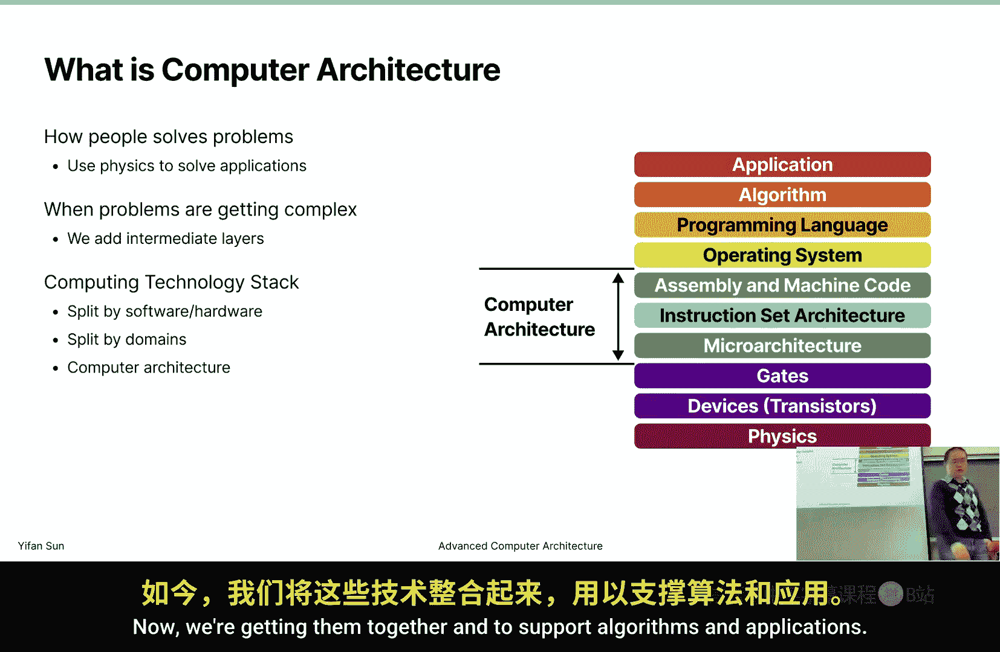

And applications。So， today， I'm going to。Start from the very beginning。

 Start from the transistor and talk about some very basic things that I cannot categorize into any topic。

 So some of。The very very basic topic that every computer architecture student should know。

So that's start from a transistors。 So starting from the transistors is where the whole。

Control logic or the computer， the， the computer design starts。

So this is a transistor then transistor there are many different form of transistors for example this is something called a BJT it's very old style transistors and if you use this thing you can probably make a radio out of this thing then for transistors they typically consider a three pinN device but they can use different technologies。

In digital domain。When we talk about digital domain， The other side is an analog domain， right。

 So analog domain talks about what is the current。 Is it 1，1， a or 2 a or 0。

1 a and what is the voltage。 Is it 0。51。52。5。 What is the voltage。 Those are analog domain。

 at digital circuit domain， We only talk about。0 and one。 now zero is one are for most of the time。

 in current understanding is by voltage， right。We said the voltage by， say 2。

5 vote is the cutoff point。 About 2。5 w is one below 2。5vol is 0。 It's a really arbitrary。

Definition that where we want to cut off the 0 and 1， it really depends on the power supply。

So transistors is something very useful at the digital circuit domain is。It's basically。ACon pin。

 The mid pin is a control pin。So we can consider if this control pin gives a high voltage。

 then we can consider these two other pins are connected with each other。

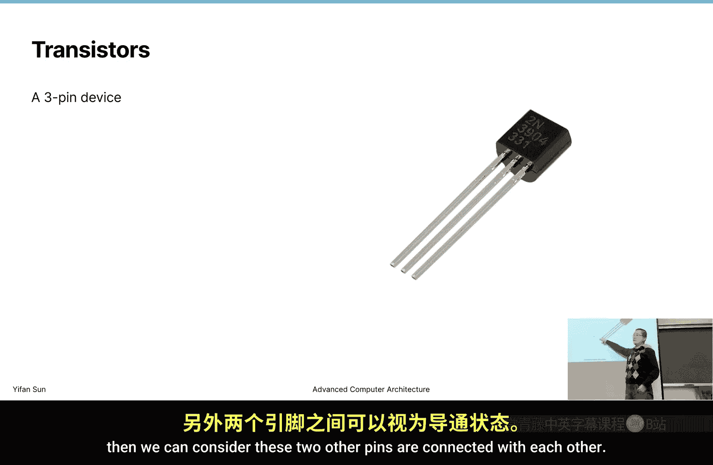

Okay， we can use， it's better to use this one， this a symbol to understand。

So if the control pin is given a high voltage or low voltage， it depends on the device。那。That too。

Port， the collector and emitter can be considered connected， Or if it's given another voltage。

 the low voltage， then you can consider those collector and emitter are not connected。Okay。

 so those are the very starting point of how we control if something is 0 or one。

 Now if the input is 0，1， then we can control the voltage on the the other side。So。

You may probably have seen these type of things from the very early age movies or videos for the very early stage computer design。

 Those are vacuum tube。 So what is a vacuum tube， How the vacuum tube works。

 Its basically works in this way。 So let's say。These are the two others。

 the collector and the emitter。 We can consider this side as an emitter because it's emitting the electrons。

 right， So they are not connected。At the beginning， by default， if you don't give any power。

 so we can give it power on this side to heat up the air or whatever the medium。

Between these two plates， right， when we heat up the medium。

 the electrons can flow from one side to the other So these circuit is connected because the electrons can flow from one side to the other。

 These two， these two ends are connected。 If you're interested， you can watch that。

 I put a YouTube video。 I will also distribute the slides later。

 But there's a YouTube video talking about how it works。

 But basically it's as simple as heating up the medium in between。就。Then consider this。

 That is one transistor。I can tell you something we're going to talk about later。

 So to memorize1 bit as a register a register can can memorize one bit of data。 Then right now。

 we have say your D， how large D，16 gig of D right than smaller， let's say for caches。

 that's several mebyte of caches， several hundred kiloby of caches。 that's normal。 So。

 but this thing is only one6 of a bit。 then just consider how large a computer can be at that stage。

 And also at the same time。We need to heat up this medium。

 then heating up takes a lot of electricity and how much electricity it costs to build this type of things。

 Then so not very long time after the first a few computers were built。

 People are going away from this point。 and they started to use something called BJT because of the development of semiconductor technology。

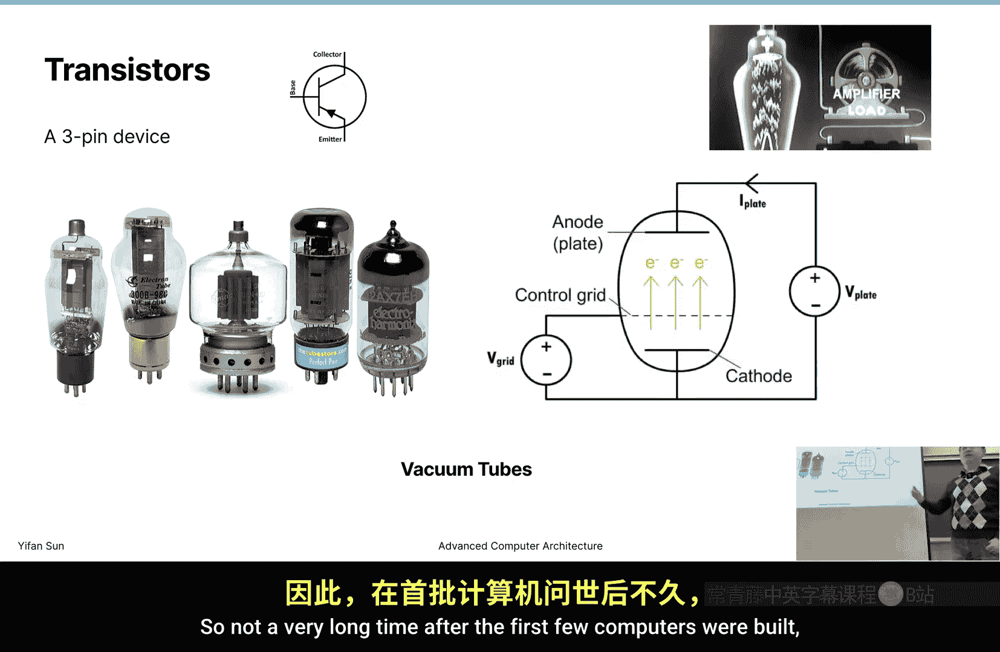

So BJ T is basically by semiconductor connected by semiconductors， then the P is in between。

 and n is the other type of semiconductors on the two other side and stands for So these things are basically made by silicon。

 right， is made by silicon。 and this one at nitrogen atoms。 and this one at。

P as phosphorus and actually phosphorus atoms in it so that the atoms can flow in a controlled way。

 So this is the base and this collector and the emitter。 So it， if the voltage on this side changes。

 then it can control if these two sides can be considered connected or not connected。

 And this is a typical。Inverter， where we can consider this a not gate for BJT based。Ccuit。

 So consider this way。 So here this is a resistor。 Then there's another resistor。 Now。

 if we connect this way， then。If we have one， then this one is connected。 If this one is connected。

 the ground have zero vote， right， VCC have high vote。 If it's VCC， we consider is one。

 If it's ground， we consider as。0。So in this way， if this is connected。

 then basically this side is connected， then the voltage of y will draw to 0 to ground level。

 So then we consider output is 0。 So if the input is one， the output is0 on the other side。

 if the input is 0， then this is not connected。 then the resist the resistor。

 it can be considered as a resistor and the resistance on this side is much larger than the other side。

 So has it will have a voltage close to VCC， then we consider this side as one。So what is a。

Problem with this one。Yeah。Anyone knowCC drops。If the VC is always stable， we can try。

 we can make VC stable。So the problem with this design is if this is one， this is connected， right。

 if it' is connected， then we have a VCC connected to a ground through a resistor if it's a resistor。

 it's a light bulb or something， it will consume a lot of energy。

We don't want it to consume energy if it's not doing anything。Right， is。

We can take some energy consumption when flipping， but we cannot consume energy whens idling。

 So if you consider the energy consumption of a hardware， of a computer chip。

 you can consider two different ways。 One is called dynamic。Dynamic energy wine is static energy。

 static energy means if you don't do anything， how much energy this circuit consumes。

 if this happens to be zero and is connected， then the energy consumption is very high。Right。

 so that's the problem with this table design。Then it comes to something called sea mouse。

 See mouse is complementary。Meal oxide semiconductor， okay。No。

 you can forget about this one and only remember CMmos。So what is C。

 Then you can see it's actually not very different from。PMP from B J T， B J T has NP。

 N where PM is there are two different types。 And C mouses has this， also this thing。

 When you have a P substrate， then we have an N well and N well， right。

 then it's basically NP N there。 But we're not directly connecting to the base。

 We're connecting to something that is oxide。 It's the white bar there on the top。The， the white。

Box here。 Then， this is a。The the top is a metal in the middle is a oxide。

 So there's no energy directly flowing from G to D or G to S。那。On the other thing。

 on the other side is。We all， we never use one transistors at a time。

 We always use pairs of transistors。If you look at this one， this is an inverter。

 We have VDD and VSS VSS is basically ground。 Okay， VDD is VCC。

Just in different scenarios and they have different meanings。 So if you see a circle。

 whenever you see a circle in a circuit， that basically means it's enabled when the when the input is 0。

ok。So when it's kind of a simple way to represent a not gate。So。Do some analysis。 If a is 0， then。

This side is connected and this side is not connected。Right。

 then we can consider Q and VDDs are connected。The Q and VDD are connected。 Q where。

 where Q will lead to where Q will lead to something similar to a。

 and the energy will never flow from this from here or here， right。

 will never flow from this gate into this two， this end to this two end。

 So Q will never draw any current out of this port。In this case， Q will keep a high level of voltage。

 So it's one。 If the input is 0， this one is connected and output is one。 If the input is one。

 then this one is connected and this one is disconnected， has high resistance。 Then Q is。And。

Input is one。 the Q is 0， right， So it's always invert inverted。 So this is a node gate。 Now。

 if you ask me why we cannot develop BJ T something similar to this。

 then it goes back to analog domain。 Then there's something I don't know。 I can say today。

 people only use C mouses。 pretty much only use C mouses to build in and integrated circuits。Okay。

 then there's another example of9 gate。Then in end gate， how it works。 Land gate， which is land gate。

 Land gate is not not end， right， It's an end gate， but the output is always inverted。

 Then just consider how this one is connected。 A and A are connected here and B are connected here。

 So if it only go through when a， when both A and B are one， right， when both A and B are one is 0。

If either A or B are0。Either A or B is 0。 Then this side is connected， Then outside is one。

 So this is a land gate。Then， I can say in today's。Integrate circuit design。

 because Nant can basically do anything。 Basically， any gate can do anything。

But because of some design。Requirement， convenience。

Nan gate is actually the only gate that is used in today's integrated circuit design。

So we always use non gate。 Then you can consider your whole digital circuit is basically connected。

 It's a。

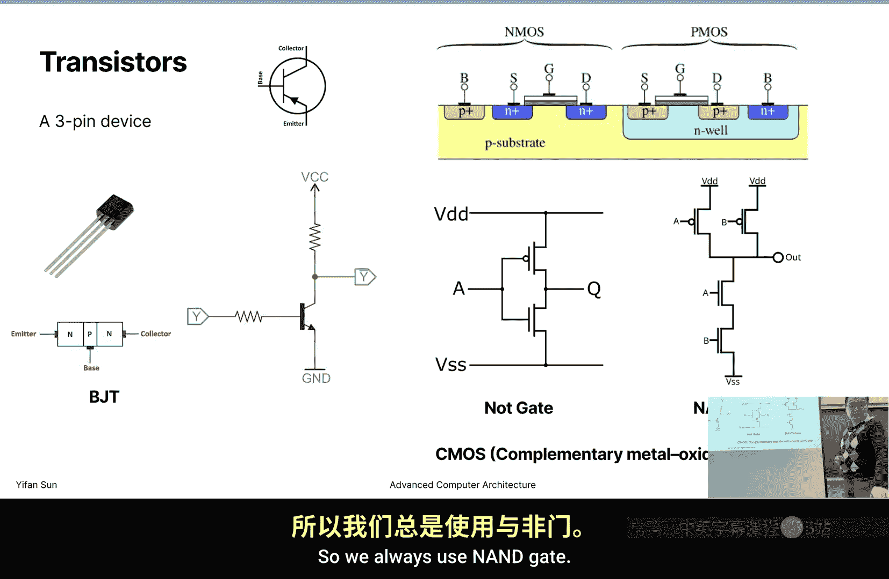

Is a connected array of na gates。Then we talk about how these type of circuits are built。

 We have a gate， we probably use some if this is a CMmo gate， if a CM mouse transistor。

 we can probably connect a circuit on our own， then they say what are the different ways of connecting circuit together。

Okay， how many of you have used a breadboard？Okay， is that the pay of using Blackboard and debugging it？

Bradboard。So for those of you who never used a breadboard。

 so a breadboard typically used in this way， so see there's a red line right there's a blue line。

 the red line is typically considered so all these holes are considered connected to the power so this row is actually connected you put the power in then you put the ground line here into this blue line and those row are this whole row are also connected。

Now。These are the power and the ground。 And on the other side， there are 5。Pins5 holes in there。

 right， These five holes are considered connected together。So you can use this type of resistors。

 capacitors or transistors。Put it there then to build a complex circuit。My limit is to。I。

 I thought I have built。Bdboard that two sides as this side。

 And I use two Bradboard to build a clock。 And that's the maximum I can do。 And it took me very。

 very long time to debug with the problem。 Sometimes it can be even a breaddboard problem， right。

Some two pins， two hose are you think they're connected， but for some reason they're not connected。

Or if you're not pushing hard enough， it's not connected。 So it's really， really hard to debug。

 It's a problem。 You use those oxmeterters to detect。 what's the voltage。

Now Bboard is a development time tradeoff you want to develop something and you want to just want to prototype time something easy。

 so you use a Bboard Now when it comes to product， use something called printed circuit board So PCB PCB can be some very old style PCB and can some very advanced style PCB I don't know if you have seen the GPU card when you buy a GPU card if take off the shell。

 it's basically a PCB then theres lots of resistors and those resistor are much much smaller than this one。

 those are also PCB So although Bradboard are not commonly used only used in classroom PCB are still the golden standard that is always being used。

But PCB， still， you can see the wires are this wide， right。

 if we need a millions of wire a million wires or a million devices we probably still need a。

Computer as large as a whole。

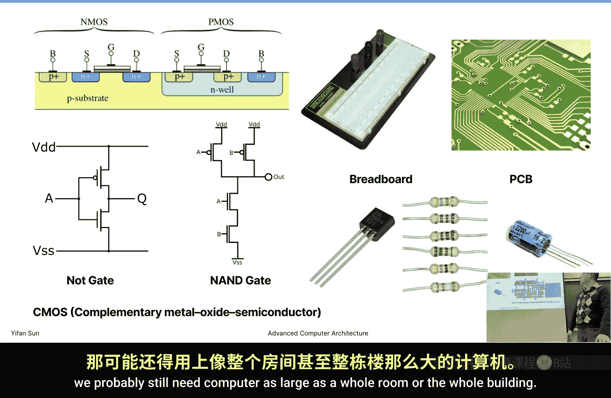

Room or the whole building， then。We want to make it smaller and smaller。

 takes the least amount of energy than this group of people， especially rubber noise， is the。

Inventor of something called integrated。Circuit。那那。

There are other inventors of different type of integrated circuits。

 but he is the one that we' we're using today。So when you design a circuit with skate on very large scale In circuit。

 which is basically a chip。You are actually designing something like this。This is the floor map of。

A very large scale In circuit。I think if this was my last year in the undergraduate。

I probably can still recognize some gates here。 And today， I cannot。

 but I can tell you therere probably。Only two or three gates at most and this at here。

 And you can consider those are copper wires that are connected together。

 And there are some like either green green ones or red ones are those N vows or P vows theyre representing different things。

Okay， those are something very similar to PCB， but they actually built into a chip that is super。

 super small。嗯。

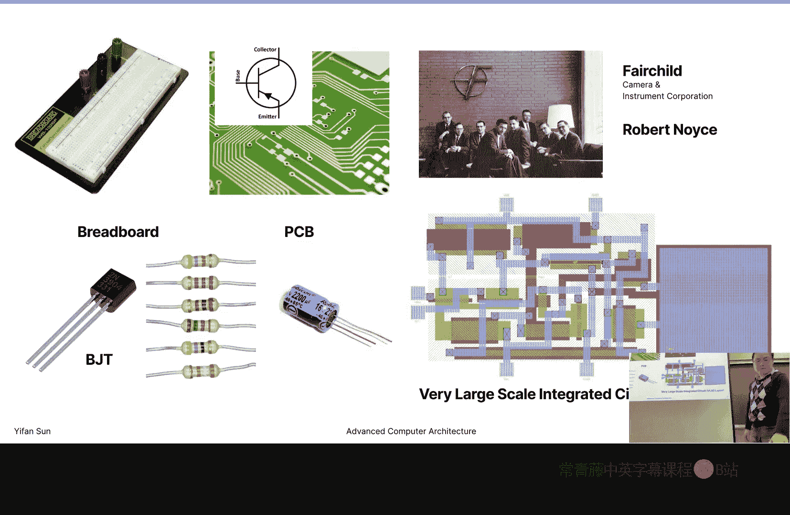

So this thing was first developed in at the Firechild， this company。

 then the rubber noise and seven other people started this company and they invented the thing and started to commercialize it。

Then， after this。We have。 Intel is the same person。

 Robert Nos and Golden Moore to start a company called Intel， and in 90。65。 so by the way。

 ro noise graduated from PhD degree。In 1953， so four years after PhD graduation。

 he invented something very important。 And I would say he's not really a computer scientist。

 and there's no computer scientist at that time。 He's really。

semiconductor physicist and he knows how semiconductors work。 and by that time。

 basically I would say everyone knows this is the direction， but how to make it out。

 how to manufacture it， how to implement it is the fundamental questions to ask。

 Now he's the person can solve some technical problems and get this thing out and make it useful and get a patent。

Okay， then not only now in。5About eight years later， these two persons。 two people started Intel。

 And I would say Intel is the beginning of the Silicon Valley。In around San Jose。And there many。

 many companies start to build around computing technologies。

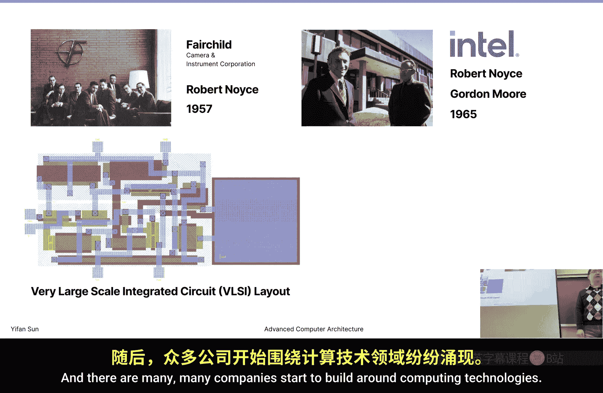

Then if we talk about Gordon Moore， we have to talk Moore law， right？能。

He's the person who started or who predicted the Moorese law。 The Moorese law is saying。

The number of components per integrated circuit have been doubling every year。

 I'm just taking the literal word from Wikipedia。 Then later on it's doubling every year。 later on。

 is's modified to 18 months， and there。Just from， even just from my reading。

 there are many different versions of。More slow than the。The first part come， What is doubling， so。

The original one is the number of components today with typically say is transistors。

 The number of transistors is doubling every certain amount of time。

 And this one is the cheap performance， but that's just use transistors。

 That's just say transistors can be translated to performance。

 although it's not that straightforward。 So the transistors number of transistor will roughly double every 18 months。

 and with no increased power consumption。 And the second term is kind of keeps being the second part is the speed。

 How long time it takes to double the number of transistors。

 And that is also something that keeps changing。 but the most common term is 16 months is 18 months。

So that is Moore law。 And if you think what is， why Moore law isn' there。

 is it some physics law or something。 Then I don't think it's a physics problem It's。

Psychology problem or social problem or business problem is more like this company is doing better than we have to do better than the other company。

 And that's why we have to find a way to do better than is driving the innovation to keep growing in this way。

 And until today。So Moores law was sentenced to death by many， many times since the year。

 I started to see this thing about Moores law is start since200 year 2000 even before year 2000。

 and is still growing pretty well today。 So this is a figure。It's really not clear here。

 This is a figure that I take from Wikipedia is the some。A pointin。

Some chips that are that were developed。 So you can even see there's a growth in performance， right。

 And there's basically no slowdown until today。 And although there are many different ways not to cap more slow improvement。

But。It's still somehow growing。And also， this is my own data。 in previous in during my PhD years。

 I have done this project。 now we have collected。More than 2000 CPU data， more than 2000 GP data。

 commercially available data。 Now we try to plot some figures。

 Now you can see the release date is all the way to 202024。 It's probably early last year。

 now we haven't been updating for more than a year。

Then the y axis is the log scale of transistor count。 So if it grows like linear。

 then that's pretty much following more law， right in more law。

 the duration or the speed is not the most important part。

 but the growing exponentially is the most important part of more law。

 And as you can see today is doing pretty well on both the CPU side and the GPU side。那 also。

 you can probably see。Likely today， actually since a very， very long time ago since the year。

 about 2010， GPUs are becoming larger than CPUs。Right， we we need a lot of computing power。

 So we we have larger GPUus than CPU。It's also partially because Intel starting from some date。

 they stopped releasing their CPU trans count numbers， so we're missing part of the data。

And actually， at the end。Even at the end， there are many different。

Andtra technologies that keeps driving the development of Moore's law。 in theory。

 it's not still following the Moores law， but it's just。

I wouldn't blame Golden Moore for failure of Mon's law。

 really because something that is hard to imagine。So what happened at the end is the chipla technology。

So we cannot build chips as large as we want， we cannot put as many transistors in one chip。

 so we build two chips and we build two chips， we connect them together and we sell it as one chip and it has almost the performance of as two chips。

 but it's actually two chips inside a chip where there are more than one two chips within one big chip。

So you can see the AMD Thr ripper CPUs are this large， right， The older GP CPUU are about this large。

 and stress Riper is this large。 There are many， many chips in it and connecteded。

 So if we consider that technology， if we read it。Chiap performance。On every chip is doubling。

 then we're not strictly falling more slow， but。We can still thinking。Mars law is still there。

Okay then that's Moore's law。 So what is driving the development of Moore's law is most likely process size。

 So process size is growing。 This is from the same set of data set。

 but probably about three years ago and only in 2021 or 2020 or even 2019。

 I don't exactly remember by the end of my PhD I developed this data set then we renew it until 2024 in this figure。

 So by that time7 nanometer was just out and only a few CPU and GPUus are using7 nanometer。

 So we're trying to count the density of the transistor per millimeter square。Of different processes。

So what is process size you can basically consider is as the size of a gate。 it's not that precise。

 And actually after 14 nanometer is pretty much business terms。

 it has no meaning with really transistor size， but it can still give you some feeling about what what is going on with the transistor size right So the transistor size is only a few nanometer large。

So， and also， it's very interesting other than a few outliers。

 it's very likely to be noise in the data， the dirty data。But if you look at to one。嗯。Process size。

 Just consider how many chips we have， right， thousandshouand of chips then。For any。

For any process side that。Density are constrained within a very small range。So， pretty much that。

They're saying。Whenever we have。Process size。We have a certain density。 Now。

 if we know the process size， we know the die size， we know how many transistors that we can have。

Okay， so the process side， so basically on the physics side is driving the development of the。

Improvement or the number of transistors that is available on a chip。But it。So， this also gives them。

Like misguidance on people understanding this term is oh。

 it's actually the physics that is improving the computing chip performance。 So what's the。

 what's the role of computer architecture， I computer architecture playing any role， And I can say。

To support 7 nanom， to continue to run on a chip at that side， There are a lot of improvement。

 Many things that happening。 Just one thing。If we have all the transistor working on that small chip。

 it will generate too much energy， generate too much heat that will soon burn the whole chip like when it rise above like 120 degrees Celsius then it will melt right so it grow cannot generate lots of heat but how we can solve that problem then the computer architects comes in to solve this problem by introducing something like smart corrugating that means。

If we don't use this part， let's shut it down or something like DVFS。

 the dynamic voltage frequency scaling that if we don't use this part or this part of computing is not that important。

 we lower the frequency， we reduce the energy consumption then we can still get somehow reasonable performance So to keep a7 nanometer or 5 nanometer chip that is working。

Computer architects is playing an important role here。

 and we're not deciding the chip process size in there， but we're enabling those things。And also。

 I want to see 7 nm。 I don't know if you remember a few years ago。

 that's that was a big thing when settlement 7 nm was first developed。 when 5 nm was developed， no。

 we don't think I personally do not feel that's such a large thing。 But when7 nm was developed。

 I feel like everyone is advertising it。 So it was a really big jump， right， in terms of。

Transistor density。Now， on the other side， if you consider transator size is about 5 nanom today。

 Now， I don't know if Apple is starting to use3 nanometer technology or not。

 but and we shouldn't take it as literal。 It's not really5 nanometer。

 It's more commercial terms and have tried to compare。Intel has this terminology called 14 nano plus。

 plus plus。Then the， the density is almost the same as 7 nanom from T SM C。

 the Taiwan Semi manufacturing company， T SM C。 And this chart is only from T SM C。

 I removed all other founders。The founders are the company that produce chips。

There are basically three found in the whole world。Were four。嗰时。Intel。

 they produce chips on their own。T SMC， I think you must know T SMC， right。t s m c 。嗯。

Is the largest foundry today。 Global foundry was a AM D foundry then was purchased by Saudi Arabic。

 some big business。From there， then global Fory is a third one。

 Then Samsung can also produce something。 So that's the most important foundries in the world today。

Then transistor sides are 7， several nanometer。 Now if we look at the atom size， this in pickmeter。

 So if I look at something like silicon right， where silicon silicon is here。

 It's about a little bit more than 100。And that's a silicon。 So， so how many。Atoms are there in each。

Gate or inch device each unit。It's basically 5000，5000 items there。 So you say 5000 items。

It a allowed， is's really not a allowed。 but if you say， is there space to continue to improve。

' probably still space to continue improvement。So until the day， we reach one at per。Gap。

 no probably。 that's a limit。 But I say， that's still very。Far away from today。Okay， please。

WhenWhen I compare the transistor size with the at size， I feel quite amazed by the。

Dity of these transistors。So let's talk about how chips are made。

 So I want you to understand this thing so that we can understand some design constraints later on when we inter intercon。

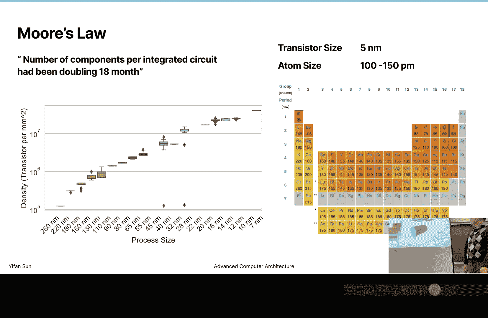

In encounter in computer architecture design。 So chips design starts from this cause this thing called silicon crystal。

 Now， we have these big silicon crystals and spill into this。嗯。It's manufactured into these shapes。

 now later on we sliced them， we cut them， slice them into pieces thin pieces。

 and these things are called wafor。Okay， then we slice them。

 Then there's always a very important metric or parameter that to describe how powerful a foundry is is how large。

 What's the largest size of the wafer。 There can be 16 inches。18 inches，20 inches。 I don't know。

 anyone is building larger than 20 inches， but I'm not falling closely。

 So 20 inches is basically this big。 Just consider a pizza 20 inches pizza， right。

 so it's relatively large pizza， but not the largest。 So that's the wafer that we have。

 Now we start to build chips on its wafers。Now， when we build chips， we build in this way。

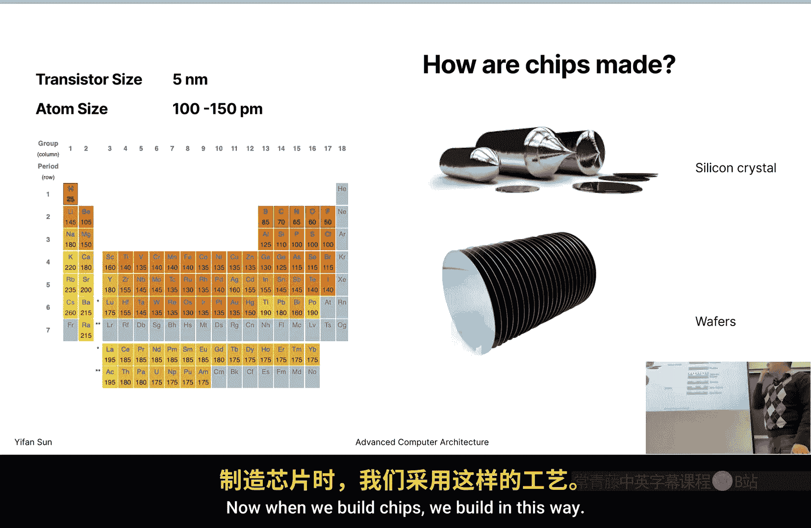

We have a wafer， right。 We have a wafer。 assume this wafer is the best that we can find。

 We put something a thin layer of gel。 that's called photo resist。It's a gel as it would put on it。

Pre baked now later on， we do this very important step called。靠。Expo， right。 Now we put a mask here。

Or this mask is sometimes also called a radical。 And this is probably the most expensive part in the whole。

AMauring process。 Just consider Nvidia， AM M D， Intel if they ask T S T SM C to produce a chip。

 The first chip is probably a billion dollars。 Then the second chip is probably only a few dollars。

 Why， why it's basically because this mask is so hard to make and so hard to make it precise。

Now we have to put it align it and put it on top of a wafer。And then we。Put the light on it， then。

There is a problem in this process。We know lights are not perfect， right， when lights。

It's casted through a small hole。 It won。Defrac， right， will expand。And this is a big problem here。

Think about this gate， this channel， this wire is probably only a few nanometer wide。 Now。

 if we consider， if we consider this side a few millimeter size， it's not a problem。

 But if it's a few nanometer， it's a big problem。 So that's why， you know， the the smaller。

 the shorter the wavelengths， the smaller the diffraction。

RightSo that's why you've probably heard of this E U V。So。EUV devices E EUV。Devices from AS SM L。

 that that is the extreme ultraviolet。 So they want to use ultraviolet light to serve as this purpose。

Then the， the shorter the wavelengths and higher frequency， the better because the more precise。

It is。And I can tell you what they are doing today is not even this。

 The smallest channel they are doing is a few is a1th of nanometer or even hundreds of nanometer。

 Now， how can they use a larger ones to produce smaller ones。 They do it twice。They put it here。

 They do it once。 They put another layer of gel。 They move it a little bit， and they do it again。

 So that will leave a small gap there， that is the actual small。

 thin copper virus network going to build on this。On these chips。Okay。

 but eventually after this step， we have this develop。

 developed the step that is we have we removed this part of the gel。

 Then we use some chemicals to eat it or either develop it or eat it just to remove part of the material or we can grow part of the material。

 basically， either a copper or nitrogen or phosphorus。Different items。 Now we build different things。

 different features on these devices。Then at the end， we wash away these jos。

 then you cannot imagine how many how how many gallons of water or how much water is actually moving。

It requires to do this step。那。It's a lot of water。 And that's a question that I don't know why TSMC is setting off a factory in Arizona。

Where water is cigars。But that's whats happening。Okay， then so assuming that's happening。 Then。

 by the way， this process is actually not。 we're not doing on the whole wafer。 Okay， we're doing。

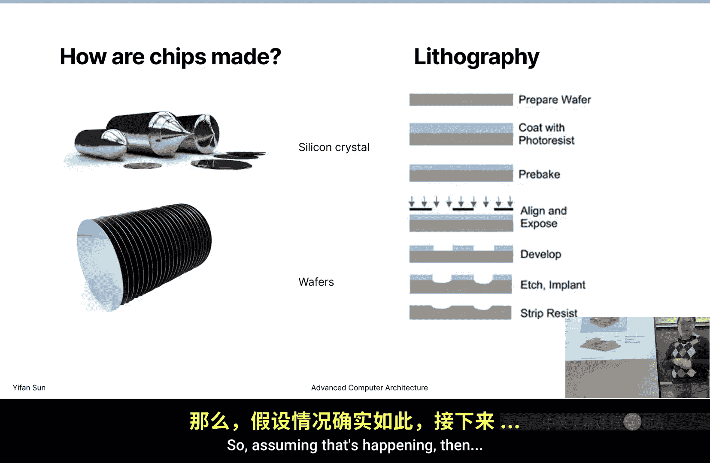

Square by square or radical by radical that is on this wafer。

 So we have see the small squares that we're producing many chips on this one wafer。

 then we slice them later。Assuming we have these chips there， then we start to do the packaging。快ion。

End up being squared。 What's the point of the way from the。嗯。Okay， good question。

 So if it's a square， is's nerve squares， then why is the wafer a circle， wafer is a circle。

 because we can only like deposit the crystal of silicon in that way。

 So youll grow in that direction。That's really physics。 I don't know why。 but yeah， that's。

 that's a limit limitation on the other side。 Then the。

 the silicon itself is not that expensive so we can discard them the。We always trim them。

 then discarded the side。And the most expensive thing is not discarding the edges is actually discarding produce the chips。

 that's something we're going to talk later。So then let's say if we have a chip that is ready。

 we need we can sell sell the chip。 if we sell the chip， someone touch it。

 we will be destroyed immediately。那。So we have to package it。

 in packaging is basically a way that we put some。Other materials on top of it so that we can sell it as a product。

 And typically some sort of plastic on top of it。 then there's a。Some plastic beneath it and silicon。

 silicon， as a this is the thing is called substrate。Then it's the base layer of this over chip。

Then we also need these leads so that we can communicate from outside。Now， this is an example of。

I say meteor chips。 Actually， if you see this style chip is relatively inexpensive。

 probably less than a dollar per chip。 Then there are some even lower end chips that are not。

Typically not widely used today， but use as a。If you are hobbyist and you probably buy those small chips they only have a few pins。

 a tens of pins that's on two sides of the pins and these are on four sides of pins。

 If you buy a CPU today， they they have thousands of pins that is on the bottom of it。

 the small boss on the bottom of this chip and basically the more pins， the higher connectivity。

 the higher bandwidth that in this chip can communicate with the outside world So the pins are very important and it typically the more the better。

And these are scarces resources that is actually limiting our performance。Now。

 just don't think packaging is something trivial， just put a piece of。Plastic on top of it。

 by the way， the simplest packaging method。 I don't know if you have buy those toy watches。

Very old watches。 No you don't know。 Have you seen those black things。Splack circles on top of it。

Black， black circle on the PCB。 That's the cheapest packaging method。 It's basically。

 we put the chip on。 Then we put a piece of wax or plastic on top of it。

 That's the lowest end packaging method。Now， don't think packaging is something trivial。

 It actually very important that is leading the innovation in this domain。 For example。

 we have something。 we start to have something interposer。

 interposer provides the communication method that is for the chips that is within one package。

 I'm saying chips within one package。 It's something relatively recent that we start have multi chip module technology or also known as chip light technology So have smaller chips that is built in one package then using interposer to provide fast connect between this chips。

 Now， typically we consider the network on the chip。

 we consider on chip network in package network and off chip network。 the。

Lower grade the off chip is the lowest grade。 The slowest， the highest latency， the lower。

Highest latency， smallest bandwidth and highest energy consumption。Right， the in。

On chip network is super efficient， off chip is not efficient。Then we connect them with interposer。

 at least it's better than off chip interconnect than can provide fast connectivity between chips。

 and also we have this type of 3D stacked stacked chips that we can have more and more chips thats build in one package。

Now， these 3D stacks has something called through silicon wires that are connecting these chips together as a pole that are connecting these。

Chipps together。 so。Packaging is definitely something that's very important and is driving this innovation in this particular domain。

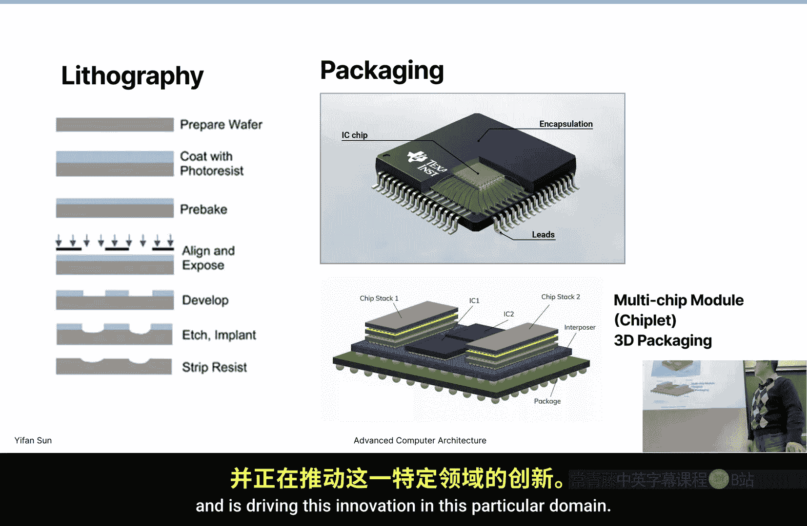

Then we talk about chips， then we see nanometer size， rights every device is several nanometers。

 And if you think if a piece of hair that falls on a chip that can destroy billions。

 trillions of transistors。So there's basically no environment that is test free。

 so we always have environment， even those in those super clean rooms。

 you see those people are wearing a white suit， shoe。have wraps in their wraps on their shoes。

 Then even in that environment， they also have wind blowing from top down so that all the dust going down will not go up。

 So even in those environment is not perfectly clean。 There's some dust there。 and also the physics。

 the silicon of the crystal may not be 100% clear。 there must something wrong going on。

Something going on on the silicon， right， In that case。

 we have defect and defect are something that is not working as desired。

 that is because of physical limitations。 So defects basically happens。If we're doing right， Okay。

 so all these cases are likely something wrong is going on。

So this type of thing is very likely to be。 the rectal is slightly twisted in the in an angle so that the outside is impacted。

 but inside is barely okay。So there is something basically there's something wrong with this。

 So this is very likely a long stringing a hair that is falling on this whole wave。

 so it's destroyed。So。But in normal cases， this defect happens in a posson distribution。

 So there are some distribution， some likelihood that a defect happens here and there and are typically considered very small。

Okay， so。In that case。If you calculate the possibility that a chip。Vatile， that has no defect on it。

Now， we basically can get in this。嗯。Quantlitative understanding that the larger the die size。

The lower the yield。 and it's not growing linearly。 And at some point， is really close to one。

 iss when you grow to a size that is。Larger than a certain size is very。

 very unlikely to avoid defect on it。 right。 So in this case。Cheap sizes cannot be unlimited large。

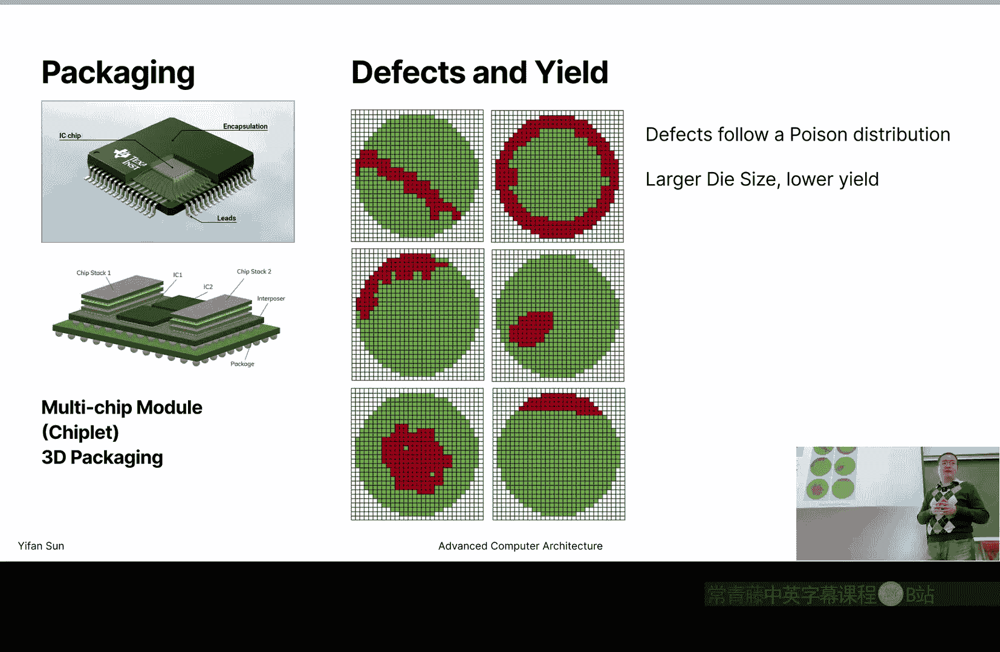

So what's the chip size today。Still from our data set。Now you can see。

Cheap size are growing by a lot， these days。系。Especially， I think this is the turning point。

So the chip size keeps growing before 2010。Then it becomes relatively stable。

 The largest chip becomes relatively stable。 still somehow growing in 2018 is grow again。

 So until today。There are a few outliers。 Just ignore this a few outlier。 Those are chiplet。

 multi multi chip module。 So we're come。 So one chip may come come combine multiple smaller chips in it。

 So that's why the chip size is super large。 But basically， those chip。I think this some。

 this is probably a media H100。These are a few like Nvidia A 100 or AM M D M my 300s。

 some chips like this。 I I still remember that。We basically get 800 millim square as the limitation that can either balance the power consumption。

 the money， the amount of money that the consumer can spend and the yield that we can get out of these sites。

And if we build super large。If we build super large chips， and very likely we will have。嗯。

So many dad chips that we can now use now we have to discard。能。

So that's a kind of a soft limitation we have。 If you really want to spend a lot of money to build huge chips。

 Is that possible。 Yes， it is possible。 And there are ways to do it。 And today。

 we have wer scale technologies like that is built by cerebraus。

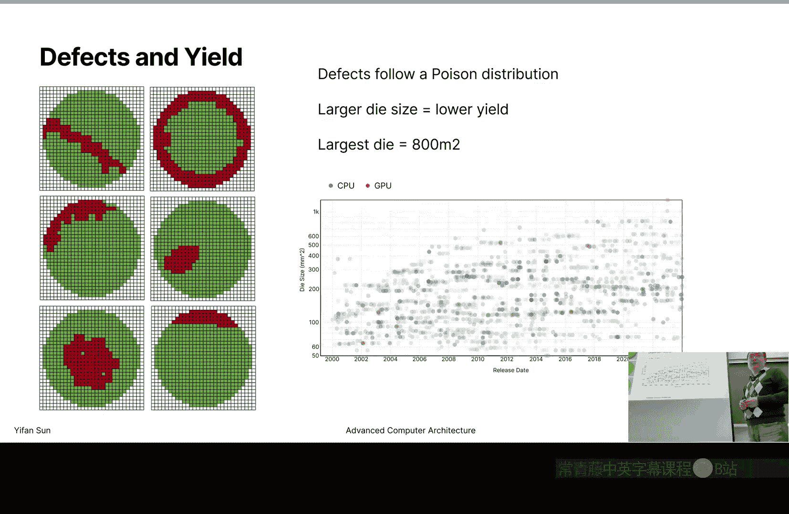

And if you're considering I'm going to show a wafer skill chip， it's something I didn't prepare。不。

This is the largest one， I don't think this is the largest one， sorry。

it's because my computer is freezing。So。So the largest is。

The largest chip is basically 800 millimeter square， right， but at the same time。

 there are some other ways to improve the yields。For example， let me ask this question。This is。

MacBook Air。And thirdship。They sell8 core GPPUs，10 core GPPU，10 core GPs。

 Why they have an 8 core GPpU。Version。It's basically because the two otherer cores are not working。

So if they have defect and this defect is isolated， then they can say， okay。

 all the defects are on these two courses， then we only sell an eight core version and we can still get some money as a lower end chips and it happens in all company。

 all semiconductor companies， they sell lower end so for example。If you buy a 40，70。NVdia 40，70。

It can be the chip that is actually from 4080， but bin。Because some parts are not working。

 They just turn it off。 Now， I even know long time， long time ago in AMD chips。Yes。

They just their yield were too good， but their market is really requiring the low end GPU。

 What they are doing is they're just using higher end chips to sell as lower end devices。

 but using software to turn off some of the course。Now， some people are saying， oh。

 we try to modify the driver， modify the software so that we spent the lower enterprise and to guide higher end。

Performance， that is what is happening。 And this is happening。 when you see， say Intel， Intel 10。

 something CPU iss pretty much very likely the whole theory is， is actually one chip design。

It's only one chip design， then there are。嗯。Just bind to different market and sell as different market。

 And also。What you dream because today's chip is so large and yield is so low。嗯。

When you see a 10 core GPU， it's probably they have 12 cores already in it。

 They are considering2 cores may be not functioning well， they just。Having something extra there。

So what exactly is happening when you see like2 megabytes of caches。

 is probably they actually have 2。5 megabytes of caches and just turn off some parts of the cash so that still a product that can be sold。

你。At the end， let's talk about energy consumption is super important terminology here。

 And the most important thing to consider energy consumption。

 The most important metrics to consider energy consumption is the thermal design power， TD P。

 So every chip has a TD P。 So， for example。Well， I can remember any。Product。The TDP。

 the relatively older GPUs that have been using for many years， have 300 W TDP。Right。

 as you can see from this figure， it's also from the same data data set then。啊。

The TD P basically is going from every from very below， very low to very high level， right。

 So TD P is called thermal design in power is。inventedvented because we want to guide how heat dissipation or cooling method we should use。

In some very low end devices， probably in a cell phone is。

Can be even lower than one vote or can be in a in a watch。 It can be。 It needs to be really low TDP。

Right， then for some higher end， it can be。 This one is almost 1 kW。能。Look at this。Map， basically。

 look at the GP P U S。 The GP P U stores as a very relatively low TD P， right。

 It's not spending a lot of power。 Then eventually， GP PU is standing way more power than CPU。那CPU。

I would say you can rarely find CPUUs that spend more than 100 watt of power， but for GPUs。

 if you have a higher end they easily spend 300 watts of power and I think in 5090。

 I don't exactly know the numbers is 550 watts or 600 watts， it's really spending a lot of energy。

Then for TDP。When you talk about TD P， you also need to know one term。From Intel。What's that。

 what's that term is。What do they call it。New one。 so basically， Intel sells chips。

 sell CPUs with two frequencies。 One is the highest of frequency。 One is the lowest of lower。Yes。

Sreading。No not supersing。A term。Probably， I don't exactly remember。 But anyway。

 so just say they sell a CPU with two frequency， right， Probably the highest frequency is 3。3 Hz。

 Then the lower one is 2。2 Hz。 Why there are two frequencies。So the 3。

2 is the highest frequency that we can run。To get the correct result。

Regardless how much heat that we can dissipate。So if we have a task that requires a boost of frequency for short term。

Now we run at 3。3 Hz。Get a very high frequency， high， faster response。

Its not over overclocking is not a。 Overclocking is something that a product is designed at 2。2 Hz。

 Now， we're using it at 5 herz。Then using some different ways to change the frequency。

So that's overculking， so I don't exactly know the term， but it's definitely related to overculking。

So overclockuling will generate more heats than the TDB can accept。

 Now even extreme overacclockuling can generate wrong result so that your computer can crash。嗯。

But the， the higher frequency of Intel CPU will guarantee the right result。

 but cannot last for a very long time， only a short term。 Now， it will generate a lot of heat。

 but it will detect the temperature when the temperature is too high， they will。Reduce the frequency。

 so that will generate a reasonable amount of。Frequ。 So that's TD P under this T。

 So if you run a typical workload for a long time， they run at the TDP。 So if you know the TD P。

 you know what type of heat dissipation or cooling matter that you should use， for example。

My computer is freezing again。 I don't know why。

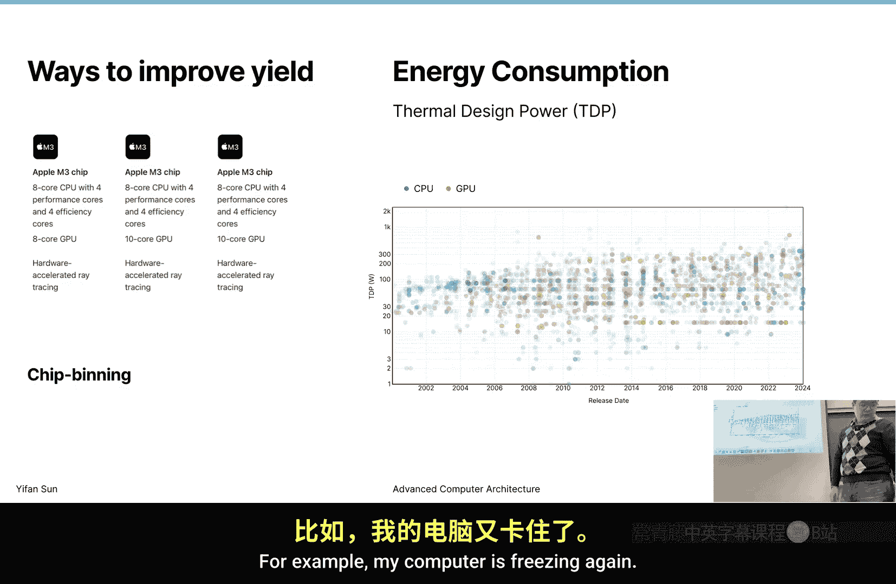

So that's probably the one last two slides。 So different frequency that we can use different different TDP。

 we can use different method like if we're under probably 30 wts，20 wts。

 we can just use a heat think。Right， then。If it's about 50，70，100， we need to use a fan。

 If it's a few hundred， several hundred， we need to use liquor cooling。

 So powerful heat dissippatation method， so。That's the method that we use to dissipate heat to match the TDP。

 But TDP is also a descriptive value to。Describe how much energy a consume a device consumes。

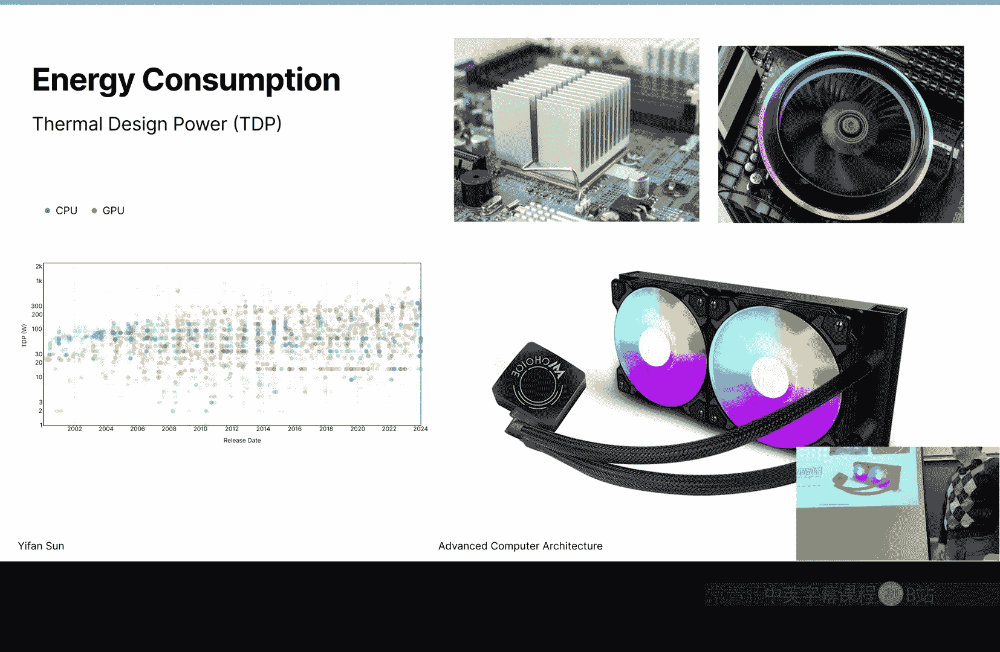

Then when we talk about energy， we have to talk about den scaling， so in den scaling。

 it describes this phenomena as important， in my understanding is as important as Moore's law。

 but is really that instead about a few years ago。So as transistors get smaller。

 their power density stays the same。 So what is power density is basically how many wts are there。

Per millimeter square of die size。Cheap size。So。Then look at this one。

We compare different process sides from 19 nanometer to 7 nanometer， right？嗯。

Then if den scaling still holds， we should have a horizontal line there no change。So basically。

 per millimeter squared is 0。4。Watts about 0。3，0。4 Wts consumption。 Now you can see at this level。

 it's a little bit higher。12 nanometer pretty good。Why 12 nano is slightly better。

 is' because it's mainly on video GPPUs。And， and media GPUs。Mark their TP relatively low。唱。嗯。It's a。

 it's a marketing problem。 So theres some noise here。 Then 7 nanom by that time in2020。

 there's probably only a few AMD GP PUs。 And we can see it's very high。Right。

 so the power density is is no longer holding。 Then I， we should extend it by a little bit more。

A few extra years。 I don't know how it grows。 but even by at this point， after 28 nanometer。

 it still somehow is's not holding。Okay， so this is standard skating。

 and the d skating is pretty much dying。 But if we want to keep the power density somehow working。

 the power density is still somehow close to a few。Like 0。3，0。4 ws per millimeter square。

 because we cannot change that by that much， because we cannot。Increase our TDP by much。

 and we want to increase or die sizeize by as much as possible and increase the transistor density as much as possible。

We have to use architecture method or higher level solution to tune down some of part of performance。

 some remove some parts so that we can get a higher performance。嗯。Okay。

 I think that's everything for today's lecture。 Then basically we go through some basic concepts in chip design。

 Then starting from next lecture， we're going to talk about binary logic and binary representation of numbers。

 Now， we're starting with some circuit design task。ok。

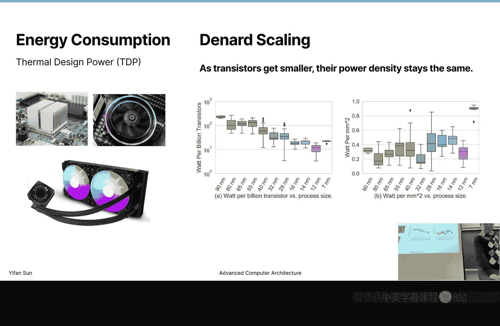