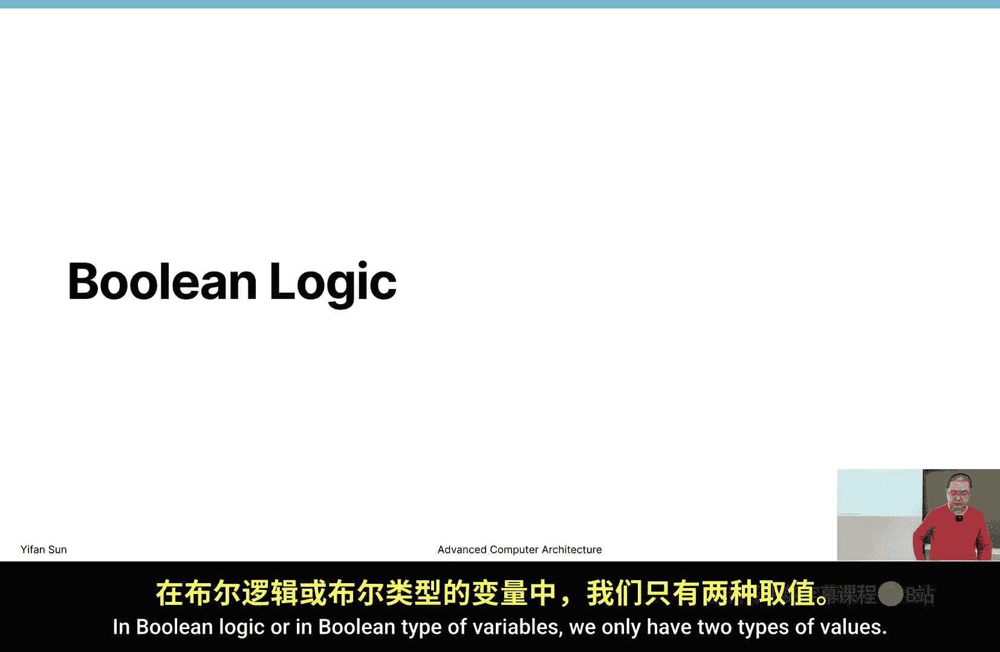
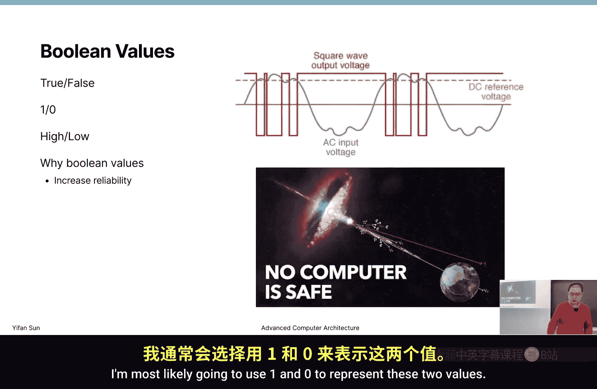
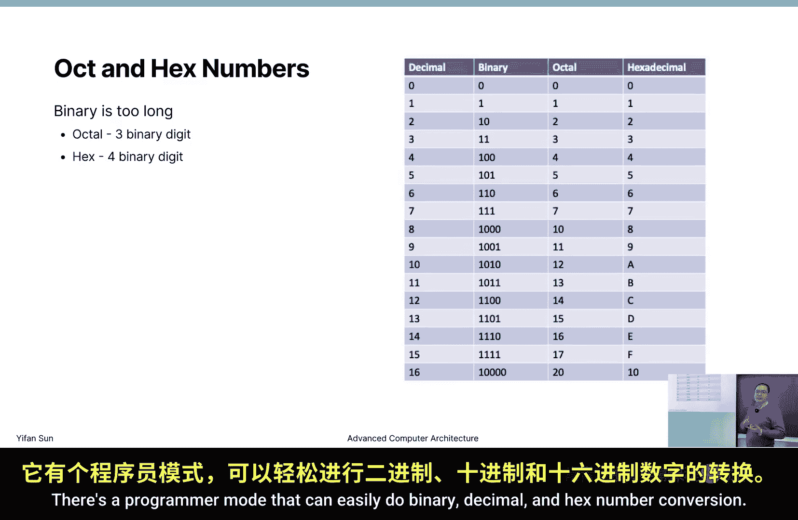
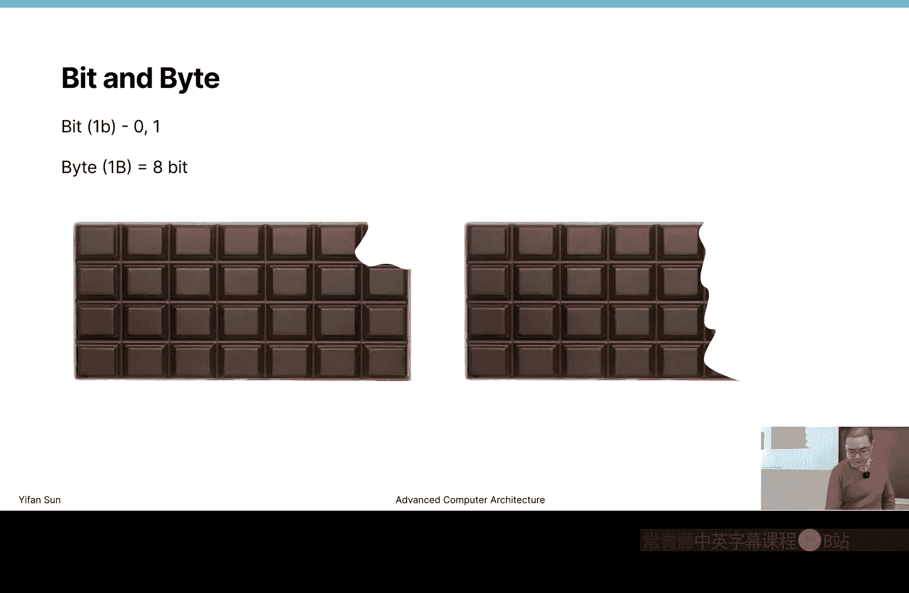
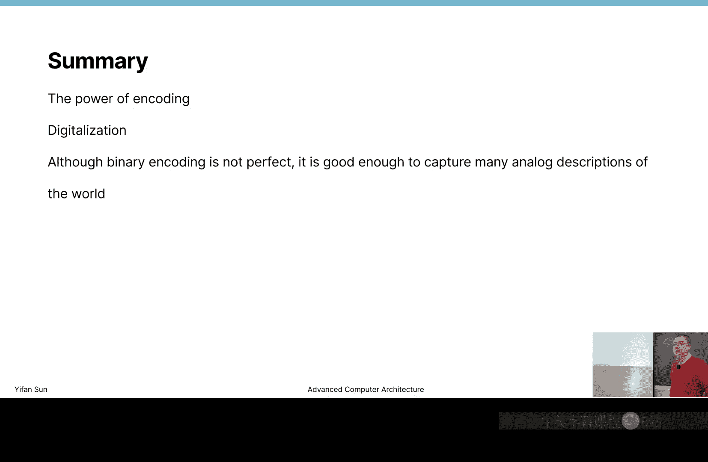

# 威廉玛丽学院【中英⚡高级计算机体系结构｜CSCI654 Spring 2025, Advanced Computer Architecture】 p02 P2 布尔逻辑、二进制数与编码 -BV1evfwBVEUG_p2-

So in today's lecture， I think it's most likely a review for most of you as a computer science graduate student because we're going to go through some very basic。

Biner representation and numbers when there hopefully there is something useful for you。是。

Then we're going to talk about binary logic and binary numbers so that in the next in Thursday's class and next week's class。

 we can talk about combinational logic and sequential logic。

 the very basic for circuit design then starting from Boing logic， I think all of you。

 most of you should know this concept in Boyan logic and or in Boy type of variables that we only have two type of values。

So using blue values it basically we can say in different ways like we can say the values are true or false or one or zero or high or low and when we say high or low is typically means voltage when we say one or zero is the number of representation true or false is logic representation now why we want to use a binary representation is to make the hardware design simpler and to improve the reliability of the hardware so can we build a system that have more than two values like say four values in theory yes we can then it definitely needs more circuits larger area higher power consumption to get those hardware designed hardware is not perfect then if you consider digital circuit then throughout the semester we're talking about digital circuit but you always need to know all digital circuits are analog circuit underneath now it has voltages。

The voltages never works in a way that goes to1 or zero perfectly it goes up and goes down then if we want to have four levels or even more than four levels of detection then we really need to define a precise bin of say what is one what is to what is three what is4 but if we only define two levels than high and low and typically the detection is much。

 much easier then the error rate is much lower then I don't know if you have watched this video before this is a verasm video transistors internally works somehow like a capacitor if there are some electrons stay there then to keep it to store it as a one or zero or keep this gate open or closed then there's cosmic ray that keep going from the universe to the earth then if it's a cosmic ray heat a particular transistor it may flip the value that is stored there or flip a gate。

Computer is safe， and every computer may have some rate of error。

 especially when our transistors are getting smaller and smaller。 Now。

 we definitely don't want errors。 Sometimes some errors are okay， For example， for GPO rendering。

 if this pixel is flipped from white to black for a frame。 Now you probably never recognize。

 but sometimes it's a big problem。 for example， in this video， they say there was a flight。

 this going flying。At a certain altitude。 then it suddenly change the altitude all by its own for no reason。

 Then everything they check， they cannot now find the problem。

 Then eventually what they find is probably just a bit flipped in the the plane's internal computer。

 the controlling computer。 So it can sometimes can be dangerous。

 So we want to improve the reliability and reduce the error rate。

 That's why we want to use binary values as much as possible。

Now this is definitely a video that I highly recommend that they're increasing the reliability it's a hot topic in research。

 then typically you consider this as two use cases one is the computer that used for aviation purposes when we go high the rate of cosmic rates are much higher so it's more subject to bit flips。

 especially if we're going outer space going to the moon much more likely to get croped some data then on the other side。

 if we run some like supercomputing supercomputing if we have tons of GP CPU machines running there there's always a likelihood some bits when flip then you want you don't want to lose a lot of data many。

 many hours of computing， so you want to store them or how to prevent these type of errors so this is definitely a hot research area in pulling representation。

 we typically have values zero and one then starting from。this point。

 I'm more most likely to going to use one and0 to represent these two values then we have some operations then the most basic operations are not and and or then。

To understand these type of operations and any type of logic operations。

 even complex ones the most convenient tool is the choose table so on the left side we put the input value on the right side we put the output value and on the left side we try to list all the possible input values and we say what's the output value and then the node gate is super easy to understand it simply flips the value for end gate it basically is saying if。

Only if both of them are one or two， then the result is true。

 So true and true is true right true and false is false then on the other side or gate or or operation only requires you to have one true then our final result is true。

 Now I know there are many different representations for bulloleying operations， but we use this。

X and y， the multiplication right as the end operation。 Then you can easily understand。

 then anything multiply by 0 is still 0。 Then on the other side， we use the end sign then。

This is a little bit different from the end operation that we're going to introduce later。

 sorry the plus operation that we need to introduce later。

 this represents all operation and if it's plus then if it's a binary representation will get10。

 but here it's a one bit operation and it's a logic operation so one or one2 or two is still true。

Now these are the most three basic representations and later on we're going to see those are the most basic gates that we're going to use in computational logic。

Other than this three gate then there's another gate that's less frequently used is the X or operation。

 So X or detects if these two values are different or not is if the if these two values are。

If these two values are different then the result is one， if these two values are the same。

 the result is zero now definitely we can use and or and not gate to represent the X or gate。

 but sometimes if you use X or gate it can simplify or circuit。

So definitely there are different ways to represent these operations and like in logic representation in Java B operation on Java Bwise。

 in most of program languages， Biwise operation and B operation。

 they have different operators and in circuit design we use in this type of operator。

And if we want to do the calculation， then there's a list of algebra operations that do different laws of calculation rules that we can apply。

 for example， identity rules true。True and anything is still nothing， right？

False or anything is still that thing。And a。And X prime。X prime is not x。

Now when theyre when they're being ended together， it's always zero because either x or x prime is zero there are many different rules and why these rules are useful is because when you design a circuit。

 you don't want to use a lot of gate if you can re express something expression in a very long way then you may require many。

 many gates to implement that logic， but eventually you want to use the minimum number of gates to implement logic so then you need to。

Reduce。The equation to the simplest form。Most of them。

 at least until this part are very easy to understand and if you ask me to list all these rules。

 I can never list all of them， but if you give me an equation that wants me to simplify that I can do it。

嗯。The only special thing is the de mors laws then I find this one is super useful even when I write a program if I write C or Java or go program or JavaScript program sometimes we may have a if statement that is quite long on its own then you may want to simplify it you don't want to use pres within if statement the condition for if statement and you can try to use de mors laws to try to simplify your representation so to understand it is X and why。

Prime the n x and y equals x prime plus or y prime。 Then the other side。

 x or y prime equals x prime and y prime。 Okay， then the prime is always go before any other operations。

 The not operation， always go before any other operations， so。Check。

In theory you can prove all these laws， but you don't need to the simple easy way to prove these laws are simply at least the truth tables of all the values。

 we only have XYz when we have XYz there are only eight possible eight possible combinations and if we list all these eight combination of output then use the calculation rule and then we pretty much can calculate all the possible cases and if all the possible cases are correct then these rules are proved。

Okay， basically， there's no need to prove this type of lawsuse。Okay。

 those splitt algebrabrass then I don't want to give you some practice then if it's an you know undergraduate course and then you probably get some practice at this moment。

 but I think those are super easy things， so I don't want to give you。Practice here。

Then the next section， we're going to introduce integers。就。

How are integers represented in computer and in the binary format then our goal is basically represent everything within binary format。

 we know computers can only treat0 and once the closed circuit connected circuit so in this case we need to represent everything in binary format starting from the both the simplest case is integers Now we need to look back to how numbers work then they say a random number that's 6715 now if you analyze this number is basically can be represented in this equation6 multily by 10 to a power of 3 7 to the seven multiply by 10 to power2 now one multily by 10 to a power of 1 and5 multiplied by 10 power of01 to a power0 is one so they have the digit they are located at different location so they have different。

What？Now， what's the weight， The weight is basically defined by them。basease of this number。

 for example， typically， we say we use。Deimal numbers。And deible numbers means base 10。

 So our base is 10。And。Whyite people like to use space 10 numbers？Yeah， people have 10 fingers。

 right？If you ask me before computers were born， what's the second most commonly used digit system？嗯。

I would say 12。Right we have 12 hours。So Y 12。嗯。对。嗯。I don't exactly know。

 but I think it's convenient because it can be divided by three and four and two but 10 can only be divided by two and three that's why some people then use 60 is another commonly used dig system before computers were born definitely after computers were born。

2，8，16 are the most commonly used digit systems。And 28 and 16 we eventually see they are basically the same digit systems it just combining different digits together before here we have this number that is 6715 and they can be represent in this way and we find the patterns that we have the base here and we have the weight on the powers and the digits on the left on the multiplication side so then we can represent basically any number using binary format by just simply replacing this base to number two so then we can represent this number。

So simply we replace the base and we replace this part， but since we're using base two。

 we only have two digits that we can use we can only use zeros and ones so here we can only use zero and ones and we can never write。

2 there， because the D2 does not exist in。Binary numbers。

 so if you ask me what's this number and we can basically do a calculation22 power3 is8。

2 to power2 is 4，2 power0 is1， so8 plus4。Plus，1 is 13。 So this number is 13。

If you use binary number for a very long time， you can easily convert a binary number。

To a decimal number by the way， the decimal number here has two meanings and when people say decimal number it can be either a base 10 number or a number with a dot with a decimal dot in the number so at this point we're talking about decimal number as base 10 number in the second half of today's lecture we're going to talk about decimal number as a。

嗯。Number with a point。There's nine integer numbers。So1，1，0，1 represents number 13。

 So there are just two different representation， two different encodings for the exact exact same concept。

 Now， another easy way that we can represent this number is。Just by counting。

 so you probably know some famous numbers， for example， 1，1，11， which is 1，1，1，1。1，1，1，1 is 15。

 right， So 1，1，0，0，0，0 is 16。 So 1，1，1，1 is 15。 So sometimes I just count back then 14，13。

 then I get it。 So also say 1，0，0，0 is 8，1，1，1 is 7。

 There's a few key numbers there then that makes easy。

like anchor points in that you can always start from that certain point and grow or decrease from those points and that easily to make conversions later on when we talk about hackx numbers is also the principle that you can use counting by finding these numbers。

So if we count in binary format， we count from 01 after 0，1， then we go to 1，0，1，0 is 3， then 1，1。10。

0， don't read as 100 is just 10，0， okay。And1，1，1。1， sorry，1，0，1，1，1，0，1，1，1， then1，0，0，0 is way。

 then especially in。嗯。认可。When you design composition logic。

 you probably want to list all possible cases and just don't try to find a number and write there。

 always write in certain orders and this particular order is the best order that you can probably use it can always guarantee that you list all the possible cases。

Okay， then at this point， I want to introduce a concept called shifting。 So in shifting。Now。

 basically， we're talking about shifting to the left side now in the decimal representation。

Shifting to the left meaning adding a zero at the end。Adding a0， then if you consider that equation。

 So every weight。Every way digit weight is multiied by is increased by one right that means multily by 10 so shifting by left by one digit in decimal number where you base 10 number means multily by 10 adding a zero is multily by 10 and the same thing here in binary shifting by one digit means it's multily by 2 So some very simple multis or multiply by 24816。

 you can always stand by shifting operation rather than doing real multi multi is always something。

Thiss annoying。 So left to shift means we're multiplying by the base and how many times we're multiplying is the number of digits that we're shifting Now on the other side。

 right shift means dividing is divide by the base and the number of digits we divide。

The number of digital we shift is the number of times we divide now of course there's a rounding problem for division。

 but it's basically rounding the same rounding principle as you are doing。

Like Python programming or C programming when you do integer division， then it's rounding down。

 right？Now。When you start to have numbers， then we start to have calculation just be careful these are slightly different from the and the Boan algebra now here we have multiple we have some some operation pretty much at this point we are only going to talk about some operation and when we talk about some we're doing this way we' are doing digit by digit summing。

Right we're 6 add by 5 is 11。 Then we carry。 We carry to the next digit。 then 4 by 6 is 10。

 Then plus the carried one is 11。 we carry again。5 by 7 is 12。 We get 13。 Then we carry again2。

Two and three is。5 with the carry， it becomes 6。 Okay。

 now basically apply the same rule for binary numbers。 So for0 plus 0 it still 0，1 plus  one。

One plus one， we get two or 10， right， so 10， we write zero， then we carry by one。

0ero1 with the carried one still get zero carried by one， then one，1， one。

 three ones together with the carried one here， then we get one，1， right or three。

 or you can consider we get one and carry by one then because there's no more digits we directly write one do。

Okay， so it's basically same rule and if we do the summation in decimal format decimal format or binary format or whatever base of the number。

 we basically will get the same number， it's just a different base system。Okay， then。是。Yeah。

Then other than decimal， for most of the cases you probably don't want to write binary numbers。

 why because it's too long it's not easy to read then you write a very very long binary number you really don't know what's the number so what you want to write if you want to keep it closer to binary format you may want to writeocto format or in hack in hackx format in hackx format actually hackx format is probably much more useful than anocto format。

Then in Has format， we have。16 numbers if we count zero in， so if we're running out of numbers from9。

 we start use ABC D EF to add the number there。Okay， so we have ABC D EF F is 15， 14。

13121110 then in this case our hackx number is typically the same lens or even shorter than binary representation is very it's a very compact representation for example。

 sometimes we write F F F F FFF。RightThat number8 F， that's a 32 bit number， 32 bit integer。

This is the largest unsign integer that we can represent Now it's much shorter than if you write once。

Soon you will lose youll get lost like you don't know how many ones you have written right so to convert from binary to octo and hackx is also very easy just look at this table then the octo is basically combining three binary numbers for example if these three numbers represent three these three digit represents three and we write three then if this one is one then we leave one here so basically combine three digits together into one digit octo format on the other side the hackx format is also very easy then combine four digit into one digit here so it's super easy to convert then for。

I didn't tell you how to make the conversion between binary and。Deimal number。嗯。

Typically these days I don't convert it by hand in theory you should be able to convert it behind hand。

 but pretty much I only the use a calculator then what calculator I use I use max internal calculator。

 there's a programmer remote that can easily do binary decimal and hackx number conversion。

Okay。Now another concept is bit and byte， then a bit is very simple is just only one digit is can represent0 and1。

 then a byte is considered eight bit combined together and can represent a certain range of numbers。

嗯。In early days， current right now， you probably take it as granted that one byte is 8 bit。

 but in early computers。It's kind of the same debate as 32 bit computers or 364 bit computers different vendors may have different definition for byte Now eventually they get this consensus that8 is a very reasonable number then they all of them start to use8 bit as one byte Now one byte is the。

Unit that is typically used to represent a single number。Then other one bitete， there are some other。

Unit that are not。嗯 i say。No consensus on how large it is。 for example， word， how large is word。嗯。

Most likely a word is 16 bit。But I wouldn't rule out possibilities by some。

When some crazy vendors may create some different definitions for words then with word there's double word then double word is typically 32 bit。

 but those are not that frequently used the unit then to differentiate bit and byte if we write one lowercase B that represents one bit then if it's an uppercase byte then it's a byte sometimes people do get this confused that about bit and the byte then get some wrong result。

So be careful。

Now， when you use a number to represent something， then you always want to know itss range。

We're talking about Einstein numbers， we start from zero and start to count right if use one if we use one bit that is zero or one。

 it's a true or false false representation if we use two bit this zero to three。

 zero one to three two digits right to four combinations。

And if we use one byte that's2 to the 20 to 255， I shouldn't write 256 it cannot represent 256 it can represent 256 numbers but the largest number it can represent is 255 it's not a very large number Now when we have four byte basically every digit we add we double the number of digits that we double the number of numbers that we can represent so when we use4 byte we can get these four trillion。

Numbers。I typically do not read as four trillions because in computer word we have an easier way to represent it typically represent at 4G。

Right4G so want there's something that is not here， I want to add a little bit， you know。

 I add to power to to the power of and that is basically a number of bits that you use。

That can represent these total numbers right later on， you'll find。

This is a highly useful question to verify。What there apple。Yeah， it's a mistake， it's a mistake。

 it's 255。2 physics should not be included。So when you design circuit。

 this is typically the number of digits you want then every digit counts in circuit design if you are using a software。

 sometimes your bullan value， your bullyan value in Java or in some other program languages。

 it's probably just four byte thing to represent one true and false value because they don't care about that。

Memory storage by that much， but in digital design you care about every wire to save energy so if you only use like you have six cases then you probably only want to use three wires。

 three bits to encode these six possibilities you want to use the minimum number of wires and later on when we see registers when we talk about sequential logic now if we encode a number of state then the number of state can have say one3 two state two。

 you have six state then we use three registers to encode the state。嗯。

The one convenient thing that I didn't write here is。ItsWhat is one kilo？

What is one mega and once one gigga，1 Terra and Pada。Yeah。就。1 kilo， the easiest way to represent it。

 to understand it is2 to the power of 10。To total the power of 10 is 1024。 That's 1 kilo。Okay。

What is 1 Mga，1 M is 2 to the power of 20。是。Is 1，0。4，8，5，7，6。

Then one1 gig I I cannot remember that number。 So one gigga is 2 to power 30，1ter is 2 to a power 40。

1 pet is 2 to a power 50。Okay， so that's a very easy way to represent it now also you can consider one kilo is close to two to 10 to the power of three right one mega is close to 10 to the power of six then one gigga is close to 10 to the power of nine。

Right。So another quick thing thats commonly used the point is。If we're saying。1 gigHz。 If a clock。

 if a computer runs at a frequency of 1 gigHz。What is the duration of a cycle。그。그。我这个。Yeah我。Yeah。

 one over one gigga， What's the name。Oh。So its one giga is 10 to a power of 9， right。

Then what you are asking is what is10 total power of minus-9？So was。

So going up is kiloomega Gia Terra going down is。Mike。Millimeter。Right， mill micro nano。

Right then this no。So 1 gigahertz maps to 1 nanosecond。Okay。So your computer makes one calculation。

 say in a one gigHtz way， basically means it can perform one operation in one。No，0 second。Yeah。Okay。

 none。We're not only dealing with positive numbers。

 we're also dealing with the negative numbers for most of you should know this is not the actual way that is used in a computer right but that start from the basic then the easiest way that would represent the number is in this way。

We keep we if we want to represent both positive and negative numbers。

 we reserve seven digits to the magnitude。Now we reserve one bit to represent its sign。

 either positive or negative now his company recognize as zero is positive then one is negative right then that's the only difference between these two values。

It's a very intuitive representation and it works what's the problem with New one？

There are two zeros， right， there are positive zero and an negative zero。

And that's not the the worst problem。The worst the problem is。If you want to some。82 with-82。

It will require a different circuit if you sum 82 with number3。Number 3 is just a random number。

 It's just an example。 Okay， so if you're doing。82 plus minus3 and 82 plus 3 it requires two set of digit。

 two set of circuit， you cannot use the same set of digit to perform the operation。Same sign。

Like same sign operation， you probably even need three set of digit。

 one for the positive one for the negative and one for one positive one active right you need three different。

Representation， so let's try to fix this one and let's create another。Its the problem。

 duplicate zero and complex plus operations。Let's use this another method。

 Another method is rather than flipping。Only one bit， we flip all the bit。Um。

This is called one complement， I don't know why one complement is still there and is even being used。

 but it's an intermediate step towards our best over presentation。This is one way。

 another way to represent this thing that is not included in matter 1。

2 and 3 is to consider this way if we represent one to represent a number from minus 127 to positive 128。

We can just simply represent， say we can represent zero。

 using think the original representation of 127。嗯。And if we know the ranges from minus127 to 128。

 we can represent 0 using 127， so basically every number is simply reduce by 127 that's the real value this is another way to represent later I will see one example of why it is used here and I didn't include it。

Now， what is actually used in？Most of today's computer is Toth complement method。

 and To complement method is basically in this way， it will flip out a bit and add one。So 82 is 0，1。

0，1，0，0，1，0。 We first flip out a bit。 It becomes 1，0，1，0，1，1。

01 right now add y 1 so the last the 01 becomes 10。So this is the representation for minus 82。Yeah。

Then。嗯。If you look at this representation， you really don't know how this how why people comes up with this type of design and why this is a better design。

 This seems so random that。W as one and it's just not very clear if you look at a random number。

 but I want to give you an intuition by doing some counting some very basic examples。So number zero。

 we just use all zero to encode it， no problem， very intuitive， right？な？1 is just one。

 So the positive side didn't change at all。系。So if you use your digital circuit。

 I know this requires some digital circuit knowledge if you use Al and you only have eight bit。

 you really want you just simply reduce by one。What you eventually will get this is in hardware design。

 this is typically underflow problem right because you don't have the scope to represent it so none eventually becomes this number so how we can interpret in this number so it really depends on the type of this number if you write a C code say you int8 a then this number will become to 55。

Right， if you use。Inint， int it。Leer A， then this one is minus1。

And it gives you the intuition right0 minus1 in digital circuit will get this value and in two's complement。

 it will still get this value。Because you flip all of these two， you flip all the digits， you get 1。

1，1，1，1，1，10。And add one， you get that number。Yeah。はい。I consider how we converted。Toho complement。

 So if we add a minus sign。We perform that operation。 flip out the bit and add one。

 So if you flip all the bit here， it gets 1，1，1，1，1，1，1，0。Right， if we have zero there， then。

The last digit is zero in one complement。 Now we add one， we get twos complement。

 it becomes this value。It becomes one， one， one， one， one，1，1， one， so F F。

Is minus1 so FF represents minus1 so these are just different ways of representationation or different encoding。

It all works， but there's particular properties of tools complement。Includingd。

 then the advantage of tools。Complement encoding。Okay， if you use this one and plus no one。

What's the result？One plus minus1， so basically1 minus1。What's the result。Yeah。

So just consider this one， we add one here， right？Do I have talks here？Yeah。Very small ones， one。

 one， one， one， one， one， one， one， right， we add one。So a one plus one is。1，0。 So carry。

To basically carry all the way。Here。Then the problem is。We don't have this bit， right？We。

 we don't have this bit。 This bit is。Like you need some like wires or storage or register to store it so if we don't have it we discard it when after discarding it so 1 minus1 becomes0 so that is a demo that using the same circuit with tools complement representation we don't need to consider is positive or active plus operation is just plus operation one side of circuit is good enough to represent both plus。

Ne operation and negative operation negative numbers or subtraction right if you do subtraction。

 basically you need another set of circuit that perform to tools complement encoding that flip everything then。

Plus one， that's a relatively easy thing to do。Okay。O。嗯。快出。Okay， then we finally get decimal numbers。

 and these decimal numbers means numbers that's not integers with fractions。

And how we can represent decimal numbers， then we definitely want to find a generic way to represent。

Super small numbers to super large numbers， positive numbers and negative numbers。

 So we use in this way called HP 755。 This is an HP standard to represent a floating point number。

Now typically， we consider single precision and double precision。

I only included a single precision figure here。But double precision basically use different number of bits for exponent and mantia。

 We talk about what is exponent and Mantia later。Yeah。ok。So one quick question。Yeah。This number。

How many bikes harder there。응。4 by right， so it can represent a large number， a very small。

 very large number and very very small number because the exponent part is 8 bit right8 bit can 8 bit can represent 255 numbers so that can represent22 to the power of minus127 to 2 to the power of 128。

Can represent basically the number of range in this scope。Its exponent， right。

 So what's the power of number two that will eventually apply to this number。

you can represent number， both positive and active from 2 to a power of minus 127。

 that's a super small number， 0。0 or many， many zeros to a super large number， 2 to a power of 128。

Something， right， So a question for you is。Can release representation represent more numbers than a4 byte。

In teacher numbers。So。Just go back a few slides。嗯。Four byte the integer numbers can represent this range。

The largest number is 10 to the power of。9ine right or 10。

Can the floating point number represent more numbers than this？Okay。那。

Then if you think for half a second you probably the intuition is this can represent more numbers it's more powerful I just why not I'll just always use this representation then the quick then if you think about it it's only four byte so the combination of these digits are two total power of。

32， right now for the integer number is also2 to powers 32。 So in theory。

 we can represent2 to power 32 that many numbers。So the numbers that they can represent are basically the same。

系。But this can cover a huge range， that means there must be some gaps。

 some numbers that this number floating point number cannot represent。And also， not only this。

 these can still have the。Doubleter problem。It's a positive zero and negative zero。

And it also needs to represent infinite positive infinite an negative infinite and also there's a special thing it's called not a number so if you're writing something that is not a number。

 for example， if you try to divide by zero then your computer if it's an integer it will panic it will throw an arrow and refuse to continue if it's flow point it can still somehow continue to run。

 but will tell you this is not a number so not a number represent a special encoding to represent not a number。

So。Counting that a few special cases， this representation can represent fewer numbers than。嗯。

Integers then with the same lens。So let's look at how this one is organized so the exponent represents how large the value is what's that power then the Mantia part represents the exact value of this number let's look at one example minus 5。

75。Yeah。I wanted to show it one by one， but it shows everything， it's okay。So。Let's look at five。

Phi is 1，0，1。We have already seen it in the table， Bruce table。Then 75 is 11。

How you can easily get this number， right， so because。After the dot。

 this digit represents 2 to the power of minus1， and this one is 2 to a power of minus2。

So2 total power of minus1 is 0。5 and2 total power of minus2 is 0。25。So if it's one here and one here。

 this one is 0。75。So this part is easy to convert， at least easy to verify， right。

Then we normalize it， normalize it just using the scientific representation。

 but with a base 2 rather than base 10 to represent this number。

 so we always normalize it to a leading one before the decimal， it' always one before the decimal。

Okay， then we can define the sign。嗯Digit。Sign is one， one always represents negative， by the way。

 something I forgot。Toths complement still follows the rule that if you check the first digit。

 if it's one， it's negative。ok。So the exponent is2， right， so2 total or2， so is number two。那。

Here this is the method 1。5 that I didn't write before so how we represent exponent is basically was no we know we're representing minus127 to2 128 so then 0 is actually 1272 is actually represented with 129 then we get this。

Spinal representation as power of two。 So this is this part。And what about Montetia。

 Mantia is basically， we only care about the part after normalized number。

 We only care about fractional part because remember， we say。We always normalize it to a one。

 right before the。The decimal point right， so we can add that one back。

 so we only need to represent from the 01，11 part。Yeah。Okay， here nurse will be only three ones。

 that's why you don't want to write binary numbers。 It's so hard to count how many ones are there。

 So basically this is the final number that we represent with single precision。好。系。And so。

Now if you understand this， you know how single precision number or double precision number is typically represented then sometimes when we're debugging some like computer architecture simulators。

 we need to we know okay the hackx representation is something then but we know it's actually performing a floating point operation。

 so we use some online tools like IQE 75 converter。So sorry。

 I use 754 converter to convert this representation to decimal numbers to check if or two is' generating the right number or not。

 so it's quite annoying actually。So a big problem with floating point representation。

 I don't know how many of you got this type of error。

 but at least I have been struggling with this type of problem for a very long time when developing simulators。

12 divided by4。It should be three， right， but floating point can be an approximation so I may get a number that's 2。

9999999。Right many nice。 then get get a seal， get a floor operation。Or if you get a seal。

 it can either become three or4。 you just don't know。Right， so。You may just get two。And typically。

 consider that is。12 divided by four is an integer is three then floor is still three。

 but you may get a two it is a super annoying thing so you know in banks or these type of places or high computer computing that doing super accurate physics simulation。

Probably 64 bit floating point number is not sufficient， then we need super high accuracy。

 and they may develop 128 bit floating point representation。However。

 most of the technology today we look at because of machine learnings development。

 we do not think about precision problem。 we think the problem on the other side that。

Is this is a very generic way to represent numbers and it can represent super small numbers to super large numbers within one set of representation。

 but in machine learning most of the numbers that we expect are close to one it's not a super large range so basically many many bits are wasted and also if you consider this is a very complex representation right if you do a multiplication operation。

us 5。 multiply by another 5。75 how complex the multiplier can be。It's actually very complex。

 it needs many gates to process auto speeds。So it's too long for machine learning purposes。

 So on the other side， rather than going towards higher precision， today's GPs。

Or even CPUs are actually going lower precision。 We don't care about that high accuracy。

 We just care about calculate as fast as possible。No。So then they developed floating point 16。

 so using a word or two bytes to represent one floating point number is one sign。

5 exponents and 10 Antia to represent these numbers。It's widely used in deep learning and also。

Not from long time ago， FP 8， just using one byte to represent a floating point number is getting popular。

 so I heard。I was reading some article， but I was not able to verify this like they were saying the deep sick。

They're using floating point8 to train their models why is one of the reason why they're so efficient that requires。

Limited hardware to get a high。Accuracy training and also this is a spec sheetet that I get from a media website H 100。

Now what's the floating point capability？F4 is 32， is only 67ter flops。Right flops。

 what is flops floating point operation per second Fps is super annoying sometimes if this is lower。

 if this lower s is floating point operations is a puralform if this uppercase is floating point operation per second P S is per second its an annoying。

An annoying term， but it' 67 terra flops， right， but their tensile cores are much。

 much faster than floating point numbers。Hopefully by the end of semester。

 we can cover a Tensor course。Now T F 32 is 989 then we're getting to float 16 and we're doubling right。

 we're doubling then getting to floating。8 we're also doubling again。

So this is a typical configuration for GPUs。The smaller precision。

 the higher computation performance that we can get。Yeah。

Now because of flowing point8 is so limited that you want to design it in a so specific way that sometimes the range is large。

 but you don't care about precision， but sometimes you care about precision。

 you don't care about the range that are two different ways to represent volume8 is by the exponent。

It's either。5 digits or four digits the thing about five digit five digit is 32 right four digits is 16 so if it's 16 that's minus I2 positive8 no it's still not a very very small range。

 it's a reasonable range， but if you consider two digits that's only four possible values。

So we pretty much。呃 four values are basically。002400。25，0。5 and 0。75 only these a few opera。

 so we don't care about accuracy， we only care about scope。Right。Yeah。So on the our side。

Rather than going。Smaller， lower precision。 there is even going even more crazy in some domain specific acurators like tensor cores。

 they are trying to use fixed point representation。What is fixed point representation is basically。

Okay。Remove the explained part， only the Montea part part and probably the sign part。

Just totally removedonent exponent part then matter one is simply have one integer。

 we store it as an integer， for example， 14。1 we represent in twos complement right we represent in one minus1410 but we know that exponent is always minus。

In this case it base 10， but you can convert into base two。

 it's always minus two right if it's always minus two this is the actual number we're're presenting and this is a number that we're storing。

This is one way， another way is to store the integer part with some with one integer for the integer part。

 another integer for the decimal part， then they separate say how many digits are there for the integer part。

 how many digits are there for the decimal part。喂。好。

So this is a particular example that is used in this computer， in this paper。Anyone know this paper。

Yeah。Any anyoneone knows who those peoples are。Okay。Yeah。So， Tian Shiichen and Yun Jichen。Yeah。

So they have a startup company that worth probably billions of dollars today。

 starting from this paper。It's probably the first paper that described machine learning accerator or NPU design。

Okay， it's in， I think it's 2014， yeah， 2014， think about this。

When is convolution in neural network first developed？So critical time point， right？Is 2012。

 Its the first。Useful convolution on neural network was developed。

And the neural networks was called what？Alex Knight， right， Alex Knight was developed in。2012。

 this paper， they really have the prototype fabricated， taped out， built in 2014。

This is one of the earliest the domain specific aerator becoming the prototype of most of the NPUs or Tensor cores or this type of things。

That is available today。I wouldn't say tensile course。

 but more like MPUs or domain specific actctuaators that calculates machine learning neural network workloads and then they're using this method。

 so for example two25。65 and 25 is 11001 and using the same representation now we can calculate 0。

625 is 0。101 basically we extend the digits and we can represent these 25。625。

In this string of0ent ones。Then they were trying to use。

This is a fully connected network orMLP multilayer perception。

They're trying to create a neural network to on a data set do some machine learning training What they get is basically the accuracy is pretty reasonable as a floating point。

32 bit floating point number， it's not terribly bad。

 And if you consider the area and the power if you use fixed point the multiplier and 32 bit floating point number。

 the area is only a fraction like  one fifth of the original area and the power is。

A little more than one a of origin power for a flowing point number， okay。

 it's much easier to perform the operation。Then how widely fixed point representation is used is mostly used in。

Research prototypes is not very commonly used， so most of today's like large language models are still using low precision or even full precision。

Flowing point numbers for training purposes inference can be lower。

 but for training is typically a higher precision。O。能。

Something I want to talk about is data other than numbers。 So we're talking about encoding。

 We want to use binaries0 and once to represent everything。 And you are using a computer。

 you are not only dealing with numbers。 You are also dealing with text videos。Pictures， audios。

 multimedia forms， so we talk about different ways to encode different things。For example。

 if we represent strings， how we can represent strings， then it encoding。

 we have need to have a standard to define what we mean by what， right。

 The earliest standard to represent strings or text is by ASI。AsI basically use seven digits。

 so it ends as 127 to represent different characters。Symbols and special。Special things。

 special representation for example， there's a bell right be if bell is triggered it will actually if you have a speaker on your computer then it will actually sound make a sound。

Or beper。Then。This is ASI then， but the problem with ASI is。It's。

It can only represent English characters。Like not along Chinese or Japanese characters。

 even for Spanish。Characters with those accents or symbols we cannot represent it because there's no such representation。

 so we need more advanced representation and starting from this point you probably have heard of this commonly used。

Standard like Uniiccode。 So what is Uniiccode， Unicode is not encoding。It's not encoding。Standard。

 it's a character set。 It defines all the possible characters。 It will give a number to every。

Character， but this number is more like a human readable number is not a machine readable number。

 So for example， number 41 is given to， I should not read that 41。 is hacks style in hackx 41。

Hacks 4，1 is assigned to letter A， capital letter A。 So it defines all the possible characters。

 So if you want to create a new emoji， you basically need to ask Uniiccode the group who work on Uniicode to add your new emoji into their。

Right， then。Working with Unicode， and the most commonly used representation is U TF 8。What is UTF8。

 UTF8 is an encoding standard that use different number of bit or bytes to represent characters for most commonly used characters we use one byte and it' backward compatible with ASII。

那。Start from a certain point， we start to use two bytes and three bytes and four bytes to represent different things。

Right， for Chinese， Japan， Korean characters， native use 3 B for。Like images is typically4 bys。

 but there are not many images。 So U TF 8 is pretty， still pretty empty today。 numbers of Yeah， yeah。

 so a quick question is， how can we know if it's。How many bytes represent one character is basically remember。

Something done in ASCI is we only use 127 that that means within one by， we have one bit。

RightThat one bit， if it's 0， that means it in ask is one by。

 it's good enough and we reserve that one bit， say if it has one， then we need to go beyond。One by。

 go check the second by， then the second byte may reserve another bit to represent if we need further extension。

Well， you need to check the exact format for UTS8 UTF8。

 but that's the principle of how a computer can know how many bytes are there。

Then UTF 8 is not a perfect one。 Then there are UTF 16 and U TF 32。

 and those are concrete encoding standard。 So， for example， U TF 16 is also a。Like have different by。

 It starts with2 by。 but the advantage is。For CJK， Chinese， Japan， Korean characters。

 if your text is in Chinese， Japan， Japanese or Korean language then using UTF8。

 you will end up with three Bte characters， a lot of three byte characters。

 so your file will get large so UTF 16 is another encoding that is kind of optimized for CJK languages。

 so only use two bytes。And the another thing is you'd have 32 so its for easy I think it's mainly for easy programming is's not for efficiency encoding efficiency。

 so every character is 84 byte so it's much easier to encode you don't need to consider。Like。

You don't need to parse the whole string to know how many characters are there。

 you just by checking how long the array is。Then you know how many characters are there。

 so there are different representations。Then for termination， if you have U C before， you know。

 the traditional C used。Z。By zero S termination sign， then if you have been annoyed by this。

You're not alone then later on like in probably most other languages， they use learn space。

 so basically another field attached to a string， say how long is the is the string and you know how where is terminating and starting from which point is another string。

Then other than strings， we represent the images then。I think today。

 I think most of you should get pretty familiar with。How images are represented， then we have a。

 if this is the actual image， we have a digital sampling process， we convert。

A connected parts into discrete pixels。 right， within each pixel。

 we use one number to represent how bright the pixel should be。

 Now it gives how strong the signal that it should。It should use to。Light up your screen。

Then for most of time， we use 0 to 255 representation。

 which is one byte for one number for one pixel， but in some other cases we also use floating point number。

 so most likely single precision floating point number to use a zero to one representation。

 one means the brightest and zero means the darkest。And。

That's only black and white we black and white image。 if we want to represent images with colors。

 we typically represent RGB in RGB way。 So quick question why RGB。Yeah， yeah， that's the red， blue。

 green， red G， green blue， but why these three color？Yeah， why these story are primary colors？

When when not other three， why not purple， why not yellow。itBecause the cons in your eyes。

So human eye only have three different cells that takes three different colors。

 so if you're designing a system for dog， for other animals。嗯。

Then you may probably need another different set of channels then。

I know a type of shrimp has 22 type of cone cells can represent 22 types of colors and it's not 22 colors。

 it's two 22 dimension of colors right so it's a much much every dimension you add is's a much much larger color space。

啊。O， and anyway。Theres three channels， but you have different。

 we have different ways to represent channels， for example， HSV for hue saturation and vibrant。

With a V vibrance right yeah， and CMYK is typically designed for printing。you have different colors。

 different color of the prints。Now when we are writing this type of image representation。

 we basically have a big array of numbers and these array are one dimensional because your memory can only hold one dimensional arrays but we need to define order there are many。

 many different ways to represent orders but machine learning domain is typically NCHW or NHWC N represent pictures if you have multiple pictures represent in one blurb the outside most index is by the pictures C is for channel H is for height W is for width。

So that will go with this typically start with red in that case is this one， this one， this one。

This one， this one， this one， this one， this one， this one， then go with green， right。

 That's a NC HW。 where is if it's N HWC， it go with。This one， this one， this one， this one， this one。

 this one， right， it go with different orders to represent it。In other than pixel image。

 we have vectorized the images。That is the SVG file right this is part of the SVG file within that as describing that SVG is' basically describing there's a path starting from it's a move to this location then what I don't remember what's a but basically it describe this coordinates now you draw a line to a certain location and basically can draw this type of symbols so it has a really small size and it a limit zoom in is still clear if you zoom in problem is it' only good for symbols clipboard is not good for photos。

Finally， for encoding audio。It's basically the same way in images we have。诶。

Sampling and quantization for audio， we also have sampling and quantization。 for example。

 if this is a waveform for audio。The the green one， then we take snapshots of this value， right。

 we take snapshots， this is called sampling， then we quantize or quantitize them。Quantize them then。

It's a we。Use the closest binary representation to to represent the amplitude of amplitude of that particular point of signal。

 So two most important。Parameter one is the bit depths is by company bit that we represent one value。

 right， so it can be a word。Three bytes or four bytes。

 the higher the higher the more precise now we can quantify this value。

Now another one is sampling rate。 sampling rate is how often that we take a snapshot of the signal。

 Now， basically because human can hear from 20 to。22。20 K Htz。 So we need double that frequency。

 That is the liquid shnnon sampling principle， right。

We need the doubling the rate so that we can recover the original signal。2。嗯。Okay。

 then if we have higher standard， we just go with the 32 bit or 48 kilohertz sampling rate。

Mostly a different standard for sample the rate is mostly a different standard for CD old style C is 44。

1 kilohertz for blue shoes or blue ray or digital media or like YouTube is more like a 48 kilohertz。

Okay， then a quick summary for today so we're basically talking about power of encoding starting from0 and one and we're talking about using01s to represent pretty much everything from numbers strange audio video video is basic picture plus audio right？

so although binary encoding is not perfect， it's typically good enough to represent or analog word in a certain reasonable accuracy and good enough to fool people's eyes and other senses。

Okay， let's all for today's lecture， so。Thursday， we're starting to talk about computationalal logic with some circuit design okay。

