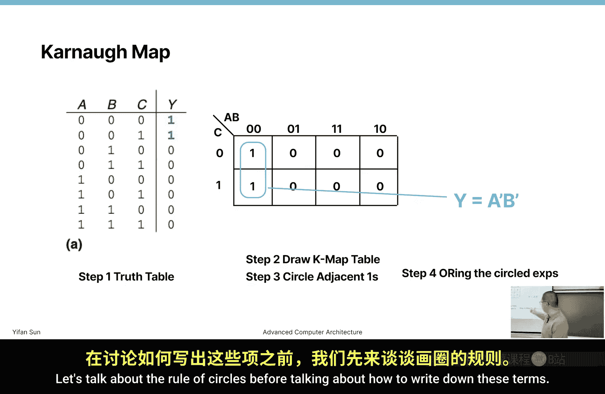
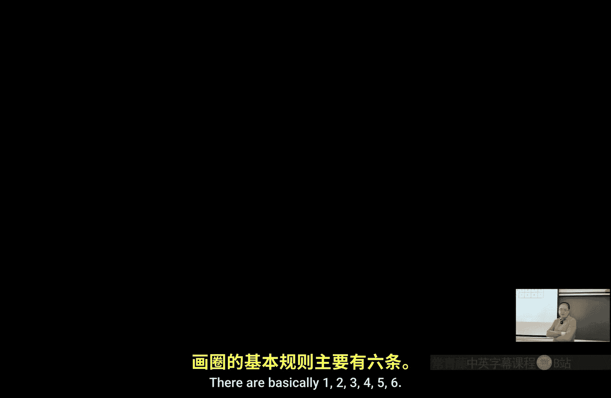
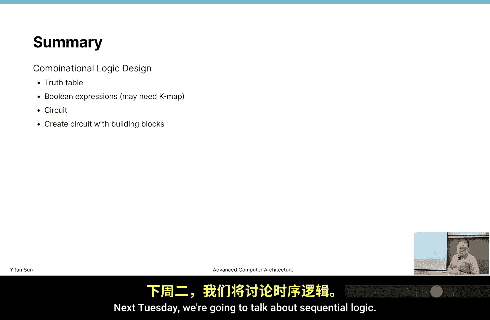

# 威廉玛丽学院【中英⚡高级计算机体系结构｜CSCI654 Spring 2025, Advanced Computer Architecture】 p03 P3 组合逻辑 -BV1evfwBVEUG_p3-

In today's lecture， we are going to start to talk about combinational logic and we are going to introduce to design some circuit。

 So what is combinational logic then， by definition， is basically a digital circuit that。

Can generate some output from input。 Then the output is only solely depends on the input。

 And there's no memory and no feedback。 So basically， you give it some input。

 It will always generate some output。 The result generally consider to be deterministic。

 Every time you give it input。 Then it will generate certain output。

 It doesn't matter what time it is。Then we also consider its instant instantaneous response。

 so the output is generated immediately， although this is not exactly true。

 but if we consider at a complete architecture level。

 we generally do not consider the time required to calculate the output from this computational logic。

嗯。Also， as we talked last time。Dital circuit use balloon logic and can calculate according to Boyan expressions and computational logic implement the balloon。

Exs。 So when we talk about combination logic， I want to want you know。

 the other side is sequential logic。 The difference between sequential logic and combination logic is that sequential logic has memory。

Has feedback。 So it matters， say one time you give the input。

 then the other time it can give you the a different output。Okay。

 so we start with the most basic gate then to implement this。Buling logic， we use gates。 Now。

 what are the gates that we use are basically this a type of gates。

There are three most important gates here。 Then if we consider the logic concept。

 the end gate or gate and the not gate。 those three are the most commonly used gate。

Then their other gate like N gate is basically an end gate with a not gate in front of it。Yeah。

You see， there's a common symbol。 There is a circle that's right at the output side。 right。

 If you watch out a circle here， that means。It's taking on。Invert a signal。

 if it's one then it becomes 0， if it's0， it becomes 1。

 none is end the gate and with a no gate in front of it。 So flip the result。

 norer gate is an or gate then plus a no gate in front of it。Okay。

 now we have this X or we talk about X or logic last time。

 Xor logic describes we'll generate a one output if the input is different and well generate a zero output if the input is the same。

The X word is basically the or gate， but there's a not。Inverter right behind it。

 And there's a buffer there。So buffer， why is buffer even useful。

 buffer is not really a gate and when we are designing logic at high level。

 we typically do not consider buffers， but when we design low level logic。

 it's useful so it has two basic uses one is when we want to amplify the signal。

 say we have a copper wire。That is very， very long that you want to propagate a signal from one place to the other。

Then still the same thing that any digital any digital circuit is a analog circuit。

 So if you rise the voltage on one side will take some time to rise the voltage on the other side。

 Then the voltage propagation at the highest speed is。The light speed， right。

 but it's actually much slower than that。 Then also， if we write the。Vottage on one side。

 Then the voltage rise may not be that high because there's a resistance on the copper wire。

 So in this case， we add a buffer in between。 Then it will kind of serve as a relay。

 So if the signal will get boosted， the voltage rise will still get a relatively high level on the other side。

 So at some distance of a copper wire。 Then we need to enter the buffer or relay in the middle of this wire。

Now。On the other side， it also adds some delay， so。If the signal pass through a gate。

 a gate involves closing and opening a transistor， and it takes some time。

 And so going through every gate takes some time。If we have one path now going through a few gates。

 well on the other path that's going fewer gates， we're even not going through any gate。

 then this signal will arrive earlier than the part or other path in that case some undesired result may be generated in this case we enter the buffer so that it guarantees that on every path it go through the same number of gates then eventually it can arrive at a gate。

At the same time， now we can generate some stable result。Now。

 whenever we talk about gate or any digital circuit， since we are talking about blend expression。

 we use true table and for buffer， the true table is super simple in the output is always the same as the input。

Right？Then another gate were saying N gate end gate and orgate are important in logic sense。

 but it's also if we're talking about digital circuit or especially in CMmos design。

 that Nand gate is probably more important than end gate and orgate a few years back I hear when people say digital circuit only used N gate。

Then I search online before preparing this today's lecture。 Now I hear mixed。Message。

 so someone is saying it's not true。 someone saying it's still true that we're only using Land gate。

 So basically， Land gate is a universal gate。 Then if you only use land gate in theory。

 at least you can create any type of logic。Why Land gate is so commonly used If you look at the transistor graph that we talked about last time。

 right， A land gate is designed a not node gate or an inverter is designed in this way。

 It requires two transistors。It's either the this gate， this transistor is open。

 connected or this side is connected， right， If the top is connected then the output will have voltage 1。

 If the bottom is connected， then the voltage will be 0。 So this is an inverter。

 And if you look at the N gate。The nu gate always works in this way so。A And B， they。

 they need to be both open or this side， they need to be both。嗯。Connected。

 if the of them are connected， then。If either them are connected， right， then the output is one。

If either of them is connected， the output is one。If either one of them is connected。

 then the output is what。啊。Alright。If both of them are。Yeah， if both of them are connected。Yeah。

 if both of them are connected， then the result is one。

 then you need to consider this is a there's a small node gate。 This is not really a node gate。

 This means it connected when the input is0。 So when the input is 0。

 then this one is connected input is 0， then this one is connected。

 So if either of them are connected or both of them connected， then the output is one。

 So basically for a non gate， we need four transistors right then。How to implement and under。

It's not easy。 We sea mouth。Basically， we need a9 gate in front of it and a not gate。

Connected to the output so that we can invert the result， right。So in circuit design。

 in See mouse design， it's easier to design land gate than end gate。

 So land gate is always a preference。ok。Yeah why in the why they are both zero。🤧People发现 the ACC is。

AAMDR这。出播。老铁。So the， the choose table is okay， right， Yeah， your， your five is choose table。 So this。

 this transistor， the small dots means if it's 0 is connected。Thiside， if there's no doubt。

 that means if it's one， it's connected。Okay， I I was got confused at first。First time checking is。

Now， if you notice that small dot， then you understand what's going on。Yeah。Okay， then。So or next go。

Yes。To implement logic with the。The gate， then let's see if we have a logic。

 It's just a random logic。 If we look at this logic is A or B。And A or C together， none。Or。

A and B or B and C or D now D right， So this is the logic then to implement this logic now if you know it this should not be the best method to implement this one。

 but if we just literally implement this logic in this way， we can see how these gates are connected。

呃。So， we。We know that N gate is preferred。 but when we draw this type of diagram。

 we just draw the easiest way。 the simplest way we use end gate or gate and node gate。

 then is typically your。When you design this type of logic after this step。

 then you typically have some sort of EDA tools EDA stands for electronic design aid tools Now this type of tools can automatically help you to convert it to the best way to design those gates and convert it to a floor plan of a CMmo circuit and so for logic design let's just make it simple that's only used this three simple gates。

Okay， so and also， I really like this style of drawing circuit， and it's really clean。

So I draw all the input， A，B，C and D on top right so that like dragging a wire from the ceiling。

 then I can start to plug in things。Now。I also just directly put not C and not D。

 So the invert of C and D there。 I know if I need to use node A and not B， I will draw those lines。

 Then since I don't need those。 I will skip those node A and not B。 So then I drag A and B together。

 Then both of them are going through or gate。 going through an or gate。 This is or gate。

 Its another or gate， this two or gate are connected， then going through an end gate。

 So this part describes the first part of this equation。Then A and B going through an end gate。

 C and B and C are going an end gate。 They are or together。 Then they are or with a not D， right。

 Then finally， there's another or that generates to the F。to f。Then we add F。

 so this is say if we have an equation， then we directly write this equation。

 but as you may notice this is probably a waste of gates and we're using too many gates to generate this circuit so we don't want to directly generate a circuit with an equation。

 We want to simplify it and see what we can do。And this is the process。 Now we simplifyified。

 I try to do it step by step so that you can understand how this is done then。I say the first part。

 then basically， this is a multi。 If we a modification。

 we can use the rule of break of multi to break down these pras。 So a goes to this， this a goes to A。

 A， A plus A C prime plus A B。Maybe is this part。 I just inverted then B C prime。

 right on the other side， I didn't change the second part。So if I look at this a part。

 there basically there are many different ways to simplify it， but I'm just choosing this way。

 So I'm taking a out and getting a plus C prime plus B。喂。So taking this， these and these elements。

 these three elements out and get one plus C plus B。那。We know this is plus his or operation。

Anything oring and a one is one。RightAnyth or one is1。 So if one is there， we know that part is1。

 So C prime and B doesn't matter at all。Right so then this part becomes an A。Now。

The princes doesn't matter。 Actually， the the princes doesn't matter starting from this step。

 but the parent is also。Then also。Also， doesn't matter at this time。

 So I just break down the princes。 Now， after breaking down the princes。

 I also get this type of representation。 So a。Take this a and this this element and this element out。

 So I get a1 plus B and take B and B， we get C prime and C at the end， we have D prime。

And the first part we already deal with that1 plus B is always one and C prime plus C。

Then see not and see。 There must be one of them。Is one。Right， so then that one is one。

 Now it we eventually we get a or B or D prime。C doesn的一个 matter。RightIn this equation， this is a。

Methodd of simplifyimpl this。人。So what's our goal of simplification now or our goal of simpl is we want to get a sum of product and product sum。

Or a product sum。 We either get a sum of product or a product some。 We don't want princes there in。

 We don't want the princes in the process， and we don't want to。Well if in this form， yes。

 we can accept the Princes， but we don't want to have this combined form or complex form within this expression。

 right？And also， we want to use as fewer operators。As possible， that means fewer gates。

As fuel gaze as possible。能。After simplification， then this circuit becomes this。And super simple。

 only three gate。Right。Then， on the other side。Rather than having the equation。

 then sometimes it's not that easy to have the equation。

 Sometimes we have the choose table at the beginning。

 And you will see as some example that I will see show show you later。

 It's more common that we have the choose table rather than equation。

 So let's start with the choose table。 If we have the choose table。 how can we。

Generate the blue expression。 and how can we generate the equation。

 So let's try to implement the X or gate with simple and or and not gate。Okay。

 so our goal is to convert from this truth table to a blur expression now。

The easiest way is to generate product sum。 Now， you can definitely go the other way。

 You can generate the sum of products。 but let's just make it simple。

 Thats always want to generate a product some。How we can do that is to look at this case。

To find the ones in the output。Then if this particular case。

 then we get one and this particular case， we get one， then we can say。

Is either this case will give us a one or this case will give gives us a one。 right。

 It's this case or this case。So what is this case， now what produced in this case。

 this case describes by x is 0 and y is 1。In this case， we just write x prime y。So X prime。

 if it's the。If the input is0， then we write a parameter。so。Just consider this case。If x is 0。

 x prime is1， right1 and1 is1。 So both of them needs to be 1。Both x prime and y needs to be1。

 so then my output is1。Okay， then the other side is the same。 If the x is  one and y is 0， now。

 I want to get a y1， how I can get a1。 I just， if it 0， it just add a parameter。So in this case。

 y becomes 1， the x or x and the y prime is 1 and 1 that I got a1 as the output。

 so it's either this case what gives me a one or this case what gives gives me a one。Right。

 so I order them them together。 Either this case or this case will get a output to be one。

 So then this equation is guaranteed to。Generally correct a result。Although this result。

It's a standard form。Its not a the simplest form。 Now， we can start to simplify it from this point。

 But typically， once you have this point and the when there's not too many。Too many variables。

 and it's relatively easy to simplify it。right。Especially when you have only two gate。When you。

 when you have only two input variables， and if you have four。It's doable if you have more than four。

 it's getting complex。But still most of them， most of these table of design today。

 if you use an EDA tool， if you use a software， the software do it for you。

 and it's rarely that people will do it by hand。Okay， youre comfortable with this step。

 basically identify it once， then write down each equation。 Each expression is meanter or。

It's called midterm。 So if it's0， then we write a prime。Then we order all themin terms together。

 and we get the final equation。In this case， we have no way to simplify it， we can only just take it。

So what is the Xor？Gate expression in logic in the the implementation in circuit。

Then we we can write it in this way， and two M gate and one or gate。 and we can get a result。ok。😊。

So it's always following this step choose table expression。Then， circuit implementation。Okay， then。

There's something， how many of you have learned the kernelnal map before？Three， four。

How many of you are confident you can still do carbonab right now。行。What， okay， it's really good。

 Now I， I can tell you so。 I'm sorry that。I learned three times， this is my third time learning it。

 and actually when was undergrad student a second year undergrad student， I learned it。诶。

I don't know if I understand it or not。诶。Pretty much after the exam， I forget about it。 Now。

 about like several years later， when I was PhD。 Now， I started to teach a digital design。

 digital design course。 It's basically very similar to this one， but simpler。I learned again。

 Then I think I understand that time then。It's about 7，8 years again after that。 Now。

 this is third time I learned。 I thought I pretty much forget it。 But after checking the book。

 I realized it's actually so easy。 It is not hard at all。 Now it just。Fil。

 I don't understand why I feel so hard when I was undergraduate Now if you just follow this process。

 okay， let's follow this process， I see a few examples I'm pretty much sure you can understand how to get kernelnal map to work and why kernelnal map works。

So let's look at， look at a very simple choose table， this super simple choose table。 step one。 Yeah。

 this choose table only have two ones as output。 right， So we draw a kernel map。

We draw a kernel map table。 and this kernel map table draws in this way。

 So we put down all the combinations here。Basically， the x xs represent two variable variables。

 the y axis represent one variables since we have three， right？So we write down AB there。Now。

 we put all the possibility of A and Bs。 So we write 0。0，0。I changed it here。

 I didn't change the I noticed that problem。So the first one is 0，0。 Okay， then 0，1。

 just be very careful here。 we want to， we want to a cell， only have one variable to be changing。

Okay， so we don't write 0，0，0，1，1，0， and 1，1。 this style。 We write 0，0，0，1，1，1， and 1，0， this style。

ok。And on the y axis is straightforward is 0 and 1。 Now it's possible that we have four variables。

 Now we just write the same way as the axis on the y axis well see examples later。Okay。

 so we're laying out this choose table。 We're just converting this choose table in a different format。

O能。2 step 2。2， we fill in the values。Just look at this choose table。 The choose table ABC is 0，0，0。

 right， Where' 0，0。 is' 0，0，0。 Now we've put in one here。 This is the output。

 So the output is always  one B。 then don't try to include multiple bits within this kernel map。

 It's always one bit。 right If you， if you output is a multi bit output， just design circuit。

1 bit by one bit， okay。So this is one。Also 0，01 here， 0，01， we also put one here。Okay。

 just fill in error entry in the。She was stable into a kernelel map。能。

Remember how we write down this up。Expression。If we want to write in the product of some。

Some of product。Some of product， what are we going to write？我。We identify two ones， right。

 We're going to write one term as。A prime， B prime， C prime。 The other term as A prime， B， prime C。

Right， two terms。Right， so we're going to write it this way。

 So these two cell maps to these two terms。 now we know。

It's a sum of product than we write in this way， even without kernel map。

 we can already write down this equation。系。So as you may notice here。

 A prime B prime is the common term。Right， now， I can immediately write in a way。

Simplify it in this way。I can take out a prime B prime and put C prime and C together。Now。

 as we analyze before， C prime and C will always be one。So we can remove it。

 So the result is a prime， B prime。So this is to say。

If we have two cells that are next to each other。If I have two cells or even more than two cells that are next to each other。

 For example， these two cells are next to each other， there's always one。Variable that we don't care。

let me say again， in this case。C， C prime or C， damage is these two。

Terms will have two cells next to each other so that we can take out this。We can take out out。

 take these things out， right， take out one part and get the other part that equals to one。

That's a symbol of two cells， two ones next to each other。If we have two ones next to each other。

 we have one term that we don't care about。You can try its the same way if it's horizontal。Right。

Now we can write in this way。In this case， rather than directly generating the product some。

 we take back one way， we try to circle those ones that are next to each other。So we take this。

 draw these circles。 These two circles are next to each other。

RightIf these two circles are next to each other， we can remove one term。

ho can remove one input variable。 That becomes。To generate one element， one term per circle。

 rather than one term per cell， right。If you look at this expression， this is one term per so。

But kernelnal map simplifies in a way that we can generate one term per circle。

How we can draw a circle。 talk about how to draw circles later， all the rules。 But right now。

 you can think it as a circle that circles two ones that are adjacent to each other。OK，那。

We can directly write this one as a prime， a prime。Now。

 what's the rule of writing these terms of these circles。嗯。

Let's talk about rule of circles before talking about how to write down these terms， okay。

So what are our rules of circling， there are basically 1，2，3，4，5，6， six rules。

So we want to use the fuel is the circle necessary to cover all the ones， so no one can be left out。

 but few is circles。It's a relatively easy task。 It's not hard。 Okay， then all the square。

All the squares， not squared。 All the squares in each circle must contain ones。

 so you cannot circle 0。Okay， you cannot circle 0。Now， each circle must span a rectangular block。

 What is a rectangular block。 So if you have。So， if you have one。ItsHere 1，1，1， right。

 You cannot draw this way。 You cannot circle these three of them。 You can only circle two of them。

4 of them，8 of them or 16 of them。 But if 16 of them， it doesn't make any sense。

 You don't need to simplify。嗯。Right only 1，2，4，8 or 16。 You can only draw a rectangle。

 You cannot turn within a within one circle。Now， each circle should be as large as possible。ok。

 it can be诶。If you can't circle four of them， don't circle2。

Then a circle may wrap around the edges of a K map。 So it's a donut。 Okay， it's a donut。

 It's not really a， it's not even don。 It's a ball。 Okay， don't look at it as a table。 It's a ball。

 so。These two ones are connected with those two ones， so we can draw circles circles。

 these two and those two together。Okay， then。a one。In a K map may be circled multiple times。

 so it's okay。So for example， in this case， what's the circle？Now we draw this circle in this way。

 We have two circles。Then definitely as large as possible so that we circle two。

 we circle four once together。RightOn the other side， we left out this one。

 how we can include this one。We can either draw a single circle that draws on this one。

 but it violates the rule that each circle should be as large as possible。 In that case。

 we draw this one， these two ones together。These two ones together。So the one server。

 there's two signalss and ones wrapping。 can you make the smaller circle one longer by having it also wrap around？

A note。嗯。I think I think that's a problem with the third rule。

Is each circle should only be either one or two or four or8。

 I should I should add it in just as part of the third rule。So it can be only a power of two。

That number of words。嗯。ok。So you cannot wrap around to have three of them。嗯。超。能。

I think drawing circleir is not a big problem， right？Question。

 is there always is only one draw circles or there There are several ways。 There are in many cases。

 there are many ways to draw circles， especially when we have a 4 by4 table。Either way works。

 and they are pretty much equivalent。ok。So now remember， or nextco。To use kernelnal map is to。

Generate one term per circle。I generate one term per circle。

Now how to generate this one term per circle。Now I should have a slide writing it down。so你 say。

Let's look at this circle， okay。Let's check ABC3 variables。Then we check each variable。

Lets check a what's as value。 A's value is one here and one here， right。It's one here and one here。

 So A's value didn't change if it didn't change， we keep it。And if it's one。

 we keep it the original form。No prime。ok。If it's one and it's now changing， if it's not changing。

 we keep it。 Now， if it's one， we keep the original form。 Now on the other side， if we have C here。

 let's look at B， right， B is one here， and B is 0 here。In this case。Be changed。 If it's changed。

 that means， it's in the princes is。Is here It't this thing。 right。

 Something change is always can be extracted out。做。B changed， right， In this case， C changed。

 So now we shouldn't include C here。 Now， in that case。In this circle， B changed。

 so we should include B。咩四四。Is0 here and C is0 here， so C didn't change and C is0， if it'0。

 we keep the prime form。O。So we can always write down this cell as。你 sell as a。那s a b。C prime plus a。

B prime， C prime， right， that circle。 In that way， we will take out A prime and B plus B prime。

And the final result is A C prime。ok。Then look at the larger circle。A is1 here and a is0 here， right。

 so a changed。If a changed， we shouldn't include a。 so we can write down this form as。This cell is a。

B prime。C prime， right， plus SL is。A prime， B， prime， C， prime。 plus the cell is。A。B prime。四 plus。

The cell is。是。A prime， B， prime， C。系。能。I can basically take out B prime。Then。

 it's a prime plus a prime， C prime plus A plus a prime C prime。没有。It's the same way。

 either of these four cases。These four cases all covers all possible and A and C combination， right？

So at least the one of them must be one。At least that one of them must be12 or if you。

You want me to just slow down a little more， we can get C prime plus C。Plus， a prime so。

C prime is here。See is here a prime C plus C prime。I think I write one extra prime here， right。

 So C prime is here and C is here。系。So this one gets B prime a plus a prime。

And a plus a prime is one， so this one will always give you a B prime。Okay。

 so this is basically the fundamental。Prncciple behind kernelnal map， way kernelnal map。

 kernelnal map is just a simple way of drawing things。

 If you don't want to use kernel map use this way is equivalent。This this is the question。

I don't know this。因为我4。The surface当。no for each circuit should be as much as possible。Yeah。有边。

Arirontal sketch。Right，入。As much as possible。This because A is changing in three of issue。Yeah， I。

 I should make the third principle to include。 it's always a power of two。 It's always。

 it's always either two or four or。系。系。I should add that I actually take it from the textbook and I think。

 oh， that may be a not that useful part so I take it away then I realize okay。

 it's useful thanks for the questions。Okay， it must be a part of two。So cannot take three cells。

I will modify the slides before I distribute it。Okay， so are you not happy with kernelnal mapp？

Know how to use it。 Now it requires a little bit of practice。

 but I think you should understand the principle behind it， okay。Not something that you should feel。

Difficult about it's quite straightforward。Okay， here's a practice。

So this is a seven segment display。You said display itself。

So this device is typically implemented this way。 There are four pins on top and four pins on the bottom。

 So there are。Someone is saying this segment segment。

 but it's actually a segments because there's a doctor。Right。

 so there are 7 LEDs that we can display to display a D a digit。But there's a dot there。

 so it's eight pins， but in this case， we don't consider the eight pins。So。Or goal is to say。

We have a four digit input。 ifs 0，0，0，0， that means 0。 in that case。

This circle should light up The this stash and the dot should be off。Right， if it's 0，0，0，1。

 then it should have two segments light up。 The other segments are off。ok。So this is a decoder。

 We'll talk about decoder later。 What is decoder is we give it a number。

 Now it will give us a wider representation。By selecting which piece should be on。Now in this case。

 it's a 4 to 7 decoder。So the input is 4 B。 The output is 7 B。Okay。

 then it should the output should directly indicate which。Segment is on。ok。嗯。呢。😊。

Want to draw the choose table。So， let's just。Just take it as right。 Okay， this is a complex table。

 not to want to verify it。 I pretty much believe that if you spend some time。

 you can also write down the truth table on your own。Right， but。As you can see， SA。

 when the I the top bar should be lighted up is those cases， right？Now。

 we eventually end as number 10。 sorry， number 9， then from 10， we don't care。

 But in some representation we also have， we can also have A，B，C and D。It's possible。

 but it's not very easy in this。嗯。In these seven segments， for example， if you want to represent B。

It can be easily confused with 8。Right， if you want to have lowercase B is easily confused with with dig6。

 So anyway， we only care about number 9 from 0 to 9 right then。呃，就。

Design a circuit that converts  four digit input into a  seven digit output to indicate which segment should be on。

How we can design this table of circuit。 The general principle is don't try to design them together altogether。

 That's one thing。 Just design them。For each output pin， for each output digit output。嗯。0 and1。

 right。 Let's look at S first and see what's going on with S。So we start with our kernelnal map。

 In this case， we draw this S D0 and1 on the Y axis and D3 and2 on the。A axis。Okay。

 all possible cases，0，0，0，1，1，1 and 1，0。Then we fill in as a this choose table here。In this case。ok。

Say 0，0，0 is1。 So9 number。This number goes here。And this number goes。0，0，0，1。0，0，0，1， it goes here。

 right， This 0 goes here。 So basically， you can fill the whole choose table within this table。

 within this kernel map table。那さ。Time， now we should start， too。Draw circles。n。

Before I review the next slide， let's draw circles and see what circles we should draw。

These four ones， right。This for this one circle。 Okay， what are circles。These two ones， okay。

Therap around this one and this one， right。 Now we are missing this one， how we can draw this one。So。

Yeah， we about， right。So four circles。嗯。Pretty3，4， right， drawaw as many as possible。

 drawaw as large as possible， but only include2 or4。1，2，4，8， one sner。

So that's exactly what you are describing。So then we can try to write down the expression there。

Let's start with the wrapping around， with the expression。so。The check， did D0 change。Chaangnge他。D0。

D0 is this digit。Is T0 is0 here a 0 here， right。So D0 didn't change。We write down D 0。And it's zero。

 So we put a parametermeter。D one， did D one changed。No， none。G one prime， right。Did the two change。

D2 is 0， right， it's。It's0 here and0 here。 So it didn't change。 So we put D2。Prime and D3 changed。

Right。There must be something changing， Otherwise there's no need to rise it。

 if you have a single one cell， it can happen then in that case， you should include all of them。

But in this case， you have more than one one there。And you have。Three or fewer terms。

This is one term， plus let's see another example， let's look at the big circle。

 the four or one circle。Did。D，0 change。No。And its D0， no prime， right， because it's one。得帝王前去。

De one change。So now included the D2 change。The two。So look at here， D 2 is was 0 and one。There。

 so is。D2 is changed， so it's not included。In the expression。Did D3 change？No， right， So and it's0。

 So we include D 3。Pro。Okay， so I'm trying to show two examples。

 The others should be following the same rule。Okay， comfortable with this。So， let's move on then。

It should be basically the same way。 Its just。As traditionally writed in a way that D3 goes first。

But it's basically same expression。Okay， so then as you can see。

 there are cases that in others that we don't care。喂。做。We don't care about those cases。

 if we re strictly required in all other cases， no one lights up。This is the right solution。

But also possible that we should have some way to guarantee that this input will never be those values。

Now， in that case， we can have some， don't care。Bit， and don't care that becomes this way。Yeah。

 it directed into all the circles there。So starting from 10。10 years。1，0，1，0。Right，10，10， Where's 1。

0，10，1，0，10 is here。Right iss here。 Now， basically， in six cases， that is greater than 10。

 we don't care the input。Then the out， if no input。Should never happen。

Now or we don't care about what's the output。 the output can be anything。

 So this is undefined behavior so the undefined behavior doesn't say it will get a wrong result。

 It just say we don't know the result。 we cannot guarantee the result。So in this case， we can draw x。

If there's an x there。We say those are don't care bits， don't care input。B in that case。

 we can either consider it as 0 or consider as one。 more， most likely we consider them as one。

In that case， we can draw larger circles。So what circle is there， for example。

 we can have eight of them as one big circle，8 of them as another big circle， four of them。

 four of these as one circle and four corner ones are connect together。

 four corner ones are connected together。This one， this one， this one， this one。

 this is4 I connect together。It's not only wrapping around and this direction is's also wrapping around on that direction。

Okay， so in that case， let's see， for example。This 8 bit。

We probably easily can tell what is not changing。The not changing part is this 1，1， right。

 This is D 0。 So D 0 is。I think a made mistake is 1，0， not 0，1。 So D1 is now changing， right。

D wine is not changing here。D1 is now changing and is' one。 so we keep D1 here。

I made a mistake it should be D10， so1 comes first then0， right， D32。So this is。These two rows。

These two rows。 What is now changing is this speed。 and this bit is D1。 Now， we only keep D1 here。

 It's one， so。We have no prime。ok。At least this is a little bit messy。

 but you should understand what's going on。Okay， so。Using this way， basically， if there are4 input。

Argument， and there is a。Choose table for each digit。

Pretty much you can design all the digital circuits。A combination of logic。

RightIf there are fewer than four or fewer input variables。

Then just design each circle for each bit following the same process。

 you can do the simplification and the add gates to describe each output。Right。

 so starting from this point。We basically were。 we。

 we will talk about some building blocks that are commonly used in。呃地jo circuit。

Let's start with half other。What is half errorer， half E is described by this block， It takes2。

Veryable。All of them are single pin。 O， all of them are single bit。那sA and B。A and B are input。

Then it will generate a sum and a carry out。So we can write down the truth table for this。Operation。

What's the truth table？Its basically A and B， if both of them are 0，0 plus 0 is0 and no carry。

Right A and B 0 and1， and the sum is1， no carry。A and B， the sum is 1。No， carry。

And A B both around one， the carry is 1。 The sum is 0。We get 1，0。1 bit some operation。ok。

Let's try to basically， I think there's no way no need to draw this kernel map if we only have two input arguments。

 we can just directly write down the expression。So sum is a prime B plus a B prime right。

Find two ones， then write the product of sum， sum of product form。And then we have some。

 Then C is even simpler， is simply。A and B。 So both and A and B are1。 C can be1。

These are expressions。And we can check this sum， basically there's no way to extract common terms。

 so there's no way to simplify it。系。Okay， then with this input。

 we can draw the circuit and circuit is designed in this way。

Then anyone find this form and that turkey is a little bit familiar。I Yeah， the X or gate， right， so。

If you look at a B。This is an X work gate Xor describes。If they are different， the output is1。

 if they're the same， the output is0。就。If we want to implement。

If we have a digital circuit component as X workgate。We can implement。In this way to save two gates。

Or even more than two gates。We add an Xor gate and the sum is an Xor。啊。ok。So this is something that。

If you realize that， you realize that if you don't realize it。

 don't really pursue trying to simplify it to this way。But I want to say one thing。If the input is2。

If there are only two input variables and one output variable。No matter what is the situation。

We can only solve the problem by using one gate。So for only。By the way。

 this one gate allows this type of gate， okay。Let's assume this is still one gate。

So not just not on one side。If that is the case。If this is allowed or either adding circles here。

 if this tabletan is allowed。Having two input and one output can always be solved with one gate。

So I tried to put down this。At least all the possibilities。 So if A and B is。

Those cases or possibilities， then the output can be either。One of the 16 possibilities， right。Yeah。

能。We can express every cases。Every case， with an expression。

The only two special things are two x words here。ok。No。These don't even need gate。

 These are special cases， and it's always one。So no matter what's our input。

 we always consider one and0 are our input。 Okay， were always available input。

But I want to highlight here。If you look at this。Itysymmetric， right。Isymmetric。操。

I basically take a knot on the other side。能。Look at this one。A plus B prime and a prime B。

What law is this one or what principle is this one？D Morgan， right， still remember the Morgan。

A prime B。Prime equals a。Plus， B prime。Okay， it's de Morgangan。嘘。Okay。

 just showing you this thing ifner 2 in1，1 out， one gate。If we don't consider not gate。

 one gate is always good enough。Okay， so starting from here。

 let's consider a more complex case as full adder。 And we have this choose table。

 So full adder and half adder was the difference is we also consider a carry in。

So if the first bit is a half adder， the second bit should start to have a full adder。Right。

 now we consider a seeing。And the output is still sum and the C out。The first the four cases or。

If I put C in as the first variable， then the first four cases are the same as half either。

 But if you look at here if。Take out when C is 0 is basically the same as half ater。 right。

 So the sum。Is actually simple if you count the number of ones。If it's an odd number of one。

 the output is one。 if it's an even number of one， the output is 0。Then the con， the sea out is。

You can check there' two， now is one， two is one，2 is one，3 is also one， so two or three ones is one。

系。Or you can always write 0 plus0 plus 0 is 0，0。But one plus 1 plus 1 is 1，1。Right。

 so these is or the rule of the full adder。To those are的 most principle。Circuit in your computer。

 that can do some most。Basic operations。Now， all multiplication division or sign log。

 all these operations can be achieved with something like this。ok。能。

We can try to draw a bullying expression。I tried to draw。Get a blank expression by kernel map。Now。

 here。Unfortunately， that one have no way to simplify it， we have four small circles， so four terms。

哎。So by the way， whenever you see that case， you should start to consider using Xor。

Whenever you see these type of zigt patterns， you should start to consider xor， but it's okay。

 Let's just use the simplest step form。是。Now on the our side， we have this。Reverse T shape。嗯 once就。

No way to simplify it more， we can only enjoy it。drawaw three。诶。Circleles。Just consider this。

At least two of them needs to be one， right So these two of them is either A B or B， C or A。ok。呢。

So simple expression， now with this expression。I don't think it's very hard for you to draw the circuit。

 right， So I'm skipping the circuit part。But on the other side， since we haven a half added。

We should have a。We should have a general feeling that。We're adding。These two together， right， these。

 these two numbers together， A And B together。 Then this time we have C in。

 So if we have these two result and add C in again。If we perform this half adding。By two times。Now。

 we probably can just。Simply get a result， so we don't really need to design the circuit from scratch。

 but we can use half add as a basic step。So let's say the first step is to combine A and B using a half adder and get some result。

Then as I said， we need to add A And B and C in together as a second。Half at into a second half add。

 Then we get the final sum， right， So this one。This bit is always correct。

That's a matter of how we calculate the。Carry it。And this time we have many input。 we have A， B， C。

A plus b。C 1 and C 2。 We have all of them that can serve as input。 then if you。

Want to know how to do it， then。You can't even just try to consider all of them as input， but。

If you look at C1 and C2， basically either one of them is carry， then the result is carry。Okay。

 so basically adding an or gate together， then we know the final C output。It's basically two at。

2 half at with a。Or gate， we can get a final sea out。Okay， so with a full adder， we can do。

A single dig。Plus， right。Then。Co。If we can do one bit， we can do22 bit。 Now we can do4 bit。

 We can do any number of bit。 now how we can do that。So were designing a4 bit for errorer。

 I'm just trying to draw it in another way。So I put A and B on top some on the bottom and C in from here and see out from here so that I can。

Concatenate many add together。 So how does 4 B，4 error works。

 It's basically just concatednating four of them together， so。We calculate 1 bit。 Then if it carries。

 it goes to the second， the next bit。Right then we do the next bit， some， then we consider carry。

 And eventually， if the whole thing needs to carry， then we just carry out。Now， if this is the basic。

 the first time we input。If its this the first time we generate input， we simply set seeing as  zero。

 that means we don't carry anything from into this process。So this is a four paid4 errorer。

Then consider in most of the CPU， today， we're using 32 bit numbers are still the most commonly common type。

 if we write in C code， write int。A， then this is basically a4 bit integer then。

Some operations are conducteding on this Ta circuit。There is just one problem within this design。

The problem。Anyone know the problem。猜这个是好的。ペスペー。Yeah。

 so the problem is we need to calculate the first bit， then we can get the carry。

 then we calculate second bit and get carry it gets third bit and so on，4 bit is probably okay。

 32 bit is not acceptable。嗯。You know， we。These chip companies are trying to increase the clock frequency right so clock frequencies are 1 gigHz remember last time we say1 gigHtz is1 nanosecond。

2 gigHz is half a nanosecond， so we need to get this thing out within half a second and even to save some safe space。

So that we can establish the voltage so it can be detected by the next cycle。So within。

Probably one fourth of nanosecond。 We have to get the result out。 Now， we cannot wait， so。

Then theres some way that we can avoid this。Carry riping。 This is called carry rippling。

 The carry goes from one stage to the other。 There are some ways that we can do that。

 So we'll try to cover that after we talk about sequential logic。 Okay。

 it's a little bit too complex at this moment。Okay， some other base building blocks then。Munipxer。

 Multiipxer is probably the most commonly used。Building blocks。 So what is a multiblxer。

 This one is a2 to one multiblxer。So we basically want to use one piece of wire。

One wire to be able to send the two piece of signal， so two signal can be comes from D0 and D1。

But of course， we cannot send two of them at the same time。

 so we need a selection bit with control bit the as there to explicitly select do we want D0 or D1。

Right， if s is 0， y equals D1。Pass through。If S is one， then y equals。So， if I is 0。

 then y equals d 0。 If S is1， then y equals D 1。ok。So that is the rule。

 So we can still just treat it as a three input， one output。A circuit， computational logic circuit。

 So we write down the choose table。 Then the choose table is in this way。 If s is 0。

 we take d 0 output 0，1，0，1。 If s is 1， we take d1 output is 0，0，1，1。ok。Now starting from here。

 we draw a kernel map this way。Now we can basically simplify。The circuit I don't want to spend time。

 but I think pretty much at this stage， you can easily do this。喂。

We don't need a third circuit because we already。 we don't need a third circle because we already covered four of them。

能。As next step， we design the circuit in this way。RightThis is the。Cirit。Okay。

 so multiplex are starting from this time。You probably。

 you can forget about how exactly the circuit is designed。

 but just remember the simple symbol of multiplexer。

The multiplor is so commonly used that if a draw circuit draw a multiplor， everyone knows。

Or is something available that is easily available that can be achieved easily。

 Then so everyone would pretty much simply draw that symbol。 So it's a。

That shape of symbol that is going from a wider input to a narrower output。Another thing is。

2 to1 multixer is the simplest case。 for many cases， we want to even wider multixer。系。

And wider can be in different ways。 than， for example， in this case。

 we have four input and one output。 If I have 4，2，1， this is a 42。

4 to1 multixer is not 4242 is encoder if will see encoder next this slide 4 to1 multixer。

 if we have a 4 to1 multixer or we can call this signal selector。

 we select from one of two signals Now basically we need two bit right it's also a two to the power of a n relationship。

We need2 bit。 Now this is one way to get it wider on the other side。

 Sometimes the signal that pass through is not a single bit。

 so sometimes we may put pass a full integer4 by integer through the signal。

 Then we can also extend all of them to be 32 bit and y to be 32 bit。

 So basically it's replicating the same circuit。By 32 times。So。

Munipxor and why I made the mistake of writing 4 to 2。

 Now another type of commonly used the circuit is called encoder and decoder。

 then encoder is either42，2 encoder，2，2，4 decoder。Or we can have a to3 encoder，3 to8 to decoder。

 It's always a power of two relationship。So I didn't specify which side is input which side is output。

 but it can be either way and also on the left side in theory we can have 16 input if it's4 bit we can have 16 possibilities but actually if this is in the context of a decoder or encoder we only have these cases So if that one has a 1 then we encode it as 00。

 if the second if d1 has a signal， we encode as d as 01。And if the T3 has signal encoded as11。Now。

 you may ask。What is。Or input is 1，0，1，0， or even 1，1，1，1。In that case。

 the typical solution is we have a priority encoder。D for decoder， it's okay。 for encode。

 for encoder， we have a priority encoder。 That means。For example。

 we said this one has higher priority。 So this table becomes this case，1 X X x。

Then generate to one and one。 So we don't care about these cases。Now we always generate 1。

1 if the first bit is one。Okay， so this is a priority encoder。

 So we only care about the most significant bit or the least significant bit。

 So you can define the priority in any way you want。Okay， a quick summarize。

 So I think by then to today， should no combination logic。 then in undergraduate。

 this is probably a month study then in a graduate level course。 and this is one lecture。 So I don't。

There are many things I didn't cover， but I think the key point。

You should understand this part is if I give you。A certain in a group of input。

 certain number of variables。 if list all the possible input and generate a choose table。

With some simplification and put and arrange some gates， you can always generate。An output。

RightThe output you desire， no matter what is exactly the output， What is the 0 and one combination。

 you can always generate it。 So in this case。In dream case， they say。Single precision。

Floating point number multiply another single precision floating point number。It's a huge space。

 right，32，2 to a power 32，2 to power 32， So 2 to a power 64， that number of possibilities。

 But if I give you a limited amount of time。那。You can draw。 You can write the truth table。

 then you can write down the circuit， right， although。It's a little bit complex， but in theory。

 you can do that， right for most of cases today is by writing a code called very in a very log language you write。

C equals a multiply by B， then basically those companies like TSMC or Cans。

 this type of EDA companies will help you generate a circuit underneath multiplication operation。

 so you don't really need to worry about the gate level implementation， but in theory。

 those complex implementation are implemented in these simpler ways。ok。

So I think that's all for today's lecture then next Tuesday we're going to talk about sequential logic。

