# 威廉玛丽学院【中英⚡高级计算机体系结构｜CSCI654 Spring 2025, Advanced Computer Architecture】 p04 P4 时序逻辑 1 -BV1evfwBVEUG_p4-

嗯。Okay， let's get started。 So in today's lecture， we're going to start with sequential logic。

 Now for sequential logic， this is a relatively complex topic。

 So I plan to took two lectures to finish this topic。 But if you consider this part。

 combinational logic sequential logic plus blend algebra is pretty much a digital design undergraduate course for most of the。

Universities or at least most of universities in China。

 So I kind of feel we're rushing through a whole undergraduate course with 4 to5 lectures。

 That's already pretty quick。 Then what makes。Feel。

 feel very different is that when I was an undergraduate student。

 it took me a whole semester to learn these things， and it。

And I spend so much effort and I still have something that it cannot solve。 And this time。

 as I prepare this course， I feel， oh， it's probably only a few lectures time。

 So hopefully you can understand this concept and。That's a lot of topic。

 but we don't have a lot of practice。 Hopefully， later on， as we have assignments。

 you have a chance to practice。 So in today's， in today's lecture。

 we're going to talk about sequential logic。 And sequential logic is on this other side of computational logic。

 Remember last time we talk about computational logic is basically a digital circuit that take some certain input and always generate some other output。

 we typically consider the results are deterministic and we almost immediately can get a result。

 At least we don't need the multiple steps to get the final result。

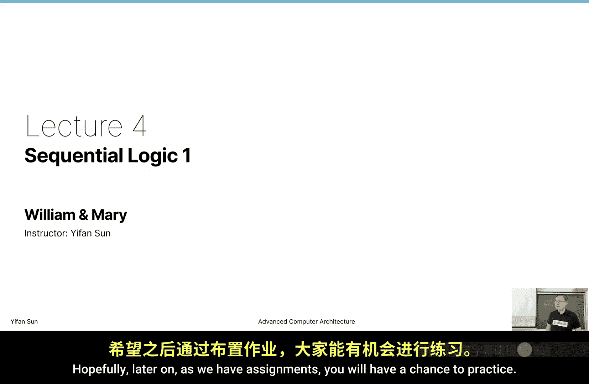

Then the capability of combinational logic is limited because you can only perform fixed functions。

 and you can you always can predict the result， then the result is very limited。

 It really depends on the combination of the pins， how many pins you have。 then how many input pins。

 how many output pins you have。 That's the your capability limited by the number of pins。

 but sequential logic， as you can see， that is a diagram for sequential logic in sequential logic combinational logic is still a main component of a sequential logic。

 but we start to have memory or and feedback loops within this。Within the sequential logic。Circuit。

Now the sequential logic circuit is still a digital circuit and the output is not only depends on the input state。

 but also depends on the prior state the memory from before and the state update from the output of the computational logic so the state may change over time。

 so this is the sequential logic it's getting more and more complex but it's not too complex in today's lecture we're going to talk about how sequential logics are designed。

Yeah。Then for most of time or input， one over input。

 you can consider input is going through the combinational logic circuit or going to the memory directly。

 So for most of time， we're dealing with a clock signal。

 and also a feedback signal that forms a loop。 Now for clock signal。

 I think you must be very familiar with this terms of like Intel CPU works at2 gigHz，3 GahHz。

 those are the frequency of clock signals。 So that basically means in half a nanosecond or one thirdd of a nanosecond the state updates once the combinational logic will finish one set of calculation。

 That's why we're saying combination logic is instantaneously generated output is not perfectly。

Generate a result in a moment， but it takes so short time that we can almost ignore execution time。

 although eventually well see combination of logic circuit。

 the duration that we can calculate the result is kind of a limiting factor for how fast that or clocks can run。

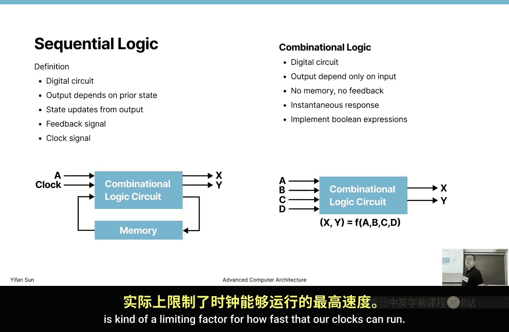

So as last time we were talking about building blocks for combinational logic。

 the building blocks for combinational logic are gates。

 then the building blocks for sequential logics are still gates but we going towards one level up。

 we wanted to be slightly more complex， it's a combinational combination of a few gates connected in a special way。

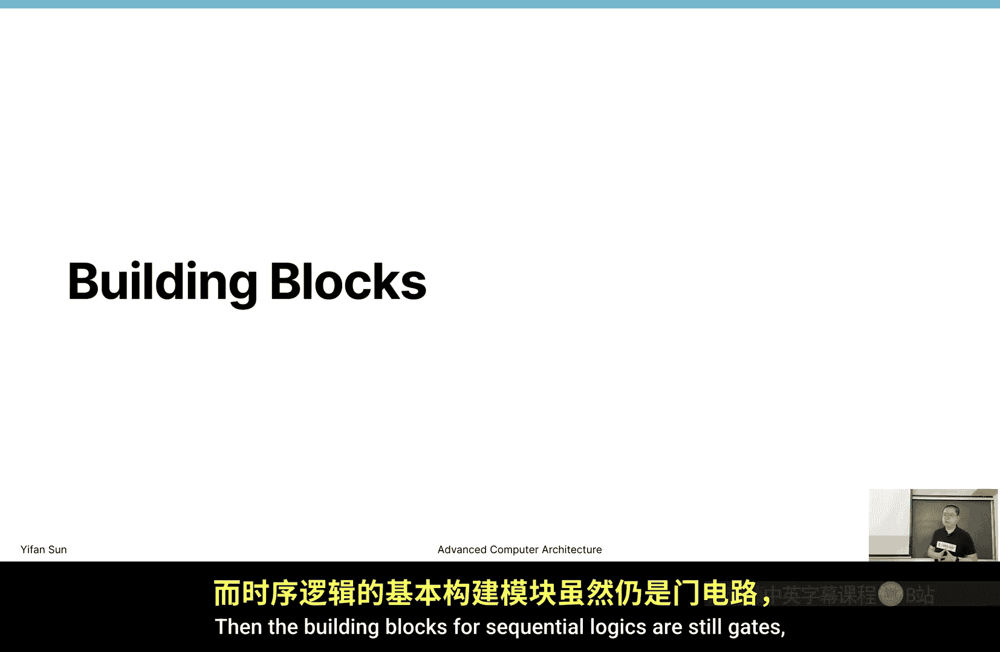

So we first talk about this type of logic component that is called latches。In combination logic。

 we say every time we put an input， it will generate some output out， right， But， you know。

 different gates may have different propagation time。

 The transistor close and open with different time。

 So there must be some transient state within the execution so that。

Before you reach the final result， your your output pins will generate some signals that is kind of considered as noise。

 Eventually， it will get stable and get you the wrong get you the correct result， but in the middle。

 it will give you some wrong result。 So how can you determine which is the right result or how can you determine what is the correct time we want to have something that called latches。

 Latches works in a way so that it will keep the signal， Keep the output unchanged for a。For。

Almost unlimited amount of time until we want explicitly， okay， at this moment， please change it。

 right， so it will prevent those noisy times。So the signal is jumping around then。Eventually。

 we wait for a little bit until it arrives at a stable output。 Then we say we our letches comes in。

 So okay， let's update to the new state。That's update to a new state， then latches here。

 then we keep the state keep the state going and keep the output unchanged until we next round we generate some other result that we latches there for another cycle。

 so that is the purpose of a latch。Now it definitely comes from this type of like small component on a door that the door is lo when you don't want to open it。

那呃。So latches are components that can code signals。

Un changed until it is until we explicitly wanted to change。

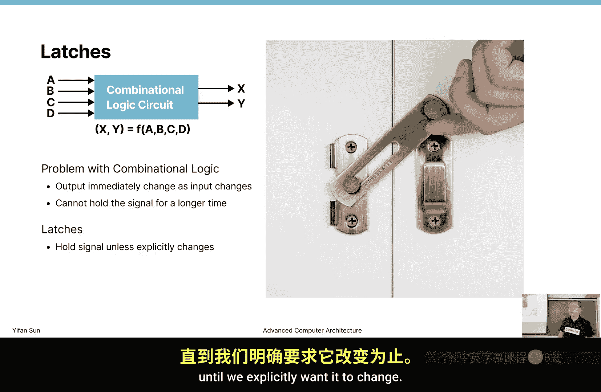

So how latches are designed， let's start with a very basic latch。You may feel if you。

 if you see the combination logic， you may feel this design is very weird because in combination logic。

 we typically to consider the data flows from one direction to another direction。 it never goes back。

 but starting from here， we have feedbacks。 We have loops then。Typically。

 if you consider two not gate two inverters， if two inverters are connected as a loop。

If there are two inverters， then the data will keep flowing and going on a circle and keep going。

 then the data that is stored inside it will never change。 but if we only have two inverters。

 we basically have no way to change the internal content that is being latched within this inverter loop right So something similar to an inverter is a nu gate。

So here there's our Norgate。It's an or gate with an inverter right after it。Right。

 so we're using S and R signals to control the output。 We call the output Q and Q prime。

 which are we should be always the ideally should always be the。The other side of Q， not Q。Okay， so。

Seeing this， you may feel it's very difficult to understand the logic of the thing。

 so let's draw a choice table and try to analyze what it's doing。So we start a choice table。

This is needsar orgate， right？It's easier to address。 It's easy to。Understand that if one input。

Is one。Then the or gate is kind of connected。 Then after a knot， the result must be 0。Right， so。

Let me say again， this is an orgate， if it's an oreggate。If any input is one， the output will be one。

🤧Right。Then after the inverter， if the any output， if any input is one， the output must be 0。

So let's look at the second row， the or the third row， if r is1。If R is one。

 we don't really need to look at this path， right。We don't really need to look at this path。

We only know R is one。 if R is one。Q must be 0。是。Right。就。Q must be 0。 Now， if Q is 0。And S is also 0。

 The Q prime is 1。喂。Q is 0。 Here is Q。 Q is 0。 S is 0。 Q prime must be 1。

 So this solves the third row。喂。So R is one。 If it's one， this or must also generate one。

 but it's inverted。 So it's 0。 and Q is 0 S is 0。 Q prime is。What。😡，Right。

So since this is a symmetrical circuit， then the third second row and third row are pretty much the same。

 so it's just flipped。ok。The third row and second row are symmetrical。

 Then the fourth row is also easy to understand。If r is 1， this or gate is connected。

 the result must be 0。If s is 1， this or is also connected， then the result must be also 0。

 So Q and Q prime are both 0 in this case。Now， you may say oh Q prime is designed to be not Q， right。

 how it can be 0，0。 So this is generally a state that we don't expect。 we don't want this to happen。

 but if you really put 11 in。能。That is the result。 The result is 0，0。Okay。

 then the hard part is the first rule。If both are0， what should be the output？

Let's try to analyze a little bit right if we if r is0。

 we don't know what's the state of this orgate， it really determined on this Q prime。

RightIf Q prime is one。Then this or8 is connected， Q will be 0。Now if  Q is0。

 then this or gate is not connected， the output will be 1。Right， so basically。The if R is 0。

We can only tell so if r is0， basic Q will equal to。Q prime， prime。Right， not， not not Q， right。

 So Q equals to Q， basically。Right， so if you look at this one， we have two cases。

If both R and S are0。We have two cases。Is either  Q is0 or  Q is 1。Right。

 last time we're talking about when r is 0， then  Q prime is one， then this one is connected。

 then  Q will be 0。 Now， if r is 0， Q prime is one， Q prime is 0， then that will be one。

 So what's happening is。The current status of Q and Q prime。

It actually depends on the previous state of Q and Q prime。喂。

The current status of Q and Q prime really depends on the previous state of Q and Q prime， and also。

If the previous state of Q and Q prime is 0 and1， the previous state is Q0 and 1。

 then the current state is also 0 and1。RightNow similarly， if the previous state is 10。

 the current state is also 10。

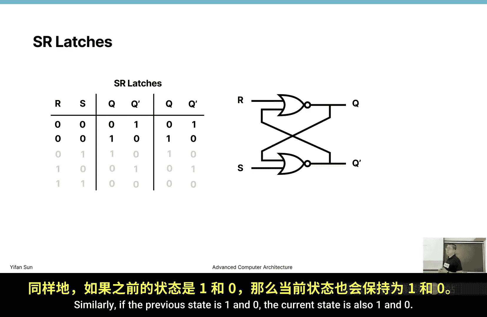

So。We can write this truth table in this way。When R and S are 0。

 Q equals  Q previous Q prime equals to Q prime previous。喂。

So which gives us two different mode if we don't want the last row to happen， if R and S are0。

 we say this is the latching mode。So if R and S are0， we don't input any data。

 the output Q and Q prime will stay there， then will not change。ok。If Q， if R and S are 0。

 Q and Q prime will stay there will not change。 but if R and S are 0 and 1 or 1 and 0， then。

basically。Whenever we said either one of them is one， then we get the result to be 10 and01。Okay。

 that explicitly set the result。Now we say either when S equals1 or r equals 1。

 we said this is set mode or reset mode。None that also explains why this thing is called SR latches。

So because we need two input signals， one is the set signal， one is the reset signal。

Whenever this set signal is one。Q becomes one。 right When we reset it， Q becomes 0。

So that is the logic here， so that's how latches can solve this problem so that the result won't change no matter what my inputs are。

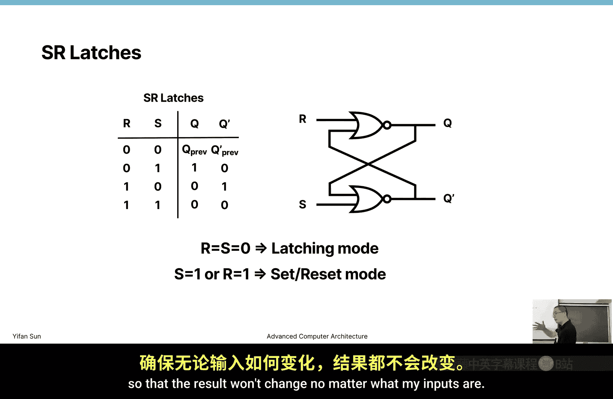

So sad signal and the reset signal。Any questions super。

So the problem of this design is S and R can be combined into。One signal， right。

 pretty much they can be either。They can either be or zero， or they can be。

We probably only care about set reset is always negative right This is not very intuitive input that we have some requirement for the data to be in some way to the input to be in some way。

And we want to have one another signal， say if this signal is one， it's in set mode。

 if this signal is zero， we want it to be in hold mode。

 right so that comes to another type of ledtge that are more convenient and easier to understand。

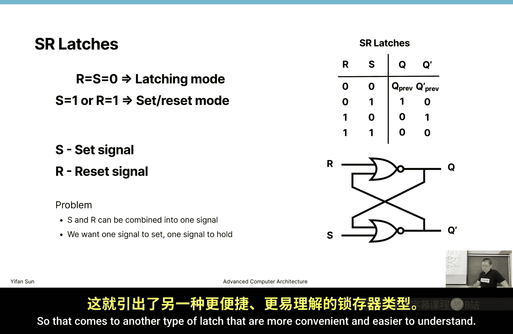

And we call them D latches。What is delu？D stands for data。O so。We first write the choose table。

 this is the choose table we have， and these are the building blocks that we have we eventually want to implement this choose table within this particular building block。

Now what's the truth table， So we say one set signal。It's 0。We want it to be in hold mode。

 so don't care about the D， no matter what D we put in， we don't change the output。Right。

 now whenever set0 is one。We're in the set mode。Then we said Q equals to D。ok。ok。

Then how we can implement this logic。With this component is basically。

 we somehow need to convert a set and D signal into S and R signal。 Now， we know set and D signal。

 We know S and R signal， right， We have the choose table。

 We basically need to bridge them these two choose tables together and use some combinational logic to somehow translate the set and D signal into R and S signal。

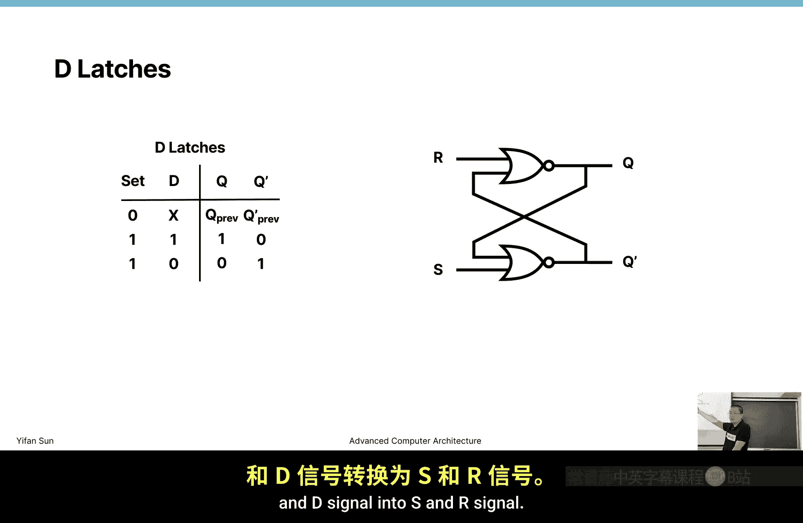

Now you know how to design a combinational logic， so let's do a review for the previous lecture。

So these d laches would put the R and S in there， right？So when set is 0， R and s are0 in this mode。

 we're holding the result。When that is one。Then or Rs will start to have value when D is 1， s is 1。

 when d is0， R is 1。Okay， we reset when d is0， when d is zero， yes。Okay， so we have the true stable。

We consider this part as input and this part as output。

 So we need to create computational logic here and this computational logic。

RightSo it should be very easy。 this combination logic should be very easy。

 Last time we talked about this process that we need to first write down the equation。

 then draw the diagram， simplify the equation and draw the diagram。 So what's the equation。

So remember the midterms， right， if the output has a one。Which is basically S has an one。

Then we look at what's the condition that cause that triggers this one。

 It's basically one and1 set is1 D and is1。 Then the result S is 1。In this case， we write down。

S is set multily by D， set and D， right On the other side， R equals to set and D prime Sa。

 said and not D。Okay， so those are the equations from last lecture。

 should know how to write these equations。 We can simply convert this equation into circuit。

 Now you can see is。Can be drawn in this way。Okay， to end gate and do a node gate。

 we can convert S R latches with a more。Easier to understand more intuitive D latches。

For the set signal， we can simply replace it with the clock signal so that on half of the time when the clock signal is zero。

 we set it into a latch mode。When the clock is one， we allow new data to flow in。ok。

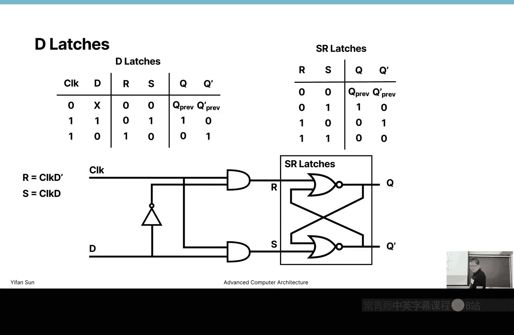

So what it looks like。On the waveform。 the waveform is。Something super annoying， but。

You can still can read what is going on。So when the clock signal。

 clock signal are always works in this way。It has half of the cycles are low voltage and half of the cycles are high voltage。

 This is a clock signal。And the D signal， we just set up some random signals to try to encounter all the cases。

Now， we say。When the clock， should see the set is the clock signal。 When the clock signal is 0。

 we are in hold period。In whole period basically means the Q value will now change。

Let's assume it starts from high， then you can see when in this during this hold period。

 the Q value will never change when whatever it starts will stay there。Stays there。 stays there。

 right， then on the other side， during the other half of the。Shifts。We call it transparent period。

 Transparent period means。Q equals to D。 So D changes。

 then Q will changes as if they're connected through wires。Okay。

 so basically you can see it will go up and down。 then here it will also go up and down。

 here iss going up。 then it's also going up。So， for half of the。Dty cycles。

The D latches will serve as a wire for the other half， it will serve as a latches。

You can almost consider it as a switch right it can be connected or disconnected when it's disconnected。

 the result won't change when it's connected is simply a wire。Okay。

 so these are the these are latches。But latches still have problems that is， by the way。

We typically draw the lectureches without the。A gate， we don't really care about the gate。

 And actually， if you consider。C mouse level or transistor level optimization is actually not implemented with all those gate。

 it can be simplified with fewer。Transistors。So whenever we talk about latches。

 we just simply use this type of block signals。Transparent periods are something we do not desire right remember the problem with computational logic is it takes some time for the data to converge until a stable states。

Then anything that in the middle can fluctuate and generate some noise that we cannot tell if the result is useful or not。

Then although we solved the half of the duty cycles that。It's stable。

 but the other half is not stable。 So we actually want to hold when both cok is  one and cok equals to 0。

Right， we want to hold it when both clock equals 1 and zero so that we can get rid of this fluctuation throughout the life cycle。

 the duty cycles。Of this signal。How can we do that if we can hold clock equals 0。

 we can hold clock equals 1 by simply adding another latch and a not signal， right。就。

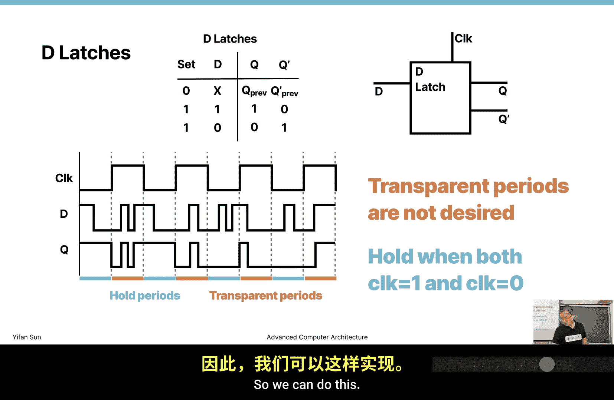

We can do this。The first one。We call it a master。 The master holds when the clock is one。

RightBecause theres a there's a inverter。 There's a node gate。So it works as if just a regular latch。

 the second one also works as a regular latch， then we can hold when both clock equals 1 and clock equals to0。

就。能。You can consider this as switches。1 clock is zero。The first part is connected。 the first。

 the master latch works in the transparent style。 So when clock equals 0， the signal D can flow to n。

是。Right， when clockk is 0， the signal from D can flow to N。 No barrier just。

As see if it's connected with wire。Now when Clark is one。The signal can flow from N to Q。

 but not from D to N。Right， so this is something called a flip flop。

 So it's either this side is disconnected or this side is disconnected。

 So this thing is called a flip flop， and especially when this thing is when these latches are works in a clock signal so there。

They have a rhythm。 They always do this flipping every half a cycle。Then for every one cycle。

 we have a open and close cycle。This is a flip flop， and let's look at some waveforms and see。

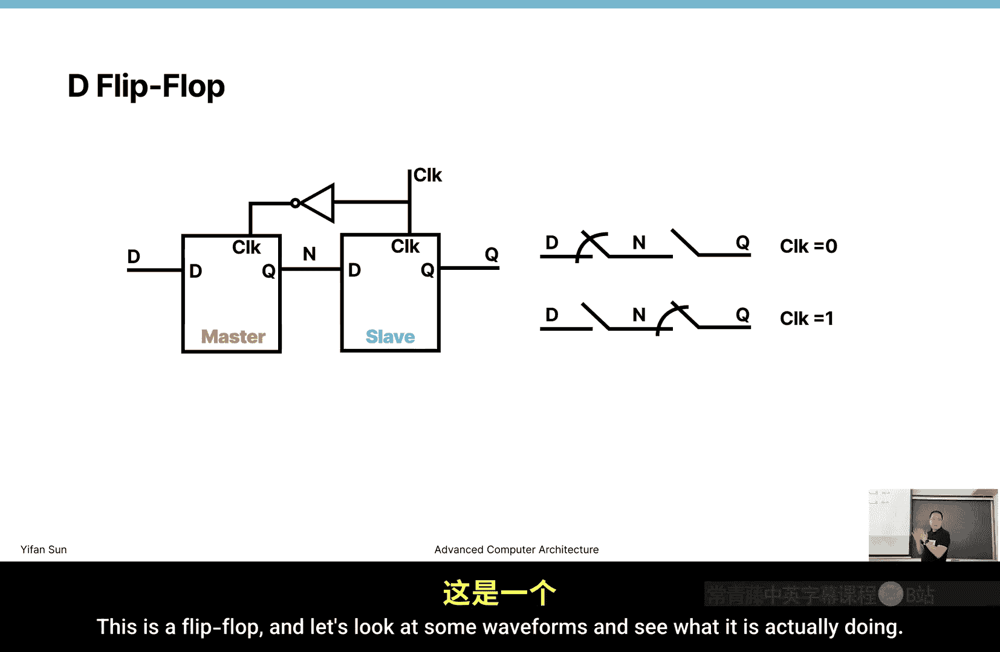

What it is actually doing。Now， we。Note some labels， the first label is D， the second label is n。

 the third one is Q。And this signal is still some random signal。 We just put some random signal here。

 Let's look at n。Then N will have transparent period when the clock cycle is one。Right， when is。

 sorry。D to n is transparent when the clock is 0。So it's transparent here， transparent here。

 transparent here， transparent here， transparent here。AndTransparent here， right。

 And it holds one clockg is 0。ok。On the other side， from N to Q。

 we can see it also has a transparent period and a holding period。

The transparent period is this time。Right。Yeah， the transparent answer is this time， this time。

 this time， this time。Then you start to notice this feature that this is a perfect square wave。

 that means。The value can only change。At certain times。The value can only change at certain times。

 when can change at certain times， is changes from。嗯。It changes from is become from。

From hold mode to transparent mode， right？Or from transparent mode to hold mode。

Okay I always have difficulty understanding which part is his transparent time。

 This part is his transparent time。This is hold。 Yeah， from hold to transparent。

 It always changes at this particular time。 So it can only change at that particular time。

 I think the only。Problem here。Is only hard to understand part is this thing then if this one is turning from0 to one。

 but is turning into a hold mode， so it doesn't really have time to let the signal to pass so it won't change here。

嗯。Okay， I know this is super hard to look at it。But spend a little。

 little time to check it and try to understand what is going on。嗯。What we know here is on one part。

On half of the duty cycles， when cloud is low， we or signal can flow from D to N， no problem。Right。

 and。On the other side。Where signal can flow from N to Q。At a certain time。Right。So。

This causes an effect， that even if you have difficulty understanding this waveform。

 you can just remember the conclusion here is not。

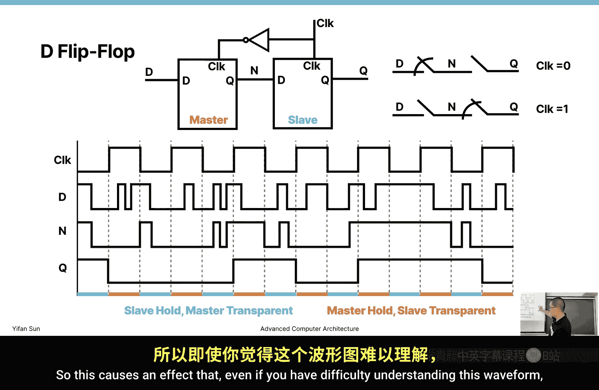

We can only change the we can only change the result when our clock cycle or clock signal is going from  zero to one。

Now we'll call it only changes at the edges。Now， when are we are at the edges。For this moment。

Q equals to D on rising edges。 So at this moment。Because Q is already passing。

 D is already passing data to N。 So N has。N has this value。 And when we have a rising edge。

 suddenly the slave closes。 Then the N's data flows to D flows to Q。 then N。Is disconnected with D。

 So after that， no matter what D changes， the D value will not flow。To n and now to Q。 So the。

What is happening here is。When we have a rising edge。Q equals to D， for a short moment。系。After that。

 during the whole cycle。The Q value will stay there will not change。Okay。

 so a Q will follow the only on that moment after that， during the cycle。

K will stay will hold between the rising edges。Okay， so this determines that our digital circuit。

 sequential logic， when has a clock signal， It always works in a way like tick， tick， tick， tick。

 tick in this way。 So whenever we take， what is happening is or signal from behind or register or behind or flip flop。

Can pass through this flip fl。Okay， only at the time that we tick。

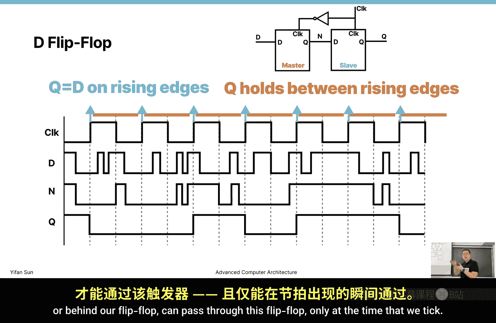

ok。So as you may notice， I'm saying behind the register and flip fl。

Basically has another name that is called register。

 I think probably all of you know heard the name register， right。

 Register in a digital circuit or in a computer is some day， some circuit that can hold data。

 One register can hold one bit data。 So we can write this then。This D flat fl flb as a simple form。

 in this form， right， it's just a block with D and Q or even simple sometimes we just write。

A symbol in this way。 There's a co signal。And there's the input and the output。

 The output always follow as the input when there's a rising edge or sometimes the down edge。

 So in some circuit， it will trigger by up edge。Rising edge sometimes will be triggered by down edge。

 it really depends on the hardware design。For the rest of the time， the result will hold。ok。😊，嗯。

So if you look at， this is。嗯。Dluch， right， We need two deluches with one and not gate。

To come to implement a register。 So how many transistors are there in a register。So these are  one，2。

3，4，5，5 gates， right， so two lattices now means 10 gates。

 10 gates so 11 gates right with a rever is 11 gates。

So remember last time we're saying one gate is typically considered for about four transistors。

 like if all of them are implemented with9 gate， so it takes 11 gates and 44 plus transistors to implement one register。

 but this is。

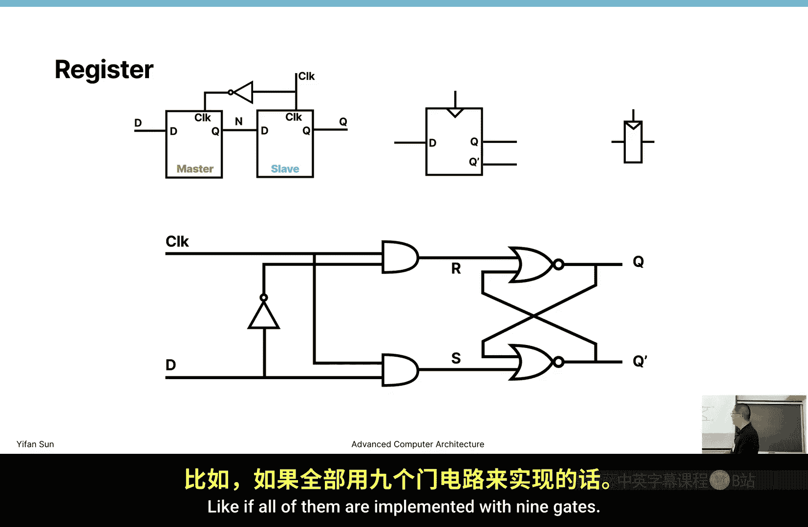

The result that we only consider at the gate level。However， in real scenario。

 if we can go down with transistor level optimization， we can reduce the transistor。

To something between this level。 So is there's no certain answer。 It really depends on what or go。

 In extreme cases， we can reduce it down to a very few transistors， like the。

In in the most extreme case， we can probably reduce down to three transistors。

 but that is a very special one。 It's a D style transistor。 For most of time。

 the smallest transistor without reading and writing logic， we typically consider as6 transistor。

 So 6 transistor。Is the。Minimum requirement to remember 1 bit in a circuit。Okay。

 in a digital circuit。But if we're implementing a register。In a core。

 like the register you write as R 1 R 2， typicallyp it requires at least 12 transistors。

 but sometimes can be more up to 24 transistors。 So just give you a feeling about。The amount of data。

 amount of like die size that if we want to keep。some data。On our chip， right。

 that's actually not a small number to store 1 bit of data。It's actually a lot of overhead。Right？So。

Come back to this design， when we have a register or flipflop。Digital circuits can be simplified。

 simplified in this way， or can be represented in this way。A register， when it generates an output。

 is connected with a combination logic the see how represents combination logic。Right。So。

Consider the computational logic， although it's fast， it still take some time， right。

 So consider we have a rising edge arrives at a certain time。

 then the queue will stay at a certain level。Q will stay there at a certain level then we' give some time for this combinational logic to do the calculation then remember last time we say the combination logic。

 no matter how well designed， there's always some fluctuation eventually to establish a stable state then this fluctuation we can ignore because。

This output of this combination logic will be hidden by this。Register。Right。

 will be hidden by this regular。 So this these value， no matter what this these value change。

 this Q will stay there as the previous cycles value。

 This value will keep fluctuating until another rising edge arrives at this circuit at this。

At this register， whenever rising edge arrive at this register or result is already stabilized and already passed from the D to N part right Now when a rising edge arrives。

 then the n populates to Q and D equals to  Q for thatho moment。

 then  Q will never change for next cycle allows us for do more calculation here than the D will get a new value。

 still， there are some fluctuations， though some noises but it will wait after a little time。

It will stabilize so the data will pass through these。五。

We pass through this register and put it tokyo。开出。See if。

 if when you go put the the the circuit or the current go to see what is there is a small oscillation。

那个。你 supposed to be example one对对？就是。不没。But is smaller observation。SoSo。嗯。我去最你你。

How do you guarantee so I think your question is when there's a rising edge。

 how you can guarantee that this value is stable， right？The fluctuation is right。就六。

The quick answer is， we should never have a fluctuation at a time that。嗯。

That the risinging edge arrives。Because the。Flutuation comes from， mainly from the。

Delay of a combination logic， right。The fluctuation comes from the delay of a computational logic。

 and if we can assume the combination logic can arrive at this stable stage after some time。

They will be stable， then we should we can guarantee that a queue。你 say。If this time。

 if this is a rising edge， right？Then the D will become will spend some time to fluctuate。

Then it will become stable at the end。Right。Will become stable at the end at this time。

 then at this time， another rising edge arrives， then will fluctuate for a little while。

 then will get stable。 Then another rising edge arrives。

So it will only fluctuate at the beginning of this cycle， but not at the end。

Are you okay with this assumption。OK的差不多。当 give by点。So边 how you wish right我。啊。HS的。

What if we want at the beginning is one and the end before choose to zero然后 at right last moment。啊。

等当们。是。呃O。So how can you guarantee that the computation is finished？Right。你此把你个。I0。

When you come come in， and to be what you need is one。么有会 name啊。Why do you think the situation。

Its still one。 It that 0 is。 It is a stable at0 surroundings。Is stable at0 is a wrong answer。

 Now how can it be stable at 0 then there is something wrong with your computational logic design。

Yes。你那必。你要查。顾客さ。目前。为什么。OK就。呃。So， so basically， it takes some time to fluctuate。

 right until it arrive at a stable state， then。呃。With experiment words calculation。

 you know how long time it takes to finish one calculation。So， for example。

 if you know one gate takes 0 point， if one gate takes 0。1 nanosecond to。Finalize it' open and close。

 Then， then if you want to set  one nanosecond。As the cog frequency， you probably。

 probably can only have 8。love。8 levels of gates。Right， so that you have in 0。8 nanosecond。

 you can finish all the calculation。 You， you still save 0。

2 nanosecond for some safeguard to guarantee that the final。Vottage is being established at the end。

Right if you， if you need more than8 level。If you need more than eight level of gate。

You have to split it into a motorcycle operation。You cannot do that many things， within one。Cycle。

You have to make it a multileve operation that's why you probably heard in course in CPU cores theres at the beginning theres probably five stage pipeline later on is extended to like 20 more than 20 level stage pipeline stage why they do that is's because they want call frequency to run faster and faster。

 but they don't they probably have too much logic to finish。Then there's a trade off。

 do you have more stages or do you want to have fewer stages， but each stage takes longer time。嗯。

So this is something that is a design parameter that you need to say， if I want to run 81 gighertz。

 I have to sacrifice the capability of each。Each clockg cycle。Okay， so if you still have confusion。

 that's cc later。Okay， so synchronous logic design。

 So there are some rules or some principles define synchronous logic design。

 So pretty much if you say the strict definition for sequential logic。

 it doesn't have to be synchronous， but pretty much all sequential logics are synchronous。

 so you can consider this definition as almost as the definition of sequential logic。

 So every element is either a register or a combinational logic right so we have a we have registers。

 we have combination logic。And as this， the one circuit element is a register。 So we。

 if it's a pure computational logic， it's computational logic。

 we don't call call it synchronous logic design or syn logic design。

Then all registers have the same cog signal， we use one cog signal to control the hochi。

Although practically even the clock signal propagation will take some time。

 It's very hard to guarantee pure synchronization。 But if you consider localized the clock signal。

Synchronization is not a big problem。Then every cyclic pass， we can have cyclic pass。

 then we can even have this combination logic to generate a result and that goes to the first set of registers。

 so don't treat this as a single register it can be multiple registers here okay。

Every cyclic path contains at least one register， right， then you cannot havecyclic path that is。

 say， one computational logic。 So you cannot。You cannot now go back to itself and this cyclic this component logic is having feedback to itself and it's not something that we're designing。

Okay， it has to use register。Serve in the middle。So registers。

 you can consider it in many different mental models youll consider in different ways。

 So first of all， it's a gatekeeper。 you've only allow the signal to pass through at certain rising edges It's one thing。

 The second thing you can consider it as a one bit memory we memorize data for one bit one register one bit。

 So the combination logic won take that bit as an input to generate some output。

Right as one bit memory。 then you can also consider it as a separator。 right， You do some logic。

 You temporarily hold it so that you will continue the work in the next cycle。

 then in this combination logic。 So it's a。Signal holder。

 So many different ways that we can mentally model this。

Register and also start starting from this point， I want to talk about the mental model of designing a circuit。

 digital circuit， a sequential logic circuit using using computational logic now a computational logic。

 as you can see from last time is a something relatively simple。

It would take some input and generate some output。So。For most of us。

 when we start to design a computer architecture system， Comp system。

 we consider in a mental model we work in this way， say。This is a cash。We receive a request。

 We first check if we have the。Data locally。 If we don't have the data locally。

 we send the result to the bottom to the another。Memory unit or another level of cash。

 Then we wait until the result comes back。 Then see， see my words。 Then we wait for。

Some cycles wait for the result to come back。 When the result comes back。

 we store the data to local storage， and we also send the response to the top。

So this is a very intuitive description about how cash works。

But there's a mental model that we need to shift。Is。A combination of logic cannot wait。

You give it some input will generate some output immediately。And it's like。Getting some work done。

Right。男 you哦。Far asleep。Then you wake up without any memory。

 You can only read what you have written in the piece of paper and starting from that point and you have a piece of paper that is your memory in the register。

 Then you have another task。 Okay， take these two parts and do the next thing。

 then you fall asleep and forget everything。Right， wake up， look at your notes， look at new task。

 do the task， then fall asleep。This is what combination logic is doing， so it will never wait。

 So if you really， really want to wait what you can do。You have memory， right。

 you put everything in your memory， you put everything in your note。

 you fall asleep so that you when you wake up， you can still read your note to understand what happened before。

So designing a such a logic， sequential logic is about to design the log that you want to write into a piece of paper and determine how you work on task how you work on task when you read your note and take a new request and do the calculation and generate some output。

Right。Last time we talk about designing sequential computational logic。

 and this time we're talking about designing the whole thing。

 so the register part and the computational logic part。

And how we design it is to basically use something called state machines。A state machine is a。

Very strong mental model that can help us design sequential logic circuits。

 And I think state machine is something that。Kind of not only help me understanding design circuit。

 Then when I learned it， it also helped me。Like understand word or change my own mental model to write even regular software。

It changed me a lot and I think I hope you also can get to the point that why we can think things in another way。

So let's use an example。 This example is from a textbook。 Let's design a traffic light。Now。

 in this traffic light， we have。Two set of sensors， T A and T B are sensors。

So sensors are something that detect if there's a carner or not。Okay。

 let's assume this is super simple that。啊。One that it's not busy。

 always only one car pass through this crossing。ok。So。We have two sensors T A。

 we consider those are one sensor， okay， although we have two sensors。

 but either one of them is one is triggered than we consider T is triggered with T B on the other direction you we also have light A and light B。

And the light A light B can be either red， green or yellow。So。Here we have。

 that's the input and output。And when you describe a system。Before it describe what it does。

 always describe what's the input and output and always hear someone telling you， describe me， oh。

 I want to design a fancy system and talk for 10 minutes then eventually ask question what's your input and what's your output then。

Probably for many cases it' actually very hard for them to define input and output and it's actually very important to clearly define your problem to say。

 okay here's my input and here's my output then you think some a canm I can convert input into output that's a way when you design a solution or a system。

So。This is a symbol that a block diagram that's a foreign system that we're developing。

 and we have T， TB，OA， and LB。ok。Now why there's a slash？In L A， R L B。Because it's not digital。呃。

Yeah， so it's three output is still digital and three output。 Yes， so when we have three output。

 we cannot now use one bit to control  three light。

Right so that means it's a multi bit wire or it's multiple wires， but combined together。

How many bits it requires for LA and LB？2 bits each， right， because we only have three possibilities。

Either two bits or three bits， right， if you consider how we can eventually control did they remember the seven segments。

 seven segment display。If we have three，3 output， we can directly control them， say001 is red 0。

10 is green，10，0 is yellow， that's one way to encode it。 The other way is 0，0 is red0。

1 is green10 is yellow， then that's another way to encode the or output if using the second way then eventually we need another decoder22。

4 decoder right we need a 224 decoder at L and LB to eventually drive three lights。But here。

 let's only consider。Case two， we only arrive at the point of 0，0，01，10。

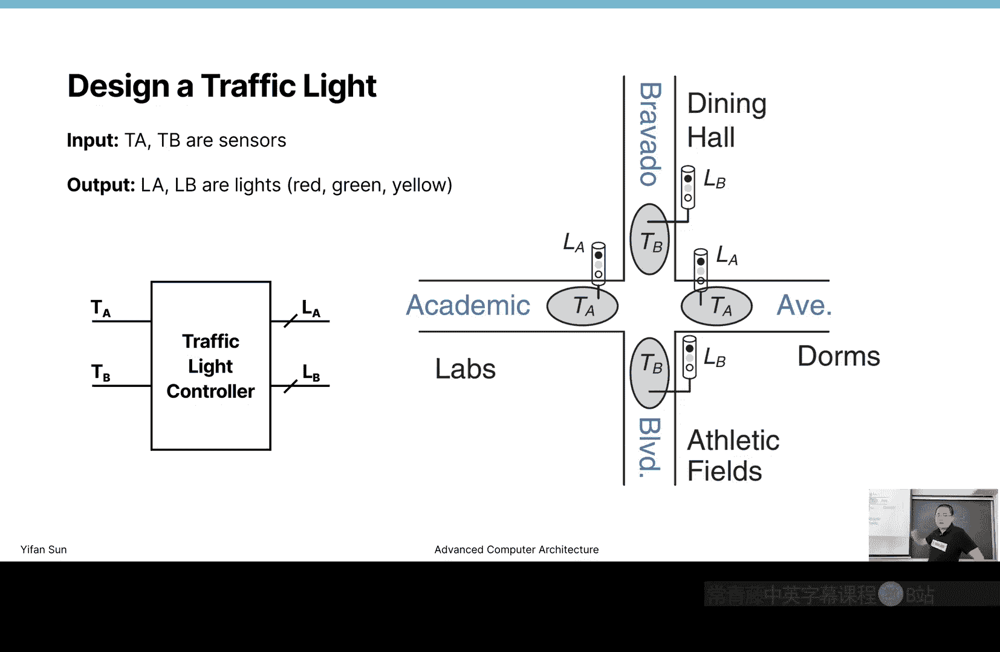

Okay， so let's list all the possible output and the possible output are let's say start with L light A is red that B is green。

 then if B wants to turn to red Mountain flip B has to stay for a little while as yellow state。Right。

 now it has to be in yellow state。 then after that。We flip。We flip actually to this state。

 the last state， L A turns from green and L B turns red。Then after that， if we want to turn again。

 L A has to be go back to yellow and。Eventually it can go back to the first state right there are four possibilities of light。

 It's impossible that both lines are in red， according to or definition。It's impossible。 both。

 both are red， both are green， Both are yellow。 There are many cases that are we do not consider。

 We don't。 We don't think they're possible。So with this possible output。

 we need to summarize them as state， what are state in this case。

 we consider four different state and to determine the state sometimes this is a。Little bit complex。

 but for this case， it's a rather simple。 They don't always see many。

 many examples about how we design this state and how we can。

How we can design this state and how we can make useful circuit。

 but here they start with S0 in S0 state 0 is when L is green， LB is red。Okay。

 this is your default state。Then to transit， if we want to flip。

 we have to let L A to go to yellow state for a while， then let L B stays in red。

 Then we can do the flip。 Then in this case， L A is red。 L B is green。Now， if we want to flip again。

 we have to make the S3， the fourth state S3 is L A is red， L B is yellow。

 so fourth state in total that list all our possibilities。

Then we draw these state transition diagrams with arrows。Then we need to say when S A can go to。

 when S 0 can go to S 1。When S 0 can go to S1， thats assume is always triggered by sensor when a car weighs there。

 then we make the。Change。So we call it。notTA就。This is when we want LB to shift， right， that means。

There's no traffic going through TA。Then whenever there's no traffic going to the TA。

 we transit from S to S1。If there's a condition in any error， we need to consider other conditions。

 So the S 0 does not implicitly stay in S 0 state。 right， We have to have an  error。

 So this is a special error that pointing to itself。It should be T A， not T A not。 Okay。

 it should be T A。 So when there's still traffic going through this academic avenue there。

We wanted to stay in S 0。 So light a is in green state。 O B is in red form state。

 So we list all the possibilities， no matter what we know what our next state is， right。

Then we draw next circle。 This is an unconditional circle。 So if it's red， if it turns yellow。

After sometime， it has to turn into。Flelip this state。Then we draw the symmetrical line to for TBb。

 if it's theres no traffic， we convert to a3 if N traffic we stay in S2。And finally， turn the yellow。

 eventually a yellow light will turn red， so we go back to S0 state。

 so those are all the four states and how they transit。Yeah。Ylow。

 you have to stay in a couple seconds，看没去。I know you， I know your' concern。

 So yellow needs to take a few seconds， right， green probably also needs some delay。

 in circuit design， in real circuit design， Yes， we do need to consider delay as a special type of like pointing back to itself for some time。

 right， But that's。Make it super simple。 Let's consider we have a super long period at five second。

 then youll stay there for five second。 then five second later， we do a stay transition。 Okay。

5 second is a minimum minimum time for state transition。 They probably can solve your problem， right。

一你。是。して。So。Considerate的。Some special statement that no lights can change。

Yeah that can happen I know your I know your concern so sometimes a counter is necessary。

 but here let's just make it simple it's the beginning of a stay machine I don't even talk about clock cycle here。

So the say state transition。ok。So。Once we can draw this state transition diagram。

 we want to convert it into a state。transitionranition。Table。

So this table basically describes current state input and the next state。For every arrow。

 we need to write one line here。So for example， if our current state is S 0 and when T is1。

 we stay at S 0 right， that's the self pointing arrow on the top。 Now when S 0 is 0 S T is 0。

 We flip。 We go to S1 for S1， we don't care about input。

 we always go to S2 or S2 and it's the same thing。 then we go to stay as S 2 or go to S 3。

 Now when S 3， we don't care about input， we always go back to S 0。

This is a state transition diagram。Now we make these transitions。

It's all the possible transitions that we describe in this。Table， this is really a small example。

 The real problem can be much more complex， but this's our starting point。Okay。

 so next task is we want to consider state and output encoding。

 So we want to encode the state and output。We want to represent the state and output， with spinries。

So how many bit it requires to encode the state。And is there always a two to a power of n problem。

 If we have four state， we need2 bit If we have five state， we need3 bit。

Then although we waste three three more state， but that's the only thing we can do If for more than four。

 we need three states we'8。Where if I have nice state， we need to have four bit。

To represent the state。

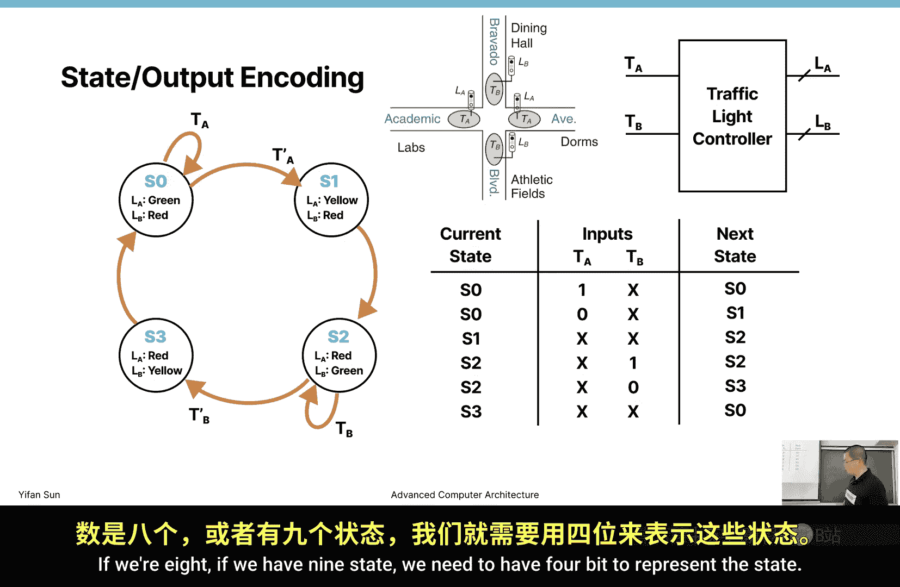

Okay， so for output we already talk about we use 0，0 to represent green，0。

1 to represent yellow and 10 to represent red， so then we can convert this state transition table using bit rather than symbols as one as zero。

 no symbols we can write into this thing。Okay then。Here we have the input part， right， four。

 these four bits are input and these four bit are output。This forbid， state and。

Current state and input are the input， the next state and output are the output。

 so for input for output with a design combination logic is something that we covered in the previous lecture。

Right so let's keep going。We don't really have to design a big combination combination logic circuit that considers for input and for output。

 We can combine into two parts。 One part is。From the current one part is using these four bit as input to calculate the next stage。

 right， next state。The next next state computational logic。No， you can use a kernel map。Right。

 or you can just。Looking at the result and try to simplify it。Now， for this case， it's rather simple。

 we can just go ahead and simplify it。So here。Let's look at S N 0。 Okay， S N 0 is this is S N 1。

 This is S N 0。And current state is us。S say zero， how many ones we have， I have two ones。

And two ones here。 So we have two midterm。Then look at the input。 we have。S1 prime。

 S 0 prime and T A prime。If there's zero， when we it we write it as not state。Now here。The。

 for this term。We write it as one， no prime at 0 prime T prime。For eggs， we don't care about it。Okay。

 that's the way we write S N 0 then for。Sn1， it's a little bit more complex than we consider this case for this term。

 we have S1 prime as 0。RightNow， for this case， we have。S 1 as 0 prime T B。 for this term。

 we have S1 at 0 prime and T B prime。Okay， just use all the ones to generate every midterm。

And they are。Some of product form。Now， this is some of product form It's not a minimized form。

 so we can simplify it or we can simplify， you can probably。Its， it's very easy to check。

To find that this TB and TB prime can be taken out and can be canceled， right？

We have done this a lot last time。 So it's basically as  one as prime 0。 So we get。历史。

So TV doesn't matter at all。TA and TB doesn't matter at all for SN1。呢。See。

 are you familiar with this presentation？Yeah， remember， every time we say if it's only two input。

 we can probably generate output。 We can generate output with one gate。 So in this case。

 this is x or again。ok。So， S N1 is。As1 as 0 x or。If they are different， the output is 1。

 If you are the same， the output is 0。Well you don't need to ask why this happens。 And there's no。

Fundamental reason is just。Coesiness。Okay， it happens can be represented by an x or。For S and0。

 basically we have no way to simplify it。ok。Then on the other side， we look at the output。

Combinal logic。 So the output is only related to the current state。 If we have a current state。

Now we can generate the output。 All right， so the current state。

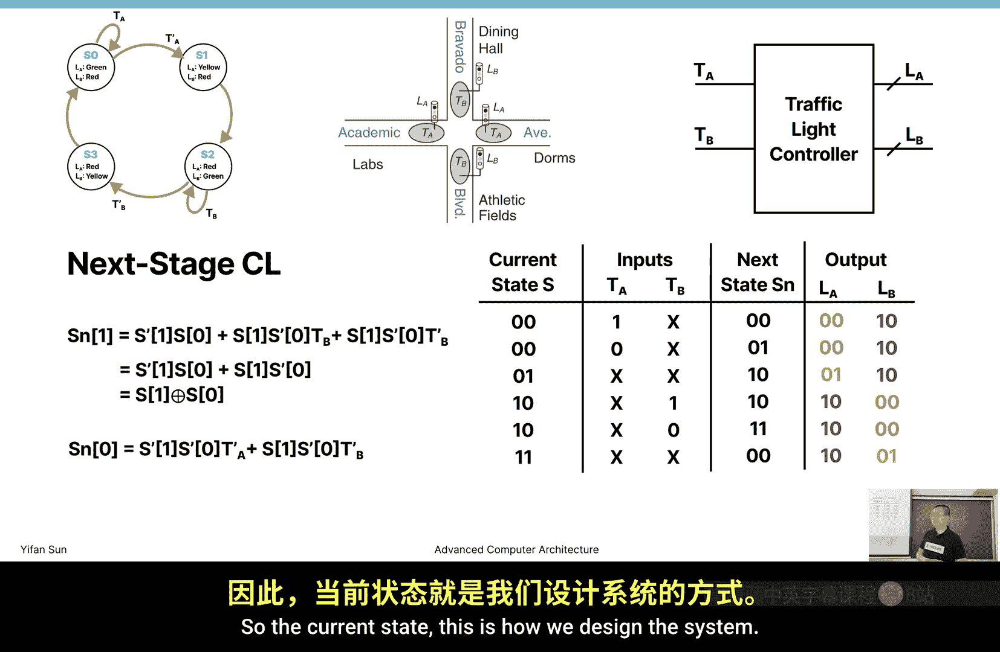

This is how we design the system， we say our current state。

 we first the list all the possible all the possible combinations of output。

 then we define the state。 So of course the output。Is tied to the current state。O。So in this case。

 it's also easy to write this four bit output， right， So I want't really。Explain how it's derived。

 but is super simple。Okay。Because there are only one， only two bit input。

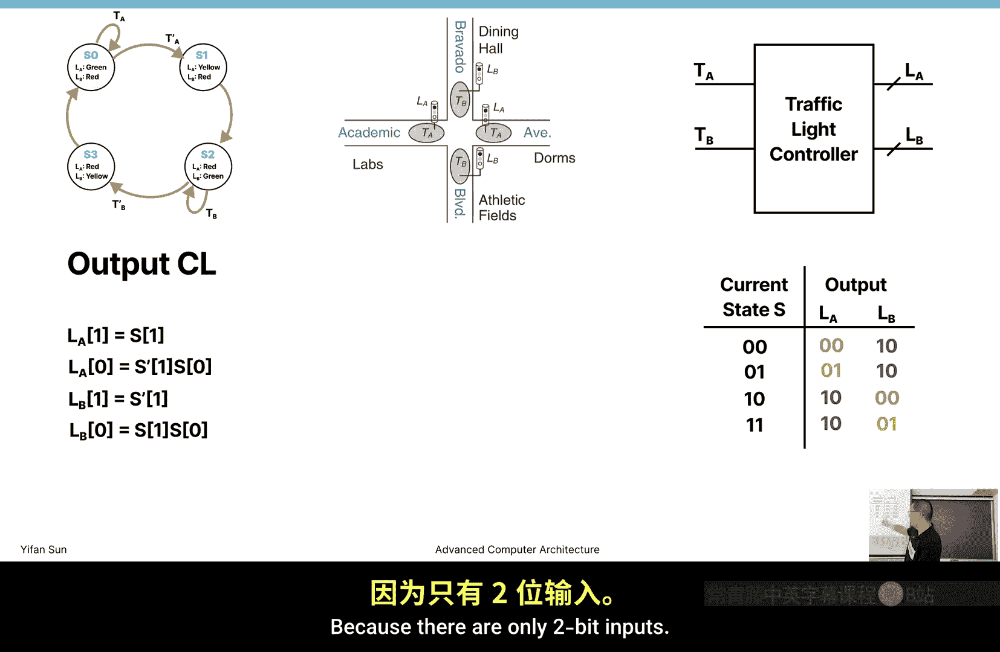

Okay， so at this stage， let's give a quick overview how we how we arrive at this stage。

We have the problem。 We have the symbol。 We defined input and output。 We list the all the possible。

 we list the all the possible。A combination of output。

 Then we consider each possible output as one state。Right， we define the state。 there are four state。

 Then we summarize how this state can flow from one state to another。 with the principle。

 what input triggers state transition。 Then we write down this state。Transition table。

We convert these symbols of state into binary representation of this。State of this state transition。

 right， then using this state transition with four input and four output。4 input and6 output。

 we can generate。Equs。We can generate four bulloleying expressions that describes what our circuit will be。

If we want to design a logic like this。So once you have this style， once you have this expression。

 then it's not hard to draw a circuit， so let's draw this circuit together。那你。

I wanted to split into two slides， but it appeared at once， that's okay。

 let's explain a little by little。So we start by a register。Okay， a register stays near。

 then this register have S1 and S 0 as the current state is the current output right and S n is the next state。

 No remember， no matter what we change next state， the next state will only become the current state when the clock signal is arising。

Ach， right， so。The it will。Youll pass this barrier。

 go past this mountain only after we see a rising signal。Okay。

 then the signal will start to generate。 and we'll look back。 This is a feedback loop。

 You can see theres two parts。 right， This is as 0。 The inner circle is as 0。

 The orderer circle is as one。So we're definitely writing a simplified style of circuit because we have a three input gate and with inverters directly represented by circles on the input side。

 but you understand what's going on here， right？So these are。

The circuit that express those expression， implement those expressions。Right。

So it will take some time。 go back to this place and calculate the next state value。

 only the rising clock arrives， The rising edge arrives will pass this barrier。 the S N becomes S。

Then we start to calculate next round。At the same time， on this side。

 we call this group of circuit the output combination logic。

 so the output combination logic only depends as1 and S0 and using three very simple gate。

 we can generate four output bits and these four output bits can drive the light red。

 green and yellow lights to turn on and off。ok。So this is a very simple example of how were combining were converting。

Problem into state and eventually into a circuit that implement this logic。人。

It's a little bit over simplified， for example， we didn't say how long the clock cycle is and how exactly the sensor works。

 but this is a。The first example that I can show the whole process that how we can arrive this point。

 Then in the next lecture， I'm trying to give you more concrete examples。

 like the more building blocks of digital circuits for both combination circuits and。嗯。

And sequential logic circuits that can eventually build very complex computing core。

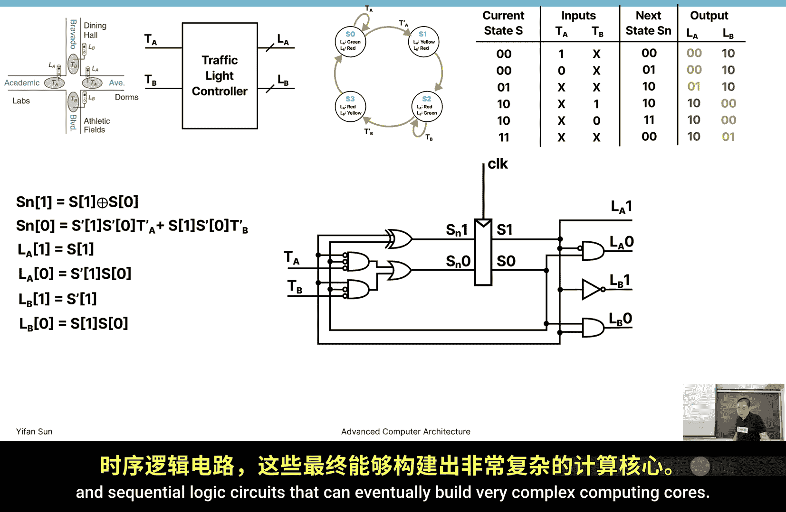

So， okay， a summary for today's lecture。 Then we talk about sequential logic building blocks。

 We talk about latches and flip flops， then。Something that you can forget。

 something you cannot forget， something you can forget is how the latticetches circuit is drawn。

 how many gates are there， what exact gates are there。

 then how to analyze like the cycles of signals。Eventually， just remember one thing。

Flelip flop is a register and。Q equals D when we see a rising edge。

Then  Q will be will hold at this value until next writing edge。 Then next writing edge。

Q will equal to D again。 So D will pass that register whenever there's a rising edge。

 Then it will not change the output， no matter D changes after the rising edge arrives。

Now when we talk about state machine， we use a concrete example to describe how we can convert a problem into state machines and eventually design。

嗯。Digital circuit sequential logic circuit， and especially。In a synchronized。Digital circuit style。

 Okay， I think that's all for todayed's lecture。 and let's talk again on Thursday。

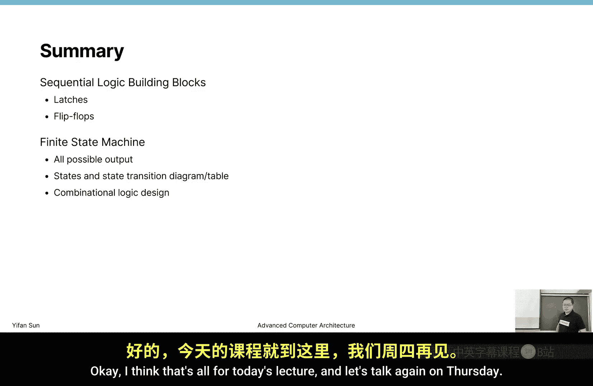