# 威廉玛丽学院【中英⚡高级计算机体系结构｜CSCI654 Spring 2025, Advanced Computer Architecture】 p05 P5 时序逻辑 2 -BV1evfwBVEUG_p5-

Okay， so in today's lecture， we're going to continue with sequential logic。

 then I think the most important part in sequential logic is introducing the previous lecture a sequential logic 1。

 but today we're going to solidify it and introduce some you with some basic concept of the sequential some building blocks for sequential logic。

 then eventually we can use the sequential logic elements to build。

CPU cords or other memory storage unit。 Okay， so as a review。

 sequential logic here we're considering sequential logic is a digital circuit。

It output depends on the prior state， and the prior state is stored in a memory which is typically considered at We typically use registers as the。

嗯。As the memory there。 Now， we have feedback signal and the whole。Ccuit is controlled by clock。

 So like last time we talk a lot about how latches work and how register works。

 but basically I think you can forget about detail about how laes work and register work and only care about registers can guarantee that the data can pass at the rising edge of the of the clock signal or the down or the down edge of the signal it depends on the design。

 but it will only respond to one edge of the signal and。Can pass the signal through， right。

 Then for the rest of the clock cycle， it will lat the signal there。

It's when we're talking about sequential logic is in the。

It's on the contrary to a combinational logic circuit in computational logic circuit。

 We don't have memory。 And for any input， then we have a。Kind of predetermined output。

 right then we also consider this combination logic and generate result in one shot。

 like it takes no time。 But for sequential logic， we consider in one cycle。

 it will generate some intermediate result， some intermediate result until eventually。

 it will get some final result。 Also， sometimes this intermediate result is also important for for sequential logic。

 And computational logic is still very useful because it describes the behavior of this。

The behavior of the whole circuit， right， If you consider a memory。

 it can only record the state of the circuit， but the computational logic should record。

 should decide what's the behavior of this logic of the circuit。

Then the most important part is the register。 As we said。

 it only responds to the rising edge of the cog signal and when to rise edges then the output signal can change。

 and for the rest of the whole cycle。For the rest of the whole clock cycle。

 it will keep this value unchanged。Okay， so a register basically capture captures the input data at the moment of the cog edge and holds the value constant until output value constant until the next co edge。

 That's all you need to remember about what is a register。

 Forge about how it's implemented with Sr laches and even two Sr laches and not gate， but here。

As we are going。Towards higher level of the design stock。

We don't really need to remember the gate level design。

 just consider register as the most fundamental element of a digital circuitgate design。ok。就。

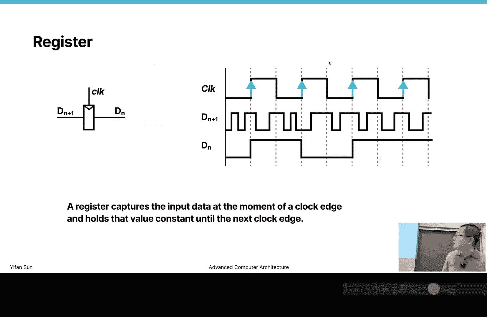

Okay， so we also talk about finance state machine and how to use a finance state machine FSM to design a digital circuit。

 Now a finance state machine defines finance state machine is basically a machine。

 It's not really a hardware。 it's a concept that if we follow these steps then we can achieve some goals It's a concept that we model some some hardware。

 some circuit mechanism so that I can work in this way。 So we define a few states right In this case。

 this is the figure from the last slide。From the previous set of slides。

 we define this traffic lights with a few states right as 0 as 1 as 2 and S3 then four state and each state decides what's the output of the whole circuit then this I try to list a general step of steps to define what we need to do。

To use finite day machine to design a digital a sequential logic circuit。 Now first up。

 let's try to list all the possible output。 Now list all the states。

 These two are can be directly related in this case， for example， in this case。

 or output is basic as0 as one as2 a3 maps to either red or green or red， yellow states。

 For some cases， as well see in a later example today， there they may not be directly related。

Then we can draw the state transition diagram， we can see which state transit to which other state。

 then we can encode state and did the output。So in this case， we have four state。

 when I have four state， we can use2 bit。 if we have five state， we can we need to use  three bit。

 then we need to encode a state and the encoding order typically doesn't really matter。

 You can change the order as long as it's one to one mapping that's good then least the state transition。

Table， right， we list the state transition with one arrow per entry in the table。 Then we draw。

 we write down the encoding so that it turns into a choose table。

 for the current state and the input is the input of the input to the computational logic。

 Then the the next state and output are the next state。 or the output of the computational logic。

 So you think that choose table， I think for the the。Comal logic lecture。

 the most important lesson is whenever I give you a true table you can draw a circuit right like its just gonna take some time you can draw a circuit in this case we have a true table then you can you can write down the bullying expression and simplify it and eventually draw a circuit so then that's the whole step of designing a sequential logic circuit。

So let's give a few actual example or slightly more advanced example to。

Just to help you understand the whole process about how to use finance aid machine to design。

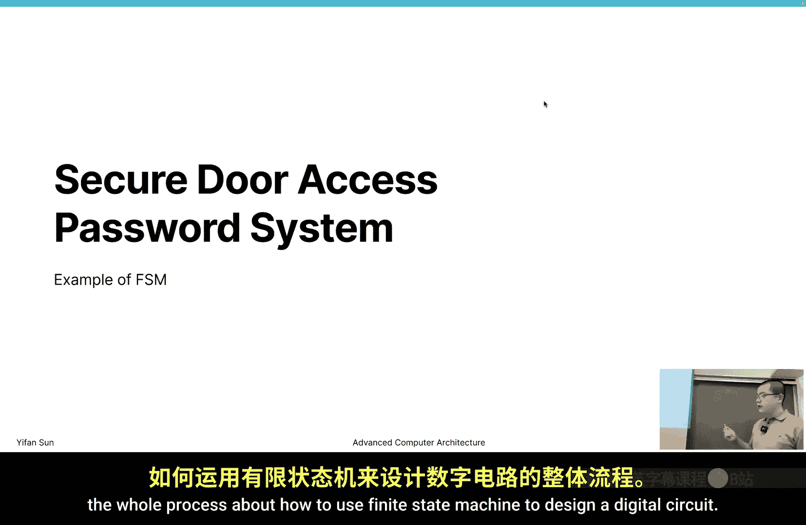

A digital circuit。 Let's consider。This type of door door lock， there are 12 keys。

 We probably will only care about this， only care about 10 keys。There's a。

 say if I type four numbers。 when I type four numbers， then if it's correct， then the whole the。The。

 the lock， the that bolt lock unlocks。 right， If I type the wrong number。

 I still need to type four of them， then click on the check mark。 Then it will try to log unlock it。

 But if it's a wrong number， it will just generate say。A boo noise。

 Then it will tell me it cannot unlock because the passport is wrong。

 And there can be a lot of advanced design to this， for example， people can design this thing。

 like if someone is following you and but you still not want to reveal the true。Password。

 you can type 8。8 numbers。 So as as long as four numbers as a sequence sequence in this8 numbers are correct。

 you can unlock the key。 So after we talk about this example。

 I think you should be able to design some more advanced features by adding new by adding more state in this。

In a stay diagram。 But let's try to use the very simple example to try to。Demonstrate again。

 how finance state machine is used。Okay， so what's the finance day machine。

 then the finance day machine try to draw this one in this way。

This is my finance day machine if you draw the finance day machine。

 you can draw a totally different one and you may even have different number of state and to map different output or different actions。

But let's try to go through this one and see。If you can understand it or not， okay， and still。

 I don't think there's a certain way to implement it to draw this diagram。

 you can draw a totally different one， but it's still perfectly correct。 So in finance day machine。

 I think actually for most of the time for 99% of time， we start with an idol state。Now。

 in this idle state， that is the initial state， right， So also whenever we need to reset。

 we come back， we come back to this idle state。 So if we。Click the crossmark， then go by。

 always go back to the idle state so that we can type in the password again。

So then we can press the first digit， but when we press the first digit。

 it can be either right or wrong。 It can be correct or wrong if it's correct。We go to C1。

 if it's an arrow， we go to E1。 why there's a state because we cannot really directly tell if the user this is correct or not。

 right if we tell if user price the first one as a wrong number。

 then it's much easier for the user to for a malicious user to guess a guess the correct。

The correct passcode， So we go to this E1， but this E1 from the output。

 this is a totally hidden state。Because even the C1 and E1 is actually not going to generate or any output at this point。

 but it's only as internal state that will。We all remember the remember the current state so that we can progress to future states。

 right， So in this case， we have this E1。 If user correct pressed the wrong。嗯。Number and C1。

 if this user correct the right number。 Now， continue as we keep press the right number。

I think there should be errors。 There's actual errors。 So starting from C 1。

 if we correct the wrong wrong password， we actually can go to E2， then if we correct the。

 if we press the right number， it goes to C 2。 correct number goes to C 2 and wrong number goes to E3。

Okay， but if you are at E1， if you are at E state， aerostate， you always need to go to E state。

 no matter what part， what number you pressed， right， E E2， E 3。 And if you price something from E3。

 you press that this。The fourth words， the fourth number， then you always go back to idol state。

 but if you are in T3 and press the correct term password， you go to unlock。Now。

 it takes a little bit state， a little time to stay in the I state。 Then in this state。

 we we unlock the deck boat。 Then typically， there's another sensor to detect if the motor is finishes rotating。

 will stay in this I state to emit signals so that the motor is rotating until the deck boat is fully。

Retracted， then at that point， we go back to the idle state so that we can lock it later。

 this whole machine is only about the unlocking process and we're not talking about locking process okay。

So if you are interested， definitely you can design something more fancy。

 but let's start with something that is manageable that I can show things in one slide。

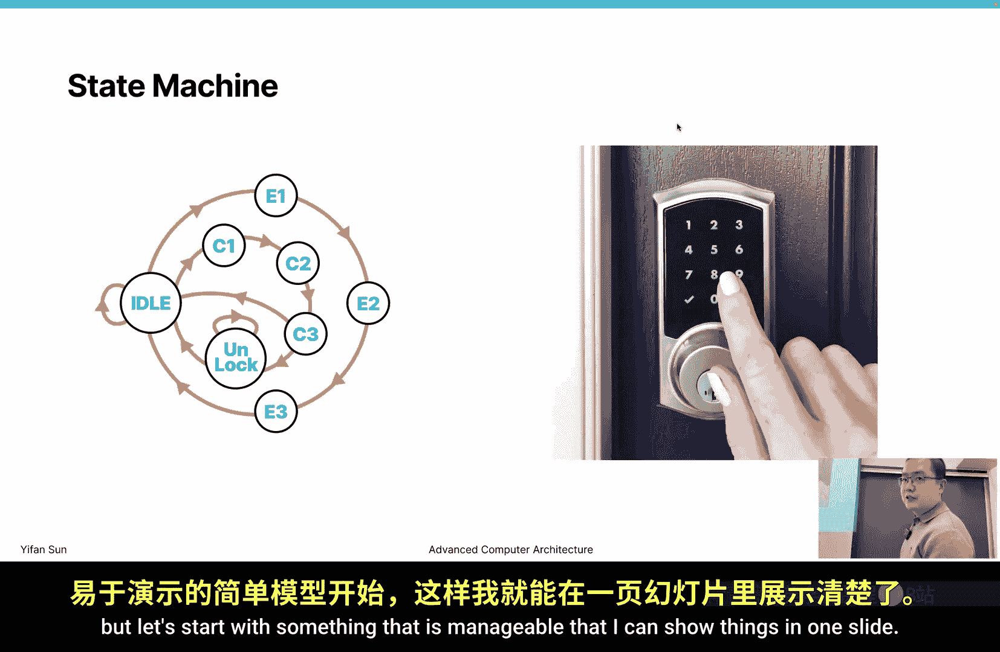

Okay， this is the state machine of this。Logic， then the next thing is we're going to use state encoding。

 So how many states are there then。There are8 state， right。 So C，1， C2， D，3， E1 E。

23 there6 state and idle and unlock our two state。 So there are8 state with8 state。

 we can use three digits to encode the。The encode state then for this type of device。

 probably there's a very， very simple chip behind it。 It' it controlling the state。Every bit counts。

 So we want to save the bit。 And actually， if you， if you。

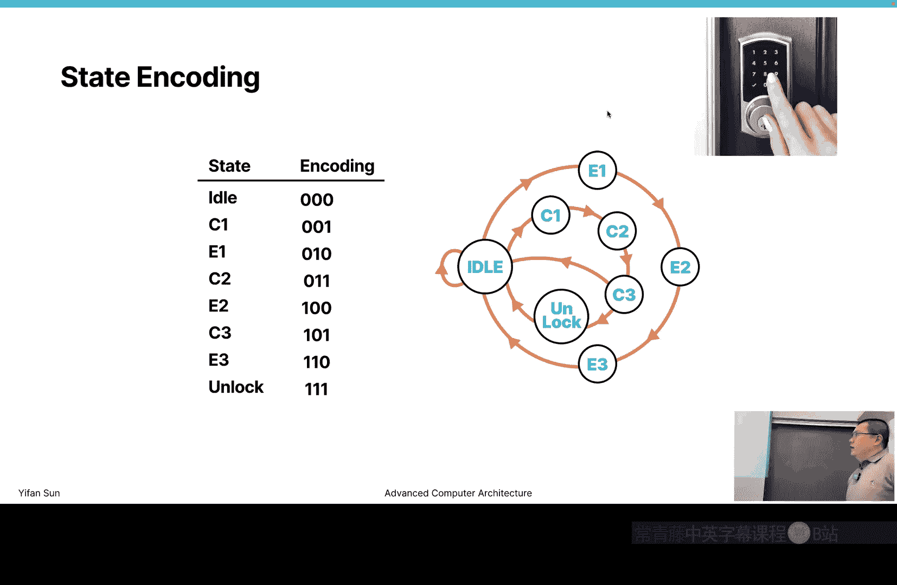

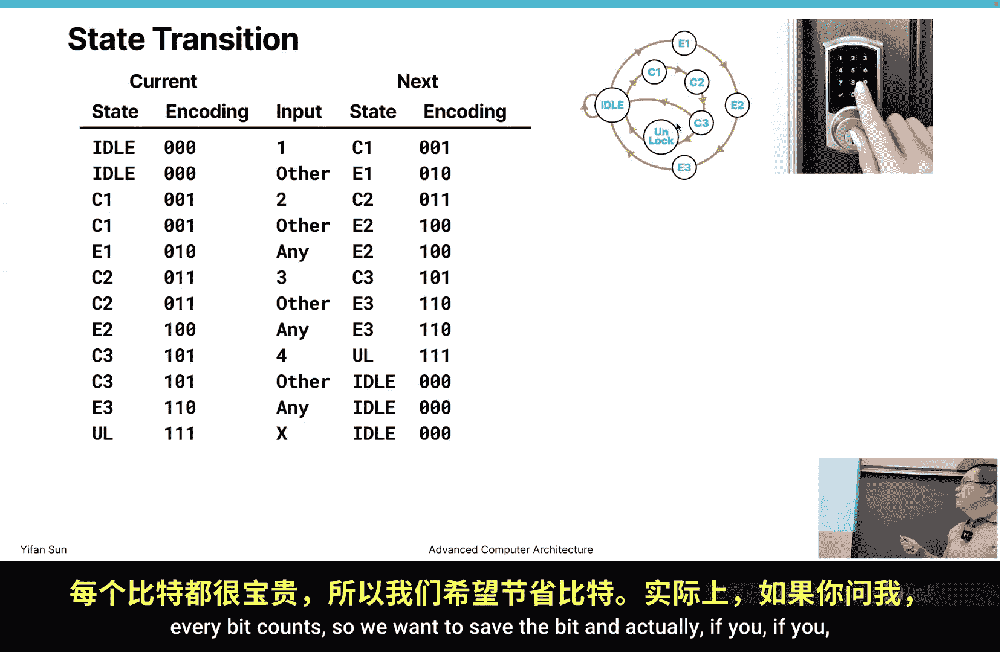

If you ask me。What type of。What type of。Controller is actually controlling this one。It's very。

 very unlikely。 It's。It's very unlikely it's asic。 It's a application specific chip。

 This type of company。For this type of device， it's very unlikely that they build。

A chip for this type of device。 It costs too much money。

 So what are you is something called a microcontroller。

 then the microcontroller typically can write some C code in it and can run some instruction。

 super simple instruction in it。And there are some pins。 So the sustain machine。Its still useful。

 but is most likely implemented in this type of microcontroll in a software。

 not really directly in the hardware。 But if you want to design something like this or digital cog。

Something like this， aics are still useful， and those are toy examples for more complex computer chips。

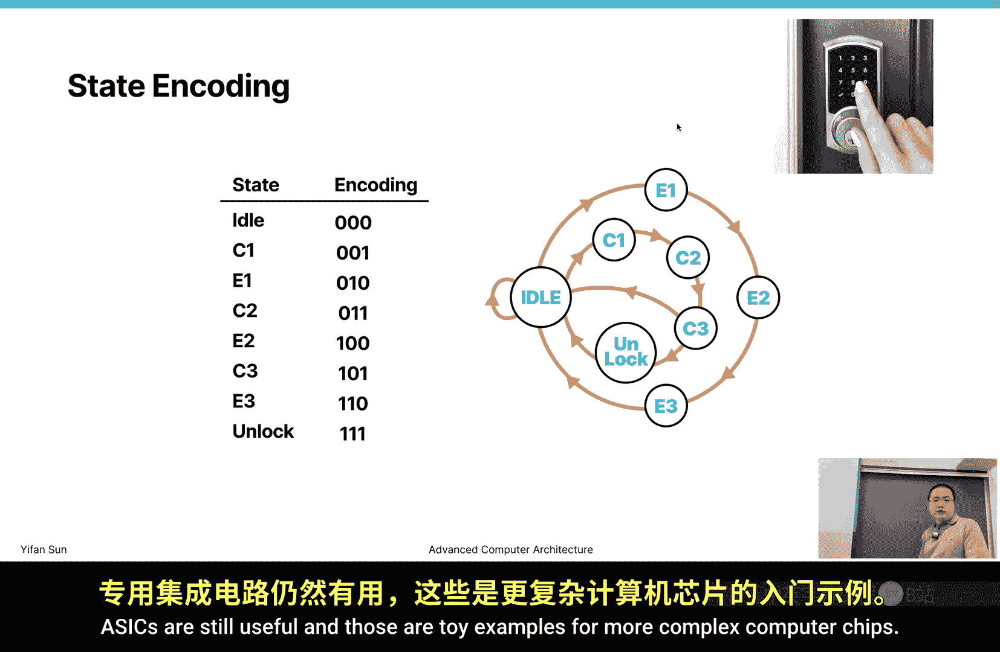

ok。So we have this encoding。Then we start to work with the state transition。な the say。

This is not my final stay transition table。But let's try to see it and see if you can understand it。

If were starting in idle case or encoding is with 00， if our input is 1。

 so I'm assuming my passcode is 123，4 okay just any passcode works。

 but let's just make it simple 1234 If it's one， we go to C1 state。

RightIf it's anything else that is not one， we go to E1 state， arrow1 state now starting in C1 state。

 if our input is 2， or state is C2 because it's correct again。Now， if it's not2， we go to E2 state。

 Now， if we start in E1， no matter what we typed any number。

 now including the chat mark and the cross mark cross sign。We go to E2 state。 similarly。

 if we're in E 2， we go to E 3， If we're in 3， we go to idol。 right那 if we're in C 2。And or input 3。

 we go to C3 state before otherwise we go to E3 state。Then in C3， if the input is 4。

 we go to Al Hoc State。 otherwise we go to idle State because the last digit was wrong。Right。

 then in the I in the。UL in the unlocked state， no matter what's the input， we go to Iol state。Okay。

 so I think this state diagram is basically a。Simple。

 it's a direct translate of this state diagram except this state diagram should have this  error from C1 to E2 C2 to E3。

ok。So any question with this design， any problem with this design。Yeah， you can。 You can。

You can try a lot of times。 you can always try a lot of times。

 and you may have some like delayed locking， but。That's two other wants for this type of device。

I'm going to see like card daughter。 okay is going to the item one。A state。C two can go to yep， so。

I think your point is any state can go to idle state if the cross sign is clicked， right？Yes。

In that case。We typically consider a reset signal like the cross sign is a reset signal when that button is clicked。

 we if we draw a state diagram， we just directly put an arrow out of nowhere just point you into the idol so that it means no matter what state even in the state that is not described in this case so it some in some particular hardware that is possible that for example。

 if you have 10 state but use4 bit to encode your state Now if you're。Something wrong。

 There's some bug with your hardware。 and eventually you are going into a state that doesn't exist。

Now， you can always use a reset signal to go back to the initial state。 So that's a reset signal。

 In that case， we typically draw an arrow into the idle state whenever that button is correct is is priced。

 But in this case， I think it's rather standalone input， right。

So that's why I didn't include that part into this table。

The problem is what is triggering the state transition？The press is， is triggering， right。

 even the unlock， like。Probably it's a sensor detecting this motor。

Is fully retract and this boat is fully retracted， then we consider is done with this unlocked state and becoming the idol state。

Does it work， then it's not ideally work because we prefer to use clock signal to control the stay transition。

Right so what's wrong with using press to detect the state transition is typically if we press a button now you feel that this button is clicked there's from zero to one transition。

 but in fact and are like like when it's contacting when two piece of metal contact each other。

 the voltage will actually flutter a lot。So how many times I don't know if you have tried this now without any detection mechanism。

 it will actually。Like， if press a button， like for every time is， if it's positive。

Then you add a counter by one。 then you can easily add to tens of thousands by just one quick press。

Right so no。No device is perfect。 So in that case， if you press one button， you may easily go。

Hundreds of cycles through this state diagram， because your clock signal is much faster than the press。

 right If you， if feel the press is a one shot， but it actually takes a small transition period。

 and compare to megaherz。Processor， Well， this， this type of processor at most runs at the megahertz level。

 Now it's already several thousand， ten0s of thousand cycles， so。That's a problem。

 We prefer to use clock signal to control this。 Now how we can use clock signal。

 That means if user didn't press anything。We should go back to the original state。 For example。

 if we add state C1 and for user didn't press any button。That means all the key， say each wire。

 let consider one wire is one button right， So all the wires are0。

 if in that case we should stay in the original state unchanged for for most of the signals。So。Well。

 I forgot this slides。 so I think if I draw this thing。

 you should be able to write this equation right now we have been talking about this for many。

 many times。I only write S2 here this one， S2， the most significant bit of the encoding。

 So if you look at it's one here， one here， one here， one here， one here， one here。

 then there are several ones there， then we can write down the equation in this way。

I think I try to simplify it a little bit， but it can be simplified a little bit more。 Now。

 this is the case this， but these are this。If we consider bottom price as day transition。

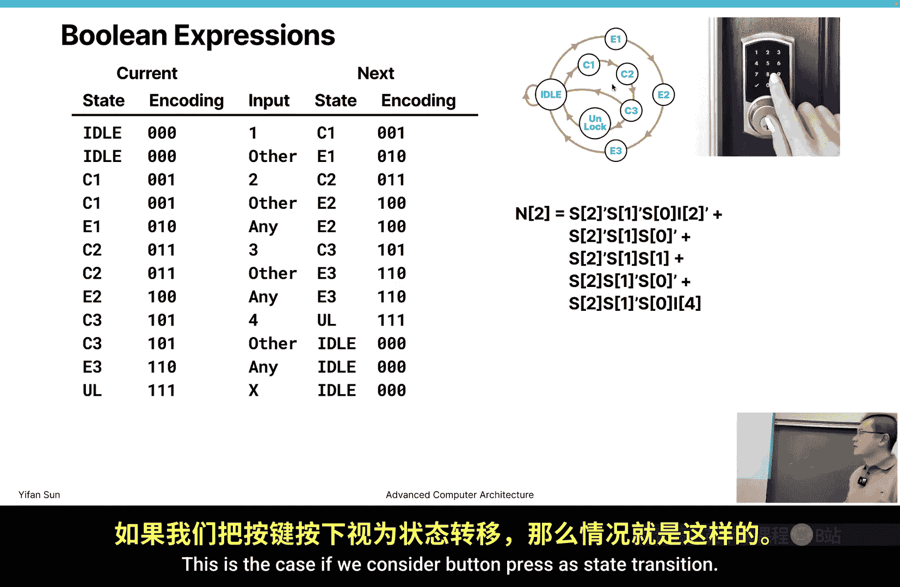

But as we said， we don't want the button to trigger state transition。

 We want clock to trigger stay transition about how to transit。

 The state diagram is really depends on。 then it depends on the input， right。

 So you can see there are， many more state。There are many more state transition entries in this table。

 For example， if we are in the idle state now or encoding is 0，0，0， and input is none。

 That means all the input wires are0。In this case， our next state is still id。

 and then the output encoding is still 000。但。The idol。Now， in this case， C 2 C1， right。

 for every state， the first entry is always。If the input。Now， I think there' is a mistake。So for C1。

 now if the input is none， we should state in C1 state。And this encoding is also wrong。 Okay。

 if we're in C C1 state， right， no button is pressed。

 we should stay in C1 state and encoding should stay in 0，0，1。去。So those事。More cases。

In this state transition diagram。Now， in this state， transition diagram， which are， this is the case。

 we， this is the。In this case， we draw all the possible cases and all the signals。人。O。

 okay with this design那。If you consider input signals other than these three bit encoding。

 we actually have。10。Digits， right， we have 10 digits。

 So there are 14 input wires to this combination logic。 Now， remember。

 when we are dealing with kernel map， we're only dealing with for input for for input possible input。

 right。In this case。Pretty much we cannot now use a kernel map。

 The only thing we can do is to write down equations。 I put a nun there。 I put a nu there。

 That means if all of them are0， then we consider this none。特别错。So in this case。

 I'm trying to write down this equation here。 let's look at it together。And in this case。

I think we're trying to write down the midter， right。 So this midterm。Thisns encoding n2。

 this one is1。 so we're trying to write down this term。 Now C1 basically this state is 0，0，1。

 which maps to as 2 prime as  one prime as 2， right。Now， in this case。We consider I2 is not pressed。

I2 is not press and none is also negative。 That means some other button is pressed。

Some other button is pressed。If you want to expand， this non signal is。As there many， many terms is。

ItsI 1， I 0 or I 1 or I 3 or I 4。 right， That's the non signal。

 It's either one of other signals are being pressed。 So we know I 2 is not pressed。

 but some other button is pressed。 In that case， we generate an output of one。 And similarly， we can。

Drry down any every midter here following the same idea。 Then this is the equation of the whole。

Stay transition diagram。 That's for the S 2 bit。 This is the S 2 bit。 Now， for S 1。

 you need to generate another equation and for S 0 for sorry， for N1。

 you need to generate another equation then for n。For N2， you need to generate another equation。

 Then eventually， you can draw a circuit to express。AndThe circuit to be designed。ok。

So this is a more concrete example to design a digital sequential logic with a。Stay diagram。ok能。

My goal is。For this type of problem， if we're limited to a few input or the relative logic。

 the logic is relatively simple， I want you to be able to。Eventually， draw the。

Digital the circuit with a register sign and the gate sign。 then to。To express the whole logic。 Okay。

 and also， you should at this moment， feel confident that。This part， even if it's difficult。

 for example。If my register， will， we have a。1000 bid register。 Now， we have a。200 input。Okay， then。

You know， in theory， you cant design this type of。Theque logic circuit that can always transit from a state to another state。

 then eventually generate the correct output。Right no matter how many input you have。

 how many bit of the state you have， eventually you can draw this type of diagram and you can draw the circuit。

 it just will take years of time， but if you use a computer。

 the computer write a program can help you， then eventually you can design this。

So how complex this type of combination logic or type this type of state diagram that we can eventually have it's basically a limited amount of state state that you consider GPU may have thousands of registers in GPU a register typically is4 byte data okay every register is actually 321 bit register okay in that case you should still like if we know the rule。

 then it can be expressed by some sort of state machine。

 then eventually we can design some very complex circuit。

RightSo that you should be confident about that。 let say the building block。

 although I don't know exactly know what's the building block of a CPU chip or GPU chip。

 but I know in theory， it can be designed。 And if I tell， if I cant describe the rules。

 how how the state transits， what's the calculation rule。

 then and a computer program can help you eventually design a circuit。

 laying out all the gates necessary。Okay， let's the go off this part of the， the。

 the lectures until this part。 eventually， you will。If you do complex research。

 you probably don't need to remember all these things。

 but only the key principles of this part and have the confidence saying， oh。

 this is something possible。 then eventually you can tell if I give you something。Some requirement。

 you can tell me， oh， this is unlikely to be possible。

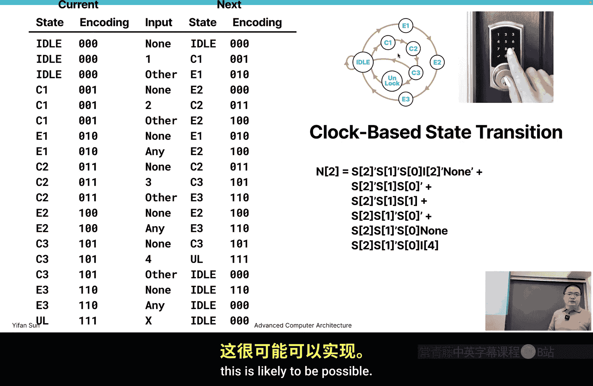

Right。Okay， so that's a stay diagram and that's actually a little more review about stay diagram。

 let's try to go the other way around if we have a circuit。Circuit diagram。

 can we derive the finite state machine？Okay， this circuit diagram。Now， this is circuit diagram。

 Eventually， I want you to draw if I have a simple stay machine， right， This is circuit。因。

So whenever you see this type of sign， this type of sign。

 they is a register and how many bits there are are there in this register since we are drawing output as 1 and S 0。

 and we have n1 and n0 as input。 we know there are2 bit output，2 bit input。 That means this register。

 there are actually two1 bit registers there， right we draw it together So it will present。

One set of state。You will see eventually in pipeline CPU design。

 this is a division of the pipeline stages。But we have this register。 Now in this register。

 S1 is directly outputting or directly connecting to the analog output。Then。

S1 and S0 are connecting back to some gates to two end gates and some inverters eventually is generate to n1 and N2。

 We have a reset reset is not that important here then we have two input a1 and a0 so choose two bit register。

 two bit memory and two bit input and one bit output that's our state machine theres something the first that you need to describe。

Then we can write down the blink expressions。Unlock equals to S1。 No problem， right。ThenN1 equals to。

S 0。A1 prime and a0。RightJust look at this gate and there's three input and there's an inverter here which is connecting a1 a0 is directly connected and trace back this circuit this this wire is eventually connecting to S0 So it's S0 a1 prime and a0 right then we can also write down as n0 with S1 prime S0 prime a1 a0 okay that is the this gate the n1 output then if it's multiple gate some n gate some or gate。

 it shouldn't be very complex if you enjoy it。Okay， so once we have this type of bullying expression。

 we just go the the other way of。Of designing a circuit。

 We have a circuit we write down blank expression， then。If we're designing something。

 we derive this brilliant expression from the choose table。 in this case， we derive the choose table。

From the expression。From the from the expression， right， then for choose table。

 we try to first lay out all the possible input。And including the current state， S1 and0。

 So don't think too much， just list all the possibilities， right。For a0 is 01，0101 for a1 is 0，01，1。

0011 and for a 0 is 40，41，4041 for S1 is a081 right those are all the possible combinations。

Now using this equation， I didn't write the S1， it's too straightforward， S1 is directly connected。

 ready to unlock， but we can write down， we can just manually calculate all the possible cases for n1 and0。

For N1 and n0， then those are the cases， right， actually， only two cases。

 N1 will get one and only one case， N1 will get N0 will get one so。If we have four things。

 if we have four elements， only one case willll get a one we have three。If I have three elements。

 and that means it must come from two four elements midterm and combine together， in this case。

 we have two ones in the table。two once in the table。 they don't。

You don't really need to calculate this at this time， just trust me。O，那。With this truth table。

 we know。These are the。Input and output， right， Those other state and state。The next state。

 then the next thing， remember， when we design a finance day machine， we need to do state encoding。

 So the next task is to do state decocode。So previously I draw 0，0， then replace we stay 0。Then01。

 we replace with state 1。just replace all the cases。Now， eventually， we'll find。

The output will only have state 0，1，2。 There's no state 3。 There should be in theory， state 3。

 but we have no state 3 at all。 That means stay 3 is a redundant state。 that is not。It's encoded。

 but not used。It's encoded， but not used， so in regular cases， we should never go to stay 3。

In that case， we can basically start to draw the state diagram， so what's the state diagram。

Starting from S3。Sorry， starting from S0 in S0， when can we go to stay 1？It's this player input。

 What's the input is basically a when a equals 3， we go from S 3 to S1。We go from S3 to S1。

Then from state  one， when we go to state 2 is basically when a equals to1。

 So when3 and1 it goes to state 2， If it's not one， we stay in as。Is that a mistake？

It should go back to S0， right？C续。どす。Well。But let's talk about that later。

 I think this arrow is something mistake right。So in S1， if in S1， and we pressed either0。one。0。

2 or three， we actually should go back to state  zero。 Let me see which one which part is wrong。Yeah。

 we go to stay 0， not stay1。So I think it's a mistake。Apoize for these。This arrow。

Thisarrow should not stay in S 1。 It should go back to S 0，It should go back to S 0， thisarrow。Okay。

 if it's one is go to S 2， then in S 2， no matter what we press or what's the input。We go to stay 0。

 We go to stay 0， right。So I think there is a question that state 3 can go to state 2， right？

But how you can get into say3。There's no way， right。If you start， if if state  zero。

 if we start with stage3， yes， and that's possible， but。啊。But then state 3 is only a transient state。

 basically。If we start with stage 3， it will go to save。0 or2 immediately。

9 will stay in this loop of 0，1，2。StateSt 0，1，2。 Itll never go back to state 3。 So stay 3。

 in this case， we consider it's a。It's basically why it goes to stay two is because some not care。

 We don't care bit。 So for the for the purpose of simplifying this circuit。

We remove some input in this case， this is something we just totally don't care。ok。

So that's why we go to， in that case， we can go to still go to state2。

But this is something doesn't matter。Remember in this case， in this particular point。

 if we force it to write zero。If we force it to write0， then this one will be a four element term。

 right？Now it's actually a mortgagegate。So in that case， it a。If we draw a kernel map is an x there。

 then we draw a circle and it can circle a1 and x together。Right。

That's why we have this actual state  three and they can translate to state two。

 and it's actually a don't care。Bat。Okay， then with the state diagram。

 we basically know what's the purpose of this。嗯。This circuit， right。

 is basically very similar to the secure door or password input circuit。 Then in this case。

 although it's still triggered by button press or by some。Input sequence。

 or you can say it's a sequence detector in that case， or password is is 3，1。Okay， if 31， we go to。

S2 and whenever in S0 we in unlock log state。Okay， it's just their definition。As zero means unlock。

Okay， any questions？To get the point of how to design a finite day machine and。Reverse it， right。

 Re it from the circuit question。 You mean S 2 is。S 1 is I no， I sorry。 not， not Well， I'm using。

 I'm， I'm reusing S 2 and S 1 here。 So this S1 is the this bit。 this， I'm saying is bit。Yeah。

 this is stay tuned， right。Yeah， don't don't consider too much about Y S1 equals to unlock this。

 whatever the circuit is， this is just a circuit design。Right。Okay。

 so we covered the stay diagram and we。Try our best to understand what this circuit is doing。ok。😊。

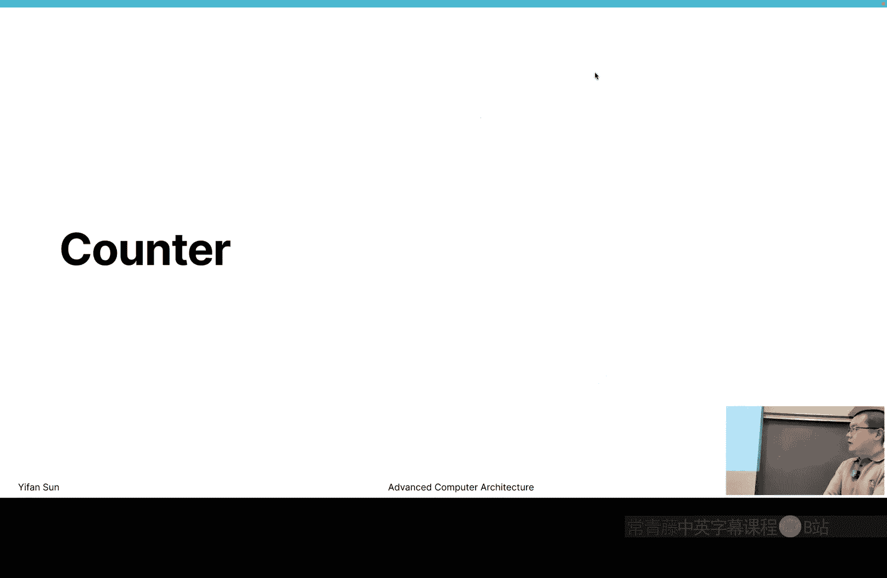

系开心。No question。So using the rest of the time we're going to introduce some commonly seen elements。

 so the most commonly seen elements in a digital circuit is a counter for example。

 in a previous state we see very common we have 012 state right state 012 and this straight 12 typically have this type of main path that go through from one state to another。

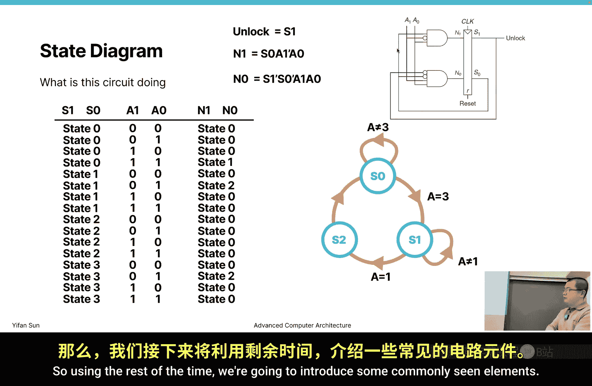

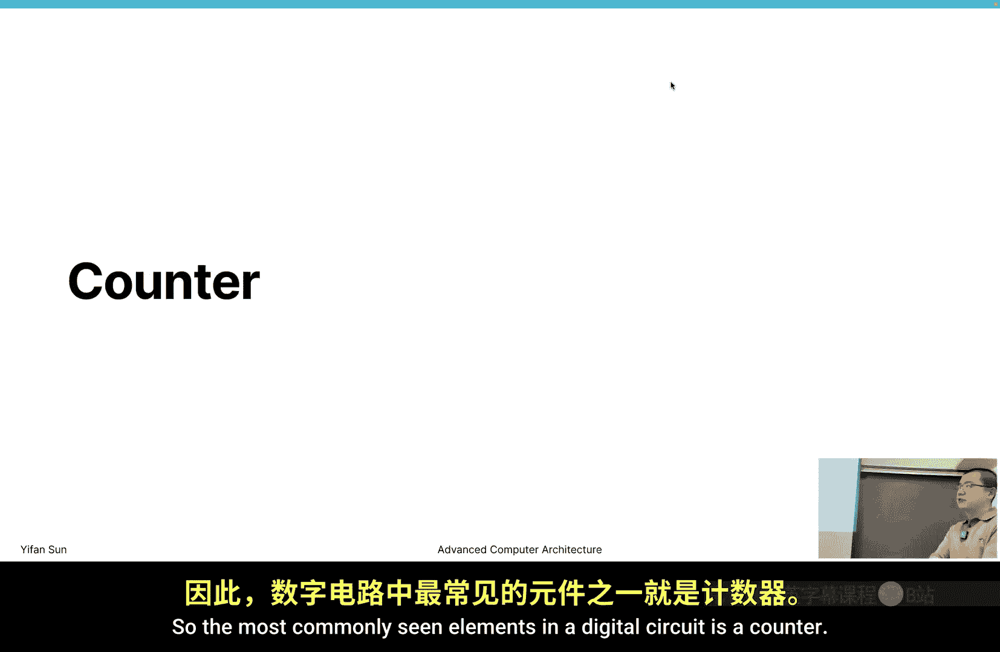

Right， in that case， can we have something that just a very common。Finance day machine。

 the circuit that's already designed so that we don't really need to design all this state again and again。

 In that case， we have a counter。 So counter is basically a very simple sequential logic circuit that has。

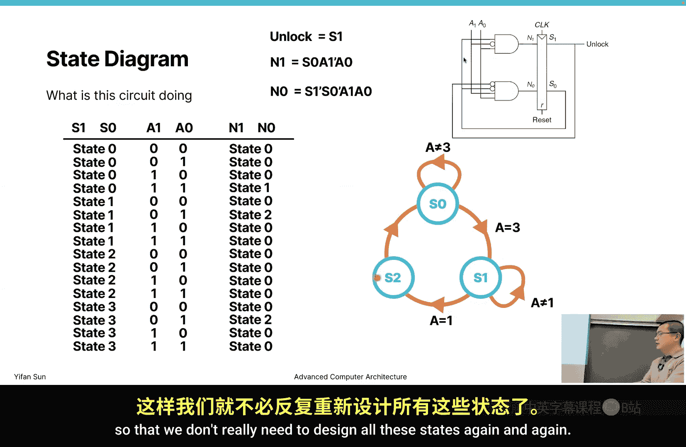

M bit register， right。 Now there's a reset reset bit。

 whenever we click reset or set fit in the reset signal， we set it reset the value that store to0。

Then there's a loop。 The output goes back to this adder。 Now we have talk about adder。

 Now this adder is a little bit special。 We only add one here。Right later on。

 we can see their use cases if we're input is not one， but basically what's going on is。

For every clockg cycle， we add value by one。 for every co cycle， we add value by one。Right。

那 eventually。You always need to consider overflow。 So if there are 4 bit， then4 bit。

 the largest value is 15。 So after 15 cycles， itll go back to 0。

The other 4 by4 fitting sas go back to0。Okay， so this is an N big counter。 Now。

 if you consider this counter as a final state machine is basically the skeleton of thiskele state machine that go back to2 n minus1。

If you have N N bit， right， it's a finite day machine。 And starting from this point。

 you can start to modify it。In a certain way that can fit your need by adding more。

Combinal logic for if， in what case， we go back to what state。

Or in what case we stay in a state for a little bit longer time。This is the counter。

Then a very common use case is a frequency divider。

 So we can say if a clock is a very high frequency， right， if a clock signal is 1 MHz。

 but if we have a LED light that we only want to it flash in a0，0，5 second on and 0，5 second off。

Right，In that case， our frequency is 1 Hz。 So how we can reduce from 1 MHz down to 1 Hz。

 Then the very common use is。We can design a 20 B counter。So what's the largest value for 20 B？

20 be two total power of 20， right？2 to the power of 20。 That's 1 M。remember，10 is 1 kilo，2。

20 is 1 Mga，30，22 power 30 is 1 gig。 So2 total power of 20 is a 20 B counter。 Then you。

 if this is a 20 bit counter， then it actually go a whole circle in every second。 not。

 not super precise。But roughly one second， right。Then we can use the highest bit that for half a second。

 for half of the。Half of the million。Clock cycles。 we have a0。 Then for the rest。 We have a clock。

 We have value 1。 In that case， if we use that bit to drive the LED， then we can have half second on。

 half second off。And so this is a frequency divider。

 Then you can reduce the frequency to any frequency you want。Then to extend this frequency divider。

 then sometimes say。If our clock signal is 1 MHtz， but we really want something like 2222 kiloHtz。

 we cannot go up。 We can only go down without counter。RightHow we can do it。

And the quick answer is we can use something called digitally controlled oscillator。

 An oscillator is something that goes up and down in a circuit， in a regular circuit。

 Like if you are using a CPU， there's typically a piece of device that is called oscillator。

 in the center of it， it's a crystal that some crystal。Has some intrinsic frequency。

 Now we amplify the signal。 then signal becomes the clockg signal so that the clockg signals are。

Generrated by some。By some。Crystal are actually super accurate， right， in that case。

That's an oscillator。 But what is a digitally controlled oscillator is。

We use a digital circuit to control the frequency to the desired value。Right in that case。

 we can produce any frequency that is smaller than the original one。So in that case。啊。

What how we can do it is basically we can use rather than one as the add value。 we can use a P value。

 right。So we can consider if we have two total the power of n。If we have P equals1。

 we basically have 2 to a power of n。 That's how many times we can divide the frequency。

 We can reduce the frequency。 Then if we have a larger P。

 we can actually tune up the frequency with a higher value of P。So let's do this calculation。

 suppose you have a 50 mehertz clock and you want to produce a 500 hertz output。Then typically。

 I can give you em bit counter or you can design it any way you want， but。嗯。In in general。

 the more bit you use， the more hardware resources it will occupy， right， then fewer fewer bits。

 that means fewer registers， fewer transistors， smaller die size。But higher bit。

 that means your granularity is smaller， right， So you're controlling how many。啊。Like。

 so your granularity is one over2 to over 24 or01 over2 to power 32。

 right You will control the granularity of your control。Now in that case。

 if you know every clock is1 over2 to the power of 32， now you can calculate this P。Dis P value by。

Comparing this， your eventual output and your。Your eventual output point and your original clockg frequency。

 right。So。This P equals to F out divided by F clock。And divided by 2 to power in。

 just put the F clock and2 to power power and on the other side。Question P represents。

The value of P is what is what you eventually put here。 So rather than add one"ch cycle。

 you add more， you add P。Right so。Consider this。 if you always add one。

 then your output frequency is original frequency divided by 2 to01。

Because you count that them many times until you can go back。 count them many times， you go back。

 right。 But if you rather than going one by one， you go。5hi by5。 if you go5 by5。

 your frequency is five times of going one by one。Right， so by in， by doing that。 So。

 so these two parts will basically say the N will drag the frequency down。

 but the P will drag the frequency up。Right， eventually， by tune these two numbers， you can。

 in theory， produce。Or approximate any frequency that is smaller than the original frequency。Okay。

 so we're basically just counting by different。Numbers。And then when I gets to the top， That's。ま最。有。

Right， so you can't count in this， in this， in this register， you add one。

 add one until you overflow。 Now you can consider that overflow。

That overflow will have the highest bit turn from 1 to0。Right， if your whole signal。

 your whole circuit is sensitive to dung edge。That is the moment that the rest of your your circuit will work at。

It's the same thing for Ab batch， it's always the time that you transit from zero to one for your highest bit。

Okay， so this is how you can control the frequency。Then we can make it even more fancy。So PWM signal。

PWM signal is a type of signal stands for pulse with modulation。And it's a very。

 very common signal used in controlling many different things。Like。For example。

The brightness of a screen， right， How it's controlled。It's basically control in this way。 So if。

 if you want darker。You just have its many screens are actually flickering， right。

 So on for a short while and all for a short while。

 because your eye cannot tell your eye only tells by brightness。So those many。

Devices are controlled by PWM signal in typically。Typically， if youll consider。

Screen that is controlled by a P W signal is not ideal， is a relatively cheap。

 inexpensive solution because the screen is flickering。

 so some sensitive eyes will feel uncomfortable。 But for most of time。

 you cannot really feel it for some。LEDs that can tune the brightness。 Now you can for some。

 you can you are actually tuning the voltage， but for some other time。

 you are actually tuning this PWM signal。Okay， then also， if you have play something like those Sir。

Those cars now follows a truck。 There's a motor that control the。

The motor that controls the the direction， the wheel direct the turn steering wheel direction。

Those are actually also controlled by PWM signal to say。50 degree duty cycle。

 a 50% duty cycle that is on for on and off for the same time。

 in that case were interpreted as going straight and if you're going down。

 it will tune turn to this direction， if you're going up it will turn to that direction。O。

 so it's very commonly used the signal in digital circuit domain。

They can control many different things。 in that case， how we can divide this。

 how we can design this type circuit。How we can design this self circuit is basically by using this type of。

C， but adding a comparator。Now， we set a three threshold duty cycle。

 This is duty cycle is 50% multi by 2200M。Right， so if our duty cycle is 50%。

 then it 2 to a power of M minus1， say if we're running at2 meherz and but or we want our frequency to be。

If originally， we're running at 1 MHz and if we want or。Final P W signal to be 1 Hz。 In that case。

 N should be 20， right，2 to a power of n should be 1 me 1 million。second。

 if our original input signal。I。Our clock signal is 1 MHz， and we want our PW signal runs at 1 Hz。

In that case。You need to know no matter what's your duty cycle， the frequency won't change。

The frequency is a fixed value。 It's only what part is one， how long is the one and how long is the0。

 but the one and0 within one period always add to the period duration。Right。

 so the only thing we're tuning is how long time is the one。 How long time is the0。 In that case。

 we have a counter， a regular counter with。Enbit， now， were tuning down the frequency。

But in that case， we also have a threshold that is the duty cycle multiplied by two to a program。

So this， yeah， this counter。Its counts the just output counted value。 Okay， it's not the highest bit。

 It's only the highest value。 So is the whole。Nbit right as a counter。 Now we have a comparator。

 then comparator。It's a computational logic， right， So it will generate either a1 or 0。

 They say if you' greater than something， we generate one。If it's smaller or equal done。

 we generate a 0。 right， That is the output of this。Comparator。

 although we haven't introduced this comparator， but from the computational logic circuit lecture。

 you should know this is the designable。 right we can design it by giving a certain input and certain output。

 Now we design this threshold， This is the threshold and this threshold is something that we can change from outside。

 Given this threshold， we can turn。Say if this， if this is 1 million， we can pass in 0。6 million。

 then that will give a 60%。Dty cycle啊PWM signal。 If we make it 0。1 million。

 now we'll give a 10% duty cycle PWM signal。Okay， then talk about this one。PW signal。

 button press detection。It's a very common case。For。

Diesel circuit design that we want to take some user input， as we said before。

 then if we're not pressing it is zerovolt， then if it's connected， fully connected。

 its two piece of metal connected， then it's wire connecting this voltage。

 then the final one is a5volt， but it will actually fluctuate a lot during this connecting period。

We want to get rid of this connecting periods。 In this case。

 we actually only want to trigger one signal going through。

The output of or button press detection logic， right， So how we can design this part。

 you can check this one。 This is a button， right。This is a button。 Then this button。

 we first connected， connect with a。Register， and this register is a super simple register。

 You can only， you can just consider it as some sort of latch that prevent it from。

Changing super quick。 then after this， after this register。

 at least it will only change at the edge of a clock cycle。Or you will not change at all， right？Now。

 in that case， we we push， we push this button here， then let's consider this gate is connected so。

After pushing down this button， then if this value is one， we actually go to this counter。

 and we have an enable signal。 That means if this enable signal is one， we start to count。

 And if this enable signal is 0， we will stay there where internal state will now count countyvalue will not change。

Now is。If it goes， if this signal goes up， we start to count， the it goes down。

 we stay at a certain value， and also we have this one。 if it goes down， we actually reset it。

We rec dynamics numbers。So see this a small circle here。

 the small circle can be either in the enable signal or can be in a resed signal。

 that means this thing is triggered by low voltage by zero。 that means in one or input is zero。

 that means we reset it。Right in this case。When this one when this signal button signal decreases from 1 to0。

 we reset it to zero。Okay， reset it to0。 So we recount again。 So the goal is basically， say。

 whenever it's up， we need to。Only consider it's being pressed down after it's being pressed for a short duration。

 half a second or like 100 millisecond or something， right。

 So then we we only only after clicking only after pressing it down for a short while。

 we consider its pressed。So that's why we need a counter here and when user release it。

 or for some reason this voltage is no longer holding， we reset the counter。

Then we pass it through to a comparator。 Then this comparator is basic threshold。 Now you can define。

 say， oh I press it 50000 cycles。 then we consider it's being really pressed down。

Or you can set whatever you want。 You can just fine tune this a value according to the latency。

 if you're sensitive to this latency or。诶。Like the， the physical property of your button used。

Right then we have this signal， the eventual signal that you consider this n signal is being going out right then also we need to guarantee this button is being pressed。

 it keep being pressed So the output signal is going down。

 So no matter just if user unless release it immediately will consider is zero right we consider is released。

 So that's why end gate is connected， it must hold say after above the threshold or is' really being pressed。

 Otherwise， it will keep being pressed even used to even if you release it。Right then。

Here it goes back to。To this one， so。You have to have this gate。So that if it's。Already pressed。

 you don't。You don't if it's already。Connected， pressed， you don't enable this counter。

 otherwise you will keep flipping up and down， flipping up and down。 if you're pressing it。

 it's always being pressed， right。So if you if you don't have this wire going back here and this gate。

 then you're keep counting， then you're actually generating a PWs signal rather than going up and stay up if you're pressing it。

Okay， so this is a counter。 And I actually， I'm only going to talk about this one。

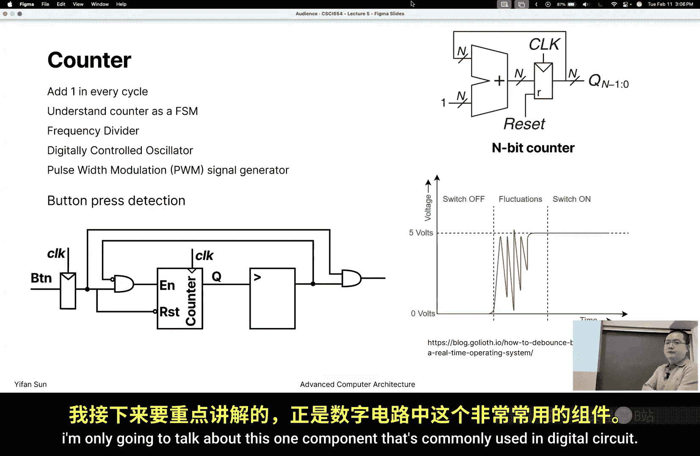

Component that commonly used in digital circuit， okay。

Then let's talk about memory arrays for the memory part and how the memory is designed。 Then。

 remember， when we talk about memory。The memory then were typically considering registers。

But we don't really always have registers to design miners。

 There are many different technologies and different technologies have advantages and disadvantages。

 But let's look at a generic design that we have an array this to our memory， right。

First we were consider memory as a register or as a state representation Now how many bys we need to represent the state。

 we probably need only a few bys。Andmost tens of bytes So tens of bits。 Now， in that case。

 if we want to stay store data for your， for your computer is several gigabytes of data。 Now。

 in that case， we cannot really use a register to to store one bit of data。

 We have to use something more compact and more general interface。

So this general interface is designed with an array that you give an address。

 right you put in an address。Then if it's a read operation， then I input address。

 I generate output of data。Then if I want to write data， we put an address and we we put an data in。

 then the data is being stored there。 So we know it's stored there next time we read it。

 we can get a correct result。That is general design of。

The memory array the memory array typically we consider have two parameters to most fundamental parameters。

 once the width one the depths depths means how many how much data。

 how many unit of data is actually being stored there then width means like for each unit。

 how large is each unit of data then if you consider for most of or data today or width is a cache line。

 a cache line or talk about cache line when you talk about cache but it's typically 64 byte or 1128 byte as one unit。

And the depths is really depends on how large your data， like4 gigabytes of data。Or something， right？

Now， this is a 1024 word and 32 B array。 That means each unit is a 32 B data。

 Then there are 1024 words。 I don't really like the words。Term a lot。

 Sometimes it can be in different things here， but you can just consider it has 1024 element of4 Bte element。

4 byte element。 So this is。A very good。嗯。GPU like part of GPU register。Each register is4 byte long。

 and there are 1000 registers and there are in this GPU in this not a GPU， but only a subco of a GPU。

Okay， GPU has many， many more registers on these things。Now let's look at the organization。

 the organization is typically in this way。 We have something called a word line。

 and we have the bit line， right If we want to read or write something first I passing the address。

 then using the address， we have to first have a decoder。 That means we only give an address。

 this address can be something like 10。 Now in that case。

 we want to light up this line to enable this line to put it to one so that we're saying。

 oh we're enabling this this cell and this cell is connecting to this bit line right this bit line。

 you can consider this bit line as some sort of。Mipxer， because we have four input and one output。

 Now we're multixing the data。But in that case， if you're design this type of thing。

 you can turn this if you're not enabled this， you can make this wire。

 this piece of wire in high resistant mode， so the data will not flow into it and not will not flow out of it。

 so it's only considered this wire is connecting to this one。Okay。

 connecting to the data in that case。Store store bit1， store bit store bit 0 and 0，10。

0 is read outside out of data 1， data 2， data1 and data 0。Okay， then so this is a bit cell。

 then B cell has a word line and a bit line and a bit that is actually storing the data。

Right so when we want to read it， we first select wordline to put a0 to1 so that this one is somehow being enabled and the data actually flows。

 the voltage flows from here to here， from z means high resistant mode to a stored value。

Now when we're in the right process， we actually first write the value we put the value we want to store here in the bit line from high resistance state。

 then we enable it So we enable this one so kind of we open the gate just。

We open the gate and then the the， the voltage can flow into or the charge can flow into the stored bit。

O。So typically， we consider two different type of implementation of a。嗯。This double array， D。

 we'll talk about DM later， DM can be much more complex than this level of introduction。But。

A very basic thing is。What you need to remember with a D is we use one transistor to represent 1 bit。

 So this transistor serve as the main part is a capacitor right capacitor hole charges on two two metal ends and。

诶。Some sort of medium is in between so the charge will now escape so it's not connected so the charge will now flow from one direction to the other so in that case the charge is holding on this capacitor if it has charge we consider it's one if there's no charge we consider is zero。

DM has some big problems that if you read the data， if you read data。

 that means theres some charge will eventually say this gate is connected。

 this transistor is connected， the charge will actually flow to the bit line。

 That means every time we read some data， we need to write it again。We need to write again。

 Every time we want to read some data， we need to write again。 That's why D Ram is so。Also。

Cacitors has one big problem， that。The charge will eventually go away。 It's not battery。

It charge will eventually go away， although at a very slow speed。

 So that means we need to keep refreshing it。 So even if we're not using this data。

 we need to keep writing into this D。 Let's waste energy。And if we're writing into this part of data。

 we cannot read， that means。Pretty much a global hiccup， right。

 The whole world styles for the D to refresh it。 There are many different ways to solve this problem。

 but it's still a refreshing is a challenge for D。So advantage of DM is， it's very compact。

 We only need one transistor。 How many transistor is a flipfl。Like， like 20 or 20 plus at least。

 right。It's a flip fl， but here we can only use one bit to store the data。Then that's your D。

 That's your memory。4 gigy memory，16 gigab above memory in your computer that's。Dearam， O。

And when you turn off your computer， D disappear。 So when you start in a fresh state。

Then another thing is Sram。So S Ram is controlled by S R large。

 if you're this is pretty much an SR large right in S R large， remember， we have a loop of of orgate。

 x no x orgate nor gate， an or gate， right， So pretty much this is a the not part of that nor gate。

So see， this is pretty much an SR large that keeps data staying here。喂。The data is flowing here。

 It's actually now flowing。 It's being。Locked here。 Now， whenever we want to read some data， we just。

Turn this on， turn this on so these side are connected so we can the data flows to B line。

RightThen how many transistor are there so remember we have two transistor for each reverter so in total we have six transistor。

 I think for s run or for register file， six transistor to record one bit is probably the most important information that you need to remember when designing circuit that basically dictates how many transistors it's the most important。

Sours of transistors in a chip。 So you're remembering the state。ok。Then typically。

 when we want to have a brief estimation of the die size。

 it's very hard to estimate the combination logic。 So we just need to remember how many bits of data that we're storing in a register file。

Right。So consider your register file like L1 cache， L2 cache。In， your computer。

 there are typically several hundred kilobys of data in the cache in the caches。

 Your caches are implemented in this type of style。 It's much faster。

 You don't need to write again when you read the data。嗯。It consumes more energy， and it。

Takes much more space。 So it's very hard to have a very large asram in your computer。

Because it's a space。Because take six registers。The register file。

 I think we can leave this part when we talk about the core architecture in the core architecture Ire going to come back here。

 so register file and how we can read multiple register files together and bank the register file there something we can talk later Let's quickly talk about this we have only three minutes time So read only memory read only memory how what is read only memory is a memory that you can only read from it。

 So the manufacturer will directly。

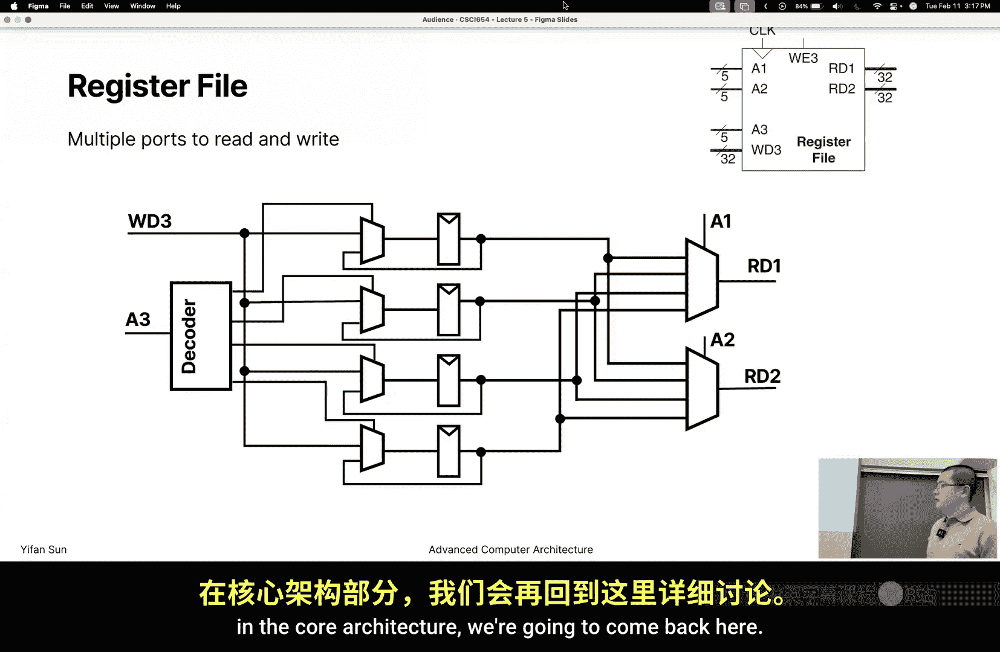

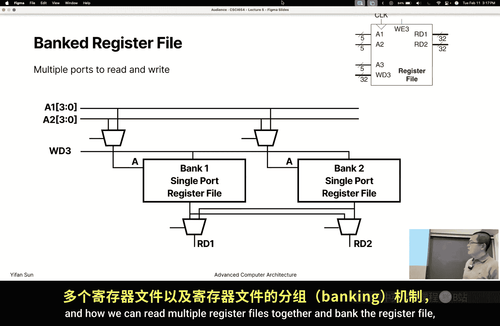

Produce it in that way。 So that explores the data。 So how this part works is you can basically consider those dots are connected。

 So if our input is 10。 So one， so， so a high voltage will come in from this port。 right。

 will come in from this port Here is connected。 So data 2 will become one， but here is not connected。

 then this data 1 is 0。 data 0 is 0。Right， second，1，0。 This line is one， right。This do is connected。

 That means high voltage can flow from here to here。But here it is not connected。

So data1 will stay at a low voltage。There's no one is pulling up its voltage。

 So data 1 will stay at 0。 Datata 0 will stay at 0。O。So1， if 1，0， if 0，1 is selected。

 this one is connected， this one is connected， this one is not connected， that means our output is 1。

1，0。0，1，0， it should。 It should be high voltage。 It's not connected。So data 0 is data。

 let's say if no one is selected。Our output are zero， right？

SoThe output of the decoder is a high voltage。 It's a high high voltage。 Yes。

 it connected it should return。And that was a Gro。Okay， this side is not ground。

 This side is not ground。 You can consider data 2 is connected to。You can consider this way data 2。

 although I'm drawing this way because it's a match。 This is data 2， right。

 is's eventually connecting to。Here。Right。I's connecting to something like this。

Sodata two is not drawing drawing drawing down。嗯。其尸。So data2 is not connecting to ground。

 so it's now pulling down。做。Just， just don't think too much。 If here is one。

 then here is a high voltage， high voltage。If it's a wire， this side is one， this side is one。Right。

 that simple。 Now， if you have a branch， this side is one。Then there's another wire is not connected。

 This side is0。 This side is0。 That's it。ok。Don't think too much about this。

 but I think we don't have time， so let's continue to talk about read only memory in the next lecture。

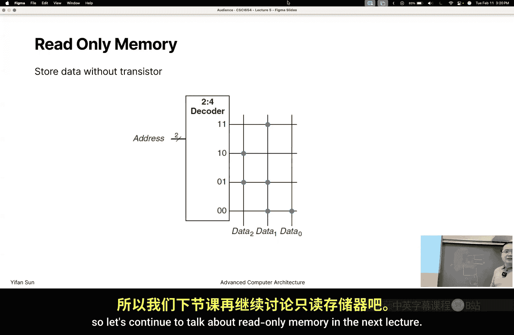

ok。