# 威廉玛丽学院【中英⚡高级计算机体系结构｜CSCI654 Spring 2025, Advanced Computer Architecture】 p06 P6 时序逻辑 3 -BV1evfwBVEUG_p6-

So last time we're talking， we're continue continuing with sequential logic， right。

Then as we are going towards sequential logic， then it's actually go a little bit beyond sequential logic。

 we're starting to consider the building blocks of a computer。 then you can say it's a sequential。

 It's combination。It's sequential or it's more towards the architecture level design of a computer。

 So those are some basic components we have talked about counter。 Then if we go forward。

 we talk more about memory arrays。 Now for memory arrays， we have。

A general design with array that has input is the address。 If we are， if we want to read it。

 the input is the address。 output is the data。 Now， if we want to write it。

 we have both address and the data as input。 and there's no output for that for that。嗯。

For right transactions then。With a memory array we have the depths of the array and width array that's the width is the how large is a unit。

 so for register files is typically four bytes for caches is typically 32 bytes or 64 byte or 128 bytes it depends on what's your granularity of reading the data depths is how large your storages you can store a lot of data or only a little bit of data depends on the die size that you can support。

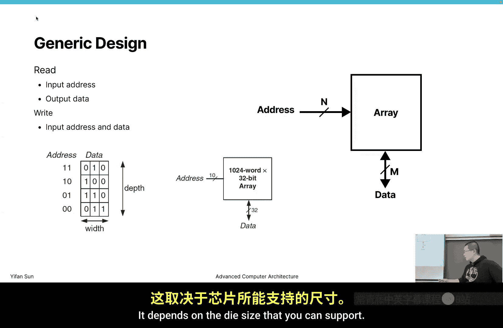

Then we talk about the organization of the design， or the organization of。generaleneral memory array。

 So we consider a memory array is listed in this way。 So we have a word line and a bit line。 Now。

 the bit line represents the number of bit line represents how many。Bit other。In one unit。

 or this is the width， right， Now the number of word word line determines the depth of this memory array。

So basically， if we have more。Bit lines。We have larger bandwidth of getting data out of this memory。

This memory array。Okay， if you consider one cycle per。Pace of data。人。After that， we talk about。

Bizz sales。What is a big cell， big cell is the。Bit cell is the circuit that stores1 bit of data。

 so we store one bit of data at a crossline of a wordline and bit line so it can store one1 bit of data when we want to read the data。

 we first set the wordline from0 to1 to enable this bit to enable this bit to be read。

 And if we set the wordline to be one is actually broadcasting to all the bit cells so all the bit cells is enabled then their data will be。

Well， their voltage will pass to the bit line。 and if we sense the bit line。

 we know what's the output if the output is zero or1 right。So for the right process。

We first set the bit line from the high resistant state to the store value， either0 or 1。

 now when we enter the word line， we actually because the voltage on the bit line is stronger than what is actually being stored there。

 then you can consider the voltages flow into the storage unit and it's being stored there although if you look at the circuit。

 we can understand this better。

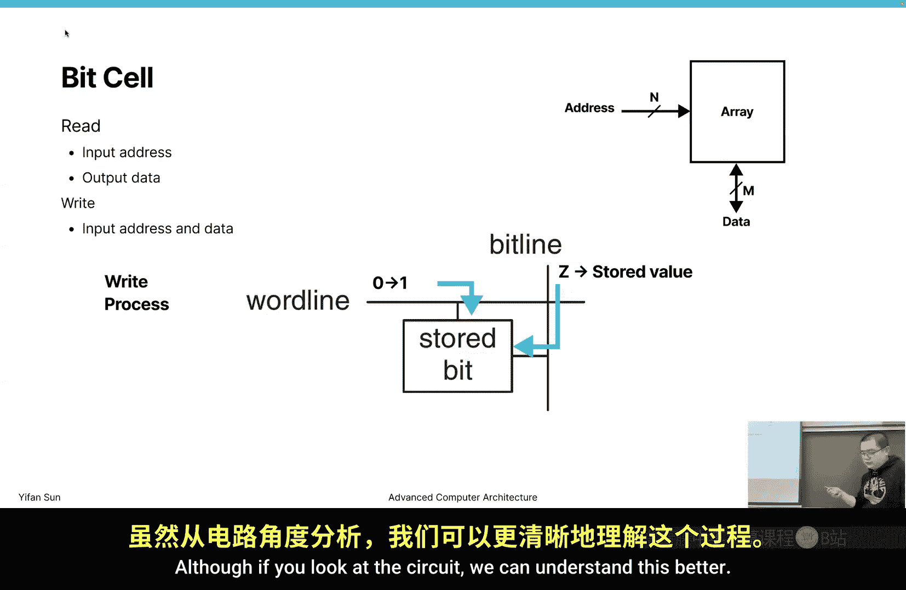

So there are different type of。Memory cells than different technology to create these cells。

 And it's always a trade off between。How fast that we can access this data and how much data that we can store and if theres a if there's a technology that can say it's the best now I guess everyone would use not have technology。

 but because they have different properties they have different advantages so at different places we use different type of technology to build build memory array。

 for example， the most common or。The largest one is Dam。 Dm stands for dynamic random access memory。

 Now， when we say random access memory， R A R A M Ram。On the other side is R OM is read only memory。

 So when we say write read random access or memory。

 especially the access part means we can both read and write data。

 read only means we only read the data right access memory means we both read and write data Now what is random access memory means we can read wherever we want。

 There is no order right So what is the the other side of random。A memory。

What is the example of a memory that is not random。嗯。这六。0ro呃。Or sequential。あ。

What is a sequential memory， Any example。Tpe yes， so tape is definitely one of the most important sequential memory。

 so it's a memory that you very likely you read only towards one direction if in theory you can jump to another location but it will take a very。

 very long time if you don't read in a sequential way。Okay， so tape is very good for backup。

 but it's not very good for random access。 Now here， the dynamic is on this other side。

 dynamic is on the other side of static。 as later on， we will see static dynamic means。

The data will disappear if we don't keep writing into the。Into the stored bit， the bit cell。

 So as you can see from this circuit is as simple as a capacitor。

Capacitor and one transistor and one capacitor and one transistor can actually be implemented with one transistor。

Then， so when storing one， the capacitor is simply storing。Storing charge on this side。

 On the other side， is always negative charge on this side is the positive charge。 Okay。

 so then if we look at this。And then today we have more time to look at this circuit and try to understand how it works。

 It's basically a transistor， right remember when we talk about transistor transistor kind of works as a switch。

 So if its one if the wordline is one that means this part of circuit is connected if it's zero that means this part of circuit is not connected。

 So when wordline is zero that means it's not connected。

 the data stores there and it's not going anywhere。Right。

 then when where line becomes one is connected， then the charge will flow。

 Let's consider if the bid line is。Has no。嗯。Like no strong voltage to read or write。

 Then you will actually have the data。 The charge is flowing outside out of this orbit bit， right。

 Now since there's a charge that's flowing outside this。Flowing out of this。Capacitor， now we have。

 we can have an amplifier at the end。 Then we can sense if there's a current or not。

 if there's a current， then we know it's one。 If there's no current， we think it's 0。

 that's how it works。Now， as you can， you may realize this is the capacitor reading the data。

It's destroying the data， right， so that means。For every read。Right after the read。

 we have to write the same data again into it。Now， to write the data。

 that means we first set the bit line to。A higher voltage。or lower voltage。

 Now if it's higher voltage， then we set the word line to one， then this one is connected。

 this transistor is connected， then the high voltage will charge the capacitor to set it to one right Now if the bid line has no high voltage and is draining the charge。

 then even it charged a little bit initial data。 the data will drain from here。

 then it will become zero。 Okay， that's how we read one and0 in this case。

And another problem with this capacitor based design is。

Chargges on the capacitor will always lose by on its own。 It's not a battery。

 so will lose charge pretty quick。 and actually there are not a lot of charge under there。

 So they want to save energy because every time you read the data。

 you don't want a huge current that goes through this wire。

 right you only need the smallest possible charge to go through this wire。

 So they want to save energy so they want to reduce the charge that is stored there。

So there's always a tradeoff， the fewer charges that is available on the capacitor。

 the more energy saving， but it's more likely that you will lose some data。

So you need to refresh more more often， so it may end up wasting more energy。But on the other side。

 if you put a lot of charge on here， on one side， you probably increase the die size on the other side。

 you may actually waste more energy。You may actually waste more energy。

When reading or writing the data， so。In theory， for this type of D。

 you need to refresh it every a few hundreds。A few， no it's is shorter than that。

 it's a a few hundred millisecond to my a few hundred microcond to millisecond level。

 You need to refresh it。 So refresh is pretty quick。 and it can be done rather in a。

In a rather parallel way， so we can。It's basically right。 Then you really write the data in then。

You write the data into this stored bit， then it's refreshed the charges getting back to original value。

Okay and by the time when you are doing this type of refreshing。

 you cannot really read the data or write the data， but typically in your D。

 I don't know if you have seen the DR that is available on the market that is for the PCIE board。

Not really a p but for your motherboard you plug into the motherboard that have D there are actually many chips on it。

 right， so they are typically often carefully scheduled so that one chip is refreshing。

 the other chip is not refreshing， so other part of calculation can somehow continue going on。

To prevent a global hiccup that like if it's really having some heat hop hiccup。

 even you move your mouth， you may feel that it's actually not moving。

So its if you click something sometimes it will not respond to your your user interaction。

 which is not tolerable for a computer system。So this Dm。

 and later on we'll have dedicated lectures for DM is very complex and iss much more complex than this。

There are many different ways to make it read and write data fast。 So we'll talk about that later。

 but for the other type of memory is SR。 then SR stands for static read random access memory。

So if you consider this one。The bit sell here。We say， this is a source list。Be so。

 so it's not connecting to any power。 It's not connecting to power。 It's only holding charges， right。

So is VCC， the power source，5 world world。It really depends on what your specification。

12 W or just 2。5 W is actually not connecting to here， not directly providing energy to this。

 It's not holding that charge there。 So it's sourceless。嗯。呃别小。But if you look at here。

How a inverter is implemented。Remember how inverter is implemented。系咪。Go here。So if this is the VCC。

 if it this5vol， right， so we have a。1 transistor， and another transistor。

And they are both connecting to the input， and this side is connecting to the output。

 And here' is ground。 There's zerovolt。 and this is5volt。 right， So this is how an inverter is built。

 Now here we only need two inverters to connect to each other。So this type of design。

 this type of cell， has sources directly connecting it， because the source。

 the power source is directly connecting it to it， it actually will hold this value forever。

it will now lose charge。Because the power， if it's loose charge here。

 the power will give it a little bit more。So you will not lose charge， the data will stay there。

 so you don't need to refresh it。That's why we call it static。

It's always the same value until unless you read or write the data。ok。

Then remember when we talk about SR Latch。SR large are designed with a2 X or gate， right。

Quickly draw remember， help you remember SR La。 S R Lach works in this way。It's another X。

 not X work gate， nor gate。Then which side is S， this is S， this is R。

 this is Q and this Q bar Q prime or  Q bar， right， this is S R large。So S R large are basically。

 remember。If both S and R are 0。If s， if r is0， then s is 0， so。

That means this or gate will not consider the value from S IR。Right。In this case。if。S is 0。

 This is an orgate， right。就。An orgate。你识。If this is S， this is Q， right。We know S equals to 0。能。

We we write this as O okay。If s is 0。O， well always equals to Q。Right。This is or gate， if s equals 0。

All will always equal to Q。1 Q is1， always one。 When Q is 0， as is 0。Right， so。

That means when S and R are both zero， that means in this case， the word line is not selected。

 Its not connecting to anything。 So they have no voltage in that case。Its equivalent to this。ok。

when s and r are both0，It's equivalent This SR Latch is equivalent to this one。Okay， so that is。

You know， at our large will hold the data forever。 the data will stay there。

 So when these two transistors on the others on the border line are not connected。雷儿。

It's pretty much an Sr lectureer。 So the data was stated。咩。So if we have the word line。

If we have the word long enabled， then these circuits are connected。In that case。

 you can consider the S and R and Q and Q prime are actually being reused by the bit line。

 so the bit line can be boost the input。The input lines and output lines often Sr large。Okay。

 so it really depends on the， if you are writing into it or reading it into it。

 is's the power that is good enough to drive this。These transistors。

 So let's say if we already have a bit line that has this， this one。

 that I is 0 and there's a power worth driving it。 Now， when we enable the bit line。

 they are more like the S and R side。 So theyre writing into the。嗯，latch。Okay。

 then the data will stay there Now if the bit line and the negative bit line is not connecting to source and its connect to a sensor that sends the the voltage。

 then theyre more like Q and Q prime output。Okay， that's really some low level physics or like electrical engineering design to determine why it's positive or active for computer architecture。

I think the most important lesson learned here is for this type of memory array。

 we only need six transistors to store one bit of data。Okay。

 so six transistors means it's six times more dieide compared to D。But at the advantages。

 we can read the data and write data much faster。 If this is a small array。

 we can read and write data in one cycle。Or two cycles。 No problem。Okay。

 so that's why for most of computers， I'm pretty much sure all of you have heard of。L1 cache。

 L2 cache， right， So L1 cache and L2 caches are。Most likely implemented by Ara。Then D。

 thats 16 gigabys of memory on my MacBook Pro sur2m gigabytes or 8 gigabytes knows our Dm。O。So。

I can also provide you a data。 Have you heard of Creus Company。

So cerebraus is a company that produce a chip called wafer scale chip。Still remember。

 what is a wafer。wafer is a single piece of silicon， right。 so as much as  sixteen or 20。嗯。Inches。

 so how large is。Basically， slightly smaller than the MacBook Pro screen。 right。

 It's a basically one。诶。This is 14"， right。就。Its shape is different。

 so probably basically the same size as our MacBook Pro screen。嗯。This is 야， this is a。Diagno size。

 and that's a diameter， diameter。 And there are some， some parts that it needs to be trimmed off。

 So basically same size as a screen。So they sell the whole wafer as one product， as one chip。Right。

So how how large is a。The largest chip， remember we say。Its basically for Nvi GP，800。

Mimeter square is the largest one。But this one is probably like tens of times。

 not really 100 times larger than this one， but can hold at least 40，80。These type of chips。 Now。

 how large is the memory on a wafer scale chip。And I can tell you， on Waer scale chip。

 they only use asraM。They only use as Ram none。In their second generation。

 the exercise is they have 80 gigs of am。ok。So for Nvidia。H100 holars their memory。

Then basically there are two versions， one is 40 I don't know H 100 has if H 100 has 40 gigabtes。

 but a 100 has two version， 40 gigabytes and 80 gigabytes。ok。This is D。

And that's the size comparison between asram and the D and I also。Don't get the confusion here。

 This 80 gigy of D Ram is not on this 800 of millim square。 Okay， so on a GPU， when you buy a GPU。

 you typically see something。Like this， right， This is a card。They're yourself。Fen。Right and PC Ie。

Conor， right， it's a typical GPU。 Now， if you take out， if you take off the shell and take off the。

Take off the shell and the fun。 You will see a PCB。 Then there are a lot of like capacitors。

 resistors on it， right， So you will see the largest thing here is the chip。 The 800 mm square chip。

 Now you will see many things。On the side。You see something like this or two sides or four sides。

 those are Dorem。O。So but still the size the。The scale of this H100 media GPU is much smaller than this one。

 but because as Ram， they definitely want larger memory， but they cannot。They cannot。

 They can only hold 80 Gabytes of asram on a whole wafer。No for。L1 caches for GPU is typically only。

Hundreds of kilobytes， not even megabyte size to O2 cache is several megabytes size。 So for S RamM。

I don't see anything can go to gigabyte level today。It's a comparison between Ara and Dm。

 and also asra spent much more energy than Dorm。But the advantage is is way faster， right。

 So for when we talk about cash， we always have this type of understanding。

For typical CPU understanding。is。L1 cash。How many cycles we need to access Let's start from register。

Register is part of the core。 The register typically we consider as one cycle。ok。L1 cash。

For CPU understanding， none。For GPU it' totally different style。

 Now we typically consider it smaller than five cycles。ok。Now for L2 cache， L2 cache is also as Ram。

 larger but。Needs more memory transfer， like。Data transfer on a network。We typically consider it as。

Tens of seconds， Tens of cycles。ok。20 cycles，40 cycles。 that's reasonable。 So general understanding。

 Then we go to。Or three or Dam。When you write something like。A equals C plus。C plus B O。

When you write this type of line in your C or C plus fast code。

 what is actually happening is you're loading one piece of data from DRAM。

You're loading another piece of data from Dam。 You're writing into the Dm。ok。The read。

 read and write， and。And add operation here。So how many cycles is a Dm。

 We typically consider it as several hundreds of cycles。If it's 1000， its。It's still reasonable。

Okay its a long latency， not probably not very well designed system or highly congeed system。

 but thousands cycles is not super strange。Now， if you go to hard drive。

Or to another machine that is typically thousands。Or。Tens of thousands cycles is also reasonable。O。

 so you can see。If we use 100 cycle。To go to a Dm，100 cycle to go to a dim。

A 100 cycle to ride back and to only spend one cycle。In the ad operation。So what's a utilization。

Yeses。00。3% utilization， which is terribly bad。 So that's why we cannot。

We cannot really only rely on D as the memory。 we have to have asra， but asra is too small。

 We cannot have gigabytes of size of asra。 So that's why。We find a trade off。

 We find we put more likely to access data in Sram than we put less likely to write data in D。

 So it's a tradeoff between。Latency and。탑 봤스틱。Okay， so that's why there's no。Good， single。

 good technology to solve a memory problem。And still。

 the memory access latency is still a big problem for today's computer。

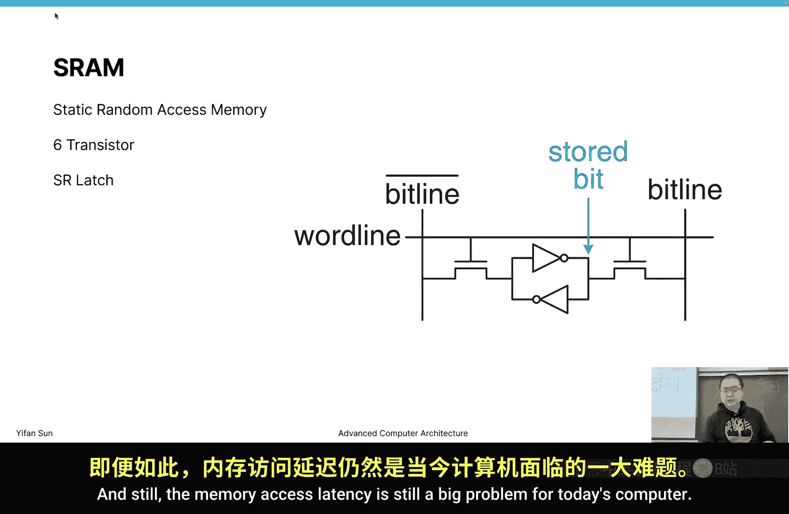

Then we talk about register file， and the register file is more likely to be part of the core design。

The register file we not only starting to talk about capacity and。Capacity and latency。

We start to consider parallelism。Or concurrency。 So we cannot only read one piece of data。

From register file， we wanted to provide data as soon as possible。

And so that multiple reasons and write can happen at the same time。So for example。

 this register file has multiple ports for read and write。How many pours for read？

There are two read port。 right， So a1 is。Connecting to RD1。And address 2 A2 is connecting to RD2。系。

A1 is connecting if a1 has a one input， RD1 will get the output next cycle。Now a2 and R D2。

 Now a3 is for right。 Now we can write the data。 then this we put the WD3 on this side so that we can so you can consider everything on this side is input。

 Everything on this side is writeput right we put in input then a3 and write 3。

 Then we write the data into this register file。So we have this register file， and we have this。

To input。And one out two read port and one R port。why we deny in this way and why we need。

2 read and one write。Is that reasonable？Combination。能。然后要。人。You basicallyically write。

 you read more than you write。 Consider for most of the instructions for your computer。

 it's more like you do some subtract。Subtract， multiplication division。 in this case。

 you need two input and one output。 right In this case。

 you can complete the whole thing within one cycle。我都 actually。When we talk about pipeline exion， we。

The cycle， the in one cycle， we probably were writing something from before， from the previous。

From previous instructions now later on， when we read the data we read for a later instruction and it will pass a few stages to calculate result and then the result will go back to the right stage and then we'll write the data into the into the register file is a later time。

 but overall we want a two to one ritual for read that right the typical consideration。

For register file design。 So it's really， this is how a micro architectureure design。

 So micro architectureure determines how or circuits are designed。 Now。

 when we say architecture or instruction set architecture。

It depends on what your instructions look like if most of our instructions are looked like this way。

We have。To read， to， to read on one right。 But most of。

 if most of our instructions say we have a car bit right for a comparison。

Well comparison is probably okay， for some instructions we have two in two out。

 in that case it's better to design reservoir with two right port。Okay。

 so this is how the instruction set may determine the micro architecture design。

 Although even if you have this type of design， can you support a two in two out。Architecture， yes。

 it's just a performance issue。 Right， There's always high end chips and low end chips and energy like some。

costs the lower energy， but takes longer time to exclude。 It's always a trade off。So。

The question is how this type of multi。Bankked register file are designed。

 Multiport register file are designed。 So we here we introduce three different designs。

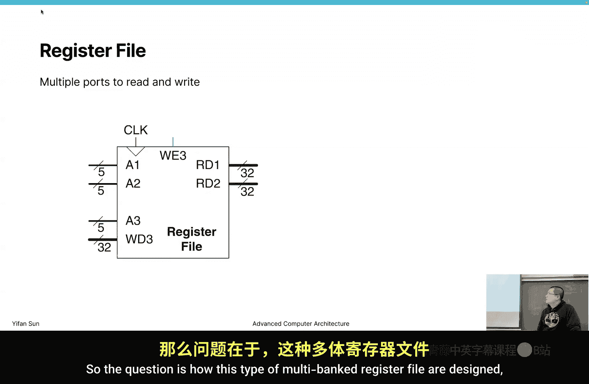

Then when we're dealing with register files， we typically want it to be as fast as possible and dieize is not our first priority in this case。

We can select to use flip flos。Now remember， when you say flip flos is 20 per 20 plus20 something transistors。

 right。D Ram is one transistor per bit。 S RamM is 6 transistor per bit。

 Fflop is about 20 transistor per flip。Per bit。 So we use a flip flop here。 So in this case。

 we have three flip flops。Se are four flip flops to store4 bit of data。

Then it just if you want to have larger stories， just provide more flip flos there， right。For input。

 the address is directly connect to a decoder， as we introduced in the general design。

Of a memory array。 we connect to a decoder， so。Part of the， part of the。诶。This part will light up。

 right。So， if we're selecting。This serves as the wordline， so this serves as wordline。

 so this one will light up this one。Okay， this is right， right part。 Let's look at real part first。

So this one， this register will always generating data。

 We're always generating data to here to the output。

 and a1 is selecting the generated data from all four register then will。

It's just one of them will be connected routed to RD1。Then in the at the same time。

 some one other line or even the same line can be connected to RD2 in a case we can read the same register twice within the same cycle。

 its totally possible。

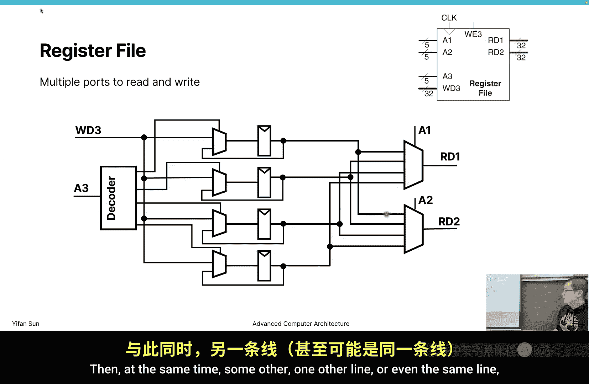

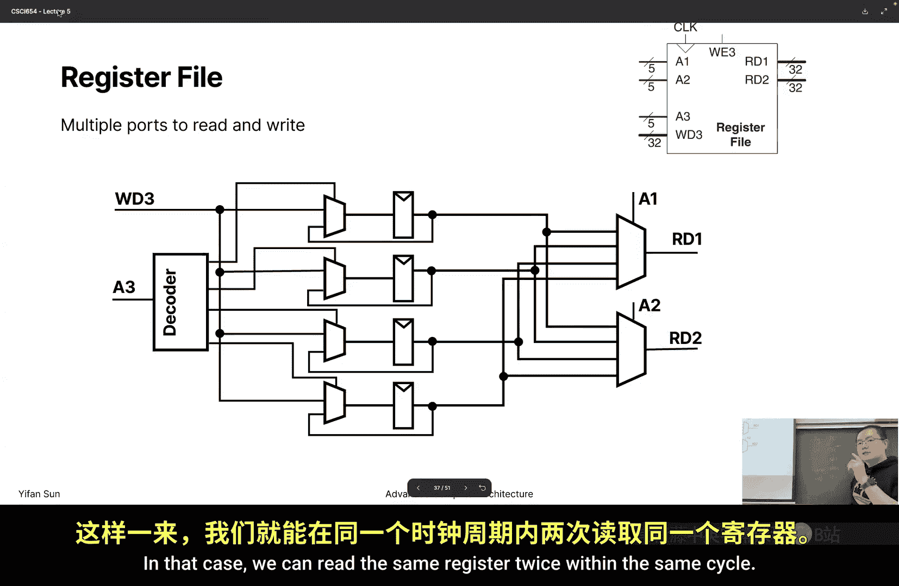

Okay， so basically， the read part is connected with is。Its selected by a multiplexer。

 It's basically where just consider we want to directly connect the flip flops or registers to the output。

But do we need to， since we only have one output line， but we have so many register lines。

 so we have to use a multiple actor to select which one is the one we want to use。Okay。

 so same thing with a2。 Now on the other side， we have the right logic。

 then the right logic is basically the right。The right channel is。

The right channel is always connected to here， right to a multiplexer。

Or let's let's's start from here and say if we don't want to write it。

 What happens is basically the next cycle with the data will stay the same。 So we want to loop back。

 So in the next cycle， the data loop back。 So we're writing the same data back to the register。

Actually， since the transistors are not flipping， were not actually not spending a lot of energy to keep the data being stored in this register。

 but if we want to write the data here we have a selector we have a selector。We select say。

 do we want to use the right data or the original data。Now if we want to， if this is one。

 we use the right data， then this one， the right data goes into the register。

 otherwise the original data goes to the register。It's only enabled。

 the right data is only enabled when we when we want to write something right。

 if it's say we can have something like a right enable bit。 So when this right enable is not enabled。

We keep the data the same， we don't do anything。Okay， the circuit is a little bit complex。

 but you can just parse the three part， the read read logic， the store logic。

 right the look back is the store logic and the right logic。う。ok。This is one way。

 So for CPU register file implement in this way is generally okay。 We dont。

 We're not that short in register。We're not that short in die size。

 and we really want extreme low latency to read registers。

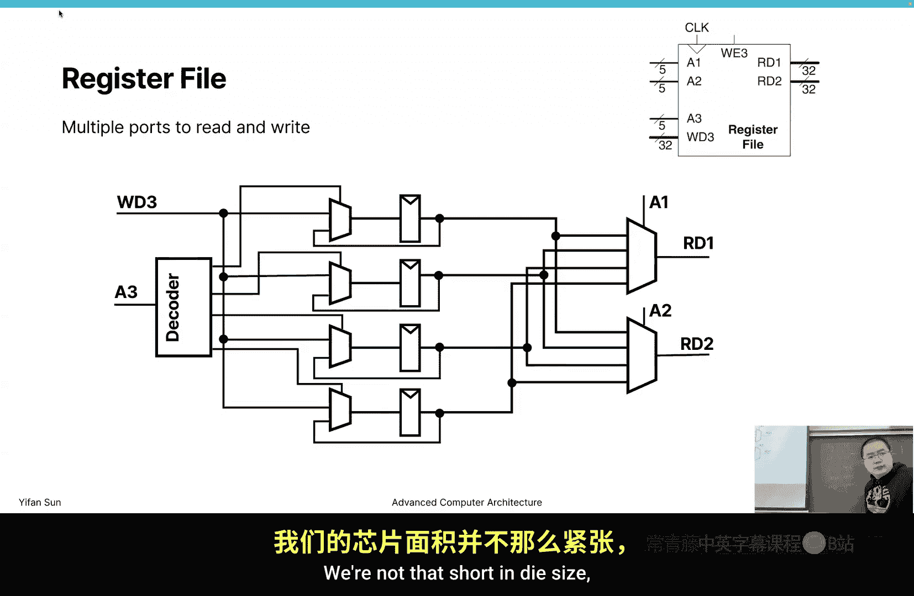

And for GPUs， when our data is a lot。We have a lot of register。The dieside is scarce resources。

 It limited。 So we don't want to use flip flops。 We still want to use。嗯。We still want to use asram。

So in this case， just consider this one as a asra  60 unit， okay？In this case， we do this。

We have multiple word lines and multiple read and write lines。 Okay， these are bid lines。

 Those are word lines。 those are address input。 Now we have first have decoder and decoder are connected to these lines。

 Just consider it's almost three independent。Iput and outputpost logic。Okay。

 so almost the three independent rain and output logic。 And when this one is。

When this one is generating data， then we。Go through some gate。

 So if this one is selected and then it goes onto the this wire。

 and if this one is selected go through this wire。 So in theory here。

 we're basically using an end gate to serve as a multiplexer to go to the read wire。

Now on the right wire， it goes back to here。能。We don't have the low back。 Just consider low back is。

I's built into a register， okay。So this is another way to design a registered file。

 save some space then。 in general， is still okay。

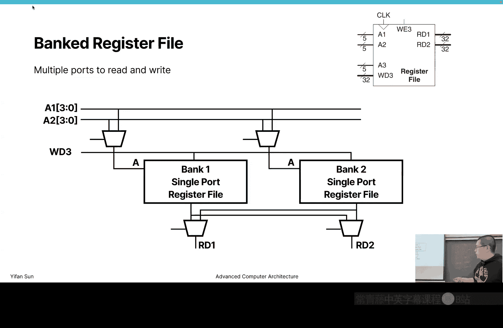

Then， even this type of design sometimes is too much for GPUus。

So we're just using this as an intermediate step to go to our final step now in actual GPUs。

 how how the register file is implemented， is implemented in a bank style。

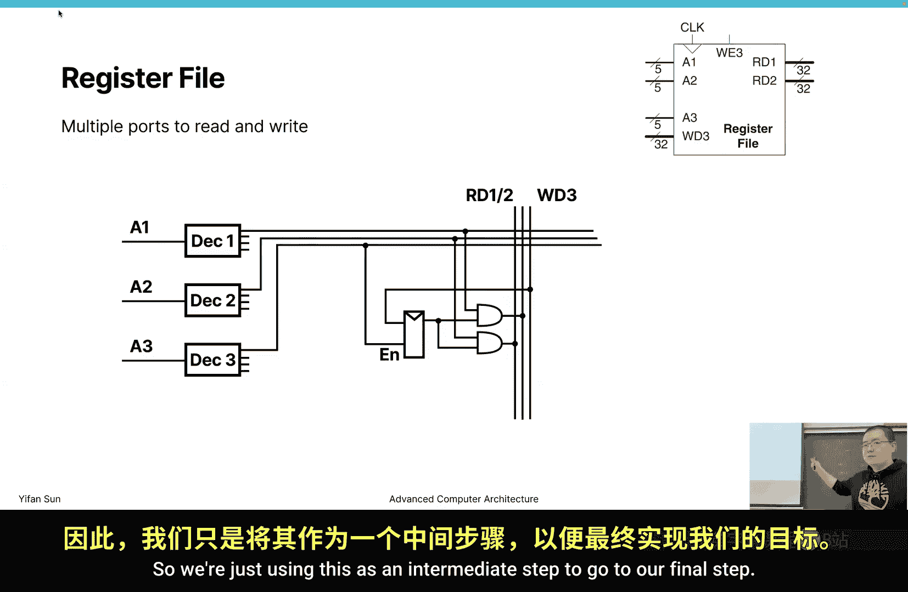

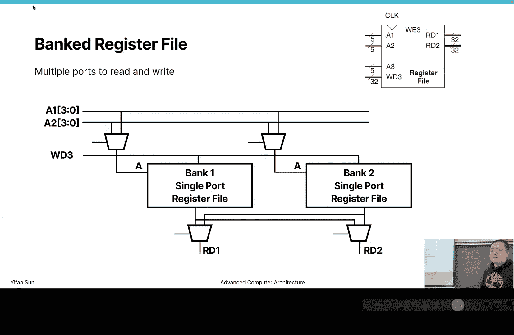

So they cannot really have so many wires。So many wires and I go through every cell。

 It's a lot of wires。 So instead， they find some trade off。

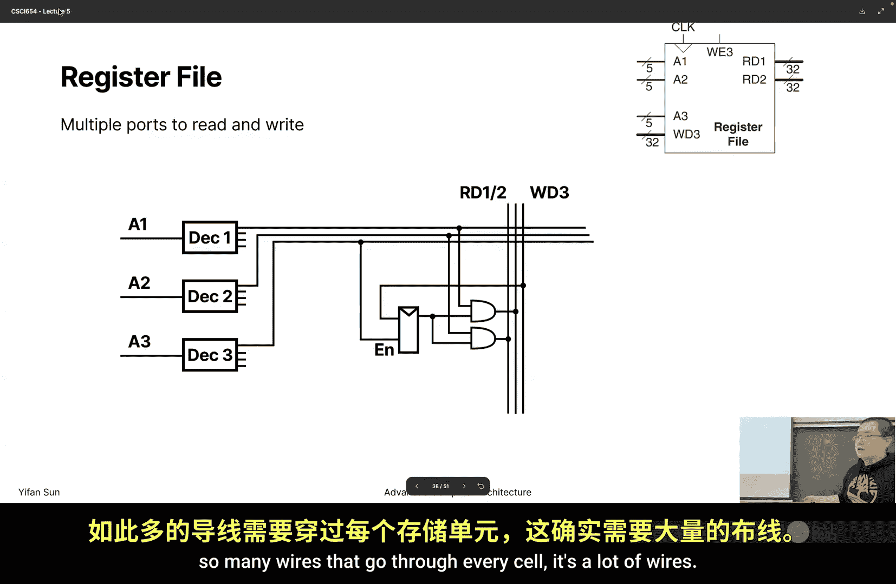

What they do is they do something like this。So they have bunks。

This bunks is a single port register file， now you can either read or write into it into a bankk。

Okay， so but we can have multiple banks。We have multiple banks。Then， basically。

 when we want to read it。 So if we want to have a address， we want to read it， we can either say。

 okay， shall we enable this bank to read one register。 Now if we read the register。

 we go through this multiplexer and。Output the data from this。RD one line， right。

 Now if this one is selected， then we read another register， then it goes to R D 2 line。Okay。

 but there's a cross line here。 So because some data that we want to read from bank 2。

 but we actually want to read through R D1 line and sometimes we want to read data from。From here。

 But we want to read data actually from this port。 So what is actually。

In this right bank 1 and what is actually in bank 2， you can consider in this way。

For most of the hardware design。We will write say register zero。We go to bank 0。Okay。

 now register one， we go to bank one。And let's just say two bank system Register two will go to bank zero again。

Now register three will go to Bank one and so on。So this is a very common style in complete architecture。

 and this is called interling。Interl。 So in inter living， now we try to。

Use a round Robbin style0 our0 go there are 1 R 2， R 3 r4 R5 in this way。

 we evenly distribute registers to this two register file。

So why we want to use this type of inter living because more likely we are going to do something like。

而。1 equals r 1 plus r 0。 So these two registers are likely to come from。Two different register banks。

And for most of GPUs， two banks are too small， like they have four or eight banks or even more。ok。

你你 can have。Many， many different banks。 it's really a parameter。 the more die size。

 the more bank you have。Then in an extreme case。Consider this one。

If you consider each register has its own bug。This is the design。In this design。

 each register has its own bank so we can read and write them。At the same time。ok。就 because。

Because this wire is directly connected to each register。But in this case。Then indeed， I cannot。

 I don't have。If we only have one port。Now， in。If we only have one port。

That means we only have one bank。

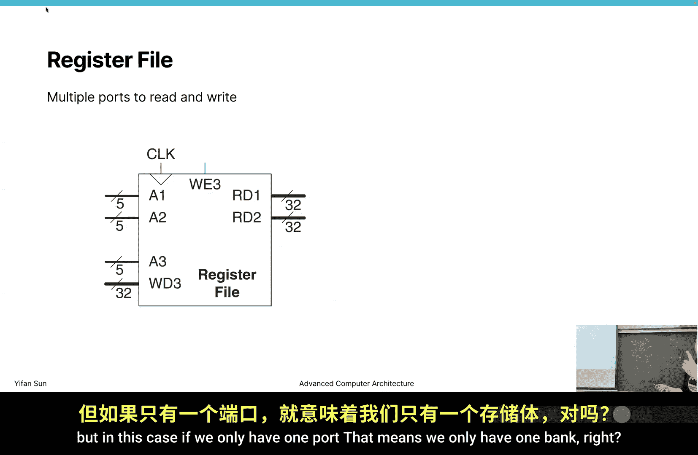

Right so there's two extreme roomss。In this case， we have two banks， as you can see。

 the wires doesn't really need to go through all the cells， it only needs to connect to this bank。

Then this bank will eventually select one piece of data as the output。

 then this data will be routed through this multiplexer as the output。

So if we want to read something like R 0 and R 1 in one cycle， yes。

 it's totally possible like we can have this。A1 to read r 0 and a2 to read R1。

 and they can output in the same cycle。But if we write something like。Sa R 1 equals to R 3 plus R。

five。Okay， if we have R3 plus R5， because R3 and R5 are actually coming from one bank。Right。

 they come from this bank， if they come from the same bank， this bank is a single port bank。

 it's a single port register file， so it can only support read and write a single register at one time。

So in this case that is the term called means we can exclude something in parallel。

 but for some constraints we have to exclude one after another and this is the term for serialize in this case we have to serialize these two read and it takes two cycles to read these two registers。

Okay， then it really requires this simple circuit which multipls or cannot really handle this case。

 it requires more complex cases。But with sequential design， since we learned the finance day machine。

I'm pretty much sure if you spent some time。Probably a day or two。

 Then you can draw that type of circuit out， So don't consider too much detail。 Just consider， oh。

 that's something possible。ok。So here， this is more like what happens in a GPU that if you read if you're lucky you can get the register within one cycle。

 if you're not lucky you may take two cycles to get your registers now it really depends on what registers you are reading so if you're reading two registers that are actually coming from same bank and your read have to be serialized。

 this is a terminology called bank conflict。

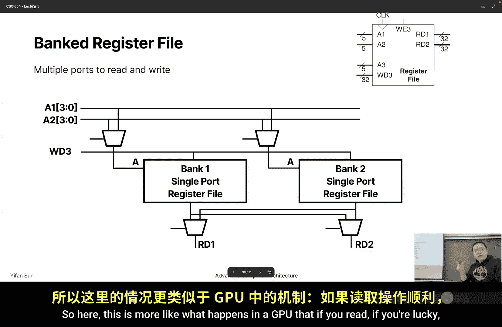

Right because youre， you have a conflict in a bank you that want to read。 You have。

 the bank cannot serve two transactions at the same time。

 It have to wait a little bit to get another。To get another transaction， register read completed。

So it's a really design trade off。 If you want to high， have high performance。

 you want to have more banks if you don't want， if you care more about the die size。

You should have more bankss。You should have fewer banks now， if you care about performance。

 you have more banks now to one extreme。

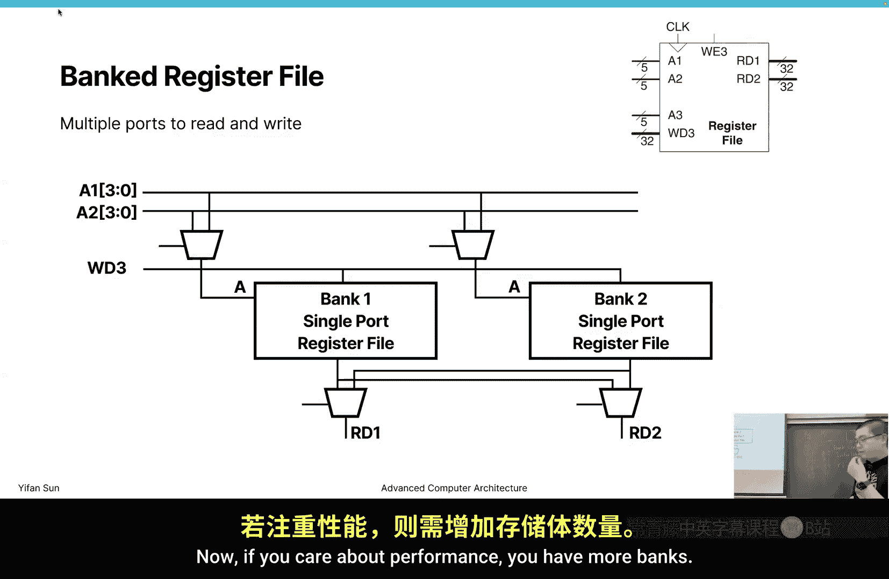

You can design something like this。 And this is。Like per register。One register， one bank， right。

So all concurrent to read and write。The best type of design。But definitely more。More dies。

 more wires and more transistors。

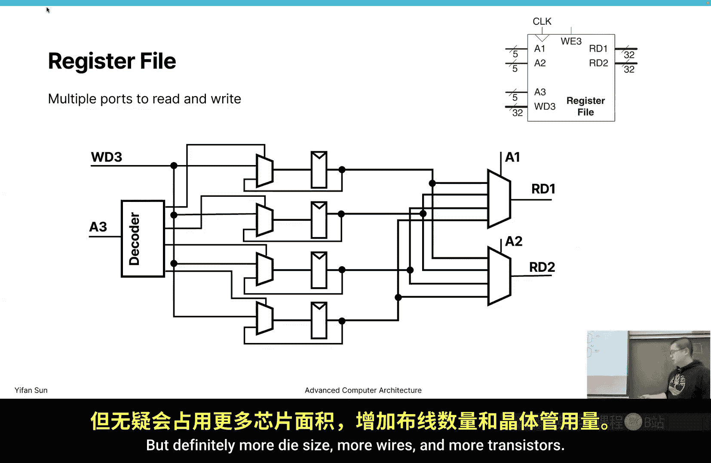

ok。快出。All registers。第。So three。食食经。So it's like the bank systems like standard for like。

All types are registers like on the CPU average。

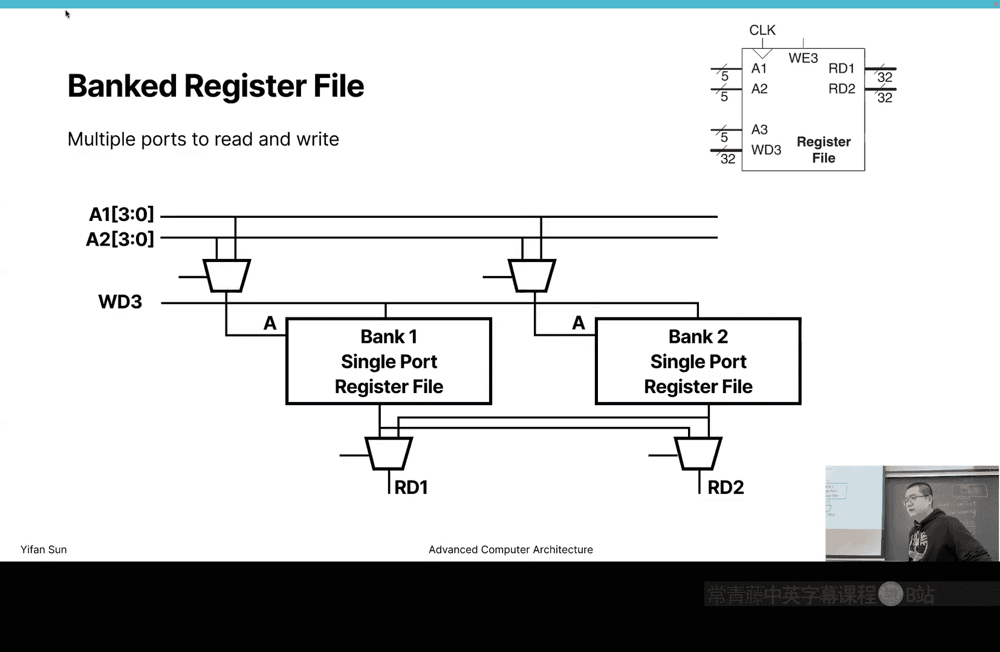

I would say CPU more likely to employ this type of design when the registers are not a lot。

GPUs have much， much more much， much。More registers than CPUus。

 So g is more likely to implement this style。

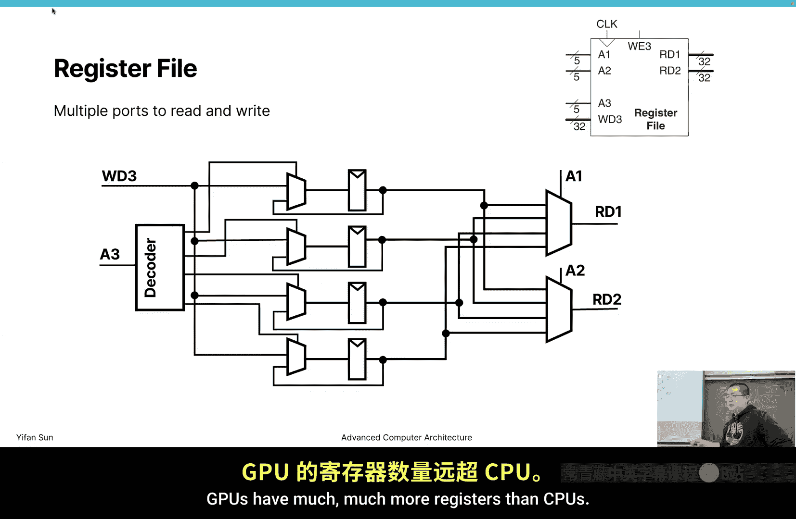

So it can wait a little bit。 GPUs are not latency sensitive， so it can wait a little bit。

 So bank conflict is typically not a super big problem for GPU， but for CPUUs。

 latency is very sensitive。But I wouldn't rule out some CPU want to use a bang design if they have lots of registers。

あ緊急。是。ですね。さき？all sudden。So many complex。喂 this。诶游了啊。呃认定。It in the reds。The resources。是吧。最し。

They actually have so many experience。次にすれてす。我系食食烧餐。The抗体平能比大。Okay。

 so I think most of you here need some a little bit of background in how GPU works。 right。

 So to answer this question。 So the question is， GPU， Steve have。Birts of registered read。

 It's not burst。 It's the traffic going out of the register file are much larger， right。

 So how GPU works。Keep your works in a way that。It's called same D， same D means if you have add R1。

 let's actually use V1。V1 equals v 2 plus v 3。Okay。

 I'm writing V because this is a vector register when we're executing this instruction。

 we're actually executing 32 or 64， 32 for a media 3064 for AMD。

 we're actually executing that many threads。So when we are reading from V2。

 we' are actually reading from 32。32 registers。 So although they both named as V2。

 but therefore for 32 different threads。So we're reading 32 threads in that case。

 because there are 32 threads， right， they have 32 sets of banks。So if if they have four。

 if it's a four bank。Register， is actually for multiply by。32， they have actually 1，28 banks。ok。so。

128 bankss， but。You， you can either understand it as a banks or it's a separate register file for each thread。

 because they will rarely。Like， communicate。Communicating data from one thread to another is ready to advance the instructions。

Bas。可怜死了。Every access。Certain2。No。特やす。The most。所以。就。唉。So， it inter livinging。Yeah， they。

 I wouldn't say it's an interl system。 It's complex， so you say。

This is a regular file for thread one， this is a regular file for thread2。

 this is a regular file for thread3， right？Then。Within thread  one and within each thread。

 you then have four。Bas。Okay， so you have one input。来 say。If this is R 1， register one。

 the address 1， right address  one， the one， you only need one input。

 Now address  one will go to all the。Ports， right， eventually， you have 32 wires out。

 Then they are giving you different values。 and each of them is 32。32 B。Sorry， sir2 bit，4 by。

Each of them is 32 B， and there are 32。Often now， 32 wires。In one cycle， you put in one address。

 It go gets out of that amount of data。That's a GPU。 That's within one core。 And of course， it's a。

 it's a multibank， right， So you need a。Multipport it就 need R2。To go in， so it will have a。

Another set of output。Okay， so this is how GP register file works。 So if you say these are banks。

 yeah， those are banks， no problem。 If you say those are banks， but you don't consider。

 you consider those are separate register files， is's also okay。ok。都こ前。嗯。还好好看。

So it's not actually not that bad than if you are one， if say。R 0 is here。 rest V 0 is here。

 V1 is here。 V2 is here。 V3 is here， right， Now V 4 is here。 If you read V0 and V 4。So if R 1 is v 0。

 R 2 is V 4。You two cycles。Only need two cycles。有。ok。や。Let's continue。So。

On Tuesday we're about 20 minutes left we're at these slides and on Thursday we still have 20 minutes left and we're still on these slides。

Okay， now read only memory。 So read only memory is a memory that we can only read the data。

 So who write the data， the manufacturer will write， put the data in。

 So we almost almost never want to write data。To to this type of storage。However。

 I can tell you read only pure read only data today doesn't almost doesn't exist because your your vendor。

 the manufacturer of the device always want to change something for you。

 So typically you will consider something like firmware update or bio update。

 Those are something that you're actually writing into the。Read only memory。

 So they write something that is most fundamental to your chip。 Okay， so there are today。

 we don't really use this type of technology。 We actually use flash instead， So everything is flash。

 but this read only memory concept is still there。 So what is the original read only memory is implemented is basically implemented in this way。

 So this a decoder， right。就。Don't consider this data is connected to。To a。嗯。

Ground level to value0 therere just wire connection。

 So if this side if we put this is to one and if this is connected， then the output will be one。

 then if it's not connected since there's no one is providing the voltage is value is 0 and on the other side this value is also0。

ok。So if this is one， others must be out0， so the output is 1，10。

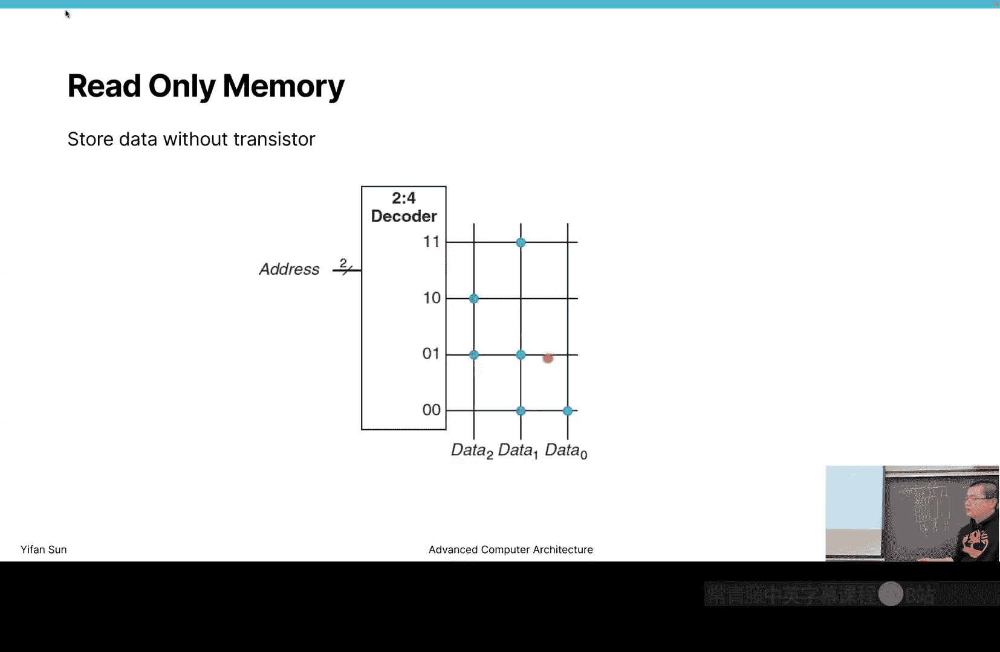

ok。So as a very。Early stage。 read only memory。 So know， on the。

Spaceship that goes to the moon is actually using this hand。冇问。Rom。ok。

Then if you're curious about how it is done， it's actually there。 need to watch that video。

 That video is like 45 minutes long。 It's actually very long to introduce how this is done。

 but basically is。Something that there's a magnet。There's a magnet circuit right so there's another piece of circuit that is going through this magnet or metal now if this circuit gives the value then it's actually the current go through this circuit。

 then it becomes a magnet right it becomes a magnet。So when it becomes a magnet， So this is the word。

 this is the word line。 and there's another。This is the bit line。So Bill line， go through this。

A magnet， or it goes past this magnet。 So if it's going through this magnet。

 whenever this magnet becomes。It's enabled。We will detect the current on this wire。Right。

 so in that case， this is a one。 If it's woven outside this。Sight at this metal circle。

Its cannot detect the change。 So it's 0。 So that's how this realm works。 So for Apollo machine。

 what they use in this type of design is。You consider by that time。

 technology is limited and you really need to prevent something like very vibrant shaking high Gs。

 high G force and also cosmic arrays， cosmic arrays that may have some big flip。

 It really want something super， super reliable。And no matter what is still。

 you can still read data from there， so that's it realm from apollo machine。

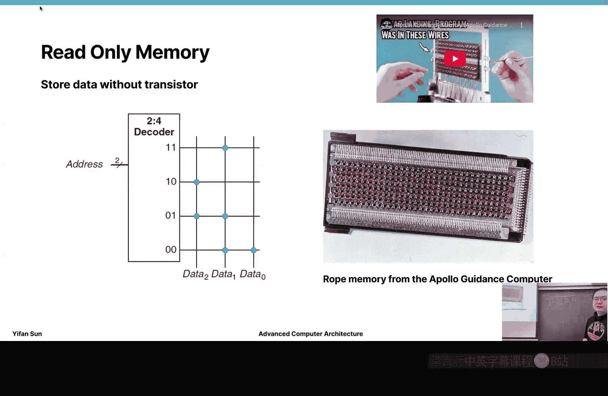

Yeah， these are some。Very basic explanation of this type of system， how it works。

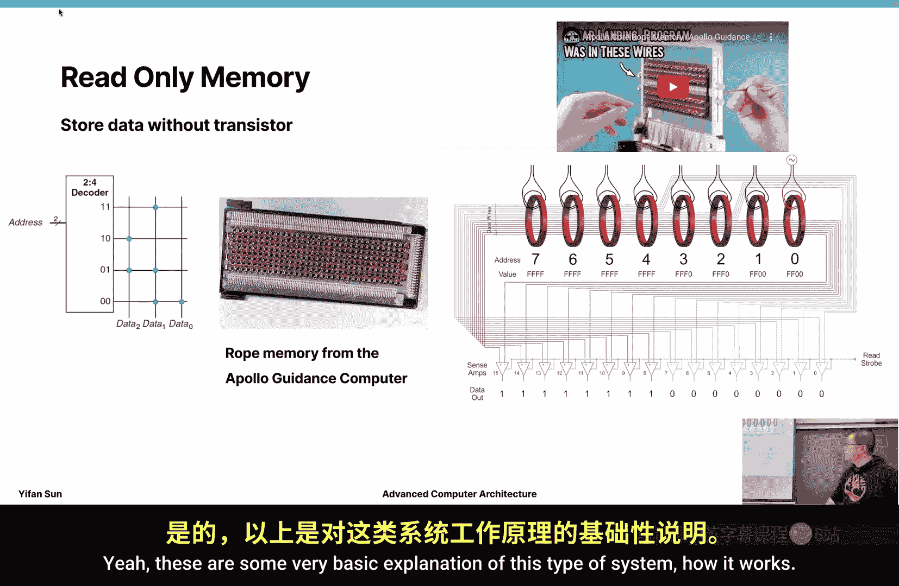

Now， so this is a read only memory。 but if you consider read only memory。

 it actually can store some data without a transistor and can actually perform some operation without gate。

 So， for example， if you consider this type of design and this design。

 they are actually equivalent right So if our input is some certain， let say or input is 10， we get。

This one is enable is one。And it's not connected， right， it's now connected to this line， so it's 10。

0。Right。So this is a or gate is connected here。 So if it's one is enabled。 So our output will be one。

 and this line， the second wire is not connected to a second gate。 So it's 0。

 And this one is not connected to the this wire。 So it's also 0。 So if our input is 10。

In this circuit， we output 10，0。 in this case， we also output 100。So in this sense。

 a read only memory is basically can be considered as a predetermined。circuit。Right。

 or I can say it's a lookup table。It's something that I have the input。

 I always know what's the output。 It's a certain lookup table。

That comes to something called logic arrays， in logic arrays， how we can。嗯。

The logic arrays how we can perform some logic with read only memory then。

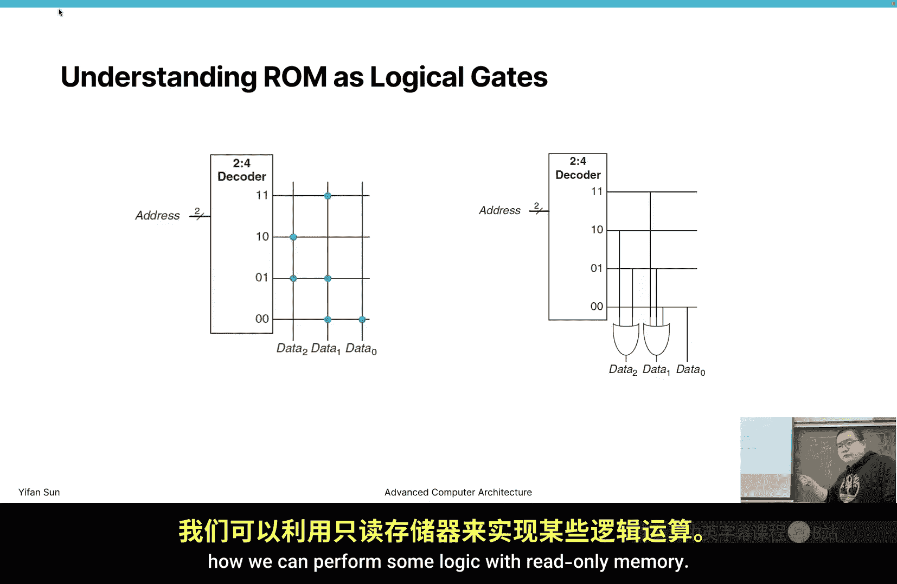

If you consider this case， these two cases are identical because for certain input。

 we always get the same output for these two type of circuits。人。

But the problem with this design is we can only get origgate， right？We can only have ord。

We have no way to have end gate， so how we can have end gate there if we know。

If we know end gate and orgate。Plus， node gate is good enough for any type of circuit， then。嗯。

We can actually just make it slightly more complex to build any type of logic and how this is done is basically in this way。

 we provide not value， right？

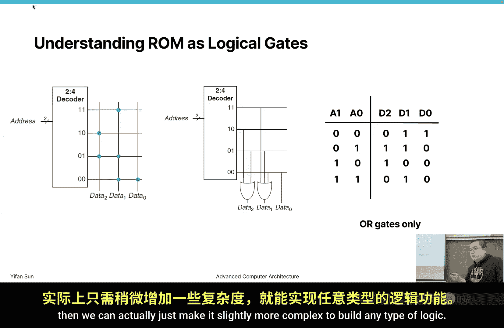

And this line serves an adna array。And rate， so don't。

 don't really think too much about how it's implemented。 We have the。

I will have an example later how it's implemented here。Just consider if it's selected。Is selected。

 then it's in this bulling equation。 Okay， so node A is selected。 node B is selected。 C is selected。

 So these represent。A prime B prime C。Then a prime， B， C prime and A B， and x is。Or of the3 meanter。

 and y is a B prime itself。Okay， so by using this type of design。

 then we can basically implement any type of logic and how it can be implemented with a circuit is in this way。

ok。See if you can understand this。So here this is a。You can consider this is a。诶。Power， right。

This is a gate。 So this gate is controlled by a。If it' controlled by a。Then if a is one。Then。

The power will drop， will join to zero。Then if a is one， then the whole thing is。0。A prime B C is 0。

 right， If a is1， this transistor is connected。If he's connected。

The the high voltage will go through this gate that will disappear。

 It will not go towards this this direction。So， only if。B is not connected。 C prime is not connected。

 We can have high voltage past to this or。That's how we implement end gate。 We actually have this。

穿 this。Transistors connecting to the other side。The other side of the not connected part。

Of this wire， this signal。Okay， in this case， we have end gate implemented。 Now， word gate is easy。

 Now， if it's connect， if it's connected then。We do not select it。

 We the the power of drain from here。 and eventually we have a knot we inverted。

 and we get the our or result。ok。It's how we implement this type of circuit with transistors。

 It's actually very simple。 Without gate， we can support some logic。人。

So I think you must heard of something called FPGA， right？

So how FPJ is done is basically by using lookup table， so if you want to implement some logic。

 you will write a piece of code in ver log or VHDL。

 ver log or VHDL are languages that's for hardware design you describe what type of logic that you want to perform。

 for example， you want to have two values added together。No， in this case。

A software server will actually generate the choose table for all possible input and generate these type of lookup tables or this type of simple logic array for you。

But these simple logic arrays are only for combinational logic， right。

 So what FPG is doing more than this type of simple combination logic is by combining different lookup tables together with registers so they will。

It can also support sequential logic。 And today， FPJ is getting much。

 much more complex than the early days FPJ。 for example， FPJs will equipped the multiplier。

 you don't want to use a lookup table to multiply a data right otherwise there are too many possible inputs like multiple multiply two floating points data。

3232 in。32 bit input， 32 bit output， theres too many combinations right。2 total power 64。

That's too many combinations it cannot be achieved with this。 So FPJs today equis with multipliers。

 So it has more and more different type of logic built in with an FPJ。 but it still。

 you can write something like a very low code and to use FPJ to generate this type of lookup table and to。

Produce the result for you。 That is。Something that people people typically use before they produce a real chip。

 They write the， they implement the chip in very low code and they burn it into FPJ。

 then the FPJ will。Run the same logic and if you can you can test if the logic is correct or not。

And also FPJ because it's pretty much look at a table。

 it doesn't really need a lot of cycles to generate the result it's considered to have lower latency than real circuit than CPUUs and GPUs。

So FPGs today is still useful， but only in some cases and high end FPGs are actually much more expensive than CPUUs and GPUs。

 so it really depends on if it's fit or need or not。

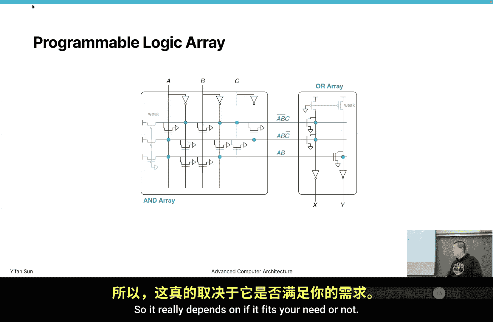

Okay， so as a summary， we're finally done with the sequential logic and also pretty much these five lectures is the whole digital design course for undergraduate level course。

At least my undergraduate level course of digital design only ends about at this time。

 So we' talk about sequential logic。 We talk about finance day machines。

How to use finance finance day machines to design a circuit。 And for something。

 like even for some code。A pattern detector， right。 So consider in some games。

 if you type a password， then it will enable a feature。 And in that case， you don't even have a。

Tax box for you to input password， how it's enabled。 it's pretty much state machine。

 And you learn the state machine how to detect the code pattern like pattern right with a circle of state。

 and you can eventually can get to the unlock state whenever you get the unlock state。

 you unlock a feature。So even I think it's super helpful for you to implement software。

 then the building blocks， we only introduce the counter， but there can be other building blocks。

 then we will talk about them when we are design CPU cores and we talk memory arrays as Ram D and roM with their advantages and different advantages disadvantages logic array we talk about roM as a program logic array and FPGs so those are some fundamental elements for digital circuit。

 and at this stage we're probably not going to draw gates at this point probably at most of a draw multiplexer for selecting signal but for the basic things when we talk about say okay here we need a multiplexer don't think how it can be implemented。

 just think it's possible that someone spend some time and it can be implemented we start from there to build some more complex circuit from there then in the next。

To lecture next week， we're going to diviate a little bit from architecture from circuit。

 we're going to talk about how to run simulations， how to write simulations。

 so especially I'm going to introduce the AkiA simulator framework that is the simulator framework divided by me。

When I was a undergraduate PhD student， so。I still think it's very useful so that's I'll teach about that for the next assignment。

 at least next formal assignment， youll understand why I'm saying next formal assignment because we'll have an informal assignment。

Next formal assignment will write some simulator code to start to simulate sequential logic then。

Simulate instructions， simulate cores， eventually hopefully everyone can simulate a simple read to file core and can excuse some simple programs。

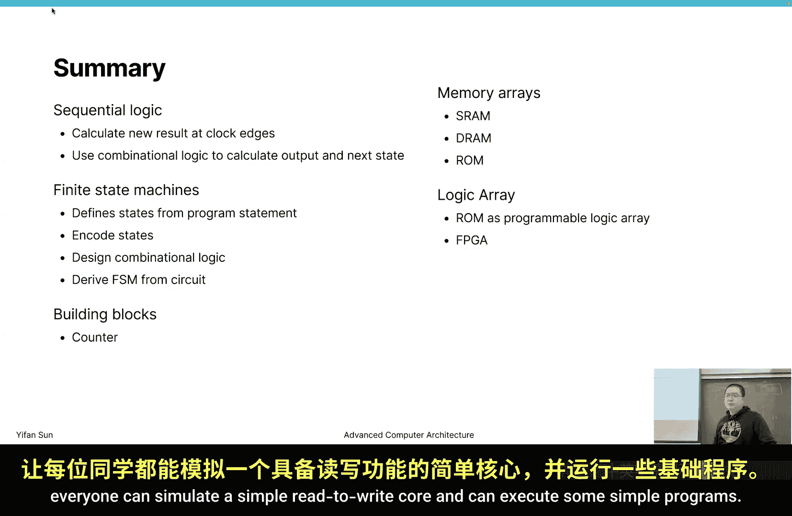

Okay， that's the goal for the rest of semester。Okay， that's all for today's lecture。

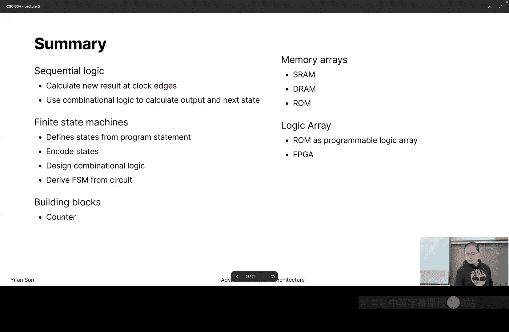