# 威廉玛丽学院【中英⚡高级计算机体系结构｜CSCI654 Spring 2025, Advanced Computer Architecture】 p07 P7 计算机体系结构模拟 1 -BV1evfwBVEUG_p7-

Okay， let's get started。 So so far we have done with our first unit that talks about computational logic and sequential logic on the circuit level。

 so that's。For most for many of you it's a review and but for many of you。

 it's the necessary knowledge to learn computer architecture so that you can deal with more complex topics startinging from here we're going to talk more about architecture on a higher level and starting from this lecture we're going to try to use two to three lectures time to talk about computer architecture simulationim。

 especially we're going to talk about the AkiA simulator framework so the goal is for you to know how to use a simulator framework and so that you can write your work on your future assignment by implementing some by implementing some sim so I find the best way to learn computer architecture is just to pretend that yourself is the designer so you design the architecture on your own while you are implementing a simulator when you are implementing a simulator just imagine like every time。

That know， well， how？How do I implement the simulator right then how do you implement part of the simulator。

Yeah。So how do you implement a simulator， then whenever I have this type of problem。

 how do I implement a feature， I just think， oh how can a real hardware do this thing if real hardware cannot do this thing。

 you probably shouldn't implement in this way in your simulator then basically when you are implementing a simulator。

 you're putting yourself in the shoe of。Compleuter architecture designer。 Just imagine， like， okay。

 if I'm the designer， if I were the designer， how I can design something。 Okay。

 so so in this lecture， we're going to talk about simulation。 after simulation。

 we're going to talk about the core architecture。 Then we eventually go to the memory side。

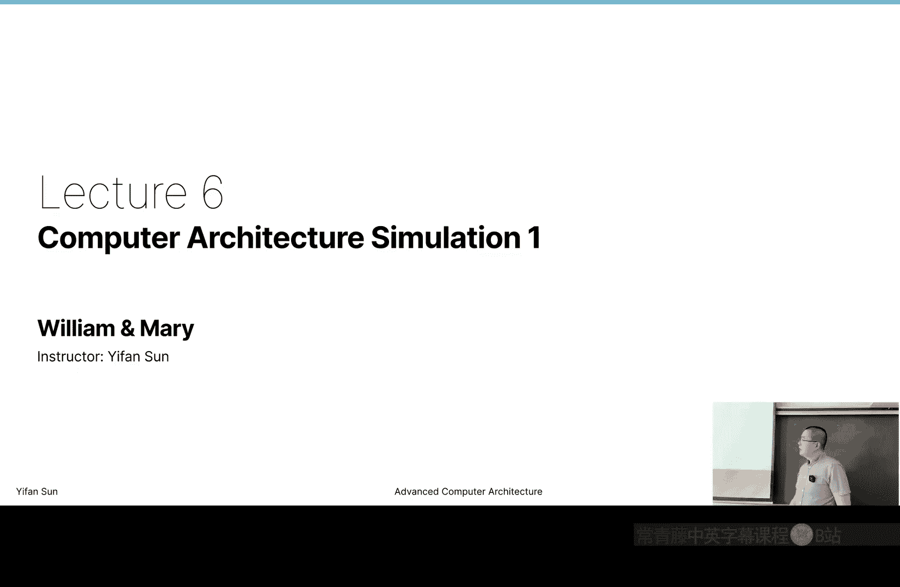

O， so computer architecture simulation。Okay so why we want to do simulation then I even sometimes get some questions from experienced computer science researcher。

 if they're not in a computer architecture domain think oh if especially I'm working on a GPU simulation。

 I think GPU are so widely available， why you cannot just use a GPU why you have to still implement a simulator。

 then the quick answer is you can you want to verify your design idea。

 you want to design some new architecture then but you you cannot really you want to design a new architecture。

 you have some new idea， you have some new algorithms， you want to validate your idea works。

 then you cannot really build a new hardware when you build a new hardware。

 see the cost of building this new chips is probably very small here。

 but this is 10 nanometer 7 nanometer and 5 nanometer here。 So5 nanometer here。

 see how much it cost to。就。Design and the manufacture。5 nanometer chip。

 its basically as this data source， it says it's $542 million to produce a 5 nanometer chip。

 So that's basically beyond the capability of academic researcher。

 and you cannot really spend that a lot of effort and let resources to really manufacture a chip just to validate your idea。

 Even in the industry， They cannot really say， oh， I have a designer has an idea that's just try to build a chip。

 and see how it works。 They internally， they have to use some simulator to first let their engineer to convince their administration。

 their executive executive team so that this idea is a workable。It's a reasonable design。

 Then they can start to make into the product then really produce it。 eventually。

 That's probably a few years like。From an initial idea to eventual product。

 thats probably a five years period that you may think that out of several hundreds ideas probably only one or two are eventually selected。

 so they have to use a simulator to quickly rule out the ideas that does not work。Okay。

 so we want to use simulators to verify design at a very early stage。 And during this process。

 we may want to do something like bottleneck analysis。 So if we run a program。

 we want to analyze what is the bottleneck。 If you run a profiling tool。

 you may really not to get that low level detail cycle by cycle detail。

 specific simulator can provide you with more details。

 Hadroom exploration is a very specific type of experiment that is very specific to simulator。

 for example。I want to work on something in cache memory access right so I don't know if memory access is eventually profitable in terms of performance improvement。

 so what I can do is I can set an ideal case I can set say memory access every memory access can be done within one cycle time。

Now last time we talk about like memory access can be hundreds to thousands cycles。

 if I set it to only one cycle， that's the most ideal case right in that case。

 if my performance only improve by 3%， that's pretty much saying the memory side is not a performance bottleneck Now if you keep working on that it's not perfect at all。

 we can quickly rule out this research direction although I'm saying one cycle latency。

I's probably too optimistic， though sometimes we may want to do say something like， oh。

 I want to have a unlimited size of cash。Right， something like this。 so it's called Hyam exploration。

 and it really requires complete architecture simulator that is a pure piece of software that we can do whatever we want。

 even if you do something like FPJ based simulation， you cannot do that。Now。

 have like a design space exploration。 for example， we don't know what's the best cache size。

 Now we can scan through， say1 MBbytes，2 meby， 4 mebytes。

 Then probably you will see this table curve at the beginning。

You are increasing the performance at some point， this is no longer bottleneck and putting more resources will not increase your performance。

 and this is a design space exploration and it's very important for computer architecture research and this can also be easily done by a computer architecture simulator。

 the hardware algorithm evaluation and we want to replace the hardware like the algorithm run on hardware then we can test a different algorithm。

 So everything related simulation is we want to reduce the cost then quickly rule out the idea that's not feasible like even without doing lowleve RtL level very log or sequential logic level design。

 iss why we want to use simulation。 So at the beginning。

 I want to talk about simulation methods in general， how we run simulation。

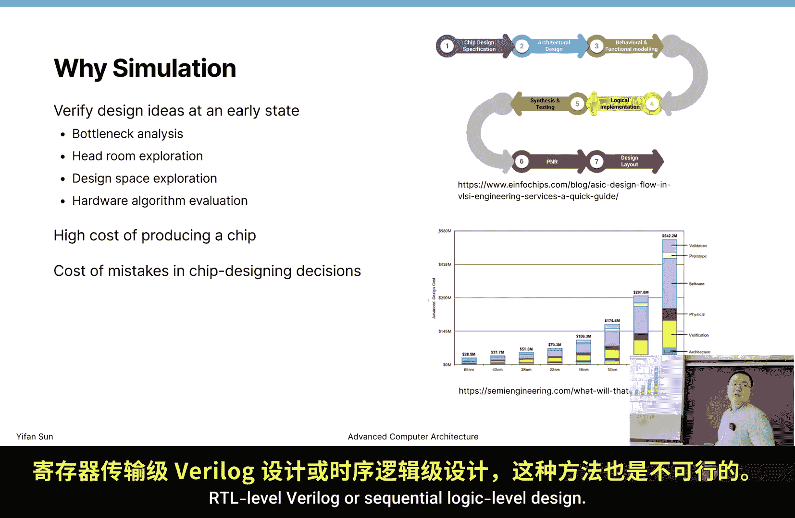

So。能。There are many different ways to classify computer architecture simulators。

 so let's talk about all the terms that we're going to use now you are going to encounter in the simulation domain。

 So last time we talk about for three lectures before we're talking about sequential logic sequential logic are basically digital circuit。

 it's a way of digital circuit organization that it includes registers and confidential logic。

 especially when we consider synchronized sequential logic that means there's a clock signal that is controlling everything and all the state update state means the data that is stored in the register all the register state update happens at edge of a clock either writing edge or down edge。

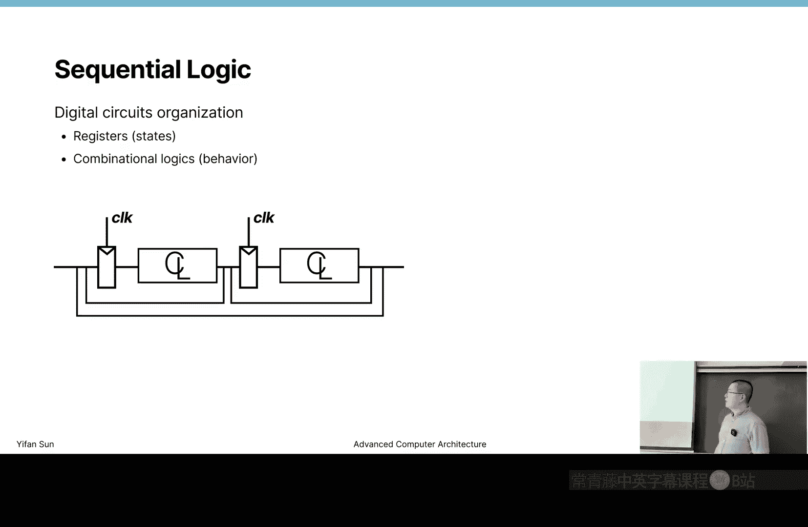

So that means if we can properly model。All the state。And the model， all the combination logic。

 then especially the combinational logic are mostly deterministic， right， so。

If we can't just simply repeat all this logic， then。

Pretty much we can simulate the every cycle's behavior of a of a computing chips。

 right So that basically we want to use this simulate the synchronized digital circuit by doing this。

 if you have different components。 that say each component that a computational logic with its associated register。

 Okay， then we can simply do take take take which a take is an。

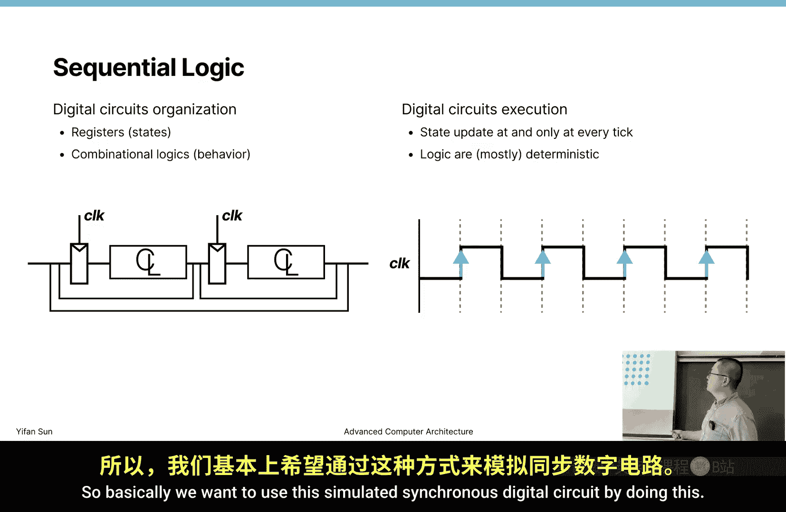

A draw a clock cycle。at every tick， we ask this computational logic to update this state so that this register also update this state。

 right， Nexts take every component， update this state， update states， update states。

 Then eventually we can simulate。Any type of digital circuit。

So that's a very high level description of computer architecture simulation。

 Then you may find that is the end。 Now we can simulate everything。

 Can we just simply do this and simulate all the digital circuit and for many simulators and for very simple low level。

嗯。Like ad hoc simulators。 And this is probably already at the end。 That's good enough。 No。

 but there are many constraints that prevent us from doing this thing。

 So let's talk about different type of simulations。

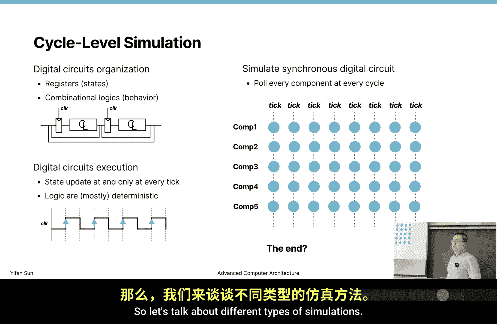

So there are different type of simulations。 What we are talking here is either RTL simulation or cyclelevel simulation What is RtL simulation。

 although we haven't talked about ver log but a very log is a descriptive language that is written to describe a sequential logic combination logic and its register state so that's RtL the register transfer level。

 So what is register transfer iss basically you have a register right then at every cycle you pass the data update a data and transfer either transfer back to this group of register or transfer to the next group of registers that's why it's called register transfer level simulation。

Then it's either at cycle level simulation or RtL level simulation。

But sometimes we want to pursue more higher level of accuracy。 For example。

 if we really care about like the super low level detail about the latency of each gate。

 we may probably don go down to the analog level simulation。

 like to consider if our voltage is good enough to drive。Like the next level gate。

 say if one gate is controlling 10 other gate。 So probably or voltage is not high enough to control all this gate。

 So in this case， if we care about this information， we do analog level simulation。

 Then on the other side， other than higher than cycle level simulation， we can even do higher。

Transaction level simulation。 For example， if I know a matrix im will take one second to run。

 and I'm going to run 10 matrix modifications。 Now。

 quick simulation can tells can tell tells me that。The whole program will run 10 second。 right。

 We don't really go cycle by cycle low level detail。 We can go at a higher level。

 that a transaction level。simulation。So we can make a very detailed comparison about these different level of simulations so that you can make a good tradeoff between。

 say， or which which level of simulation that we want to use for most of time here。

 were in this course， we' are talking about cycle level simulation。

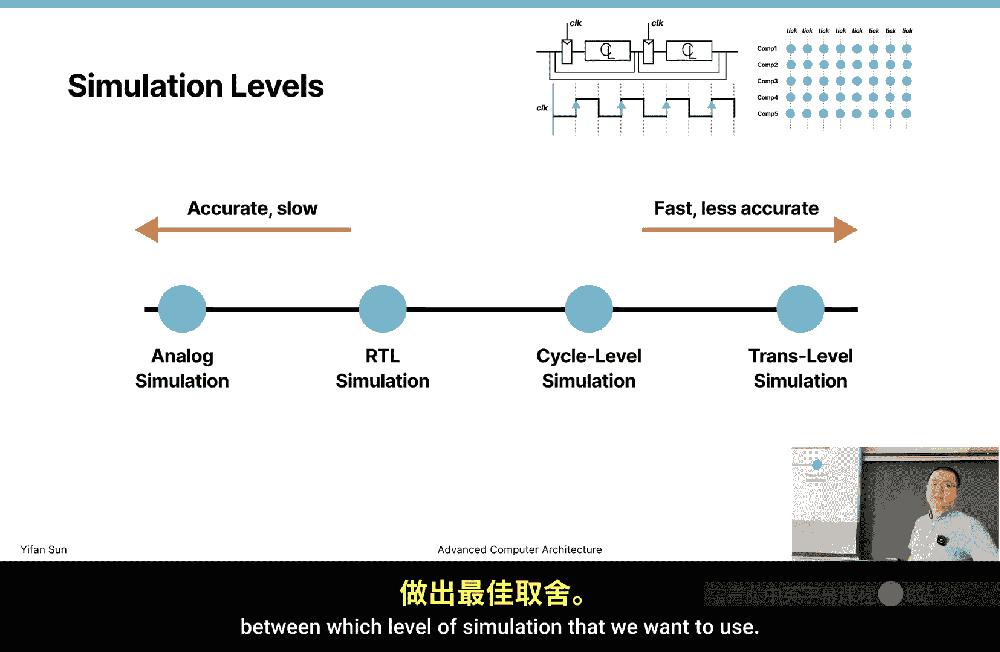

Okay， so there are many different。There are many different compare metrics that we can dimensions that we can compare。

 So what's the。Incremental of the time or what's a cycle in these type of simulators。 Now。

 these are cycle level。 right， These two are cycle level。 That means we are doing。Cye by cycle。

 we only care about clock address。But if you want to do analog simulation。

 then we probably need to do much finer granularity。 we probably it's still discrete time simulation。

 but we can break down the time into 100th of a cycle so that we can know how this voltage is eventually built up and how this voltage propagate through the cycles in that case we can calculate or if this。

Gates， if the signal propagates through the gates have enough time to reach the next set of registers。

 those are analog level simulation and transaction level simulation or course screen time that can be second ten of seconds can move really fast。

Then another term that you may commonly hear is a psycho accuratecurate term。

 a psycho accuratecurate simulation， a few years ago， five years ago， people really like this idea。

Or they'd like to use this term。 What is a psycho accuratecur simulation。

 Then there's no common definition， but my common definition is。You know， it's cycle level。

And you know it's accurate， how can you know it's accurate is you have the RTL level information。

 but you you have all low level information， but you just implemented this at this level。Okay。

 so it's accurate。就SSCSSA here。The more you go towards that side is more accurate。

But it's slow on this side， it's fast but less accurate or less control about what's going on。ok。

So that's we need to make a tradeoff and find it the best place that we want to implement Earth。

Simulation， then， in terms of accuracy or fidelity， what type of accuracy that we can get。

For analog simulation， we have voltage and current level accurate， like the voltage。

 even at the final granularity， now we know it was the voltage at any point on the wire。

 Now the R T L is binary accurate。 That means。They say if you want to transfer on wire and on wire。

 that's。Say you want to transfer a message then on this message on this message。

 you really need to care about what is the packet header。

 what each bit represents so that you can send this information to the next stage and next stage can par this information。

 that's R TL level simulation。 then on cycle level simulation since it's mostly implementing in software。

 we don't really care that much about bit level accuracy binary accuracy。 for example。

If you write RLL simulation。Then you have a network right from a node to send to B node。

 there are several nodes in this network。 You have to have a specific specific way to identify each node。

 say this node is 1，2，3，4 and 0，0，0，1，0，0，2。 Then you have to identify them and send it through the network。

 Now if you are implementing a cycle level simulation。 you can simply say。Okay。

 that is my destination and then just simply pass a pointer in the software。

 a reference to that element。 So that is my destination。

 You don't really need to care like I have to send 0，0，0，6 as the identifier of that destination。

And that's why at the cycle level simulation。The accuracy can be sacrificed a little bit for something that you don't really care。

 but it's much， much easier to program。Okay， then at the transaction level， basically。

 we typically do time only simulation。 So there's no functional simulation。 We。

 we do not care about the execution result。 We only care about the time estimation。Then。

Different level for analog level， we typically do transistor or subtransistor level modeling。

 Then for RTL level， we care about every gate。 we need to know every gate and model the aggregate input and output。

 but we can assume that if it's a node gate， you can always simply invert a result。

 Now for that one analog simulation， we may consider that this node gate may even not work right for RTL simulation。

 we always assume the gate works Now for cycle level simulation。

 Now we do not care about gate we say oh here we need a multiplication Now we just simply use a software to do the multi we don't really care about gate Now here we only care about the timing to be accurate。

Internal performance， we say on the that side is slow。 on this side is fast。

 So that's my personal experience about how slow they are。

 And analog simulation can actually be even more slower than this one。 is 10 to 10 times slower。

So that means。那么。Or so if you want to simulate to one nanosecond simulation。

Then you multiply by 10 to the power of 10。10 magnitude。 that's basically 10 seconds exclusion。

 So you need 10 seconds to simulate 1， nanoseconds。 Real hardware exclusion， right。

10 seconds per cycle。 don't take that to literally different simulators。 Sc can be different。

 just the magnitude。 Okay， then R TL level simulation can be 1。1。对。10 to power 6 to 10 to power 8。

 And this one is 10 to the power of 4 and 10 power of 6。

 And so what's the temp to the power of 6 then。In general。

 we typically when we do GPU simulation for a full GPU large scale GPU。

 then my personal experience is if you want to simulate one second， one second real GPU execution。

 it takes typically a day or more。Okay， so that's a big difference。

Then transaction level simulation if it， it really depends on what's your transaction。

 but it can be as fast as real time executionion。 you say， oh jump。 like。

 I know this action takes three seconds。 Now I can use。

Like a few millisecond to simulate a 10 second action， it can be even faster than real time。Okay。

 so the time the time require the time， the slowdown actually determines that we cannot simulate。

Like a scale at too large。 So what's the scale that we can simulate。能。For analog simulation。

 we probably will limit us to a computational logic level。 So， for example， when we design L U。

 we want to simulate an other or multiplication unit division unit or calculate log sign this type of versions。

 and just to verify if it can。Proagate signal to destination with within the given time。

Now for RTL level simulation， we typically can do one CPU GPU core。

 then thats probably the that's what we can do。嗯。Then at the cycle level simulation。

 then we can do probably one GPU， one machine with multiple GPUs。

So I can tell you some experience that。When we simulate graphic simulation。

Like the graphics means we're simulating a GPU that is rendering a image。

 so probably we can at most render a 1080p image， one frame of image being simulated within a day or a few days time frame。

 one frame Okay， so one frame， if you want to play a reasonable a game， that's one over 60 second。

 right。1 or 60 second。So that's what we can simulate with cycle levelvel simulation。 Now。

 with R TL simulation， you want to simulate whole GPU to render a frame。 It's generally impossible。

Even if you use haveP。Use FPJ， the limit is not。It's not speed。 It's not performance。

 Its the FPJ cannot really hold all the logic of a GPU within one FJ。 It really need a lot of FPJ。

s Then if you connect lots FPJ is not connected with network， then it's actually much slower。

Thenhan using a single FD。So transaction level， we can do several tens of GPUus。

 hundreds of GPUs to a data center level simulation。Okay， now it is the magic。 What is magic。

 Magic is something that you want to simulate something that is impossible physically。

Like something I was saying is the roof line or the。嗯。Headroom simulation， right。

 We want to simulate a limit cache。 Now， can we simulate unlimited cache at a different level。

For analog simulation， you probably cannot even simulate the whole cache。 right， So no magic。

Magic difficult。 Then it's possible。 Then you cannot really simulate a whole like infinite cache。

 but you can simulate a much， much larger cache。 You can slow down things， but you can do it。 right。

 This one， like this is the magic。Point， right， if you want to add magic。

 you want to add reasonable magic here。 Then transactional level simulation。

 I say it' itself is magic。 It's a。I wouldn't even say it a simulation is more like an analytic model for performance。

Then。Okay， then more point I should make two slides。It's actually two size。 it's one size。 O， so。

Energy estimation。 So energy estimation is more and more important。

 like when we design computer chips， energy is not about saving energy。 It's about performance。

 If we have a chip that can。That。Runs at 300 w。 if you can reduce it to 1005，150 w。

 Youre not really saving energy。 You will still run at 300 w， but at much faster speed。

 much higher frequency。 that basically means energy can translate to performance。

 So analog simulation is generally consider energy accurate And this one RtL level simulation is typically considered that we can't have a good reasonable estimation of energy。

 So when you consider energy， energy is typically contains two parts consists of two parts。

 Once the static energy。 It's basically your whole chip is consuming if if youre not running anything。

Now， the other side energy is the。A dynamicy energy。 dynamicy energy happens when you have a。

Transistor that is flipping from a close to open state。 Whenever you flip。

 then you consume some energy。那。So if it's a transistor flip， it's really data dependent。Right。

If you flip a lot of gate， flip a lot of register， it actually takes。Opens and close。 lot of raage。

transranistors， right， So that's why R TL love simulation。

 If you want to have a very accurate level of S D。Estimate energy。

 then you probably want the RRT level simulation。Then for this cycle level simulation。

 it can be approximation of model。 For example， I can estimate。1 B。

 And I if I send through a wire and I know this wire is how long。

 I can say how many pickle jos it it takes to transfer 1 B。

 So that's basically an estimation or a model。Or like a cash heat takes how much energy。

 cash means takes how much energy。 it's basically a linear regression based or different type of regression based model。

 Then this one is pretty much energy modeling then it's very hard to say we accurate then it needs a lot of assumption to make transaction level simulation to estimate energy。

O， then the。Input now here for analog simulation， we typically use a netlist input。 Na input is。

 you can consider it's a graphic representation that say， okay。

 this point connects to this point this company。 Here is a transistor。

 Then you describe this type of things。 Then for R TL simulation， we。Provide RT where log or VHDL。

 or it can actually be converted back to net and we simulate still simulate as the net level。

Then cycle level simulation， most of cycle life simulation these days are implemented use C or C plus+。

 but we use go and we like to use go it's really a。

Easy to implement the language for transaction level simulation。 its still see or C plus wise。

 but if your performance is not a big concern， then some people even use Python to run simulation or my lab。

Okay， so since we're talking about simulation， like especially we're talking about timing simulation and functional simulation。

 then those are something that you should also often hear about the difference。 Now on one side。

 we have functional emulation right where sometimes we just say it's emulation on the other time other side。

 we say。

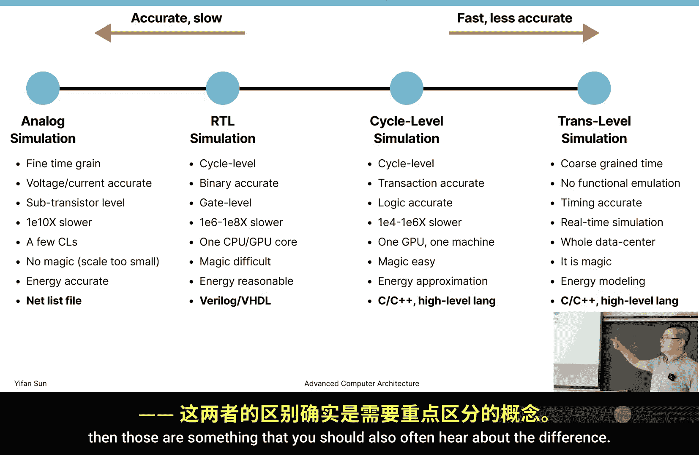

Timing simulation， or just simulation。So what's the difference between functional email。

 between emulation and timing simulation is if we care about the execution results to be the exactly same as a real hardware。

 So we probably。I say you probably heard about to say。A game consoleulator game console emulator。

 They would call it emulator because they would use your computer to emulate functionality of your game console。

 right， but they do not achieve the exact same performance。

 Probably your emulation is much faster than game console itself。 So that's emulation。

 So for GPU or CPU， this type of digital circuit， we consider say this is a program， right。

 if it runs on real hardware。Or run on the on my simulator or my emulator。

 we should generate the exact same result。Okay， so why is still useful？

 So we typically consider is repeating the exclusion results of a real hardware。

 then we check the functional emulation right so we we plug in a new algorithm。

 we first need to have a emulation there So to guarantee this can generate the correct output so that my my big problem。

 my whole circuit can still work can still generate a correct result。

And it's also useful for testing software， so。Then sometimes you just don't have the hardware available。

 So you need to。Have some software emulation。So， for example。

 there are lots of quantum computing emulator。 So you you probably don't have a quantum quantum computer。

 In that case， use a emulator to emulate the result。Now， also， sometimes you want to generate traces。

 For example， memory access traces， you get a list of。A list of memory addresses， right。

 So these are the memory that I need to access in this order。

 Now you use these traces to feed into another cache only simulator that only care about cache in that case。

Although it's not the best ideal scenario， but it can still provide you some information and probably it can be faster than running a timing simulation that consider every component in your chip。

Now， on timing simulation， we basically we need to repeat cycle by cycle detail because we want to tell that。

If this program runs on this hardware within this configuration。

 what's the execution time so we need to predict the performance and we need to predict them。

We need to predict the performance， and we sometimes we need to predict energy consumption。

Now we need to examine detailed performance metrics。 For example， Ca hit rate。 Like。

 what's the rate of a cache hit， Right？ How many transaction arrived at the。Dearham。

And we need to estimate energy consumption then execution traces that we need to like。Take traces。

 And to。Estimate time。 So no but for most of time， timing simulation。

 if you want to develop timing simulation， your program is data dependent。

Like even most common program is data dependent。 for example， if you have a loop。

How many times you need to loop through this loop now you typically have a loop variable right。

 you need to loop through 100 times and you have a like in I equals 0 I smaller than 100 i plus plus Now you know that one and 100。

 you know， okay， it will loop 100 times。If you don't do functional emulation。

 your timing simulation will never know how many times you need to exclude this loop and cannot provide a reasonable timing estimation of a program。

 That's why we typically need to fit in the data from a functional emulator then to do data dependent timing simulation and eventually get the timing result。

However， there are still some cases we want to do time only simulation。For example。

 im machine learning， that's a very typical case。 In machine learning， most of time。

 we do matrix modification， word convolution or。Softmax or Relu or whatever these type of predefined algorithms。

In this case。Just consider a convolution。Even if that's a black picture。

And a black convolution kernel。 we still need to go through。Everyy element。No work， multiplication。

 the times that we do multiplication and some operation are exactly the same。 In that case。

 we probably don't need to do functional simulation。 We can have a reasonable， accurate。

 reasonably accurate。Timing only simulation。 So以 in that case， in some particular scenario。

 timing only simulation is possible。O， so that's a time， time simulation and functional simulation。

 So later on， as we talk about Akita simulation or then。

We'll see that Aki Akida is mainly responsible for the timing part。 E part。

 you probably don't really need a framework you can just implement on your own。Okay。

 then another thing。Another way to separate simulation， trace driven and execution driven。

So last time we talk about trace， experience traces。 What is a trace driven simulation so。

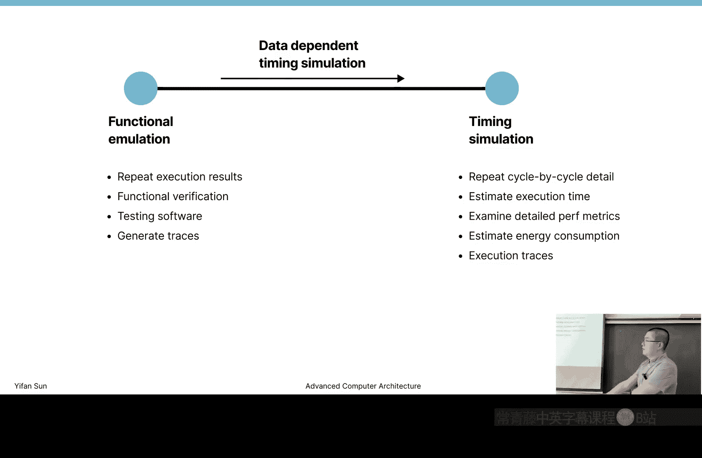

Trace driven。Its a trace that we typically collected from a real hardware execution。Right。

 for example， if we know all the instructions that are executed by a CPUU or by GPU。

 we can print it in a file。 Then we can feed in this file into a simulator。

 then the simulator just replay all these instructions。

 Then we know we can have an estimation of the execution time。 In that case。

 a trace driven simulation is more likely to be a。Timing only simulation， okay。

 without a functional simulation that is feeding in the executionion instructions into the timing simulation。

 timing simulator。人。So we can get a choice from execution then a real hardware execution。

 or we can get a choice from another simulator。Then it's really simple to development because you don't need to develop the emulator。

 the emulation， the emulator can be really， really hard to develop because there can be thousands of instructions for a GP or CPU and you have to implement everything correctly。

On the other side， execution driven is a more like to me is a more intuitive way， right。

 So it's we're emulating everything that is happening in a real hardware so。

We integrate a functional emulator in the timing simulator for real hardware。

 If it's doing or add a plus B。 Now in our simulator， we just repeat add a plus B， right。

 We just repeat every action in a real hardware so that eventually we can get a。

Reasonable timing estimation。 So it's more difficult to develop， but it gets more。Acurate。Now。

 for example， a very concrete example is spilllow problem that is a very difficult problem to solve or almost impossible to solve for trace driven simulation。

For what is a spin loop， is anything。Then if we have a program that we weight a while a equal equal to 0。

Right， just consider there's another program that will update age from 0 to one。I that。

That thread updates82 from 0 to 1。Then we can exclude this thing。

 then eventually jump out of this loop。Right，Or if it's equals to one。

 we jump out of this loop and do the real action。 So while a equal to 0， it's a comparison operation。

 right。And there's a way to probably asleep or something or some instruction it。

So how many times we killed in this loop。Then。In trace in trace driven simulation or trace space simulation。

We can only do whatever the trace is telling us。If the trade say exceed this loop for 100 times， yes。

 we just do it 100 times。But if our hardware design is trying to say， oh。

 I can make things run faster and to make this core， realize its value is changed faster。

Can you model this type of behavior change？ Basically， you cannot。You cannot。

 You have to rely on the trace to tell you， oh， this is something that I excluded it It something I cannot change。

 but for execution driven simulation。This is very natural。

 We don't have this problem because were really executing on the other side and we're excluding cycle by cycle。

That。Whenever this one can observe this。Change is basically dependent。 depends on how soon this Reg。

 this input register will get this value。Right，So for extreme driven， this is not a problem。

 for choice driven， this is a big problem。 So even in recent simulator papers， I see。

That they have a hybrid trace driven and execution driven method。

 and their exclusionion driven only performs executionion driven in spin loop， type of pattern。

 this type of programs。Okay， then let's talk about event driven。

 or that's probably the our last type of。Type comparison， like the classification of simulators。

Pycle based like， as we said before， if we pull every component。This component update。

 this component update， all of them update， then we move to the next cycle and all of them update。

 move to the next cycle， all of them update that is basically a cycle based。Simulation。

 so psycho base is typically very easy to understand and is easy to implement。

 but it also has some problems。

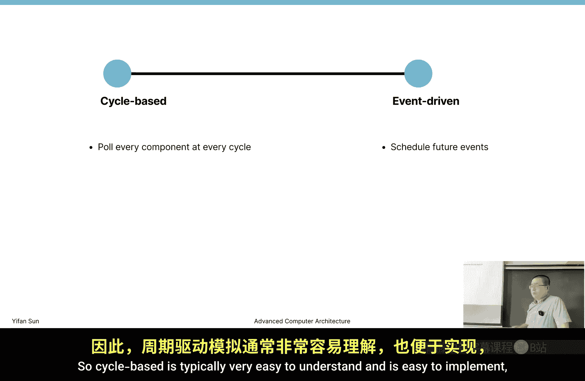

So what's the problem with cycle based simulation， One major problem when is。

This is totally solluable。 It multiple clock domain。 So， for example， in CPU and GPUus。

 a very common case is your core and your memory runs at a different cycle。

They typically use something like a face log loop to synchronize them or use a buffer to somehow synchronize these two parts。

Like， those are very analog circuit design。 So that's not something we're talking about， but。

I just want you to know that digital circuit can run with different parts can run at a different。

Clock domain。Right， or these are two different components running at different。

At different cloudg domains， Sometimes even one component can change its clockg domain。

Can change it called frequency。 You see a technology called dynamic voltage， frequency scaling。

 or D V F S。So most of chips has DVF S today， CPU GPPUs or any type of chips has DVF S。So。

 for example， if you have a GPU in your computer， you don't want to run at the full clock frequency And still your clock is ticking。

 ticking， ticking。You don't want it to happen because it's waste of energy。 So when sleeping。

 you want to put it down to the lowest energy。 Then whenever theres a request comes in， you can。

Increase the frequency， right， even for like booster cockking， booster cock。

 you can run to a much higher frequency， then go back to the regular frequency。

 So different cock domains。 if you run cycle based assimilation， that means。

Your incremental cannot be full cycles。 You still have partial cycles to increment。 Now。

 in that case， you probably want to have something like a。诶。So if one runs11 gigHtz。

 the other one runs at 2 gigHz， is basically you always update2 gigHz just for the one gigHtz component you just。

Don't update them every other cycle。Right， so that is the typical way to do that。

 But if you consider it it's a non integer ratio， then it's just make things really， really annoying。

Another thing is a long idle or wait time right for many components then sometimes you are running a lightweight program。

 if you're running only a single thread program， your all other courses are waiting。

 they're not doing anything。 and you keep taking everything it will actually make your simulation really slow in that case。

We don't want cycle simulation。 We don't want pure cycle based simulation， because when they're idly。

 we want to fast forward to the next reasonable tick。

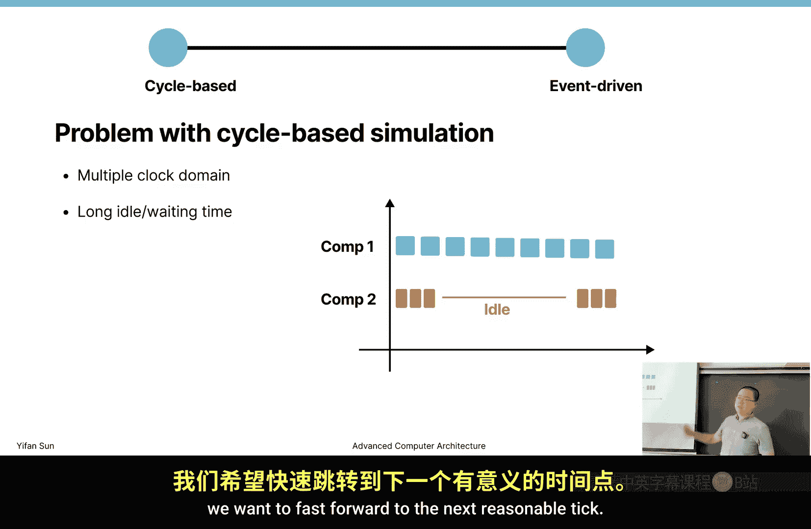

Okay， now those are the problem with cycle based simulation。

 So on the other side we use event driven simulation， what is event is basically we fast forward。

 we say， okay， at this time we can predict what's gonna to happen like 100 cycles later， for example。

 this memory read will take 100 cycles rather than tick tick tick tick until 100 cycles we fast forward。

 we say 100 cycles later we'll do this okay that's an event driven simulation。人。

It's difficult to develop。 right It's much more difficult to develop， but it's a more。

The performance is higher and in some other sense， if even if I have multiple clock domain or even something that happens outside a clock domain。

 its very easy to handle with event driven simulation。You we see how we。

Do even drive a simulation in AQA， hopefully in today's lecture。Okay。

 then because these two methods have their own advantage and disadvantages。

 more and more simulator is taking a hybrid cycle based and even driven simulation。

But different simulators is hybriding them in a different way。Before I start， before I continue。

 let's just give you a quick。Overview， not overview。

 just some examples or some famous simulators that everyone is using。

So how many of how many of you have heard of gem5。Gm 5， right。

 So Gen 5 is the single most popular complex architecture simulator today。

 So Gen 5 starts from two simulators。 One sulator is called gem。1 similar is called M5。

I think gemM is for the core side M5 is for the memory side。

 so they combine these two together to make a simulator called gemM5。

 but today you probably cannot tell it's actually combined from two different simulators together is the most commonly used simulator it is a hybrid cycle based and event driven simulator that it implemented in a way that a component can still tick tick tick tick but can also schedule part of its functionality in the future。

能。Another simulator is called M multi2im。嗯。Anyone heard of Monteto Sen before。Okay， nobody。No。

 multiusum， so。NoN， that's a less popular simulator than why was PhD at early ages。

 I helped to develop that simulator。 but the because of the leading developer is no longer working on that project。

 that project is basically now maintained。 So that takes a hyper simulationim method that is doing。

For the core， they think， oh， it's very common for the core to still need to tick tick tick tick right。

 But for memory side， it's more like every action takes a longer time。 So the core side。

 the core part use psycho based simulation， The memory side use event driven simulation。能。

Aquita takes another different way to implement hybrid psychobase and event driven simulation， Akita。

It's even driven at the bottom， right， but。99% of the event are a special event called tick event。

Okay， so we， we say we claim we have。Basically the same difficulty as developing a slightly more complex than developing a cycle based simulation and slightly lower performance than a psycho based simulation。

ok。Sorry， slightly lower performance than pure event driven simulation。

 but and slightly more complex than a cycle based simulation。Okay。

 we're taking the advantage of these two side， so let's。We're not going to talk about this today。

 we're going to talk about on Thursday's class now how we can hybrid these two in AkiA。

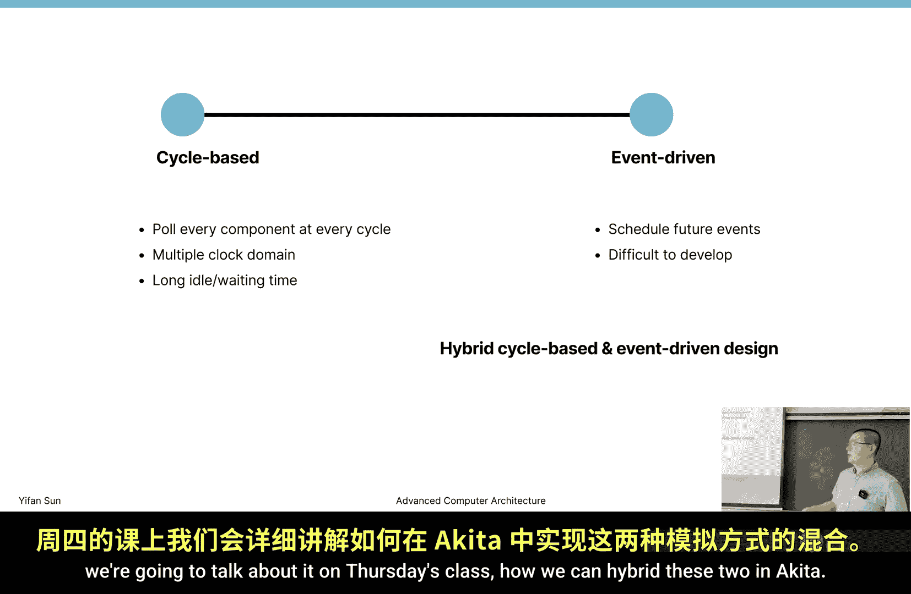

Okay， so let's see some more concrete example in event driven simulation in AkiA。so诶。Yeah this part。

 I'm going to basically read code with you to understand how this simulator is developed so that you can。

Use it in your assignment。ok。And my a is basically next a is to use。

Next El is probably the next offer。 Nice one is the。Is to use Akita to simulate a simple。

 few simple sequential logic circuit。ok。So time management， how we manage time？

So Akita is a very unique。Take a very unique design decision that we use floating point number to represent time。

You may feel it's normal。 Let me， let me first introduce this is a。Go syntax， right。

 So all of you have used a go in your first assignment。 This is a type definition。 We define a type。

 What is that type。It's called Vtime insect。What's the actual type， It's a flow 64。

 It's a type alias。 It's not a type alias。 Ty alias has a equal signine。Has an equal sign。

 then this is not this is just a new type， but the fundamental type is still just a floating 64 double precision floating point number What's the difference between a type alias and another type is type alias does not require costing you can just simply add two numbers with V time insect number and the floating point number together without any problem then。

If it's a new type， you have to do explicit cost。Okay， so we type in。 This is shows a。呃 design。

The programming habit， programming philosophy that Akita is taking。So what is V time in。

 So it tells you that this number is always in second。Okay， it's always in the unit of second。

 Don't don't ask it's a nanosecond， millisecond， microsecond， second or hour or day。

 It's always in second。 Okay， floating floating。64 is wide enough to represent。

 even if you have day level simulation， it's totally okay。Right， so V time。

 what is V time V stands for virtual。And where is virtual time。 So we have two different type of。

2 type time system， one is real time， one is。Virtual time。 So remember this sentence I said before。

 it takes one day to simulate a real GPU。Running a one second simulation。 Run second work code。Okay。

 so in this， in this sentence， there are two time unit， once one day， once one second。

So which one is real time， Which one is virtual time。We try it real time。

So do you live in a real world or a virtual world， You live in a， you live in a real world， right。

 So the one day part is the real time。The one second part， right， It takes a one day。

 So if we want to simulate one cycle GPPU one second GPU execution， it takes about a day。

And if this is a sentence， now over time is a day。 the word that is being simulated is the virtual time。

 It's a virtual word。 So that's a virtual time。 That's we say it's a virtual time。

 So it's a set separation with the。Real time。 So Vtime insect is probably the most commonly used type in Akita。

Okay， but it's basically a flu number。 So using this variable， we keep using this variable。

 we keep and say， oh， what is the current time and what the time that we want to schedule an event。

Now floating point time representation is a weird design decision。

 Most of other simulator use long integers on Z  on U in 64 and also in。When we talk of virtual time。

 we typically always start from 0。And it's just the start of this being similar to word。

 We typically start from0， and it's always positive。

 So other simulator typically use a positive integer U in 64， why， because they count cycles。

They can't cycles。So their integer is a number of cycle。 when I think same problem。

 multi cycle problem where even if something happens out of the cycle boundary。

how we can deal with it。 Then I think V time in is provides more flexibility。

 but also gives lots of problem。With this。Floating point。Precision problem， for example。

 if I calculate or current time is 3， nanosecond。The next cycle is what。

 how we can calculate next cycle。 I think that's a super simple thing， right。

Now sometimes I use this floor， I say。Current time is three cycle，3 plus one。And doing a ceiling。

 Now， we want to。Seal do a ceilinging to the next clock cycle， right so。Let's change it。

 slightly change it。 If currently is 3。5 cycle， you want to calculate the next cycle。 currently is 3。

5 nanocond。 We want to find the next cycle。 Next cycle is4 second。So I do 3。5。4。5。Okay。

 I cannot find a good example。 Sorry， So sometimes let say three plus one and do a ceiling。

 It can be either four or three。Okay， because it sometimes can be 4。00001。 Now， if I do a ceiling。

 it can go to a4 or go back to 3。 So， or it can be 3。999。

 So it's really hard to say calculate exactly the next cycle time。

 And sometimes because of this reason I got stuck in the same cycle and do the same cycle again again。

 So it's a very。An decision， so it actually takes some extra calculation to prevent that problem。嗯。

There's some drawback of。Using floating point as a time representation。 But so far。

 after solving that problem， somehow solve that problem。 we only have a performance issue。

 I don't think it's a terribly bad performance issue。 So I'm accepting that one。O， so。

Then Akida is a pure event driven simulator at the bottom level at the higher level。

 it may look like a cycle based simulation， but at the bottom is an event driven。

 So what is an event event is an interface this is a go interface of defining a interface。

 then in a Z 1， I ask you to practice interface So go follows this syntax that is the same as this syntax if you consider。

The type keyword， the new type name and the actual time。

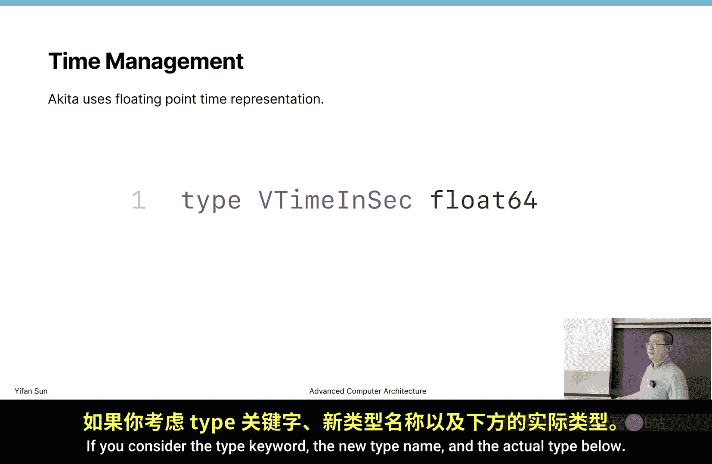

Below， right， so this syntax is exactly the same type keyword， type name and the actual type below。

RightThe actual time is type is an interface。 It has three。Functions。

 so for interface interface in Akita， interface in go can only have functions。

 no implementation and no field。 Okay， so it has an event defines a time。

 So when can happen and a handler。Who will handle this event。

 Who will decide what's the action of this event when this event can happen。能嗯。

This is also different from other type of simulator that handler is associated with an event。

 each event is not associated with a type of event。

 it's only is associated with each individual event， for example。

 a tick event iss so common that every components needs to have a tick event so but different components。

 different element may handle this tick event in a different way that's why we implement in this way。

E secondary for now is now important。 So that's skip this。 Okay。

 we' hopefully we can have a chance to talk about why we need a secondary。Then for a handle。

 for a handler， it's even simpler。 we handle something。 we handle this particular event。

 then it returns an  error。 and I never I rarely in my program rarely return an  error as simply panic。

Okay， so another thing that is the time manager。 we call it an engine or event driven simulation engine。

 So it manage the time going forward。 So what is the key functions of engine。

It can tell you the current time。 What's the current time， right， It can schedule future event。

 If tell you give it event， It will schedule an event to happen in the future。

Then there's a run function。Run function。 that means it will run all the event that are scheduled until there's no more event to run。

Okay， so there's no parameter。 Just run， or tell you to run just， there's even no control。

 say at what point you need to stop。 It just keep running until there's no more， no more。诶。

No no more event。 then power and continue our straightforward， right。So simple interfaces。

 then let's see how we implement this one then。Or let see how it works。 So they say。We。

 we have a component one or handle handler one。 we can schedule the first event。

 We have to schedule the first event externally。So that when we call this run。If we。

 if we do not have an externally scheduled event at the beginning。

 this run will immediately return because there's no event to run。Right， so we have。A run function。

 We have。 we call this run function after the kickstar event is scheduled。Then this event。

 when we are handling this flavor event， we need to say， oh， after this happens。

 something else will will happen in the future， so， we'll schedule future events。

 either to be handled by itself or handled by other components。能。

This cell phone then willll keep this chain of events will keep happening， right。Keep happening。

 Keep happening。 Eventually， when there's no more， no more event in this chain。

 we know everything is completed。 Now we're done with a simulation。ok， so。The the theory。

 the theory behind the event driven simulation is as simple as a event chain。Eventually。

 this chain will stop。 Then we're done with new simulation。

I don't know if you have a question that if it keeps ticking， why can it stop。Yeah a。I mean。

 I think most simulators， like the timing system is like isolated from the schedule。So basically。

 we don't really need to kind of I mean， complete all the events schedule。

 We can like the the N or the the ti system。 It can update the time when we like complete the。

Like a two events in the in the second。Yeah， and then then we we know two events are completed and we know there are some four events。

And then so it's like。Or we can like。let the time increase in a final。It thatろ。或诉。

So we can let the time to go at cycle by cycle rather than go all the way to the end。 internally。

 Yes， it is。 We're doing that。 So it's just a interface is a run will always run to the end。

 but internally， we keep the time。Doess it always have has a root。就。It doesn't have to be one route。

 You can schedule。You can。Or before the run is called run function is called， you can schedule many。

 many events。 So all these event will take place when you call this run function。Okay。

 so a principle of goal is。As simple as possible to make everything as simple as possible。

 And this to。We try to keep this principle in Akita， although it's。Actually， very hard。So。

 so the ghost creator Rob Piike once give a presentation called there's a。

Keyword or sentence that is called simplicity is complex。

 So to achieve simple interface is actually very， very difficult internally that you can。

Implement these simple interfaces。Now， for example。E secondary is something that I have to。

 I have to add。 I cannot easily avoid。 Later on， I can tell why it's necessary。So when we' are done。

 then we typically say， oh， this is the total execution time of your program。

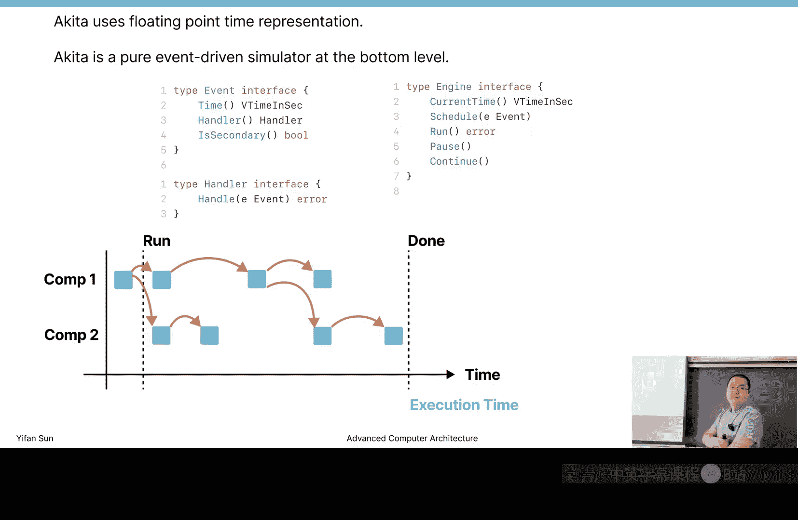

ok。So let's see an example。 We see a very simple example。 and this example is every line of code。

 I'm showing you every line of code。 It's a self split example。 So what is a self split example。

We have one cell at second0。 We cannot start from0。

 Now each cell split between time1 to2 between between one to two second after it was created so。即系。

At time 0， we have one， right。 So a random time between time 1 and second 1 and second 2， we split。

 So both of them are newly createded。 Now，1 to  two seconds later， each of them will also split。

 Okay， so we keep split and。Remove this one。 We don't need this assumption。

 Now how many cells do we have at second10。I try to run second 200 there's too many。

 I cannot finish my simulation。

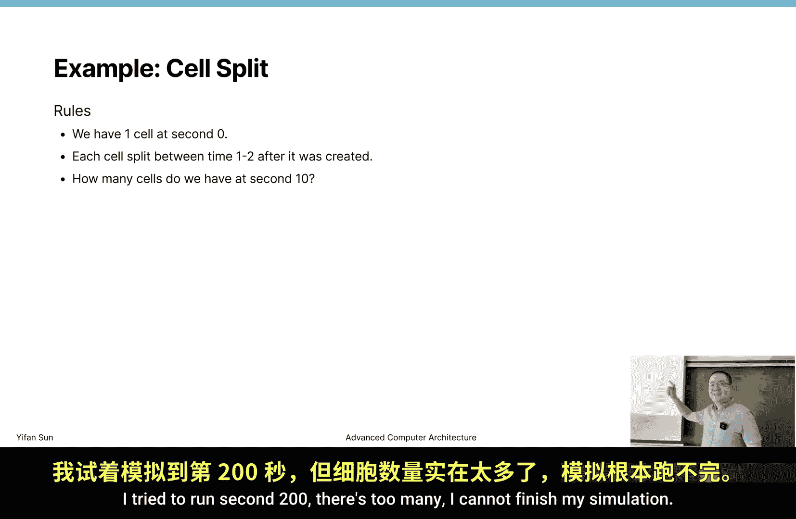

So I reduce it to 10， but that's a parameter it's not important。Okay。

 so let's see a step by step guide about how to run thes simulation， how to create thes simulation。

So。What do we do is we first define an event。RightSo since event is an interface。

 we just simply define this event implement or implement this event。

 And this event has nothing special。 We call a split event。 It has a time and has a handler。

 Now when we call time， we just return the time when we call handler， just return handler。Now。

 when we call it secondary， it's not a secondary。 It's a primary event。Okay。

 any question It super simple， right。Then the second step， we need to create a handler。

So how we can create a handler handler interface is also simple， super simple。 It only has a handle。

Mtterd。And so this is our handler we defined as construct， so the syntax is type keyword。

 the type name and the actual type actual type is a with a bracket。And there's only one count。

 So we consider the whole word as a。All the cells as a。Com as this handled by this handle。 Okay。

 and won only care about the number， and we don't care about each individual cell。

So now we implement this handle method， how we implement this handle method， it takes an event。

 right？Then。Return  error。 We never return  error。 We always return new。

 So what happens is whenever we split。We plus one。 so one cell becomes two cells。

 We add one more cell。 Then for we consider both of them are newly created。

 So we will schedule future event。 schedule next split event。Because we predict when it will happen。

So we， we schedule future event， how we can schedule future event。Now we do this。

 schedule next split event。 and schedule next split event。 We need a current time。

 So current time is provided by event that time， right。

 Even that time is always the current time that。This， this event。It's being handled。

 this event happens at this time。 So Yda time must be the current time。So this provides the nu field。

 Then in this now field， we first predict time to split。Time to speed。

 don't consider time to speed the left。Or how many， how much time left。Then we do a random value。

 we do a random value that's a flow 0。64 and plus one flow run plus run the dot flow 64 will generate a random number between 0 and1。

AndPlus one， let's say it's a random number from one to two。

We need to explicitly cost to vitamin sec。 so that is a second， right。Now， we create this event。

This event is current time plus the time left。The handler is always the current handler itself。

So we provide this information。Then we say if the next event time is smaller than end time。

We do engine does schedule next event。 Now we say this thing will happen in the future。

 So is the engine's responsibility to make it happen at that time。

 So there are a few global variables like the rent。

 which is considered as a seed can is a global variable， what else。En time is a global variable。

 Engine is a global variable。 It's a very small program。 So it's okay。Les than 100 lines。Okay。

 any question with this implementation。I thank this。This event starts from one event。 Now。

 this event will explode， right， will grow larger and larger More and more events that will happen in the future。

 but no event。But no event will go beyond end time。 If it's beyond end time。

We just simply don't schedule it。 just assume there's no such event。

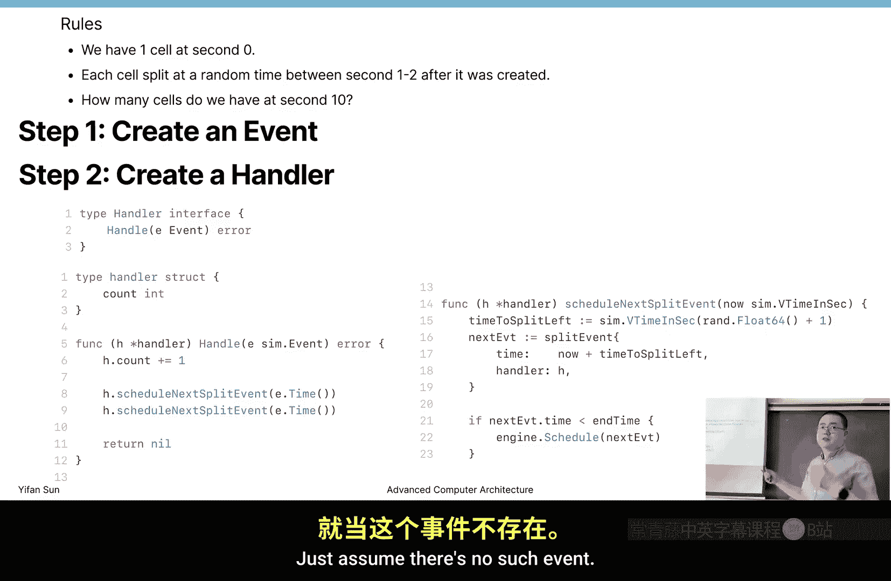

ok。So the last step， step 3 is to put them together。 So remember。

 we say these are the global variables。呃En。We set it as 10， I tried 200。

 I cannot finish the simulation。Now there's a engine， there's a ran gen。Run generator。

It's actually here， you can use Rolph flow 64。 why I use a run gen。

 There is a want to control the seat。 Okay， run 64 will do have a different seat every time。

So here I have a run gen。 is's a way that I can have a control see。This sisterister。Program。

I put in an example self split。 This is a particular weight of a goal that is to be a testable example。

If you put this program in a file called say self split underscore test go。

 then your function is called example that cell split， it's considered as an example。

 both an example and a test。 So when you run this program。嗯。When when you， when you run go test。

 you will run this test and see if you can get the correct result。ok。So we need to， at the end。

 we need to specify what is the expected print message so that it can match if the actual print and the same。

 its the same as the expected print。But here， first line is easy。 We create a new rent。

 then we create a source， which is a seed。 that is0。 It' just goes synax run goes library syntax。

 Now we use a seed 0。 Okay， then we create a new0 engine。We do a serial simulation。

 then we can also do parallel simulation。 and if you want to do parallel simulation。

There's probably no point to run parallel simulation for this scale。

 but if you run to run parallel simulation， simply replacing this single line with new parallel simulation and no other changes is required。

Automatic。Everything else is automatic。Now we create this handler。

 we start from one cell at the beginning。ok。Then。Remember， before we call this run function。

 Before we call this run function， we need to kickstar this process by scheduling the first event。

So here we schedule the first event。 first event time is this time is basically the same thing as the previous line。

O， now first event is split event。Time is this first split time and handler is H right Here。

 we need to this em representation， the same as。The same as。

C or C plus plus this get a pointer to this handler。 This H。

 get a pointer to get a address of this H so that later on， we can modify within this H。So， then。

We call engine now schedule the first event， we schedule the first event so we can kick started。

Then offered this point。We call engine run， so just consider this chain of event will happen， happen。

 happen until there's no more event to run， which should be at the boundary of 10 seconds。

RightSo remember， this is the code that we write in handler because of these three lines of code。

 we never run beyond end time。

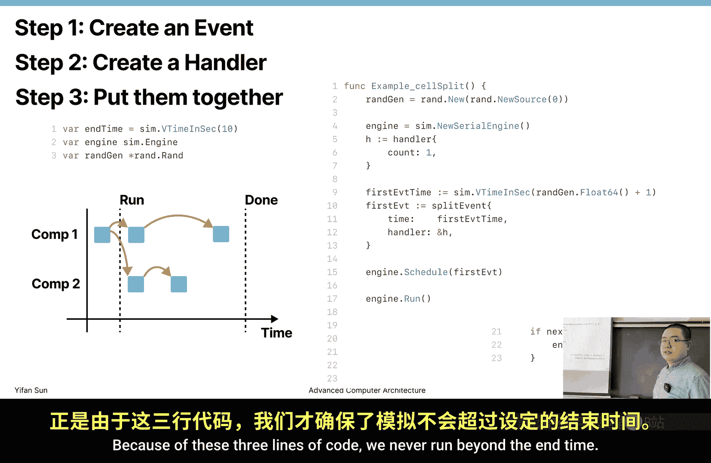

Now， at the end， after the run， we know cellelcon add time。A certain time。

 and the count is in this number。 So this is pure C syntax right， print F syntax。人。

Here we specify output cell count at time 10 is 75。 This is not useful。

 This is the test case specification。 We want this line to print this thing。

 and we it will really print this thing。 If we don't use this polymer source。

 it will generate a different final number。 So that's why。I start to force the source C to be 0。Okay。

 so every time it will run 75 and it's deterministic。Okay， so basically。

 you think less than 100 lines of code， we show a very simple example in Akita that。

Only involves time management。 Basically there's no circuit simulation。O。

Then I want to talk about the honeyarrow。What is honey error。

 So if you develop simulator sooner or later， you would。

Youll find sometimes your simulation will hung。 S hung means。I either terminate too early。

 whereas will never stop we keep running。能。In hanging  error。

 there typically you can consider there are two types of hanging  errors， one is called Dlock。

 one is a live lock， What is dialoguelock， dialogueos means two things are waiting for each other and no one is making progress。

Okay， no one is making progress。 So in Akita， the most reason of a dialogue。

Is you don't schedule you forget to schedule a future event。

 so your simulation is actually not completed。 your simulation is hanging there。

 so it can be terminated early but in MGM MGP is a GPU simulator that uses Akita in MGPM because we have other threads that waiting for this simulation to complete。

 It will demonstrate a behavior of 0% of CPU usage， but your program will never finish。Okay。

 because we forget to schedule future events。啊。This is dialogueo。

 dialogueo will show this symptom that no one is doing anything because we are doing event driven simulation。

 no one can make forward progress。Then another type of log problem is live log。

 So everyone is schedule event in the future and everyone will check。 Oh， what's the status status。

 This one will check， What's the status， This one will check the status。

 Then everyone is moving forward。 Take， tick， tick， tick。But no one is actually making real progress。

Okay， so in that case， you will find your CPU usage is。诶。Still 100%。

 but actually very likely it moves very fast。 So for example。

 it takes a day to simulate one second exc right， but in live log。

 you may probably take only a few seconds to simulate one second exc because they're not doing any real things they're just tick tick tick and only probably likely only two components are waiting for each other So that's a live log。

Dogue case。Super hard to debug。 Livelog is super， super hard to， debug。Okay。

 so there's something to be careful。 Now you really eventually need some print break line debugging to eventually figure out the problem the problem。

Of a honey arrow。O就。

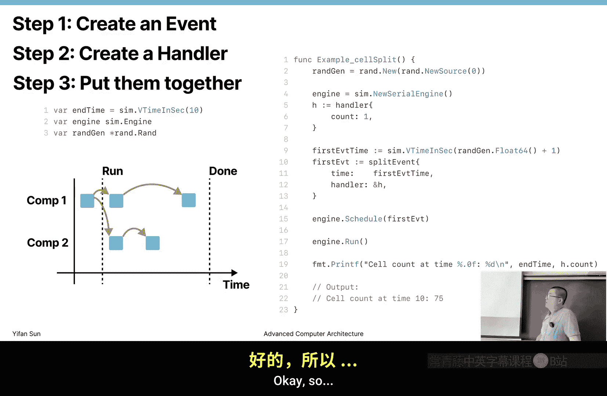

I want to talk about how engine works。 We still have 109 minutes time。

 Let's try to talk a little bit about how internally how engine works。 and let's read code together。

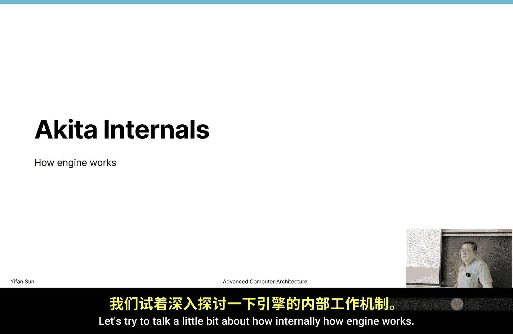

At least we can finish the， I think we can finish the zero engine part。So when we schedule an event。

 we push the。This says schedule function only talk about schedule and run function。

 pulse continue is relatively easy。Schedule function。Then。

The only purpose is to push it into the right queue。 Now we have two Qs。

 one is primary Q one secondary Q。 Still， I don't tell you why secondary is necessary。

 but just tell you。Primary event goes to a primary queue。 Second event goes to a secondary queue。

Okay， so we first do a sanity check。We get it now。 So Yda read now is the current read time。

 It's the current time of the engine。We， we encapsulate in a read function because there are some like concurrency issue have to probably use mut text to lock the current time。

ok。So now is currently now get the current time。 if we want to schedule an event that is smaller than real time。

 We cannot go back time， right， We cannot only schedule future event。

 We cannot schedule past the event。 If we're trying to schedule a past event， there must be an error。

 Now， we would rather。Pnic， make the program crash rather than silently to allow this to happen。

 It will create more problem and even harder to debug。

 So this is a I to check that we can now schedule an event earlier than the current time。Okay。

 so if it's a secondary event， we call secondary Q push， then we return， otherwise we push。

So here is there is another demonstration on our philosophy or coding practice in Akita。

That you like a beginner may write a code or undergraduate student at the beginning when learn like CSE I 141 and may like to write a code if even is。

Secondary， you likely you may first do not is secondary， then do this thing。 then else do that thing。

 right。We want to try to want to reduce the level of indentation as much as possible。 how to do that。

 our rule is to rule out special cases on the top， then make the real logic happen at the end。

You will see much many more such examples later， okay，' not talk too much about this。

Then run function。 There are several steps， then。Single run lock。

Lets to prevent that this run function from accidentally being run by two threads at the same time。

 we can only have one thread that's running the simulation。

 especially this is a serialized like one event happened after another。能。There's a big four loop。

 right， There's a for something。 There's no condition then is basically equals while loop。

 while2 equals to the other program language or forever loop。 So this is a forever loop。

 But with a exit condition。 So if there's no more event。

 it's basically very easy to check if the list has no event， then we just simply return。Right。

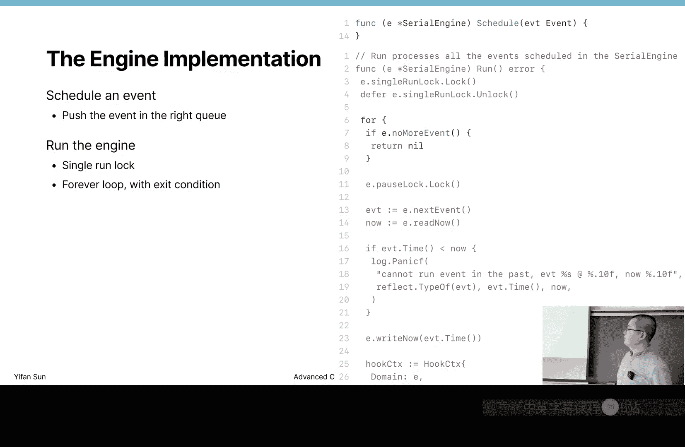

How we implement a pulse is basically by。Competing a pulse log。 So the pulse function。

Will take over the lock。 The continue will release the lock。

 So it will guarantee that this will nevercide with each other。

 and the pulse will actually only return after all the events are completed。Okay。

 there's a pulse lock。Now come back。 then these are the real logic。 we get next event。

 Next event means the event has the smallest time value。Okay， quick question for you。

What data structure that I need to use to store the events。嗯。めマナ。Yeah， max。 right， you need。

We need to use a hip。 It's a mean hip。Yeah。We need to use it's the best thing is to use a hip but sometimes for some reason。

I in parallel cases， then there may be different options， but I'm， I'm currently using a heap， okay。

Then we change the current time。 So the current time。

We also do assignc send to check that we we make sure this time will always go forward and never go backward So double check at this point。

Then we say right now is we change the current time so that event time is the current time of the。

engine。Right， so when later on， when you call current time， you will always return this time。

 This will make sure the event will the time time  error will go forward。Now call hook。

 This hook is something we'll talk about later。 It's a basic way that we can monitor。

 say what events are being excluded。It's a whole system。Now important at this moment。

 but let's focus on these two lines of code。 These are the real logic happens。

 We get a handler and we make handler dot handle。 We make it happen。Then this is an error， right。

 We don't care about  error at this moment。 Basically， we never return an  error。

 So if there's an error would simply panic in the handler。Okay， so handler， get a handler。

 then handler the handle， then make it happen。O， this is the logic of the。嗯。0ero engine run。

 So if you look at a simplified version， let's remove all redundant on that essential part。

 iss basically a forever loop。That will take the next event。

 make the event happen until we have no more event to run。Until you will run all of them。Okay。

 this is the centralized time management part。 and different from Gen 5。

 Gen 5 has an event Q per component event Q per per element event Q。

Akita has a centralized event queue。Okay， then I think that's all we can talk today and starting from next time。

 we're going to talk about how we can do parallel simulation。

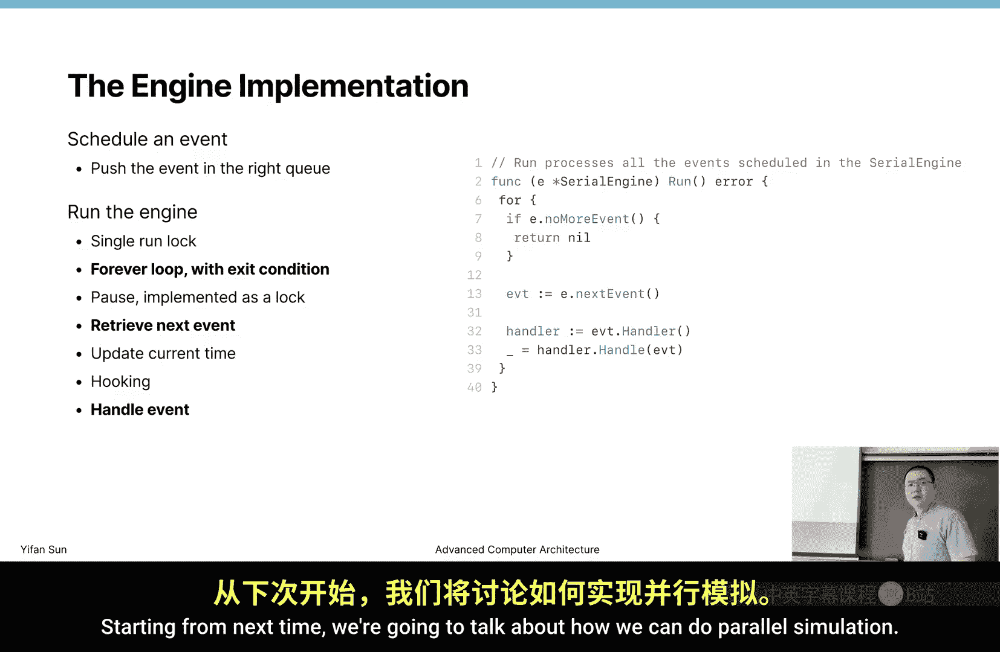