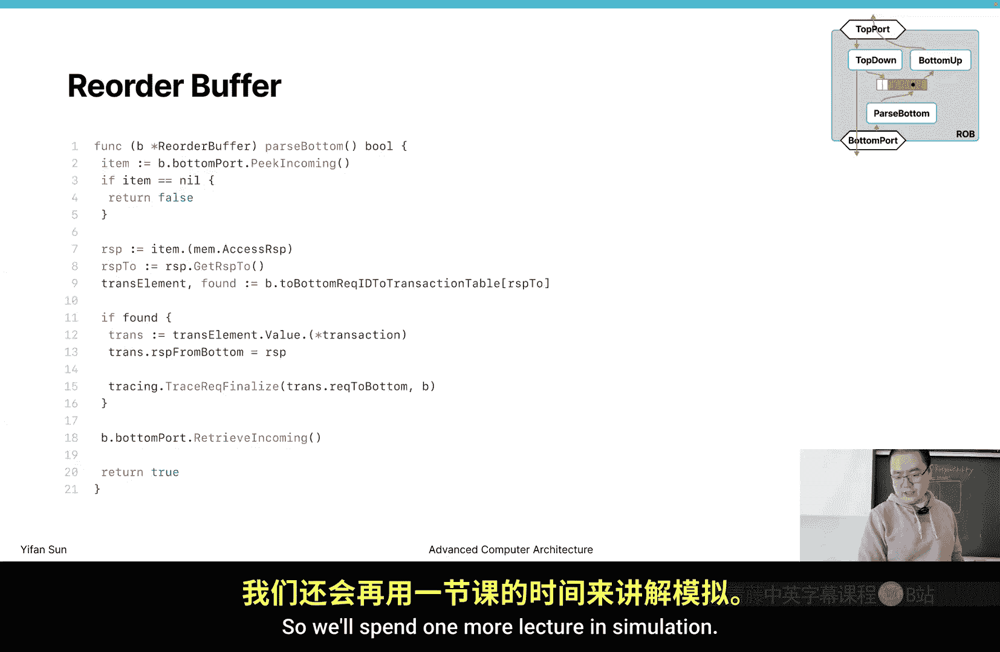
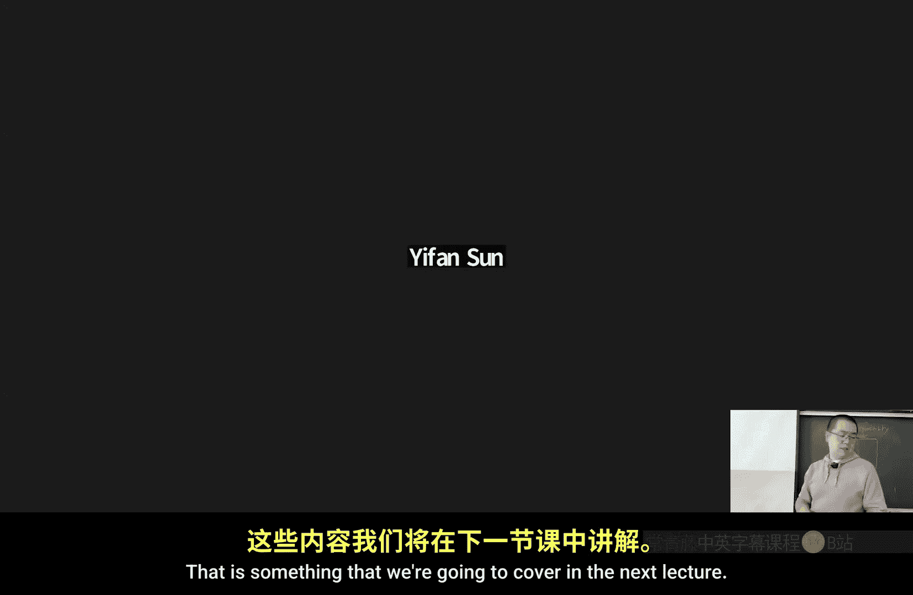

# 威廉玛丽学院【中英⚡高级计算机体系结构｜CSCI654 Spring 2025, Advanced Computer Architecture】 p09 P9 计算机体系结构模拟 3 -BV1evfwBVEUG_p9-

Last time we were talking about using pure even driven simulation method， right then。

We have demonstrated this example of breaking a pure even during a simulation。With with two events。

With two events， one event another event and two messages okay so we see that pure event driven simulation have these problems。

 it may require you to create actual events they need to create every different type of event for different type of actions that you want a component to take then it require you to really think in a non- intuitivetu way and it's really hard to reason about the process and also especially when you have many different events this event can happen at the same time and how they interact is a problem so it's still very hard to get it。

Then you need to schedule retry events。 So if you cannot send something that because of the buffer is full。

 you have to retry in the next cycle by schedule another event， schedule another event。

 Then if you schedule another event is basically even slower than cycle by a simulation in that case。

It's probably better just to use。sycho based simulation right so呃。Then to solve this problem。

 we created this matter， we call smart ticking。 So in smart ticking。

 our goal is to let user to write cycle based code。 So you write a tick function for every component。

 then we or engine can decide when to tick and when not to tick。

 and the mechanism is actually very simple。 but we think it。It's。

 it's a very useful method that can make useful and can increase the performance by a lot。

 if we can skip all those unnecessary ticks。So those are as a first step。

 we create a tick event for every component。Right， we create a tick event for every component。

 Then if we do that， this is basically a cycle based simulation。

 but it works on top of event driven simulation engine。 Then this in this way。

 this is strictly slower than。呃 cycle based ass simulation， because。

Other than excluding every cycle update state update every tick of every component at every cycle。

 we also have the extra overhead of creating those events and enter the event into an event queue and pop from the events right we have those overhead。

 So this vendor allows you to write a cyclebased code。

 but is actually not very useful because of the performance trade。嗯，撤掉。So then we create this。

 So if we want to implement this way， this is the code that we can write。 For example here。

 we have this handle function In handle function， we do we simply let the ticker to tick right and call C that tick later。

 So this component tick later， tick later is calculates this time of the next cycle。

 next tick time and schedule an event to let it happen in the next cycle。 Now the next cycle。

 there will be another tick event， which is this E， then this handle function will be called again。

So again and again， this， these components were tick tick tick， right。

 Then what's in the cake later function is to to use the frequency to calculate next tick and make tick event and。

Consider if it's secondary or not， then we schedule a tick。 If you don't consider the secondary part。

 this is very easy。 We basically calculate the time， create an event， then at at the end。

 schedule an event so that it can happen in the next cycle。Okay， so a very simple code here。

Then we want to make it。These type of cases， we want to skip some tick when it's not necessary。

 So we need to analyze what takes are not necessary。 right， okay， before talking about that。

 we have a frequency， This is something that we have not introduced。

 frequency is similar to time is's also a floating point number。 So if you consider 1Hz，1 MHz。

 Then those are all。Theyre're floating point representation， but they're integers。

 they're in the type of flow 64。 So then we use a frequency to calculate the next cycle。

 So frequency， this is a ghost syntax that although it's a simple， it's a primitive type。

 which is float 64 double precision floating point number， you can add functions。

You can add methods to this newly created method。 You're not adding a method to the floating 64 type。

 You're adding a method to the frequency type。 Now frequency。

 then we can we have these functions like next tick this tick or n cycles later。

 this commonly used the functions so that we can easily use these functions to calculate time relevant to to the current type。

Okay， so there are several functions。 But next tick。

 and this tick is probably the most commonly used method。Okay， so for a tips。

 what is an what are the unnecessary tips， unnecessary tips， we think if we take this component。

 but this component state will keep maintained。Will remain the same。 We consider their unnecessary。

 So if this take on this particular component has no state update。

 The internal state has not updated， we consider。The tick is not necessary， right， So in what case。

 a tick has no update。 Basically， consider there are two cases。One is this component is fully idle。

 It's not doing anything。 For example， a cash unit。

 but there's no memory request going through this cash unit。Then we consider it's fully idle。

 and in that case， there's no point to take this component at all。Now， on the other side。

 we say outgoing buffer is fully occupied。 So we know each port。

 each port has an incoming buffer and outgoing buffer， right。

 So each port has an incoming buffer and outgoing buffer。 And if this buffer is fully。If this buffer。

 the income， if this outgoing buffer is full， then we cannot send anything out。

 We try to send something out， but the port must return an error。

So we cannot send and we have to retry in the next cycle。

 Now if everything that I want to do really depends on one port。

 or I may try to send two messages and both messages are jammed at the port。

 then if external environment is not changing， I cannot make。Progress anymore。

 until we have buffer slot， then I can fill in a slot。 now I can move forward。 So basically。

 I'm stuck at this point。 I cannot move forward because I cannot send things out。Okay。

 so in these two cases， we consider this tick。It has no update。Okay。

 so how we can detect these two cases。嗯我 can。We can either test the port and compare the state。

 which compared the states can be a really annoying thing that to the the state of a component can be so complex。

 right。嗯 basically会 say。If we can use the tick function to tell us if progress is made or not。Then。

 I know。Is making progress or now。 you do a little bit task。 If you change internal state。

 This made progress field can be turned into true。 Then I know a progress is made， right。

 So you just do action action action。 If all the actions have not made progress。

 then no state change is made right If any part， any command that change any internal state or register value。

 then we consider the state is updated。Right， so if there's no progress in one cycle， we consider。

There's no point to take gap in the next cycle， unless there are external environment changes。

So that's our basic rule here。 No progress in one cycle that will stop tick then。

When external environment change。We will let it to take again。 So sometimes I me call this。

 if there's no progress in one cycle， we put it to sleep。 And when external environment changes。

 we wake it up。Okay， so we can So when can external changes happens， So since we have two reasons。

For。No update。For getting stuck， now we can have one in one condition for each cases。So basically。

 when it's idle， then we consider if there's a new task or a new message arrives。

So all we know all the communication between components are through messages， right。

So theres no function called。 Theres we cannot allow one function one component to call another components function。

 This is not allowed in M Akida。 We cannot do function call If there's function call where bypassing this whole mechanism。

 then everything single no breaking part。So if this component is an idol。

 then then a new message arrives。 Very likely that a new request needs this component to respond to it。

 In this case， we're converting from idle state to not idle state。 Then in this case。

 we need to wake up right， So new message arrives， we wake up this component to take again。

Then on the other side， if it's congested because port outgoing buffer are full。

 then if at least the one port outgoing buffer comes from the full state to a not full state。

 in this case， we wake it up。O， so。The relatively simple chain of reasoning that we design this mechanism that when you put it to sleep and when to wake it up。

Then。At least for me， I cannot find anything that violates this rule。Basically。

 we have the whole GPU simulator is implemented based on this rule。

 and we're not skipping any useful tips。 So this is a rather conservative method that we can guarantee every tick that is useful。

 We really take it。Take the every component。 We're not skipping any necessary tips。

 We're not being optimisticunistic， saying expecting the result to be close than the actual result。

 We guarantee that you use this mechanism。 You can get the exact same result and see if you are not using this mechanism。

O， so same results guarantee。Because all the takes we skip， we guarantee there's no。

 there's no state update， right。So they see how we actually implement this method。Now， remember。

 in the first code。We have this matter， right， this matter， anti。We tick， we make this event happen。

 We update this internal state。 Then we immediately take later。Then in the updated code。

We add a condition check。We， we asked the tick to return a field， because it made progress。

It can be true or false，那些叫不 value。Okay， if it's made progress。

 we take later to take it in the next cycle。If it' there's no progress made。

 we put it to sleep by not scheduling。这一万天的那 cycle。Okay， if it's not making progress。

 if it's returning false。 So it's really depends on the component。

 You have to tell me if the progress is made or not。 If it's not making any progress。

 we just won't take in the next cycle。 won't schedule an event for you。 So it all put to sleep。So。

For most of the time， if you write a simulator and you counter a hung error， very。

 very likely that you are not reporting this。This thing correctly。Okay。

 so if you have a line lock that your progress is like your time is going on and on。

 going going really fast。 then actually， that can be an error that you should return false。

 but you to return true。Okay， so this， this。Once you know the rule， it shouldn't be very。

 very hard to determine if it's made progress or not， but sometimes it just。At the beginning。

 it's very arrowpro， and sometimes I need to use preline devices to solve these products。Okay。

 so May progress。人设嚟嘅。Okay， so here you see we introduce a ticker。 And what is a ticker。

 Ter is super simple。 It's a interface that only has one field that has a tick method and returns no。

 it takes no field and returns a billion value that is made progress。Tles。O， this is a speaker。

Then the tick。The ticking component。The ticking component actually also， remember， it's a component。

 right， It's a component。 Every component need to implement a list of methods， including name。hooks。

 whatever， many different field。 But it also need to implement two methods。 One is notify receive。

 So when something you receive something on the other side。

 you also need to implement notify available。 So when a port becomes available。

Then the port will call this function。 So notify that the ongoing buffer becomes available。

In this case。We simply do take later。When receive a matter， When receive a message we take later。

And also on the other side， I don't have that code。

 but just imagine as the other part of the code notify available。 I simply do the same thing。

 See I'll takeulator。 So consider I'm this component sleeping， doing nothing。In one cycle。

 we receive a message。Whenever we receive this message。We take later。

 Take later means schedule a tick in the next cycle。 Then in the next cycle。

 I can start to process this tick。 right， so we put it in the register that belongs to the buffer。

 Then in the next cycle， I can start to process this。This message mis request to wake it up。

 So this part of code， combined with notify available， is the logic that we wake it up。Okay。

 so pretty much the whole thing is only five lines of code。 if made progress， right。

And the closing bracket。Tulator。Oh， not if I poor phrase there。 I just sorry。Yeah。

 not ifify put free， not， not notify available。 notify pour free is there。 When notify port free。

 we takeulator， not ifify receive we take later Now all the process process this request。

Are achieved in the。🤧诶。In the tick function。 So in the next tick function。

 we process the recent received， not message。Okay， so you see the home mechanisman is only four lines of code。

 but it actually can increase the performance。Wuhy a lot。是。Especially when we're dealing with like。

 say multi GPU multi GPU simulation for many time， only one GPU is working。

 then all other three GPUs， if you keep takinging up， it's a totally waste of time。And especially。

If you have a cycle based simulation， many people just like to write in a way。

Say something like a counter。 So， for example， every 10000 cycles。 now we do something。

 Now they may keep an internal counter。 So although the tick is not necessary。

 they just keep this counter， keep increasing。 Now， once is increased to more more more than 10000。

 something can happen， then you come back to， then you come return to0。

 then you start to count again。 now， basically， if you use smart thinking。You， it's very， very。

 you're not encouraged to write this type of code。 right。

 You rather write a code in a way that is data treatment。 that's whenever there something arrives。

 you take some action， something arrives， you take some action。

 So youre encouraged to write this type of code。 And yes。

 there are some limitations that you cannot now write a code that do something every time。 and。

We think this is a reasonable because you shouldn't really act if it's idle。

 no state update should happen in in real hardware。

 there may be something that is like a counter keeps going on， keep going on。

 but here in a simulator， because ignore that part and use some other method to implement that。

And you know what is interesting is。You can actually combine an event driven and the tick based component。

 So， for example， you if you want to write a component that is mainly cycle based or。

Taking components， mainly taking component。 But it just have a long chain of event。

Long chain of event that。Can period happen。 Or if you receive a message， you know。

 one side a thousand00 cycle later， something will happen。 You can actually。Implement。

 reim this handle method。Bye。Overwriting this handle method in your component。

 So you just provide another handle handle method。 So first to check， what's the is type。

 If it's a ticketing event。Just rewrite this of your life for code。 If it's not a ticking event。

 write your own event handling process and can schedule any type of events。

 you can combine these two， although your empty% same。Probably a few months ago， a few year。

 like one year ago， we still have something like hybrid event driven or psycho based and then more and more because of the simplicity we're transiting to pure cycle based the simulation。

Okay， so all the components right now in GP are cycle based， but there are sometimes。

I do consider moving back to the event simulation， because of the performance。Advantage。O。

So let's try to look at this logic again， in a graphical representation。So at the beginning。

Or let's say there's a component。 There's one。 So I'm only chasingcing one component。

 at the beginning of the execution。 It must be ideal。 It must receive the first message。

 Then it will wake up。 So at the beginning， it's idly。 So in three cycles， there's no event。

 there's no takinging happen。Right， then when there a message arrives in this cycle In the next cycle。

 I schedule a tick event。 right， so I can I can allow it to arrive at the previous cycle or anywhere between these two cycles。

 Yes， we can have some errorss。To allow this message to arrive。

 but most likely in most ass simulator red were writing。

 this message always arrive at the boundary of the cycle。Then in the。

 if we a message arrives at one cycle， then we will schedule another event in the next cycle to wake it up。

 to wake up when message arrives。Then we keep ticking Comp continue to take if it's making progress。

 You will take， tick tick until one point。There's no no this tick tells returns a false and saying it's not making progress。

 If it's not making progress， we don't really know the reason。

 but it cannot be more than that two reasons is why is id why is congested right。

 So we don't really know the reason and we don't care about the reason。 So we just keep id。

 Now when there's another message arrives。We will just optimisticunally。Wake it up。 Hopefully。

 we can catch up something。 But in this case， it's still not making progress。 In this case。

 we pretty much know that the reason is because it's coned。Right， so when new message arrive。

 we take again。Just to try if we can make progress or not。

 probably we can make progress or probably we cannot。Then。If I keep moving on。

 and sometimes this port tells me I'm become available。Then we'll keep ticking。

 tick tick tick until it's not making progress anymore。 So if， for example。

 if we fully process this event， this transaction， this transaction is fully processed， now。

 after it's fully processed， we have nothing to do。We have nothing to do。

 then we'll become just at the end， we'll have an empty block here。 then we'll stop there。

 then we'll not take it again because it's going back to the idle state。Okay。

 so wake up when port is available。人。So our goal is， we only perform a small。

Portion of necessary tips。We only process a small portion of and。Unnetic， nottic。

 I only perform a small portion of unnecessarytic when we。Pro when will process this unnecessarytic。

Is one the end， right， at the end of a chain that。This one will tell me it's not making progress or some external event happens。

 but it's not triggering the right reason。Or。At the end， when it will stop tick again。

 when it becomes idle again。 So we may sometimes still have some unnecessarynaural take。

 but we can avoid most of them。Okay， so want to introduce one。

A concept called back pressure and back pressure。 It's a common term for simulator。

 and not only for simulator， it's a term for any type of computer architecture。So like many people。

 if you develop a simulator， many people will ask you how you model back pressure。Then Akita。

 we model back pressure using this message and message and poor system using buffers to handle back pressure。

 So what is back pressure， Suppose we have a chain of request， right， a chain of components。

 let's say if this is a core L1 cache L to cache and derive and its a chain of components。

 and the area of each of them have some incom some buffers。Then， so let's say at some point。

 one component may not be able to process fast enough。Now。

 if it's not the processing speed of a component is slower than the injecting speed of the request arriving at this component。

 its buffer will build up。When's full， this connection。

 this connection that sends buffer from the outgoing buffer。

By sending requests from outgoing buffer to this incoming buffer。Have to stop。

 St is a word that says has to pause and has to wait。能。This buffer starts to build up。

RightWhen you start to build up， when the outgoing buffer is full。

 this component need to stop is to post and cannot make forward progress anymore。And then eventually。

 it's incoming buffer for start to build up because it cannot send out things。Now， eventually。

 this connection is building up， and this buffer is full。 and eventually the top most component。Is。

Jmed。 So this is represented by in in real hardware。

 sayy your D is slow your D So you're not getting enough data then your。In your GPPU。

 you can send a lot of request out you can send a lot of request out then eventually。

You cannot send more requests and you have nowhere to store it。

 You have to store things If for computer architecture。

 it's different from the network in a like computer network that dropping some frames and asking to resend is okay for this type of network。

 you cannot resend。 You have to wait until you have a place to store it， then you can move forward。

 You have to wait until then point In that case。The core。That excuse instructions may stop。Okay。

 so this component。Like the core missed off。 And this behavior is called back pressure。

 So the buffer pressure propagates backwards from downstream to upstream。

 It's a different direction as how we send the messages。Right， so then when buffer pressure frees up。

 and hopefully for some reason， this can start getting faster to process or it can process something。

 Then this one will free up some buffer slot， then。That one will move down。

 Then the free up is going backwards， right so。Must be the most downstream。

 The downstream element must free up， Then the upstream can free up。 then can move forward。 right。

 So this is the like the free up process is going from downstream to upstream。

So because of this rhythm。We actually have this mechanism that we call availability back propagation。

Although it's not really a new concept because it still this part of code， let say in a port。

 we have notify available， right。So port notify available is the connection cause the connection cause port notify available。

 saying， oh， this connection is available。 You can start to send something to me。可以。

Then for connection。This port caused notify available the port。

Tell us the connection that this port is available， so。

The the connection will put something into this component into this port。

Then component also have a notified port free。 So when you support from a full state to a not full state to have buffer slot available。

 you will call the component。 you tell the component say， oh， I have a buffer slot free。

 you can try to inject something to it So by using this a few functions。

 We're actually making a chain of availability just as this one that I like this buffer free on process。

 Now we're notifying backwards to wake up component so that。They can be wake up。

 They can be wake up at the rights tide。So let's see how it works。So they's say when this component。

This component cause retrieve incoming。Right， this component cause retrieve incoming。

 and this buffer slot becomes available。Then it wakes up the connection。 It notifies the。

Connection by the port， because the port calls connection notify available and tell， O， this。

 this port becomes available。Right then the connection。

 if you consider connection is nothing special but the thinking component on its own， it will tick。

 tick， tick whenever it's possible。So this connection will start to take again and try to。

Poll information。 Try to pull request messages from this buffer into this buffer。Right。

 so this connection。This connection will call， will move our data here。

 will actually call the retrieve outgoing message。Retve out。

This connection caused these port to retrieve outgoing， and it will remove one element。From the port。

 then the port will call components not by free。 So the component。

 the port is waking up the component， saying you can wake up and start to inject request to me。

So then these wake up， these components wake up。Okay， so by doing this way。

 we're having these wake up messages， wake up calls going backward。

 And this wake up is done by function call， not by sending messages。Okay， by doing this。

 then we let this component run again， then this， this becomes available。 And it's the same process。

 I decide to wake up， keep going upstream。 The wake up signal keep going upstream。

 Now whenever there's a buffer spot available， we wake up the correct component。

This is how we implement this mechanism。O。😊，哎，这是。有 question。So in the rest of today's lecture。

 I have two examples， one simpler example， and one more real world example and see how we write a tick component。

Okay， the first one is the pin example again。 So it's basically the same pin example。

 but we're trying to implement in another way。So remember， this is the exact same slide that before。

 A， when there's a star p event， we send a request to ping to receive receiver side to receive this message。

 schedule an event by adding a delay and send the request back to ping response。

 Now we have seen the problems of this process。 So we try to use ticking component to reimplement A and B。

 So A and B are the same component， right， but we reimple this component and see how they are actually implement They are implementing here。

So since we're converting A and B to ticking component， we don't really need to specify the event。

Right， theyre all replaced by taking。Request taking event。That we still need the messages。

 So this is also copy paste from the previous slide。 The the messages won't change at all。

 We still need to send the exact same messages。Okay。

 so let's create a component and see how this component is created。So this is a component。 Remember。

 we call every component just simply come。Then the folder， the folder wrapping。

 the folder that arrives is a component。The folder name should be the componentss name。

 right Then in each folder that defines a component， we should have a comp。

 and we should have a builder。Okay， we can talk about builder later。

 but at least this part is the component implementation。Then we it's embedding a ticking component。

 right？That said embedding a middleware holder。 Well talk about middleware later。

So most of the MGBM or Akitas components still not using middleware Yes。

 this is a relatively new in V4 new feature in V4。 we talk about why we want to use middleware later。

 and then it only has one board and we call it the outboard， it sends out we call it the outboard。

There are some internal states。 You can consider this。

 The internal state are the registers that belongs to this particular component。 So， for example。

 we record current transactions， start time of all， start time of all the pins that we send out。

The number of pins need to as next sequence I D and ping destination。

To see this destination is a remote port， right， This is a destination。 It's a remote port， and。

In V3， we have this one just simply as the down port， then many people， even very internal people。

 like very experienced people try to initialize this pain， this pink destination port。

As part of the component。Is health。 So this since this is a remote port， right， we have a， This is a。

 this B since a need to send this。B right。So from the perspective of a， then a does output。This is。

A到的 outward。And。This is a dot。P destination。は。O。This is the destination where I want to send a p。

It's not my own point。Ply， I just can simply have the。

Same do port there Ca a reference for destination。 and many people got really confused。

 then they start to do something that a out in destination new port。

And this is not right because you should instantiate it when you create B。

You shouldn't instantiate this field when you create a because it doesn't belong to a right So by relating to re word。

 remote word， which is simply a string， a name。 So I don't think anyone will still have the confusion。

ok。😊，So then we do tick。 Then you can see this tick is basically a middleware holder a tick。

 There's only one middleware， and there's a tick function。

 You can just imagine everything here is written in this tick function， and there's no difference。

Okay， for for this case， So just imagine this part code is the is in the take method。

 Also component itself。We'll talk about why we want to use middle later， but here。

 basically there's no difference。So as you can see the tick function， now。

 first start to see this type of pattern and how we implement this matter。So one question for you。

Why I need to write， made progress。So let's say let' just read this point a little bit。

Made progress equals false。I assume it's Fox beginning。 I assume it's now making progress。

If any party is making progress， if this is true， right， send a response。If I'm successful。

 this sent response sent will determine a true。True or false is true。True or false is true。

 then this is true。We don't care that rest， then made progress will remain true for the rest of function。

So any of these four stages。It's true。Any of these four stages is true。

 then the final made progress is true。 If all of them are false， the final return is false。Okay。

 this is a very， very common pattern in MGB and in AQda。Almost all components are written this way。

So quick question。Can you write something like this。Make progress。Or equal。And要 send。2SB。Or I write。

 make progress equal to M。Ma progress or and got7。2SP。Can you introduce in this way。So basically。

 why I cannot swap this two。到这个会明。Yeah， right， so。In go and emotional program languages， syntax。

 if you have a or。or another if is split， and the first part， if the first part is true。

 then it will consider the final result is already available。

 So there's no need to evaluate the second expression。Right。There's no need to e a second impression。

 so we have to make sure we invited this one then or make progress， we cannot flip it。ok。这别是个。

The program language is rule， at least the forego is true， and for most of language。

 I actually don't know any language is not using this rule。

But for most of them definitely this is true and we have to write the important part at the beginning。

 otherwise we may escape from some other parts。Yeah， at the beginning， I didn' notice in this part。

AndIt took me very long time to debug why some stages are not executing。

And offered that I never make this mistake。嗯， ok。Another thing。Intuitively。

 you may think we want to process you intuitivetuly， you may probably write in this order， X ping。

Process input count down， send the response。Right。Or let's make it simple。This say in a in a。Core。

 CPU core， if you have pipelines。NowAlthough we're going to talk pipeline later， but they say。

 would you， if we need to do action， store something in B and store if we need to do some action A action。

 store result here and B B action will take it and store it in another register and C will take it。

And consider these are A， B， and C， how we should order these actions in the code。

So we intentionally kind of order it the other way around， right。So for them。

 process input should be the triggering event， but we intentionally in。Implement at the end。

Why is it？ Is a common thing。 Action orders， if something happens later。We need to。

Exccuse them earlier。 Why is that， Let's look at this this example。 So we have a combination logic。

 right， so you can calculate some result and send to this register store in this register in the next cycle。

 remember， if you have a register in digital design。In it can only take。 So in cycle  one。

 you generate some results and storing this register。 only in the second cycle。

 this combination logic can observe your output previous output， right， so this。

Registers are considered cycle boundaries。喂。If I do something like this。

In cycle one in in order implementation， right， if I call this one。First， then call this one。

能 call this one。 in cycle one。Coman logic 1， you will get a result here。Right。

Then I called the second one。 I called the second one to exclude。 What detect， What's the value here。

 Whats you stay here， Then will immediately pass data here。Right because I in problem。

 I first execute this part。Then execute this part。 When execute this part。

 it can already detect the state change。So if this is something in the buffer， for example。

 I can already detect it。In cycle 1， But in real hardware， I can only detect in second， second cycle。

 right， So in this case， if I'm executed in order。I'm moving this data to here。

 I'm using this input and calculate the output。That is。

In cycle one and when executes combination logic3， I put data here and already can generate output。あ。

But if the total time is one cycle， it only takes one cycle to pass three。

 past through or three stages。On the other side， if I call it a reverse order in cycle in cycle one。

 combination logic 3， it will detect nothing。 You will put nothing here。Then computational logic 2。

 it would detect nothing and put nothing here In combination logic 1， it will put result here。

 Now we go to second cycle cycle 2， C 3， It still cannot detect anything， right， in this case。

Cycle 2， C2， will get the result put there。Then cycle 2，0 one。

 because there's nothing no input that we are not doing anything。In cycle 3， C 3。

 then we eventually can get this result out。 So the total is three cycle。 And in real hardware。

 it will take three cycles。 in simulator， it will also take three cycles。

 That's why we're implementing intentionally in a reverse order。Every stage in a reverse order。ok。

Comfortable with this data。It's a common trick of simulators。To have to implement the other way。

 because it's just the program you execute in order and every instruction。

 every function call can see the state of the prison instruction function call in real hardware。

It's just not impossible it's impossible， right？You cannot see the。

All these things were exclude imperative parallel， but ins similarulator orders are excluding in order。

 so we have the right auto。In the reverse order。ok。finally， when talk about middleware。

So without middleware， we can just simply write a code in tick。Just directly in the components tick。

 then， now will say。It's my component。呃。Representing the state or representing the action。

Then I always have this concept in that when we write a code， write a piece of code。

 when we write complex software， of the orange software， which is separate state with action。

 So try to have some class that is action only and some other class that is state only。人。

Middleware are actions， or you can consider their computational logic。诶。Component。

Otheroned than this like gluing part that defines whatever that is owned by this component。A state。

 and those are state or the registers that belongs to this component。You can see in in。Yess。

Transaction level cycle level simulation， not RRTL simulation。 We just simply simply record time。

 which is not， which is pretty much impossible in digital circuit。 right But here。

 this is just like we can record whatever we want in as long as it's possible in。

It's possible in RRTL， where in digital circuit， we just simply do it in a simpler way like array。

Aray， like undefined size of an array is impossible in real hardware， right in real hardware。

 all the sizes of arrays must be defined at the beginning。做。Anyway， these are state。

 So we're trying to separate state with actions。Right， and also。

 this is a super simple component here。 But there are some very complex components that we write in MG。

 For example， there's something called command processor in a GPU。

 The command processor is the CPUU within a GPU。It actually controls all the components command processor receives command from the CPU and controls all the components for the rest of the GPU。

 So it's a really complex thing。 It can define different things。 For example。

 it can define how these threads are mapped to each how the thread mapped to each each core。

 and how how memory is placed。 How memory is migrated from one GPU to another。

 Now how we can flush the caches to guarantee synchronization。 So it's very complex thing。

 eventually， I write super， super long code for the single component。Then， but there， there's。

A separation of concern。 For example， for how to map the。How to map the。

Thres to each core is one part， how to map the memory from one GPU to another is another type of logic。

 so I want to split them into two millionbars。So middleware is definitely borrowed from network domain。

 and it's a typical thing for。I don't know if you have heard of。Chain of responsibility， principle。

No principle， it is a pattern。Cha。Of responsibility。

So what is a chain of responsibility in some book is they simply call this。Middleware pattern。

How many of you heard of this chain of Re pattern？Okay， only off you， so。

I'm let's try to in the rest of this course。 I will try to teach you a few more patterns。

 that's commonly used that can help decoupling。这口OK就那是。This is a something called needleware holder。

It can。Just consider this is a discard rate or something， right， so we have a middleware here。

We have a middleware， we add a few mewares。嗱。So when nurse a message arises。

This mean aware for hydropro。It can process it or cannot process it。 If it can process it。

 then we consider the task is done。 So it really depends on how the middleware holder is implemented。

So if we can process this message， where we're done with this message， if we cannot。

 we will pass through and try to get this one to the process。Now。

 it cannot you will pass and let this me to process it。

 This sort chain of  responsibility if I cannot process it or pass it to the next one。

 So what's the advantage here， So for example。Here。If I have something like。啊。To say cash。

A cash replacement policy。 They get a cash。AtLe the reason use， least the reason use， for example。

 is something I would teach later。 But I guess most of you， at least already。

Know a little bit about what it is about， right， I can either make whenever I have cash。

 when I have no space。Which one I evict from my cash。 So do I evic the least recently use or I can。

 I can do random。I can just randomly if we something。 right。

 So if this law is designed for these two times。Now。

 I can simply replace this part without impacting other parts。

 The other parts can still use the exact same code， but I very easily to replace it with。

A alternativeern policy here。So this is why we want to use middleware pattern。

 although in MGPS you don't really see the power of middleware pattern much at this stake because we're just gradually transitioning to a middleware style implementation。

嗯。But here we're using meware， and there's only one meware here。Okay。

 so a separate action of different aspects。 Then in other words， if you are considering patents。

Paents are concrete solutions， right， you if we consider principles。

We're also trying to fulfill this principle called single responsibility principle。

Now this is the solid S。ok。And solid， the whole solid， the principle is。Goes around O。

 So we'll talk about O later。 But let's go with S and I D。 We have talk about。Interface segregation。

 we help talk about dependency inversion， right？So this is us。

 So each class module function should have one responsibility。Then this is hard to understand。

 but I think。Either understand is a cast should have only one reason to change。So， for example。

I change。嗯。I change the policy。 If I write the whole cash in one thing in one part。

 If I write the whole cash in one part， I may change。Is policy， right is's replacement policy。

 or I may change its timing， like how long， how long time for the cash access。

 Those are two different days that we may need to modify this cash。 Now， in this case。

policylic is implemented here， and the timing is implemented in the cash near itself。 So it's a。

It's a separation of concern。Okay， so as principle。

 it's a really hard to say that if you fully fulfill this goal or not fulfilling at all。

 it's just you go gradually towards like fewer responsibility and fewer。There's。

 I don't think there's one way that you can say， oh。

 I fully fully align with a solid with S principle。

 there's really no one way to define what is a single responsibility。

 but at least they should try to separate the concept。O。嗯。Let's go to something。 or even something。

I'll go through this part really quick and only highlight the important part。就。

This is how we implement sand pink method。 The sand pink is part of the tip， right。

 So we have some internal states， The number of pings to send。

 Now we define that we can send if we have one to send 10 pinings out。

 we send every cycle and this cycle really depends on the per。 the ping unit， the pink components。

Frequency， let say it's just one second， one1 herd， one second， one tick。 then simply here。

 we record how many pinking that we need to send。If it equals0， we have nothing to do。

 we return false。Still this principle， we consider special cases at the beginning and we try to return as early as possible。

Now we created this pin。Message。Remember here， both source and destination are remote ports。

 so this out should call this as remote to convert it its name to a remote port。

 but this pin destination is already a remote， we don't need to convert it。Then we try to send it。

 If we fail， we simply return false。 We tell that， oh， it's now making progress here。 we try to send。

 but we cannot send Then we return false。 still making not making progress at all。

 right at this point。 But if it's true。Still， we right here consider special case。

 and we try to avoid else as much as possible。We don't write else。We use return instead of else。Now。

 I call this point the critical point。So after this point， all the things can actually happen。

What happens is we add， we record a start time。Of we record a start time right。

 App start time number of p need to send minus minus next to single I D plus plus in by one。 Okay。

 those are the real actions。 and they send is another real action。Okay。

 so at the beginning of which actually， if this condition can， if this action can happen or not。

 then at this point， it's a critical point。 and then we make these things really happen。O。😊。

So process input， the process input is very similar to the previous one。

 but you at least would pick incoming。If there's nothing， there's no incoming message。

 We simply return new。 We don't even do the rest。 We return early。

Return new means return false means there's no progress。 There's no stay update here。

The here ping process p requires and process p response。

They see how we process that team request is basically we create something called a transaction。

Now we， we a transaction is astruct that bundles these two things together。

 It's a request and cycle left。 Remember， we say we want the delay for two seconds。

 right two cycle or two seconds。 So we say cycle left is2。Right。

 and we append it to current transactions。 Now we know there's no condition check， right。

 The condition check is actually here。 The critical point is here。 Now。

 once we know there's something， we can always process it。And here。

 this out output retrieve incoming。 We take it so that we don't need to process next time。F。Yeah。😊。

Remember， there's a two cycle， right， There's a start with two cycle left。 So we just count down。

Prazily。With cycle based simulation， we directly schedule an event。 but here we simply use a condo。

 If it's a very long one， you can also schedule an event but since only two cycles is easier to do condo。

So basically here for every transaction in every cycle， if the cycle left is greater than zero。

 we do cycle after than minus minus。When cycle， when we really reduce the cycle， we report program。

 made progress is true。 We made progress。 we change the internal state。Right。

Now we just the tape to happen again next cycle。Then finally。

 send a response and when we want to send a response。

 we still do say if there's no current transaction。We return nothing。 We return false us， right。

The for current transaction。We only look at zero。 We only look at H。

 If the cycle left is still greater than zero， that means the delay has not arrived。

 has not finished。Still don't。Don't do anything。Right， now。

We start to build this response and set the source and destination。

See here the destination is the source of the original request because we're sending back。Right。

 so my source is always my output。 Best N is what the request tells me。

So this actually supports multiple like several pings， so several components connected together。Now。

 finally， we do output or send。 we try to send。If it's not successful， we still return false。

 Nothing happened at this point。 in next cycle， just try to reconstruct this message again。

And eventually， this is the critical point。 we know this is done。

Now we simply reduce remove the transaction。 This is pul it from the beginning and reduce the remove0。

 We only keep from one and up。ok。Then this is a great point and we return true we make progress。

 we return to。ok。😊，Then finally， the last part is process payment response， and it's easy。

 and it's always successful。 There's no condition check。 So at the end。

 we simply retrieve in incoming。 one thing need to。To be careful that we need to somehow match。

The request original request with the response。 So we have a sequence I D here。

 Then this current type。 So current time reduce third time is the duration。 Then we can print it。O。😊。

So hopefully， I can feel， I can let you feel that this implementation is much more straightforward and easy。

 easy to implement。 right， There's a very clear pattern about how this thing is implemented。

I don't know if you can find the pattern。就 the patternon。First， check if this condition can， if this。

 if we can process it or not， if we can process it， then we process it。ok 。你快是。

Are okay with this simple simulation。ok。是。Have that， if you。Are I going too fast？No。O， it's okay。

 We have another example。This is a real example that is really used in the simulateulator EM。

 It's called reorder buffer。嗯。So we see more resource constraints。Previous。

 we see honestly resource constraints in。In a send message。

 we cannot send them means the buffer is full。 Then we return false。 So you will。

 you will see the more you see the easier that you find the pattern and how we implement the component。

 every component is implemented， no matter how complex is implemented in this way， in this pattern。

OK就。We have a core。The CPUU core or GPU core we send a request。

 send the request a to cache and if its a cache miss， then we forward this a to DRA。Now。

 if it returns。Before it returns， the core may send a request a B to the core。

 And if it's a cache key， then the cache may directly return B before A because a is not completed yet。

 Now for some time later， D can respond A， then the cash can respond A to the cache。

RightIf you look at this as a time order， the order of the request and response are interrupted。

 So we cannot guarantee that the send order。 The response order is the same as the send order。

And for some core implementation， this is okay， but for some other core implementation。

 this is not allowed。 Whenever this is not allowed， we add a reorder buffer in between。Okay。

 so reorder buffer works in this way。 We send a。 then the reder buffer simply pass through a to the cache。

 then send to D run。 and we send a B。 it also pass through this cash send pass through。

And send the request to the cash。 Now， if B returns the first hold B because B is not in the right order So the return buffer holds this fee。

Now when a returns， then a returns， we know okay， A is at the front of the buffer。

 we respond with this A， we respond A。 then we know A is responded。

 and B data is already there is stored in the reorder buffer， then we return B。Okay。

 this is a reorder buffer。 Its probably the simplest the components in energy percent。

 and it's very rather easy to understand the implementation。Yeah。So how real buffer is implemented？

Now I'm slide simplifying the realtor buffer。So we have the top board here， a bottom here， right。

 top word receives request and bottom board sent request to the。The memory unit。

 I can at least provide the data。 Then response come back from the bottom port。

 bottom bottom bottom port， then。The final response go back through the top port。Okay。

 so it has two ports， and internally， it has a buffer desired request。

So how it works is by having a few stages。 first have a top down stage。

 top down takes request from top board and send on one side， we send it through the bottom port。

 On the other side， we inject it into the buffer itself。嗯，他不 done。Then pass bottom。

Takes request from bottom port。Then take the response from bottom port。

 Just you can consider read only for now。 then take the data from the bottom port。 I change。

 I change the spelling here。 I forgot to change it。sizeize before。

Then a process response from the bottom port and。We find个 corresponding。Transaction， and we simply。

Put it there。 just record。 O you see the data is available。 The data is there。Then finally。

 you have another state we call it bottom up。 The bottom up only look at the head of this buffer。

 if the data is there， it will generate response and send to the help。 If the data is not there。

 it will just keep waiting。Okay， so then we always set to say something like one response per cycle。

ok。This is the design of a real order buffer。So then， still， let's read a code together。

 And these a few lectures are about。Cold reading， Let's read code together so that you can understand how this is implemented。

So reorder buffer is in this way， so as you can see， it's a ticking component itself。And。😊。

This is a B3 implementation， or we probably change it to V4。

 but not fully change it to V4 so something that we have to change is change。

 something that we haven't changed。Are not there yet。So for example。

 bottom port should be a remote port。It should be a remote port， but we still use the old way。

 and this is something that we haven't seen yet。So it has three port， control ports。

 control ports is responsible for something like drain， reset or pause continue some control signals。

 we don't consider it at this point。 and there's a buffer size。 The number request per cycle。

 some configuration。 and at the bottom we have some state。 This is a map。 This is a link the list。

 and then it's flashing is a bullying one bit state。O。😊，So some state。

And all these state then were really implemented in a way that it doesn't have to be exact same way as how how do we simply implemented。

 But it's more in a way that how we can easily match the。Origal request when the response comes back。

O。😊，So that's say tick。Take function。 We don't have middleware here。 Just take function。

And take function， other than processing control message。 We do flash。

 if it's not in a flashing state， we run pipeline。 So pipeline itself is a regular exclusion。

Within run pipeline， we do this number requests per cycle is how many requests that you can process each cycle。

Its a little bit more complex I can process multiple requests in cycle。

Now for the same reason as I talk about the pipeline order， I have to process this state for n times。

 this state for n time and this stage for n times。Right， so but just ignore these four loops。

 you can say bottom up parts bottom， top down， reverse order。ok。Yeah。ワ拍か。就。

The thing that I want to teach want to talk is how these three power part is implemented。

 You can see the function。 The code is not very long。 It's very readable。At the beginning。

 when the buffer is full。You see here， this is。Use function name instead of comments。

 We don't want to write comments， but it's full。 It's clear enough。 as if it's a comment。

Whens full will return false， nothing can happen。 When it's full， I'm top down。

 when I'm doing top down， I want to inject something there。 If it's full。

 I don't even try to read something from the port。 I cannot do anything。 I just return false。

I'm not making state update。呢。😊，Top， then if there's space， I check the top port。

 If there's any incoming request， If there are no request， I still return false。

 I cannot do anything。There's no request。 I'm idling。Right， now， I'm taking the request。

 I'm creating a transaction， but I'm not， I'm only creating the transaction。

 I'm not really adding a transaction yet， okay。Creating the transaction that this function within this query transaction。

 we already call a create a。呃， request就 request to bottom。 This is a request that we want to set。

The request to bottom that source equals to my bottom board as remote right through my bottom board。

 So my bottom part is the source。The destination we already know is the bottom unit。

 is the other unit。It's already that' it's included inque transaction function。

 then we try to send it。We have un。If I cannot accept， if there's an  error。

 that means it's contrasted。Then I cannot move forward。Then I will retry。

I will retry simply do false then in the later that request， this request is still in the top port。

I haven't take it out。 I take it out in this function。 Rettrive incoming。 I haven't retrieved。

 only picked it。When they only pick it， so it's still in that buffer。So if you send not buffer。系诶。

If if it it's in that buffer in next cycle， I will retry it again because in the head of the buffer。

The Add transaction哦，so here。This is something I call a critical point。

 We have addressed all the constraints that I know this transaction can move forward。

Then I make things happen。 I added， added transaction to this central buffer。I retrieve incoming。

 destroy it from the input incoming buffer of the taport， then at here we do tracing like we trace。

 okay， this event happened。ok。SoTce， dont don't care about。 Don't worry too much about trace。

 We'll talk about trace later。 next lecture。But here， just only look at these two parts。

 This is really happening。 When it's happening， we return true and we made a stay change。ok。

To see the， I hope you can see the pattern of how this tick components is implemented。Yeah。

You add a transaction and remove requests from Ford and eventually do tracecing。

 let's look at the other two。 I don't have annotation here。 Part bottom。

 It's basically the same principle。 It's probably even simpler。weWhen we parse bottom。

 we first the peak from bottom port， okay？If there's no response， nothing we can do。 return false。

 Otherwise， we get a response。 This get a response to gets a screen， which is an I D。

Which is an I that。Of the original request that we send them to bottom。 And using the I D。

 we can use this map to find this transaction element， right。If we find it。

 if we don't find it simply discarded and return to。

 so sometimes it's like a resetting because this tend to happen。Not。

 not finding original request to happen。 So if we find it。We add this。

We get a transaction then response from bottom equals to response。 We put the response。

 We record the bottom。 record the element there to record this black dot， this black dot。So。

transsaction到 RP from bottom response from bottom becomes available is no longer new。Now we do trade。

The thing really happened。 And eventually， we returned true。Okay， so the critical point is here。

So finally， bottom up， we check the transaction stop front， the buffer front。If the buffer。

 if the element is not even available， that means the buffer is so empty We ideally。

 we don't we return false。Now， if this transaction， we get this transaction， if return。

 if response from bottom is not available yet， that means the data is not available。 Now。

 in this case， we return false。ok。Then duplicate a response。 all a request or disposal one time use。

 So we duplicate， we clone a response。 We set the source and destination。

 We send it through the top port。 Still， if it's not successful， we return false。

But if it's successful 120 is' the critical point that。We will delete this transaction。

 We're fully done with this transaction。Then we trace it。 We return to。 We know this happened。ok。😊。

So I see two rather big examples to see how these components are implemented state by state。

 action by action。And all these actions。师。You can just imagine their computational logic that is from register。

 what are the registers。For example。Transactions， this is a linked list。

It's a set of register that I can read from。系。这。This response。This response， I guess， from the。Here。

 this response I get from the port。You can consider three from registers。

From registers within the bottom board。Right， so just take the register values and write the other side of register values or or change the register values at the end of this function。

 after the critical point， I make changes to other register values。 It's just not。

In a way of changing 0 and one， But we changing in a higher level style。ok。😊，Okay， so。

In the next assignment， then you're going to write some component like this。

 You can either use for event driven or use psycho based。O。And。I think that's all for to lecture。

 Any questions？No。Okay， now I' will see you on Thursday。

So we'll spend one more lecture in simulation then components part is done。

 the core part of the simulator， the core part of the simulator is done。

 then the other things there are several holes that I need to feel like why we need secondary work。

 secondary events。

Why how trace works， how hook works， those like how to use Akida RTM。

 how to use Stceson the visualization tool， that is something that we're going to cover in the next lecture。

