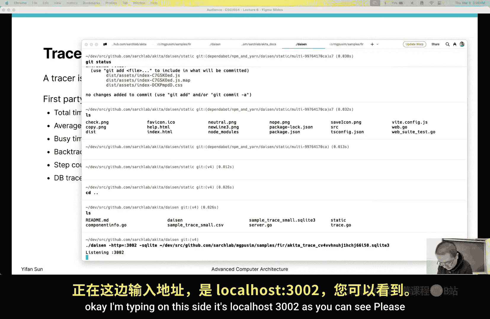
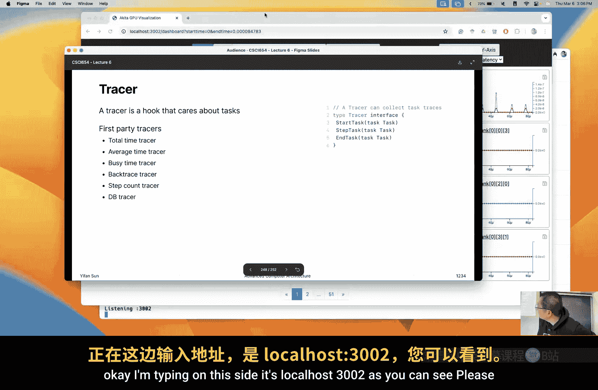
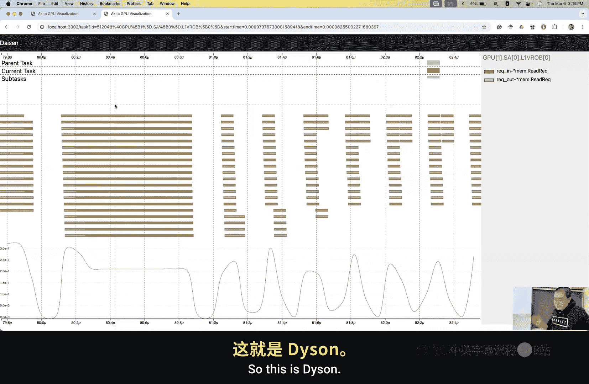
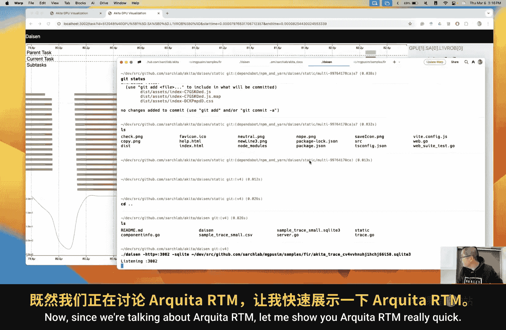
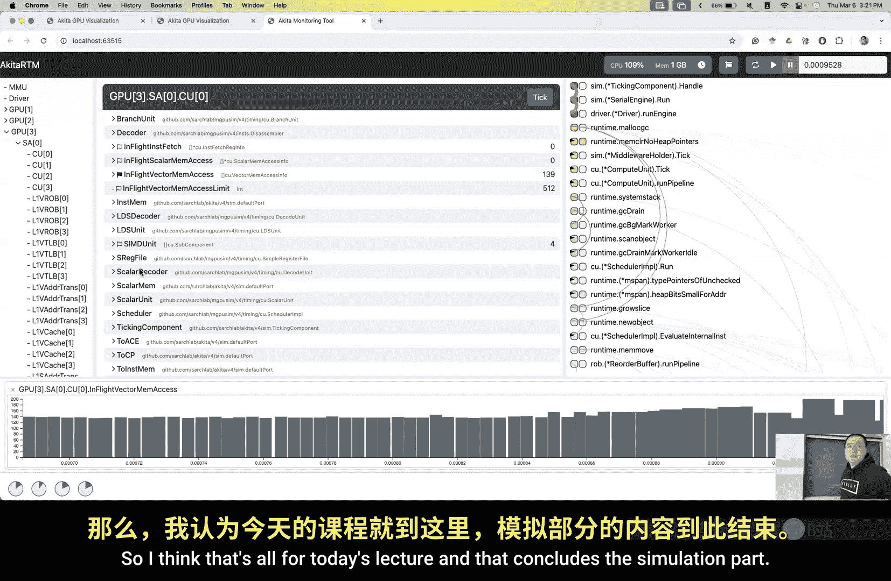

# 威廉玛丽学院【中英⚡高级计算机体系结构｜CSCI654 Spring 2025, Advanced Computer Architecture】 p10 P10 计算机体系结构模拟 4 -BV1evfwBVEUG_p10-

So we're going to spend one more lecture on simulation then basically trying to fill out the holes that we haven't solved in today's lecture。

 So next week is spring break。 There will be no lecture。 then after that。

 we're going to come back to architecture and we're going to talk about how a CPU core is built。

 Okay， but this time let's finish the simulation part。

 So I think one last time we're talking about smart ticking right and how to write this type of like a regular。

Components for Akita。 then there are some problem that we haven't solved。 For example。

 the secondary events。 So we haven't talked about secondary events。 So why we need secondary events。

 Its not very complex。 It's basically the same reason as last time when we are talking about。嗯。

The pipeline， how we implement the pipeline and how why we need to write the thing that happens last。

That to make it execute at the beginning of a function。 So for secondary event。

 just consider there are three ticking events， right， there's two two components and a connection。

 There are three ticking events A B and the connection itself in hardware。

 you can consider there are three combination logics right controlling two set of registers。

The registers are buffers within the port。 Then in a simulator， they can exclude in any order。

 we were excluding in， for example， in a way of a first take then connection tick then B tick。

 in this case， in cycle 1。A stick A will create a message in the buffer。

Then connections take connection will move it to the destination。

 then bet we will take it and consume it right So there's a problem that we're receiving the message at same cycle as we send it This is not shouldnt this is something that shouldn't happen in real hardware so should prevent this from happening So how to solve this problem and the solution is easy。

 we can simply make the events that delivers the message always happens later than the events that consume messages So what's the events that delivers the message。

 that are basically the events that happening in the connection right so in that case we set the connection to be a secondary tick component So it's event its event is always scheduled as a secondary event So if events that are scheduled at the same time if not event that are scheduled at same time。

 we always first execute the primary event。Then with X the secondary events。In that case。

 we prevent this behavior so that。If we can guarantee that connection tick is always excluded later than A and B's event。

 so assuming here A and B stick we can no matter which what is order。

 but when a stick and B tick is happening A will create this message but the connection will not deliver it Now after that this is secondary tick。

 then connections tick will deliver it is' still in cycle 1。

 but since B has already ticked in that cycle it cannot take again it cannot consume In that case in cycle 2 Bs tick。

 then it will receive the message the cycle after we send it then we have solved this problem。Okay。

 so that's why we need a secondary event。Any question？嗯。Why I have duplicated this part。No。

Probably accidentally copy paste than a slide。 It's okay。Okay。

 this secondary event is rather easy to understand。 It actually creates some performance issue。

 especially for parallel simulation， because we have to first execute the primary event。

 then secondary event， right， So it's a。Then is something annoying。

That we have to add actual synchronization between the primary event and secondary event。Now。

 another thing that we haven't talked about is builders for every component or every。

Many things in the simulator， we use a builder to create to instantiate a class。 Now。

 what are builders。So builder， they still look at R B as an example。 This is R B builder now builder。

can。Build or instantiate realor buffer components。 right， So this is the builder as astruct。

Then there are some field， some properties of。Of an R O B as properties here。

 Then make builder is a function that instantiate a builder。It never take any argument。

 but it provides the default value。 For example， frequency with default is to be 1 gigHz number request per cycle to be4 buffer size to be 128。

 Okay， so those are default values。 if we don't set it， this will be the value used in RB。

 Now here there's a convention in go。 So when we say make something。

 we should return the value itself。 if we write new something。

 It should return the pointer to the thing。 Okay， So just a convention we say we make builder。

Now in AMakeBuilder， we create many width functions。It's always start with。

 and it's a with something， for example， with frequency。Frequency is a given value。

 Now we simply started to be property as a set。 Okay， so with function。

 you can see with engine with frequency with request per cycle with buffer size。

 basically one property， one with function。And these are these functions。 Finally。

 we use this build function to。Set up the necessary things。 For example。

 we need to say transaction is a linked to list Now we have to initiate。 This is a map。

 We have to make it。 then buffer size。Parameterters， now we have to assign the parameters。

 And for ports， we also need to instantiate the ports。 Okay。

 those are all parameters regarding this component。能。This is how we use， Sir。Buildder。

So here you can read it as if it's English。Real buffer make builder。With this engine。

 with this frequency。With this buffer size， with this request per cycle。

 and eventually we build within this name。Okay， so we can write it。If it's not too long。

 you can write in one line of code， but typically we change lines in this way。

 so it's rather easy to read， easier to understand， and then you can see how we set up the variables。

This is a builder， then this is a very common type。A common method that would use Ada。

So since we're talking about builder， builder itself iss a pattern。 it a it's a program pattern。

 then here I also want to talk about the strategy pattern is probably the most important。

The most important patterns that I find is most important， I really like this pattern。So what is a。

Strategy pattern， for example， in realor buffer， we have an engine， right， So basically。

 we're saying。Right。Eine is a dependency， right， So this is the same figure as the dependency inversion。

 And this is a particular pattern that can help us to implement the depend to follow the dependency inversion principle。

So this is an engine， right， and the R B depends on engine， and we depend on the interface。

 So we also say this is a strategy that R O B uses。 R B requires an engine strategy。

And in this strategy， we know， okay， this is a strategy category named as engine。

 and what are concrete strategies， We have a zero engine， and we have a air parallel engine。

 and they are different。Strategies， concrete strategies that we can use。 right。

 so at the configure time or at a time when I call a builder， we。Set up which exact。

 which concrete strategy that we want to use。So this is a strategy pattern Its rather easy to understand。

 but is actually very common commonly used。So if you find this one is a little hard to understand。

 let me introduce another example。For example， a cash requires a replacement policy， right。

 A cash requires a replacement policy。 then in the。

If you have never learned program pattern or program principles。

 you would probably write some code like this。Well， there's no chalks。Vder talks。啊。Supertini pieces。

So you may write some code like this if。诶 policy。Equal L R U。Then you do this。And then。然。Ise if。

诶 policy。Equals。Rundom。You do something else， right。

 This is a very common way to write these type of things。 And this is a bad type of like。

 we call it code smell。 right， This is a typically， if you see this type of code。

 it's suggesting that your code is kind of not。Flexible enough。 now。

 it actually violates the open course principle。 will talk about that later。

 But rather than using this way， we would simply do。Cash。Dot replacement policy。Ill just write R P。

Replacement policy。到 evict。ok。Then it will tell us which one to evicict and the implementation is within this RP。

 Now it's really about which one you want to use， you should use the builder to set up the right eviction policy that you want to use。

Okay so。Then we say。We need to select the policy when we build the code， right， When we build。

 when we configure the code。 So that is another。Another pattern。

 This pattern is not the traditional pattern。 It's not in the the design patterns book。

 but it's a commonly used a pattern called dependency injection。

many I think many of you probably have heard of this name before。 This is a common name。

 So how it's used in Akita and MG Sim， you can see I have two different ways to write this code。

 first is new cache when implement cache I create a policy and I write LRU policy Then if you write this type of FL code。

 you don't even need a policy right。Now here we're saying。In this way。

 this new cache takes a policy field， and we first create a policy。

 then we create a cache and then create a new cache， which is the we give it a policy。

 So what is our dependency。Cash depends on replacement policy。So cash。

 the replacement policy is a dependency of the cache。 Now， what is injection。 So in this way。

 we call it self defined dependency。 So we give it our own。

 We provide our own or the cash creates its own policy。Its dependency On the other side。

 we provide dependency externally right we provide dependency externally。

 and this is called injection。 injection means we provide it from external and we put it in right in this way。

 this this new function or sometimes as a constructor in other languages。Can somehow serve as a。

Depenency injector。Right， so this is a dependency injection pattern。 then here in all case。

 this is or dependency injector。 So builders are dependency injectors。So we inject the dependency。

Using this builder build function。Okay， then those are a parameter setup up。

 You can also think think this is a parameter setup。

 but this is a dependency injector to provide the dependency that the component wants to use。

Now we say dependency is more flexible because。We can easily change it externally。Right。

Now since we are talking about open close principle and design principles。

Then open closer principle is the most important principle。 And I would say。

 all other principles are。There， because we want to achieve open close principle。

What is open close principle is。Software entities should be open for extension。

 but closed for modification。Or in another way， understandable way to say this this term to explain this term is。

A sovereign entities， a class or function or whatever you want to write should allow its behavior to be extended without modifying its source code。

So， for example， here。If you write this type of implementation。

 if we want suddenly want to write a like AI based。Policy。How we can do it。

And you would continue to write it by providing another L。Right。Then this is modify the code。

So why we don't want to modify the code。Because the code is there。

 It's already working and you don't want to modify the code。 it's very likely to break it。

 So you want to prevent modify existing code as much as possible， but you want to add new features。

 We keeps wanting adding new features。 Then when we want to add features。

 we want to write a new piece of code。Rather than modifying the code that is already there。

So how we can do that then strategy patterns can help and other patterns can also help For example in strategy pattern we have LRU we have random。

 but we can implement something new right now if we write something new and use the builder using dependency injection then were modifying the behavior we're extending the behavior without modifying the code we're not modifying the cache code we're simply providing another piece of another you write another file then it's good enough to support this feature。

那。So following this pattern， then。Or following this style， Then typically， I consider my code。To be。

3 part， three types of code。 The first 1 I call is data。RightWhat is a data， A request is a data。

 event is a data then。A component itself。 If you consider middleware。 then I'm not saying middleware。

 I'm only saying the component itself is data because it records the state of a component， right。

 Then those are data， pure data。 Then we should minimize the behavior as much as possible。

 It should be pure data or state representation of a component。

Sa representation of some state of your program or ver simulation。Now， what is behavior and behavior。

 they can consider engine is a behavior。 Then components middleware their behavior。 Now。

 those are behavior。 Then eventually we have glue code。 G codes come combine everything together。

 Now what our glue code。 They are typically。Like builders or different type of builder or the code that cost the builder or even the main code main function。

 they are considered as glue code and they just combine different things together in a way that you are expecting。

Okay， so three type of code that is in MGPM for every piece of code。

 I'm pretty much sure it can be categories in one type of the code AMGPM。Any니 are다。人。

So I'm trying to finish all the patterns that is related to Egyptian and Akita as much as quick as possible。

 So I'm really rushing the patterns and are lots of patterns。 So then media pattern。

 Mediator pattern is another very important pattern。 What is a mediator pattern。

 So media pattern is a pattern that defines an object。

That is a behavior object that controls all all other states， what other states。Are doing。 So。

 for example， just consider this is a message。 Okay。

 then my middleware will read the state of the message。 read the content from the message。

 Now if this is a read message， then what I do is I will。I will change the state of my component。

Okay， if if this mediator is a behavior is a middleware， I will change the state of the component。

 At the same time， I will create another message as a response and send back。

 So a mediator is a pure behavior。Component， a pure behavior code that controls the state of others components。

 Okay， so then we should in this way， we should try to avoid mediators to work with another mediator right。

 So this mediator should only directly work with the state and read the state and take some input state and generate some output state。

 That's what behavior should that the mediator should be doing so that maps also map back to this behavior pattern this behavior type of code there。

 I consider their。They are mediators。Let take some data information from one side and modify some information from the other side。

Now this is actually very useful because whenever I have Uni test， I don't need to test the messages。

 I don't need to test the component state， I only need to test mediators。I can see if it's。

If I give it a state in this way， does it really modify the state of this component of this element。

On in the desired way。 And if it's actually creating a responding messages， right。

 So I only need to test the mediators and I don't need to test all other parts of the state。

I only test the behavior， and I don't need to test glucose code。So for unit test。

 I try to have full coverage on the behavior part。 I don't need to test the data。

 and I don't need to test the group code。Okay， so。We can。We can have a quick。

Review of all the patterns。Not all the patents， all the principles that we have learned。

 we still have one more pattern to introduce。So why don we say principles。We consider solid。

There are a few other patterns for them do not repeat yourself right are sorry there are other principles like do not repeat yourself。

呃，你是靠拽。Do not repeat yourself。 This is another principle。

 but this is a relatively easy principle to achieve。 And for solid。We have learned S， O， L D， right。

 What is S。As a single responsibility principle， right， we want to have for every company， for every。

Co。We wanted to have one and only one responsibility。 For example， here。

 if you have each state as one class， then it naturally only have one responsibility。

 and if if it's a behavior， then it will also only have one responsibility especially if you try to separate the policies from the main behavior。

Then each policy or each strategy， like our L R U strategy or random strategy。

 Then it's almost almost naturally。 you can follow the S principle， right。The O principle。

 I will say O principle is the most important principle is open for。Extension。

 but close for modification。 You can modify。 you can add features by writing new code。

 but not modifying an existing code。That's the O principle L we haven't talked about L then I principle is for interface segregation why we want to do interface segregation。

 we want to have each interface to be as small as possible then for each component whenever you have a dependency you only depend on the minimal part of this of your dependency right why is not because if you depend on fewer functions。

 it's easier to replace it if you depend on many functions that don't even use you may probably have to implement something that your dependency your your main object is。

YouYou may have to implement some other functions that you don't depend on。Now finally。

 is dependency inversionion， right， Depend inversionsion is almost tells you that you should never have a。

Meditor that directly depends on another mediator。RightYou have should ever have a mediator that depends on another mediator。

You should have a mediator depend on interface then implemented。

 That interface is implemented by other mediators then。In that way。

 you can always replace the strategy you want to use。 So the overall goal。Is eventually oh， right。

 I can replace whatever I want without significant changing。The logic， the real logic code。

 but I can change。My behavior in the glue part， in the glue cold part。

 where I build this whole component， I can change to whatever I want。ok。So。Now。

 one thing that you probably have seen the code about hooking and tracing。

So that's probably the the biggest part we have to introduce。It's a big part in。I kid up。

 so why whoing。So as you have thin in reorder buffer。

 when we implement reorder buffer and even implement the of the engine， right。

 we focus on the main logic。 I don't want to try to you write a lot of。

C that is not essential in our program， right， So sometimes we want to record the data， for example。

Record what events are have excluded when messages arrives at a port or。What， what happened。

 What the instructions are executed in a core component。 So those are task of recording data， right。

 So what data I want to record。It's hard to say。 Then this time I want to record this data。

 Next time I want to record that data。 Then a easier way to is to add print。

 than when you add a lot of print。It's violating over right when you add a lot of print。

 if I want to record some new data， then I'm modifying my code。嗯。

So sometimes some ad hoc print is okay， but sometimes if you want to formally support some feature by recording some data。

 this adds add complexity to your code and your code will eventually become messy and your function will become very long。

 You don't want this to happen So we use hooking to separate the concern of logging the instructions and the execution of the instructions。

And many other things that we can log and trace。Then sometimes we want to modify the state that is not part of the regular logic。

 For example， in a very specific type of research in computer architecture is called fault injection。

 So we have talked about say the cosmic ray may hit your CPU and may make 1 bit flip from 0 to one or1 to0。

 in that case， that's definitely not real logic that you want to do。

 you want to implement in your code and you don't want to write if lot of if。E fault injection。

 then select a random bit and flip。 You don't want to write this code because this is a very rare。

 very corner case Now you want to simulate。 So what we can do。

 we can We can implement fault injection as another piece of code that can somehow somehow manipulate your state。

 right， So those are。Spial cases that we want to do， but we shouldn't implement in the main logic。

 Then we use hooking。So consider this is the main thread that we're executing and hooks are something that if we want。

 we hook onto it if we don't want， we just take it off。Okay。

 then it can be attached to this main thread and to take some actions whenever something that happens。

 something happens。There is another pattern。 This is probably the last pattern that we have to introduce。

 There are many， many patterns， but we only introduce the sum of them。Observer pattern。

 Or sometimes this is even called subscriber pattern。If you want to call it a hook pattern。

 it's also okay。 People typically understand。find this diagram online。

 and it's very concise and very easy to understand。 So here's the subject。

 Subject is our main component that implements the main logic。

 right Then we have an observer interface。And there are some observers that implement this interface。

 They simply implement an update function。 Its a very simple update function They need to implement to take the action of this observer。

Then the subject should have an observer list that maintain who is my observer then。

It should allow register observer provide an observer。

 which simply adds to the observer list or remove observer。 in Akita。

 we don't even need to remove it once it's on， it's always on。Now。

 the most important function here is notify observers。 At the right time。

 we need to all notify the observers that something has。Happened。ok， so。

Then we basically these observers allow us to define this behavior at configuration time。

 If I want to do for an injection， I can attach this hook if I don't want to do that。

 just not to attach it at the execution time at the configuration time。

So when you say configure time is basically when you start a piece of program。

 you first like construct the hardware that you want to simulate the benchmark you want to simulate now when you call engine or run。

 you're actually doing the simulation， right。So engine now run is the real simulation。

 at the beginning is the configuration code。So what is the implementation of a hook then is actually very very simple。

 it takes a hook and interface， and you only need to implement something called a funk。

 then it takes one argument that is called context， hook contacts。What is a whole context。

There are four things in one context。 The domain is the hookable is the component。 main component。

 Okay， I call it hookable。 We will see how hookpos are implemented， so。There's a position。

 What is a position。 We can name these positions in this way。 These are kind of like global variable。

 global variables or global constants， right， So those are。Positions。

 so sometimes I may say this is a hook pose before event。 before this event are being processed。

 hook pose after event。 and this are after this event， this hook will be triggered。

 So this position will tells me if this is something that I may be interested in。

Item is the thing that you， you care about。 For example， if you care about a。

If you care about an event， then that event is the item。Okay， if you care about the instruction。

 the instruction is the item。 So this is about what you care about。 Now。

 detail is basically whatever you want to attach to this hook so that you want to attach this to this context so that the hook may or may not need to process the information in detail。

 you can attach whatever data you want there。So。Hookable hookable is the main component that can take a hook。

 right， So it takes three， there are three methods。 accept hook。 we take a hook。 The number of hooks。

 The hooks is basically returns out the hooks that are registered。Okay， so here is a。

 and also another important function is a invoke hook。 whenever we call invoke hook。

The implementation is super simple。 Its basically just eat it through all the hook list and call this function called the funk of the hooks of the hook。

 Okay， so notifying the hook。 Okay get this happened。

 then do I whatever you want if you're interested in it。Now how we call this one， how we call a hook。

 you can see this is the engine， right。The engine run function。Now， when we get to this event。

 we create a whole context。In this hook context， we have a domain that is the engine itself。

We have an item。 That is the event。Then the position is hook pose， hook position before the event。

 and this is triggered before the events happened。Then we involve hook within this context。

After the event is being handled， we do post， hook post after event。

 which just were reusing this context， but were just changing the position then we invoke hook again。

Okay， so I I would call this thing whenever I write a hook， this is the observable behavior。

RightSo at this point， this event being executed is observable because you can attach a hook to observe this behavior。

 otherwise your simulation will keep running， keep running then you you cannot grab any data out of this main running thread。

So those are you if when you write a。When you write a piece of program， when you write a component。

 you need to consider which part is observable if you want this thing to be observable。

 leave a hook there， then eventually it can be consumed by a hook and to extract this type of information。

Then typically whenever something started for them at the start of an instruction。

 the end of an instruction， the start of a transaction， the end of a transaction。

 those are all observable actions or observable events now will leave hook positions so that hooks can monitor those behavior。

Okay， then a minor thing is this code may have some performance overhead。 and actually。

 the performance overhead is even not very small， not really because。Because of calling the hookops。

 but many sometimes this thing。Go is a little bit different from C or C plus+ in C or C plus+ and this is something that is typically allocated on stack。

 but go may allocate it on a heap。So if it's on the he， it may need to garbage collection。

 So allocating memory and garbage collection can take a lot of time。 So it's one of the。

ProPos that we may look at performance improvement opportunities。做。Okay。

 then we just want to see one example of an event logger。

 So event logger is a hook that can be attached to an engine。

And this it's it's only interested in this invoke hook this function。

 like hook before hook post before event position。 only care about this position。

 that whenever we exclude this hook， which just simply printed。

 It just tells me what events are being executed。ok。So let's see how we implement this one。

So we say this an event logger It's astruct then with a log hook base。

 which is basically take a logger。No， in the main function， no， in the funk， it takes a context。

 right， And in the context， we first check if this position is something we care about。

 If it's a position that we don't care about， we return。 We don't， we don't do anything。能。

We check if this component if this item is an event or not。

 this is a casting downcasting syntax in go。 So we're casting an item from an interface type to an event type。

 So if it's an event。 if it's not an event， we return。 This is not something we care about。

 we return。Now， finally。We。Basically， we print it out， right。We print it out。 It just say， if this。

 this。Event handler is if it's a component， if it's a component， we record its name。

 If it's not component， we don't record its name。ok。So it's just a little bit more flexible。

 but basically。It's a print。 We want to print this。 What's the event。

 What's the time right So this is a very simple， the simple as a hook that we have implemented in go and how we can attach this hook onto an engine here we implement in this way see an engine right we create an engine if user wants to use parallel engine。

 we create a parallel engine。 Otherwise we create a zero engine then we attach a hook。

 we instant this event logger and we attach it to the engine。

Then this engine attached with this hook and all the events will be printed。

 and your whole program will exclude really slow because print has a lot of performance overhead。

Okay， if if you print to a file， it's probably okay， especially if you print to a terminal it's。

Thouands have slower than without printed， but sometimes it is just a debuing mechanism。

 So I typically will keep this line here， but for most of the time， I just comment it out。

Because I don't want to see this type of events being printed。Okay， any questions so far？

You went longerger。ok。Smll a level forward that。A special type type of hook is。

In the tracing is implemented in the tracing package， none。Basically in the tracing package。

 we don't care about events， but we care about tasks。What are tasks？

You can consider each task contains two events。A task event is almost is always a。Single time。

 like a immediate thing， right， happens at a single time。A time， then there's no duration。

That's an event。Now a task is a pair of event that something started and something ended for example。

 I exclude one instruction when I started to exclude this instruction and when I'm done with excluding this instruction。

 so a task has a start and end time。And also， if you look at the fields here。

 what are the fields here， there's an ID identifier of this task。

There's a kind and what that depends on that describes what task it is。 right， A kind is a category。

 What is a。As a description， I want to， I really want to name this kind as type。 Then later。

 then I realized type is conflicting with the type keyword。 So now I have to name it as kind。Okay。

 so kind what where。 then I have only one where field。

 That means one task can only happen at one position。ok。

So one task can only happen at one location if you think， oh， an instruction may need to say， oh。

 it can needs to be executed here and pass to that position and being executed here and pass a few different places。

Just consider their。Different tasks， okay。Then the most important part is the start time and the end time。

The steps are basically， we currentlyt use as tags to this component to this task。

 Then we will see how it's used later。 detailtail is part of the information that is。

You can attach to a task later on， it may be useful or may not be useful。

Now parent task is the most interesting part now always say。We find this is a。

Super simple implementation that eventually it enables a lot of things。So啊。

The parent ID field or the parent task， we don't really have to enable both of them。

 It really depends on if we want to serialize into adjacent format or store it into a database。

 we probably only want to keep a parent ID If we want to use it。

 we probably can directly keep a reference to the parent task as you can see on the right side。

 this gives the instruction about how to serialize it into adjacent format。能。

Whenever we have we have a parent task， the parent task may have another parent task。

 So you think this parent task， your whole。Tasks of your program institution forms a tree。

 If you consider a rule task is called simulation。Right。

 it's called simulation and may always have an idea of0。 Then in that case that's the root。

 Then all other tasks are leads of this root。 Okay。

 now it will make now we start to understand the whole execution as a whole tree of a graph that we have to execute this component these tasks in our simulation。

Right， then we provide special APIs for task， for handling task。

 but theyre basically rappers for to for hook invocations。Okay， so we have a starting task。

 We start a task with an I D。 What's a parent task。 I D。 What's the domain。 It's a named hookable。

 It's a name and hookable。's a combination of two different interfaces。 What's the kind。

 What's the type， What's the detail。 If you want to attach detail。 for most of time， details is new。

When we start a task， we call this function， when we end the task we call this function then for end task is super easy we only ID and the domain now so that we can map with the original starting task right if we can map with a starting task we know the end time that's good enough now we can store it we can save it somewhere。

嗯。So this is the end task。There are nothing special。 Theyre rappers for invoking hos。Okay。

 so the will create a task。Willll create a taskstruct within this。

 within this this star task and end task function calls。 And those are items， right。

 And this domain named hookable are the hookable that we。

Are the domains in the are these domains in the context and the position is always something like task start and task end。

 Okay， so it's。It's not something this。Dedicated code is just rappers。Then。

A very special thing of a task of a very the most common type of task。

Is when we're handling requests and handling responses。

Just consider a core sends a memory request to a cache。Now， this is a task， right。

 this is a task that start at time time that when this this request is first created or first time it's being sent out。

We typically consider when this is created because sometimes you may。诶。Buffered in itself。

 Wait a little bit before sending it out。 We want to record the earliest time as the earliest possible to record when this request is relevant so the start time is when this request is created and end time is when this response is received right We consider this is a task。

 This is a time that it takes for whole memory transaction recording the end time and minus the start time is the duration。

Or the latency of this memory。Transaction。Then this task。

 consider this request is sent to a receiver。So this is at the cache side。On the cash side。

When we first realized， okay， there's a request。 It's the task when we receive this task， right。

Is when we retrieve from the port。So this time is when the request is received。

 so it may be buffered outside this component for a little while。

 or if there's a network take some time to send this message to the destination。Okay。

 so there's always a small。Small gap here between the start of the parent task and the subtask。

 There's a small time。And it may take for some time。

 take some time for the cache to either either it's a cache hit or cache miss and it may take some time to process it。

 So eventually this task is completed。 We have the data ready。Now we can send this data back to the。

To the the the requester。 Now， it takes a little bit more time。

 that may be buffered at the requester side， or the network may take a little bit time to deliver the response。

Then， but this is another critical time that is the request when the request is completed。Okay。

 so we just give it a kind， this is a request out， we send out a request， and this is a request in。

 we receive a request and process it， respond to this request， and process this request， right。

Then we always point a parent task this request in has a parent task of this request out。

So one request。Two tasks。Right，Because with this request has two different location。One request。

 two tasks and four critical data points。We provide specialized API to handle this。We name it as。

Initially initiate is when is first being relevant is initiate。

And when it sends to a destination is receive， when it's completed， its complete。

 and when it's finalized， it's finalized。Okay， so four。Simple APIs。

To record the life cycle of every request。Then still。There are rappers around star Tk and end task。

 So two levels rappers， right， These are rappers of star T and task。

 Star T and task are rappers of a of a hook invocation。

So we provide these four convenient APIs to handle this request out and request in this type of specialized。

Taskks。Then， finally， tracer。What is a tracer？A tracer is a hook that cares about tasks。 right。

 So we say whenever we call those API， these APIs are eventually rippers of hook invocations。

 So then we need specialized hooks that can that care about those。诶。Those tasks， right。

 So then we need to write a tracer。 The tracer is also very simple。

 It only need to implement three functions。 When is start task， when is step task。

 when is the end task， step task means it's excluded in the middle。

 And if there some actual information need to be recorded。We only use it for one purpose right now。

Is in a cache to record it a cache heat or cache miss because at the beginning we don't really know it's a cache heat or a miss at the end we probably don't care it's a cache miss or cache hit so it's only the time it takes a little bit time for us to look up the tag tags then to check it a cache heat or a miss then after we check that we add a task we add a step to this task so that we know it's a hit or a miss。

Okay， so a choice is a hook that cares about tasks。

So we provide a list of first party tracers and those are tracers that are provided by Akita that can be used。

for example。Total time tracer。 So by the way， most of the tracers。

 the first party tracers accept a filter。 So for example， if you only care about one type of task。

 you can filter out。 you can only you can focus on one type of task okay。

 to includes a filter so you may probably only care about one type of task or one type of event。So。

 for example， total time tracer。 What is the total time tracer。哦。

 do do we even use total time tracer or probably don't even use total time tracer。ATotal time tracer。

 for example， for if we attach a total time tracer on a cache。

 that's the total time that this component， this cache is handling all those incoming requests。Okay。

 it's the total time。 So request one takes one second。 requestquest 2 takes another second。

 when we sum up， the total time is2 second。ok。So that's total time tracer。I don't use it。

It's not useful。Because we need to consider overlapping right。

 So if we process one request and process another request and the overlap。

 summing them up doesn't make any sense。Yeah， one place now we may we may care about that is whenever there's no overlap for I think。

It probably can be used in the AO U to calculate the AO U utilization。

So like start off a calculation and end at a calculation。So that's total time tracer。

 then what is the average time tracer that is widely used everywhere。

 So for them we care about what's the average latency at L1 cache level。

At L2 cash level at the D run level， also from the course perspective was the average latency of my memory transactions that can tell us a lot of information。

 So the shorter the better， right， the shorter the latency， the better that's every time tracer。

Busy time， tracer。So busy time tracer that it considers overlaps。

 So if there are two tasks that overlaps we start time end and time。

 we only consider global start time end time。 If there's a gap。

 there's something in the gap we will also discard a gap part。 right So basically that means。

If this component is at least processing something。

So how is used is's only used in one position is at GPU level in MG。

 we calculate the total time that。We call it a co total kernel time。 So GPU exclude kernels。

 A kernel is a GPU function， right， So we calculate how long time this GPU is busy。 It's being used。

 So we have a busy time tracer applies at GPO level。

 So we know the total amount of time that this GPU is at least running one kernel， one function。

1 GPPU function。 Okay， that's a total time tracer， busy time tracer， okay， back tracer。

What is back trace tracer。 This is recent relatively recently implemented， so。Actually。

 a very annoying thing about writing。Pycho based or psycho based style or even event driven simulation is it's very hard to debug when there's some  error that triggers。

Then when my program crashes。My， the my， my crash will print a back choice， right。

 The back choice is something like。Event。Dotic。And sorry， engineotic。Andine nowtic， then is my core。

大 tick。That's it， right。It's only two levels。 I don't have much information。

 why it's tick what it's doing， Why it's crashed， right。So。

With Spec trace tries tracer because it's a tree。 Now we can tell， okay。

 when we are executing this particular task。We crashed。You will tell me。This is a MMU。

The translation。Then all the way is a tub。L 2 TL B L1 and C呃 C U。Instruction。What's the instruction。

 right？ You can tell me。Architecture architecture related batteries so that I know， oh。

 we excusing this instruction， this thing failed。Okay。

 at least it provides more information for us to debug with the problem。That's a bad choice tracer。

And step con tracer， Okay， step con tracer is also widely used， remember。When I say for cash。

 we calculate what's the percentage of cash hit What the percentage of cash means， right， So we。

 so we count't every。Step every type of step。 Then we count how many transactions hit。

 How many transactions miss。 So that's a step tracer。 Now finally， it's the D B tracer。

What's a DB tracer， DB tracer is rather simple。For whatever instruction。

 for whatever tasks that are being traced with storing the database。O。

 we stored it in the database so that we can recover the full trace of the Mum execution。ok。😊，小。喂。

Those are the tracers。Then I want to show you how this tracer is being used in a real world environment。

 so let's try to execute some program， some my simulations。

 and I want to want you to show how this works I can basically play with the last two slides you see there are two big parts rather than giving you slides I would do live demonstration here Okay。

 think it's more much more interesting。How I can do it。 Let me start a new terminal。

 and I'll drag this terminal here。How I can see it。I have to look at， look back。啊。so it send dysson。

 ok。CD do dot。跌滴多多。Let me check out before。You see V4 is our main branch， right I just。

YouAs you can see， I didn't really prepare it。 So I， I pretty much。系。I try my best。

 at least every time I want to show it。 it should work。 Okay， now C D do dot。

 you can see in our lives repository。 There's a few repositors here。

 Then Akida and M G are definitely the most mature repositors which run C D M G S。

 if I run FR samples。As you can see the samples， these are。Say AE， S， F IR， those are all benchmarks。

 right， So we have a support AE S benchmark F IR benchmarks。 But let's go to F IR。You can see。

Go build， me run quickly run a go build to reflect the most current status。Well。播。Just make sure。

 go build。Theres are some really。Recent update。 Now if I run the slash FR。

 then I can run a dash timing dash lens。 don't want to run very long Let's run a relatively short example。

 then I can run a dash dash report okay so go is rather flexible with the argument type。

 you can either do double dash or you can do a single dash then go will accept both format and for lens。

 you can either use a space between lens and  a0182 or you can use an equalcos So go is very flexible on this argument type。

Now we'll execute it。Then it's done。 right。 Then if I L S。

 you can see this matrix star CSV is being created。Now you can open this file。So we can see。

These are the data that is being extracted from the program and all this data。Are from tracers。Okay。

 so as you， I want to show you what are those things， For example， driver kernel time。你 sister。

Busy time tracer right， or total time tracer。 I think it's busy time tracer。 And driver total time。

 Now iss another tracer。 We typically care the most about this one， but it， it can be also this one。

 This is common。Its still kernel time。 So this is what field。 This is where field。

 So just be slightly careful。 This what and where cannot directly map to the what and where in the tasks。

 Okay， these are say this information is extracted。

Is the kernel time information extracted at the command processor？And this is the time。

 the C0 was the instruction count。That's a tracer that I didn't mention。

 It is a number of task tracer。 right， How many times now we executed a task is being triggered。

 So this， this task is executed 1568 times。Right， so there are many of them。

So there are many of them。Many lines， let's go to Comp unit。Then C is compute units。

 and let's keep going。 It's very long file。So here。Say busy time is each C D has a busy time。

 How long time is busy， This is used for AOU utilization。The here。mstand this。Part a little bit more。

 You can see request average latency。 That's average latency hook， right。ReRequest reency that time。

 Then， remember in。In Akita and Mism， our time is in second unit。 So those are second。

If you keep going， you can see rate heat is 299 times and red means is 17 times。Okay。

 so now we can easily get a cash hit rate。And keep going。Now at the end， we have our two cache。

And also， T O Bs。Now， if you don't know what A TV is something that we're going to cover for a second half of the semester。

 at the DR， how many transactions whats the read average latency and what's the right average latency？

Okay， those are all like right side。 It's a customized tracer。

 but the read request latency and red require average latency are every time tracers。 Okay。

 so those are all collected by tracers。So those are different type of tracers。

 Now I don't want to save it cancel。 Then let's run this。 as you can see。

 there are many SQ light files。 Those are the result of D B tracer。 but let's run a new one。

到slash fR timing。I still don't want to run too long， I just want to run a short one。Right now it 192。

 but that's choice。With， so basically trace width is a D B tracer that applies to all the components that I know。

Okay， so it will extract traces from the simulation。As can， as you can see。

 I rather only printing the monitoring simulation with something。

 Then we also print trace is collected in database。 So 6，6， I 5，0， right， So that's the SQ I 3 file。

 And if I L S， you can see。6，6， I 5，0 is the SQ life file。 that do we just collect it。

Let me go back to Dyson then。Wder。Why there。No， there's no， no problem。So what is Dyson？

YeahI just want to make sure there's no update。 It's the current V4 branch。What is Dyson。

 Dyson is a visualization tool that can help us to analyze after the simulation is completed to analyze what exactly is happened in the simulation。

 So we typically find that。If sometimes we find oh time the performance is two times or as we expected。

 then why is it we don't really know then I typically find the people the student who is doing a experiment or just tell me a guess now I would say whatever evidence theres basically no evidence is just my guess so dysyson is to solve this problem to explain or provide evidence or help users to to examine what is happening in a simulation。

So how do star Dyson is in this way？Dyson， and let's use。 I hope this one works。嗯。Users。喺度你。

诶 dave s r c。geth。Tircle lab。诶 m g b。人。What's next， samples。If IR。

 then what's the one that we just created。哦。This one，6，6， I50， right？So we start this one。Then。

I need to open a。My brother。Okay， I'm typing on this side is local host 3，0，0，2。

你去看书。

Please allow me to refresh it。 Okay， the interface have some， some problems。哈。😊。

Does it work if I refresh it？啊。Now， please allow me to start a new type。No， okay。

 there's some problem with the。使よ。So there are some recent code mergers， Joe is causing this problem。

Tception。Yeah， it's， is there are some changes in the style sheet。

YeahYou can use like some private gross。No， there's， it's not an extension。

 It's just some recent code merges that。Breaks the interface。 Its okay。Use your imagination。 Okay。

 thank it works perfectly。 Now， but here， this part is the。

It's the component that actually is the weird field in all for all the tasks。So we trace。你先。

If we look at an L1 V cache。Now we can search L1 V L1 V cache。

Then it will search for all the things that contains L1 V cash。 right， Now， I can drag this graph。

Drag and release it。 Then will all of them will update to create alignment effect。 Now。

 I I can zoom in by scrolling。Now will take a little bit time to refresh。

you can see this is the data。 So what are the data that we're showing here for every component。

 we show two pieces of data。 One is the incoming request rate。Incoming request rate is the start。

 is the start of request in task and how many of them in per second。 So， for example， here I can see。

We cannot see iss1， E 8， right。The highest value that's the primary y axis is the incoming request rate。

1 E8， what does that mean？就。Remember or or GPU works in 1 gigHz right1 gigHz that's 1 gig is 1 e9 right。

 So 1 e9。 that means if it's 1 e8 or it slightly higher than 1 e8， that's basically 5 to 10 cycles。

 one request per5 to 10 cycles。That's how we can interpret this data。

 But there are some up and downs， right？So what are other fields？Now。

 here I'm typing average request latency。 So as I can see， average request latency。What is here？6 E6。

 right。You probably cannot see it very clearly。 The resolution is low。 So 6 E minus-6。Then。

 what does that mean is。To E-9，1 E-9 is。嗯。1 E-9 is one cycle， right， So this means is。

6 E-6 is 6000 cycles。Really 6000 cycles， but this is what data tells me。

 and so it takes a very long time。I can also see it， not see it very clearly here。So hopefully。

 if it's 6 E-6， then that's the information that I can read。

 So it takes a very long time for the every request to be handled。Okay。

 so what are other fields that can be processed， So we have a request completion rate。

Now you can see the completion rate is this blue lines。 So it's basically。

Mirrors the request incoming rate。There should be a side delay。Then。

 but I don't know why this seems going ahead of the。In incoming。 But this is the how。

 how how many requests that can be completed per second。Now， what others buffer pressure。

 This is actually very interesting。 So see here， this value is 2 E minus-1。So 0。2。 So if thiss 0。2。

 that means。On average， around this particular time。Its， it has fewer than one request in the buffer。

Right， so for every five cycle， there's one cycle that has a buffer in it。

 So it's a just consider the cycles within this range iss averaged。

 So how we can get buffer pressure from。The how we can get a buffer pressure from the traces that we collected。

 So all treess are tasks。 No other things。 all everything is task。

 So how we can get this information is basically。This is the。Time is， remember， this is a request in。

 And is there a gap between the request out and request in。 This is request out。 This is request in。

 So we basically how many。How many requests that is initiated。In request out， but has not started。

By request in on the request inside。 So it's considered this part。

 Now we calculate how many tasks are there。 Then it's not super accurate。

 And maybe there's some time that the is being transferred on network。

 but we generally consider this is buffer time。 being buffered in the added receiver side。 Now。

 using think this way， we can calculate the buffer pressure。

 If some component has high buffer pressure。 That means this component。Its not fasts enough。Right。

 so。This is one way。Never directly click this。 Okay。

 always do me and click otherwise your your your computer with freight。The a with free。

So these are something that we can see that are all the tasks that are completed by。This。

Completed by this。呃。By this component， what is this component it says it's L1 V cache， right？

 So if you look want to look at what's going on with this these tasks。

 and this task was the task I D。 This I kindness request in what is a read request where it happens is in L V cache0 started at this time and is this time and duration is 65。

 nanosecond。 So 65 cycles。So， so then I guess that's probably 6 e minus9 rather than or minus-8 rather than minus-6。

Right so it it's really blurry that I cannot read carefully read。Read it。So。

If I say that's just imagine this is a super long。Instruction。

 and I don't know why this one is taking so long to execute。Now I can go click this task。

 This is a hierarchical task， right， so。IThis is the current task。Now I can click on the parent task。

 the parent task。Then this goes to address translator。 As you can see。

 this is a address translation task or you can do this。You can come here。

 These are all the address translation tasks。 and these are all the memory tasks。

 So address translation takes relatively short time as compared to。As compared to the memory access。

 right， then we can keep going up。Keep going up。 Keep going up， going up。These。

 these are at compute unit， right， So see this one。 This is a map work group。 This is a wavefront。

 So you can consider wavefront as a thread right now。

 Those are all the instructions executed by this thread。Okay， and this long one。

 I can almost tell this long ones。 This one is a memory read request。 And this is a memory request。

 The those are the transactions generated by this memory read request。And if we click on it。

And keep going down， as you can see， this is a reder buffer， right。

 The reder buffer is something that you know the best already。

And prettyty much there's nothing to or reorder in this。Environment， or this is a good example。Okay。

 so let's just look at what's going on here。See this one。These are gun charts， right。

 Start time and end time， then。Why is nested。This is a request in。 So I， as a reorder buffer。

 I receive a request， but to to fulfill this request， I have to send another request to the bottom。

Right。To fulfill this request I so this is my parent task。 I send another request to the bottom。

 So this is a request out。It's another request。Now， you can see at this time。This。

 we send this request out。 We almost immediately send this request out， right。

 It returns really early。 have the data at this time。But I cannot return。Because。

This task has not returned yet。So have to wait for the first one to return。

 then the whole chain can start to return。They already， they all have buffer ready。

 but just because of the first one， it's blocking all of them so others can now return。ok。

So this is Dyson， since were talking about Akida RRTM。

That's let me show you ourA RTM really quick。

So RRTM， I need to run a long simulation。Let me use a magic memory。Okay。

 I run the magic memory memory copies。 I don't consider a memory copy time。 that can be completed。

Memory copy from the CPU to GPU can happen momentarily。ThenOkay， so this is ourkita RRTM。

Is it done by tracer No， this is pretty much not done by tracer So there are some tracers there that but there are some other mechanisms。

 so Akida real RRTM is for real time monitoring for MGPM so when MGPM is excluding。Arkia RTM。

 the return， Akia ITM turns the simulation into a server so that we can in look into the execution and see what's going on。

 Its said Akia RDM is implemented at the。Akita level。

 So every simulator implemented with Akita can automatically have Akita R TM。Okay。

 it shows it's using a little more than one core right now。 it's using  one GB of memory。

 And these are we can post the simulation restart simulation。

 And this is related to hanging H debugging is if the simulation is hung is not moving。

 we can keep We can force the engine to move at least the one。Saw forward。

And this is a quick buffer analyzer that as you can see or bottleneck analyzer。

 we can show which buffers have big values。 Now if if these buffers have big values， that means。

It's likely to be a somehow a bottleneck， right。So lets see what you can see here is L And V RO B。

 So we can see R O Bs are。Generry Global bottlenes at this moment。

At least somewhere below Rob B is not joining request fast enough。Now。

 we can see by percentage or by size， this is the size， and this is the capacity。

 or it's automatic refreshing。 We can stop refreshing here。And this， this one is a profiling。

 so we can quickly profile the a simulation， taking a one second sample。

 So this is a one second is a real time。 Okay， and this profiling the simulator itself is not the program being simulated。

And here at the bottom， you can see the progress bar。 So when there are many progress bars。

 I show them as bar charts。Okay， so green part is is。Is the threat that is completed。

 green blue part is ongoing and green part is not completed。And then you can go to this。

 these are all the components in this simulation and can go to C 0。 and let's look at this one。

 And this one is not interesting。Let's look at。In flight vector memory access this one may be a little interesting。

 so we can check this one and it will take a sample every second。

 It will send the request to the server。 and request will send the immediate value。

 The the value at that moment。 So we will draw a draw a graph。 So we will， for example。

 Ill show you this one is more than。More than 1，30， right， So it's a really high value。

 I can see it's probably a little bit broader on that it's a really heavily loaded part。

 There are a lot of requests that coming out， but it's not coming back yet， so。

The goal of our kitta RRTM is to finish a simulation。

 the analysis of the simulation without simulation to complete。

 we can do some analysis while the simulation running。

 So in after five minutes you start a simulation， we can know what's going on if there's some problem。

 kill it rather than waiting for the result to complete。Okay， so Akita。

 RDM and Dyon are rather unique features of Akita than。

Every simulator developed by Akita can enjoy this feature。 Well there are some really high values。

Okay， so I think it's all for today's lecture and that concludes the simulation parts。

