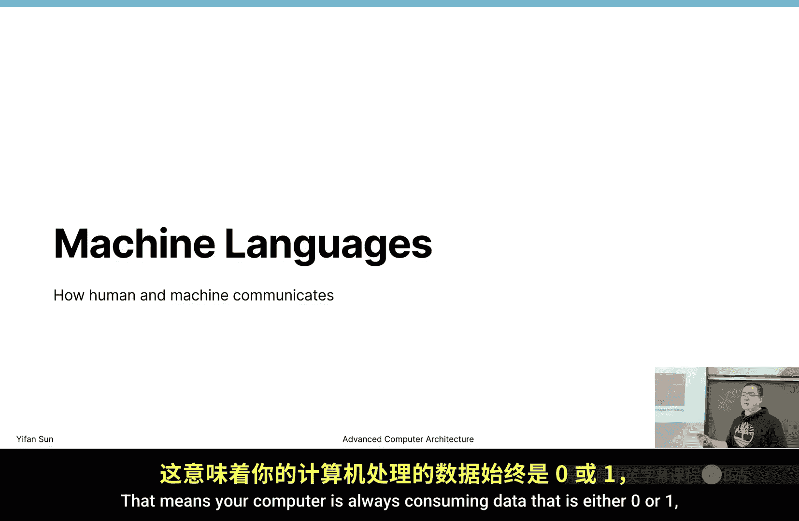
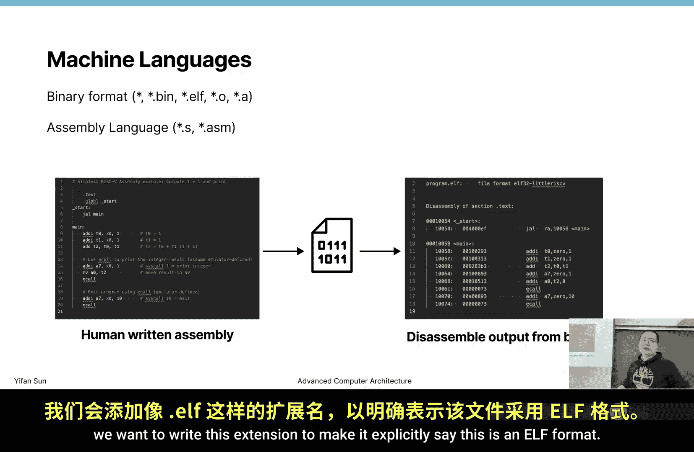
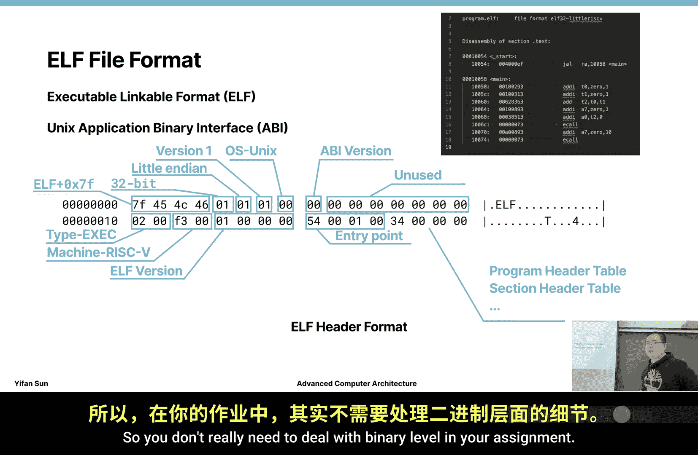
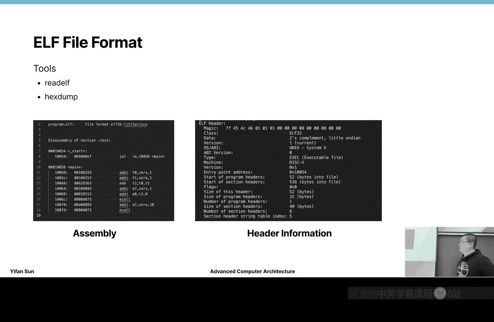
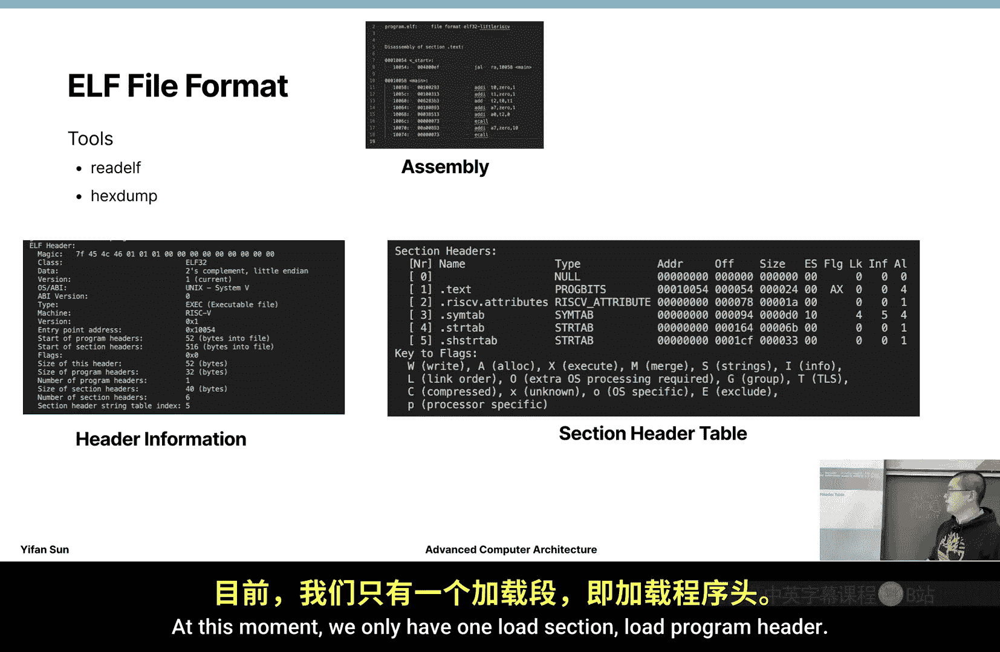
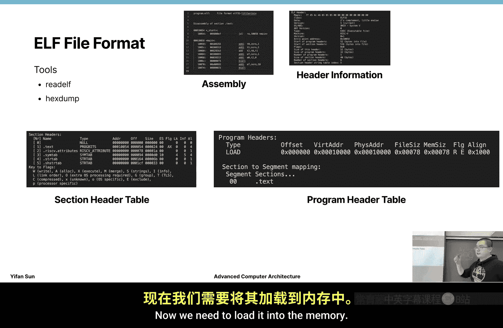
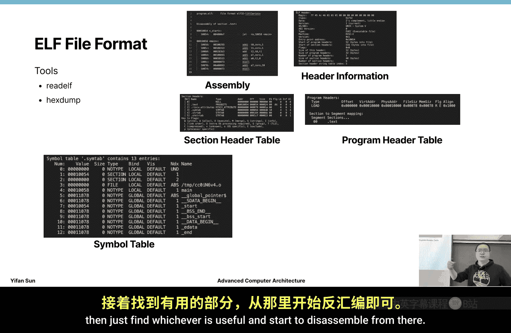
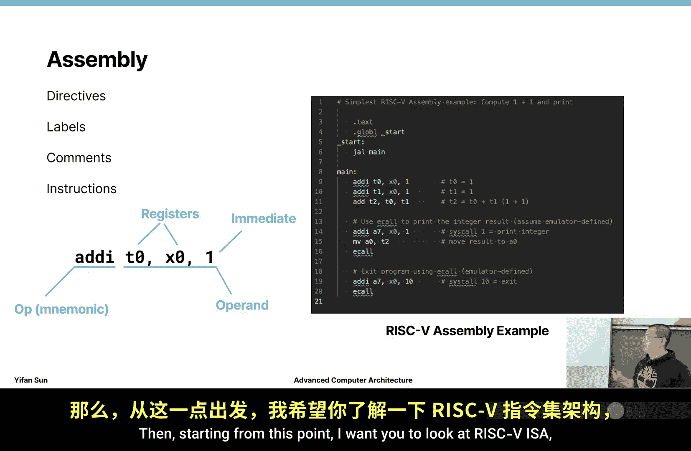
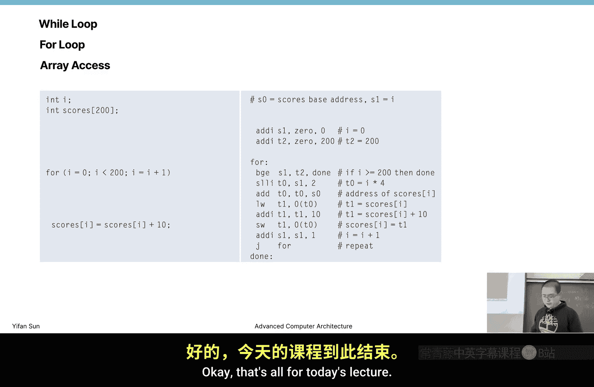

# 威廉玛丽学院【中英⚡高级计算机体系结构｜CSCI654 Spring 2025, Advanced Computer Architecture】 p11 P11 RISC-V 指令集架构 1 -BV1evfwBVEUG_p11-

Okay， then in today's class， today's lecture， we're going to cover risk 5 Ia。 So finally。

 we're done with the simulation part and going to talk about computer architecture。

 Then risk 5 Ia is。CPU instruction set architecture。

 So before we start let's talk about instruction set architecture and why it's developed。

 So early days when we write programming， this is before it's probably not that early they can be 1980s so people are still using this type of punch card as you can see this punch card is still writing fortune statement So it's actually very interesting that by that time the people when they write a program。

 they don't write it。In natural language， or they may write on a piece of paper then translate it in this particular way。

 then to punch this card。 And when they can prepare a very long program and prepare a stack of card and give it to an operator and the operator will send the send the card into the machine。

 then the machine will generate some other punch card to as the result and return to you。

 So pretty much every day。Then in the morning you can give the operator a stack of punch card in the evening you get the result back then if your program has a bug。

 then you can only fix one problem a day， then try next day and see if it works or not。

And another problem by that time by early time when people when these big companies buy machine。

 people do not buy machine at that time， only big companies buy computers when they buy this computers is per computer per instruction set so this computer is using this technology that computer is using that technology even by that time the byte concept is not fixed some computer using a 4 bit byte6 bit byte or even 10 bit byte。

 but then later on is fixed to 8 bit byte So every computer has their own standard。

 then it's okay by that time， but。We really need to write different program for each machine that say if your company purchase a new machine。

 then pretty much all the program that you have written needs to be rewritten。

 even by that time we have fortune language when we have fortune language。

 we don't really have to rewrite the program， but we actually have to rewrite a compiler for every machine so that we can interpret this fortune statement into the machine instructions。

So， and this is a problem。 It actually creates lots of repeated repetitive work。 So in April 7。

1964 is the announcement of IBM 6360。 when this machine is developed。

 they're not really going to produce one machine， so they want to produce a family of machines So from high end to low end very fast to barely working ones then they want to sell to different customers to cover different market market divisions。

 so then they cannot they cannot only design one machine， they have to design a family of machines。

 So for example， they have to design a machine that may have a divider logic in it can do division operation on its own or they can have they can sell some lower end machines they can do division。

 but with many， many small like add subtract or operations to mimic a division operation So in that case since we have a family of machines。

 we have to set a standard for these family of machines。 then that's actually sets the。

First instruction set of architecture， by that time it was even not called instruction set architecture was called something else。

 but it was the born of instruction set of architecture and this concept is even evolved over time until something like when Intel becomes a major player then instruction set architecture becomes。

A standard that every chip would follow。Then， when。

 then when we talk about instruction set architecture， we naturally separate two concepts。

 One is called instruction set architecture or architecture for short。

 It's the definitions of operation that machine needs to support it's a。

Contract or a protocol between the software and hardware that if the software is implemented in this way。

 the hardware can generate this type of result， then the performance is another thing。

 but at least they can generate the result in by a certain definition。 Then on the other side。

 micro architectureure is the implementation of a specific instruction set。 right So I think。

When we talk about the most popular instruction that we have X 86 right when we talk about X 86。

 now it's an instructor instruction set that is supported by Intel and AMD and Intel and AMD。

 they definitely have very different implementations and even within Intel they have the atom implementation。

 they have the core implementation then even the core I5 I3， I7。

 I9 they run they have different internal implementation。

 but if you have a Microsoft the word or Google Chrome， it's a program that if you download it。

 it can guarantee can run on that popular machine and that's the power of instruction set architectures。

And why instruction said architecture is become such an important thing is mainly because the。

The difficulty of transiting from one instruction set from one instruction set to another。

 say today you have Microsoft Word then if you want then Microsoft word earlier versions you can still run it right then if you transit to another instruction set then you will require the developer to recompile the program for you in that particular instruction set and can ship it for you for many instructions for many programs。

 this is so hard that you can you cannot find the original developers and the original developers is no longer working on that project anymore then because of this reason you can almost always have compatibility problems that you cannot。

嗯。That you you cannot really use the software that you want to use。 if you want to use it。

 you have to develop it again。And that's why X 86 is so。Like the longev longevity of。

X 86 is so long that the life is of X66 so long that takes so many years that is still relevant。

 Then if you learn X 86 design， it's a terrible instruction set design that there are many backward compatibility issue for them。

 originally it was designed as a 16 B instruction set。 So when one day Intel say， oh。

 we want to support 3032 B instruction。So what is difference between 6 bit or 3232 bit or 64 bit instruction is the basic operation is performed at different level right so if we want to add two numbers together。

 then are we adding232 bit or 264 bit either numbers together then naturally if we use 32 bit 32 bit instruction set then the addresses the memory addresses are 32 bit then today we know2 to the par 32。

2 total power 30 is1 gigah， right So2 total power 32 is 4 gigga。

So if we're still having byte addressable addresses。

 that means we can only if we're still using 32 bit instruction set。

 we can only support 4 gigabyte of memory by that time4 gigabyteyte memory is so large。

That I can tell you that my like the first machine that my。

My family owns is a 191992 machine that has。33 MB of hard drive。

That's the machine that we first have。 But that time， when we already start to have 32 bit machine。

 now we think 4 GB is large enough that we will never reach that point。

 Now eventually we reach that point。 And today， like you can almost never buy 4 GB machines even for phones。

 right so。So， but X 86 starts from 16 bit machine。 so when it wants to shift to 32 bit instruction set。

 it needs to only add instruction， it needs to guarantee its backward compatibility。

That means every 16 bit。16 bit program it should still support it can still run Then after that AMD decides we want to support 64 bit instruction set then everything that is in 16 bit they can still support and you can see this historical problems and also by that time registers are so expensive we cannot have so many registers today registers are almost free。

 it can have so many register， but they still use the register design that is started by that time so because of this reasons。

That even X86 machine is instruction set is not considered a very modern instruction set than is still one of the most popular popular instruction set until very。

 very recent， it can probably likely to be somehow replaced by arm。

 but even today like for servers most likely you are still running X86 machines。

 then only companies like Apple because they control the full ecosystem。

 they control the developer environment， the programming environment program language and to operating system to hardware that they have the full stack control。

 then they can convert them。And they can easily relatively easily convert from one architecture to another。

Okay， so the famous architectures instruction set， then there are X 86，64 and AM D and AM D 64。

 So there are many names for that instruction set and then different names refer to different specific things。

 but。From the name you can tell it's not an Intel property intellectual property anymore more iss coowned bytel by Intel and AMD。

 So they cannot say Intel say， oh， one day I do not sell you。

 I do not allow you to produce this type of instruction that。

 It's impossible because AM D holds the other half of the intellectual property。

 The arm is definitely another big player there。 Now how arm works is。Do not sell hardware right。

 but arm say， okay， this is my instruction set。 Now if you want to use my instruction set。

 you have to pay me some money。 That's how the the business model for arm。

 then we also have IBM power。 This is a relatively isolated ecosystem。

 There are other instruction set like Mips。 Mips is still somehow being used in like controllers for controllers to control like。

Like manufacturing pipelines and these type of things then but because of the development of risk five MIps is slightly going down these days。

Now even other instruction set， the risk five is a good replacement for other instruction set。

 so that's why risk five is kind of replacing other instruction sets today and it's getting more and more important。

Then so I pretty much sure you have heard of the competition between the S instruction set and the risk instruction set。

 S stands for。Complex instructions， said computing。Is as stand for that。嗯啊。Yeah。

 I think so then risk stands for reduce the instruction set right。

 so what's the difference is basically Ci machine is has very like has a lot of instructions and each instruction can do a lot of work。

Now risk machines have relatively few instructions。

 and each instruction can only do a small piece of work。O， so。I会 say。Pretty much today。

 no machine is really using Ci。Now you may say X 86 is a cis instruction right Yes， well。

 it's a cis instruction， but you know have you heard of something like 83，386。

848486 right then those are earlier early days intel chips then after that they translateed to core architecture。

 what's the big difference between。80 series and core series。Why， what。

 what technology deserves a whole product chip product line renaming。是。

It's the introduction of something called microcode， So what is a microcode。

Microcode is a risk within ais。So the program is still ci， is the instructions are very complex。

So rather than directly executing this instruction， theres a hardware stage。

 hardware component that translate these complex instructions into smaller instructions。

 so it can break down each instruction into a few simpler instructions then it will send into the pipeline to get executed。

So that's the starting from the core core pipeline then。I would say， Sik is。

Not that commonly used anymore。 Then risk is a very， very common style。

 Then how to tell if it's a risk or ci instruction， then。It's mainly by this like。

 this's my personal experience。 It's by this load and store instructions。

 If you have load instruction and store instruction is。

It's very likely in this instruction set it can be considered as a risk instruction so today。

Pretty much every instruction set has load and store instructions。So by the way。

 what is load and store？So who is loading， Who is storing is is always from the perspective of the core。

 So the core is excluding instructions。 and core is directly manipulating registers or registers。

Like as we introduced before， there are flip flos， right。

 so courses are directly manipulating registers。Then if we want to load that means we want to bring something closer。

 that means bring the data from memory to the register when we store means we store something back and then to write it into a piece of paper in this case we write into the memory so that can be stored for a longer time so that means to write it into the memory so load as just bring data to the core store is bring data to send data back to the memory from the core。

Okay， so the comparison of sixcan risk is something had been debated many years。

 but today most of the machines are using risk instruction set。

Then so let's start by talking about the machine language then what type of programs that your machine is consuming then you know you may write C or C++ or Python these type of programs but your computer well can interpret this type of language it's not very convenient for them to directly exclude these type of programs then what they're executing is some machine languages it's pretty much in binary format。

That means your computer is always consuming a data。

 consuming data that is either zero or one or a group of0 and ones。 So this is the binary format。

 as you can see， this is the content of this binary format right like it' its binary format written in the hacks format。

In the in the hi start， so 0，0，4，0，0， EF is this type this instruction。能。

Like if you' are dealing with punchcard you you are pretty much directly dealing with spinaries。

 but dealing with binaries is so hard that like almost no human can directly read even just for basic understanding is super hard Now in this case we want to deal with something slightly easier that is not probably not as easy as a high level program language but can like。

Directly maps in these type instructions to something that slide。Easier for human to read。

 and in that case we call this table of file assemblyly files。Okay these are assembly files。

 those are the instructions that we want our programs or or computer to execute then so this is if we if we write a assembly file。

 we can assemble it into the binary file now we can disassemble it back to a human readable file so those are relatively considered direct translation。

From one format to another。Now binary format can be in Linux is most likely to be just a program without extension name。

 Now， sometimes with bin， sometimes we start O， sometimes we start a。Quick question。

 What's the difference between dot O and do A in Linux environment。Yes。Yeah。Yeah， yeah。Yeah。

 so dot O is static。Shared object is。It's a static file。 So basically。

 it contains everything it requires。 then dot dot A is a dynamic linking where in in Windows is called DLL。

 right， So it's a dynamic linking。 That means。Dot O will eventually be part of your program。

 Dot A is something to be installed on users environment， than to be linked。At execution time。

 dot O is linked at compile time。难到ELF。There's no such extension。

 but sometimes like we want to write this extension to make it explicitly say this is an ELF format。

 So what is an E EF format， Let's study， talk about EL format since you are you need to your。

Deal with your format in your program， in your。The diamond after this one。

So ELF format is exccutable linkable format Now it's a Uni standard so Linux today fully follows this standard and it's a binary format that is fully like every exccutable file where every do o file do a file are actually ELF using EL format internally so every exccutable file is an EL file that you are executing so your machine your opening system needs to interpret this format and converted into a exccutable program and to be executed in your environment so today basically we want to see how this type of E program pure binary that eventually is being executed in your computer。

Okay， so。What is in E I format， then。This is a header。 So at the beginning。

 we have a header of this E format。 we're going to gradually expand this file and format and see how this file is organized。

 So by the way， this is something called API or application binary interface So you may heard about application program interface API So what is API is if you call a function or send a message。

 then the server or something will send reply you a message or do something for you the API is basically API but in binary format。

Okay， so if you follow this protocol in this binary organization。

 then your program will be executed in this particular way。Then what is a format。

 Then at the beginning， we have this magic string， which is ELF plus 0 x7 F and 0 x7 F。

 then this ELF。W E。 So this is E E， L F。 Then there are in head。

 there are certain bits represent different encodes different information。 For example，32 bit，0。

1 is 32 bit，02 is 64 B。 then little India。So this program is a little Indian program now。

Like what is little India。 And if I have little India， there's big India。

 we'll see this example pretty quick。And this is a version one of the EL of format then I've never seen other version definition and also seen this EL of version is also one。

 I've never seen anything else。 then the opening system is unique and it's really depends on what you can like this can support other opening system an A version is00 is still a version then almost never I see other another version numbers and this part is not used Its just keep it0 then type this is an exccutable file So is it a library or an exccutable file。

人。0ro so。S 3，0，0。就。What's the actual number of F3，0，0 here。Several options。0 x， F 3，0，0，0， x 0，0。

 F 3。0 x，0，0，3 F。What is the actual number encoded by。你ing。是。嗯 second。Second one。对以这 second one。

Right， so this is the little Indian versus big Indian。

 So when we're talking about little Indian or big Indian is when we're talking about bites。

 how these bites are organized into。Multibyte fields or integers。

Right don't get confused with strings。 strings is totally different things。

 Those are how bytes organize into integers。If it's big India。This is。啊。This is the number。

 If it's little India， this is the number。 then this is a byte， right， This is a byte。

 and this is a byte。 So the digit within the byte number change the order。

 but the byte order can change。ok。做啲士。Can be quite annoying， but。Like as you。是。

As you see more and more in this type of program， you will see these more and more these type of examples and also for ELF version。

 what is the actual number？Its one。Right is， it should read in this way，0，0，0，0，0，0，0，1。 Okay。

 this is little India。嗯。And little Indian， I I I personally today， if you read this type of thing。

 you find little Indian is's so hard to understand。 But if you write a program。

 you find a little Indian are actually。Rather easy to program。

 Then big Indian will actually sometimes cause you some problem。ok。😊，Anyway。

Now little India is definitely the mainstream today。

 like most of the ISos or machines use little India and only something like power PC uses big India。

Okay， then this is an entry point。What is entry point Now， by the way。

 this is the header of this program。Entry point is the first instruction that we're going to execute。

In this particular， what's the number is 0，0，0，1，0，0。5，4。Okay， this address。Where is it， It's here。

 It's 1，0，0，5，4。This is the first instruction that we want to execute。ok。So it tells us where's。

 where's the。Entry point of this program。And the header is not only two lines long。

 There are many other things。 For example， we have this program header table section header table。

 There are some other information that's being recorded in this ELF format。那。Basically at this stage。

 I want you to understand this。 then if you write a C program。

 very likely you probably need to write a E of pass on your own and like because。See。

 if you are writing a C or C++ program， importing a library is very difficult。

 But since were using go as the program language， youre。

 you don't really need to deal with this binary level information。 you pretty much can do。

E LF download E， F dot open。 you open that file。 E L F get machine，9。II don't know exact the the API。

 Okay， just check the documentation， but。Very likely you call something like get machine。

 Now it will tell you what's the machine it is。 Okay。

 so don't really need to deal with binary level in your assignment。

Then when we talk about E format， there are some useful tools。Then there's a read E file。

 Then read EL file will tell us that from from a binary file that we can read in this format。

 it will and tell us all the informations。 that within the E file。 then it's very useful tool。

 Now another one is hack Stump。 They can dump the information in hacks format。 Okay， I don't。

Yeah， I don't have a screenshot for hackx dumpump。 And this is still the screenshot from radio。

 So other than this header， we have something called section header table or sections within this。嗯。

We have sections within this E L file， for example。Section 0 is empty。 Doesn't exist。

 Sectionction 1 is called text。 Sectionction 2 is called riskify attributes。 Section 3 is called C。

AS symbol type type for is string type， string table。5 is shared string table。 Okay。

 then what's the address is 0。 What's the offset is。So address here， basically only this has address。

 Only this address matters。 And what's the， what's the offset offset means the relatively location within this file。

 That is the location of this section is this information。 Those are saying， okay，50。

54 is the beginning of text section， 78 is the beginning of the attributes attribute section and with the size and theres some extra information about sections。

Now later on， we see these sections map to different things that we may need to store different things at different part of the sections。

Then also， program header table。 at this moment， we only have one load section load program header It tells the your opinion system how to deal with these sections。

 Now pretty much section。

Programm header。Like there， the overlap with the。Sections。

So load basically tells us we need to load this part of data from the file into the memory。Okay。

 this load is not the load instruction is from hard drive that your program exable program is stored in the hard drive now we need to load it into the memory and program header for these examples are not that important。

Now also we have these symbol tables， what symbols we have。

 we have basically we have these things called tabs。Not types， labels， start。

Start is a label that I write here， start and there's another label called Ma it's the beginning of the main program and this main is also being recorded here so it's a table of symbols that table of symbols are relatively important when you disassemble this program and when you know that if you want to jump to somewhere you need to jump to this label。

ok。So。That's all about E L file。 Then it's not a very complex format。

 Then we have libraries to help us pass it。 So just go ahead and check documentation。

 then try to see if the。If the。Go library can help you parse this file。 and pretty much you need to。

 you just need to。Get sections then we return you a list of sections， then section dot name。

 they will tell you the name， then just find whichever is useful and start to decide and over from there。

ok。Now we need to talk about assembly which the assembly language looks like。Aly language。

 there are several things， one is the derivatives like start sorry the global start is tell us this is a global symbol that needs to be put into the global part of the symbol and text tell us the whole thing starting from here needs to be ined into the text section。

Okay， then we have labels， we have two labels， we have start and main it tells us if for example this is a jump。

 we need to jump to main location right we start from that line and the risk5 standard require us to have a global symbol called start then starting from this point we jump to main okay。

With directlyarch jump to me。 but see here， there are actually many things that you can play in this like even before main function。

 you can have other functions if your compiler is wants to play something with the code it generates。

We have comments then， but the most important part are the instructions in this file。Okay。

 now what are the instructions， then an instruction is typically organized in this way。

 We have the operation， the op or the mmonic， it help us people to memorize what the instructions are。

Now we have these things called opera。All prints are the input and output numbers that we're operating on。

 then。All brands have different types for them for t0 x0， there are different type of registers。

 the registers are flip flops and so when we say t0 we refer to that specific register。Now。

 another thing， another type of operaprint are immediate opera。Now immediate open。

Are basically numbers that directly encoded into the instruction itself。ok， so。

Those are instructions then。Starting from this point， I wanted you to look at risk 5 ISa。

 now what instructions are there， then how we are handled these instructions。

Risk 5 is created in。2010 by UC Berkeley by these people。

 So it's a relatively new thing compared to other Ios。 So an Ia typically have a lifespan of。

Like tens of years， several tenths of year it's very easy to have more than 10 years。

 so it's only 15 year old until today， so relatively new。

 but even it's relatively new there are lots of startup companies that start to build chips for it why because it's an open start standard if you use arm you have to pay arm money but if you use Ris 5。

 you don't need to tell anyone that you're developing a chip for Ri 5 and you don't need to pay the money so it's open standard。

Now， so a very important feature for risk 5 is its modular design and extensibility。

 So you can extend risk 5 to support pretty much anything。

 So I've seen people using risk 5 instruction set to implement GPUus。And some。嗯。

Other risk five domain specific accerators。 I don't know， but there can be。 so you can。CGR is。

 really， there's risk5 CGRs。There are CR， there risk5 Cs。If it's by Toronto， then we should know it。

それば。Yeah， okay， no problem。 So it can be extended to many different things， different format。

 It doesn't have to be a CPU。 then so it's intentionally designed to be minimal。

 So the smallest part is called RV 32 I RV stands for risk5。

32 or 64 means it 6432 bit instructions or 364 bit instructions。 I stands for integer。

 So at the beginning， we only want to support integers and it's a minimum instructions。

 minimum operations that we want to support。 So for some for some chips like we don't even want to do floating point operations。

 So probably integer are good enough。So then we can extend the instruction to by many different packages and determine which package that you want to support for example you can decide to support manipulationplication and division。

 you can support single precision and floating point or double precision floating point。

 atomical instructions compressed instructions， vector extensions and bit manipulation extension so it really depends on what is the necessary part and you can decide which one you support。

And also。It's rather easy for you to add customized extensions to support your own goal。So those are。

Unique things about risk5。Then the instructions are4 byte long。

 so all the instructions are encoded in four byte long in the standard package。呃。

But the instructions， like if you want to extend it。

 you can extend it to be 8 by long or even 12 by long， so to encode something more complex。人。

Then when we talk about ISA the first thing we want to talk about is what are the available registers those are the register if you want to support the RV32i or RV64i then you have to support this side of registers So what are registers now you can see there are two different names those are architecture registers then so now when we implement architecture more commonly we refer to these 32 X registers。

 but when we write a program we most likely we support this type of we refer them as this type of more meaningful names。

So what do we have， we have a zero， So it's always zero。 This are read only read only register。

Now in hardware， we probably don't even need to implement this register。 just bring from low。

low voltage return address， stack pointer， global pointer。

 then later on we see if we have time to cover these pointers。

 these are different things that need to be recorded to represent your program execution status。

Now we have some temporary registers。And some S register， S0 S1。

 and some A registers as function function arguments and return values。

 and there' are some more saved registers and temporary registers will also say how they are different。

 the saved register and temporary registers are different。

Then I really don't know why they want to split this register。

 sayy why don't put save the register altogether and。诶。And these temporary registers altogether。

There must be some particular consideration why they want to split in these registers。

 but this is the definition then we can only follow their definition。ok。

Then there's a saver that we can talk about the saver at the end of today's class to probably on Thursday's class。

So what instructions are there？And we have logic instructions and or X or。

 And this is the most simple instruction。 Now when we say this have instruction。

 there's a convention that it means at 3 is the output to register。 So we're doing。

Bitwise and from S 1 S 2 and store the result into S 3。 This is a convention of assembly files。

 So by the way， if you learn the risk5 assembly， learning another assembly is not that hard。

 It's just a。Like you have learned Python and you want to convert to go， the basic understanding。

 the basic concepts are similar is just the syntax is different。Okay。

 then hopefully by the end of this semester， we should have a chance to discuss。

GPU assemblies then you will find it's a totally totally different animal。

 Now for demo here we're saying 32 registers Then for a GPU， then you can easily do 32 k registers。

 So the scope is totally different。Then for logic instructions。

Now we have another set of logic instructions or another version of the logic instructions is by adding this I。

Then in rich5 convention， when we have and and an I I means。Immediate number。Okay。

 so we want to have an immediate number as part of the operation。

And then this immediate number can be different things。 For example。

 minus1 is generally considered as a tools complement encoding。ok。Then we have shift instructions。

 Then for shift instructions， we only have the immediate version。

 We don't have the three register version。做。We have three shift instructions。So we can read together。

 shift， shift， left， logic。Shift， right， logic。 Shift right， arithmetic。So shift the left。

 there is no ambiguity。When we shift the left， we add zeros。Right。

But when we want to shift the right， there are two different things。

 So how we can how we can really understand this。Number。If we shift the right。

Is this thing a a signed integer or just a string of bit， if it's a string of bit。

 when we want to sign to write， we want to fill zeros。Right。Now， one is a number。

 tools complement number。We want to keep its sign。RightWe want to keep it sign。

 So if the first number is  one， the first digit is 1， when we shift the right， we feel one。

 when the first digit is 0， we feel 0。Okay， so the sign of this number will remain unchanged。

So that's the difference between shift the right logic and shift the right arithmetic。

Now we have this simple arithmetic function， add instruction and sub instruction。嗯。Okay， a quick。

A quick question。 Why there's no。十爱。Yeah， you can use add。 You can use add I。 Then just directly。

 the compiler can help you just add the minus sign there。The multiplication instructions。哦。

The multiplication instructions。诶。A quick question， if you have two 32 bit numbers。

 just imagine they Einstein when they are multiplied together。

How many digits that we can generate at most。64， right， just consider 9 multipl by 9 is 81。

 So two single digit number。 then you can get two digit。Then，99 multiply by 99。

Its pretty much a fordited thing。Right， so。Myplication can now be completed within one instruction。

 then when you multiply， then you need to increase the scope of your number significantly。Now。

 in this case， we have two modification instructions。Nan。We have multiplication itself。

 The T2 basically returns get us the low low 32 bit。

 The multiple high M U L H multi high returns the high 32 bit of the operation。

 That two instructions。 By the way， this is not the standard integer operation instruction。

 This is the M set。O， this is the M extension。ok， and then。

Those are basic instructions can perform many， many operations already。

Then let's look at some other instruction， some other type of instructions。For example。

 how can we support this type of code if a not equal to0， we want to do something。

 then otherwise do we want to do something else。No matter what， like after that。

 we do something else， how we can support these type of instructions and whenever we support we want to support branching right or conditional execution。

 we need to use branching instructions。Now for most of languages， for most ISA。

 there are two type of branching instructions， one is called conditional branching。

 one is unconditional branching， unconditional branching is also usually called jump jumps you can directly jump to some places。

So remember when you first allow learn programming， especially when you learn C programming。

 like many people will tell you go to is its a okay。

 it's a valid syntax there but you'd better not to use it right why because at early age they want to replicate this jump behavior that is in assembly so they have this go to but they think it's not very easy to manage so they do not encourage you to use it so it's eventually still compile to this type of jump instructions。

So let's look at this example， so this example has a few so sorry this is an example。

 but before we talk about this example， these are the branch condition instructions。

 So for example this one this is a branch if equal what equal t1 equals S3 when t1 equals to S3 rather than continue to exclude。

We jump to a label。Okay， the label is， this is a label。 So if， if we want to jump to target。

 then we jump to target， right， So B， E Q S1 S 0 target， Then we jump to to target。

 And when we talk about conditional branches。We have this term， call is taken。Is taken。

 So when we talk about if this。Branrunch is taken or not taken。If it's taken。

 that means it goes to somewhere else。Okay， if it's not taken， that means it will continue to go。

It will continue to just follow the regular excion path，1 by one， one instruction by one instruction。

 So there are some other instruction that are very similar。 So this is branch， if not equal， branch。

 if greater or equal， branch， if less than。So branch and greater equal branch less than， basically。

 if you flipped。To open。 And you basically support all the cases， right。但。

There are two special cases is。U means unsed。 so we consider this integer as enzymesine。

 So when we consider compared like which one is larger than sine matters。 So for most of time。

 we consider signed integers for every register we're basically storing a 32 bit number right binary。

 we don't know it's signed or un and it really depends on instruction to interpret a signed or un。

In teacher。Okay， so this is an example。 so for ADDI。0 plus 4 is 4， then 0 plus 1 is S1。

 so sometimes this can also be right into MV。MV S 1，1， so directly write to operas。 Those are。

 those are pseudo instructions。 So those are pseudo instructions are instruction that is not defined by the Ia。

 but it's a instruction that respected by the compiler。The compiler knows or the asler knows， Okay。

 that is instruction。 But if you write M V。Move。Move from S1。move。1 to S1， right。

Just basically this means S1 equals to one。Now， if you write it in this way。

 it's still that your asemler will generate a instruction。Okay， it's equivalent to add 0。

So we're moving forward to S0，1 to S1， now we shift to left。By2。 So when we shift the left by 2。

 that means were multiplly by4 right when we multiply by4， then we compare if S1 equals to S0。

 then we know if multi from one multiply by 4 is 4。

 then this equals so the branch is taken then it will directly jump to label。

 then we'll start to ex this instruction。Okay， so a very important concept here is something that is called PC program counter。

 program counter。 So program counter is a pointer as its pointing to the instruction。

That is either currently executing or。To be excluded next。

 it really depends on the really fine green time that you're talking at what time you're talking about the PC。

Then so PC is something pointing to the instruction that you're going to exclude。 So basically。

 branch instruction will take PC as a implicit outputstruct output register and will directly。

Udate a PC to point to this instruction。Okay， so by the way， when we disassemble this program。

 we typically like to write this way。Sorry， to go back this much of code。

 We typically write a code in this way。 So those are 1，0，0，5，8。 We consider those are PC。

Those are the program counters， so when we're executing this line， we're excluding 10058。

 this address。ok。So another example， then see this one， then。We shift S 1 by 2。 If it's B， N， E。

 B non equal， but they are equal， right， in this case， we don't。We do not consider this branch。

 branch is now taken， so we will perform this operation。 We will perform this operation。 Then。

 by that point。We ignore that label。 We do not consider label。

 We consider these are one piece of program that we fall through。 then we continue to exclude。

 So then you know why in C language switch case fall through right。

 This is the historical reason why switch case fall through。

 So it will ignore these labels then continue to exclude。ok。呃，就。

And there are other jump instructions。 For example， this is a J instruction。 By the way。

 J is also a pseudo。Instruction， but you can just treat it as an instruction。

 J means we just directly jump to label， no matter what。J R means we directly jump to。The address。

 the PP PC that is stored in S file。ok。So this a there's an important concept No here a lot that is called。

Basic blocks。What is a basic block then by definition。

 basic block is a sequence of instructions with a single entry point and a single exit point。

That means if we exclude any of instruction in this basic block。

 we need to execute all the instruction within this basic block。Okay。

 so what are the basic block here。 So this is a basic block like this B， E Q is included in B B1。

 basic block 1。And this is a basic block too。Label is not part of the instructions。

 so it's not part of the basic block， and this ad is the basic block 3。Okay。

 it's a very important concept。 Then many compiler operation optimizations are completed at the basic block level。

Now consider if statement how to implement this tab of if statement is basically by doing something like this。

 doing a B andE。If like or if originally we write。Apples equals to orange。

 We check if Apple equals oranges。 Then here we need to flip it。 We need to check if it's not equal。

 if it's not equal， we skip， then we jump to a1 to the end of this if statement。 Otherwise。

 we execute this ad， and we also execute this sub。ok。Then if else。

Now how we can do this E is basically by first check， do the condition check if it's。啊。If we skip it。

 we jump to L1 directly if the case is else。Right， now weve always execute a one。 now。

 But if we fall into this if statement。The if part now will exclude this addd instruction and directly jump to L2。

 There's nothing to check。 We just directly jump to prevent us from executing a1。

We just directly jump， so you can see this is a combination of conditional branch and unconditional branches。

So a very important thing that we eventually need to talk about is branch prediction。So our program。

Your compute， your CPU actually。Even before this branch is executed。

 it needs to predict if it's taken or not taken， so that's some advanced term。

Oimization that well see later。Okay， then switch case is also simple。

 where is similar to a if L statement。Right， so then iss basically in case 1， then we。诶。自取。Yeah。

 we at the beginning at we should jump to case 1 or case 2 or something， right then。去。嗯。😊，我唱。Okay。

 so at the beginning， we execute these things。Then checked， if equal or not， then。

If its or if it's not in this case， we jump to this position， right， now we check again。

 then jump to this position。 Then we check again， and we jump to this position。

Right to implement as if our statement。Then what I can tell you is。Most of compilers。

 if there are only three cases it will probably implement in this way， if there are 20 cases。

 it will implement it another way。It will implement in an array of pieces that can potentially jump to here。

 here， here， here。They will first do a table lookup。 Now we find which one， which is the condition。

 They will find the location and directly jump to that location。

 Now it's faster than this type of implementation。 If there are only three cases， this is okay。

 This is probably even better than a table lookup。 If it's more than three or there are a lot of them。

And we definitely want to prevent check condition， check condition， check condition。

 or direct jump there。Okay， so more compiler optimization methods。Then loop。

how loops are implemented is in this way。So this is a while loop。 is power equals now equals to 128。

 We loop through， right， So basically， we initialize these numbers we place we we put 1，28 in t 0。

 So if B， E Q。When it equals to 1，28， that means it's still flipping this condition， right。

It's still flipping this condition， but if where this this condition holds。Then we jump to done。

 then we perform some of the other operations Otherwise， at the end of this loop。

 we jump back to these instructions， this is a back jump。Right。

 we will jump back to while tag that we execute this loop again and then again。Like。

Now how we handle full loop is basically the same idea， but it's slightly more complex than。

Where's for loop？No， I， I don't know。 Never mind。 So let's skip the for loop then just consider they basically the same。

The same style， but it's just the more。Operations， okay。Then I want to talk about array。

 Oh this is also a for loop。 Okay， so in for loop， we need to set I right as a in to store in the in the register。

 Its called it the iteration variable。To we， it's better to put in a register rather than store in the memory。

Then。T 2 is the ending criteria。 now4， and we first check the condition。 Now if the condition holds。

Now we jump to done， no we're done with the program， otherwise we execute this part。ok。做。

I want you to look at one specific thing。Score eye。Equals scores I equals to 10。 Let's look at this。

 how we can calculate this number， this thing。诶。How we can guess， score I。Scorse eye is by the thing。

S 1。Is the。Iteration integer， right。We need to multiply by4， Why we need to multiply by 4。

RightWe know score is a integer， and we know each integer is 4 by long。

 So moving forward by one element， this4 byte。 This is a cease feature called pointer arithmetic right pointer arithmetic。

 that means you can。It's equals to。If score， if so。in c。

If it's a pointer of score or it's an array of score。It's basically the same thing。

It's basically the initial location。None score， score I。Basically equals to， in this case， is。

Let me write this score。This is not really in the right for syntax， but U plus I， right。

You don't plus 4 multiply by I， you plus I。 your compiler knows that this is an int star。

And in is4 byte long， so your compiler will automatically add this four here。Right。

So your compiler will automatically add this four here。

 So your compiler will automatically add this line of code here。 So it shifts by。

2 digit to multiply by 4。 Now when we multiply by 4， we get result is t0 there。

 Then t 0 add the instruction。 we add the number， Then we get the address of score I。

 T 0 is the base address。The S sorry T 0 is the offset， S 0 is the offset the be address。

 then T 0 is the eventual address that we want to use。Then， we want to load。This is a load。

 this is a special openprint。How to understand it is T 0。With an offset of0。 So we it's a。

Register address with a immediate offset。Then the output is T1。ok。

We storeing T1 and the the number is storing T1。 then wei added by 10。Now we store it back。

SW means store word Word here is4 byte。 we store the word back to T0 address。

 store back to original address， then we add I by one。ok。So this is the for loop。

 then how we are dealing with both for loop and array pointers and more memory to。In assembly。

 we don't have array， we only have pointers， addresses。呃。one thing。Conits consider here。

How many times we load here， load and store？We load four times， right？Oh， sorry， we load。4 by。

And store。4 by。Right。So how many effective。Useful。Calculation。Other。Useful calculation。

It's only one operation， right？How many overhead。Calculation we have。That's considered branch as one。

Or do we consider branch as one either way。 Okay， let's， let's start from the shift part。

 shift is one。 Add is one。 Add then add I is another one。 Let's ignore jump。 So we have。3， right。

Let's do not consider branch and jump。Just so。Get general analysis。Zu， remember， I told you。If。

Scorse， I is in。Dam。What's the latency for Dham。Theam is hundreds of cycles。Right。Hundreds of cycles。

What's the operation time。One cycle。To calculate the art operation is one cycle。So the problem is。

Score I。 so sometimes or want to say a equals B plus C。It's a load， a load and a store right。

 with one plus operation。So。The overhead or the bottleneck is not at a calculation。

 is that bringing the data to the core and storing the data back to the memory。ok。

Then how to analyze this thing， And there's a useful。Term called AI。Or arithmetic intensity。

What is arithmetic intensity is。The calculation。By bite。ok。

Then sometimes people will manipulate this AI by a little bit。

 sometimes they only consider multi that when we're talking about matrix multi。

 they only care about multi operations， but it's okay， that's just make it simple for now。

Theoretical AI。What's the theoretical AI？Theoretical。

 we perform one operation by 8 B of load and store， right， So theoretical AI， all right in this way。

AAI theoretical。Is one over 8。Right。Now， what is the actual AI。So if you run a profiler。

The provider can now really tell which one is the useful one， which one is the overhead one。

 It will just take， oh， add one。Now add one is an instruction， shape the live on another instruction。

Now count these calculation operations。那。A AI is。4， right， there are four。

F logic operations calculations。 So it's four over8 or half。Right。

 so then you tell you use AI to basically help you tell。

The load to the memory system and to the compute system。 So if AI is a really small number。

That means。If AI is a small number。That means the by， there are a lot of byte。

 and there are a lot of load and store operations， and are not a lot of calculation。In that case。

 it's a memory intensive workload。And so AI is a very large number。

 it can be more than one it can you can say load one data then we keep manipulating this data。

 calculate， do a lot of operations， then eventually store it back。 In that case。

 it's a compute intensive workload。ok。This is AI I just come at this point suddenly that I realize it's important to talk about this concept This one of the very useful tools for you to understand a workload。

Okay so I think we'll stop here and to give you a preview we talk about binary format it's a little bit boring now we talk about how we're dealing with functions。

 functions a little bit more complex than functions then eventually we talk about how to manage the program memory and how your operating system brings up a program from your hard drive to the memory and eventually to the。

Then these are something that we're going to cover in Thursday's class。Okay。

 and is all for today's lecture。

