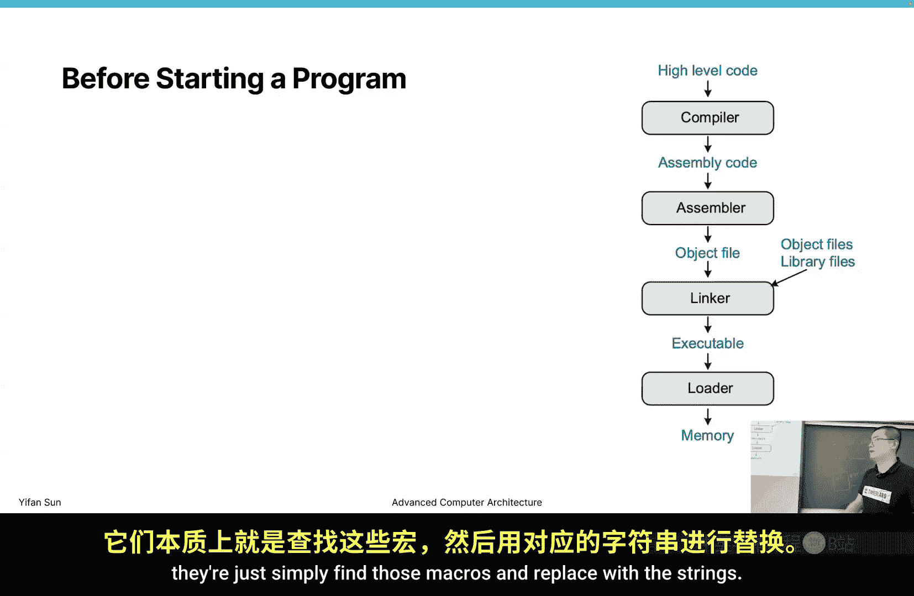
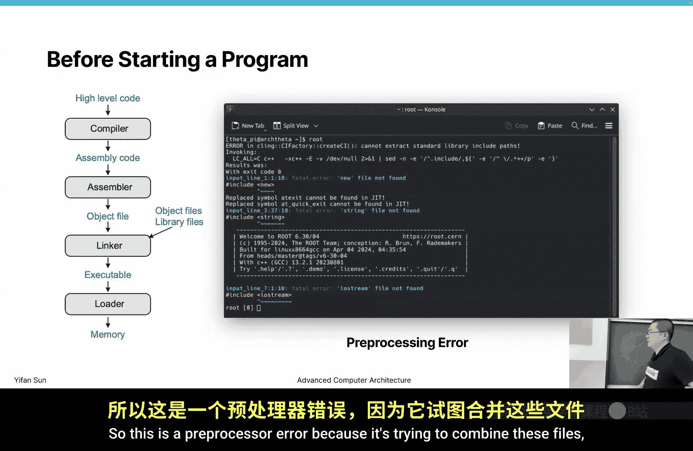
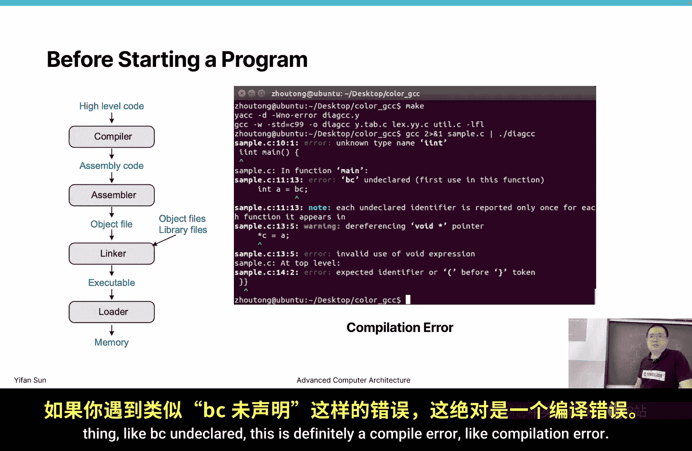
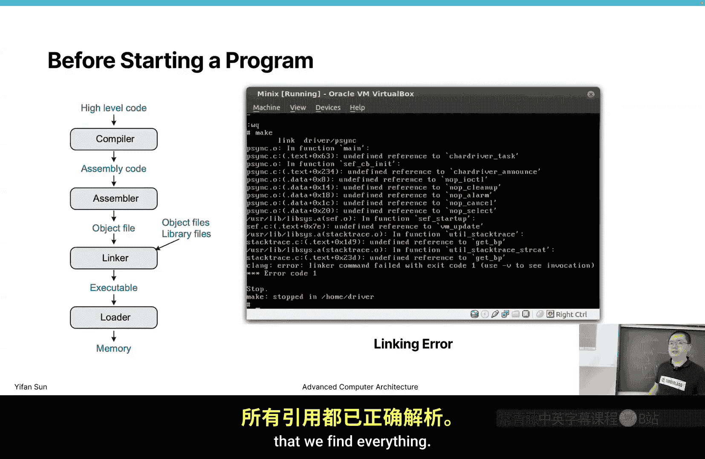
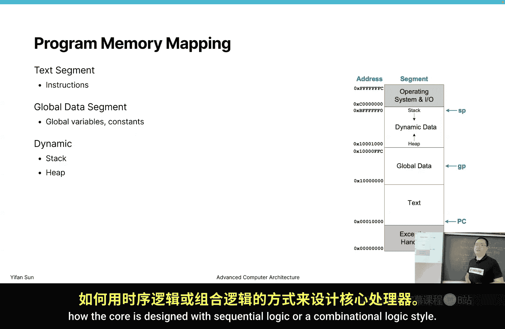

# 威廉玛丽学院【中英⚡高级计算机体系结构｜CSCI654 Spring 2025, Advanced Computer Architecture】 p12 P12 RISC-V 指令集架构 2 -BV1evfwBVEUG_p12-

O。So let's get started Last time we were talking about the binary the risk of5 Ia and how to write the assembly code for risk 5。

 And no matter if you have learned risk 5 or other type of instruction set before or any assembly language。

 it looks pretty much the same for all the languages like it may have different name for different instructions。

 but the principles are similar。 So。I assume you can like at this point。

 you know how this program is constructed that there may be some program that is very hard to write for you manually。

 but at least if I give you enough time。 you should be able to write a program in assembly format right So starting from this point。

 let's work on the binary format。 So how these instructions are encoded in risk risk5 format。

 I'm not going to cover the all the details about the binary format， it's rather boring。

 So eventually you still need to reference to the official document to understand what's the binary encoding。

 but I will just。Yeah。Try to cover the most useful part。 so risk file uses several different types。

 different types of the instructions， because for each instruction。

 you only have four byte to encode the data to encode the instruction for some instruction。

 you have immediate values for some other instruction， you don't have immediate values。

 So to be able to support all these instructions in different to support all these instructions in only four byte sites。

 you have to reuse the site。 Then if you learn the old school C style。

 this is typically represent in a union data structure。 but in more advanced language。

 we do not use union anyway， which just。When we decode。

 we just simply have multiple like different fields there， like duplicative fields there。

So like for example。I know in or disassemble in or disassembler assignment that eventually you're going to write a disassembler for risk 5。

 For example， in R type， we have Rs1， we have Rs2 right then there's only Rs1 Rs 2。 but for i type。

 there's no R2。 So you can just keep R2 there then just don't use it in case it's i type just have all the possible field then to have astruct that named as instruction。

 then you cancode deco is a process that converts from the binary into the instruction。

 then you can also print then print means you print from the instruction to the decod instruction。

 astruct into a string so that you know okay， we printed this line。

 it's exactly the same as the original instructions。So looking at the assignment forward。

 I think eventually you are going to work on a disassemble disassemble assignment after the disasseble disassemble assignment。

 you will be working on a emulation assignment。 So basically。

 if I give you a binary format of the code， you first need to disassemble the instructions。

 then the instructions will be feed into emulator。 the emulator will mimic the behavior of a risk five core and generate the result Okay so then you need to understand this binary format so that you can deded and use this field this information to recreate the behavior of a risk5 core。

So there are four different there are six different types or。For careful for。Categories of types。

 right， for R type is mainly for registers， and I type is for immediate values。 S type is for。嗯。

It was ask， B is for branchnch。B is for conditional branch， Cha is for jump。

Let's look at the examples。 I don't exactly remember what is the S type。

What's the essay instructions？Like I think we have as instructions before。

 So let's look at the examples how this encoding is done。

 So this encoding is theyre all done in this way， right。

 So like certain bits represent different things， right。

 So this op is 0 to 6 is the lowest bit in this 32。32 B range。

 So you need to take4 by4 B number and rearrange it as 32 B as a 32 as a 32 B number， right union 32。

Then you need to start to extract useful bits from the binary。Let's look at what's the R type。

 R type has op as 7 bit， which this is up。 typically in other languages， is called op code。

 But sometimes you can also combine function function 3 and function 7 as part of the op code。

 So this op is basically encoding tells what instruction it is。 For example。

 for both add and subtract。 Then the op code is 51。

 This is just by definition that they define 51 is。Is add。 So why they use this number。

 It's actually because in this op code， this op field is not only encoding 51。 this single number。

 They're encoding some extra information， for example。I know in risk 5。

 they have this rule that if it starts with  one1， we know this instruction is only 4 by long。 Now。

 if it starts with a certain sequence at the beginning， it can be more than 4 by long。 Okay， so this。

 the first a few bit determines if it's a。Like four by the instruction，8 by the instruction。

 12 by instruction or even more Okay， so these are the encoding value。

 That's why they select these trivial instructions。

 but they select a not that small number so because they're internally encoding some information。

So then we look at op。 We also need to look at funk 3 and funk 7。 So we see all of them are 0， right。

A later on this one is 32。Right， so one has a wonder。 this has32。

 So then once we look at these three fields， we know we can identify what instruction it is。

 Then we need to look， perform a table， look up。 We need to look up in the table。

 So this is the risk5 table that I take a screenshot from the official document。

 Now this is the RV 32 I base instruction set。 And you can see those are the whole instruction set。

 and are only these instruction。Right。There are only not many， I don't know how many of them。

 but probably less than 30 of the instructions here。So these are all the instructions。

 Then we first look at op， right， So you can see the ops are not very different。

 There are only a few options，1，1，1，0，0，0，0， this1，1，1，0，0，1，0。Then 1，1，0，0，1，1，0。

 done many options here。 So in this case， we first need to identify what op it is。

 So we're looking for this up， that is 1，1，0，0，1，1，0， right？ So then look at this。This table。

 we need to look to find it。 You can find where it is is here， right， You can find it here。

 So you know， it's either add sub shift the left to shifter shift the right is shift right here。

 Shi the right。 No， it shift the right is not here。 Shift the add sub S L L S L T。

 Those are the instructions here。 So then we need to look at。This funk 3 field and funk 7 field。

 right， So look at fun 3 field， we see this one is 0，0，0， and this one is 0。All0 and there's a one。

 Then we know， okay， this one is a sub。 This one is an add。 If0 is an add。

 just by checking this three field， we know what instruction it is， right， That is or op。The monic。

 that we can identify identify the monic in other language。

 I would call the whole thing as an op code。 But in risk 5， they define something as op function 3 7。

し。I think risk five is really try to make it really tight and their includingco is really tight。

 so they have done something really。Not that decoder friendly， okay。Ws okay。Now。

 by looking at these instructions， we immediately know this are。The add and sub instructions， right。

 Then we need to look at what is R D， What is R， S 1 and R S 2， We know those are 5 bit numbers。

 So when we have 5 bit， how many registers we can encode。We can encode 32， right。

 So at maximum is 32， then。Remember last time we were talking about the registers and they have two different names。

 one is a more architecture name that is always x something。

 which is the other one is more assembly name， which is S T or other there's other names you have the other table。

 Now you can look up for if that's that's the number that's something of the register name right you can convert from a few digits into string by by doing several layers of table lookup。

 So this is the R type。 R type it's probably the the most straightforward type。

 probably the only challenge that eventually you will encounter。

 It's how to grab the right number of bit out of this instruction。

 But I think after a few try with a few like shift operations with a few like by bytewise and bitewise or by pretty much sure you can extract the right bit out of the instruction。

ok。So this is R type。 Then let's move on to see other types。 I types。 I type stands for immediate。

 So the big part is occupied by 12 bit immediate number，So in this immediate number。

 you actually need to slide look at what the immediate number represents。 for most of the time。

 the immediate number is just choose complementary。To complement encoding， so。

We can write in active number。 We can write in positive number， where we can write in hackx number。

 Then the decoder can。The decoder can。Process it。 So there's a question that if you are decocode。

If you are。Printing your disassembling， You're printing the instruction in what format you need to print。

Then I have no certain answer。 So the solution you need to do is to find。

To check the official asble disassembler， you don't need to check the original code。

 but just use the original the official disasseumbler to disassemble this file。

 just keep consistent with the the official disasseumbler the only problems of disassembling the code in a simulator is to make sure that we understand things correctly right。

 So if we can print exactly the same thing， no matter if you print in hacks format or in an active number is okay。

呃。Yeah， and then this one， like for something， something like this one shapeshift right arithmetic。I。

 so we actually， we define that only。Certain range of bit matters。 There's a range。 So， for example。

 if we shift the right， there's no point of shifting more than 32 bit，3232 times， right。

 So that means the upper bit， the only the lower bit matters， the upper bit， we don't。

 We ignore that part。Okay， then we have S type。Oh， S is for store。 Now， finally， remember。

 S type and B type。 B is for branch。 as for a store， then。It is。Develop in this way。So it requires。

It's， it actually requires two registers， but both of them are source registers， right。

 So we're storing a value。 One is storing。Sa in this case， T2 is storing the data。

S3 is storing the address。Okay， so there's a definition say which one is which one I still need to look up to know which one is which one。

 which one is the data， which one is the the address you cannot invertted Now other other than these two source registers。

 we actually need an immediate number to say to give it an offset that although it's written the address is this way and we're doing something like at3 minus-6 right-6 and that's the actual address where using in this case。

 this minus-6 is stored in here in this immediate part and in this immediate part。

Now how it works is you need to take these two immediate part out， then combine them together。

 Then that's the number。 Now you look。You are eventually looking for。ok。

To combine these two together， then make a number。 So why they are designing in this way is mainly to keep it as consistent as possible。

 See if we're talking about Rs 2， they're all at the same location。 Rs1。

 they're all at the same location for RD， we don't use RD， right， If we don't use RD。

 we can use this space for immediate。 So they want to keep a little more consistent encoding。 so。

I would say some eyesi is designed in this way， some Ii is designed in a way that you say is they don't consider this alignment。

 they consider like， oh I want to for easy decoding then they put all immediate to the end then even if we have different format。

 we don't have the destination register。Now we just do something that if it's different type。

 just put arrange it from the beginning to the end。

 So different Is different define things in different ways。Okay， then also we have a。

This is icece type。 Yeah， it's all the same thing。嗯。Now we also have a B type。

 B type is for branching， conditional branching。 then conditional branching。Is。

It's even more annoying。Now I don't know if you understand this part。

 It took me really long time to understand what exactly is going on so。What's going on is。This bit。

Is for the。The most significant bit。Of that immediate number。

Then we need to take this speed as 11 speed。Okay， in that case， we have the。The blue lighter，0。Okay。

 then we have the gray lighter 0。Then， we have the。bl录。Daker part。Of a few zeroes。

Then I have the gray Docker part as 10，0。Okay， so this is how it works。Yeah。You you get it。

 You just need to shuffle these bits。A little bit here。So I checked why they want to do that。

 It's mainly because they want to guarantee that this bit can。

 the most significant bit here can represent the。And also， this bit here can represent the。

Sign of this number。ok。2。This one， lighter gray。I actually don't know what's going on。

It is the the designs like that。 Now we just just follow it。Now I I think if we're not a designer。

 we really don't know what happened in their process。

 but if they intentionally design something complicated。

 they must have probably experienced something。Something that we don't know。Okay， this is the。厉体。

Okay， then I intentionally leave out a type that is the U type and J type there are。

They are relatively easy。 Then they also have this type of things， but you。

 you understand what that that mean。 So it's basically 20， then grab this part， then grab 11。

 then grab 10 to 1。 Okay， so ray arrange。bits。The u type is very easy。Okay。

 so this is the binary representation for the RV。For the RV 32 I instruction set。能。

I think it's not really hard to understand many language here， many instructions here。

 although there are something that you still need to look at， which is L U I， which is A U I PCC I。

From the examples I never used these instructions then。I want to just briefly mention these things。

So。F， this is a relatively。Like later added instruction， it represents the memory ordering。

 So it kind of sets up the core。Configuration， so you can exclude in this mode in the external mode。

 So for now， we don't really need to worry about this part。

The Paul and e break are more related to debugging。Okay， and this is not something that we useful。

 but only the E call here is something I need to。呃。Mention because we use it in our code。

What is E call， And you probably heard of something called I O C TL call when you are learning opening system就 or。

Opening system calls。 So what does not mean is basically， we write a program in user space， right。

 all most of the program is excluding in user space。 and part of your your computer。

Con is controlled by the opening system。 The operating system can perform some options for you。

 For example， right into a file， then。Probably something like kill another thread。 start a thread。

 or sometimes allocate a page， allocate a memory page。

 although things cannot be done by your user code， not only the opening system can take care of it。

 It's a separation of user mode and privilege mode so that the opening system can keep very stable and keep your whole opening system。

Like safe and not easily corrupt it。 like you cannot write a program to detect another program's information can change。

 can modify the data of another program。 like in Windows 98， it was 98。

 it was possible if Windows X P is not possible anymore。

 So its opening system will take care of many these operations。诶。

Take care of many of these type of operations。 Now how your user program。

 how your application can request the service from the operating system is by this E call or similar instructions in our Ia。

 So E call， you can see it's a super， super simple instruction， right。

 Its only have op that has nothing else。Right， every， everything else is 0。 It not even encoded。

 Only it has a certain。Op。And when this and so that means when you write assembly code is only E。No。

 or print。Now， there's a hidden op print that is actually a0， but you don't write it。

 So a0 is a number and a0 number is a number that defines which call it is。

So your operating system and your hardware need to make the。Areement on what this call。

 how this common number maps to the service that your operating system can provide。 And even your。

 your hardware doesn't really need to care about that。 It's all your operating system definition。

O so呃。I， because since we want to write。We want to write。Because we want to write。Emailulator。

 but I don't want you to implement a Linux open system。 So I many， I made up two e numbers。

 I say E 1。Is print， print string。The equal2 is print。呃，integer。Then don don't take it literally。

 read the documentation。 I don't exactly remember。 Okay， now equal 3 is read。From。STD in。Okay。

 so something like this， so so that you can perform some very basic input and output operations now in your emulator。

 and you don't really need to implement the whole print add function in your Linux opening system。O。

 question。A0 is a register。 Yeah write to a0。How。し错。Yes， you first need to write into a0 the number。

Then it will perform the Ris call。 then about where to get this number。

 where to get this strain is really by。A definition is probably just， you can just store it as in a1。

Okay， now a one stores for your number。 Now a0 stores for this number， okay。

So Eco itself does not have any openprint， but it has some implicit openprinter。Okay。

 so your opening system will take care of some operations。 So our emulator will perform a very。

 very simple。Opering system that only takes care of these three operations。Okay。

 so last time we also talk about。And we， we need to come back to the instruction a little bit more to help you start your。

Email later。So when you start your emailulator， the most， the very important task。

 a very important task is to lay out memory。 So consider how your CPU runs a process。

Or how your opening system starts a process。能。It's actually in this way。So we have a address space。

We have a address space that is allocated for this program。 and we prepared address。

 we prepared the data in this address space。 Now put in the instruction in the right part。

 and put in the data the constant in the other， the other important part。

 Then we tell opening system or market as this processor ready。 It will tell the CPU that this。

Process is ready to be executed。那。Today， our computers are designed for multi thread excs， right。

 Does that means even it's only one core。At one time， it can only exclude one thread。

 but if you consider it run for a very long time， it can easily support many， many threads。

 How it works is basically by picking up the state。

From the memory system and start to execute from there。 Then when， when you want to。

Store the data when you want to swipe to another process。

 you just simply store the current state into the memory and pick up from another one。 right。

 So starting a process is basically by the same process。

 you prepared content of the prepared memory state of the beginning state of your program。

 The market is ready。 So eventually your CPU will be able to pick it up。Okay。

 so we're going to directly gradually talk about how this memory is organized in different cases so that it can serve as the starting point for your emailulator。

And how， so we start with how a function works。 Now。

 when we say a function is basically it's a small piece of code that there's always a color and a call。

 right， So a color will call call。Another function。 In that case， this is a function。

 Then Col always have arguments。Return values and is internal temporary variables。 right， So we see。

 we try to see how these things are organized in。In the memory。

Then I'm pretty much sure you know this concept， like even you just learned the programming like C plus+ or Python programming。

 you have learned this concept called stack and when we talk about algorithm。

 we write we draw the stack from bottom to up when we talk about memory organization。

 we typically organize this stack from top to bottom。Let's say if we're executing a main program。

 then we when we call this function a， then we add a frame for this function called a then this frame will store some temporary data thats related to a right then。

啊。Then we call a another function B。 Then we grow the。Stack by adding another frame。Now。

 when this function returns， we just simply remove this frame Actually， we don't even need to remove。

 It's only a pointer thats pointer pointing to the bottom。

Well someone will say it's the bottom of the stack。 Someone will say it's the top of the stack。

 it actually means the same thing。 So a pointer is pointing here。

 So if you we this function returned， we simply point this pointer back to this position。

Right to the to this， the end of a。 So the data we we don't need to overwride the data。

 So next time if we allocate， we just write new data there。

So rather you can consider this is a very unsafe method of organizing memory if you have a array that is allocated in this stack frame and you happen to access some negative part or some positive part。

 you maybe be actually access modifying some data that belongs to another function that's basically why modern languages like Python and go eliminate this feature that you can access。

Like you can do this pointer and calculate the offset relative to a pointer it's very hard to debug it's called memory security problem。

 but it's not really a security problem， it's a debugging problem debugging difficulty problem。

So when we return， we reduce the stack frame。 Now when we call another function， we grow。

 now we reduce， now， eventually go back to me。 right。

 This is how we call a function and how memory is organized。

So then how risk5 is handling this is actually you need to know the calling conventions the calling conventions is codetermined by the program language by the ISA and by the hardware that you're using okay so for example。

 if you' are using C C may have a calling convention Now if you use go go may use another calling convention these calling conventions may define。

 say where we put the argument do we put it in part of a memory or do we use registers to passse the argument around。

嗯。Where do we put the return address Sta pointer is part of the stack or is part of the。

Part of the stack or is part of the memory， or it's part of it's in a register file。 Now。

 where to record the colors context， who to record what type of context is all defined by a calling conventions。

So what is？嗯。Rch5 calling convention， at least if you use a reach 5 and you use a standard compiler you will try to respect this try to respect this convention。

 although if a compiler or a program language is very strong and have a strong opinion say we don't want to use this calling convention。

 we put everything in memory and we don't use register to pass arguments。

 does that work and it totally works。 it's there's no problem but like there may be something that is in the implementation that is kind of optimized for this calling convention。

 So you just don't use this type of implementation so by looking at these names。

 we have some special things for them we have this thing called return address and we have stack pointer then we have tempers saved register frame pointer then function arguments and return values and function arguments。

I save the registered tempers。 those are all related to calling conventions。Right。

 so clearly we can say。That it has function argument and return values， right。

 So that means risk 5 encourage you to use registers to pass arguments， not only using memory。Okay。

 and there's also a hint that the return values can be more than one， but should not be more than2。

ok。I still， if you want to develop a language that supports more than one problem。

 more than two return values。Then you need to break this calling convention and develop your own。

 Okay， either user memory or you can just say， oh， I'm fine with using a2 to a 7 also as return values。

 Now， even that you only have8 to return values。 What about user wants to write more。系。

So risk5 calling conventions are 80 to7 are function arguments，01 are return values。

We'll talk about the S and T values later。Now you can see there's a saver we explain what is the saver mean。

So let's do a simple function call and thiss a simple function call。 Then we call a simple function。

 and there's no arguments and there's no value。 What do we simply do is to call a JAL。

The jump and link。Where we want to jump， We want to jump to this simple。labelbel。O， so。JR。

那 when we call。呃When we。When we exclude this line of code， we jump。But we shall register。

Right what's the register is RA RA is the return address。

 That means this JL is actually doing a hidden operation Now it' storing the current PC or the PC of 304。

It's storing this PC into the RA register when we're calling JL。Okay， so that when we return。

 we know we're returning to three or four。Okay， returning to the original point。

 So although in this function， in this assembly code， R is not input。It's not an input。It's not。

Output。Register it will write into this register。 So this when you consider hardware design。

 you need to consider， okay for JL type of instruction， you need to write。

 actually need to write two registers back， right， need to write two register back into the register file。

 What are the two registers。 One is R。 What's the other one。是 that。啊。诶。No， it。Well。

 that's something that we also need to consider， but no， it's not not the stack pointer it's the PC。

For every instruction， you need to write a PC back。For regular cases。

 it will just grow by4 by4 by4 by four jumps， you need to give it a certain number to write back。ok。

So then what about if you have some arguments now， when you have some arguments like 2，3，4，5。

 then simply。They想 move。Move instructions， right， A D DI， and we're basically at moving 0 to 2 to 8。

0，32 a1，4 to 82，5 to83。 And then we do jump and link right Now after we do jump and link。

 we we jump to di off sums and we do some operation decide all the operations you can see in this case。

 or arithme intensity is actually very high because we only process data from the register and we don't really need to access memory。

This is an advantage of using。Register as arguments passing， Then you reduce a lot of memory access。

So it can be considered as an optimization， but it definitely also limits some sort of flexibility。

ok。No。We calculate the result。 then eventually the result is stored in a 3 and S3 and so this result is stored in S3。

Then eventually， we put S 3 back into a0。 Now a 0 is the return value Then we can do。Jump。😡。

We register and jump back to RA。 Now we know a0 stores the return value。 At the end。

 we we put the a0 back to a 7。 Then we continue to use that。

I guess your question is why not directly write to a0 right？No， okay， okay， this is my question。

 Okay， you'll go ahead。我就是。That was the other question。 The other question was there's more than。呃。

A arguments。Does it use light temporary restrict， Does it push it up the step。

It should be go to the slackla， go to a memory。So it's still calling convention。

 And so what you how you define that， right， you can use as register a little bit。 You can use some。

 if you change your calling convention， then or you can just directly go to memory。ok。

So definitely you need to consider some languages that allows multiple returns。

 unlimited number of return， then in that case they have to rewrite the calling convention。Okay。

 there's nothing forbids you directly write to a0 and it's a better thing。 It's just。

 I want to introduce。 now， this is a violation。Of the calling convention。

 which is a violation of the calling convention， because we're saying here。In the color。

We cannot modify S 0 to S 11。Then but we can modify the temporary registers。ok。你。

We can modify the temporary registers。 then you must ask。

 what if it's calling like my function is calling another function and another function the my colleague is modifying T T is value。

 right， So how it works。Is like the next one。 But see here， I just want to show you。

 it violates the rule that we shouldn't modify S3。ok。By the calling convention。

 So we need to avoid modification to add 3。 Def we can directly write to0。

 But I want to just as a dumb example。嗯。To show how typically this type of problem is fixed。

This is how this problem is fixed and there is a little bit overkill here。In this case。We consider。

Where color has some situation How has something， right， have a0， A 1， A 3 are used and I 3。

 we want to use a 3。 or we also use want to use T 1， T 0， right。

 So if T 1 and T 0 are also being used by my color。I'm modifying data。

 and I don't want to interrupt my the execution of the。Color。

 I don't want to modify the executionion of my color。 So it's better。But I still need to use T1。

 T0 and S3。 So what we can do is at the beginning， we can store it in the stack。

So that means we move the。SP pointer。We grow by 12 B and 12 B is my stack size。Okay。

 so the grow is by reducing because it's going downwards， it's going to a smaller address space。

Then we move our stack pointer。 remove our stack pointer by 12。 Then we store。S P S P S P。

 you can see why these 4，8 are used here， why these offset are used here。 We know0 represents T 1。

4 represents T 0，8 represents S 3。 Okay， it's a stack frame memory layout of putting the different things at different location。

Now here in the middle， we didn't change anything。 It's still the regular logic of this program at the end before we return。

we。Restored， we load the data back to the register， so recover the context for my color。

 so my color is not interrupted。Okay， now my color is not interrupted。

 and my color can do whatever My color just feels nothing changed。 my the register。

The register state before I call is the Reg state， average I call is to the same Reg state other than a0。

Okay， right， then at the end， before we return， we reduce the stack。

Frame that So you see what is actually happening return is something like this， right。

So or the most important part is this to line in code so we simply reduce the stack by moving the pointer back。

I12 bite。Now we return。 Okay， so that also answers the question that S P。SP。

 the modification of S P is not a side effect of JL。Right， the the。

 the modification of S B is not side effect of JL because。

Here we need to explicitly modify SPP because your core doesn't really know how large your stack frame is。

ok。😊，So question。On the sub line versus as result equals F plus。Which one S 30。So t 0 minus t1。

 then we store the result back to S3。It's modifying at3 at this moment， but we recover at 3。right。

 so where we can modify， but then we recover so that color will fill as if it's not modified。ok。

So then you think this may be。Over killingll because store load and store are not free。

 They take time。 Then any memory access is expensive。 We want to reduce them as much as possible。

In that case， can we reduce some of the stores load and stores so that if the color is not really using them。

Now， we just let the colleague to use it。In this case， Na risk5 make this definition， say。S 3。

If it start with an as， is for save the register， that means means。

The colleague should not modify it if the colleague needs to modify it needs to recover it。

For T registers。The color should assume that the collie is modifying it。Okay。

 so that's why it's called temporary registers。 So for those registers。

 those are changed really fast。 And if you there are really some useful information there。If nurse。

If there are some really useful information before you make this call。

 you need to save your T register into S registers。Okay， just if it's an S register is safe。

 if in T register will go away， you think it's not important feel free to overwride。Now。

 in that case， this is too conservative and the overhead is too high and we can reduce it to in this way。

 we can reduce the stack to only4 by and only stored as  three into the stack and is eventually recovering from。

Recover S3 from this stack。ok。So compared to the previous example， the only difference is。

We don't store T， T0 and T1， we only store S3。No。You may also think， oh。

 this is also why you need to even store S 3， right， so。Definitely you can write in this way。

 No problem。 It's just a over killingll example to show you these relationships。Okay。

 it's totally okay to write in this way。Okay， just skip S 3。At all， and only use a2， a1。

And A and also T registers。ok。So then immediately， I want to write in this format， then。

But I know you probably have this question。Okay， so for nonly functions， nonly function。

 it means that。This function is called by some other function and is also calling some other functions in this case。

If you， if you' are a leaf function， then you don't really need to consider which one is saved。

 now for you， everything is saved。If you are not calling any other function。

 you can use any registers as you want， but if you need to call other functions and you are called by another function。

Then color need to save some registers and col need to some save some other registers。

 So if you are modifying R as。As 11 were even using RA， then you should recover it。

Whenever you are returning。ok。So the definite rule is。Written。In this table。 So what registers。

Or who's responsible responsibility， who should maintain the state state of which you register。O。

So another way to understand the SP， the SP is pointing at the bottom of the stack。

 then when you call a function you grow， then you grow to the bottom。

 then these are some register state， you need to save RA you need to save as register as you also need to save and the local variables that is if it's beyond the capability of what the register can handle。

 you need to save into stack。Okay， then talking about this。

 then you definitely want to hold as many variables as possible in the register space。

But sometimes it just not enough in this case， this is called register spilling that you are spilling the registers。

 you want to use more registers， but you don't have enough registers to use your memory to temporarily serve serve as registers then the it's definitely。

Not very efficient and add lots of overhead because you need to accessing memories much slower than accessing register。

 but。Then something you have to do to guarantee correctness。Okay， for CPUUus。

 we don't talk register spelling a allowed because the register are not allowed anyway。

 but for GPUus， register billing are more common because。GPU。You can consider。

For each thread there are 256 registers， then sometimes even that is still not useful。

 not not sufficient， so in that case we do registered spelling by using part of the memory to serve as the register。

Okay， and so at the end of risk 5 I， I want to talk about program memory management。 this part is。

Not strictly related to risk 5， pretty much every program that is running in a uniqueX environment is organized in this way so。

The question is what happens before you start a program？Now， at the beginning。

 you have high level code。 you writing C plus right or C。

 you have a compiler generate assembly code and asemr。

 Then you generate lots of dot O files in that case。Then in that case。

 you generate lot of dot O file。 You have object files。

 Then dot O files are only have the information related to the current file that is being compiled。

 So if it needs to reference another file， it needs this linking process。So for example。

 if you are using a function， say I'm calling a function and this function is only in my header file。

 but we don't really know the implementation of another。

 we don't really know the implementation of another of the function that is to be compiled in another dot of file。

 Eventually we need a linker to combine them together。

 So in my program I simply do say I want to just be some more explicit here。 so。

We're write of program， something like。Include。STDIO。Dot H， right。 then eventually in our code。

 we call print of。三证。Right， so at the beginning， we first compile a dot O file。This do of file no。

 okay， print F， print F I know what's the signature。

 but I don't know the implementation because I don't have the implementation of STD I O。Right。

 so eventually， I will leave a。这。I would know， okay， here， this is printf。Where to find it。

I will leave it later。 So I leave it as a placeholder that I know print enough。

 but I don't know where it is。 It's only a placeholder。At the linking process。

 So there are two linking process， static linking and dynamic linking。 static linking means。

From going from dot O to E， X E。Well， Linux doesn't have EIT， but just exccutable file。 Okay。

 then we need to find the reference for printf， then put it in one exccutable file。然之后。

Stical linking process or compile time linking process。Or it can even in the EXE。

 it can be a still a placeholder。If it's still a placeholderer when you execute it。We executed。

 you need to find the dynamic linking libraries。In Linux is dot a file or in Windows is dot DLL file。

 And that at the run time， we need to fill in this place holder to get this。Implementation。

 eventually， the linker， no matter is at executionion time or at compile time。

 then will find all the necessary。Libraries， right， well find all the necessary code， binary code。

 And then eventually the loader will load the program into your memory。

 set up the initial memory layout。 then for your CPU to pickup and to exclude first line of code。

 So this is the process。 And actually， there's another missing process。

 if you if we're slightly more specific to C。 then in C or C plus plus compil compilation。

 there' are three processes。 other than compil compiling and assembling。

 there's another process called preproces。 So preproces basically simply detects everything that starts with a。

Pot sign with a sharp as a sharp sign， then。冇。Reorganize the file for example include is simply replace a certain replace right just remove this line and simply take the whole file content and put it there or some define macros or just simply find those macros and replace with the strings。

So when you write a。C program。 then you probably will get errors。

 Then you need to know in which step this error happens。 For example， this one。

Include stream and Ios or include I O stream file error error stream file is now found。

 So this is a preprocessor error because itre trying to combine these files， replacing these files。

Now， if you get this thing like B undeclared， right， this is definitely a。Compile error。

 like comp error。

能。If you see something like undefined a reference。Undefined reference is linking process that。

 you know oh， we leave a placeholder for printf， but I cannot find it。

 So that's an undefined reference。 this is a linking error。 So when you find linking error。

 don't try to find syntax errors， but try to find try to see if there's something wrong with your completion configuration。

Right， configuration can command。So this linking error。 then after this。

 we assume we have all the code that is necessary that we find everything。 and we need to place the。

Data into the place the data in the the data in the memory so that your program can start to execute。

 and this is a typical layout of your program。So there is something that is common。So for example。

 we have this thing called text text。 remember last time when talk about the assembly file。

 we start with at text。 that means this part is written in the text section。

Right then this is in the text section， then text section is directly placed from this particular address。

Right， remember last time we were having this PC as something like 1，0，0，5，1，0，5。0 c or something。

 right， so。I don't exactly remember the number， but that is a typical PC。

 So it's starting from this point then you off offset by 50 c。They amount that your instruction。

 So your instruction is this part。ok。Now what is global data， Global data is for global variables。

 where sometimes it also stored something like strings that strings is used by your whole program。

 so some。Commonly used the data this stored in。The global data part。No。You have this。Dynamic area。

For dynamic area， you have two parts。 One is the stack，1 is the hip。

So what's the difference between dynamic and。Star can heap。So I， I can give you a few examples。

 Then you tell me if it's allocated on stack or hip。嗯。呃。变去。诶。50。Stack or hip。Stack， right。Int。

Star a equals new。in。50， is that right syntax？Stack or hip。Heap， right。人。in。A star。

 star A equals mylog。200。Stagger hip。Heap， right， It's also hip。 These are hip。 This is stuck， so。

Basically， by the time you compile。When you compile a function。

 if you know the size of this variable， for example， you know there are 200 bytes for this case。Then。

It's in the stack。 In this case， this number can be replaced by a variable。 right。

 If it can be replaced by a variable， then is part of the。Heap， so when you allocate on the he。

 you need to eventually free it。 Now， if it's allocate on the stack。

 you will allocate and disappear with the grow and shrink of the stack frame。And。Just be careful。

When you write a program。This is a funk。诶。😊，Okay， then you write。S equals 2。Astruct。

 that say namelystruct us。呃。Data。O， then a。D equals one。那 return。S。你识识 ok。Well。

 the staff will return us。This is okay， right， You're returning value because the S itself。

 the whole thing will be part of the stack in this case。

You can see there actually creates a challenge for reach 5。

 how you can use one register to represent these data。Right， if this is a。Whole data structure。

 it can be actually quite large。喂。快说。Okay， that's the， that's the next step。 That's the next step。

 Let's start from here。 So if you think this one is 200 B。富士站铺。That means when you are returning。

 you are doing a 200 B memory copy。RightFrom one stack frame to your to the call stack frame to the color stack frame。

When return us。就谁比这个 c equals a。Then this is actually a memory copy from S to C。

 It's a memory copy from one stack frame to another stack frame。Yes。What happens if you do。

And on this one， I person get the address of us。What happening。应该这。yah so。Your stack frame。

 This is your color。Right， then this is call。This is a data that is on stack。 So S is here。Right。

 when you return， your S goes back to this point， this S is。Not valid anymore。

So returning the value of the， the pointer of us。Is not a valid operation。人时。Or C++。Okay。

 because this part will be eventually overwritten if you call another function。ok。

So another function so this this stack pointer will shrink， then later on will grow as it grow。

 it will call another function it will overwride with some garbage data。O。😊，意思。This is not okay。

 in goal。This is ok。Why Gos is trying to do something smart。 It will detect this pattern， say， oh。

 you're returning the pointer。 Then you are going to use this data somewhere else later。In that case。

 this data is allocated on the。On the hip。Okay， so goal is just trying to be smart on this thing。

 Now C is。C want absolute control。 If you know it's on stack， It's ont。

 Go is a little bit smarter that can automatically allocate on。On the heap， in this case。O就。Yeah。

So I sometimes find also find its a problem for me to optimize performance in go。

 because if you allocate too many things， you will create。Garbage collection overhead。

Now in this case， you may feel， oh， this is on a stack and there's no garbage collection overhead。

 then eventually it's actually very bad。ok。So those are stack and he。

 It's a very important concept for opening system， how to manage memory。

 But from the perspective of your core is basically。啊。Addresses。They're all addresses。 The。

 The court doesn't really tell what address they are。 if you want me to load that address。

 I will just load that address。 Store to that address will store back to that address。

There's something that I also didn't。Say here， you find a slight problem that。

All all my PC starrofo 10，0。 What if I have another program？Another thread。24。我。Yeah。

 all the all your program should start with this PC。 If your operating system defines。

 this is the requirement。ok。All your programs start from this PC。 then so you have a。

You have program one。Since we have like 20 minutes time。 And this is the last slide。

 Let's talk about this。So your P1 will have process 1 will have0 x，0，0，0。1，0，0，0。

This is your first instruction。 P2 also use this address。 So when we load P2， are we overr P1。Now。

 definitely we cannot allow that thing to happen， right， So how it works。Is。

This is handled by virtual addressing。嗯。So everything can be solved by one layer of indirection。

Right， so。We really want to use this address。But they shouldn't be actually mean the same thing。

 they're pointing to different things。 so then we say these are virtual addresses。能。嗯。

Most of the system is organized in this way， this is P1。

 so you will have something called PID process ID。那 process I。This let's just say it's process I 1。

 and this has process I 2。 Okay， so then in your in your computer。

We have something called a page table。Now， pagetable can have many entries。

But at the beginning or the most essential parts are these three fields。PID。Virtual address。

And physical address。Those are the most important， three fields。我放。Of a page table。 So in this case。

 we write it down as P I D 1 virtual address 0 x 1，0，0，0，0。

 is actually pointing to the physical address of 0 x。1，0，0，0，0。 Okay， then for P I D 2， this one is。

Still the same thing。 and this is 2，0，0，0，0。 So in a memory。

 we still actually store in this location。And this location， But when the program will fail。

 it's actually at this location。ok。And that means。When for every load and store。

For every load and store。And also， like fetch a。Instruct， you need to do address translation。Okay。

 you need to translate， you need to take P ID and the virtual address and to find what is the physical address and you are actually sending physical address。

The the right physical address into the memory system to get the right data。Okay。

 so there's a address translation。 Then because we have this physical address。

 then this address translation process allow us。A lot of flexibility。For example。Yeah。

We can't have a virtual address。Now， what if？We have a。4 gig of memory。

But one program wants to use 4 gigabyte memory， another program also want to use 4 gigabbyte memory。

Can we allow it then you probably have heard of like something called swap memory， right？

Or what does sb memory mean is like register spelling is when the memory is not enough。

 we spill into the hard drive。So what does mean by spell spill in the hard drive。

 we will never spill these type of addresses， Okay， these are instructions are super important。

 but for somewhere in the hipap that we can is maybe we're not using it。So in this case， we may say。

It's not here。Its we cannot find it。 whenever we cannot find it。

 this is something called a page fault。A page for is a system interruption。

Then when this page file handles， then your opening system will need to maintain another table。

They say， oh， this virtual address for this P ID is actually in hard drive at that particular location。

Right， so then， oh， this page needs to be accessed。 Then you will find a victim。For example。

 this one is the victim。 and find this as a victim。

 We evict this one into first write this one into the hard drive and bring this one back to a location。

0ero x。1，0，0，0。 Okay， bring back this page to the main memory。 So right memory is already very slow。

 right hard drive is even slower。 So that's why if you run out of memory。

 probably if you use a Mac or any computer when you're allocating too much memory。

 your computer becomes so much slower。 but still， its still working， right。

 So that is a sign of swiping。 So sometimes swiping can be managed in a really elegant way that we don't really need swipe a lot because we guarantee we that the part of memory we use is still in the memory。

 but sometimes。You suddenly accessing some part that you don't commonly use。 now。

 your whole computer will get very。Laggy， right？And also。When you are dealing with this type of。

Virtual addresses。You are not dealing with every address。

 You are not dealing with every 4 byte or every byte。

 You cannot put every byte in this table that too long。 So we need to have a unit。

 So whenever we swipe out， we swipe in， we always guarantee that we swipe this unit。

 and this unit is called a page。O， so a page then。So the advantage of a smaller page。

 So this page can be either large or small， right。So the advantage of smaller page and large page。

 They both have advantage and disadvantages。 A of a large page is。Once you search。

 you find one entry。You can。呃。You can get a lot of information， You have big courage。系。

You have big coverage， you know。You know everything within this page。

 so dont need you can reduce the number of times you do this translation。

But the disadvantage is every time you swipe out， you swipe a lot of data。

 Then the latency is even longer。 And that's a problem with large page sizes。 So for CPU。

The typical page size is 4 kilobyte。O， for GPUus。Then it can be anything。

 they they can define different things from 16 B to。16 bytes all the way to2 megabytes are possible。

So GPUs are super care about performance and much unlikely to do swapping。Okay。

 so about the address translation later on， probably there I will talk more。

 but probably will be in a more fragmented way。 So because we cannot find a lecture to talk。

Address translation as a dedicated lecture。So we're done with rate5 Ia， starting from next lecture。

 we're going to introduce how the core is designed in with a sequential logic or a computational logic。

A styleyle， okay， this is all for today's lecture。